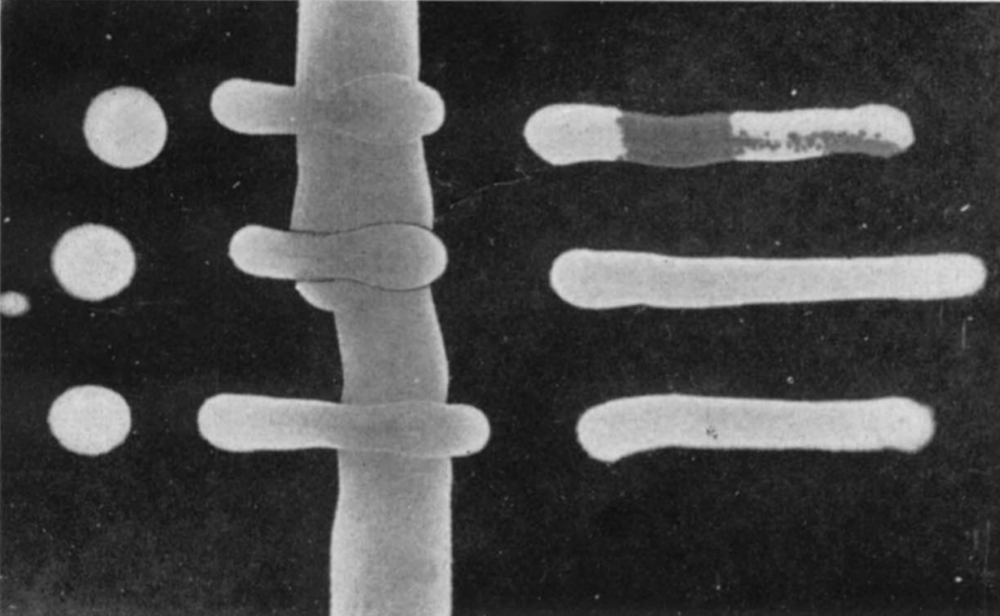

<!------------------------------------------------>
<!------------ FIG 1 - Lambda Phage  ------------->
<!------------------------------------------------>

<figure align=center>

</figure>

<b>Figure 1</b>. This is a picture from a 1953 scientific article from <b>Esther</b> and <b>Joshua Lederberg</b> entitled &ldquo;<i>Genetic Studies of Lysogenicity in Escherichia coli</i>&rdquo;. Some of the important terminology used by the <b>Lederbergs</b> included &ldquo;...<b>Lysogenicity</b> <i>will be understood as the regular and <u>persistent transmission</u> of virus potentiality during the multiplication of a bacterium, <u>without</u> overt lysis. When tested directly with the</i> <b>phage</b> <i>a bacteria culture is <u>sensitive</u> (<u>lysed</u>) or <u>resistant</u> (<u>not lysed</u>). When tested with a sensitive indicator strain, the bacteria are</i> <b>lysogenic</b> <i>(carriers of &lambda;) if the indicator is <u>lysed</u>, or</i> <b>nonlysogenic</b> <i>if not. Bacteria that are <u>resistant</u> to &lambda; but</i> <b>nonlysogenic</b> <i>are termed <u>immune</u>. The virus as transmitted in</i> <b>lysogenic bacteria</b> <i>will be referred to as</i> <b>latent virus</b>&rdquo;.  
The simplicity and elegance of <b>Esther Lederberg's</b> test agar plate is worth noting. Basically the three spots on the left side of the agar plate identify the three different bacterial strains that were also streaked horizontally across the plate. These three bacterial strains include: (i) <b>Lp</b>1s, which was streaked both across the top and down the middle of the plate, is sensitive to lysis by the &lambda; phage, (ii) <b>Lp</b>1+, the bacterial strain carrying the &lambda; phage, was streaked across the middle of the plate (second row), and (iii) <b>Lp</b>1r, a genetically resistant bacterial strain that does not carry the &lambda; phage, was streaked across the bottom of the plate (third row). The vertical streak on the far right is that of pure &lambda; phage. Unlike the abundantly growing bacteria the presence of the much smaller &lambda; phage (which can't replicate without a suitable bacterial host) is not visible unless a susceptible strain of bacteria comes in contact with it. It's also important to take note of the slight line of discoloration (i.e. phage lysis) where the horizontally streaked <b>Lp</b>1+ (middle row) meets the vertically streaked <b>Lp</b>1s (middle column). This discoloration is noticeably absent in the middle of the top and bottom rows where <b>Lp</b>1s either crosses itself or <b>Lp</b>1r. As the <b>Lederbergs</b> (1950) mentioned in their first article that briefly described the isolation of &lambda; phage "<i>...it was noticed that streaks of mixtures ...growth that was <u>nibbled</u> and plaqued.</i>"  
<b>Note:</b> Lastly it should be mentioned that <b>Dr. Esther Miriam Lederberg</b>, who discovered &lambda; phage and made other fundamental discoveries in the field of microbial genetics (e.g. transduction), was never accorded the respect or honours she deserved for all of her pioneering studies. Instead it was her husband who was awarded the Nobel Prize in Physiology or Medicine (1958) for all of their shared work.  

<!---------------------------------------------->
<!-------- END - FIG 1 - Lambda Phage  --------->
<!---------------------------------------------->

&nbsp; &nbsp; The latest project section, entitled &ldquo;OPC **Soil Ecology**&rdquo;, takes a look at soils, a vital but largely under appreciated component of terrestrial ecosystems. Most of us do recognize that it is an important growth medium for plants. However, soil is also &ldquo;*home*&rdquo; to countless other organisms, mostly quite tiny in stature. By all accounts soil **microbes** (i.e. viruses, bacteria, fungi) and **fauna** (e.g. mostly invertebrates) account for the majority (>50%) of species on our planet!**[@bardgett_belowground_2014; @anthony_enumerating_2023]** Some rosy estimates suggest that soils may harbour more than 100 million species.**[@anthony_enumerating_2023]** Each gram of productive soil is known to contain 10s of thousands of bacterial species.**[@giller_diversity_1996; @pimentel_economic_1997; @fao_state_2020; @anthony_enumerating_2023]** Even these lofty numbers may be eclipsed by the number of different **viruses** that reside within soil environments, particularly **bacteria** "*loving*" **viruses** (i.e. **bacteriophages**).**[@lederberg_lysogenicity_1950; @lederberg_genetic_1953; @williamson_viruses_2017; @jansson_soil_2023]** However, even if we remove **viruses** from the equation the number of soil species would still be close to 4 million! **Plants** would be in the minority (~320,000 species), with most soil species being either **fungi** (~2 million), **bacteria** (~1 million), or **arthropods** (~350,000).**[@bardgett_belowground_2014; @anthony_enumerating_2023]** Its a virtual "*poor-man's tropical rainforest*".**[@giller_diversity_1996]** Yet despite the enormous number and variety of species found within soils we know very little about their ecology and contributions (i.e. quantitative) to nutrient cycling within healthy functioning soils. This poor "*state of soil affairs*" is rather perplexing given that soil micro-organisms are well known to be essential to all life on the planet. They process all decaying organic matter, re-cycling much of it (i.e. chemical building blocks: **C**arbon, Phosphorus, Nitrogen, Sulphur) to the benefit of all **plants** and **animals** within the Bio**sphere**.**[@smith_biogeochemical_2015; @crowther_global_2019]** The amount of **organic matter** found within soils (i.e. 3500 - 4800 **G**iga-**t**onnes of **C**arbon) dwarfs that found in living **plants** (i.e. 420-620 **Gt** of **C**) and the atmo**sphere** (~829 **Gt** of **C**) combined.**[@batjes_total_1996; @lal_soil_2004; @ciais_carbon_2013]** This is one of the reasons why scientists are so concerned about soil conservation. Degradation of this precious natural resource, which can take 100s of years to develop, is in essence an existential threat to humans on this planet. Fortunately, decades of research has clearly shown that there are many ways of conserving and improving the fertility of soils, mainly by minimizing soil erosion (e.g. implement good soil stewardship practices such as no-till farming and other erosion control measures) and maximizing soil biodiversity (e.g. avoid pesticide use and excess nutrient inputs, restore wetlands and other wildlife habitats to minimize greenhouse gas emissions).**[@giller_diversity_1996; @pimentel_economic_1997; @pimentel_environmental_1995; @blanco-canqui_principles_2010; @wagg_soil_2014; @hopwood_farming_2021]** 

 
as always good reading!  

JCH

### References  

