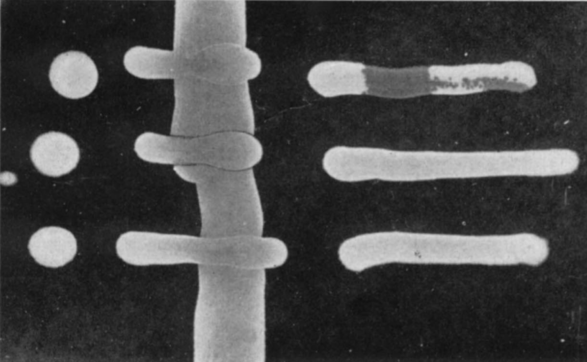

<!------------------------------------------------>
<!------------ FIG 1 - Lambda Phage  ------------->
<!------------------------------------------------>

<figure align="center">

</figure>

<b>Figure 1</b>. This is a picture from a 1953 scientific article from <b>Esther</b> and <b>Joshua Lederberg</b> entitled “<i>Genetic Studies of Lysogenicity in Escherichia coli</i>”. Some of the important terminology used by the <b>Lederbergs</b> included “<i>…<b>Lysogenicity</b> will be understood as the regular and <u>persistent transmission</u> of virus potentiality during the multiplication of a bacterium, <u>without overt lysis</u>. When tested directly with the <b>phage</b>, a bacteria culture is <u>sensitive</u> (<u>lysed</u>) or <u>resistant</u> (<u>not lysed</u>). When tested with a sensitive indicator strain, the bacteria are <u>lysogenic</u> (<b>carriers</b> of λ) if the indicator is <u>lysed</u>, or <b>nonlysogenic</b> if not. Bacteria that are <u>resistant</u> to λ <b>but nonlysogenic</b> are termed <u>immune</u>. The virus as transmitted in <b>lysogenic bacteria</b> will be referred to as <b>latent virus</b></i>”.  
Details about the above picture include: “<i> …susceptibility to λ is tested by streaking a phage suspension across a dry EMB agar plate….to test for lysogenicity, the bacteria are similarly streaked against a sensitive indicator….tested cells are also deposited at a control spot. As shown in figure 1, positive tests consist of the interruption in the continuity of growth of the indicator, or plaques and discoloration at the conjunction of phage with sensitive bacteria</i>”. The three spots on the left side of the agar plate correspond to the three different types of bacterial strains (genetically vary at the <i>Lp</i>1 locus) that were then streaked across the plate at 90° to the phage sensitive indicator strain (middle: bacteria streaked vertically) and phage (right: phage column not visible due to size of virus and lack of indicator dye): (i) top row: <b>Lp</b>1s, the indicator bacterial strain used to make the middle vertical streak is sensitive to the λ phage (lysis seen on the far right), (ii) middle row: <b>Lp</b>1+, this bacterial strain carries the λ phage and is therefore resistant to lysis by the phage (no lysis on the far right). Note that where it crosses the indicator strain in the middle column you can see signs of lysis by the phage (slight line of discoloration all along the perimeter where the two bacteria strains meet). As the <b>Lederbergs</b> noted in their 1950 article that briefly detailed their discovery of the λ phage “<i>…it was noticed that streaks of mixtures</i>” (i.e. non-lysogenic versus lysogenic strains) “<i>…growth that was <u>nibbled</u> and plaqued.</i>”, (iii) bottom row: <b>Lp</b>1r, a genetically resistant strain of bacteria that does not carry the λ phage.  
<b>Note:</b> Lastly it should be mentioned that <b>Dr. Esther Miriam Lederberg</b>, who discovered λ phage and made other fundamental discoveries in the field of microbial genetics (e.g. transduction), was never accorded the respect or honours she deserved for all of her pioneering studies. Of course her husband, whom she work with in the lab, was awarded with a Nobel Prize in Physiology or Medicine (1958) for all of this work.

<!---------------------------------------------->
<!-------- END - FIG 1 - Lambda Phage  --------->
<!---------------------------------------------->

    The latest project section, entitled “OPC **Soil Ecology**”, takes a look at soils, a vital but largely under appreciated component of terrestrial ecosystems. Most of us do recognize that it is an important growth medium for plants. However, soil is also “*home*” to countless other organisms, mostly quite tiny in stature. By all accounts soil **microbes** (i.e. viruses, bacteria, fungi) and **fauna** (e.g. mostly invertebrates) account for the majority (\>50%) of species on our planet!**[1](#ref-bardgett_belowground_2014),[2](#ref-anthony_enumerating_2023)** Some rosy estimates suggest that soils may harbour more than 100 million species.**[2](#ref-anthony_enumerating_2023)** Each gram of productive soil is known to contain 10s of thousands of bacterial species.**[2](#ref-anthony_enumerating_2023)–[5](#ref-fao_state_2020)** Even these lofty numbers may be eclipsed by the number of different **viruses** that reside within soil environments, particularly **bacteria** “*loving*” **viruses** (i.e. **bacteriophages**).**[6](#ref-lederberg_lysogenicity_1950)–[9](#ref-jansson_soil_2023)** However, even if we remove **viruses** from the equation the number of soil species would still be close to 4 million! **Plants** would be in the minority (~320,000 species), with most soil species being either **fungi** (~2 million), **bacteria** (~1 million), or **arthropods** (~350,000).**[1](#ref-bardgett_belowground_2014),[2](#ref-anthony_enumerating_2023)** Its a virtual “*poor-man’s tropical rainforest*”.**[3](#ref-giller_diversity_1996)** Yet despite the enormous number and variety of species found within soils we know very little about their ecology and contributions (i.e. quantitative) to nutrient cycling within healthy functioning soils. This poor “*state of soil affairs*” is rather perplexing given that soil micro-organisms are well known to be essential to all life on the planet. They process all decaying organic matter, re-cycling much of it (i.e. chemical building blocks: **C**arbon, Phosphorus, Nitrogen, Sulphur) to the benefit of all **plants** and **animals** within the Bio**sphere**.**[10](#ref-smith_biogeochemical_2015),[11](#ref-crowther_global_2019)** The amount of **organic matter** found within soils (i.e. 3500 - 4800 **G**iga-**t**onnes of **C**arbon) dwarfs that found in living **plants** (i.e. 420-620 **Gt** of **C**) and the atmo**sphere** (~829 **Gt** of **C**) combined.**[12](#ref-batjes_total_1996)–[14](#ref-ciais_carbon_2013)** This is one of the reasons why scientists are so concerned about soil conservation. Degradation of this precious natural resource, which can take 100s of years to develop, is in essence an existential threat to humans on this planet. Fortunately, decades of research has clearly shown that there are many ways of conserving and improving the fertility of soils, mainly by minimizing soil erosion (e.g. implement good soil stewardship practices such as no-till farming and other erosion control measures) and maximizing soil biodiversity (e.g. avoid pesticide use and excess nutrient inputs, restore wetlands and other wildlife habitats to minimize greenhouse gas emissions).**[3](#ref-giller_diversity_1996),[4](#ref-pimentel_economic_1997),[15](#ref-pimentel_environmental_1995)–[18](#ref-hopwood_farming_2021)**

 
as always good reading!

JCH

### References

1 Bardgett RD, Putten WH van der. Belowground biodiversity and ecosystem functioning. *Nature* 2014;**515**:505–11. <https://doi.org/10.1038/nature13855>.

2 Anthony MA, Bender SF, Heijden MGA van der. Enumerating soil biodiversity. *Proceedings of the National Academy of Sciences* 2023;**120**:e2304663120. <https://doi.org/10.1073/pnas.2304663120>.

3 Giller PS. The diversity of soil communities, the ‘poor man’s tropical rainforest’. *Biodiversity & Conservation* 1996;**5**:135–68. <https://doi.org/10.1007/BF00055827>.

4 Pimentel D, Wilson C, McCullum C, Huang R, Dwen P, Flack J, *et al.* Economic and Environmental Benefits of Biodiversity. *BioScience* 1997;**47**:747–57. <https://doi.org/10.2307/1313097>.

5 *[State of knowledge of soil biodiversity - Status, challenges and potentialities: Report 2020](https://doi.org/10.4060/cb1928en)*. Rome, Italy: FAO; 2020.

6 Lederberg EM. Lysogenicity in Escherichia coli strain K-12. *Microbial Genetics Bulletin* 1950;**1**:5–8.

7 Lederberg EM, Lederberg J. [Genetic Studies of Lysogenicity in Escherichia Coli](https://www.ncbi.nlm.nih.gov/pmc/articles/PMC1209586). *Genetics* 1953;**38**:51–64.

8 Williamson KE, Fuhrmann JJ, Wommack KE, Radosevich M. Viruses in Soil Ecosystems: An Unknown Quantity Within an Unexplored Territory. *Annual Review of Virology* 2017;**4**:201–19. <https://doi.org/10.1146/annurev-virology-101416-041639>.

9 Jansson JK. Soil viruses: Understudied agents of soil ecology. *Environmental Microbiology* 2023;**25**:143–6. <https://doi.org/10.1111/1462-2920.16258>.

10 Smith P, Cotrufo MF, Rumpel C, Paustian K, Kuikman PJ, Elliott JA, *et al.* Biogeochemical cycles and biodiversity as key drivers of ecosystem services provided by soils. *SOIL* 2015;**1**:665–85. <https://doi.org/10.5194/soil-1-665-2015>.

11 Crowther TW, Hoogen J van den, Wan J, Mayes MA, Keiser AD, Mo L, *et al.* The global soil community and its influence on biogeochemistry. *Science (New York, NY)* 2019;**365**:eaav0550. <https://doi.org/10.1126/science.aav0550>.

12 Batjes NH. Total carbon and nitrogen in the soils of the world. *European Journal of Soil Science* 1996;**47**:151–63. <https://doi.org/10.1111/j.1365-2389.1996.tb01386.x>.

13 Lal R. Soil carbon sequestration impacts on global climate change and food security. *Science (New York, NY)* 2004;**304**:1623–7. <https://doi.org/10.1126/science.1097396>.

14 Ciais P, Sabine C, Bala G, Peters W. [Carbon and Other Biogeochemical Cycles](https://doi.org/10.1017/CBO9781107415324.015). *Climate Change 2013: The Physical Science Basis. Contribution of Working Group I to the Fifth Assessment Report of the Intergovernmental Panel on Climate Change*. United Kingdom; New York, NY, USA: Cambridge University Press; 2013. p. 465–570.

15 Pimentel D, Harvey C, Resosudarmo P, Sinclair K, Kurz D, McNair M, *et al.* Environmental and Economic Costs of Soil Erosion and Conservation Benefits. *Science* 1995;**267**:1117–23. <https://doi.org/10.1126/science.267.5201.1117>.

16 Blanco-Canqui H, Lal R. *[Principles of Soil Conservation and Management](https://doi.org/10.1007/978-1-4020-8709-7)*. Dordrecht: Springer Netherlands; 2010.

17 Wagg C, Bender SF, Widmer F, Heijden MGA van der. Soil biodiversity and soil community composition determine ecosystem multifunctionality. *Proceedings of the National Academy of Sciences* 2014;**111**:5266–70. <https://doi.org/10.1073/pnas.1320054111>.

18 Hopwood J, Frischie S, May E, Lee-Mader E. *[Farming with Soil Life: A Handbook for Supporting Soil Invertebrates and Soil Health on Farms](https://www.xerces.org/publications/guidelines/farming-with-soil-life)*. Portland, Oregon: The Xerces Society for Invertebrate Conservation; 2021.

