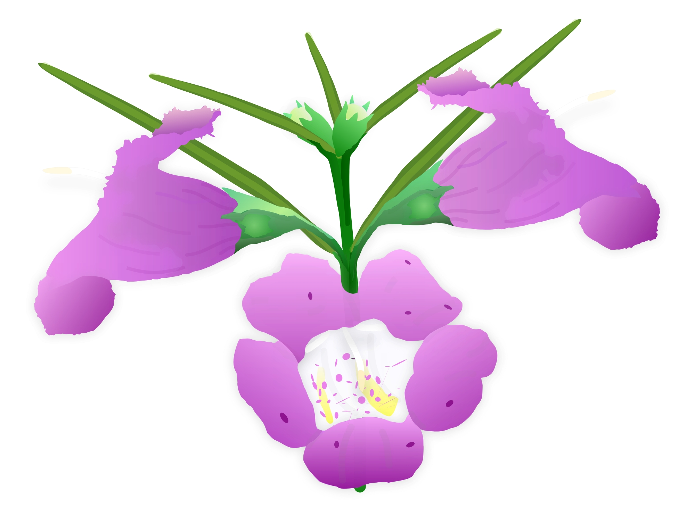

<!------------------------------------------------>
<!------------ FIG 1 -   ------------->
<!------------------------------------------------>

<figure align=center>

</figure>

<!---------------------------------------------->
<!-------- END - FIG 1 -   --------->
<!---------------------------------------------->

The latest project section, entitled &ldquo;OPC **Botany Primer1**&rdquo;, details some of the more common botany terms and concepts about flowering plants. I also explore some of the underlying genetics that govern flower development. Part of the goal of this primer is to help students become more knowledgeable about flower anatomy, and to help them identify plants in the field. The **Gallery** section of this site provides some examples of plant species and the unique features that aided in their identification. Like most things it takes a little bit of practise to learn how to identify plants, as well as when and where to find them. Certainly having a good field guide in hand during your nature treks is highly recommended, as is consulting and becoming a member of <b><a class="one" href="https://www.inaturalist.org/observations?view=species" target="_blank" title="">iNaturalist</a></b>. The discussions about floral genetics provides a deeper look at what regulates flower development, as well as how flowering is triggered in response to environmental signals.  

 
as always good reading!  

JCH

