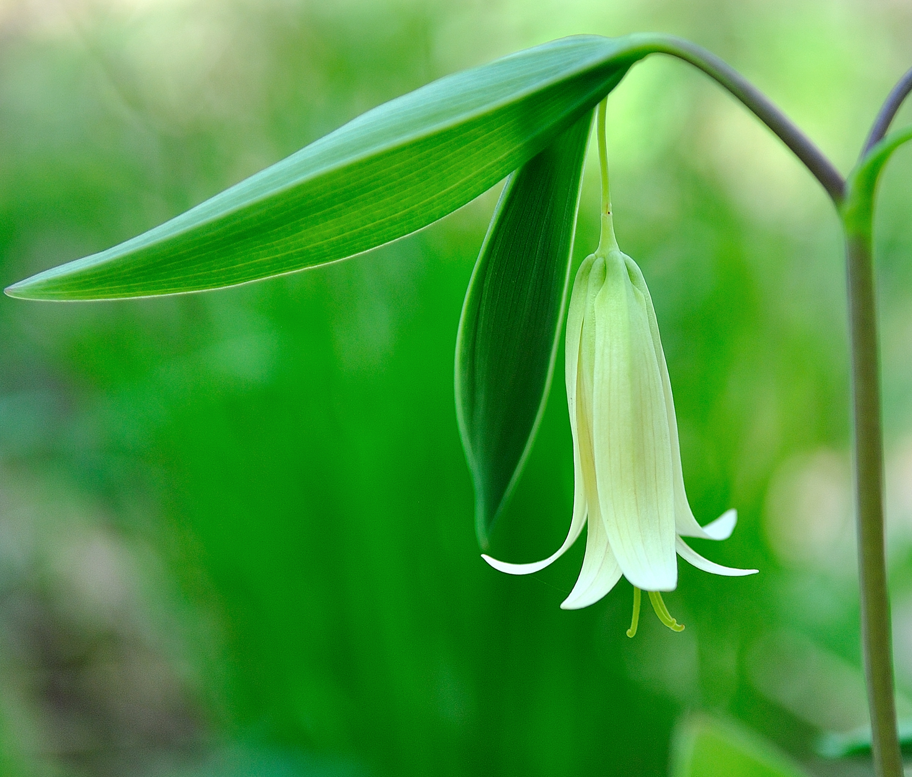

<body>
<!-- Slideshow container -->

<!-- Full-width images with number and caption text -->

1 / 10

<i>Lithospermum canescens</i> (S3, G5), commonly known as <b><a class="one" href="https://www.inaturalist.org/taxa/48595-Lithospermum-canescens" target="_blank" title="Go to iNaturalist">Hoary Puccoon</a></b>, has soft hairy stems, short oblong green leaves and golden tubular flowers. The word “puccoon” is a Native American word meaning “<i>a plant that yields a pigment</i>”. <b>Gilmore</b> (1919) noted that First Nations children “…<i>used the root of this plant in sport to chew with their gum to make it of a red color. The flowers of this plant were likewise used to colour gum yellow</i>” (Note: gum was made of resin from the Compass Plant).

2 / 10

<i>Pedicularis canadensis</i> (S5, G5), commonly known as <b><a class="one" href="https://www.inaturalist.org/taxa/51227-Pedicularis-canadensis" target="_blank" title="Go to iNaturalist">Wood Betony</a></b> or <b>Canadian lousewort</b>, is a native forb often found in prairies and wooded areas. The flower is usually yellow (next pic), but it can also be reddish-purple or bi-colored (yellow and purple). According to <b>Waugh</b> (1916) the young tender leaves of this plant were often harvested by Iroquois and “<i>…cooked like spinach</i>”.

3 / 10

This is the more common yellow variant of <b><a class="one" href="https://www.inaturalist.org/taxa/51227-Pedicularis-canadensis" target="_blank" title="Go to iNaturalist">Wood Betony</a></b>. It is interesting to note that the plant is hemi-parasitic (i.e. commonly use oaks and prairie grasses as hosts). Studies suggest that <i>P. canadensis</i> can suppress the growth of dominant grass species and thus influence (i.e. increase plant species evenness and richness) the composition of prairie communities (<b>Hedberg</b> 2005, <b>Borowicz and Armstrong</b> 2012, <b>DiGiovanni</b> et. al. 2016, <b>Hodzic</b> et. al. 2022).

4 / 10

<i>Claytonia virginica</i> (S5, G5), commonly known as <b><a class="one" href="https://www.inaturalist.org/taxa/240057-Claytonia-virginica-virginica" target="_blank" title="Go to iNaturalist">Narrowleaf Springbeauty</a></b> or <b>Virginia Springbeauty</b>, is a native perennial forb of eastern North America. According to <b><a class="one" href="https://explorer.natureserve.org/Taxon/ELEMENT_GLOBAL.2.147594/Claytonia_virginica" target="_blank" title="Go to NatureServe">NatureServe</a></b> populations of this species in Quebec and other eastern provinces are imperilled (S2). <b>Waugh</b> (1916) and <b>Arnason</b> et. al. (1981) mention that First Nations People used the roots (corms) of this plant for food.

5 / 10

<i>Uvularia sessilifolia</i> (S4, G5), commonly known as <b><a class="one" href="https://www.inaturalist.org/taxa/67772-Uvularia-sessilifolia" target="_blank" title="Go to iNaturalist">Sessile Bellwort</a></b> or <b>Wild Oats</b>, is a native forb of eastern and central North America. The creamy yellow coloured flowers of this plant are narrow, bell shaped and often droop downward.

6 / 10

<i>Viola sagittata</i> (S4, G5), commonly known as <b><a class="one" href="https://www.inaturalist.org/taxa/170259-Viola-sagittata" target="_blank" title="Go to iNaturalist">Arrowleaf Violet</a></b>, is a native forb often found in prairie and woodland habitats of eastern North America. This species of violet is relatively easy to identify because of the shape of their leaves (Note background).

7 / 10

<i>Viola pubescens</i> (S5, G5), commonly known as <b><a class="one" href="https://www.inaturalist.org/taxa/1467430-Viola-pubescens" target="_blank" title="Go to iNaturalist">Downy Yellow Violet</a></b>, is common native forb typically found in wooded areas. According to <b>Arnason</b> et. al. (1981) Ojibwa people used the root to make a tea to treat sore throats.

8 / 10

<i>Anemonoides quinquefolia</i> (S5, G5), commonly known as <b><a class="one" href="https://www.inaturalist.org/taxa/950598-Anemonoides-quinquefolia" target="_blank" title="Go to iNaturalist">Wood Anemone</a></b> or <b>windflower</b>, is a native perennial forb and member of the buttercup family <i>Ranunculaceae</i>. The specific epithet <i>quinquefolia</i> (“five-leaved”) is a misnomer since the upper lateral leaflets are lobed (see picture) giving the appearance of five leaflets (Note: emerging leaves are initially burgundy colour before turning green). It is a “<i>true</i>” spring ephemeral since it completes its entire life cycle within a few weeks in early spring.

9 / 10

<i>Viola sororia</i> (S5, G5), commonly known as <b><a class="one" href="https://www.inaturalist.org/taxa/82816-Viola-sororia" target="_blank" title="Go to iNaturalist">Common Blue Violet</a></b>, is typically found in moist wooded areas throughout eastern North America. It’s an important food resource for pollinating insects and a host plant to the larvae of several <b>Fritillary butterfly</b> species (<b>Wheeler</b> 2017). The young leaves of this plant can also be eaten raw, cooked, or used in teas (Note: valued for their high nutrient content, particularly <b>vitamin C</b>).

10 / 10

<i>Arisaema triphyllum</i> s. s. (S5, G5), commonly known as <b><a class="one" href="https://www.inaturalist.org/taxa/50310-Arisaema-triphyllum" target="_blank" title="Go to iNaturalist">Jack-in-the-Pulpit</a></b> or <b>Indian turnip</b>, is a long lived native perennial and member of the <b>Arum</b> family <i>Araceae</i>. It has a distinctive flower structure that includes three basal leaflets, and a colourful <b>spathe</b> (“<i>Pulpit</i>”) that encases a club-like <b>spadix</b> (“<i>Jack</i>”). All parts of the plant are toxic, but <b>Waugh</b> (1916) mentions that First Nations People use to harvest the underground <b>corms</b> for food.

<!-- Next and previous buttons -->

<a class="prev" onclick="plusSlides(-1)">❮</a>
<a class="next" onclick="plusSlides(1)">❯</a>

 

<!-- The dots/circles -->

<!-- Java Script -->

</body>

References cited in above photo gallery:[1](#ref-waugh_iroquois_1916)–[8](#ref-hodzic_root_2022)

<h3>
GLOBAL & REGIONAL RANKINGS
</h3>

**GRANKS** (**G**, global rankings) and **SRANKS** (**S**, State/Province rankings) provide designations for floral and ecosystem abundance. They are assigned and maintained by several conservation agencies. The following general rankings are from **<a class="one" href="https://explorer.natureserve.org/AboutTheData/DataTypes/ConservationStatusCategories" target="_blank" title="Go to NatureServe">NatureServe</a>**:  
GX: Presumed Extinct/Collapsed: **Species** <u>presumed extinct</u>, not located despite intensive searches and virtually no likelihood of rediscovery. **Ecosystem** <u>presumed collapsed</u> throughout its range, due to loss of key dominant and characteristic taxa and/or elimination of the sites and ecological processes on which the type depends.  
GH - Possibly Extinct/Collapsed: **Species** or **Ecosystem** is known from only historical occurrences, but still some hope of rediscovery. Examples of evidence include (1) that a species has not been documented in approximately 20-40 years in human-dominated landscapes despite some searching and/or some evidence of significant habitat loss or degradation; (2) that a species or ecosystem has been searched for unsuccessfully, but not thoroughly enough to presume that it is extinct or collapsed throughout its range.  
G1 - Critically Imperiled: At very high risk of extinction or collapse due to very restricted range, very few populations or occurrences, very steep declines, very severe threats, or other factors.  
G2 - Imperilled: At high risk of extinction or collapse due to restricted range, few populations or occurrences, steep declines, severe threats, or other factors.  
G3 - Vulnerable: At moderate risk of extinction or collapse due to a fairly restricted range, relatively few populations or occurrences, recent and widespread declines, threats, or other factors.  
G4 - Apparently Secure: At fairly low risk of extinction or collapse due to an extensive range and or many populations or occurrences, but with possible cause for some concern as a result of local recent declines, threats, or other factors.  
<b>G5 - Secure</b>: At very low risk or extinction or collapse due to a very extensive range, abundant populations or occurrences, and little to no concern from declines or threats.

**GRANK**s and **SRANK**s may also include other designations, notably: **GU** (uncertain global ranking); **G?** (tentative ranking); **Q** (questionable taxonomic status of the species, subspecies, or variety); **T** (rank applies to a subspecies or variety); and **HYB** (hybrid of 2 species); **SH** (plant historically occurred in Ontario, but has not been recorded in the last 20 years); **SR** (plant has been reported without persuasive documentation); **SU** (species has no SRANK value and therefore of uncertain status); **SX** (species apparently extirpated from Ontario with little likelihood of rediscovery); **SE** (species is exotic, not native to Ontario); **?** (some uncertainty about an assigned rank). Rank ranges (e.g. S1S2) indicate the uncertain nature of the species rank (i.e. either S1 or S2).

------------------------------------------------------------------------

<!--------------------------------------------------------------------->

© Jeffrey C Howard (B.Sc. B.Ed. M.Sc. Ph.D.). The material contained within this website may be copied, distributed and displayed without alterations for noncommercial purposes only provided that it is accompanied by acknowledgements to the author. All commercial and non-commercial rights are reserved to the author.  
<!--------------------------------------------------------------------->

  
**REFERENCES:**

1 Waugh FW. *[Iroquois Foods and Food Preparation](https://www.canadiana.ca/view/oocihm.82410/1)*. Ottawa, Canada: Ottawa : Govt. Print. Bureau; 1916.

2 Gilmore MR. *[Uses of plants by the Indians of the Missouri River region](https://doi.org/10.5962/bhl.title.32507)*. Washington, DC: Govt. print. off; 1919.

3 Arnason T, Hebda RJ, Johns T. Use of plants for food and medicine by Native Peoples of eastern Canada. *Canadian Journal of Botany* 1981;**59**:2189–325. <https://doi.org/10.1139/b81-287>.

4 Hedberg AM, Borowicz VA, Armstrong JE. Interactions between a hemiparasitic plant, Pedicularis canadensis L. (Orobanchaceae), and members of a tallgrass prairie community. *The Journal of the Torrey Botanical Society* 2005;**132**:401–10. [https://doi.org/10.3159/1095-5674(2005)132\[401:IBAHPP\]2.0.CO;2](https://doi.org/10.3159/1095-5674(2005)132[401:IBAHPP]2.0.CO;2).

5 Borowicz VA, Armstrong JE. Resource limitation and the role of a hemiparasite on a restored prairie. *Oecologia* 2012;**169**:783–92. <https://doi.org/10.1007/s00442-011-2222-7>.

6 DiGiovanni JP, Wysocki WP, Burke SV, Duvall MR, Barber NA. The role of hemiparasitic plants: Influencing tallgrass prairie quality, diversity, and structure. *Restoration Ecology* 2017;**25**:405–13. <https://doi.org/10.1111/rec.12446>.

7 Wheeler J. [Plants for Pollinators: Violets](https://xerces.org/blog/plants-for-pollinators-violets). *Xerces Society* 2017.

8 Hodžić J, Pearse I, Beaury EM, Corbin JD, Bakker JD. Root hemiparasitic plants are associated with more even communities across North America. *Ecology* 2022;**n/a**:e3837. <https://doi.org/10.1002/ecy.3837>.

