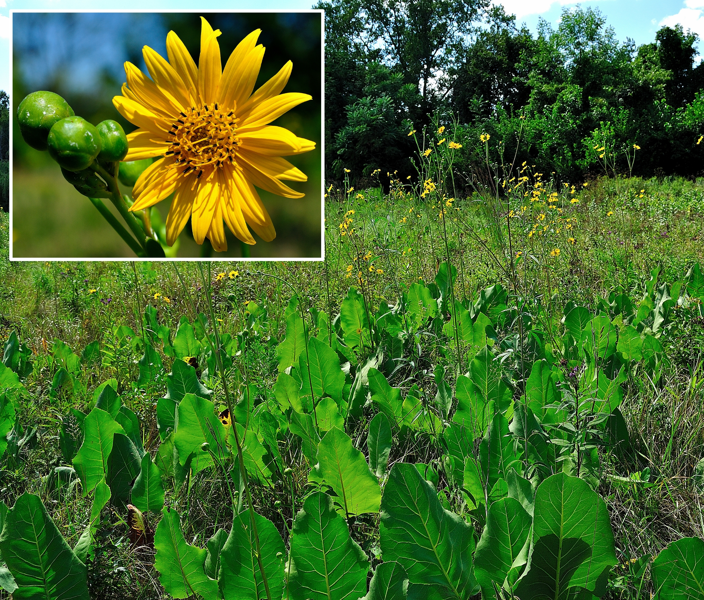

<!-- Slideshow container -->

<!-- Full-width images with number and caption text -->

1 / 20

<i>Silphium terebinthinaceum</i> (S1, G4), commonly known as <b><a class="one" href="https://www.inaturalist.org/taxa/121951-Silphium-terebinthinaceum" target="_blank" title="Go to iNaturalist">Prairie Rosinweed</a></b> or <b>Prairie dock</b>, is very rare (provincially) native perennial forb and member of the family <i>Asteraceae</i>. This plant has a large deep taproot (upwards of 4 m) and large spade-like leaves oriented vertically and within 15° of north presumably to maximize total carbon gain (i.e. photosynthesis) and minimizes water loss (<b>Smith</b> and <b>Ullberg</b> 1989). The flowers have multiple (~20) bright yellow <b>ray florets</b> and upwards of 140 central <b>disc florets</b> (Note: most florets are staminate and few produce actual seeds). <b>COSEWIC</b> (2024) estimates that there are only nine extant sub-populations of this species in Canada, most being found within Essex county (Note: population size within Lambton county currently unknown). Based on a 2022 and 2023 COSEWIC survey the total number of mature plants is just over 12,000, with <b>OPC</b> accounting for ~29% of this total (<b>COSEWIC</b> 2024).

2 / 20

<i>Eupatorium perfoliatum</i> (<b>S5</b>, <b>G5</b>), commonly known as <b><a class="one" href="https://www.inaturalist.org/taxa/119045-Eupatorium-perfoliatum" target="_blank" title="Go to iNaturalist">Boneset</a></b>, is a native perennial forb and member of the family <i>Asteraceae</i>. This plant has clasping, lance-like “wrinkled” looking leaves that are arranged opposite each other along the length of the central hairy stem. The plant also has dense clusters of tiny white flower heads situated atop the foliage (<b>Kirk</b> and <b>Belt</b> 2008). First Nations People traditionally used the plant for treating fever associated diseases, such as influenza and malaria. Apparently the name <b>Boneset</b> stems from its use in the treatment of dengue fever, which is often referred to as “<i>break-bone fever</i>” (<b>Kirk</b> and <b>Belt</b> 2008, <b>Hensel</b> et al. 2011).

3 / 20

<i>Sorghastrum nutans</i> (S4, <b>G5</b>), commonly known as <b><a class="one" href="https://www.inaturalist.org/taxa/122608-Sorghastrum-nutans" target="_blank" title="Go to iNaturalist">Indiangrass</a></b>, is a relatively tall (upwards of 2 m) native perennial plant and member of the family <i>Poaceae</i>. The plant produces branched clusters (i.e. <b>panicles</b>) of golden-brown <b>spikelets</b> (see inset), each containing a <b>floret</b> with three large yellow <b>stamens</b> and two feather-like <b>stigmas</b> (<b>USDA</b> 2002). Like <i>A. gerardi</i> <b>Indiangrass</b> is adapted to natural disturbances like fire, highly palatable to livestock, and an important source of food and shelter to wildlife (<b>Brakie</b> 2017).

4 / 20

<i>Solidago canadensis</i> (<b>SU</b>, <b>G5</b>), commonly known as <b><a class="one" href="https://www.inaturalist.org/taxa/67808-Solidago-canadensis" target="_blank" title="Go to iNaturalist">Canadian Goldenrod</a></b>, is a fairly wide spread native perennial forb and member of the family <i>Asteraceae</i>. The leaves are sessile, noticeably sharply toothed (especially lower ones, see inset), have three parallel veins, narrowly lance-like, and arranged alternately along the stem (lower main stem is fairly smooth or <b>glaborate</b>). The pyramidal shaped inflorescence consists of multiple branches (i.e. panicle), each displaying small yellow rayed flower heads along on <u>one side</u> (i.e. referred to as <b>secund</b>). The flowers provide nectar to a variety of pollinating insects and the foliage is food to wildlife (<b>Pavek</b> 2011, 2012).

5 / 20

<i>Lespedeza capitata</i> (S4, <b>G5</b>), commonly known as <b><a class="one" href="https://www.inaturalist.org/taxa/125186-Lespedeza-capitata" target="_blank" title="Go to iNaturalist">Round-head Bush-clover</a></b>, is a native perennial forb and member of the bean family <i>Fabaceae</i>. The relatively small elliptical leaves (i.e. usually a trio of leaflets) bear a prominent central vein and have smooth even margins (i.e. <b>entire</b>). They are attached to a hairy central stem in an alternating pattern via a small <b>petiole</b> and also give off a slight silvery sheen due to their closely pressed tiny hairs. The pea shaped flowers are white with purple markings and form distinctive round clusters atop each stem. The flowers attracts many pollinating insects and the seeds provide food for wildlife (e.g. bobwhite, quail). The foliage is also eaten by livestock (<b>Anderson</b> 2000, <b>Wynia</b> and <b>Shadow</b> 2002).

6 / 20

<i>Ludwigia alternifolia</i> (S1, <b>G5</b>), commonly known as <b><a class="one" href="https://www.inaturalist.org/taxa/130998-Ludwigia-alternifolia" target="_blank" title="Go to iNaturalist">Seedbox</a></b>, is a rare native perennial forb within Ontario, and member of the evening primrose family <i>Onagraceae</i> that can be found in wet low lying areas (i.e. meadows, marshes). Its a relatively small plant with slender reddish stems and narrow lance-like leaves arranged in an alternating pattern. The young emerging (late July) flowers are greenish in colour, but by early August the four petals are a bright yellow. Later in the season (early September) as the flowers mature they produce very distinctive brown cube-shaped seed pods (see inset).

7 / 20

<i>Physostegia virginiana</i> (S4, <b>G5</b>), commonly known as <b><a class="one" href="https://www.inaturalist.org/taxa/85313-Physostegia-virginiana" target="_blank" title="Go to iNaturalist">Obedient Plant</a></b> or <b>False dragonhead</b>, is a native perennial forb and member of the mint family <i>Lamiaceae</i>. The leaves are toothed and lance-like, and the snapdragon-like flowers form densely packed orderly arrays (i.e. <b>raceme</b>) atop the plant. Closer inspection of the deep pink tubular flowers (inset) reveals four purple tipped stamens and a noticeably less colourful stigma peaking out from under the hood-like upper lip of the corolla. These attractive flowers are visited by a variety of nectar seeking insects.

8 / 20

<i>Apios americana</i> (<b>S5</b>, <b>G5</b>), commonly known as <b><a class="one" href="https://www.inaturalist.org/taxa/119817-Apios-americana" target="_blank" title="Go to iNaturalist">American groundnut</a></b> or <b>potato bean</b>, is a native perennial plant and member of the bean family <i>Fabaceae</i> that produces edible beans and large edible rhizomatous stems or tubers. The vine has compound leaves (5–to-7 egg-shaped leaflets), and red-brown flowers that form dense clusters (i.e. <b>racemes</b>) along the stem (<b>Stevens</b> 2000). The flowers begin to emerge in late July and are in full bloom by early August. Structurally they have five oddly shaped petals (or perhaps <b>tepals</b>) that take on a morion (conquistador helmet) like appearance. First Nations People are known to have harvested the underground tubers for food and sometimes planted them “<i>…in suitable locations</i>” (<b>Waugh</b> 1916).

9 / 20

<i>Strophostyles helvola</i> (S4, <b>G5</b>), commonly known as <b><a class="one" href="https://www.inaturalist.org/taxa/204420-Strophostyles-helvola" target="_blank" title="Go to iNaturalist">Trailing wild bean</a></b>, is a native herbaceous vine and member of the legume family <i>Fabaceae</i>. This low trailing annual vine likes open moist sandy soils, and has compound leaves (usually three dark green leaflets as seen above). The pink-purple flowers (Note: only 1 or 2 bloom at one time) are distinctly pea-like, with a prominent purple tipped spur-like keel partially surrounded by light pink coloured upper and lower petals. The plant was harvested by First Nations People for both food and medicine, and the seeds are consumed by wildlife (<b>Immel</b> 2003).

10 / 20

<i>Nabalus albus</i> (<b>S5</b>, <b>G5</b>), commonly known as <b><a class="one" href="https://www.inaturalist.org/taxa/130950-Nabalus-albus" target="_blank" title="Go to iNaturalist">White Rattlesnakeroot</a></b> or <b>White Lettuce</b>, is a native perennial forb and member of the family <i>Asteraceae</i>. The leaves are simple and partly lobed (see inset) and the upper stems terminate in panicles of cylinder-shaped flower-heads. Each downward facing flower-head has eight outer purplish coloured primary bracts and small triangular greenish coloured secondary bracts at the bottom. The inner strap-like white <b>ray florets</b> are slightly toothed at the top and spread outwards revealing several long styles that have split, curled tips. As the name suggests the plant was apparently used by First Nations People to treat rattlesnake bites.

11 / 20

<i>Liatris aspera</i> (S1, G4), commonly known as <b><a class="one" href="https://www.inaturalist.org/taxa/130380-Liatris-aspera" target="_blank" title="Go to iNaturalist">Rough Blazingstar</a></b> or <b>Tall Prairie Blazingstar</b>, is a provincially rare native perennial forb and member of the family <i>Asteraceae</i>. The plant grows as a single erect unbranched stem (upwards of 1.83 m) with multiple lance-shaped leaves that become narrower and smaller as they alternate upwards along the stem. The <b>phyllaries</b> (i.e. outer leaf-like structures of the flower, also known as bracts) are noticeably irregular or <u>rough</u>-looking along its borders (hence the name). The stalk-less, button-like flower head contains multiple (upwards of 40) pink-purple star-like tubular <b>disc florets</b>. Each of 25 or more florets sport a long stringy style protruding from its centre, giving it a fuzzy brush-like appearance. As one would expect these beautiful flowers provide food for a variety of pollinating insects (e.g. honeybees, bumblebees, butterflies) and hummingbirds (<b>Brakie</b> 2018). Surprisingly neither COSEWIC nor the Ontario ministry of natural resources have any habitat regulations in place to protect this critically imperilled species (S1).

12 / 20

<i>Cirsium muticum</i> (<b>S5</b>, <b>G5</b>), commonly known as <b><a class="one" href="https://www.inaturalist.org/taxa/81603-Cirsium-muticum" target="_blank" title="Go to iNaturalist">swamp thistle</a></b>, is a common native biennial forb and member of the family <i>Asteraceae</i>. The pinnately lobed leaves are arranged alternately along a hairy stem and become progressively smaller towards the top of the plant. Each terminal pin-cushion like flower head has a series of blunt scaly-looking bracts at their base and multiple tiny but relatively long (upwards of 27 mm) pink-purple <b>disc florets</b>. The plant attracts many pollinating insects and the seeds are food for wildlife such as birds.

13 / 20

<i>Helenium autumnale</i> (S4, <b>G5</b>), commonly known as <b><a class="one" href="https://www.inaturalist.org/taxa/77349-Helenium-autumnale" target="_blank" title="Go to iNaturalist">Common sneezeweed</a></b>, is a native perennial forb and member of the family <i>Asteraceae</i>. The simple lance-like leaves of this plant grow smaller as you ascend toward the inflorescence. They are also arranged in an alternating pattern along the stem. Each flower head produces upwards of 21 yellow <b>ray florets</b> that frame multiple (potentially 100s) tiny yellow <b>disc florets</b>. The aster attracts many pollinating insects (e.g. bees, butterflies) which it depends upon to distribute its pollen. Although the common name of this plant is a bit of a misnomer (i.e. doesn’t cause fall allergies) it was reportedly used by First Nations People to induce sneezing (e.g. treatment of head colds). However, all parts of the plant are toxic due to the presence of <b><a class="one" href="https://opc-project.netlify.app/project/pnps/" target="_blank" title="Go to PNP">sesquiterpene lactones</a></b> such as <b><a class="one" href="https://pubchem.ncbi.nlm.nih.gov/compound/Helenalin" target="_blank" title="Go to PubChem">helenalin</a></b> (<b>Drogosz</b> and <b>Janecka</b> 2018, Trull 2024). This secondary metabolite, which is commonly found in <i>Asteraceae</i> spp., presumably protects these plants from potential pathogens and phytophagous animals.

14 / 20

<i>Agalinis purpurea</i> (S4, <b>G5</b>), commonly known as <b><a class="one" href="https://www.inaturalist.org/taxa/158068-Agalinis-purpurea" target="_blank" title="Go to iNaturalist">Purple false foxglove</a></b> or <b>Purple gerardia</b>, is a native annual forb and member of the family <i>Orobanchaceae</i>. This low lying slender stemmed plant has many spreading branches with simple narrow, lance-like leaves. The five pink-purplish petals are fused forming a tube-like structure, with the lips of each lobe spreading outwards. Two yellow lines and multiple dark purple spots mark the interior of the flower. The corolla’s upper section is also softly hairy, or <b>pilose</b>, which partially hides two long and two short stamens (i.e. <b>didynamous</b>) that crowd around a slightly longer blunt tipped style (see inset). Like other members of the <i>Orobanchaceae</i> family <i>A. purpurea</i> is hemi-parasitic and actively siphons nutrients from the roots of neighbouring plants using specialized root structures called <b>haustoria</b> (<b>Riopel</b> and <b>Musselman</b> 1979, <b>Baird</b> and <b>Riopel</b> 1983). As <b>Blanchan</b> (1917) so poetically put it “<i>…When robbery becomes flagrant, Nature brands sinners in the vegetable kingdom by taking away their color, and perhaps their leaves, as in the case of the broom-rape and Indian Pipe; but the fair faces of the gerardias and
foxgloves give no hint of the petty thefts committed under cover of darkness in the soil below</i>”.

15 / 20

<i>Agalinis tenuifolia</i> (S4, <b>G5</b>), commonly known as <b><a class="one" href="https://www.inaturalist.org/taxa/120007-Agalinis-tenuifolia" target="_blank" title="Go to iNaturalist">Slender False Foxglove</a></b>, is a native annual forb and member of the family <i>Orobanchaceae</i>. Like <i>A. purpurea</i> it is a low lying slender stemmed plant with multiple spreading branches. It also has its five flower petals fused into a slender tubular corolla, along with four <b>didynamous</b> stamens. What really distinguishes <i>A. tenuifolia</i> from <i>A. purpurea</i> is the noticeably long <b>pedicels</b> that attach each slightly smaller flower head to the branched stem. The upper lip of the corolla in these flowers is also more hood-like (i.e. arched forward) and not spread outwards or re-flexed. Lastly, like other members of this genus <i>A. tenuifolia</i> is also hemi-parasitic, but the range of host plants is not known.

16 / 20

<i>Lobelia siphilitica</i> (<b>S5</b>, <b>G5</b>), commonly known as <b><a class="one" href="https://www.inaturalist.org/taxa/119806-Lobelia-siphilitica" target="_blank" title="Go to iNaturalist">Great blue lobelia</a></b> or <b>Blue cardinal flower</b>, is a native perennial forb and member of the harebell family <i>Campanulaceae</i>. The plant has a single erect stem with alternately arranged simple, lance-like, sessile leaves. The flowers cluster along the top of the stem (ie. raceme) with the lower ones blooming first. The relatively large blue, five petal flower (inset shows a white variant) has a distinct two-lipped <b>zygomorphic</b> structure (i.e. one plane of symmetry, namely bilaterally symmetrical). The base of the flower forms a tube, with the exterior appearing striped. The wider lower lip of the flower is formed by the fusion of three petals, while the “<i>split</i>” upper lip accounts for the two remaining petals (appear curled backwards). A curving <b>style</b> (more clearly seen in the inset) emerges from between the two upper petals, which marks the position of the flower’s imaginary plane of symmetry (<b>Anderson</b> 2003).

17 / 20

<i>Doellingeria umbellata</i> (<b>S5</b>, <b>G5</b>), commonly known as <b><a class="one" href="https://www.inaturalist.org/taxa/120179-Doellingeria-umbellata" target="_blank" title="Go to iNaturalist">Tall flat-topped white aster</a></b>, is a native perennial forb and member of the family <i>Asteraceae</i>. This early blooming aster has simple, narrow elliptical leaves (tapering at the tip) that are alternately arranged along the stem. The multiple (upwards of 300) small composite flower heads are arranged in flat loose clusters atop the plant (hence the name). Individually the flower heads usually have between 5 and 10 white <b>ray florets</b> and upwards of 50 yellow <b>disc florets</b>.

18 / 20

<i>Ramariopsis kunzei</i>, commonly known as <b><a class="one" href="https://www.inaturalist.org/taxa/55274-Ramariopsis-kunzei" target="_blank" title="Go to iNaturalist">White Coral fungus</a></b>, has branched fruiting bodies (reminiscent of a marine coral) whose tips turn a yellowish-brown as it ages. It is apparently quite common throughout North America but its actual species status is largely unknown (i.e. only a few regions outside of Ontario have available NatureServe rankings).

19 / 20

<i>Oenothera gaura</i> (S3, <b>G5</b>), commonly known as <b><a class="one" href="https://www.inaturalist.org/taxa/204370-Oenothera-gaura" target="_blank" title="Go to iNaturalist">Biennial gaura</a></b> or <b>Biennial beeblossom</b>, is a native plant and member of the family <i>Onagraceae</i>. The plant’s upper flowering stem has a characteristic downy appearance (tiny white hairs). These relatively tall somewhat flimsy plants have very distinct <b>zygomorphic</b> flowers with four white (slightly pinkish) petals, eight yellow anther tipped stamens, and a single slightly longer central style with a noticeably knobby tip (stigma). These beautiful delicate flowers attract many pollinating insects when in bloom just before the start of Fall.

20 / 20

<i>Phyciodes tharos</i> (S4, G4), commonly known as <b><a class="one" href="" target="_blank" title="Go to iNaturalist">Pearl crescent</a></b> is a native butterfly and member of the family <i>Nymphalidae</i>. It is found throughout most US states and parts of southern Canada. It prefers open pastures and feeds on a variety of nectar producing flowers (e.g. dogbane, swamp milkweed, asters).

<!-- Next and previous buttons -->

<a class="prev" onclick="plusSlides(-1)">❮</a>
<a class="next" onclick="plusSlides(1)">❯</a>

 

<!-- The dots/circles -->

<!-- Java Script -->

References cited in above photo gallery: <b>[1](#ref-waugh_iroquois_1916)–[17](#ref-cosewic_cosewic_2024)</b>

<h3>
GLOBAL & REGIONAL RANKINGS
</h3>

**GRANKS** (**G**, global rankings) and **SRANKS** (**S**, State/Province rankings) provide designations for floral and ecosystem abundance. They are assigned and maintained by several conservation agencies. The following general rankings are from **<a class="one" href="https://explorer.natureserve.org/AboutTheData/DataTypes/ConservationStatusCategories" target="_blank" title="Go to NatureServe">NatureServe</a>**:  
GX: Presumed Extinct/Collapsed: **Species** <u>presumed extinct</u>, not located despite intensive searches and virtually no likelihood of rediscovery. **Ecosystem** <u>presumed collapsed</u> throughout its range, due to loss of key dominant and characteristic taxa and/or elimination of the sites and ecological processes on which the type depends.  
GH - Possibly Extinct/Collapsed: **Species** or **Ecosystem** is known from only historical occurrences, but still some hope of rediscovery. Examples of evidence include (1) that a species has not been documented in approximately 20-40 years in human-dominated landscapes despite some searching and/or some evidence of significant habitat loss or degradation; (2) that a species or ecosystem has been searched for unsuccessfully, but not thoroughly enough to presume that it is extinct or collapsed throughout its range.  
G1 - Critically Imperiled: At very high risk of extinction or collapse due to very restricted range, very few populations or occurrences, very steep declines, very severe threats, or other factors.  
G2 - Imperilled: At high risk of extinction or collapse due to restricted range, few populations or occurrences, steep declines, severe threats, or other factors.  
G3 - Vulnerable: At moderate risk of extinction or collapse due to a fairly restricted range, relatively few populations or occurrences, recent and widespread declines, threats, or other factors.  
G4 - Apparently Secure: At fairly low risk of extinction or collapse due to an extensive range and or many populations or occurrences, but with possible cause for some concern as a result of local recent declines, threats, or other factors.  
<b>G5 - Secure</b>: At very low risk or extinction or collapse due to a very extensive range, abundant populations or occurrences, and little to no concern from declines or threats.

**GRANK**s and **SRANK**s may also include other designations, notably: **GU** (uncertain global ranking); **G?** (tentative ranking); **Q** (questionable taxonomic status of the species, subspecies, or variety); **T** (rank applies to a subspecies or variety); and **HYB** (hybrid of 2 species); **SH** (plant historically occurred in Ontario, but has not been recorded in the last 20 years); **SR** (plant has been reported without persuasive documentation); **SU** (species has no SRANK value and therefore of uncertain status); **SX** (species apparently extirpated from Ontario with little likelihood of rediscovery); **SE** (species is exotic, not native to Ontario); **?** (some uncertainty about an assigned rank). Rank ranges (e.g. S1S2) indicate the uncertain nature of the species rank (i.e. either S1 or S2).

------------------------------------------------------------------------

<!--------------------------------------------------------------------->

© Jeffrey C Howard (B.Sc. B.Ed. M.Sc. Ph.D.). The material contained within this website may be copied, distributed and displayed without alterations for noncommercial purposes only provided that it is accompanied by acknowledgements to the author. All commercial and non-commercial rights are reserved to the author.  
<!--------------------------------------------------------------------->

  
**REFERENCES:**

1 Waugh FW. *[Iroquois Foods and Food Preparation](https://www.canadiana.ca/view/oocihm.82410/1)*. Ottawa, Canada: Ottawa : Govt. Print. Bureau; 1916.

2 Blanchan N. *[Wild flowers worth knowing](http://archive.org/details/wildflowersworth00nelt_0)*. Doubleday, Page & Company; 1917.

3 Riopel JL, Musselman LJ. Experimental Initiation of Haustoria in Agalinis Purpurea (scrophulariaceae). *American Journal of Botany* 1979;**66**:570–5. <https://doi.org/10.1002/j.1537-2197.1979.tb06259.x>.

4 Baird WV, Riopel JL. Experimental studies of the attachment of the parasitic angiosperm Agalinis purpurea to a host. *Protoplasma* 1983;**118**: <https://doi.org/10.1007/bf01281804>.

5 Smith M, Ullberg E. Effect of Leaf Angle and Orientation on Photosynthesis and Water Relations in Silphium Terebinthinaceum. *American Journal of Botany* 1989;**76**:1714–9. <https://doi.org/10.1002/j.1537-2197.1989.tb15161.x>.

6 Anderson MK. *[Plant Guide for Roundhead Lespedeza, Lespedeza capitata Michx](https://plants.usda.gov/plant-profile/LECA8)*. USDA, NRCS, National Plant Data Center c/o Department of Environmental Horticulture, University of California, Davis, California; 2000.

7 Wynia R, Shadow A. *[Plant fact sheet Roundhead Lespedeza, Lespedeza capitata Michx.](https://plants.usda.gov/plant-profile/LECA8)* USDA NRCS Manhattan Plant Materials Center; Manhattan, Kansas; 2002.

8 USDA. *[Fact Sheet for Indiangrass, Sorghastrum nutans L.](https://plants.usda.gov/plant-profile/SONU2)* USDA NRCS Plant Materials Program; 2002.

9 Immel DL. *[Plant guide Trailing fuzzybean, Strophostyles helvula (L.) Ell.](https://plants.usda.gov/DocumentLibrary/plantguide/pdf/cs_sthe4.pdf)* USDA, NRCS, National Plant Data Center, c/o Environmental Horticulture Department, University of California, Davis, California; 2003.

10 Kirk S, Belt S. *[Fact Sheet for Common Boneset, Eupatorium perfoliatum L.](https://plants.usda.gov/plant-profile/EUPE3)* USDA NRCS National Plant Materials Center, Beltsville, MD; 2008.

11 Pavek PLS. *[Plant guide for Canada goldenrod (Solidago canadensis)](https://plants.usda.gov/plant-profile/SOCA6)*. USDA-Natural Resources Conservation Service. Pullman, WA.; 2011.

12 Pavek PLS. *[Plant fact sheet for Canada goldenrod (Solidago canadensis).](https://plants.usda.gov/plant-profile/SOCA6)* USDA-Natural Resources Conservation Service. Pullman, WA; 2012.

13 Brakie M. *[Plant Guide for Indiangrass, Sorghastrum nutans (L.) Nash](https://plants.usda.gov/plant-profile/SONU2)*. USDA-Natural Resources Conservation Service, East Texas Plant Materials Center. Nacogdoches, TX 75964.; 2017.

14 Brakie M. *[Plant Guide for Tall blazingstar (Liatris aspera)](https://plants.usda.gov/plant-profile/LIAS)*. USDA-Natural Resources Conservation Service, East Texas Plant Materials Center. Nacogdoches, TX 75964; 2018.

15 Drogosz J, Janecka A. Helenalin - A Sesquiterpene Lactone with Multidirectional Activity. *Current Drug Targets* 2019;**20**:444–52. <https://doi.org/10.2174/1389450119666181012125230>.

16 Trull S. *[Plant of the Week: Common sneezeweed (Helenium autumnale var. autumnale)](https://www.fs.usda.gov/wildflowers/plant-of-the-week/helenium_autumnale_autumnale.shtml)*. US Forest Service, Ottawa National Forest; 2024.

17 COSEWIC. *[COSEWIC assessment and status report on the Prairie-dock Silphium terebinthinaceum in Canada](https://www.canada.ca/en/environment-climate-change/services/species-risk-public-registry.html)*. Ottawa, Canada: Committee on the Status of Endangered Wildlife in Canada; 2024.

