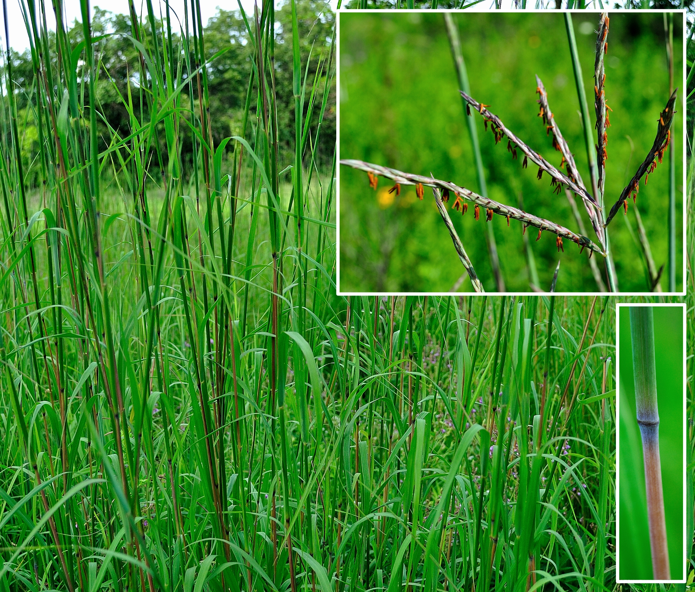
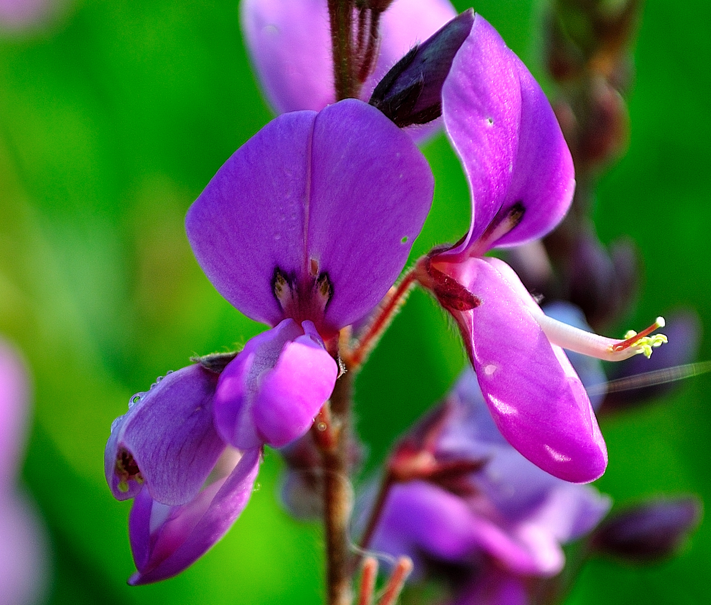
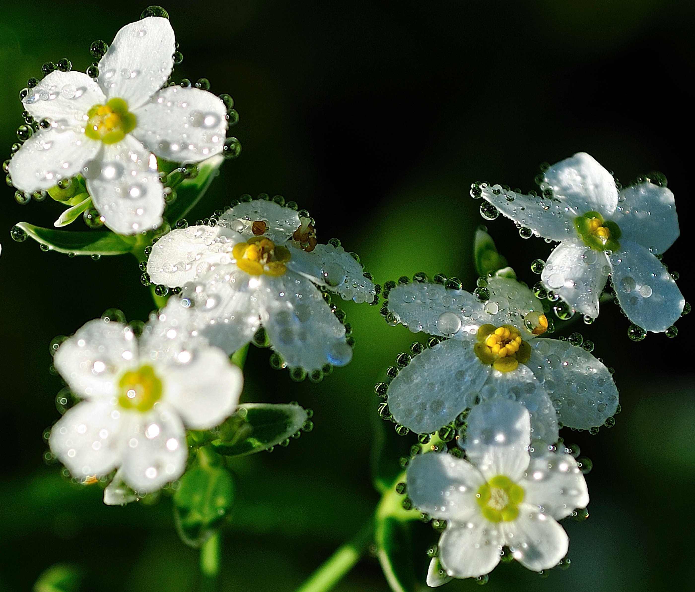
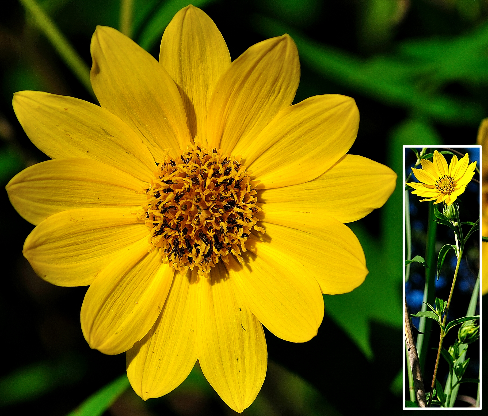
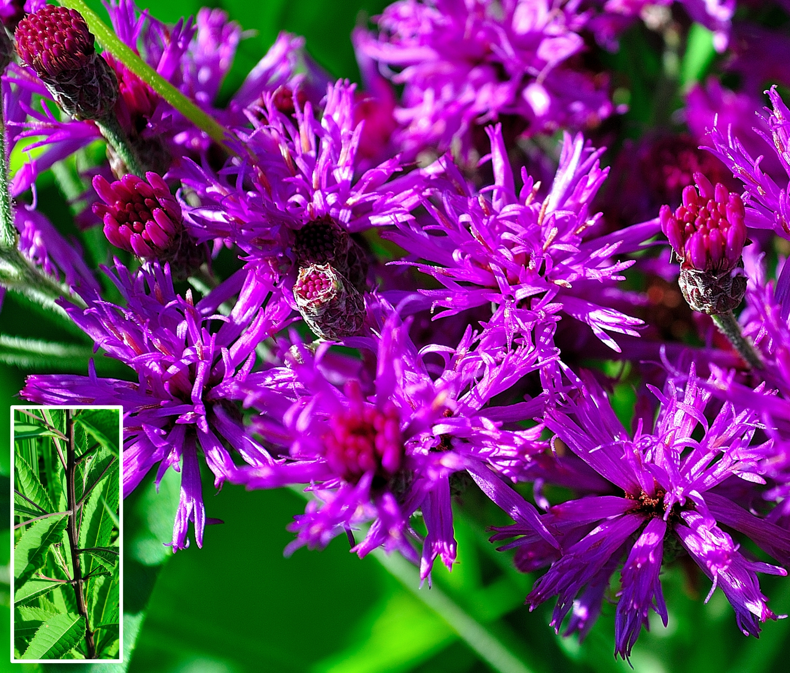
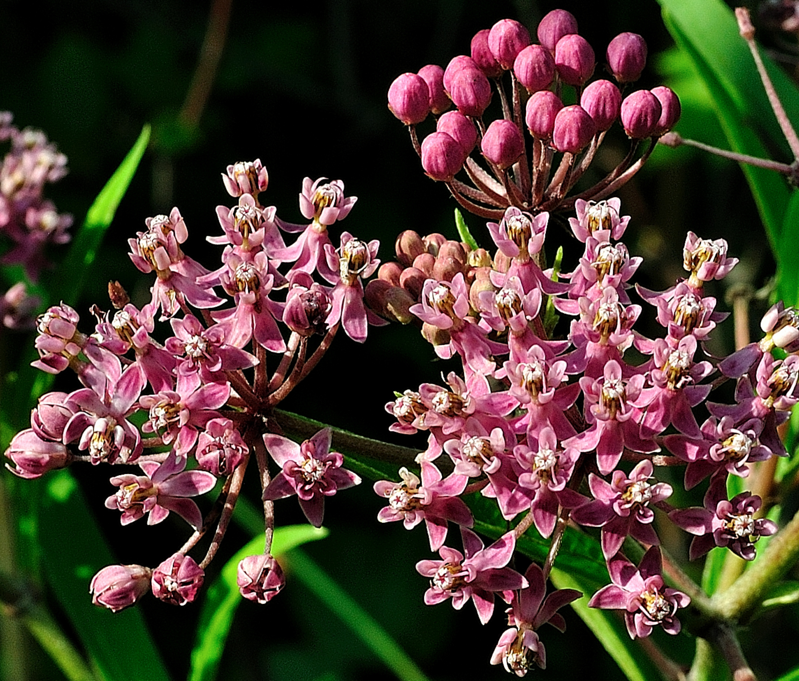
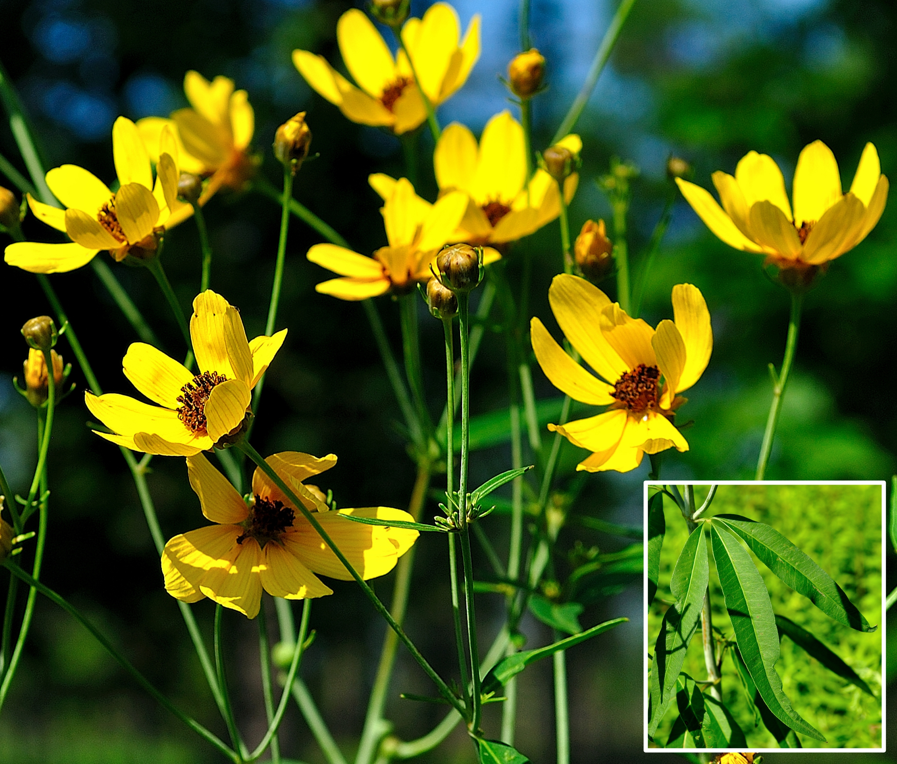
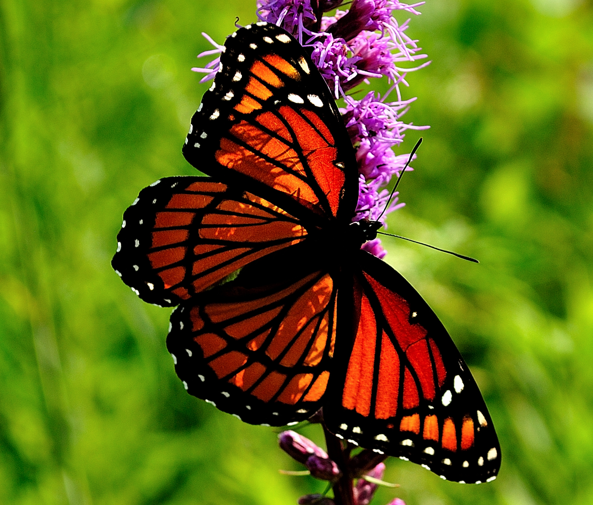
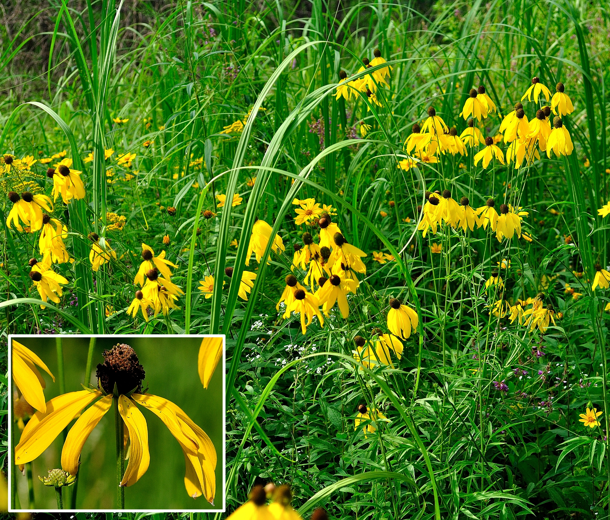

<!-- Slideshow container -->

<!-- Full-width images with number and caption text -->

1 / 20

<i>Andropogon gerardi</i> (S4, <b>G5</b>), commonly known as <b><a class="one" href="https://www.inaturalist.org/taxa/121968-Andropogon-gerardi" target="_blank" title="Go to iNaturalist">Big Bluestem</a></b>, is a native perennial tall grass (<i>Poaceae</i> family). It grows to impressive heights (~3 m) and forms extensive underground rhizome and root systems. Part of the stem turns blue or purple as it matures (see inset), while the inflorescence consists of digit-like <b>racemes</b> (Note: upper inset shows five digit-like <b>rames</b>). Small petal-less flowers, or <b>spikelets</b>, line the length of each <b>rame</b> (Note: rust coloured anthers hanging from <b>spikelets</b>). The extensive rhizome and root structure of <i>A. gerardi</i> makes it well adapted to natural disturbances (i.e. ground fires, grazing). It’s highly valued as forage for livestock and an important source of food and shelter for birds and insects (<b>USDA</b> 2002, <b>Wennerberg</b> 2004).

2 / 20

<i>Desmodium canadense</i> (S4, <b>G5</b>),
commonly known as <b>Canadian tick-trefoil</b>, is a native perennial forb and member of the legume family <i>Fabaceae</i>. It serves as the larval host plant for several butterfly species (e.g. <b>Eastern tailed-blue</b>) and the bright pea-shaped pink-purple flowers provide nectar for pollinating insects and hummingbirds (<b>Henry</b> et.al. 2003).

3 / 20

<i>Veronicastrum virginicum</i> (S2, G4), commonly known as <b><a class="one" href="https://www.inaturalist.org/taxa/141767-Veronicastrum-virginicum" target="_blank" title="Go to iNaturalist">Culver’s root</a></b>, is a rare native perennial forb and member of the plantain family <i>Plantaginaceae</i>. The branching inflorescence (i.e. spike-like <b>raceme</b>) at the top of the plant is reminiscent of a showy candelabra (see lower inset). Each branch supports multiple white flowers that are crowded together. Each tube-like flower (i.e. <b>tepals</b> are fused) contains one or two relatively long (~9 mm) stamens that are topped by golden-brown anthers (<b>Belt</b> 2011).

4 / 20

<i>Liatris spicata</i> (S2, <b>G5</b>), commonly known as <b><a class="one" href="https://www.inaturalist.org/taxa/117439-Liatris-spicata" target="_blank" title="Go to iNaturalist">Marsh Blazing Star</a></b> or <b>Dense Blazing Star</b>, is a provincially rare native perennial forb and member of the family <i>Asteraceae</i>. The relatively tall (upwards of 1.5 m) showy purple-pinkish spikes of densely packed flowers attract many pollinating insects and hummingbirds. Each flower-head contains several <b>disc florets</b>. The upper part of the <b>floret’s</b> corolla forms 5 tiny lobes that produce a star-shaped pattern (see inset). Emerging from the centre of each <b>floret</b> is a deeply split long curly white-pinkish <b>style</b> (i.e. middle part of pistil) that collectively give the inflorescence a fuzzy appearance. The last <b>COSEWIC</b> Report (2010) identified 10 extant populations within the province with an estimated total population of 60,000-70,000 plants. All known populations have been declining due to habitat loss.

5 / 20

<i>Cephalanthus occidentalis</i> (<b>S5</b>, <b>G5</b>), commonly known as <b><a class="one" href="https://www.inaturalist.org/taxa/52763-Cephalanthus-occidentalis" target="_blank" title="Go to iNaturalist">Buttonbush</a></b>, is a native deciduous shrub and member of the family <i>Rubiaceae</i>. The spherical pin-cushion like inflorescence contains many small white tubular flowers that have a prominent yellow tipped (may turn brownish) <b>stigma</b> protruding from its centre. Besides its aesthetic appeal <i>C. occidentalis</i> is an important food resource (i.e. nectar, foliage, seeds) for pollinating insects, hummingbirds, waterfowl, shorebirds and white tailed deer (<b>USDA</b> 2002).

6 / 20

<i>Lysimachia quadriflora</i> (S4, <b>G5</b>), commonly known as <b><a class="one" href="https://www.inaturalist.org/taxa/165013-Lysimachia-quadriflora" target="_blank" title="Go to iNaturalist">Narrow-leaved Loosestrife</a></b> or <b>Four-flower Yellow Loosestrife</b>, is a native perennial forb and member of the primrose family <i>Primulaceae</i>. The inflorescence consists of clusters of four yellow flowers, each attached via a small <b>pedicel</b> to the ends of branches (Note: usually drooping and not all in bloom at the same time). The <b>corolla</b> consists of five yellow petals that have a short sharp tip at their apex.

7 / 20

<i>Euphorbia corollata</i> (S4, <b>G5</b>), commonly known as <b><a class="one" href="https://www.inaturalist.org/taxa/81824-Euphorbia-corollata" target="_blank" title="Go to iNaturalist">Eastern flowering spurge</a></b>, is a native perennial forb and member of the Spurge family <i>Euphorbiaceae</i>. The <b>cyathium</b> (i.e. specialized pseudo-flower) of this spurge is made up of a whorl of five petal-like white bracts that enclose either female (pistillate) or male (staminate) reproductive parts. The small elliptic green leaves with their conspicuous mid-vein are arranged in whorls just below the terminal florescence. However, at the base of the plant the leaves are much larger and either arranged alternately or in whorls.

8 / 20

<i>Helianthus giganteus</i> (<b>S5</b>, <b>G5</b>), commonly known as <b><a class="one" href="https://www.inaturalist.org/taxa/116688-Helianthus-giganteus" target="_blank" title="Go to iNaturalist">Giant Sunflower</a></b>, is a native perennial forb and member of the family <i>Asteraceae</i>. As the name suggests it is a very tall plant (can exceed 3 m) with long narrow simple leaves and reddish, partly rough, erect stems. The bright yellow flowers are made up of 12-to-20 outer petal-like rays (i.e. <b>ray florets</b>) and multiple (~60) tiny <b>disc florets</b> (i.e. centre piece that produces seeds) that have slightly protruding black or dark brown anthers.

9 / 20

<i>Mimulus ringens</i> (<b>S5</b>, <b>G5</b>), commonly known as <b><a class="one" href="https://www.inaturalist.org/taxa/62399-Mimulus-ringens" target="_blank" title="Go to iNaturalist">Square-stemmed Monkeyflower</a></b>, is a native perennial forb and member of the lopseed family <i>Phrymaceae</i>. The plant has lance-shaped sessile (clasping) leaves and its tubular flowers (bilaterally symmetric) have a purplish corolla with a slightly hairy (i.e. pubescent) golden lower palate (throat nearly closed).

10 / 20

<i>Vernonia gigantea</i> (S1, <b>G5</b>), commonly known as <b><a class="one" href="https://www.inaturalist.org/taxa/127037-Vernonia-gigantea" target="_blank" title="Go to iNaturalist">Tall Ironweed</a></b>, is a very rare (provincially) native perennial forb and member of the family <i>Asteraceae</i>. The plant’s stem is largely a purplish green colour. The leaves are lance-like with serrated margins and may be sessile (i.e. no petiole, directly attached to stem). The loosely arranged flowers form flat-top like clusters, with each small scaly flower head being made up of multiple (upwards of 30) red-purple tubular <b>disc florets</b>.

11 / 20

<i>Eutrochium purpureum</i> (S4, <b>G5</b>), commonly known as <b><a class="one" href="https://www.inaturalist.org/taxa/85378-Eutrochium-purpureum" target="_blank" title="Go to iNaturalist">Purple Joe-Pye weed</a></b>, is a native perennial forb and member of the family <i>Asteraceae</i>. The robust stems support large clusters of flower heads, often bending downward due to their weight. The inflorescence consists of loosely arranged purplish flowers in a flat top configuration (i.e. <b>corymbiform</b> arrays). Each <b>disc floret</b> (5-to-8 per head) has a small tubular corolla that is pale purplish in colour with 5 tiny teeth-like extensions along the rim. A long divided white style protrudes from the centre of each <b>disc floret</b> giving the inflorescence a brush-like appearance. The nectar and subsequent seeds these flowers produce attracts many pollinating insects and birds. As <b>Blanchan</b> (1917) so eloquently stated “<i>…this vigorous composite spreads clusters of soft, fringy bloom that, however deep or pale of tint, are ever conspicuous advertisements, even when the golden-rods, sunflowers, and asters enter into close competition for insect trade</i>”.

12 / 20

<i>Helianthus divaricatus</i> (<b>S5</b>, <b>G5</b>), commonly known as <b><a class="one" href="https://www.inaturalist.org/taxa/84113-Helianthus-divaricatus" target="_blank" title="Go to iNaturalist">Rough Woodland Sunflower</a></b>, is a native perennial forb and member of the family <i>Asteraceae</i>. The blade like leaves are noticeably rough when touched (i.e. <b>hispidulous</b>, covered in tiny stiff hairs), somewhat reminiscent of fine sandpaper. The bright yellow <b>ray florets</b> (8–12 rays) surround the central <b>disc florets</b> (~40 tubular flowers) that boast dark brown to black anthers.

13 / 20

 <i>Asclepias incarnata</i> (<b>S5</b>, <b>G5</b>), commonly known as <b><a class="one" href="https://www.inaturalist.org/taxa/125381-Asclepias-incarnata" target="_blank" title="Go to iNaturalist">Swamp Milkweed</a></b>, is a native perennial forb that often grows in damp wet soils (e.g. country road side ditches). The round clusters (i.e. <b>unbels</b>) of pink crown-like flowers attract many pollinating insects including Monarch butterflies (<b>Kirk</b> and <b>Belt</b> 2006).

14 / 20

<i>Spiraea tomentosa</i> (<b>S5</b>, <b>G5</b>), commonly known as <b><a class="one" href="https://www.inaturalist.org/taxa/48682-Spiraea-tomentosa" target="_blank" title="Go to iNaturalist">Steeplebush</a></b> or <b>Meadowsweet</b>, is a native perennial shrub like plant and member of the rose family <i>Rosaceae</i>. The beautiful “<i>…pink spires, which bloom from the top downward</i>” (<b>Blanchan</b> 1917) form a pyramid shaped inflorescence that can potentially hold 100s of tiny flowers. These colourful flowers attract many pollinating insects, as well as the eye of anyone who might be passing by.

15 / 20

<i>Coreopsis tripteris</i> (S1, <b>G5</b>), commonly known as <b><a class="one" href="https://www.inaturalist.org/taxa/123957-Coreopsis-tripteris" target="_blank" title="Go to iNaturalist">Tall Tickseed</a></b> or <b>Tall Coreopsis</b>, is a provincially rare native perennial forb and member of the family <i>Asteraceae</i>. The leaves of the plant are divided into 3 leaflets (hence the name) and the bright yellow <b>ray florets</b> frame many reddish-brown central <b>disc florets</b>.

16 / 20

<i>Limenitis archippus</i> (<b>S5</b>, <b>G5</b>), commonly known as the <b><a class="one" href="https://www.inaturalist.org/taxa/58586-Limenitis-archippus" target="_blank" title="Go to iNaturalist">Viceroy</a></b>, is a native North American butterfly and member of the family <i>Nymphalidae</i>. The <b>aposematic</b> colour patterns of the <b>Viceroy</b> mimic that of the locally dominant <i>Danaid</i> species (i.e. <b>Monarch</b> or <b>Queen</b> butterfly), thus advertising its distasteful nature to predators (<b>Wallace</b> 1871, <b>Poulton</b> 1890, <b>Ritland</b> and <b>Bower</b> 1991, <b>Ritland</b> 1998). The <b>Viceroy</b> is easily distinguished from the <b>Monarch</b> by its smaller size and tell-tale black line running across the veins along the lower half of the hind-wing.

17 / 20

<i>Monarda fistulosa</i> (<b>S5</b>, <b>G5</b>), commonly known as <b><a class="one" href="https://www.inaturalist.org/taxa/85320-Monarda-fistulosa" target="_blank" title="Go to iNaturalist">Wild Bergamot</a></b>, is a native perennial forb and member of the mint family <i>Lamiaceae</i>. Circular clusters of the fragrant lavender coloured flowers (20-50) are perched at the end of branches. Each tubular flower within this cluster has four fused <b>tepals</b> with a lower lip slightly curved downward and a thinner straight upper lip bearing tiny white fluffy hairs at the tip. Two brown-tipped stamens protruding out from under the upper lip add to the showy nature of the flower. According to <b>Smith</b> (1932) First Nations People used to “<i>…gather and dry the whole plant, boiling it in a vessel to obtain the volatile oil to inhale to cure catarrh and bronchial affections</i>” (Note: <u>catarrh</u> refers to the buildup of phlegm in the airways). The fragrant plant attracts many pollinating insects such as <i>Papilio glaucus</i> (<b>S5</b>, <b>G5</b>), otherwise known as the <b><a class="one" href="https://www.inaturalist.org/taxa/60551-Papilio-glaucus" target="_blank" title="Go to iNaturalist">Eastern Tiger Swallowtail</a></b>.

18 / 20

<i>Spiraea alba</i> (<b>S5</b>, <b>G5</b>), commonly known as <b><a class="one" href="https://www.inaturalist.org/taxa/126823-Spiraea-alba" target="_blank" title="Go to iNaturalist">Narrowleaf Meadowsweet</a></b>, is a native perennial shrub like plant and member of the rose family <i>Rosaceae</i>. This relatively tall plant (upwards of 8 feet in height) is a showy addition to the open wet low lying fields it usually shares with <i>S. tomentosa</i>. The “<i>…Fleecy white plumes of meadow-sweet</i>” (<b>Blanchan</b> 1917) form pyramidal shaped <b>panicles</b> that contain many tiny white flowers densely packed together. The individual flowers have 5 white petals and multiple long stamens (upwards of 50) each tipped by a golden brown anther.

19 / 20

<i>Aureolaria flava</i> (S2, <b>G5</b>), commonly known as <b><a class="one" href="https://www.inaturalist.org/taxa/62404-Aureolaria-flava" target="_blank" title="Go to iNaturalist">Smooth Yellow False Foxglove</a></b>, is a provincially rare native perennial plant and member of the broomrape family <i>Orobanchaceae</i>. These beautiful yellow flowers can be found clustered underneath oak trees within the provincial nature reserve of <b>OPC</b>. Like many other members of the <i>Orobanchaceae</i> family (e.g. <b>Canadian lousewort</b>) <i>A. flava</i> is a hemi-parasitic plant that actively siphons nutrients from the roots of neighbouring oak trees. The basal leaves (inset) are relatively long and distinctly <b>pinnatifid</b> (i.e. lobed, feather like leaves). The individual flowers have a smooth green bell shaped <b>calyx</b> (i.e. leafy outermost whorl at base of flower bud) and a bright yellow tubular corolla with five spreading lobes. The lower interior or “throat” of the corolla is slightly hairy (i.e. <b>pubescent</b>) and spur-shaped anthers can be seen protruding out between the lobes. The latest <b>COSEWIC</b> report (2018) estimates that there are only seven extant sub-populations within the country. In total there are between 464 and 1409 mature individuals. Since <i>A. flava</i> is not able to self-pollinate only sites with sizable populations, like <b>OPC</b>, will continue to maintain the species here in Canada.

20 / 20

<i>Ratibida pinnata</i> (S3, <b>G5</b>), commonly known as <b><a class="one" href="https://www.inaturalist.org/taxa/85331-Ratibida-pinnata" target="_blank" title="Go to iNaturalist">Gray-head Prairie Coneflower</a></b>, is a provincially rare native perennial forb and member of the family <i>Asteraceae</i>. The distinctive flower heads contain multiple (6-to-15) drooping yellow <b>ray florets</b>, and a cone-like gray-greenish central disc covered by upwards of 200 tiny brown <b>disc florets</b> that bloom from the bottom upwards. Like other sunflowers it attracts many pollinating insects and seed eating birds (<b>Henry</b> and <b>Kaiser</b> 2003, <b>Favorite</b> and <b>Anderson</b> 2003).

<!-- Next and previous buttons -->

<a class="prev" onclick="plusSlides(-1)">❮</a>
<a class="next" onclick="plusSlides(1)">❯</a>

 

<!-- The dots/circles -->

<!-- Java Script -->

References cited in above photo gallery: <b>[1](#ref-wallace_colors_1877)–[17](#ref-cosewic_cosewic_2019)</b>

<h3>
GLOBAL & REGIONAL RANKINGS
</h3>

**GRANKS** (**G**, global rankings) and **SRANKS** (**S**, State/Province rankings) provide designations for floral and ecosystem abundance. They are assigned and maintained by several conservation agencies. The following general rankings are from **<a class="one" href="https://explorer.natureserve.org/AboutTheData/DataTypes/ConservationStatusCategories" target="_blank" title="Go to NatureServe">NatureServe</a>**:  
GX: Presumed Extinct/Collapsed: **Species** <u>presumed extinct</u>, not located despite intensive searches and virtually no likelihood of rediscovery. **Ecosystem** <u>presumed collapsed</u> throughout its range, due to loss of key dominant and characteristic taxa and/or elimination of the sites and ecological processes on which the type depends.  
GH - Possibly Extinct/Collapsed: **Species** or **Ecosystem** is known from only historical occurrences, but still some hope of rediscovery. Examples of evidence include (1) that a species has not been documented in approximately 20-40 years in human-dominated landscapes despite some searching and/or some evidence of significant habitat loss or degradation; (2) that a species or ecosystem has been searched for unsuccessfully, but not thoroughly enough to presume that it is extinct or collapsed throughout its range.  
G1 - Critically Imperiled: At very high risk of extinction or collapse due to very restricted range, very few populations or occurrences, very steep declines, very severe threats, or other factors.  
G2 - Imperilled: At high risk of extinction or collapse due to restricted range, few populations or occurrences, steep declines, severe threats, or other factors.  
G3 - Vulnerable: At moderate risk of extinction or collapse due to a fairly restricted range, relatively few populations or occurrences, recent and widespread declines, threats, or other factors.  
G4 - Apparently Secure: At fairly low risk of extinction or collapse due to an extensive range and or many populations or occurrences, but with possible cause for some concern as a result of local recent declines, threats, or other factors.  
<b>G5 - Secure</b>: At very low risk or extinction or collapse due to a very extensive range, abundant populations or occurrences, and little to no concern from declines or threats.

**GRANK**s and **SRANK**s may also include other designations, notably: **GU** (uncertain global ranking); **G?** (tentative ranking); **Q** (questionable taxonomic status of the species, subspecies, or variety); **T** (rank applies to a subspecies or variety); and **HYB** (hybrid of 2 species); **SH** (plant historically occurred in Ontario, but has not been recorded in the last 20 years); **SR** (plant has been reported without persuasive documentation); **SU** (species has no SRANK value and therefore of uncertain status); **SX** (species apparently extirpated from Ontario with little likelihood of rediscovery); **SE** (species is exotic, not native to Ontario); **?** (some uncertainty about an assigned rank). Rank ranges (e.g. S1S2) indicate the uncertain nature of the species rank (i.e. either S1 or S2).

------------------------------------------------------------------------

<!--------------------------------------------------------------------->

© Jeffrey C Howard (B.Sc. B.Ed. M.Sc. Ph.D.). The material contained within this website may be copied, distributed and displayed without alterations for noncommercial purposes only provided that it is accompanied by acknowledgements to the author. All commercial and non-commercial rights are reserved to the author.  
<!--------------------------------------------------------------------->

  
**REFERENCES:**

1 Wallace AR. [The Colors of Animals and Plants](https://www.jstor.org/stable/2448401). *The American Naturalist* 1877;**11**:641–62.

2 Poulton EB. *[The colours of animals, their meaning and use, especially considered in the case of insects](https://doi.org/10.5962/bhl.title.11353)*. vol. LXVII. New York: D. Appleton; Company; 1890.

3 Blanchan N. *[Wild flowers worth knowing](http://archive.org/details/wildflowersworth00nelt_0)*. Doubleday, Page & Company; 1917.

4 Smith HH. *Ethnobotany of the Ojibwe Indians*. Milwaukee, Wis., US: Public Museum of the City of Milwaukee; 1932.

5 Ritland DB, Brower LP. The viceroy butterfly is not a batesian mimic. *Nature* 1991;**350**:497–8. <https://doi.org/10.1038/350497a0>.

6 Ritland DB. Mimicry-related Predation on Two Viceroy Butterfly (Limenitis archippus) Phenotypes. *The American Midland Naturalist* 1998;**140**:1–20. [https://doi.org/10.1674/0003-0031(1998)140\[0001:MRPOTV\]2.0.CO;2](https://doi.org/10.1674/0003-0031(1998)140[0001:MRPOTV]2.0.CO;2).

7 Anderson MK. *[Plant Guide for Wild Bergamot (Monarda fistulosa L.)](https://plants.usda.gov/plant-profile/MOFI)*. USDA, NRCS, National Plant Data Center, Department of Plant Sciences, University of California, Davis, California; 2000.

8 *[Fact sheet for Big Bluestem (Andropogon gerardii Vitman)](https://plants.usda.gov/plant-profile/ANGE)*. USDA NRCS Plant Materials Program; 2002.

9 *[Fact Sheet for Common Buttonbush (Cephalanthus occidentalis)](https://plants.usda.gov/plant-profile/CEOC2)*. USDA NRCS Northeast Plant Materials Program; 2002.

10 Favorite J, Anderson MK. *[Plant Guide Yellow Coneflower Ratibida pinnata (Vent.) Barnhart](https://plants.usda.gov/plant-profile/RAPI)*. USDA, NRCS, National Plant Data Center, Baton Rouge, Louisiana; 2003.

11 Henry J, Bruckerhoff S, Kaiser J. *[Fact Sheet for Showy Tick-trefoil (Desmodium canadense (L.) DC.)](https://plants.usda.gov/plant-profile/DECA7)*. Elsberry Plant Materials Center, Elsberry, Missouri; 2003.

12 Henry J, Kaiser J. *Plant Fact Sheet Gray-headed Coneflower Ratibida pinnata (Vent.) Barnh.* USDA NRCS Elsberry Plant Materials Center, Elsberry, Missouri; 2003.

13 Wennerberg S. *[Plant Guide Big Bluestem (Andropogon gerardii Vitman)](https://plants.usda.gov/plant-profile/ANGE)*. USDA NRCS National Plant Data Center, Baton Rouge, Louisiana; 2004.

14 Kirk S, Belt S. *[Fact sheet for Swamp Milkweed (Asclepias incarnata).](https://plants.usda.gov/plant-profile/ASIN)* USDA-Natural Resources Conservation Service, Norman A. Berg National Plant Materials Center, Beltsville, MD 20705; 2006.

15 COSEWIC. *[COSEWIC assessment and status report on the Dense Blazing Star Liatris spicata in Canada](https://publications.gc.ca/site/eng/372117/publication.html)*. Ottawa, Canada: Committee on the Status of Endangered Wildlife in Canada.; 2010.

16 Belt S. *[Fact Sheet for Culver’s root (Veronicastrum virginicum).](https://plants.usda.gov/plant-profile/VEVI4)* USDA-Natural Resources Conservation Service, Norman A. Berg National Plant Materials Center, Beltsville, MD 20705; 2011.

17 COSEWIC. *[COSEWIC Assessment and Status Report on the Yellow False Foxglove bundle](https://www.canada.ca/en/environment-climate-change/services/species-risk-public-registry/cosewic-assessments-status-reports/yellow-false-foxglove-bundle-2018.html)*. Ottawa, Canada: Environment; Climate Change Canada; 2019.

