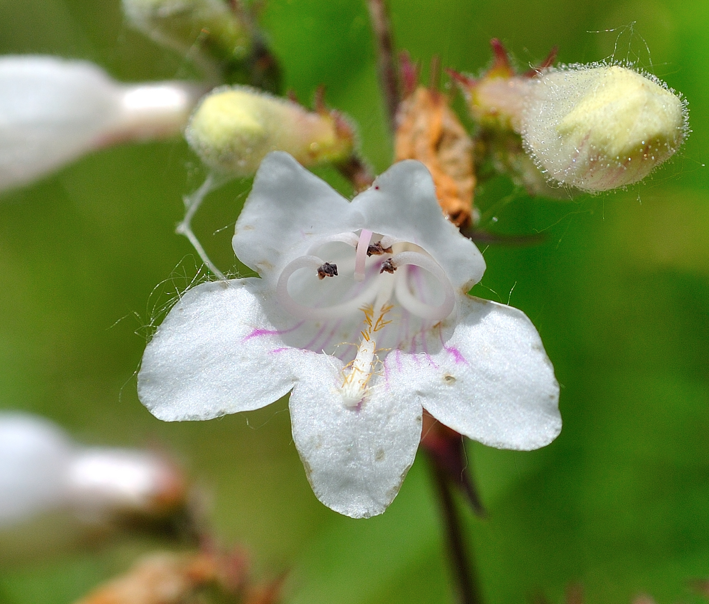

<!-- Slideshow container -->

<!-- Full-width images with number and caption text -->

1 / 18

<i>Penstemon digitalis</i>, commonly known as <b><a class="one" href="https://www.inaturalist.org/taxa/81942-Penstemon-digitalis" target="_blank" title="Go to iNaturalist">Foxglove beard-tongue</a></b> (S4, <b>G5</b>), is a native perennial forb and member of the family <i>Plantaginaceae</i>. It grows in full sun and moist sandy soils (i.e. meadows, prairies, fields, and open woodlands) and each flower is attached via a short stem (i.e. <b>pedicel</b>) to a much larger multi-branched (i.e. <b>panicle</b>) <b>inflorescence</b> (i.e. group of flowers). Thin delicate reddish purple lines mark the lower surface of the white corolla (i.e. nectar guides for pollinators). The flower also has five curving tubular <b>stamens</b>, four of which are black tipped, and a prominent <b>staminode</b> (i.e. sterile <b>stamen</b>) bearing yellowish hairs (i.e. hence the name “<i>beard-tongue</i>”). Ecologically the plant is a food source for many types of pollinators, including butterflies, bees, and hummingbirds.

2 / 18

<i>Asclepias syriaca</i> (<b>S5</b>, <b>G5</b>), also known as <b><a class="one" href="https://www.inaturalist.org/taxa/47911-Asclepias-syriaca" target="_blank" title="Go to iNaturalist">Common Milkweed</a></b>, and <i>Tetraopes tetrophthalmusis</i> (<b>S5</b>, <b>G5</b>), commonly referred to as <b><a class="one" href="https://www.inaturalist.org/taxa/118559-Tetraopes-tetrophthalmus" target="_blank" title="Go to iNaturalist">Red Milkweed Beetles</a></b> (inset image). The plant is a native perennial forb that produces a characteristic milky white latex when damaged (<b>Stevens</b> 2006). The latex contains not only <b><a class="one" href="https://opc-project.netlify.app/project/pnps" target="_blank" title="Go to PNP section">isoprene</a></b> (i.e. carbon monomer of natural rubber) but also toxic compounds such as <b><a class="one" href="https://opc-project.netlify.app/project/pnps" target="_blank" title="Go to PNP section">cardiac glycosides</a></b> (<b>Agrawal and Konno</b> 2009). Many insect species (over 400) that feed on <i>Asclepias</i> spp. like the larva of the <b>Monarch butterfly</b> (<i>Danaus plexippus</i>) and <b>Red Milkweed Beetles</b> store toxic cardenolides in their tissues to ward off predators (<b>Parson</b> 1965, <b>Reichstein</b> et. al. 1968, <b>Agrawal</b> et. al. 2012, <b>Lopez-Goldar</b> et. al. 2022). Both <b>Waugh</b> (1916) and <b>Gilmore</b> (1919) also mentioned that First Nations People use different parts of the plant as food (i.e. young sprouts, floral buds, and young green fruit pods).

3 / 18

<i>Rosa carolina</i> (S4, <b>G5</b>), commonly known as <b><a class="one" href="https://www.inaturalist.org/taxa/129196-Rosa-carolina" target="_blank" title="Go to iNaturalist">Carolina Rose</a></b> or <b>Pasture Rose</b>, is a native perennial shrub and member of the family <i>Rosaceae</i>. The fragrant flowers have five light pink petals and a showy yellow centre sporting over 100 stamens. Unlike some related species (<i>R. palustris</i> and <i>R. virginiana</i>) the needle-like thorns on this rose species are straight not curved. It can be found in thickets and open woodlands. <b>Arnason</b> et. al. 1981 mentions that the buds of some species of <b>Roses</b> (e.g. <i>R. virginiana</i>) were occasional eaten by the <b>Ojibwa</b>. Today we known that <b>rose hips</b>, the accessory fruit produced by these flowers, are a rich source of <b><a class="one" href="https://fdc.nal.usda.gov/food-details/168998/nutrients" target="_blank" title="Go to USDA">vitamin C</a></b> (<b>Pyke</b> and <b>Melville</b> 1942).

4 / 18

<i>Erigeron strigosus</i> (<b>S5</b>, <b>G5</b>), commonly known as <b><a class="one" href="https://www.inaturalist.org/taxa/76942-Erigeron-strigosus" target="_blank" title="Go to iNaturalist">Daisy Fleabane</a></b>, is a native forb and member of the family <i>Asteraceae</i>. The flowers are composed of multiple (50-100) <b>ray florets</b> (usually white) and a central yellow <b>disc floret</b>. Apparently they exhibit a certain degree of morphological plasticity and are therefore often mistaken for other closely related <b>Fleabanes</b> such as <i>Erigeron annuus</i>. However, the leaves of this plant are simple, narrow, and generally smooth along the margins. They also become smaller as you ascend the plant. In addition, the stems are <b>strigose</b> (i.e. hairs pressed against stem, upwards and not outwards as is typical of <i>Erigeron annuus</i>) or minutely <b>strigose</b> (i.e. <b>strigilose</b>).

5 / 18

<i>Aletris farinosa</i> (S2, <b>G5</b>), commonly referred to as <b><a class="one" href="https://www.inaturalist.org/taxa/158161-Aletris-farinosa" target="_blank" title="Go to iNaturalist">White-tubed Colicroot</a></b> is a native perennial forb and member of the family <i>Nartheciaceae</i>. The plant has a relatively long (2-3 ft.) leafless flowering stalk that is topped by a spike-like cluster of small beautiful creamy white cylindrical flowers. <b>White</b> and <b>Madany</b> (1981) noted that <i>A. farinosa</i> was one of a few characteristic (indicator) species of †mesic sandy prairies (Note: †moisture-substrate classification scheme used to characterize local floral communities). Unfortunately <b>COSEWIC</b> (2015) lists the species as highly threatened and no existing habitat is regulated under current provincial law. <b>COSEWIC</b> (2015) estimates that there are only ~14,600 plants, mostly (~93%) located within a 12 km2 area of Essex county. All existing sub-populations are imperilled due to the continued fragmentation and loss of habitat.

6 / 18

<i>Verbena stricta</i> (S4, <b>G5</b>), commonly known as <b><a class="one" href="https://www.inaturalist.org/taxa/63319-Verbena-stricta" target="_blank" title="Go to iNaturalist">Hoary Vervain</a></b>, is a native perennial that is fairly common in central and eastern parts of North America. The lavender flowers have 5 petals of unequal size and shape (Note: 2 large lateral lobes and a notch lobe on the bottom). The seeds (i.e. tiny nutlets) generated by the plant are an important food resource for many small birds and mammals.

7 / 18

<i>Asclepias tuberosa</i> (S4, <b>G5</b>), commonly known as <b><a class="one" href="https://www.inaturalist.org/taxa/47912-Asclepias-tuberosa" target="_blank" title="Go to iNaturalist">Butterfly weed</a></b> or <b>Orange Milkweed</b>, and the butterfly <i>Satyrium edwardsii</i> (S4, G4), commonly known as <b><a class="one" href="https://www.inaturalist.org/taxa/81566-Satyrium-edwardsii" target="_blank" title="Go to iNaturalist">Edwards’ hairstreak</a></b>. The plant is a native perennial forb and an important food resource for many pollinating insects, most notably butterflies (<b>Stevens</b> 2006). First Nations People used the roots of the plant to treat respiratory illnesses (i.e. aka: <b>Pleuresy root</b>). According to <b>Gilmore</b> (1919) the “<i>…root was eaten raw for bronchial and pulmonary trouble</i>”. It’s also interesting to note that the concentration of <b><a class="one" href="https://opc-project.netlify.app/project/pnps" target="_blank" title="Go to PNP section">cardiac glycosides</a></b> within the leaves of <i>A. tuberosa</i> are much lower than those found in other milkweed species (<b>Agrawal</b> et. al 2009), which may help to explain why it is not the preferred host plant of <b>Monarch butterflies</b>. <i>S. edwardsii</i> feeding on <b>Butterfly weed</b> is a common site at <b>OPC</b> due in part to the presence of oaks since their larvae feed on <i>Quercus</i> species. The distinguishing features of this butterfly include the row of white-rimmed spots on the underside and the prominent orange mark along the inner margin of the hind-wing.

8 / 18

<i>Lilium michiganense</i> (S4, <b>G5</b>), commonly referred to as <b><a class="one" href="https://www.inaturalist.org/taxa/223671-Lilium-michiganense" target="_blank" title="Go to iNaturalist">Michigan Lily</a></b>, is one of the most beautiful native perennials forbs at <b>OPC</b>. It is a member of the family <i>Liliaceae</i> and can be found in Tallgrass prairies, lake shores and wet woodland margins. The bright orange flowers sport dark brown spots and prominent re-flexed petals. The whorled leaf arrangement just below the inflorescence helps distinguish it from other similar looking exotic lily species.

9 / 18

<i>Asclepias purpurascens</i> (S1, G4), commonly known as <b><a class="one" href="https://www.inaturalist.org/taxa/125380-Asclepias-purpurascens" target="_blank" title="Go to iNaturalist">Purple Milkweed</a></b>, is a rare native herbaceous plant of eastern and central North America that prefers partial shade. A notably feature of this plant is the colour transitions (i.e. turns a darker purple) the flower undergoes as it matures (Note: darker older umbel on the right).

10 / 18

<i>Lobelia spicata</i> (S4, <b>G5</b>) commonly known as <b><a class="one" href="https://www.inaturalist.org/taxa/128839-Lobelia-spicata" target="_blank" title="Go to iNaturalist">Pale-spiked Lobelia</a></b>, is a native forb of North America and member of the bellflower family (<i>Campanulaceae</i>).

11 / 18

<i>Baptisia tinctoria</i> (S1, <b>G5</b>), commonly referred to as <b><a class="one" href="https://www.inaturalist.org/taxa/81897-Baptisia-tinctoria" target="_blank" title="Go to iNaturalist">Eastern Wild Indigo</a></b>, and <i>Erynnis baptisiae</i> (S4, <b>G5</b>) otherwise known as <b><a class="one" href="https://www.inaturalist.org/taxa/58478-Erynnis-baptisiae" target="_blank" title="Go to iNaturalist">Wild Indigo Duskywing</a></b>. This native perennial shrubby plant is a member of the family <i>Fabaceae</i>. First Nations People used the bark and roots of the plant to treat wounds (<b>Belt</b> 2009).

12 / 18

<i>Tradescantia ohiensis</i> (S2, <b>G5</b>), commonly known as <b><a class="one" href="https://www.inaturalist.org/taxa/79383-Tradescantia-ohiensis" target="_blank" title="Go to iNaturalist">Ohio Spiderwort</a></b>, is a native perennial forb and member of the Dayflowers family <i>Commelinaceae</i>. The smooth leaves of this plant wrap around the stem and have a parallel vein structure. The beautiful blue-violet flowers have three rounded petals and six bright yellow anthers. They form small clusters close to the stems with only a few flowers in bloom at any one time.

13 / 18

<i>Apocynum androsaemifolium</i> (<b>S5</b>, <b>G5</b>), commonly known as <b><a class="one" href="https://www.inaturalist.org/taxa/47359-Apocynum-androsaemifolium" target="_blank" title="Go to iNaturalist">Spreading Dogbane</a></b>, is a native perennial forb and member of the dogbane family <i>Apocynaceae</i>. Similar to milkweeds the smooth stems of this plant exude a milky sap when broken that contains toxic <b><a class="one" href="https://opc-project.netlify.app/project/pnps" target="_blank" title="Go to PNP section">cardiac glycosides</a></b>. Pairs of white pinkish flowers emerge from small stalks (see above) that can generate long thin seed pods filled with silky-haired seeds.

14 / 18

<i>Papilio cresphontes</i> (<b>S5</b>, <b>G5</b>), commonly known as the <b><a class="one" href="https://www.inaturalist.org/taxa/85024-Heraclides-cresphontes" target="_blank" title="Go to iNaturalist">Eastern Giant Swallowtail</a></b>, is the largest butterfly in North America. There notable wingspan (i.e. upwards of 18 cm in females) makes them powerful flyers and they are considered pests to citrus farmers (i.e. larvae eat young tree foliage). The larva deter predators by employing camouflage (i.e. mimic bird droppings) and an <b>osmeterium</b>. The latter is an inflatable orange-red Y-shaped organ located behind the head that secretes foul smelling compounds that wards off invertebrate predators (<b>Leslie</b> and <b>Berenbaum</b> 1990, <b>Minno</b> and </b>Emmel 1992).

15 / 18

<i>Lythrum alatum</i> (S3, <b>G5</b>), commonly known as <b><a class="one" href="https://www.inaturalist.org/taxa/128998-Lythrum-alatum" target="_blank" title="Go to iNaturalist">Winged Loosestrife</a></b>, is a provincially rare native perennial plant and member of the family <i>Lythraceae</i>. The six pink petals have a striking magenta central vein, and six stamens tipped by dark purple anthers. It prefers low lying wet areas as evidenced by this specimen, which was found in open wet field close to the Detroit river.

16 / 18

<i>Pantherophis vulpinus</i> (S3, <b>G5</b>), commonly known as the <b><a class="one" href="https://www.inaturalist.org/taxa/320680-Pantherophis-vulpinus" target="_blank" title="Go to iNaturalist">Eastern Fox Snake</a></b>, is a rare and <u>threatened species</u> (<b><a class="one" href="https://www.iucnredlist.org/species/90069683/90069697" target="_blank" title="Go to IUCN">Hammerson 2019</a></b>) of rat snake and member of the family <i>Colubridae</i>. It is a relatively large but docile snake (i.e. adults upwards of 1.83 metres in length) that is golden brown in colour with dark brown spots. This non-venomous constrictor can shake its tail in dry leaves if threatened (i.e. mimics sound of a rattlesnake), and also emit a musky odour (i.e. hence the name).

17 / 18

<i>Hypericum perforatum</i> (<b>SE5</b>, <b>G5</b>), commonly known as <b><a class="one" href="https://www.inaturalist.org/taxa/56077-Hypericum-perforatum" target="_blank" title="Go to iNaturalist">St. John’s wort</a></b>, is an exotic perennial forb that was introduced to North America from the Old World. Its bright yellow flowers have five petals, each bearing tiny black coloured dot-like glands along their margins. They also have many prominent yellow stamens flaring our from the centre of the flower. The species earned its “<i>perforatum</i>” name by having many small translucent leaf glands that are clearly visible when the leaf is held up to the sun. Although exotic and invasive to disturbed areas its extensive root system does help to control soil erosion. It’s also a good source of nectar for many pollinating insects (<b>Sheahan</b> 2012).

18 / 18

<i>Speyeria cybele</i> (<b>S5</b>, <b>G5</b>), commonly known as the <b><a class="one" href="https://www.inaturalist.org/taxa/1456562-Argynnis-cybele" target="_blank" title="Go to iNaturalist">Great Spangled Fritillary butterfly</a></b>, is a native butterfly species and member of the family <i>Nymphalidae</i>. It has orange coloured wings with a series of dorsal black markings (dashes, crescents) on both the fore-wing and hind-wing. On the ventral side there is a notable yellow band and multiple triangular silver spots close to the edge of the hind-wing that help distinguish it from other closely related Fritillary butterflies such as <i>Speyeria aphrodite</i> (<b><a class="one" href="https://www.inaturalist.org/taxa/1456585-Argynnis-aphrodite" target="_blank" title="Go to iNaturalist">Aphrodite Fritillary</a></b>).

<!-- Next and previous buttons -->

<a class="prev" onclick="plusSlides(-1)">❮</a>
<a class="next" onclick="plusSlides(1)">❯</a>

 

<!-- The dots/circles -->

<!-- Java Script -->

References cited in above photo gallery: <b>[1](#ref-waugh_iroquois_1916)–[19](#ref-lopez-goldar_evidence_2022)</b>

<h3>
GLOBAL & REGIONAL RANKINGS
</h3>

**GRANKS** (**G**, global rankings) and **SRANKS** (**S**, State/Province rankings) provide designations for floral and ecosystem abundance. They are assigned and maintained by several conservation agencies. The following general rankings are from **<a class="one" href="https://explorer.natureserve.org/AboutTheData/DataTypes/ConservationStatusCategories" target="_blank" title="Go to NatureServe">NatureServe</a>**:  
GX: Presumed Extinct/Collapsed: **Species** <u>presumed extinct</u>, not located despite intensive searches and virtually no likelihood of rediscovery. **Ecosystem** <u>presumed collapsed</u> throughout its range, due to loss of key dominant and characteristic taxa and/or elimination of the sites and ecological processes on which the type depends.  
GH - Possibly Extinct/Collapsed: **Species** or **Ecosystem** is known from only historical occurrences, but still some hope of rediscovery. Examples of evidence include (1) that a species has not been documented in approximately 20-40 years in human-dominated landscapes despite some searching and/or some evidence of significant habitat loss or degradation; (2) that a species or ecosystem has been searched for unsuccessfully, but not thoroughly enough to presume that it is extinct or collapsed throughout its range.  
G1 - Critically Imperiled: At very high risk of extinction or collapse due to very restricted range, very few populations or occurrences, very steep declines, very severe threats, or other factors.  
G2 - Imperilled: At high risk of extinction or collapse due to restricted range, few populations or occurrences, steep declines, severe threats, or other factors.  
G3 - Vulnerable: At moderate risk of extinction or collapse due to a fairly restricted range, relatively few populations or occurrences, recent and widespread declines, threats, or other factors.  
G4 - Apparently Secure: At fairly low risk of extinction or collapse due to an extensive range and or many populations or occurrences, but with possible cause for some concern as a result of local recent declines, threats, or other factors.  
<b>G5 - Secure</b>: At very low risk or extinction or collapse due to a very extensive range, abundant populations or occurrences, and little to no concern from declines or threats.

**GRANK**s and **SRANK**s may also include other designations, notably: **GU** (uncertain global ranking); **G?** (tentative ranking); **Q** (questionable taxonomic status of the species, subspecies, or variety); **T** (rank applies to a subspecies or variety); and **HYB** (hybrid of 2 species); **SH** (plant historically occurred in Ontario, but has not been recorded in the last 20 years); **SR** (plant has been reported without persuasive documentation); **SU** (species has no SRANK value and therefore of uncertain status); **SX** (species apparently extirpated from Ontario with little likelihood of rediscovery); **SE** (species is exotic, not native to Ontario); **?** (some uncertainty about an assigned rank). Rank ranges (e.g. S1S2) indicate the uncertain nature of the species rank (i.e. either S1 or S2).

------------------------------------------------------------------------

<!--------------------------------------------------------------------->

© Jeffrey C Howard (B.Sc. B.Ed. M.Sc. Ph.D.). The material contained within this website may be copied, distributed and displayed without alterations for noncommercial purposes only provided that it is accompanied by acknowledgements to the author. All commercial and non-commercial rights are reserved to the author.  
<!--------------------------------------------------------------------->

  
**REFERENCES:**

1 Waugh FW. *[Iroquois Foods and Food Preparation](https://www.canadiana.ca/view/oocihm.82410/1)*. Ottawa, Canada: Ottawa : Govt. Print. Bureau; 1916.

2 Gilmore MR. *[Uses of plants by the Indians of the Missouri River region](https://doi.org/10.5962/bhl.title.32507)*. Washington, DC: Govt. print. off; 1919.

3 Smith HH. *Ethnobotany of the Ojibwe Indians*. Milwaukee, Wis., US: Public Museum of the City of Milwaukee; 1932.

4 Pyke M, Melville R. [Vitamin C in rose hips](https://www.ncbi.nlm.nih.gov/pmc/articles/PMC1265699). *Biochemical Journal* 1942;**36**:336–9.

5 Parson JA. [A digitalis-like toxin in the monarch butterfly, Danaus plexippus L](https://www.ncbi.nlm.nih.gov/pmc/articles/PMC1357291/). *The Journal of Physiology* 1965;**178**:290–304.

6 Reichstein T, Euw J von, Parsons JA, Rothschild M. Heart poisons in the monarch butterfly. Some aposematic butterflies obtain protection from cardenolides present in their food plants. *Science (New York, NY)* 1968;**161**:861–6. <https://doi.org/10.1126/science.161.3844.861>.

7 Arnason T, Hebda RJ, Johns T. Use of plants for food and medicine by Native Peoples of eastern Canada. *Canadian Journal of Botany* 1981;**59**:2189–325. <https://doi.org/10.1139/b81-287>.

8 White J, Madany MH. [Classification of Prairie Communities in Illinois](https://search.library.wisc.edu/digital/AEUUSQ3V4L42D58R/pages/A27D3PEK7LBLW48A). *The Prairie Peninsula - in the "Shadow" of Transeau: Proceedings of the Sixth North American Prairie Conference* 1981:169–71.

9 Leslie AJ, Berenbaum MR. [Role of the osmeterial gland in swallowtail larvae (Papilionidae) in defense against an avian predator](http://www.scopus.com/inward/record.url?scp=0025528481&partnerID=8YFLogxK). *Journal - Lepidopterists’ Society* 1990;**44**:245–51.

10 Minno MC, Emmel TC. [Larval protective coloration in swallowtails from the Florida Keys (Lepidoptera: Papilionidae).](https://journals.flvc.org/troplep/article/view/89877) *Tropical Lepidoptera Research* 1992:47–9.

11 Stevens M. *[Fact sheet for Common Milkweed (Asclepias syriaca).](https://plants.usda.gov/plant-profile/ASSY)* USDA - Natural Resources Conservation Service, Baton Rouge, Louisiana.; 2006.

12 Stevens M. *[Fact sheet for Butterfly Milkweed (Asclepias tuberosa).](https://plants.usda.gov/plant-profile/ASTU)* USDA - Natural Resources Conservation Service, Baton Rouge, Louisiana.; 2006.

13 Agrawal AA, Konno K. Latex: A Model for Understanding Mechanisms, Ecology, and Evolution of Plant Defense against Herbivory. *Annu Rev Ecol Evol Syst* 2009;**40**:311–31.

14 Agrawal AA, Salminen J-P, Fishbein M. Phylogenetic Trends in Phenolic Metabolism of Milkweeds (Asclepias): Evidence for Escalation. *Evolution* 2009;**63**:663–73. <https://doi.org/10.1111/j.1558-5646.2008.00573.x>.

15 Belt S. *Plant Fact Sheet for Horsefly Weed, Baptisia tinctoria (L.) R. Br.* USDA, NRCS National Plant Materials Center, Beltsville, Maryland; 2009.

16 Agrawal A, Petschenka A, Bingham R, Weber M, Rasmann S. Toxic Cardenolides: Chemical Ecology and Coevolution of Specialized Plant-Herbivore Interactions. *The New Phytologist* 2012;**194**:28–45. <https://doi.org/10.1111/j.1469-8137.2011.04049.x>.

17 Sheahan CM. *[Fact sheet for common St. Johnswort (Hypericum perforatum)](https://plants.usda.gov/DocumentLibrary/factsheet/pdf/fs_hype.pdf)*. USDA-NRCS Cape May Plant Materials Center, Cape May, NJ. 08210.; 2012.

18 Jones J, Bennett BA. *[COSEWIC Assessment and Status Report on the Colicroot, Aletris farinosa, in Canada](https://publications.gc.ca/site/eng/9.814013/publication.html?wbdisable=true)*. Ottawa, Canada: COSEWIC; 2015.

19 López-Goldar X, Hastings A, Züst T, Agrawal A. Evidence for tissue-specific defence-offence interactions between milkweed and its community of specialized herbivores. *Molecular Ecology* 2022;**31**:3254–65. <https://doi.org/10.1111/mec.16450>.

