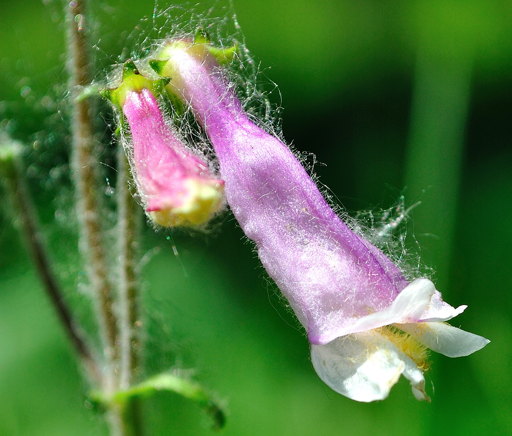
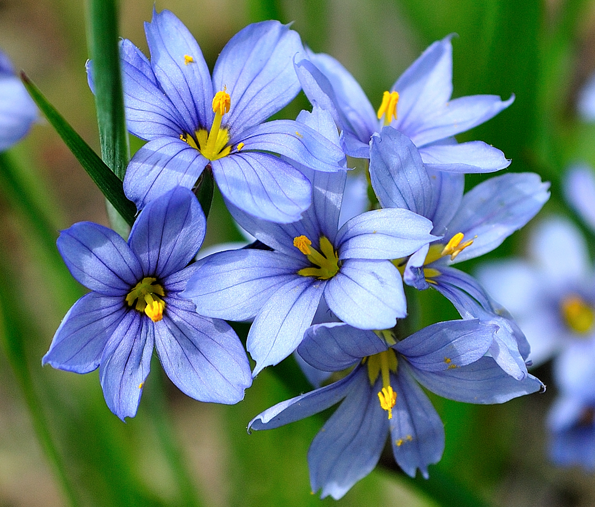
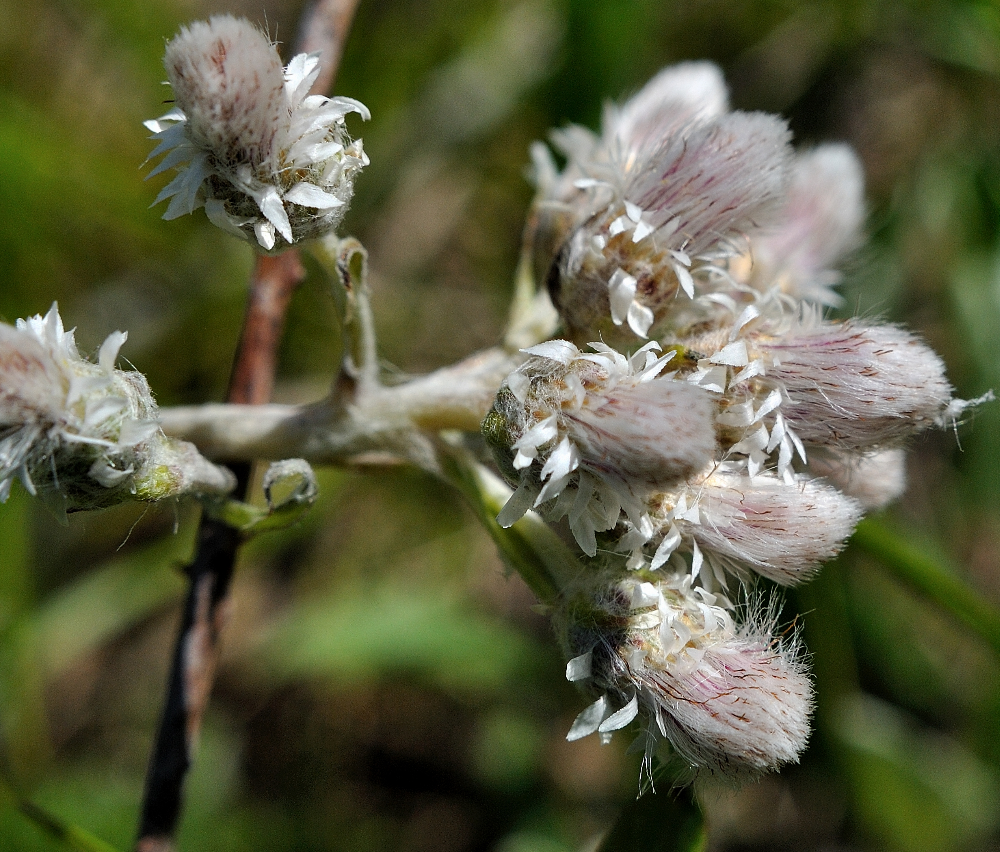
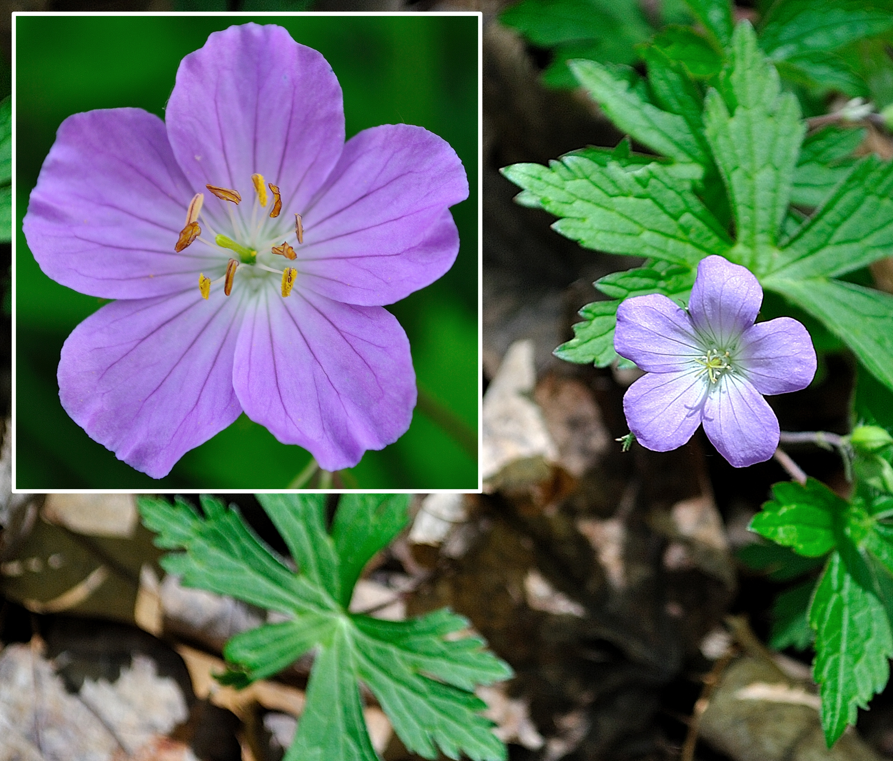
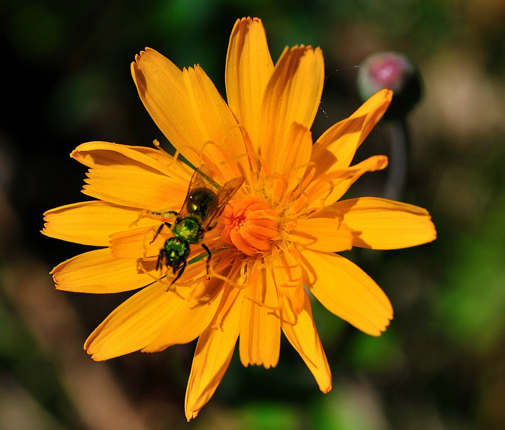

<style type="text/css">

* {box-sizing:border-box}
body {font-family: Verdana, sans-serif; margin:0}
.mySlides {display: none}
img {vertical-align: middle;}


/* ======================= */
/* SlideShow container CSS */
/* ======================= */

.slideshow-container {
  max-width: 500px;
  position: relative;
  margin: auto;
  }

/* ========================== */
/* Hide the images by default */
/* ========================== */

.mySlides {
  display: none;
  }

/* ======================== */
/*  Next & previous buttons */
/* ======================== */

.prev, .next {
  cursor: pointer;
  position: absolute;
  top: 50%;
  width: auto;
  margin-top: -22px;
  padding: 16px;
  color: white;
  font-weight: bold;
  font-size: 18px;
  transition: 0.6s ease;
  border-radius: 0 3px 3px 0;
  user-select: none;
  }

/* ================================ */
/* Position: "next button" to right */
/* ================================ */

.next {
  right: 0;
  border-radius: 3px 0 0 3px;
  }

/* ====================================================== */
/* On hover: black bkgd color with little bit see-through */
/* ====================================================== */

.prev:hover, .next:hover {
  background-color: rgba(0,0,0,0.8);
  }


/* ====================== */
/* Caption Container text */
/* ====================== */

.caption-container {
  font-size: 14px;
  text-align: left;
  background-color: rgb(240,240,240);
  padding: 5px 5px;
  color: white;
}


/* ===================== */
/* Number text (1/10 etc) */
/* ===================== */

.numbertext {
  color: #f2f2f2;
  font-size: 12px;
  padding: 8px 12px;
  position: absolute;
  top: 0;
  }

/* =========================== */
/*   Dots/bullets/indicators   */
/* =========================== */

.dot {
  cursor: pointer;
  height: 15px;
  width: 15px;
  margin: 0 2px;
  background-color: #bbb;
  border-radius: 50%;
  display: inline-block;
  transition: background-color 0.6s ease;
  }

.active, .dot:hover {
  background-color: #717171;
  }


/* ==================== */
/*   Fading animation   */
/* ==================== */

.fade {
  animation-name: fade;
  animation-duration: 1.5s;
  }

@keyframes fade {
  from {opacity: .4}
  to {opacity: 1}
  }


/* =============================== */
/*          CSS for Links          */
/* =============================== */

a.one:link {color: rgb(0, 0, 200);}
a.one:visited {color: rgb(192, 20, 172);}
a.one:hover {color: rgb(255, 20, 100);}


/* ============================== */
/*     CSS for stylizing text     */
/* ============================== */

#Blk { font-weight: bold; color: rgb(0, 0, 0); }
#blk { color: rgb(0, 0, 0); }
#Red { font-weight: bold; color: rgb(255, 10, 20); }
#Dred { font-weight: bold; color: rgb(175, 0, 0); }
#Or { font-weight: bold; color: rgb(255, 140, 0); }
#Gold { font-weight: bold; color: rgb(230, 190, 0); }
#Gr2 { font-weight: bold; color: rgb(25, 150, 25); }
#Teal { font-weight: bold; color: rgb(60, 180, 180); }
#Blue { font-weight: bold; color: blue; }
#Glacialb { font-weight: bold; color: rgb(54, 139, 193); }
#Violet { font-weight: bold; color: rgb(180, 73, 255); }
#Purple { font-weight: bold; color: rgb(150, 0, 255); }
#Magenta { font-weight: bold; color: rgb(255, 0, 255); }
#Salmon { font-weight: bold; color: rgb(255, 140, 160); }
#Silver { font-weight: bold; color: rgb(192, 192, 192); }
#Gray { font-weight: bold; color: rgb(155, 155, 155); }
#Rust { font-weight: bold; color: rgb(183, 65, 14); }
#Dbr { font-weight: bold; color: rgb(100, 20, 20); }

</style>


```{r setup, include=FALSE}
knitr::opts_chunk$set(collapse = TRUE)

### Libraries
library(pacman)
pacman::p_load(blogdown, tidyverse, kableExtra, dplyr, purrr, bibtex, citr, htmlwidgets, htmltools)

```


<!-- Slideshow container -->
<div class="slideshow-container">

<!-- Full-width images with number and caption text -->
<div class="mySlides fade">
<div class="numbertext">1 / 10</div>

<div class="caption-container"><p id="caption"><span id="blk"><b>Balsam Ragwort</b> (<b>SU</b>, <b>G5</b>), or <i>Packera paupercula</i>, is a native perennial forb and member of the <i>Asteraceae</i> family. The smooth central green stalk supports a few small stem leaves that are noticeably narrow and frond-like (i.e. lobed half-way or more to the midrib, otherwise known as <b><a class="one" href="https://www.fs.usda.gov/wildflowers/beauty/ferns/structure.shtml" target="_blank" title="Go to USDA">pinnatifid</a></b>). It prefers wet meadows as was the case for this specimen (i.e. among the wet Tallgrasses of Ojibway Prairie Provincial Nature Reserve).
</span></p></div>
</div>

<div class="mySlides fade">
<div class="numbertext">2 / 10</div>

<div class="caption-container"><p id="caption"><span id="blk"><b>Canadian Anemone</b> (<b>S5</b>, <b>G5</b>), also known as <b>Meadow Anemone</b> (<i>Anemonastrum canadense</i>), is a perennial forb and member of the family <i>Ranunculaceae</i>. <b>Gilmore</b> (1919) mentions that the &ldquo;<i>...root of this plant was one of the most highly esteemed medicines...it was prescribed for a great many ills, especially wounds...and was used also as a wash for sores affecting the eyes or other parts</i>&rdquo;.</span></p></div>
</div>

<div class="mySlides fade">
<div class="numbertext">3 / 10</div>

<div class="caption-container"><p id="caption"><span id="blk"><b>Hairy Beardtongue</b> (<span id="Blue">S4</span>, <b>G5</b>), or <i>Penstemon hirsutus</i>, is a native perennial species with noticeable hairy erect stems that support small clusters of lavender coloured trumpet-like flowers. Its common name comes from the tufted or &ldquo;<i>bearded</i>&rdquo; appearance of the stamen peaking out from under the lips of the slender flowers.</span></p></div>
</div>

<div class="mySlides fade">
<div class="numbertext">4 / 10</div>

<div class="caption-container"><p id="caption"><span id="blk"><b>Northern Blue Flag</b> (<b>S5</b>, <b>G5</b>), or <i>Iris versicolor</i>, is a native perennial forb and member of the family <i>Iridaceae</i> (Irises). The showy blue-to-violet coloured flower is composed of 3 downward-curving <b>sepals</b> (&ldquo;<i>falls</i>&rdquo;), and 3 shorter erect <b>petals</b> (&ldquo;<i>standards</i>&ldquo;). Closely perched on top of each <b>sepal</b> is a slightly shorter and less colourful <b>style arm</b> that hides the <b>anther</b> (i.e. male part containing pollen). The wide <b>sepal</b> tips serve as landing pads for bees that then travel between the <b>sepal</b> and roof-like <b>style arm</b> towards the nectar at the centre of the flower. Guided by the hairy yellow central line the bees inevitably become &ldquo;dusted&rdquo; with pollen. Although the roots are poisonous to humans <b>Gilmore</b> (1919) mentions that First Nations People used parts of the plant as medicine. Specifically the &ldquo;<i>...rootstock was pulverized and mixed with water, or more often with saliva, and the infusion dropped into the ear to cure earache; it was used also to medicate eye-water. A paste was made to apply to sores and bruises.</i>&rdquo;</span></p></div>
</div>

<div class="mySlides fade">
<div class="numbertext">5 / 10</div>

<div class="caption-container"><p id="caption"><span id="blk"><b>Narrow-leaf-blue-eyed-grass</b> (<span id="Blue">S4</span>, <b>G5</b>), or <i>Sisyrinchium angustifolium</i>, is a petit but pretty native perennial plant of North America. It is also a member of the family <i>Iridaceae</i> (Irises) and can be found in moist meadows and open woodlands.</span></p></div>
</div>

<div class="mySlides fade">
<div class="numbertext">6 / 10</div>

<div class="caption-container"><p id="caption"><span id="blk"><b>Field Pussytoes</b> (<b>S5</b>, <b>G5</b>), also known as <b>Field cat's foot</b> (<i>Antennaria neglecta</i>), is a small herbaceous plant and member of the family <i>Asteraceae</i>. This species boasts tight clusters of white &ldquo;furry&rdquo; flower heads and small narrow spatula-shaped leaves at its base.</span></p></div>
</div>

<div class="mySlides fade">
<div class="numbertext">7 / 10</div>

<div class="caption-container"><p id="caption"><span id="blk"><b>Spotted Geranium</b> (<b>S5</b>, <b>G5</b>), also known as <b>Wood Geranium</b> (<i>Geranium maculatum</i> L.), is a common native perennial plant of eastern North America that prefers moist woodlands. <b>Smith</b> (1932) mentions that First Nations People (Ojibwe) &ldquo;<i>use the astringent root for the treatment of <u>flux</u>,</i>&rdquo; (i.e. inflammation of the <b><a class="one" href="https://my.clevelandclinic.org/health/body/22740-periosteum" target="_blank" title="Go to MayoClinic">periosteum</a></b> of the jaw) &ldquo;<i>and also for healing a sore mouth</i>&rdquo;. Similar claims were also reported by <b>Arnason</b> (1981).</span></p></div>
</div>

<div class="mySlides fade">
<div class="numbertext">8 / 10</div>

<div class="caption-container"><p id="caption"><span id="blk"><b>Two-Flower Cynthia</b> (<span id="Or">S2</span>, <b>G5</b>), also known as <b>Two-flower Dwarf Dandelion</b> (<i>Krigia biflora</i>), is a native perennial forb and member of the family <i>Asteraceae</i>. The species' status is imperilled within Ontario and largely unknown in most parts of the eastern US. It can be found in wet meadows and prairies and can be easily identified by the two prominent orange-yellow rayed flower heads found atop their erect 45-to-80 cm stalks.</span></p></div>
</div>

<div class="mySlides fade">
<div class="numbertext">9 / 10</div>

<div class="caption-container"><p id="caption"><span id="blk"><b>Wild Lupine</b> (<span id="Or">S2</span><span id="Gold">S3</span>, <b>G5</b>), also known as <b>sundial</b> or <b>blue lupine</b> (<i>Lupinus perennis</i>), is a provincially endangered native perennial and member of the family <i>Fabaceae</i>. The leaves of the plant have a very distinctive palmate shape with several radiating leaflets. Ecologically the plant serves as an important food resource for the larval stage of many butterfly species, including the globally endangered <b>Karner blue</b> (i.e. <i>Plebejus samuelis</i> caterpillars feed exclusively on lupine leaves).</span></p></div>
</div>

<div class="mySlides fade">
<div class="numbertext">10 / 10</div>

<div class="caption-container"><p id="caption"><span id="blk"><b>Eastern Yellow Star-Grass</b> (<span id="Or">S2</span><span id="Gold">S3</span>, <b>G5</b>), also known as <b>yellow star flower</b> or <b>common goldstar</b> (<i>Hypoxis hirsuta</i>), is a native perennial species and member of the family <i>Hypoxidaceae</i>. The brilliant golden flowers of this petit plant sports six petal-like structures, or <b>tepals</b>, that are arranged in two whorls, as well as six showy arrow-shaped yellow anthers. According to <b>Zong-Xin Ren</b> et al. (2019) these flowers do not produce nectar leaving pollen as the only reward for pollinators (i.e. mostly female native bees). The plant itself can be found in moist meadows and open wooded areas. Occasional one can come across variants that have white flowers (see lower insert).</span></p></div>
</div>

<!-- Next and previous buttons -->
<a class="prev" onclick="plusSlides(-1)">&#10094;</a>
<a class="next" onclick="plusSlides(1)">&#10095;</a>

</div>

<br>

<!-- The dots/circles -->
<div style="text-align:center">
  <span class="dot" onclick="currentSlide(1)"></span>
  <span class="dot" onclick="currentSlide(2)"></span>
  <span class="dot" onclick="currentSlide(3)"></span>
  <span class="dot" onclick="currentSlide(4)"></span>
  <span class="dot" onclick="currentSlide(5)"></span>
  <span class="dot" onclick="currentSlide(6)"></span>
  <span class="dot" onclick="currentSlide(7)"></span>
  <span class="dot" onclick="currentSlide(8)"></span>
  <span class="dot" onclick="currentSlide(9)"></span>
  <span class="dot" onclick="currentSlide(10)"></span>
</div>


<!-- Java Script -->
<script>

<!-- Show first slide -->
let slideIndex = 1;
showSlides(slideIndex);

<!-- calling function to move to nth slide and show that slide. -->
function plusSlides(n) {
  showSlides(slideIndex += n);
  }

<!-- Sets slideIndex to n and then shows the nth slide. -->
function currentSlide(n) {
  showSlides(slideIndex = n);
  }

<!-- Inside showSlides function declare an empty variable i -->
<!-- Look in HTML for elements with class designations mySlides and dot -->
<!-- If end of list is reached set slideIndex back to 1. -->
<!-- If go backwards past first slide go to end slide (slides.length) -->
<!-- then set the display style of all slides to none (n = 0) -->
<!-- to remove all slides from the DOM (hides them) -->
function showSlides(n) {
  let i;
  let slides = document.getElementsByClassName("mySlides");
  let dots = document.getElementsByClassName("dot");
  if (n > slides.length) {slideIndex = 1}    
  if (n < 1) {slideIndex = slides.length}
  for (i = 0; i < slides.length; i++) {
    slides[i].style.display = "none";  
  }
<!-- Remove "active" class from all elements with "dot" as their class -->
  for (i = 0; i < dots.length; i++) {
    dots[i].className = dots[i].className.replace(" active", "");
  }
<!-- Set display style of slideIndex - 1 to block, -->
<!-- making it effectively visible (previously set to 'none') -->
<!-- and add active class to the dot of index slideIndex-1. -->
  slides[slideIndex-1].style.display = "block";  
  dots[slideIndex-1].className += " active";
  }

</script>


References cited in above photo gallery: <b>[@gilmore_uses_1919; @smith_ethnobotany_1932; @arnason_use_1981; @ren_comparative_2019]</b>


<hr style="border:2px solid gray">

<div align=center><h3>GLOBAL & REGIONAL RANKINGS</h3></div>

**GRANKS** (**G**, global rankings) and **SRANKS** (**S**, State/Province rankings) provide designations for floral and ecosystem abundance. They are assigned and maintained by several conservation agencies. The following general rankings are from **<a class="one" href="https://explorer.natureserve.org/AboutTheData/DataTypes/ConservationStatusCategories" target="_blank" title="Go to NatureServe">NatureServe</a>**:  
<span id="Red">GX: Presumed Extinct/Collapsed</span>: **Species** <u>presumed extinct</u>, not located despite intensive searches and virtually no likelihood of rediscovery. **Ecosystem** <u>presumed collapsed</u> throughout its range, due to loss of key dominant and characteristic taxa and/or elimination of the sites and ecological processes on which the type depends.  
<span id="Red">GH - Possibly Extinct/Collapsed</span>: **Species** or **Ecosystem** is known from only historical occurrences, but still some hope of rediscovery. Examples of evidence include (1) that a species has not been documented in approximately 20-40 years in human-dominated landscapes despite some searching and/or some evidence of significant habitat loss or degradation; (2) that a species or ecosystem has been searched for unsuccessfully, but not thoroughly enough to presume that it is extinct or collapsed throughout its range.  
<span id="Dred">G1 - Critically Imperiled</span>: At very high risk of extinction or collapse due to very restricted range, very few populations or occurrences, very steep declines, very severe threats, or other factors.  
<span id="Or">G2 - Imperilled</span>: At high risk of extinction or collapse due to restricted range, few populations or occurrences, steep declines, severe threats, or other factors.  
<span id="Gold">G3 - Vulnerable</span>: At moderate risk of extinction or collapse due to a fairly restricted range, relatively few populations or occurrences, recent and widespread declines, threats, or other factors.  
<span id="Blue">G4 - Apparently Secure</span>: At fairly low risk of extinction or collapse due to an extensive range and or many populations or occurrences, but with possible cause for some concern as a result of local recent declines, threats, or other factors.  
<b>G5 - Secure</b>: At very low risk or extinction or collapse due to a very extensive range, abundant populations or occurrences, and little to no concern from declines or threats.  

**GRANK**s and **SRANK**s may also include other designations, notably: **GU** (uncertain global ranking); **G?** (tentative ranking); **Q** (questionable taxonomic status of the species, subspecies, or variety); **T** (rank applies to a subspecies or variety); and **HYB** (hybrid of 2 species); **SH** (plant historically occurred in Ontario, but has not been recorded in the last 20 years); **SR** (plant has been reported without persuasive documentation); **SU** (species has no SRANK value and therefore of uncertain status); **SX** (species apparently extirpated from Ontario with little likelihood of rediscovery); **SE** (species is exotic, not native to Ontario); **?** (some uncertainty about an assigned rank). Rank ranges (e.g. <span id="Dred">S1</span><span id="Or">S2</span>) indicate the uncertain nature of the species rank (i.e. either <span id="Dred">S1</span> or <span id="Or">S2</span>).  


---

<hr style="border:2px solid gray">

<!--------------------------------------------------------------------->
&copy; Jeffrey C Howard (B.Sc. B.Ed. M.Sc. Ph.D.). The material contained within this website may be copied, distributed and displayed without alterations for noncommercial purposes only provided that it is accompanied by acknowledgements to the author. All commercial and non-commercial rights are reserved to the author.  
<!--------------------------------------------------------------------->

<hr style="border:2px solid gray">


<a id="Refs"></a>  
**REFERENCES:**  

<script src='https://storage.ko-fi.com/cdn/scripts/overlay-widget.js'></script>
<script>
  kofiWidgetOverlay.draw('jch274202227', {
    'type': 'floating-chat',
    'floating-chat.donateButton.text': 'Help Support',
    'floating-chat.donateButton.background-color': '#00b9fe',
    'floating-chat.donateButton.text-color': '#fff'
  });
</script>

