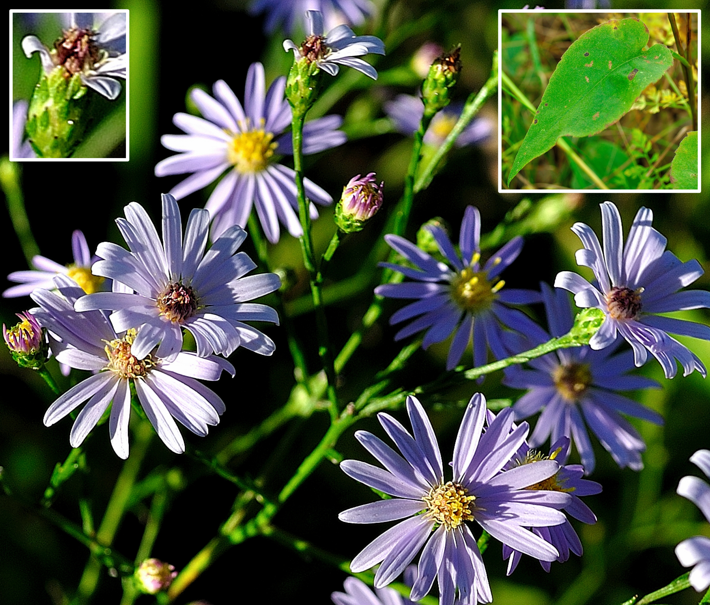
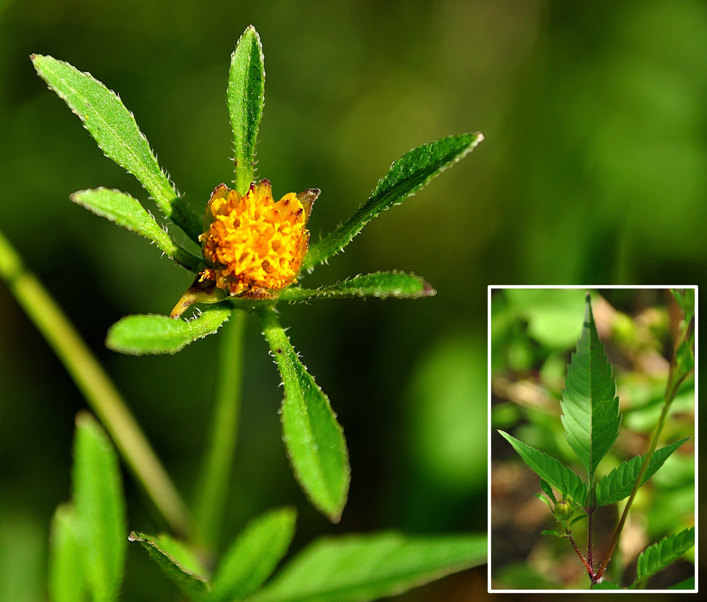

<style type="text/css">

* {box-sizing:border-box}
body {font-family: Verdana, sans-serif; margin:0}
.mySlides {display: none}
img {vertical-align: middle;}


/* ======================= */
/* SlideShow container CSS */
/* ======================= */

.slideshow-container {
  max-width: 600px;
  position: relative;
  margin: auto;
  }

/* ========================== */
/* Hide the images by default */
/* ========================== */

.mySlides {
  display: none;
  }

/* ======================== */
/*  Next & previous buttons */
/* ======================== */

.prev, .next {
  cursor: pointer;
  position: absolute;
  top: 50%;
  width: auto;
  margin-top: -22px;
  padding: 16px;
  color: white;
  font-weight: bold;
  font-size: 18px;
  transition: 0.6s ease;
  border-radius: 0 3px 3px 0;
  user-select: none;
  }

/* ================================ */
/* Position: "next button" to right */
/* ================================ */

.next {
  right: 0;
  border-radius: 3px 0 0 3px;
  }

/* ====================================================== */
/* On hover: black bkgd color with little bit see-through */
/* ====================================================== */

.prev:hover, .next:hover {
  background-color: rgba(0,0,0,0.8);
  }


/* ====================== */
/* Caption Container text */
/* ====================== */

.caption-container {
  font-size: 14px;
  text-align: left;
  background-color: rgb(240,240,240);
  padding: 5px 5px;
  color: white;
}


/* ===================== */
/* Number text (1/10 etc) */
/* ===================== */

.numbertext {
  color: #f2f2f2;
  font-size: 12px;
  padding: 8px 12px;
  position: absolute;
  top: 0;
  }

/* =========================== */
/*   Dots/bullets/indicators   */
/* =========================== */

.dot {
  cursor: pointer;
  height: 15px;
  width: 15px;
  margin: 0 2px;
  background-color: #bbb;
  border-radius: 50%;
  display: inline-block;
  transition: background-color 0.6s ease;
  }

.active, .dot:hover {
  background-color: #717171;
  }


/* ==================== */
/*   Fading animation   */
/* ==================== */

.fade {
  animation-name: fade;
  animation-duration: 1.5s;
  }

@keyframes fade {
  from {opacity: .4}
  to {opacity: 1}
  }


/* =============================== */
/*          CSS for Links          */
/* =============================== */

a.one:link {color: rgb(0, 0, 200);}
a.one:visited {color: rgb(192, 20, 172);}
a.one:hover {color: rgb(255, 20, 100);}


/* ============================== */
/*     CSS for stylizing text     */
/* ============================== */

#Blk { font-weight: bold; color: rgb(0, 0, 0); }
#blk { color: rgb(0, 0, 0); }
#Red { font-weight: bold; color: rgb(255, 10, 20); }
#Dred { font-weight: bold; color: rgb(175, 0, 0); }
#Or { font-weight: bold; color: rgb(255, 140, 0); }
#Gold { font-weight: bold; color: rgb(230, 190, 0); }
#Gr2 { font-weight: bold; color: rgb(25, 150, 25); }
#Teal { font-weight: bold; color: rgb(60, 180, 180); }
#Blue { font-weight: bold; color: blue; }
#Glacialb { font-weight: bold; color: rgb(54, 139, 193); }
#Violet { font-weight: bold; color: rgb(180, 73, 255); }
#Purple { font-weight: bold; color: rgb(150, 0, 255); }
#Magenta { font-weight: bold; color: rgb(255, 0, 255); }
#Salmon { font-weight: bold; color: rgb(255, 140, 160); }
#Silver { font-weight: bold; color: rgb(192, 192, 192); }
#Gray { font-weight: bold; color: rgb(155, 155, 155); }
#Rust { font-weight: bold; color: rgb(183, 65, 14); }
#Dbr { font-weight: bold; color: rgb(100, 20, 20); }

</style>


```{r setup, include=FALSE}
knitr::opts_chunk$set(collapse = TRUE)

### Libraries
library(pacman)
pacman::p_load(blogdown, tidyverse, kableExtra, dplyr, purrr, bibtex, citr, htmlwidgets, htmltools)

```


<!-- Slideshow container -->
<div class="slideshow-container">

<!-- Full-width images with number and caption text -->
<div class="mySlides fade">
<div class="numbertext">1 / 23</div>

<div class="caption-container"><p id="caption"><span id="blk"><i>Solidago rigida</i> (<span id="Gold">S3</span>, <span id="Blue">G4</span>), commonly known as <b><a class="one" href="https://www.inaturalist.org/taxa/125721-Solidago-rigida" target="_blank" title="Go to iNaturalist">Rigid Goldenrod</a></b> or <b>Stiff-leaved Goldenrod</b>, is a provincially rare native perennial forb and member of the family <i>Asteraceae</i> that can be found in open, dry sandy soils. Its a relatively tall plant with thick stiff leaves (hence the name). Although the flowers of this statuesque plant begin to emerge in late August, it is only during the early part of September when they reach peak bloom (<b>Henry</b> 2002).</span></p></div>
</div>


<div class="mySlides fade">
<div class="numbertext">2 / 23</div>

<div class="caption-container"><p id="caption"><span id="blk"><i>Solidago nemoralis</i> (<b>S5</b>, <b>G5</b>), commonly known as <b><a class="one" href="https://www.inaturalist.org/taxa/130377-Solidago-nemoralis" target="_blank" title="Go to iNaturalist">Gray Goldenrod</a></b> or <b>Field Goldenrod</b>, is a native perennial forb and member of the family <i>Asteraceae</i>. This early fall blooming goldenrod has notable gray-green or reddish stems lined with short white hairs, and small narrow, petiole-less upper leaves (see inset). Each composite flower head contains multiple (5-11) yellow <b>ray florets</b> and upwards of 10 yellow <b>disc florets</b> (<b>Belt</b> 2012).</span></p></div>
</div>


<div class="mySlides fade">
<div class="numbertext">3 / 23</div>

<div class="caption-container"><p id="caption"><span id="blk"><i>Anaxyrus americanus</i> (<b>S5</b>, <b>G5</b>), commonly known as the <b><a class="one" href="https://www.inaturalist.org/taxa/64968-Anaxyrus-americanus" target="_blank" title="Go to iNaturalist">American toad</a></b>, is a common native amphibian and member of the family <i>Bufonidae</i>. The colour varies with the environment (i.e. solid or speckled yellow, brown or black) and can include red-brown coloured warts as seen in this specimen. These toads can secrete a steroidal toxin known as <b><a class="one" href="https://pubchem.ncbi.nlm.nih.gov/compound/20054854" target="_blank" title="Go to PubChem">bufotoxin</a></b> (Note: some are structurally related to milkweed <b>cardiac glycosides</b>) that is relatively mild when compared to more poisonous amphibian secreted neurotoxins like batrachotoxin (<b>Trakulsrichai</b> et. al. 2020, <b>Asrorov</b> et. al. 2023).</span></p></div>
</div>


<div class="mySlides fade">
<div class="numbertext">4 / 23</div>

<div class="caption-container"><p id="caption"><span id="blk"><i>Gentiana andrewsii</i> (<span id="Blue">S4</span>, <b>G5</b>), commonly known as <b><a class="one" href="https://www.inaturalist.org/taxa/120580-Gentiana-andrewsii" target="_blank" title="Go to iNaturalist">Bottle Gentian</a></b> or <b>Closed Gentian</b>, is a native perennial forb and member of the family <i>Gentianaceae</i>. The dark blue flowers of this unique plant are clustered atop hairless, glossy green foliage, and have a characteristic bottle shape with fixed petals and a closed mouth. Only relatively strong insect pollinators, like bumblebee species, can pry open the mouth of the plant to gain access to the pollen and nectar (<b>Nemec</b> 2024).</span></p></div>
</div>


<div class="mySlides fade">
<div class="numbertext">5 / 23</div>

<div class="caption-container"><p id="caption"><span id="blk"><i>Gentianopsis crinita</i> (<b>S5</b>, <b>G5</b>), commonly known as <b><a class="one" href="https://www.inaturalist.org/taxa/154320-Gentianopsis-crinita" target="_blank" title="Go to iNaturalist">Greater fringed Gentian</a></b> or <b>Blue Gentian</b>, is a native biennial forb and member of the family <i>Gentianaceae</i>. This very beautiful vibrant blue flower sadly only blooms during the last year of its two year life cycle. The delicately fringed petals are held aloft by triangular shaped green sepals at the base of the flower. As <b>Neltje Blanchan</b> (1917) so aptly put it &ldquo;<i>When we come upon a bed of gentians...we can but repeat <b><a class="one" href="https://www.poetryfoundation.org/poems/55340/to-the-fringed-gentian" target="_blank" title="Go to PoetryFoundation">Bryants</a></b> thoughts and express them prosaically who attempt description</i>&rdquo;.</span></p></div>
</div>


<div class="mySlides fade">
<div class="numbertext">6 / 23</div>

<div class="caption-container"><p id="caption"><span id="blk"><i>Symphyotrichum ericoides</i> (<b>S5</b>, <b>G5</b>), commonly known as <b><a class="one" href="https://www.inaturalist.org/taxa/126654-Symphyotrichum-ericoides" target="_blank" title="Go to iNaturalist">White heath aster</a></b>, is a native perennial forb and member of the family <i>Asteraceae</i>. The stem is brown or grayish brown and slightly hairy, although the upper stem sections may lack hairs (i.e. glabrescent). The simple, sessile, alternately arranged narrow grayish-green leaves become noticeably smaller as you ascend the plant or branch, and often have a small white-spine tip (see inset). The crowded flower set (i.e. inflorescence) forms a multi-branched panicle-like structure that contains many (potentially 200 or more) flower heads. Each flower head consists of multiple (10-18) white <b>ray florets</b> and upwards of 20 yellow <b>disc florets</b> (become brown). The smaller flowers and spine-less <b>phyllaries</b> (leaf like bracts at the base of the flower) helps distinguish it from the similar looking <i>S. pilosum</i>, or <b>Hairy aster</b> (<b>Wennerberg</b> 2004).</span></p></div>
</div>


<div class="mySlides fade">
<div class="numbertext">7 / 23</div>

<div class="caption-container"><p id="caption"><span id="blk"><i>Schizachyrium scoparium</i> (<span id="Blue">S4</span>, <b>G5</b>), commonly known as <b><a class="one" href="https://www.inaturalist.org/taxa/122603-Schizachyrium-scoparium" target="_blank" title="Go to iNaturalist">Little Bluestem</a></b>, is a native perennial bunchgrass and member of the family <i>Poaceae</i>. This smaller bluestem has bluish or grayish-green leaves and stalks that become noticeably reddish or coppery in colour during the fall season. The upper stalks sport fluffy slightly curving <b>spikelets</b> (i.e. <b>awn</b> is the bristly extension of the outer flower or <b>lemma</b> that aids seed dispersal). Ecologically it is one of the main grasses found in the tallgrass prairies of the central plains, and it also provides food and shelter for the larva of many butterfly species (<b>USDA</b> 2002, <b>Tober</b> and <b>Jensen</b> 2013).</span></p></div>
</div>


<div class="mySlides fade">
<div class="numbertext">8 / 23</div>

<div class="caption-container"><p id="caption"><span id="blk"><i>Spiranthes magnicamporum</i> (<span id="Gold">S3</span>, <span id="Gold">G3</span>), commonly known as <b><a class="one" href="https://www.inaturalist.org/taxa/154330-Spiranthes-magnicamporum" target="_blank" title="Go to iNaturalist">Great Plains Ladies' tresses</a></b>, is a rare native perennial forb and member of the orchid family <i>Orchidaceae</i>. Although it is usually associated with the western-central Great Plains, there are rare isolated populations further east, particularly in and around the lower Great Lakes (<b>Catling</b> 1976, <b>Reddoch</b> et. al. 2013, <b>Brunton</b> 2015). You will likely detect its strong vanilla-like odour (i.e. likely coumarin compounds) before setting eyes on the distinctive spiralling spike of creamy white flowers. Each flower head has a ruffled, protruding lower lip that is tinted yellow along its back central line, and horn-like lateral sepals.</span></p></div>
</div>


<div class="mySlides fade">
<div class="numbertext">9 / 23</div>

<div class="caption-container"><p id="caption"><span id="blk"><i>Lithobates pipiens</i> (<b>S5</b>, <b>G5</b>), commonly known as <b><a class="one" href="https://www.inaturalist.org/taxa/66003-Lithobates-pipiens" target="_blank" title="Go to iNaturalist">Northern leopard frog</a></b>, is a native amphibian species and member of the family <i>Ranidae</i>. It usually has a dorsal green colour highlighted by numerous (lightly ringed) dark brownish spots, and two parallel tan coloured dorso-lateral folds running from the back of the eye down the back. Like many frogs it dines on a variety of insects and other small animals. Research has identified novel RNA based enzymes (i.e. ribonucleases) from the oocytes of <i>L. pipiens</i> that may be used as a cancer chemotherapeutic agent (<b>Lee</b> and <b>Raines</b> 2008, <b>Ardelt</b> et. al. 2008).</span></p></div>
</div>


<div class="mySlides fade">
<div class="numbertext">10 / 23</div>

<div class="caption-container"><p id="caption"><span id="blk"><i>Symphyotrichum novae-angliae</i> (<b>S5</b>, <b>G5</b>), commonly known as <b><a class="one" href="https://www.inaturalist.org/taxa/117443-Symphyotrichum-novae-angliae" target="_blank" title="Go to iNaturalist">New England aster</a></b>, is a native perennial forb and member of the family <i>Asteraceae</i>. The plant has very distinct deep purple flowers, each containing upwards of 100 <b>ray florets</b> and 50 or more central yellow <b>disc florets</b>. The erect central stem and smaller upper branches are purplish in colour and fairly hairy (i.e. <b>pilose</b>). The lance-shaped leaves are clasping (i.e. no petiole) and arranged in an alternating pattern along the stems. Like many asters it is an important food source for both pollinating insects (i.e. butterflies, moths, ants, flies, and bees) and seed eating songbirds (<b>Moore</b> 2003).</span></p></div>
</div>


<div class="mySlides fade">
<div class="numbertext">11 / 23</div>

<div class="caption-container"><p id="caption"><span id="blk"><i>Nabalus racemosus</i> (<b>S5</b>, <b>G5</b>), commonly known as <b><a class="one" href="https://www.inaturalist.org/taxa/204360-Nabalus-racemosus" target="_blank" title="Go to iNaturalist">Purple Rattlesnake root</a></b>, is a native perennial forb and member of the family <i>Asteraceae</i>. When the distinctive long haired cylinder-shaped bracts open during early fall they display multiple (upwards of 9-25) strap-like white <b>ray florets</b> that are lightly toothed at the top and usually curling outwards. Multiple long showy styles emerge from the centre of the flowers that are marked by purplish strips along their base and forked curling tips (<b>St. Hilaire</b> 2004).</span></p></div>
</div>


<div class="mySlides fade">
<div class="numbertext">12 / 23</div>

<div class="caption-container"><p id="caption"><span id="blk"><i>Solidago bicolor</i> (<span id="Blue">S4</span>, <b>G5</b>), commonly known as <b><a class="one" href="https://www.inaturalist.org/taxa/146717-Solidago-bicolor" target="_blank" title="Go to iNaturalist">Silverrod</a></b> or <b>White Goldenrod</b>, is a native perennial forb and member of the family <i>Asteraceae</i>. This species is unique among members of the genus <i>Solidago</i> in that the <b>ray florets</b> are white rather than yellow. Often the flower heads closely line the erect, slightly hairy central stem giving it an unusual wand-like appearance.</span></p></div>
</div>


<div class="mySlides fade">
<div class="numbertext">13 / 23</div>

<div class="caption-container"><p id="caption"><span id="blk"><i>Eupatorium altissimum</i> (<span id="Blue">S4</span>, <b>G5</b>), commonly known as <b><a class="one" href="https://www.inaturalist.org/taxa/119135-Eupatorium-altissimum" target="_blank" title="Go to iNaturalist">Tall thoroughwort</a></b> or <b>Tall Boneset</b>, is a native perennial forb and member of the family <i>Asteraceae</i>. The relatively large three-veined, lance-like leaves are either sessile or attached to the stem via a short petiole. Both the stems and the oppositely arranged leaves are covered with whitish hairs. Each white flower head atop the plant usually has five <b>disc florets</b>, but no <b>ray florets</b>. The rather large flat topped inflorescence (i.e. <b>corymbiform arrays</b>) attracts many pollinating insects.</span></p></div>
</div>


<div class="mySlides fade">
<div class="numbertext">14 / 23</div>

<div class="caption-container"><p id="caption"><span id="blk"><i>Symphyotrichum laeve</i> (<b>S5</b>, <b>G5</b>), commonly known as <b><a class="one" href="https://www.inaturalist.org/taxa/129607-Symphyotrichum-laeve" target="_blank" title="Go to iNaturalist">Smooth blue aster</a></b> or <b>Smooth aster</b>, is a native perennial forb and member of the family <i>Asteraceae</i>. The leaves vary in shape ranging from lance-like or spatula-like to oblong-ovate. They are also alternately arranged, often times clasping the stem, and generally hairless and smooth along their margins or edges. Each flower head has multiple (upwards of 34) pale blue <b>ray florets</b> and a similar number of yellow <b>disc florets</b> that often turn a purplish red. Ecologically <i>S. laeve</i> is the host plant for the larva of the <b><a class="one" href="https://www.inaturalist.org/taxa/52925-Phyciodes-tharos" target="_blank" title="Go to iNaturalist">Pearl Crescent butterfly</a></b> (<i>Phyciodes tharos</i>) and also provides nectar for a variety of other insect pollinators during the fall season (<b>Wennerberg</b> 2004).</span></p></div>
</div>


<div class="mySlides fade">
<div class="numbertext">15 / 23</div>

<div class="caption-container"><p id="caption"><span id="blk"><i>Symphyotrichum praealtum</i> (<span id="Or">S2</span>, <b>G5</b>), commonly known as <b><a class="one" href="https://www.inaturalist.org/taxa/243173-Symphyotrichum-praealtum-praealtum" target="_blank" title="Go to iNaturalist">Willow aster</a></b>, is a provincially very rare native perennial forb and member of the family <i>Asteraceae</i>. The plant has relatively thick lance-like or narrowly ovate leaves that can be either sessile or connected to the stem via a short petiole. The leaves also have a very fine network of veins (i.e. reticulate pattern) on their underside (see inset). The flower heads can form dense arrays within the upper branches. Each flower head has relatively large leafy bracts along its base, multiple (upwards of 35) pale blue-violet to lavender coloured <b>ray florets</b>, and a similar number of yellow <b>disc florets</b> that turn a purplish or reddish brown. In Canada <i>S. praealtum</i> is listed as a threatened species (federal Species at Risk Act or <b>SARA</b>) and can only be found in southwestern Ontario where 10 natural populations are known to exist, many (7) being found in and around Windsor and LaSalle (<b>Environment and Climate Change Canada</b> 2017).</span></p></div>
</div>


<div class="mySlides fade">
<div class="numbertext">16 / 23</div>

<div class="caption-container"><p id="caption"><span id="blk"><i>Symphyotrichum lanceolatum</i> (<b>S5</b>, <b>G5</b>), commonly known as <b><a class="one" href="https://www.inaturalist.org/taxa/79301-Symphyotrichum-lanceolatum" target="_blank" title="Go to iNaturalist">White panicled aster</a></b> or <b>Lance-leaved aster</b>, is a native perennial forb and member of the family <i>Asteraceae</i>. This relatively tall aster (upwards of 2 m) has long, simple, lance-shaped leaves (with a few widely spaced teeth) that are alternately arranged along the stems. The erect stems can vary in colour (green to a dark red) and bear distinct vertical lines of short white hairs in the upper sections (see inset). The relatively large, composite flower heads are arranged in clusters along multiple upper branches (i.e. <b>panicled</b>). Each flower head has multiple (upwards of 50) white <b>ray florets</b> and about the same number of yellow <b>disc florets</b> (turn purple as they mature). Ecologically this plant provides much needed food for a variety of pollinating insects during the colder fall season (<b>Favorite</b> 2003).</span></p></div>
</div>


<div class="mySlides fade">
<div class="numbertext">17 / 23</div>

<div class="caption-container"><p id="caption"><span id="blk"><i>Solidago rugosa</i> (<b>S5</b>, <b>G5</b>), commonly known as <b><a class="one" href="https://www.inaturalist.org/taxa/128551-Solidago-rugosa" target="_blank" title="Go to iNaturalist">Rough-stemmed Goldenrod</a></b> or <b>Roughleaf Goldenrod</b>, is a native perennial forb and member of the family <i>Asteraceae</i>. The plant has a hairy stems and characteristic wrinkly-looking leaves. The leaves are also arranged alternately along the stems and are elliptical or somewhat lance-like in shape. The <b>secund</b> flower heads grow in clusters along multiple upper branches (i.e. <b>panicled</b>). Each flower head has upwards of 12 bright yellow <b>ray florets</b> and slightly fewer yellow central <b>disc florets</b>. Ecologically this late blooming plant provides much needed nectar to a variety of pollinating insects and seeds to songbirds and other animals (<b>Paul</b> 2021).</span></p></div>
</div>


<div class="mySlides fade">
<div class="numbertext">18 / 23</div>

<div class="caption-container"><p id="caption"><span id="blk"><i>Lycopus uniflorus</i> (<b>S5</b>, <b>G5</b>), commonly known as <b><a class="one" href="https://www.inaturalist.org/taxa/77915-Lycopus-uniflorus" target="_blank" title="Go to iNaturalist">Northern Bugleweed</a></b>, is a native perennial forb and member of the mint family <i>Lamiaceae</i>. The erect stem of this plant is lined by pairs of oppositely arranged toothed leaves with the tiny white flower snugly arranged where the leaf meets the stem (i.e. <b>axils</b>).</span></p></div>
</div>


<div class="mySlides fade">
<div class="numbertext">19 / 23</div>

<div class="caption-container"><p id="caption"><span id="blk"><i>Symphyotrichum oolentangiense</i> (<span id="Blue">S4</span>, <b>G5</b>), commonly known as <b><a class="one" href="https://www.inaturalist.org/taxa/130371-Symphyotrichum-oolentangiense" target="_blank" title="Go to iNaturalist">Sky Blue aster</a></b>, is a native perennial forb and member of the family <i>Asteraceae</i>. The simple leaves are ovate to lance-like in shape, with a noticeable sandpaper-like texture when touched. Each composite flower head have upwards of 25 outer blue <b>ray florets</b> and a similar number of yellow central <b>disc florets</b> that turn a reddish colour as they mature. A notable feature of this flower (i.e. for identification purposes) is the diamond shaped bracts at the base of the flower that may have a spot of purple at their apex (see inset).</span></p></div>
</div>


<div class="mySlides fade">
<div class="numbertext">20 / 23</div>

<div class="caption-container"><p id="caption"><span id="blk"><i>Lophocampa caryae</i> (<b>S5</b>, <b>G5</b>), commonly known as <b><a class="one" href="https://www.inaturalist.org/taxa/82225-Lophocampa-caryae" target="_blank" title="Go to iNaturalist">Hickory Tussack Moth caterpillar</a></b>, is a native moth and member of the family <i>Erebidae</i>. This white fluffy caterpillar sequesters toxic chemicals from its food to ward off predators. Exposure to the stings of this larva can trigger somewhat mild skin irritation in both infants and adults (<b>Kuspis</b> 2001).</span></p></div>
</div>


<div class="mySlides fade">
<div class="numbertext">21 / 23</div>

<div class="caption-container"><p id="caption"><span id="blk"><i>Bidens frondosa</i> (<b>S5</b>, <b>G5</b>), commonly known as <b><a class="one" href="" target="_blank" title="Go to iNaturalist">Devil's beggarticks</a></b> or <b>Common beggar-ticks</b>, is a native perennial forb and member of the family <i>Asteraceae</i>. The plant's compound leaves consist of three leaflets (see inset), one oriented along the leaf axis and two smaller one mirroring each other on opposite sides of the leaf stalk. The blade of each leaflet is triangular or lance-like in shape with serrated or toothed margins, somewhat reminiscent of the mythical <b>devil's-pitchfork</b> (another common name). The inflorescence consists of a lone orange coloured flower head (i.e. usually multiple <b>disc florets</b> only) surrounded by several prominent oblong or lance-like leafy bracts (Note: two cycles of three).</span></p></div>
</div>


<div class="mySlides fade">
<div class="numbertext">22 / 23</div>

<div class="caption-container"><p id="caption"><span id="blk"><i>Sassafras albidum</i> (<span id="Blue">S4</span>, <b>G5</b>), commonly known as <b><a class="one" href="https://www.inaturalist.org/taxa/54795-Sassafras-albidum" target="_blank" title="Go to iNaturalist">Sassafras Tree</a></b>, is a native deciduous tree and member of the family <i>Lauraceae</i>. The distinctive green to yellow-green leaves of this tree can take on three different shapes, namely three-lobed, two-lobed or uni-lobed. During the fall season they turn beautiful shades of yellow and red. Besides playing host to the larvae of several butterfly species (e.g. eastern tiger swallowtail, spicebush swallowtail) the tree was also harvested by both First Nations People and early European settlers for both its flavourful oils (i.e. <b><a class="one" href="https://www.ebi.ac.uk/chebi/searchId.do?chebiId=CHEBI:8994" target="_blank" title="Go to CHEBI">safrole</a></b>) and timber (<b>Immel</b> 2003).</span></p></div>
</div>


<div class="mySlides fade">
<div class="numbertext">23 / 23</div>

<div class="caption-container"><p id="caption"><span id="blk"><i>Sassafras albidum</i> from the first week of October. The spectacular fall colours of these trees is worth reminding ourselves of given how rapidly such natural wonders are disappearing today.</span></p></div>
</div>


<!-- Next and previous buttons -->
<a class="prev" onclick="plusSlides(-1)">&#10094;</a>
<a class="next" onclick="plusSlides(1)">&#10095;</a>

</div>

<br>

<!-- The dots/circles -->
<div style="text-align:center">
  <span class="dot" onclick="currentSlide(1)"></span>
  <span class="dot" onclick="currentSlide(2)"></span>
  <span class="dot" onclick="currentSlide(3)"></span>
  <span class="dot" onclick="currentSlide(4)"></span>
  <span class="dot" onclick="currentSlide(5)"></span>
  <span class="dot" onclick="currentSlide(6)"></span>
  <span class="dot" onclick="currentSlide(7)"></span>
  <span class="dot" onclick="currentSlide(8)"></span>
  <span class="dot" onclick="currentSlide(9)"></span>
  <span class="dot" onclick="currentSlide(10)"></span>
  <span class="dot" onclick="currentSlide(11)"></span>
  <span class="dot" onclick="currentSlide(12)"></span>
  <span class="dot" onclick="currentSlide(13)"></span>
  <span class="dot" onclick="currentSlide(14)"></span>
  <span class="dot" onclick="currentSlide(15)"></span>
  <span class="dot" onclick="currentSlide(16)"></span>
  <span class="dot" onclick="currentSlide(17)"></span>
  <span class="dot" onclick="currentSlide(18)"></span>
  <span class="dot" onclick="currentSlide(19)"></span>
  <span class="dot" onclick="currentSlide(20)"></span>
  <span class="dot" onclick="currentSlide(21)"></span>
  <span class="dot" onclick="currentSlide(22)"></span>
  <span class="dot" onclick="currentSlide(23)"></span>
</div>


<!-- Java Script -->
<script>

<!-- Show first slide -->
let slideIndex = 1;
showSlides(slideIndex);

<!-- calling function to move to nth slide and show that slide. -->
function plusSlides(n) {
  showSlides(slideIndex += n);
  }

<!-- Sets slideIndex to n and then shows the nth slide. -->
function currentSlide(n) {
  showSlides(slideIndex = n);
  }

<!-- Inside showSlides function declare an empty variable i -->
<!-- Look in HTML for elements with class designations mySlides and dot -->
<!-- If end of list is reached set slideIndex back to 1. -->
<!-- If go backwards past first slide go to end slide (slides.length) -->
<!-- then set the display style of all slides to none (n = 0) -->
<!-- to remove all slides from the DOM (hides them) -->
function showSlides(n) {
  let i;
  let slides = document.getElementsByClassName("mySlides");
  let dots = document.getElementsByClassName("dot");
  if (n > slides.length) {slideIndex = 1}    
  if (n < 1) {slideIndex = slides.length}
  for (i = 0; i < slides.length; i++) {
    slides[i].style.display = "none";  
  }
<!-- Remove "active" class from all elements with "dot" as their class -->
  for (i = 0; i < dots.length; i++) {
    dots[i].className = dots[i].className.replace(" active", "");
  }
<!-- Set display style of slideIndex - 1 to block, -->
<!-- making it effectively visible (previously set to 'none') -->
<!-- and add active class to the dot of index slideIndex-1. -->
  slides[slideIndex-1].style.display = "block";  
  dots[slideIndex-1].className += " active";
  }

</script>


References cited in above photo gallery: <b>[@blanchan_wild_1917; @catling_spiranthes_1976; @kuspis_human_2001; @henry_plant_2002; @usda_plant_2002; @moore_plant_2003; @favorite_plant_2003-1; @immel_plant_2003-1; @wennerberg_plant_2004; @wennerberg_plant_2004-1; @wennerberg_plant_2004-2; @st_hilaire_nabalus_2004; @ardelt_onconase_2008; @lee_ribonucleases_2008; @belt_plant_2012; @tober_plant_2013; @reddoch_great_2013; @brunton_great_2015; @environment_and_climate_change_canada_recovery_2017; @trakulsrichai_toad_2020; @paul_plant_2021; @asrorov_toad_2023; @nemec_plant_2024]</b>


<hr style="border:2px solid gray">


<div align=center><h3>GLOBAL & REGIONAL RANKINGS</h3></div>

**GRANKS** (**G**, global rankings) and **SRANKS** (**S**, State/Province rankings) provide designations for floral and ecosystem abundance. They are assigned and maintained by several conservation agencies. The following general rankings are from **<a class="one" href="https://explorer.natureserve.org/AboutTheData/DataTypes/ConservationStatusCategories" target="_blank" title="Go to NatureServe">NatureServe</a>**:  
<span id="Red">GX: Presumed Extinct/Collapsed</span>: **Species** <u>presumed extinct</u>, not located despite intensive searches and virtually no likelihood of rediscovery. **Ecosystem** <u>presumed collapsed</u> throughout its range, due to loss of key dominant and characteristic taxa and/or elimination of the sites and ecological processes on which the type depends.  
<span id="Red">GH - Possibly Extinct/Collapsed</span>: **Species** or **Ecosystem** is known from only historical occurrences, but still some hope of rediscovery. Examples of evidence include (1) that a species has not been documented in approximately 20-40 years in human-dominated landscapes despite some searching and/or some evidence of significant habitat loss or degradation; (2) that a species or ecosystem has been searched for unsuccessfully, but not thoroughly enough to presume that it is extinct or collapsed throughout its range.  
<span id="Dred">G1 - Critically Imperiled</span>: At very high risk of extinction or collapse due to very restricted range, very few populations or occurrences, very steep declines, very severe threats, or other factors.  
<span id="Or">G2 - Imperilled</span>: At high risk of extinction or collapse due to restricted range, few populations or occurrences, steep declines, severe threats, or other factors.  
<span id="Gold">G3 - Vulnerable</span>: At moderate risk of extinction or collapse due to a fairly restricted range, relatively few populations or occurrences, recent and widespread declines, threats, or other factors.  
<span id="Blue">G4 - Apparently Secure</span>: At fairly low risk of extinction or collapse due to an extensive range and or many populations or occurrences, but with possible cause for some concern as a result of local recent declines, threats, or other factors.  
<b>G5 - Secure</b>: At very low risk or extinction or collapse due to a very extensive range, abundant populations or occurrences, and little to no concern from declines or threats.  

**GRANK**s and **SRANK**s may also include other designations, notably: **GU** (uncertain global ranking); **G?** (tentative ranking); **Q** (questionable taxonomic status of the species, subspecies, or variety); **T** (rank applies to a subspecies or variety); and **HYB** (hybrid of 2 species); **SH** (plant historically occurred in Ontario, but has not been recorded in the last 20 years); **SR** (plant has been reported without persuasive documentation); **SU** (species has no SRANK value and therefore of uncertain status); **SX** (species apparently extirpated from Ontario with little likelihood of rediscovery); **SE** (species is exotic, not native to Ontario); **?** (some uncertainty about an assigned rank). Rank ranges (e.g. <span id="Dred">S1</span><span id="Or">S2</span>) indicate the uncertain nature of the species rank (i.e. either <span id="Dred">S1</span> or <span id="Or">S2</span>).  


---

<hr style="border:2px solid gray">

<!--------------------------------------------------------------------->
&copy; Jeffrey C Howard (B.Sc. B.Ed. M.Sc. Ph.D.). The material contained within this website may be copied, distributed and displayed without alterations for noncommercial purposes only provided that it is accompanied by acknowledgements to the author. All commercial and non-commercial rights are reserved to the author.  
<!--------------------------------------------------------------------->

<hr style="border:2px solid gray">


<a id="Refs"></a>  
**REFERENCES:**  

<script src='https://storage.ko-fi.com/cdn/scripts/overlay-widget.js'></script>
<script>
  kofiWidgetOverlay.draw('jch274202227', {
    'type': 'floating-chat',
    'floating-chat.donateButton.text': 'Help Support',
    'floating-chat.donateButton.background-color': '#00b9fe',
    'floating-chat.donateButton.text-color': '#fff'
  });
</script>

