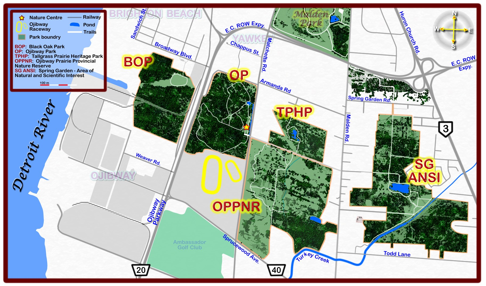
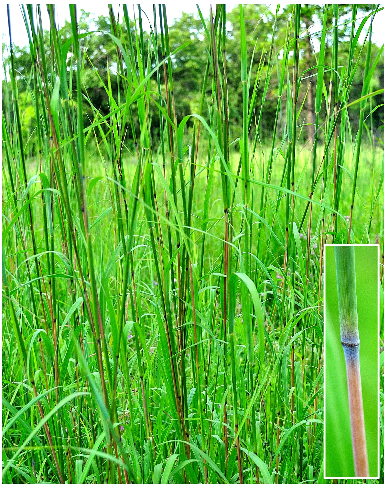
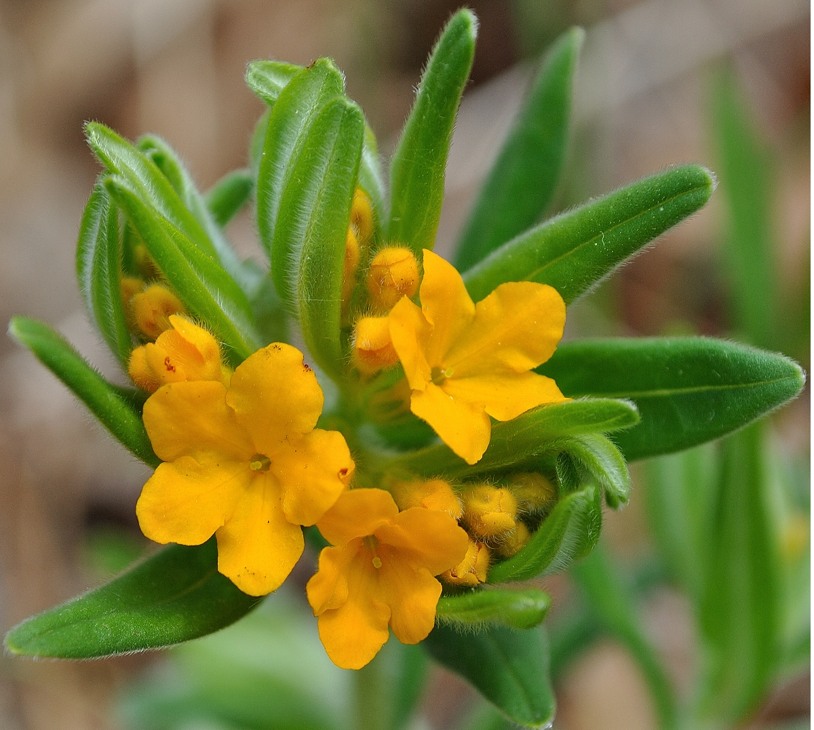
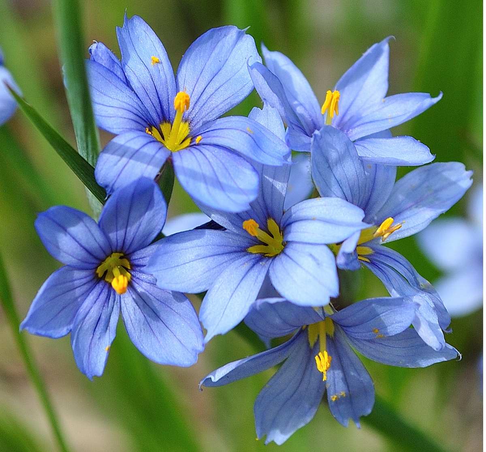
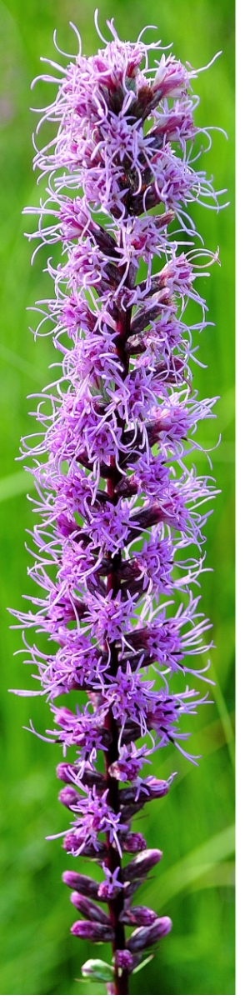
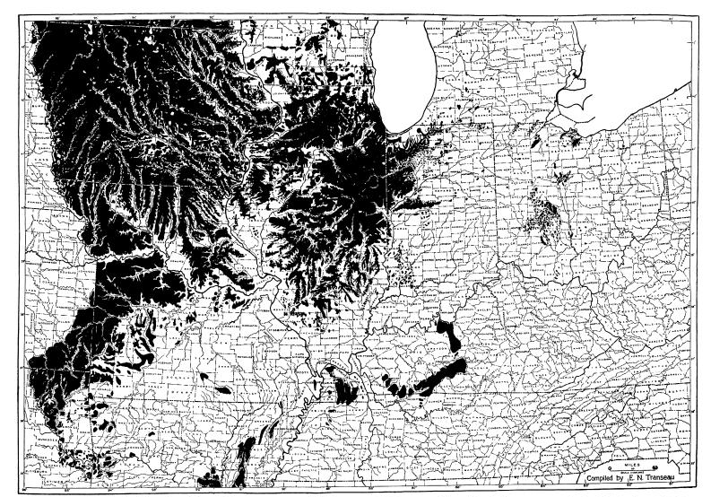
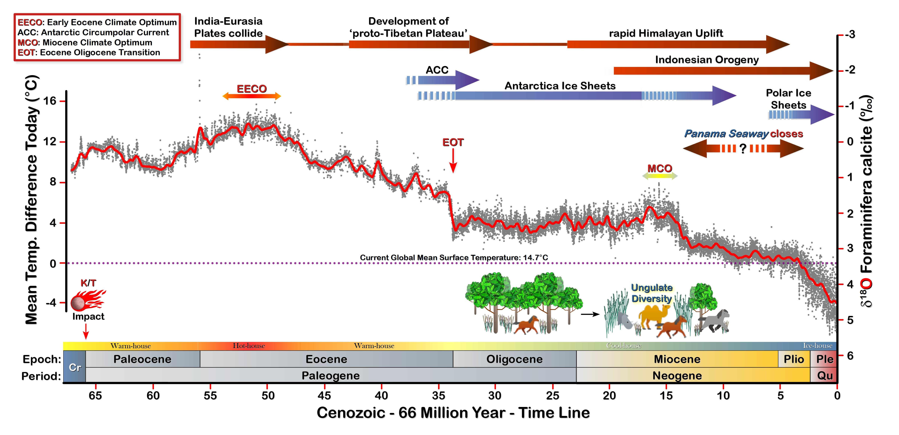
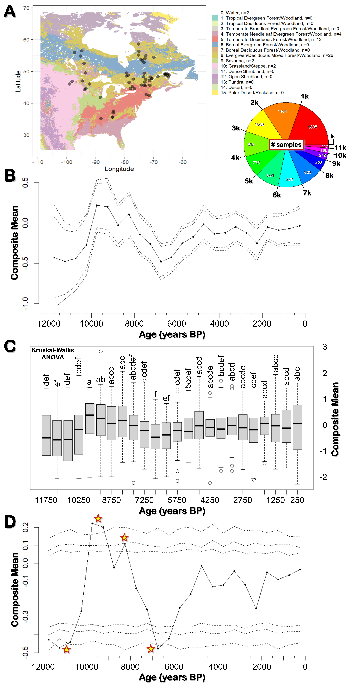

<!-- this is a subheadline -->

  
<b>TABLE OF CONTENTS</b>

  
  1. <a href="#History">History of Prairies in Southern Ontario</a>
  2. <a href="#Eco">Ecology of Tallgrass Communities</a>
     * <a href="#Climate">2.1 Climate</a>
     * <a href="#delta18">&delta;18O</a>
     * <a href="#NDis">2.2 Natural Disturbances of Grasslands: Fire and Grazing</a>
     * <a href="#Fig1">Figure 1: Cenozoic Record - last 66 million years of Climate</a>
     * <a href="#Fig2">Figure 2: Eastern North America's Fire History</a>
  3. <a href="#Refs">References</a>

&nbsp; &nbsp; As shown in the map above Ojibway Prairie Complex (OPC) is composed of five distinct areas: (i) **Ojibway Park** (~61.5 ha); (ii) **Ojibway Prairie Provincial Nature Reserve** (105 ha); (iii) **Tallgrass Prairie Heritage Park** (~15.6 ha); (iv) **Spring Garden ANSI** (~117 ha); and (v) **Black Oak Heritage Park** (~50.6 ha). Collectively they are home to at least 160 rare plant and animal.**1,2** Sadly, OPC is one of the last major remnants of <b><a class="one" href="https://tallgrassontario.org/wp-site/">Tallgrass Communities</a></b> (TGC) within the province and therefore in great need of our protection.**3-8**  

**1. HISTORY OF PRAIRIES IN SOUTHERN ONTARIO**  
&nbsp; &nbsp; Prior to European settlement **grasslands** covered much of North America's heartland, stretching from the northern plains of Canada's prairie provinces to south-central Texas. Looking eastward, the prairie extended from the dry foothills of the Rocky Mountains to the large stands of deciduous forest just east of the mighty Mississippi river. A notable feature of this great grassy plain was the *triangular* shape of its eastern border, often referred to as the Prairie Peninsula.**9** This neck-like extension of mid-western prairie once covered most of Iowa and northern Missouri, large parts of neighbouring Illinois (known as the Prairie State), as well as portions of Indiana and Ohio. Just beyond the peninsula's formal borders one could find quite substantial patches of **prairie** and **oak savanna** amongst the eastern woodlands and wetlands. A good example of this would be the western end of the Lake Erie. Many eye witness accounts from the early 1800s tell of a large lake plain with extensive swamp forests, oak woodlands and wet prairies.**10** As the famed naturalist Harold Mayfield once stated:  

>"...*Few people today realize the original extent of wet grasslands in this region. One continuous strip extended almost without a break from Sandusky Bay around the southwest corner of Lake Erie and up the western shore almost to Detroit. An early observer estimated the area of this tract at more than 200,000 acres* [>800 km&#178;]."**10**  

In southern Ontario many early explorers and surveyors also discovered large tracts of TGC bordering the Great Lakes (i.e. Erie, Ontario, Huron) as well as other inland waterways (i.e. Lakes St. Clair and Rice; Detroit, St. Clair, Thames and Grand rivers). For example, the famous Flemish friar Louis Hennepin (1679) described the banks of the Detroit river as:  

>"...*the country between those two Lakes* [Erie and Lake St. Clair] *is very well situated, and the soil fertile. The banks of the streight* [Detroit River] *are vast meadows, and the prospect is terminated with some hills covered with vineyards*."**11**  

Antoine de Lamothe-Cadillac (1701), founder of Fort Pontchartrain du Detroit, also had a favourable view of the Detroit river:  

>"...*Detroit is, probably, only a canal or a river of moderate breadth ...through which the sparkling and pellucid waters of Lakes Superior, Michigan and Huron (which are so many seas of sweet water) flow and glide away gently and with a moderate current into Lake Erie, into the Ontario or Frontenac, and go at last to mingle in the river St. Lawrence with those of the ocean. The banks are so many vast meadows where the freshness of these beautiful streams keep the grass always green*."**12**  

Even today the names of some settlements remind us of southern Ontario's past grassland glory (e.g. Prairie Siding - just west of Chatham; Plainville - just south of Rice Lake).  
&nbsp; &nbsp; Altogether, it is estimated that between 800 and 2,000 km&#178; of TGC once covered parts of southern Ontario's landscape.**2-5** Regardless of "*true*" extent of these original grassland communities the rapid lost of these habitats to urban and agricultural developments some two centuries ago seems to have also erased our collective memory of them. For you would be hard pressed to find anyone who knows that these rare ecosystems exist today in southern Ontario. Arguably there is no other major ecosystem in North America, not even the old-growth rainforests of the Pacific Northwest, that have been so fully altered by humans. It is estimated that <2% of North America's original tallgrass prairie is all that remains today.**3,4** Unfortunately, the situation is far worse for **oak savannas**. These '*parkland*'-like areas, that once covered an estimated 12,000,000 ha of the north-central United States alone, are now almost all gone (i.e. ~0.1% remains).**13**  

**2. ECOLOGY OF TALLGRASS COMMUNITIES**  

<figure id="FRight250">

<figcaption>
<b>Big BluestemS4G5</b>
</figcaption>
</figure>  

<figure id="FRight150">

<figcaption>
<b>Little BluestemS4G5</b>
</figcaption>
</figure> 

<figure id="FRight175">

<figcaption>
<b>Hoary PuccoonS3G5</b>
</figcaption>
</figure>

<figure id="FRight175">

<figcaption>
<b>Pointed Blue-eyed-grassS4G5</b>
</figcaption>
</figure>

<figure id="FRight175">

<figcaption>
<b>Missouri IronweedS3G4</b>
</figcaption>
</figure>

<figure id="FRight175">

<figcaption>
<b>Prairie DockS1G4</b>
</figcaption>
</figure>

<figure id="FRight335">

<figcaption>
<b>Dense Blazing starS2G5</b>
</figcaption>
</figure>

<figure id="FRight175">

<figcaption>
<b>Transeau's Prairie Peninsula (1935)</b>
</figcaption>
</figure>

&nbsp; &nbsp; The term "*Tallgrass Communities*" (TGC) refers to the types of plants and animals found in these ecosystems (i.e. mix of tallgrass prairies and mostly oak savannas). These rare habitats of eastern North America are home to hundreds of herbaceous plant species (i.e. grasses, sedges, forbs). And as the name suggests they are dominated by tall grasses such as <b><a class="one" href="https://explorer.natureserve.org/Taxon/ELEMENT_GLOBAL.2.133783/Andropogon_gerardii"> Big Bluestem</a></b> (*Andropogon gerardi*), **<a class="one" href="https://explorer.natureserve.org/Taxon/ELEMENT_GLOBAL.2.144026/Spartina_pectinata">Prairie Cordgrass</a>** (*Spartina pectinata*) and **<a class="one" href="https://explorer.natureserve.org/Taxon/ELEMENT_GLOBAL.2.141861/Schizachyrium_scoparium">Little Bluestem</a>** (*Schizachyrium scoparium*). Many smaller **sedges**, another <u>grass-like</u> plant, as well as hundreds of flowering plant (**forbs**) species can also be found in TGC. For example, Spring brings the first of many beautiful small forbs, such as **<a class="one" href="https://explorer.natureserve.org/Taxon/ELEMENT_GLOBAL.2.160803/Lithospermum_canescens">Hoary Puccoon</a>** (*Lithospermum canescens*) and **<a class="one" href="https://explorer.natureserve.org/Taxon/ELEMENT_GLOBAL.2.137876/Sisyrinchium_angustifolium">Pointed Blue-eyed-grass</a>** (*Sisyrinchium angustifolium*). Summer in turn brings forth its own colorful bounty, such as the deep violet **<a class="one" href="https://explorer.natureserve.org/Taxon/ELEMENT_GLOBAL.2.153254/Vernonia_missurica">Missouri Ironweed</a>** (*Vernonia missurica*), the tall yellow **<a class="one" href="https://explorer.natureserve.org/Taxon/ELEMENT_GLOBAL.2.151316/Silphium_terebinthinaceum">Prairie Dock</a>** with its huge spade-like leaves, and the showy magenta spike of **<a class="one" href="https://explorer.natureserve.org/Taxon/ELEMENT_GLOBAL.2.132723/Liatris_spicata">Dense Blazingstar</a>** (*Liatris spicata*). These along with many other flowering plants provide food for a variety of pollinating insects, some of which require a specific plant species to complete their life cycle (e.g. Monarch butterfly and Milkweeds).  
&nbsp; &nbsp; The **savanna** component of TGC refers to '*parkland*'-like areas that have varying degrees of tree cover (i.e. 10-60%).**14** These areas are dominated by both woody and herbaceous plants. At OPC the dominate woody species is **<a class="one" href="https://explorer.natureserve.org/Taxon/ELEMENT_GLOBAL.2.133488/Quercus_velutina">Black Oak</a>** (*Q. velutina*) and **<a class="one" href="https://explorer.natureserve.org/Taxon/ELEMENT_GLOBAL.2.159415/Quercus_palustris">Pin Oak</a>** (*Q. palustris*) while the dominate herbaceous plant species is usually tallgrasses. Nevertheless, other oak species (i.e. **<a class="one" href="https://explorer.natureserve.org/Taxon/ELEMENT_GLOBAL.2.138617/Quercus_alba">White Oak</a>** and **<a class="one" href="https://explorer.natureserve.org/Taxon/ELEMENT_GLOBAL.2.158441/Quercus_macrocarpa">Bur Oak</a>**) and forbs are found in abundance here. It is also interesting to note that some forbs appear to be **savanna** specialists. For example, the beautiful hemi-parasitic **<a class="one" href="https://explorer.natureserve.org/Taxon/ELEMENT_GLOBAL.2.152809/Aureolaria_flava">Smooth Yellow False Foxglove</a>** (*Aureolaria flava*) is only found clustered underneath the oak trees at OPC. Although *A. flava* is capable of photosynthesis they selectively harvest some water and nutrients from the roots of nearby oaks.**15** These parasitized resources presumably helps the plant survive some of the harsher conditions within **savannas** (i.e. occasional droughts, nutrient poor sandy soils).  
&nbsp; &nbsp; The *transitional* nature of **oak savannas** is what ecologists call an ecotone. Conceptually these areas represent transitions (either sharp or more gradual) between adjacent but distinct ecological communities (e.g. open prairie and closed canopy forest).**16** For example, some of OPC's **oak savannas** connect open prairie to more heavily wooded areas, while other more isolated oaks look like small "*islands*" amid a sea of tall grasses and flowers. Needless to say, these types of transitional communities are complex owing to their varying sizes, shapes (e.g. "*patch-work*" geometry), and the ways they can interact with neighbouring ecosystems (i.e. flow of resources).**16-19** Perhaps the most important reason for studying and protecting ecotones, like **oak savannas**, is because of the reported positive effects they have on species abundance and richness.**20-22** Certainly, from my own experiences at OPC, the **oak savannas** do attract certain bird species, like the **<a class="one" href="https://www.allaboutbirds.org/guide/Red-headed_Woodpecker/overview"> Red-headed Woodpecker</a>** (*Melanerpes erythrocephalus*) and **<a class="one" href="https://www.allaboutbirds.org/guide/Indigo_Bunting/overview">Indigo Bunting</a>** (*Passerina cyanea*). Although my sightings of *M. erythrocephalus* have often been fleeting, my regular encounters with *P. cyanea* during the summer months have been anything but brief. These brilliantly colored songbirds are quite vocal when feeding on insects along the borders of the oak stands and as a consequence fairly easy to spot.  
&nbsp; &nbsp; So what factors control the geographic distribution of tallgrass prairies and oak savannas in North America? Although TGC are dynamic systems, like any other natural community, they are greatly influenced by climate and natural disturbances (i.e. wild fires and grazing).**23**

**2.1** <b>CLIMATE:</b> The geographical distribution of large plant communities (i.e. **biomes**) like grasslands are controlled in large part by climate. **Edgar Transeau**, a pioneering ecologists who coined the term Prairie Peninsula, actually generated a map of the geographic boundary of this '*peninsula*' based on the *evapotranspiration rate* (i.e. ratio of rainfall to evaporation) of this region.**9,24** In Ontario, climate (specifically its recent glacial history) has played a major role in shaping the development of its plant communities. The province, as well as the rest of Canada, has been subjected to multiple **Ice Ages** since the latter part of the **<a class="one" href="https://stratigraphy.org/chart"> Pleistocene epoch</a>**.**25** The last of these glaciation events, known as the **Wisconsin**, peaked at around 21,000 years ago (**ya**). Following this glacial maximum the climate quickly warmed resulting in the northerly retreat of the **<a class="one" href="https://planetearth.utsc.utoronto.ca/timeline/hlis_t1b.html">Laurentide Ice Sheet</a>** (LIS). The time-line of these past glaciation events has been reconstructed using a variety of **<a class="one" href="https://www.usgs.gov/programs/climate-research-and-development-program/science/paleoclimate-proxies">Paleoclimate Proxies</a>**, most notably isotopic chemistry techniques applied to samples taken from glacial ice and deep ocean (benthic) sediment cores. The **<a class="one" href="https://www.nndc.bnl.gov/nudat3/">three stable isotopes of oxygen</a>** (16O = 99.757%, 17O = 0.038%, and 18O = 0.205%)**26** are of particular interest since they are the building blocks of water (H2O) and biogenic carbonates (e.g. fossil **<a class="one" href="https://www.bgs.ac.uk/discovering-geology/fossils-and-geological-time/foraminifera/">Foraminifera</a>** shells).**27** Although all three of the oxygen isotopes have the same number of protons and electrons (i.e. same chemical behaviour), they do have varying numbers of neutrons and therefore different masses (e.g. 16O = 16 atomic mass units). It is this difference in mass that gives isotopes slightly different physical-chemical properties. As geologist **Eelco J. Rohling** clearly states:

>"...*Molecules vibrate with a fundamental frequency which depends on the mass of the isotopes...the resultant differences...imply that bonds formed by light isotopes are weaker than those formed by heavy isotopes. Hence, as a rule of thumb, molecules comprised of the light isotopes react somewhat more easily than those comprised of the heavy isotopes*."**27**  

This difference in bond strength results in the '*fractionation*' of **isotopologes** (i.e. molecules that differ only in their isotopic composition) between any two substances (e.g. H2O &ndash; Ca**C**O3 system) or two phases of the same substance (e.g. liquid &#8644; vapour phases). **27** For example, the heavier H218O tends to evaporate more slowly and condense more quickly than H216O. More importantly, the fractionation of these two water **isotopologes** is <u>temperature dependent</u>.  

>"...*measuring the oxygen and carbon isotopic composition of fossil foraminiferal calcite has been one of the most effective techniques for reconstructing ocean and climate conditions of past times*."**27**

Since the fractionation between calcite (Ca**C**O3) and water is a function of temperature, than one can use the ratio of oxygen isotopes (&delta;18O) from fossil **<a class="one" href="https://www.bgs.ac.uk/discovering-geology/fossils-and-geological-time/foraminifera/">Foraminifera</a>** shells to estimate the temperature of the seawater these single celled organisms once inhabited. The method for calculating &delta;18O (seen below) is relatively straight forward. In fact, it hasn't changed since **Harold Urey**, the Nobel prize winning chemist who invented these oxygen isotopic methods, first introduced it back in the early 1950s.**28-33**  

<!-- Delta-18-oxygen calculation -->

&delta;18O = [(<strong>R</strong>sample/<strong>R</strong>standard) - 1] x 1000

where <strong>R</strong> = 18O/16O

The use of &delta;18O, as well as other types of **<a class="one" href="https://www.usgs.gov/programs/climate-research-and-development-program/science/paleoclimate-proxies">Paleoclimate Proxies</a>** (e.g. pollen, spores, charcoal), has been particularly useful in determining the types of plant communities (i.e. **biomes**) that once populated North America since end of the last ice age ~11,700 **ya** (Note: designated end of the **<a class="one" href="https://stratigraphy.org/chart">Pleistocene epoch</a>**). Studies of pollen from across the province show relatively rapid changes in vegetation during the early part of the **Holocene**.**34-38** Deglaciated areas that once supported **Spruce** (*Picea spp.*) and tundra-like (herbs and shrubs) vegetation gave way to **Jack Pine** (*Pinus banksiana*), **Paper Birch** (*Betula papyrifera*) and a minor mix of other species (e.g. **Oaks**, **Ashes**, **Elms**, **Beech**). By ~10,000 **ya** a wide band of forests had developed along the trailing edge of the retreating ice sheet that stretched from eastern Alberta and southern Saskatchewan down through the mid-west and north-eastern United States.**38** However, towards the middle of the **Holocene** (10,000 to 5,000 **ya**) climate in North America became unusual warm and dry.**38-40** This so-called Holocene Climate Optimum (HCO) is thought to have been the likely cause of an eastward migration of western type prairie vegetation and the expansion of TGC within southern Ontario. Cyclic changes in the earth's orbit (i.e. **<a class="one" href="https://climate.nasa.gov/news/2948/milankovitch-orbital-cycles-and-their-role-in-earths-climate/">Milankovitch Cycles</a>**) appears to be the main cause of this **mid-Holocene** warming event, a process referred to as **orbital forcing**.**41-44** However, it is interesting to note that the timing of the HCO varied across the north. A review of **Holocene** proxy data from across the western Arctic (140 sites) revealed that in Alaska and northwest Canada warming started earlier at around 11,000 **ya**, while in the Hudson Bay region warming started ~8,000 **ya**.**45** Clearly regional factors played a role in modifying the timing of the HCO (e.g. ocean currents, albedo and temperature affects of large remnant ice sheets around Hudson Bay). Nevertheless, by 7,000-8,000 **ya** Ontario (now ice free) had undergone noticeable changes in the composition of its forests. Pollen studies shows that both cool mixed forests (e.g. **Birch**, **Beech**, **White Pine**, **Hemlock**, **Cedar**) as well as the more southerly deciduous forests (e.g. **Sugar Maple**, **Ash**, **Oaks**, **Beech**, **Hickory**, **Chestnut**) had advanced further north beyond their current ranges.**34-38** The relatively stable levels of herbaceous plant pollen (i.e. grasses and forbs) during this time also suggests that open forested areas, like oak savannas, were also part of the province's landscape. By the end of the HCO (5,000-6,000 **ya**) the climate in Ontario (and the rest of the continent) became cooler and wetter resulting in the southerly retreat of both the cool-mixed and temperate deciduous forests.**34-38** This wetter climate likely allowed forests to invade open areas leading to a mosaic of vegetation types within the province.  

**2.2 NATURAL DISTURBANCES** (GRAZING, FIRE **and** DROUGHT)**:** Grasslands around the world are known for their periodic droughts, frequent fires and large numbers of grazing (and burrowing) animals they support.**23** These abiotic and biotic factors often interact with one another to significantly alter the structure of grassland communities (e.g. species composition).  
&nbsp; &nbsp; In North America one such major change in the structure of its **biomes** occurred around 23 million **ya** at the start of the **<a class="one" href="https://stratigraphy.org/chart">Miocene Epoch</a>** (<b>Fig. 1</b>). An abundance of fossil and proxy evidence suggests that large forested regions were replaced by a more open grassland/savanna system.**46-51** This shift in **biomes**, particularly within the central parts of the continent, coincided with the appearance of a large number of grazing mammals (i.e. **ungulates**).**47-49** Fossils from these now extinct species (e.g. early horses, grazing rhinoceroses, proto-camels, early bison and antelopes) share many anatomical features that are adapted to grazing in open grassy plains (e.g. craniodental adaptations: high crown molars for grinding, large attachments sites for masticating muscles; cursorial adaptations: long leg bones for running). Not surprisingly, grasses have evolved their own strategies to counteract grazing and other disturbances, notably the development of underground vegetative growth centers (e.g. **rhizomes**) and **silica** deposits within leaves and other plant tissues.**23** The former allows grasses to survive and reproduce in response to grazing and seasonal fires, while the latter presumably makes the plants less palatable to herbivores. These so-called silica '*deposits*' are actually polymers of soluble **silicic acid** (Si(OH)4) that have been shown to take on a variety of shapes or morphologies (i.e. morphotypes).**52-54** The natural abundance of **silicon** (Si) within the Earth's crust and soil (i.e. chemical weathering process, see <b>Fig. 1</b> legend) would suggest that it is taken up by the roots of all plants. However, it is *interesting* to note that the ability to accumulate Si varies considerably among plants (i.e. 0.1-10% dry weight), with grasses and sedges (i.e. **graminoids**) being among the most '*active*' accumulators of this ubiquitous element.**52,53** The nature of this '*active*' uptake is due to a dedicated **<a class="one" href="https://www.rcsb.org/structure/7NL4">silicon transporter protein</a>** expressed in the roots of plants like grasses.**55,56** Once taken up, the Si(OH)4 is transported via the **xylem** (i.e. vascular tissue) to different parts of the plant where it forms *opal-type* bodies (i.e. SiO2&bull;*n*H2O), commonly referred to as **phytoliths**.**52,53** What makes these opal-type **phytoliths** so interesting to ecologists is that, like pollen and spores, they form durable microfossils that serve as useful taxonomic tools to reconstruct past vegetation communities. In fact, a study by Stromberg (2005) used phytoliths recovered from several central Great Plain states to reconstruct the evolution of this forest-to-grassland transition 11-to-24 million **ya**.**50,51**  

<!-- 66 My Cenozoic History -->

<figure>

<figcaption> <b>Figure 1. Earth's Cenozoic Record: Major Climate, Geology and Ecology Events.</b> The above plot used the composite deep-sea benthic foraminifer stable oxygen (&delta;18O) isotope data set from the recent <b><a class="one" href="https://www.science.org/doi/10.1126/science.aba6853">CENOGRID study</a></b> (Supplemental Data, <b>Table S34</b>).<b>78</b> Data for the last 34 <b>My</b> has a resolution 2 <b>ky</b>, while the data for the 34 to 67.1 <b>My</b> interval has a resolution of 5 <b>ky</b>. In total 23,626 data points were plotted (<b>gray dots</b>). The red line represents the smoothed <b>long term average</b> (1 <b>My</b> weighted function) of the above &delta;18O values. The values plotted on the y-axis (right) have been <u>reversed</u> (like the paper) to reflect the correlation between <u>warmer temperatures</u> and <u>lower &delta;18O values</u>. These oxygen isotope values have been converted to average temperature differences with <u>respect to today</u> (left y-axis). Time and the corresponding geological <b>Periods</b> and <b>Epochs</b> have been plotted on the x-axis. The four climate states (Hot-house, Warm-house, Cool-house, and Ice-house) identified in the study using recurrence plot analysis (i.e. identifies times when the dynamic climate system is "<i>trapped</i>" in a particular state) is also shown above the x-axis.<b>79</b> The Warm-house and Hot-house climate states cover most of the <b>Paleogene period</b> (34-67.1 <b>Mya</b>) right up until the critical <b>Eocene</b>-<b>Oligocene</b> transition (<b>EOT</b>). During this span of time global temperatures were more than 5&deg;C warmer compared to today. By comparison, during the relatively shorter Hot-house climate state (56-47 <b>Mya</b>) temperatures were more than 10&deg;C warmer than they are today. The Cool-house climate state (~34-3.3 <b>Ma</b>) shows a marked shift in the &delta;18O values compared to earlier times. There is a notable increase in the oxygen isotope values at the start of this period (<b>EOT</b>, 34 <b>Mya</b>), which may be related to the movement of Antarctica away from the other land masses. Isolation of this continent led to the development of the Antarctic Circumpolar Current (<b>ACC</b>, top blue arrow). This current, which is driven by strong westerly winds, moves in an unobstructed manner clockwise around Antarctica. This action cools the land mass leading to the development of ice sheets. There is a similar increase in the &delta;18O values at ~13.9 <b>Mya</b>, which is due to the stabilization and expansion of the Antarctic ice sheets (top blue arrow). The final Ice-house climate state (3.3 <b>Mya</b> to present) coincides with the development of the polar (Northern Hemisphere) ice sheet, which is thought to have been fully established by the time of the <b>Pliocene</b>-to-<b>Pleistocene</b> transition (~2.58 <b>Mya</b>). Some other events that may have, or continue to play an important role in controlling the global climate system have also been added to the plot. These include: <b>(i)</b> Plate-tectonic forces that closed the Panama Seaway (3-13 <b>Mya</b>).<b>80</b> The so called <i>Panama Hypothesis</i> suggests that closing of the seaway stopped the exchange of water between the Atlantic and Pacific Ocean basins resulting in the formation of meridional (north-south) flowing deep ocean currents. This in turn led to more intense temperature-evaporation-precipitation regimes within the North Atlantic that fueled glaciation at the pole.<b>81</b>; <b>(ii)</b> Plate-tectonic forces also triggered the collision between the Indian and Eurasian plates (~50 <b>Mya</b>). This led to the development of a massive <b>Tibetan Plateau</b> and the highest Mountain ranges in the world (i.e. Himalayas).<b>82</b> The massive height and size (i.e. 2.5 million km2) of this mountainous region creates a natural barrier to any southern moisture-laden air masses, resulting in the famous monsoons of the Indian subcontinent and a prominent northern rainshadow. Natural chemical weathering of the mountains not only helped create large northern sandy deserts (e.g. Taklamakan, Mongolian Gobi), but also resulted in the capture of large amounts of atmospheric <b>C</b>O2.<b>83,84</b> It has been suggested that such chemical weathering within wet tropical zones that are rich in <b>ophiolite</b> (i.e. igneous rock from upper mantle and ocean crust found along major faults/suture zones, made of Fe and Mg rich silicates)<b>85</b> have the potential to sequester significant amounts of atmospheric <b>C</b>O2 over time.<b>86,87</b>. Lastly, the flora and fauna that flourished in response to these changing climate patterns, specifically at the dawn of North America's large grassland biomes in the early <b>Miocene</b> (discussed below), are depicted just above the time line.<b>23,46-51</b>  
</figcaption>
</figure>

&nbsp; &nbsp; The interactions between these major grassland disturbances (i.e. fire, grazing, drought) has been the subject of much research over the last few decades, particularly as it relates to the structure, function and **<a class="one" href="https://www.biointeractive.org/classroom-resources/ants-grizzlies-general-rule-saving-biodiversity">biodiversity</a>** of these ecosystems. For example, studies have shown that spring burning of tallgrass prairies can stimulate the growth of dominant tallgrasses (i.e. **<a class="one" href="https://plants.usda.gov/home/plantProfile?symbol=ANGE">Big bluestem</a>** - *A. gerardii*), while inhibiting the growth of smaller forbs. However, when fire is combined with grazing then both tallgrasses and forbs do well (i.e. increase species diversity and richness).**57,58** As mentioned previously, prairie grasses like *A. gerardii* are adapted to tolerate surface fires owing to their underground reproductive structures (i.e. **rhizomes**). Fire not only clears the ground of dead decaying plant material (i.e. biomass fuel load), but also eliminates invasive fire-intolerant plants (e.g. shrubs and trees) that, if left unchecked, would change grasslands into wooded areas. In this way burning not only keeps the land open for sun-tolerant prairie plants (i.e. maintains ecosystem - positive feedback mechanism), but also limits the levels of nitrogen (from the decaying biomass) in the soil. The latter is important given that nitrogen levels have been shown to negatively impact prairie plant diversity and function (i.e. carbon storage).**59,60** Although fire and grazing animals are essentially competing for the same fuel, the grassland still benefits. This positive interactions is likely due to the ruminant's preference for grasses over forbs. Studies have shown that the diet of **<a class="one" href="https://www.worldwildlife.org/pages/how-bison-help-shape-the-northern-great-plains">Bison</a>** (*Bison bison*), a '*true*' **<a class="one" href="https://www.biointeractive.org/classroom-resources/some-animals-are-more-equal-others-keystone-species-and-trophic-cascades">Keystone Species</a>** of North America's grasslands, is almost exclusively grasses (i.e. 90%).**23,61-63** Consumption of the dominant tallgrasses prevents them from forming thick canopies that would normally limit the amount of sunlight reaching the smaller forbs. The **Bison's** preference for previously burned areas also encourages the growth of the less palatable forbs.**63** The shifting plant populations (e.g. rising levels of forbs in a grazed patch) likely causes the **Bison** to adapt in kind (i.e. find more favourable grasses) resulting in an overall increase in plant diversity across large areas (i.e. spatial heterogeneity).**23,62,63** So, it seems that these disturbance regimes, when spread out over space and time, create a healthy *mosaic* of prairie habitats. Certainly when you consider how important **<a class="one" href="https://www.biointeractive.org/classroom-resources/ants-grizzlies-general-rule-saving-biodiversity">biodiversity</a>** is to ecosystem stability and productivity (i.e. ecosystem goods and services = global economy) one can better appreciate how these ecological studies can help us deal with our current changing climate.**64-68**  
&nbsp; &nbsp; Understanding the critical role that fire regimes play in maintaining grasslands is perhaps best illustrated by current satellite technology. The high resolution images they generate clearly show that ~80% of all fires each year take place within grasslands, despite the fact that these ecosystems account for only a third of the Earth's vegetation cover.**69** Unfortunately satellites can not help us reconstruct past fire histories. For this we need sedimentary charcoal records. As shown below in **Figure 2** there have been marked changes in the frequency of fires within eastern North America over the last 12,000 years. These remnants of burnt biomass are similar to pollen and phytoliths in that they can serve as a useful proxy for past fire events. Analysis of the charcoal record shows that both positive and negative anomalies appear within the plotted time series (**Fig. 2D**, *stars*). For example, two positive anomalies between 9,000 and 10,000 **ya** and around 8,000 **ya** have mean values that exceed the 99.5% and 97.5% confidence intervals (**CI**), suggesting that these events are significant when compared to the overall linear trend (**Fig. 2D**). Also, the relatively narrow **CI** for these time periods (**Fig. 2B**) suggests that the increase in fire activity was common to all 57 sites from across the continent (i.e. '<i>spatially synchronous</i>' response) indicating that a changing climate was likely responsible for these events.**70-76** In contrast, the negative anomaly around 11,000 **ya** has a relatively wide **CI** (**Fig. 2B**), which suggests that there was considerable variability in the amount of burnt biomass across all of these sites. However, this variability may be due to the small sample sizes from these early time periods (n11-12k= 117). Nevertheless, the second negative anomaly between 6,000 and 7,000 **ya** did not share the same limitations as the first one (i.e. n6-7k= 879), suggesting that all 57 sites responded in a similar manner, perhaps due to more widespread climate changes.**74-77** The complexities of changing global and regional climates has been made considerably easier courtesy these new computer databases (e.g. **<a class="one" href="https://www.paleofire.org/">Global PaleoFire Database</a>**, **<a class="one" href="https://www.ncei.noaa.gov/access/paleo-search/">NCEI</a>**) and the tools used to analyze them (e.g. **<a class="one" href="https://rdrr.io/cran/paleofire/">R paleoFire</a>**)**77**.  

<!-- Paleo-Charcoal Fire Data Eastern North America -->

<figure>

<figcaption><b>Figure 2: Charcoal Data: History of Fire in Eastern North America.</b> Sedimentary charcoal, like pollen and phytoliths, can serve as a useful proxy for past climate events. 
<b>(A)</b> Sedimentary charcoal records from 57 sites sampled from across eastern North America (map dots) were analyzed using the <b>paleofire</b> R package (<b><a class="one" href="https://www.paleofire.org/">Global Charcoal Database</a></b>).<b>77</b> The accompanying pie chart shows the distribution of samples for each millenia dating back 12,000 years. 
<b>(B)</b> Statistical analysis of the charcoal record was carried out as previously described.<b>75,77</b> Briefly, sites were selected based on location (latitude: 35&deg; to 60&deg;, longitude: -100&deg; to -40&deg;), number of geochronological controls (i.e. &ge; one per 2500 years) and number of samples (n &ge; 20). The charcoal records were standardized using a <u>three-step</u> transformation process: <b>(i)</b> mini-max data re-scaling (i.e. x&prime;&ii; = [x&ii; - xmin.]/[xmax - xmin], where x&prime;&ii; is the min-max transformed value of the &ii;<i>th</i> sample); <b>(ii)</b> Box-Cox transformation<b>88</b> of the re-scaled values helps to '<i>normalize</i>' the distribution of the data (i.e. type of <u>power transformation</u> used to homogenize the variance and correct for skewness); and <b>(iii)</b> re-scaling of the transformed data to <b>Z-scores</b>, which measures standard deviations from the mean. This helps to account for different units of measure as well as differences in the magnitude. The composite means (solid line) and their associated confidence intervals (<b>CI</b>, 95% and 97.5% - dashed lines) were estimated using a data-binning (each bin = 500 years) and Bootstrap re-sampling procedure. The latter is a general statistical method for determining the accuracy (using (<b>CI</b>) of our chosen estimator (sample <u>mean</u>).<b>89</b> 
<b>(C)</b> The Kruskal-Wallis ANOVA test was used to determine significant differences in biomass burning activity between the different binned groups (i.e. 24 bins, each bin is a unique block of 500 years). The Kruskal-Wallis test ranks all of the values within all of the groups and then calculates a test variable (Chi-squared value) that determines if all the groups have very similar mean or median values (i.e. not significantly different) or very different ones (i.e. one or more groups are significantly different). The results of the K-W test (Chi-squared value = 41.54452, <i>df</i> = 23, <i>p</i> value = 0.0102531) suggest that the probability that all of the groups are the same is unlikely (i.e. <i>prob.</i> ~1.03%). The subsequent <i>ad-hoc</i> ANOVA test identified the time periods that are significantly different from each other. The Box-Plot displays the group statistics using a letter system. If two time periods share the same letter they are not significantly different for our specified confidence level (<i>p</i> = 0.05). The periods that correspond to the time series <i>minima</i>, namely 6,750 (<b>f</b>), 11,250 (<b>ef</b>) and 6,250 (<b>ef</b>), are the most unique groups (<i>p</i> &lt; 0.05 for 10 or more different periods). The periods corresponding to the time series <i>maxima</i>, namely 9,750 (<b>a</b>), 9,250 (<b>ab</b>) and 8,250 (<b>abc</b>) are all significantly different when compared to several other periods (i.e. <i>p</i> &lt; 0.05 for 11, 7, and 5 other periods, respectively). 
<b>(D)</b> A <i>M</i>oving <i>B</i>lock <i>B</i>ootstrap (<b>MBB</b>) analysis was also carried to test the significance of local <i>minima</i> and <i>maxima</i> in the composite time series plotted in <b>2B</b>. This method selects (with replacement) random <u>overlapping blocks</u> of data to reconstruct a new charcoal series. This is then used to estimate the <b>CI</b> (99.5%, 97.5%, 95%, 5%, 2.5% and 0.5% - dashed lines). Both positive and negative anomalies appear within the composite mean time series (<i>stars</i> in plot <b>D</b>).  
</figcaption>
</figure>

---
**REFERENCES:**  
**1.** Ojibway Nature Centre and Ojibway Park, Windsor, Ontario, Canada. <b><a class="one" href="http://www.ojibway.ca/index.htm">OPC website</a></b>  
**2.** Bakowsky W. and Riley J. (1994). A survey of the prairies and savannas of southern Ontario. pp. 7-16. Robert G. Wickett, Patricia Dolan Lewis, Allan Woodliffe, and Paul Pratt, Editors. 1994. Proceedings of the Thirteenth North American Prairie Conference: Spirit of the Land, Our Prairie Legacy. Department of Parks and Recreation, Windsor, ON, Canada, 272 pages.  
**3.** Rodger L. (1998). Tallgrass communities of southern Ontario: a recovery plan. World Wildlife Fund Canada and Ontario Ministry of Natural Resources and Forestry, Toronto. 66 pages.  
**4.** Tallgrass Communities of Southern Ontario Conservation Plan (2019). Provincial Conservation Plan. Ontario Ministry of Natural Resources and Forestry, Peterborough, Ontario. 74 pages.  
**5.** Farrell T., Riley J.L. and McLaughlin L.M. (2004). Large-Scale Restoration of the Rice Lake Plains: A Landscape Conservation Approach. Proceedings of the North American Prairie Conferences. https://search.library.wisc.edu/digital/A7L5KABOYVPBVF9B  
**6.** Kraus D. and Buck G. (2009). The Mapping of Tallgrass Communities in Southern Ontario – Historical and Current. Nature Conservancy of Canada.  
**7.** Catling P.M. (2008). The extent and floristic composition of the Rice Lake Plains based on remnants. Canadian Field Naturalist, 122(1): 1-20.  
**8.** Kraus D. and Hebb A. (2020). Southern Canada’s crisis ecoregions: identifying the most significant and threatened places for biodiversity conservation. Biodiversity Conservation 29:3573–3590. https://www.natureconservancy.ca/en/who-we-are/news-room/in-the-news/unique-study-pinpoints-key.html    
**9.** Stuckey, R.L. Origin and Development of the Concept of the Prairie Peninsula (1978). The Prairie Pennisula - in the "shadow" of Transeau: Proceedings of the Sixth North American Prairie Conference. The Ohio State University, Columbus, Ohio. 12-17 August 1978. Ohio Biol. Surv. Biol. Notes. No. 15. 278 p. https://search.library.wisc.edu/digital/A7L5KABOYVPBVF9B   
**10.** Mayfield, H.F. (1988). Changes in bird life at the western end of Lake Erie. Part I. American Birds 42(1):393-398.  
**11.** Hennepin, Louis. A New Discovery of a Vast Country in America. Reprinted from the Second London Issue of 1698, with Facsimiles of Original Title-Pages, Maps, and Illustrations, and the Addition of Introduction, Notes, and Index by Reuben Gold Thwaites. (Chicago: A.C. McClurg & Co., 1903). Volume 1 [pg. 109].  
**12** Lajeunesse, E.J. ed. (1960). The Windsor Border Region: Canada's Southernmost Frontier; a Coll. of Documents. 374 pp. [pg. 18, 47]  
**13.** Nuzzo, V.A. (1986). Extent and Status of Midwest Oak Savanna: Pre-settlement and 1985. Natural Areas Journal 6(2):6-36.  
**14.** Bucini G., Beckage B. and Gross L.J. (2017). Climate seasonality, fire and global patterns of tree cover. Frontiers of Biogeography 9(2).  
**15.** **COSEWIC** (2018). COSEWIC assessment and status report on the Yellow False Foxglove Bundle, Smooth Yellow False Foxglove *Aureolaria flava*, Fern-leaved Yellow False Foxglove *Aureolaria pedicularia* and the Downy Yellow False Foxglove *Aureolaria virginica*, in Canada. Committee on the Status of Endangered Wildlife in Canada. Ottawa. xx + 100 pp. (http://www.registrelep-sararegistry.gc.ca/default.asp?lang=en&n=24F7211B-1)  
**16.** Risser, P.G. (1995). The Status of the Science Examining Ecotones. BioScience, 45(5):318–325.  
**17.** Strayer D.L., Power M.E., Fagan W.F., Pickett S.T.A. and Belnap J. (2003). A Classification of Ecological Boundaries. BioScience 53(8):723–729.  
**18.** Ries L., Fletcher R.J. Jr, Battin J. and Sisk T. (2004). Ecological responses to habitat edges: mechanisms, models, and variability explained. Annual Review of Ecology, Evolution, and Systematics. 35:491-522.  
**19.** Kark, S. (2013). Ecotones and Ecological Gradients. In: Leemans, R. (eds) Ecological Systems. Springer, New York, NY.  
**20.** Smith T.B., Wayne R.K., Girman D.J. and Bruford M.W. (1997). A Role for Ecotones in Generating Rainforest Biodiversity. Science 276(5320):1855–1857.  
**21.** Brawn, J.D. (2006). Effects of restoring oak savannas on bird communities and populations. Conserv Biol. 20(2):460-469. doi: 10.1111/j.1523-1739.2006.00310.x. PMID: 16903107.  
**22.** Kark S., Allnutt T.F., Levin N., Manne L.L. and Williams P.H. (2007). The role of transitional areas as avian biodiversity centres. Global Ecology and Biogeography. 16(2):187-196.  
**23.** Anderson, R.C. (2006). Evolution and Origin of the Central Grassland of North America: Climate, Fire, and Mammalian Grazers. The Journal of the Torrey Botanical Society. 133(4):626–647.  
**24.** Transeau, E.N. (1935). The prairie peninsula. Ecology 16(3):423-437.  
**25.** Cohen K.M., Harper D.A.T. and Gibbard, P.L. (2022). ICS International Chronostratigraphic Chart 2022/10. International Commission on Stratigraphy, IUGS. www.stratigraphy.org (visited: 2022/11/01)  
**26.** National Nuclear Data Center, information extracted from the NuDat database, https://www.nndc.bnl.gov/nudat/  
**27.** Rohling, E. J. (2013). Oxygen isotope composition of seawater. The Encyclopedia of Quaternary Science. Amsterdam: Elsevier, 2, 915-922.  
**28.** Urey, H.C. (1947). The thermodynamic properties of isotopic substances. Journal of the Chemical Society. Apr:562-581.  
**29.** Nier, A.O. (1947). A mass spectrometer for isotope and gas analysis. The Review of Scientific Instruments. 18(6):398-411. doi: 10.1063/1.1740961. PMID: 20250939.  
**30.** McKinney C.R., McCrea J.M., Epstein S., Allen H.A. and Urey H.C. (1950). Improvements in mass spectrometers for the measurement of small differences in isotope abundance ratios. The Review of Scientific Instruments. 21(8):724-30. doi: 10.1063/1.1745698. PMID: 14781446.  
**31.** Urey H.C., Lowenstam H.A., Epstein S. and McKinney C.R. (1951). Measurement of Paleotemperatures and temperatures of the Upper Cretaceous of England, Denmark and the southwestern Unites States. Geological Society of America Bulletin 62(4):399–416.  
**32.** Epstein S., Buchsbaum R., Lowenstam H. and Urey H.C. (1951). Carbonate-water isotopic temperature scale. Geological Society of America Bulletin 62(4):417-426.  
**33.** **.** Coplen T.B. (1994). Reporting of stable hydrogen, carbon, and oxygen isotopic abundances (technical report). Pure and Applied Chemistry 66(2):273-276.  
**34.** Terasmae, J. (1973). Notes on late Wisconsin and early Holocene history of vegetation in Canada.	Arctic and Alpine Research 5(3):201-222.  
**35.** Szeicz J.M. and MacDonald G.M. (1991). Postglacial vegetation history of oak savanna in southern Ontario. Canadian Journal of Botany 69(7):1507-1519.  
**36.** Fuller, J.L. (1997). Holocene forest dynamics in southern Ontario, Canada: fine-resolution pollen data. Canadian Journal of Botany 75(10):1714-1727.  
**37.**	Liu, K.B. (1990). Holocene paleoecology of the boreal forest and Great Lakes‐St. Lawrence forest in northern Ontario. Ecological Monographs 60(2):179-212.  
**38.** Dyke, A. S. (2005). Late Quaternary Vegetation History of Northern North America Based on Pollen, Macrofossil, and Faunal Remains. Géographie physique et Quaternaire 59(2-3):211–262.  
**39.** Dean, W.E., Bradbury, J.P., Anderson, R.Y. and Barnosky, C.W. (1984). The variability of Holocene climate change: evidence from varved lake sediments. Science 226(4679):1191-1194.  
**40.** Bartlein P.J., Harrison S.P., Brewer S., Connor S., Davis B.A.S., Gajewski K., Guiot J., Harrison-Prentice T.I., Henderson A., Peyron O., Prentice I.C., Scholze M., Seppa H., Shuman B., Sugita S., Thompson R.S., Viau A.E., Williams J. and Wu H. (2011). Pollen-based continental climate reconstructions at 6 and 21 ka: a global synthesis. Climate Dynamics 37(3):775-802.  
**41.** Milankovitch, M. (1941). Canon of insolation and the ice age problem (in Yugoslavian). Serb. Acad. Beorg. Special Publication, 132.  
**42.** Emiliani C. and Geiss J. (1959). On glaciations and their causes. Geol Rundsch 46:576–601.  
**43.** Hays J.D., Imbrie J. and Shackleton N.J. (1976) Variations in the Earth's orbit: Pacemaker of the ice ages. Science 194:1121-1132.  
**44.** Imbrie J. and Imbrie J.Z. (1980). Modeling the climatic response to orbital variations. Science 207(4434):943-953.  
**45.** Kaufman D.S., Ager T.A., Anderson N.J., Anderson P.M., Andrews J.T., Bartlein P.J., Brubaker L.B., Coats L.L., Cwynar L.C., Duvall M.L. and Dyke A.S. (2004). Holocene thermal maximum in the western Arctic (0–180 W). Quaternary Science Reviews 23(5-6):529-560.  
**46.** Thomasson J.R., Zakrzewski R.J., LaGarry H.E. and Mergen D.E. (1990). A late Miocene (late early *Hemphillian*) biota from northwestern Kansas. National Geographic Research 6(2):231-244.  
**47.** Jacobs B.F., Kingston J.D. and Jacobs L.L. (1999). The origin of grass-dominated ecosystems. Annals of the Missouri Botanical Garden 86(2):590-643.  
**48.** Janis C.M., Damuth J. and Theodor J.M. (2002). The origins and evolution of the North American grassland biome: the story from the hoofed mammals. Palaeogeography, Palaeoclimatology, Palaeoecology 177(1-2):183-198.  
**49.** Janis C.M., Damuth J. and Theodor J.M. (2004). The species richness of Miocene browsers, and implications for habitat type and primary productivity in the North American grassland biome. Palaeogeography Palaeoclimatology Palaeoecology 207(3-4):371-398.  
**50.** Strömberg C.A. (2005). Decoupled taxonomic radiation and ecological expansion of open-habitat grasses in the Cenozoic of North America. Proceedings of the National Academy of Sciences 102(34):11980-11984.  
**51.** Edwards E.J., Osborne C.P., Strömberg C.A., Smith S.A., C4 Grasses Consortium, Bond W.J., Christin P.A., Cousins A.B., Duvall M.R., Fox D.L. and Freckleton R.P. (2010). The origins of C4 grasslands: integrating evolutionary and ecosystem science. Science 328(5978):587-591.  
**52.** Epstein E. (1994). The anomaly of silicon in plant biology. Proceedings of the National Academy of Sciences 91(1):11-17.  
**53.** Currie H.A. and Perry C.C. (2007). Silica in plants: biological, biochemical and chemical studies. Annals of Botany 100(7):1383-1389.  
**54.** Exley C., Guerriero G. and Lopez X. (2019). Silicic acid: The omniscient molecule. Science of the Total Environment 665:432-437.  
**55.** Ma J.F., Tamai K., Yamaji N., Mitani N., Konishi S., Katsuhara M., Ishiguro M., Murata Y. and Yano M. (2006). A silicon transporter in rice. Nature 440(7084):688-691.  
**56.** Van den Berg B., Pedebos C., Bolla J.R., Robinson C.V., Basle A. and Khalid S. (2021). Structural basis for silicic acid uptake by higher plants. Journal of Molecular Biology 433(21):167226.  
**57.** Collins, S.L. (1987). Interaction of disturbances in tallgrass prairie: a field experiment. Ecology 68(5):1243-1250.  
**58.** Collins S.L., Knapp A.K., Briggs J.M., Blair J.M. and Steinauer E.M. (1998). Modulation of diversity by grazing and mowing in native tallgrass prairie. Science 280(5364):745-747.  
**59.** Wedin D.A. and Tilman D. (1996). Influence of nitrogen loading and species composition on the carbon balance of grasslands. Science 274(5293):1720-1723.  
**60.** Clark C.M. and Tilman D. (2008). Loss of plant species after chronic low-level nitrogen deposition to prairie grasslands. Nature 451(7179):712-715.  
**61.** Plumb G.E. and Dodd J.L. (1994). Foraging ecology of bison and cattle. Rangelands Archives 16(3):107-109.  
**62.** Hartnett D.C., Hickman K.R. and Walter L.E. (1996). Effects of bison grazing, fire, and topography on floristic diversity in tallgrass prairie. Journal of Range Management 49(5):413-420.  
**63.** Knapp A.K., Blair J.M., Briggs J.M., Collins S.L., Hartnett D.C., Johnson L.C. and Towne E.G. (1999). The keystone role of bison in North American tallgrass prairie: Bison increase habitat heterogeneity and alter a broad array of plant, community, and ecosystem processes. BioScience 49(1):39-50.  
**64.** Tilman D. and Downing J.A. (1994). Biodiversity and stability in grasslands. Nature 367(6461):363-365.  
**65.** Tilman D., Wedin D. and Knops J. (1996). Productivity and sustainability influenced by biodiversity in grassland ecosystems. Nature 379(6567):718-720.  
**66.** Tilman D., Reich P.B., Knops J., Wedin D., Mielke T. and Lehman C. (2001). Diversity and productivity in a long-term grassland experiment. Science 294(5543):843-845.  
**67.** Costanza R., d'Arge R., De Groot R., Farber S., Grasso M., Hannon B., Limburg K., Naeem S., O'neill R.V., Paruelo J. and Raskin R.G. (1997). The value of the world's ecosystem services and natural capital. Nature 387(6630):253-260.  
**68.** Hooper D.U., Chapin III F.S., Ewel J.J., Hector A., Inchausti P., Lavorel S., Lawton J.H., Lodge D.M., Loreau M., Naeem S. and Schmid B. (2005). Effects of biodiversity on ecosystem functioning: a consensus of current knowledge. Ecological Monographs 75(1):3-35.  
**69.** Leys B.A., Marlon J.R., Umbanhowar C. and Vannière B. (2018). Global fire history of grassland biomes. Ecology and Evolution 8(17):8831-8852.  
**70.** Swetnam T.W. (1993). Fire history and climate change in giant sequoia groves. Science 262(5135):885-889.  
**71.** Alley R.B., Mayewski P.A., Sowers T., Stuiver M., Taylor K.C. and Clark P.U., (1997). Holocene climatic instability: A prominent, widespread event 8200 yr ago. Geology 25(6):483-486.  
**72.** Barber D.C., Dyke A., Hillaire-Marcel C., Jennings A.E., Andrews J.T., Kerwin M.W., Bilodeau G., McNeely R., Southon J., Morehead M.D. and Gagnon J.M. (1999). Forcing of the cold event of 8,200 years ago by catastrophic drainage of Laurentide lakes. Nature 400(6742):344-348.  
**73.** Ellison C.R., Chapman M.R. and Hall I.R. (2006). Surface and deep ocean interactions during the cold climate event 8200 years ago. Science 312(5782):1929-1932.  
**74.** Fleitmann D., Mudelsee M., Burns S.J., Bradley R.S., Kramers J. and Matter A. (2008). Evidence for a widespread climatic anomaly at around 9.2 ka before present. Paleoceanography, 23(1).PA1102.  
**75.** Power M.J., Marlon J., Ortiz N., Bartlein P.J., Harrison S.P., Mayle F.E., Ballouche A., Bradshaw R.H., Carcaillet C., Cordova C. and Mooney S. (2008). Changes in fire regimes since the Last Glacial Maximum: an assessment based on a global synthesis and analysis of charcoal data. Climate dynamics 30(7):pp.887-907.  
**76.** Shuman B.N. and Marsicek J. (2016). The structure of Holocene climate change in mid-latitude North America. Quaternary Science Reviews 141:38-51.  
**77.** Blarquez O., Vannière B., Marlon J.R., Daniau A.-L. Power M.J. Brewer S. and Bartlein P.J. (2014). Paleofire: An R package to analyse sedimentary charcoal records from the Global Charcoal Database to reconstruct past biomass burning. Computers and Geosciences 72:255-261.  
**78.** Westerhold T., Marwan N., Drury A.J., Liebrand D., Agnini C., Anagnostou E., Barnet J.S., Bohaty S.M., De Vleeschouwer D., Florindo F., Frederichs T., Hodell D.A., Holbourn A.E., Kroon D., Lauretano V., Littler K., Lourens L.J., Lyle M., Pälike H., Röhl U., Tian J., Wilkens R.H., Wilson P.A. and Zachos J.C. (2020). An astronomically dated record of Earth’s climate and its predictability over the last 66 million years. Science 369(6509):1383-1387.  
**79.** Eckmann J.P., Kamphorst S.O., and Ruelle D. (1987). Recurrence Plots of Dynamical Systems. Europhysics Letters 4(9):973-977.  
**80** Montes C., Cardona A., Jaramillo C., Pardo A., Silva J.C., Valencia V., Ayala C., Pérez-Angel L.C., Rodriguez-Parra L.A., Ramirez V. and Niño H. (2015). Middle Miocene closure of the Central American seaway. Science 348(6231):226-229.  
**81.** Keigwin L. (1982). Isotopic paleoceanography of the Caribbean and East Pacific: role of Panama uplift in late Neogene time. Science 217(4557):350-353.  
**82.** Spicer R.A., Su T., Valdes P.J., Farnsworth A., Wu F.X., Shi G., Spicer T.E. and Zhou Z. (2021). Why ‘the uplift of the Tibetan Plateau’is a myth. National Science Review 8(1):p.nwaa091.  
**83.** Walker J.C., Hays P.B. and Kasting J.F. (1981). A negative feedback mechanism for the long‐term stabilization of Earth's surface temperature. Journal of Geophysical Research: Oceans 86(C10):9776-9782.  
**84.** Raymo M.E., Ruddiman W.F. and Froelich P.N. (1988). Influence of late Cenozoic mountain building on ocean geochemical cycles. Geology 16(7):649-653.  
**85.** Dilek Y. and Furnes H. (2011). Ophiolite genesis and global tectonics: Geochemical and tectonic fingerprinting of ancient oceanic lithosphere. Geological Society of America Bulletin 123(3-4):387-411.  
**86.** Jagoutz O., Macdonald F.A. and Royden L. (2016). Low-latitude arc–continent collision as a driver for global cooling. Proceedings of the National Academy of Sciences 113(18):4935-4940.  
**87.** Macdonald F.A., Swanson-Hysell N.L., Park Y., Lisiecki L. and Jagoutz O. (2019). Arc-continent collisions in the tropics set Earth’s climate state. Science 364(6436):181-184.  
**88.** Box G.E. and Cox D.R. (1964). An analysis of transformations. Journal of the Royal Statistical Society: Series B (Methodological) 26(2):211-243.  
**89.** Efron B. and Tibshirani R. (1986). Bootstrap methods for standard errors, confidence intervals, and other measures of statistical accuracy. Statistical Science 1(1):54-75.  

<!--------------------------------------------------------------------->
&copy; Jeffrey C Howard. The material contained within this website may be copied, distributed and displayed without alterations for noncommercial purposes only provided that it is accompanied by acknowledgements to the author. All commercial and non-commercial rights are reserved to the author.  
<!--------------------------------------------------------------------->

