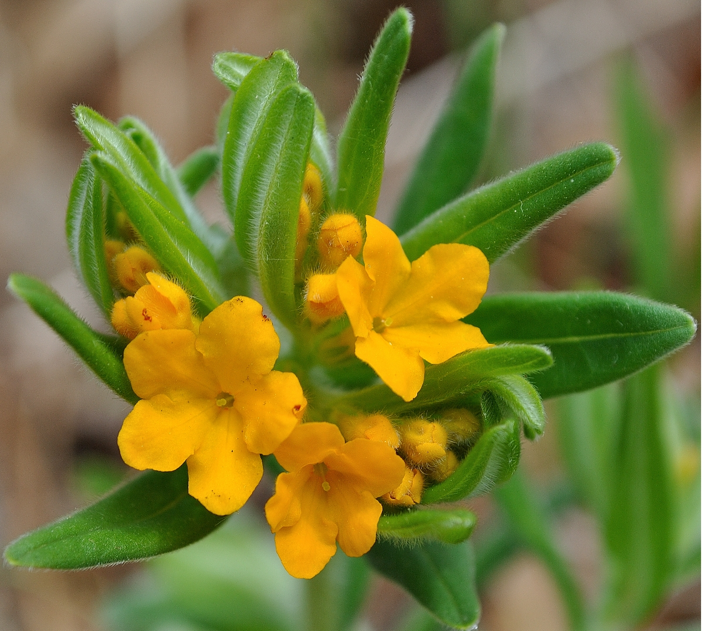
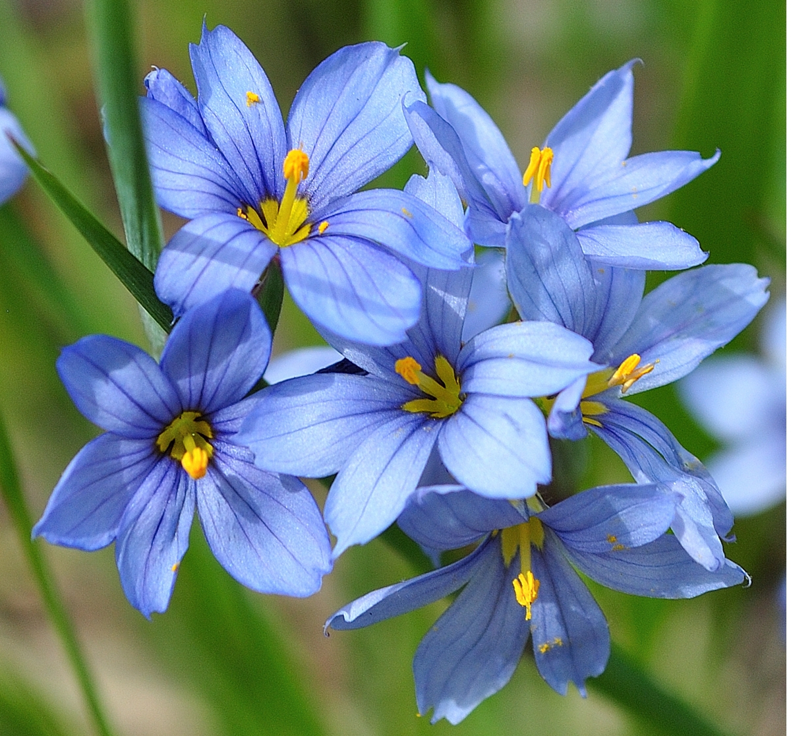
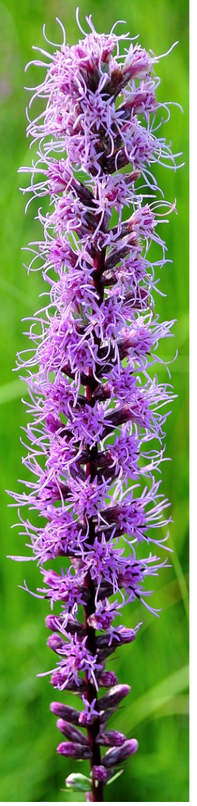
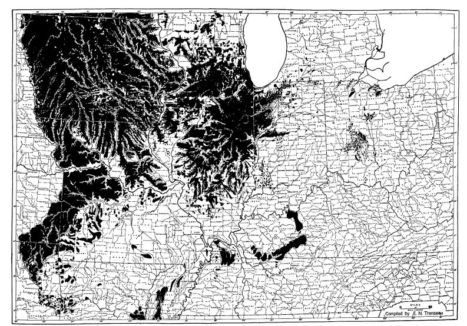
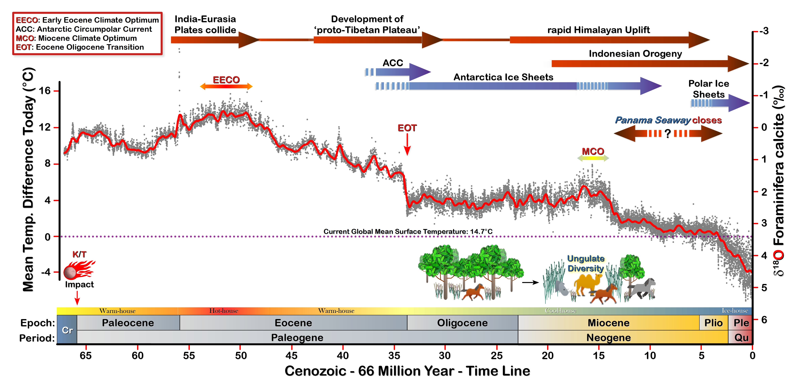
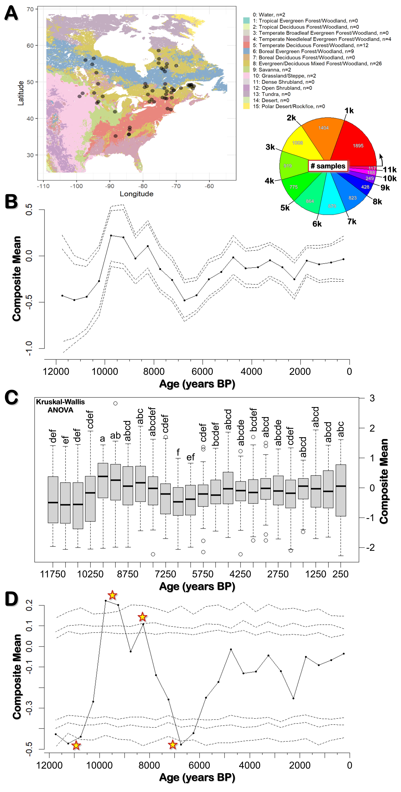

<style type="text/css">

/* ================== */
/*  Photo/Figures CSS */
/* ================== */

#myDiv44 {
  border: 4px outset red;
  width: 50%;
  padding: 4px;
  margin: auto;
  border-style: groove;
  background-color: ivory1;    
  text-align: center;
}

.center {
  display: block;
  margin-left: auto;
  margin-right: auto;
  width: 90%;
  }

#FRight150 {
  float: right;
  height: 150px;
  text-align: center;
  padding: 10px 10px 10px 10px;
  clear: right;
}

#FRight175 {
  float: right;
  height: 175px;
  text-align: center;
  padding: 10px 10px 10px 10px;
  clear: right;
}

#FRight200 {
  float: right;
  height: 200px;
  text-align: center;
  padding: 10px 10px 10px 10px;
  clear: right;
}

#FRight250 {
  float: right;
  height: 250px;
  text-align: center;
  padding: 10px 10px 10px 10px;
  clear: right;
}

#FRight335 {
  float: right;
  height: 335px;
  text-align: center;
  padding: 10px 10px 10px 10px;
  clear: right;
}


/* ========================== */
/*         TABLE CSS          */
/* ========================== */

.Table {
  border-collapse: collapse;
  overflow: auto;
  width: 100%;
  margin: 1px;
  box-shadow: 0 0 10px rgba(0, 0, 0, 0.55);
  }

.Table thead tr {
  border: 2px solid;
  padding: 1px;
  text-align: center;
  text: bold;
}

.Table thead th {
  border: 2px solid;
  text-align: center;
  text: bold;
  font-size: 24px;
}

.Table thead th.f18 {
  border: 2px solid;
  text-align: center;
  text: bold;
  font-size: 18px;
}

.Table tbody td {
  border: 2px solid;
  text-align: center;
  text: bold;
  font-size: 14px;
  background-color: white;
}

.Table tbody td.tmid {
  border: 2px solid;
  text-align: center;
  text: bold;
  font-size: 14px;
  background-color: white;
}

td:first-child + td {text-align: center;}

td:first-child + td + td.tcell {text-align: center;}

.Table tbody tr {border-bottom: 2px solid #dddddd;}

.Table tbody tr:last-of-type {border-bottom: 2px solid #009879;}


/* =============================== */
/*          CSS for Links          */
/* =============================== */

a.one:link {color: rgb(0, 0, 200);}
a.one:visited {color: rgb(192, 20, 172);}
a.one:hover {color: rgb(255, 20, 100);}


/* ============================== */
/*     CSS for stylizing text     */
/* ============================== */

#BBlk {
  font-weight: bold;
  color: rgb(0, 0, 0);
  border: 2px solid black;
  margin: 1px;
  }

#Blk20 {
  color: black;
  font-size: 20px;
  text-align: left;
  }

#BBlk20 {
  font-weight: bold;
  color: black;
  font-size: 20px;
  text-align: left;
  }

#Blk { font-weight: bold; color: rgb(0, 0, 0); }
#Red { font-weight: bold; color: rgb(255, 10, 20); }
#Red2 { font-weight: bold; color: rgb(255, 50, 50); }
#Dred { font-weight: bold; color: rgb(175, 0, 0); }
#Or { font-weight: bold; color: rgb(255, 140, 0); }
#Or2 { font-weight: bold; color: rgb(245, 180, 0); }
#Gold { font-weight: bold; color: rgb(230, 190, 0); }
#Ly { font-weight: bold; color: rgb(225, 200, 0); }
#Y1 { font-weight: bold; color: rgb(255, 225, 100); }
#Y2 { font-weight: bold; color: rgb(225, 200, 50); }
#GrY { font-weight: bold; color: rgb(240, 240, 0); }
#Grod { font-weight: bold; color: rgb(200, 160, 40); }
#Gr1 { font-weight: bold; color: rgb(25, 200, 25); }
#Gr2 { font-weight: bold; color: rgb(25, 150, 25); }
#Gr3 { font-weight: bold; color: rgb(25, 100, 25); }
#Moss { font-weight: bold; color: rgb(80, 210, 100); }
#BGr { font-weight: bold; color: rgb(67, 205, 170); }
#Teal { font-weight: bold; color: rgb(60, 180, 180); }
#Teal2 { font-weight: bold; color: rgb(60, 100, 200); }
#Blue { font-weight: bold; color: blue; }
#SkyB { font-weight: bold; color: rgb(104, 207, 240); }
#Cb { font-weight: bold; color: rgb(0, 123, 167); }
#Glacialb { font-weight: bold; color: rgb(54, 139, 193); }
#Db2 { font-weight: bold; color: rgb(0, 0, 100); }
#Lb1 { font-weight: bold; color: rgb(50, 215, 255); }
#Lb2 { font-weight: bold; color: rgb(50, 155, 255); }
#Lb3 { font-weight: bold; color: rgb(50, 115, 255); }
#Violet { font-weight: bold; color: rgb(180, 73, 255); }
#V2 { font-weight: bold; color: rgb(183, 137, 211); }
#Purple { font-weight: bold; color: rgb(150, 0, 255); }
#Dpurp { font-weight: bold; color: rgb(95, 0, 161); }
#Magenta { font-weight: bold; color: rgb(255, 0, 255); }
#Coral { font-weight: bold; color: rgb(255, 127, 80); }
#Salmon { font-weight: bold; color: rgb(255, 140, 160); }
#Crim { font-weight: bold; color: rgb(220, 20, 60); }
#Rasp { font-weight: bold; color: rgb(227, 11, 92); }
#Lgray { font-weight: bold; color: rgb(220, 220, 220); }
#Silver { font-weight: bold; color: rgb(192, 192, 192); }
#Gray { font-weight: bold; color: rgb(155, 155, 155); }
#Gray2 { font-weight: bold; color: rgb(215, 200, 200); }
#Dgray { font-weight: bold; color: rgb(95, 95, 95); }
#Br { font-weight: bold; color: rgb(165, 42, 42); }
#Rust { font-weight: bold; color: rgb(183, 65, 14); }
#Dbr { font-weight: bold; color: rgb(100, 20, 20); }
#Zinc { font-weight: bold; color: rgb(140, 209, 187); }
#Zinc2 { font-weight: bold; color: rgb(0, 102, 102); }

</style>

```{r setup, include=FALSE}
knitr::opts_chunk$set(collapse = TRUE)

### Libraries
library(pacman)
pacman::p_load(blogdown, tidyverse, kableExtra, dplyr, purrr, bibtex, citr)

```

<!------------------------------------------------>
<!-------- JAVASCRIPT - enable LaTex MATH -------->
<!------------------------------------------------>
<script type="text/javascript"
  src="https://cdnjs.cloudflare.com/ajax/libs/mathjax/2.7.0/MathJax.js?config=TeX-AMS_CHTML">
</script>
<script type="text/x-mathjax-config">
  MathJax.Hub.Config({
    tex2jax: {
      inlineMath: [['$','$'], ['\\(','\\)']],
      processEscapes: true},
      jax: ["input/TeX","input/MathML","input/AsciiMath","output/CommonHTML"],
      extensions: ["tex2jax.js","mml2jax.js","asciimath2jax.js","MathMenu.js","MathZoom.js","AssistiveMML.js", "[Contrib]/a11y/accessibility-menu.js"],
      TeX: {
      extensions: ["AMSmath.js","AMSsymbols.js","noErrors.js","noUndefined.js"],
      equationNumbers: {
      autoNumber: "AMS"
      }
    }
  });
</script>

<!------------------------------------------->
<!------------ FIG 1 - OPC MAP  ------------->
<!------------------------------------------->
<div align=center>

<figure>


</div>

<!----------------------------------------->
<!-------- END - FIG 1 - OPC MAP  --------->
<!----------------------------------------->

<!-- this is a subheadline -->
<details>
  <summary><b>TABLE OF CONTENTS</b></summary>
  
  1. <a href="#History">History of Prairies in Southern Ontario</a>
  2. <a href="#Eco">Ecology of Tallgrass Communities</a>
     * <a href="#Climate">2.1 Climate</a>
     * <a href="#delta18">&delta;<sup>18</sup><span id="Red">O</span></a>
     * <a href="#NDis">2.2 Natural Disturbances of Grasslands: Fire and Grazing</a>
     * <a href="#Fig1">Figure 1: Cenozoic Record - last 66 million years of Climate</a>
     * <a href="#Fig2">Figure 2: Eastern North America's Fire History</a>
  3. <a href="#Refs">References</a>
</details>

<!----------------------------------------------->
<!--------- SECTION 1 - HISTORY OF OPC  --------->
<!----------------------------------------------->

&nbsp; &nbsp; As shown in the map above <span id="Dred">O</span>jibway <span id="Dred">P</span>rairie <span id="Dred">C</span>omplex (<span id="Dred">OPC</span>) is composed of five distinct areas: (i) **Ojibway Park** (~61.5 ha); (ii) **Ojibway Prairie Provincial Nature Reserve** (105 ha); (iii) **Tallgrass Prairie Heritage Park** (~15.6 ha); (iv) **Spring Garden ANSI** (~117 ha); and (v) **Black Oak Heritage Park** (~50.6 ha). Collectively they are home to at least 160 rare plant and animal.**[@bakowsky_survey_1994; @noauthor_ojibway_2022]** Sadly, <span id="Dred">OPC</span> is one of the last major remnants of **<a class="one" href="https://tallgrassontario.org/wp-site/" target="_blank" title="Go to TG Ontario">Tallgrass Communities</a>** (<span id="Gr2">TGC</span>) within the province and therefore in great need of our protection.**[@rodger_tallgrass_1998; @farrell_large-scale_2004; @catling_extent_2008; @tallgrass_ontario_tallgrass_2019; @kraus_southern_2020]**

**1. HISTORY OF PRAIRIES IN SOUTHERN ONTARIO**  
&nbsp; &nbsp; <a id="History"></a>Prior to European settlement **grasslands** covered much of North America's heartland, stretching from the northern plains of Canada's prairie provinces to south-central Texas. Looking eastward, the prairie extended from the dry foothills of the Rocky Mountains to the large stands of deciduous forest just east of the mighty Mississippi river. A notable feature of this great grassy plain was the *triangular* shape of its eastern border, often referred to as the <span id="Dpurp">Prairie Peninsula</span>.**[@stuckey_origin_1978]** This neck-like extension of mid-western prairie once covered most of Iowa and northern Missouri, large parts of neighbouring Illinois (known as the Prairie State), as well as portions of Indiana and Ohio. Just beyond the peninsula's formal borders one could find quite substantial patches of **prairie** and **oak savanna** amongst the eastern woodlands and wetlands. A good example of this would be the western end of the Lake Erie. Many eye witness accounts from the early 1800s tell of a large lake plain with extensive swamp forests, oak woodlands and wet prairies.**[@mayfield_changes_1988]** As the famed naturalist Harold Mayfield once stated:  

>"...*Few people today realize the original extent of wet grasslands in this region. One continuous strip extended almost without a break from Sandusky Bay around the southwest corner of Lake Erie and up the western shore almost to Detroit. An early observer estimated the area of this tract at more than 200,000 acres* [>800 km<sup>2</sup>]."**[@mayfield_changes_1988]** 

In southern Ontario many early explorers and surveyors also discovered large tracts of <span id="Gr2">TGC</span> bordering the Great Lakes (i.e. Erie, Ontario, Huron) as well as other inland waterways (i.e. Lakes St. Clair and Rice; Detroit, St. Clair, Thames and Grand rivers). For example, the famous Flemish friar Louis Hennepin (1679) described the banks of the Detroit river as:  

>"...*the country between those two Lakes* [Erie and Lake St. Clair] *is very well situated, and the soil fertile. The banks of the streight* [Detroit River] *are vast meadows, and the prospect is terminated with some hills covered with vineyards*."**[@hennepin_new_1903]**

Antoine de Lamothe-Cadillac (1701), founder of Fort Pontchartrain du Detroit, also had a favourable view of the Detroit river:  

>"...*Detroit is, probably, only a canal or a river of moderate breadth ...through which the sparkling and pellucid waters of Lakes Superior, Michigan and Huron (which are so many seas of sweet water) flow and glide away gently and with a moderate current into Lake Erie, into the Ontario or Frontenac, and go at last to mingle in the river St. Lawrence with those of the ocean. The banks are so many vast meadows where the freshness of these beautiful streams keep the grass always green*."**[@lajeunesse_windsor_1960]**  

Even today the names of some settlements remind us of southern Ontario's past grassland glory (e.g. Prairie Siding - just west of Chatham; Plainville - just south of Rice Lake).  
&nbsp; &nbsp; Altogether, it is estimated that between 800 and 2,000 km&#178; of <span id="Gr2">TGC</span> once covered parts of southern Ontario's landscape.**[@bakowsky_survey_1994; @rodger_tallgrass_1998; @farrell_large-scale_2004; @tallgrass_ontario_tallgrass_2019]** Regardless of "*true*" extent of these original grassland communities the rapid lost of these habitats to urban and agricultural developments some two centuries ago seems to have also erased our collective memory of them. For you would be hard pressed to find anyone who knows that these rare ecosystems exist today in southern Ontario. Arguably there is no other major ecosystem in North America, not even the old-growth rainforests of the Pacific Northwest, that have been so fully altered by humans. It is estimated that <2% of North America's original tallgrass prairie is all that remains today.**[@rodger_tallgrass_1998; @tallgrass_ontario_tallgrass_2019]** Unfortunately, the situation is far worse for **oak savannas**. These '*parkland*'-like areas, that once covered an estimated 12,000,000 ha of the north-central United States alone, are now almost all gone (i.e. <1% remains).**[@nuzzo_extent_1986]**  

**2. ECOLOGY OF TALLGRASS COMMUNITIES**  
<a id="Eco"></a>
<a id="BBstem"></a>
<figure id="FRight250">

<figcaption>
<b>Big Bluestem<sup>S4G5</sup></b>
</figcaption>
</figure>  

<figure id="FRight150">

<figcaption>
<b>Little Bluestem<sup>S4G5</sup></b>
</figcaption>
</figure> 

<figure id="FRight175">

<figcaption>
<b>Hoary Puccoon<sup><span id="Blue">S3</span>G5</sup></b>
</figcaption>
</figure>

<figure id="FRight175">

<figcaption>
<b>Pointed Blue-eyed-grass<sup>S4G5</sup></b>
</figcaption>
</figure>

<figure id="FRight175">

<figcaption>
<b>Missouri Ironweed<sup><span id="Blue">S3</span>G4</sup></b>
</figcaption>
</figure>

<figure id="FRight175">

<figcaption>
<b>Prairie Dock<sup><span id="Red">S1</span>G4</sup></b>
</figcaption>
</figure>

<figure id="FRight335">

<figcaption>
<b>Dense Blazing star<sup><span id="Dred">S2</span>G5</sup></b>
</figcaption>
</figure>

<figure id="FRight175">

<figcaption>
<b>Transeau's Prairie Peninsula (1935)</b>
</figcaption>
</figure>

&nbsp; &nbsp; The term "*Tallgrass Communities*" (<span id="Gr2">TGC</span>) refers to the types of plants and animals found in these ecosystems (i.e. mix of tallgrass prairies and mostly oak savannas). These rare habitats of eastern North America are home to hundreds of herbaceous plant species (i.e. grasses, sedges, forbs). And as the name suggests they are dominated by tall grasses such as **<a class="one" href="https://explorer.natureserve.org/Taxon/ELEMENT_GLOBAL.2.133783/Andropogon_gerardii" target="_blank" title="Go to NatureServe">Big Bluestem</a>** (*Andropogon gerardi*), **<a class="one" href="https://explorer.natureserve.org/Taxon/ELEMENT_GLOBAL.2.144026/Spartina_pectinata" target="_blank" title="Go to NatureServe">Prairie Cordgrass</a>** (*Spartina pectinata*) and **<a class="one" href="https://explorer.natureserve.org/Taxon/ELEMENT_GLOBAL.2.141861/Schizachyrium_scoparium" target="_blank" title="Go to NatureServe">Little Bluestem</a>** (*Schizachyrium scoparium*). Many smaller **sedges**, another <u>grass-like</u> plant, as well as hundreds of flowering plant (**forbs**) species can also be found in <span id="Gr2">TGC</span>. For example, Spring brings the first of many beautiful small forbs, such as **<a class="one" href="https://explorer.natureserve.org/Taxon/ELEMENT_GLOBAL.2.160803/Lithospermum_canescens" target="_blank" title="Go to NatureServe">Hoary Puccoon</a>** (*Lithospermum canescens*) and **<a class="one" href="https://explorer.natureserve.org/Taxon/ELEMENT_GLOBAL.2.137876/Sisyrinchium_angustifolium" target="_blank" title="Go to NatureServe">Pointed Blue-eyed-grass</a>** (*Sisyrinchium angustifolium*). Summer in turn brings forth its own colorful bounty, such as the deep violet **<a class="one" href="https://explorer.natureserve.org/Taxon/ELEMENT_GLOBAL.2.153254/Vernonia_missurica" target="_blank" title="Go to NatureServe">Missouri Ironweed</a>** (*Vernonia missurica*), the tall yellow **<a class="one" href="https://explorer.natureserve.org/Taxon/ELEMENT_GLOBAL.2.151316/Silphium_terebinthinaceum" target="_blank" title="Go to NatureServe">Prairie Dock</a>** with its huge spade-like leaves, and the showy magenta spike of **<a class="one" href="https://explorer.natureserve.org/Taxon/ELEMENT_GLOBAL.2.132723/Liatris_spicata" target="_blank" title="Go to NatureServe">Dense Blazingstar</a>** (*Liatris spicata*). These along with many other flowering plants provide food for a variety of pollinating insects, some of which require a specific plant species to complete their life cycle (e.g. Monarch butterfly and Milkweeds).  
&nbsp; &nbsp; The **savanna** component of <span id="Gr2">TGC</span> refers to '*parkland*'-like areas that have varying degrees of tree cover (i.e. 10-60%).**[@bucini_climate_2017]** These areas are dominated by both woody and herbaceous plants. At <span id="Dred">OPC</span> the dominate woody species is **<a class="one" href="https://explorer.natureserve.org/Taxon/ELEMENT_GLOBAL.2.133488/Quercus_velutina" target="_blank" title="Go to NatureServe">Black Oak</a>** (*Q. velutina*) and **<a class="one" href="https://explorer.natureserve.org/Taxon/ELEMENT_GLOBAL.2.159415/Quercus_palustris" target="_blank" title="Go to NatureServe">Pin Oak</a>** (*Q. palustris*) while the dominate herbaceous plant species is usually tallgrasses. Nevertheless, other oak species (i.e. **<a class="one" href="https://explorer.natureserve.org/Taxon/ELEMENT_GLOBAL.2.138617/Quercus_alba" target="_blank" title="Go to NatureServe">White Oak</a>** and **<a class="one" href="https://explorer.natureserve.org/Taxon/ELEMENT_GLOBAL.2.158441/Quercus_macrocarpa" target="_blank" title="Go to NatureServe">Bur Oak</a>**) and forbs are found in abundance here. It is also interesting to note that some forbs appear to be **savanna** specialists. For example, the beautiful hemi-parasitic **<a class="one" href="https://explorer.natureserve.org/Taxon/ELEMENT_GLOBAL.2.152809/Aureolaria_flava" target="_blank" title="Go to NatureServe">Smooth Yellow False Foxglove</a>** (*Aureolaria flava*) is only found clustered underneath the oak trees at <span id="Dred">OPC</span>. Although *A. flava* is capable of photosynthesis they selectively harvest some water and nutrients from the roots of nearby oaks.**[@committee_on_the_status_of_endangered_wildlife_in_canada_cosewic_cosewic_2019]** These parasitized resources presumably helps the plant survive some of the harsher conditions within **savannas** (i.e. occasional droughts, nutrient poor sandy soils).  
&nbsp; &nbsp; The *transitional* nature of **oak savannas** is what ecologists call an <span id="Dpurp">ecotone</span>. Conceptually these areas represent transitions (either sharp or more gradual) between adjacent but distinct ecological communities (e.g. open prairie and closed canopy forest).**[@risser_status_1995]** For example, some of <span id="Dred">OPC</span>'s **oak savannas** connect open prairie to more heavily wooded areas, while other more isolated oaks look like small "*islands*" amid a sea of tall grasses and flowers. Needless to say, these types of transitional communities are complex owing to their varying sizes, shapes (e.g. "*patch-work*" geometry), and the ways they can interact with neighbouring ecosystems (i.e. flow of resources).**[@risser_status_1995; @strayer_classification_2003; @ries_ecological_2004; @kark_ecotones_2013]** Perhaps the most important reason for studying and protecting <span id="Dpurp">ecotones</span>, like **oak savannas**, is because of the reported positive effects they have on species abundance and richness.**[@smith_role_1997; @brawn_effects_2006; @kark_role_2007]** Certainly, from my own experiences at <span id="Dred">OPC</span>, the **oak savannas** do attract certain bird species, like the **<a class="one" href="https://www.allaboutbirds.org/guide/Red-headed_Woodpecker/overview" target="_blank" title="Go to Cornell"> Red-headed Woodpecker</a>** (*Melanerpes erythrocephalus*) and **<a class="one" href="https://www.allaboutbirds.org/guide/Indigo_Bunting/overview" target="_blank" title="Go to Cornell">Indigo Bunting</a>** (*Passerina cyanea*). Although my sightings of *M. erythrocephalus* have often been fleeting, my regular encounters with *P. cyanea* during the summer months have been anything but brief. These brilliantly colored songbirds are quite vocal when feeding on insects along the borders of the oak stands and as a consequence fairly easy to spot.  
&nbsp; &nbsp; So what factors control the geographic distribution of tallgrass prairies and oak savannas in North America? Although <span id="Gr2">TGC</span> are dynamic systems, like any other natural community, they are greatly influenced by <span id="Blue">climate</span> and natural disturbances (i.e. <span id="Red">wild fires</span> and <span id="Purple">grazing</span>).**[@anderson_evolution_2006]**


<a id="Climate"></a>
**2.1** <b>CLIMATE:</b> The geographical distribution of large plant communities (i.e. **biomes**) like grasslands are controlled in large part by climate. **Edgar Transeau**, a pioneering ecologists who coined the term <span id="Dpurp">Prairie Peninsula</span>, actually generated a map of the geographic boundary of this '*peninsula*' based on the *evapotranspiration rate* (i.e. ratio of rainfall to evaporation) of this region.**[@transeau_prairie_1935; @stuckey_origin_1978]** In Ontario, climate (specifically its recent glacial history) has played a major role in shaping the development of its plant communities. The province, as well as the rest of Canada, has been subjected to multiple **Ice Ages** since the latter part of the **<a class="one" href="https://stratigraphy.org/chart" target="_blank" title="Go to ICS">Pleistocene epoch</a>**.**[@cohen_ics_2022]** The last of these glaciation events, known as the **Wisconsin**, peaked at around 21,000 years ago (**ya**). Following this glacial maximum the climate quickly warmed resulting in the northerly retreat of the **<a class="one" href="https://planetearth.utsc.utoronto.ca/timeline/hlis_t1b.html" target="_blank" title="Go to PlanetEarth">Laurentide Ice Sheet</a>** (<span id="Purple">LIS</span>). The time-line of these past glaciation events has been reconstructed using a variety of **<a class="one" href="https://www.usgs.gov/programs/climate-research-and-development-program/science/paleoclimate-proxies" target="_blank" title="Go to USGS">Paleoclimate Proxies</a>**, most notably isotopic chemistry techniques applied to samples taken from glacial ice and deep ocean (benthic) sediment cores. The **<a class="one" href="https://www.nndc.bnl.gov/nudat3/" target="_blank" title="Go to NuDat3">three stable isotopes of oxygen</a>** (<sup>16</sup><span id="Red">O</span> = 99.757%, <sup>17</sup><span id="Red">O</span> = 0.038%, and <sup>18</sup><span id="Red">O</span> = 0.205%)**[@national_nuclear_data_center_nndc_at_brookhaven_national_laboratory_nudat3_2024]** are of particular interest since they are the building blocks of water (<span id="Blue">H</span><sub>2</sub><span id="Red">O</span>) and biogenic carbonates (e.g. fossil **<a class="one" href="https://www.bgs.ac.uk/discovering-geology/fossils-and-geological-time/foraminifera/" target="_blank" title="Go to BGS">Foraminifera</a>** shells).**[@rohling_oxygen_2013]** Although all three of the oxygen isotopes have the same number of protons and electrons (i.e. same chemical behaviour), they do have varying numbers of neutrons and therefore different masses (e.g. <sup>16</sup><span id="Red">O</span> = 16 atomic mass units). It is this difference in mass that gives isotopes slightly different physical-chemical properties. As geologist **Eelco J. Rohling** clearly states:

>"...*Molecules vibrate with a fundamental frequency which depends on the mass of the isotopes...the resultant differences...imply that bonds formed by light isotopes are weaker than those formed by heavy isotopes. Hence, as a rule of thumb, molecules comprised of the light isotopes react somewhat more easily than those comprised of the heavy isotopes*."**[@rohling_oxygen_2013]**  

This difference in bond strength results in the '*fractionation*' of **isotopologes** (i.e. molecules that differ only in their isotopic composition) between any two substances (e.g. <span id="Blue">H</span><sub>2</sub><span id="Red">O</span> &ndash; <span id="Ly">Ca</span>**C**<span id="Red">O</span><sub>3</sub> system) or two phases of the same substance (e.g. liquid &#8644; vapour phases).**[@rohling_oxygen_2013]** For example, the heavier <span id="Blue">H</span><sub>2</sub><sup>18</sup><span id="Red">O</span> tends to evaporate more slowly and condense more quickly than <span id="Blue">H</span><sub>2</sub><sup>16</sup><span id="Red">O</span>. More importantly, the fractionation of these two water **isotopologes** is <u>temperature dependent</u>.  

>"...*measuring the oxygen and carbon isotopic composition of fossil foraminiferal calcite has been one of the most effective techniques for reconstructing ocean and climate conditions of past times*."**[@rohling_oxygen_2013]**

Since the fractionation between calcite (<span id="Ly">Ca</span>**C**<span id="Red">O</span><sub>3</sub>) and water is a function of temperature, it's possible to use the ratio of oxygen isotopes (&delta;<sup>18</sup><span id="Red">O</span>) from fossil **<a class="one" href="https://www.bgs.ac.uk/discovering-geology/fossils-and-geological-time/foraminifera/" target="_blank" title="Go to BGS">Foraminifera</a>** shells to estimate the temperature of the seawater these single celled organisms once inhabited long ago. These isotopic methods were introduced back in the early 1950s by the Nobel prize winning chemist **<a class="one" href="https://www.nobelprize.org/prizes/chemistry/1934/summary/" target="_blank" title="Go to NobelPrize.org">Harold Urey</a>**.**[@nier_mass_1947; @urey_thermodynamic_1947; @mckinney_improvements_1950; @urey_measurement_1951; @epstein_carbonate-water_1951; @coplen_reporting_1994]**


<!-- Delta-18-oxygen calculation -->
<div id="myDiv44"><a id="delta18"></a>

&delta;<sup>18</sup><span id="Red">O</span> = [(<b>R</b><sub>sample</sub>/<b>R</b><sub>standard</sub>) - 1] x 1000

where <b>R</b> = <sup>18</sup><span id="Red">O</span>/<sup>16</sup><span id="Red">O</span>

</div>


The use of &delta;<sup>18</sup><span id="Red">O</span>, as well as other types of **<a class="one" href="https://www.usgs.gov/programs/climate-research-and-development-program/science/paleoclimate-proxies" target="_blank" title="Go to USGS">Paleoclimate Proxies</a>** (e.g. pollen, spores, charcoal), has been particularly useful in determining the types of plant communities (i.e. **biomes**) that once populated North America since end of the last ice age ~11,700 **ya** (Note: designated end of the **<a class="one" href="https://stratigraphy.org/chart" target="_blank" title="Go to ITS">Pleistocene epoch</a>**). Studies of pollen from across the province show relatively rapid changes in vegetation during the early part of the **Holocene**.**[@terasmae_notes_1973; @liu_holocene_1990; @szeicz_postglacial_1991; @fuller_holocene_1997; @dyke_late_2007]** Deglaciated areas that once supported **Spruce** (*Picea spp.*) and tundra-like (herbs and shrubs) vegetation gave way to **Jack Pine** (*Pinus banksiana*), **Paper Birch** (*Betula papyrifera*) and a minor mix of other species (e.g. **Oaks**, **Ashes**, **Elms**, **Beech**). By ~10,000 **ya** a wide band of forests had developed along the trailing edge of the retreating ice sheet that stretched from eastern Alberta and southern Saskatchewan down through the mid-west and north-eastern United States.**[@dyke_late_2007]** However, towards the middle of the **Holocene** (10,000 to 5,000 **ya**) climate in North America became unusual warm and dry.**[@dean_variability_1984; @dyke_late_2007; @bartlein_pollen-based_2011]** This so-called <span id="Blue">H</span>olocene <span id="Blue">C</span>limate <span id="Blue">O</span>ptimum (<span id="Blue">HCO</span>) is thought to have been the likely cause of an eastward migration of western type prairie vegetation and the expansion of <span id="Gr2">TGC</span> within southern Ontario. Cyclic changes in the earth's orbit (i.e. **<a class="one" href="https://climate.nasa.gov/news/2948/milankovitch-orbital-cycles-and-their-role-in-earths-climate/" target="_blank" title="Go to NASA">Milankovitch Cycles</a>**) appears to be the main cause of this **mid-Holocene** warming event, a process referred to as **orbital forcing**.**[@milankovic_canon_1941; @emiliani_glaciations_1959; @hays_variations_1976; @imbrie_modeling_1980]** However, it is interesting to note that the timing of the <span id="Blue">HCO</span> varied across the north. A review of **Holocene** proxy data from across the western Arctic (140 sites) revealed that in Alaska and northwest Canada warming started earlier at around 11,000 **ya**, while in the Hudson Bay region warming started ~8,000 **ya**.**[@kaufman_holocene_2004]** Clearly regional factors played a role in modifying the timing of the <span id="Blue">HCO</span> (e.g. ocean currents, albedo and temperature affects of large remnant ice sheets around Hudson Bay). Nevertheless, by 7,000-8,000 **ya** Ontario (now ice free) had undergone noticeable changes in the composition of its forests. Pollen studies shows that both cool mixed forests (e.g. **Birch**, **Beech**, **White Pine**, **Hemlock**, **Cedar**) as well as the more southerly deciduous forests (e.g. **Sugar Maple**, **Ash**, **Oaks**, **Beech**, **Hickory**, **Chestnut**) had advanced further north beyond their current ranges.**[@terasmae_notes_1973; @liu_holocene_1990; @szeicz_postglacial_1991; @fuller_holocene_1997; @dyke_late_2007]** The relatively stable levels of herbaceous plant pollen (i.e. grasses and forbs) during this time also suggests that open forested areas, like oak savannas, were also part of the province's landscape. By the end of the <span id="Blue">HCO</span> (5,000-6,000 **ya**) the climate in Ontario (and the rest of the continent) became cooler and wetter resulting in the southerly retreat of both the cool-mixed and temperate deciduous forests.**[@terasmae_notes_1973; @liu_holocene_1990; @szeicz_postglacial_1991; @fuller_holocene_1997; @dyke_late_2007]** This wetter climate likely allowed forests to invade open areas leading to a mosaic of vegetation types within the province.  


<a id="NDis"></a>
**2.2 NATURAL DISTURBANCES** (<span id="Purple">GRAZING</span>, <span id="Red">FIRE</span> **and** <span id="Dbr">DROUGHT</span>)**:** Grasslands around the world are known for their periodic droughts, frequent <span id="Red">fires</span> and large numbers of <span id="Purple">grazing</span> (and burrowing) animals they support.**[@anderson_evolution_2006]** These abiotic and biotic factors often interact with one another to significantly alter the structure of grassland communities (e.g. species composition).  
&nbsp; &nbsp; In North America one such major change in the structure of its **biomes** occurred around 23 million **ya** at the start of the **<a class="one" href="https://stratigraphy.org/chart" target="_blank" title="Go to ITS">Miocene Epoch</a>** (**Fig. 1**). An abundance of fossil and proxy evidence suggests that large forested regions were replaced by a more open grassland/savanna system.**[@thomasson_late_1990; @jacobs_origin_1999; @janis_origins_2002; @janis_species_2004; @stromberg_decoupled_2005; @edwards_origins_2010]** This shift in **biomes**, particularly within the central parts of the continent, coincided with the appearance of a large number of <span id="Purple">grazing</span> mammals (i.e. **ungulates**).**[@jacobs_origin_1999; @janis_origins_2002; @janis_species_2004]** Fossils from these now extinct species (e.g. early horses, grazing rhinoceroses, proto-camels, early bison and antelopes) share many anatomical features that are adapted to grazing in open grassy plains (e.g. craniodental adaptations: high crown molars for grinding, large attachments sites for masticating muscles; cursorial adaptations: long leg bones for running). Not surprisingly, grasses have evolved their own strategies to counteract grazing and other disturbances, notably the development of underground vegetative growth centres (e.g. **rhizomes**) and **silica** deposits within leaves and other plant tissues.**[@anderson_evolution_2006]** The former allows grasses to survive and reproduce in response to <span id="Purple">grazing</span> and seasonal <span id="Red">fires</span>, while the latter presumably makes the plants less palatable to herbivores. These so-called silica '*deposits*' are actually polymers of soluble **silicic acid** (<span id="Gray">Si</span>(<span id="Red">O</span><span id="Blue">H</span>)<sub>4</sub>) that have been shown to take on a variety of shapes or morphologies (i.e. morphotypes).**[@epstein_anomaly_1994; @currie_silica_2007; @exley_silicic_2019]** The natural abundance of **silicon** (<span id="Gray">Si</span>) within the Earth's crust and soil (i.e. chemical weathering process, see **Fig. 1** legend) would suggest that it is taken up by the roots of all plants. However, it is *interesting* to note that the ability to accumulate <span id="Gray">Si</span> varies considerably among plants (i.e. 0.1-10% dry weight), with grasses and sedges (i.e. **graminoids**) being among the most '*active*' accumulators of this ubiquitous element.**[@currie_silica_2007; @exley_silicic_2019]** The nature of this active uptake is due to a dedicated **<a class="one" href="https://www.rcsb.org/structure/7NL4">silicon transporter protein</a>** expressed in the roots of plants like grasses.**[@ma_silicon_2006; @van_den_berg_structural_2021]** Once taken up, the <span id="Gray">Si</span>(<span id="Red">O</span><span id="Blue">H</span>)<sub>4</sub> is transported via the **xylem** (i.e. vascular tissue) to different parts of the plant where it forms *opal-type* bodies (i.e. <span id="Gray">Si</span><span id="Red">O</span><sub>2</sub>&bull;<sub><i>n</i></sub><span id="Blue">H</span><sub>2</sub><span id="Red">O</span>), commonly referred to as **phytoliths**.**[@epstein_anomaly_1994; @currie_silica_2007]** What makes these opal-type **phytoliths** so interesting to ecologists is that, like pollen and spores, they form durable micro-fossils that serve as useful taxonomic tools to reconstruct past vegetation communities. In fact, a study by **Stromberg** (2005) used phytoliths recovered from several central Great Plain states to reconstruct the evolution of this forest-to-grassland transition 11-to-24 million **ya**.**[@stromberg_decoupled_2005; @edwards_origins_2010]**  

<!-- 66 My Cenozoic History -->
<div style="border: 2px solid gray; padding: 5px;">
<figure>



</figure>

<a id="Fig1"></a>
**Figure 1. Earth's Cenozoic Record: Major Climate, Geology and Ecology Events.** The above plot used the composite deep-sea benthic foraminifer stable oxygen (&delta;<sup>18</sup><span id="Red">O</span>) isotope data set from the recent **<a class="one" href="https://www.science.org/doi/10.1126/science.aba6853">CENOGRID study</a>** (Supplemental Data, **Table S34**).**[@westerhold_astronomically_2020]** Data for the last 34 **My** has a resolution 2 **ky**, while the data for the 34 to 67.1 **My** interval has a resolution of 5 **ky**. In total 23,626 data points were plotted (**gray dots**). The <span id="Red">red line</span> represents the smoothed <b>long term average</b> (1 **My** weighted function) of the above &delta;<sup>18</sup><span id="Red">O</span> values. The values plotted on the y-axis (right) have been <u>reversed</u> (like the paper) to reflect the correlation between <u>warmer temperatures</u> and <u>lower &delta;<sup>18</sup><span id="Red">O</span> values</u>. These oxygen isotope values have been converted to average temperature differences with <u>respect to today</u> (left y-axis). Time and the corresponding geological **Periods** and **Epochs** have been plotted on the x-axis. The four climate states (<span id="Red">Hot-house</span>, <span id="Or">Warm-house</span>, <span id="Lb">Cool-house</span>, and <span id="Blue">Ice-house</span>) identified in the study using recurrence plot analysis (i.e. identifies times when the dynamic climate system is "*trapped*" in a particular state) is also shown above the x-axis.**[@eckmann_recurrence_1987]** The <span id="Or">Warm-house</span> and <span id="Red">Hot-house</span> climate states cover most of the **Paleogene period** (34-67.1 **Mya**) right up until the critical **Eocene**-**Oligocene** transition (**EOT**). During this span of time global temperatures were more than 5&deg;C warmer compared to today. By comparison, during the relatively shorter <span id="Red">Hot-house</span> climate state (56-47 **Mya**) temperatures were more than 10&deg;C warmer than they are today. The <span id="Lb">Cool-house</span> climate state (~34-3.3 **Ma**) shows a marked shift in the &delta;<sup>18</sup><span id="Red">O</span> values compared to earlier times. There is a notable increase in the oxygen isotope values at the start of this period (**EOT**, 34 **Mya**), which may be related to the movement of Antarctica away from the other land masses. Isolation of this continent led to the development of the Antarctic Circumpolar Current (**ACC**, top <span id="Blue">blue</span> arrow). This current, which is driven by strong westerly winds, moves in an unobstructed manner clockwise around Antarctica. This action cools the land mass leading to the development of ice sheets. There is a similar increase in the &delta;<sup>18</sup><span id="Red">O</span> values at ~13.9 **Mya**, which is due to the stabilization and expansion of the Antarctic ice sheets (top <span id="Blue">blue</span> arrow). The final <span id="Blue">Ice-house</span> climate state (3.3 **Mya** to present) coincides with the development of the polar (Northern Hemisphere) ice sheet, which is thought to have been fully established by the time of the **Pliocene**-to-**Pleistocene** transition (~2.58 **Mya**). Some other events that may have, or continue to play an important role in controlling the global climate system have also been added to the plot. These include: **(i)** Plate-tectonic forces that closed the Panama Seaway (3-13 **Mya**).**[@montes_middle_2015]** The so called *Panama Hypothesis* suggests that closing of the seaway stopped the exchange of water between the Atlantic and Pacific Ocean basins resulting in the formation of meridional (north-south) flowing deep ocean currents. This in turn led to more intense temperature-evaporation-precipitation regimes within the North Atlantic that fueled glaciation at the pole;**[@keigwin_isotopic_1982]** and **(ii)** Plate-tectonic forces also triggered the collision between the Indian and Eurasian plates (~50 **Mya**). This led to the development of a massive **Tibetan Plateau** and the highest Mountain ranges in the world (i.e. Himalayas).**[@spicer_why_2021]** The massive height and size (i.e. 2.5 million km<sup>2</sup>) of this mountainous region creates a natural barrier to any southern moisture-laden air masses, resulting in the famous monsoons of the Indian subcontinent and a prominent northern rain-shadow. Natural chemical weathering of the mountains not only helped create large northern sandy deserts (e.g. Taklamakan, Mongolian Gobi), but also resulted in the capture of large amounts of atmospheric **C**<span id="Red">O</span><sub>2</sub>.**[@walker_negative_1981; @raymo_influence_1988]** It has been suggested that such chemical weathering within wet tropical zones that are rich in **ophiolite** (i.e. igneous rock from upper mantle and ocean crust found along major faults/suture zones, made of <span id="Dred">Fe</span> and <span id="Dpurp">Mg</span> rich silicates)**[@dilek_ophiolite_2011]** have the potential to sequester significant amounts of atmospheric **C**<span id="Red">O</span><sub>2</sub> over time.**[@jagoutz_low-latitude_2016; @macdonald_arc-continent_2019]** Lastly, the flora and fauna that flourished in response to these changing climate patterns, specifically at the dawn of North America's large grassland biomes in the early <b>Miocene</b> (discussed below), are depicted just above the time line.<b><sup>46-51</sup></b> **[@anderson_evolution_2006; @thomasson_late_1990; @jacobs_origin_1999; @janis_origins_2002; @janis_species_2004; @stromberg_decoupled_2005; @edwards_origins_2010]**  

</div>


&nbsp; &nbsp; The interactions between these major grassland disturbances (i.e. <span id="Red">fire</span>, <span id="Purple">grazing</span>, <span id="Dbr">drought</span>) has been the subject of much research over the last few decades, particularly as it relates to the structure, function and **<a class="one" href="https://www.biointeractive.org/classroom-resources/ants-grizzlies-general-rule-saving-biodiversity" target="_blank" title="Go to BioInteractive">biodiversity</a>** of these ecosystems. For example, studies have shown that spring burning of tallgrass prairies can stimulate the growth of dominant tallgrasses (i.e. **<a class="one" href="https://plants.usda.gov/home/plantProfile?symbol=ANGE" target="_blank" title="Go to USDA">Big bluestem</a>** - *A. gerardii*), while inhibiting the growth of smaller forbs. However, when <span id="Red">fire</span> is combined with <span id="Purple">grazing</span> then both tallgrasses and forbs do well (i.e. increase species diversity and richness).**[@collins_interaction_1987; @collins_modulation_1998]** As mentioned previously, prairie grasses like *A. gerardii* are adapted to tolerate surface <span id="Red">fires</span> owing to their underground reproductive structures (i.e. **rhizomes**). <span id="Red">Fire</span> not only clears the ground of dead decaying plant material (i.e. biomass fuel load), but also eliminates invasive <span id="Red">fire</span>-intolerant plants (e.g. shrubs and trees) that, if left unchecked, would change grasslands into wooded areas. In this way burning not only keeps the land open for sun-tolerant prairie plants (i.e. maintains ecosystem - positive feedback mechanism), but also limits the levels of nitrogen (from the decaying biomass) in the soil. The latter is important given that nitrogen levels have been shown to negatively impact prairie plant diversity and function (i.e. carbon storage).**[@wedin_influence_1996; @clark_loss_2008]** Although <span id="Red">fire</span> and <span id="Purple">grazing</span> animals are essentially competing for the same fuel, the grassland still benefits. This positive interactions is likely due to the ruminant's preference for grasses over forbs. Studies have shown that the diet of **<a class="one" href="https://www.worldwildlife.org/pages/how-bison-help-shape-the-northern-great-plains" target="_blank" title="Go to WWLife">Bison</a>** (*Bison bison*), a '*true*' **<a class="one" href="https://www.biointeractive.org/classroom-resources/some-animals-are-more-equal-others-keystone-species-and-trophic-cascades" target="_blank" title="Go to BioInteractive">Keystone Species</a>** of North America's grasslands, is almost exclusively grasses (i.e. 90%).**[@anderson_evolution_2006; @plumb_foraging_1994; @hartnett_effects_1996; @knapp_keystone_1999]** Consumption of the dominant tallgrasses prevents them from forming thick canopies that would normally limit the amount of sunlight reaching the smaller forbs. The **Bison's** preference for previously burned areas also encourages the growth of the less palatable forbs.**[@knapp_keystone_1999]** The shifting plant populations (e.g. rising levels of forbs in a grazed patch) likely causes the **Bison** to adapt in kind (i.e. find more favourable grasses) resulting in an overall increase in plant diversity across large areas (i.e. spatial heterogeneity).**[@anderson_evolution_2006; @hartnett_effects_1996; @knapp_keystone_1999]** So, it seems that these disturbance regimes, when spread out over space and time, create a healthy *mosaic* of prairie habitats. Certainly when you consider how important **<a class="one" href="https://www.biointeractive.org/classroom-resources/ants-grizzlies-general-rule-saving-biodiversity" target="_blank" title="Go to BioInteractive">biodiversity</a>** is to ecosystem stability and productivity (i.e. ecosystem goods and services = global economy) one can better appreciate how these ecological studies can help us deal with our current changing climate.**[@tilman_biodiversity_1994; @tilman_productivity_1996; @costanza_value_1997; @tilman_diversity_2001; @hooper_effects_2005]**  
&nbsp; &nbsp; Understanding the critical role that <span id="Red">fire</span> regimes play in maintaining grasslands is perhaps best illustrated by current satellite technology. The high resolution images they generate clearly show that ~80% of all fires each year take place within grasslands, despite the fact that these ecosystems account for only a third of the Earth's vegetation cover.**[@leys_global_2018]** Unfortunately satellites can not help us reconstruct past <span id="Red">fire</span> histories. For this we need sedimentary charcoal records. As shown below in **Figure 2** there have been marked changes in the frequency of fires within eastern North America over the last 12,000 years. These remnants of burnt biomass are similar to pollen and phytoliths in that they can serve as a useful proxy for past fire events. Analysis of the charcoal record shows that both positive and negative anomalies appear within the plotted time series (**Fig. 2D**, *stars*). For example, two positive anomalies between 9,000 and 10,000 **ya** and around 8,000 **ya** have mean values that exceed the 99.5% and 97.5% confidence intervals (**CI**), suggesting that these events are significant when compared to the overall linear trend (**Fig. 2D**). Also, the relatively narrow **CI** for these time periods (**Fig. 2B**) suggests that the increase in fire activity was common to all 57 sites from across the continent (i.e. '*spatially synchronous*' response) indicating that a changing climate was likely responsible for these events.**[@swetnam_fire_1993; @alley_holocene_1997; @barber_forcing_1999; @ellison_surface_2006; @fleitmann_evidence_2008; @power_changes_2008; @shuman_structure_2016]** In contrast, the negative anomaly around 11,000 **ya** has a relatively wide **CI** (**Fig. 2B**), which suggests that there was considerable variability in the amount of burnt biomass across all of these sites. However, this variability may be due to the small sample sizes from these early time periods (n<sub><sub>11-12k</sub></sub>= 117). Nevertheless, the second negative anomaly between 6,000 and 7,000 **ya** did not share the same limitations as the first one (i.e. n<sub><sub>6-7k</sub></sub>= 879), suggesting that all 57 sites responded in a similar manner, perhaps due to more widespread climate changes.**[@fleitmann_evidence_2008; @power_changes_2008; @shuman_structure_2016; @blarquez_paleofire_2014]** These new databases (i.e. **<a class="one" href="https://www.paleofire.org/">Global PaleoFire Database</a>**, **<a class="one" href="https://www.ncei.noaa.gov/access/paleo-search/">NCEI</a>**) and tools (i.e. **<a class="one" href="https://rdrr.io/cran/paleofire/">R paleoFire</a>**)**[@blarquez_paleofire_2014]** certain help to untangle the complexities associated with changing global and regional climates.  


<!-- Paleo-Charcoal Fire Data Eastern North America -->
<div style="border: 2px solid gray; padding: 5px;">

<figure>



</figure>

<a id="Fig2"></a>
**Figure 2: History of Fire in Eastern North America.** Sedimentary **charcoal**, like pollen and phytoliths, can function as a proxy for past climate events.
<br>
**(A)** Sedimentary charcoal records from 57 sites sampled from across eastern North America (map dots) were analyzed using the **paleofire** *R* package (**<a class="one" href="https://www.paleofire.org/" target="_blank" title="Go to PaleoFire">Global Charcoal Database</a>**).**[@blarquez_paleofire_2014]** The accompanying pie chart shows the distribution of samples for each millenia dating back 12,000 years.
<br>
**(B)** Statistical analysis of the charcoal record was carried out as previously described.**[@power_changes_2008; @blarquez_paleofire_2014]** Briefly, sites were selected based on location (latitude: 35&deg; to 60&deg;, longitude: -100&deg; to -40&deg;), number of geo-chronological controls (i.e. &ge; one per 2500 years) and number of samples (n &ge; 20). The charcoal records were standardized using a <u>three-step</u> transformation process: **(i)** mini-max data re-scaling (i.e. x&prime;<sub>&ii;</sub> = [x<sub>&ii;</sub> - x<sub>min.</sub>]/[x<sub>max</sub> - x<sub>min</sub>], where x&prime;<sub>&ii;</sub> is the min-max transformed value of the &ii;<sup>*th*</sup> sample); **(ii)** Box-Cox transformation of the re-scaled values helps to '*normalize*' the distribution of the data (i.e. type of <u>power transformation</u> used to homogenize the variance and correct for skewness);**[@box_analysis_1964]** and **(iii)** re-scaling of the transformed data to **Z-scores**, which measures standard deviations from the mean. This helps to account for different units of measure as well as differences in the magnitude. The composite means (solid line) and their associated confidence intervals (<b>CI</b>, 95% and 97.5% - dashed lines) were estimated using a data-binning (each bin = 500 years) and Bootstrap re-sampling procedure. The latter is a general statistical method for determining the accuracy (using (<b>CI</b>) of our chosen estimator (sample <u>mean</u>).**[@efron_bootstrap_1986]**
<br>
**(C)** The Kruskal-Wallis ANOVA test was used to determine significant differences in biomass burning activity between the different binned groups (i.e. 24 bins, each bin is a unique block of 500 years). The Kruskal-Wallis test ranks all of the values within all of the groups and then calculates a test variable (Chi-squared value) that determines if all the groups have very similar mean or median values (i.e. not significantly different) or very different ones (i.e. one or more groups are significantly different). The results of the K-W test (Chi-squared value = 41.54452, *df* = 23, *p* value = 0.0102531) suggest that the probability that all of the groups are the same is unlikely (i.e. *prob.* ~1.03%). The subsequent *ad-hoc* ANOVA test identified the time periods that are significantly different from each other. The Box-Plot displays the group statistics using a letter system. If two time periods share the same letter they are not significantly different for our specified confidence level (*p* = 0.05). The periods that correspond to the time series *minima*, namely 6,750 (**f**), 11,250 (**ef**) and 6,250 (**ef**), are the most unique groups (*p* &lt; 0.05 for 10 or more different periods). The periods corresponding to the time series *maxima*, namely 9,750 (**a**), 9,250 (**ab**) and 8,250 (**abc**) are all significantly different when compared to several other periods (i.e. *p* &lt; 0.05 for 11, 7, and 5 other periods, respectively).
<br>
**(D)** A *M*oving *B*lock *B*ootstrap (**MBB**) analysis was also carried out to test the significance of local *minima* and *maxima* in the composite time series plotted in **2B**. This method selects (with replacement) random <u>overlapping blocks</u> of data to reconstruct a new charcoal series. This is then used to estimate the **CI** (99.5%, 97.5%, 95%, 5%, 2.5% and 0.5% - dashed lines). Both positive and negative anomalies within the composite mean time series are highlighted using *stars*.  

</div>


---

<hr style="border:2px solid gray">

<!--------------------------------------------------------------------->
&copy; Jeffrey C Howard. The material contained within this website may be copied, distributed and displayed without alterations for noncommercial purposes only provided that it is accompanied by acknowledgements to the author. All commercial and non-commercial rights are reserved to the author.  
<!--------------------------------------------------------------------->

<hr style="border:2px solid gray">


<a id="Refs"></a>  
**REFERENCES:**  
  


<script src='https://storage.ko-fi.com/cdn/scripts/overlay-widget.js'></script>
<script>
  kofiWidgetOverlay.draw('jch274202227', {
    'type': 'floating-chat',
    'floating-chat.donateButton.text': 'Help Support',
    'floating-chat.donateButton.background-color': '#00b9fe',
    'floating-chat.donateButton.text-color': '#fff'
  });
</script>

