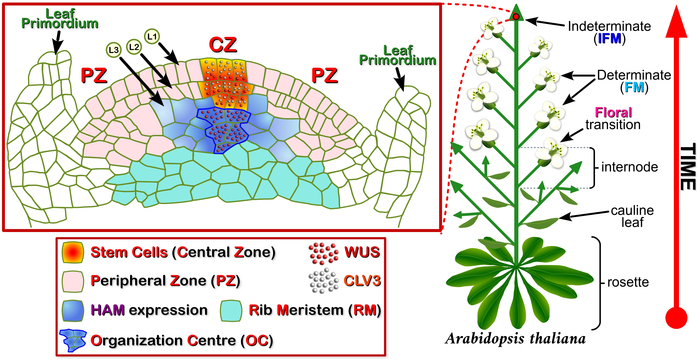

<style type="text/css">

/* ================== */
/*  Photo/Figures CSS */
/* ================== */

.myDiv {
  border: 2px solid gray;
  padding: 5px;
  margin: auto;
  background-color: white;    
}

.center {
  display: block;
  margin-left: auto;
  margin-right: auto;
  width: 90%;
  }

/* =============================== */
/*          CSS for Links          */
/* =============================== */

a.one:link {color: rgb(0, 0, 200);}
a.one:visited {color: rgb(192, 20, 172);}
a.one:hover {color: rgb(255, 20, 100);}


/* ============================== */
/*     CSS for stylizing text     */
/* ============================== */


#strokeW {
  color: yellow;
  background-color: white;
  text-shadow: 1px 0 #000;
  }


#strokeB {
  color: black;
  background-color: white;
  text-shadow: 1px 0 #000;
  }


#BBlk {
  font-weight: bold;
  color: rgb(0, 0, 0);
  border: 2px solid black;
  margin: 1px;
  }


#Blk20 {
  color: black;
  font-size: 20px;
  text-align: left;
  }


#BBlk20 {
  font-weight: bold;
  color: black;
  font-size: 20px;
  text-align: left;
  }


#BlkS {
  font-weight: bold;
  color: white;
  text-shadow: -1px -1px black, 1px 1px white;
  }


#Blk { font-weight: bold; color: rgb(0, 0, 0); }
#Red { font-weight: bold; color: rgb(255, 10, 20); }
#Red2 { font-weight: bold; color: rgb(255, 50, 50); }
#Dred { font-weight: bold; color: rgb(175, 0, 0); }
#Hpink { font-weight: bold; color: rgb(255, 20, 147); }
#Or { font-weight: bold; color: rgb(255, 140, 0); }
#Or2 { font-weight: bold; color: rgb(245, 90, 0); }
#Gold { font-weight: bold; color: rgb(230, 190, 0); }
#Ly { font-weight: bold; color: rgb(225, 200, 0); }
#Y1 { font-weight: bold; color: rgb(255, 225, 100); }
#Y2 { font-weight: bold; color: rgb(225, 200, 50); }
#GrY { font-weight: bold; color: rgb(240, 240, 0); }
#Grod { font-weight: bold; color: rgb(200, 160, 40); }
#Gr1 { font-weight: bold; color: rgb(25, 200, 25); }
#Gr2 { font-weight: bold; color: rgb(25, 150, 25); }
#Gr3 { font-weight: bold; color: rgb(25, 100, 25); }
#Moss { font-weight: bold; color: rgb(80, 210, 100); }
#BGr { font-weight: bold; color: rgb(50, 205, 170); }
#Teal { font-weight: bold; color: rgb(60, 180, 180); }
#Teal2 { font-weight: bold; color: rgb(60, 100, 220); }
#Blue { font-weight: bold; color: blue; }
#SkyB { font-weight: bold; color: rgb(104, 207, 240); }
#Cb { font-weight: bold; color: rgb(0, 123, 167); }
#Glacialb { font-weight: bold; color: rgb(54, 139, 193); }
#Db2 { font-weight: bold; color: rgb(0, 0, 100); }
#Lb1 { font-weight: bold; color: rgb(50, 215, 255); }
#Lb2 { font-weight: bold; color: rgb(50, 155, 255); }
#Lb3 { font-weight: bold; color: rgb(50, 115, 255); }
#Violet { font-weight: bold; color: rgb(180, 73, 255); }
#V2 { font-weight: bold; color: rgb(183, 137, 211); }
#Purple { font-weight: bold; color: rgb(150, 0, 255); }
#Dpurp { font-weight: bold; color: rgb(95, 0, 161); }
#Vred { font-weight: bold; color: rgb(186, 0, 100); }
#Magenta { font-weight: bold; color: rgb(255, 0, 255); }
#Coral { font-weight: bold; color: rgb(255, 127, 80); }
#Salmon { font-weight: bold; color: rgb(255, 140, 160); }
#Crim { font-weight: bold; color: rgb(220, 20, 60); }
#Rasp { font-weight: bold; color: rgb(227, 11, 92); }
#Lgray { font-weight: bold; color: rgb(220, 220, 220); }
#Silver { font-weight: bold; color: rgb(192, 192, 192); }
#Gray { font-weight: bold; color: rgb(155, 155, 155); }
#Gray2 { font-weight: bold; color: rgb(215, 200, 200); }
#Dgray { font-weight: bold; color: rgb(95, 95, 95); }
#Br { font-weight: bold; color: rgb(165, 42, 42); }
#Rust { font-weight: bold; color: rgb(183, 65, 14); }
#Dbr { font-weight: bold; color: rgb(100, 20, 20); }
#Zinc { font-weight: bold; color: rgb(140, 209, 187); }
#Zinc2 { font-weight: bold; color: rgb(0, 102, 102); }

</style>

```{r setup, include=FALSE}
knitr::opts_chunk$set(collapse = TRUE)

### Libraries
library(pacman)
pacman::p_load(blogdown, tidyverse, kableExtra, dplyr, purrr, bibtex, citr)

```

<!------------------------------------------------>
<!-------- JAVASCRIPT - enable LaTex MATH -------->
<!------------------------------------------------>
<script type="text/javascript"
  src="https://cdnjs.cloudflare.com/ajax/libs/mathjax/2.7.0/MathJax.js?config=TeX-AMS_CHTML">
</script>
<script type="text/x-mathjax-config">
  MathJax.Hub.Config({
    tex2jax: {
      inlineMath: [['$','$'], ['\\(','\\)']],
      processEscapes: true},
      jax: ["input/TeX","input/MathML","input/AsciiMath","output/CommonHTML"],
      extensions: ["tex2jax.js","mml2jax.js","asciimath2jax.js","MathMenu.js","MathZoom.js","AssistiveMML.js", "[Contrib]/a11y/accessibility-menu.js"],
      TeX: {
      extensions: ["AMSmath.js","AMSsymbols.js","noErrors.js","noUndefined.js"],
      equationNumbers: {
      autoNumber: "AMS"
      }
    }
  });
</script>


<!--------------------------------------->
<!------------ FLOWER FIG   ------------->
<!--------------------------------------->
<div align=center>

<figure>


</figure>

</div>
<!------------------------------------->
<!-------- END - FLOWER FIG   --------->
<!------------------------------------->


<!-- this is a subheadline -->
<details>
  <summary><b>TABLE OF CONTENTS</b></summary>
  
  1. <a href="#Angio"><b>Flowering Plants</b></a>
     * <a href="#FPsf"><b>1.1 Flowering Plants - Structure & Function</b></a>
     * <a href="#Fig1"><b>Fig. 1 - Stem Apical Meristem (<span id="Dred">SAM</span>) Structure</b></a>
  2. <a href="#SCgenes"><b>Flower Plants - Stem Cells & Genes</b></a>
     * <a href="#Fig2"><b>Fig. 2 - Plant Stem Cell Signalling Network</b></a>
  3. <a href="#FAnat"><b>Flower Anatomy</b></a>
     * <a href="#Fig3"><b>Fig. 3 - Flower Structures</b></a>
  4. <a href="#IF"><b>Inflorescence Structure</b></a>
     * <a href="#Fig4"><b>Fig. 4 - Inflorescence Structures</b></a>
     * <a href="#IFG"><b>4.1 Inflorescence Gene Regulation</b></a>
     * <a href="#Fig5"><b>Fig. 5 - Arabidopsis Flowering Mutants</b></a>
     * <a href="#Fig6"><b>Fig. 6 - <span id="strokeB">P</span>hoto<span id="strokeW">P</span>eriod & Flowering</b></a>
     * <a href="#Fig7"><b>Fig. 7 - <span id="strokeB">P</span>hoto<span id="strokeW">P</span>eriod Genes & Flowering</b></a>
     * <a href="#ABCs"><b>4.2 Models of Floral Organ Development</b></a>
     * <a href="#Fig8"><b>Fig. 8 - AE & Quartet Model of Floral Organ Development</b></a>
  5. <a href="#Glos"><b>List of Terms</b></a>
  6. <a href="#Refs"><b>References</b></a>

</details>

<a id="Angio"></a> 
<!----------------------------------------------------->
<!--------- SECTION 1 - IMPORTANTCE OF SOILS  --------->
<!----------------------------------------------------->
**<span style="border: 2px solid black;">&thinsp; 1. FLOWERING PLANTS &thinsp;</span>** Flowering plants, also known as **angiosperms** (Greek: &ldquo;<i>angeion</i>&rdquo; = vessel, and &ldquo;<i>sperma</i>&rdquo; = seed), are a large group of photosynthetic organisms (>350,000 species) that provide many of the ecological goods and services that make life possible on this planet (e.g. regulate global <b><a class="one" href="https://opc-project.netlify.app/project/prairie_soil_ecosystem/" target="_blank" title="Go to OPC Soil Ecology">biogeochemical cycles</a></b>, <span id="Gr2">B</span>**GCC**). Although their role in <b><a class="one" href="https://opc-project.netlify.app/project/prairie_soil_ecosystem/" target="_blank" title="Go to OPC Soil Ecology">soil ecology</a></b> has already been briefly discussed, many of the terms used to describe them, particularly as it relates to their identification (i.e. <b><a class="one" href="https://opc-project.netlify.app/gallery/" target="_blank" title="Go to OPC Gallery">gallery section</a></b>), needs some clarification. Like most scientific disciplines there is a seemingly endless number of esoteric terms used to describe plants. Although it's important to standardize terms and concepts the resulting lexicon often creates a barrier to learning. With that in mind I hope this section will provide some clarity to the subject of flower anatomy and development. Unfortunately some subjects I do discuss below will require some basic chemistry knowledge. Educational links for key concepts are either provided above or are embedded within the text (e.g. consult: <b><a class="one" href="https://opc-project.netlify.app/project/pnps/" target="_blank" title="Go to PNP">Plant Natural Products</a></b>).  

<a id="FPsf"></a> 
**<span style="border: 2px solid black;">&thinsp; 1.1 FLOWERING PLANTS - STRUCTURE & FUNCTION &thinsp;</span>** **Angiosperms** have evolved a seemingly endless variety of floral arrangements (i.e. **inflorescences**). Why? Specifically, why devote so much energy to creating all of the morphological and genetic diversity that we see today in flowering plants? Is it simply because plants are forced to constantly evolve (i.e. improve their <b><a class="one" href="https://evolution.berkeley.edu/evolution-101/mechanisms-the-processes-of-evolution/evolutionary-fitness/" target="_blank" title="Go to Evolution 101">fitness</a></b>) in order to keep up with an ever changing environment? Considering a plant's limited mobility one might also suspect that the answer lies with how plants go about scattering their proverbial &ldquo;<i>seed</i>&rdquo;, or more specifically pollen. Mating challenges are nothing new to most species, so using unique floral displays and structures to woo would be pollinators seems like an obvious solution. However, is it simply all about the &ldquo;<i>birds and the bees</i>&rdquo;? Plants are also capable of self-pollination and therefore may simply rely upon physical or **abiotic** factors (e.g. wind, water, fire) to ensure reproductive success. Regardless of the reasons, from a purely practical point of view the physical features of plants are the most important factor used to identify them (see <b><a class="one" href="https://opc-project.netlify.app/gallery/" target="_blank" title="Go to Gallery">OPC Photo Gallery</a></b>). This simply means that identifying plant structures will be important if your intention is to identifying plant species in the field. Hopefully more advanced and portable technologies in the future will alleviate much of our species identification problems.  
&nbsp; &nbsp; So what regulates the structure of plants? Of course aerial traits like the shape of the **inflorescence** are largely controlled by species-specific genes. And the most important cells where this genetic program plays out is no doubt the primary **shoot apical meristem** (<span id="Dred">SAM</span>), a specialized growth centre that houses totipotent **stem cells**. In fact most stem cells housed within different types of **meristems** remain totipotent (i.e. capable of producing any cell type) throughout the plant’s entire life. So for **inflorescence** development the <span id="Dred">SAM</span> is, as **Jürgens** (2001) put it, the &ldquo;<i>...ultimate source of cells for all aerial parts of the plant</i>&rdquo;.**[@jurgens_apical-basal_2001]** **Foster** (1938) noted many years ago that &ldquo;<i>...the most distinctive feature of the meristem of the shoot apex...is the segregation of its cells into a number of well-defined zones</i>&rdquo;. Based on his microscope studies several **meristem** zones were proposed, including: **(i) Zone I** as &ldquo;<i>the position of the apical initial group, from which by anticlinal and periclinal divisions respectively the surface layer (sl) and the internal tissue of the growing point originate</i>&rdquo;,**[@foster_structure_1938]** **(ii) Zone II** as the &ldquo;<i>...prominent cup-shaped mass of large, slowly dividing central <u>mother cells</u></i>&rdquo;,**[@foster_structure_1938]** and **(iii) Zone III** as the remaining cells along the periphery and lower margins of the &ldquo;<i>central mother cells</i>&rdquo;. These cells are noted for their &ldquo;<i>...smaller size and frequency of division</i>&rdquo;.**[@foster_structure_1938]** For **Foster** **Zone III** represented a transition zone that gave way to &ldquo;<i>the peripheral subsurface layers (Zone IV) and the rib meristem (Zone V)</i>&rdquo;.**[@foster_structure_1938]** Present day descriptions of the apical **meristem** often refer to the surface layer as the **tunica** and the main internal body of cells as the **corpus**. In addition the **tunica** of **angiosperms** like <b><a class="one" href="https://www.arabidopsis.org/" target="_blank" title="Go to TAIR"><i>Arabidopsis thaliana</i></a></b> contains two horizontal layers of cells (i.e. **L1** and **L2**) that are maintained by <u>anti-clinical</u> (i.e. dividing plane is perpendicular to surface) cellular division. In keeping with **Foster's** zonal model the **apical meristem** is currently divided up into three main zones: (i) the **central zone** or <span id="Dred">CZ</span>, (ii) the **peripheral zone** or <span id="Dred">PZ</span>, and (iii) the **rib zone**, which is also known as the **rib meristem** (<span id="Dred">RM</span>).**[@traas_cellular_2001]** The totipotent **stem cells** are found within the <span id="Dred">CZ</span> (i.e. occupies part of the **tunica** and **corpus**) and their numbers and identities (i.e. &ldquo;<i>stem-ness</i>&rdquo;) are largely controlled by cells within the <u>organizing centre</u> (<span id="Dred">OC</span>) located just below the <span id="Dred">CZ</span>.**[@laux_wuschel_1996; @mayer_role_1998; @schoof_stem_2000]** There are also secondary **meristems** that are responsible for lateral growth (i.e. increased plant girth), but only apical and axillary **meristems** produce elongating and branching shoots, as well as their leaves and flowers (i.e. **inflorescence**). However, from an ecological stand point, only plant's with suitable or well adapted **inflorescence** traits (i.e. <b><a class="one" href="https://evolution.berkeley.edu/evolution-101/mechanisms-the-processes-of-evolution/evolutionary-fitness/" target="_blank" title="Go to Evolution 101">fitness</a></b>) will likely survive to produce the next generation of flowers. This was pointed out by Swedish botanist **Göte Turesson** (1922) over a century ago when he stated that &ldquo;<i>...habitat types represents the genotypical response of the species population to a definite habitat....<u>ecotype</u> is used as an ecological sub-unit to cover the product arising as a result of the genotypical response of an <u>ecospecies</u> to a particular habitat</i>&rdquo;.**[@turesson_species_1922; @turesson_genotypical_1922]**


<a id="Fig1"></a>
<!--------------------------------------->
<!------------ FIG 1 - SAM  ------------->
<!--------------------------------------->
<div style="border: 2px solid gray; padding: 5px;">

<figure>



</figure>

**Figure 1. Stem Apical Meristem Structure**. Structures called **meristems** (Greek: &ldquo;<i>merizein</i>&rdquo; = to divide) contain totipotent **stem cells** that give rise to all of the tissue within adult plants. The <u>primary</u> **apical meristems** are located at opposite ends of the plant (i.e. shoot and root).**[@jurgens_apical-basal_2001; @traas_cellular_2001]** *Arabidopsis thaliana* is a small annual *cruciferous* plant (cross-shaped flower) that has become one of the few preferred or standard plant research models in biology.**[@fink_anatomy_1998; @kramer_planting_2015]** During the early vegetative stage of development wild type *Arabidopsis* produces a rosette of 9 to 17 basal leaves.**[@schultz_leafy_1991]** Floral development begins with a **bolting** stage (i.e. elongation of the primary shoot) followed by the production of **phytomers** with bracts and lateral **meristems** that develop into **indeterminate co-inflorescence** (i.e. mini-versions of the main stem inflorescence). During later stages of development **phytomers** take on a different character, namely they form bract-less nodes with lateral **meristems** that develop into flowers. Overall the plant takes the form of a **compound raceme** typically with three **co-inflorescences** and ~30 flowers. In <i>Arabidopsis</i> a dome shaped mass of cells known as the **shoot apical meristem** (<span id="Dred">SAM</span>) forms early on during embryonic development. Some of the daughter cells generated by <span id="Dred">SAM</span> will go on to form **meristems** at specific locations along the length of the growing stem (e.g. **axillary meristems** located in the leaf **axil**). The typical apical **meristem** (Left box) is divided up into different zones based on varying cytological, histological and molecular characteristics.**[@jurgens_apical-basal_2001; @traas_cellular_2001]** **Stem cells** reside within the **central zone** (<span id="Dred">CZ</span>) of the **meristem** where they undergo **anti-clinical** and **peri-clinical** cellular divisions giving rise to both horizontal (e.g. **L1**, **L2**) and vertical growth, respectively. These new cells add to the **peripheral zone** (<span id="Dred">PZ</span>) and underlying regions known as the **rib zone** or **rib meristem** (<span id="Dred">RM</span>). As the position of the **apical meristem** continues to climb over <u>time</u> the lower peripheral cells become under the influence of new chemical signals that can trigger <b><a class="one" href="https://www.biointeractive.org/classroom-resources/cellular-differentiation-along-concentration-gradients" target="_blank" title="Go to HHMI">cellular differentiation</a></b>. One of the major factors responsible for maintaining **stem cell** identity is a homeobox containing transcription factor known as **WUSCHEL**, or <span id="Dred">WUS</span> (**Fig. 2**). Transcription of <span id="Dred">WUS</span> is restricted to cells within a small region of the <span id="Dred">RM</span> known as the **organization centre** (<span id="Dred">OC</span>).**[@mayer_role_1998; @schoof_stem_2000]** <span id="Dred">WUS</span> protein then migrates from the <span id="Dred">OC</span> to the upper **stem cell** compartment via **plasmodesmata** where it directly activates the transcription of **CLAVATA-3** (<span id="Or2">CLV</span>**3**).**[@brand_dependence_2000; @schoof_stem_2000; @yadav_wuschel_2011; @daum_mechanistic_2014]** Expression of the <span id="Or2">CLV</span>**3** gene confers **stem cell** identity (i.e. **stem cell** marker) and is therefore confined to the <span id="Dred">CZ</span> to limit the size of the **stem cell** population. The latter is partly achieved by <span id="Or2">CLV</span>**3** itself, since it functions as a extracellular signaling molecule that activates plasma membrane receptors that are more widely expressed, including cells within the <span id="Dred">OC</span>.**[@fletcher_signaling_1999; @brand_dependence_2000; @rojo_clv3_2002]** Here activation of <span id="Or2">CLV</span>**3** receptors triggers a cell signaling cascade that inhibits <span id="Dred">WUS</span> expression (**Fig. 2**). This negative feed-back loop between <span id="Or2">CLV</span>**3** and <span id="Dred">WUS</span> is regulated in part by the transcription factor **Hairy Meristem** (<span id="Purple">HAM</span>),**[@zhou_control_2015; @zhou_hairy_2018]** which binds to <span id="Dred">WUS</span> and acts as a transcriptional repressor of <span id="Or2">CLV</span>**3** expression.  

</div>
<!----------------------------------------------->
<!-------- END - FIG 1 - SAM Structure  --------->
<!----------------------------------------------->

<a id="SCgenes"></a>
**<span style="border: 2px solid black;">&thinsp; 2. FLOWERING PLANTS - STEM CELLS & GENES &thinsp;</span>** Many studies over the last three decades have identified numerous genes that are involved in regulating plant **meristems**. These genes and the environments or **niches** they operate within ultimately control the &ldquo;<i>fate</i>&rdquo; of **stem cells**, namely whether they continue to self-renew and maintain their identity, or differentiate and specialize to produce new tissues and organs. However, describing all of the complex networks of genes regulating **stem cells** is beyond the scope of this short primer. Nevertheless, it is worth exploring a few important regulatory genes that control **stem cells** since the structural identity of plants is largely controlled by them. And arguably the most important genes regulating **stem cells** are transcription factors, particularly those containing a <b><a class="one" href="https://www.ebi.ac.uk/interpro/entry/pfam/PF00046/" target="_blank" title="Go to InterPro">homeobox</a></b> domain.**[@van_der_graaff_wus_2009; @mukherjee_comprehensive_2009]** The latter refers to a highly conserved region of the protein, approximately 60 amino acids in length, that is responsible for DNA binding. This transcription factor family plays a central role in body plan specification not only in plants but in most multi-cellular organisms.**[@gehring_homeodomain_1994; @burglin_homeodomain_2016]** For example <span id="Crim">WUS</span>, the founding member of the **WOX** (<b><a class="one" href="https://www.ebi.ac.uk/interpro/protein/UniProt/Q9SB92/" target="_blank" title="Go to InterPro">WUSCHEL</a></b>-**RELATED HOMEOBOX**) family of transcription factors, plays a central role in the maintenance of plant **stem cells**.**[@laux_wuschel_1996; @mayer_role_1998]** It's expression is detected early on during development (i.e. 16 cell stage) and subsequently confined to the <span id="Dred">OC</span> of apical and floral **meristems**.**[@mayer_role_1998; @schoof_stem_2000; @yadav_wuschel_2010]** <span id="Crim">WUS</span> then moves between cells via **plasmodesmata**,**[@yadav_wuschel_2011; @daum_mechanistic_2014]** a type of cytoplasmic bridge that spans the plant cell wall and links the cytoplasm of adjacent cells.**[@maule_plasmodesmata_2008; @zambryski_plasmodesmata_2008]** Once it reaches the upper **stem cell** compartment (<span id="Dred">CZ</span>) it directly activates the expression of <span id="Or2">CLV</span>**3** (**CLAVATA3**),**[@schoof_stem_2000; @brand_dependence_2000; @brand_regulation_2002; @yadav_wuschel_2011]** which functions as a small peptide ligand to several receptor-like proteins, including the heteromeric <span id="Or2">CLV</span>**1**-<span id="Or2">CLV</span>**2** complex.**[@clark_clavata1_1997; @jeong_arabidopsis_1999; @fletcher_signaling_1999; @rojo_clv3_2002; @muller_receptor_2008; @ishida_heterotrimeric_2014; @shimizu_bam_2015]** Activation of <span id="Or2">CLV</span>**1**-<span id="Or2">CLV</span>**2** inhibits the expression of <span id="Crim">WUS</span> thus creating a negative feedback-loop between the upper **stem cell** pool and lower <span id="Dred">OC</span>. Research shows that the <span id="Or2">CLV</span>**3**/<span id="Crim">WUS</span> circuit lies at the core of **stem cell** identity within **meristems** (**Fig. 2**).  
&nbsp; &nbsp; <span id="Crim">WUS</span> also plays a role in maintaining **floral meristems**.**[@laux_wuschel_1996]** Peripheral **meristem** cells fated to initiate floral organ development must switch from an indeterminate **stem cell** state, maintained by transcription factors like <span id="Crim">WUS</span>, to a determinant state that is devoted to specialized organ development (i.e. differentiation). For <i>Arabidopsis</i> and other **angiosperms** floral development begins with the reorganization or transformation of <span id="Dred">SAM</span> into **inflorescence meristems** (<span id="Blue">IFM</span>). Although <span id="Blue">IFM</span> retains its vegetative potential it can also produce determinate **floral meristems** (<span id="SkyB">FM</span>) that generate flowers (i.e. whorls of **sepals**, **petals**, **stamens** and **carpels**). The **AGAMOUS** gene (<span id="Teal">AG</span>), which encodes for a **MADS** domain containing transcription factor, is a key regulator of floral organ identity since genetic lines of <i>Arabidopsis</i> harbouring mutant alleles of <span id="Teal">AG</span> (e.g. <span id="Teal"><i>ag</i></span>**-1**, <span id="Teal"><i>ag</i></span>**-2**, <span id="Teal"><i>ag</i></span>**-3**)**[@bowman_genes_1989; @yanofsky_protein_1990; @bowman_genetic_1991]** generate a &ldquo;<i>flower within a flower</i>&rdquo; phenotype where the outer two flower whorls (i.e. **sepals** and **petals**) appear normal while the inner whorls (i.e. **stamens** and **carpels**) are replaced by petals (i.e. 4 normal petals + 6 extra petals) and a new flower. As **Saunders** (1921) noted over a century ago when describing the cultivar *Matthiola incana* (i.e. Stock flower, has the same mutant phenotype due to a mutated **MiAG** gene, the orthologue of <i>Arabidopsis</i> <span id="Teal">AG</span>),**[@nakatsuka_molecular_2018]** this ornamental garden plant &ldquo;<i>...is a full double...destitute of any semblance of either stamens or carpels</i>&rdquo;.**[@saunders_note_1921]** This mutant phenotype also repeats itself resulting in several nested flowers, what could be described as every florist's dream. Molecular analysis of <span id="SkyB">FM</span> within the <span id="Teal"><i>ag</i></span> mutants (Note: genetic mutants are usually written in lower case to distinguish it from wild type) shows persistent expression of both <span id="Crim">WUS</span> and <span id="Or2">CLV</span>**3**, which largely explains why **floral determinacy** is <u>suppressed</u> within these floral organs. However, what is striking about <span id="Crim">WUS</span> is that it co-operates with the floral activator **LEAFY** (<span id="Gr2">LFY</span>) to directly activate <span id="Teal">AG</span>.**[@schultz_leafy_1991; @lohmann_molecular_2001; @lenhard_termination_2001]** Elevated levels of <span id="Teal">AG</span> activates **KNUCKLES** (**KNU**), a transcriptional repressor protein that silences <span id="Crim">WUS</span> thereby preventing it from maintaining floral **stem cell** activity.**[@sun_timing_2009]** This represents a second negative feedback loop involving <span id="Crim">WUS</span> and its regulation of **stem cells**.  
&nbsp; &nbsp; Another equally important aspect of plant **stem cell** biology is the role the environment plays in the fate of these cells. The **stem cell** &ldquo;<i>niche</i>&rdquo; concept is well known among animal **stem cell** researchers,**[@schofield_relationship_1978]** having emerged not long after the first **stem cells** (i.e. **haematopoietic stem cells**, or <span id="Dred">HSC</span>) were discovered by **Till** and **McCulloch** back in the early 1960s.**[@till_direct_1961; @becker_cytological_1963]** Subsequent studies of **stem cell niches** clearly show that both neighbouring cells and the molecules they secrete (e.g. growth factors, protein that make up the extracellular matrix or **ECM**) create an unique micro-environment that maintains **stem cell** numbers.**[@moore_stem_2006; @pennings_stem_2018]** Beyond the confines of this micro-environment **stem cells** usually commit to a specific differentiation program. For example tissue specific epidermal **stem cells** are responsible for constantly replacing old dead keratinocytes.**[@watt_epidermal_1998; @gonzales_skin_2017]** They reside within the inner most (basal) layer of the skin where they are in constant contact with the basement membrane, a growth factor and **extracellular matrix** (**ECM**) rich layer. **Stem cells** bind to elements of the **ECM** (e.g. fibronectin, collagen) via **integrin** receptors. This in turn triggers specific intracellular signaling cascades that maintain the identity of epidermal **stem cells** (i.e. capacity to self-renew). In fact &beta;<sub>1</sub>-**integrin** is considered a marker of epidermal **stem cells**, and its reduced expression results in **stem cells** loosing contact with the basement membrane and being forced upwards where they differentiate into keratinocytes.**[@adams_changes_1990; @jones_separation_1993; @watt_expression_1993]**    
&nbsp; &nbsp; So what types of **niche** signaling factors do flowering plants rely on to regulate **stem cell** activity within **meristems**? It's well known that phyto-hormones like **auxin** and **cytokinin** (<span id="Coral">CK</span>) control shoot and root development.**[@vernoux_auxin_2010; @kieber_cytokinin_2018]** For example, <i>Arabidopsis</i> strains containing loss-of-function mutations within all three known <span id="Coral">CK</span> receptors (i.e. <b><a class="one" href="https://www.uniprot.org/uniprotkb/Q9C5U2/entry" target="_blank" title="Go to UniProt">AHK2</a></b>, <b><a class="one" href="https://www.uniprot.org/uniprotkb/Q9C5U1/entry" target="_blank" title="Go to UniProt">AHK3</a></b>, and <b><a class="one" href="https://www.uniprot.org/uniprotkb/Q9C5U0/entry" target="_blank" title="Go to UniProt">AHK4</a></b>) show severe developmental abnormalities, including significantly reduced <span id="Dred">SAM</span> size and activity.**[@higuchi_planta_2004; @nishimura_histidine_2004]** It's therefore not surprising that <span id="Coral">CK</span> signaling is also an integral part of the <span id="Crim">WUS</span>/<span id="Or2">CLV</span>**3** signaling network within **stem cells**. Cross-talk between <span id="Crim">WUS</span>/<span id="Or2">CLV</span>**3** and <span id="Coral">CK</span> provides additional levels of control over <span id="Crim">WUS</span> protein levels and transcriptional activity (**Fig. 2**).**[@leibfried_wuschel_2005; @kieffer_analysis_2006; @gordon_multiple_2009; @daum_mechanistic_2014; @perales_threshold-dependent_2016; @rodriguez_dna-dependent_2016; @wang_cytokinin_2017; @zhou_hairy_2018; @han_signal_2020; @plong_clavata3_2021]** Multiple signal inputs likely require fine-tuned nested threshold responses (e.g. negative feedback loops) given the spatial-temporal nature of cellular differentiation and organ development (e.g. proper inflorescence structure).    


<a id="Fig2"></a>
<!--------------------------------------------------------->
<!------------ FIG 2 - SAM Signalling Network ------------->
<!--------------------------------------------------------->
<div style="border: 2px solid gray; padding: 5px;">

<figure>


</figure>

**Figure 2. Plant Stem Cell Signalling Network**. **WUSCHEL**, or simply <span id="Dred">WUS</span>, is one of the most important transcription factors that regulates **stem cells** activity in **meristems**.**[@laux_wuschel_1996; @mayer_role_1998; @schoof_stem_2000; @brand_dependence_2000]** Unlike the ordered vegetative-to-floral transition seen in wild-type plants (**Fig. 1**) mutant <span id="Dred">WUS</span> plants (<span id="Dred"><i>wus</i></span>) display a discontinuous or &ldquo;<i>stop-and-go</i>&rdquo; type of secondary shoot development. **Meristems** emerge from the axils of leaves (i.e. loss of apical dominance) often producing bunches of cauline leaves.**[@laux_wuschel_1996]** Floral organ development is rare and the few mutant flowers that do emerge lack **carpels** and most **stamens** (Note: on average one central **stamen** develops, as well as a normal complement of outer **sepals** and **petals**). These developmental defects highlight the importance of <span id="Dred">WUS</span> to <span id="Dred">SAM</span> (e.g. loss of **stem cell** maintenance). <span id="Dred">WUS</span> protein has been shown to diffuse out of <span id="Dred">OC</span> cells via **plasmodesmata** (<b>&#9317;</b>).**[@yadav_wuschel_2011; @daum_mechanistic_2014]** Upon reaching the upper **stem cell** compartment it activates **CLAVATA-3** (<span id="Or2">CLV</span>**3**) expression (<b>&#9312;</b>), which is required to maintain **stem cell** identity (i.e. **stem cell** marker).**[@yadav_wuschel_2011; @perales_threshold-dependent_2016]** Although the mechanism(s) responsible for confining <span id="Dred">WUS</span> gene expression to the <span id="Dred">OC</span> is not fully understood, both **Hairy Meristem** genes (<span id="Purple">HAM</span>**-1**, **2** and **3**) and <span id="Or2">CLV</span>**3** appear to play important roles in this process.**[@stuurman_shoot_2002; @engstrom_arabidopsis_2011; @zhou_control_2015; @zhou_hairy_2018]** <span id="Purple">HAM</span>-1 and <span id="Purple">HAM</span>-2 are highly expressed within the <span id="Dred">RM</span> (<b>&#9318;</b>), which overlaps with <span id="Dred">WUS</span>, and largely absent within **L1** and **L2** (<b>&#9313;</b>). By contrast <span id="Or2">CLV</span>**3** expression is largely restricted to **L1** and **L2** within the <span id="Dred">CZ</span>.**[@zhou_control_2015; @zhou_hairy_2018]** <span id="Purple">HAM</span> has also been shown to bind to <span id="Dred">WUS</span> and inhibit <span id="Or2">CLV</span>**3** expression (<b>&#9318;</b>).**[@zhou_control_2015; @zhou_hairy_2018]** The <u>inability</u> of <span id="Dred">WUS</span>:<span id="Purple">HAM</span> hetero-dimers to activate <span id="Or2">CLV</span>**3** expression is a property shared by <span id="Dred">WUS</span> homo-dimers (<span id="Dred">WUS</span>:<span id="Dred">WUS</span>, <b>&#9318;</b>).**[@perales_threshold-dependent_2016]** Based on these findings alone it would appear that changes in the protein levels of <span id="Dred">WUS</span> and/or <span id="Purple">HAM</span> strictly control <span id="Or2">CLV</span>**3** transcription within the apical **mersitem**.**[@perales_threshold-dependent_2016; @zhou_hairy_2018; @han_signal_2020]** However there are post-translational mechanisms that also control <span id="Dred">WUS</span> activity. For example, the unique C-terminal **WUSCHEL-box** appears to govern nuclear retention of the protein, while an **EAR-like** domain controls its nuclear export.**[@kieffer_analysis_2006; @daum_mechanistic_2014; @rodriguez_dna-dependent_2016; @plong_clavata3_2021]** Regulating <span id="Dred">WUS</span> protein movements using these additional signal inputs likely has a significant affect on its transcriptional activity (i.e. active monomer or inactive homo-dimer).**[@daum_mechanistic_2014; @rodriguez_dna-dependent_2016]** Less is known about how <span id="Or2">CLV</span>**3** negatively regulates <span id="Dred">WUS</span> expression and transcriptional activity. <span id="Or2">CLV</span>**3** is known to undergo extensive post-translational modifications (e.g. proteolysis <b>&#9313;</b>, and the addition of arabinose groups)**[@ni_evidence_2006; @kondo_plant_2006; @ohyama_glycopeptide_2009; @somssich_clavata-wuschel_2016; @hirakawa_clavata3_2021]** prior to being secreted into the extracellular space where it acts as a ligand (<b>&#9314;</b>) for several plasma membrane receptor-like protein complexes (Note: collectively symbolized here as <span id="Or2">CLV</span>**3-R**).**[@clark_clavata1_1997; @jeong_arabidopsis_1999; @fletcher_signaling_1999; @rojo_clv3_2002; @muller_receptor_2008; @ishida_heterotrimeric_2014; @shimizu_bam_2015]** <span id="Or2">CLV</span>**3** inhibition of <span id="Dred">WUS</span> expression appears to be linked to **cytokinin** (<span id="Coral">CK</span>) signaling. For example, plants carrying mutations within all three known <span id="Coral">CK</span> receptors (i.e. <b><a class="one" href="https://www.uniprot.org/uniprotkb/Q9C5U2/entry" target="_blank" title="Go to UniProt">AHK2</a></b>, <b><a class="one" href="https://www.uniprot.org/uniprotkb/Q9C5U1/entry" target="_blank" title="Go to UniProt">AHK3</a></b>, and <b><a class="one" href="https://www.uniprot.org/uniprotkb/Q9C5U0/entry" target="_blank" title="Go to UniProt">AHK4</a></b>) show severe developmental defects, including significantly reduced <span id="Dred">SAM</span> size and activity.**[@higuchi_planta_2004; @nishimura_histidine_2004]** <span id="Coral">CK</span> signaling also induces <span id="Dred">WUS</span> expression via <span id="Coral">CLV</span>-dependent and <span id="Coral">CLV</span>-independent mechanisms.**[@lindsay_cytokinin-induced_2006; @gordon_multiple_2009]** <span id="Dred">WUS</span> (<b>&#9315;</b>) can also repress the transcription of type A **Arabidopsis RESPONSE REGULATORS** (**A-ARRs**),**[@leibfried_wuschel_2005]** and also be transcriptionally activated by type B **Arabidopsis RESPONSE REGULATORS** (**B-ARRs**).**[@wang_cytokinin_2017; @meng_type-b_2017]** These two different regulators (<b>&#9316;</b>) perform opposite functions within the <span id="Coral">CK</span> two-component <span id="Red">&#9413;</span>-relay signaling system. When **B-ARRs** is phosphorylated via the **H**istidine <span id="Red">P</span>hosphotransfer protein (**Arabidopsis HP**, or **AHP**), it transcriptionally activates <span id="Coral">CK</span>-inducible target genes, whereas phosphorylated **A-ARRs** function as negative regulators of **B-ARRs** (i.e. a negative feedback loop).**[@hwang_two-component_2001; @hwang_two-component_2002]** Recent crystal structural analysis of **B-ARRs** suggests that <span id="Coral">CK</span> induced phosphorylation of its N-terminal receiver domain opens up an otherwise closed protein confirmation that promotes DNA binding and transcriptional activity.**[@zhou_structure_2024]** However, since **A-ARRs** lack a DNA binding domain it's currently unclear why its phosphorylation is so critical to its inhibitory function (Note: plants expressing a constitutively activated form of **A-ARR7** that has its phospho-acceptor **Asp** residue mutated have <span id="Dred">SAM</span> defects similar to that of <span id="Dred">WUS</span> mutants).**[@leibfried_wuschel_2005]** Some suggest that phosphorylated **A-ARRs** may actively bind to and inhibit the function of **B-ARRs**.**[@kim_phosphorylation_2008]** It's also possible that some other post-translational mechanism, like **sumoylation** (i.e. alters protein stability), may be operating to alter the protein stability of **A-ARRs** (<b>&#9316;</b>).**[@kim_scfkmd_2013; @kurepa_cytokinin_2014]** More recent studies also show that <span id="Coral">CK</span> can stabilize <span id="Dred">WUS</span> monomeric levels by somehow regulating a **degron** signal (i.e. sequence recognized by the ubiquitin-proteasome system) buried within the **WOX-box** domain (<b>&#9317;</b>).**[@rodriguez_dna-dependent_2016; @snipes_cytokinin_2018]** 


</div>
<!-------------------------------------------------------->
<!-------- END - FIG 2 - SAM Signalling Network  --------->
<!-------------------------------------------------------->

<a id="FAnat"></a>
**<span style="border: 2px solid black;">&thinsp; 3. FLOWER ANATOMY &thinsp;</span>** Besides their size (e.g. trees) and the bounty they produce, most plants are admired for the beauty of their flowers. However for biologists it's also a structure devoted to sexual reproduction that showcases some of **Darwin's** and **Wallace's** fundamental <b><a class="one" href="https://evolution.berkeley.edu/evolution-101/an-introduction-to-evolution/" target="_blank" title="Go to Evolution101">evolutionary</a></b> principles. **Darwin** knew full well the power of plants, specifically as the living embodiment of <b><a class="one" href="https://evolution.berkeley.edu/evolution-101/mechanisms-the-processes-of-evolution/" target="_blank" title="Go to Evolution101">evolutionary</a></b> forces that select desirable traits (i.e. reproductive success of plants). Although **Darwin** is better known for his Galapagos finches, he also amassed a large collection of pant specimens (>1,400) during his voyage aboard the HMS Beagle (1831-1836). He also spent a considerable amount of time reflecting on the significance of plant organ development. For example, based on the work of botanists like **Francois Marius Barneoud**,**[@barneoud_note_1846]** **Darwin** noted that different (i.e. heterogeneous) structures, like petals and sepals, actually arise from very similar looking (i.e. homogeneous) primordial outgrowths (e.g. leaf primordia, **Fig. 1**) that we now know are a product of <span id="Dred">SAM</span>.**[@friedman_charles_2011]** Viewing evolution through the lens of developmental biology became a powerful explanatory tool for **Darwin** and his supporters. However, perhaps his most powerful argument was likening **natural selection** to **artificial selection**, otherwise known as selective breeding. The latter of course involves breeding only animals and plants with desirable traits, such as pigeons with showy plumage or plants with large beautiful flowers. However, wild plants can only use resources that are available to them within their natural environments. As a result individuals that do survive and go on to reproduce will pass on their traits to the next generation. The genetic makeup of these traits is ultimately what is being selected for over time. Invariably this is a slow &ldquo;<i>mechanical</i>&rdquo; process whereby individuals carrying suitable traits (e.g. confer increase mating success) increase in number, ultimately resulting in a shift in the genetic makeup (i.e. increased frequency of favoured <b><a class="one" href="https://www.jax.org/news-and-insights/minute-to-understanding/what-is-an-allele" target="_blank" title="Go to JAX.org">alleles</a></b>) of the population (i.e. evolution). Today we refer to this generation-to-generation change in the genetic structure (i.e. frequency of **alleles**) of a population as <b><a class="one" href="https://evolution.berkeley.edu/evolution-at-different-scales-micro-to-macro/what-is-microevolution/" target="_blank" title="Go to Evolution101">micro-evolution</a></b>. For flowering plants their evolutionary success, as evidenced by their enormous biodiversity, is obviously linked to their reproductive success (i.e. flowers and mating strategies).  
&nbsp; &nbsp; One advantage that plants have over animals is its modular <u>indeterminate</u> growth pattern. This concept was touched upon earlier when describing plant **stem cell** gene networks and refers to the fact that **meristems** can either produce a specific or <u>determinate</u> body part like a flower (i.e. **floral meristem**) or remain in a <u>vegetative</u> or **indeterminate** state (i.e. **inflorescence** or **apical meristem**). The latter can produce body parts that vary in size and shape, often in response to different environmental conditions. So <u>indeterminate</u> growth can be viewed as a type of **developmental plasticity** that allows individuals of the same species to alter their appearance (e.g. smaller flowers) in response to changing environmental conditions (e.g. climate change). These differences in observable traits (i.e. <b><a class="one" href="https://www.genome.gov/genetics-glossary/Phenotype" target="_blank" title="Go to NIH">phenotypes</a></b>) are largely due to changes in their genetic makeup, which can give rise to genetically distinct populations (i.e. **ecotypes**).**[@turesson_species_1922; @lowry_ecotypes_2012]** This term, which was coined by the Swedish botanist **Göte Turesson** (1922), was meant to represent an &ldquo;<i>...ecological unit</i>&rdquo; that is a product of its &ldquo;<i>genotypical response....to a particular habitat</i>&rdquo;.**[@turesson_species_1922]** As to whether or not **ecotypes** are a &ldquo;<i>...nonrandom partitioning of genetic variation along the continuum of species formation</i>&rdquo;**[@lowry_ecotypes_2012]** is currently open to debate.  
&nbsp; &nbsp; Flowers are by definition <u>determinate</u> shoot structures that are devoted to the production of **pollen** (&male;) and **ovules** (&female;) via distinct structures (i.e. <u>heterosporangiate</u>). Specifically each **stamen** (i.e. collectively known as the **androecium**) is made up of a relatively long thin **filament** and an **anther** (bearing **pollen**), whereas each **carpel** (i.e. collectively known as the **gynoecium**) contains a **style**, **stigma** and **ovary** (**Fig. 3**). **Carpels** (i.e. &ldquo;<i>vessels</i>&rdquo;) are considered modified leaves, each enclosing one or more **ovules** (i.e. produce seeds when fertilized). All of the main parts of a flower (i.e. **carpels**, **stamens**, **petals** and **sepals**) are arranged around its central axis in a sequential manner (i.e. **whorls**).**[@evert_raven_2013]** This includes, moving radially outwards from the centre, the **carpels** (i.e. often fused together as one large **pistil**), **stamens**, **petals** (i.e. collectively referred to as the **corolla**) and outer **sepals** (i.e. collectively referred to as the **calyx**). The majority of **angiosperms** possess both **carpels** (&female;) and **stamens** (&male;), so called **perfect** or **bisexual** flowers.**[@renner_relative_2014]** In contrast, **imperfect** or **uni-sexual** flowers lack either **stamens** (i.e. **carpellate** or **pistillate** flowers) or **carpels** (i.e. **staminate** flowers). Although many **angiosperms** have **uni-sex** flowers (i.e. **monoecious** or **dioecious**, where **staminate** and **carpellate** flowers are found on either the same plant or different plants, respectively) they constitute the minority of flowering plants.**[@renner_dioecy_1995; @renner_relative_2014]**  
&nbsp; &nbsp; The flexible nature of **angiosperm** sexual systems has long fascinated evolutionary biologists. For example, since most **angiosperms** have **hermaphroditic** flowers they are more susceptible to the deleterious affects of self-fertilization, namely inbreeding (i.e. loss of <b><a class="one" href="https://www.dnaftb.org/4/animation.html" target="_blank" title="Go to NIH">heterozygosity</a></b>).**[@carr_recent_2003]** This increases the expression of deleterious recessive mutations (i.e. recall <b><a class="one" href="https://www.dnaftb.org/3/bio.html" target="_blank" title="Go to CSH">Mendelian</a></b> genetics and the famous <b><a class="one" href="https://www.dnaftb.org/5/animation.html" target="_blank" title="Go to CSH">Punnett</a></b> square)**[@bateson_mendels_1902; @edwards_reginald_2012]** that could compromise the reproductive success (i.e. fitness) of a species, as well as increase its susceptibility to extinction.**[@newman_increased_1997]** The latter is particularly disconcerting when rare and endangered species are subjected to habitat loss, reduced access to pollinating species, and climate change. Although **dioecious** species benefit from an out-crossing advantage (i.e. self-fertilization suppressed) they too may be susceptible to climate change since some display spatial segregation of sexes (i.e. sexes prefer different micro-habitats, and consequently adopt new physiological and morphological specializations).**[@bierzychudek_spatial_1988; @hultine_climate_2016]** Nevertheless, **hermaphroditic** plants do have a survival advantage over **uni-sex** plants under some circumstances (e.g. pollination assurance when geographically isolated).**[@carr_recent_2003]** **Hermaphroditic** species are also known to develop quite complex self-incompatibility mechanisms to prevent self-fertilization,**[@hiscock_different_2003]** whereas a small minority have adopted mixed mating systems (i.e. **Gynodioecy** - the co-existence of female and hermaphrodite plants, or the much rarer **Androdioecy** - coexistence of male and hermaphrodite plants).**[@renner_dioecy_1995; @renner_relative_2014]** Although this latter strategy seems like a reasonable compromise it does not exclude these species from the perils of inbreeding depression. 


<a id="Fig3"></a>
<!-------------------------------------------------->
<!------------ FIG 3 - FLOWER Anatomy  ------------->
<!-------------------------------------------------->
<div style="border: 2px solid gray; padding: 5px;">

<figure>


</figure>

**Figure 3. Flower Structures**. Flower structures can be rather complex, but they all contain basically two types of components, namely: (i) reproductive or fertile structures (i.e. **stamens** and **carpels**) and (ii) non-reproductive or infertile appendages (e.g. **sepals**, **petals**). From these two basic types of structures a tremendous variety of flower types can be created. For example, a large number of different flowers within the family <i>Asteraceae</i> can produce both **disc florets** and **ray florets** (i.e. generally known as **composite** flowers). The central **disc florets** are relatively small and clustered together to form a head, while the outer halo-like **ray florets** are generally either strap-like or petal-like in shape. Two examples of this specialized flower type are shown above, namely the flower head of **Prairie dock** (<i>Silphium terebinthinaceum</i>, <b>&#9312;</b>) and the flower head of **Tall Prairie blazing star** (<i>Liatris aspera</i>, <b>&#9313;</b>). The **disc florets** of <i>S. terebinthinaceum</i> are **staminate** (&male;) and produce only pollen, while the outer **ray florets** (&female;) produce seeds in the form **achenes** (i.e. dry, flat, closed or **indehiscent** fruits). This is quite contrary to what most of us assume about sunflowers, like the well known giant sunflower. The latter flowers produce edible seeds via perfect **disc florets** (&male; and &female; parts), while the outer **ray florets** are **imperfect** and sterile. In contrast, the large pink button-like flower heads of <i>L. aspera</i>, another type of **Aster**, does not produce **ray florets**. Each of the **disc florets** are petal-like in appearance (i.e. tubular corolla) with five distinct spreading lobes that produce a star shaped pattern. They also have a series of scale-like **bracts** at the base of the flower head that are green and usually tinged with purple (Note: edges or margins of these **bracts** are uneven or rough looking, hence its other common name **Rough blazing star**). Emerging from the centre of each **floret** is a relatively long divided **style** (&female;), which gives the **inflorescence** a fuzzy, brush-like appearance. Similar to <i>S. terebinthinaceum</i> the flowers of <i>L. aspera</i> produces dry hairy fruits (i.e. **achenes**) that are dispersed via the wind. Flowers that are not **Asters**, like <i>Agalinis purpurea</i> (**Large purple foxglove**, <b>&#9314;</b>), have a more familiar structure. Each tube shaped flower is attached to a small **petiole** and has a 5 lobed pinkish-purple **corolla**. Cupping the base of the flower is a tube shaped **calyx**, which has five pointed triangular lobes. The interior of the **corolla** has the familiar **anther** tipped **stamens** (&male;), a single blunt tipped **style** (&female;), and colourful markings (i.e. pale yellow stripes, which serve as nectar guides, and dark purple spots). Another common type of flower, that most of us perhaps overlook, is that of **grasses** (<b>&#9315;</b>). Known as a **spikelet**, it has the following relatively simple general structure: (i) a **pistil** (&female;) consisting of an **ovary** (houses a single **ovule**); (ii) two **styles** (&female;), each supporting a feathery **stigma** (&female;) with ample surface area for capturing pollen grains; (iii) multiple **stamens** (&male;), each consisting of a long wiry **filament** and a terminal **anther** (&male;); (iv) no showy petals or sepals; (v) two outer **bracts** known as **glumes**, with the first one usually displaying long hairs (<b>&star;</b>); (vi) two inner **bracts** surrounding the grass **floret**, with the one called the **lemma** often anchoring a long appendage called an **awn** (&dagger;); (vii) a **palea**, or second inner **bract**; and (viii) the **caryopsis**, or seed **grain**, which is a type of dry fruit. Together the **lemma**, **palea** and inner grain make up a fertile grass **floret**. For example, the **spikelet** of **Indiangrass**, *Sorghastrum nutans* (<b>&#9316;</b>), has a golden brown to chestnut coloured outer **glume** (&ddagger;) that is narrow, pointed and displays some long hairs (<b>&star;</b>). A long wiry bent **awn** (&dagger;) can be seen emerging from one of the **spikelets**. The white feathery **styles** (&female;) and long yellow **stamens** (&male;) are also clearly visible (Note: the upper diagram of the grass **spikelet** is meant for illustrative purposes. Its components are not normally spread out in this type of neatly nested manner).  

</div>
<!------------------------------------------------>
<!-------- END - FIG 3 - FLOWER Anatomy  --------->
<!------------------------------------------------>


<a id="IF"></a>
**<span style="border: 2px solid black;">&thinsp; 4. INFLORESCENCE STRUCTURE &thinsp;</span>** This **Linnaean** term refers to the arrangement of flowers on a plant, including the position of the flower heads (i.e. open or closed &ldquo;<i>canopy</i>&rdquo;) and the shape of the branches that bear them (i.e. &ldquo;<i>scaffold</i>&rdquo; that bears the flowers).**[@tucker_inflorescence_1999]** The modular nature of plant growth and the architecture it produces is largely thanks to apical **meristems** since they ultimately produce the lateral outgrowths (i.e. **promordia**) that become either new leaves or flowers (e.g. **leaf promordia**, **Fig. 1**). The succession of lateral **primordia** produced by **meristems** gradually move away from each other due to cell growth within the intervening spaces resulting in stem elongation. The new stem segments are known as **inter-nodes**, and the sites that connect successive **inter-nodes** are the **nodes** (i.e. potential sites of leaf, flower, bud or shoot development). Collectively these structures (i.e. **inter-node**, **node** and any attached organs) constitute a **metamer** or **phytomer** (i.e. basic structural unit of a stem).**[@evert_raven_2013]** During a plant's vegetative phase both **apical** and **axillary meristems** (<span id="Rust">AxM</span>, located within the leaf **axil**) produce new **phytomers** to either elongate the main stem or secondary axes (i.e. **phytomers** addition to secondary shoots), respectively. **Secondary meristems** located within the vascular cambium also make new additions to the plant (i.e increase its girth) but they are not involved in the production of new stems or branches. Eventually environmental signals like temperature or **photo-period** (<span id="strokeB">P</span><span id="strokeW">P</span>)**[@poethig_phase_2003]** induce plant flowering. It's also important to note that the succession of **leaf primordia** (**Fig. 1**) generated by the apical **meristem** take up well defined radial positions along the stem. This process (i.e. **phyllotaxy**) ultimately results in the leaves being arranged in regular patterns around the stem (e.g. spirally = 137.5&deg; of separation or **Fibonacci** angle; alternately = 180&deg; of separation).**[@fleming_formation_2005; @palauqui_phyllotaxis_2011]** Since **axillary meristems** are located within the **axil** of each leaf it therefore follows that **phyllotaxy** greatly influences branching patterns (i.e. **inflorescence** development). **Phytomers** also show considerable structural variations (i.e. **heteroblasty**).**[@zotz_heteroblastyreview_2011; @diggle_modularity_2014]** For example, the size of leaves or the length of the **corolla** (**Fig. 4**, **raceme** of *Lupinus perennis*) can change as you move up the stem. Nevertheless, despite the pervasive nature of **heteroblasty** many closely related species often display the same type of **inflorescence** (e.g. **milkweed** and **umbels**).  
&nbsp; &nbsp; One of the major classification criteria of an **inflorescence** is the presence or <u>absence</u> of a flower at the shoot apex. When the flower is present it is referred to as a closed or <u>determinate</u> **inflorescence**, and when it is absent it is called an open or <u>indeterminate</u> **inflorescence**. For example, in **racemose** type plants like *Arabidopsis* (**Fig. 4**) the <span id="Dred">SAM</span> can remain in a vegetative (indeterminate) state and continue to add new **phytomers** to the main stem axis. However, as *Arabidopsis* matures and <span id="Dred">SAM</span> enters its reproductive phase dormant <span id="Rust">AxM</span> become activated (i.e. regain **meristem** potential) and generate new secondary shoots. However, if the **apical meristem** is not fully differentiated (e.g. form an **apical** or **terminal bud**) it can still exert its dominance over secondary **meristems** depending upon developmental or environmental conditions. In fact the ability of buds to cycle between a dormant and an active state is vital to both normal development (i.e. protects against uncontrolled growth) and the survival of plants (e.g. damage to apical region caused by browsing herbivores).**[@shimizu-sato_control_2001; @horvath_knowing_2003; @choa_current_2007]**  
&nbsp; &nbsp; Another important criteria is the branching pattern of the **inflorescence**.**[@endress_disentangling_2010; @evert_raven_2013]** There appears to be two main alternate **inflorescence** patterns within flowering plants, namely **racemose** and **cymose** (**Fig. 4**). The former is the simplest with only a single main stem (i.e. primary or 1<sup>st</sup> order axis) and a variable number of lateral branches (i.e. secondary or 2<sup>nd</sup> order axes). Although the branching order is fixed (i.e. no more than two) several variations on the **racemose** theme are possible, namely: (i) a simple **spike** configuration has a long primary axis and short or absent secondary axes (i.e. **stachyum** = open, **stachyoid** = closed); (ii) in a **raceme** both primary and secondary axes are relatively long (i.e. **botryum** = open, **botryoid** = closed); (iii) in an **umbel** the primary axis is short within the branching region while the secondary axes are relatively longer (i.e. **sciadium** = open, **sciadioid** = closed); (iv) in a **head** both primary and secondary axes are short within the branching region (i.e. **capitulum** or **cephalium** = open, **cephalioid** = closed); and (v) **compound racemes** can arise when secondary axes are replaced by one or more **racemose** subunits (e.g. double raceme or **diplobotryum**).**[@endress_disentangling_2010; @evert_raven_2013]** In contrast a **cymose** pattern is characterized by a primary axis having a maximum of two secondary axes or branches. However these branches can undergo higher order branching (i.e. not limited). If all the secondary axes have a pair of lateral branches (e.g. tertiary axes) it is **dichasium**, whereas if all axes have only one lateral branch then it is **monochasium** (**Fig. 4**). Also a compound **cyme** having both **dichasial** and **monochasial** subunits usually begins **dichasial** and ends **monochasial** (<span id="SkyB">D</span> &rarr; <span id="Blue">M</span>, **Fig. 4**). Another type of compound **inflorescence** called a **thyrse** (open) or **thyroid** (closed) has both **racemose** (primary branching) and **cymose** (secondary branching) subunits. Lastly, there is also a third type of **inflorescence** called a **panicle**. Even though **panicles** are fairly common, albeit less so among temperate **angiosperms**,**[@prusinkiewicz_evolution_2007]** botanists consider them to be a special case since they have characteristics that strictly exclude them from being classified as either **cymose** and **racemose**. For example, unlike a **cymose** a **panicle** has more than 2 lateral branches of the next higher order, and unlike a **racemose** a **panicle** has branches with more than 2 branching orders (i.e. no limits on branching orders). In addition, each branch terminates in a flower and the branching order usually becomes progressively smaller towards the top of the plant (**Fig. 4**).**[@endress_disentangling_2010]**  


<a id="Fig4"></a>
<!------------------------------------------------------------>
<!------------ FIG 4 - INFLORESCENCE Structures  ------------->
<!------------------------------------------------------------>
<div style="border: 2px solid gray; padding: 5px;">

<figure>


</figure>

**Figure 4. Inflorescence Structures**. The reproductive success of flowering plants depends in large part on the shape and size of its **inflorescence**. Branching patterns and the extent of a plant's floral display all have obvious functional consequences with respect to reproductive success. Specifically branches deliver nutrients to flowers and also provides physically support so that they can attract potential pollinators. Promoting flower-pollinator interactions in this way ultimately impacts the flow of genetic information between plants within a population (i.e. evolutionary potential). For example **panicles** are more prevalent among tropical plants and are considered an ideal **inflorescence** for wind and insect pollination.**[@harder_interplay_2013; @prusinkiewicz_evolution_2007]** Tropical habitats have an abundance of pollinators and are less constrained by **abiotic** factors (e.g. temperature, sunlight, precipitation). For these reasons tropical plants can extend their vegetative growth phase to produce a profusion of branches and flowers. However tropical environments are home to large populations of herbivores, which means that plants must also devote a substantial amount of energy to secondary metabolite production as a means of chemical defence (e.g. toxic latex production). By contrast **angiosperms** in more northern latitudes are subject to less favourable growth and reproductive conditions (i.e. seasonal growth, less precipitation and sunlight, limited access to pollinators). Thus the timing and extent of vegetative and reproductive growth phases have to be carefully regulated in order to ensure reproductive success. This may explain why plants in temperate habitats generally have more modest branching patterns (i.e. **racemose** or **cymose**).**[@harder_interplay_2013; @prusinkiewicz_evolution_2007]** 

</div>
<!----------------------------------------------->
<!-------- END - FIG 4 - INFLORESCENCE  --------->
<!----------------------------------------------->

<a id="IFG"></a>
**<span style="border: 2px solid black;">&thinsp; 4.1 INFLORESCENCE GENE REGULATION &thinsp;</span>** Flower development is ultimately governed by genetic regulatory networks operating within **meristems** in response to changing environmental conditions (e.g. **photo-period**, <span id="strokeB">P</span><span id="strokeW">P</span>). For example in the model plant species *Arabidopsis thaliana* the <u>indeterminate</u> (vegetative) apical **meristems** generate short vertical **phytomers** (inter-nodes) and lateral organ **primordia** that develop into spirally arranged stem leaves. However as the plant transitions into the reproductive phase of its life cycle the apical **meristems** also undergo a transition or re-organization resulting in a new type of **inflorescence meristem** (<span id="Blue">IFM</span>). The <span id="Blue">IFM</span> produces long **phytomers** and small spiralling stem leaves. It also produces spirally arranged **floral meristems** (<span id="SkyB">FM</span>) as lateral organs instead of leaf **primordia**. These specialized **meristems** provide all of the cells needed to form a flower, which (as mentioned previously) is composed of concentric arrangements (i.e. **whorls**) of four distinct organs namely outer **sepals**, **petals**, **stamens** (&male;) and central **carpels** (&female;). In the early 1990s an elegant **ABC** model was proposed that specified three distinct (i.e. **A**, **B** and **C**) floral functions carried out by different classes of <b><a class="one" href="https://www.ibiology.org/development-and-stem-cells/homeotic-genes/" target="_blank" title="Go to iBIOLOGY">homeotic</a></b> genes (**Fig. 8**).**[@coen_war_1991; @weigel_abcs_1994]** These three functions overlap with one another since each one controls the fate of two adjacent **whorls** resulting in unique combinations of floral **homeotic** genes. This model emerged from the study of different mutant lines of *Arabidopsis* that harbour genetic mutations within a specific floral <b><a class="one" href="https://www.ibiology.org/development-and-stem-cells/homeotic-genes/" target="_blank" title="Go to iBIOLOGY">homeotic</a></b> gene. Some of the more notable genes include **LEAFY** (<span id="Gr2">LFY</span>), **APETALA1** (<span id="Moss">AP</span>**1**) and **TERMINAL FLOWER1** (<span id="Magenta">TFL</span>**1**). Given their importance to **inflorescence** development a brief discussion of them is provided below. As always this discussion will only serve as a primer of the numerous flower developmental studies carried out over the last few decades.  


<a id="Fig5"></a>
<!---------------------------------------------------->
<!------------ FIG 5 - Arabidopsis Mutants  ---------->
<!---------------------------------------------------->
<div style="border: 2px solid gray; padding: 5px;">

<figure>


</figure>

**Figure 5. Arabidopsis Flowering Mutants**. *Arabidopsis thaliana* is a small annual *cruciferous* plant that has a number of convenient traits which makes it ideal for genetic study, including: (i) its small size and ease of growth; (ii) its self-fertilizing and has a short generation time (~6 weeks); (iii) flowering is synchronized and yields a large number of seed pods or **siliques** per plant (~10,000 seeds per plant); (iv) seeds are long lived and highly viable making them ideal for mutagenesis screens; (v) it has a relatively small genome (2*n* = 10 chromosomes); and (vi) there are a variety of available **ecotypes** (i.e. trait variations among wild type lines).**[@redei_supervital_1962; @fink_anatomy_1998; @shindo_natural_2007; @kramer_planting_2015]** Over the years genetic screens of *Arabidopsis* have identified several important mutants with very distinct floral defects. Three of the more notable ones are illustrated above namely: (i) **LEAFY** (<span id="Gr2"><i>lfy</i></span>) - these mutant lines produce abnormal but fertile **carpeloid** like flower structures that lack **petals** and **stamens**. Most of flowers that should appear are instead replaced by indeterminate **co-inflorescence** like branches that bear **cauline** leaves;**[@schultz_leafy_1991; @huala_leafy_1992; @weigel_leafy_1992]** (ii) **APETALA 1** (<span id="Moss"><i>ap</i></span>**1**) - these mutants produce flowers that have no **petals** (2<sup>nd</sup> flower **whorl**) or in some instances very rudimentary **petaloid** like flower structures.**[@irish_function_1990; @bowman_control_1993]** Moreover, secondary flower-like structures emerge from the axils of the first **whorl** within the primary flowers. This appears to be an iterative process since these secondary flower like structures can beget tertiary flowers (and so on).**[@bowman_control_1993]** These <span id="Moss"><i>ap</i></span>**1** mutants also produce leafy bract-like structures instead of **sepals** (1<sup>st</sup> flower **whorl**); and (iii) **Terminal Flower 1** (<span id="Hpink"><i>tfl</i></span>**1**) - these mutant plants flower early (Note: number of leaves often used as a proxy for flowering time) and have a severely truncated **inflorescence**.**[@shannon_mutation_1991; @alvarez_terminal_1992]** The normal indeterminate **inflorescence** seen in wild type plants is instead replaced by terminal floral **meristems** that bear few flowers. Occasionally no lateral branches are produced and, unlike wild type plants, the main stem produces a terminal floral structure (i.e. determinate).  


</div>
<!---------------------------------------------------->
<!-------- END - FIG 5 - Arabidopsis Mutants --------->
<!---------------------------------------------------->


&nbsp; &nbsp; <span id="Gr2">LEAFY</span> mutants (Note: mutants like <span id="Gr2"><i>lfy</i></span> are usual written in lower case, and the gene in upper case) generated using forward genetic screening techniques (i.e. EMS, irradiation, or transposon tagging),**[@smyth_how_2023]** all share the same general phenotype (Note: phenotype severity varies among alleles, for example <span id="Gr2"><i>lfy</i></span>-6 > <span id="Gr2"><i>lfy</i></span>-5), which is flowers being replaced by indeterminate axillary branches (**Fig. 5**).**[@schultz_leafy_1991; @huala_leafy_1992; @weigel_leafy_1992; @shannon_genetic_1993]** Another notable feature of <span id="Gr2"><i>lfy</i></span> mutants is the presence of apical flowers that have varying degrees of floral identity. The presence of these determinate structures suggests that other genes must be operating along side wild type <span id="Gr2">LFY</span> to promote floral identity within **meristems**. This became more evident when researchers crossed different mutant lines to produced double mutants, such as <span id="Gr2"><i>lfy</i></span>/<span id="Moss"><i>ap</i></span>**1**, that generate stronger flower-to-inflorescence shoot phenotypes.**[@huala_leafy_1992; @bowman_control_1993]** Clearly the activities of both wild type <span id="Gr2">LFY</span> and <span id="Moss">AP</span>**1** genes play important roles in regulating <span id="Rust">AxM</span> floral identity and/or specific floral organ development. Once <span id="Gr2">LFY</span> was cloned (1992) its RNA was shown to be strongly expressed within early floral **primordia** (i.e. lateral <span id="SkyB">FM</span> produced by <span id="Blue">IFM</span>)**[@weigel_leafy_1992]** long before the expression of floral <b><a class="one" href="https://www.ibiology.org/development-and-stem-cells/homeotic-genes/" target="_blank" title="Go to iBIOLOGY">homeotic</a></b> genes <span id="BGr">AP</span>**3** and <span id="Teal">AG</span> (Note: as depicted in **Fig. 8** <span id="BGr">AP</span>**ETALA3** and <span id="Teal">AG</span>**AMOUS** are **MADS**-domain proteins required for either **B**-type **petal** and **stamen** development, or **C**-type **stamen** and **carpel** development respectively).**[@yanofsky_protein_1990; @jack_homeotic_1992]** More detailed studies of <span id="Gr2">LFY</span> showed that it functions as a rather unique plant specific DNA binding transcriptional factor.**[@maizel_floral_2005; @moyroud_leafy_2010]** Downstream genes targeted by <span id="Gr2">LFY</span> (activated or repressed) include among others transcriptional regulators that control either <span id="SkyB">FM</span> identity (i.e. <span id="Moss">AP</span>**1**, <span id="Teal2">CAL</span>)**[@mandel_molecular_1992; @bowman_control_1993; @parcy_genetic_1998; @wagner_transcriptional_1999; @liljegren_interactions_1999; @william_genomic_2004; @saddic_leafy_2006; @pastore_late_2011]** or floral organ development (i.e. <span id="Teal">AG</span>, <span id="BGr">AP</span>**3**).**[@busch_activation_1999; @lohmann_molecular_2001; @lenhard_termination_2001; @lamb_regulation_2002; @william_genomic_2004]** Its role as a master regulator of flower development is particularly evident within <span id="Gr2">LFY</span> transgenic plants.**[@weigel_developmental_1995]** Constitutive expression of <span id="Gr2">LFY</span> using a well known plant cauliflower mosaic virus promoter <b><i>35S</i></b> resulted in truncated vegetative growth of the primary shoot and fewer basal rosette leaves (i.e. affects shoot **meristem**), while secondary shoot **meristems** and the terminus of the primary shoot are transformed into solitary flowers (i.e. determinate growth). Remarkably this so called &ldquo;<i>precocious flowering</i>&rdquo; phenotype could be replicated when the <b><i>35S</i>::</b><span id="Gr2">LFY</span> transgene is expressed within the perennial tree aspen. Normally only adult (&gt;8 years of age) aspens produce flowers (i.e. catkins from leaf axils), but constitutive expression of the transgene triggered a &ldquo;<i>precocious flower</i>&rdquo; like phenotype within regenerating 5 month old aspen shoots.**[@weigel_developmental_1995]** In *Arabidopsis* when the <b><i>35S</i>::</b><span id="Gr2">LFY</span> transgene was expressed against a mutant <span id="Moss"><i>ap</i></span>**1** background the &ldquo;<i>precocious flower</i>&rdquo; phenotype was significantly suppressed. Solitary flowers that usually form in the leaf axils of transgenic plants instead developed into complex shoots (i.e. average of 10 nodes), suggesting that the activities of wild type <span id="Gr2">LFY</span> and <span id="Moss">AP</span>**1** are closely linked (i.e. dependent to some degree) when transforming <span id="Blue">IFM</span> into <span id="SkyB">FM</span>. It's also important to note that the &ldquo;<i>precocious flower</i>&rdquo; phenotype seen in <b><i>35S</i>::</b><span id="Gr2">LFY</span> transgenic plants is reproduced by both <b><i>35S</i>::</b><span id="Moss">AP</span>**1** transgenic plants and <span id="Magenta"><i>tfl</i></span>**1** loss-of-function mutant plants.**[@shannon_mutation_1991; @alvarez_terminal_1992; @mandel_gene_1995; @liljegren_interactions_1999]** Moreover, the co-operative nature of <span id="Gr2">LFY</span> and <span id="Moss">AP</span>**1** is further highlighted by the even more dramatic &ldquo;<i>precocious flower</i>&rdquo; phenotype seen within <b><i>35S</i>::</b><span id="Gr2">LFY</span>/<span id="Moss">AP</span>**1** double transgenic plants (i.e. all primary and secondary shoots are converted into flowers, and leaves are smaller and fewer in number).**[@liljegren_interactions_1999]**  


<a id="Fig6"></a>
<!-------------------------------------------------->
<!------------ FIG 6 - PP Signal Network  ---------->
<!-------------------------------------------------->
<div style="border: 2px solid gray; padding: 5px;">

<figure>


</figure>

**Figure 6. Photo-Period & Flowering**. <span id="Gr2">Phyto</span>chromes (<span id="Gr2">PHY</span>) and <span id="SkyB">Crypto</span>chromes (<span id="SkyB">CRY</span>) are two major groups of **photoreceptors** found in a wide range of single and multi-cellular organisms. In higher plants they play important roles in various **photomorphogenic** responses (e.g. seed germination, photo-tropism, shade avoidance, leaf morphogenesis, chloroplast movement, and flowering transition).**[@rockwell_phytochrome_2006; @quail_phytochromes_2010; @li_phytochrome_2011]** <span id="Gr2">PHY</span> usually form soluble dimers of **chromoprotein** subunits each harbouring a single thio-ester linked **<a class="one" href="https://iupac.qmul.ac.uk/tetrapyrrole/TP1.html" target="_blank" title="Go to IUPAC">tetrapyrrole</a>** **chromophore** (i.e. light harvesting molecule). Currently there are five distinct <span id="Gr2">PHY</span> in *Arabidopsis* (<span id="Gr2">PHY</span>**A**-**E**). The ability of the **chromophore** to sense changes in the quality or quantity of light is based on its ability to quickly switch between two relatively stable conformations, namely an inactive <span id="Red">P<sub>r</sub></span> (<span id="Red">red light</span> absorbing) and an active <span id="Rust">P<sub>fr</sub></span> (<span id="Rust">far red light</span> absorbing). Upon light irradiation the active cytosolic <span id="Rust">P<sub>fr</sub></span> moves into the nucleus either unassisted (i.e. <span id="Gr2">PHY</span>**B**) or with the aid of nuclear import proteins (i.e. <span id="Gr2">PHY</span>**A**), where it initiates rapid changes in gene expression.**[@quail_phytochromes_2010]** The dynamics of this switching process dictates the relative levels of each conformer and thus serves as a rudimentary form of colour vision for photosynthetic plants. Switching to the active <span id="Rust">P<sub>fr</sub></span> conformer involves <span id="Red">red light</span> induced isomerization of the **<a class="one" href="https://iupac.qmul.ac.uk/tetrapyrrole/TP1.html" target="_blank" title="Go to IUPAC">tetrapyrrole</a>** **chromophore** about the **C15**-**C16** double bond (between **C** and **D** rings), as well as conformational changes within the **chromoprotein** backbone itself.**[@rockwell_phytochrome_2006; @li_phytochrome_2011]** The relatively less stable active conformer can switch to the inactive conformer either via a slow non-photoinduced reaction (thermal reversion) or a much faster <span id="Rust">far red</span> induced reaction. The thermal reversion reaction likely involves a <span id="Rust">P<sub>fr</sub></span> resonance structure with a single-bond instead of a double bond between **C15** and **C16**. The presence of a single-bond instead of a double-bond would allow thermal rotation about this bond (Note: this proposed intermediate can be easily picture by simply shifting the **<a class="one" href="https://openbooks.lib.msu.edu/oclue/chapter/chapter-8-conjugated-compounds-and-aromaticity/" target="" title="Go to OCLUE">conjugated pi-bonds</a>** one carbon over beginning with the carbonyl group at C-19, which becomes protonated, and ending with C-6 which forms a double bond with the adjacent <span id="Gr2">N</span> atom). <span id="SkyB">CRY</span>, unlike <span id="Gr2">PHY</span>, employ **flavin adenine dinucleotide** (<span id="Magenta">FAD</span>) as the light harvesting **chromophore**. The gene encoding for the **chromoprotein** subunit is homologous to microbial <span id="Magenta">flavo</span>**enzymes** that catalyzes DNA-repair reactions in response to UV light (aka: DNA **photolyases**).**[@ahmad_hy4_1993; @lin_association_1995; @lin_expression_1995]** In addition to the conserved <span id="Magenta">FAD</span>-binding **photolyase** homologous related (**PHR**) domain there is a variable carboxy-terminal domain commonly referred to as <span id="SkyB">C</span>**CT**. Current structural and biochemical studies suggests that light dependent changes in the intra-molecular interactions between the **PHR** and <span id="SkyB">C</span>**CT** domains are responsible for the conformational dependent activation of plant <span id="SkyB">CRY</span>. The photo-excited <span id="Magenta">FAD</span> buried within the **PHR** domain receives electrons from the surface of the protein courtesy three highly conserved tryptophan residues (**W** triad).**[@chaves_cryptochromes_2011; @wang_mechanisms_2020]** The so called <span id="Magenta">FAD</span> photo-reduction hypothesis suggests that subtle conformational changes in the co-factor caused by the photo-reduction process is propagated, in a step-wise manner, through the **W** triad resulting in large scale conformational changes that permit homo-dimerization. Significant conformational changes in a highly conserved arginine residue (**R433**) apparently facilitates the dimerization process by &ldquo;<i>anchoring</i>&rdquo; within a deep pocket formed by the adjacent molecule.**[@sang_n-terminal_2005; @wang_photoactivation_2016; @shao_oligomeric_2020; @wang_mechanisms_2020]** Ultimately light induced activation of <span id="Gr2">PHY</span> and <span id="SkyB">CRY</span> triggers multiple protein-protein interactions (**PPI**) that leads to: (i) altered **ubiquitin** (**Ub**) dependent protein catabolism (i.e. **COP1**-**SPA** complexes);**[@wang_direct_2001; @yang_signaling_2001; @zuo_blue_2011; @podolec_photoreceptor-mediated_2018]** (ii) the activation or repression of gene expression;**[@liu_photoexcited_2008; @wang_photoactivation_2016]** and (iii) increased protein phosphorylation which modulates the activity of both <span id="SkyB">CRY</span> and <span id="Gr2">PHY</span>.**[@shalitin_regulation_2002; @shalitin_blue_2003; @yu_arabidopsis_2007; @medzihradszky_phosphorylation_2013; @nito_tyrosine_2013; @muller_atp_2014; @wang_photoactivation_2016; @liu_molecular_2017; @choi_regulation_2023; @viczian_phytochrome_2024]** A major concept in floral **photo-morphogenesis** is how plants respond to incoming light signals (e.g. length of day, quality of light) in a timely manner at different stages of development. This is largely co-ordinated by **circadian response proteins** (<span id="SkyB">CR</span>**P**) and downstream **flowering proteins** (<span id="Hpink">F</span>**P**). For example, when *Arabidopsis* is exposed to a long <span id="strokeB">P</span><span id="strokeW">P</span> the protein levels of key transcription factors (e.g. <span id="SkyB">CO</span>) stabilize, allowing them to activate floral identity genes like <span id="Moss">AP</span>**1**.**[@abe_fd_2005; @wigge_integration_2005]** This vegetative-to-floral transition triggers **bolting**, which is an early floral stage when the primary shoot elongates and rises above the lower leaf rosette.  

</div>
<!-------------------------------------------------->
<!-------- END - FIG 6 - PP Signal Network --------->
<!-------------------------------------------------->

&nbsp; &nbsp; Since floral identity (i.e. <span id="Blue">IFM</span> &rarr; <span id="SkyB">FM</span>) is promoted by <span id="Gr2">LFY</span> and <span id="Moss">AP</span>**1** and actively antagonized by <span id="Magenta">TFL1</span> (i.e. maintain <span id="Blue">IFM</span>), exactly <i>How</i> do these genes co-ordinate life cycle changes in response to seasonal changes (e.g. <span id="strokeB">P</span><span id="strokeW">P</span>)? Most people know that spring and summer bring not only warmer weather but also a new generation of flowering plants. The timing of flowering within plants, particularly at higher latitudes, are adapted to the periodic changes in the length of day light (i.e. <span id="strokeB">P</span><span id="strokeW">P</span>). This is important to **dioecious** plants since all members of a population must flower at the same time under favourable conditions to ensure successful reproduction (i.e. out-crossing to produce fertile seeds). So perhaps a more reasonable question to ask would be: <i>How</i> is the activity of floral <b><a class="one" href="https://www.ibiology.org/development-and-stem-cells/homeotic-genes/" target="_blank" title="Go to iBIOLOGY">homeotic</a></b> genes like <span id="Gr2">LFY</span> or <span id="Moss">AP</span>**1** controlled by changes in the length of day?  
&nbsp; &nbsp; First one needs to understand that *Arabidopsis* is a facultative <u>long day</u> (**LD**) plant. This means that although **LD** growth conditions (e.g. 16:8 hr light:dark cycle) can rapidly induce vegetative-to-floral transition  it's not an absolute requirement since short day (**SD**) treatments will eventually trigger flowering (**Fig. 6**). With this in mind researchers went about screening for <span id="strokeB">P</span><span id="strokeW">P</span> mutants.**[@redei_supervital_1962; @koornneef_genetic_1991]** For example **Koornneef** (1991) performed a mutagenic screen (i.e. EMS, or irradiation treated seeds) to generate lines of late flowering mutant plants under **LD** greenhouse conditions. While most wild **ecotypes** of *Arabidopsis* (e.g. *Columbia* and *Landsberg erecta*) flower within 3-4 weeks under **LD** conditions, the average flowering time of the mutants ranged between 34 and 55 days.**[@koornneef_genetic_1991]** One mutant allele named <span id="SkyB"><i>co</i></span>-3 (i.e. <span id="SkyB">CO</span>NSTANS) showed delayed flowering only in response to **LD** conditions (i.e. did not respond to either **S**hort **D**ay, **vernalization** or combined treatments), suggesting that there is at least one gene capable of sensing changes in <span id="strokeB">P</span><span id="strokeW">P</span>. A few years later the <span id="SkyB">CO</span> gene was cloned (1995) and shown (based on sequence homology alone) to encode a zinc finger transcription factor.**[@putterill_constans_1995]** This allowed researchers to construction various transgenes, including one containing the <span id="SkyB">CO</span> gene fused in frame with a portion of the rat glucocorticoid receptor (transgene: <b><i>35S</i>::</b><span id="SkyB">CO</span>**-GR**).**[@simon_activation_1996]** This unique construct allowed researchers to more precisely control the activity of <span id="SkyB">CO</span> since the constitutively expressed <span id="SkyB">CO</span>**-GR** fusion protein remains inactive within the cytoplasm (i.e. where it's complexed with heat shock proteins) until the plant is treated with <u>**dex**amethasone</u> (Note: **dex** is a <u>ligand</u> of **GR** that allows the fusion protein to be transported into the nucleus). Steroid treatment of <b><i>35S</i>::</b><span id="SkyB">CO</span>**-GR** transgenic <span id="SkyB"><i>co</i></span>-2 plants (Note: <span id="SkyB"><i>co</i></span>-2 plants have no background <span id="SkyB">CO</span> expression) at different developmental stages resulted in a &ldquo;<i>precocious flowering</i>&rdquo; phenotype regardless of the <span id="strokeB">P</span><span id="strokeW">P</span> (i.e. **LD** or **SD** treatments). Constitutive expression of <span id="SkyB">CO</span> not only overcame delayed flowering caused by **SD** treatment, but also induced <span id="Gr2">LYF</span> transcription similar to what is seen in **LD** shifted wild type plants. By comparison <span id="Moss">AP1</span> transcription in the **SD** grown transgenic plants was slightly more delayed (i.e. 120 hrs) when compared to wild type plants (i.e. 72 hrs). Another notable feature of the **dex**-treated transgenic plants was the determinate nature of the **inflorescence**, with abnormal flowers appearing at the apex of each shoot. This &ldquo;<i>precocious flowering</i>&rdquo; phenotype is similar to the ones seen in <span id="Magenta"><i>tfl</i></span>**1** loss-of-function mutants, as well as <b><i>35S</i>::</b><span id="Gr2">LFY</span> and <b><i>35S</i>::</b><span id="Moss">AP</span>**1** transgenic plants.**[@shannon_mutation_1991; @alvarez_terminal_1992; @weigel_developmental_1995; @mandel_gene_1995]** Since <span id="Magenta">TFL</span>**1** transcript levels within dexamethasone treated transgenic plants are similar to that of wild type plants, this suggests that <span id="SkyB">CO</span> can overcome the shoot promoting activity of wild type <span id="Magenta">TFL</span>**1**. These results suggested that <span id="SkyB">CO</span> likely activates <span id="Gr2">LYF</span> but not <span id="Moss">AP</span>**1** as part of its floral identity promoting activity.  
&nbsp; &nbsp; However the most important gene activated by <span id="SkyB">CO</span> is arguably **Flowering Locus T** (<span id="Rasp">FT</span>).**[@kardailsky_activation_1999; @kobayashi_pair_1999; @onouchi_mutagenesis_2000; @samach_distinct_2000; @suarez-lopez_constans_2001; @yanovsky_molecular_2002; @yoo_constans_2005]** In both *Arabidopsis* and rice (i.e. **Hd3a** is the <b><a class="one" href="https://www.nlm.nih.gov/ncbi/workshops/2023-08_BLAST_evol/ortho_para.html" target="_blank" title="Go to NIH">ortholog</a></b> of <span id="Rasp">FT</span>) <span id="Rasp">FT</span> functions as a mobile floral signaling factor (i.e. **florigen**). It travels from the leaves (Note: <span id="strokeB">P</span><span id="strokeW">P</span> is perceived primarily by mature plant leaves) to the floral **meristems** via the **phloem** where it binds to the transcription factor <span id="Crim">FD</span> and activates the floral identity gene <span id="Moss">AP</span>**1** (**Fig. 7**).**[@an_constans_2004; @abe_fd_2005; @wigge_integration_2005; @corbesier_ft_2007; @jaeger_ft_2007; @mathieu_export_2007; @tamaki_hd3a_2007]** The <span id="Rasp">FT</span> genetic locus was originally identified by **Koornneef** (1991) during the same flowering-time mutant screen of *Arabidopsis* that uncovered multiple <span id="SkyB"><i>co</i></span> alleles.**[@koornneef_genetic_1991]** Activation of <span id="Rasp">FT</span> also appears to be unique to <span id="SkyB">CO</span> transgenic plants since neither <b><i>35S</i>::</b><span id="Gr2">LYF</span> nor <b><i>35S</i>::</b><span id="Moss">AP</span>**1** activate <span id="Rasp">FT</span> transcription (Note: all three transgenic lines generate a &ldquo;<i>precocious flowering</i>&rdquo; phenotypes).**[@kobayashi_pair_1999]** The mobility of <span id="Rasp">FT</span> requires at least two membrane associated protein transporters called **FT INTERACTING PROTEIN 1** (<span id="Rasp">FTIP</span>**1**)**[@liu_ftip1_2012]** and **SODIUM POTASSIUM ROOT DEFECTIVE 1** (<span id="Rasp">NaKR</span>**1**).**[@zhu_nakr1_2016]** <span id="Rasp">FT</span> has been shown to specifically interact with <span id="Rasp">FTIP1</span> within the **PD** that connects companion cells (i.e. site of <span id="Rasp">FT</span> production) to **phloem** sieve elements (i.e. elongated tubular cells). Unlike <span id="SkyB">CO</span> the expression levels of <span id="Rasp">FTIP</span>**1** are not subject to <span id="strokeB">P</span><span id="strokeW">P</span> induced oscillations (i.e. circadian rhythm).**[@liu_ftip1_2012]** However <span id="Rasp">FE</span>, a transcription factor responsible for activating both <span id="Rasp">FT</span> and <span id="Rasp">FTIP</span>**1** transcription,**[@abe_fe_2015]** was previously shown to be involved in promoting flowering in response to **LD** conditions (i.e. <span id="Rasp"><i>fe</i></span>-1, a mutant allele of <span id="Rasp">FE</span>).**[@koornneef_genetic_1991]** Unlike <span id="SkyB"><i>co</i></span> alleles the lone <span id="Rasp"><i>fe</i></span> mutant causes delays in flowering in response to both **LD** and **SD** conditions. Since this dual <span id="strokeB">P</span><span id="strokeW">P</span> response of <span id="Rasp"><i>fe</i></span> is shared by both <span id="Rasp"><i>ft</i></span> and <span id="Rasp"><i>fd</i></span> alleles **Koornneef** (1991) proposed that these three genetic loci must be part of the same flowering pathway.**[@koornneef_genetic_1991]** Obviously this hypothesis proved to be fruitful since subsequent research has shown: (i) <span id="Rasp">FT</span> partners with <span id="Crim">FD</span> to activate the transcription of <span id="Moss">AP</span>**1**; (ii) <span id="SkyB">CO</span>, which is the central regulator of <span id="strokeB">P</span><span id="strokeW">P</span> responses within *Arabidopsis*, also serves as key transcriptional activator of <span id="Rasp">FT</span>; and (iii) <span id="Rasp">FE</span> activates both <span id="Rasp">FT</span> and <span id="Rasp">FTIP</span>**1** expression, with the latter serving as an important transporter of the **florigen** <span id="Rasp">FT</span>. As for <span id="Rasp">NaKR</span>**1** it appears to regulate the transport of <span id="Rasp">FT</span> within **phloem** in a manner unlike that of <span id="Rasp">FTIP</span>**1**.**[@zhu_nakr1_2016]** Instead of blocking the loading of <span id="Rasp">FT</span> into **phloem** sieve elements <span id="Rasp">NaKR</span>**1** mutations appear to inhibit the final stages of <span id="Rasp">FT</span> transport (i.e. entry into the apical **meristem**).**[@zhu_nakr1_2016]** This step is essential since mutations that inhibit the function of <span id="Rasp">NaKR</span>**1** significantly delay flowering in response to **LD** conditions. Another important physiological aspects of <span id="Rasp">NaKR</span>**1** is its <span id="strokeB">P</span><span id="strokeW">P</span> induced expression pattern. Similar to <span id="SkyB">CO</span> the RNA levels of <span id="Rasp">NaKR</span>**1** normally fluctuates in response to a **LD** conditions resulting in a distinctive diurnal peak (i.e. after ~10 hours of light). Although the peak in <span id="Rasp">NaKR</span>**1** expression coincides with the early <span id="strokeB">P</span><span id="strokeW">P</span> induced rise in <span id="SkyB">CO</span> and <span id="Red">FT</span> expression, it is relatively fleeting when compared to either of these latter two transcription factors.**[@suarez-lopez_constans_2001; @yanovsky_molecular_2002]** Nevertheless <span id="SkyB">CO</span> has been shown to physically bind to key regulatory elements within the <span id="Rasp">NaKR</span>**1** promoter and activate its expression.**[@zhu_nakr1_2016]**  


<a id="Fig7"></a>
<!--------------------------------------------------->
<!------------ FIG 7 - PP Signal Network2  ---------->
<!--------------------------------------------------->
<div style="border: 2px solid gray; padding: 5px;">

<figure>


</figure>

**Figure 7. Photo-Period Genes & Flowering**. The expression levels of a key transcription factor known as **CONSTANS** (<span id="SkyB">CO</span>) is controlled by circadian clock regulatory genes, including **GIGANTEA** (**GI**),**[@fowler_gigantea_1999; @park_control_1999]** **LATE ELONGATED HYPOCOTYL** (**LHY**)**[@koornneef_genetic_1980; @schaffer_late_1998]** and **CIRCADIAN CLOCK ASSOCIATED 1** (**CCA1**).**[@wang_constitutive_1998]** In response to long days (**LD**) the protein levels of <span id="SkyB">CO</span> peak later in the day, which results in the activation of **FLOWERING LOCUS T** (<span id="Hpink">FT</span>).**[@suarez-lopez_constans_2001; @yanovsky_molecular_2002; @turck_regulation_2008]** The transcription factor <span id="Hpink">FT</span> is a mobile **florigen** capable of travelling via the **phloem** to the apical **meristems** where it activates floral promoting genes like <span id="Moss">AP</span>**1**.**[@abe_fd_2005; @wigge_integration_2005]** The activity of <span id="SkyB">CO</span> is promoted by <span id="SkyB">CRY</span> and <span id="Gr2">PHY</span>**A**, while <span id="Gr2">PHY</span>**B** delays flowering by promoting the proteolytic degradation of <span id="SkyB">CO</span>.**[@guo_regulation_1998; @el-din_el-assal_qtl_2001; @yanovsky_molecular_2002; @cerdan_regulation_2003; @valverde_photoreceptor_2004]** The ability of <span id="SkyB">CRY</span> to form active **homodimers** in response to blue light is inhibited by **BIC1** (blue-light inhibitor of <span id="SkyB">CRY</span>1).**[@wang_photoactivation_2016]** Both **BIC1** and <span id="SkyB">CRY</span> are either directly or indirectly targeted for destruction by the ubiquitin-dependent proteolytic complex **COP1**-**SPA**.**[@wang_direct_2001; @yang_signaling_2001; @laubinger_arabidopsis_2006; @liu_cop1-mediated_2008; @zuo_blue_2011; @lian_blue-light-dependent_2011; @podolec_photoreceptor-mediated_2018]** Other notable **COP1**-**SPA** targets include the transcription factors <span id="SkyB">CO</span> and **ELONGATED HYPOCOTYL 5** (**HY5**). The latter is a transcription factor that has been shown to specifically activate **BIC** gene expression when the **COP1**-**SPA** complex is inhibited by <span id="SkyB">CRY</span>. This represents an important negative-feedback loop between <span id="SkyB">CRY</span> and **BIC**.**[@wang_crybic_2017]**  


</div>
<!--------------------------------------------------->
<!-------- END - FIG 7 - PP Signal Network2 --------->
<!--------------------------------------------------->

<a id="ABCs"></a>
**<span style="border: 2px solid black;">&thinsp; 4.2 MODELS OF FLORAL ORGAN DEVELOPMENT &thinsp;</span>** The original **ABC** model of floral organogenesis states that the identity of each floral organ (i.e. **sepals**, **petals**, **stamens** and **carpels**) is specified by a set of **homeotic** genes that belong to three different functional **classes** (i.e. **A**, **B**, **C**). As **Bowman** (1991) stated in his seminal paper mutations within these floral organ identity genes affect:

>&ldquo;<i>..the differentiation of two adjacent whorls of organs, and thus falls into one of three classes: those affecting the first and second whorls, those affecting the second and third whorls, and those affecting the third and fourth whorls. The flower primordium can, consequently, be divided into <u>concentric fields</u> made up of pairs of adjacent whorls. The term '<b>field</b>' is introduced here to refer to pairs of adjacent whorls, since these pairs of <b>whorls</b>, rather than single whorls, appear to be the <u>domains of action</u> of each of the classes of homeotic genes.....Field A is made up of <b>whorls</b> 1 and 2.....<b>whorls</b> 2 and 3 constitute field B...and field C is made of <b>whorls</b> 3 and 4.....it is important to recognize that by '<b>whorl</b>' we mean a <u>geographic location</u>, within which organs of any identity can arise, and not the group of organs themselves. <b>Whorls</b> are thus identified by their position in the developing flower, and by the number and disposition of the organs within them, but not by the identity of these organs</i>.&rdquo;<b>[@bowman_genetic_1991]</b>

So to reiterate class **A** factors (i.e. <span id="Moss">AP</span>**1**, <span id="BGr">AP</span>**2**) specify **sepal** identity (outer **whorl** 1 position), and both class **A** and **B** factors (i.e. <span id="Moss">AP</span>**3**, <span id="Moss">PI</span>) are required to specify **petal** identity (**whorl** 2 position). Class **B** factors in combination with the class **C** factor <span id="Teal">AG</span> specify **stamen** identity (**whorl** 3 position), while the fourth inner most **whorl** of **carpels** is specified by the lone class **C** factor <span id="Teal">AG</span> (**Fig. 8**). All of the above **homeotic** factors, with the exception of <span id="BGr">AP</span>**2**, are members of the **MADS-box** gene family. However, regardless of how successful the **ABC** model is in predicting the phenotypes of various *Arabidopsis* mutants it unfortunately does not predict the phenotype produced by triple mutants comprised of all three classes of floral **homeotic** genes (e.g. <span id="BGr"><i>ap</i></span>**2**/<span id="Moss"><i>ap</i></span>**3**/<span id="Teal"><i>ag</i></span> or <span id="BGr"><i>ap</i></span>**2**/<span id="Moss"><i>pi</i></span>/<span id="Teal"><i>ag</i></span>).**[@bowman_genetic_1991]**

>&ldquo;<i>...It is tempting to speculate that the known three homeotic pathways are sufficient to specify floral organs and that, in their absence, only vegetative organs can form. The developmental ground state, however, appears not to be entirely vegetative.</i>&rdquo;<b>[@bowman_genetic_1991]</b>

Despite its short comings the **ABC** model does provide a insightful framework to understand various aspects of flower development in *Arabidopsis* as well as other flower species. Identifying all of the important genes that play a role in specifying floral organ development has always been challenging. Moreover the identity of the so called floral &ldquo;<i>ground state</i>&rdquo; is both an interesting and fundamental question in developmental biology, one that even the well known German polymath **Johann Wolfgang von Goethe** spent time contemplating. Although **Goethe** is better known for his play **Faust**, he also wrote an influential book entitled the **Metamorphosis of Plants** (1790) in which he proposed that all floral organs were essentially modified leaf-like structures.**[@goethe_versuch_1790]** For the origin of flowers to be a primordial leaf-like structure that transforms into different organs via different cell signaling pathways (with the help of environmental cues) is certainly an attractive hypothesis. It's also consistent with the conservative nature of body plan development (i.e. evolutionary time scales),**[@niklas_evolutionary_2009]** even though genetic plasticity among **angiosperms** is a common theme (e.g. **heteroblasty**, variety of species).  
&nbsp; &nbsp; The **carpel**-like features of triple **ABC** mutants (e.g. <span id="BGr"><i>ap</i></span>**2**/<span id="Moss"><i>pi</i></span>/<span id="Teal"><i>ag</i></span>) certainly highlights the fact that there must be other important floral **homeotic** genes, particularly ones that specify **carpel** development in the absence of <span id="Teal">AG</span> (i.e. only known class **C** gene). This void was soon filled by the discovery of a small group of closely related <span id="Teal">AG</span> like genes (aka: <span id="Teal">AGL</span>) called **SEPALLATA**s (i.e. <i>&ldquo;lots of sepals</i>&rdquo;) or simply <span id="Purple">SEP</span> .**[@ma_agl1-agl6_1991; @huang_arabidopsis_1995]** These **MADS**-box genes, four of which are found in *Arabidopsis* (<span id="Purple">SEP</span>**1**, <span id="Purple">SEP</span>**2**, <span id="Purple">SEP</span>**3**, and <span id="Purple">SEP</span>**4**), have been shown to control the identity of all four floral organ types and as a result constitute class **E** floral identity genes.**[@pelaz_b_2000; @honma_complexes_2001; @pelaz_conversion_2001; @ditta_sep4_2004]** The other class **D** functioning **homeotic** genes specify **ovule** (i.e. seeds) identity and will only be mentioned here for clarity without any further discussion.**[@alvarez_crabs_1999; @favaro_mads-box_2003; @pinyopich_assessing_2003]** However the important role that class **E** <span id="Purple">SEP</span> genes play in regulating **ABC** floral genes does require some further clarification.  
&nbsp; &nbsp; Perhaps the most important early experiment that demonstrated the importance of class **E** genes was the generation of a triple <span id="Purple"><i>sep</i></span>**1**/<span id="Purple"><i>sep</i></span>**2**/<span id="Purple"><i>sep</i></span>**3** mutant.**[@pelaz_b_2000; @honma_complexes_2001]** The resulting phenotype consisted of green **sepal**-like structures that replaced **petals** (**whorl** 2), **stamens** (**whorl** 3) and **carpels** (**whorl** 4). In addition these mutant flowers displayed an indeterminate phenotype as evidenced by aberrant floral organs being continuously produced inside of the fourth floral **whorl** (i.e. iterative process). Another notable feature of the triple <span id="Purple">SEP</span> mutant was the intact expression of both **B** (<span id="BGr">AP</span>**3**, <span id="Moss">PI</span>) and **C** (<span id="Teal">AG</span>) type **homeotic** genes. This suggested that **B** and **C** floral genes are to some degree transcriptionally independent of <span id="Purple">SEP</span>. Nevertheless both **B** and **C** floral **homeotic** genes do require functional <span id="Purple">SEP</span> proteins to carry out their own important developmental functions. Also the fact that both the triple mutant and **BC** double mutants (i.e. <span id="BGr"><i>ap</i></span>**3**/<span id="Teal"><i>ag</i></span>, <span id="Moss"><i>pi</i></span>/<span id="Teal"><i>ag</i></span>) share the same **sepal**-only phenotype is certainly consistent with the proposed role of <span id="Purple">SEP</span> in regulating **B** and **C** type floral **homeotic** function.**[@bowman_genes_1989]** Eventually a quadruple mutant (genotype: <span id="Purple"><i>sep</i></span>**1**/<span id="Purple"><i>sep</i></span>**2**/<span id="Purple"><i>sep</i></span>**3**/<span id="Purple"><i>sep</i></span>**4**) was generated which showed a more basic leaf-like phenotype (i.e. all four floral organs were converted into leaf-like structures).**[@ditta_sep4_2004]** The researchers also showed that a single functional <span id="Purple">SEP</span>**3** allele against a double <span id="Purple"><i>sep</i></span>**1**/<span id="Purple"><i>sep</i></span>**1** mutant background (genotype: <span id="Purple"><i>sep</i></span>**1** <span id="Purple"><i>sep</i></span>**2** <span id="Purple"><i>sep</i></span>**3/+**) is capable of generating fairly normal looking fertile flowers, albeit with reduced **stamen** numbers. Clearly given the **sepal**-only phenotype of the triple *null* mutant (<span id="Purple"><i>sep</i></span>**1**/<span id="Purple"><i>sep</i></span>**2**/<span id="Purple"><i>sep</i></span>**3**) removal of the remaining copy of <span id="Purple">SEP</span>**3** significantly impacted the development of floral organs. In retrospect this is certainly consistent with the strong transcriptional activity of <span id="Purple">SEP</span>**3** seen *in vitro*.**[@honma_complexes_2001]** Moreover, when the heterologous triple mutant was combined with <span id="Purple"><i>sep</i></span>**4** (genotype: <span id="Purple"><i>sep</i></span>**1** <span id="Purple"><i>sep</i></span>**2** <span id="Purple"><i>sep</i></span>**3/+** <span id="Purple"><i>sep</i></span>**4**) floral organ numbers and identity were greatly affected (i.e. appearance of sepal-like organs, sepal-petal hybrids, abnormal stamens and carpels) suggesting that <span id="Purple">SEP</span>**4** plays a role in normal floral organ development. These results complemented earlier transgenic studies where ectopic expression of <span id="Purple">SEP</span> genes (i.e. **<i>35S</i>::**<span id="Purple">SEP</span>**3**, or both **<i>35S</i>::**<span id="Purple">SEP</span>**2** and **<i>35S</i>::**<span id="Purple">SEP</span>**3**) in combination with class **A** (**<i>35S</i>::**<span id="Moss">AP</span>**1**) and **B** (**<i>35S</i>::**<span id="BGr">AP</span>**3** + **<i>35S</i>::**<span id="Moss">PI</span>) **homeotic** genes were shown to convert vegetative **rosette** leaves into **petals**.**[@pelaz_conversion_2001]** Close inspection (Scanning Electron Microscopic) of the mutant leaf cells showed that they are largely indistinguishable from that of wild type petals cells. Collectively these observations confirm **Johann Wolfgang von Goethe**'s (1790) hypothesis that floral organs arise from a basic leaf-like archetype or ground state.  
&nbsp; &nbsp; Given the importance of <span id="Purple">SEP</span> transcription factors to floral development researchers have logically spent much of their efforts trying to identify downstream gene targets. Also questions about what regulates <span id="Purple">SEP</span> binding to DNA and other regulatory proteins have also been intensively investigated. For transcription factors like <span id="Purple">SEP</span> it's important to remember that they do not operate alone. They often form multiple protein complexes in order to carry out various functions, whether it be DNA binding or other more complex transcriptional activities like chromatin remodelling (e.g. DNA looping).**[@finzi_measurement_1995; @zurla_direct_2009; @mendes_mads_2013]** For <span id="Purple">SEP</span> proteins investigators learned that they readily form homo- or hetero-dimers, as well as hetero-tetramers (under more favourable conditions) with other **MADS-box** transcription factors.**[@fan_specific_1997; @honma_complexes_2001; @immink_sepallata3_2009; @mendes_mads_2013; @smaczniak_characterization_2012; @jetha_arabidopsis_2014; @puranik_structural_2014]** They not only help organize these multi-protein complexes (perhaps in a scaffold-like capacity), but are also transcriptional active *in vitro* and *in vivo*.**[@hugouvieux_sepallata-driven_2024]** <span id="Purple">SEP</span> proteins bind to specific *cis*-regulatory **C-A-rich-G** consensus sequences (core **CArG**-box sequence: **CC(A/T)<sub>6</sub>GG**)**[@kaufmann_target_2009; @pajoro_dynamics_2014]** using their **MADS** domain. The **MADS** name is based on the initials of four founding members of this transcription factor family, namely **M**inichromosome maintenance 1 (yeast), <span id="Teal">AG</span> (*Arabidospsis*), **D**EFICIENS A (*Antirrhinum majus* homologue of <span id="Moss">AP</span>**3**) and **S**erum response factor (humans).**[@yanofsky_protein_1990; @sommer_deficiens_1990]** All floral **homeotic** genes that contain a **MADS** domain (i.e. <span id="Moss">AP</span>**1**, <span id="Moss">AP</span>**3**, <span id="Moss">PI</span>, <span id="Teal">AG</span>, <span id="Purple">SEP</span>**1-4**) belong to the type II or **MIKC** type **MADS** genes. Compared to the type I genes **MIKC** type genes are structurally more complex owing to the increased number of exons and the modular nature of the proteins.**[@becker_major_2003; @parenicova_molecular_2003; @kaufmann_mikc-type_2005; @smaczniak_characterization_2012]** The **MIKC** name itself is an acronym of the four domains that make up these proteins, namely: (i) **M domain**, which is a highly conserved N-terminal 56 amino acid DNA-binding **MADS-box**; (ii) **I domain**, which is an alpha helical **Intervening** sequence important for DNA binding;**[@riechmann_dimerization_1996; @riechmann_dna-binding_1996; @lai_intervening_2021]** (iii) **K domain**, which is a plant-specific coiled-coil Keratin-like oligomerization domain needed for dimerization and tetramerization;**[@fan_specific_1997; @yang_k_2003; @yang_defining_2004; @puranik_structural_2014]** and (iv) **C domain**, which is a variable and unstructured C-terminal portion of the protein.  
&nbsp;&nbsp; Although differences in tissue expression patterns and variations in protein stability have all been documented for floral **homeotic** genes including <span id="Purple">SEP</span>, other biochemical and biophysical factors can also affects their function. For example <span id="Purple">SEP</span>**3** has strong transcriptional activity both *in vitro* and *in vivo*. This activity is based in part on its ability to recognize specific DNA sequences (core **CArG**-box)**[@kaufmann_target_2009; @pajoro_dynamics_2014]** within gene regulatory regions (e.g. promoter and enhancer elements). However powerful high throughput sequencing technologies (e.g. Chromatin immuno-precipitation sequencing, or **ChIP-seq**) that can identify transcription factor binding events across an entire genome has shown that only a subset of these transcription factor binding sites are occupied at any given time. For this reason alone the presence of a transcription factor binding site does not necessarily mean that it plays a role in regulating gene expression. Other biophysical considerations such as protein concentrations, as well as protein-DNA and protein-protein binding dynamics are also important factors that regulate gene expression. In fact the energetic constraints associated with these types of binding events would be ideal &ldquo;<i>tunable</i>&rdquo; factors from an evolutionary stand point (i.e. sequence mutations &rarr; altered protein-DNA binding &rarr; altered gene expression &rarr; altered phenotype &rarr; natural selection). The fact that many **MADS-box** transcription factors recognize similar or identical **CArG** motifs (albeit with somewhat different affinities) also means that it would be unreasonable to assign <span id="Purple">SEP</span> specific gene targets simply based on the presence of their preferred **CArG**-box binding motif. Also **MADS-box** transcription factors like <span id="Purple">SEP</span>**3** bind to DNA as obligate dimers (i.e. homo- or hetero-dimers recognize a given **CArG** motif) that combine to form tetramers *in vitro* and *in vivo* courtesy their oligomerization domains (**K** and **I**). Detailed structural analysis of <span id="Purple">SEP</span>**3** shows that its **K** domain forms two non-interacting amphipathic &alpha;-helices that are oriented 90&deg; apart from each other courtesy a small intervening hydrophobic kinked region (i.e. forms a distinctive L-shape, **Fig. 8**).**[@puranik_structural_2014; @hugouvieux_sepallata-driven_2024]** The first &alpha;-helix (**K1** sub-domain) and a N-terminal portion of the second &alpha;-helix (**K2** sub-domain) forms the binding interface between two anti-parallel arranged <span id="Purple">SEP</span>**3** monomers (i.e. dimerization), while the C-terminal portion of the second &alpha;-helix (**K3** sub-domain) forms the binding interface between two dimers (i.e. tetramerization). Note that the two anti-parallel L-shaped **K** domains of each monomer form a T-shaped dimer, with the stem of the T representing the two anti-parallel **K1** sub-domains and the top of the T representing the two anti-parallel second &alpha;-helices (**K2** and **K3** sub-domains).**[@puranik_structural_2014]** The N-terminal **M domain** of each monomer would constitute the foot of the T where it binds to the **CArG**-box. When <span id="Purple">SEP</span> dimers form tetramers they can bind to two separate **CArG**-boxes in a stereo-specific manner (i.e. integral number of helical turns) resulting in DNA looping (i.e. intervening sequence). Structurally when the two T-shaped dimers come together to form a tetramer it takes on a cross-like shape (which seems appropriate given the cruciferous status of *Arabidopsis* ;). For some hetero-dimers (e.g. <span id="Moss">AP</span>**1**-<span id="Moss">PI</span>) partnering with <span id="Purple">SEP</span> dimers is advantageous since in their absence they show weak tetramer forming activity.**[@melzer_reconstitution_2009]** Experimental manipulations of the intervening sequences connecting tandem **CArG** motifs also shows that the stereo-specific constraints of DNA-binding varies among the different <span id="Purple">SEP</span> complexes. For example the ability of <span id="Purple">SEP</span>**3** tetramers to bind to tandem **CArG** motifs is far less constrained by the length (short or long) of the intervening sequence than the other three <span id="Purple">SEP</span>.**[@jetha_arabidopsis_2014]** Having biophysical properties that promote this type of co-operative binding could help to explain why <span id="Purple">SEP</span>**3** has such strong transcriptional activity and perhaps why it targets certain genes (i.e. specificity). The evolutionary significance of these types of protein-protein interactions has been explored with respect to the tetramerization domains (**K3** sub-domain) of <span id="Purple">SEP</span>**3**. A few studies have shown that several leucine residues that serve as key contact points along the &alpha;-helix of the **K3** sub-domain are not only highly conserved among many flowering plant species, but also appears to be vital to the function of <span id="Purple">SEP</span>**3** tetramers.**[@rumpler_conserved_2018; @lai_genome-wide_2020; @hugouvieux_sepallata-driven_2024]** The stereo-specific nature of these hydrophobic residues are typical of a coiled-coil, which is a common type of protein secondary structure (Note: coiled coils are characterized by a seven residue sequence repeat, designated *a*-to-*g*, with positions *a* and *d* being hydrophobic residues. Interfacing helices with leucines occupying these critical positions often form so called &ldquo;<i>leucine zippers</i>&rdquo; since the leucine side chains extending from each &alpha;-helix inter-digitate with one another to facilitate dimerization).**[@landschulz_leucine_1988; @liu_seven-helix_2006]** The fact that these non-polar leucine residues are very highly conserved among <span id="Purple">SEP</span>**3** related transcription factors in multiple flower species suggests that they are essential for tetramerization and by extension tetramer or *quartet* function. It's interesting to note that **MADS** domain proteins unable of form tetramers prefer residues other than leucine at homologous positions within the heptad sequence of their &alpha;-helices.**[@rumpler_conserved_2018]**  
&nbsp; &nbsp; Finally it should be noted that the ability of <span id="Purple">SEP</span>**3** to control the formation of protein complexes (i.e. floral *quartets*) made up of a combination of **B** and **C** floral identity proteins suggests that it plays a key role integrating floral signals during development. This claim is supported by the recent identification of thousands of significant (i.e. near genes, *<b>F</b>alse <b>D</b>iscovery <b>R</b>ate* <0.001) <span id="Purple">SEP</span>**3** binding sites across the entire *Arabidopsis* genome using **ChIP-seq** techniques,**[@kaufmann_target_2009; @pajoro_dynamics_2014]** many of which undergo significant changes in occupancy (&ge; 2 fold) during different stages of floral development (e.g. 1,118 genomic regions between days 2 and 4).**[@pajoro_dynamics_2014]** This seemingly small quantitative change in binding site occupancy belies the complex molecular binding dynamics that occur within regulatory DNA sequences. The concentrations and binding affinities of different **MADS** domain transcription factors (e.g. competition) as well as the presence of **nucleosomes** (i.e. **histone** binding complexes that compact DNA and &ldquo;<i>silence</i>&rdquo; transcription) affect the probability that a binding event will trigger a given transcriptional outcome (i.e. activation or repression). This competition between **nucleosomes** and other DNA binding transcription factors ultimately affects gene expression patterns. It's important to remember that only a small fraction of the genome is in an &ldquo;<i>open</i>&rdquo; transcriptionally active state (i.e. so called **euchromatin**), which allows DNA regulatory factors access to potential DNA binding sites. In fact a few floral **homeotic** genes like <span id="Gr2">LFY</span> and <span id="Purple">SEP</span>**3** itself have been shown to alter chromatin structure and accessibility by recruiting chromatin-remodelling factors such as **SPLAYED** (**SYD**) and **BRAHMA** (**BRM**) (**SWI2**/**SNF2** family **AT<span id="Red">P</span>ase** subunits).**[@wu_swi2snf2_2012]** These **AT**<span id="Red">P</span> hydrolyzing factors help catalyze changes in **histone**–DNA interactions resulting in increased accessibility to gene regulatory elements.**[@clapier_biology_2009; @tang_structure_2010]** The influence that <span id="Purple">SEP</span>**3** has on chromatin remodelling is particularly interesting in light of the number of transcription factors that are direct transcriptional targets of <span id="Purple">SEP</span>**3**, including itself (i.e. positive feedback loop). This type of auto-regulation may help to explain why <span id="Purple">SEP</span>**3** expression persists after being activated during the early stages of floral development.**[@kaufmann_target_2009; @pajoro_dynamics_2014; @urbanus_planta_2009]**  

<a id="Fig8"></a>
<!------------------------------------------------>
<!------------ FIG 8 - SEP Signalling ------------>
<!------------------------------------------------>
<div style="border: 2px solid gray; padding: 5px;">

<figure>


</figure>

**Figure 8. AE & Quartet Model of Floral Organ Development**. **(A)** Multiple **MADS-box** transcription factors are classified according to their function within the **AE** model that ultimately form **tetramers** to carry out their transcriptionally duties *in vivo* (i.e. **Quartet** model). As detailed previously different functional **classes** of floral **homeotic** genes, most being **MADS** proteins, includes **Apetala1-2** (**class A**, <span id="Moss">AP</span>**1**, <span id="Moss">AP</span>**2**), **Apetala3** (**class B**, <span id="Moss">AP</span>**3**), **Pistillata** (**class B**, <span id="Moss">PI</span>), **Agamous** (**class C**, <span id="Teal">AG</span>), **Shatterproof** (**class D**, <span id="Vred">SHP</span>**1-2**), **Seedstick-like** (**class D**, <span id="Vred">STK</span>), and four **Sepallata**s (**class E**, <span id="Purple">SEP</span>**1-4**).**[@bowman_genetic_1991; @coen_war_1991; @theissen_plant_2001; @immink_sepallata3_2009; @melzer_reconstitution_2009]** According to the **AE** model specific combinations of **MADS-box** proteins specify each type of floral organ (i.e. **sepals**, **petals**, **stamens**, **carpels**, and **ovules**).**[@bowman_genetic_1991; @coen_war_1991]** For example, the combination of **class A** (<span id="Moss">AP</span>**1**) and **E** (<span id="Purple">SEP</span>**3**) genes would specify the development of **sepals** according to the **AE model**. Alternatively the **Quartet model** stipulates that **sepals** are specified by a transcriptionally active tetramer comprised of two hetero-dimers of **class A** (e.g. <span id="Moss">AP</span>**1**) and **E** (e.g. <span id="Purple">SEP</span>**3**) proteins.**[@theissen_plant_2001; @immink_sepallata3_2009; @melzer_reconstitution_2009]** Both models rely on overlapping protein gradients (i.e. fields) to specify the position of a visible floral organ **whorl**. The only slight exception are the **ovules** or seeds that develop unseen within the **carpels** (i.e. **ovary**). Recent structural studies (i.e. protein-DNA and protein-protein interactions) have provided a much deeper understanding of how these transcription factors operate during flower development.**[@puranik_structural_2014; @lai_structural_2019; @lai_intervening_2021; @hugouvieux_sepallata-driven_2024]** Specifically **MADS** domain transcription factors bind to DNA as obligate dimers via their N-terminal **M domains** (each recognizing half of a **CArG** motif), with the ~30 amino acid long **I**ntervening region (**I domain**) providing a key helical-fold that helps stabilize the DNA-binding **M domain**.**[@lai_structural_2019; @lai_intervening_2021]** **Dimerization** and **tetramerization** domains are found within the L-shaped **K** domain. Both ionic and hydrophobic residues lining the multiple alpha-helical folds (**K1-3** sub-domains) provide critical contact points between monomers (i.e. **dimerization**) and dimers (i.e. **tetramerization**).**[@puranik_structural_2014; @rumpler_conserved_2018; @lai_structural_2019; @hugouvieux_sepallata-driven_2024]** The **Quartets** of **MIKC** type **MADS** domain proteins have a characteristic cross-shape owing to the L-shaped monomers that serve as its building blocks. Opposite ends of a functional tetramer can bind to separate **CArG-box** motifs and thus alter the shape of the chromatin (i.e. DNA <i>looping</i>). Normally this takes place where DNA is open or free of **nucleosomes**. However only a small fraction of the genome is typically in an &ldquo;<i>open</i>&rdquo; or active transcriptional state (i.e. **euchromatin**). Nevertheless some so called &ldquo;<i>pioneering</i>&rdquo; transcription factors, such as <span id="Gr2">LYF</span>, can bind to **heterochromatin** (i.e. compacted DNA regions populated by **nucleosomes**) and initiate chromatin remodelling to promote transcription (i.e. create open **euchromatin**).**[@wu_swi2snf2_2012; @pajoro_dynamics_2014; @jin_leafy_2021; @yamaguchi_leafy_2021]**  
**(B)** The structure of the <span id="Purple">SEP</span>**3<sup>75-178</sup>**/<span id="Teal">AG</span>**<sup>90-189</sup>** hetero-tetramer has recently been published (<b><a class="one" href="https://www.rcsb.org/structure/8CRA" target="_blank" title="Go to PDB">PDB code: 8CRA</a></b>).**[@hugouvieux_sepallata-driven_2024]** The above images of the protein crystal structure were generated using the <b><a class="one" href="https://www.cgl.ucsf.edu/chimerax/" target="_blank" title="Go to UCSF">ChimeraX</a></b> v1.9 program.**[@pettersen_ucsf_2021]** The crystal structure contains all three **K** sub-domains (**K1-3**), as well as a small part of the **I domain** and a few residues of the **C domain**. As noted previously the overall tetramer structure is shaped like a cross. Each <span id="Teal">AG</span>**<sup>90-189</sup>** monomer is highlighted in a colour gradient with the amino or <span id="Blue">N</span>**-terminus** in <span id="Blue">blue</span> and the downstream carboxyl or <span id="Red">C</span>**-terminus** in <span id="Red">red</span>. Each <span id="Purple">SEP</span>**3<sup>75-178</sup>** monomer is depicted in solid green and grey for contrast. The structure on the left renders the molecular surface of the monomers while the structure on the right only depicts the core secondary structures of the monomers (i.e. &alpha;-helices and unstructured kinked region between **K1** and **K2**). The latter structure provides a clear picture of the contact area that constitutes the tetramerization domain (i.e. **K3** sub-domain), as well as how closely intertwined the **K1** &alpha;-helices are within each dimer.  


</div>
<!---------------------------------------------->
<!-------- END - FIG 8 - SEP Signalling -------->
<!---------------------------------------------->


<a id="Glos"></a>
<div align=center><h3>LIST OF COMMON PLANT ANATOMY TERMS</h3></div>

**Angiosperm:** are flowering plants that produce seeds encased within a fruit. They are largely made up of *Monocotyledonae* (~90,000 species), commonly known as **monocots** (e.g. grasses, lilies, irises, orchids, cattails, and palms), and *Eudicotyledonae* (~200,000 species), which are referred to as **eudicots** (e.g. deciduous trees, shrubs, and many herbaceous plants).**[@evert_raven_2013]**  

**Anther:** upper portion of the **stamen** that holds pollen.  

**Awn:** long, bristle-like appendage often attached to a grass **floret**.  

**Axil:** (Greek: <i>axilla</i>, armpit) is the upper angle between a stem and an attached twig or leaf. An **axillary bud** arises from this same region.  

**Bract:** is a modified leaf sometimes associated with a flower. It sometimes resembles a small petal or a scale.  

**Calyx:** outermost **whorl** of infertile flower parts known as **sepals**. Often green in colour and encloses the developing flower bud.  

**Carpel:** houses the **ovules** (&female;) which develop into seeds after fertilization. The carpel itself develops into the fruit wall.  

**Catkin:** dense cylinder-like cluster of uni-sexual flowers. They usually lack petals and are found only in woody plants (e.g. aspen, willow, oaks).  

**Cauline:** growing from or on the stem of a plant.  

**Complete Flowers:** have all four **whorls** (i.e. **sepals**, **petals**, **stamens** and **carpels**).  

**Composite flower head:** are specialized flowers belonging to the **Aster** family (<i>Asteraceae</i>). They are composed of tiny flowers clustered together on the **receptacle** that resembles a single bloom. They can be either <u>symmetrical</u> **disk flowers** or strap-shaped **ray flowers**.  

**Compound leaf:** is composed of multiple **leaflets** arranged along the leaf stem. They can be either <u>bilaterally symmetrical</u> (i.e. **pinnate**) or <u>radially symmetrical</u> (i.e. **palmate**). **Leaflets**, unlike a true leaf, do not have a small bud where it joins the stem.  

**Cordate leaf:** a heart-shaped leaf characterized by its rounded-notched base and acute or pointed tip.  

**Corolla:** collective term for all of the flower **petals**.  

**Cotyledon:** is a seed **leaf** (i.e. produced in the embryo and usually the first structure to emerge). Flowering plants have traditionally been divided into **Monocotyledons** (i.e. **monocots**) and **Dicotyledons** (i.e. **dicots**) based on the presence of one or two **cotyledons**. Also **dicots** are characterized by having flower parts in multiples of 4’s or 5’s. Currently **dicots** are divided into two groups, namely **eudicots** and a smaller group of **primitive (basal) dicots**.  

**Dioecious:** Greek for &ldquo;<i>two houses</i>&rdquo;, where **staminate** and **carpellate** flowers are found on separate plants.  

**Disk floret:** is a tiny, symmetrical flower of a **composite** flower head (i.e. sunflower family, <i>Asteraceae</i>) that often make up the central platform or base of the flower head.  

**Filament:** is the thread-like part of the male reproductive structure that supports the anther.  

**Floret:** is one flower within a **composite** flower head or one flower and bract of a grass (<i>Poaceae</i>).  

**Flower head:** a group of flowers clustered on a common base.  

**Glume:** one of two scale-like **bracts** at the base of a grass **spikelet**.  

**Gymnosperm:** plants that produce **ovules** that are unprotected by ovary or fruit (e.g. conifers).  

**Gynoecium:** is the collective term for the **carpels** (i.e. ovule-bearing part of flower). Flower may contain one or more **carpels** that may be separate, or fused in part or altogether. The **carpels** are commonly referred to as a **pistil**.  

**Imperfect Flower:** is one that lacks either **stamens** or **carpels** (i.e. uni-sexual). Flowers that only have **stamens** are referred to as **staminate**, while those that only have **carpels** are referred to as **carpellate**.  

**Incomplete Flowers:** are ones that lack one of the four **whorls** (i.e. sepals, petals, stamens, or carpels). It is therefore possible to have an **incomplete flower** that is either **perfect** (has both **stamen** and **carpel** whorls) or **imperfect** (lacks either a **stamen** and **carpel** whorl).  

**Inflorescences:** cluster or aggregation of flowers.  

**Involucre:** is a group of **bracts**, or **phyllaries**, that form a unit below a flower, flower cluster, flower head (composite flower) or fruit.  

**Lanceolate:** term used to describe leaves that are much longer than broad, and widest near the base.  

**Lemma:** the lower of two **bracts** at the base of a grass **floret**, with the upper **bract** being called the **palea**.  

**Locules:** chamber of the **ovary** that contains **ovules**.  

**Monocotyledon:** or **monocot** is a flowering plant characterized by having one **cotyledon** and flower parts usually in multiples of three.  

**Monoecious:** (Greek: &ldquo;<i>one house</i>&rdquo;) a plant that contains both **staminate** and **carpellate** flowers.  

**Node:** point on the stem where a root, leaf or branch originates.  

**Obovate:** term used to describe leaves that are are shaped like an inverted egg (i.e. somewhat longer than wide, and widest near the top).  

**Ovary:** lower part of the **carpel** (or **pistil**) which encloses the **ovules**.  

**Ovate:** term used to describe leaves that are shaped like an egg with widest part near plant.  

**Palea:** the small **bract** at the base of a grass **disk floret**.  

**Palmate:** **compound** leaves that have **leaflets** radiating from a common point or arranged like fingers around a palm.  

**Pappus:** a <u>hairy</u> modified **calyx** on the seeds of some composite flowers that aids in seed dispersal.  

**Peduncle:** stalk of an **inflorescence** or a solitary flower.  

**Pedicel:** stalk of an individual flower within an **inflorescence**.  

**Perfect Flower:** contains both **stamens** and **carpels** (i.e. bi-sexual).  

**Ploidy:** cells with either one or more sets of chromosomes (e.g. **<i>n</i>** = **haploid**; **2<i>n</i>** = **diploid**; **4<i>n</i>** = **tetraploid**). Alternating between **diploid** and **haploid** phases is the basis of sexual reproduction.  

**Receptacle:** part of flower stalk to which the flower parts are attached.  

**Perianth:** structure formed by both the **calyx** and **corolla**.  

**Petals:** sterile leaf-like appendages that are usually thin and brightly coloured. They collectively form the **corolla**.  

**Phyllary:** a single **bract** at the base of a **composite** flower head.  

**Pinnate:** term used to describe compound leaves that have their **leaflets** bilaterally arranged along a common stem axis, somewhat reminiscent of a feather.  

**Pistil:** female reproductive structure of the flower that includes the **ovary**, **style** and **stigma**.  

**Pollinium:** a single packet of **pollen** grains (e.g. milkweed flowers).  

**Ray floret:** tiny strap-like flowers within a **composite** flower head that often form an outer halo.  

**Receptacle:** part of the plant to which a flower is attached.  

**Sepals:** sterile leaf-like appendages that are usually green and relatively thick. They are attached to the receptacle just below the **petals** and collectively form the **calyx**.  

**Sessile:** lacking either a **pedicel** (i.e. in case of flowers) or a **petiole** (i.e. in case of leaves), resulting in direct contact with the stem.  

**Simple leaf:** an intact or undivided leaf (i.e. no leaflets).  

**Stamens:** pollen bearing part of the fertile flower collectively called the **androecium**. It is usually made up a slender stalk called the **filament** and an **anther** containing four pollen sacs or **microsporangia**.  

**Stigma:** upper portion of the **pistil** responsible for capturing pollen.  

**Stipules:** appendages at the base of a leaf that may appear as scales, spines, or glands.  

**Style:** middle of the **carpel** where the **pollen tube** will grow as it migrates toward the **ovules** to fertilize them.  

**Tepals:** term often used to refer to both the **sepals** and **petals** together.

**Trichome:** a hair-like structure that may be glandular in nature.  

**Umbel:** a flower arrangement in which the flower stalks or **pedicels** emerge from a single point.  

**Whorls:** is a circle of flower parts of one kind.  


{width=300px}


---

<hr style="border:2px solid gray">

<!--------------------------------------------------------------------->
&copy; Jeffrey C. Howard B.Sc. M.Sc. Ph.D. B.Ed. - The material contained within this website may be copied, distributed and displayed without alterations for noncommercial purposes only provided that it is accompanied by acknowledgements to the author. All commercial and non-commercial rights are reserved to the author.  
<!--------------------------------------------------------------------->

<hr style="border:2px solid gray">


<a id="Refs"></a>  
**REFERENCES:**  
  

<script src='https://storage.ko-fi.com/cdn/scripts/overlay-widget.js'></script>
<script>
  kofiWidgetOverlay.draw('jch274202227', {
    'type': 'floating-chat',
    'floating-chat.donateButton.text': 'Help Support',
    'floating-chat.donateButton.background-color': '#00b9fe',
    'floating-chat.donateButton.text-color': '#fff'
  });
</script>

