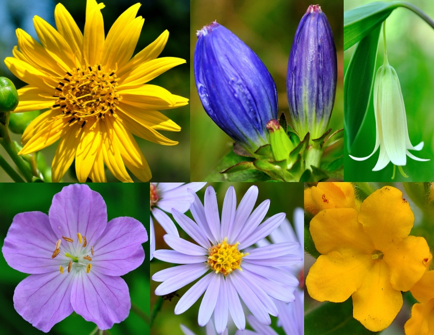
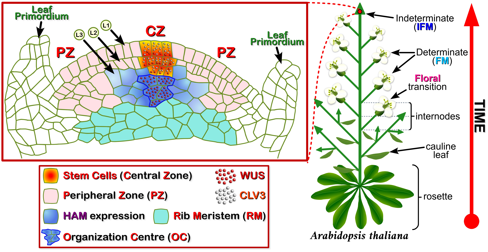
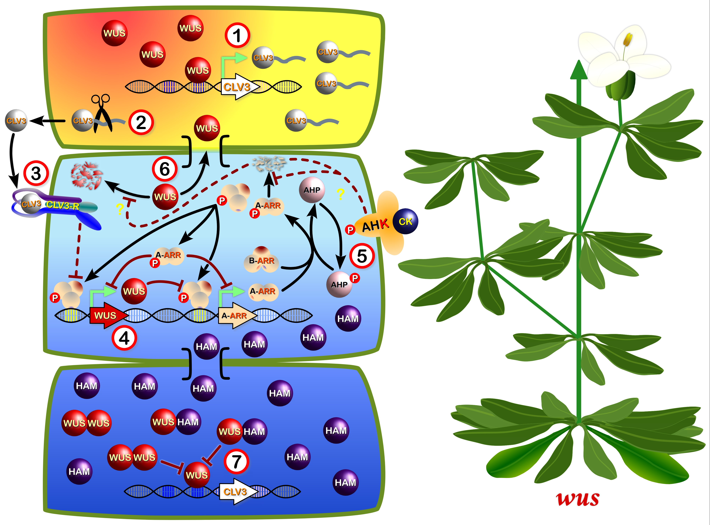
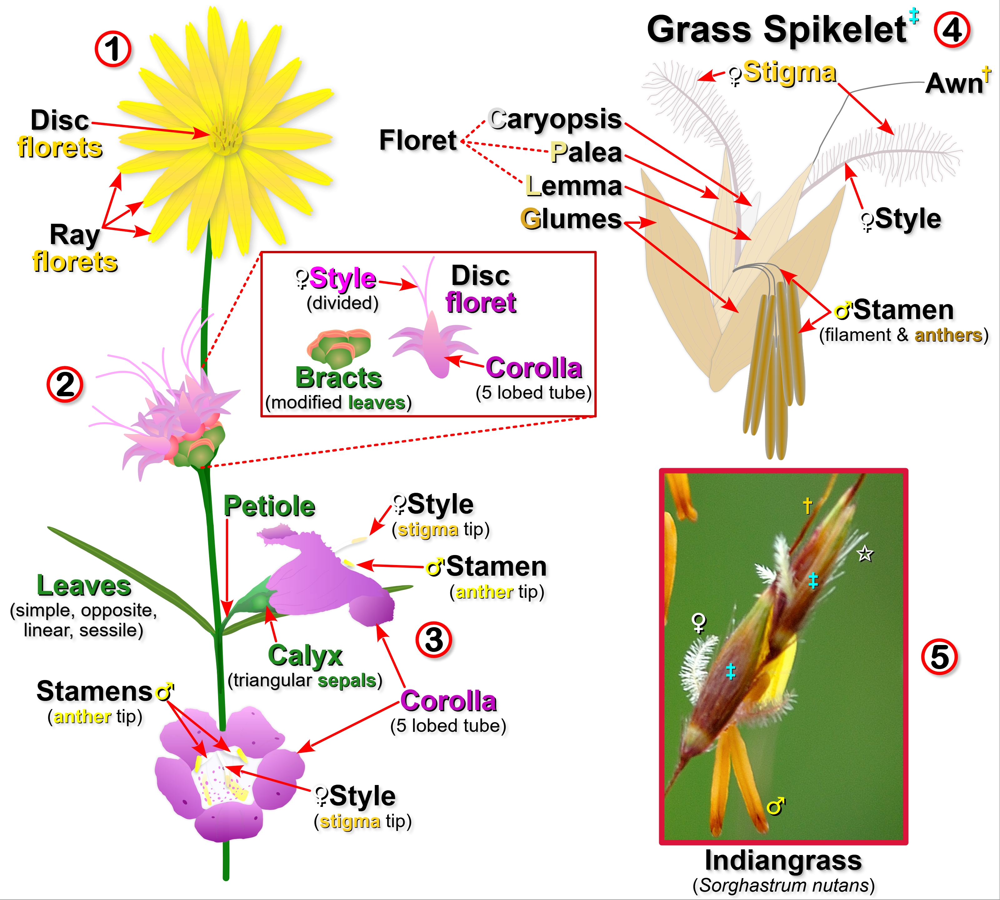
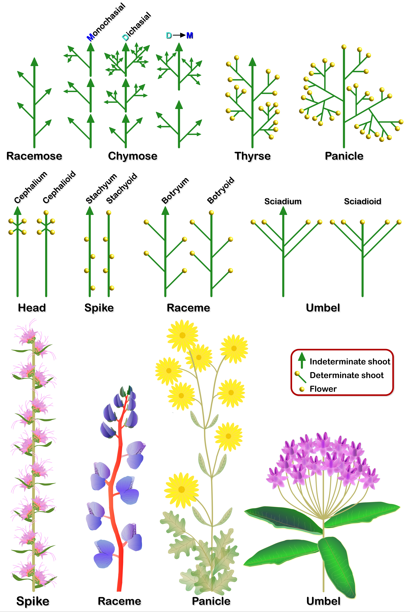
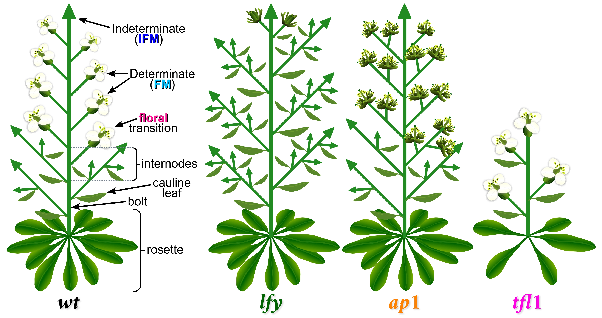
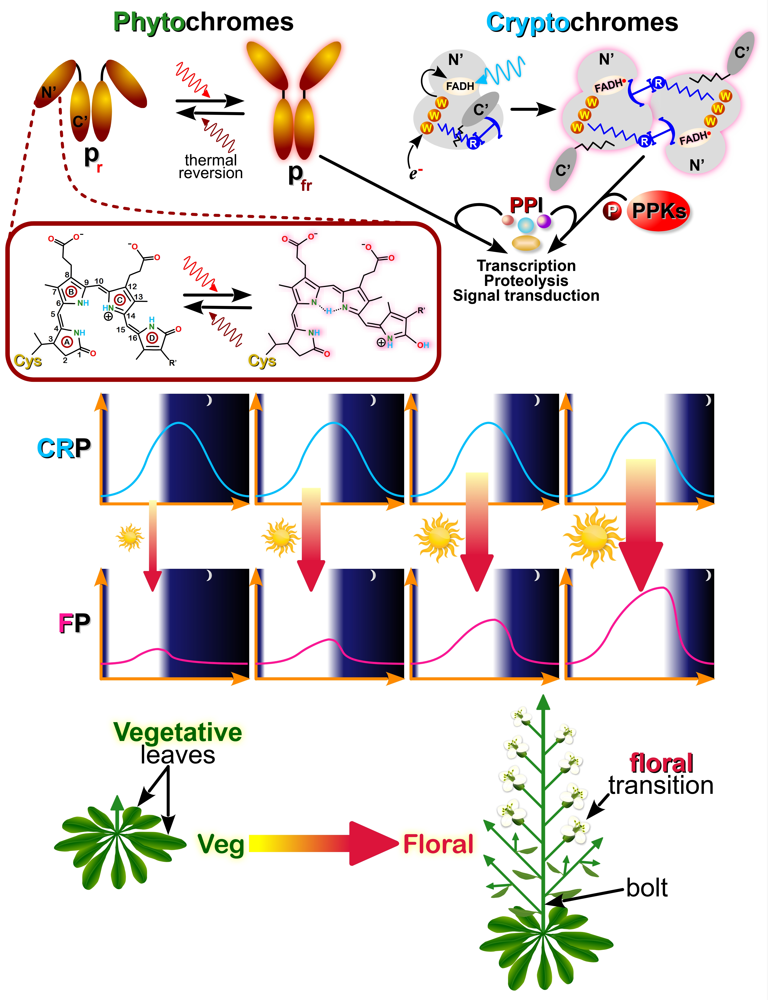
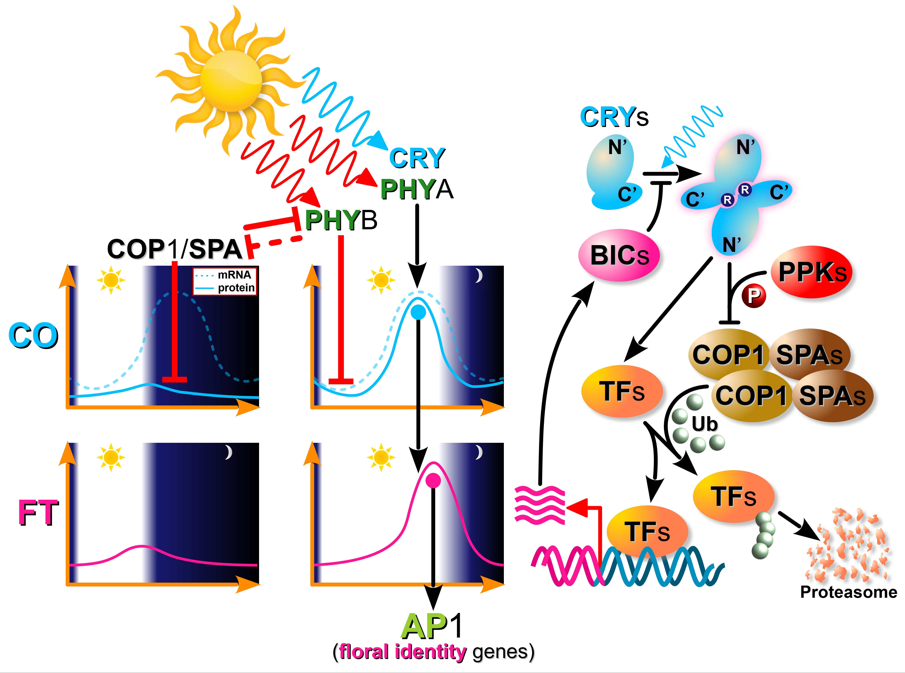
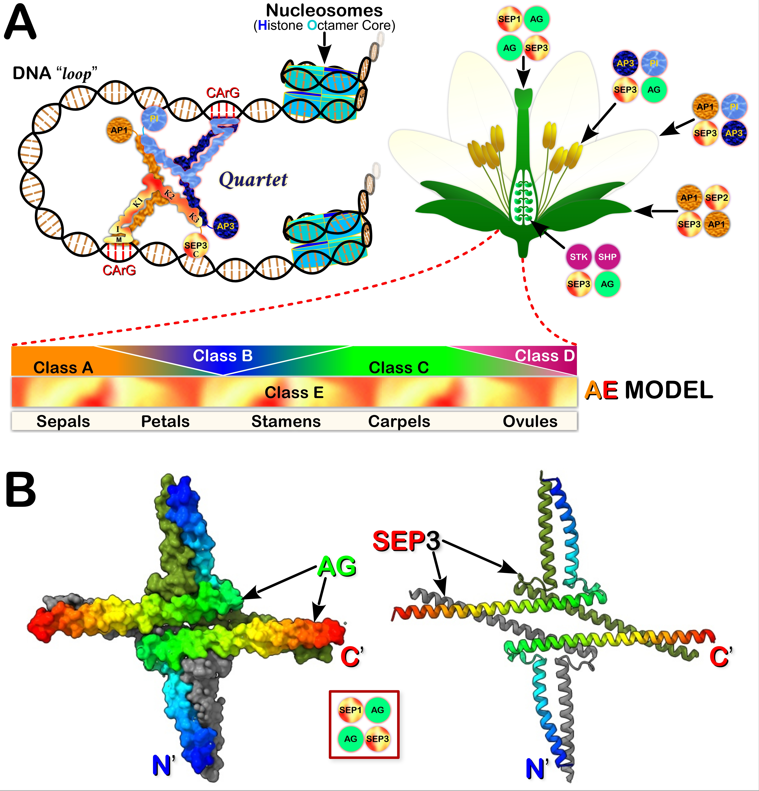

<!------------------------------------------------>
<!-------- JAVASCRIPT - enable LaTex MATH -------->
<!------------------------------------------------>

<!--------------------------------------->
<!------------ FLOWER FIG   ------------->
<!--------------------------------------->

<figure>

</figure>

<!------------------------------------->
<!-------- END - FLOWER FIG   --------->
<!------------------------------------->
<!-- this is a subheadline -->

<b>TABLE OF CONTENTS</b>

1.  <a href="#Angio"><b>Flowering Plants</b></a>
    - <a href="#FPsf"><b>1.1 Flowering Plants - Structure & Function</b></a>
    - <a href="#Fig1"><b>Fig. 1 - Stem Apical Meristem (SAM) Structure</b></a>
2.  <a href="#SCgenes"><b>Flower Plants - Stem Cells & Genes</b></a>
    - <a href="#Fig2"><b>Fig. 2 - Plant Stem Cell Signalling Network</b></a>
3.  <a href="#FAnat"><b>Flower Anatomy</b></a>
    - <a href="#Fig3"><b>Fig. 3 - Flower Structures</b></a>
4.  <a href="#IF"><b>Inflorescence Structure</b></a>
    - <a href="#Fig4"><b>Fig. 4 - Inflorescence Structures</b></a>
    - <a href="#IFG"><b>4.1 Inflorescence Gene Regulation</b></a>
    - <a href="#Fig5"><b>Fig. 5 - Arabidopsis Flowering Mutants</b></a>
    - <a href="#Fig6"><b>Fig. 6 - PhotoPeriod & Flowering</b></a>
    - <a href="#Fig7"><b>Fig. 7 - PhotoPeriod Genes & Flowering</b></a>
    - <a href="#ABCs"><b>4.2 Models of Floral Organ Development</b></a>
    - <a href="#Fig8"><b>Fig. 8 - AE & Quartet Model of Floral Organ Development</b></a>
5.  <a href="#Glos"><b>List of Terms</b></a>
6.  <a href="#Refs"><b>References</b></a>

<!----------------------------------------------------->
<!--------- SECTION 1 - IMPORTANTCE OF SOILS  --------->
<!----------------------------------------------------->
**  1. FLOWERING PLANTS  ** Flowering plants, also known as **angiosperms** (Greek: “<i>angeion</i>” = vessel, and “<i>sperma</i>” = seed), are a large group of photosynthetic organisms (\>350,000 species) that provide many of the ecological goods and services that make life possible on this planet (e.g. regulate global <b><a class="one" href="https://opc-project.netlify.app/project/prairie_soil_ecosystem/" target="_blank" title="Go to OPC Soil Ecology">biogeochemical cycles</a></b>, B**GCC**). Although their role in <b><a class="one" href="https://opc-project.netlify.app/project/prairie_soil_ecosystem/" target="_blank" title="Go to OPC Soil Ecology">soil ecology</a></b> has already been briefly discussed, many of the terms used to describe them, particularly as it relates to their identification (i.e. <b><a class="one" href="https://opc-project.netlify.app/gallery/" target="_blank" title="Go to OPC Gallery">gallery section</a></b>), needs some clarification. Like most scientific disciplines there is a seemingly endless number of esoteric terms used to describe plants. Although it’s important to standardize terms and concepts the resulting lexicon often creates a barrier to learning. With that in mind I hope this section will provide some clarity to the subject of flower anatomy and development. Unfortunately some subjects I do discuss below will require some basic chemistry knowledge. Educational links for key concepts are either provided above or are embedded within the text (e.g. consult: <b><a class="one" href="https://opc-project.netlify.app/project/pnps/" target="_blank" title="Go to PNP">Plant Natural Products</a></b>).

**  1.1 FLOWERING PLANTS - STRUCTURE & FUNCTION  ** **Angiosperms** have evolved a seemingly endless variety of floral arrangements (i.e. **inflorescences**). Why? Specifically, why devote so much energy to creating all of the morphological and genetic diversity that we see today in flowering plants? Is it simply because plants are forced to constantly evolve (i.e. improve their <b><a class="one" href="https://evolution.berkeley.edu/evolution-101/mechanisms-the-processes-of-evolution/evolutionary-fitness/" target="_blank" title="Go to Evolution 101">fitness</a></b>) in order to keep up with an ever changing environment? Considering a plant’s limited mobility one might also suspect that the answer lies with how plants go about scattering their proverbial “<i>seed</i>”, or more specifically pollen. Mating challenges are nothing new to most species, so using unique floral displays and structures to woo would be pollinators seems like an obvious solution. However, is it simply all about the “<i>birds and the bees</i>”? Plants are also capable of self-pollination and therefore may simply rely upon physical or **abiotic** factors (e.g. wind, water, fire) to ensure reproductive success. Regardless of the reasons, from a purely practical point of view the physical features of plants are the most important factor used to identify them (see <b><a class="one" href="https://opc-project.netlify.app/gallery/" target="_blank" title="Go to Gallery">OPC Photo Gallery</a></b>). This simply means that identifying plant structures will be important if your intention is to identifying plant species in the field. Hopefully more advanced and portable technologies in the future will alleviate much of our species identification problems.  
    So what regulates the structure of plants? Of course aerial traits like the shape of the **inflorescence** are largely controlled by species-specific genes. And the most important cells where this genetic program plays out is no doubt the primary **shoot apical meristem** (SAM), a specialized growth centre that houses totipotent **stem cells**. In fact most stem cells housed within different types of **meristems** remain totipotent (i.e. capable of producing any cell type) throughout the plant’s entire life. So for **inflorescence** development the SAM is, as **Jürgens** (2001) put it, the “<i>…ultimate source of cells for all aerial parts of the plant</i>”.**[1](#ref-jurgens_apical-basal_2001)** **Foster** (1938) noted many years ago that “<i>…the most distinctive feature of the meristem of the shoot apex…is the segregation of its cells into a number of well-defined zones</i>”. Based on his microscope studies several **meristem** zones were proposed, including: **(i) Zone I** as “<i>the position of the apical initial group, from which by anticlinal and periclinal divisions respectively the surface layer (sl) and the internal tissue of the growing point originate</i>”,**[2](#ref-foster_structure_1938)** **(ii) Zone II** as the “<i>…prominent cup-shaped mass of large, slowly dividing central <u>mother cells</u></i>”,**[2](#ref-foster_structure_1938)** and **(iii) Zone III** as the remaining cells along the periphery and lower margins of the “<i>central mother cells</i>”. These cells are noted for their “<i>…smaller size and frequency of division</i>”.**[2](#ref-foster_structure_1938)** For **Foster** **Zone III** represented a transition zone that gave way to “<i>the peripheral subsurface layers (Zone IV) and the rib meristem (Zone V)</i>”.**[2](#ref-foster_structure_1938)** Present day descriptions of the apical **meristem** often refer to the surface layer as the **tunica** and the main internal body of cells as the **corpus**. In addition the **tunica** of **angiosperms** like <b><a class="one" href="https://www.arabidopsis.org/" target="_blank" title="Go to TAIR"><i>Arabidopsis thaliana</i></a></b> contains two horizontal layers of cells (i.e. **L1** and **L2**) that are maintained by <u>anti-clinical</u> (i.e. dividing plane is perpendicular to surface) cellular division. In keeping with **Foster’s** zonal model the **apical meristem** is currently divided up into three main zones: (i) the **central zone** or CZ, (ii) the **peripheral zone** or PZ, and (iii) the **rib zone**, which is also known as the **rib meristem** (RM).**[3](#ref-traas_cellular_2001)** The totipotent **stem cells** are found within the CZ (i.e. occupies part of the **tunica** and **corpus**) and their numbers and identities (i.e. “<i>stem-ness</i>”) are largely controlled by cells within the <u>organizing centre</u> (OC) located just below the CZ.**[4](#ref-laux_wuschel_1996)–[6](#ref-schoof_stem_2000)** There are also secondary **meristems** that are responsible for lateral growth (i.e. increased plant girth), but only apical and axillary **meristems** produce elongating and branching shoots, as well as their leaves and flowers (i.e. **inflorescence**). However, from an ecological stand point, only plant’s with suitable or well adapted **inflorescence** traits (i.e. <b><a class="one" href="https://evolution.berkeley.edu/evolution-101/mechanisms-the-processes-of-evolution/evolutionary-fitness/" target="_blank" title="Go to Evolution 101">fitness</a></b>) will likely survive to produce the next generation of flowers. This was pointed out by Swedish botanist **Göte Turesson** (1922) over a century ago when he stated that “<i>…habitat types represents the genotypical response of the species population to a definite habitat….<u>ecotype</u> is used as an ecological sub-unit to cover the product arising as a result of the genotypical response of an <u>ecospecies</u> to a particular habitat</i>”.**[7](#ref-turesson_species_1922),[8](#ref-turesson_genotypical_1922)**

<!--------------------------------------->
<!------------ FIG 1 - SAM  ------------->
<!--------------------------------------->

<figure>

</figure>

**Figure 1. Stem Apical Meristem Structure**. Structures called **meristems** (Greek: “<i>merizein</i>” = to divide) contain totipotent **stem cells** that give rise to all of the tissue within adult plants. The <u>primary</u> **apical meristems** are located at opposite ends of the plant (i.e. shoot and root).**[1](#ref-jurgens_apical-basal_2001),[3](#ref-traas_cellular_2001)** *Arabidopsis thaliana* is a small annual *cruciferous* plant (cross-shaped flower) that has become one of the few preferred or standard plant research models in biology.**[9](#ref-fink_anatomy_1998),[10](#ref-kramer_planting_2015)** During the early vegetative stage of development wild type *Arabidopsis* produces a rosette of 9 to 17 basal leaves.**[11](#ref-schultz_leafy_1991)** Floral development begins with a **bolting** stage (i.e. elongation of the primary shoot) followed by the production of **phytomers** with bracts and lateral **meristems** that develop into **indeterminate co-inflorescence** (i.e. mini-versions of the main stem inflorescence). During later stages of development **phytomers** take on a different character, namely they form bract-less nodes with lateral **meristems** that develop into flowers. Overall the plant takes the form of a **compound raceme** typically with three **co-inflorescences** and ~30 flowers. In <i>Arabidopsis</i> a dome shaped mass of cells known as the **shoot apical meristem** (SAM) forms early on during embryonic development. Some of the daughter cells generated by SAM will go on to form **meristems** at specific locations along the length of the growing stem (e.g. **axillary meristems** located in the leaf **axil**). The typical apical **meristem** (Left box) is divided up into different zones based on varying cytological, histological and molecular characteristics.**[1](#ref-jurgens_apical-basal_2001),[3](#ref-traas_cellular_2001)** **Stem cells** reside within the **central zone** (CZ) of the **meristem** where they undergo **anti-clinical** and **peri-clinical** cellular divisions giving rise to both horizontal (e.g. **L1**, **L2**) and vertical growth, respectively. These new cells add to the **peripheral zone** (PZ) and underlying regions known as the **rib zone** or **rib meristem** (RM). As the position of the **apical meristem** continues to climb over <u>time</u> the lower peripheral cells become under the influence of new chemical signals that can trigger <b><a class="one" href="https://www.biointeractive.org/classroom-resources/cellular-differentiation-along-concentration-gradients" target="_blank" title="Go to HHMI">cellular differentiation</a></b>. One of the major factors responsible for maintaining **stem cell** identity is a homeobox containing transcription factor known as **WUSCHEL**, or WUS (**Fig. 2**). Transcription of WUS is restricted to cells within a small region of the RM known as the **organization centre** (OC).**[5](#ref-mayer_role_1998),[6](#ref-schoof_stem_2000)** WUS protein then migrates from the OC to the upper **stem cell** compartment via **plasmodesmata** where it directly activates the transcription of **CLAVATA-3** (CLV**3**).**[6](#ref-schoof_stem_2000),[12](#ref-brand_dependence_2000)–[14](#ref-daum_mechanistic_2014)** Expression of the CLV**3** gene confers **stem cell** identity (i.e. **stem cell** marker) and is therefore confined to the CZ to limit the size of the **stem cell** population. The latter is partly achieved by CLV**3** itself, since it functions as a extracellular signaling molecule that activates plasma membrane receptors that are more widely expressed, including cells within the OC.**[12](#ref-brand_dependence_2000),[15](#ref-fletcher_signaling_1999),[16](#ref-rojo_clv3_2002)** Here activation of CLV**3** receptors triggers a cell signaling cascade that inhibits WUS expression (**Fig. 2**). This negative feed-back loop between CLV**3** and WUS is regulated in part by the transcription factor **Hairy Meristem** (HAM),**[17](#ref-zhou_control_2015),[18](#ref-zhou_hairy_2018)** which binds to WUS and acts as a transcriptional repressor of CLV**3** expression.

<!----------------------------------------------->
<!-------- END - FIG 1 - SAM Structure  --------->
<!----------------------------------------------->

**  2. FLOWERING PLANTS - STEM CELLS & GENES  ** Many studies over the last three decades have identified numerous genes that are involved in regulating plant **meristems**. These genes and the environments or **niches** they operate within ultimately control the “<i>fate</i>” of **stem cells**, namely whether they continue to self-renew and maintain their identity, or differentiate and specialize to produce new tissues and organs. However, describing all of the complex networks of genes regulating **stem cells** is beyond the scope of this short primer. Nevertheless, it is worth exploring a few important regulatory genes that control **stem cells** since the structural identity of plants is largely controlled by them. And arguably the most important genes regulating **stem cells** are transcription factors, particularly those containing a <b><a class="one" href="https://www.ebi.ac.uk/interpro/entry/pfam/PF00046/" target="_blank" title="Go to InterPro">homeobox</a></b> domain.**[19](#ref-van_der_graaff_wus_2009),[20](#ref-mukherjee_comprehensive_2009)** The latter refers to a highly conserved region of the protein, approximately 60 amino acids in length, that is responsible for DNA binding. This transcription factor family plays a central role in body plan specification not only in plants but in most multi-cellular organisms.**[21](#ref-gehring_homeodomain_1994),[22](#ref-burglin_homeodomain_2016)** For example WUS, the founding member of the **WOX** (<b><a class="one" href="https://www.ebi.ac.uk/interpro/protein/UniProt/Q9SB92/" target="_blank" title="Go to InterPro">WUSCHEL</a></b>-**RELATED HOMEOBOX**) family of transcription factors, plays a central role in the maintenance of plant **stem cells**.**[4](#ref-laux_wuschel_1996),[5](#ref-mayer_role_1998)** It’s expression is detected early on during development (i.e. 16 cell stage) and subsequently confined to the OC of apical and floral **meristems**.**[5](#ref-mayer_role_1998),[6](#ref-schoof_stem_2000),[23](#ref-yadav_wuschel_2010)** WUS then moves between cells via **plasmodesmata**,**[13](#ref-yadav_wuschel_2011),[14](#ref-daum_mechanistic_2014)** a type of cytoplasmic bridge that spans the plant cell wall and links the cytoplasm of adjacent cells.**[24](#ref-maule_plasmodesmata_2008),[25](#ref-zambryski_plasmodesmata_2008)** Once it reaches the upper **stem cell** compartment (CZ) it directly activates the expression of CLV**3** (**CLAVATA3**),**[6](#ref-schoof_stem_2000),[12](#ref-brand_dependence_2000),[13](#ref-yadav_wuschel_2011),[26](#ref-brand_regulation_2002)** which functions as a small peptide ligand to several receptor-like proteins, including the heteromeric CLV**1**-CLV**2** complex.**[15](#ref-fletcher_signaling_1999),[16](#ref-rojo_clv3_2002),[27](#ref-clark_clavata1_1997)–[31](#ref-shimizu_bam_2015)** Activation of CLV**1**-CLV**2** inhibits the expression of WUS thus creating a negative feedback-loop between the upper **stem cell** pool and lower OC. Research shows that the CLV**3**/WUS circuit lies at the core of **stem cell** identity within **meristems** (**Fig. 2**).  
    WUS also plays a role in maintaining **floral meristems**.**[4](#ref-laux_wuschel_1996)** Peripheral **meristem** cells fated to initiate floral organ development must switch from an indeterminate **stem cell** state, maintained by transcription factors like WUS, to a determinant state that is devoted to specialized organ development (i.e. differentiation). For <i>Arabidopsis</i> and other **angiosperms** floral development begins with the reorganization or transformation of SAM into **inflorescence meristems** (IFM). Although IFM retains its vegetative potential it can also produce determinate **floral meristems** (FM) that generate flowers (i.e. whorls of **sepals**, **petals**, **stamens** and **carpels**). The **AGAMOUS** gene (AG), which encodes for a **MADS** domain containing transcription factor, is a key regulator of floral organ identity since genetic lines of <i>Arabidopsis</i> harbouring mutant alleles of AG (e.g. <i>ag</i>**-1**, <i>ag</i>**-2**, <i>ag</i>**-3**)**[32](#ref-bowman_genes_1989)–[34](#ref-bowman_genetic_1991)** generate a “<i>flower within a flower</i>” phenotype where the outer two flower whorls (i.e. **sepals** and **petals**) appear normal while the inner whorls (i.e. **stamens** and **carpels**) are replaced by petals (i.e. 4 normal petals + 6 extra petals) and a new flower. As **Saunders** (1921) noted over a century ago when describing the cultivar *Matthiola incana* (i.e. Stock flower, has the same mutant phenotype due to a mutated **MiAG** gene, the orthologue of <i>Arabidopsis</i> AG),**[35](#ref-nakatsuka_molecular_2018)** this ornamental garden plant “<i>…is a full double…destitute of any semblance of either stamens or carpels</i>”.**[36](#ref-saunders_note_1921)** This mutant phenotype also repeats itself resulting in several nested flowers, what could be described as every florist’s dream. Molecular analysis of FM within the <i>ag</i> mutants (Note: genetic mutants are usually written in lower case to distinguish it from wild type) shows persistent expression of both WUS and CLV**3**, which largely explains why **floral determinacy** is <u>suppressed</u> within these floral organs. However, what is striking about WUS is that it co-operates with the floral activator **LEAFY** (LFY) to directly activate AG.**[11](#ref-schultz_leafy_1991),[37](#ref-lohmann_molecular_2001),[38](#ref-lenhard_termination_2001)** Elevated levels of AG activates **KNUCKLES** (**KNU**), a transcriptional repressor protein that silences WUS thereby preventing it from maintaining floral **stem cell** activity.**[39](#ref-sun_timing_2009)** This represents a second negative feedback loop involving WUS and its regulation of **stem cells**.  
    Another equally important aspect of plant **stem cell** biology is the role the environment plays in the fate of these cells. The **stem cell** “<i>niche</i>” concept is well known among animal **stem cell** researchers,**[40](#ref-schofield_relationship_1978)** having emerged not long after the first **stem cells** (i.e. **haematopoietic stem cells**, or HSC) were discovered by **Till** and **McCulloch** back in the early 1960s.**[41](#ref-till_direct_1961),[42](#ref-becker_cytological_1963)** Subsequent studies of **stem cell niches** clearly show that both neighbouring cells and the molecules they secrete (e.g. growth factors, protein that make up the extracellular matrix or **ECM**) create an unique micro-environment that maintains **stem cell** numbers.**[43](#ref-moore_stem_2006),[44](#ref-pennings_stem_2018)** Beyond the confines of this micro-environment **stem cells** usually commit to a specific differentiation program. For example tissue specific epidermal **stem cells** are responsible for constantly replacing old dead keratinocytes.**[45](#ref-watt_epidermal_1998),[46](#ref-gonzales_skin_2017)** They reside within the inner most (basal) layer of the skin where they are in constant contact with the basement membrane, a growth factor and **extracellular matrix** (**ECM**) rich layer. **Stem cells** bind to elements of the **ECM** (e.g. fibronectin, collagen) via **integrin** receptors. This in turn triggers specific intracellular signaling cascades that maintain the identity of epidermal **stem cells** (i.e. capacity to self-renew). In fact β1-**integrin** is considered a marker of epidermal **stem cells**, and its reduced expression results in **stem cells** loosing contact with the basement membrane and being forced upwards where they differentiate into keratinocytes.**[47](#ref-adams_changes_1990)–[49](#ref-watt_expression_1993)**  
    So what types of **niche** signaling factors do flowering plants rely on to regulate **stem cell** activity within **meristems**? It’s well known that phyto-hormones like **auxin** and **cytokinin** (CK) control shoot and root development.**[50](#ref-vernoux_auxin_2010),[51](#ref-kieber_cytokinin_2018)** For example, <i>Arabidopsis</i> strains containing loss-of-function mutations within all three known CK receptors (i.e. <b><a class="one" href="https://www.uniprot.org/uniprotkb/Q9C5U2/entry" target="_blank" title="Go to UniProt">AHK2</a></b>, <b><a class="one" href="https://www.uniprot.org/uniprotkb/Q9C5U1/entry" target="_blank" title="Go to UniProt">AHK3</a></b>, and <b><a class="one" href="https://www.uniprot.org/uniprotkb/Q9C5U0/entry" target="_blank" title="Go to UniProt">AHK4</a></b>) show severe developmental abnormalities, including significantly reduced SAM size and activity.**[52](#ref-higuchi_planta_2004),[53](#ref-nishimura_histidine_2004)** It’s therefore not surprising that CK signaling is also an integral part of the WUS/CLV**3** signaling network within **stem cells**. Cross-talk between WUS/CLV**3** and CK provides additional levels of control over WUS protein levels and transcriptional activity (**Fig. 2**).**[14](#ref-daum_mechanistic_2014),[18](#ref-zhou_hairy_2018),[54](#ref-leibfried_wuschel_2005)–[61](#ref-plong_clavata3_2021)** Multiple signal inputs likely require fine-tuned nested threshold responses (e.g. negative feedback loops) given the spatial-temporal nature of cellular differentiation and organ development (e.g. proper inflorescence structure).

<!--------------------------------------------------------->
<!------------ FIG 2 - SAM Signalling Network ------------->
<!--------------------------------------------------------->

<figure>

</figure>

**Figure 2. Plant Stem Cell Signalling Network**. **WUSCHEL**, or simply WUS, is one of the most important transcription factors that regulates **stem cells** activity in **meristems**.**[4](#ref-laux_wuschel_1996)–[6](#ref-schoof_stem_2000),[12](#ref-brand_dependence_2000)** Unlike the ordered vegetative-to-floral transition seen in wild-type plants (**Fig. 1**) mutant WUS plants (<i>wus</i>) display a discontinuous or “<i>stop-and-go</i>” type of secondary shoot development. **Meristems** emerge from the axils of leaves (i.e. loss of apical dominance) often producing bunches of cauline leaves.**[4](#ref-laux_wuschel_1996)** Floral organ development is rare and the few mutant flowers that do emerge lack **carpels** and most **stamens** (Note: on average one central **stamen** develops, as well as a normal complement of outer **sepals** and **petals**). These developmental defects highlight the importance of WUS to SAM (e.g. loss of **stem cell** maintenance). WUS protein has been shown to diffuse out of OC cells via **plasmodesmata** (<b>⑥</b>).**[13](#ref-yadav_wuschel_2011),[14](#ref-daum_mechanistic_2014)** Upon reaching the upper **stem cell** compartment it activates **CLAVATA-3** (CLV**3**) expression (<b>①</b>), which is required to maintain **stem cell** identity (i.e. **stem cell** marker).**[13](#ref-yadav_wuschel_2011),[57](#ref-perales_threshold-dependent_2016)** Although the mechanism(s) responsible for confining WUS gene expression to the OC is not fully understood, both **Hairy Meristem** genes (HAM**-1**, **2** and **3**) and CLV**3** appear to play important roles in this process.**[17](#ref-zhou_control_2015),[18](#ref-zhou_hairy_2018),[62](#ref-stuurman_shoot_2002),[63](#ref-engstrom_arabidopsis_2011)** HAM-1 and HAM-2 are highly expressed within the RM (<b>⑦</b>), which overlaps with WUS, and largely absent within **L1** and **L2** (<b>②</b>). By contrast CLV**3** expression is largely restricted to **L1** and **L2** within the CZ.**[17](#ref-zhou_control_2015),[18](#ref-zhou_hairy_2018)** HAM has also been shown to bind to WUS and inhibit CLV**3** expression (<b>⑦</b>).**[17](#ref-zhou_control_2015),[18](#ref-zhou_hairy_2018)** The <u>inability</u> of WUS:HAM hetero-dimers to activate CLV**3** expression is a property shared by WUS homo-dimers (WUS:WUS, <b>⑦</b>).**[57](#ref-perales_threshold-dependent_2016)** Based on these findings alone it would appear that changes in the protein levels of WUS and/or HAM strictly control CLV**3** transcription within the apical **mersitem**.**[18](#ref-zhou_hairy_2018),[57](#ref-perales_threshold-dependent_2016),[60](#ref-han_signal_2020)** However there are post-translational mechanisms that also control WUS activity. For example, the unique C-terminal **WUSCHEL-box** appears to govern nuclear retention of the protein, while an **EAR-like** domain controls its nuclear export.**[14](#ref-daum_mechanistic_2014),[55](#ref-kieffer_analysis_2006),[58](#ref-rodriguez_dna-dependent_2016),[61](#ref-plong_clavata3_2021)** Regulating WUS protein movements using these additional signal inputs likely has a significant affect on its transcriptional activity (i.e. active monomer or inactive homo-dimer).**[14](#ref-daum_mechanistic_2014),[58](#ref-rodriguez_dna-dependent_2016)** Less is known about how CLV**3** negatively regulates WUS expression and transcriptional activity. CLV**3** is known to undergo extensive post-translational modifications (e.g. proteolysis <b>②</b>, and the addition of arabinose groups)**[64](#ref-ni_evidence_2006)–[68](#ref-hirakawa_clavata3_2021)** prior to being secreted into the extracellular space where it acts as a ligand (<b>③</b>) for several plasma membrane receptor-like protein complexes (Note: collectively symbolized here as CLV**3-R**).**[15](#ref-fletcher_signaling_1999),[16](#ref-rojo_clv3_2002),[27](#ref-clark_clavata1_1997)–[31](#ref-shimizu_bam_2015)** CLV**3** inhibition of WUS expression appears to be linked to **cytokinin** (CK) signaling. For example, plants carrying mutations within all three known CK receptors (i.e. <b><a class="one" href="https://www.uniprot.org/uniprotkb/Q9C5U2/entry" target="_blank" title="Go to UniProt">AHK2</a></b>, <b><a class="one" href="https://www.uniprot.org/uniprotkb/Q9C5U1/entry" target="_blank" title="Go to UniProt">AHK3</a></b>, and <b><a class="one" href="https://www.uniprot.org/uniprotkb/Q9C5U0/entry" target="_blank" title="Go to UniProt">AHK4</a></b>) show severe developmental defects, including significantly reduced SAM size and activity.**[52](#ref-higuchi_planta_2004),[53](#ref-nishimura_histidine_2004)** CK signaling also induces WUS expression via CLV-dependent and CLV-independent mechanisms.**[56](#ref-gordon_multiple_2009),[69](#ref-lindsay_cytokinin-induced_2006)** WUS (<b>④</b>) can also repress the transcription of type A **Arabidopsis RESPONSE REGULATORS** (**A-ARRs**),**[54](#ref-leibfried_wuschel_2005)** and also be transcriptionally activated by type B **Arabidopsis RESPONSE REGULATORS** (**B-ARRs**).**[59](#ref-wang_cytokinin_2017),[70](#ref-meng_type-b_2017)** These two different regulators (<b>⑤</b>) perform opposite functions within the CK two-component Ⓟ-relay signaling system. When **B-ARRs** is phosphorylated via the **H**istidine Phosphotransfer protein (**Arabidopsis HP**, or **AHP**), it transcriptionally activates CK-inducible target genes, whereas phosphorylated **A-ARRs** function as negative regulators of **B-ARRs** (i.e. a negative feedback loop).**[71](#ref-hwang_two-component_2001),[72](#ref-hwang_two-component_2002)** Recent crystal structural analysis of **B-ARRs** suggests that CK induced phosphorylation of its N-terminal receiver domain opens up an otherwise closed protein confirmation that promotes DNA binding and transcriptional activity.**[73](#ref-zhou_structure_2024)** However, since **A-ARRs** lack a DNA binding domain it’s currently unclear why its phosphorylation is so critical to its inhibitory function (Note: plants expressing a constitutively activated form of **A-ARR7** that has its phospho-acceptor **Asp** residue mutated have SAM defects similar to that of WUS mutants).**[54](#ref-leibfried_wuschel_2005)** Some suggest that phosphorylated **A-ARRs** may actively bind to and inhibit the function of **B-ARRs**.**[74](#ref-kim_phosphorylation_2008)** It’s also possible that some other post-translational mechanism, like **sumoylation** (i.e. alters protein stability), may be operating to alter the protein stability of **A-ARRs** (<b>⑤</b>).**[75](#ref-kim_scfkmd_2013),[76](#ref-kurepa_cytokinin_2014)** More recent studies also show that CK can stabilize WUS monomeric levels by somehow regulating a **degron** signal (i.e. sequence recognized by the ubiquitin-proteasome system) buried within the **WOX-box** domain (<b>⑥</b>).**[58](#ref-rodriguez_dna-dependent_2016),[77](#ref-snipes_cytokinin_2018)**

<!-------------------------------------------------------->
<!-------- END - FIG 2 - SAM Signalling Network  --------->
<!-------------------------------------------------------->

**  3. FLOWER ANATOMY  ** Besides their size (e.g. trees) and the bounty they produce, most plants are admired for the beauty of their flowers. However for biologists it’s also a structure devoted to sexual reproduction that showcases some of **Darwin’s** and **Wallace’s** fundamental <b><a class="one" href="https://evolution.berkeley.edu/evolution-101/an-introduction-to-evolution/" target="_blank" title="Go to Evolution101">evolutionary</a></b> principles. **Darwin** knew full well the power of plants, specifically as the living embodiment of <b><a class="one" href="https://evolution.berkeley.edu/evolution-101/mechanisms-the-processes-of-evolution/" target="_blank" title="Go to Evolution101">evolutionary</a></b> forces that select desirable traits (i.e. reproductive success of plants). Although **Darwin** is better known for his Galapagos finches, he also amassed a large collection of pant specimens (\>1,400) during his voyage aboard the HMS Beagle (1831-1836). He also spent a considerable amount of time reflecting on the significance of plant organ development. For example, based on the work of botanists like **Francois Marius Barneoud**,**[78](#ref-barneoud_note_1846)** **Darwin** noted that different (i.e. heterogeneous) structures, like petals and sepals, actually arise from very similar looking (i.e. homogeneous) primordial outgrowths (e.g. leaf primordia, **Fig. 1**) that we now know are a product of SAM.**[79](#ref-friedman_charles_2011)** Viewing evolution through the lens of developmental biology became a powerful explanatory tool for **Darwin** and his supporters. However, perhaps his most powerful argument was likening **natural selection** to **artificial selection**, otherwise known as selective breeding. The latter of course involves breeding only animals and plants with desirable traits, such as pigeons with showy plumage or plants with large beautiful flowers. However, wild plants can only use resources that are available to them within their natural environments. As a result individuals that do survive and go on to reproduce will pass on their traits to the next generation. The genetic makeup of these traits is ultimately what is being selected for over time. Invariably this is a slow “<i>mechanical</i>” process whereby individuals carrying suitable traits (e.g. confer increase mating success) increase in number, ultimately resulting in a shift in the genetic makeup (i.e. increased frequency of favoured <b><a class="one" href="https://www.jax.org/news-and-insights/minute-to-understanding/what-is-an-allele" target="_blank" title="Go to JAX.org">alleles</a></b>) of the population (i.e. evolution). Today we refer to this generation-to-generation change in the genetic structure (i.e. frequency of **alleles**) of a population as <b><a class="one" href="https://evolution.berkeley.edu/evolution-at-different-scales-micro-to-macro/what-is-microevolution/" target="_blank" title="Go to Evolution101">micro-evolution</a></b>. For flowering plants their evolutionary success, as evidenced by their enormous biodiversity, is obviously linked to their reproductive success (i.e. flowers and mating strategies).  
    One advantage that plants have over animals is its modular <u>indeterminate</u> growth pattern. This concept was touched upon earlier when describing plant **stem cell** gene networks and refers to the fact that **meristems** can either produce a specific or <u>determinate</u> body part like a flower (i.e. **floral meristem**) or remain in a <u>vegetative</u> or **indeterminate** state (i.e. **inflorescence** or **apical meristem**). The latter can produce body parts that vary in size and shape, often in response to different environmental conditions. So <u>indeterminate</u> growth can be viewed as a type of **developmental plasticity** that allows individuals of the same species to alter their appearance (e.g. smaller flowers) in response to changing environmental conditions (e.g. climate change). These differences in observable traits (i.e. <b><a class="one" href="https://www.genome.gov/genetics-glossary/Phenotype" target="_blank" title="Go to NIH">phenotypes</a></b>) are largely due to changes in their genetic makeup, which can give rise to genetically distinct populations (i.e. **ecotypes**).**[7](#ref-turesson_species_1922),[80](#ref-lowry_ecotypes_2012)** This term, which was coined by the Swedish botanist **Göte Turesson** (1922), was meant to represent an “<i>…ecological unit</i>” that is a product of its “<i>genotypical response….to a particular habitat</i>”.**[7](#ref-turesson_species_1922)** As to whether or not **ecotypes** are a “<i>…nonrandom partitioning of genetic variation along the continuum of species formation</i>”**[80](#ref-lowry_ecotypes_2012)** is currently open to debate.  
    Flowers are by definition <u>determinate</u> shoot structures that are devoted to the production of **pollen** (♂) and **ovules** (♀) via distinct structures (i.e. <u>heterosporangiate</u>). Specifically each **stamen** (i.e. collectively known as the **androecium**) is made up of a relatively long thin **filament** and an **anther** (bearing **pollen**), whereas each **carpel** (i.e. collectively known as the **gynoecium**) contains a **style**, **stigma** and **ovary** (**Fig. 3**). **Carpels** (i.e. “<i>vessels</i>”) are considered modified leaves, each enclosing one or more **ovules** (i.e. produce seeds when fertilized). All of the main parts of a flower (i.e. **carpels**, **stamens**, **petals** and **sepals**) are arranged around its central axis in a sequential manner (i.e. **whorls**).**[81](#ref-evert_raven_2013)** This includes, moving radially outwards from the centre, the **carpels** (i.e. often fused together as one large **pistil**), **stamens**, **petals** (i.e. collectively referred to as the **corolla**) and outer **sepals** (i.e. collectively referred to as the **calyx**). The majority of **angiosperms** possess both **carpels** (♀) and **stamens** (♂), so called **perfect** or **bisexual** flowers.**[82](#ref-renner_relative_2014)** In contrast, **imperfect** or **uni-sexual** flowers lack either **stamens** (i.e. **carpellate** or **pistillate** flowers) or **carpels** (i.e. **staminate** flowers). Although many **angiosperms** have **uni-sex** flowers (i.e. **monoecious** or **dioecious**, where **staminate** and **carpellate** flowers are found on either the same plant or different plants, respectively) they constitute the minority of flowering plants.**[82](#ref-renner_relative_2014),[83](#ref-renner_dioecy_1995)**  
    The flexible nature of **angiosperm** sexual systems has long fascinated evolutionary biologists. For example, since most **angiosperms** have **hermaphroditic** flowers they are more susceptible to the deleterious affects of self-fertilization, namely inbreeding (i.e. loss of <b><a class="one" href="https://www.dnaftb.org/4/animation.html" target="_blank" title="Go to NIH">heterozygosity</a></b>).**[84](#ref-carr_recent_2003)** This increases the expression of deleterious recessive mutations (i.e. recall <b><a class="one" href="https://www.dnaftb.org/3/bio.html" target="_blank" title="Go to CSH">Mendelian</a></b> genetics and the famous <b><a class="one" href="https://www.dnaftb.org/5/animation.html" target="_blank" title="Go to CSH">Punnett</a></b> square)**[85](#ref-bateson_mendels_1902),[86](#ref-edwards_reginald_2012)** that could compromise the reproductive success (i.e. fitness) of a species, as well as increase its susceptibility to extinction.**[87](#ref-newman_increased_1997)** The latter is particularly disconcerting when rare and endangered species are subjected to habitat loss, reduced access to pollinating species, and climate change. Although **dioecious** species benefit from an out-crossing advantage (i.e. self-fertilization suppressed) they too may be susceptible to climate change since some display spatial segregation of sexes (i.e. sexes prefer different micro-habitats, and consequently adopt new physiological and morphological specializations).**[88](#ref-bierzychudek_spatial_1988),[89](#ref-hultine_climate_2016)** Nevertheless, **hermaphroditic** plants do have a survival advantage over **uni-sex** plants under some circumstances (e.g. pollination assurance when geographically isolated).**[84](#ref-carr_recent_2003)** **Hermaphroditic** species are also known to develop quite complex self-incompatibility mechanisms to prevent self-fertilization,**[90](#ref-hiscock_different_2003)** whereas a small minority have adopted mixed mating systems (i.e. **Gynodioecy** - the co-existence of female and hermaphrodite plants, or the much rarer **Androdioecy** - coexistence of male and hermaphrodite plants).**[82](#ref-renner_relative_2014),[83](#ref-renner_dioecy_1995)** Although this latter strategy seems like a reasonable compromise it does not exclude these species from the perils of inbreeding depression.

<!-------------------------------------------------->
<!------------ FIG 3 - FLOWER Anatomy  ------------->
<!-------------------------------------------------->

<figure>

</figure>

**Figure 3. Flower Structures**. Flower structures can be rather complex, but they all contain basically two types of components, namely: (i) reproductive or fertile structures (i.e. **stamens** and **carpels**) and (ii) non-reproductive or infertile appendages (e.g. **sepals**, **petals**). From these two basic types of structures a tremendous variety of flower types can be created. For example, a large number of different flowers within the family <i>Asteraceae</i> can produce both **disc florets** and **ray florets** (i.e. generally known as **composite** flowers). The central **disc florets** are relatively small and clustered together to form a head, while the outer halo-like **ray florets** are generally either strap-like or petal-like in shape. Two examples of this specialized flower type are shown above, namely the flower head of **Prairie dock** (<i>Silphium terebinthinaceum</i>, <b>①</b>) and the flower head of **Tall Prairie blazing star** (<i>Liatris aspera</i>, <b>②</b>). The **disc florets** of <i>S. terebinthinaceum</i> are **staminate** (♂) and produce only pollen, while the outer **ray florets** (♀) produce seeds in the form **achenes** (i.e. dry, flat, closed or **indehiscent** fruits). This is quite contrary to what most of us assume about sunflowers, like the well known giant sunflower. The latter flowers produce edible seeds via perfect **disc florets** (♂ and ♀ parts), while the outer **ray florets** are **imperfect** and sterile. In contrast, the large pink button-like flower heads of <i>L. aspera</i>, another type of **Aster**, does not produce **ray florets**. Each of the **disc florets** are petal-like in appearance (i.e. tubular corolla) with five distinct spreading lobes that produce a star shaped pattern. They also have a series of scale-like **bracts** at the base of the flower head that are green and usually tinged with purple (Note: edges or margins of these **bracts** are uneven or rough looking, hence its other common name **Rough blazing star**). Emerging from the centre of each **floret** is a relatively long divided **style** (♀), which gives the **inflorescence** a fuzzy, brush-like appearance. Similar to <i>S. terebinthinaceum</i> the flowers of <i>L. aspera</i> produces dry hairy fruits (i.e. **achenes**) that are dispersed via the wind. Flowers that are not **Asters**, like <i>Agalinis purpurea</i> (**Large purple foxglove**, <b>③</b>), have a more familiar structure. Each tube shaped flower is attached to a small **petiole** and has a 5 lobed pinkish-purple **corolla**. Cupping the base of the flower is a tube shaped **calyx**, which has five pointed triangular lobes. The interior of the **corolla** has the familiar **anther** tipped **stamens** (♂), a single blunt tipped **style** (♀), and colourful markings (i.e. pale yellow stripes, which serve as nectar guides, and dark purple spots). Another common type of flower, that most of us perhaps overlook, is that of **grasses** (<b>④</b>). Known as a **spikelet**, it has the following relatively simple general structure: (i) a **pistil** (♀) consisting of an **ovary** (houses a single **ovule**); (ii) two **styles** (♀), each supporting a feathery **stigma** (♀) with ample surface area for capturing pollen grains; (iii) multiple **stamens** (♂), each consisting of a long wiry **filament** and a terminal **anther** (♂); (iv) no showy petals or sepals; (v) two outer **bracts** known as **glumes**, with the first one usually displaying long hairs (<b>☆</b>); (vi) two inner **bracts** surrounding the grass **floret**, with the one called the **lemma** often anchoring a long appendage called an **awn** (†); (vii) a **palea**, or second inner **bract**; and (viii) the **caryopsis**, or seed **grain**, which is a type of dry fruit. Together the **lemma**, **palea** and inner grain make up a fertile grass **floret**. For example, the **spikelet** of **Indiangrass**, *Sorghastrum nutans* (<b>⑤</b>), has a golden brown to chestnut coloured outer **glume** (‡) that is narrow, pointed and displays some long hairs (<b>☆</b>). A long wiry bent **awn** (†) can be seen emerging from one of the **spikelets**. The white feathery **styles** (♀) and long yellow **stamens** (♂) are also clearly visible (Note: the upper diagram of the grass **spikelet** is meant for illustrative purposes. Its components are not normally spread out in this type of neatly nested manner).

<!------------------------------------------------>
<!-------- END - FIG 3 - FLOWER Anatomy  --------->
<!------------------------------------------------>

**  4. INFLORESCENCE STRUCTURE  ** This **Linnaean** term refers to the arrangement of flowers on a plant, including the position of the flower heads (i.e. open or closed “<i>canopy</i>”) and the shape of the branches that bear them (i.e. “<i>scaffold</i>” that bears the flowers).**[91](#ref-tucker_inflorescence_1999)** The modular nature of plant growth and the architecture it produces is largely thanks to apical **meristems** since they ultimately produce the lateral outgrowths (i.e. **promordia**) that become either new leaves or flowers (e.g. **leaf promordia**, **Fig. 1**). The succession of lateral **primordia** produced by **meristems** gradually move away from each other due to cell growth within the intervening spaces resulting in stem elongation. The new stem segments are known as **inter-nodes**, and the sites that connect successive **inter-nodes** are the **nodes** (i.e. potential sites of leaf, flower, bud or shoot development). Collectively these structures (i.e. **inter-node**, **node** and any attached organs) constitute a **metamer** or **phytomer** (i.e. basic structural unit of a stem).**[81](#ref-evert_raven_2013)** During a plant’s vegetative phase both **apical** and **axillary meristems** (AxM, located within the leaf **axil**) produce new **phytomers** to either elongate the main stem or secondary axes (i.e. **phytomers** addition to secondary shoots), respectively. **Secondary meristems** located within the vascular cambium also make new additions to the plant (i.e increase its girth) but they are not involved in the production of new stems or branches. Eventually environmental signals like temperature or **photo-period** (PP)**[92](#ref-poethig_phase_2003)** induce plant flowering. It’s also important to note that the succession of **leaf primordia** (**Fig. 1**) generated by the apical **meristem** take up well defined radial positions along the stem. This process (i.e. **phyllotaxy**) ultimately results in the leaves being arranged in regular patterns around the stem (e.g. spirally = 137.5° of separation or **Fibonacci** angle; alternately = 180° of separation).**[93](#ref-fleming_formation_2005),[94](#ref-palauqui_phyllotaxis_2011)** Since **axillary meristems** are located within the **axil** of each leaf it therefore follows that **phyllotaxy** greatly influences branching patterns (i.e. **inflorescence** development). **Phytomers** also show considerable structural variations (i.e. **heteroblasty**).**[95](#ref-zotz_heteroblastyreview_2011),[96](#ref-diggle_modularity_2014)** For example, the size of leaves or the length of the **corolla** (**Fig. 4**, **raceme** of *Lupinus perennis*) can change as you move up the stem. Nevertheless, despite the pervasive nature of **heteroblasty** many closely related species often display the same type of **inflorescence** (e.g. **milkweed** and **umbels**).  
    One of the major classification criteria of an **inflorescence** is the presence or <u>absence</u> of a flower at the shoot apex. When the flower is present it is referred to as a closed or <u>determinate</u> **inflorescence**, and when it is absent it is called an open or <u>indeterminate</u> **inflorescence**. For example, in **racemose** type plants like *Arabidopsis* (**Fig. 4**) the SAM can remain in a vegetative (indeterminate) state and continue to add new **phytomers** to the main stem axis. However, as *Arabidopsis* matures and SAM enters its reproductive phase dormant AxM become activated (i.e. regain **meristem** potential) and generate new secondary shoots. However, if the **apical meristem** is not fully differentiated (e.g. form an **apical** or **terminal bud**) it can still exert its dominance over secondary **meristems** depending upon developmental or environmental conditions. In fact the ability of buds to cycle between a dormant and an active state is vital to both normal development (i.e. protects against uncontrolled growth) and the survival of plants (e.g. damage to apical region caused by browsing herbivores).**[97](#ref-shimizu-sato_control_2001)–[99](#ref-choa_current_2007)**  
    Another important criteria is the branching pattern of the **inflorescence**.**[81](#ref-evert_raven_2013),[100](#ref-endress_disentangling_2010)** There appears to be two main alternate **inflorescence** patterns within flowering plants, namely **racemose** and **cymose** (**Fig. 4**). The former is the simplest with only a single main stem (i.e. primary or 1st order axis) and a variable number of lateral branches (i.e. secondary or 2nd order axes). Although the branching order is fixed (i.e. no more than two) several variations on the **racemose** theme are possible, namely: (i) a simple **spike** configuration has a long primary axis and short or absent secondary axes (i.e. **stachyum** = open, **stachyoid** = closed); (ii) in a **raceme** both primary and secondary axes are relatively long (i.e. **botryum** = open, **botryoid** = closed); (iii) in an **umbel** the primary axis is short within the branching region while the secondary axes are relatively longer (i.e. **sciadium** = open, **sciadioid** = closed); (iv) in a **head** both primary and secondary axes are short within the branching region (i.e. **capitulum** or **cephalium** = open, **cephalioid** = closed); and (v) **compound racemes** can arise when secondary axes are replaced by one or more **racemose** subunits (e.g. double raceme or **diplobotryum**).**[81](#ref-evert_raven_2013),[100](#ref-endress_disentangling_2010)** In contrast a **cymose** pattern is characterized by a primary axis having a maximum of two secondary axes or branches. However these branches can undergo higher order branching (i.e. not limited). If all the secondary axes have a pair of lateral branches (e.g. tertiary axes) it is **dichasium**, whereas if all axes have only one lateral branch then it is **monochasium** (**Fig. 4**). Also a compound **cyme** having both **dichasial** and **monochasial** subunits usually begins **dichasial** and ends **monochasial** (D → M, **Fig. 4**). Another type of compound **inflorescence** called a **thyrse** (open) or **thyroid** (closed) has both **racemose** (primary branching) and **cymose** (secondary branching) subunits. Lastly, there is also a third type of **inflorescence** called a **panicle**. Even though **panicles** are fairly common, albeit less so among temperate **angiosperms**,**[101](#ref-prusinkiewicz_evolution_2007)** botanists consider them to be a special case since they have characteristics that strictly exclude them from being classified as either **cymose** and **racemose**. For example, unlike a **cymose** a **panicle** has more than 2 lateral branches of the next higher order, and unlike a **racemose** a **panicle** has branches with more than 2 branching orders (i.e. no limits on branching orders). In addition, each branch terminates in a flower and the branching order usually becomes progressively smaller towards the top of the plant (**Fig. 4**).**[100](#ref-endress_disentangling_2010)**

<!------------------------------------------------------------>
<!------------ FIG 4 - INFLORESCENCE Structures  ------------->
<!------------------------------------------------------------>

<figure>

</figure>

**Figure 4. Inflorescence Structures**. The reproductive success of flowering plants depends in large part on the shape and size of its **inflorescence**. Branching patterns and the extent of a plant’s floral display all have obvious functional consequences with respect to reproductive success. Specifically branches deliver nutrients to flowers and also provides physically support so that they can attract potential pollinators. Promoting flower-pollinator interactions in this way ultimately impacts the flow of genetic information between plants within a population (i.e. evolutionary potential). For example **panicles** are more prevalent among tropical plants and are considered an ideal **inflorescence** for wind and insect pollination.**[101](#ref-prusinkiewicz_evolution_2007),[102](#ref-harder_interplay_2013)** Tropical habitats have an abundance of pollinators and are less constrained by **abiotic** factors (e.g. temperature, sunlight, precipitation). For these reasons tropical plants can extend their vegetative growth phase to produce a profusion of branches and flowers. However tropical environments are home to large populations of herbivores, which means that plants must also devote a substantial amount of energy to secondary metabolite production as a means of chemical defence (e.g. toxic latex production). By contrast **angiosperms** in more northern latitudes are subject to less favourable growth and reproductive conditions (i.e. seasonal growth, less precipitation and sunlight, limited access to pollinators). Thus the timing and extent of vegetative and reproductive growth phases have to be carefully regulated in order to ensure reproductive success. This may explain why plants in temperate habitats generally have more modest branching patterns (i.e. **racemose** or **cymose**).**[101](#ref-prusinkiewicz_evolution_2007),[102](#ref-harder_interplay_2013)**

<!----------------------------------------------->
<!-------- END - FIG 4 - INFLORESCENCE  --------->
<!----------------------------------------------->

**  4.1 INFLORESCENCE GENE REGULATION  ** Flower development is ultimately governed by genetic regulatory networks operating within **meristems** in response to changing environmental conditions (e.g. **photo-period**, PP). For example in the model plant species *Arabidopsis thaliana* the <u>indeterminate</u> (vegetative) apical **meristems** generate short vertical **phytomers** (inter-nodes) and lateral organ **primordia** that develop into spirally arranged stem leaves. However as the plant transitions into the reproductive phase of its life cycle the apical **meristems** also undergo a transition or re-organization resulting in a new type of **inflorescence meristem** (IFM). The IFM produces long **phytomers** and small spiralling stem leaves. It also produces spirally arranged **floral meristems** (FM) as lateral organs instead of leaf **primordia**. These specialized **meristems** provide all of the cells needed to form a flower, which (as mentioned previously) is composed of concentric arrangements (i.e. **whorls**) of four distinct organs namely outer **sepals**, **petals**, **stamens** (♂) and central **carpels** (♀). In the early 1990s an elegant **ABC** model was proposed that specified three distinct (i.e. **A**, **B** and **C**) floral functions carried out by different classes of <b><a class="one" href="https://www.ibiology.org/development-and-stem-cells/homeotic-genes/" target="_blank" title="Go to iBIOLOGY">homeotic</a></b> genes (**Fig. 8**).**[103](#ref-coen_war_1991),[104](#ref-weigel_abcs_1994)** These three functions overlap with one another since each one controls the fate of two adjacent **whorls** resulting in unique combinations of floral **homeotic** genes. This model emerged from the study of different mutant lines of *Arabidopsis* that harbour genetic mutations within a specific floral <b><a class="one" href="https://www.ibiology.org/development-and-stem-cells/homeotic-genes/" target="_blank" title="Go to iBIOLOGY">homeotic</a></b> gene. Some of the more notable genes include **LEAFY** (LFY), **APETALA1** (AP**1**) and **TERMINAL FLOWER1** (TFL**1**). Given their importance to **inflorescence** development a brief discussion of them is provided below. As always this discussion will only serve as a primer of the numerous flower developmental studies carried out over the last few decades.

<!---------------------------------------------------->
<!------------ FIG 5 - Arabidopsis Mutants  ---------->
<!---------------------------------------------------->

<figure>

</figure>

**Figure 5. Arabidopsis Flowering Mutants**. *Arabidopsis thaliana* is a small annual *cruciferous* plant that has a number of convenient traits which makes it ideal for genetic study, including: (i) its small size and ease of growth; (ii) its self-fertilizing and has a short generation time (~6 weeks); (iii) flowering is synchronized and yields a large number of seed pods or **siliques** per plant (~10,000 seeds per plant); (iv) seeds are long lived and highly viable making them ideal for mutagenesis screens; (v) it has a relatively small genome (2*n* = 10 chromosomes); and (vi) there are a variety of available **ecotypes** (i.e. trait variations among wild type lines).**[9](#ref-fink_anatomy_1998),[10](#ref-kramer_planting_2015),[105](#ref-redei_supervital_1962),[106](#ref-shindo_natural_2007)** Over the years genetic screens of *Arabidopsis* have identified several important mutants with very distinct floral defects. Three of the more notable ones are illustrated above namely: (i) **LEAFY** (<i>lfy</i>) - these mutant lines produce abnormal but fertile **carpeloid** like flower structures that lack **petals** and **stamens**. Most of flowers that should appear are instead replaced by indeterminate **co-inflorescence** like branches that bear **cauline** leaves;**[11](#ref-schultz_leafy_1991),[107](#ref-huala_leafy_1992),[108](#ref-weigel_leafy_1992)** (ii) **APETALA 1** (<i>ap</i>**1**) - these mutants produce flowers that have no **petals** (2nd flower **whorl**) or in some instances very rudimentary **petaloid** like flower structures.**[109](#ref-irish_function_1990),[110](#ref-bowman_control_1993)** Moreover, secondary flower-like structures emerge from the axils of the first **whorl** within the primary flowers. This appears to be an iterative process since these secondary flower like structures can beget tertiary flowers (and so on).**[110](#ref-bowman_control_1993)** These <i>ap</i>**1** mutants also produce leafy bract-like structures instead of **sepals** (1st flower **whorl**); and (iii) **Terminal Flower 1** (<i>tfl</i>**1**) - these mutant plants flower early (Note: number of leaves often used as a proxy for flowering time) and have a severely truncated **inflorescence**.**[111](#ref-shannon_mutation_1991),[112](#ref-alvarez_terminal_1992)** The normal indeterminate **inflorescence** seen in wild type plants is instead replaced by terminal floral **meristems** that bear few flowers. Occasionally no lateral branches are produced and, unlike wild type plants, the main stem produces a terminal floral structure (i.e. determinate).

<!---------------------------------------------------->
<!-------- END - FIG 5 - Arabidopsis Mutants --------->
<!---------------------------------------------------->

    LEAFY mutants (Note: mutants like <i>lfy</i> are usual written in lower case, and the gene in upper case) generated using forward genetic screening techniques (i.e. EMS, irradiation, or transposon tagging),**[113](#ref-smyth_how_2023)** all share the same general phenotype (Note: phenotype severity varies among alleles, for example <i>lfy</i>-6 \> <i>lfy</i>-5), which is flowers being replaced by indeterminate axillary branches (**Fig. 5**).**[11](#ref-schultz_leafy_1991),[107](#ref-huala_leafy_1992),[108](#ref-weigel_leafy_1992),[114](#ref-shannon_genetic_1993)** Another notable feature of <i>lfy</i> mutants is the presence of apical flowers that have varying degrees of floral identity. The presence of these determinate structures suggests that other genes must be operating along side wild type LFY to promote floral identity within **meristems**. This became more evident when researchers crossed different mutant lines to produced double mutants, such as <i>lfy</i>/<i>ap</i>**1**, that generate stronger flower-to-inflorescence shoot phenotypes.**[107](#ref-huala_leafy_1992),[110](#ref-bowman_control_1993)** Clearly the activities of both wild type LFY and AP**1** genes play important roles in regulating AxM floral identity and/or specific floral organ development. Once LFY was cloned (1992) its RNA was shown to be strongly expressed within early floral **primordia** (i.e. lateral FM produced by IFM)**[108](#ref-weigel_leafy_1992)** long before the expression of floral <b><a class="one" href="https://www.ibiology.org/development-and-stem-cells/homeotic-genes/" target="_blank" title="Go to iBIOLOGY">homeotic</a></b> genes AP**3** and AG (Note: as depicted in **Fig. 8** AP**ETALA3** and AG**AMOUS** are **MADS**-domain proteins required for either **B**-type **petal** and **stamen** development, or **C**-type **stamen** and **carpel** development respectively).**[33](#ref-yanofsky_protein_1990),[115](#ref-jack_homeotic_1992)** More detailed studies of LFY showed that it functions as a rather unique plant specific DNA binding transcriptional factor.**[116](#ref-maizel_floral_2005),[117](#ref-moyroud_leafy_2010)** Downstream genes targeted by LFY (activated or repressed) include among others transcriptional regulators that control either FM identity (i.e. AP**1**, CAL)**[110](#ref-bowman_control_1993),[118](#ref-mandel_molecular_1992)–[124](#ref-pastore_late_2011)** or floral organ development (i.e. AG, AP**3**).**[37](#ref-lohmann_molecular_2001),[38](#ref-lenhard_termination_2001),[122](#ref-william_genomic_2004),[125](#ref-busch_activation_1999),[126](#ref-lamb_regulation_2002)** Its role as a master regulator of flower development is particularly evident within LFY transgenic plants.**[127](#ref-weigel_developmental_1995)** Constitutive expression of LFY using a well known plant cauliflower mosaic virus promoter <b><i>35S</i></b> resulted in truncated vegetative growth of the primary shoot and fewer basal rosette leaves (i.e. affects shoot **meristem**), while secondary shoot **meristems** and the terminus of the primary shoot are transformed into solitary flowers (i.e. determinate growth). Remarkably this so called “<i>precocious flowering</i>” phenotype could be replicated when the <b><i>35S</i>::</b>LFY transgene is expressed within the perennial tree aspen. Normally only adult (\>8 years of age) aspens produce flowers (i.e. catkins from leaf axils), but constitutive expression of the transgene triggered a “<i>precocious flower</i>” like phenotype within regenerating 5 month old aspen shoots.**[127](#ref-weigel_developmental_1995)** In *Arabidopsis* when the <b><i>35S</i>::</b>LFY transgene was expressed against a mutant <i>ap</i>**1** background the “<i>precocious flower</i>” phenotype was significantly suppressed. Solitary flowers that usually form in the leaf axils of transgenic plants instead developed into complex shoots (i.e. average of 10 nodes), suggesting that the activities of wild type LFY and AP**1** are closely linked (i.e. dependent to some degree) when transforming IFM into FM. It’s also important to note that the “<i>precocious flower</i>” phenotype seen in <b><i>35S</i>::</b>LFY transgenic plants is reproduced by both <b><i>35S</i>::</b>AP**1** transgenic plants and <i>tfl</i>**1** loss-of-function mutant plants.**[111](#ref-shannon_mutation_1991),[112](#ref-alvarez_terminal_1992),[121](#ref-liljegren_interactions_1999),[128](#ref-mandel_gene_1995)** Moreover, the co-operative nature of LFY and AP**1** is further highlighted by the even more dramatic “<i>precocious flower</i>” phenotype seen within <b><i>35S</i>::</b>LFY/AP**1** double transgenic plants (i.e. all primary and secondary shoots are converted into flowers, and leaves are smaller and fewer in number).**[121](#ref-liljegren_interactions_1999)**

<!-------------------------------------------------->
<!------------ FIG 6 - PP Signal Network  ---------->
<!-------------------------------------------------->

<figure>

</figure>

**Figure 6. Photo-Period & Flowering**. Phytochromes (PHY) and Cryptochromes (CRY) are two major groups of **photoreceptors** found in a wide range of single and multi-cellular organisms. In higher plants they play important roles in various **photomorphogenic** responses (e.g. seed germination, photo-tropism, shade avoidance, leaf morphogenesis, chloroplast movement, and flowering transition).**[129](#ref-rockwell_phytochrome_2006)–[131](#ref-li_phytochrome_2011)** PHY usually form soluble dimers of **chromoprotein** subunits each harbouring a single thio-ester linked **<a class="one" href="https://iupac.qmul.ac.uk/tetrapyrrole/TP1.html" target="_blank" title="Go to IUPAC">tetrapyrrole</a>** **chromophore** (i.e. light harvesting molecule). Currently there are five distinct PHY in *Arabidopsis* (PHY**A**-**E**). The ability of the **chromophore** to sense changes in the quality or quantity of light is based on its ability to quickly switch between two relatively stable conformations, namely an inactive Pr (red light absorbing) and an active Pfr (far red light absorbing). Upon light irradiation the active cytosolic Pfr moves into the nucleus either unassisted (i.e. PHY**B**) or with the aid of nuclear import proteins (i.e. PHY**A**), where it initiates rapid changes in gene expression.**[130](#ref-quail_phytochromes_2010)** The dynamics of this switching process dictates the relative levels of each conformer and thus serves as a rudimentary form of colour vision for photosynthetic plants. Switching to the active Pfr conformer involves red light induced isomerization of the **<a class="one" href="https://iupac.qmul.ac.uk/tetrapyrrole/TP1.html" target="_blank" title="Go to IUPAC">tetrapyrrole</a>** **chromophore** about the **C15**-**C16** double bond (between **C** and **D** rings), as well as conformational changes within the **chromoprotein** backbone itself.**[129](#ref-rockwell_phytochrome_2006),[131](#ref-li_phytochrome_2011)** The relatively less stable active conformer can switch to the inactive conformer either via a slow non-photoinduced reaction (thermal reversion) or a much faster far red induced reaction. The thermal reversion reaction likely involves a Pfr resonance structure with a single-bond instead of a double bond between **C15** and **C16**. The presence of a single-bond instead of a double-bond would allow thermal rotation about this bond (Note: this proposed intermediate can be easily picture by simply shifting the **<a class="one" href="https://openbooks.lib.msu.edu/oclue/chapter/chapter-8-conjugated-compounds-and-aromaticity/" target="" title="Go to OCLUE">conjugated pi-bonds</a>** one carbon over beginning with the carbonyl group at C-19, which becomes protonated, and ending with C-6 which forms a double bond with the adjacent N atom). CRY, unlike PHY, employ **flavin adenine dinucleotide** (FAD) as the light harvesting **chromophore**. The gene encoding for the **chromoprotein** subunit is homologous to microbial flavo**enzymes** that catalyzes DNA-repair reactions in response to UV light (aka: DNA **photolyases**).**[132](#ref-ahmad_hy4_1993)–[134](#ref-lin_expression_1995)** In addition to the conserved FAD-binding **photolyase** homologous related (**PHR**) domain there is a variable carboxy-terminal domain commonly referred to as C**CT**. Current structural and biochemical studies suggests that light dependent changes in the intra-molecular interactions between the **PHR** and C**CT** domains are responsible for the conformational dependent activation of plant CRY. The photo-excited FAD buried within the **PHR** domain receives electrons from the surface of the protein courtesy three highly conserved tryptophan residues (**W** triad).**[135](#ref-chaves_cryptochromes_2011),[136](#ref-wang_mechanisms_2020)** The so called FAD photo-reduction hypothesis suggests that subtle conformational changes in the co-factor caused by the photo-reduction process is propagated, in a step-wise manner, through the **W** triad resulting in large scale conformational changes that permit homo-dimerization. Significant conformational changes in a highly conserved arginine residue (**R433**) apparently facilitates the dimerization process by “<i>anchoring</i>” within a deep pocket formed by the adjacent molecule.**[136](#ref-wang_mechanisms_2020)–[139](#ref-shao_oligomeric_2020)** Ultimately light induced activation of PHY and CRY triggers multiple protein-protein interactions (**PPI**) that leads to: (i) altered **ubiquitin** (**Ub**) dependent protein catabolism (i.e. **COP1**-**SPA** complexes);**[140](#ref-wang_direct_2001)–[143](#ref-podolec_photoreceptor-mediated_2018)** (ii) the activation or repression of gene expression;**[138](#ref-wang_photoactivation_2016),[144](#ref-liu_photoexcited_2008)** and (iii) increased protein phosphorylation which modulates the activity of both CRY and PHY.**[138](#ref-wang_photoactivation_2016),[145](#ref-shalitin_regulation_2002)–[153](#ref-viczian_phytochrome_2024)** A major concept in floral **photo-morphogenesis** is how plants respond to incoming light signals (e.g. length of day, quality of light) in a timely manner at different stages of development. This is largely co-ordinated by **circadian response proteins** (CR**P**) and downstream **flowering proteins** (F**P**). For example, when *Arabidopsis* is exposed to a long PP the protein levels of key transcription factors (e.g. CO) stabilize, allowing them to activate floral identity genes like AP**1**.**[154](#ref-abe_fd_2005),[155](#ref-wigge_integration_2005)** This vegetative-to-floral transition triggers **bolting**, which is an early floral stage when the primary shoot elongates and rises above the lower leaf rosette.

<!-------------------------------------------------->
<!-------- END - FIG 6 - PP Signal Network --------->
<!-------------------------------------------------->

    Since floral identity (i.e. IFM → FM) is promoted by LFY and AP**1** and actively antagonized by TFL1 (i.e. maintain IFM), exactly <i>How</i> do these genes co-ordinate life cycle changes in response to seasonal changes (e.g. PP)? Most people know that spring and summer bring not only warmer weather but also a new generation of flowering plants. The timing of flowering within plants, particularly at higher latitudes, are adapted to the periodic changes in the length of day light (i.e. PP). This is important to **dioecious** plants since all members of a population must flower at the same time under favourable conditions to ensure successful reproduction (i.e. out-crossing to produce fertile seeds). So perhaps a more reasonable question to ask would be: <i>How</i> is the activity of floral <b><a class="one" href="https://www.ibiology.org/development-and-stem-cells/homeotic-genes/" target="_blank" title="Go to iBIOLOGY">homeotic</a></b> genes like LFY or AP**1** controlled by changes in the length of day?  
    First one needs to understand that *Arabidopsis* is a facultative <u>long day</u> (**LD**) plant. This means that although **LD** growth conditions (e.g. 16:8 hr light:dark cycle) can rapidly induce vegetative-to-floral transition it’s not an absolute requirement since short day (**SD**) treatments will eventually trigger flowering (**Fig. 6**). With this in mind researchers went about screening for PP mutants.**[105](#ref-redei_supervital_1962),[156](#ref-koornneef_genetic_1991)** For example **Koornneef** (1991) performed a mutagenic screen (i.e. EMS, or irradiation treated seeds) to generate lines of late flowering mutant plants under **LD** greenhouse conditions. While most wild **ecotypes** of *Arabidopsis* (e.g. *Columbia* and *Landsberg erecta*) flower within 3-4 weeks under **LD** conditions, the average flowering time of the mutants ranged between 34 and 55 days.**[156](#ref-koornneef_genetic_1991)** One mutant allele named <i>co</i>-3 (i.e. CONSTANS) showed delayed flowering only in response to **LD** conditions (i.e. did not respond to either **S**hort **D**ay, **vernalization** or combined treatments), suggesting that there is at least one gene capable of sensing changes in PP. A few years later the CO gene was cloned (1995) and shown (based on sequence homology alone) to encode a zinc finger transcription factor.**[157](#ref-putterill_constans_1995)** This allowed researchers to construction various transgenes, including one containing the CO gene fused in frame with a portion of the rat glucocorticoid receptor (transgene: <b><i>35S</i>::</b>CO**-GR**).**[158](#ref-simon_activation_1996)** This unique construct allowed researchers to more precisely control the activity of CO since the constitutively expressed CO**-GR** fusion protein remains inactive within the cytoplasm (i.e. where it’s complexed with heat shock proteins) until the plant is treated with <u>**dex**amethasone</u> (Note: **dex** is a <u>ligand</u> of **GR** that allows the fusion protein to be transported into the nucleus). Steroid treatment of <b><i>35S</i>::</b>CO**-GR** transgenic <i>co</i>-2 plants (Note: <i>co</i>-2 plants have no background CO expression) at different developmental stages resulted in a “<i>precocious flowering</i>” phenotype regardless of the PP (i.e. **LD** or **SD** treatments). Constitutive expression of CO not only overcame delayed flowering caused by **SD** treatment, but also induced LYF transcription similar to what is seen in **LD** shifted wild type plants. By comparison AP1 transcription in the **SD** grown transgenic plants was slightly more delayed (i.e. 120 hrs) when compared to wild type plants (i.e. 72 hrs). Another notable feature of the **dex**-treated transgenic plants was the determinate nature of the **inflorescence**, with abnormal flowers appearing at the apex of each shoot. This “<i>precocious flowering</i>” phenotype is similar to the ones seen in <i>tfl</i>**1** loss-of-function mutants, as well as <b><i>35S</i>::</b>LFY and <b><i>35S</i>::</b>AP**1** transgenic plants.**[111](#ref-shannon_mutation_1991),[112](#ref-alvarez_terminal_1992),[127](#ref-weigel_developmental_1995),[128](#ref-mandel_gene_1995)** Since TFL**1** transcript levels within dexamethasone treated transgenic plants are similar to that of wild type plants, this suggests that CO can overcome the shoot promoting activity of wild type TFL**1**. These results suggested that CO likely activates LYF but not AP**1** as part of its floral identity promoting activity.  
    However the most important gene activated by CO is arguably **Flowering Locus T** (FT).**[159](#ref-kardailsky_activation_1999)–[165](#ref-yoo_constans_2005)** In both *Arabidopsis* and rice (i.e. **Hd3a** is the <b><a class="one" href="https://www.nlm.nih.gov/ncbi/workshops/2023-08_BLAST_evol/ortho_para.html" target="_blank" title="Go to NIH">ortholog</a></b> of FT) FT functions as a mobile floral signaling factor (i.e. **florigen**). It travels from the leaves (Note: PP is perceived primarily by mature plant leaves) to the floral **meristems** via the **phloem** where it binds to the transcription factor FD and activates the floral identity gene AP**1** (**Fig. 7**).**[154](#ref-abe_fd_2005),[155](#ref-wigge_integration_2005),[166](#ref-an_constans_2004)–[170](#ref-tamaki_hd3a_2007)** The FT genetic locus was originally identified by **Koornneef** (1991) during the same flowering-time mutant screen of *Arabidopsis* that uncovered multiple <i>co</i> alleles.**[156](#ref-koornneef_genetic_1991)** Activation of FT also appears to be unique to CO transgenic plants since neither <b><i>35S</i>::</b>LYF nor <b><i>35S</i>::</b>AP**1** activate FT transcription (Note: all three transgenic lines generate a “<i>precocious flowering</i>” phenotypes).**[160](#ref-kobayashi_pair_1999)** The mobility of FT requires at least two membrane associated protein transporters called **FT INTERACTING PROTEIN 1** (FTIP**1**)**[171](#ref-liu_ftip1_2012)** and **SODIUM POTASSIUM ROOT DEFECTIVE 1** (NaKR**1**).**[172](#ref-zhu_nakr1_2016)** FT has been shown to specifically interact with FTIP1 within the **PD** that connects companion cells (i.e. site of FT production) to **phloem** sieve elements (i.e. elongated tubular cells). Unlike CO the expression levels of FTIP**1** are not subject to PP induced oscillations (i.e. circadian rhythm).**[171](#ref-liu_ftip1_2012)** However FE, a transcription factor responsible for activating both FT and FTIP**1** transcription,**[173](#ref-abe_fe_2015)** was previously shown to be involved in promoting flowering in response to **LD** conditions (i.e. <i>fe</i>-1, a mutant allele of FE).**[156](#ref-koornneef_genetic_1991)** Unlike <i>co</i> alleles the lone <i>fe</i> mutant causes delays in flowering in response to both **LD** and **SD** conditions. Since this dual PP response of <i>fe</i> is shared by both <i>ft</i> and <i>fd</i> alleles **Koornneef** (1991) proposed that these three genetic loci must be part of the same flowering pathway.**[156](#ref-koornneef_genetic_1991)** Obviously this hypothesis proved to be fruitful since subsequent research has shown: (i) FT partners with FD to activate the transcription of AP**1**; (ii) CO, which is the central regulator of PP responses within *Arabidopsis*, also serves as key transcriptional activator of FT; and (iii) FE activates both FT and FTIP**1** expression, with the latter serving as an important transporter of the **florigen** FT. As for NaKR**1** it appears to regulate the transport of FT within **phloem** in a manner unlike that of FTIP**1**.**[172](#ref-zhu_nakr1_2016)** Instead of blocking the loading of FT into **phloem** sieve elements NaKR**1** mutations appear to inhibit the final stages of FT transport (i.e. entry into the apical **meristem**).**[172](#ref-zhu_nakr1_2016)** This step is essential since mutations that inhibit the function of NaKR**1** significantly delay flowering in response to **LD** conditions. Another important physiological aspects of NaKR**1** is its PP induced expression pattern. Similar to CO the RNA levels of NaKR**1** normally fluctuates in response to a **LD** conditions resulting in a distinctive diurnal peak (i.e. after ~10 hours of light). Although the peak in NaKR**1** expression coincides with the early PP induced rise in CO and FT expression, it is relatively fleeting when compared to either of these latter two transcription factors.**[163](#ref-suarez-lopez_constans_2001),[164](#ref-yanovsky_molecular_2002)** Nevertheless CO has been shown to physically bind to key regulatory elements within the NaKR**1** promoter and activate its expression.**[172](#ref-zhu_nakr1_2016)**

<!--------------------------------------------------->
<!------------ FIG 7 - PP Signal Network2  ---------->
<!--------------------------------------------------->

<figure>

</figure>

**Figure 7. Photo-Period Genes & Flowering**. The expression levels of a key transcription factor known as **CONSTANS** (CO) is controlled by circadian clock regulatory genes, including **GIGANTEA** (**GI**),**[174](#ref-fowler_gigantea_1999),[175](#ref-park_control_1999)** **LATE ELONGATED HYPOCOTYL** (**LHY**)**[176](#ref-koornneef_genetic_1980),[177](#ref-schaffer_late_1998)** and **CIRCADIAN CLOCK ASSOCIATED 1** (**CCA1**).**[178](#ref-wang_constitutive_1998)** In response to long days (**LD**) the protein levels of CO peak later in the day, which results in the activation of **FLOWERING LOCUS T** (FT).**[163](#ref-suarez-lopez_constans_2001),[164](#ref-yanovsky_molecular_2002),[179](#ref-turck_regulation_2008)** The transcription factor FT is a mobile **florigen** capable of travelling via the **phloem** to the apical **meristems** where it activates floral promoting genes like AP**1**.**[154](#ref-abe_fd_2005),[155](#ref-wigge_integration_2005)** The activity of CO is promoted by CRY and PHY**A**, while PHY**B** delays flowering by promoting the proteolytic degradation of CO.**[164](#ref-yanovsky_molecular_2002),[180](#ref-guo_regulation_1998)–[183](#ref-valverde_photoreceptor_2004)** The ability of CRY to form active **homodimers** in response to blue light is inhibited by **BIC1** (blue-light inhibitor of CRY1).**[138](#ref-wang_photoactivation_2016)** Both **BIC1** and CRY are either directly or indirectly targeted for destruction by the ubiquitin-dependent proteolytic complex **COP1**-**SPA**.**[140](#ref-wang_direct_2001)–[143](#ref-podolec_photoreceptor-mediated_2018),[184](#ref-laubinger_arabidopsis_2006)–[186](#ref-lian_blue-light-dependent_2011)** Other notable **COP1**-**SPA** targets include the transcription factors CO and **ELONGATED HYPOCOTYL 5** (**HY5**). The latter is a transcription factor that has been shown to specifically activate **BIC** gene expression when the **COP1**-**SPA** complex is inhibited by CRY. This represents an important negative-feedback loop between CRY and **BIC**.**[187](#ref-wang_crybic_2017)**

<!--------------------------------------------------->
<!-------- END - FIG 7 - PP Signal Network2 --------->
<!--------------------------------------------------->

**  4.2 MODELS OF FLORAL ORGAN DEVELOPMENT  ** The original **ABC** model of floral organogenesis states that the identity of each floral organ (i.e. **sepals**, **petals**, **stamens** and **carpels**) is specified by a set of **homeotic** genes that belong to three different functional **classes** (i.e. **A**, **B**, **C**). As **Bowman** (1991) stated in his seminal paper mutations within these floral organ identity genes affect:

> “<i>..the differentiation of two adjacent whorls of organs, and thus falls into one of three classes: those affecting the first and second whorls, those affecting the second and third whorls, and those affecting the third and fourth whorls. The flower primordium can, consequently, be divided into <u>concentric fields</u> made up of pairs of adjacent whorls. The term ‘<b>field</b>’ is introduced here to refer to pairs of adjacent whorls, since these pairs of <b>whorls</b>, rather than single whorls, appear to be the <u>domains of action</u> of each of the classes of homeotic genes…..Field A is made up of <b>whorls</b> 1 and 2…..<b>whorls</b> 2 and 3 constitute field B…and field C is made of <b>whorls</b> 3 and 4…..it is important to recognize that by ‘<b>whorl</b>’ we mean a <u>geographic location</u>, within which organs of any identity can arise, and not the group of organs themselves. <b>Whorls</b> are thus identified by their position in the developing flower, and by the number and disposition of the organs within them, but not by the identity of these organs</i>.”<b>[34](#ref-bowman_genetic_1991)</b>

So to reiterate class **A** factors (i.e. AP**1**, AP**2**) specify **sepal** identity (outer **whorl** 1 position), and both class **A** and **B** factors (i.e. AP**3**, PI) are required to specify **petal** identity (**whorl** 2 position). Class **B** factors in combination with the class **C** factor AG specify **stamen** identity (**whorl** 3 position), while the fourth inner most **whorl** of **carpels** is specified by the lone class **C** factor AG (**Fig. 8**). All of the above **homeotic** factors, with the exception of AP**2**, are members of the **MADS-box** gene family. However, regardless of how successful the **ABC** model is in predicting the phenotypes of various *Arabidopsis* mutants it unfortunately does not predict the phenotype produced by triple mutants comprised of all three classes of floral **homeotic** genes (e.g. <i>ap</i>**2**/<i>ap</i>**3**/<i>ag</i> or <i>ap</i>**2**/<i>pi</i>/<i>ag</i>).**[34](#ref-bowman_genetic_1991)**

> “<i>…It is tempting to speculate that the known three homeotic pathways are sufficient to specify floral organs and that, in their absence, only vegetative organs can form. The developmental ground state, however, appears not to be entirely vegetative.</i>”<b>[34](#ref-bowman_genetic_1991)</b>

Despite its short comings the **ABC** model does provide a insightful framework to understand various aspects of flower development in *Arabidopsis* as well as other flower species. Identifying all of the important genes that play a role in specifying floral organ development has always been challenging. Moreover the identity of the so called floral “<i>ground state</i>” is both an interesting and fundamental question in developmental biology, one that even the well known German polymath **Johann Wolfgang von Goethe** spent time contemplating. Although **Goethe** is better known for his play **Faust**, he also wrote an influential book entitled the **Metamorphosis of Plants** (1790) in which he proposed that all floral organs were essentially modified leaf-like structures.**[188](#ref-goethe_versuch_1790)** For the origin of flowers to be a primordial leaf-like structure that transforms into different organs via different cell signaling pathways (with the help of environmental cues) is certainly an attractive hypothesis. It’s also consistent with the conservative nature of body plan development (i.e. evolutionary time scales),**[189](#ref-niklas_evolutionary_2009)** even though genetic plasticity among **angiosperms** is a common theme (e.g. **heteroblasty**, variety of species).  
    The **carpel**-like features of triple **ABC** mutants (e.g. <i>ap</i>**2**/<i>pi</i>/<i>ag</i>) certainly highlights the fact that there must be other important floral **homeotic** genes, particularly ones that specify **carpel** development in the absence of AG (i.e. only known class **C** gene). This void was soon filled by the discovery of a small group of closely related AG like genes (aka: AGL) called **SEPALLATA**s (i.e. <i>“lots of sepals</i>”) or simply SEP .**[190](#ref-ma_agl1-agl6_1991),[191](#ref-huang_arabidopsis_1995)** These **MADS**-box genes, four of which are found in *Arabidopsis* (SEP**1**, SEP**2**, SEP**3**, and SEP**4**), have been shown to control the identity of all four floral organ types and as a result constitute class **E** floral identity genes.**[192](#ref-pelaz_b_2000)–[195](#ref-ditta_sep4_2004)** The other class **D** functioning **homeotic** genes specify **ovule** (i.e. seeds) identity and will only be mentioned here for clarity without any further discussion.**[196](#ref-alvarez_crabs_1999)–[198](#ref-pinyopich_assessing_2003)** However the important role that class **E** SEP genes play in regulating **ABC** floral genes does require some further clarification.  
    Perhaps the most important early experiment that demonstrated the importance of class **E** genes was the generation of a triple <i>sep</i>**1**/<i>sep</i>**2**/<i>sep</i>**3** mutant.**[192](#ref-pelaz_b_2000),[193](#ref-honma_complexes_2001)** The resulting phenotype consisted of green **sepal**-like structures that replaced **petals** (**whorl** 2), **stamens** (**whorl** 3) and **carpels** (**whorl** 4). In addition these mutant flowers displayed an indeterminate phenotype as evidenced by aberrant floral organs being continuously produced inside of the fourth floral **whorl** (i.e. iterative process). Another notable feature of the triple SEP mutant was the intact expression of both **B** (AP**3**, PI) and **C** (AG) type **homeotic** genes. This suggested that **B** and **C** floral genes are to some degree transcriptionally independent of SEP. Nevertheless both **B** and **C** floral **homeotic** genes do require functional SEP proteins to carry out their own important developmental functions. Also the fact that both the triple mutant and **BC** double mutants (i.e. <i>ap</i>**3**/<i>ag</i>, <i>pi</i>/<i>ag</i>) share the same **sepal**-only phenotype is certainly consistent with the proposed role of SEP in regulating **B** and **C** type floral **homeotic** function.**[32](#ref-bowman_genes_1989)** Eventually a quadruple mutant (genotype: <i>sep</i>**1**/<i>sep</i>**2**/<i>sep</i>**3**/<i>sep</i>**4**) was generated which showed a more basic leaf-like phenotype (i.e. all four floral organs were converted into leaf-like structures).**[195](#ref-ditta_sep4_2004)** The researchers also showed that a single functional SEP**3** allele against a double <i>sep</i>**1**/<i>sep</i>**1** mutant background (genotype: <i>sep</i>**1** <i>sep</i>**2** <i>sep</i>**3/+**) is capable of generating fairly normal looking fertile flowers, albeit with reduced **stamen** numbers. Clearly given the **sepal**-only phenotype of the triple *null* mutant (<i>sep</i>**1**/<i>sep</i>**2**/<i>sep</i>**3**) removal of the remaining copy of SEP**3** significantly impacted the development of floral organs. In retrospect this is certainly consistent with the strong transcriptional activity of SEP**3** seen *in vitro*.**[193](#ref-honma_complexes_2001)** Moreover, when the heterologous triple mutant was combined with <i>sep</i>**4** (genotype: <i>sep</i>**1** <i>sep</i>**2** <i>sep</i>**3/+** <i>sep</i>**4**) floral organ numbers and identity were greatly affected (i.e. appearance of sepal-like organs, sepal-petal hybrids, abnormal stamens and carpels) suggesting that SEP**4** plays a role in normal floral organ development. These results complemented earlier transgenic studies where ectopic expression of SEP genes (i.e. **<i>35S</i>::**SEP**3**, or both **<i>35S</i>::**SEP**2** and **<i>35S</i>::**SEP**3**) in combination with class **A** (**<i>35S</i>::**AP**1**) and **B** (**<i>35S</i>::**AP**3** + **<i>35S</i>::**PI) **homeotic** genes were shown to convert vegetative **rosette** leaves into **petals**.**[194](#ref-pelaz_conversion_2001)** Close inspection (Scanning Electron Microscopic) of the mutant leaf cells showed that they are largely indistinguishable from that of wild type petals cells. Collectively these observations confirm **Johann Wolfgang von Goethe**’s (1790) hypothesis that floral organs arise from a basic leaf-like archetype or ground state.  
    Given the importance of SEP transcription factors to floral development researchers have logically spent much of their efforts trying to identify downstream gene targets. Also questions about what regulates SEP binding to DNA and other regulatory proteins have also been intensively investigated. For transcription factors like SEP it’s important to remember that they do not operate alone. They often form multiple protein complexes in order to carry out various functions, whether it be DNA binding or other more complex transcriptional activities like chromatin remodelling (e.g. DNA looping).**[199](#ref-finzi_measurement_1995)–[201](#ref-mendes_mads_2013)** For SEP proteins investigators learned that they readily form homo- or hetero-dimers, as well as hetero-tetramers (under more favourable conditions) with other **MADS-box** transcription factors.**[193](#ref-honma_complexes_2001),[201](#ref-mendes_mads_2013)–[206](#ref-puranik_structural_2014)** They not only help organize these multi-protein complexes (perhaps in a scaffold-like capacity), but are also transcriptional active *in vitro* and *in vivo*.**[207](#ref-hugouvieux_sepallata-driven_2024)** SEP proteins bind to specific *cis*-regulatory **C-A-rich-G** consensus sequences (core **CArG**-box sequence: **CC(A/T)6GG**)**[208](#ref-kaufmann_target_2009),[209](#ref-pajoro_dynamics_2014)** using their **MADS** domain. The **MADS** name is based on the initials of four founding members of this transcription factor family, namely **M**inichromosome maintenance 1 (yeast), AG (*Arabidospsis*), **D**EFICIENS A (*Antirrhinum majus* homologue of AP**3**) and **S**erum response factor (humans).**[33](#ref-yanofsky_protein_1990),[210](#ref-sommer_deficiens_1990)** All floral **homeotic** genes that contain a **MADS** domain (i.e. AP**1**, AP**3**, PI, AG, SEP**1-4**) belong to the type II or **MIKC** type **MADS** genes. Compared to the type I genes **MIKC** type genes are structurally more complex owing to the increased number of exons and the modular nature of the proteins.**[204](#ref-smaczniak_characterization_2012),[211](#ref-becker_major_2003)–[213](#ref-kaufmann_mikc-type_2005)** The **MIKC** name itself is an acronym of the four domains that make up these proteins, namely: (i) **M domain**, which is a highly conserved N-terminal 56 amino acid DNA-binding **MADS-box**; (ii) **I domain**, which is an alpha helical **Intervening** sequence important for DNA binding;**[214](#ref-riechmann_dimerization_1996)–[216](#ref-lai_intervening_2021)** (iii) **K domain**, which is a plant-specific coiled-coil Keratin-like oligomerization domain needed for dimerization and tetramerization;**[202](#ref-fan_specific_1997),[206](#ref-puranik_structural_2014),[217](#ref-yang_k_2003),[218](#ref-yang_defining_2004)** and (iv) **C domain**, which is a variable and unstructured C-terminal portion of the protein.  
   Although differences in tissue expression patterns and variations in protein stability have all been documented for floral **homeotic** genes including SEP, other biochemical and biophysical factors can also affects their function. For example SEP**3** has strong transcriptional activity both *in vitro* and *in vivo*. This activity is based in part on its ability to recognize specific DNA sequences (core **CArG**-box)**[208](#ref-kaufmann_target_2009),[209](#ref-pajoro_dynamics_2014)** within gene regulatory regions (e.g. promoter and enhancer elements). However powerful high throughput sequencing technologies (e.g. Chromatin immuno-precipitation sequencing, or **ChIP-seq**) that can identify transcription factor binding events across an entire genome has shown that only a subset of these transcription factor binding sites are occupied at any given time. For this reason alone the presence of a transcription factor binding site does not necessarily mean that it plays a role in regulating gene expression. Other biophysical considerations such as protein concentrations, as well as protein-DNA and protein-protein binding dynamics are also important factors that regulate gene expression. In fact the energetic constraints associated with these types of binding events would be ideal “<i>tunable</i>” factors from an evolutionary stand point (i.e. sequence mutations → altered protein-DNA binding → altered gene expression → altered phenotype → natural selection). The fact that many **MADS-box** transcription factors recognize similar or identical **CArG** motifs (albeit with somewhat different affinities) also means that it would be unreasonable to assign SEP specific gene targets simply based on the presence of their preferred **CArG**-box binding motif. Also **MADS-box** transcription factors like SEP**3** bind to DNA as obligate dimers (i.e. homo- or hetero-dimers recognize a given **CArG** motif) that combine to form tetramers *in vitro* and *in vivo* courtesy their oligomerization domains (**K** and **I**). Detailed structural analysis of SEP**3** shows that its **K** domain forms two non-interacting amphipathic α-helices that are oriented 90° apart from each other courtesy a small intervening hydrophobic kinked region (i.e. forms a distinctive L-shape, **Fig. 8**).**[206](#ref-puranik_structural_2014),[207](#ref-hugouvieux_sepallata-driven_2024)** The first α-helix (**K1** sub-domain) and a N-terminal portion of the second α-helix (**K2** sub-domain) forms the binding interface between two anti-parallel arranged SEP**3** monomers (i.e. dimerization), while the C-terminal portion of the second α-helix (**K3** sub-domain) forms the binding interface between two dimers (i.e. tetramerization). Note that the two anti-parallel L-shaped **K** domains of each monomer form a T-shaped dimer, with the stem of the T representing the two anti-parallel **K1** sub-domains and the top of the T representing the two anti-parallel second α-helices (**K2** and **K3** sub-domains).**[206](#ref-puranik_structural_2014)** The N-terminal **M domain** of each monomer would constitute the foot of the T where it binds to the **CArG**-box. When SEP dimers form tetramers they can bind to two separate **CArG**-boxes in a stereo-specific manner (i.e. integral number of helical turns) resulting in DNA looping (i.e. intervening sequence). Structurally when the two T-shaped dimers come together to form a tetramer it takes on a cross-like shape (which seems appropriate given the cruciferous status of *Arabidopsis* ;). For some hetero-dimers (e.g. AP**1**-PI) partnering with SEP dimers is advantageous since in their absence they show weak tetramer forming activity.**[219](#ref-melzer_reconstitution_2009)** Experimental manipulations of the intervening sequences connecting tandem **CArG** motifs also shows that the stereo-specific constraints of DNA-binding varies among the different SEP complexes. For example the ability of SEP**3** tetramers to bind to tandem **CArG** motifs is far less constrained by the length (short or long) of the intervening sequence than the other three SEP.**[205](#ref-jetha_arabidopsis_2014)** Having biophysical properties that promote this type of co-operative binding could help to explain why SEP**3** has such strong transcriptional activity and perhaps why it targets certain genes (i.e. specificity). The evolutionary significance of these types of protein-protein interactions has been explored with respect to the tetramerization domains (**K3** sub-domain) of SEP**3**. A few studies have shown that several leucine residues that serve as key contact points along the α-helix of the **K3** sub-domain are not only highly conserved among many flowering plant species, but also appears to be vital to the function of SEP**3** tetramers.**[207](#ref-hugouvieux_sepallata-driven_2024),[220](#ref-rumpler_conserved_2018),[221](#ref-lai_genome-wide_2020)** The stereo-specific nature of these hydrophobic residues are typical of a coiled-coil, which is a common type of protein secondary structure (Note: coiled coils are characterized by a seven residue sequence repeat, designated *a*-to-*g*, with positions *a* and *d* being hydrophobic residues. Interfacing helices with leucines occupying these critical positions often form so called “<i>leucine zippers</i>” since the leucine side chains extending from each α-helix inter-digitate with one another to facilitate dimerization).**[222](#ref-landschulz_leucine_1988),[223](#ref-liu_seven-helix_2006)** The fact that these non-polar leucine residues are very highly conserved among SEP**3** related transcription factors in multiple flower species suggests that they are essential for tetramerization and by extension tetramer or *quartet* function. It’s interesting to note that **MADS** domain proteins unable of form tetramers prefer residues other than leucine at homologous positions within the heptad sequence of their α-helices.**[220](#ref-rumpler_conserved_2018)**  
    Finally it should be noted that the ability of SEP**3** to control the formation of protein complexes (i.e. floral *quartets*) made up of a combination of **B** and **C** floral identity proteins suggests that it plays a key role integrating floral signals during development. This claim is supported by the recent identification of thousands of significant (i.e. near genes, *<b>F</b>alse <b>D</b>iscovery <b>R</b>ate* \<0.001) SEP**3** binding sites across the entire *Arabidopsis* genome using **ChIP-seq** techniques,**[208](#ref-kaufmann_target_2009),[209](#ref-pajoro_dynamics_2014)** many of which undergo significant changes in occupancy (≥ 2 fold) during different stages of floral development (e.g. 1,118 genomic regions between days 2 and 4).**[209](#ref-pajoro_dynamics_2014)** This seemingly small quantitative change in binding site occupancy belies the complex molecular binding dynamics that occur within regulatory DNA sequences. The concentrations and binding affinities of different **MADS** domain transcription factors (e.g. competition) as well as the presence of **nucleosomes** (i.e. **histone** binding complexes that compact DNA and “<i>silence</i>” transcription) affect the probability that a binding event will trigger a given transcriptional outcome (i.e. activation or repression). This competition between **nucleosomes** and other DNA binding transcription factors ultimately affects gene expression patterns. It’s important to remember that only a small fraction of the genome is in an “<i>open</i>” transcriptionally active state (i.e. so called **euchromatin**), which allows DNA regulatory factors access to potential DNA binding sites. In fact a few floral **homeotic** genes like LFY and SEP**3** itself have been shown to alter chromatin structure and accessibility by recruiting chromatin-remodelling factors such as **SPLAYED** (**SYD**) and **BRAHMA** (**BRM**) (**SWI2**/**SNF2** family **ATPase** subunits).**[224](#ref-wu_swi2snf2_2012)** These **AT**P hydrolyzing factors help catalyze changes in **histone**–DNA interactions resulting in increased accessibility to gene regulatory elements.**[225](#ref-clapier_biology_2009),[226](#ref-tang_structure_2010)** The influence that SEP**3** has on chromatin remodelling is particularly interesting in light of the number of transcription factors that are direct transcriptional targets of SEP**3**, including itself (i.e. positive feedback loop). This type of auto-regulation may help to explain why SEP**3** expression persists after being activated during the early stages of floral development.**[208](#ref-kaufmann_target_2009),[209](#ref-pajoro_dynamics_2014),[227](#ref-urbanus_planta_2009)**

<!------------------------------------------------>
<!------------ FIG 8 - SEP Signalling ------------>
<!------------------------------------------------>

<figure>

</figure>

**Figure 8. AE & Quartet Model of Floral Organ Development**. **(A)** Multiple **MADS-box** transcription factors are classified according to their function within the **AE** model that ultimately form **tetramers** to carry out their transcriptionally duties *in vivo* (i.e. **Quartet** model). As detailed previously different functional **classes** of floral **homeotic** genes, most being **MADS** proteins, includes **Apetala1-2** (**class A**, AP**1**, AP**2**), **Apetala3** (**class B**, AP**3**), **Pistillata** (**class B**, PI), **Agamous** (**class C**, AG), **Shatterproof** (**class D**, SHP**1-2**), **Seedstick-like** (**class D**, STK), and four **Sepallata**s (**class E**, SEP**1-4**).**[34](#ref-bowman_genetic_1991),[103](#ref-coen_war_1991),[203](#ref-immink_sepallata3_2009),[219](#ref-melzer_reconstitution_2009),[228](#ref-theissen_plant_2001)** According to the **AE** model specific combinations of **MADS-box** proteins specify each type of floral organ (i.e. **sepals**, **petals**, **stamens**, **carpels**, and **ovules**).**[34](#ref-bowman_genetic_1991),[103](#ref-coen_war_1991)** For example, the combination of **class A** (AP**1**) and **E** (SEP**3**) genes would specify the development of **sepals** according to the **AE model**. Alternatively the **Quartet model** stipulates that **sepals** are specified by a transcriptionally active tetramer comprised of two hetero-dimers of **class A** (e.g. AP**1**) and **E** (e.g. SEP**3**) proteins.**[203](#ref-immink_sepallata3_2009),[219](#ref-melzer_reconstitution_2009),[228](#ref-theissen_plant_2001)** Both models rely on overlapping protein gradients (i.e. fields) to specify the position of a visible floral organ **whorl**. The only slight exception are the **ovules** or seeds that develop unseen within the **carpels** (i.e. **ovary**). Recent structural studies (i.e. protein-DNA and protein-protein interactions) have provided a much deeper understanding of how these transcription factors operate during flower development.**[206](#ref-puranik_structural_2014),[207](#ref-hugouvieux_sepallata-driven_2024),[216](#ref-lai_intervening_2021),[229](#ref-lai_structural_2019)** Specifically **MADS** domain transcription factors bind to DNA as obligate dimers via their N-terminal **M domains** (each recognizing half of a **CArG** motif), with the ~30 amino acid long **I**ntervening region (**I domain**) providing a key helical-fold that helps stabilize the DNA-binding **M domain**.**[216](#ref-lai_intervening_2021),[229](#ref-lai_structural_2019)** **Dimerization** and **tetramerization** domains are found within the L-shaped **K** domain. Both ionic and hydrophobic residues lining the multiple alpha-helical folds (**K1-3** sub-domains) provide critical contact points between monomers (i.e. **dimerization**) and dimers (i.e. **tetramerization**).**[206](#ref-puranik_structural_2014),[207](#ref-hugouvieux_sepallata-driven_2024),[220](#ref-rumpler_conserved_2018),[229](#ref-lai_structural_2019)** The **Quartets** of **MIKC** type **MADS** domain proteins have a characteristic cross-shape owing to the L-shaped monomers that serve as its building blocks. Opposite ends of a functional tetramer can bind to separate **CArG-box** motifs and thus alter the shape of the chromatin (i.e. DNA <i>looping</i>). Normally this takes place where DNA is open or free of **nucleosomes**. However only a small fraction of the genome is typically in an “<i>open</i>” or active transcriptional state (i.e. **euchromatin**). Nevertheless some so called “<i>pioneering</i>” transcription factors, such as LYF, can bind to **heterochromatin** (i.e. compacted DNA regions populated by **nucleosomes**) and initiate chromatin remodelling to promote transcription (i.e. create open **euchromatin**).**[209](#ref-pajoro_dynamics_2014),[224](#ref-wu_swi2snf2_2012),[230](#ref-jin_leafy_2021),[231](#ref-yamaguchi_leafy_2021)**  
**(B)** The structure of the SEP**375-178**/AG**90-189** hetero-tetramer has recently been published (<b><a class="one" href="https://www.rcsb.org/structure/8CRA" target="_blank" title="Go to PDB">PDB code: 8CRA</a></b>).**[207](#ref-hugouvieux_sepallata-driven_2024)** The above images of the protein crystal structure were generated using the <b><a class="one" href="https://www.cgl.ucsf.edu/chimerax/" target="_blank" title="Go to UCSF">ChimeraX</a></b> v1.9 program.**[232](#ref-pettersen_ucsf_2021)** The crystal structure contains all three **K** sub-domains (**K1-3**), as well as a small part of the **I domain** and a few residues of the **C domain**. As noted previously the overall tetramer structure is shaped like a cross. Each AG**90-189** monomer is highlighted in a colour gradient with the amino or N**-terminus** in blue and the downstream carboxyl or C**-terminus** in red. Each SEP**375-178** monomer is depicted in solid green and grey for contrast. The structure on the left renders the molecular surface of the monomers while the structure on the right only depicts the core secondary structures of the monomers (i.e. α-helices and unstructured kinked region between **K1** and **K2**). The latter structure provides a clear picture of the contact area that constitutes the tetramerization domain (i.e. **K3** sub-domain), as well as how closely intertwined the **K1** α-helices are within each dimer.

<!---------------------------------------------->
<!-------- END - FIG 8 - SEP Signalling -------->
<!---------------------------------------------->

<h3>
LIST OF COMMON PLANT ANATOMY TERMS
</h3>

**Angiosperm:** are flowering plants that produce seeds encased within a fruit. They are largely made up of *Monocotyledonae* (~90,000 species), commonly known as **monocots** (e.g. grasses, lilies, irises, orchids, cattails, and palms), and *Eudicotyledonae* (~200,000 species), which are referred to as **eudicots** (e.g. deciduous trees, shrubs, and many herbaceous plants).**[81](#ref-evert_raven_2013)**

**Anther:** upper portion of the **stamen** that holds pollen.

**Awn:** long, bristle-like appendage often attached to a grass **floret**.

**Axil:** (Greek: <i>axilla</i>, armpit) is the upper angle between a stem and an attached twig or leaf. An **axillary bud** arises from this same region.

**Bract:** is a modified leaf sometimes associated with a flower. It sometimes resembles a small petal or a scale.

**Calyx:** outermost **whorl** of infertile flower parts known as **sepals**. Often green in colour and encloses the developing flower bud.

**Carpel:** houses the **ovules** (♀) which develop into seeds after fertilization. The carpel itself develops into the fruit wall.

**Catkin:** dense cylinder-like cluster of uni-sexual flowers. They usually lack petals and are found only in woody plants (e.g. aspen, willow, oaks).

**Cauline:** growing from or on the stem of a plant.

**Complete Flowers:** have all four **whorls** (i.e. **sepals**, **petals**, **stamens** and **carpels**).

**Composite flower head:** are specialized flowers belonging to the **Aster** family (<i>Asteraceae</i>). They are composed of tiny flowers clustered together on the **receptacle** that resembles a single bloom. They can be either <u>symmetrical</u> **disk flowers** or strap-shaped **ray flowers**.

**Compound leaf:** is composed of multiple **leaflets** arranged along the leaf stem. They can be either <u>bilaterally symmetrical</u> (i.e. **pinnate**) or <u>radially symmetrical</u> (i.e. **palmate**). **Leaflets**, unlike a true leaf, do not have a small bud where it joins the stem.

**Cordate leaf:** a heart-shaped leaf characterized by its rounded-notched base and acute or pointed tip.

**Corolla:** collective term for all of the flower **petals**.

**Cotyledon:** is a seed **leaf** (i.e. produced in the embryo and usually the first structure to emerge). Flowering plants have traditionally been divided into **Monocotyledons** (i.e. **monocots**) and **Dicotyledons** (i.e. **dicots**) based on the presence of one or two **cotyledons**. Also **dicots** are characterized by having flower parts in multiples of 4’s or 5’s. Currently **dicots** are divided into two groups, namely **eudicots** and a smaller group of **primitive (basal) dicots**.

**Dioecious:** Greek for “<i>two houses</i>”, where **staminate** and **carpellate** flowers are found on separate plants.

**Disk floret:** is a tiny, symmetrical flower of a **composite** flower head (i.e. sunflower family, <i>Asteraceae</i>) that often make up the central platform or base of the flower head.

**Filament:** is the thread-like part of the male reproductive structure that supports the anther.

**Floret:** is one flower within a **composite** flower head or one flower and bract of a grass (<i>Poaceae</i>).

**Flower head:** a group of flowers clustered on a common base.

**Glume:** one of two scale-like **bracts** at the base of a grass **spikelet**.

**Gymnosperm:** plants that produce **ovules** that are unprotected by ovary or fruit (e.g. conifers).

**Gynoecium:** is the collective term for the **carpels** (i.e. ovule-bearing part of flower). Flower may contain one or more **carpels** that may be separate, or fused in part or altogether. The **carpels** are commonly referred to as a **pistil**.

**Imperfect Flower:** is one that lacks either **stamens** or **carpels** (i.e. uni-sexual). Flowers that only have **stamens** are referred to as **staminate**, while those that only have **carpels** are referred to as **carpellate**.

**Incomplete Flowers:** are ones that lack one of the four **whorls** (i.e. sepals, petals, stamens, or carpels). It is therefore possible to have an **incomplete flower** that is either **perfect** (has both **stamen** and **carpel** whorls) or **imperfect** (lacks either a **stamen** and **carpel** whorl).

**Inflorescences:** cluster or aggregation of flowers.

**Involucre:** is a group of **bracts**, or **phyllaries**, that form a unit below a flower, flower cluster, flower head (composite flower) or fruit.

**Lanceolate:** term used to describe leaves that are much longer than broad, and widest near the base.

**Lemma:** the lower of two **bracts** at the base of a grass **floret**, with the upper **bract** being called the **palea**.

**Locules:** chamber of the **ovary** that contains **ovules**.

**Monocotyledon:** or **monocot** is a flowering plant characterized by having one **cotyledon** and flower parts usually in multiples of three.

**Monoecious:** (Greek: “<i>one house</i>”) a plant that contains both **staminate** and **carpellate** flowers.

**Node:** point on the stem where a root, leaf or branch originates.

**Obovate:** term used to describe leaves that are are shaped like an inverted egg (i.e. somewhat longer than wide, and widest near the top).

**Ovary:** lower part of the **carpel** (or **pistil**) which encloses the **ovules**.

**Ovate:** term used to describe leaves that are shaped like an egg with widest part near plant.

**Palea:** the small **bract** at the base of a grass **disk floret**.

**Palmate:** **compound** leaves that have **leaflets** radiating from a common point or arranged like fingers around a palm.

**Pappus:** a <u>hairy</u> modified **calyx** on the seeds of some composite flowers that aids in seed dispersal.

**Peduncle:** stalk of an **inflorescence** or a solitary flower.

**Pedicel:** stalk of an individual flower within an **inflorescence**.

**Perfect Flower:** contains both **stamens** and **carpels** (i.e. bi-sexual).

**Ploidy:** cells with either one or more sets of chromosomes (e.g. **<i>n</i>** = **haploid**; **2<i>n</i>** = **diploid**; **4<i>n</i>** = **tetraploid**). Alternating between **diploid** and **haploid** phases is the basis of sexual reproduction.

**Perianth:** structure formed by both the **calyx** and **corolla**.

**Petals:** sterile leaf-like appendages that are usually thin and brightly coloured. They collectively form the **corolla**.

**Phyllary:** a single **bract** at the base of a **composite** flower head.

**Pinnate:** term used to describe compound leaves that have their **leaflets** bilaterally arranged along a common stem axis, somewhat reminiscent of a feather.

**Pistil:** female reproductive structure of the flower that includes the **ovary**, **style** and **stigma**.

**Pollinium:** a single packet of **pollen** grains (e.g. milkweed flowers).

**Ray floret:** tiny strap-like flowers within a **composite** flower head that often form an outer halo.

**Receptacle:** part of the plant to which a flower is attached.

**Sepals:** sterile leaf-like appendages that are usually green and relatively thick. They are attached to the receptacle just below the **petals** and collectively form the **calyx**.

**Sessile:** lacking either a **pedicel** (i.e. in case of flowers) or a **petiole** (i.e. in case of leaves), resulting in direct contact with the stem.

**Simple leaf:** an intact or undivided leaf (i.e. no leaflets).

**Stamens:** pollen bearing part of the fertile flower collectively called the **androecium**. It is usually made up a slender stalk called the **filament** and an **anther** containing four pollen sacs or **microsporangia**.

**Stigma:** upper portion of the **pistil** responsible for capturing pollen.

**Stipules:** appendages at the base of a leaf that may appear as scales, spines, or glands.

**Style:** middle of the **carpel** where the **pollen tube** will grow as it migrates toward the **ovules** to fertilize them.

**Tepals:** term often used to refer to both the **sepals** and **petals** together.

**Trichome:** a hair-like structure that may be glandular in nature.

**Umbel:** a flower arrangement in which the flower stalks or **pedicels** emerge from a single point.

**Whorls:** is a circle of flower parts of one kind.

------------------------------------------------------------------------

<!--------------------------------------------------------------------->

© Jeffrey C. Howard B.Sc. M.Sc. Ph.D. B.Ed. - The material contained within this website may be copied, distributed and displayed without alterations for noncommercial purposes only provided that it is accompanied by acknowledgements to the author. All commercial and non-commercial rights are reserved to the author.  
<!--------------------------------------------------------------------->

  
**REFERENCES:**

1 Jürgens G. Apical-basal pattern formation in Arabidopsis embryogenesis. *The EMBO Journal* 2001;**20**:3609–16. <https://doi.org/10.1093/emboj/20.14.3609>.

2 Foster AS. Structure and Growth of the Shoot Apex in Ginkgo Biloba. *Bulletin of the Torrey Botanical Club* 1938;**65**:531–56. <https://doi.org/10.2307/2480793>.

3 Traas J, Doonan JH. [Cellular basis of shoot apical meristem development](https://doi.org/10.1016/S0074-7696(01)08004-4). *International Review of Cytology*, vol. 208. Academic Press; 2001. p. 161–206.

4 Laux T, Mayer KF, Berger J, Jürgens G. The WUSCHEL gene is required for shoot and floral meristem integrity in Arabidopsis. *Development (Cambridge, England)* 1996;**122**:87–96. <https://doi.org/10.1242/dev.122.1.87>.

5 Mayer KF, Schoof H, Haecker A, Lenhard M, Jürgens G, Laux T. Role of WUSCHEL in regulating stem cell fate in the Arabidopsis shoot meristem. *Cell* 1998;**95**:805–15. <https://doi.org/10.1016/s0092-8674(00)81703-1>.

6 Schoof H, Lenhard M, Haecker A, Mayer KF, Jürgens G, Laux T. The stem cell population of Arabidopsis shoot meristems is maintained by a regulatory loop between the CLAVATA and WUSCHEL genes. *Cell* 2000;**100**:635–44. <https://doi.org/10.1016/s0092-8674(00)80700-x>.

7 Turesson G. The Species and the Variety as Ecological Units. *Hereditas* 1922;**3**:100–13. <https://doi.org/10.1111/j.1601-5223.1922.tb02727.x>.

8 Turesson G. The Genotypical Response of the Plant Species to the Habitat. *Hereditas* 1922;**3**:211–350. <https://doi.org/10.1111/j.1601-5223.1922.tb02734.x>.

9 Fink GR. Anatomy of a revolution. *Genetics* 1998;**149**:473–7. <https://doi.org/10.1093/genetics/149.2.473>.

10 Krämer U. Planting molecular functions in an ecological context with Arabidopsis thaliana. *eLife* 2015;**4**:e06100. <https://doi.org/10.7554/eLife.06100>.

11 Schultz EA, Haughn GW. LEAFY, a Homeotic Gene That Regulates Inflorescence Development in Arabidopsis. *The Plant Cell* 1991;**3**:771–81. <https://doi.org/10.1105/tpc.3.8.771>.

12 Brand U, Fletcher JC, Hobe M, Meyerowitz EM, Simon R. Dependence of stem cell fate in Arabidopsis on a feedback loop regulated by CLV3 activity. *Science (New York, NY)* 2000;**289**:617–9. <https://doi.org/10.1126/science.289.5479.617>.

13 Yadav RK, Perales M, Gruel J, Girke T, Jönsson H, Reddy GV. WUSCHEL protein movement mediates stem cell homeostasis in the Arabidopsis shoot apex. *Genes & Development* 2011;**25**:2025–30. <https://doi.org/10.1101/gad.17258511>.

14 Daum G, Medzihradszky A, Suzaki T, Lohmann JU. A mechanistic framework for noncell autonomous stem cell induction in Arabidopsis. *Proceedings of the National Academy of Sciences of the United States of America* 2014;**111**:14619–24. <https://doi.org/10.1073/pnas.1406446111>.

15 Fletcher JC, Brand U, Running MP, Simon R, Meyerowitz EM. Signaling of cell fate decisions by CLAVATA3 in Arabidopsis shoot meristems. *Science (New York, NY)* 1999;**283**:1911–4. <https://doi.org/10.1126/science.283.5409.1911>.

16 Rojo E, Sharma VK, Kovaleva V, Raikhel NV, Fletcher JC. CLV3 is localized to the extracellular space, where it activates the Arabidopsis CLAVATA stem cell signaling pathway. *The Plant Cell* 2002;**14**:969–77. <https://doi.org/10.1105/tpc.002196>.

17 Zhou Y, Liu X, Engstrom EM, Nimchuk ZL, Pruneda-Paz JL, Tarr PT, *et al.* Control of plant stem cell function by conserved interacting transcriptional regulators. *Nature* 2015;**517**:377–80. <https://doi.org/10.1038/nature13853>.

18 Zhou Y, Yan A, Han H, Li T, Geng Y, Liu X, *et al.* HAIRY MERISTEM with WUSCHEL confines CLAVATA3 expression to the outer apical meristem layers. *Science* 2018;**361**:502–6. <https://doi.org/10.1126/science.aar8638>.

19 Graaff E van der, Laux T, Rensing SA. The WUS homeobox-containing (WOX) protein family. *Genome Biology* 2009;**10**:248. <https://doi.org/10.1186/gb-2009-10-12-248>.

20 Mukherjee K, Brocchieri L, Bürglin TR. A comprehensive classification and evolutionary analysis of plant homeobox genes. *Molecular Biology and Evolution* 2009;**26**:2775–94. <https://doi.org/10.1093/molbev/msp201>.

21 Gehring WJ, Affolter M, Bürglin T. Homeodomain proteins. *Annual Review of Biochemistry* 1994;**63**:487–526. <https://doi.org/10.1146/annurev.bi.63.070194.002415>.

22 Bürglin TR, Affolter M. Homeodomain proteins: An update. *Chromosoma* 2016;**125**:497–521. <https://doi.org/10.1007/s00412-015-0543-8>.

23 Yadav RK, Tavakkoli M, Reddy GV. WUSCHEL mediates stem cell homeostasis by regulating stem cell number and patterns of cell division and differentiation of stem cell progenitors. *Development (Cambridge, England)* 2010;**137**:3581–9. <https://doi.org/10.1242/dev.054973>.

24 Maule AJ. Plasmodesmata: Structure, function and biogenesis. *Current Opinion in Plant Biology* 2008;**11**:680–6. <https://doi.org/10.1016/j.pbi.2008.08.002>.

25 Zambryski P. Plasmodesmata. *Current Biology* 2008;**18**:R324–5. <https://doi.org/10.1016/j.cub.2008.01.046>.

26 Brand U, Grünewald M, Hobe M, Simon R. Regulation of CLV3 expression by two homeobox genes in Arabidopsis. *Plant Physiology* 2002;**129**:565–75. <https://doi.org/10.1104/pp.001867>.

27 Clark SE, Williams RW, Meyerowitz EM. The CLAVATA1 gene encodes a putative receptor kinase that controls shoot and floral meristem size in Arabidopsis. *Cell* 1997;**89**:575–85. <https://doi.org/10.1016/s0092-8674(00)80239-1>.

28 Jeong S, Trotochaud AE, Clark SE. The Arabidopsis CLAVATA2 Gene Encodes a Receptor-like Protein Required for the Stability of the CLAVATA1 Receptor-like Kinase. *The Plant Cell* 1999;**11**:1925–33. <https://doi.org/10.1105/tpc.11.10.1925>.

29 Müller R, Bleckmann A, Simon R. The Receptor Kinase CORYNE of Arabidopsis Transmits the Stem Cell–Limiting Signal CLAVATA3 Independently of CLAVATA1. *The Plant Cell* 2008;**20**:934–46. <https://doi.org/10.1105/tpc.107.057547>.

30 Ishida T, Tabata R, Yamada M, Aida M, Mitsumasu K, Fujiwara M, *et al.* Heterotrimeric G proteins control stem cell proliferation through CLAVATA signaling in Arabidopsis. *EMBO Reports* 2014;**15**:1202–9. <https://doi.org/10.15252/embr.201438660>.

31 Shimizu N, Ishida T, Yamada M, Shigenobu S, Tabata R, Kinoshita A, *et al.* BAM 1 and RECEPTOR-LIKE PROTEIN KINASE 2 constitute a signaling pathway and modulate CLE peptide-triggered growth inhibition in Arabidopsis root. *The New Phytologist* 2015;**208**:1104–13. <https://doi.org/10.1111/nph.13520>.

32 Bowman JL, Smyth DR, Meyerowitz EM. Genes directing flower development in Arabidopsis. *The Plant Cell* 1989;**1**:37–52. <https://doi.org/10.1105/tpc.1.1.37>.

33 Yanofsky MF, Ma H, Bowman JL, Drews GN, Feldmann KA, Meyerowitz EM. The protein encoded by the Arabidopsis homeotic gene agamous resembles transcription factors. *Nature* 1990;**346**:35–9. <https://doi.org/10.1038/346035a0>.

34 Bowman JL, Smyth DR, Meyerowitz EM. Genetic interactions among floral homeotic genes of Arabidopsis. *Development (Cambridge, England)* 1991;**112**:1–20. <https://doi.org/10.1242/dev.112.1.1>.

35 Nakatsuka T, Koishi K. Molecular characterization of a double-flower mutation in Matthiola incana. *Plant Science: An International Journal of Experimental Plant Biology* 2018;**268**:39–46. <https://doi.org/10.1016/j.plantsci.2017.12.009>.

36 Saunders ER. Note on the evolution of the double stock (Matthiola incana). *Journal of Genetics* 1921;**11**:69–74. <https://doi.org/10.1007/BF02983035>.

37 Lohmann JU, Hong RL, Hobe M, Busch MA, Parcy F, Simon R, *et al.* A molecular link between stem cell regulation and floral patterning in Arabidopsis. *Cell* 2001;**105**:793–803. <https://doi.org/10.1016/s0092-8674(01)00384-1>.

38 Lenhard M, Bohnert A, Jürgens G, Laux T. Termination of stem cell maintenance in Arabidopsis floral meristems by interactions between WUSCHEL and AGAMOUS. *Cell* 2001;**105**:805–14. <https://doi.org/10.1016/s0092-8674(01)00390-7>.

39 Sun B, Xu Y, Ng K-H, Ito T. A timing mechanism for stem cell maintenance and differentiation in the Arabidopsis floral meristem. *Genes & Development* 2009;**23**:1791–804. <https://doi.org/10.1101/gad.1800409>.

40 Schofield R. [The relationship between the spleen colony-forming cell and the haemopoietic stem cell](https://www.ncbi.nlm.nih.gov/pubmed/747780). *Blood Cells* 1978;**4**:7–25.

41 Till JE, McCULLOCH EA. [A direct measurement of the radiation sensitivity of normal mouse bone marrow cells](https://www.ncbi.nlm.nih.gov/pubmed/13776896). *Radiation Research* 1961;**14**:213–22.

42 Becker AJ, McCULLOCH EA, Till JE. Cytological demonstration of the clonal nature of spleen colonies derived from transplanted mouse marrow cells. *Nature* 1963;**197**:452–4. <https://doi.org/10.1038/197452a0>.

43 Moore KA, Lemischka IR. Stem cells and their niches. *Science (New York, NY)* 2006;**311**:1880–5. <https://doi.org/10.1126/science.1110542>.

44 Pennings S, Liu KJ, Qian H. The Stem Cell Niche: Interactions between Stem Cells and Their Environment. *Stem Cells International* 2018;**2018**:4879379. <https://doi.org/10.1155/2018/4879379>.

45 Watt FM. Epidermal stem cells: Markers, patterning and the control of stem cell fate. *Philosophical Transactions of the Royal Society of London Series B, Biological Sciences* 1998;**353**:831–7. <https://doi.org/10.1098/rstb.1998.0247>.

46 Gonzales KAU, Fuchs E. Skin and Its Regenerative Powers: An Alliance between Stem Cells and Their Niche. *Developmental Cell* 2017;**43**:387–401. <https://doi.org/10.1016/j.devcel.2017.10.001>.

47 Adams JC, Watt FM. Changes in keratinocyte adhesion during terminal differentiation: Reduction in fibronectin binding precedes alpha 5 beta 1 integrin loss from the cell surface. *Cell* 1990;**63**:425–35. <https://doi.org/10.1016/0092-8674(90)90175-e>.

48 Jones PH, Watt FM. Separation of human epidermal stem cells from transit amplifying cells on the basis of differences in integrin function and expression. *Cell* 1993;**73**:713–24. <https://doi.org/10.1016/0092-8674(93)90251-k>.

49 Watt FM, Jones PH. [Expression and function of the keratinocyte integrins](https://www.ncbi.nlm.nih.gov/pubmed/8049472). *Development (Cambridge, England) Supplement* 1993:185–92.

50 Vernoux T, Besnard F, Traas J. Auxin at the Shoot Apical Meristem. *Cold Spring Harbor Perspectives in Biology* 2010;**2**:a001487. <https://doi.org/10.1101/cshperspect.a001487>.

51 Kieber JJ, Schaller GE. Cytokinin signaling in plant development. *Development* 2018;**145**:dev149344. <https://doi.org/10.1242/dev.149344>.

52 Higuchi M, Pischke MS, Mähönen AP, Miyawaki K, Hashimoto Y, Seki M, *et al.* In planta functions of the Arabidopsis cytokinin receptor family. *Proceedings of the National Academy of Sciences of the United States of America* 2004;**101**:8821–6. <https://doi.org/10.1073/pnas.0402887101>.

53 Nishimura C, Ohashi Y, Sato S, Kato T, Tabata S, Ueguchi C. Histidine kinase homologs that act as cytokinin receptors possess overlapping functions in the regulation of shoot and root growth in Arabidopsis. *The Plant Cell* 2004;**16**:1365–77. <https://doi.org/10.1105/tpc.021477>.

54 Leibfried A, To JPC, Busch W, Stehling S, Kehle A, Demar M, *et al.* WUSCHEL controls meristem function by direct regulation of cytokinin-inducible response regulators. *Nature* 2005;**438**:1172–5. <https://doi.org/10.1038/nature04270>.

55 Kieffer M, Stern Y, Cook H, Clerici E, Maulbetsch C, Laux T, *et al.* Analysis of the transcription factor WUSCHEL and its functional homologue in Antirrhinum reveals a potential mechanism for their roles in meristem maintenance. *The Plant Cell* 2006;**18**:560–73. <https://doi.org/10.1105/tpc.105.039107>.

56 Gordon SP, Chickarmane VS, Ohno C, Meyerowitz EM. Multiple feedback loops through cytokinin signaling control stem cell number within the Arabidopsis shoot meristem. *Proceedings of the National Academy of Sciences* 2009;**106**:16529–34. <https://doi.org/10.1073/pnas.0908122106>.

57 Perales M, Rodriguez K, Snipes S, Yadav RK, Diaz-Mendoza M, Reddy GV. Threshold-dependent transcriptional discrimination underlies stem cell homeostasis. *Proceedings of the National Academy of Sciences of the United States of America* 2016;**113**:E6298–306. <https://doi.org/10.1073/pnas.1607669113>.

58 Rodriguez K, Perales M, Snipes S, Yadav RK, Diaz-Mendoza M, Reddy GV. DNA-dependent homodimerization, sub-cellular partitioning, and protein destabilization control WUSCHEL levels and spatial patterning. *Proceedings of the National Academy of Sciences of the United States of America* 2016;**113**:E6307–15. <https://doi.org/10.1073/pnas.1607673113>.

59 Wang J, Tian C, Zhang C, Shi B, Cao X, Zhang T-Q, *et al.* Cytokinin Signaling Activates WUSCHEL Expression during Axillary Meristem Initiation. *The Plant Cell* 2017;**29**:1373–87. <https://doi.org/10.1105/tpc.16.00579>.

60 Han H, Yan A, Li L, Zhu Y, Feng B, Liu X, *et al.* A signal cascade originated from epidermis defines apical-basal patterning of Arabidopsis shoot apical meristems. *Nature Communications* 2020;**11**:1214. <https://doi.org/10.1038/s41467-020-14989-4>.

61 Plong A, Rodriguez K, Alber M, Chen W, Reddy GV. CLAVATA3 mediated simultaneous control of transcriptional and post-translational processes provides robustness to the WUSCHEL gradient. *Nature Communications* 2021;**12**:6361. <https://doi.org/10.1038/s41467-021-26586-0>.

62 Stuurman J, Jäggi F, Kuhlemeier C. Shoot meristem maintenance is controlled by a GRAS-gene mediated signal from differentiating cells. *Genes & Development* 2002;**16**:2213–8. <https://doi.org/10.1101/gad.230702>.

63 Engstrom EM, Andersen CM, Gumulak-Smith J, Hu J, Orlova E, Sozzani R, *et al.* Arabidopsis Homologs of the Petunia HAIRY MERISTEM Gene Are Required for Maintenance of Shoot and Root Indeterminacy. *Plant Physiology* 2011;**155**:735–50. <https://doi.org/10.1104/pp.110.168757>.

64 Ni J, Clark SE. Evidence for functional conservation, sufficiency, and proteolytic processing of the CLAVATA3 CLE domain. *Plant Physiology* 2006;**140**:726–33. <https://doi.org/10.1104/pp.105.072678>.

65 Kondo T, Sawa S, Kinoshita A, Mizuno S, Kakimoto T, Fukuda H, *et al.* A plant peptide encoded by CLV3 identified by in situ MALDI-TOF MS analysis. *Science (New York, NY)* 2006;**313**:845–8. <https://doi.org/10.1126/science.1128439>.

66 Ohyama K, Shinohara H, Ogawa-Ohnishi M, Matsubayashi Y. A glycopeptide regulating stem cell fate in Arabidopsis thaliana. *Nature Chemical Biology* 2009;**5**:578–80. <https://doi.org/10.1038/nchembio.182>.

67 Somssich M, Je BI, Simon R, Jackson D. CLAVATA-WUSCHEL signaling in the shoot meristem. *Development* 2016;**143**:3238–48. <https://doi.org/10.1242/dev.133645>.

68 Hirakawa Y. CLAVATA3, a plant peptide controlling stem cell fate in the meristem. *Peptides* 2021;**142**:170579. <https://doi.org/10.1016/j.peptides.2021.170579>.

69 Lindsay DL, Sawhney VK, Bonham-Smith PC. Cytokinin-induced changes in CLAVATA1 and WUSCHEL expression temporally coincide with altered floral development in Arabidopsis. *Plant Science* 2006;**170**:1111–7. <https://doi.org/10.1016/j.plantsci.2006.01.015>.

70 Meng WJ, Cheng ZJ, Sang YL, Zhang MM, Rong XF, Wang ZW, *et al.* Type-B ARABIDOPSIS RESPONSE REGULATORs Specify the Shoot Stem Cell Niche by Dual Regulation of WUSCHEL. *The Plant Cell* 2017;**29**:1357–72. <https://doi.org/10.1105/tpc.16.00640>.

71 Hwang I, Sheen J. Two-component circuitry in Arabidopsis cytokinin signal transduction. *Nature* 2001;**413**:383–9. <https://doi.org/10.1038/35096500>.

72 Hwang I, Chen H-C, Sheen J. Two-Component Signal Transduction Pathways in Arabidopsis. *Plant Physiology* 2002;**129**:500–15. <https://doi.org/10.1104/pp.005504>.

73 Zhou C-M, Li J-X, Zhang T-Q, Xu Z-G, Ma M-L, Zhang P, *et al.* The structure of B-ARR reveals the molecular basis of transcriptional activation by cytokinin. *Proceedings of the National Academy of Sciences* 2024;**121**:e2319335121. <https://doi.org/10.1073/pnas.2319335121>.

74 Kim J. [Phosphorylation of A-Type ARR to function as negative regulator of cytokinin signal transduction](https://www.ncbi.nlm.nih.gov/pmc/articles/PMC2634280). *Plant Signaling & Behavior* 2008;**3**:348–50.

75 Kim HJ, Chiang Y-H, Kieber JJ, Schaller GE. SCF(KMD) controls cytokinin signaling by regulating the degradation of type-B response regulators. *Proceedings of the National Academy of Sciences of the United States of America* 2013;**110**:10028–33. <https://doi.org/10.1073/pnas.1300403110>.

76 Kurepa J, Li Y, Smalle JA. Cytokinin signaling stabilizes the response activator ARR1. *The Plant Journal: For Cell and Molecular Biology* 2014;**78**:157–68. <https://doi.org/10.1111/tpj.12458>.

77 Snipes SA, Rodriguez K, DeVries AE, Miyawaki KN, Perales M, Xie M, *et al.* Cytokinin stabilizes WUSCHEL by acting on the protein domains required for nuclear enrichment and transcription. *PLoS Genetics* 2018;**14**:e1007351. <https://doi.org/10.1371/journal.pgen.1007351>.

78 Barneoud FM. [Note on the Organogeny of Irregular corollas](http://archive.org/details/biostor-95114). *Annals And Magazine of Natural History* 1846;**18**:132–3.

79 Friedman WE, Diggle PK. Charles Darwin and the Origins of Plant Evolutionary Developmental Biology. *The Plant Cell* 2011;**23**:1194–207. <https://doi.org/10.1105/tpc.111.084244>.

80 Lowry DB. Ecotypes and the controversy over stages in the formation of new species. *Biological Journal of the Linnean Society* 2012;**106**:241–57. <https://doi.org/10.1111/j.1095-8312.2012.01867.x>.

81 Evert RF, Eichhorn SE. *Raven Biology of Plants*. 8th ed. 41 Madison Avenue, New York, NY: W. H. Freeman; Company Publishers; 2013.

82 Renner SS. The relative and absolute frequencies of angiosperm sexual systems: Dioecy, monoecy, gynodioecy, and an updated online database. *American Journal of Botany* 2014;**101**:1588–96. <https://doi.org/10.3732/ajb.1400196>.

83 Renner SS, Ricklefs RE. Dioecy and its correlates in the flowering plants. *American Journal of Botany* 1995;**82**:596–606. <https://doi.org/10.1002/j.1537-2197.1995.tb11504.x>.

84 Carr DE, Dudash MR. Recent approaches into the genetic basis of inbreeding depression in plants. *Philosophical Transactions of the Royal Society of London Series B, Biological Sciences* 2003;**358**:1071–84. <https://doi.org/10.1098/rstb.2003.1295>.

85 Bateson W. *[Mendel’s principles of heredity: A defence (with translation of Mendel’s original papers on Hybridization)](https://agris.fao.org/search/en/providers/122376/records/6474732679cbb2c2c1b30564)*. London, England: C. J. Clay & Sons, Cambridge University Press; 1902.

86 Edwards AWF. Reginald Crundall Punnett: First Arthur Balfour Professor of Genetics, Cambridge, 1912. *Genetics* 2012;**192**:3–13. <https://doi.org/10.1534/genetics.112.143552>.

87 Newman D, Pilson D. INCREASED PROBABILITY OF EXTINCTION DUE TO DECREASED GENETIC EFFECTIVE POPULATION SIZE: EXPERIMENTAL POPULATIONS OF CLARKIA PULCHELLA. *Evolution* 1997;**51**:354–62. <https://doi.org/10.1111/j.1558-5646.1997.tb02422.x>.

88 Bierzychudek P, Eckhart V. Spatial Segregation of the Sexes of Dioecious Plants. *The American Naturalist* 1988;**132**:34–43. <https://doi.org/10.1086/284836>.

89 Hultine KR, Grady KC, Wood TE, Shuster SM, Stella JC, Whitham TG. Climate change perils for dioecious plant species. *Nature Plants* 2016;**2**:16109. <https://doi.org/10.1038/nplants.2016.109>.

90 Hiscock SJ, Tabah DA. The different mechanisms of sporophytic self–incompatibility. *Philosophical Transactions of the Royal Society of London Series B: Biological Sciences* 2003;**358**:1037–45. <https://doi.org/10.1098/rstb.2003.1297>.

91 Tucker SC, Grimes J. The inflorescence: Introduction. *The Botanical Review* 1999;**65**:303–16. <https://doi.org/10.1007/BF02857752>.

92 Poethig RS. Phase change and the regulation of developmental timing in plants. *Science (New York, NY)* 2003;**301**:334–6. <https://doi.org/10.1126/science.1085328>.

93 Fleming AJ. Formation of primordia and phyllotaxy. *Current Opinion in Plant Biology* 2005;**8**:53–8. <https://doi.org/10.1016/j.pbi.2004.11.013>.

94 Palauqui J-C, Laufs P. Phyllotaxis: In search of the golden angle. *Current Biology* 2011;**21**:R502–504. <https://doi.org/10.1016/j.cub.2011.05.054>.

95 Zotz G, Wilhelm K, Becker A. Heteroblasty—A Review. *The Botanical Review* 2011;**77**:109–51. <https://doi.org/10.1007/s12229-010-9062-8>.

96 Diggle PK. Modularity and intra-floral integration in metameric organisms: Plants are more than the sum of their parts. *Philosophical Transactions of the Royal Society B: Biological Sciences* 2014;**369**:20130253. <https://doi.org/10.1098/rstb.2013.0253>.

97 Shimizu-Sato S, Mori H. Control of Outgrowth and Dormancy in Axillary Buds. *Plant Physiology* 2001;**127**:1405–13. <https://doi.org/10.1104/pp.010841>.

98 Horvath DP, Anderson JV, Chao WS, Foley ME. Knowing when to grow: Signals regulating bud dormancy. *Trends in Plant Science* 2003;**8**:534–40. <https://doi.org/10.1016/j.tplants.2003.09.013>.

99 Choa WS, Horvath DP, Foley ME, Anderson JV. [Current review on signals regulating dormancy in vegetative buds](https://www.ars.usda.gov/research/publications/publication/?seqNo115=201350). *International Journal of Plant Developmental Biology* 2007;**1**:49–56.

100 Endress PK. Disentangling confusions in inflorescence morphology: Patterns and diversity of reproductive shoot ramification in angiosperms. *Journal of Systematics and Evolution* 2010;**48**:225–39. <https://doi.org/10.1111/j.1759-6831.2010.00087.x>.

101 Prusinkiewicz P, Erasmus Y, Lane B, Harder LD, Coen E. Evolution and development of inflorescence architectures. *Science (New York, NY)* 2007;**316**:1452–6. <https://doi.org/10.1126/science.1140429>.

102 Harder LD, Prusinkiewicz P. The interplay between inflorescence development and function as the crucible of architectural diversity. *Annals of Botany* 2013;**112**:1477–93. <https://doi.org/10.1093/aob/mcs252>.

103 Coen ES, Meyerowitz EM. The war of the whorls: Genetic interactions controlling flower development. *Nature* 1991;**353**:31–7. <https://doi.org/10.1038/353031a0>.

104 Weigel D, Meyerowitz EM. The ABCs of floral homeotic genes. *Cell* 1994;**78**:203–9. <https://doi.org/10.1016/0092-8674(94)90291-7>.

105 Rédei GP. Supervital Mutants of Arabidopsis. *Genetics* 1962;**47**:443–60. <https://doi.org/10.1093/genetics/47.4.443>.

106 Shindo C, Bernasconi G, Hardtke CS. Natural genetic variation in Arabidopsis: Tools, traits and prospects for evolutionary ecology. *Annals of Botany* 2007;**99**:1043–54. <https://doi.org/10.1093/aob/mcl281>.

107 Huala E, Sussex IM. LEAFY Interacts with Floral Homeotic Genes to Regulate Arabidopsis Floral Development. *The Plant Cell* 1992;**4**:901–13. <https://doi.org/10.1105/tpc.4.8.901>.

108 Weigel D, Alvarez J, Smyth DR, Yanofsky MF, Meyerowitz EM. LEAFY controls floral meristem identity in Arabidopsis. *Cell* 1992;**69**:843–59. <https://doi.org/10.1016/0092-8674(92)90295-n>.

109 Irish VF, Sussex IM. Function of the apetala-1 gene during Arabidopsis floral development. *The Plant Cell* 1990;**2**:741–53. <https://doi.org/10.1105/tpc.2.8.741>.

110 Bowman JL, Alvarez J, Weigel D, Meyerowitz EM, Smyth DR. Control of flower development in Arabidopsis thaliana by APETALA1 and interacting genes. *Development* 1993;**119**:721–43. <https://doi.org/10.1242/dev.119.3.721>.

111 Shannon S, Meeks-Wagner DR. A Mutation in the Arabidopsis TFL1 Gene Affects Inflorescence Meristem Development. *The Plant Cell* 1991;**3**:877–92. <https://doi.org/10.1105/tpc.3.9.877>.

112 Alvarez J, Guli CL, Yu X-H, Smyth DR. Terminal flower: A gene affecting inflorescence development in Arabidopsis thaliana. *The Plant Journal* 1992;**2**:103–16. <https://doi.org/10.1111/j.1365-313X.1992.00103.x>.

113 Smyth DR. How flower development genes were identified using forward genetic screens in Arabidopsis thaliana. *Genetics* 2023;**224**:iyad102. <https://doi.org/10.1093/genetics/iyad102>.

114 Shannon S, Meeks-Wagner DR. Genetic Interactions That Regulate Inflorescence Development in Arabidopsis. *The Plant Cell* 1993;**5**:639–55. <https://doi.org/10.1105/tpc.5.6.639>.

115 Jack T, Brockman LL, Meyerowitz EM. The homeotic gene APETALA3 of Arabidopsis thaliana encodes a MADS box and is expressed in petals and stamens. *Cell* 1992;**68**:683–97. <https://doi.org/10.1016/0092-8674(92)90144-2>.

116 Maizel A, Busch MA, Tanahashi T, Perkovic J, Kato M, Hasebe M, *et al.* The floral regulator LEAFY evolves by substitutions in the DNA binding domain. *Science (New York, NY)* 2005;**308**:260–3. <https://doi.org/10.1126/science.1108229>.

117 Moyroud E, Kusters E, Monniaux M, Koes R, Parcy F. LEAFY blossoms. *Trends in Plant Science* 2010;**15**:346–52. <https://doi.org/10.1016/j.tplants.2010.03.007>.

118 Mandel MA, Gustafson-Brown C, Savidge B, Yanofsky MF. Molecular characterization of the Arabidopsis floral homeotic gene APETALA1. *Nature* 1992;**360**:273–7. <https://doi.org/10.1038/360273a0>.

119 Parcy F, Nilsson O, Busch MA, Lee I, Weigel D. A genetic framework for floral patterning. *Nature* 1998;**395**:561–6. <https://doi.org/10.1038/26903>.

120 Wagner D, Sablowski RW, Meyerowitz EM. Transcriptional activation of APETALA1 by LEAFY. *Science (New York, NY)* 1999;**285**:582–4. <https://doi.org/10.1126/science.285.5427.582>.

121 Liljegren SJ, Gustafson-Brown C, Pinyopich A, Ditta GS, Yanofsky MF. Interactions among APETALA1, LEAFY, and TERMINAL FLOWER1 specify meristem fate. *The Plant Cell* 1999;**11**:1007–18. <https://doi.org/10.1105/tpc.11.6.1007>.

122 William DA, Su Y, Smith MR, Lu M, Baldwin DA, Wagner D. Genomic identification of direct target genes of LEAFY. *Proceedings of the National Academy of Sciences of the United States of America* 2004;**101**:1775–80. <https://doi.org/10.1073/pnas.0307842100>.

123 Saddic LA, Huvermann B, Bezhani S, Su Y, Winter CM, Kwon CS, *et al.* The LEAFY target LMI1 is a meristem identity regulator and acts together with LEAFY to regulate expression of CAULIFLOWER. *Development (Cambridge, England)* 2006;**133**:1673–82. <https://doi.org/10.1242/dev.02331>.

124 Pastore JJ, Limpuangthip A, Yamaguchi N, Wu M-F, Sang Y, Han S-K, *et al.* LATE MERISTEM IDENTITY2 acts together with LEAFY to activate APETALA1. *Development* 2011;**138**:3189–98. <https://doi.org/10.1242/dev.063073>.

125 Busch MA, Bomblies K, Weigel D. Activation of a floral homeotic gene in Arabidopsis. *Science (New York, NY)* 1999;**285**:585–7. <https://doi.org/10.1126/science.285.5427.585>.

126 Lamb RS, Hill TA, Tan QK-G, Irish VF. Regulation of APETALA3 floral homeotic gene expression by meristem identity genes. *Development (Cambridge, England)* 2002;**129**:2079–86. <https://doi.org/10.1242/dev.129.9.2079>.

127 Weigel D, Nilsson O. A developmental switch sufficient for flower initiation in diverse plants. *Nature* 1995;**377**:495–500. <https://doi.org/10.1038/377495a0>.

128 Mandel MA, Yanofsky MF. A gene triggering flower formation in Arabidopsis. *Nature* 1995;**377**:522–4. <https://doi.org/10.1038/377522a0>.

129 Rockwell NC, Su Y-S, Lagarias JC. Phytochrome structure and signaling mechanisms. *Annual Review of Plant Biology* 2006;**57**:837–58. <https://doi.org/10.1146/annurev.arplant.56.032604.144208>.

130 Quail PH. Phytochromes. *Current Biology* 2010;**20**:R504–507. <https://doi.org/10.1016/j.cub.2010.04.014>.

131 Li J, Li G, Wang H, Wang Deng X. Phytochrome Signaling Mechanisms. *The Arabidopsis Book* 2011;**9**:e0148. <https://doi.org/10.1199/tab.0148>.

132 Ahmad M, Cashmore AR. HY4 gene of A. Thaliana encodes a protein with characteristics of a blue-light photoreceptor. *Nature* 1993;**366**:162–6. <https://doi.org/10.1038/366162a0>.

133 Lin C, Robertson DE, Ahmad M, Raibekas AA, Jorns MS, Dutton PL, *et al.* Association of flavin adenine dinucleotide with the Arabidopsis blue light receptor CRY1. *Science (New York, NY)* 1995;**269**:968–70. <https://doi.org/10.1126/science.7638620>.

134 Lin C, Ahmad M, Gordon D, Cashmore AR. Expression of an Arabidopsis cryptochrome gene in transgenic tobacco results in hypersensitivity to blue, UV-A, and green light. *Proceedings of the National Academy of Sciences* 1995;**92**:8423–7. <https://doi.org/10.1073/pnas.92.18.8423>.

135 Chaves I, Pokorny R, Byrdin M, Hoang N, Ritz T, Brettel K, *et al.* The cryptochromes: Blue light photoreceptors in plants and animals. *Annual Review of Plant Biology* 2011;**62**:335–64. <https://doi.org/10.1146/annurev-arplant-042110-103759>.

136 Wang Q, Lin C. Mechanisms of Cryptochrome-Mediated Photoresponses in Plants. *Annual Review of Plant Biology* 2020;**71**:103–29. <https://doi.org/10.1146/annurev-arplant-050718-100300>.

137 Sang Y, Li Q-H, Rubio V, Zhang Y-C, Mao J, Deng X-W, *et al.* N-terminal domain-mediated homodimerization is required for photoreceptor activity of Arabidopsis CRYPTOCHROME 1. *The Plant Cell* 2005;**17**:1569–84. <https://doi.org/10.1105/tpc.104.029645>.

138 Wang Q, Zuo Z, Wang X, Gu L, Yoshizumi T, Yang Z, *et al.* Photoactivation and inactivation of Arabidopsis cryptochrome 2. *Science (New York, NY)* 2016;**354**:343–7. <https://doi.org/10.1126/science.aaf9030>.

139 Shao K, Zhang X, Li X, Hao Y, Huang X, Ma M, *et al.* The oligomeric structures of plant cryptochromes. *Nature Structural & Molecular Biology* 2020;**27**:480–8. <https://doi.org/10.1038/s41594-020-0420-x>.

140 Wang H, Ma LG, Li JM, Zhao HY, Deng XW. Direct interaction of Arabidopsis cryptochromes with COP1 in light control development. *Science (New York, NY)* 2001;**294**:154–8. <https://doi.org/10.1126/science.1063630>.

141 Yang HQ, Tang RH, Cashmore AR. The signaling mechanism of Arabidopsis CRY1 involves direct interaction with COP1. *The Plant Cell* 2001;**13**:2573–87. <https://doi.org/10.1105/tpc.010367>.

142 Zuo Z, Liu H, Liu B, Liu X, Lin C. Blue light-dependent interaction of CRY2 with SPA1 regulates COP1 activity and floral initiation in Arabidopsis. *Current Biology* 2011;**21**:841–7. <https://doi.org/10.1016/j.cub.2011.03.048>.

143 Podolec R, Ulm R. Photoreceptor-mediated regulation of the COP1/SPA E3 ubiquitin ligase. *Current Opinion in Plant Biology* 2018;**45**:18–25. <https://doi.org/10.1016/j.pbi.2018.04.018>.

144 Liu H, Yu X, Li K, Klejnot J, Yang H, Lisiero D, *et al.* Photoexcited CRY2 interacts with CIB1 to regulate transcription and floral initiation in Arabidopsis. *Science (New York, NY)* 2008;**322**:1535–9. <https://doi.org/10.1126/science.1163927>.

145 Shalitin D, Yang H, Mockler TC, Maymon M, Guo H, Whitelam GC, *et al.* Regulation of Arabidopsis cryptochrome 2 by blue-light-dependent phosphorylation. *Nature* 2002;**417**:763–7. <https://doi.org/10.1038/nature00815>.

146 Shalitin D, Yu X, Maymon M, Mockler T, Lin C. Blue light-dependent in vivo and in vitro phosphorylation of Arabidopsis cryptochrome 1. *The Plant Cell* 2003;**15**:2421–9. <https://doi.org/10.1105/tpc.013011>.

147 Yu X, Klejnot J, Zhao X, Shalitin D, Maymon M, Yang H, *et al.* Arabidopsis cryptochrome 2 completes its posttranslational life cycle in the nucleus. *The Plant Cell* 2007;**19**:3146–56. <https://doi.org/10.1105/tpc.107.053017>.

148 Medzihradszky M, Bindics J, Ádám É, Viczián A, Klement É, Lorrain S, *et al.* Phosphorylation of phytochrome B inhibits light-induced signaling via accelerated dark reversion in Arabidopsis. *The Plant Cell* 2013;**25**:535–44. <https://doi.org/10.1105/tpc.112.106898>.

149 Nito K, Wong CCL, Yates JR, Chory J. Tyrosine phosphorylation regulates the activity of phytochrome photoreceptors. *Cell Reports* 2013;**3**:1970–9. <https://doi.org/10.1016/j.celrep.2013.05.006>.

150 Müller P, Bouly J-P, Hitomi K, Balland V, Getzoff ED, Ritz T, *et al.* ATP binding turns plant cryptochrome into an efficient natural photoswitch. *Scientific Reports* 2014;**4**:5175. <https://doi.org/10.1038/srep05175>.

151 Liu Q, Wang Q, Deng W, Wang X, Piao M, Cai D, *et al.* Molecular basis for blue light-dependent phosphorylation of Arabidopsis cryptochrome 2. *Nature Communications* 2017;**8**:15234. <https://doi.org/10.1038/ncomms15234>.

152 Choi D-M, Kim S-H, Han Y-J, Kim J-I. Regulation of Plant Photoresponses by Protein Kinase Activity of Phytochrome A. *International Journal of Molecular Sciences* 2023;**24**:2110. <https://doi.org/10.3390/ijms24032110>.

153 Viczián A, Nagy F. Phytochrome B phosphorylation expanded: Site-specific kinases are identified. *The New Phytologist* 2024;**241**:65–72. <https://doi.org/10.1111/nph.19314>.

154 Abe M, Kobayashi Y, Yamamoto S, Daimon Y, Yamaguchi A, Ikeda Y, *et al.* FD, a bZIP protein mediating signals from the floral pathway integrator FT at the shoot apex. *Science (New York, NY)* 2005;**309**:1052–6. <https://doi.org/10.1126/science.1115983>.

155 Wigge PA, Kim MC, Jaeger KE, Busch W, Schmid M, Lohmann JU, *et al.* Integration of Spatial and Temporal Information During Floral Induction in Arabidopsis. *Science* 2005;**309**:1056–9. <https://doi.org/10.1126/science.1114358>.

156 Koornneef M, Hanhart CJ, Veen JH van der. A genetic and physiological analysis of late flowering mutants in Arabidopsis thaliana. *Molecular & General Genetics: MGG* 1991;**229**:57–66. <https://doi.org/10.1007/BF00264213>.

157 Putterill J, Robson F, Lee K, Simon R, Coupland G. The CONSTANS gene of Arabidopsis promotes flowering and encodes a protein showing similarities to zinc finger transcription factors. *Cell* 1995;**80**:847–57. <https://doi.org/10.1016/0092-8674(95)90288-0>.

158 Simon R, Igeño MI, Coupland G. Activation of floral meristem identity genes in Arabidopsis. *Nature* 1996;**384**:59–62. <https://doi.org/10.1038/384059a0>.

159 Kardailsky I, Shukla VK, Ahn JH, Dagenais N, Christensen SK, Nguyen JT, *et al.* Activation tagging of the floral inducer FT. *Science (New York, NY)* 1999;**286**:1962–5. <https://doi.org/10.1126/science.286.5446.1962>.

160 Kobayashi Y, Kaya H, Goto K, Iwabuchi M, Araki T. A pair of related genes with antagonistic roles in mediating flowering signals. *Science (New York, NY)* 1999;**286**:1960–2. <https://doi.org/10.1126/science.286.5446.1960>.

161 Onouchi H, Igeño MI, Périlleux C, Graves K, Coupland G. Mutagenesis of plants overexpressing CONSTANS demonstrates novel interactions among Arabidopsis flowering-time genes. *The Plant Cell* 2000;**12**:885–900. <https://doi.org/10.1105/tpc.12.6.885>.

162 Samach A, Onouchi H, Gold SE, Ditta GS, Schwarz-Sommer Z, Yanofsky MF, *et al.* Distinct roles of CONSTANS target genes in reproductive development of Arabidopsis. *Science (New York, NY)* 2000;**288**:1613–6. <https://doi.org/10.1126/science.288.5471.1613>.

163 Suárez-López P, Wheatley K, Robson F, Onouchi H, Valverde F, Coupland G. CONSTANS mediates between the circadian clock and the control of flowering in Arabidopsis. *Nature* 2001;**410**:1116–20. <https://doi.org/10.1038/35074138>.

164 Yanovsky MJ, Kay SA. Molecular basis of seasonal time measurement in Arabidopsis. *Nature* 2002;**419**:308–12. <https://doi.org/10.1038/nature00996>.

165 Yoo SK, Chung KS, Kim J, Lee JH, Hong SM, Yoo SJ, *et al.* CONSTANS activates SUPPRESSOR OF OVEREXPRESSION OF CONSTANS 1 through FLOWERING LOCUS T to promote flowering in Arabidopsis. *Plant Physiology* 2005;**139**:770–8. <https://doi.org/10.1104/pp.105.066928>.

166 An H, Roussot C, Suárez-López P, Corbesier L, Vincent C, Piñeiro M, *et al.* CONSTANS acts in the phloem to regulate a systemic signal that induces photoperiodic flowering of Arabidopsis. *Development (Cambridge, England)* 2004;**131**:3615–26. <https://doi.org/10.1242/dev.01231>.

167 Corbesier L, Vincent C, Jang S, Fornara F, Fan Q, Searle I, *et al.* FT protein movement contributes to long-distance signaling in floral induction of Arabidopsis. *Science (New York, NY)* 2007;**316**:1030–3. <https://doi.org/10.1126/science.1141752>.

168 Jaeger KE, Wigge PA. FT protein acts as a long-range signal in Arabidopsis. *Current Biology* 2007;**17**:1050–4. <https://doi.org/10.1016/j.cub.2007.05.008>.

169 Mathieu J, Warthmann N, Küttner F, Schmid M. Export of FT protein from phloem companion cells is sufficient for floral induction in Arabidopsis. *Current Biology* 2007;**17**:1055–60. <https://doi.org/10.1016/j.cub.2007.05.009>.

170 Tamaki S, Matsuo S, Wong HL, Yokoi S, Shimamoto K. Hd3a protein is a mobile flowering signal in rice. *Science (New York, NY)* 2007;**316**:1033–6. <https://doi.org/10.1126/science.1141753>.

171 Liu L, Liu C, Hou X, Xi W, Shen L, Tao Z, *et al.* FTIP1 is an essential regulator required for florigen transport. *PLoS Biology* 2012;**10**:e1001313. <https://doi.org/10.1371/journal.pbio.1001313>.

172 Zhu Y, Liu L, Shen L, Yu H. NaKR1 regulates long-distance movement of FLOWERING LOCUS T in Arabidopsis. *Nature Plants* 2016;**2**:16075. <https://doi.org/10.1038/nplants.2016.75>.

173 Abe M, Kaya H, Watanabe-Taneda A, Shibuta M, Yamaguchi A, Sakamoto T, *et al.* FE, a phloem-specific Myb-related protein, promotes flowering through transcriptional activation of FLOWERING LOCUS T and FLOWERING LOCUS T INTERACTING PROTEIN 1. *The Plant Journal: For Cell and Molecular Biology* 2015;**83**:1059–68. <https://doi.org/10.1111/tpj.12951>.

174 Fowler S, Lee K, Onouchi H, Samach A, Richardson K, Morris B, *et al.* GIGANTEA: A circadian clock-controlled gene that regulates photoperiodic flowering in Arabidopsis and encodes a protein with several possible membrane-spanning domains. *The EMBO Journal* 1999;**18**:4679–88. <https://doi.org/10.1093/emboj/18.17.4679>.

175 Park DH, Somers DE, Kim YS, Choy YH, Lim HK, Soh MS, *et al.* Control of circadian rhythms and photoperiodic flowering by the Arabidopsis GIGANTEA gene. *Science (New York, NY)* 1999;**285**:1579–82. <https://doi.org/10.1126/science.285.5433.1579>.

176 Koornneef M, Rolff E, Spruit CJP. Genetic Control of Light-inhibited Hypocotyl Elongation in *Arabidopsis thaliana* (L.) Heynh. *Zeitschrift Für Pflanzenphysiologie* 1980;**100**:147–60. <https://doi.org/10.1016/S0044-328X(80)80208-X>.

177 Schaffer R, Ramsay N, Samach A, Corden S, Putterill J, Carré IA, *et al.* The late elongated hypocotyl mutation of Arabidopsis disrupts circadian rhythms and the photoperiodic control of flowering. *Cell* 1998;**93**:1219–29. <https://doi.org/10.1016/s0092-8674(00)81465-8>.

178 Wang ZY, Tobin EM. Constitutive expression of the CIRCADIAN CLOCK ASSOCIATED 1 (CCA1) gene disrupts circadian rhythms and suppresses its own expression. *Cell* 1998;**93**:1207–17. <https://doi.org/10.1016/s0092-8674(00)81464-6>.

179 Turck F, Fornara F, Coupland G. Regulation and identity of florigen: FLOWERING LOCUS T moves center stage. *Annual Review of Plant Biology* 2008;**59**:573–94. <https://doi.org/10.1146/annurev.arplant.59.032607.092755>.

180 Guo H, Yang H, Mockler TC, Lin C. Regulation of flowering time by Arabidopsis photoreceptors. *Science (New York, NY)* 1998;**279**:1360–3. <https://doi.org/10.1126/science.279.5355.1360>.

181 El-Din El-Assal S, Alonso-Blanco C, Peeters AJ, Raz V, Koornneef M. A QTL for flowering time in Arabidopsis reveals a novel allele of CRY2. *Nature Genetics* 2001;**29**:435–40. <https://doi.org/10.1038/ng767>.

182 Cerdán PD, Chory J. Regulation of flowering time by light quality. *Nature* 2003;**423**:881–5. <https://doi.org/10.1038/nature01636>.

183 Valverde F, Mouradov A, Soppe W, Ravenscroft D, Samach A, Coupland G. Photoreceptor regulation of CONSTANS protein in photoperiodic flowering. *Science (New York, NY)* 2004;**303**:1003–6. <https://doi.org/10.1126/science.1091761>.

184 Laubinger S, Marchal V, Le Gourrierec J, Wenkel S, Adrian J, Jang S, *et al.* Arabidopsis SPA proteins regulate photoperiodic flowering and interact with the floral inducer CONSTANS to regulate its stability. *Development (Cambridge, England)* 2006;**133**:3213–22. <https://doi.org/10.1242/dev.02481>.

185 Liu L-J, Zhang Y-C, Li Q-H, Sang Y, Mao J, Lian H-L, *et al.* COP1-mediated ubiquitination of CONSTANS is implicated in cryptochrome regulation of flowering in Arabidopsis. *The Plant Cell* 2008;**20**:292–306. <https://doi.org/10.1105/tpc.107.057281>.

186 Lian H-L, He S-B, Zhang Y-C, Zhu D-M, Zhang J-Y, Jia K-P, *et al.* Blue-light-dependent interaction of cryptochrome 1 with SPA1 defines a dynamic signaling mechanism. *Genes & Development* 2011;**25**:1023–8. <https://doi.org/10.1101/gad.2025111>.

187 Wang X, Wang Q, Han Y-J, Liu Q, Gu L, Yang Z, *et al.* A CRY–BIC negative-feedback circuitry regulating blue light sensitivity of Arabidopsis. *The Plant Journal* 2017;**92**:426–36. <https://doi.org/10.1111/tpj.13664>.

188 Goethe JW von. *[Versuch die Metamorphose der Pflanzen zu erklären](https://agris.fao.org/search/en/providers/122376/records/65119f618ed6443ca193be3e)*. bey Carl Wilhelm Ettinger; 1790.

189 Niklas KJ, Kutschera U. The evolutionary development of plant body plans. *Functional Plant Biology* 2009;**36**:682–95. <https://doi.org/10.1071/FP09107>.

190 Ma H, Yanofsky MF, Meyerowitz EM. AGL1-AGL6, an Arabidopsis gene family with similarity to floral homeotic and transcription factor genes. *Genes & Development* 1991;**5**:484–95. <https://doi.org/10.1101/gad.5.3.484>.

191 Huang H, Tudor M, Weiss CA, Hu Y, Ma H. The Arabidopsis MADS-box gene AGL3 is widely expressed and encodes a sequence-specific DNA-binding protein. *Plant Molecular Biology* 1995;**28**:549–67. <https://doi.org/10.1007/BF00020401>.

192 Pelaz S, Ditta GS, Baumann E, Wisman E, Yanofsky MF. B and C floral organ identity functions require SEPALLATA MADS-box genes. *Nature* 2000;**405**:200–3. <https://doi.org/10.1038/35012103>.

193 Honma T, Goto K. Complexes of MADS-box proteins are sufficient to convert leaves into floral organs. *Nature* 2001;**409**:525–9. <https://doi.org/10.1038/35054083>.

194 Pelaz S, Tapia-López R, Alvarez-Buylla ER, Yanofsky MF. Conversion of leaves into petals in Arabidopsis. *Current Biology* 2001;**11**:182–4. <https://doi.org/10.1016/s0960-9822(01)00024-0>.

195 Ditta G, Pinyopich A, Robles P, Pelaz S, Yanofsky MF. The SEP4 gene of Arabidopsis thaliana functions in floral organ and meristem identity. *Current Biology* 2004;**14**:1935–40. <https://doi.org/10.1016/j.cub.2004.10.028>.

196 Alvarez J, Smyth DR. CRABS CLAW and SPATULA, two Arabidopsis genes that control carpel development in parallel with AGAMOUS. *Development (Cambridge, England)* 1999;**126**:2377–86. <https://doi.org/10.1242/dev.126.11.2377>.

197 Favaro R, Pinyopich A, Battaglia R, Kooiker M, Borghi L, Ditta G, *et al.* MADS-box protein complexes control carpel and ovule development in Arabidopsis. *The Plant Cell* 2003;**15**:2603–11. <https://doi.org/10.1105/tpc.015123>.

198 Pinyopich A, Ditta GS, Savidge B, Liljegren SJ, Baumann E, Wisman E, *et al.* Assessing the redundancy of MADS-box genes during carpel and ovule development. *Nature* 2003;**424**:85–8. <https://doi.org/10.1038/nature01741>.

199 Finzi L, Gelles J. Measurement of lactose repressor-mediated loop formation and breakdown in single DNA molecules. *Science (New York, NY)* 1995;**267**:378–80. <https://doi.org/10.1126/science.7824935>.

200 Zurla C, Manzo C, Dunlap D, Lewis DEA, Adhya S, Finzi L. Direct demonstration and quantification of long-range DNA looping by the lambda bacteriophage repressor. *Nucleic Acids Research* 2009;**37**:2789–95. <https://doi.org/10.1093/nar/gkp134>.

201 Mendes MA, Guerra RF, Berns MC, Manzo C, Masiero S, Finzi L, *et al.* MADS domain transcription factors mediate short-range DNA looping that is essential for target gene expression in Arabidopsis. *The Plant Cell* 2013;**25**:2560–72. <https://doi.org/10.1105/tpc.112.108688>.

202 Fan HY, Hu Y, Tudor M, Ma H. Specific interactions between the K domains of AG and AGLs, members of the MADS domain family of DNA binding proteins. *The Plant Journal: For Cell and Molecular Biology* 1997;**12**:999–1010. <https://doi.org/10.1046/j.1365-313x.1997.12050999.x>.

203 Immink RG, Tonaco IA, Folter S de, Shchennikova A, Dijk AD van, Busscher-Lange J, *et al.* SEPALLATA3: The ’glue’ for MADS box transcription factor complex formation. *Genome Biology* 2009;**10**:R24. <https://doi.org/10.1186/gb-2009-10-2-r24>.

204 Smaczniak C, Immink RGH, Muiño JM, Blanvillain R, Busscher M, Busscher-Lange J, *et al.* Characterization of MADS-domain transcription factor complexes in Arabidopsis flower development. *Proceedings of the National Academy of Sciences* 2012;**109**:1560–5. <https://doi.org/10.1073/pnas.1112871109>.

205 Jetha K, Theißen G, Melzer R. Arabidopsis SEPALLATA proteins differ in cooperative DNA-binding during the formation of floral quartet-like complexes. *Nucleic Acids Research* 2014;**42**:10927–42. <https://doi.org/10.1093/nar/gku755>.

206 Puranik S, Acajjaoui S, Conn S, Costa L, Conn V, Vial A, *et al.* Structural basis for the oligomerization of the MADS domain transcription factor SEPALLATA3 in Arabidopsis. *The Plant Cell* 2014;**26**:3603–15. <https://doi.org/10.1105/tpc.114.127910>.

207 Hugouvieux V, Blanc-Mathieu R, Janeau A, Paul M, Lucas J, Xu X, *et al.* SEPALLATA-driven MADS transcription factor tetramerization is required for inner whorl floral organ development. *The Plant Cell* 2024;**36**:3435–50. <https://doi.org/10.1093/plcell/koae151>.

208 Kaufmann K, Muiño JM, Jauregui R, Airoldi CA, Smaczniak C, Krajewski P, *et al.* Target genes of the MADS transcription factor SEPALLATA3: Integration of developmental and hormonal pathways in the Arabidopsis flower. *PLoS Biology* 2009;**7**:e1000090. <https://doi.org/10.1371/journal.pbio.1000090>.

209 Pajoro A, Madrigal P, Muiño JM, Matus JT, Jin J, Mecchia MA, *et al.* Dynamics of chromatin accessibility and gene regulation by MADS-domain transcription factors in flower development. *Genome Biology* 2014;**15**:R41. <https://doi.org/10.1186/gb-2014-15-3-r41>.

210 Sommer H, Beltrán JP, Huijser P, Pape H, Lönnig WE, Saedler H, *et al.* Deficiens, a homeotic gene involved in the control of flower morphogenesis in Antirrhinum majus: The protein shows homology to transcription factors. *The EMBO Journal* 1990;**9**:605–13. <https://doi.org/10.1002/j.1460-2075.1990.tb08152.x>.

211 Becker A, Theissen G. The major clades of MADS-box genes and their role in the development and evolution of flowering plants. *Molecular Phylogenetics and Evolution* 2003;**29**:464–89. <https://doi.org/10.1016/s1055-7903(03)00207-0>.

212 Parenicová L, Folter S de, Kieffer M, Horner DS, Favalli C, Busscher J, *et al.* Molecular and phylogenetic analyses of the complete MADS-box transcription factor family in Arabidopsis: New openings to the MADS world. *The Plant Cell* 2003;**15**:1538–51. <https://doi.org/10.1105/tpc.011544>.

213 Kaufmann K, Melzer R, Theissen G. MIKC-type MADS-domain proteins: Structural modularity, protein interactions and network evolution in land plants. *Gene* 2005;**347**:183–98. <https://doi.org/10.1016/j.gene.2004.12.014>.

214 Riechmann JL, Krizek BA, Meyerowitz EM. Dimerization specificity of Arabidopsis MADS domain homeotic proteins APETALA1, APETALA3, PISTILLATA, and AGAMOUS. *Proceedings of the National Academy of Sciences of the United States of America* 1996;**93**:4793–8. <https://doi.org/10.1073/pnas.93.10.4793>.

215 Riechmann JL, Wang M, Meyerowitz EM. DNA-binding properties of Arabidopsis MADS domain homeotic proteins APETALA1, APETALA3, PISTILLATA and AGAMOUS. *Nucleic Acids Research* 1996;**24**:3134–41. <https://doi.org/10.1093/nar/24.16.3134>.

216 Lai X, Vega-Léon R, Hugouvieux V, Blanc-Mathieu R, Wal F van der, Lucas J, *et al.* The intervening domain is required for DNA-binding and functional identity of plant MADS transcription factors. *Nature Communications* 2021;**12**:4760. <https://doi.org/10.1038/s41467-021-24978-w>.

217 Yang Y, Fanning L, Jack T. The K domain mediates heterodimerization of the Arabidopsis floral organ identity proteins, APETALA3 and PISTILLATA. *The Plant Journal: For Cell and Molecular Biology* 2003;**33**:47–59. <https://doi.org/10.1046/j.0960-7412.2003.01473.x>.

218 Yang Y, Jack T. Defining subdomains of the K domain important for protein-protein interactions of plant MADS proteins. *Plant Molecular Biology* 2004;**55**:45–59. <https://doi.org/10.1007/s11103-004-0416-7>.

219 Melzer R, Theissen G. Reconstitution of ’floral quartets’ in vitro involving class B and class E floral homeotic proteins. *Nucleic Acids Research* 2009;**37**:2723–36. <https://doi.org/10.1093/nar/gkp129>.

220 Rümpler F, Theißen G, Melzer R. A conserved leucine zipper-like motif accounts for strong tetramerization capabilities of SEPALLATA-like MADS-domain transcription factors. *Journal of Experimental Botany* 2018;**69**:1943–54. <https://doi.org/10.1093/jxb/ery063>.

221 Lai X, Stigliani A, Lucas J, Hugouvieux V, Parcy F, Zubieta C. Genome-wide binding of SEPALLATA3 and AGAMOUS complexes determined by sequential DNA-affinity purification sequencing. *Nucleic Acids Research* 2020;**48**:9637–48. <https://doi.org/10.1093/nar/gkaa729>.

222 Landschulz WH, Johnson PF, McKnight SL. The leucine zipper: A hypothetical structure common to a new class of DNA binding proteins. *Science (New York, NY)* 1988;**240**:1759–64. <https://doi.org/10.1126/science.3289117>.

223 Liu J, Zheng Q, Deng Y, Cheng C-S, Kallenbach NR, Lu M. A seven-helix coiled coil. *Proceedings of the National Academy of Sciences* 2006;**103**:15457–62. <https://doi.org/10.1073/pnas.0604871103>.

224 Wu M-F, Sang Y, Bezhani S, Yamaguchi N, Han S-K, Li Z, *et al.* SWI2/SNF2 chromatin remodeling ATPases overcome polycomb repression and control floral organ identity with the LEAFY and SEPALLATA3 transcription factors. *Proceedings of the National Academy of Sciences of the United States of America* 2012;**109**:3576–81. <https://doi.org/10.1073/pnas.1113409109>.

225 Clapier CR, Cairns BR. The biology of chromatin remodeling complexes. *Annual Review of Biochemistry* 2009;**78**:273–304. <https://doi.org/10.1146/annurev.biochem.77.062706.153223>.

226 Tang L, Nogales E, Ciferri C. Structure and Function of SWI/SNF Chromatin Remodeling Complexes and Mechanistic Implications for Transcription. *Progress in Biophysics and Molecular Biology* 2010;**102**:122–8. <https://doi.org/10.1016/j.pbiomolbio.2010.05.001>.

227 Urbanus SL, Folter S de, Shchennikova AV, Kaufmann K, Immink RGH, Angenent GC. In planta localisation patterns of MADS domain proteins during floral development in Arabidopsis thaliana. *BMC Plant Biology* 2009;**9**:5. <https://doi.org/10.1186/1471-2229-9-5>.

228 Theissen G, Saedler H. Plant biology. Floral quartets. *Nature* 2001;**409**:469–71. <https://doi.org/10.1038/35054172>.

229 Lai X, Daher H, Galien A, Hugouvieux V, Zubieta C. Structural Basis for Plant MADS Transcription Factor Oligomerization. *Computational and Structural Biotechnology Journal* 2019;**17**:946–53. <https://doi.org/10.1016/j.csbj.2019.06.014>.

230 Jin R, Klasfeld S, Zhu Y, Fernandez Garcia M, Xiao J, Han S-K, *et al.* LEAFY is a pioneer transcription factor and licenses cell reprogramming to floral fate. *Nature Communications* 2021;**12**:626. <https://doi.org/10.1038/s41467-020-20883-w>.

231 Yamaguchi N. LEAFY, a Pioneer Transcription Factor in Plants: A Mini-Review. *Frontiers in Plant Science* 2021;**12**:701406. <https://doi.org/10.3389/fpls.2021.701406>.

232 Pettersen EF, Goddard TD, Huang CC, Meng EC, Couch GS, Croll TI, *et al.* UCSF ChimeraX: Structure visualization for researchers, educators, and developers. *Protein Science: A Publication of the Protein Society* 2021;**30**:70–82. <https://doi.org/10.1002/pro.3943>.

