
<!------------------------------------------------>
<!-------- JAVASCRIPT - enable LaTex MATH -------->
<!------------------------------------------------>

<!------------------------------------------->
<!------------ FIG 1 - OPC MAP  ------------->
<!------------------------------------------->

<figure>

<!----------------------------------------->
<!-------- END - FIG 1 - OPC MAP  --------->
<!----------------------------------------->
<!-- this is a subheadline -->

<b>TABLE OF CONTENTS</b>

1.  <a href="#Atomist">The Atomists</a>
    - <a href="#Demo">Democratus (c. 400 BC)</a>
    - <a href="#Dalton">John Dalton (1805)</a>
    - <a href="#Dober">Johann Wolfgang Döbereiner (1829)</a>
    - <a href="#Chanc">Emile Beguyer de Chancourtois (1862)</a>
    - <a href="#Newl">John Newlands (1864)</a>
    - <a href="#MM">Mendeleev & Meyer (1869-1870)</a>
    - <a href="#ekaSiTab1">Table 1. Predictions of eka-Silicon</a>
2.  <a href="#Atom">The Atom</a>
    - <a href="#AG">Atoms & Gases</a>
    - <a href="#KMT">Kinetic Molecular Theory</a>
    - <a href="#BACAlaws">Gas Laws (1662 - 1811)</a>
    - <a href="#Clap">Benoit Clapeyron (1834) - General Gas Law</a>
    - <a href="#JLGL">Joseph-Louis Gay-Lussac (1802) - Absolute Zero & Kelvin scale</a>
    - <a href="#Clap">Benoit Clapeyron (1834) - General Gas Law</a>
    - <a href="#Kronig">August Karl Kronig (1856) - Kinetic Energy of Gas Molecules</a>
    - <a href="#Claus">Rudolph Clausius (1857) - Ideal Gas Law</a>
    - <a href="#ECFig2">Figure 2 - Elastic Collisions</a>
    - <a href="#IMT">Figure 3 - Impulse-Momentum Theorem</a>
    - <a href="#IForce">Figure 4 - Impulse of a Force</a>
    - <a href="#CForce">Figure 5 - Collision Force of Gas Molecule </a>
    - <a href="#KEgas">Figure 6 - Kinetic Energy of Gas Molecule </a>
    - <a href="#AtmMSTab2">Table 2 - Atmospheric Gas Molecular Speeds </a>
    - <a href="#MFP">Figure 7 - Clausius’ Mean Free Path (1858)</a>
    - <a href="#MPVolFig8">Figure 8 - Molecular Path Volume</a>
    - <a href="#LoshCal">Joseph Loschmidt (1865) - Diameter of a Gas Molecule</a>
    - <a href="#Max">Maxwell, Boltzmann & Statistical Mechanics (1860-1870)</a>
    - <a href="#BoltzF">Figure 9 - Boltzmann Factor and Barometric formula</a>
    - <a href="#BarFormula">Figure 10 - Maxwell-Boltzmann Distribution of Molecular Speeds</a>
    - <a href="#Lagrange">Figure 11 - Lagrange Multiplier technique & Permutaitons</a>
    - <a href="#Lagrange2">Figure 12 - Lagrange Multiplier, Gradients, Constraints</a>
    - <a href="#Lagrange3">Figure 13 - Lagrange Multiplier, Energy & Multiplier variables</a>
    - <a href="#MBDh2">Figure 14 - Maxwell-Boltzmann Speed Distribution of Hydrogen gas</a>
    - <a href="#EP">Albert Einstein & Jean Perrin (1905-1909) - Brownian Motion</a>
    - <a href="#PerrinTab">Jean Perrin’s Summary Table of Calculations</a>
3.  <a href="#Refs">References</a>

<!-------------------------------------------->
<!-------- SECTION 1 - ATOMIST THEORY -------->
<!-------------------------------------------->

  DEMOCRATUS (c. 400 BC)  **:** Whenever someone mentions the word <u>atom</u> the remarkable story of **<a class="one" href="https://plato.stanford.edu/entries/democritus/">Democritus</a>** always comes to mind. He was an ancient Greek philosopher (c. 400 BC) who played a major role in the development of the **Atomist theory**. The basic tenet of the theory is that all matter is made up of indestructible objects called “*atoms*”. The word “*atom*” is derived from the Greek word *atomos* (i.e. “*indivisible*”, or “*uncuttable*”). **Democratus**, no doubt influenced by the philosophy of **<a class="one" href="https://plato.stanford.edu/entries/paradox-zeno/" target="_blank" title="Go to Stanford">Zeno</a>**, proposed a simple thought experiment. What if you take a rock and break it into two pieces, and then take one of the halves and break it in two. Now, can you continue this “*cutting*” process *ad infinitum* (i.e. dichotomy paradox), or will you reach a point where the rock (or any other object …for that *matter* :) can no longer be “*cut*” in half? Of course **Democratus** called this basic unit of “*uncuttable*” matter the **atom**. He also proposed that the **atom** comes in various sizes and shapes, and that the clustering and rearrangement of these **atoms** produces all matter. Unfortunately it was **Aristotle’s** (c. 384-322 BC) ideas about matter that became the accepted “*norm*” for next 2,000 years! **Aristotle** preferred to think of matter as being composed of *classical* elements (i.e. *earth*, *air*, *fire*, *water* and *aether*) that were arranged in a series of concentric *celestial spheres* with *earth* at its centre (i.e. geocentric model). Needless to say because of **Aristotle’s** high standing the **Atomist theory** of “*lowly*” **Democratus’** was largely forgotten (a bias that often plagues academia today).

  DALTON & COMPANY  **:** It was the work of several scientists, especially **Antoine Lavoisier** (1743-1794), **Jeremias Benjamin Richter** (1762-1807), **John Dalton** (1766-1844), **Joseph Louis Gay-Lussac** (1778-1850), **Jons Jacob Berzelius** (1779-1848), who helped usher in a more empirical and quantitative approach to chemistry. Notably it was **Dalton’s** (1805) work on the relative weights of elements and his subsequent **Atomic Theory** (main points listed below) that provided much of the impetus behind the revival of the **atom**.**[1](#ref-dalton_new_1808)**

> 1.  Everything is made of **atoms**.
> 2.  **Atoms** of a given element are identical (e.g. size, mass, etc.).  
> 3.  **Atoms** of different elements have different properties.  
> 4.  **Atoms** are indestructible (i.e. basic unit that is neither subdivided, created or destroyed).  
> 5.  Compounds are produced by different combinations of atoms of different elements.  
> 6.  Chemical reactions are the product of **atoms** combining, separating or rearranging.

    For **Dalton** and his astute colleagues it was clear that the **atomic weight** of an element was an important property to study. However, there was much confusion about the relationship between **atomic weight** and **Richter’s** (1792) proposed **equivalent weights**, as well as the chemical formula of compounds.**[2](#ref-scerri_periodic_2019)** At that time there was no <u>standardized</u> unit for the mass of elements and the concept of an “*element*” still carried a lot of metaphysical “*baggage*”. Empirical minded scientists did not want chemistry to be mired in any alchemy thought, while the more traditional minded scientists were uncomfortable with the concept of an *unseen* **atom**. Despite the philosophical divide, there was a great desire among all scientists to find order among the 54 or so elements known at that time. And between 1817-1829 a *pattern* finally emerged. The German chemist **Johann Wolfgang Döbereiner** showed that groups of elements, later called “*triads*”, not only shared similar physical and chemical properties, but also a numerical relationship with respect to their **atomic weights**. By 1829 he had identified four such “*triads*”. For each one he showed that the **atomic weight** of the middle element always seemed to be approximately equal to the average **atomic weight** of the first (lighter) and third (heavier) elements. For example, in the **Sulfur** (S), **Selenium** (Se) and **Tellurium** (Te) “*triad*”, the **atomic weight** of Se (80.741 gm) seemed to be equal to the average of the lighter S (32.239 gm) and heavier Te (129.243 gm). He also extended this arithmetic relationship to the **density** of “*triad*” members. For example, in the **Calcium** (Ca), **Strontium** (Sr) and **Barium** (Ba) “*triad*”, the **density** of Sr (2.60 gm/cm3) is approximately equal to the average density of Ca (1.55 gm/cm3) and Ba (3.51 gm/cm3)(**Note:** density values c. 1829).**[2](#ref-scerri_periodic_2019),[3](#ref-dobereiner_versuch_1829)** However, **Döbereiner** identified only four “*triads*” among all of the known elements, which led to his work being regarded as no more than pure “*coincidence*”.  
    In 1843 **Leopold Gmelin** extended **Döbereiner** work by identifying new “*triads*” and even larger groupings of elements (e.g. adding Mg to the Ca “*triad*”). **Gmelin’s** extended system of “*triads*” was made possible by the availability of more accurate **atomic weights** for some 50 or more elements.**[2](#ref-scerri_periodic_2019),[4](#ref-gmelin_handbuch_1843)** Others scientists, notably **Max Pettenkofer** (1850), **Peter Kremers** (1852) and **Ernst Lessens** (1857) continued the search for more “*triads*” and other chemical groupings among the known elements. As **Scerri** has clearly pointed out, it was also the first time that chemists, specifically **Lessens** (1857), used the “*triad*” data to make <u>predictions</u> about the **atomic weights** of undiscovered elements.**[2](#ref-scerri_periodic_2019),[5](#ref-lessen_uber_1857)** Fortunately, in 1862 the French geologist **Alexandre Emile Beguyer de Chancourtois** published the first ordering of the chemical elements according to their **atomic weights**.**[6](#ref-de_chancourtois_memoire_1862)** However, he did so in an unusual way. Instead of listing the elements in a table he used a three dimensional vertical column to order the elements. He named his device the “*telluric screw*” after the element **Tellurium**. He ordered the elements according to increasing **atomic weight** along a spiralling vertical path. Since the circular base of the “*telluric screw*” was divided into 16 equal parts, tracing one full turn of the screw would span a total of 16 elements. As a result, every 16th element became a member of the same vertical column. Many of **Döbereiner’s** and **Gmelin’s** “*triads*” appeared as vertical columns (e.g. O, S, Se, Te). However, many unrelated elements also vertically aligned with one another (e.g. Ti, Mo, Yt also aligned with the above O “family”). Regardless, **Chancourtois’** ordering of the elements according to increasing **atomic weight** revealed “*periodicity*” in the properties of the elements. Unfortunately **Chancourtois’** work went largely unnoticed due in large part to publication problems.**[2](#ref-scerri_periodic_2019),[7](#ref-hartog_first_1889)** Fortunately other chemists soon began constructing tables that also ordered elements according to increasing **atomic weights**. Perhaps the most notable of these chemists was **John Newlands**. He not only devised a table that demonstrated the “*periodicity*” in the chemical properties of elements, but he also proposed a natural law based on the findings.**[8](#ref-newlands_relations_1864),[9](#ref-newlands_law_1865)** His “*Law of Octaves*” basically stated that ordering elements according to increasing **atomic weights** revealed a natural repeating pattern in the chemical properties of the elements. Although this repeating pattern was based on intervals of 8 elements, he did have the foresight to suggest that this “*interval*” may increase with the discovery of more elements. In hind sight, any natural law based on such an incomplete understanding of the elements and the atom itself was bound to run into problems. Moreover, there were a significant number of undiscovered elements and no fundamental knowledge about the atom itself (e.g. subatomic particles, chemical bonds). Knowledge of the subatomic world would only emerge with **J.J. Thomson’s** discovery (1897) of the **electron** and **Ernest Rutherford’s** discovery (1911) of the **proton** and the atomic **nucleus**. So it is perhaps not surprising that the chemistry community of the 1860s was largely dismissive of **Newlands’** work. Regardless, his bold new “*Law of Octaves*” did represent an important early version of **Mendeleev’s** fabled **<a class="one" href="https://opentextbc.ca/chemistry/chapter/2-5-the-periodic-table/" target="_blank" title="Go to OpenText">Periodic Law</a>**, which lies at the heart of the modern day **<a class="one" href="https://www.rsc.org/periodic-table/" target="_blank" title="Go to RoySocChem">Periodic Table</a>**.

  MENDELEEV & MEYER  **:** Finally, in 1869 **Dmitri Mendeleev** published his first **Periodic Table** of elements.**[10](#ref-mendelejeff_relationship_1869)** Although he was not the first chemist to arrange the elements according to increased **atomic weight**, nor the first to use **atomic weights** to predict new elements, he did devote most of his life championing his periodic element table. He was also well suited for the task since he was considered by many to be the most knowledgeable chemist of his time. **Mendeleev’s** extensive knowledge of chemistry was quite evident from the detailed predictions he made about new elements. For example, his prediction of **eka-silicon** (i.e. **Silicon** <u>related</u> element, now known as **Germanium** – discovered in 1886) included a detailed list of expected physical and chemical properties, some of which are listed below (**Table 1**).

<!-------------------------------------------->
<!---------- TABLE 1 - eka-Silicon ----------->
<!-------------------------------------------->

<table class="Table">
<thead>
<tr style="text-align:left">
<td colspan="3">
TABLE 1. Predicted and Observed properties of <i>eka-silicon</i> (i.e. Germanium).
</td>
</tr>
<thead>
<thead>
<tr>
<th class="f18">
Properties
</th>
<th class="f18">
Predicted (1871)
</th>
<th class="f18">
Observed (1886)
</th>
</tr>
</thead>
<tbody>
<tr>
<td class="tmid">
Relative Atomic Mass
</td>
<td>
72
</td>
<td class="tmid">
72.32
</td>
</tr>
<tr>
<td class="tmid">
Specific Gravity
</td>
<td>
5.5
</td>
<td class="tmid">
5.47
</td>
</tr>
<tr>
<td class="tmid">
Specific Heat
</td>
<td>
0.073
</td>
<td class="tmid">
0.076
</td>
</tr>
<tr>
<td class="tmid">
Atomic Volume
</td>
<td>
13
</td>
<td class="tmid">
13.22
</td>
</tr>
<tr>
<td class="tmid">
Colour
</td>
<td>
Dark gray
</td>
<td class="tmid">
Grayish white
</td>
</tr>
<tr>
<td class="tmid">
Specific Gravity of Dioxide
</td>
<td>
4.7
</td>
<td class="tmid">
4.703
</td>
</tr>
<tr>
<td class="tmid">
Specific gravity of tetra-chloride
</td>
<td>
~1.9
</td>
<td class="tmid">
1.887
</td>
</tr>
<tr>
<td colspan="3">
Data is from Eric Scerri’s book (p153).<b>2</b>
</td>
</tr>
</tbody>
</table>

 

    It is important to note that **Mendeleev** was not the only chemist who developed a **Periodic Table**. The German chemist **Lothar Meyer** is also credited with developing a *periodic system* independently of **Mendeleev**. In fact, **Mayer** developed a **Periodic Table** a few years prior to **Mendeleev**, but only formally published his findings in 1870.**[11](#ref-meyer_natur_1870)** He introduce his first abbreviated **Periodic Table** in a self-published chemistry textbook in 1864.**[12](#ref-meyer_modernen_1864)** Despite listing only 28 elements **Meyer**, like **Mendeleev**, introduced gaps in the table to predict new elements. In fact **Meyer** (1864) predicted the existence of **Germanium** prior to **Mendeleev** (i.e. **eka-silicon**). Although **Mendeleev** is often given most of the credit for the development of the **Periodic Table**, it was in fact the product of several great minds from the 19th century.**[2](#ref-scerri_periodic_2019)** Three of them, namely **Mendeleev** (1882), **Meyer** (1882) and **Newlands** (1887) were formally recognized for their contributions to the development of the **Periodic Table** with the awarding of Royal Society’s **<a class="one" href="https://royalsociety.org/grants-schemes-awards/awards/davy-medal/" target="_blank" title="Go to RoySocChem">Davy Medal</a>**. Unfortunately, the French geologist **Alexandre Emile Beguyer de Chancourtois** never received any formal recognition by the British Royal Society for his pioneering work in chemistry.

<!---------------------------------------->
<!--------- SECTION 2 - THE ATOM --------->
<!---------------------------------------->

<h3>
THE ATOM
</h3>

  ATOMS & GASES  **:** Because our everyday lives are so deeply rooted in chemistry (e.g. food, manufacturing, medicine, etc.) it is hard to imagine that at the beginning of the 20th century many scientists viewed the **atom** as nothing more than a simple “*theoretical*” tool. In fact the most accepted view of **matter** during the late 19th century was that it, like **energy**, was *continuous* in nature and lacked any *discrete* underlying structure (i.e. **atom**). Needless to say, it took a considerable amount of time to confirm the reality of the **atom**, much of which was spent studying <u>gases</u>. And one of the most important developments in the field of gas studies was the Kinetic Molecular Theory (KMT). This new theory provided the first glimpse into the <u>microscopic</u> world of gases. For example **Rudolph Clausius** (1857) devised a way of measuring the average distance a gas molecule travels between collisions (i.e. **Free Mean Path**). His work, in turn, helped **James Maxwell** (1859) and **Ludwig Boltzmann** (1871) to use statistics to <u>quantify</u> the velocities of gas molecules, as well as **Johann Lochsmidt** (1865) to calculate (for the first time) the diameter of an average gas **molecule**. Nevertheless, it should be noted that the true “*father*” of the KMT is **Daniel Bernoulli** (1738). In his influential treatise *Hydrodynamica* (1738) he outlined not only the foundations of fluid mechanics, but also the earliest ideas about the “*rectilinear motion*” of gases, such as air.**[13](#ref-bernoulli_hydrodynamica_1738),[14](#ref-bernoulli_properties_2003)**

  KINETIC MOLECULAR THEORY (KMT) OF GASES  **:** The early chemists knew the advantages of studying <u>gases</u> as apposed to solids or liquids. In particular the physical properties of gases, namely pressure (**P**), temperature (**T**), volume (**V**) and mass (**m**), are easily observed and measured. Studying these four variables (i.e. **macro-states**) in relation to one another allowed chemists to better understand gases and matter in general. For example, by holding two of these four variables constant, one can then quantify the relationship between the two remaining variables. Chemists also knew that **gas** particles were very small and that their motion seemed largely unaffected by external forces such as **gravity**. In fact, it was assumed that gas particles undergo perfect <u>elastic collisions</u>, which meant that both the Kinetic Energy (<b>$KE = \frac{1}{2}m\vec v^2$</b>) and <u>momentum</u> (<b>$p = m\vec v$</b>) of these particles are <u>conserved</u> (i.e. <b>Newtonian Laws</b>).

`$$KE_{initial} = KE_{final}$$`

    Hypothetically, if gas particles did not undergo perfectly elastic collisions than after every molecular collision a portion of the KE would be lost (i.e. transformed into heat, light and/or sound, which is characteristic of **inelastic** collisions). Eventually the gas particles would become motionless, presumably ending up at the bottom of some gas vessel. However, this scenario has never been observed. So it is therefore reasonable to assume that gas particles, by their very *nature*, must undergo perfect <u>elastic collisions</u>. All of these assumptions became key parts of the KMT, namely that *gas* particles: **(i)** move with <u>uniform</u> speeds in <u>straight lines</u> (i.e. unimpeded by external forces); **(ii)** undergo perfect <u>elastic</u> collisions; and **(iii)** obey **Newton’s** Laws.

    One of the early pioneers in Chemistry was **Robert Boyle** (1627-1691), who is best known for formulating the first <u>gas law</u>. **Boyle’s** studies showed that gases possess an “*elastic*”-like property since they can both resist <u>compression</u> and <u>expand</u> into available spaces. Specifically, he showed that the **P**ressure exerted by air is inversely proportional to its **V**olume (<b>$P \propto \frac{1}{V}$</b>) when the *temperature* (**T**) and number of gas particles (**n**) are held constant. This new quantitative relationship became known as **Boyle’s Law** (1662). By introducing a constant of proportionality (**cp**) a simple mathematical expression for these two gas variables emerged:

`$$\tag{1} P \propto \frac{1}{V} \quad \Rightarrow \quad P = \frac{c_{p}}{V} \quad \Rightarrow \quad P \cdot V = c_{p}$$`

And when the state variables (**P** or **V**) change over time than one can use the equation to solve for the unknown variable, provided the other three are known:

`$$\tag{1.1} P_{o} = \frac{c_{p}}{V_{o}} \quad \Rightarrow \quad P_{o} \cdot V_{o} = c_{p}$$`

`$$\tag{1.2} P \cdot V = P_{o} \cdot V_{o}$$`

    Eventually three other gas laws emerged that focused on different pairs of macroscopic variables. This included **Amontons’s Law** (c. 1700s, **P** ∝ **T** when **V** and **n** are held constant), **Charle’s Law** (c. 1780s, **V** ∝ **T** when **P** and **n** are held constant) and **Avogadro’s Law** (1811, **V** ∝ **n** when **T** and **P** are held constant). The French engineer **Benoit Paul Emile Clapeyron** eventually combined these gas laws in 1834 to create a general gas law now commonly referred to as the **<a class="one" href="https://opentextbc.ca/chemistry/chapter/introduction-10/" target="_blank" title="Go to OpenText">Ideal Gas Law</a>** (**Note:** **Clapeyron’s** publication initially expressed the combined gas laws using **n** = 1 weight-units. See the English translation of his **<a class="one" href="https://en.wikisource.org/wiki/Scientific_Memoirs/1/Memoir_on_the_Motive_Power_of_Heat" target="_blank" title="Go to Scientific Memoirs">Scientific Memoirs</a>**).**[15](#ref-clapeyron_memoire_1834)**

`$$\tag{2} \frac{PV}{267 + T} = \frac{P_{o}V_{o}}{267 + T_{o}} \quad \Rightarrow \quad PV = \frac{P_{o}V_{o}}{267 + T_{o}}(267 + T)$$`

    The modified temperature (**°C**) terms in **Eq. 2** highlights the relationship between centigrade and <u>absolute zero</u>, a concept (i.e. *Primum Frigidum*) that was discussed at great lengths by many natural philosophers, including **Francis Bacon** (1651).**[16](#ref-wisniak_development_2005)** The eventual quantification of <u>absolute zero</u> by **Joseph-Louis Gay-Lussac** (1802)**[17](#ref-gay-lussac_expansion_1802)** and others led to the development of an <u>absolute temperature scale</u> (**Kelvin**, **K**). The value of <u>absolute zero</u> can be estimated using a simple **V**olume versus **T**emperature plot for a gas under constant **P**ressure. As shown below (**Fig. 1**) the **V** of a gas varies linearly with **T** over the data range in accordance with **Charles Law**. Also as **P** increases the **V** of the gas decreases (i.e. **Boyle’s Law**). When the data is extrapolated backwards the lines converge at **V** = 0 (i.e. <u>absolute zero</u>). Today we now know, courtesy **Albert Einstein** and **Satyendra Bose**,**[18](#ref-bose_plancks_1924),[19](#ref-einstein_quantentheorie_1924)** that a new state of matter called **B**ose-**E**instein **C**ondensate (**BEC**) can form when temperatures cool to a few hundred billionths of a degree above absolute zero. At these ultra-low temperatures some types of matter (i.e. **<a class="one" href="http://hyperphysics.phy-astr.gsu.edu/hbase/hframe.html" target="_blank" title="Go to HyperPhysics">bosons</a>**) can “*merge*” with one another to form what has been described as a “*quantum soup of indistinguishable particles*”.**[20](#ref-anglin_bose-einstein_2002)** It should be noted that <u>absolute zero</u> (**°K**) is a theoretical limit that according to modern day *quantum mechanics* can never be attained (i.e. **Heisenberg uncertainty principle**).

<!-------------------------------------------------------->
<!---------------- FIG 1 - Absolute Zero ----------------->
<!-------------------------------------------------------->

<figure>
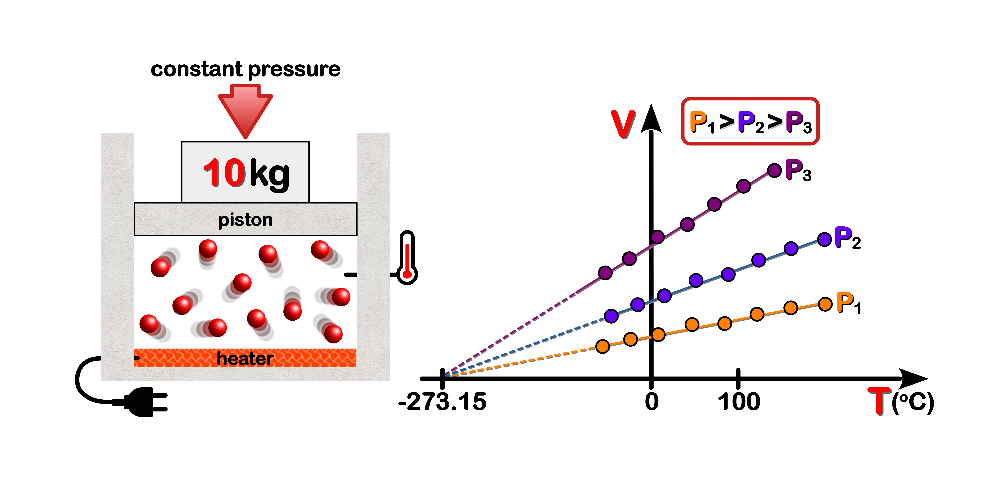
</figure>

**Figure 1: Absolute Zero.** **V**olume of a gas changes in response **T**emperature when **P**ressure is held constant. Shown above are the results for three different hypothetical experiments (colours) using three different **P** values. Note the **T** values are all well above the liquefaction point of the gas. The lines connecting the data points have been extrapolated backwards (dashed lines) to find the theoretical temperature value for **V** = 0. The current value of <u>absolute zero</u> is **-273.15 °C**.

<!---------------------------------------------->
<!---------------- FIG 1 - END ----------------->
<!---------------------------------------------->

In his memoirs **Clapeyron** simplified **Eq. 2** by letting **R** represent the following <u>ratio</u>:

`$$\tag{2.1} R = \frac{P_{o}V_{o}}{267 + T_{o}}$$`

Substituting **Eq. 2.1** into **Eq. 2** produces:

`$$\tag{2.2} PV = R(267 + T)$$`

**Rudolph Clausius** evaluated the <u>constancy</u> of **R** over a range of **P** and **T** values, and in 1864 produced a more simplified version of **Eq. 2.2** by using the <u>absolute</u> temperature scale (i.e. **Kelvin**) instead of the **Celsius** scale (**Eq. 2.3**).**[21](#ref-clausius_mechanical_1867),[22](#ref-jensen_universal_2003)**

`$$\tag{2.3} PV = RT$$`

Should the amount of gas exceed one weight-unit (**n** \> 1 mole) then in accordance with **Avogadro’s Law** the gas equation takes the following form:

`$$\tag{2.4} PV = nRT$$`

> **Ideal Gas Law:** Standard units for Pressure and Volume are atmospheres (atm) and litres (L). The modern day value of R (universal gas constant) is 8.314 J⋅K-1⋅mol-1. Temperature values are in Kelvin (K). The amount (n) of gas is in moles (mol) where 1 mol is ~6.022 × 1023 elemental particles (i.e. atoms or molecules).

    One of the important features (and limitations) of an **ideal gas** is that it possesses no P**otential** E**nergy** (PE = **m**⋅**g**⋅**h**), owing to the assumed lack of inter-molecular forces of attraction (i.e. **g**ravity). Hence the <u>internal energy</u> of a gas molecule must be due to its *translational* <u>motion</u> (KE). This revelation, coupled with the fact that **ideal gases** obey **Newton’s** Laws of motion, no doubt led to **August Karl Kronig** (1856) and **Rudolph Clausius** (1857) using classical **Newtonian** mechanics to quantify the KE of gas molecules.**[23](#ref-clausius_nature_1857),[24](#ref-kronig_grundzuge_1856)**

<!------------------------------------------------------------>
<!---------------- FIG 2 - Molecule in a Box ----------------->
<!------------------------------------------------------------>

<figure>
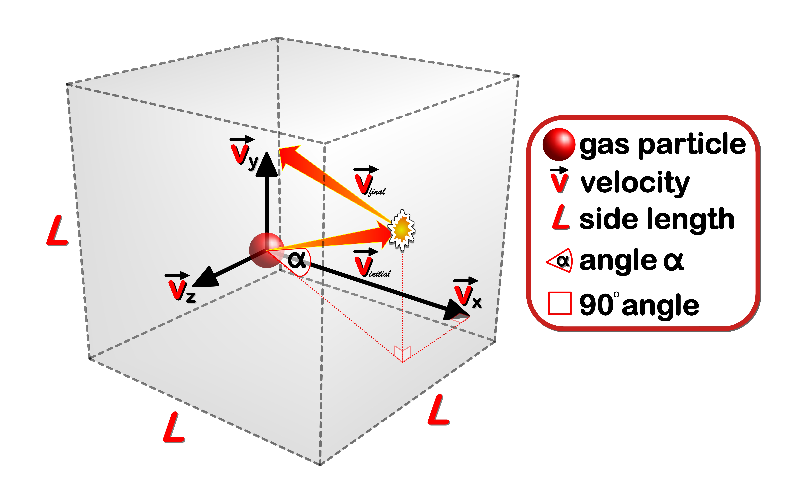
</figure>

**Figure 2: Elastic Collisions.** A cartoon representation of a gas molecule is shown colliding with the wall of a box-shaped container. Most collisions occur at angles (<b>$\measuredangle = \alpha$</b>) either less than or greater than 90° to the collision surface. Although the direction the molecule travels will change post-collision, the magnitude of its <b>$\vec{\text v}$</b>elocity will not due to the conservation of energy (KE) and momentum (<b>$\vec p$</b>). In the 3D co-ordinate system pictured above the **v**initial is equal to the sum of its component vectors, which can be calculated using the <b>Pythagorean theorem</b> (**v**gas2 = **v**x2 + **v**y2 + **v**z2).

<!---------------------------------------------->
<!---------------- FIG 2 - END ----------------->
<!---------------------------------------------->

As mentioned above (**Fig. 2**) ideal gases undergo <u>elastic collisions</u> that obey the *conservation* of <u>momentum</u> (<b>$\vec p$</b>) and <u>energy</u> (KE). The KMT assumes that ideal gases only interact with each other via collisions. For example, during a collision a gas molecule is acted upon by an apposing force (<b>$-\vec F_w$</b>), which causes the molecule to accelerate in the opposite direction (**Note:** **Newton’s** 3rd law of motion involves an “*action-reaction*” pair of forces). Since <u>velocities</u> and <u>forces</u> are <u>vector quantities</u> they have a <u>direction component</u> that dictates whether they are either <u>negative</u> or <u>positive</u> within a given <u>frame of reference</u>. Since the initial direction of the gas particle was assigned a positive value than the force it exerts on the wall will also be positive, while the opposing force exerted by the wall is negative. Mathematically this would be represented as:

`$$\tag{3} \vec F_{gas} = -\vec F_{wall} \quad \Rightarrow \quad \vec F_{gas} + \vec F_{wall} = 0$$`

Now the <b>$\vec F$</b> terms in **Eq. 3** can be expanded using the formula for three well known <b>$\vec{\text v}$</b>ector quantities: <b>$\vec F = m\vec a$</b>, <b>$\vec a = \frac{d \vec{\text v}}{dt}$</b> (**Note:** <b>$\frac{d \vec{\text v}}{dt}$</b> is simply the rate of change in <b>$\vec{\text v}$</b>, which is simply the <u>derivative</u> of <b>$\vec{\text v}$</b>) and <b>$\vec p = m \vec{\text v}$</b>. Clearly the acceleration (<b>$\vec a_g$</b>) term can be replaced by <b>$\frac {d \vec{\text v}_g}{dt}$</b> while the mass of the molecule (**mg**), a simple <u>constant</u> (i.e. always retains the same value, unlike <u>variables</u>), can be brought into the <u>derivative</u> (<b>$d$</b>) to generate the <b>$d\vec p_g$</b> term (i.e. change in <b>$\vec p$</b> of the gas molecule).

`$$\tag{3.1} \vec F_g = m_g \vec a_g = m_g \frac{d \vec v_g}{dt} = \frac{d (m_g \vec v_g)}{dt} = \frac{d \vec p_g}{dt}$$`

**Eq. 3.1** clearly shows that the <b>$\vec F$</b> is equal to the <u>rate of change</u> in the linear <u>momentum</u> (<b>$d\vec p_g$</b>) over time (<b>$dt$</b>). Also, by simply rearranging **Eq. 3.1** we can show that the <u>derivative</u> of <b>$\vec p_g$</b> (<b>$d\vec p_g$</b>) is equal to the product of <b>$\vec F_g$</b> and <b>$dt$</b> (**Eq. 3.2**).

`$$\tag{3.2} \vec F_g = \frac{d \vec p_g}{dt} \quad \Rightarrow \quad d\vec p_g = \vec F_g \cdot dt$$`

Because <u>integration</u> and <u>differentiation</u> are <u>inverse</u> operations we can simply “*integrate*” the “*derivative*” of a function to produce the original function. To clarify this important point, consider the following <u>differentiation</u> of a function with **t**ime as its independent variable (i.e. symbolized by <b>$f(t)$</b>):

`$$\tag{4} \frac{d}{dt}f(t) = f^{'}(t)$$`

**Eq. 4** can be rewritten to show the more commonly used “*differential*” notation, which is preferred because the **t**ime <u>variable</u> the integration is being performed against is clearly seen during the operation.

$$ \tag{4.1} df(t) = f^{'}(t) \cdot dt$$

Now if <u>integration</u> (symbolized by “<b>$\int$</b>*um*” or “*integral*” sign) is performed on the “*differential*” in **Eq. 4.1** (<b>$df(t)$</b>) then we will end up with the original function. This whole process can be formally symbolized as:

$$\tag{4.2} \int df(t) = \int f^{'}(t) \cdot dt  \quad \Rightarrow \quad  f(t) = \int f^{'}(t) \cdot dt $$

By applying the same “*integration by inspection*” process to **Eq. 3.2** we get:

`$$\tag{4.3} \int d\vec p_g = \int \vec F_g \cdot dt  \quad \Rightarrow \quad  \vec p_g = \int \vec F_g \cdot dt$$`

However, since the change in momentum of the gas molecule (<b>$d\vec p_g$</b>) occurs when the apposing wall force (-<b>$\vec F_w$</b>) acts on it over some <u>interval of time</u> (<b>$dt = t_{initial} \rightarrow t_{final}$</b>), we therefore need to find the <u>integral of the function between two set time points or limits</u> (<b>$t_{initial}$</b> and <b>$t_{final}$</b>). By doing so we are <u>defining</u> a specific integration operation (i.e. “<i>definite integral</i>”), which can be mathematically symbolized as:

`$$\tag{4.4} \int^{t_{final}}_{t_{initial}} d\vec p_g = \int^{t_{final}}_{t_{initial}} \vec F_g \cdot dt \\\\\\ \vec p_{g_{final}} - \vec p_{g_{initial}} = \int^{t_{final}}_{t_{initial}} \vec F_g \cdot dt = \text{Impulse}$$`

Clearly the I**mpulse** ($\vec I$) of the force is the <u>product</u> of the <u>force</u> (<b>$\vec F_w$</b>) acting on the gas molecule and the <u>time interval</u> (<b>$dt = t_{intial} \rightarrow t_{final}$</b>) over which it acts, and not a property of the gas molecule itself (<b>Eq. 4.4</b>). Making this distinction helps us to visualize how momentum is transferred to the gas molecule during the collision. Its as if the gas molecule is slamming into a perfect “<i>trampoline</i>”, which momentarily absorbs the molecule’s momentum and then quickly transfers it all back to the molecule. In essence the gas molecule “<i>bounces</i>” off the wall with the same speed, but in a different direction. This change in direction results in a change in the sign of the final magnitude of this <b>$\vec{\text v}$</b>ector quantity (<b>$\vec{\text v}_{initial} = -\vec{\text v}_{final}$</b>).

<!----------------------------------------------------------->
<!---------------- FIG 3 - IMPULSE-MOMENTUM ----------------->
<!----------------------------------------------------------->

<figure align="center">
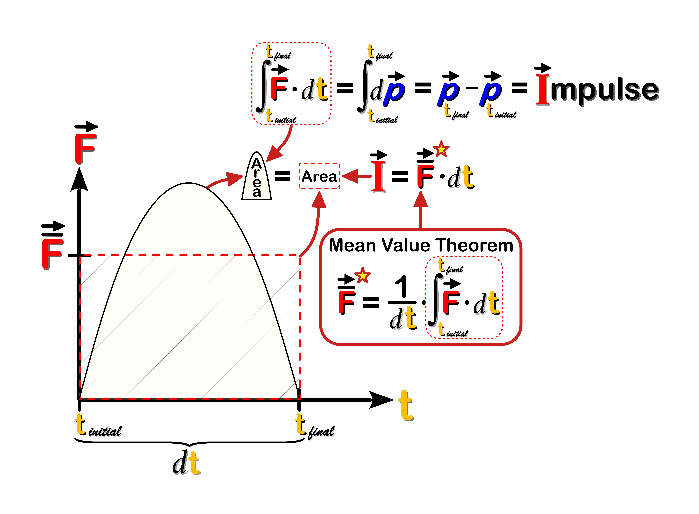
</figure>

**Figure 3: Impulse-Momentum Theorem.** The $\vec I$mpulse of a <b>force</b> acting on the gas particle is equal to the change in the momentum (<b>$d\vec p_g$</b>) of the particle (<b>Eq. 4.4</b>). When the <b>force</b> is plotted against time (<b>t</b>) it can be shown using <u>integral calculus</u> that the $\vec I$ of the force is equal to the <u>area</u> bounded by the x-axis and the <b>force</b> curve. The <u>limits</u> of this <u>definite integral</u> correspond to the collision <b>t</b>ime (<b>$dt = t_{final} - t_{initial}$</b>). It is also possible to calculate the $\vec I$ using the <u>average</u> wall <b>force</b>. According to the <b>Mean Value Theorem</b> in calculus the <u>average</u> wall <b>force</b> would be equal to the <b>t</b>ime <u>averaged</u> $\vec I$ value. Taken together the <u>average</u> wall <b>force</b> and collision <b>t</b>ime (<b>$dt$</b>) provide the dimensions of a <u>box</u> (hatched) whose area is equal to the $\vec I$.<b>[25](#ref-serway_physics_2004)</b>

<!---------------------------------------------->
<!---------------- FIG 3 - END ----------------->
<!---------------------------------------------->

$\vec I$mpulse is an important concept especially when studying collisions. For example, consider the three different <b>$\vec F$</b>orce curves illustrated in <b>Figure 4</b>. If the area under all three <b>$\vec F$</b> curves (i.e. $\vec I$) are the same, but each curve has varying collision times (<b>$dt_c > dt_b > dt_a$</b>), than the heights of the <b>$\vec F$</b> curves (<b>$\vec F$</b><b>$_{max}$</b>) will also change. Reducing the <b>$\vec F$</b> levels associated with a collision by increasing the collision time (<b>Note:</b> <b>$\vec F \propto \frac{1}{dt}$</b>) is in fact the basis of many vehicle safety features (e.g. air-bags, vehicle “<i>crumple-zones</i>”, crash barriers).

<!----------------------------------------------------------->
<!---------------- FIG 4 - IMPULSE - FORCE ----------------->
<!----------------------------------------------------------->

<figure align="center">
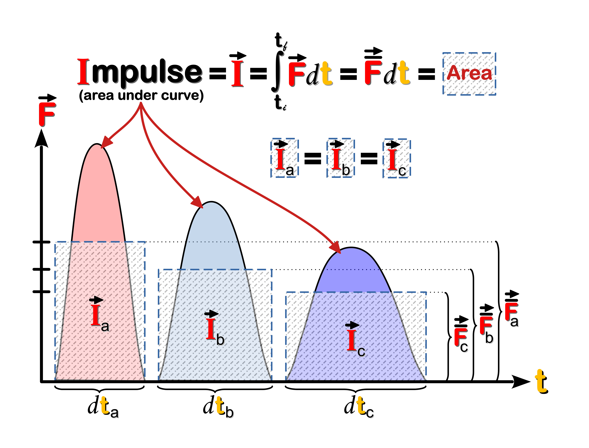
</figure>

**Figure 4: Impulse of a Force.** By increasing the collision time you are essentially <u>reducing</u> the amount of <b>$\vec F$</b> that would be applied to a molecule or car (in a crash) per unit time.

<!---------------------------------------------->
<!---------------- FIG 4 - END ----------------->
<!---------------------------------------------->

For the “<i>ideal</i>” gas molecule the overall change in its linear momentum along the x-axis (<b>$d\vec p_x$</b>) is equal to <b>$-2m\vec{\text v}_x$</b> (<b>$Eq. 5$</b>)

`$$\tag{5} d\vec p_x = \vec p_{x_{final}} - \vec p_{x_{initial}} = -m\vec v_{x_f} - m\vec v_{x_i} = -2m\vec v_x$$`

The reason for the negative value is because moving left in our chosen
frame of reference is negative for <b>$\vec{\text v}$</b>ector quantities such as <b>$\vec{\text v}$</b>elocity, momentum (<b>$\vec p$</b>) and <b>$\vec F$</b>orce. Also, <b>Kronig</b> simplified the problem by assuming that all of the molecules could be divided up equally between the three dimensions. Given the relationships between velocity and time (<b>$\vec{\text v}$</b>x = <b>$\frac{2L}{dt}$</b>) and the two apposing forces (<b>$\vec{F}$</b>gas = -<b>$\vec{F}$</b>wall) we can see in <b>Figure 5</b> how the collision force of a gas molecule is related to the square of its velocity and the physical dimensions of the gas container.

<!---------------------------------------------------------->
<!---------------- FIG 5 - COLLISION FORCE ----------------->
<!---------------------------------------------------------->

<figure align="center">
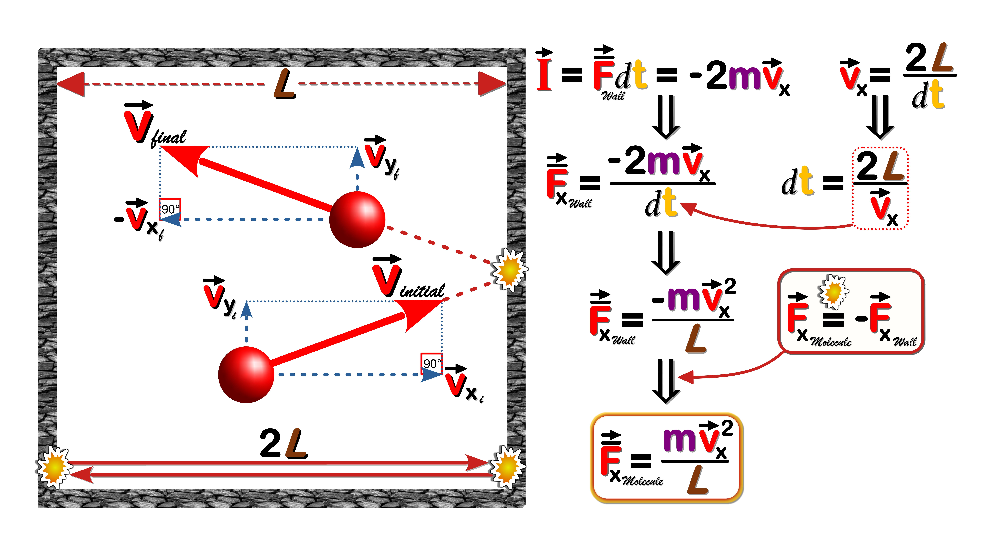
</figure>

<b><u>Figure 5: Collision Force of a Gas Molecule</u></b>.

<!---------------------------------------------->
<!---------------- FIG 5 - END ----------------->
<!---------------------------------------------->

Since the main tenet of the KMT is that gas <u>pressure</u> (<b>$P$</b>) results from the rapid collisions of many gas particles than the <u>average</u> pressure (<b>$\bar P$</b>) arising from these <i>kinetic</i> events in all three dimensions needs to be determined.<b>25[25](#ref-serway_physics_2004)</b> As shown below we can express the <u>average</u> collision force (<b>$\overline F$</b>x) generated by <b>$N$</b> gas molecules by taking the <u>average</u> of the <u>sum</u> (<b>$\sum$</b>) of all the individual <b>$\vec{\text v}$2</b> values (<b>Fig. 6</b>, <b>①</b>). It is important to note that this quantity is the <u>average</u> of the <u>square of the velocity</u> (<b>$\overline{\text v_x^2}$</b>) and <u>not</u> the square of the average velocity (<b>$\overline{\text v_x}^2$</b>). Its also assumed that there is no preferred direction of motion for the gas molecules such that their average speed is same in all three dimensions (<b>$Eq. 6$</b>).

`$$\tag{6} \overline {\text v^2} = \overline {\text v_x^2} + \overline {\text v_y^2} + \overline {\text v_z^2} \quad and \quad \overline {\text v_x^2} = \overline {\text v_y^2} = \overline {\text v_z^2} \quad \Rightarrow \quad \overline {\text v_x^2} = \frac{1}{3}\overline {\text v^2}$$`

Based on these assumptions its possible to seamlessly incorporate all <u>three dimensions</u> into the calculations (<b>Fig. 6</b>, <b>②</b>). Ultimately it can be shown that the average gas <b>$\overline P$</b>ressure exerted on the container wall is <u>directly</u> proportional to the average KE of the gas molecules (<b>$\overline P \propto \overline{KE}_g$</b>) and <u>inversely</u> proportional to the gas <b>$V$</b> (<b>$\overline P \propto \frac{1}{V}$</b>), the latter being no real surprise given the <b>Ideal Gas Law</b> (<b>Fig. 6</b>, <b>④</b>)

<!---------------------------------------------------------->
<!---------------- FIG 6 - KE GAS MOLECULE ----------------->
<!---------------------------------------------------------->

<figure align="center">
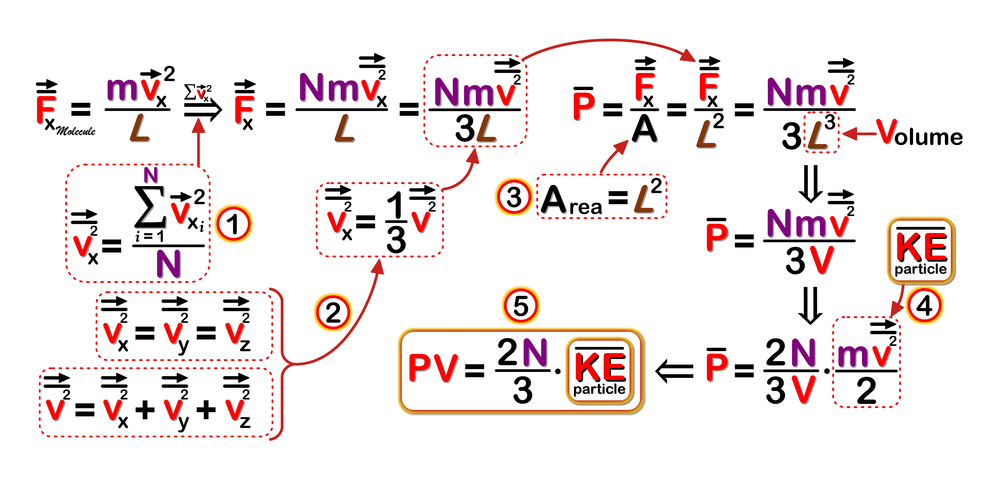
</figure>

<b>Figure 6: Kinetic Energy of a Gas Molecule</b>.

<!---------------------------------------------->
<!---------------- FIG 6 - END ----------------->
<!---------------------------------------------->

When the <b>P</b> and <b>V</b> terms are brought together on the same side of our final equation (<b>Fig. 6</b>, <b>⑤</b>) we can see that it equates quite nicely with the <b>Ideal Gas Law</b> (<b>Eq. 2.4</b>). By combining these two equations (<b>Eq. 7</b>) we can see how the <u>temperature</u> of a gas is the product of the <u>average</u> translational KE of the gas molecules.<b>[25](#ref-serway_physics_2004)</b>

`$$\tag{7.1} PV = nRT \quad \text{and} \quad PV = \frac{2N}{3} \overline{KE} \quad \Rightarrow \quad \frac{2N}{3} \overline{KE} = nRT$$`

rearranging the terms we get:

`$$\tag{7.2} \overline{KE} = \frac{3nRT}{2N} = \frac{3 k_B T}{2}$$`

and since <b>$\overline{KE} = \frac{1}{2} m \overline{\vec{\text v}^2}$</b> we get

`$$\tag{7.3} \frac{1}{2} m \overline {\vec{\text v}^2} = \frac{3nRT}{2N} \quad \Rightarrow \quad \overline {\vec{\text v}^2} = \frac{3nRT}{mN} \quad \Rightarrow \quad \vec{\text v}_{rms} = \sqrt {\frac{3 nRT}{mN}}$$`

We can rewrite the expression <b>$\frac{nR}{N}$</b> as either <b>$\frac{R}{N_A}$</b> (where <b>$N_A = \frac{N}{n}$</b> is known as <b><a class="one" href="https://www.nist.gov/si-redefinition/redefining-mole" target="_blank" title="Go to NIST">Avogadro’s constant</a></b>) or simply <b>$k_B$</b> (<b><a class="one" href="https://www.nist.gov/si-redefinition/kelvin-boltzmann-constant" target="_blank" title="Go to NIST">Boltzmann’s constant</a></b>, since <b>$k_B = \frac{R}{N_A}$</b>). This would give us the following simplified expression:

`$$\tag{8} \vec{\text v}_{rms} = \sqrt {\frac{3 k_B T}{m}}$$`

By isolating the <b>root mean square</b> <b>$\vec{\text v}$</b> term (<b>$\sqrt{\overline{\vec{\text v}^2}}$</b>) we can show mathematically (what we know intuitively) that lighter gas molecules move faster at any given <b>$T$</b>emperature. The direct mathematical relationship between translational speed and <b>$T$</b>emperature (<b>$\vec{\text v}_{rms} \propto \sqrt T$</b>) also means that a given gas molecule possesses more momentum at higher <b>$T$</b>emperatures (i.e. generates more <b>$F$</b>orce during a collision). Moreover, we can now use this formula (<b>$Eq. 8$</b>) to calculate the <u>average</u> speed of common atmospheric gases (<b>Table 2</b>).

<!--------------------------------------------->
<!--- TABLE 2 - ATMOSPHERIC MOLECULE SPEEDS --->
<!--------------------------------------------->
<table class="Table">
<thead>
<tr style="text-align:left">
<td colspan="3">
<b>TABLE 2. Atmospheric Gases: Molecule Velocities</b>
</td>
</tr>
</thead>
<thead>
<tr>
<th class="f16">

Gas

</th>
<th class="f16">

Volume

(%)

</th>
<th class="f16">

Mass

(gm/mole)

</th>
<th class="f16">

vrms

(m/sec)

</th>
</tr>
</thead>
<tbody>
<tr>
<td class="tmid">
H2
</td>
<td>
0.000055
</td>
<td class="tmid">
2
</td>
<td class="tmid">
1845.15
</td>
</tr>
<tr>
<td class="tmid">
<b>C</b>H4
</td>
<td>
0.00018
</td>
<td class="tmid">
16
</td>
<td class="tmid">
652.36
</td>
</tr>
<tr>
<td class="tmid">
N2
</td>
<td>
78.08
</td>
<td class="tmid">
28
</td>
<td class="tmid">
493.14
</td>
</tr>
<tr>
<td class="tmid">
O2
</td>
<td>
20.94
</td>
<td class="tmid">
32
</td>
<td class="tmid">
461.29
</td>
</tr>
<tr>
<td class="tmid">
Ar
</td>
<td>
0.934
</td>
<td class="tmid">
39.95
</td>
<td class="tmid">
413.11
</td>
</tr>
<tr>
<td class="tmid">
<b>C</b>O2
</td>
<td>
0.041
</td>
<td class="tmid">
44
</td>
<td class="tmid">
393.39
</td>
</tr>
</tbody>
</table>
<!--------------------------------------------->
<!--------------- TABLE 2 - END --------------->
<!--------------------------------------------->

  LOSCHMIDT, CLAUSIUS, MAXWELL & BOLTZMANN  **:** Besides calculating the average speed of a gas molecule the KMT allowed scientists to estimate the actual size of a gas molecule. This achievement was made possible by the German scientist **Joseph Loschmidt** (1865) who combined **Rudolph Clausius** (1858) formula for the **<a class="one" href="http://hyperphysics.phy-astr.gsu.edu/hbase/hframe.html" target="_blank" title="Go to HyperPhysics">mean free path</a>** (**Fig. 7**) of a gas molecule with the volume of the molecule itself.**[26](#ref-loschmidt_zur_1865)–[28](#ref-bader_joseph_2001)**

<!----------------------------------------------------------->
<!--------------- FIG 7 - MFP IDEAL MOLECULE ---------------->
<!----------------------------------------------------------->

<figure align="center">

</figure>

**Figure 7: Mean Free Path of Ideal Gas Molecule.** **(A)** A two-dimensional view of an idealized spherical molecule (red) is shown moving <i>randomly</i> through a volume of gas. It collides with some molecules (<b>black</b>) while avoiding others (gray). The resulting path the molecule “<i>sweeps out</i>” is clearly related to its size (diameter) as well as the density of the surrounding gas molecules.  
<b>(B)</b> An idealized spherical molecule, with d as its diameter, will collide with another molecule provided their paths come close enough (i.e. <b>distance</b> \< d). This critical distance d defines the radius of a circle whose <b>area</b> (<b>π</b>d2) represents the <i>effective collision area</i> (“<i>collision space</i>”) of the moving molecule. Over a specified time interval (<b>Δ</b>t) the molecule will travel a mean distance equal to <b>$\bar{\text v} \Delta$</b>t, where <b>$\bar{\text v}$</b> represents the <u>average</u> velocity of the molecule. As shown on the right the resulting Volume of space “<i>swept out</i>” by the moving molecule is cylindrical in shape, with a <u>cross-sectional area</u> of <b>π</b>d2 and a length of <b>$\bar{\text v} \Delta$</b>t. The product of these two parameters gives the Volume of the cylinder (“<i>collision space</i>”).  
<b>(C)</b> To calculate the <b>mean free path</b> ($L$) of a moving molecule the number of collisions it makes within the Volume of interest (“<i>collision space</i>”) needs to be calculated. <b>Clausius</b> (1858) simplified the problem by considering a single moving molecule, with a <u>diameter</u> of 2d, colliding with stationary point-like molecules that lie within its path. If n represents the number of point-like molecules per unit volume, then the number of collisions is equal to n⋅<b>π</b>d2⋅<b>$\bar{\text v}$</b><b>Δ</b>t. Since $L$ is equal to the <u>average</u> distance (<b>$\bar{\text v} \Delta$</b>t) travelled per collision, then it would be equal to 1/<b>$\alpha$</b> (i.e. <b>$\alpha$</b> = n<b>$\cdot \pi$</b>d2). However, since all the molecules are <u>moving</u> within the “<i>collision space</i>” a velocity correction is needed. <b>Clausius</b> introduced a <b>$\frac{4}{3}$</b> velocity correction,<b>[29](#ref-clausius_dynamical_1860)</b> while <b>Maxwell</b> (1860) calculated a <b>$\sqrt{2}$</b> velocity correction.<b>[30](#ref-maxwell_v_1860)</b> <b>Maxwell</b>, by working within a single moving frame of reference correctly calculated the velocity of the molecule <u>relative</u> to other moving molecules (i.e. vrel = <b>$\sqrt{2} \cdot \bar{\text v}$</b>), as well as the average <u>relative</u> distance between two moving particles.

<!---------------------------------------------->
<!---------------- FIG 7 - END ----------------->
<!---------------------------------------------->

**Clausius’** equation for the **mean free path** (<i>L</i>) of a gas molecule is a measure of the <u>average</u> distance a molecule travels between collisions and is therefore related to the probability that a gas particle will collide with another particle. His use of <u>statistical</u> concepts to bring some kind of “*order*” to these <u>random</u> molecular collisions was an important step, one that would be greatly expanded upon by two of the most prominent scientists of that era namely **Ludwig Boltzmann** (1844-1906) and **James Clerk Maxwell** (1831-1879). Nevertheless, **Loschmidt** cleverly rearranged **Clausius’** equation (<b>Eq. 9</b>) to show the relationship between the molecular volumes of a gas in accordance with **Avogadro’s** hypothesis.**[31](#ref-clausius_mean_1859)**

> “*All gaseous phases contain equal numbers of molecules in a <u>unit volume</u> at equal temperature and pressures. Because `\(n\)` is the number of molecules, `\(\frac{1}{n}\)` is the <u>portion</u> of the unit volume occupied by <u>each molecule</u> if it is assumed that they are equally distributed. We call this quantity the **molecular volume of the gas**. On the right side of the equation, we have the quantity `\(L(\frac{\pi d^2}{4})\)`. This describes the <u>volume of a cylinder</u> whose <u>base</u> is the <u>circular cross-section</u>* \[of the <u>molecule</u>\] *and whose <u>height</u> is the mean free path ($L$) of the molecule. It represents therefore the <u>total volume</u> that the <u>molecule successively occupies</u> as it moves through an average path. We call it the **molecular path volume**.*”<b>[26](#ref-loschmidt_zur_1865),[27](#ref-porterfield_loschmidt_1995)</b>

`$$\tag{9} \frac{1}{n} = \frac{4 L \pi d^2}{3} \quad \Rightarrow \quad \frac{1}{n} = \frac{16}{3} \left(L \cdot \frac{\pi d^2}{4} \right)$$`

The above equation shows that the average <b>molecular volume of a gas molecule</b> (<b>$\frac{1}{n}$</b>) is <b>$\frac{16}{3}$</b> times greater than its <u>average</u> <b>molecular path volume</b> ($L$<b>$\pi d^2 / 4$</b>). The latter referring to the cylinder-like volume of space that a typical gas molecule occupies along an average path length. The seemingly odd re-arrangement of the formula above (<b>$\pi \frac{d^2}{4}$</b>) is more clearly explained below in <b>Figure 8</b>.

<!----------------------------------------------->
<!-------- FIG 8 - MOLECULAR PATH VOLUME -------->
<!----------------------------------------------->

<figure align="center">
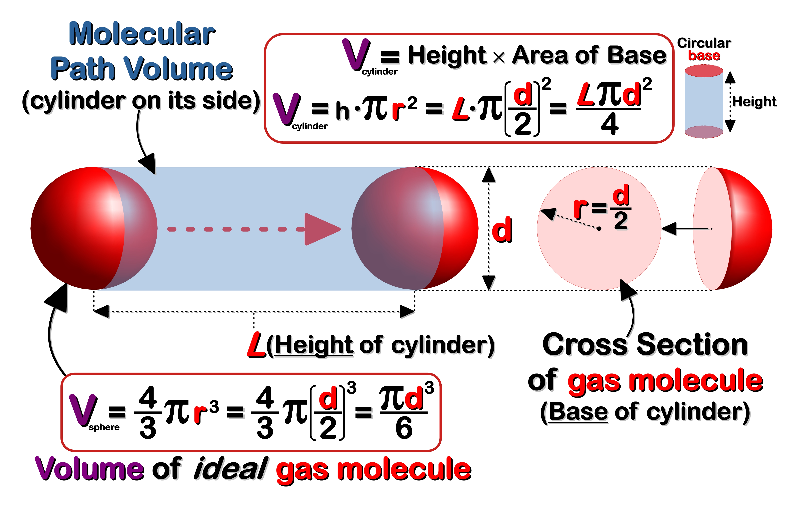
</figure>

**Figure 8: Molecular Path Volume.**  A moving spherical molecule “*sweeps*” out a volume of space that is cylindrical in shape. The corresponding dimensions of this cylinder include the cross-sectional area (<b>$\frac{\pi d^2}{4}$</b> = <b>base</b>) and <b>mean free path</b> ($L$ = <b>height</b> or distance in this case) of the molecule. The total <b>volume</b> of space (Vcylinder = base X height) the molecule occupies over an average distance ($L$) is termed the <b>Molecular Path Volume</b>. By comparison, the volume of a single spherical molecule can be calculated using the standard formula for the volume of a sphere.

<!---------------------------------------------->
<!---------------- FIG 8 - END ----------------->
<!---------------------------------------------->

 

**Loschmidt** then assumed that the **V** of the gas molecules when not in motion (i.e. tightly packed spheres) would be equivalent to the volume of its <u>liquefied</u> state (<b>Vliq</b>). Thus the total volume of all the gas molecules in such a condensed state would be equal to the volume of <b>n</b> spherical shaped molecules (<b>Eq. 10.1</b>, <b>Fig. 8</b>). In this way <b>Loschmidt</b> could compare the volumes of the molecules when they are in a liquefied state (<b>Vliq</b>, <b>Eq. 10.1</b>) versus their gaseous state (<b>Vgas</b>, <b>Eq. 10.2</b>). The <u>ratio</u> of these two volumes (<b>$\frac{V_{liq}}{V_{gas}}$</b> = <b>$\epsilon$</b>) he termed the <b>gas condensation coefficient</b> (<b>Eq. 10.3</b>). By simplifying and rearranging the terms of this new expression he came up with a formula for the diameter of a gas molecule (<b>Eq. 10.4</b>).

`$$\tag{10.1} \text{n molecules } V_{liq} = n \cdot \frac{4}{3}\pi r^3 = n \cdot \frac{\pi d^3}{6}$$`

`$$\tag{10.2} \text{1 molecule } V_{gas}  = \frac{1}{n} = \frac{4 L \pi d^2}{3} \quad \Rightarrow \quad \text{n molecules } V_{gas} = \frac{n 4 L \pi d^2}{3}$$`

`$$\tag{10.3} \epsilon = \frac{V_{liq}}{V_{gas}} = \frac{\frac{n \pi d^3}{6}}{\frac{n 4 L \pi d^2}{3}} = \frac{3 n \pi d^3}{24 n L \pi d^2} = \frac{d}{8 L}$$`

`$$\tag{10.4} d = 8 \epsilon L$$`

**Loschmidt** tested his mathematical model using **air** as his experimental gas, since it was the only gas with a known **mean free path** (<i>L</i>) value. After determining the **condensation coefficient** (<b>$\epsilon$</b>) of **air** (a difficult task in its own right) he finally produced an estimate of 0.969 nanometers (**nm**) for the diameter of a “*typical*” **air** molecule (<b>Eq. 10.5</b>). Compared to modern day values of the diameter of a gas molecule (~0.3 <b>nm</b>) **Loschmidt’s** estimate is really quite impressive.<b>[27](#ref-porterfield_loschmidt_1995)</b>

`$$\tag{10.5} d = 8 \epsilon L = \text{8} \cdot (\text{0.000866}) \cdot (\text{0.000140 mm}) = \text{0.969} \cdot \text{10}^{-9} \text{ m}$$`

 

  MAXWELL-BOLTZMANN DISTRIBUTION  **:** As mentioned above both **Ludwig Boltzmann** (1844-1906) and **James Clerk Maxwell** (1831-1879) were two of the giants of physicists during the 19th century, who along with **Josiah Willard Gibbs** (1839-1903) founded the field of **statistical mechanics**. What was so remarkable about this new field of physics was its ability to describe and quantify the <u>macroscopic</u> properties of large systems (i.e. \>6 × 1023 particles) in terms of their basic <u>microscopic</u> components (i.e. atoms). This connection between the “*large*” (i.e. visible) and the “*small*” (i.e. unseen) using a new statistical approach was a great advance for the KMT. Besides connecting the microscopic and macroscopic “*worlds*” of atoms it provided a novel way of looking at gases. For example, it was now possible to look at continuous variables such as speed in terms of <u>discrete</u> states (e.g. counts, frequencies, probabilities). The central feature of **statistical mechanics** that made it all possible was the introduction of the **Boltzmann Factor** (**Eq. 11**). According to the **<a class="one" href="https://www.thermopedia.com/content/593/" target="_blank" title="Go to Thermopedia">Boltzmann Distribution Law</a>** the <u>frequency</u> or <u>probability</u> of a molecule with a certain **energy** state (**Ei**) decreases with increasing **energy** in proportion to the **Boltzmann factor** (**Note:** kB is the **Boltzmann’s constant**, T is temperature in Kelvin, and <b><i>e</i></b> is **Euler’s constant**).

`$$\tag{11} e^{-E_i/k_B T}$$`

This factor figures prominently in the **Maxwell-Boltzmann Distribution** (**Eq. 12**), which calculates the **frequency** or **probability** of a certain molecular speed (i.e. KE) within a given speed interval at a constant temperature.

`$$\tag{12} f(\vec v) = 4\pi v^2 \cdot \left( \sqrt{\frac{m}{2\pi k_B T}} \right)^3 \cdot e^{\frac{-mv^2}{2k_B T}}$$`

Since the equations are based on the KMT there are certain assumptions associated with it. For example, like KMT “*idealized*” gas particles are <u>independent</u> of each other and only interact when they undergo <u>elastic collisions</u>. For a closed system (e.g. gas container) at a constant temperature it is also assumed that both the number of particles (N) and the total amount of energy (E) is constant. This latter assumption is of course in keeping with classical **Newtonian** mechanics (i.e. conservation of mass and energy). In addition, **Boltzmann** introduced the idea that the total number of <u>microscopic states</u> (i.e. **micro-states**) for these large systems of gas particles are always optimized in a thermodynamic sense (i.e. **entropy**). This latter point pertains to the number of possible “*configurations*” the gas particles can assume given all of the available energy levels and velocities they can occupy or attain (i.e. permutations). **Entropy** for **Boltzmann** was a measure of the <u>probability</u> of a certain <u>macroscopic state</u> (i.e. **macro-state**) like temperature or pressure. By comparison each <u>microscopic state</u> (i.e. **micro-state**) has a very small but equal probability, such as the speed or position of a gas particle. And since a single **macro-state** is a <u>collection</u> of many **micro-states** (seemingly too many to count) all of these probabilities will add up to produce a certain **macro-state** (e.g. stable uniform temperature). To reverse this process, such that a stable **macro-state** rapidly evolves into only one of the billions of possible **micro-states** that make up the current **macro-state** would be highly improbable! It would be analogous to rolling three large dice and having them all turn up the same number. However, there are a billion sides to each die, each one corresponding to one of a billion possible numbered **micro-states**. Although there is an <u>equal probability</u> that any one side (i.e. **micro-states**) will turn up after the roll, it would be highly improbable that all three die will produce the same outcome (i.e. same numbered **micro-state**).  
    One way of deriving the **Maxwell-Boltzmann Distribution** (**Eq. 12**) is to use the **<a class="one" href="https://www.khanacademy.org/math/multivariable-calculus" target="_blank" title="Go to Khan Academy">Lagrange Multiplier</a>** technique, since it is designed to solve constrained optimization problems.**[32](#ref-vadlamani_physics_2020)** For example, businesses often use this mathematical method to optimize revenue given certain cost constraints. In a similar vein **Lagrange Multipliers** can be used to optimize the number of configurations or **micro-states** of a large system of particles given certain constraints (i.e. energy and particle number). Another less complicated method of deriving this molecular speed distribution is to use the **<a class="one" href="https://www.tec-science.com/category/mechanics/gases-and-liquids/" target="_blank" title="Go to Tec Science">Barometric Pressure</a>** (**BP**) formula. This latter approach is perhaps more preferable given its direct connection with the **Ideal Gas Law**. The **BP** formula describes how <u>pressure</u> (P) and <u>density</u> (ρ) of an isothermal column of air changes with height (i.e. small change in height) within a gravitational field (**Fig. 9**). Our familiarity with gravity makes it relatively easy to picture how the density of gas particles and the pressure they exert decreases with increasing height given the constant downward pull of Earth’s gravitation field (**Fig. 9B**). The only way a gas particle could counter-act the force of gravity would be if some energetic event, like a collision, catapulted it upwards (<b>z</b>-axis) at great speed (vz). Nevertheless, the **Boltzmann Factor** is front and centre in the derivation of the molecular speed distribution since the **BP** formula is itself a specialized form of the **Boltzmann Factor** (**Fig. 9A**).

<!--------------------------------------------------->
<!--- FIG 9 - BOLTZMANN FACTOR BAROMETRIC FORMULA --->
<!--------------------------------------------------->

<figure align="center">

</figure>

**Figure 9: Boltzmann’s Factor: Barometric Formula.** <b>(A)</b> Using the relationships of several known constants <u>gas density</u> (ρ) can be incorporated into the <b>Ideal Gas Law</b> (<b>①</b>). The variable ρ is simply the mass of the gas (<b>m</b>gas) divided by its volume (Vgas) and it appears when Vgas is moved to the right side of the equation and <b>R</b> (<b>Real Gas Constant</b> = 8.314 J⋅K−1⋅mol−1) is replaced with kB (Boltzmann’s constant = 1.380649 × 10-23 m2⋅kg⋅sec-2⋅K-1). During the rearrangement of these terms N (i.e. total number of particles) is replaced with the quotient <b>m</b>gas divided by mparticle (mass of a single particle). The re-worked equation now shows the direct relationship between the pressure (P) and density (ρ) of a gas (<b>②</b>). Once this new expression for P is inserted into the <b>BP</b> formula (<b>③</b>) one can see that the ρ of a gas is not only a function of height (z) above a certain reference level (e.g. sea level), but also its P<b>otential</b> E<b>nergy</b> (PE = mg<b>h</b>, <b>④</b>). Since the KMT assumes that the total energy of a gas particle is purely <u>kinetic</u> in nature we can replace the PE term with the well known formula for K<b>inetic</b> E<b>nergy</b> (KE). The equation (<b>⑤</b>) now bears the <b>Boltzmann Factor</b>, with <b>Ei</b> (<b>Eq. 11</b>) being equal to KE. It now shows how gas density <u>decreases exponentially</u> with square of the molecular speed. This means that fast moving gas molecules that reach these lofty heights, are relatively few in number.  
<b>(B)</b> A graph of the <b>Barometric Formula</b> shows the exponential decrease in P and ρ with increasing height. The red spheres, which symbolize gas molecules, illustrates the relationships between these variables. Also, like real atmospheric gases, the <b>Boltzmann Factor</b> correctly models the non-uniform or uneven nature of the distributions of gas molecules with increasing elevation. Only gas particles travelling with high vertical velocities (<b>vz</b>) could reach these great heights.

<!---------------------------------------------->
<!---------------- FIG 9 - END ----------------->
<!---------------------------------------------->

One of the biggest advantages of using the **BP** formula to derive the **Maxwell-Boltzmann Distribution** is the “*built-in*” **Boltzmann Factor**. This along with the statistical nature of molecular collisions (i.e. Frequency <b>∼</b> Probability) and some well known formula (i.e. **Pythagorean theorem**) greatly simplifies the process (e.g. <b>Eq. 13</b>).

`$$\tag{13} \vec v = \sqrt{\vec v_x^2 + \vec v_y^2 + \vec v_z^2} \implies \vec v^2 = \vec v_x^2 + \vec v_y^2 + \vec v_z^2$$`

`$$\tag{13.1} e^{-m \vec v_x^2 /k_BT} \cdot e^{-m \vec v_y^2 /k_BT} \cdot e^{-m \vec v_z^2 /k_BT} = e^{\frac{-m}{k_BT}(\vec v_x^2 + \vec v_y^2 + \vec v_z^2)}  = e^{-m \vec v^2 /k_BT}$$`

 

<!----------------------------------------------->
<!--- FIG 10 - MAXWELL-BOLTZMANN DISTRIBUTION --->
<!----------------------------------------------->

<figure align="center">
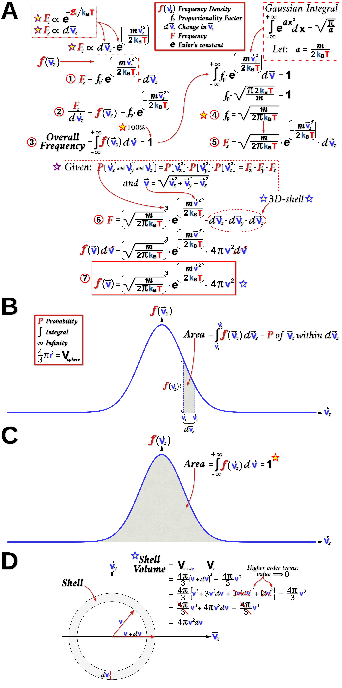
</figure>

**Figure 10: Maxwell-Boltzmann Distribution of Molecular Speeds: Barometric Formula.** <b>(A)</b> As stated at the top of this figure the number of molecules (i.e. frequency, or Fz) moving upwards (<b>z</b>-axis) at high speeds (vz) is <u>proportional</u> (<b>∝</b>) to its energy state (<b>Boltzmann Factor</b>), as well as the size of the speed interval (dvz) used to make the frequency measurement. As a result of these relationships both the ρ and P of atmospheric gases decreases exponentially with height (<b>Fig. 9</b>). The probabilistic nature of these random independent collisions (i.e. Freq <b>∼</b> Prob) certainly helps to explain why few gas molecules undergo enough “<i>productive</i>” collisions (i.e. increase vz) to reach the upper atmosphere. To transform these correlations into a meaningful equation (<b>①</b>) requires the introduction of a <b>Proportionality Factor</b> (<b>fp</b>). The resulting product of <b>fp</b> and the <b>Boltzmann Factor</b> is known as the <b>Frequency</b> or <b>Probability Density function</b> (f(vz)). After rearranging this initial equation (<b>②</b>) one can see that the density function f(vz) is equal to Fz divided by dvz. When f(vz) is plotted (<b>B</b>) it would take the shape of a typical “<i>Gaussian</i>” or “<i>Bell-shape</i>” curve. However, at this point there are still two key pieces of the distribution function that need to be solved, namely <b>fp</b> and dvz. Solving for <b>fp</b> requires a simple but important <b>normalization</b> step (<b>③</b>). This is based on the fact that the sum of the <i>P</i> for all possible values of dvz (i.e. -<b>∞</b> ⟷ +<b>∞</b>) must add up to 100% (i.e. 100/100 = 1). Mathematically this is done by finding the area under the f(vz) curve using integral calculus (<b>C</b>). The main step in this integration process is the use of the famous <b><a class="one" href="https://www.khanacademy.org/math/multivariable-calculus/integrating-multivariable-functions/double-integrals-a/a/double-integrals-in-polar-coordinates" target="_blank" title="Go to Khan Academy">Gaussian Integral</a></b> to complete the integration of the <b>Boltzmann factor</b> (<b>④</b>, <b>⑤</b>). The final few steps involve expanding the scope of the calculations to include all three dimensions. As noted above the independent nature of these events allows the multiplication of these three frequencies: Fx <b>×</b> Fy <b>×</b> Fz, which produces a complete three-dimensional f(v) function (<b>⑥</b>). Also, the fact that v and its individual spatial components are mathematically related via the <b>Pythagorean theorem</b> greatly simplifies the math. Lastly, examining the three-dimensional shape of the speed interval (dvx <b>×</b> dvy <b>×</b> dvz) reveals that it forms a spherical shell. Fortunately the formula for the volume of a spherical shell is well known (<b>D</b>). The final density function (<b>⑦</b>) describes the Frequency of a certain molecular v within a defined region of space (dv) at a given temperature.

<!--------------------------------------------->
<!--------------- FIG 10 - END ---------------->
<!--------------------------------------------->

Another way of deriving the **Maxwell-Boltzmann Distribution** function (**Eq. 12**) is to use the **<a class="one" href="https://www.khanacademy.org/math/multivariable-calculus" target="_blank" title="Go to Khan Academy">Lagrange Multiplier</a>** technique. As shown below (**Figures 11-13**) it is important to start this process by first defining the objective function to be optimized, as well as the constraints of the optimization process (i.e. conservation of mass and energy). The latter specifically refers to the total number of gas particles within the box-like cylinder (i.e. constant volume of gas), and the fixed amount of energy all the molecules have at a given temperature.

<!------------------------------------------>
<!------ FIG 11 - LAGRANGE MULTIPLIER ------>
<!------------------------------------------>

<figure align="center">
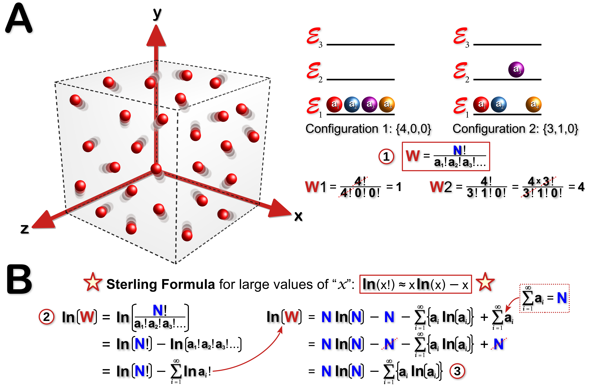
</figure>

**Figure 11: Lagrange Multiplier Technique: Permutations.** <b>(A)</b> A gas container (symbolized by the box) holds a total of N idealized gas particles. According to the KMT these freely moving particles only interact with one another during collisions. The total <b>energy</b> (E) of the system can be distributed among the N particles in a number of ways (i.e. “<i>configurations</i>”). These microscopic “<i>configurations</i>”, or “<i>micro-states</i>” (W) for <b>a</b> particles occupying the <b>i</b>th energy state (<b>a</b>i) can be calculated using a well known <u>permutation</u> formula (<b>①</b>), where N<b>!</b> and <b>a!</b> are the products of all positive integers less than or equal to N or <b>a</b>, respectively. Two examples (top-right) are offered to help explain these concepts. In the first example 4 gas molecules occupy the lowest possible energy state (ℇ<i>i</i>). In this hypothetical scenario there is only <u>one</u> possible “<i>configuration</i>” or <b><i>micro-state</i></b>. However, in the second example one of the four molecules occupies the next highest energy state. Since the four molecules are indistinguishable, any one of them could occupy this higher energy state and thus produce a <u>maximum</u> of 4 possible <b><i>micro-states</i></b>. However, it is important to note that not all <b><i>micro-states</i></b> are equally probable. This latter point is perhaps best explained by considering a system of 4 coins. Like molecular collisions, each coin flip can be considered a random independent event. When each of these 4 coins are flipped they produce one of two <u>measurable</u> outcomes, namely heads (<b>H</b>) or tails (<b>T</b>). For this 4 coin system there are a total of 5 <u>measurable</u> <b><i>macro-states</i></b>: (i) 4<b>H</b>, (ii) 3<b>H</b>1<b>T</b>, (iii) 2<b>H</b>2<b>T</b>, (iv) 1<b>H</b>3<b>T</b> and (v) 4<b>T</b>. Using the permutation formula shows that the number of possible <b><i>micro-states</i></b> for each of the 5 <b><i>macro-states</i></b> are: (i) W = 4<b>!</b>/(4<b>!</b>) = 1; (ii) W = 4<b>!</b>/(3<b>!</b> × 1<b>!</b>) = 4; (iii) W = 4<b>!</b>/(2<b>!</b> × 2<b>!</b>) = 6; (iv) W = 4<b>!</b>/(1<b>!</b> × 3<b>!</b>) = 4; and (v) W = 4<b>!</b>/(4<b>!</b>) = 1. The most likely result from flipping 4 coins would be 2<b>H</b>2<b>T</b> (6/16 = 0.375 or 37.5%), while the least probable result would be either 4<b>H</b> or 4<b>T</b> (both 1/16 = 0.0625 or 6.25%).  
<b>(B)</b> The <b>Stirling Formula</b> is a powerful method for dealing with incredibly large numbers, such as a <u>mole</u> (i.e. 6.023 × 1023) of gas molecules. Even a deck of 52 playing cards can generate an enormous number of permutations. For example, consider the number of possible ways 52 cards can be ordered in a deck. There are 52 choices for the first card, 51 choices for the second card, 50 choices for the third card and so on (i.e. 52! = 52 × 51 × 50 …). In total there would be \>8 × 1067 possible ways of ordering or “<i>configuring</i>” the 52 cards. Using the <b>Stirling Formula</b> and some basic mathematical rules about logarithms a general formula for the number of possible energy <b><i>micro-state</i></b> for a large system of gas particles can be generated (<b>②</b>, <b>③</b>).

<!--------------------------------------->
<!------------ FIG 11 - END ------------->
<!--------------------------------------->

With the system constraints and objective function well defined (**Fig. 11**) it now becomes a matter of combining these equations in the form of a L**agrange Function** (**Fig. 12**). Like most mathematical problems there is much to be gained by graphing it (**Fig. 12A**). Although a 3-D graph of the “*variable-space*” is preferable, plotting the usual two-dimensions also provides a reasonable overview of the problem. For example, the <u>iso-contours</u> of the objective function pictures a mathematical “*landscape*” where the rise and fall of the function eventually converges on some local “*peak*” (i.e. local maximum) or “*valley*” (i.e. local minimum). Algorithms that converge on local or global *minima* and *maxima* are often very useful in solving real world problems (e.g. optimizing machine learning algorithms, or business profits), but seem less so when the problem is more abstract like the derivation of a mathematical formula for some “*invisible*” gas particles. In the case of the **Boltzmann Distribution** finding these <u>optimal points</u> (i.e. “*peaks*” and “*valleys*”) using the most apt tool (i.e. calculus) can at the very least help define the “*space*” of the distribution. To put it less abstractly, consider finding these critical points like finding all of the edge-pieces of a complex puzzle. Its a great way of defining the boundary of a problem that seems from the outset as too enormous and too intangible. Nevertheless, the logic and elegance of the L**agrange Multiplier** technique is on full display in deriving the **Boltzmann Distribution** (**Fig. 11-13**).

<!---------------------------------------------->
<!--- FIG 12 - LAGRANEG MULTIPLIER TECHNIQUE --->
<!---------------------------------------------->

<figure align="center">

</figure>

**Figure 12: Lagrange Multiplier Technique: Gradient, Constraints and Boltzmann’s Distribution.** <b>(A</b>, <b>B)</b> The L<b>agrange Multiplier</b> technique (<b>Note:</b> see <b><a class="one" href="https://www.khanacademy.org/math/multivariable-calculus" target="_blank" title="Go to Khan Academy">Multivariable Calculus</a></b>) is a method often used to <u>optimize</u> a multi-variable function (e.g. <b>f(x,y)</b>) that is subject to certain <u>constraints</u> (e.g. <b>g(x,y)</b> = 0).<b>[32](#ref-vadlamani_physics_2020)</b> Since both of these functions share the same multi-dimensional “<i>space</i>” there are often multiple values that satisfy both equations (i.e. shared points). Of particular interest is an <u>iso-contour</u> of a multi-variable function that is both <b><a class="one" href="https://www.khanacademy.org/math/differential-calculus/dc-diff-intro/dc-diff-calc-intro/v/derivative-as-a-concept" target="_blank" title="Go to Khan Academy">tangential</a></b> to the constraint function (i.e. touch at one point) and has a <b>gradient</b> (<b>∇</b>) or <u>slope</u> that is equal to <u>zero</u> at this single point of contact (x\*). This unique point satisfies the key condition of optimizing (e.g. maximum) the objective function locally or globally given certain constraints. Another notable property of these <u>optimal points</u> is that <b>∇</b>f(x\*) is proportional to <b>∇</b>g(x\*), with the constant of proportionality referred to as the L<b>agrange multiplier</b> (i.e. <b>∇</b>f(x\*) = λx\*×<b>∇</b>g(x\*). All of the above mathematical relationships can be combined to construct a L<b>agrange</b> function: L(<b>a</b>i, ℇ<i>i</i>, λ1, λ2). The left side of the equation simply lists all of the variables and multipliers, while the right side of the equation combines the objective function (<b>①</b>) with the specific constraint functions (<b>②</b>, <b>③</b>).  
<b>(C)</b> The <b>gradient</b> of the L<b>agrange</b> function at its <u>optimal point</u> (e.g. maximum of the function) is equal to zero (i.e. <b>∇</b>L(x\*) = <b>∇</b>f(x\*) - λ1×<b>∇</b>g1(x\*) - λ2×<b>∇</b>g2(x\*) = 0). Since the <b>gradient</b> pertains to the partial derivatives of the function its a simple matter of using calculus to optimize the function. To simplify the problem even more we can initially focus on just one gas molecule (<b>a</b>1) within the system. Since the gas particles are independent of each other this greatly simplifies the calculus (i.e. only <b>a</b>1 is relevant, meaning <b>∂ai ≠ 1</b>/<b>∂a1</b> = 0, <b>Note:</b> see <b><a class="one" href="https://www.khanacademy.org/math/differential-calculus" target="_blank" title="Go to Khan Academy">Calculus review</a></b>). The initial calculus steps shows that <b>∂</b><b>ln</b>(W)/<b>∂a1</b> = λ1 + λ2ℇ<i>i</i> (<b>④</b>). 
<b>(D)</b> The next step is to complete the partial differentiation of <b>ln</b>(W) with respect to <b>a1</b> (i.e. left side of equation <b>④</b>) with the help of equation <b>③</b> from <b>Fig. 11B</b>. Applying some basic calculus procedures (i.e. chain rule) the partial differentiation of the objective function yields a relatively simple natural logarithmic quotient: <b>∂</b><b>ln</b>(W)/<b>∂a1</b> = -<b>ln</b>(<b>a1</b>/N) (<b>⑤</b>).  
<b>(E)</b>. Finally equations <b>④</b> and <b>⑤</b> are combined, which shows that the number of gas particles occupying a specific energy state (i.e. <b>micro-state</b>) decreases exponentially with increasing energy (<b>⑥</b>). This relationship is certainly reminiscent of the results shown in <b>Figures 9</b> and <b>10</b>. To extend this relationship to all possible energy <b>micro-states</b> a simple summation equation (<b>⑦</b>) is combined with equation <b>⑥</b>, which yields a value for the first L<b>agrange multiplier</b> (λ1) in terms of λ2 (<b>⑧</b>). Plugging this value into equation <b>⑥</b> produces the <b>Boltzmann Distribution</b> (<b>⑨</b>). This famous formula provides us with a <u>probability</u> (<b>ai/N</b>) that gas particles occupy a certain energy state and how this decreases exponentially with energy. As a corollary, it becomes clear that most gas particles occupy lower energy states since these <b>micro-states</b> are more highly favoured, much like the coin toss scenario discussed in <b>Fig 11</b>.

<!------------------------------------------>
<!-------------- FIG 12 - END -------------->
<!------------------------------------------>

<!--------------------------------------->
<!--- FIG 13 - BOLTZMANN DISTRIBUTION --->
<!--------------------------------------->

<figure align="center">
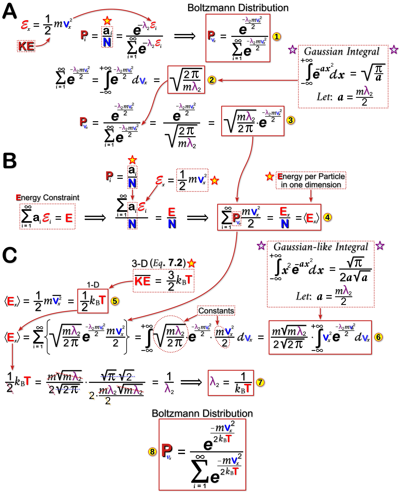
</figure>

**Figure 13: Boltzmann Distribution: Energy and Multiplier Variables.** <b>(A)</b> The <b>Boltzmann Distribution</b> formula (<b>①</b>) from <b>Fig. 12</b> has two unknown variables (i.e. ℇ<i>i</i> and λ2). The energy term is perhaps the easiest to address given that the energy of a gas particle is purely kinetic according to the KMT. Based on this the ℇ<i>i</i> term can be replaced with the basic formula for KE (<b>①</b>). This simple step makes velocity the central variable of the equation, which is expected given that the focus of this <b>distribution</b> is molecular speeds. The next step involves completing the summation of the denominator (i.e. normalization term). However, instead of summing discrete events a continuous summation of all possible velocities is performed (i.e. integral calculus). This operation involves the use of the famous <b>Gaussian Integral</b> (<b>②</b>), which conveniently simplifies the equation (<b>③</b>).  
<b>(B</b>, <b>C)</b> Dividing both sides of the <b>Energy Constraint</b> equation by N provides a convenient entry point for the above <b>Boltzmann</b> equation. It also changes the output to an <u>average</u> energy value per molecule (〈E〉, <b>④</b>). Earlier discussions about average KE (<b>Eq. 7.2</b>) shows that it is equal to half the product of the <b>Boltzmann constant</b> and temperature (T) for a single dimension (<b>⑤</b>). Next, equations <b>③</b> and <b>④</b> are combined and a continuous summation operation is carried out for all possible speed values using a Gaussian-like Integral (<b>⑥</b>). This latter quantity is equal to 〈E〉 (<b>⑤</b>) and can be simplified considerably to yield a value for the <b>Lagrange Multiplier</b> λ2 (<b>⑦</b>). The completed <b>Boltzmann Distribution</b> (<b>⑧</b>) shows that the <u>probability</u> of certain speeds decreases exponentially with energy, suggesting that most gas particles have relatively lower speeds for a given temperature.

<!------------------------------------------>
<!-------------- FIG 13 - END -------------->
<!------------------------------------------>

Now that the famous **Maxwell-Boltzmann Distribution** has been derived it is only fitting that we finally use it. Although the molecular speed data in **Table 2** provides a glimpse of how fast an average gas molecules travels, the **Maxwell-Boltzmann Distribution** plot (**Fig. 14**) provides a clearer picture of all the possible speeds for an average gas molecule. The H2 gas example shown in **Figure 14** shows that it has well defined speed distribution that shifts quite dramatically with increasing temperatures. The way the distribution quickly “*tails-off*” demonstrates that very few gas particles have high speeds. Nevertheless, the relative frequency of higher speed ranges (**Fig. 14B**, shaded area under the curves) do increase with increasing temperatures.  
    We can now put all of this information about molecular speeds and collisions (<b>λMFP</b>, <b>mean free path</b>) to good use to explain many everyday experiences. For example, why do we not immediately smell the fragrant odour of a rose when we are 50 meters away from the flower? After all the volatile and fragrant terpenoid <b><a class="one" href="https://pubchem.ncbi.nlm.nih.gov/compound/Geraniol" target="_blank" title="Go to PubChem">Geraniol</a></b> (diameter ~1.2 x 10-9 m) produced by roses travels close to the speed of sound (<b>vrms</b> = 210 m/sec). Shouldn’t it reach our noses within a fraction of a second? Obviously it doesn’t and by now you probably know why: all gaseous compounds, including the fragrant <b><a class="one" href="https://pubchem.ncbi.nlm.nih.gov/compound/Geraniol" target="_blank" title="Go to PubChem">Geraniol</a></b>, undergo an enormous number of random collisions (e.g. ~21.4 billion per second) as they travel through the air (e.g. air density, ρ = 1.29 kg/m3 at sea level) and eventually reach your nose (i.e. slow diffusion process).

`$$\tag{14} \lambda_{MFP} = \frac{1}{\sqrt{2} \pi \cdot \rho \cdot d^2} \frac{M}{N_A}$$`

`$$\tag{14.1}$$`
 
`$$\lambda_{geraniol} = \frac{1}{\sqrt{2} \pi (1.29 \frac{\text kg}{\text m^3}) (1.2 \times 10^{-9} \text m)^2} \frac{154.25 \frac{kg}{kmole} \cdot \frac{1 kmole}{1000 moles}}{6.23 \text x 10^{23} \frac{molecules}{mole}} = 4.5 \text x 10^{-8} \text m$$`

`$$\tag{14.2}$$`

 
`$$\text {mean collision frequency} = \frac{\lambda_{geraniol}}{\vec v_{rms}} = \frac{3.1 \text x 10^{-8} \text m}{210.11 \text { m/sec}} \simeq 2.14 \text x 10^{-10} sec$$`

If the smell of a rose does not appeal to you then consider something more practical like an incandescent light bulb. Prior to 1913 the incandescent light bulb was not very efficient and had a very short lifetime. The tungsten filaments tended to quickly melt and blackened the inner walls of the bulb. Fortunately, **<a class="one" href="https://www.nobelprize.org/prizes/chemistry/1932/langmuir/biographical/" target="_blank" title="Go to NobelPrize">Irving Langmuir</a>** realized that filling the bulb with a sufficient amount of Ar**gon** gas would extend the lifetime of the lamp.**[33](#ref-heppenheimer_man_1998)** At very low pressures (i.e. low vacuum) the **mean free path** for the evaporating tungsten atoms would be too long (i.e. few gas collisions), resulting in the rapid blackening of the inner bulb wall and reduced light output. **Langmuir** showed that small amounts of Ar**gon**, or the more expensive Kr**ypton**, would not only reduced the **mean free path** of the tungsten atoms, but also help some of them migrate back to the filament to partially reconstitute it.

<!-------------------------------------------->
<!--- FIG 14 MAXWELL DISTRIBUTION HYDROGEN --->
<!-------------------------------------------->

<figure align="center">
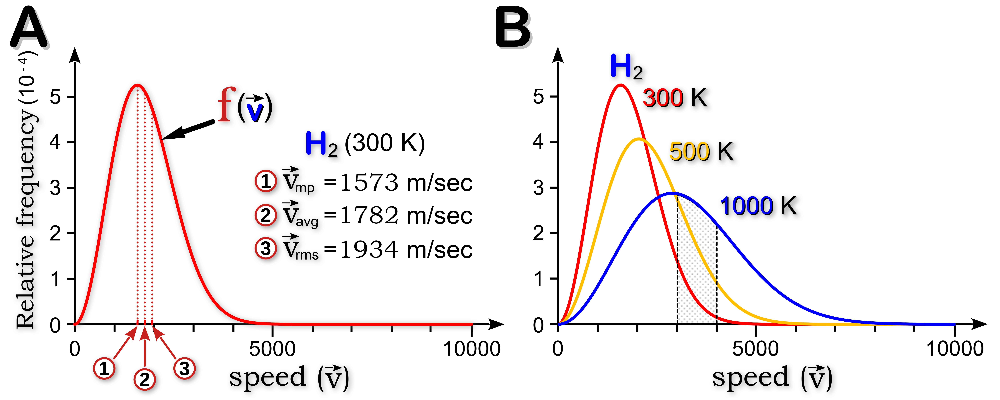
</figure>

**Figure 14: Maxwell-Boltzmann Speed Distribution.** <b>(A)</b> The plot of the relative frequencies of molecular speeds for hydrogen (H2) show that very high speeds are relatively rare. The most frequent speeds are concentrated at the low end of the distribution and are well described by the three central speed values: (i) the most probable speed (v<b>mp</b>); (ii) the root mean square speed (v<b>rms</b>); and (iii) the average speed (v<b>avg</b>).  
<b>(B)</b> The strong effect of temperature on molecular speeds is evident in the shifting shape of the distribution curve. Increasing temperatures expand the range of possible molecular speeds resulting in a noticeable flattening of the distribution curve. The shaded region highlights the increase in the frequency of a select range of molecular speeds with increasing temperatures (i.e. compare shaded areas under each of the curves).

<!------------------------------------------>
<!-------------- FIG 14 - END -------------->
<!------------------------------------------>

    Overall, the statistical approach to modelling the behaviour of gases provides a valuable glimpse into the microscopic world of **atoms**, one that would not be possible with classical **Newtonian mechanics**. To instantaneously characterize the behaviour of \>1023 gas particles using **Newton’s** equations of motion for three-dimensional space would require unimaginable amounts of computing power. However, by focusing on the behaviour of the <u>average</u> gas molecule one can readily explain many fundamental aspects of gas molecules (e.g. temperature, pressure, diffusion, viscosity, etc.).

  EINSTEIN & PERRIN  **:** In 1909 the French scientist **<a class="one" href="https://www.nobelprize.org/prizes/physics/1926/perrin/biographical/" target="_blank" title="Go to NobelPrize">Jean Perrin</a>** devised a series of elegant experiments that provided the most convincing and compelling evidence for the existence of **atoms**. As mentioned previously, the notion that gases are made up of individual atoms dates back to **David Bernoulli** (1738) who first hypothesized that the <b>P</b>ressure exerted by a gas is due to molecular collisions. Others, most notably **Avogadro** (1811), went on to show that equal volumes of two gases at the same <b>P</b>ressure and <b>T</b>emperature contain the same number of molecules (i.e. **Avogadro’s number**, or <b>NA</b> is the number of molecules in 22.412 litres of any gas under standard <b>P</b> and <b>T</b>). One of the experiments that **Perrin** performed involved testing **Einstein’s** mathematical prediction about **Brownian motion**.**[34](#ref-einstein_uber_1905)–[37](#ref-bigg_evident_2008)** In one of **Einstein’s** famous 1905 papers, he concluded that the seemingly <u>random</u> movements of macroscopic particles suspended in water (e.g. pollen grain) were due to “*thermal molecular motions*”, just like the movements of individual molecules <u>dissolved</u> in water (i.e. solutes). The only difference between a visible (macroscopic) particle and an invisible (microscopic) dissolved molecule are their dimensions. As **Einstein** (1905) stated himself:

> “*It will be shown that, according to the molecular-kinetic theory of heat, bodies of a microscopically visible size suspended in liquids must, as a result of thermal molecular motions, perform motions of such magnitude that they can be easily observed with a microscope. It is possible that the motions to be discussed here are identical with so-called Brownian molecular motion…*”**[34](#ref-einstein_uber_1905)**

**Perrin** was convinced that the particles at the heart of **Avogadro’s number** were indeed **atoms**. As he stated in his proposed “*kinetic molecular hypothesis*” (1909):

> “*Brownian movement is explained …by the incessant movements of the molecules of the fluid, which striking unceasingly the observed particles, drive about these particles irregularly through the fluid, except in the case where these impacts exactly counterbalance one another …substances <u>in spite of their homogeneous appearance</u>, have a <u>discontinuous structure</u> and are <u>composed of separate molecules</u>, but also that these molecules are in incessant agitation, which increases with the temperature and only ceases at absolute zero.*”**[35](#ref-perrin_brownian_1910)**

**Perrin** developed some ingenious methods for preparing uniformly sized spherical beads (<b>µm</b> scale) using a natural yellow latex substance called **<a class="one" href="https://cameo.mfa.org/wiki/Gamboge" target="_blank" title="Go to CAMEO">gamboge</a>** (**<a class="one" href="https://www.inaturalist.org/taxa/49585-Clusiaceae" target="_blank" title="Go to iNaturalist"><i>Clusiaceae</i></a>** tree family), and a tree resin called **<a class="one" href="https://www.gummastic.gr/en/" target="_blank" title="Go to GumMastic">mastic</a>** (*Pistacia lentiscus* trees). He elegantly described the bead preparation process which was crucial to his investigations:

> “*Gamboge …a piece of this substance rubbed with the hand under a thin film of distilled water (as soap-suds can be made from a piece of soap) dissolves little by little, giving a beautiful opaque emulsion of a bright yellow colour, in which the microscope shows a swarm of yellow granules of various sizes, all perfectly spherical. These yellow granules can be separated from the liquid in which they are contained by energetic centrifuging, in the same manner as the red corpuscles may be separated from blood serum… the yellow mud diluted anew (by shaking) with distilled water gives the mother emulsion which will serve for the preparation of the uniform emulsions intended for the measurements*.”**[35](#ref-perrin_brownian_1910)**

In one of his experiments **Perrin** measured the lateral movement, or *displacement*, of beads using a “*camera lucidia*” configured microscope (i.e. a prism attachment superimposes the microscope image with the image of a piece of grid paper that he could write on). This allowed him to track the position of a bead over time (i.e. making dots on the grid paper at a set time interval). He then connect the dots, creating a set of line segments that represented consecutive bead *displacement* events. By measuring the length of each line segment, averaging them and then squaring this mean value, a two dimensional mean displacement value was calculated (<b>λxy2</b>). The mean displacement value along a single axis (<b>λx2</b>) can be simply calculated by dividing the <b>λxy2</b> value by two since: <b>λx2 = λy2</b>, so <b>λx2 = 1/2 λxy2</b>. Once he plugged the value of <b>λx2</b> into <b>Einstein’s</b> equation (along with other measured variables), he was able to calculate the value of <b>Avogadro’s constant</b> (<b>NA</b> = ratio of the number of particles contained in one <u>mole</u> of substance):

`$$\tag{15} N_{A} = \frac{t}{\lambda_{x}^{2}} \times {\frac{R \cdot T}{3 \cdot \pi \cdot k \cdot P_r}}$$`

> Equation variables include: (i) t, the time interval between measurements; (ii) T, the absolute temperature in Kelvin; (iii) k, the viscosity of the solution; (iv) P<ub>r, the radius of the particle; and (v) R, the universal gas constant.

He repeated the experiments many times using different types of beads (i.e. mastic or gamboge), as well as different size beads. Despite the crudeness of **Perrin’s** apparatus his estimate of <b>NA</b> was quite extraordinary (<b>6.5 - 7.15 × 1023</b> particles/mole) considering the sheer magnitude of the constant.**[35](#ref-perrin_brownian_1910)**

<!------------------------------------------->
<!---------- FIG 15 - PERRIN TABLE ---------->
<!------------------------------------------->

<figure align="center">
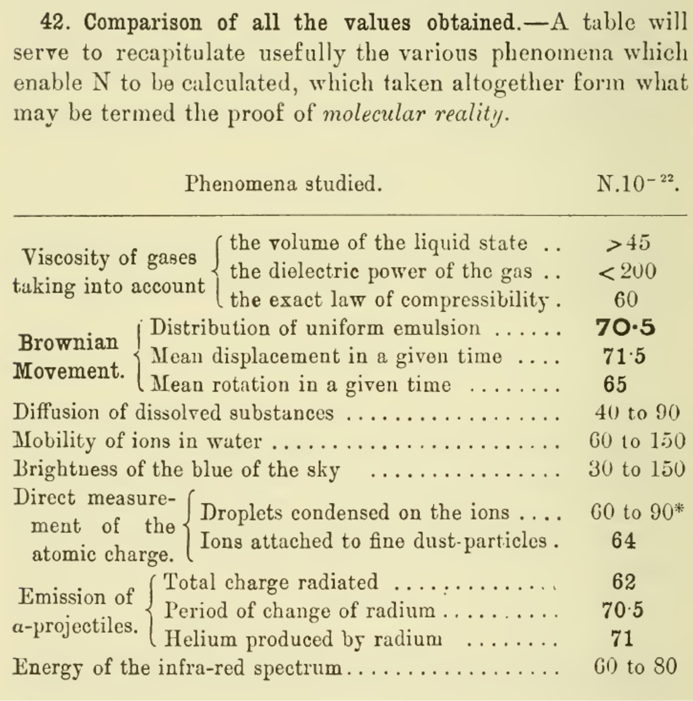
</figure>

<b>Perrin J</b> (1910). Brownian movement and molecular reality, pg. 90.<b>[35](#ref-perrin_brownian_1910)</b>

<!------------------------------------------>
<!-------------- FIG 15 - END -------------->
<!------------------------------------------>

A year or so later **<a class="one" href="https://www.nobelprize.org/prizes/physics/1923/summary/" target="_blank" title="Go to NobelPrize">Robert Millikan</a>** and his student **Harvey Fletcher** performed their famous “<i>oil-drop</i>” experiment (1910).**[38](#ref-perry_remembering_2007)** In addition to measuring the electrical charge of an electron **Millikan** could also estimate the value of **NA** (**6.062 × 1023** particles/mole).**[39](#ref-millikan_elementary_1913)** According to the National Institute of Standards and technology (**<a class="one" href="https://www.nist.gov/si-redefinition/redefining-mole" target="_blank" title="Go to NIST">NIST</a>**) the current value of **NA** is **6.02214076 × 1023** particles/mole.**[40](#ref-guttler_amount_2019)**

------------------------------------------------------------------------

<!--------------------------------------------------------------------->

© Jeffrey C Howard. The material contained within this website may be copied, distributed and displayed without alterations for noncommercial purposes only provided that it is accompanied by acknowledgements to the author. All commercial and non-commercial rights are reserved to the author.  
<!--------------------------------------------------------------------->

  
**REFERENCES:**

1 Dalton J. *[A new system of chemical philosophy](http://archive.org/details/newsystemofchemi12dalt)*. Bickerstaff, Strand, London; 1808.

2 Scerri E. *The Periodic Table: Its Story and Its Significance*. 2nd ed. New York, NY: Oxford University Press; 2019.

3 Döbereiner JW. Versuch zu einer Gruppirung der elementaren Stoffe nach ihrer Analogie. *Annalen Der Physik* 1829;**91**:301–7. <https://doi.org/10.1002/andp.18290910217>.

4 Gmelin L. *Handbuch der anorganischen chemie.* vol. 1. 4th ed. Heidelberg; 1843.

5 Lessen E. Uber die gruppirung der elemente nach ihrem chemisch-physikalischen charackter. *Annalen Der Chemie Justus Liebig* 1857;**103**:121–31.

6 De Chancourtois A-EB. *Mémoire sur un classement naturel des corps simples ou radicaux appelé vis tellurique.* Paris: Mallet-Bachelier; 1862.

7 Hartog PJ. A First Foreshadowing of the Periodic Law. *Nature* 1889;**41**:186–8. <https://doi.org/10.1038/041186a0>.

8 Newlands JAR. On Relations Between Equivalents. *Chemical News* 1864;**10**:59–60.

9 Newlands JAR. On the Law of Octaves. *Chemical News* 1865;**12**:83.

10 Mendelejeff VD. [On the Relationship of the Properties of the Elements to their Atomic Weights. (Translated by Carmen Giunta)](https://web.lemoyne.edu/~giunta/mendeleev.html). *Zeitschrift Für Chemie* 1869;**12**:405–6.

11 Meyer L. [Die Natur der chemischen Elemente als Function ihrer Atomewichte](https://web.lemoyne.edu/~giunta/meyer.html). *Annalen Der Chemie Und Pharmacie* 1870;**Supplementband 7**:354–64.

12 Meyer L. *[Die modernen Theorien der Chemie und ihre Bedeutung für die chemische Statistik](https://www.digitale-sammlungen.de/de/view/bsb10073411?page=5)*. Breslau; 1864.

13 Bernoulli D. *[Hydrodynamica, sive de viribus et motibus fluidorum commentarii : Opus academicum ab auctore, dum Petropoli ageret, congestum](http://www.e-rara.ch/zut/1227730)*. 1738.

14 BERNOULLI D. [On the Properties and Motions of Elastic Fluids, Especially Air](https://doi.org/10.1142/9781848161337_0004). *The Kinetic Theory of Gases*, vol. Volume 1. PUBLISHED BY IMPERIAL COLLEGE PRESS AND DISTRIBUTED BY WORLD SCIENTIFIC PUBLISHING CO.; 2003. p. 57–65.

15 Clapeyron E. Mémoire sur la Puissance Motrice de la Chaleur. *Journal de l’École Royale Polytechnique (in French)* 1834:Paris: De l’Imprimerie Royale. Vingt–troisième cahier, Tome XIV: 153–190.

16 Wisniak J. Development of the concept of absolute zero temperature. *Educación Química* 2005;**16**:104–13. https://doi.org/<http://dx.doi.org/10.22201/fq.18708404e.2005.1.66145>.

17 Gay-Lussac J-L. The Expansion of Gases by Heat. *Annales de Chimie* 1802;**43**:137.

18 Bose S. Plancks Gesetz und Lichtquantenhypothese. *Zeitschrift Für Physik* 1924;**26**:178–81. <https://doi.org/10.1007/BF01327326>.

19 Einstein A. Quantentheorie des einatomigen idealen Gases. *Sitz Ber Preuss Akad Wiss* 1924;**22**:261.

20 Anglin JR, Ketterle W. Bose-Einstein condensation of atomic gases. *Nature* 2002;**416**:211–8. <https://doi.org/10.1038/416211a>.

21 Clausius R, Hirst TA, Tyndall J. *The mechanical theory of heat: With its applications to the steam-engine and to the physical properties of bodies*. London: John Van Voorst; 1867.

22 Jensen WB. The Universal Gas Constant R. *Journal of Chemical Education* 2003;**80**:731. <https://doi.org/10.1021/ed080p731>.

23 Clausius R. On the nature of the motion which we call heat. *The London, Edinburgh, and Dublin Philosophical Magazine and Journal of Science* 1857;**14**:108–27. <https://doi.org/10.1080/14786445708642360>.

24 Krönig A. Grundzüge einer Theorie der Gase. *Annalen Der Physik* 1856;**175**:315–22. <https://doi.org/10.1002/andp.18561751008>.

25 Serway RA, Jewett JW. *Physics for Scientists and Engineers*. 6th ed. Thomson Brooks/Cole; 2004.

26 Loschmidt J. Zur Grősser der Luftmolecűle. *Sitzungsber Kais Akad Wiss Wien, Math Naturwiss, Classe, II Abteilung* 1865;**52**:395–407.

27 Porterfield WW, Kruse W. Loschmidt and the Discovery of the Small. *Journal of Chemical Education* 1995;**72**:870. <https://doi.org/10.1021/ed072p870.1>.

28 Bader A, Parker L. Joseph Loschmidt, Physicist and Chemist. *Physics Today* 2001;**54**:45–50. <https://doi.org/10.1063/1.1366067>.

29 Clausius R. On the Dynamical Theory of Gases. *Phil Mag* 1860;**19**:434–6.

30 Maxwell JC. V. Illustrations of the dynamical theory of gases.—Part I. On the motions and collisions of perfectly elastic spheres. *The London, Edinburgh, and Dublin Philosophical Magazine and Journal of Science* 1860;**19**:19–32. <https://doi.org/10.1080/14786446008642818>.

31 Clausius R. On the Mean Length of the Paths described by the separate Molecules of Gaseous Bodies on the occurrence of Molecular Motion: Together with some other Remarks upon the Mechanical Theory of Heat. *Phil Mag* 1859;**17**:81–91.

32 Vadlamani SK, Xiao TP, Yablonovitch E. Physics successfully implements Lagrange multiplier optimization. *Proceedings of the National Academy of Sciences* 2020;**117**:26639–50. <https://doi.org/10.1073/pnas.2015192117>.

33 Heppenheimer TA. [The Man Who Found The Universe In A Light Bulb](https://www.inventionandtech.com/content/man-who-found-universe-light-bulb-1). *Invention & Technology Magazine* 1998;**13**:

34 Einstein A. [Über die von der molekularkinetischen Theorie der Wärme geforderte Bewegung von in ruhenden Flüssigkeiten suspendierten Teilchen.](https://ci.nii.ac.jp/naid/10016922894/) *Annalen Der Physik* 1905;**17**:549–60.

35 Perrin J. *Brownian movement and molecular reality.* London: Taylor; Francis, Red Lion Court, Fleet Street; 1910.

36 Newburgh R, Peidle J, Rueckner W. Einstein, Perrin, and the reality of atoms: 1905 revisited. *American Journal of Physics* 2006;**74**:478–81. <https://doi.org/10.1119/1.2188962>.

37 Bigg C. Evident atoms: Visuality in Jean Perrin’s Brownian motion research. *Studies in History and Philosophy of Science Part A* 2008;**39**:312–22. <https://doi.org/10.1016/j.shpsa.2008.06.003>.

38 Perry MF. Remembering the Oil-Drop Experiment. *Physics Today* 2007;**60**:56. <https://doi.org/10.1063/1.2743125>.

39 Millikan. RA. On the Elementary Electrical Charge and the Avogadro Constant. *Physical Review* 1913;**2**:109–43. <https://doi.org/10.1103/PhysRev.2.109>.

40 Güttler B, Bettin H, Brown RJC, Davis RS, Mester Z, Milton MJT, *et al.* Amount of substance and the mole in the SI. *Metrologia* 2019;**56**:044002. <https://doi.org/10.1088/1681-7575/ab1fae>.

