<style type="text/css">

/* ================== */
/*  Photo/Figures CSS */
/* ================== */

#myDiv44 {
  border: 4px outset red;
  width: 50%;
  padding: 4px;
  margin: auto;
  border-style: groove;
  background-color: ivory1;    
  text-align: center;
}

.center {
  display: block;
  margin-left: auto;
  margin-right: auto;
  width: 90%;
  }

.Border {
  border-width:3px;
  border-style:solid;
  padding: 10px 10px 10px 10px;
  border-color: black;
  }

#FRight150 {
  float: right;
  height: 150px;
  text-align: center;
  padding: 10px 10px 10px 10px;
  clear: right;
}

#FRight175 {
  float: right;
  height: 175px;
  text-align: center;
  padding: 10px 10px 10px 10px;
  clear: right;
}

#FRight200 {
  float: right;
  height: 200px;
  text-align: center;
  padding: 10px 10px 10px 10px;
  clear: right;
}

#FRight250 {
  float: right;
  height: 250px;
  text-align: center;
  padding: 10px 10px 10px 10px;
  clear: right;
}

#FRight335 {
  float: right;
  height: 335px;
  text-align: center;
  padding: 10px 10px 10px 10px;
  clear: right;
}


/* ========================== */
/*         TABLE CSS          */
/* ========================== */

.Table {
  border-collapse: collapse;
  overflow: auto;
  width: 100%;
  margin: 1px;
  box-shadow: 0 0 10px rgba(0, 0, 0, 0.55);
  }

.Table thead tr {
  border: 2px solid;
  padding: 1px;
  text-align: center;
  text: bold;
}

.Table thead th {
  border: 2px solid;
  text-align: center;
  text: bold;
  font-size: 24px;
}

.Table thead th.f18 {
  border: 2px solid;
  text-align: center;
  text: bold;
  font-size: 18px;
}

.Table thead th.f16 {
  border: 2px solid;
  text-align: center;
  text: bold;
  font-size: 16px;
}

.Table tbody td {
  border: 2px solid;
  text-align: center;
  text: bold;
  font-size: 14px;
  background-color: white;
}

.Table tbody td.tmid {
  border: 2px solid;
  text-align: center;
  text: bold;
  font-size: 14px;
  background-color: white;
}

td:first-child + td {text-align: center;}

td:first-child + td + td.tcell {text-align: center;}

.Table tbody tr {border-bottom: 2px solid #dddddd;}

.Table tbody tr:last-of-type {border-bottom: 2px solid #009879;}


/* =============================== */
/*          CSS for Links          */
/* =============================== */

a.one:link {color: rgb(0, 0, 200);}
a.one:visited {color: rgb(192, 20, 172);}
a.one:hover {color: rgb(255, 20, 100);}


/* ============================== */
/*     CSS for stylizing text     */
/* ============================== */

#BBlk {
  font-weight: bold;
  color: rgb(0, 0, 0);
  border: 2px solid black;
  margin: 1px;
  }

#Blk20 {
  color: black;
  font-size: 20px;
  text-align: left;
  }

#BBlk20 {
  font-weight: bold;
  color: black;
  font-size: 20px;
  text-align: left;
  }

#LC {
  font-weight: bold;
  font-family: "Lucida Calligraphy";
  color: rgb(95, 0, 161);
  }

#LC1 {
  font-family: "Lucida Calligraphy";
  color: black;
  }

#Amir {
  font-weight: bold;
  font-family: "Amiri";
  color: black;
  }

#Blk { font-weight: bold; color: rgb(0, 0, 0); }
#Red { font-weight: bold; color: rgb(255, 10, 20); }
#Red2 { font-weight: bold; color: rgb(255, 50, 50); }
#Dred { font-weight: bold; color: rgb(175, 0, 0); }
#Or { font-weight: bold; color: rgb(255, 140, 0); }
#Or2 { font-weight: bold; color: rgb(245, 180, 0); }
#Gold { font-weight: bold; color: rgb(230, 190, 0); }
#Ly { font-weight: bold; color: rgb(225, 200, 0); }
#Y1 { font-weight: bold; color: rgb(255, 225, 100); }
#Y2 { font-weight: bold; color: rgb(225, 200, 50); }
#GrY { font-weight: bold; color: rgb(240, 240, 0); }
#Grod { font-weight: bold; color: rgb(200, 160, 40); }
#Gr1 { font-weight: bold; color: rgb(25, 200, 25); }
#Gr2 { font-weight: bold; color: rgb(25, 150, 25); }
#Gr3 { font-weight: bold; color: rgb(25, 100, 25); }
#Moss { font-weight: bold; color: rgb(80, 210, 100); }
#BGr { font-weight: bold; color: rgb(67, 205, 170); }
#Teal { font-weight: bold; color: rgb(60, 180, 180); }
#Teal2 { font-weight: bold; color: rgb(60, 100, 200); }
#Blue { font-weight: bold; color: blue; }
#SkyB { font-weight: bold; color: rgb(104, 207, 240); }
#Cb { font-weight: bold; color: rgb(0, 123, 167); }
#Glacialb { font-weight: bold; color: rgb(54, 139, 193); }
#Db2 { font-weight: bold; color: rgb(0, 0, 100); }
#Lb1 { font-weight: bold; color: rgb(50, 215, 255); }
#Lb2 { font-weight: bold; color: rgb(50, 155, 255); }
#Lb3 { font-weight: bold; color: rgb(50, 115, 255); }
#Violet { font-weight: bold; color: rgb(180, 73, 255); }
#V2 { font-weight: bold; color: rgb(183, 137, 211); }
#Purple { font-weight: bold; color: rgb(150, 0, 255); }
#Dpurp { font-weight: bold; color: rgb(95, 0, 161); }
#Magenta { font-weight: bold; color: rgb(255, 0, 255); }
#Coral { font-weight: bold; color: rgb(255, 127, 80); }
#Salmon { font-weight: bold; color: rgb(255, 140, 160); }
#Crim { font-weight: bold; color: rgb(220, 20, 60); }
#Rasp { font-weight: bold; color: rgb(227, 11, 92); }
#Lgray { font-weight: bold; color: rgb(220, 220, 220); }
#Silver { font-weight: bold; color: rgb(192, 192, 192); }
#Gray { font-weight: bold; color: rgb(155, 155, 155); }
#Gray2 { font-weight: bold; color: rgb(215, 200, 200); }
#Dgray { font-weight: bold; color: rgb(95, 95, 95); }
#Br { font-weight: bold; color: rgb(165, 42, 42); }
#Rust { font-weight: bold; color: rgb(183, 65, 14); }
#Dbr { font-weight: bold; color: rgb(100, 20, 20); }
#Zinc { font-weight: bold; color: rgb(140, 209, 187); }
#Zinc2 { font-weight: bold; color: rgb(0, 102, 102); }

</style>

```{r setup, include=FALSE}
knitr::opts_chunk$set(collapse = TRUE)

### Libraries
library(pacman)
pacman::p_load(blogdown, tidyverse, kableExtra, dplyr, purrr, bibtex, citr)

```

<!------------------------------------------------>
<!-------- JAVASCRIPT - enable LaTex MATH -------->
<!------------------------------------------------>
<script type="text/javascript"
  src="https://cdnjs.cloudflare.com/ajax/libs/mathjax/2.7.0/MathJax.js?config=TeX-AMS_CHTML">
</script>
<script type="text/x-mathjax-config">
  MathJax.Hub.Config({
    tex2jax: {
      inlineMath: [['$','$'], ['\\(','\\)']],
      processEscapes: true},
      jax: ["input/TeX","input/MathML","input/AsciiMath","output/CommonHTML"],
      extensions: ["tex2jax.js","mml2jax.js","asciimath2jax.js","MathMenu.js","MathZoom.js","AssistiveMML.js", "[Contrib]/a11y/accessibility-menu.js"],
      TeX: {
      extensions: ["AMSmath.js","AMSsymbols.js","noErrors.js","noUndefined.js"],
      equationNumbers: {
      autoNumber: "AMS"
      }
    }
  });
</script>

<!-- this is a subheadline -->
<details>
  <summary><b>TABLE OF CONTENTS</b></summary>

  1. <a href="#CRT"><b>Cathode</b> & <b>Canal Rays</b></a>
     * <a href="#CRT"><b>Cathode Ray Tubes</b> (1830-1880s)</a>
     * <a href="#JJT"><b>J.J. Thomson's</b> "Corpuscles" (1897-1899)</a>
     * <a href="#Prays"><b>Eugen Goldstein</b>, <b>Willy Wein</b> and positively charged "Canal Rays" (1886-1907)</a>
     * <a href="#Millk"><b>Electron</b> Charge - <b>Millikan's</b> Oil Drop Method (1908-1911)</a>
  2. <a href="#NAM"><b>Nuclear Atomic Model</b></a>
     * <a href="#RGM"><b>Rutherford</b>, <b>Geiger</b>, <b>Marsden</b> (1908-1911) - the <b>Nuclear</b> Trio</a>
  3. <a href="#BAM"><b>Bohr's Atomic Model</b></a>
     * <a href="#Bohr1"><b>Niels Bohr</b> (1913)</a>
     * <a href="#Bohr2"><b>Bohr Model</b> (1913) of the <span id="Blue">H</span>ydrogen <b>Atom</b></a>
     * <a href="#CharXrays"><b>Henry Moseley</b> (1914) & <b>Characteristic X-rays</b></a>
  4. <a href="#Qmech"><b>Matter Waves</b> & <b>Wave Mechanics</b></a>
     * <a href="#Mwaves"><b>DeBroglie's Matter-Waves</b> (1924)</a>
     * <a href="#DFunc"><b>Sinusoidal Displacement Functions</b></a>
  5. <a href="#SWE"><b>Schrodinger's Wave Equations</b></a>
     * <a href="#DFunc2"><b>Wave Equation</b> Solution</a>
     * <a href="#EnergyEqn"><span id="Red">E</span><b>nergy</b> constraints for <b>Wave Functions</b></a>
     * <a href="#SWE1"><b>General Wave Equation</b></a>
     * <a href="#SPWP"><b>Superposition Principle</b> & <b>Wave Packets</b></a>
     * <a href="#TDSE"><b>Schrodinger's</b> <b>T</b>ime <b>D</b>ependent <b>W</b>ave <b>E</b>quation</a>
     * <a href="#HUP"><b>Heisenberg's Uncertainty Principle</b></a>
     * <a href="#ConfE"><b>Confinement Energy</b> of an <b>Electron</b></a>
     * <a href="#InfSqW"><b>Infinite Square Well Potential</b></a>
     * <a href="#TISE"><b>Schrodinger's</b> <b>T</b>ime <b>I</b>ndependent Wave <b>E</b>quation (<b>TISE</b>)</a>
     * <a href="#MaxBorn"><b>Max Born</b> & <b>Wave Function</b> Probabilities</a>
  6. <a href="#3DSE"><b>Three Dimensional SE</b></a>
     * <a href="#SPcoord"><b>Spherical Polar</b> Coordinate System</a>
     * <a href="#AzE"><b>Azimuthal Equation</b></a>
  7. <a href="#SHOmodel"><b>Simple Harmonic Oscillator</b> (<b>SHO</b>) Model</a>
     * <a href="#SHOmodel">Classical <b>SHO</b> Model</a>
     * <a href="#SHOmodel2"><b>SHO Energy Equation</b></a>
     * <a href="#LJpotential"><b>Lennard-Jones Potentials</b></a>
     * <a href="#LadderOperators"><b>SHO Ladder Operators<b></b></a>
  8. <a href="#QN"><b>Quantum Numbers</b></a>
     * <a href="#RadAngE"><b>Radial</b> & <b>Angular Equations</b></a>
     * <a href="#SandB"><b>Spherical TISE</b> & <b>Bohr's radius</b></a>
     * <a href="#SHfunc"><b>Spherical Harmonic Function</b></b></a>
     * <a href="#QNinfoBox"><b>Quantum Numbers Summary Box</b></a>
  9. <a href="#PDFs"><b>Probability Density</b> of <b>Wave Functions</b></a>
     * <a href="#normPDF"><b>Normalization</b> of <b>Wave Functions</b></a>
     * <a href="#RfPfplot"><b>Radial Function</b> & <b>Probability</b> Plots</a>
  10. <a href="#Refs"><b>References</b></a>
</details>


<a id="CRT"></a>
<h2><center>THE ELECTRON</center></h2>
<!-------------------------------------->
<!-------- SECTION 1 - ELECTRON -------->
<!-------------------------------------->

**<span style="border: 2px solid black;">&thinsp; 1. CATHODE RAYS &thinsp;</span>:** Much of our initial understanding about the structure of the atom emerged from the study of electrified gases in vacuum tubes. It is thought that the great experimental physicist **Michael Faraday** (1830s) was one of the first to carry out electrical discharge experiments using these types of tubes.<b>[@moore_proton_1985]</b> By the 1850s physicists like **Heinrich Geissler** (1857) used more powerful high-voltage supplies and gas pumps to develop low vacuum discharge tubes. **Julius Plücker** (1858) together with his former pupil **Johann Hittorf** (1865) were the first to show that the "*luminous rays*" emanating from the **cathode** could cause the glass vessel to fluoresce.<b>[@plucker_observations_1858; @hittorf_spectra_1865; @hittorf_ueber_1869; @smith_j_1997]</b> They along with **William Crookes** showed that "*cathode rays*" traveled in straight lines and could be deflected by magnetic fields.<b>[@hittorf_spectra_1865; @hittorf_ueber_1869; @crookes_radiant_1879; @busch_claims_2023]</b> **Crookes** strongly believed that "*cathode rays*" were not only particles, but also a new type of matter that **Faraday** had previously termed **radiant matter**:    

>"*In these highly exhausted vessels the molecules of the gaseous residue are able to dart across the tube with comparatively few collisions, and radiating from the pole with enormous velocity, they assume <u>properties so novel</u> and so characteristic as to entirely justify the application of the term borrowed from Faraday, that of <u>Radiant Matter</u>*."<b>[@crookes_radiant_1879]</b>

&nbsp; &nbsp; Today we call this type of super-heated ionized gas a <u>plasma</u> (i.e. 4<sup>th</sup> state of matter), and the luminous "*cathode rays*" a stream of **electrons** (<span id="Dred">e</span><sup>-</sup>). The collisions between the high energy <span id="Dred">e</span><sup>-</sup> and gas molecules triggers the <u>release</u> of electromagnetic (<span id="Dred">EM</span>) radiation that marks the trail of these fast moving particles, while collisions between the <span id="Dred">e</span><sup>-</sup> and glass causes the latter to fluoresce different colours (e.g. uranium glass phosphoresces a dark green colour, English glass blue and soft German glass a bright apple-green).<b>[@crookes_radiant_1879]</b> One of the vacuum tubes designed by **Charles Gimingham** (a research assistant of **Crookes**) contained a piece of aluminum in the shape of a Maltese cross attached to a hinge (**Fig. 1**). As **Crookes** highlighted in an August 22<sup>nd</sup> 1879 lecture "*On radiant matter*" delivered to the British Association for the Advancement of Science:

>"*...you will all see the black shadow of the cross on the luminous end of the bulb. Now, the Radiant Matter from the negative pole has been passing by the side of the aluminium cross to produce the shadow; the glass has been hammered and bombarded till it is appreciably warm ...by giving the apparatus a slight jerk, for it has been most ingeniously constructed with a hinge by Mr. Gimingham, and so allow the rays from the negative pole to fall uninterruptedly on to the end of the bulb, you will suddenly see the black cross change to a luminous one because the back-ground is now only capable of faintly phosphorescing, while the part which had the black shadow on it retains its' full phosphorescent power.*."<b>[@crookes_radiant_1879]</b>

<!-------------------------------------------------------------------->
<!------------ FIG 1 - High Voltage Gas Discharge Tubes  ------------->
<!-------------------------------------------------------------------->
<div style="border: 2px solid gray; padding: 5px;">

<figure>
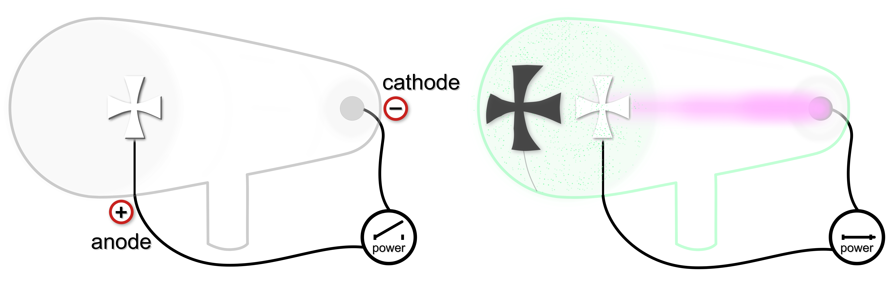
</figure>

**<u>Figure 1: High Voltage Gas Discharge Tubes</u>.** Shown is a cartoon approximation of a low vacuum <b>Crookes tubes</b> designed by <b>Charles Gimingham</b> who was <b>Crookes'</b> long time research assistant. A hinged piece of aluminum in the shape of a <b>Maltese cross</b> enabled <b>Crookes</b> to clearly show the rectilinear nature of the fast moving <b>cathode rays</b>.
</div>
<!-------------------------------------------------------------------->
<!-------------------------------------------------------------------->
<!-------------------------------------------------------------------->


<a id="JJT"></a>
For many years the nature of "*cathode rays*" remained controversial among scientists. Some, like **Crookes**, strongly believed that they were streams of charged particles, while others believed they were a product of the mysterious "*Aether*". Fortunately, the results of **J.J. Thomson's** experiments (1897-1899) provided clear evidence of the particle nature of “*cathode rays*”. As he clearly outlined at the beginning of his famous paper:

>"...*The most <u>diverse opinions</u> are held as to these rays; according to the <u>almost unanimous opinion of German physicists they are due to some process in the aether</u> to which - inasmuch as in a uniform magnetic field their course is circular and not rectilinear - no phenomenon hitherto observed is analogous: <u>another view</u> of these rays is that, so far from being wholly aetherial, <u>they are in fact wholly material</u>, and that they mark the paths of particles of matter charged with negative electricity. It would seem at first sight that it ought not to be difficult to discriminate between views so different, yet experience shows that this is not the case, as amongst the physicists who have most deeply studied the subject can be found supporters of either theory. The <u>electrified-particle theory has for purposes of research a great advantage over the aetherial theory</u>, since it is definite and its consequences can be predicted; with the aetherial theory it is impossible to predict what will happen...*."<b>[@thomson_cathode_1897]</b> 

**Thomson** showed that "*cathode rays*" produced by rarefied gases under high voltages could be deflected by either an **electric** (<span id="Purple">$\vec E$</span><sub>(-)</sub>) or **magnetic** (<span id="Blue">$\vec B$</span>) **field** (**Fig. 2**). Because neither the amount of charge nor the mass of an **electron** were known at that time **Thomson** could only calculate the ratio of these two values (i.e. <span id="Dred">q</span><sub>(-)</sub>/<b>m</b> or <b>m</b>/<span id="Dred">q</span><sub>(-)</sub>). As depicted in **Figure 2** he cleverly adjusted the magnetic field (<span id="Blue">$\vec B$</span>) strength in order to nullify the apposing electric field (<span id="Purple">$\vec E$</span><sub>(-)</sub>). This allowed **Thomson** to calculate the velocity ($\vec v$) of the **electron** (i.e. > 10<sup>7</sup> m/sec) and, in turn, the <span id="Dred">q</span><sub>(-)</sub>/<b>m</b> ratio of this particle (**Fig. 2**).  

<!--------------------------------------------------------------------->
<!------------------ FIG 2 - JJ Thomson experiment  ------------------->
<!--------------------------------------------------------------------->
<div style="border: 2px solid gray; padding: 5px;">

<figure>
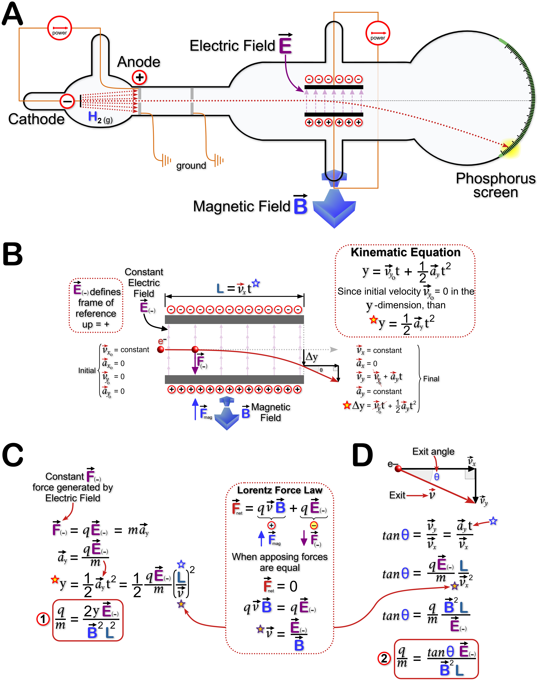
</figure>

**<u>Figure 2: J.J. Thomson and the Electron</u>.** <b>(A)</b> This depiction of a <b>vacuum tube</b> designed by <b>Thomson</b> shows "<i>cathode rays</i>" being accelerated by a high voltage <b>cathode</b>/<b>anode</b> plate system.<b><sup>8</sup></b> The narrow slit within the metal collar serves as a collimating tube for the "<i>cathode rays</i>" that eventually comes into contact with the <u>electric</u> (<span id="Dpurp">$\vec E$</span>) and <u>magnetic</u> (<span id="Blue">$\vec B$</span>) fields. The path of the negatively charged particles is deflected by the plates and the exit <u>angle</u> of the beam calculated from the position of the fluorescence flashes on the screen.<br>
<b>(B)</b> A closer look at the <span id="Dpurp">$\vec E$</span> field generated by parallel aluminum plates shows the field lines (faint purple arrows, pointing from <b>$+$</b> to <b>$-$</b>) and resulting force (<span id="Purple">$\vec F$</span><sub>$(-)$</sub>) it generates on the moving <b>electron</b>. The initial conditions of the <b>electron</b> just prior to entering the electric field is that it is moving at a constant speed (i.e. horizontal x-direction) and therefore has zero acceleration. As the <b>electron</b> traverses the length (<span id="Blue">$L$</span> = <b>$v_x \cdot t$</b>) of the <span id="Dpurp">$\vec E$</span> field it is subjected to a downward negative force causing it to accelerate in the y-direction. Upon exiting the <span id="Dpurp">$\vec E$</span> field the <b>electron</b> once again starts to move at a constant speed, but along a path that is deflected by a measurable angle (<b>$\theta$</b>).<br>
<b>(C, D)</b> Using well known <b>Newtonian</b> equations of motion one can calculate the amount of vertical displacement of the <b>electron</b> when it exits the <span id="Dpurp">$\vec E$</span> field relative to when it entered it. Using the speed (<b>$\vec{\text v}$</b> = <span id="Dpurp">$E$</span>/<span id="Blue">$B$</span>, <b>Lorentz Force Law</b>) of the <b>electron</b>, acceleration (<b>$\vec a_y$</b>), and the time the <b>electron</b> takes to travel the length of the <span id="Dpurp">$\vec E$</span> field (<b>$t$</b> = <span id="Blue">$L$</span>/<b>$\vec v_x$</b>), one can calculate its charge-to-mass ratio (<span id="Dred">$q$</span><sub>(-)</sub>/<b>m</b>). Alternatively, the value of this ratio can be calculated using the exit angle (<b>$\theta$</b>) of the <b>electron</b> (<b>D</b>). Since <b>$tan(\theta)$</b> is equal to the ratio of the vector components of the exit velocity (<b>$\vec v_y$</b>/<b>$\vec v_x$</b>) one can therefore use this ratio to calculate the <span id="Dred">$q$</span><sub>(-)</sub>/<b>m</b> ratio. <b>Thomson's</b> best estimate of <span id="Dred">$q$</span><sub>(-)</sub>/<b>m</b> was approximately 1.76 x 10<sup>-7</sup> emu/gm, or 1.76 x 10<sup>-11</sup> coulomb/kg.<b>[@thomson_cathode_1897; @smith_j_1997; @serway_physics_2004; @thornton_modern_2013]</b>

</div>
<!--------------------------------------------------------------------->
<!--------------------------------------------------------------------->
<!--------------------------------------------------------------------->


As **Thomson** noted in his paper:

>"...*From these determinations we see that the value of <b>m/e</b> is independent of the nature of the gas, and that its value* 10<sup>-7</sup> *is <u>very small compared with the value</u>* 10<sup>-4</sup>*, which is the smallest value of this quantity previously known, and which is the value <u>for the hydrogen ion</u> in electrolysis*."<b>[@thomson_cathode_1897]</b>

Regardless of the type of gas (i.e. air, hydrogen, carbonic acid) or the type of metal used for the electrodes (i.e. aluminum, iron, platinum), **Thomson** always observed a <b>m</b>/<span id="Dred">q</span><sub>(-)</sub> ratio (i.e. 10<sup>-7</sup>) for the "*cathode rays*" that was approximately a thousand times smaller than the <b>m</b>/<span id="Dred">q</span><sub>(-)</sub> ratio of <span id="Blue">H</span><sup>+</sup>, the smallest known elemental ion at that time. He also showed in two subsequent papers that the same value could be assigned to the negatively charged particles produced by either **UV-rays**, incandescent filaments, or **Röntgen's** newly discovered **X-rays**.<b>[@rontgen_new_1896; @thomson_charge_1898; @thomson_masses_1899]</b> **Thomson** was therefore convinced that these "*cathode ray*" particles represented a fundamental building block of matter. He also studied "*positive rays*" previously discovered by **Goldstein** (1886).<b>[@goldstein_uber_1886]</b> Like **Wein** (1902) before him **Thomson** showed that the <b>m</b>/<span id="Dred">q</span><sub>(-)</sub> ratio of these positively charged rays matched that of <span id="Blue">H</span><sup>+</sup> (**Fig. 3**).<b>[@moore_proton_1985; @wien_untersuchungen_1902; @thomson_xlvii_1907]</b> Of course, when **Ernest Rutherford** (1911) discovered the **nucleus** these "*positive rays*" later became known as **alpha particles** (i.e. 2 **protons** and 2 neutrons).<b>[@rutherford_scattering_1911; @rutherford_structure_1914]</b> Nevertheless, prior to **Rutherford's** discovery **Thomson** proposed a new model of the **atom** (i.e. "*Plum Pudding*" model) where he envisioned negatively charged "*corpuscles*" systematically arranged within a sphere of uniform positive electricity.<b>[@thomson_structure_1904]</b>

<a id="Prays"></a>
<!------------------------------------------------------------------->
<!------------------ FIG 3 - JJ Thomson & Proton  ------------------->
<!------------------------------------------------------------------->
<div style="border: 2px solid gray; padding: 5px;">

<figure>
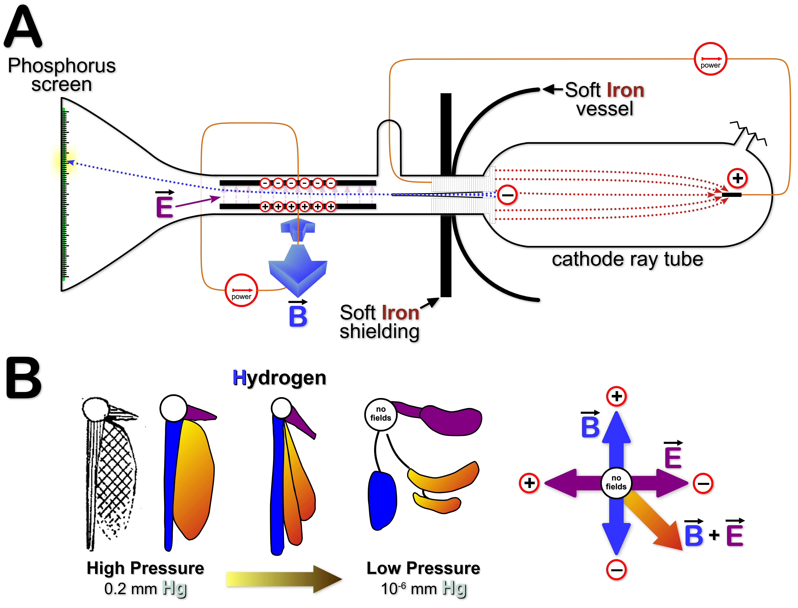
</figure>

**<u>Figure 3: Goldstein & Thomson: "<i>Kanalstrahlen</i>" or "Positive Rays"</u>.** <b>(A)</b> The specially designed discharge tube used in <b>Thomson's</b> experiments had a small hole in the metal <b>cathode</b> collar. This hole led to a fine glass tube or syringe that directed the "<i>positive rays</i>" toward a flat fluorescent screen which recorded the molecular collisions. Before hitting the screen the "<i>positive rays</i>" passed between two parallel aluminum plates that generated an electric field (<span id="Purple">$E$</span>). The horizontal electrical force (<span id="Purple">$F_{(+)}$</span>) produced by this field deflects the "<i>positive rays</i>" toward the oppositely (negative) charged plate. A strong electromagnetic also operated along the length of the plates, with the magnetic force producing a vertical deflection of the rays. To shield the discharge tube from the electromagnet the former was placed within a soft-iron vessel that was further fortified by several soft-iron plates.<b>[@thomson_xlvii_1907]</b><br>
<b>(B)</b> Undeflected "<i>positive rays</i>" produced a well defined bright spot on the screen (i.e. "no fields" white circle), while deflected rays produce broad fluorescent bands and patches at low pressures. <b>Thomson</b> traced the outline of these bright phosphorescence displays off of the flat screen onto paper and measured the amount of vertical and/or horizontal deflection to calculate the <b>m</b>/<span id="Dred">q</span><sub>(-)</sub> values. Vertical deflection of the "<i>positive rays</i>" by a magnetic (<span id="Blue">B</span>) force is highlighted in blue, while horizontal deflection of these rays by an electrical (<span id="Purple">E</span>) force is highlighted in purple. Deflection of the "<i>positive rays</i>" by combined magnetic and electric forces is shown in orange. For reference, an original tracing (far left) from <b>Thomson's</b> paper is shown for hydrogen gas (<span id="Blue">H</span><sub>2</sub>).<b><sup>16</sup></b> Cartoon representations of the phosphorescence events for hydrogen at relatively high (e.g. 1/50 of a millimeter of mercury) and low (e.g. 1/10<sup>6</sup> of a millimeter of mercury) pressures are shown. <b>Thomson</b> showed that the shape of the phosphorescent patch when the rays were deflected was dependent on the pressure of the gas. At relatively high pressures (e.g. 1/50 of a mm of Mercury) the fluorescence of the deflected rays appears as relatively straight bands. The appearance of two distinct bands when both <span id="Purple">$E$</span> and <span id="Blue">$B$</span> fields are engaged correspond to rays that have two different maximum <span id="Dred">q</span><sub>(-)</sub>/<b>m</b> values. <b>Thomson</b> determined that the band with the greatest deflection had a maximum <span id="Dred">q</span><sub>(-)</sub>/<b>m</b> value of &#8773;10<sup>4</sup>, which was identical to that of the hydrogen ion (i.e. <span id="Blue">H</span><sup>+</sup>). Regardless of the type of gas used in the experiment the more deflected patch had maximum <span id="Dred">q</span><sub>(-)</sub>/<b>m</b> values of &#8773;10<sup>4</sup> (i.e. <span id="Blue">H</span><sup>+</sup>), while the second lesser deflected patch had a maximum <span id="Dred">q</span><sub>(-)</sub>/<b>m</b> value of &#8773;5x10<sup>3</sup> (i.e. <span id="Blue">H</span><sub>2</sub>). <b>Thomson</b> realized that the latter deflected species is the result of free electrons recombining with hydrogen ions to reproduce a gas molecule prior to hitting the screen (<b>Note:</b> twice the mass halves the <span id="Dred">q</span><sub>(-)</sub>/<b>m</b> ratio).<b>[@thomson_xlvii_1907; @thomson_lxxxiii_1910]</b>

</div>
<!------------------------------------------------------------------->
<!------------------------------------------------------------------->
<!------------------------------------------------------------------->


<a id="Millk"></a>
Around the same time that **Rutherford** (1911) proposed his **nuclear model** of the atom **Robert Millikan** and **Harvey Fletcher** (1908-1911) perfected their famous "*oil-drop*" method and accurately quantified the charge carried by the **electron**.<b>[@millikan_isolation_1911; @millikan_elementary_1913]</b> **Millikan** was quick to point out the striking pattern in the quantity of electrical charge the oil droplets accumulated:

> "*The total number of changes which we have observed would be between one and two thousand, and <u>in not one single instance has there been any change which did not represent the advent upon the drop of one definite invariable quantity of electricity, or a very small multiple of that quantity</u> ...no more exact or more consistent multiple relationship is found in the data which the chemists have amassed on combining powers, and upon which the atomic theory of matter rests...* "<b>[@millikan_isolation_1911]</b>

<!-------------------------------------------------------------->
<!------------ FIG 4 - Millikan & Electric Charge  ------------->
<!-------------------------------------------------------------->
<div style="border: 2px solid gray; padding: 5px;">
<figure>
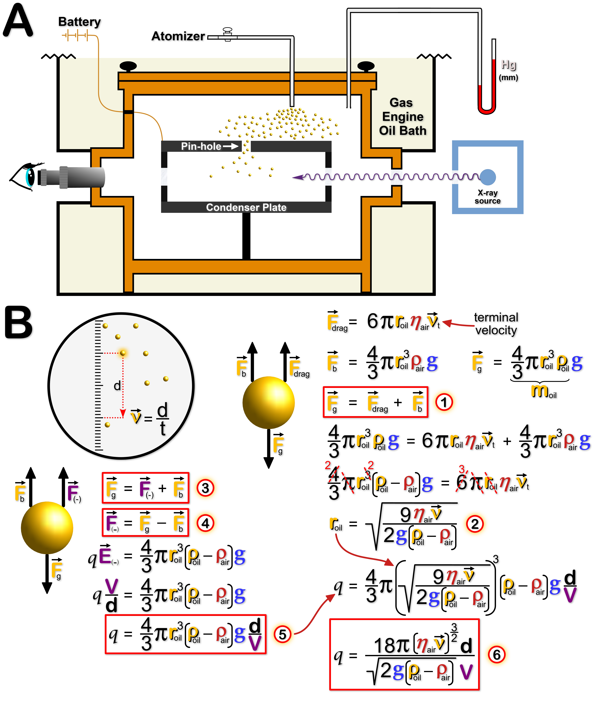
</figure>

**<u>Figure 4: Millikan's Oil Drop Experiment: Quantifying an Electron's Charge</u>.** <b>(A)</b> The famous <b>oil-drop method</b> was devised by <b>Millikan</b> to quantify the elementary <u>charge</u> of an electron (<span id="Dred">$e$</span>). The experimental apparatus was a sealed brass vessel that operated under varying pressure (i.e. monitored with a <span id="Magenta">Hg</span> barometer). Heat induced air convection currents that could interfere with the movement of the oil droplets were largely nullified by immersing the entire brass vessel within a large (40 L) gas-engine oil bath. Maintaining constant air temperature (&plusmn; 0.02 &#8451;) in this way was a key improvement to <b>Millikan's</b> earlier experimental apparatus. An atomizer introduced a mist of tiny oil droplets (i.e. high grade clock oil) into the vessel that entered the ebonite enclosed space between the two parallel metal plates through a small pin hole in the top plate (Note: movable pin-hole cover not shown). The air between the plates was ionized using an external X-ray source, with many "<i>free</i>" electrons being taken up by each oil droplet. The resulting charge on the droplets made them susceptible to the electrostatic forces generated by the capacitor plates. Two of the three pairs of built in windows are shown. One was used for X-ray ionization of the air between the plates, while the others were used to make velocity measurements of the falling oil drops using a calibrated microscope.<b>[@millikan_elementary_1913]</b><br>
<b>(B)</b> The cartoons of an oil droplet highlight the <u>forces</u>, namely <b>gravity</b> (<b>$\vec F_g$</b>), (ii) <b>buoyancy</b> (<b>$\vec F_b$</b>); (iii) <b>drag</b> (<b>$\vec F_{drag}$</b>), and (iv) <b>electrostatics</b> (<b>$\vec F_{(-)}$</b>) that affects it as it moves between the plates. The relationship of these forces are summarized in equations <b>&#9312;</b>, <b>&#9314;</b> and <b>&#9315;</b>. Equation <b>&#9312;</b> applies to a falling oil droplet in the absence of an electrical field ($\vec E_{(-)}$), while equation <b>&#9315;</b> shows that the upward <b>$\vec F_{(-)}$</b> must be equal to the difference between <b>$\vec F_g$</b> and <b>$\vec F_b$</b> when the droplet remains stationary between the two plates. Under this latter scenario there is no <b>$\vec F_{drag}$</b> exerted on the oil droplet since it is not moving through the air medium. In the case of a free falling oil droplet <b>Stokes Law</b> is used to account for <b>$\vec F_{drag}$</b> (i.e. frictional forces) exerted on a relatively small spherical object like an oil droplet (<b>Note:</b> a friction correction for small velocities is usually applied, but is not shown here). In this equation <b>η</b><sub>air</sub> is the viscosity of the air, <b>$r$</b> is the radius of the oil droplet, and <b>$\vec v$</b> is the terminal velocity of the droplet. The equation for <b>$\vec F_g$</b> eliminated the mass (<b>$m$</b>) term by using the expression for the volume of a sphere (<b>$\frac{4}{3} \pi r^3$</b>) and the density (<b>$\rho_{oil}$</b>) of the oil. The <b>$\vec F_b$</b> is due to	the upward thrust exerted on the droplet by the surrounding fluid (i.e. air). Combining these forces according to the relationship described by equation <b>&#9312;</b> ultimately provides an expression for the <u>radius</u> of an oil droplet (<b>Eq. &#9313;</b>). When <b>Millikan</b> and <b>Fletcher</b> adjusted the strength of the electric field (<b>$\vec F_{(-)} = q \vec E = q \frac{V}{d}$</b>, where <b>V</b> is voltage and <b>d</b> the distance between the two plates) so that the droplet remained suspended between the two plates, a mathematical expression can be derived for the amount of charge (<b>$q$</b>) carried by an electron (<b>Eq. &#9316;</b>). Finally, substituting equation <b>&#9313;</b> for the value of <b>r</b> in equation <b>&#9316;</b> provides an expression for the value of <b>q</b> that can be determined using the speed of the oil droplet (<b>Eq. &#9317;</b>). All of the parameters in equation <b>&#9317;</b>, other than the velocity (<b>$v$</b>) of the falling oil droplet, are known. One of the key observations that <b>Millikan</b> and <b>Fletcher</b> made during these experiments was that the <u>charge</u> of the electron was "<i>quantized</i>" (i.e. discrete units, and not continuous). The amount of charge that accumulated on the oil droplets (i.e. both negative and positive) were always multiples of a <u>basic unit of charge</u>, namely 4.774×10<sup>−10</sup> electrostatic units (<b>esu</b>), which is approximately 1.6x10<sup>-19</sup> <b>coulomb</b>.<b>[@serway_physics_2004; @thornton_modern_2013; @millikan_isolation_1911; @millikan_elementary_1913]</b>

</div>  
<!-------------------------------------------------------------->
<!-------------------------------------------------------------->
<!-------------------------------------------------------------->

<b>Millikan</b> used this new value for the elementary charge of an electron (<b>q<sub>(e-)</sub></b>) to re-calculate <b>Avogadro's number</b> (<b>N<sub>A</sub></b>) as well as other <b>N<sub>A</sub></b> dependent factors, such as <b>Boltzmann's</b> (<b>k<sub>B</sub></b>) and <b>Planck's</b> (<b>&planckh;</b>) <b>constants</b>.<b>[@millikan_elementary_1913]</b> For example, given the formula for <b>Faraday's constant</b> (<b>&Fscr;</b>):  

$$\tag{1} \mathscr{F} = q_{(e-)} \cdot N_A$$

where <b>&Fscr;</b> is equal to 9,650 electromagnetic units (**emu**) per <u>mole</u> of elementary charges and 1 **emu** is equal to 2.999 x 10<sup>10</sup> electrostatic units (**esu**). This would make the value of <b>$N_A$</b> equal to:  

$$\tag{1.1} N_A = \frac {9650 \frac {emu}{mole} \cdot 2.999 \text{x} 10^{10} \frac {esu}{emu}} {4.774 \text{x} 10^{-10} \frac {esu}{particle}} = 6.062 \text{x} 10^{23} \ particles/mole$$

Combining the work of **Millikan** with **JJ Thomson** one can easily calculate the mass of an electron as well as <span id="Blue">H</span><sup>+</sup>:

$$\tag{2} \frac{q_{(H+)}}{m_{(H+)}} = \frac{10^{4} \ emu}{gm} \cdot \frac{1000 \ gm}{kg} \cdot \frac{10 \ coulombs}{emu} = 10^{8} \ coulombs/kg$$

$$\tag{2.1} {m_{H+}} = \frac{1.6 \ \text {x}10^{-19} \ coulomb}{10^{8} \ coulomb/kg} = 1.6 \text{x} 10^{-27} \ kg$$

$$\tag{2.2} {m_{e-}} = \frac{1.6 \text {x}10^{-19} \ coulomb}{10^{11} \ coulomb/kg} = 1.6 \text{x} 10^{-30} \ kg$$

According to the **<a class="one" href="https://physics.nist.gov/cuu/Constants/index.html" target="_blank" title="Go to NIST">National Institute of Standards and Technology</a>** the current mass of a **proton** is 1.672621923 x 10<sup>-27</sup> kg, while that of the **electron** is 9.109383701 x 10<sup>-31</sup> kg. 


<a id="NAM"></a>
<h2><center>NUCLEAR THEORY OF THE ATOM</center></h2>
<!-------------------------------------------------->
<!-------- SECTION 2 - NUCLEAR ATOMIC MODEL -------->
<!-------------------------------------------------->

**<span style="border: 2px solid black;">&thinsp; 2. RUTHERFORD'S ATOMIC NUCLEUS &thinsp;</span>:** Although **Thomson's** discovery of the **electron** provided our first glimpse of the internal structure of the **atom**, his proposed "*Plum-pudding*" model lacked any experimental evidence to support it. Fortunately, the discovery of radioactivity (i.e. &alpha;, &beta;, and &gamma;) and its ability to penetrate matter provided a meaningful way of probing the structure of the **atom**. As **Ernest Rutherford** (1911) presciently stated in one of his earlier publications:

>"*Since the &alpha; and &beta; particles traverse the atom, it should be possible from a close study of the nature of the deflexion to form some idea of the constitution of the atom to produce the effects observed. In fact, the scattering of high-speed charged particles by the atoms of matter is one of the most promising methods of attack of this problem.*" <b>[@rutherford_scattering_1911]</b>

<a id="RGM"></a>
&nbsp; &nbsp; **Hans Geiger** and **Ernest Marsden**, who worked with **Ernest Rutherford**, provided the first significant piece of evidence that refuted **Thomson's** "*Plum pudding*" model.<b><sup>23,24</sup></b> One of the assumptions of **Thomson's** theory was that &alpha; particles would only undergo small changes in direction (i.e. angle of deflection) when travelling through an **atom**. So when **Geiger** and **Marsden** (1909) bombarded different metal targets with highly energetic &alpha;-particles they were surprised to observe:

>"*A small fraction of the alpha-particles falling upon a metal plate have their directions changed to such an extent that they emerge again at the side of incidence.*."<b>[@geiger_diffuse_1909]</b> 

Although the vast majority of the &alpha;-particles passed through the small platinum reflector (1 cm<sup>2</sup>) with little or no deflection, there were a small number of &alpha;-particles (~1 in 8,000) that were deflected greater than 90&deg; (**Fig. 5A**). As they pointed out in a follow up study:

>"*This amount of reflexion, although small, is, however, too large to be explained on the above simple theory of scattering. It is easy to calculate from the experimental data that the probability of a deflexion through an angle of 90 degrees is vanishingly small, and of a different order to the value found experimentally*."<b>[@geiger_laws_1913]</b> 

As **Geiger** and **Marsden** alluded to above the likelihood that any of the recorded back scattering events were produced by collisions between an &alpha;-particles and multiple **electrons** would be highly improbable. **Rutherford's** clearly pointed this out while formulating his new model:

>"*Remembering that the mass, momentum, and kinetic energy of the &alpha; particle are very large compared with the corresponding values for an electron in rapid motion, it does not seem possible from dynamic considerations that an &alpha; particle can be deflected through a large angle by a close approach to an electron, even if the latter be in rapid motion and constrained by strong electrical forces. It seems reasonable to suppose that the chance of single deflexions through a large angle due to this cause, if not zero, must be exceedingly small compared with that due to the central charge*."<b>[@rutherford_scattering_1911]</b>

In fact, one can use well known **Newtonian mechanics** and associated conservation laws to calculate the maximum angle of deflection an &alpha;-particle would undergo when colliding with one or more **electrons** within a metal target (**Fig. 5B**,**C**). Given that **Rutherford** had already shown that the &alpha;-particle is a doubly charged helium ion (<span id="Purple">He</span><sup>+2</sup>)<b>[@rutherford_nature_1909]</b> and therefore much larger than an electron (i.e. it was known at that time that the mass of an &alpha;-particles was ~7,000 times larger than the mass of an electron) one can see from the calculations below (**Fig. 5B**,**C**) that it would be impossible for an &alpha;-particle to be deflected by a large angle after colliding with an electron.<b><sup>10</sup></b> In fact, even if the &alpha;-particle randomly collided with <b>N</b> multiple **electrons** (e.g. <b>N</b> = 10,000), the estimated scattering angle would still be very small:


\begin{equation}
\tag{3} \theta_{avg} = \sqrt{N} \theta = \sqrt{10,000} (0.01637^\text o) = 1.637^ \text o
\end{equation}


Based on **Geiger** and **Marsden** findings **Rutherford** surmised that the large deflections ($\theta$ > 90<sup>o</sup>) of the &alpha;-particles could be explained by assuming each **atom** has:

>"*...a central charge supposed concentrated at a point, and that the large single deflexions of the &alpha; and &beta; particles are mainly due to their passage through the strong central field ...considering the evidence as a whole, it seems simplest to suppose that the atom contains a central charge distributed through a very small volume, and ...that the value of this central charge for different atoms is approximately proportional to their atomic weights...*" <b><sup>17</sup></b>

**Rutherford** also cleverly deduced (albeit with some reservations) that if the "*central charge*" (pre "*nucleus*" days) of an **atom** were positive than it would also help to explain some aspects of radioactivity (e.g. expulsion of &alpha;-particles by radioactive elements):

>"*If the central charge be positive, it is easily seen that a positively charged mass if released from the centre of a heavy atom, would acquire a great velocity in moving through the electric field. It may be possible in this way to account for the high velocity of expulsion of &alpha; particles without supposing that they are initially in rapid motion within the atom.*." <b><sup>17</sup></b>

<!-------------------------------------------------------------------->
<!------ FIG 5 - Rutherford alpha-particle electron collision  ------->
<!-------------------------------------------------------------------->
<div style="border: 2px solid gray; padding: 5px;">

<figure>

</figure>

**<u>Figure 5: Rutherford, Geiger & Marsden: Scattering Angle of alpha-particle</u>.** <b>(A)</b> Depicted above is the apparatus initially used by <b>Geiger</b> and <b>Marsden</b> to study the scattering of &alpha;-particles by various types of metals. Radium, the source of highly energetic positively charged &alpha;-particles, was placed above a lead plate that shielded the lower zinc sulphide screen from almost all background scattering events. Particles deflected by the metal foil by more than 90&deg; would strike the zinc sulphide screen and produce a brief flash. These events were recorded over a well defined area (i.e. 1 mm<sup>2</sup> field) using a low power microscope.<b>[@geiger_diffuse_1909]</b>  
<b>(B)</b> The cartoon shows an <u>elastic collision</u> between an high <b>energy</b> &alpha;-particle (<span id="Purple">He</span><sup>+2</sup>) and an <b>electron</b> belonging to a metal <b>atom</b> (reflector). As discussed previously such collisions must obey well known <u>conservation laws</u> for both <b>momentum</b> (<span id="Blue">$\vec \rho$</span><sub>system</sub> = constant) and <b>energy</b> (<span id="Red">E</span><sub>system</sub> = constant). The maximum amount of <b>momentum</b> transfer between the incident &alpha;-particle and an <b>electron</b> (Note: since the <b>electron</b> is initially at "<i>rest</i>" all of the initial <b>momentum</b> of the system is associated with the incident &alpha;-particle) will be associated with a head-on collision, while the <u>maximum</u> scattering angle (<b>$\theta$</b>) for an &alpha;-particle will be associated with the <u>maximum</u> amount of change (<b>$\Delta$</b>) in its <b>momentum</b> (<b>$\Delta$</b><span id="Blue">$\vec \rho$</span><sub>$\alpha$</sub>). Rearranging equation <b>&#9312;</b> produces an expression for the final velocity of our &alpha;-particle, which can be substituted into equation <b>&#9313;</b>. Since the <b>electron</b> mass is much smaller than the mass of the &alpha;-particle (i.e. 1 + <b>m</b><sub>e</sub>/<b>m</b><sub>$\alpha$</sub> &approx; 1, <b>&#9314;</b>) we can therefore assume that <span id="Dred">$\vec v$</span><sub><b>$e$</b></sub> is approximately equal to <b>$2$</b><span id="Blue">$\vec v$</span><sub><b>$\alpha$</b></sub> (<b>&#9315;</b>). This value is negative owing to the direction of this vector quantity (<b>C</b> diagram below).<b>[@thornton_modern_2013]</b>  
<b>(C)</b> Sketching the <b>momentum</b> vectors for the collision helps to visualize the &alpha;-particle scattering event. Although a head on collision would result in the <b>electron</b> moving in the same direction as the incident &alpha;-particle, we can instead suppose that a small scattering angle (<b>$\theta$</b>) is produced for the maximum (absolute) value of <b>$\Delta$</b><span id="Blue">$\vec \rho$</span><sub>$\alpha$</sub> (i.e. 2<b>m</b><sub>e</sub><b>$\vec v$</b><sub>$\alpha$</sub>). Since the <u>initial</u> <span id="Blue">$\vec v$</span><sub>$\alpha$</sub> is approximately equal to the <u>final</u> <span id="Blue">$\vec v$</span><sub>$\alpha$</sub> the resulting geometry of the combined vectors produces an equilateral triangle. Bisecting the scattering angle <b>$\theta$</b> produces two right angled triangles, whose other angles can be calculated using <b><a class="one" href="https://www.mathsisfun.com/algebra/trigonometric-identities.html" target="_blank" title="Go to MathIsFun">trigonometric identities</a></b>. Converting the <u>radian</u> value of <b>m</b><sub>e</sub>/<b>m</b><sub>&alpha;</sub> to degrees places an upper limit of 0.01637<sup>o</sup> (<b>&#9316;</b>) for the scattering angle <b>$\theta$</b> (<b>Note:</b> since the value of <b>$\Delta$</b><span id="Blue">$\vec \rho$</span><sub>$\alpha$</sub> is for a head-on collision the resulting angle would be greater than any possible real scattering angle). Alternatively, one can also use the <b><a class="one" href="https://www.mathsisfun.com/algebra/triangle-identities.html" target="_blank" title="Go to MathIsFun">cosine law</a></b> in combination with a half angle trigonometric identity (i.e. <b>$sin(\theta/2) = \sqrt{(1- cos\theta)/2}$</b>) to calculate the value of angle <b>$\theta$</b>.<b>[@thornton_modern_2013]</b>

</div>
<!-------------------------------------------------------------------->
<!-------------------------------------------------------------------->
<!-------------------------------------------------------------------->

A follow up study by **Geiger** and **Marsden** (1913) using an improved scintillation apparatus (i.e. microscope and screen rotated together) allowed them to more systematically count the number of particles scattered and thus carefully test **Rutherford's** new theory of the **atom**.<b>[@rutherford_scattering_1911; @geiger_laws_1913]</b> Their analysis supported **Rutherford's** proposed central charge of the **atom** that was "*concentrated within a sphere of less than about 3×10<sup>−12</sup> cm radius and surrounded by electricity of the opposite sign distributed throughout the remainder of the atom of about 10<sup>−8</sup> cm radius*."<b>[@geiger_laws_1913]</b> Unfortunately, **Rutherford's** model, like **Thomson's** "*Plum pudding*" model, could not explain the stable arrangement of negative and positive charges within the **atom**. **Rutherford's** proposed circular orbits of **electrons** would be "*doomed*", since according to **Maxwell's** <u>electromagnetic theory</u> charged particles, like **electrons**, travelling through a electromagnetic field radiate energy. So **electrons** orbiting the nucleus would constantly radiate (lose) energy and quickly (<10<sup>-9</sup> sec) spiral down toward the nucleus.


<a id="BAM"></a>
<h2><center>BOHR'S QUANTUM MODEL OF HYDROGEN</center></h2>
<!---------------------------------------------------------->
<!-------- SECTION 3 - BOHR'S QUANTUM MODEL OF ATOM -------->
<!---------------------------------------------------------->

**<span style="border: 2px solid black;">&thinsp; 3. BOHR MODEL &thinsp;</span>:** The failure of the **Rutherford** model was soon corrected by **Niels Bohr** (1913), who's insight was to combine classical **Newtonian** mechanics with **Planck’s** (1900) and **Einstein's** (1905) ideas about the **quantum** behaviour of energy (i.e. <span id="Red">E</span> = **n**<span id="Blue">&#8462;</span><span id="Purple">&#651;</span>, where **n** is an integer, <span id="Blue">&#8462;</span> is Planck’s constant and <span id="Purple">&#651;</span> is the frequency).<b>[@bohr_i_1913]</b> In essence, he ushered in the **<a class="one" href="https://toutestquantique.fr/en/quantization/">quantization</a>** of the **atom** (i.e. energy, momentum, distance). As **Bohr** (1913) clearly alluded to in his paper:  

<a id="Bohr1"></a>

>"*...apparent instability of the system of electrons [Rutherford model]...seems to be a general acknowledgment of the inadequacy of the classical electrodynamics in describing the behaviour of systems of atomic size. Whatever the alteration in the laws of motion of the electrons may be, it seems necessary to introduce in the laws in question a quantity foreign to the classical electrodynamics, i.e. Planck's constant, or as it often is called the elementary quantum of action.*."<b>[@bohr_i_1913]</b>  

<!------------------------------------------------------------------->
<!------------ FIG 6 - Bohr's Atomic Model of Hydrogen  ------------->
<!------------------------------------------------------------------->
<div style="border: 2px solid gray; padding: 5px;">
<figure>

</figure>

**<u>Figure 6: Bohr's "Quantized" Model of the Hydrogen Atom</u>.** <b>(A)</b> Classical <b>Newtonian</b> mechanics can be used to model a <u>negatively</u> charged <b>electron</b> orbiting a <u>positively</u> charged <b>nucleus</b> (e.g. <span id="Blue">H</span>ydrogen atom system). The total energy of the orbiting <b>electron</b> is the sum of its <u>potential energy</u> (<span id="Purple">P</span><span id="Red">E</span>) and <u>kinetic energy</u> (<span id="Dred">K</span><span id="Red">E</span>), with the <span id="Purple">P</span><span id="Red">E</span> being the product of the two charges and the inverse of the distance separating them (<b>&#9312;</b>). As depicted in the diagram the <b><a class="one" href="http://hyperphysics.phy-astr.gsu.edu/hbase/cf.html#cf" target="_blank" title="Go to HyperPhysics">centripetal force</a></b> (<span id="Purple">F</span><b><sub>c</sub></b>) holding the electron in orbit around the nucleus is accounted for by the <u>electromagnetic force</u> (<span id="Purple">F</span><b><sub>e</sub></b>) between the two separated charges, which is best described by <b><a class="one" href="http://hyperphysics.phy-astr.gsu.edu/hbase/electric/elefor.html#c1" target="_blank" title="Go to HyperPhysics">Coulomb's Law</a></b>. The equations for these two forces are therefore set equal to each other, and subsequently rearranged to generate an expression for <b>m</b><sub>e</sub><span id="Dred">$\vec v_e$</span><sup>2</sup>. Half of this latter value is equal the <span id="Dred">K</span><span id="Red">E</span> of the <b>electron</b> (<b>&#9313;</b>). Finally, by combining the <span id="Dred">K</span><span id="Red">E</span> and <span id="Purple">P</span><span id="Red">E</span> we can come up with a classical expression for the total energy of the <b>electron</b> (<b>&#9314;</b>).<b>[@thornton_modern_2013]</b>  
**(B)** <b><a class="one" href="http://hyperphysics.phy-astr.gsu.edu/hbase/Bohr.html#c4" target="_blank" title="Go to HyperPhysics">Bohr's quantized model</a></b> of the <b>hydrogen atom</b> is related to the <b><a class="one" href="http://hyperphysics.phy-astr.gsu.edu/hbase/debrog.html#c2" target="_blank" title="Go to HyperPhysics">wave-like nature</a></b> (<span id="Dred">$\lambda$</span>) of light, which was later famously expanded upon by <b>Louis De Broglie</b> (1923). The proposed wavelength of the orbiting <b>electron</b> can be pictured by plotting the length of the orbit's radius (<span id="Dred">r</span> = 1 for unit circle) as it rotates counter-clockwise, somewhat analogous to the rotating second hand of a clock. The resulting plot (height vs. degree rotation) produces a familiar sinusoidal curve (i.e. <b>sine-wave</b>) which has a characteristic <b>wave-length</b> (<span id="Dred">$\lambda$</span>) that is related to the circumference (<b>C</b> = 2<b>$\pi r$</b>) of the circular orbit (<b>&#9315;</b>). This expression for <span id="Dred">$\lambda$</span> can be combined with <b>Planck's</b> "<i>quantized</i>" energy expression (<span id="Red">E</span> = <span id="Blue">&planckh;</span><span id="Purple">$\nu$</span>) and <b>Einstein's</b> famous energy equation (<b>&#9317;</b>, <span id="Red">E</span> = <b>m</b><span id="Blue">c</span><sup>2</sup>) to generate a "<i>quantized</i>" version of the momentum of an <b>electron</b> (<b>&#9318;</b>). This latter expression can then be substituted into the classical equation for <b><a class="one" href="http://hyperphysics.phy-astr.gsu.edu/hbase/amom.html#amp" target="_blank" title="Go to HyperPhysics">angular momentum</a></b> (<span id="Blue">$L$</span>) in order to "<i>quantize</i>" it (<b>&#9319;</b>). Similarly the classical equation for the <span id="Dred">K</span><span id="Red">E</span> of an <b>electron</b> can also be "<i>quantized</i>" by incorporating the newly "<i>quantized</i>" <span id="Blue">$L$</span> (<b>&#9320;</b>). Finally, by equating classical <span id="Dred">K</span><span id="Red">E</span> with "<i>quantized</i>" <span id="Dred">K</span><span id="Red">E</span> we can generated a "<i>quantized</i>" value for the <u>radius</u> of the <span id="Blue">H</span>ydrogen atom (<b>&#9321;</b>), as well as the <u>total energy</u> of an <b>electron</b> found in any of the major energy levels (<b>&#9322;</b>). <b>SYMBOLS:</b> <span id="Blue">&planckh;</span> = <b>Planck's</b> constant, <span id="Purple">$\nu$</span> = frequency, <b>&#120598;</b><sub>o</sub> = <b>permittivity</b> of free space, <span id="Dred">e</span> = unit charge of an electron, <b>Z</b> = atomic number, <b>n</b> = energy level, later referred to as the <b>principal quantum number</b>.<b>[@thornton_modern_2013; @bohr_i_1913]</b>

</div>
<!------------------------------------------------------------------->
<!------------------------------------------------------------------->
<!------------------------------------------------------------------->

In many ways this was a "*watershed*" moment, since **Bohr** made it clear that traditional **Newtonian** models were lacking when trying to characterize **matter** (specifically **electrons**) and **energy** at subatomic scales. **Bohr's** integration of quantum concepts with classical mechanics (**Fig. 6**) allowed him to successfully predict the unique spectral emission patterns of hydrogen. Using **Bohr's** derived formula one can easily calculate the discrete energy values and wavelengths of light emitted (i.e. emission spectra) by **electrons** as they transition between different energy levels (**Fig. 7**). 

<a id="Bohr2"></a>
<!------------------------------------------------------------------>
<!------ FIG 7 - Bohr's Atomic Model of Hydrogen - Part II   ------->
<!------------------------------------------------------------------>
<div style="border: 2px solid gray; padding: 5px;">

<figure>
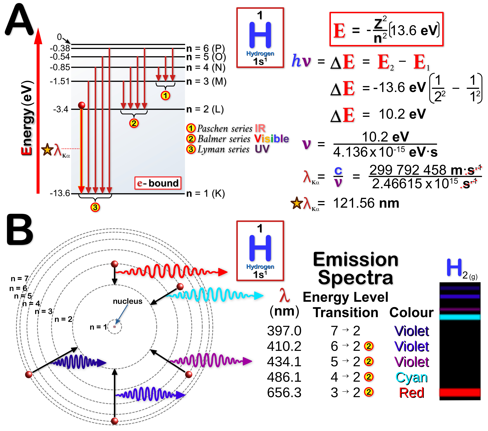
</figure>

**<u>Figure 7: Bohr's Model of Hydrogen Energy Levels</u>.** <b>(A)</b> In a hydrogen (<sup>1</sup><span id="Blue">H</span>) atom an <b>electron</b> can <b><a class="one" href="http://hyperphysics.phy-astr.gsu.edu/hbase/hyde.html" target="_blank" title="Go to HyperPhysics">transition between different energy levels</a></b>. An <u>excited</u> <b>electron</b> occupying a higher energy level is energetically unstable and consequently a short lived micro-state. As it transitions, or "<i>jumps</i>" down, to a lower energy level (<b>n</b>) it will release a discrete amount of energy (<span id="Red">E</span> = <span id="Blue">&planckh;</span><span id="Purple">$\nu$</span>) that corresponds to a distinct frequency (<span id="Purple">$\nu$</span>) and wavelength (<span id="Dred">$\lambda$</span>) of light. For example, the energy released as an electron transition between energy level 2 (<b>n</b> = 2, or <b>L</b> shell) and energy level 1 (<b>n</b> = 1, or <b>K</b> shell) can be calculated using <b>Bohr's</b> famous formula (i.e. <b>&Delta;</b><span id="Red">E</span> = 10.2 <b>eV</b>). This discrete amount of energy corresponds to a wavelength of 121.56 <b>nm</b> (i.e. UV range) which is one of the spectral lines of the <b>Lyman series</b>. Energetic <b>electrons</b> transitioning to the second energy level (<b>n</b> = 2) or the third energy level (<b>n</b> = 3) produce spectral lines that are part of the <b>Balmer</b> (<span id="Red">v</span><span id="Or">i</span><span id="Gold">s</span><span id="Gr">i</span><span id="Blue">b</span><span id="Purple">l</span><span id="Dpurp">e</span>) and <b>Paschen</b> (<span id="Coral">IR</span>) series, respectively.<b>[@thornton_modern_2013]</b>  
**(B)** A more visual account of <b>Bohr's</b> model of the hydrogen atom is shown, with the colour of the wave-like energy packets being released by an <b>electron</b> as it <u>transition</u> between specific energy levels (<b>Balmer series</b>). A table detailing the wavelength, transitions and colour of the released <b>photons</b>, along with a representation of the emission spectra for hydrogen gas is shown.
**SYMBOLS:** <span id="Blue">&planckh;</span> = <b>Planck's</b> constant, <span id="Purple">$\nu$</span> = frequency, <span id="Dred">$\lambda$</span> = wavelength, <span id="Coral">IR</span> = infra-red, <b>$\Delta$</b><span id="Red">E</span> = change in energy, <span id="Dred">$\lambda$</span><sub>K</sub><sub>$\alpha$</sub> = wavelength of a photon released during an electron transition between L and K shells (<b>Lyman series</b>).
</div>
<!------------------------------------------------------------------>
<!------------------------------------------------------------------>
<!------------------------------------------------------------------>

One of the great triumphs of the **Bohr model** was its ability to explain the **characteristic X-rays** emitted by elements (**Fig. 8**). Around the time that **Bohr** (1913) published his new atomic model **Henry Moseley** (1913-1914), under **Rutherford's** guidance, was characterizing the "*high-frequency spectra of the elements*".<b>[@moseley_xciii_1913; @moseley_lxxx_1914]</b> He showed, like **Charles Barkla** (1906) did before him, that "*secondary*" **X-rays** emitted by metals after being bombarded by primary **cathode rays**, were unique to each element.<b>[@barkla_lxxvi_1906]</b> Moreover, **Moseley** showed that there was a direct link between the <u>frequency</u> (i.e. <span id="Red">E</span>nergy = &planck;<span id="Purple">$\nu$</span>) of the emitted "*secondary*" **X-ray** and the atomic number, or <u>nuclear charge</u> (**Z**), of the element.<b>[@barkla_lxxvi_1906; @egdell_henry_2020]</b> These experiments were instrumental in showing that **Z**, not the **atomic mass**, is the key distinguishing feature of elements within the **Periodic Table**.<b>[@moseley_lxxx_1914; @egdell_henry_2020]</b> The impact of **Moseley's** work was quickly understood by the scientific community, resulting in the elements of the **Periodic Table** being re-arranged according to their increasing atomic number. Unfortunately, **Moseley** untimely death (1915) during WWI cut short his brilliant scientific career.  

<a id="CharXrays"></a>
<!-------------------------------------------------------------------->
<!------ FIG 8 - Moseley's Characteristic X-rays of Elements   ------->
<!-------------------------------------------------------------------->
<div style="border: 2px solid gray; padding: 5px;">

<figure>
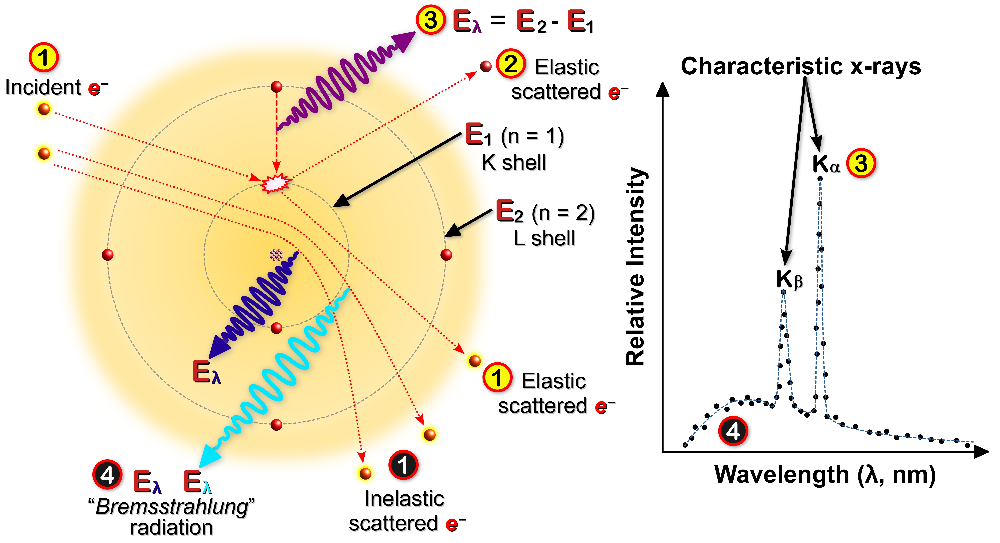
</figure>

**<u>Figure 8: Characteristic X-rays of Elements</u>.** When bombarding elements with high energy <b>electrons</b> (<span id="Dred">e</span><sup>-</sup>) both <u>elastic</u> collisions and <u>inelastic</u> scattering events can occur, resulting in the release of two different types of secondary radiation. Incident <b>electrons</b> (<b>&#9312;</b>) that undergo elastic collisions with <u>inner shell</u> <b>electrons</b> cause the latter to be ejected (<b>&#9313;</b>) from the atom. The "<i>excited</i>" atom now has a <u>vacancy</u> within the inner shell that is quickly remedied by an <u>outer shell</u> <b>electron</b> (<b>&#9314;</b>) falling into this lower energy level. This "<i>falling</i>" <b>electron</b> emits a photon with an <b>energy</b> (i.e. <span id="Red">E</span> = <b>&planckh;</b><span id="Purple">$\nu$</span>) equal to the <b>energy</b> difference ($\Delta$<span id="Red">E</span><sub>$\lambda$</sub>) between these two <u>energy levels</u> (<b>&#9314;</b>). Since elements have unique sets of <u>energy levels</u> they are therefore capable of emitting a pattern of <b>X-rays</b> that are characteristic of the element (i.e. <b><a class="one" href="http://hyperphysics.phy-astr.gsu.edu/hbase/quantum/xrayc.html" target="_blank" title="Go to HyperPhysics">characteristic X-rays</a></b>). The characteristic <b>K</b><sub>$\alpha$</sub> X-ray is emitted by an <b>electron</b> transitioning between the 2<sup>nd</sup> and 1<sup>st</sup> (K-shell) energy level, while the higher frequency <b>K</b><sub>$\beta$</sub> X-ray is emitted by an <b>electron</b> transitioning between the 3<sup>rd</sup> and 1<sup>st</sup> (K-shell) energy level (<b>Note:</b> the latter is not shown in the atom diagram). If the path of an incident <b>electron</b> brings it relatively close to the nucleus the positive charge of the latter can alter (i.e. scatter) the path and speed (i.e. energy) of the electron (&#10102;) resulting in the release of <b><a class="one" href="http://hyperphysics.phy-astr.gsu.edu/hbase/quantum/xrayc.html" target="_blank" title="Go to HyperPhysics">bremsstrahlung</a></b> ("<i>braking</i>") <b>X-rays</b> (i.e. a continuous low intensity band of radiation, &#10105;).<b>[@thornton_modern_2013]</b>  

</div>
<!-------------------------------------------------------------------->
<!-------------------------------------------------------------------->
<!-------------------------------------------------------------------->


<a id="Qmech"></a>
<h2><center>QUANTUM MECHANICS</center></h2>
<!--------------------------------------------------->
<!-------- SECTION 4 - WAVE-PARTICLE DUALITY -------->
<!--------------------------------------------------->

**<span style="border: 2px solid black;">&thinsp; 4. Matter Waves & Wave Mechanics &thinsp;</span>:** Despite the successes of **Bohr's** atomic model its explanatory power was limited to **atoms** that only have one electron (e.g. <span id="Blue">H</span>, <span id="Purple">He</span><sup>+1</sup>, <span id="Dgray">Li</span><sup>+2</sup>). Moreover, the model ultimately did not explain how atoms combine to form molecules.  
&nbsp; &nbsp; The next breakthrough came courtesy **Louis de Broglie** (1924), who proposed that all particles (i.e. **electrons** and **atoms**) possess "*wave-like*" properties (**Fig. 9**).<b>[@de_broglie_waves_1923; @broglie_xxxv_1924; @de_broglie_theory_1925]</b> This type of **wave**-**particle** duality was previously used by **Albert Einstein** (1905) to describe <u>energy</u> (i.e. electromagnetic radiation) in his famous study of the **photoelectric effect**.<b>[@einstein_uber_1905-1]</b> Fortunately for **de Broglie** his "*matter-wave*" theory was confirmed a few years later by **<a class="one" href="http://hyperphysics.phy-astr.gsu.edu/hbase/davger.html#c1" target="_blank" title="Go to HyperPhysics">Davisson</a>** and **<a class="one" href="http://hyperphysics.phy-astr.gsu.edu/hbase/davger.html#c1" target="_blank" title="Go to HyperPhysics">Germer</a>** (1927) who showed that **electrons** generate "*wave-like*" diffraction patterns similar to energetic **X-rays**.<b>[@davisson_scattering_1927]</b> The originality of **de Broglie's** thinking is quite extraordinary, namely that particles like **electrons** could have an intrinsic "*phase wave*" (i.e. intra-atomic motion) that is somehow "*in-tune*" with the overall motion of the particle (a concept that will be discussed further below).<b>[@de_broglie_theory_1925; @weinberger_revisiting_2006; @logiurato_relativistic_2014; @mankin_about_2022]</b> As **de Broglie** stated in his **<a class="one" href="https://www.nobelprize.org/prizes/physics/1929/broglie/facts/" target="_blank" title="Go to NobelPrize">Nobel prize</a>** lecture (1929) the main goal of his early work was to find a connection between **matter** and **waves**.  

>"...*since <u>corpuscles</u> and <u>waves</u> cannot be independent because, according to Bohr’s expression, they constitute two complementary forces of reality, it must be possible to establish a certain parallelism between the motion of a corpuscle and the propagation of the associated wave. The first objective to achieve had, therefore, to be to establish this correspondence ....the determination of the stable motions of the electrons in the atom involves <u>whole numbers</u>, and so far the <u>only phenomena</u> in which <u>whole numbers</u> were <u>involved in physics</u> were those of <u>interference</u> and of <u>eigenvibrations</u>* [i.e. natural frequency]. *That suggested the idea to me that <u>electrons</u> themselves could not be represented as simple corpuscles either, but that a periodicity <u>had also to be assigned to them too</u>*."<b>[@de_broglie_wave_1929]</b> 

The concept of a **matter-wave** is generally quite foreign to most people today as it was a century ago. This is not surprising given how small they are for everyday objects. For example, a standard <u>golf ball</u> weighing 45.93 grams and travelling 160 km per hour (i.e. 44.44 m/sec) would have a wavelength of:

$$\tag{4} \lambda = \frac{h}{\vec p} = \frac{6.63 \times 10^{-34} \text{ J} \cdot \text{sec}}{(0.04593 \text{ kg})(44.44 \text{ m/sec})} =  3.248 \times 10^{-34} \text{ m}$$

When compared to the 7.27 x 10<sup>-10</sup> m **wavelength** of a typical **electron** (9.109 x 10<sup>-31</sup> kg) travelling at 10<sup>6</sup> m/sec, the wavelength of a golf ball is unimaginably small. This is why **matter-waves** of everyday objects have <u>never</u> been observed! Fortunately for **Davisson** and **Germer** (1927) the wavelength of the **electron** was just the right size to generate an observable diffraction pattern (which is characteristic of waves) using a crystal lattice of nickel.<b>[@davisson_scattering_1927]</b> 


<a id="Mwaves"></a>
<!------------------------------------------------------------>
<!------------ FIG 9 - De Broglie Matter-Waves   ------------->
<!------------------------------------------------------------>
<div style="border: 2px solid gray; padding: 5px;">

<figure>
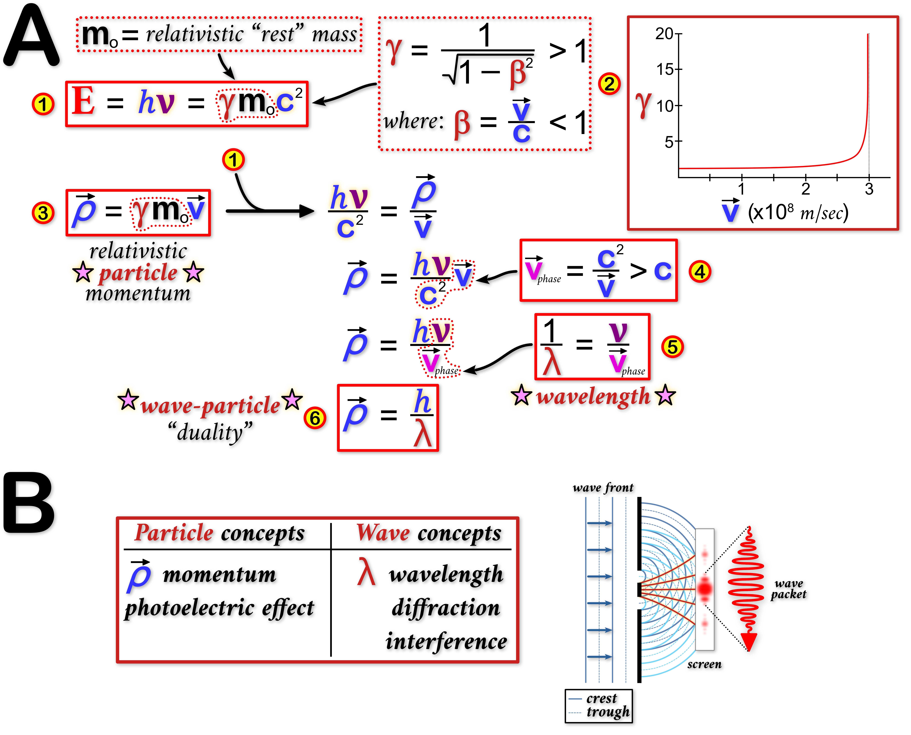
</figure>

**<u>Figure 9: De Broglie's Matter-Waves</u>.** <b>(A)</b> <b>De Broglie</b> proposed that <b>matter</b>, like light, has both <b>wave</b> and <b>particle</b> properties. Specifically he imagined that <b>atoms</b> and <b>electrons</b> have an <u>internal</u> periodic wave-like property, a kind of natural frequency, that is consistent with both <b>Planck's</b> and <b>Einstein's</b> <b>energy</b> (<b>&#9312;</b>, <span id="Red">E</span> = <b>$h$</b><span id="Purple">$\nu$</span>, and <span id="Red">E</span> = <b>$\text m_{\text o}$</b><span id="Blue">c</span><sup>2</sup>/<b>$\sqrt{1-\beta^2}$</b>) and <b>momentum</b> (<b>&#9314;</b>, <span id="Blue">$\vec \rho_{\text o}$</span> = <b>$\text m_{\text o}$</b><span id="Blue">$\vec v$</span>/<b>$\sqrt{1-\beta^2}$</b>) equations. Its important to note that <b>de Broglie</b> devised his argument based on <b>Einstein's</b> theory of <u>special relativity</u>, which places a <u>strict</u> speed limit on all matter (<b>&#9313;</b>, light travels at &cong; 3x10<sup>8</sup> m/sec). When the speed of any particle approaches the speed of light its mass will rapidly increase (going to <u>infinity</u>) the closer it gets to <span id="Blue">c</span> (<b>&#9313;</b>, graph of <span id="Dred">$\gamma$</span> versus <span id="Blue">$\vec v$</span>). Under such a scenario the energy requirements for moving such a massive particle will also proceed to infinity. Based on these relativistic constraints <b>de Broglie</b> proposed that the <u>internal harmonic oscillation</u> of a particle would be coupled (i.e. in <i>phase</i>) to a "<i>fictitious</i>" wave that he referred to as a "<i>pilot-wave</i>". Interestingly he reasoned that since the "<i>pilot-wave</i>" travels <u>faster</u> than the speed of light that it therefore could not transport energy (<b>&#9315;</b>). Ultimately <b>de Broglie</b> was able to "<i>quantize</i>" (<b>&#8462;</b>) the relationship between the <b>momentum</b> and <b>wavelength</b> (<b>&#9316;</b>, <span id="Dred">$\lambda$</span>) of a particle, thereby highlighting the <b>wave-particle duality</b> of <b>matter</b> (<b>&#9317;</b>).<b>[@broglie_xxxv_1924; @de_broglie_theory_1925; @thornton_modern_2013]</b>  
**(B)** <b>Einstein</b> showed that the <b>photo-electric</b> effect of light can be explained if light is considered a <i>particle</i>, specifically a "<i>quantum</i>" or <u>discrete</u> "<i>packet</i>" of <b>energy</b> known as a <b>photon</b>. However, other properties of light, namely diffraction and interference, are better explained if light is a wave. <b>De Broglie</b> (1924) famously postulated that matter has "<i>wave-like</i>" properties. The "<i>double-slit experiment</i>" (<b>Fig. 16</b>) is perhaps the most famous demonstration of the <b>quantum</b> nature (i.e. <b>wave-particle duality</b>) of light and matter.  

</div>
<!------------------------------------------------------------>
<!------------------------------------------------------------>
<!------------------------------------------------------------>


&nbsp; &nbsp; **De Broglie's** work proved to be the major impetus behind **Schrodinger's** development of a **wave equation** (<b>$\Psi_{(x,t)}$</b>) to model these newly found <b>matter-waves</b>.<b>[@schrodinger_quantisierung_1926; @schrodinger_undulatory_1926]</b> As he clearly stated in the opening lines of his 1926 publication:

>"*The theory which is reported in the following pages is based on the very interesting and fundamental researches of L. de Broglie on what he called “phase-waves” (“ondes de phase”) and thought to be associated with the motion of material points, especially with the motion of an electron or proton*."<b>[@schrodinger_undulatory_1926]</b>

He also mentions the "*ordinary*" wave equation for propagating waves</u> as being an appropriate "*starting point*" for his work:

>"...*wave-phenomenon must in this case be studied in detail. This can only be done by using an “equation of wave propagation”. Which one is this to be? In the case of a single material point, moving in an external field of force, the simplest way is to try to use the ordinary wave-equation*."<b>[@schrodinger_undulatory_1926]</b>  

The importance of the <u>classical</u> **wave equation** lies in its ability to model most **wave** phenomena (e.g. water, sound, light waves). Standard notation for the **wave equation** is the Greek letter **$\Psi$**, with the associated variables shown in parentheses (<b>$x$</b>, <b>$t$</b>):  

$$\tag{5} \frac{\partial^2\Psi_{(x,t)}}{\partial x^2} = \frac{1}{\vec {\text v}^2} \cdot \frac{\partial^2\Psi_{(x,t)}}{\partial t^2}$$

&nbsp; &nbsp; The "<i>output</i>" of this linear wave equation ($\Psi_{(x,t)}$) corresponds to the height of the wave, which varies with respect to time (<b>$t$</b>) as it travels in the <b>x</b> direction. Note that: <b>(i)</b> the 1<sup>st</sup> order partial derivative with respect to <b>x</b> ($\partial \Psi_{(x,t)} / \partial x$) is simply the <u>slope</u> (<span id="Orchidb">$m$</span>) of the curve (<b>Fig. 10C</b>); and <b>(ii)</b> a 2<sup>nd</sup> order partial derivative with respect to <b>x</b> ($\partial^2 \Psi_{(x,t)} / \partial x^2$), which is a derivative of a derivative, measures changes in the <u>slope</u> of the curve, which is a measure of the <b><a class="one" href="https://www.mathsisfun.com/calculus/concave-up-down-convex.html" target="_blank" title="Go to MathIsFun">concavity</a></b> of the curve (<b>Fig. 10C</b>). Lastly, the 2<sup>nd</sup> order partial derivative with respect to <b>t</b> measures changes in the wave's <u>speed</u>, which is simply its <b>acceleration</b> ($\vec{\text a} = \partial \vec{\text v} \text{/} \partial t = \partial (\partial x \text{/} \partial t) \text{/} \partial t = \partial^2 x / \partial t^2$).<b>[@thornton_modern_2013]</b> Although these symbols can often be "<i>off-putting</i>" for non-mathematicians like myself, you can quickly verify this "<i>equality</i>" by checking the "<i>variable space</i>". Specifically, both sides of the equation have to share the same units (<b>$Eq. 5$</b> denominators: <b>$x^2 = \vec{\text v}^2 \cdot t^2 \quad \text{where} \quad \vec{\text v}^2 = \frac{x^2}{t^2}$</b>).  

<a id="DFunc"></a>
<!-------------------------------------------------------->
<!------ FIG 10 - Sinusoidal Displacement function ------->
<!-------------------------------------------------------->
<div style="border: 2px solid gray; padding: 5px;">

<figure>
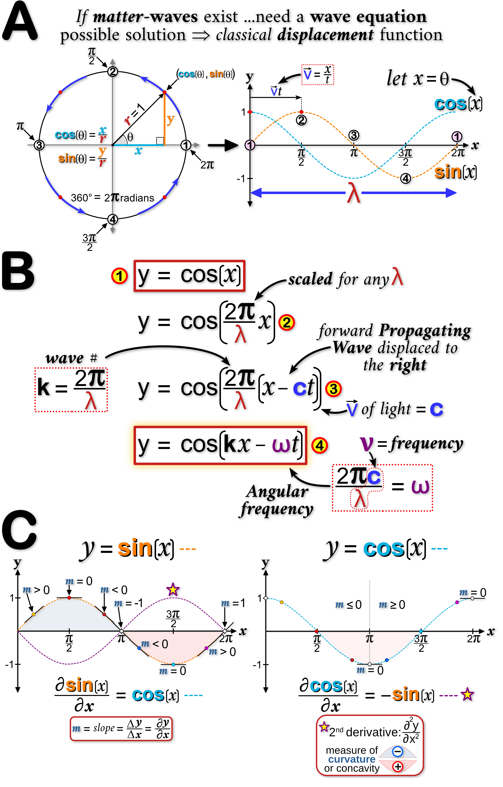
</figure>

**<u>Figure 10: Sinusoidal Functions</u>.** <b>(A)</b> Periodic motion, such as the <u>circular motion</u> of the <span id="Dred">red</span> particle depicted above, can be quantified using two basic <u>trigonometric functions</u>, namely <b>sine</b> (<span id="Ror2">sin</span>(<b>$\theta$</b>) = opposite/hypotenuse) and <b>cosine</b> (<span id="Glacialb">cos</span>(<b>$\theta$</b>) = adjacent/hypotenuse). Both of these trigonometric ratios can measure the <u>angular distance</u> (<b>$\theta$</b>) the particle makes relative to a central reference point along the x-axis. Plotting these two distance ratios versus the <u>angular distance</u> in <b>radians</b> (i.e. <b>$2 \pi$</b> <b>radians</b> = <b>$360^{\text o}$</b>) produces the characteristic <u>sinusoidal</u> or "<i>wavy</i>" curves. The shape of these two functions are identical, with the only difference being a phase shift of <b>$\pi / 2$</b> <b>radians</b> (<b>$90^{\text o}$</b>). If the <span id="Glacialb">cos</span>(<b>$x$</b>) curve is shifted to the right by <b>$\pi / 2$</b> radians then it perfectly overlaps <span id="Ror2">sin</span>(<b>$x$</b>), while shifting it to the left by <b>$\pi / 2$</b> radians makes it the mirror image of the other trig function. Note that the speed and time of the orbiting <span id="Dred">red</span> particle can be used to determine its position within the <b>x-y</b> plane (i.e. <b>$x = \vec {\text v} t$</b>, (<b>x</b>, <b>y</b>) position = (<span id="Glacialb">cos</span><b>$\theta$</b>, <span id="Ror2">sin</span><b>$\theta$</b>)).  
**(B)** For both <span id="Ror2">sin</span>(<b>$x$</b>) and <span id="Glacialb">cos</span>(<b>$x$</b>) (<b>&#9312;</b>) the distance (along the <b>$x$</b> axis) of one complete "<i>wave</i>" cycle is represented by <span id="Dred">$\lambda$</span>, which is equal to <b>$2 \pi$</b> <b>radians</b>. For example, when <span id="Glacialb">cos</span>(<b>$x$</b>) is scaled accordingly (<b>$2 \pi$</b> <b>radians</b> per cycle) it displays the appropriate <b>wave number</b> (<b>&#9313;</b>, <b>k</b> = <b>$2 \pi$</b>/<span id="Dred">$\lambda$</span>). Although factoring the displaced position (<b>&#9314;</b>, <b>distance</b> = <b>$x$</b> - <span id="Blue">c</span><b>$t$</b>) of the particle by <b>k</b> yields a slightly more complicated function (<b>&#9314;</b>), the expression can be further simplified by realizing that <b>$2 \pi$</b><span id="Blue">c</span>/<span id="Dred">$\lambda$</span> is equal to the <u>angular frequency</u> (<span id="Purple">$\omega$</span>) of the orbiting particle. Overall, this function will take the following form: <b>y</b> = <span id="Glacialb">cos</span>(<b>k</b><b>$x$</b> - <span id="Purple">$\omega$</span><b>$t$</b>) (<b>&#9315;</b>).<b>[@thornton_modern_2013]</b>  
**(C)** An important feature of these sinusoidal curves is how their shape <u>changes</u> over the course of one cycle. The <u>slope</u> (<span id="Db2">m</span>) at any point along these curves is equal to the slope of its <u>tangent line</u> (i.e. line only touches the curve at one point). As shown above the <u>slope</u> (<span id="Db2">m</span> = <b>$\Delta y/ \Delta x$</b>) of the <span id="Ror2">sin</span>(<b>$x$</b>) function attains a minimum and maximum value of -1 and +1 at <b>$\pi$</b> and <b>$2\pi$</b> radians, respectively. There is a single <u>inflection point</u> (i.e. where the direction of curvature changes) for this function at <b>$\pi$</b> radians, and two such transition points for <span id="Glacialb">cos</span>(<b>$x$</b>) when <b>$x$</b> is equal to <b>$\pi / 2$</b> or <b>$3 \pi / 2$</b> radians. Fortunately, the value and <u>sign</u> of the slope of any point lying on these curves can be readily calculated using the <u>derivative</u> of the function (i.e. <b>$\partial$</b> <span id="Ror2">sin</span><b>$(x)$</b>/<b>$\partial x$</b>). The close relationship between the derivatives of these two trig functions can be readily understood if you keep track of the slope values for each of the coloured reference points, and the subsequent curve they would generate if plotted. Fortunately, plotting these values would generate their respective "sister" functions, which is why the secondary derivative of <span id="Ror2">sin</span>(<b>$x$</b>) is equal to the derivative of the <span id="Glacialb">cos</span>(<b>$x$</b>), and the secondary derivative of <span id="Glacialb">cos</span>(<b>$x$</b>) is equal to the derivative of the <span id="Ror2">sin</span>(<b>$x$</b>). The only caveat is that the second order derivatives carry negative signs, which means they represent "<i>mirror images</i>" of the original function.  

</div>
<!-------------------------------------------------------->
<!-------------------------------------------------------->
<!-------------------------------------------------------->


<a id="SWE"></a>
**<span style="border: 2px solid black;">&thinsp; 5. Schrodinger's Wave Equations &thinsp;</span>:** **Exponential functions** are often used to model **wave equations** since: (i) from a practical stand point they are easy to work with (i.e. easy to differentiate: <span id="Black">$\partial (e^{a})$/$\partial x = a \cdot e^a$</span>); (ii) many natural systems behave in an exponential manner (e.g. natural growth and decay processes); (iii) they are often used in <u>statistics</u> (e.g. **<a class="one" href="http://hyperphysics.phy-astr.gsu.edu/hbase/Math/gaufcn.html#c1" target="_blank" title="Go to HyperPhysics">Normal Distribution</a>**); and (iv) they are closely linked to <u>trigonometric functions</u> (i.e. **<a class="one" href="http://hyperphysics.phy-astr.gsu.edu/hbase/cmplx.html#c2" target="_blank" title="Go to HyperPhysics">Euler Identity</a>**: <span id="Blk">$e^{i\theta} = cos\theta + isin\theta$</span>). However, **exponential functions** are not the most obvious <u>sinusoidal</u> functions (at least for non-mathematicians). That distinction goes to the <u>trigonometric functions</u> **sine** and **cosine** (**Fig. 10**, for a good illustration of this concept see: **<a class="one" href="https://www.acs.psu.edu/noahparker/WhatIsTrig/WhatIsTrig.html" target="_blank" title="Go to HyperPhysics">What is Trig?</a>**).  
&nbsp; &nbsp; You may be familiar (perhaps from high school math classes) with the "*wavy*" behaviour of these <u>trig functions</u> and why these functions "*wave*" (i.e. periodic motion). For example, consider how Earth or any other planet in our solar system "*orbits*" the sun. If this repeating or "*periodic*" motion was plotted (along $y$ axis) as a function of time ($x$ axis) you would produce a "*wavy*" or <u>sinusoidal</u> curve (e.g. **sine** or **cosine** function, **Fig. 10A**). However, for our purposes the usefulness of these <u>trig functions</u> ultimately depends upon whether or not they <u>satisfy</u> the classical **wave equation** (i.e. left side = right side). Fortunately this can be readily tested (and proved) by simple substitution (i.e. "*plug*" the <u>sinusoidal</u> function into <span id="Blk">$Eq. 5$</span> and evaluate the equality, **Fig. 11**).  

<a id="DFunc2"></a>
<!----------------------------------------------------------------->
<!------ FIG 11 - Displacement function as a solution to WE ------->
<!----------------------------------------------------------------->
<div style="border: 2px solid gray; padding: 5px;">

<figure>

</figure>

**<u>Figure 11: Displacement Function is a Solution to the Wave Equation</u>.** **(A)** The <b>A</b><span id="Glacialb">cos</span>(<b>$\text k x$</b> - <span id="Purple">$\omega$</span><span id="Dred">$t$</span>) trigonometric function (<b>&#9312;</b>) is shown here to be a valid solution for the <u>classical</u> <b>wave equation</b> (<b>$Eq. 5$</b>). Deriving the partial <u>secondary derivatives</u> of this trig-function with respect to <b>$x$</b> (<b>&#9313;</b>) and <span id="Dred">$t$</span> (<b>&#9314;</b>), and plugged them into the <b>wave equation</b> shows that it does indeed maintain the overall mathematical equality (i.e. Left side = Right side). Note that the added <b>A</b> term represents any possible <u>amplitude</u> value that might be associated with these types of trig functions.  

</div>
<!----------------------------------------------------------------->
<!----------------------------------------------------------------->
<!----------------------------------------------------------------->

&nbsp; &nbsp; Despite the utility of this **cosine displacement function** (**Fig. 11**) it <u>alone</u> is limited to describing a wave with a fixed <u>wavelength</u> (<span id="Dred">$\lambda$</span>) and <u>frequency</u> (<span id="Purple">$\nu$</span>). Naturally, many particles can be altered by forces of varying magnitude, that produce changes in the speed of the particle, and consequently, changes in its wavelengths as per **de Broglie's** relation (<span id="Blk">$Eq. 1$</span>). Moreover, any suitable **wave equation** will also have to conform to certain constraints, the most important one being **energy conservation** (**Fig. 12**).  

<a id="EnergyEqn"></a>
<!--------------------------------------------------------------->
<!------ FIG 12 - Energy Equation and Assumption for a WE ------->
<!--------------------------------------------------------------->
<div style="border: 2px solid gray; padding: 5px;">

<figure>

</figure>

**<u>Figure 12: Energy Equation & Assumptions</u>.** The <u>assumptions</u> associated with <b>Schrodinger's Wave Equation</b> are important guiding principles for developing appropriate solutions. The most important constraint is the well known <b>Energy Conservation Law</b> since it provides a framework for building a successful <b>wave function</b>. It starts by incorporating <b>de Broglie's</b> (<b>&#9312;</b>) and <b>Planck's</b> (<b>&#9313;</b>) famous equations into the <b>energy equation</b> (<b>&#9314;</b>) followed by a few key substitutions that produce a <u>quantized</u> <b>angular frequency</b> expression for <b>Planck's energy</b> term, and a <u>quantized</u> <b>wave number</b> expression for the <b>Kinetic Energy</b> term.  

</div>
<!--------------------------------------------------------------->
<!--------------------------------------------------------------->
<!--------------------------------------------------------------->


&nbsp; &nbsp; With the help of a "*quantized*" <u>energy equation</u> (**Fig. 12**) we can test the "*fitness*" (i.e. maintains "*equality*") of any potential solution (**Fig. 13**). In many ways this is a critical step since generating a **wave equation** that accurately reproduces observed quantum behaviour (i.e. experiments) is essentially a "*trial-and-error*" exercise. The "*wave-like*" behaviour of particles is a <u>fundamental</u> aspect of nature, basically (as far as we know) what the **quantum world** is built upon. Even the great **Albert Einstein** (1911) once jokingly said that the "*...&planckh;-disease looks increasingly hopeless.*."<b>[@heilbron_first_2013]</b>  


<a id="SWE1"></a>
<!-------------------------------------------------------->
<!------ FIG 13 - General Wave Equation & Function ------->
<!-------------------------------------------------------->
<div style="border: 2px solid gray; padding: 5px;">

<figure>
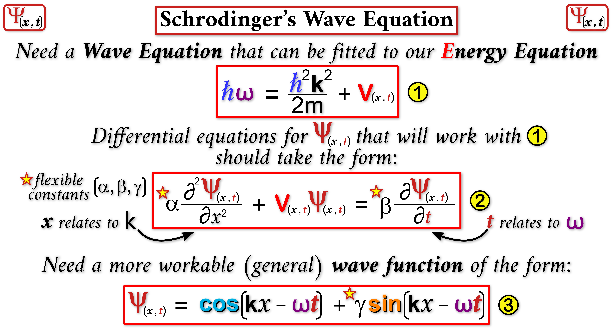
</figure>

**<u>Figure 13: General Wave Equation and Function</u>.** Based on the <b>energy equation</b> (<b>&#9312;</b>, <b>Fig 12</b>) one can make some reasonable assumptions about the mathematical form of our <b>wave function</b> solution (<b>&#9313;</b>). It obviously has to maintain the "<i>variable space</i>" found in our <b>energy equation</b>, but also be somewhat "<i>flexible</i>" (i.e. add coefficients terms). As we have seen before (<b>Fig. 11</b>) the trigonometric functions are likely a good source of possible solutions (<b>&#9314;</b>).  

</div>
<!-------------------------------------------------------->
<!-------------------------------------------------------->
<!-------------------------------------------------------->

&nbsp; &nbsp; The use of a general sinusoidal <b>wave function</b> (<b>&#9314;</b>, **Fig. 13**) introduces an important wave concept -- the **<a class="one" href="https://www.acs.psu.edu/drussell/Demos/superposition/superposition.html" target="_blank" title="Go to PSU">Principle of Superposition</a>**. This basic principle states that when two or more linear waves meet the height or <u>amplitude</u> (<b>$\text A$</b>) of the wave will be equal to the sum of the individual wave <b>$\text A$</b> (i.e. <b>$\text A_{net}$</b> = <b>$\text A_1$</b> + <b>$\text A_2$</b> ...<b>$\text A_n$</b>). When the colliding waves are in phase with each other and have very similar (or the same) wavelengths (e.g. wave crest meets another wave crest), then the resulting <b>$\text A$</b> of the combined or "<i>group</i>" wave will be <u>maximized</u>, a process referred to as <u>constructive interference</u> (<b>Fig. 14A</b>). Conversely, if the colliding waves are significantly out of phase (e.g. wave crest coincides with a wave trough), then the <b>$\text A$</b> of the "<i>group</i>" wave will be <u>minimized</u>, a process termed <u>destructive interference</u> (<b>Fig. 14B</b>). Of course collisions between multiple waves are usually much more complicated, with the waves having slightly different wavelengths (<span id="Dred">$\lambda$</span>), frequencies (<span id="Purple">$\nu$</span>), <b>$\text A$</b> and/or phases. In these scenarios both <u>constructive</u> and <u>destructive interference</u> play an equal role in "<i>sculpting</i>" the overall shape of the <u>localized</u> <b>wave packet</b> (<b>Fig. 14C</b>, <b>D</b>).  


<a id="SPWP"></a>
<!---------------------------------------------------------------->
<!------------ FIG 14 - Superposition & Wave packets ------------->
<!---------------------------------------------------------------->
<div style="border: 2px solid gray; padding: 5px;">

<figure>
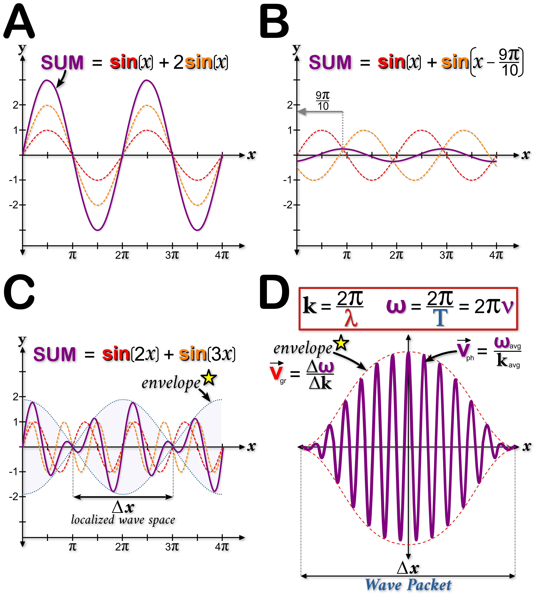
</figure>

**<u>Figure 14: Superposition and Wave Packets</u>.** <b>(A)</b> The <u>superposition</u> (i.e. summing) of two sinusoidal waves with different amplitudes, but the same frequency, results is a larger wave (<span id="Purple">&horbar;</span>). This is an example of <b>constructive interference</b>. **(B)** By contrast, the <u>superposition</u> of two sinusoidal waves with the same amplitude and frequency that are slightly out of phase with each other produces a smaller wave. This is an example of <b>destructive interference</b>. **(C)** The <u>superposition</u> of two waves with equal amplitude, but different frequencies, creates a “<i>beat</i>” phenomenon. The <span id="Blue">blue</span> <u>dashed line</u> identifies an imaginary “envelope” that <u>surrounds</u> the combined wave form (<span id="Purple">&horbar;</span>). It helps to identify the alternating large and small displacements of the combined wave form. **(D)** If we consider the <u>superposition</u> of a large <u>group</u> of sinusoidal waves, with varying amplitudes and frequencies, than this “<i>beat</i>” pattern creates a distinctive <b>wave packet</b>. The most distinctive feature of a <b>wave packet</b> is that it has a positive amplitude over a localized region of space (<b>$\Delta x$</b>). This allows us to calculate the position of the particle with <u>some</u> degree of certainty. This “<i>degree of certainty</i>” underlies an important concept in quantum mechanics, namely the **<a class="one" href="http://hyperphysics.phy-astr.gsu.edu/hbase/uncer.html" target="_blank" title="Go to HyperPhysics">Heisenberg's uncertainty principle</a>**. Based on the <b>wave packet</b> concept one can calculate the <b>velocity</b> of a <u>group</u> of waves (<span id="Blue">$\vec{\text v}$</span><sub>gr</sub>), which corresponds to the movement of the <b>wave packet</b> <u>envelope</u>. By contrast the <b>phase velocity</b> (<span id="Blue">$\vec{\text v}$</span><sub>ph</sub>) is associated with the <u>individual</u> waves that make up the <b>wave packet</b>. These speed calculations show the inherent relationship between <u>angular frequency</u> (<span id="Purple">$\omega$</span> = 2$\pi$<span id="Purple">$\nu$</span>) and <u>wave number</u> (<b>$k$</b> = <b>$2\pi$</b>/<span id="Dred">$\lambda$</span>), since <span id="Blue">$\vec {\text v}$</span> = <span id="Purple">$\omega$</span>/<b>${k}$</b> = <b>$2\pi$</b><span id="Purple">$\nu$</span>$\cdot$(<span id="Dred">$\lambda$</span>/${2\pi}$) = <span id="Purple">$\nu$</span>$\cdot$<span id="Dred">$\lambda$</span>.<b>[@thornton_modern_2013]</b>

</div>
<!---------------------------------------------------------------->
<!---------------------------------------------------------------->
<!---------------------------------------------------------------->

&nbsp; &nbsp; The importance of a <b>wave packet</b> lies in its ability to model both the "<i>particle</i>" and "*wave-like*" behaviour of <b>electrons</b>. The simplest **de Broglie matter-wave** is a free particle (i.e. no external forces acting on it) with constant <u>momentum</u> (<span id="Blue">$\vec \rho$</span>). Such a particle would have a **matter-wave** represented by an <u>infinitely</u> long <u>travelling wave</u> with a <u>fixed</u> amplitude (<b>$\text A$</b>) and wavelength (<span id="Dred">$\lambda$</span>), just like a plotted **sine** or **cosine** function (**Fig. 10**). However, a real **electron** is likely found in one region (i.e. localized) and, unlike a simple **sine** function, not spread out over an infinite amount of space. So it would be more accurate to find a "*wave-like*" description for a free **electron** that models its <u>localized</u> particle nature. This is where the concept of a **wave packet** comes to the "<i>rescue</i>", since the <b>$\text A$</b> of a **wave packet** is localized to a well defined region of space, beyond which it quickly falls away.<b>[@thornton_modern_2013]</b> A **wave packet** (**Fig. 14**) is "*built up*" using multiple <u>infinitely</u> long <u>travelling waves</u> (e.g. **sine** function) that can have different **wave numbers** (<b>$\text k$</b>), **angular frequencies** (<span id="Purple">$\omega$</span>), and **amplitudes** (<b>$\text A$</b>). This technique of adding together multiple **sine** and/or **cosine** waves (potentially an infinite number) to <u>approximate</u> a <u>periodic</u> function is called a **<a class="one" href="https://www.mathsisfun.com/calculus/fourier-series.html" target="_blank" title="Go to MathIsFun">Fourier Series</a>**.<b>[@fourier_theorie_1822]</b> Introduced by French mathematician <b>Jean-Baptiste Joseph Fourier</b> (1822), the technique itself is a mathematical expression of the <b>Superposition Principle</b> (<b>Note:</b> the Greek letter "*Sigma*", or<b>$\sum$</b>, is a mathematical symbol representing the <u>summation</u> of a series of discrete terms. Here we have <span id="Blk">$i$</span><sup>th</sup> terms, with <span id="Blk">$i$</span> being an integer value from one to infinity).  

$$\tag{6} \Psi_{(x,t)} = \sum_{i=1}^{\infty} \text{ A}_i \text{sin}(k_i x - \omega_i t)$$

As an example, consider a simple **Fourier Series** made up of just two **sine** functions that share the same <b>$\text A$</b> (<b>$Eq. 7$</b>). 

$$\tag{7} \Psi_{(x,t)} = \Psi_{1(x,t)} + \Psi_{2(x,t)} = \text A \left( \text{sin}(k_1 x - \omega_1 t) + \text{sin}(k_2 x - \omega_2 t) \right)$$

With the help of the following well known <u>trigonometric identity</u>:   

$$\tag{8} \text{sin}(A) + \text{sin}(B) = 2 \text{ sin} \left( \frac{A + B}{2} \right) \text{cos} \left( \frac{A-B}{2} \right)$$

our wave function <span id="Blk">$\Psi_{(x,t)}$</span> takes on a new meaningful form:  

$$\tag{9} \Psi_{(x,t)} = 2 \text A \cdot \text{sin} \left( \frac{k_1 x - \omega_1 t + k_2 x - \omega_2 t}{2} \right) \text{cos} \left( \frac{k_1 x - \omega_1 t - k_2 x + \omega_2 t}{2} \right)$$

$$\tag{9.1} \Psi_{(x,t)} = 2 \text A \cdot \text{sin} \left( \frac{(k_1 + k_2) x}{2} - \frac{(\omega_1 + \omega_2) t}{2} \right) \text{cos} \left( \frac{(k_1 - k_2) x}{2} - \frac{(\omega_1 - \omega_2) t}{2} \right)$$

$$\tag{9.2} \Psi_{(x,t)} = 2 \text A \cdot \text{sin}(\text k_{avg } x - \omega_{avg } t) \text{ cos}\left( \frac{\Delta \text k x}{2} - \frac{\Delta \omega t}{2} \right)$$


The <span id="Blk">$\Delta$</span> in <b>$Eq. 9$</b> represents an increment or "*difference*" term for our <b>$\text k$</b> and <span id="Purple">$\omega$</span> variables, while the <span id="Blk">$average$</span> terms are self explanatory (albeit not a "<i>true</i>" average given n = 2). This simple example shows that the <u>combined</u> wave form, which is enclosed by the <u>envelope</u>, is described by the <b>sine</b> function with a <u>wave number</u> <b>$\text k_{avg}$</b> and an <u>angular frequency</u> <span id="Purple">$\omega$</span><sub>avg</sub>. On the other hand, the <u>envelope</u>, which is described by the <b>cosine</b> function, oscillates with a <u>wave number</u> <b>$\Delta k$</b> and an <u>angular frequency</u> <b>$\Delta$</b><span id="Purple">$\omega$</span>. Note that with these two variables the <u>phase</u> velocity (<span id="Blue">$\vec{\text v}$</span><sub>ph</sub>) of each type of wave can be determined: (i) <span id="Blue">$\vec{\text v}$</span><sub>ph</sub> = <span id="Purple">$\omega_i$</span>/<b>$\text k_i$</b> for each individual wave; (ii) <span id="Blue">$\vec{\text v}$</span><sub>ph</sub> = <span id="Purple">$\omega$</span><sub>avg</sub>/<b>$\text k$</b><sub>avg</sub> for the "<i>combined</i>" wave form; and (iii) <span id="Blue">$\vec{\text v}$</span><sub>gr</sub> = <span id="Black">$\Delta$</span><span id="Purple">$\omega$</span>/<span id="Black">$\Delta$</span><b>$\text k$</b> for the "<i>group</i>" velocity, which corresponds to the speed of the <u>envelope</u>.<b>[@thornton_modern_2013]</b>  
&nbsp; &nbsp; Looking at the <u>localized region</u> of our <b>wave packet</b> (i.e. <span id="Black">$\Delta x$</span> = difference between <b>$x_1$</b> and <b>$x_2$</b>, two consecutive points where the <u>envelope</u> is zero) one should take note of the fact that the <b>$\Delta \text k x / 2$</b> term in <b>$Eq. 9$</b> is only a half wavelength for our <u>envelope</u>. Since a single wavelength is based on units of <b>$2\pi$</b>, we can therefore assume that the phase difference between <b>$x_1$</b> and <b>$x_2$</b> is equal to <b>$\pi$</b>. This equality (<b>$\Delta \text k x / 2 = \pi$</b>) can be used to show the reciprocal relationship between <span id="Black">$\Delta \text k$</span> and <b>$\Delta x$</b>:  

$$\tag{10}  \frac{\Delta \text k \cdot (x_2 - x_1)}{2} = \frac{\Delta \text k \cdot \Delta x}{2} = \pi \quad \Longrightarrow \quad \Delta \text k \cdot \Delta x = 2\pi$$

Looking at the <b>cosine</b> part of the function we see that a similar reciprocal relationship exists between <b>$\Delta$</b><span id="Purple">$\omega$</span> and <b>$\Delta t$</b>:  

$$\tag{11}  \frac{\Delta \omega \cdot (t_2 - t_1)}{2} = \frac{\Delta \omega \cdot \Delta t}{2} = \pi \quad \Longrightarrow \quad \Delta \omega \cdot \Delta t = 2\pi$$

Together these two relations (<b>$Eq. 10$</b> and <b>$11$</b>) tell us something fundamental about the <b>wave packet</b>, namely that the range of wave numbers (<b>$\Delta \text k$</b>) has to be large if the localized region (<b>$\Delta x$</b>) of our <b>wave packet</b> is small (i.e. low uncertainty in the position of our particle). Similarly, the range of wave frequencies (<b>$\Delta$</b><span id="Purple">$\omega$</span>) has to be large if we are to know precisely when (<b>$\Delta t$</b>) the <b>wave packet</b> is at a given point.<b>[@thornton_modern_2013]</b>  
&nbsp; &nbsp; Coming back to our new general **wave function** (**Fig. 13**) we can easily show (by substitution) that it is a workable solution for our **wave equation** (**Fig. 15**). One remarkable aspect of **Schrodinger's Equation** (<b>SE</b>), which in this form represents the **T**ime **D**ependent **S**chrodinger **E**quation (**TDSE**), is that it contains **<a class="one" href="https://www.mathsisfun.com/numbers/complex-numbers.html">complex numbers</a>** (i.e. <span id="Blue">$i$</span>maginary number system, where <span id="Blue">$i$</span> = <b>$\pm\sqrt{-1}$</b>). Unlike the <u>classical</u> <b>wave equation</b> (<b>$Eq. 5$</b>) a <u>complex</u> <b>wave equation</b> generates output that is physically <u>not real</u>! Although the inclusion of <b>Planck’s constant</b> is expected (i.e. “<i>quantization</i>” factor), a <u>complex</u> <b>wave equation</b> is most unusual. It certainly begs the question: How are <u>complex</u> <b>wave equations</b> used to make <u>real</u> world measurements?  

<a id="TDSE"></a>
<!------------------------------------------------------------------>
<!------------- FIG 15 - General Wave Equation - TDSE -------------->
<!------------------------------------------------------------------>
<div style="border: 2px solid gray; padding: 5px;">

<figure>

</figure>

**<u>Figure 15: Schrodinger's Time Dependent Wave Equation</u>.** To determine if our proposed <b>wave function</b> (<b>&#9312;</b>, <b>Fig. 13</b>) is a valid solution for our <b>wave equation</b> (<b>&#9313;</b>), it needs to be differentiated and then substituted into the equation to see if it maintains the overall equality of this mathematical expression. Substituting the two partial derivatives into the proposed <b>wave equation</b> yields a rather long mathematical expression that contains both recognizable elements (i.e. <b>intact wave function</b>) and one noticeably "<i>odd</i>" expression (<b>&#9314;</b>). Fortunately, this latter element can be transformed into our familiar <b>wave function</b> (i.e. set <b>$\gamma$</b> = <b>$i$</b> = <b>$i = \sqrt{-1}$</b>), which yields a completed <b>wave function</b> (<b>&#9315;</b>). Solving the <b>$\gamma$</b> coefficient makes it possible to solve the other two unknown coefficients, <b>$\alpha$</b> and <b>$\beta$</b> (<b>&#9316;</b>, <b>&#9317;</b>). The final result is the famous <span id="Blue">T</span>ime <span id="Blue">D</span>ependent <span id="Blue">S</span>chrodinger <span id="Blue">E</span>quation (<b>&#9318;</b>, <span id="Blue">TDSE</span>).

</div>
<!------------------------------------------------------------------>
<!------------------------------------------------------------------>
<!------------------------------------------------------------------>
 

&nbsp; &nbsp; The <u>real</u> usefulness of the <b>SE</b> is perhaps best explained by re-visiting <b>Thomas Young's</b> (1801) **<a class="one" href="https://www.youtube.com/watch?v=nmxwVU88Bd8&t=1s" target="_blank" title="Go to Utube video">double-slit experiment</a>** (**Fig. 16**).<b>[@young_ii_1802; @crew_wave_1900]</b> This famous experiment provided the most convincing evidence of the wave-like behaviour of light, which had long been considered a particle or "*corpuscle*" thanks to **<a class="one" href="https://www.newtonproject.ox.ac.uk/texts/newtons-works/all" target="_blank" title="Go to Newton Project">Newton</a>**. Although many variations of this experiment have been tried over the years, all of them show just how "*strange*" **light-waves** and **matter-waves** behave at the **quantum level**. Nevertheless, if we consider how we normally detect and measure things (i.e. bounce light off an object), it becomes a bit clearer as to why measuring **quantum** particles is so challenging. While bouncing laser light off a food item at the grocery store self check-out does not cause it to go flying out of your hand, bouncing photons off a **quantum** particle alters its position. Ultimately this results in a significant degree of <u>uncertainty</u> in the measurement. Although the above example has more to do with the **observer effect** (i.e. act of observation disturbs the system), what it is trying to convey is that its impossible to simultaneously measure the exact position and momentum of a quantum particle. Quantitatively, the effect of using **light** to measure the position of an **electron** (e.g. determine which slit it travelled through) is directly related to the <span id="Dred">$\lambda$</span> of the detecting photon (i.e. <b>$\Delta x \approx$</b> <span id="Dred">$\lambda$</span>). For the double-slit experiment to accurately determine which slit an <b>electron</b> travels through the size (<span id="Dred">$\lambda$</span>) of the detecting photon has to be less than the distance separating the two slits (i.e. suitable resolution). If we substitute <b>de Broglie's</b> (<b>Fig. 9</b>) relation for <span id="Dred">$\lambda$</span> than the famous **<a class="one" href="http://hyperphysics.phy-astr.gsu.edu/hbase/uncer.html" target="_blank" title="Go to HyperPhysics">Heisenberg Uncertainty Principle</a>** (<b>HUP</b>) emerges:  
<a id="HUP"></a>  

$$\tag{12} \Delta x \approx \lambda \quad \Longrightarrow \quad \Delta x \approx \frac{h}{\Delta \vec p_x} \quad \Longrightarrow \quad \Delta x \cdot \Delta \vec p_x \approx h$$

A more refined calculation would actually show <b>HUP</b> taking the form:

$$\tag{13} \Delta x \cdot \Delta \vec p_x \ge \frac{\hbar}{2}$$

This <b>HUP</b> relation can also include other variables, such as <span id="Red">$E$</span>nergy and <b>$t$</b>ime:  

$$\tag{14} \Delta E \cdot \Delta t \ge \frac{\hbar}{2}$$

**HUP** tells us something very fundamental about the **quantum** world, namely that the wave-like behaviour of **electrons** and **photons** is inherently uncertain. Using the example above, the smaller the <u>wavelength</u> of light used to observe the two-slit apparatus the greater its <u>frequency</u> and **energy**. Using more energetic **photons** to detect the particle means the position of the particle will be more disturbed, thus lessening the accuracy of the measurement. Although observing the system disturbs it regardless of the <u>frequency</u> of the detecting **photon**, the relationships between <u>frequency</u>, <u>wavelength</u> and <b>energy</b> (i.e. <span id="Blue">c</span> = <span id="Dred">$\lambda$</span> <b>$\cdot$</b> <span id="Purple">$\nu$</span>, and <span id="Red">E</span>nergy = <b>$h$</b> <b>$\cdot$</b> <span id="Purple">$\nu$</span>) tells us that the accuracy of any measuring system is limited by the very <b>wave</b>-like nature of the system itself. So, according to <b>HUP</b> if you make an accurate measurement of the momentum (<b>$\vec p$</b>) of an <b>electron</b>, such that its uncertainty (<b>$\Delta \vec p$</b>) is very small, than according to <b>$Eq. 13$</b> you will be unable to simultaneously measure its position with any accuracy (i.e. <b>$\Delta x$</b> will be very large). <b>HUP</b> therefore places limits on how accurate you can measure a <b>quantum system</b> regardless of the accuracy of your measuring instrument. Unfortunately, the above example does not do a very good job of differentiating between <u>uncertainty</u> and the <b>observer effect</b>, largely because the instruments used to observe <b>quantum</b> systems are also <b>quantum</b> systems. But than again perhaps that is the point, the universe is (as far as we know) a very large and strange <b>quantum</b> system.  


<a id="DSExp"></a>
<!---------------------------------------------------------->
<!------------ FIG 16 - Double Slit Experiment ------------->
<!---------------------------------------------------------->
<div style="border: 2px solid gray; padding: 5px;">

<figure>
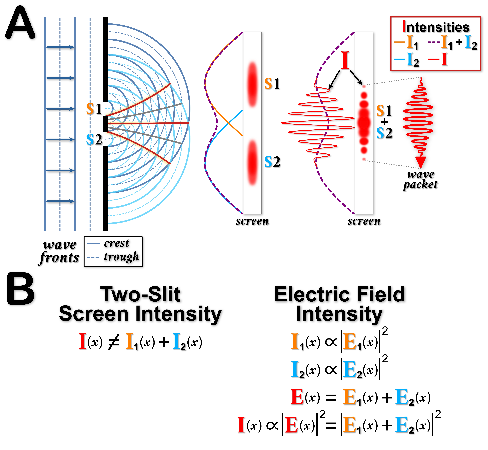
</figure>

**<u>Figure 16: Double Slit Experiment</u>.** <b>(A)</b> <b>Thomas Young's</b> (1802) famous experiment provides clear evidence that light behaves like a <b>wave</b>. Normally, when a <b>wave</b> travels through a single slit only one broad band of illumination is detected (<span id="Ror2">S</span>1 or <span id="Glacialb">S</span>2). However, when <b>waves</b> are allowed to travel through <u>two</u> slits a series of alternating bright and dark spots are detected by the screen. The resulting bands of light are generated by <b>destructive</b> and <b>constructive</b> <u>wave interference</u>, a well known property of <b>waves</b>. For example, when a <u>wave trough</u> meets a <u>wave crest</u> of equal amplitude, then the combined <b>wave</b> form will have no amplitude (i.e. <b>destructive interference</b>). Alternatively, if two <u>crests</u> or <u>troughs</u> meet one another then the net amplitude of the combined <b>wave</b> form will be enhanced (i.e. <b>constructive interference</b>). However, when the intensity of the light passing through the two-slits is reduced (e.g. firing one photon at a time) the screen will record individual flashes of light that are typical of particles colliding with the screen. Strangely, over time as multiple particle-like collision are recorded an <u>interference pattern</u> emerges that is typical of a <b>wave</b>.<b>[@grangier_experimental_1986]</b> This remarkable "<i>Janus</i>" (<b>wave-particle</b>) like behaviour has also been detected for <b>electrons</b> and <b>atoms</b> (e.g. <span id="Purple">He</span>lium) using two-slit inferometers.<b>[@jonsson_electron_1974; @carnal_youngs_1991]</b>  
**(B)** The screen's light <u>intensity</u> (<span id="Red">I</span>) is proportional to the square of the <u>magnitude</u> of its <b>electric field</b> (|<span id="Red">E</span><sub>(x)</sub>|<sup>2</sup>). As noted above the <b>superposition principle</b> plays a direct role in defining these quantities since the value being squared is the sum of the magnitudes of multiple <b>electric fields</b>.  

</div>
<!---------------------------------------------------------->
<!---------------------------------------------------------->
<!---------------------------------------------------------->


&nbsp; &nbsp; We can use <b>HUP</b> to make a quick estimate of the **momentum** or **energy** required to contain an **electron** within a given region of space, such as the lowest energy state of a <span id="Blue">H</span>ydrogen **atom**.<b>[@thornton_modern_2013]</b> If we use <b>Bohr's radius</b> (<span id="Orchidb">$a$</span><sub>o</sub> = 0.0529177 nm, <b>Fig. 6</b>) for <b>$\Delta x$</b> (i.e. limit this to just one dimension) than the <u>uncertainty</u> in momentum (<b>$\Delta$</b><span id="Blue">$\vec p$</span>) of an <b>electron</b> would be:   

$$\tag{15} \Delta \vec p \ge \frac{\hbar}{2 \Delta x} \ge \frac{1.054 × 10^{−34} \text{ kg} \cdot \text{m}^2 \cdot \text{sec}^{-1}}{2(0.529177 × 10^{-10} \text{ m})} \ge 1 × 10^{-24} \text{ kg} \cdot \text{m} \cdot \text{sec}^{-1}$$

Although the value of <b>$\Delta$</b><span id="Blue">$\vec p$</span> is very small, so too is the mass of an **electron** (i.e. 9.109 x 10<sup>-31</sup> kg). Given that <span id="Blue">$\vec p$</span> is the product of mass and speed one can quickly determine that the speed of this <b>electron</b> is in excess of 10<sup>6</sup> m/sec:  

$$\tag{16} \Delta \vec v \ge \frac{1 × 10^{-24} \text{ kg} \cdot \text{m} \cdot \text{sec}^{-1}}{9.109 × 10^{-31} \text{ kg}} \quad \Longrightarrow \quad \Delta \vec v \ge 1.1 × 10^6 \text{ m} \cdot \text{sec}^{-1}$$

For comparison, lets use a golf ball (45.93 gm) instead of an **electron**, and <u>confine</u> it to the length of a 100 m long straight-away hole on a golf course (i.e. <b>$\Delta x$</b> = 100 m). By simply taking into account the relative differences in the <b>$\Delta x$</b> of our golf ball and **electron** (i.e. <b>$\Delta x_{gb}/\Delta x_{e^-}$</b> > 10<sup>11</sup>), one can quickly get an idea of how little uncertainty there is in specifying the momentum of our golf ball: 

$$\tag{17} \Delta \vec p \ge \frac{1.054 × 10^{−34} \text{ kg} \cdot \text{m}^2 \cdot \text{sec}^{-1}}{2(10^2 \text{ m})} \ge 5.27 × 10^{-37} \text{ kg} \cdot \text{m} \cdot \text{sec}^{-1}$$

<a id="ConfE"></a>
We can also quickly estimate the minimal amount of **energy** required to confine an **electron** to a specific region of space, like the diameter of an atom (i.e. <b>$\Delta x$</b> = 2<span id="Orchidb">$a$</span><sub>o</sub> = 0.1058354 nm). Using the equation for **Kinetic Energy** in its momentum form (<b>Fig. 12</b>) and combining it with the <b>HUP</b> relation (<b>$Eq. 15$</b>), we can make a very rough estimate of its value:  

$$\tag{18} \text{KE}_{min} = \frac{\vec{\rho}^2}{2 \text m} = \frac{\Delta \vec{\rho}^2}{2 \text m} = \frac{(0.5 × 10^{-24} \text{ kg} \cdot \text{m} \cdot \text{sec}^{-1})^2}{2(9.109 × 10^{-31} \text{ kg})}$$

$$\text{KE}_{min} = 1.372 × 10^{-19} \text{ Joules} \cdot \frac{1 \text{ eV}}{1.6022 × 10^{-19} \text{ Joule}} = 0.8563 \text{ eV}$$

I must re-iterate that this is only a rough estimate of the **confinement energy** for an **electron** in <u>one dimension</u>. A more realistic estimate of this value would obviously include all three dimensions. In fact a more reasonable estimate of the **confinement energy** of an **electron** can be made using our non-relativistic **Kinetic Energy** equation in combination with the **de Broglie's** relation (<span id="Blue">$\vec \rho$</span> = <b>$h$</b> /<span id="Dred">$\lambda$</span>, **Fig. 9**). The only notable exception is that the <span id="Dred">$\lambda$</span> of our **matter-wave**, which constitutes our <b>$\Delta x$</b> (2<span id="Orchidb">$a$</span><sub>o</sub> = 0.1058354 nm), will be a half wavelength (i.e. <span id="Dred">$\lambda$</span>/2).<b><sup>10</sup></b> This change in the size of <b>$\Delta x$</b> is based on the "*Infinite Square Well*" scenario, where a **matter-wave** is confined to a hypothetical "*one dimensional well*", whose width <b>$\Delta x$</b> = <span id="Or">$\text L$</span>. The boundary conditions (i.e. walls with <u>infinite</u> <b>Potential Energy</b>) place restrictions on the size of the **matter-waves**, which can only be multiple half-wavelengths (i.e. <b>$\text n \cdot$</b><span id="Dred">$\lambda$</span>/2 = <b>$\Delta x$</b>, **Fig. 17**). This is analogous to a <b>standing wave</b> produced by a guitar string, whose two ends (i.e. <u>nodes</u> of the wave) are fixed. Incorporating this length modification (i.e. <span id="Dred">$\lambda$</span> = 2<b>$\Delta x$</b>/<b>n</b>) into our equation results in the following expression:


$$\tag{19} \text{KE}_{min} = \frac{\vec{\rho}^2}{2 \text m} = \frac{h^2}{2 \text m (\frac{2 \Delta x}{\text n})^2} = \text n^2 \cdot \frac{(6.626 × 10^{-34} \text{ J} \cdot \text{sec})^2}{8(9.109 × 10^{-31} \text{kg})(1.058354 × 10^{-10} \text{m})^2}$$

Thus the **confinement energy** of an **electron** in the lowest <b>energy state </b> (i.e. n = 1) for a <span id="Blue">H</span> **atom** would be:

$$\tag{20} \text{KE}_{min} = 53.787 × 10^{-19} \text{ J} \cdot \frac{1 \text{ eV}}{1.6022 × 10^{-19} \text{ J}} = 33.57 \text{ eV}$$

One advantage to using this method to estimate the **confinement energy** of an **electron** is that it can readily accommodate all <u>three dimensions</u> (3-D). This is made possible because the **energy** contribution for each dimension can be simply summed (<b>$\text{n}_x^2 + \text{n}_y^2 + \text{n}_z^2 = 1^2 + 1^2 + 1^2 = 3$</b>), resulting in following expression:  

$$\tag{21} \text KE_{min} = (\text n_{x,y,z})^2 \cdot \frac{h^2}{8 \text m (\Delta x)^2} = 3 \cdot \frac{h^2}{8 \text m (\Delta x)^2}$$

Therefore the 3D **confinement energy** of an **electron** would be ~100.71 **eV**. 


<a id="InfSqW"></a>
<!-------------------------------------------------------------------->
<!------------------ FIG 17 - Infinite Square Well ------------------->
<!-------------------------------------------------------------------->
<div style="border: 2px solid gray; padding: 5px;">

<figure>
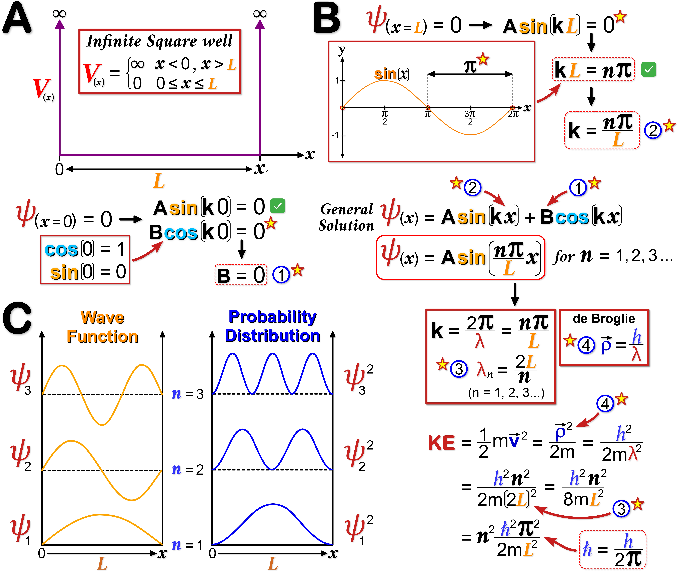
</figure>

**<u>Figure 17: Infinite Square Well</u>.** <b>(A)</b> Consider the following hypothetical scenario, where a <b>matter-wave</b> is trapped within a well with infinitely high walls (i.e. infinite <b>potential energy</b>, or <span id="Red">V</span>). Between the walls the particle is free (<span id="Red">V</span> = 0), but at the walls the energy barrier (<span id="Red">V</span> = <b>$\infty$</b>) prevents it from escaping (i.e. two ends of <b>matter-wave</b> are "<i>fixed</i>"). Because of these boundary conditions the probability of finding the particle outside of the well is zero. It also means that the continuous <b>wave function</b> has to be equal to zero when <b>$x = 0$</b>, or when <b>$x = L$</b>. Given that <span id="Glacialb">cos</span>(<b>$x = 0$</b>) is equal to one, that must mean the coefficient <b>B</b> is equal to zero (<b>&#9312;</b>), since the overall equation must be equal to zero.<b>[@thornton_modern_2013]</b>  
**(B)** As stated above when <b>$x = L$</b> the <b>wave function</b> must also be equal to zero. Given that <b>$\psi (x)$</b> is now reduced to a simple <span id="Or">sin</span> function (<b>&#9312;</b>), we can set <b>k</b><span id="Or">L</span> equal to <b>$n \pi$</b> (i.e. multiple half-wavelengths) (<b>&#9313;</b>). Rearranging and simplifying the expression leads us to: <span id="Dred">$\lambda$</span><b>$_n$</b> = 2<span id="Or">L</span>/<b>$n$</b> (<b>$n = 1, 2, 3 ...$</b>). Substituting this value for <span id="Dred">$\lambda$</span> into the <b>energy equation</b>, which is simply a <b>Kinetic Energy</b> term (<b>Recall:</b> <span id="Red">V</span> = 0 inside the well), generates an expression that is nearly identical to <b>Bohr's</b> original quantized <b>Kinetic Energy</b> term (<b>Fig. 6</b>).  
**(C)** When the <b>wave function</b> is plotted we can clearly see how the boundary conditions restrict the types of <b>matter-waves</b> that can fit within the well (i.e. <b>matter-wave</b> must have <b>nodes</b> where it meets the wall, which means its <u>fundamental</u> frequency must be equal to <b>$\lambda / 2)$</b>). Looking at the <b>probability density</b> plots (<b>$\text{PD} = |\psi (x)|^2$</b>) we can also see that for the lowest <b>energy state</b> (<b>$n = 1$</b>) the most likely position of the particle is in the middle of the well.<b>[@thornton_modern_2013]</b>  

</div>
<!-------------------------------------------------------------------->
<!-------------------------------------------------------------------->
<!-------------------------------------------------------------------->


Looking at the **TDSE** it appears that the position (<b>$x$</b>) and time (<b>$t$</b>) variables might be independent of each other, which is also generally the case for the potential energy term (<b>$\text V_{(x,t)}$</b>).<b><sup>10</sup></b> In fact, separating the variables of a multivariable function can often be carried out mathematically by making the equation the product of two separate single variable functions. For example our <b>wave equation</b> (<b>$\Psi_{(x,t)}$</b>) could be re-written as:  

$$\tag{22} \Psi_{(x,t)} = \psi_{(x)} \cdot f_{(t)}$$

To evaluate the usefulness of <b>$Eq. 22$</b> we need to plug it into our **TDSE** (**Fig. 15**) and evaluate it. The initial substitution step would give us the following expression:  

$$\tag{23} i \hbar \cdot \psi_{(x)}  \frac{\partial f_{(t)}}{\partial t} = \frac{-\hbar^2}{2 \text m} \cdot f_{(t)} \cdot \frac{\partial^2 \psi_{(x)}}{\partial x^2} + \text V_{(x)} \psi_{(x)} f_{(t)}$$

By dividing each side of <b>$Eq. 23$</b> by <b>$\psi_{(x)} \cdot f_{(t)}$</b> we get our sought after separation of variables, with our time variable on the left hand side and the position variable on the right hand side of the equation.<b>[@thornton_modern_2013]</b>  

$$\tag{24} i \hbar \frac{1}{f_{(t)}} \frac{\partial f_{(t)}}{\partial t} = \frac{-\hbar^2}{2 \text m} \frac{1}{\psi_{(x)}} \frac{\partial^2 \psi_{(x)}}{\partial x^2} + \text V_{(x)}$$

Knowing that each variable can change independent of each other allows us to equate each side of the equation to a constant. For example, we can set the time dependent side of <b>$Eq. 24$</b> equal to an unknown constant called <b>$\text B$</b>. Since this half of the equation is made up of derivatives we can simply <u>integrate</u> (i.e. anti-derivative with respect to time) to uncover the original function:  

$$\tag{25} i \hbar \frac{1}{f_{(t)}} \frac{\partial f_{(t)}}{\partial t} = \text B$$

$$i \hbar \int \frac{1}{f_{(t)}} \cdot \frac{\partial f_{(t)}}{\partial t} \cdot \partial t = \int \text B \cdot \partial t$$

$$i \hbar \int \frac{\partial f_{(t)}}{f_{(t)}} = \int \text B \cdot \partial t$$

$$i \hbar \cdot ln (f_{(t)}) = \text B t + \text C$$

If the integration constant (<b>$\text C$</b>) is set to zero (which is the case for a **<a class="one" href="https://www.mathsisfun.com/calculus/integration-definite.html" target="_blank" title="Go to MathIsFun">definite integral</a>**) the resulting expression for <b>$f_{(t)}$</b> (<b>$Eq. 26$</b>) shows allot of similarity to the <u>exponential</u> form of our <b>wave function</b> (<b>$Eq. 27$</b>). As mentioned above <b>Euler's Formula</b> (<b>$e^{i\theta} = cos\theta + isin\theta$</b>) allows us to express some <u>trig functions</u>, like <b>$\Psi_{(x,t)}$</b>, as exponential functions.  

$$\tag{26} ln (f_{(t)}) = \frac{\text B t}{i \hbar} \\\\\\ e^{ln (f_{(t)})} = e^{\text B t/i \hbar} \quad \Longrightarrow \quad f_{(t)} = e^{\text B t/i \hbar} = e^{-i \text B t/\hbar}$$


$$\tag{27} \Psi_{(x,t)} = e^{i(kx - \omega t)} \quad \Longrightarrow \quad \text{when } x = 0 \quad \Longrightarrow \quad \Psi_{(0,t)} = \psi_{(t)} = e^{-i\omega t}$$

Note that <b>$t$</b> is the only variable of interest in <b>$Eq. 27$</b> (i.e. <b>$x = 0$</b>). In fact we can set <b>$\psi_{(t)}$</b> equal to <b>$f(t)$</b> since both represent the same time dependent function set down in <b>$Eq. 22$</b>, and thereby solve for <b>$\text B$</b>.    

$$\tag{28} \psi_{(t)} =  f_{(t)} \quad \Longrightarrow \quad e^{-i\omega t} = e^{-i \text B t/\hbar} \\\\\\
-i\omega t = -i \text B t/\hbar \quad \Longrightarrow \quad \text B = \hbar \omega$$

Since we know that <b>$\hbar$</b> <span id="Purple">$\omega$</span> is a "<i>quantized</i>" <b>energy</b> term (**Fig. 12**) we can therefore conclude that the left side of <b>$Eq. 24$</b> must also be an <b>energy</b> term.  

$$\tag{29} \text{Energy} = \hbar \omega = \text B = i \hbar \frac{1}{f_{(t)}} \frac{\partial f_{(t)}}{\partial t}$$

After applying a simple multiplication step (i.e. multiply each side of <b>$Eq. 30$</b> by <b>$\psi_{(x)}$</b>) our equation now takes the form of a <b>T</b>ime <b>I</b>ndependent <b>S</b>hrodinger <b>E</b>quation (<b>TISE</b>).<b>[@thornton_modern_2013]</b>  

<a id="TISE"></a>  

$$\tag{30} \text E = \frac{-\hbar^2}{2 \text m} \frac{1}{\psi_{(x)}} \frac{\partial^2 \psi_{(x)}}{\partial x^2} + \text V_{(x)}$$


$$\text E \cdot \psi_{(x)} = \frac{-\hbar^2}{2 \text m} \frac{\partial^2 \psi_{(x)}}{\partial x^2} + \text V_{(x)} \psi_{(x)}$$

Although the steps taken to generate the <b>TISE</b> (<b>$Eq. 30$</b>) seems rather academic at best, it does in fact provide some clarity to our original multivariable **wave function**. Simply re-writing <b>$\Psi_{(x,t)}$</b> as the product of two variable separated functions (<b>$Eq. 31$</b>) actually brings us one step closer to generating a <u>real</u> physical measurement using the <u>complex</u> <b>wave function</b>.  

$$\tag{31} \Psi_{(x,t)} = \psi_{(x)} \cdot f_{(t)} =  \psi_{(x)} \cdot e^{-i\omega t}$$

<a id="MaxBorn"></a>
This dilemma was largely solved by **Max Born** (1926) who proposed a <u>probabilistic</u> interpretation of the **wave function**.<b>[@born_zur_1926; @pais_max_1982]</b> This involved equating the square of the <b>wave function</b> with the **<a class="one" href="https://online.stat.psu.edu/stat414/lesson/14/14.1" target="_blank" title="Go to PSU stats">Probability Density</a>** (i.e. <b>$\text {PD}$</b> = probability of finding particle within a specified region or volume of space for a given time). If we limit ourselves to just one dimension, than the <u>probability</u> or likelihood of finding an <b>electron</b> along a given length (i.e. <b>$dx$</b>), centred around a given point (i.e. <b>$x_1$</b>), at a specific time (e.g. <b>$t=0$</b>) can be mathematically expressed as:

$$\tag{32} \text{Prob} \quad = \quad \text{PD}(x) \cdot dx \quad = \quad \Big| \Psi_{(x,t)} \Big|^2 \cdot dx$$

Moreover, **Born** realized that if the **wave function** is a <u>complex</u> function than the square of this quantity is equal to the product of the <u>complex</u> **wave function** (<b>$\Psi_{(x,t)}$</b>) and its <b><a class="one" href="https://www.mathsisfun.com/numbers/complex-numbers.html" target="_blank" title="Go to MathIsFun">complex conjugate</a></b> (<b>$^*\Psi_{(x,t)}$</b>). Mathematically this would be represented as:  

$$\tag{33} \text{PD}(x) \quad = \quad \Big( \Psi_{(x,t)} \cdot ^*\Psi_{(x,t)} \Big) \quad = \quad \Big( \psi_{(x)} \cdot e^{-i\omega t} \Big) \Big( \psi_{(x)} \cdot e^{i\omega t} \Big)$$

$$\tag{33.1} \text{PD}(x) \quad = \quad \Big( \psi_{(x)}^2 \cdot e^{-i\omega t + i\omega t} \Big) \quad = \quad \Big( \psi_{(x)}^2 \cdot e^{0} \Big) \quad = \quad \psi_{(x)}^2$$

Looking at <b>$Eq. 33.1$</b> we can see why the <u>complex</u> function is multiplied by its <u>complex conjugate</u>: the product is a <u>real measurable number</u>.  

$$\tag{33.2} \text{PD}(x) \cdot dx = \Big| \psi_{(x)} \Big|^2 \cdot dx = \begin{bmatrix} \psi_{(x)} \text{ × } ^*\psi_{(x)} & \text{ if wave function is complex } \\\\\\
\psi_{(x)} \text{ × } \psi_{(x)} & \text{ if wave function is real }
\end{bmatrix}$$  


**Born's** use of probability theory means that any <u>real</u> value generated by this method represents a <u>statistical measure</u> (e.g. mean) and not just a simple number. So the probability of our <u>expected value</u>, or <b>$\langle x \rangle$</b>, which is typically the <u>mean</u> (<b>$\bar x$</b>) value, can be expressed mathematically as:  

$$\tag{34}
\langle x \rangle = \bar x = \int^{+\infty}_{-\infty} \Big( x \cdot \text{PD}(x) \Big) dx \Bigg{/} \int^{+\infty}_{-\infty} \Big(\text{PD}(x) \Big)dx$$

$$\text{Normalization:} \quad \int^{+\infty}_{-\infty} \Big(\text{PD}(x) \Big) dx = 1$$

$$\tag{34.1} \langle x \rangle = \bar x = \int^{+\infty}_{-\infty} \Big( x \cdot \text{PD}(x) \Big) dx$$  

&nbsp; &nbsp; <b>Born's</b> probabilistic interpretation of the <b>wave function</b> (<b>$\Psi_{(x,t)}$</b>) affects our basic understanding of the nature of reality itself. Central to this statistical framework is that the <b>wave function</b> (<b>$\Psi_{(x,t)}$</b>) can only provide an <b>expectation value</b> (<b>$\langle x \rangle$</b>) and <u>not</u> the actual value of the individual measurement, be it position, energy or momentum.<b>[@thornton_modern_2013]</b> The fact that the outcome of any quantum measurement is <u>not deterministic</u> certainly runs counter to classical <b>Newtonian</b> physics. Even <b>Einstein</b> (1926) famously wrote while corresponding with <b>Max Born</b>:  

>"*Quantum mechanics is very worthy of respect. But an inner voice tells me this is not the genuine article after all. The theory delivers much but it hardly brings us closer to the Old One’s secret. In any event, I am convinced that He is not playing dice*."<b>[@einstein_collected_2018]</b>  


<a id="Norm"></a>
<!-------------------------------------------------------------------->
<!------------------ FIG 18 - Normalization of PDF ------------------->
<!-------------------------------------------------------------------->
<div style="border: 2px solid gray; padding: 5px;">

<div style="text-align: center">
<figure>
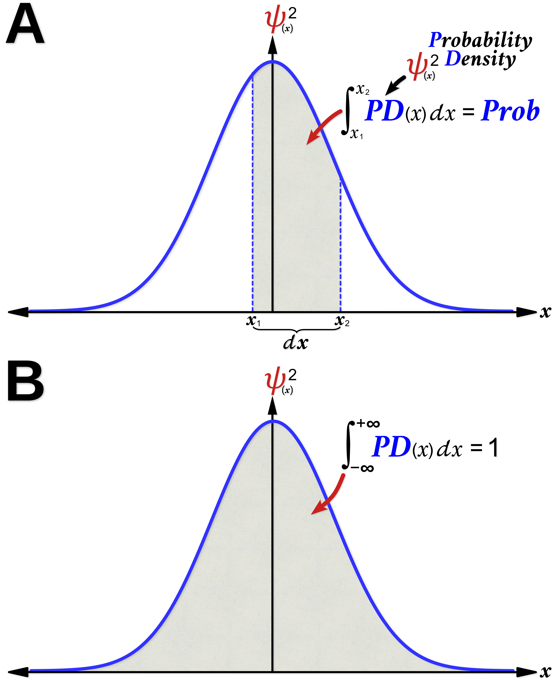
</figure>
</div>

**<u>Figure 18: Normalization of Probability Density Function</u>.** <b>(A)</b> According to <b>Max Born</b> the <b>wave function</b> (<b>$\psi(x)$</b>) is the <b>probability amplitude</b>, and the <u>absolute square</u> of this value is the <b>probability density</b> (<b>$\text{PD} = |\psi(x)|^2$</b>). The actual <b>probability</b> of observing a particle requires "<i>dimensions</i>", that is a range of values defined by the <b>probability density</b> function. In our case the product: <b>$|\psi(x)|^2 \cdot dx$</b>, constitutes the actual <b>probability</b> of observing a particle in the region of space lying between <b>$x$</b> and <b>$x + dx$</b> at a given time. For the <b>probability density</b> functions their corresponding <b>probability</b> calculation simply involves finding the area under curve for the specified range of <b>$x$</b> values (i.e. <b>$(x + dx) - x = dx$</b>).<b>[@thornton_modern_2013]</b>  
**(B)** The <b>normalization</b> process simply involves integrating the <b>probability density</b> function over the entire range of possible values (i.e. <b>$- \infty \Leftrightarrow + \infty$</b>). Since the <b>probability</b> of observing the particle somewhere in space is 100%, than the <b>normalization</b> process will ultimately yield unity, or 1 (100%/100%). This requirement (i.e. sum to 100%) is central to <b>Born's</b> statistical interpretation. This is why multiplying a <b>wave functions</b> by a <u>normalizing coefficient</u> is so important, it ensures that the above requirement is satisfied for most <b>wave functions</b>. Unfortunately there are solutions that are "<i>non-normalizable</i>" (i.e. squared value can not be integrated to 1) and therefore of no "<i>real</i>" value.<b>[@thornton_modern_2013; @griffiths_introduction_1994]</b>  

</div>
<!-------------------------------------------------------------------->
<!-------------------------------------------------------------------->
<!-------------------------------------------------------------------->

&nbsp; &nbsp; Up until this point I have largely viewed the **wave function** through a <u>one dimensional</u> lens. However, to fully understand **atomic structure** and **chemical bonds** a <u>three dimensional</u> **wave function** must be discussed, albeit in more brief terms. This will naturally lead us to several key **quantum numbers** that describe the **energy** and shape of **<a class="one" href="https://winter.group.shef.ac.uk/orbitron/" target="_blank" title="Go to Orbitron">atomic orbitals</a>** (i.e. volume of space occupied by **electrons**), as well as the rules that govern how **electrons** occupy these special subatomic spaces. Nevertheless, before moving ahead to discuss three dimensional **wave functions** lets summarize what we know so far about **quantum mechanics**:  

1. **Neils Bohr** (1913) embraced the idea of "*quantized*" **energy**, first introduced by **Planck** (1900) and later expanded upon by **Einstein** (1915), to mathematically describe the behaviour of an **electron** in a <span id="Blue">H</span>ydrogen atom (i.e. simple two body system: one electron and one proton). Although limited **Bohr's** model did successfully account for the amount of **energy** required by an **electron** to jump between discrete **energy levels** (i.e. **Paschen**, **Balmer**, **Lyman** spectral series). More importantly perhaps is that **Bohr** provided the first tangible evidence that **quantum** concepts were key to our understanding of **atoms** and **electrons**.  
2. **De Broglie's** (1924) idea that **matter** has **wave-like** properties, just like **photons**, provided a new way of looking at particles. Specifically, **electrons** have measurable **wavelength** and **momentum** values that obey **Planck's** (i.e. <span id="Red">E</span> = <b>$h \cdot$</b><span id="Purple">$\nu$</span>) and **Einstein's** (i.e. <span id="Red">E</span> = <b>m</b><span id="Blue">c</span><sup>2</sup>) well known **energy** relations.  
3. **De Broglie's** concept of **matter-waves** proved to be the major driving force behind **Schrodinger's** (1926) development of **wave equations** that successfully describes a particle's wave-like behaviour. By visualizing **matter-waves** as standing waves with well defined boundaries (e.g. guitar string with two fixed ends) one could more clearly conceptualize the "*quantized*" nature of the **energy** and **wavelengths** of **matter-waves**. However, a standing wave function, like **sine** or **cosine**, is infinitely long and thus unable to account for the <u>localized</u> particle-like behaviour of **electrons**. Fortunately, a **wave function** (<b>$\Psi_{(x,t)}$</b>) that describes the <u>superposition</u> of multiple standing waves, otherwise known as a <b>wave packet</b>, can account for both the particle (i.e. localized) and wave-like behaviour of <b>electrons</b>.  
4. **Max Born's** (1926) <u>probabilistic</u> interpretation of **Schrodinger's wave equations** provided a way of generating <u>real</u> physical measurements using **wave functions** that often contain <u>complex</u> (i.e. imaginary) numbers. However, this statistical approach only generates **expectation values** and not the actual measured position, momentum, or **energy** value. When combined with **Heisenberg's Uncertainty Principle** (1927) this <u>probabilistic</u> interpretation of the **wave function** does away with classical determinism. Thus it appears that a universe based on **quantum theory** places defined limits on the possible accuracy of measurements.  


<!----------------------------------------------->
<!------ Section 6 - 3D TISE & Quantum #s ------->
<!----------------------------------------------->

<a id="3DSE"></a>
**<span style="border: 2px solid black;">&thinsp; 6. Three Dimensional Schrodinger Equations &thinsp;</span>:** To generate a **TISE** (<b>$Eq. 30$</b>) that includes all three <u>spacial dimensions</u> is actually relatively straight forward, since it involves a simple addition step as shown below:  

$$\tag{36} \text E \cdot \psi_{(x,y,z)} = \frac{-\hbar^2}{2 \text m} \bigg( \frac{\partial^2 \psi_{(x,y,z)}}{\partial x^2} + \frac{\partial^2 \psi_{(x,y,z)}}{\partial y^2} + \frac{\partial^2 \psi_{(x,y,z)}}{\partial z^2} \bigg) + \text V \cdot \psi_{(x,y,z)}$$

This **<a class="one" href="http://hyperphysics.phy-astr.gsu.edu/hbase/quantum/sch3D.html#c1" target="_blank" title="Go to HyperPhysics">3D TISE</a>** can be written in a more convenient form if we let <b>$\psi$</b> represent the **3D wave function** (i.e. going forward let <b>$\psi = \psi_{(x,y,z)}$</b>):  

$$\tag{36.1} \text E \cdot \psi = \frac{-\hbar^2}{2 \text m} \bigg( \frac{\partial^2 \psi}{\partial x^2} + \frac{\partial^2 \psi}{\partial y^2} + \frac{\partial^2 \psi}{\partial z^2} \bigg) + \text V \cdot \psi$$

Although deriving this **3D** version of the **TISE** is a fairly intuitive, one could also derive it using the **energy equation** (**Fig. 12**, <b>&#9314;</b>) and a <b>momentum</b> (<span id="Blue">$\vec{\rho}$</span>) <b>operator</b>.<b>[@thornton_modern_2013]</b> A mathematical <b>operator</b> is simply an <u>operation</u> (e.g. partial derivative) that if applied to an existing function will transform it into new function. Mathematically this could be represented as <b>$\hat{\text{O}} f(x) = g(x)$</b>, where <b>$\hat{\text{O}}$</b> is operating on <b>$f(x)$</b> in order to transform it into <b>$g(x)$</b>. Now if we were to apply such an <u>operation</u> (i.e. partial derivative with respect to <b>$x$</b>) to the <b>wave function</b> of a free particle (i.e. <b>$\Psi_{(x,t)} = e^{i(kx - \omega t)}$</b>), then we would generate the following expression:  

$$\tag{37} \frac{\partial \Psi_{(x,t)}}{\partial x} = \frac{\partial }{\partial x} \Big( e^{i(\text k x - \omega t)}\Big) = i \text k e^{i(\text k x - \omega t)} = i \text k \Psi_{(x,t)}$$

By rearranging the terms in <b>$Eq. 37$</b> and expressing the <b>wave number</b> (<b>$\text k$</b>) in its <b>momentum</b> form (i.e. <b>$\text k = 2\pi/\lambda = 2\pi/(h/\vec{\rho}) = \vec{\rho}/\hbar$</b>) our <b>momentum operator</b> (<b>$\hat \rho$</b>) finally emerges:  

$$\tag{37.1} \frac{\partial \Psi_{(x,t)}}{\partial x} = i \frac{\vec{\rho}}{\hbar} \Psi_{(x,t)} \quad \Longrightarrow \quad \vec{\rho} \cdot \Psi_{(x,t)} = \frac{\hbar}{i} \frac{\partial \Psi_{(x,t)}}{\partial x} = -i\hbar \frac{\partial \Psi_{(x,t)}}{\partial x} $$

$$\tag{37.2} \vec{\rho} \cdot \Psi_{(x,t)} = -i\hbar \frac{\partial \Psi_{(x,t)}}{\partial x} \quad \Longrightarrow \quad \text{where:  } \hat \rho = -i \hbar \frac{\partial}{\partial x}$$

We can now apply this new **momentum operator** to the original **energy equation** (**Fig. 12** <b>&#9314;</b>, <b>$Eq. 38$</b>) shown below. 

$$\tag{38} \text{Energy} = \text{KE} + \text{PE} =  \frac{\vec{\rho}^2}{2 \text m} + \text V$$

After adding the **wave function** (i.e. simple multiplication step) we can replace <b>$\vec {\rho}$</b> with the <b>momentum operator</b>, which is acting on our <b>wave function</b> (i.e. <b>$\hat \rho \cdot \psi$</b>). Of course <b>$\hat \rho$</b> is operating on all three dimensions, which can be expressed mathematically using the familiar <b><a class="one" href="https://www.mathsisfun.com/geometry/pythagoras-3d.html" target="_blank" title="Go to MathIsFun">Pythagorean theorem</a></b> (i.e. adding up the three dimensional components of the <b>momentum</b> vector: <b>$\vec {\rho}^2 = \vec{\rho}_x^2 + \vec{\rho}_y^2 + \vec{\rho}_z^2 = (\hat \rho_x \psi)^2 + (\hat \rho_y \psi)^2 + (\hat \rho_z \psi)^2$</b>). Ultimately, this will give us the same expression as <b>$Eq. 36.1$</b>:  

$$\tag{38.1} \text E \psi = \frac{\vec{\rho}^2}{2m} \psi + \text V \psi$$

$$\text E \psi = \frac{1}{2m} \Bigg( - \hbar^2 \frac{\partial^2}{\partial x^2} - \hbar^2 \frac{\partial^2}{\partial y^2} - \hbar^2 \frac{\partial^2}{\partial z^2} \Bigg) \psi + \text V \psi$$

$$\text E \psi = \frac{- \hbar^2}{2m} \Bigg(\frac{\partial^2 \psi}{\partial x^2} + \frac{\partial^2 \psi}{\partial y^2} + \frac{\partial^2 \psi}{\partial z^2}\Bigg) + \text V \psi$$

We can simply <b>$Eq. 38.1$</b> by replacing all three secondary derivative operations with the **Laplacian operator** (<b>$\nabla$</b>):    

$$\nabla^2 = \frac{\partial^2}{\partial x^2} + \frac{\partial^2}{\partial y^2} + \frac{\partial^2}{\partial z^2}$$

This mathematical notation, named after the famous French mathematician <b><a class="one" href="https://mathshistory.st-andrews.ac.uk/Biographies/Laplace/" target="_blank" title="Go to Math History">Pierre-Simon Laplace</a></b>, simply provides a more compact equation:  

$$\tag{39} \frac{- \hbar^2}{2m} \nabla^2 \psi + \text V \psi = \text E \psi$$

Although this compact form of the three dimensional **TISE** is convenient it is a bit of a distraction when it comes to the using the **TISE** to gain a better understanding of the **atom**. Toward that goal it would be convenient, as well as practical, to transform the <u>Cartesian</u> co-ordinates of this equation into <u>Spherical Polar</u> co-ordinates (**Fig. 19**). Unlike the more familiar <u>Cartesian</u> co-ordinates (i.e. <b>$x, y, z$</b>), <u>spherical polar</u> co-ordinates offer a more natural way of describing the symmetry underlying the **Potential Energy** (<b>$\text V$</b>) of our two-body <span id="Blue">H</span> system. Specifically, <b>$\text V$</b> (<b>$Eq. 39$</b>) depends solely on the radial distance (<b>r</b>) separating the positively charged nucleus from the "<i>orbiting</i>" negatively charged <b>electron</b>. Although <u>spherical</u> co-ordinates offer a more logical spacial framework to work within, the conversion process is a long and tedious one that ultimately yields a more complicated equation (<b>Note:</b> <b>$\mu$</b> is the <u>reduced</u> mass of the proton-electron system, where <b>$\mu_e = \text m_e \text m_p/(\text m_e + \text m_p)$</b>).<b>[@thornton_modern_2013]</b>  

<div style="border: 2px solid black;">
$$\tag{40} \frac{\hbar^2}{2 \mu r^2} \Bigg( \frac{\partial}{\partial r} \Big( r^2  \frac{\partial}{\partial r} \Big) + \frac{1}{sin \theta} \frac{\partial}{\partial \theta} \Big( sin \theta \frac{\partial}{\partial \theta} \Big) + \frac{1}{sin^2 \theta} \frac{\partial^2}{\partial \phi^2} \Bigg) \psi + \text V \psi = \text E \psi$$
</div>

For more information on how the coordinates in <b>$Eq. 40$</b> are transformed one should consult the following site: <b><a class="one" href="https://planetmath.org/derivationofthelaplacianfromrectangulartosphericalcoordinates" target="_blank" title="Go to PlanetMath">Laplacian transformation</a></b>.  

<a id="SPcoord"></a>
<!------------------------------------------------------------------>
<!-------- FIG 19 - Spherical Polar Coordinates  ------------------->
<!------------------------------------------------------------------>
<div style="border: 2px solid gray; padding: 5px;">
<figure>

</figure>

**<u>Figure 19: Spherical Polar Coordinate System</u>.** <b>(A)</b> For a <span id="Blue">H</span> <b>atom</b> the <u>electric</u> <b>Potential Energy</b> between the <b>proton</b> and <b>electron</b> is solely dependent on the <b>radial distance</b> (<span id="Dred">$r$</span>) separating these two oppositely charged particles.<b>[@thornton_modern_2013]</b> Given the <u>natural</u> <b>radial symmetry</b> of this system it is therefore more fitting that <b>spherical polar</b> co-ordinates (<b>$r, \theta, \phi$</b>) are used instead of classical <b>Cartesian</b> co-ordinates (<b>(x, y, z)</b>). Moving between these two co-ordinate systems is made possible using well known <b><a class="one" href="https://www.mathsisfun.com/algebra/trigonometric-identities.html" target="_blank" title="Go to MathIsFun">Trigonometric Identities</a></b>. As depicted above the angles <b>$\theta$</b> and <b>$\phi$</b> are part of <u>right angle</u> triangles (<b>&#10694;</b>) that facilitate the transformation process. For example, the side opposite the angle is equal to <span id="Dred">r</span><span id="Ror2">sin</span><b>$(\theta)$</b>, while the actual <b>z</b>-axis vector component of the particle's position is equal to <span id="Dred">$r$</span><span id="Glacialb">cos</span><b>$(\theta)$</b>.  
**(B)** Defining the <b>spherical</b> dimensions of a <b>volume element</b> is also fairly straight forward since the <b>spherical</b> geometry derived in <b>(A)</b> serves as input for the <b>Arc length</b> formula (<span id="Dred">S</span> = <b>$r \cdot d\theta$</b>).  

</div>
<!------------------------------------------------------------------>
<!------------------------------------------------------------------>
<!------------------------------------------------------------------>

Despite the complexity of <b>$Eq. 40$</b> the three spherical co-ordinates (<b>$r$</b>, <b>$\theta$</b>, <b>$\phi$</b>) look like they can be <u>separated</u> from each other, similar to what was done with the **TDSE** (<b>$Eq. 24$</b>). This means that we could potentially re-write <b>$Eq. 40$</b> as a product of three separate functions (i.e. <b>$Eq. 41$</b>), with each function depending on only one of the three coordinates (<b>$r$</b>, <b>$\theta$</b>, <b>$\phi$</b>). This approach will allow us to once again simplify an otherwise complicated equation.  

$$\tag{41} \psi_{(r, \theta, \phi)} = \text R(r) \cdot f(\theta) \cdot g(\phi)$$

As we have seen before any potential solution (i.e. <b>$Eq. 41$</b>) needs to be verified by substituting it into our **wave equation** (i.e. <b>$Eq. 40$</b>). In order to carry out this substitution step we of course need the appropriate partial derivatives shown below.  

$$\tag{42} \frac{\partial \psi}{\partial r} = \frac{\partial \text R}{\partial r} f(\theta) g(\phi) \quad \frac{\partial \psi}{\partial \theta} = \frac{\partial f}{\partial \theta} \text R(r) g(\phi) \quad \frac{\partial \psi}{\partial \phi} = \frac{\partial g}{\partial \phi} \text R(r) f(\theta)$$

Now, substituting these simple partial derivatives into our **wave equation** (<b>$Eq. 40$</b>) gives us the following expression (**Note:** to simplify things let <b>$R = R(r)$</b>, <b>$f = f(\theta)$</b>, and <b>$g = g(\phi)$</b>):  

$$\tag{43}$$

$$\text{ER} fg = \frac{-\hbar^2}{2 \mu r^2} \bigg( f g \frac{\partial}{\partial r} \Big( r^2 \frac{\partial \text R}{\partial r} \Big) + \frac{\text R g}{sin \theta} \frac{\partial}{\partial \theta} \Big( sin \theta \frac{\partial f}{\partial \theta} \Big) + \frac{\text R f}{sin^2 \theta} \frac{\partial^2 g}{\partial \phi^2} \bigg) + \text{VR} fg$$

$$-\frac{2 \mu}{\hbar^2} (\text E - \text V) \text R fg = \frac{f g}{r^2} \frac{\partial}{\partial r} \bigg( r^2 \frac{\partial \text R}{\partial r} \bigg) + \frac{\text R g}{r^2 sin \theta} \frac{\partial}{\partial \theta} \bigg( sin \theta \frac{\partial f}{\partial \theta} \bigg) + \frac{\text R f}{r^2 sin^2 \theta} \frac{\partial^2 g}{\partial \phi^2}$$

$$\frac{\text R f}{r^2 sin^2 \theta} \frac{\partial^2 g}{\partial \phi^2} = - \bigg( \frac{f g}{r^2} \frac{\partial}{\partial r} \Big( r^2 \frac{\partial \text R}{\partial r} \Big) \bigg) - \bigg( \frac{\text R g}{r^2 sin \theta} \frac{\partial}{\partial \theta} \Big( sin \theta \frac{\partial f}{\partial \theta} \Big) \bigg) - \frac{2 \mu \text R fg}{\hbar^2}(\text E - \text V)$$

The first step taken to separate the variables in <b>$Eq. 43$</b> involves a simple multiplication step. Here each term of the equation is multiplied by <b>$r^2 sin^2 \theta / \text R fg$</b> since this will "<i>free</i>" <b>$g(\phi)$</b> from the other two variables. As shown below, <b>$g(\phi)$</b> is now isolated on the left side of the equation.  

<div style="border: 2px solid black;">

$$\tag{44}$$

<br>

$$\frac{1}{g} \frac{\partial^2 g}{\partial \phi^2} = \bigg( \frac{-sin^2 \theta}{\text R} \frac{\partial}{\partial r} \Big( r^2 \frac{\partial \text R}{\partial r} \Big) \bigg) - \bigg(\frac{sin \theta}{f} \frac{\partial}{\partial \theta} \Big( sin \theta \frac{\partial f}{\partial \theta} \Big) \bigg) - \frac{2 \mu r^2 sin^2 \theta}{\hbar^2}(\text E - \text V)$$
</div>

Overall, <b>$Eq. 44$</b> represents the <b>spherical wave function</b>. Although rather complicated, we can clearly see that <b>$g(\phi)$</b> is now set equal to the combined <b>wave functions</b> <b>$\text R(r)$</b> and <b>$f(\theta)$</b>. We are now free to assign an unknown <u>constant</u> to represent this shared equality (i.e. LS = RS = constant). The <u>constant</u> was given the notation <b>$m_{\ell}$</b>, which represents the so called <b>magnetic quantum number</b>. The negative squared value assigned to <b>$m_{\ell}$</b> seems an odd choice for an unknown constant. However, it is in fact a strategic one since it transforms the equation into one that characterizes a classic <b><a class="one" href="http://hyperphysics.phy-astr.gsu.edu/hbase/shm.html" target="_blank" title="Go to HyperPhysics">harmonic oscillator</a></b> (<b>Fig. 20</b>) whose solutions are usually trigonometric and exponential functions (<b>Fig. 21 A</b>, <b>&#9312;</b> - <b>&#9313;</b>). The angle <b>$\phi$</b> at the heart of this new <b>Azimuthal equation</b> (<b>$Eq. 45$</b>) is the same as the <b>azimuth angle</b> found in astronomy (i.e. horizontal angle component of the distance vector <b>$r$</b>, <b>Fig. 19</b>).  

<a id="AzE"></a>
<div style="border: 2px solid black;">
$$\tag{45} \frac{1}{g(\phi)} \frac{\partial^2 g(\phi)}{\partial \phi^2} = - m_{\ell}^2 \quad \quad \Longrightarrow \quad \quad \frac{\partial^2 g(\phi)}{\partial \phi^2} = - m_{\ell}^2 \cdot g(\phi)$$
</div>


<!------------------------------------------------------------------>
<!------------ Section 7 - Idealized SHO quantum model ------------->
<!------------------------------------------------------------------>
<a id="3DSE"></a>
**<span style="border: 2px solid black;">&thinsp; 7. Simple Harmonic Oscillators &thinsp;</span>:** Simple harmonic motion is a phenomena that is quite common in nature (e.g. mass-spring system, pendulums, molecular vibrations, waves, etc.). Its distinctive sinusoidal motion can be accurately modelled using **Hooke's** simple **Force Law**: <b>$F(x) =$</b> -<span id="Ror2">$\kappa$</span><b>$x$</b>, and its accompanying **Potential Energy** (<span id="Red">$V$</span>) function: <span id="Red">$V$</span><b>$(x) =$</b><b>$($</b><span id="Ror2">$\kappa$</span><b>$x^2$</b><b>$)/2$</b> (<b>Fig. 20</b>). It is for these reasons that most physicists view **S**imple **H**armonic **O**scillators (**SHO**) as one of the most important model system in all of science. For example, <b>Quantum Field</b> theory uses <b>harmonic oscillators</b> to describe relativistic space-time and matter itself. According to this theory when these coupled point-like masses oscillate (i.e. displaced from their equilibrium positions by a small amount) they produce quantized "<i>wave-like</i>" particles (e.g. <b>photons</b>) that spread out along a "<i>field</i>" (e.g. <b>electromagnetic field</b>). Not surprisingly **SHO** were also a favourite model of <b>electron</b> motion during the early part of the 20<sup>th</sup> century (**Fig. 22**).  
&nbsp; &nbsp; To gain a better understanding this type of <u>periodic</u> motion one needs only to examine the classic mass-spring harmonic oscillator (**Fig. 20**). Ideally, it consists of a mass attached to a spring that is resting on friction-less surface. When the mass is displaced to the left of its equilibrium position the compressed spring will exert a restoring <u>force</u> (<b>$\vec F_s$</b>) on the object, pushing it back toward its original rest position. As the mass moves pass this central point a new restoring <u>force</u>, generated by the tension of the stretched spring (<b>$- \vec F_s$</b>), will push it back toward the central equilibrium position (**Fig. 20**). The presence of these two equal but opposite forces is certainly in keeping with <b><a class="one" href="http://hyperphysics.phy-astr.gsu.edu/hbase/Newt.html#nt3x" target="_blank" title="Go to HyperPhysics">Newton's 3<sup>rd</sup> Law</a></b> (i.e. action-reaction force pair). Moreover, when the system is in this "<i>disturbed</i>" state the two apposing forces will cause the mass to continuously oscillate back and forth centred about this equilibrium position. A similar type of behaviour occurs between pairs of neutral <b>atoms</b> (e.g. <span id="Teal">Ar</span>gon), where opposing <b>electrostatic</b> forces optimize the distance separating these two bodies (<b>Fig. 22</b>).<b>[@serway_physics_2004]</b>  

<a id="SHOmodel"></a>
<!---------------------------------------------------------------------->
<!------------------------ FIG 20 - SHO model  ------------------------->
<!---------------------------------------------------------------------->
<div style="border: 2px solid gray; padding: 5px;">

<figure>
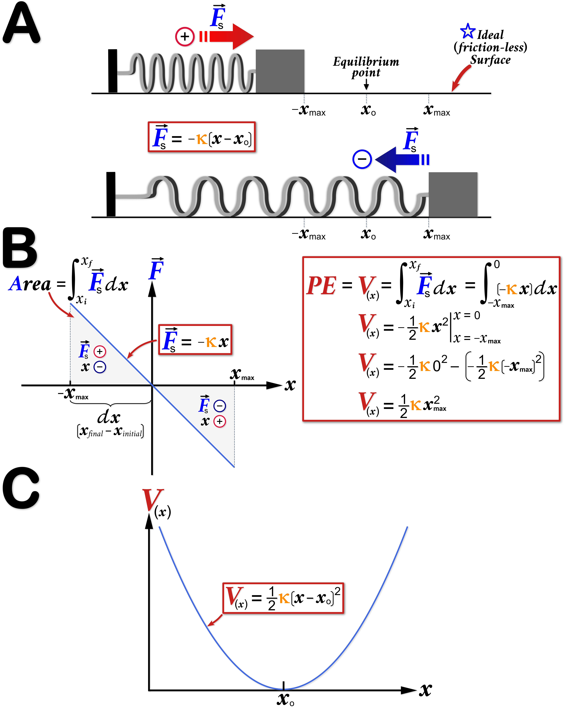
</figure>

**<u>Figure 20: Simple Harmonic Oscillator (SHO)</u>.** <b>(A)</b> A mass attached to a steel spring moving back and forth on a friction-less surface is an example of an idealized <b>S</b>imple <b>H</b>armonic <b>O</b>scillator (<b>SHO</b>). When the mass is displaced from its <b>equilibrium position</b> (<b>$x_{\text o}$</b>) it will oscillate back and forth due to the affects of these <u>opposing</u> <b>forces</b>. The positive <b>force</b> (<span id="Blue">$\vec F$</span>) generated by the compressed spring, which is greatest at <b>$-x_{max}$</b>, will push the mass toward <b>$x_{\text o}$</b>. When the mass moves beyond the equilibrium point a <u>restoring</u> <b>force</b> (-<span id="Blue">$\vec F$</span>) will cause it to move back toward <b>$x_{\text o}$</b>. The <b>periodic</b>, or "<i>back-and-forth</i>" motion of the mass will only cease when some <u>dampening</u> <b>force</b>, like friction, causes it to come to rest at <b>$x_{\text o}$</b>.  
**(B)** The <u>periodic</u> motion of this ideal <b>SHO</b> can be quantified using <b>Hooke's Law</b>. The restoring <b>force</b> (<b>$\vec F$</b>= -<span id="Ror2">$\kappa$</span><b>$x$</b>) operating here is directly proportional to the position of the mass relative to its equilibrium position (<b>$x_{\text o}$</b>). When the mass is left of the <b>equilibrium position</b> the relative distance is negative and the <u>restoring</u> <b>force</b> is positive, but when the mass is to the right of <b>$x_{\text o}$</b> the relative distance is positive and the <u>restoring</u> <b>force</b> is negative. A <b>Force - Distance</b> plot shows the negative linear relationship between the relative position of the mass and the magnitude and direction of the <u>restoring</u> <b>force</b>, which reaches its maximum at two points equidistant from <b>$x_{\text o}$</b>. The <b>Potential Energy</b> (<span id="Red">V</span>) of the <b>SHO</b>, which can be calculated using <u>integral calculus</u> (i.e. area under the <b>force</b> curve), is known to be equal to <b>$($</b><span id="Ror2">$\kappa$</span><b>$x^2)/2$</b>. Plotting this equation for <span id="Red">V</span> yields a parabolic shaped curve (<b>C</b>) due to the value of <span id="Red">V</span> continuously changing with position (i.e. <span id="Red">KE</span> <b>$\Leftrightarrow$</b> <span id="Red">V</span>).<b>[@serway_physics_2004]</b>  

</div>
<!---------------------------------------------------------------------->
<!---------------------------------------------------------------------->
<!---------------------------------------------------------------------->


One major advantage of using **SHO** to model the motion of <b>electrons</b> is the types of solutions they offer, namely <b>sine</b>, <b>cosine</b>, and <b>exponential functions</b> (<b>Fig. 21A</b>).  

<a id="SHOmodel2"></a>
<!--------------------------------------------------------->
<!------------ FIG 21 - SHO Energy Equations  ------------->
<!--------------------------------------------------------->
<div style="border: 2px solid gray; padding: 5px;">

<figure>

</figure>

**<u>Figure 21: SHO <span id="Red">E</span>nergy Equation</u>.** <b>(A)</b> Equating <b>Newton’s second law</b> (<span id="Blue">$\vec F$</span> = <b>$\text m$</b><span id="Blue">$\vec a_x$</span>) with <b>Hooke's Law</b> (<span id="Blue">$\vec F$</span> = -<span id="Ror2">$\kappa$</span><b>$x$</b>) and rearranging the terms yields a mathematical expression for the oscillator's angular <b>acceleration</b> (<span id="Blue">$\vec a$</span>).<b>[@serway_physics_2004; @thornton_modern_2013]</b> Since <span id="Blue">$\vec a$</span> is basically a secondary derivative with respect to time (<b>&#9312;</b>) it would be preferable to set the force constant ratio (<b>&#9313;</b>) equal to a squared value (<span id="Purple">$\omega$</span><b>$^2$</b>). Suitable trigonometric functions, which can correctly model this oscillating motion, are known to satisfy the mathematical expression: <b>$\partial^2 x / \partial t^2$</b> = -<span id="Purple">$\omega$</span><sup>2</sup><b>$x$</b> (<b>&#9314;</b>, <b>&#9315;</b>). This equation shows how the <b>force</b> generated by the oscillator is directly related to the <u>frequency</u> of oscillation (<b>&#9316;</b>), and inversely related to the mass of the oscillator (e.g. heavier particle needs more energy to oscillate). Lastly, by introducing <b>Planck's constant</b> (<b>$h$</b>) we can show that the <span id="Red">E</span><b>nergy</b> of the oscillator is equal to a <u>quantized</u> <span id="Purple">$\omega$</span> (<b>&#9317;</b>).  
**(B)** The <b>Energy</b> equation for our <b>SHO</b> includes our newly derived <b>Potential Energy</b> term (<span id="Red">V</span> = <b>$($</b><span id="Ror2">$\kappa$</span><b>$x^2)/2$</b>). Differentiating our <span id="Glacialb">cos</span> function with respect to time generates a <b>velocity</b> term for our <b>Kinetic Energy</b> expression (<b>&#9318;</b>). The final equation shows how the total <b>Energy</b> of the oscillator is directly proportional to the <u>square</u> of the <b>wave amplitude</b> (<b>&#9321;</b>).  
**(C)** Plotting the <b>Kinetic</b> and <b>Potential Energy</b> of our <b>SHO</b> versus time shows how the <b>energy</b> of the system is continuously being transformed from either <span id="Red">KE</span>-to-<span id="Red">V</span>, or <span id="Red">V</span>-to-<span id="Red">KE</span>, depending upon where it is relative to its equilibrium position (<b>$x_{\text o}$</b>). We can validate this equality by examining one or more known pairs of values (i.e. velocity at a given position). For example, we know that the displaced weight in <b>Fig. 20</b> reaches a <u>maximum</u> speed at position <b>$x_{\text o}$</b> (<b>$x = 0$</b>) and has a speed of zero when it reaches the <u>turning</u> points (<b>$x = + \text A$</b>, or <b>$x = - \text A$</b>).<b>[@serway_physics_2004; @thornton_modern_2013]</b>  

</div>
<!------------------------------------------------------------------>
<!------------------------------------------------------------------>
<!------------------------------------------------------------------>


&nbsp; &nbsp; When comparing the <b>Potential Energy</b> (<span id="Red">V</span>) curve of a <b>SHO</b> to the <b>LJ Potential Energy</b> curve of two interacting <b>atoms</b>, you will notice that parts of both curves closely align with one another (<b>Fig. 22</b>). For the <b>SHO</b>, the overlapping region spans its central equilibrium position (<b>$x_{\text o}$</b>). Assuming the <b>SHO</b> maintains its harmonic motion (i.e. only slight disturbances) than its <b>Potential Energy</b> curve can be used to approximate the <u>energy minimum</u> of a <b>LJ Potential Energy</b> curve (<b>Fig. 22</b>).<b>[@serway_physics_2004; @thornton_modern_2013]</b>  
&nbsp; &nbsp; An interesting property of our idealized <b>SHO</b> is that its <u>mean</u> <span id="Red">KE</span> is equal to the <u>mean</u> <span id="Red">PE</span> (i.e. <i><span id="Red">V</span></i><sub>avg</sub>) over its full range of motion (<b>Fig. 21</b>). In addition, the <u>mean</u> values of <b>$x^2$</b> and <b>$\vec \rho^2$</b> are equal to their respective <u>mean square deviations</u> (<b>MSD</b>). This latter aspect of <b>SHO</b> seems rather obscure, but it is in fact a rather useful piece of information, mainly because of its statistical or probabilistic nature (i.e. Recall: <b>HUP</b>). As shown below, <b>MSD</b> is simply the average squared difference between the the actual value (<b>$x_i$</b>) and the estimated mean value (<b>$\bar x$</b>) of a given variable (e.g. position <b>$x$</b> relative to <b>$x_{\text o}$</b>) from a sample population (e.g. all measured <b>$\Delta x$</b> values from an experiment). For us the connection between <b>MSD</b> and <b>HUP</b> is obviously, namely their shared variable space (i.e. <b>$\Delta x$</b>).  


$$\text{MSD} = \frac{1}{\text N} \sum_{i = 1}^{\text N} (x_i - \bar x)^2 = \frac{1}{\text N} \sum_{i = 1}^{\text N} (\Delta x)^2 \quad \quad \text{here:} \quad x_i - \bar x = x_i - x_{\text o}= \Delta x \\\\\\ \text{Mean value} = \frac{1}{\text N} \sum_{i = 1}^{\text N} x_i \quad \text{here each sample has a value of } (\Delta x)^2 \text{ or } (\Delta \vec \rho)^2$$


It is clear that the <b>$\Delta x$</b> values of <b>MSD</b> and <b>HUP</b> can somehow be combined to tell us something useful about <b>energy</b> of our <b>SHO</b> system, specifically its lowest possible energy state or <span id="Red">$\text E$</span><sub>o</sub>. Since <span id="Red">$\text E$</span><sub>o</sub> is naturally constrained by the <b>uncertainty principle</b> (i.e. <b>$\Delta$</b><span id="Blue">$\vec \rho$</span><b>$\cdot \Delta x =$</b><span id="Blue">$\hbar$</span><b>$/2$</b>), we can therefore use <b>HUP</b> to estimate this <b>quantum mechanical</b> "<i>ground state</i>".<b>[@thornton_modern_2013; [@nikolic_is_2017]]</b>  

$$\tag{46}
\text{SHO:} \quad \frac{\text E}{2} = \frac{\kappa(\Delta x)^2}{2} = \frac{\Delta \vec \rho^2}{2m} \quad \text{and} \quad \text{HUP:} \quad \Delta x \cdot \Delta \vec \rho= \frac{\hbar}{2} \\\\\\\\ \text{For a SHO:} \quad \text E_{\text o} = \kappa (\Delta x)^2 = \kappa \Big( \frac{\hbar}{2 \Delta \vec \rho} \Big)\Big( \frac{\Delta \vec \rho}{\sqrt{m \kappa}} \Big) = \sqrt{\frac{\kappa}{m}} \cdot \frac{\hbar}{2} = \frac{\hbar \omega}{2}$$

<a id="LJpotential"></a>
<!------------------------------------------------------------------>
<!------------------ FIG 22 - SHO model of Atoms ------------------->
<!------------------------------------------------------------------>
<div style="border: 2px solid gray; padding: 5px;">

<figure>
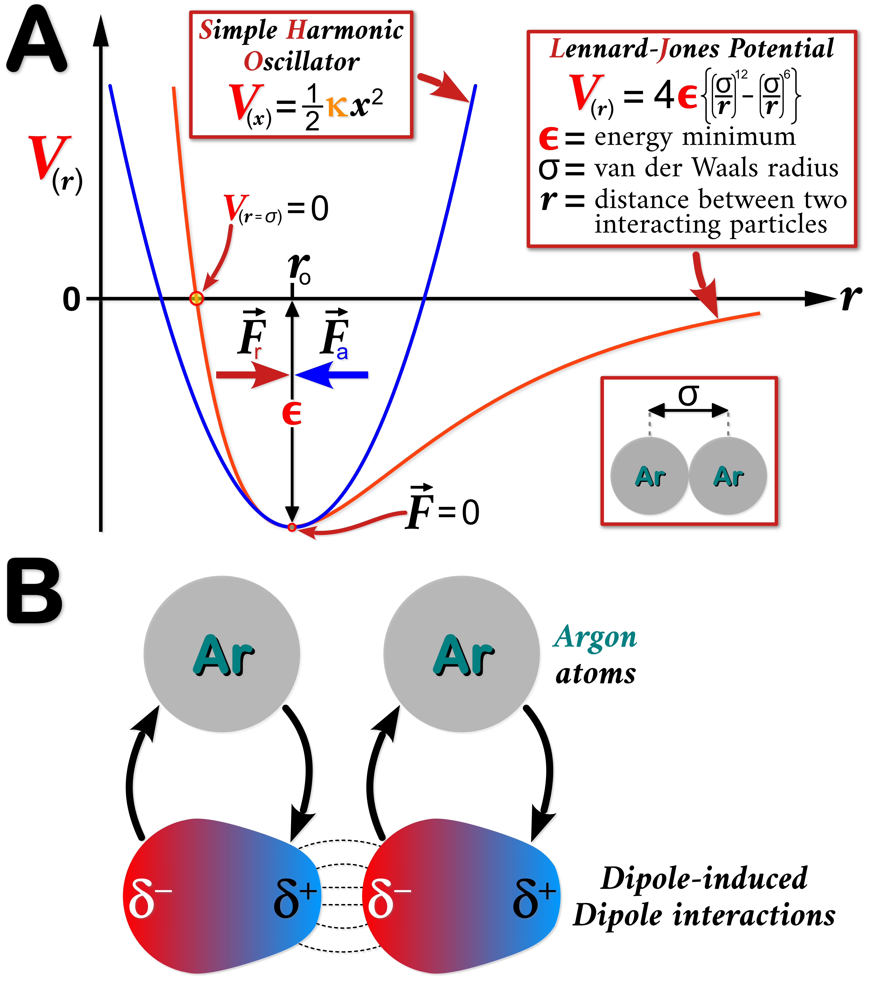
</figure>

**<u>Figure 22: Harmonic Oscillator Model of the <span id="Blue">H</span> atom</u>.** <b>(A)</b> The <b>Lennard-Jones Potential</b> function can approximate the interactions between two <u>neutral</u> <b>atoms</b> or molecules.<b>[@jones_determination_1924]</b> These interactions involve both <u>attractive</u> and <u>repulsive</u> forces whose magnitudes vary according to separation distance, as well as the degree of "<i>polarization</i>". This latter phenomena is about how easily the <b>electron density distribution</b> of an <b>atom</b> can be distorted to create <b>dipole moments</b> (<b>$\vec \mu$</b>). This distortion (i.e. separation of opposite charges) is generated by <b>quantum-mechanical fluctuations</b>, which is a property of the wave-like nature of <b>electrons</b>. The first exponential term in the equation (<b>$x^{12}$</b>) characterizes the <u>repulsive</u> forces, which increase rapidly when the <b>electron orbitals</b> start to overlap one another. The second exponential term (<b>$x^{6}$</b>) accounts for the <u>attractive</u> forces between the two <b>atoms</b> that are generated by the dipole-induced dipole interactions. The strength of this type of short range <b>van der Waals force</b> (often referred to as <b>London Dispersion forces</b>)<b>[@london_general_1937]</b> depends on how readily each <b>atom</b> undergoes <b>polarization</b>. This model <u>assumes</u> the interacting <b>atoms</b> remain close to their equilibrium positions (<b>$x_{\text o} = r_{\text o}$</b>), just like a <b>SHO</b>. The graph itself clearly shows the <b>Potential</b> <span id="Red">E</span><b>nergy</b> (<span id="Red">V</span>) rapidly increasing when the two <b>atoms</b> become too close to one another. However, when the opposing forces are balanced (<span id="Blue">$\vec F$</span><b>$_{\text a}$</b> = <span id="Blue">$\vec F$</span><b>$_{\text r}$</b>) an <b>energy minimum</b> is reached, which represents the most likely distance separating the two <b>atoms</b> (i.e. <b>$r_{\text o}$</b>).  
**(B)** <span id="Teal">Ar</span><b>gon</b>, being a member of the <b>Noble Gas</b> family of elements, is largely chemically inert. Its resistance to chemical reactions is due to the complete set (i.e. octet) of valence <b>electrons</b> occupying the outermost energy shell, which makes it energetically very stable. However, when gaseous <span id="Teal">Ar</span> is cooled to extremely low temperatures a very small percentage forms dimers (<span id="Teal">Ar</span>-<span id="Teal">Ar</span>) that are sometimes called <b>van der Waals molecules</b>.<b>[@blaney_van_1976]</b> These weakly bound dimer complexes are held together by <b>van der Waals forces</b>. One must remember that these neutral atoms are made up of electrically charged particles (i.e. protons and electrons). So when <b>quantum fluctuations</b> cause distortions or rearrangements in the outer electron "<i>cloud</i>" a <b>dipole moment</b> (<b>$\delta^+ \rightarrow \delta^-$</b>) is created. This initial <b>dipole moment</b> can, in turn, induce a similar <b>dipole moment</b> within a neighbouring <b>atom</b>, not unlike an applied magnetic field. Alignment of the resulting opposite charges generates the <b>Coulombic forces</b> needed to bind (albeit weakly) the two <b>atoms</b> together.  

</div>
<!------------------------------------------------------------------------->
<!------------------------------------------------------------------------->
<!------------------------------------------------------------------------->

<!--------------------------------------------------------->
<!------------ SHO Ladder Operator Technique  ------------->
<!--------------------------------------------------------->
<a id="LadderOperators"></a>  
Obviously, <span id="Red">$\text E$</span><sub>o</sub> is just one of many "<i>energy states</i>" we would like to solve for our quantum <b>SHO</b> system. In order to achieve this we first need to incorporate the <b>potential energy</b> of our <b>SHO</b> into the <b>TISE</b> as shown below (<b>Note:</b> <span id="Ror2">$\kappa$</span> = <b>$\text m$</b><span id="Purple">$\omega$</span><b>$^2$</b>).  

$$\tag{47} -\frac{\hbar^2}{2 \text m} \frac{\partial^2 \psi (x)}{\partial x^2} + \frac{1}{2} \text m \omega^2 x^2 \psi (x) \quad = \quad \text E \cdot \psi (x)$$

One way of solving the <b>wave function</b> (<b>$\psi (x)$</b>) of <b>$Eq. 47$</b> involves a very clever algebraic technique, originally devised by <b>Paul Dirac</b>, which is commonly referred to as <b>ladder operators</b>.<b>[@dirac_quantum_1927; @griffiths_introduction_1994]</b> These aptly named <u>operators</u> allow you to generate <b>$\psi (x)$</b> solutions for <b>energy states</b> that differ by one <b>quantum</b> (i.e. move up and down the quantized energy ladder). The first step in this algebraic process is to rearrange the terms of <b>$Eq. 47$</b> so that they can be <b><a class="one" href="https://www.mathsisfun.com/algebra/factoring.html" target="_blank" title="Go to MathIsFun">factorized</a></b>.  

$$\tag{47.1} \frac{1}{2 \text m} \Bigg[ \bigg(\frac{\hbar}{i} \frac{\partial}{\partial x}\bigg)^2 + \big( \text m \omega x \big)^2 \Bigg] \psi (x) \quad = \quad \text E \cdot \psi (x)$$

Factorization is made possible by the presence of <b>$i$</b> (imaginary number), since the two squared terms can be re-written as the product of <b><a class="one" href="https://www.mathsisfun.com/algebra/special-binomial-products.html">binomials</a></b> as shown below (<b>Recall:</b> <b>$i = \sqrt{-1}$</b>, and <b>$(\hbar/i)^2 = -\hbar^2$</b>):  

$$\text x^2 + \text y^2 \quad = \quad (\text x - i \text y)(\text x + i \text y)$$

When this factorization step is applied to <b>$Eq. 47.1$</b> we get the following expressions:  

$$\tag{48} \hat a_{(+)} = \frac{1}{\sqrt{2 \text m}} \Bigg( \frac{\hbar}{i} \frac{\partial }{\partial x} + i \text m \omega x\Bigg) \quad \quad \quad \quad \hat a_{(-)} = \frac{1}{\sqrt{2 \text m}} \Bigg( \frac{\hbar}{i} \frac{\partial }{\partial x} - i \text m \omega x\Bigg)$$

Since these two binomials are differential **operators** (i.e. <b>$\partial/\partial x$</b> is operating on <b>$\psi(x)$</b>), its possible that they may <u>not</u> be <b><a class="one" href="https://www.mathsisfun.com/associative-commutative-distributive.html" target="_blank" titel="Go to MathIsFun">commutative</a></b> (i.e. <b>$\hat x \times \hat y \ne \hat y \times \hat x$</b>). As a result, its important to check the product of these two binomials using a <u>test function</u> (e.g. <b>$f(x)$</b>).<b>[@griffiths_introduction_1994]</b>  

$$\tag{49} \hat a_{(-)} \hat a_{(+)} f(x) = \frac{1}{2 \text m} \Bigg( \frac{\hbar}{i} \frac{\partial}{\partial x} - i \text m \omega x \Bigg) \Bigg( \frac{\hbar}{i} \frac{\partial}{\partial x} + i \text m \omega x \Bigg) f(x)$$

$$\tag{49.1} \hat a_{(-)} \hat a_{(+)} f(x) = \frac{1}{2 \text m} \Bigg( \frac{\hbar}{i} \frac{\partial}{\partial x} - i \text m \omega x \Bigg) \Bigg( \frac{\hbar}{i} \frac{\partial f(x)}{\partial x} + i \text m \omega x \cdot f(x) \Bigg)$$

$$\tag{49.2} \hat a_{(-)} \hat a_{(+)} f(x) = \frac{1}{2 \text m} \Bigg[ -\hbar^2 \frac{\partial^2 f(x)}{\partial x^2} + \hbar \text m \omega \frac{\partial (x \cdot f(x))}{\partial x} - \hbar \text m \omega x \frac{\partial f(x)}{\partial x} + (\text m \omega x)^2 f(x) \Bigg]$$

Note that the second term within the square brackets needs to be expanded using the <b><a class="one" href="https://www.mathsisfun.com/calculus/product-rule.html" target="_blank" title="Go to MathIsFun">product rule</a></b> of calculus (i.e. <b>$\partial (x \cdot f(x))/\partial x = \partial x/\partial x \cdot f(x) + x \cdot \partial f(x)/\partial x$</b>, where <b>$\partial x/\partial x = 1$</b>). This results in the cancellation of the 3<sup>rd</sup> bracketed term, which leaves us with the following expression:  

$$\tag{49.3} \hat a_{(-)} \hat a_{(+)} f(x) \quad = \quad \frac{1}{2 \text m} \Bigg[ -\hbar^2 \frac{\partial^2 f(x)}{\partial x^2} + \hbar \text m \omega \cdot f(x) + (\text m \omega x)^2 f(x) \Bigg]$$

The test function (<b>$f(x)$</b>) can now be factored out of the equation, leaving behind our original equation (<b>$Eq. 47.1$</b>) and an additional, but familiar, energy term <span id="Blue">$\hbar$</span><span id="Purple">$\omega$</span><b>$/2$</b> (<b>$Eq. 49.5$</b>).  

$$\tag{49.4} \hat a_{(-)} \hat a_{(+)} f(x) = \frac{1}{2 \text m} \Bigg[ \bigg( \frac{\hbar}{i} \frac{\partial}{\partial x} \bigg)^2 + (\text m \omega x)^2 + \hbar \text m \omega  \Bigg] f(x)$$

$$\tag{49.5} \hat a_{(-)} \hat a_{(+)} = \frac{1}{2 \text m} \Bigg[ \bigg( \frac{\hbar}{i} \frac{\partial}{\partial x} \bigg)^2 + (\text m \omega x)^2 \Bigg] + \frac{\hbar \omega}{2}$$

Adding the <b>wave function</b> (<b>$\psi$</b>) to <b>$Eq. 49.5$</b> and combining the extra <b>energy</b> term with our pair of <b>operators</b> results in the following mathematical expression:  

$$\tag{49.6} \Big( \hat a_{(-)} \hat a_{(+)} - \frac{\hbar \omega}{2} \Big) \psi (x) = \frac{1}{2 \text m} \Bigg[ \bigg( \frac{\hbar}{i} \frac{\partial}{\partial x} \bigg)^2 + (\text m \omega x)^2 \Bigg] \psi (x) = \text E \cdot \psi (x) $$

If we repeat this <b>operator</b> multiplication process, but in reverse order (i.e. <b>$\hat a_{(+)} \times \hat a_{(-)} \times f(x)$</b>), we will end up with the following slightly different equation:  

$$\tag{49.7} \Big( \hat a_{(+)} \hat a_{(-)} + \frac{\hbar \omega}{2} \Big) \psi (x) = \frac{1}{2 \text m} \Bigg[ \bigg( \frac{\hbar}{i} \frac{\partial}{\partial x} \bigg)^2 + (\text m \omega x)^2 \Bigg] \psi (x) = \text E \cdot \psi (x)$$

Clearly, for these two <b>operators</b>, <u>the order you use them</u> during an operation <u>matters</u>! Overall, these <b>operators</b> can transform the <b>SE</b> into the following distinct functions depending upon the order you use them:  

$$\tag{49.8} \Big( \hat a_{(+)} \hat a_{(-)} \quad + \quad \frac{\hbar \omega}{2} \Big) \psi (x) \quad = \quad \text E \cdot \psi (x)$$
$$\tag{49.9} \Big( \hat a_{(-)} \hat a_{(+)} \quad - \quad \frac{\hbar \omega}{2} \Big) \psi (x) \quad = \quad \text E \cdot \psi (x)$$

Moreover, if you subtract <b>$Eq. 49.8$</b> from <b>$Eq. 49.9$</b>, or <b>$Eq. 49.9$</b> from <b>$Eq. 49.8$</b>, you produce the following mathematical expressions:  

$$\tag{50} \hat a_{(-)} \hat a_{(+)} \quad - \quad \hat a_{(+)} \hat a_{(-)} \quad = \quad \hbar \omega \\\\\\\\ \hat a_{(+)} \hat a_{(-)} \quad - \quad \hat a_{(-)} \hat a_{(+)} \quad = \quad -\hbar \omega$$

What does all of this mean? Remarkably some simple algebra actually clears up much of the confusion (at least from my perspective). Specifically, consider the following statement. If we have a <b>wave function</b> called <b>$\psi (x)$</b> that satisfies the <b>SE</b> for a given <b>energy</b> value symbolized by <span id="Red">E</span>, what happens to it when you apply one of the <b>operators</b>? Here we will simply apply the <b>$\hat a_{(+)}$</b> <b>operator</b> to <b>$\psi (x)$</b> to see what it does to the <b>energy</b> of the system (<b>Note:</b> each algebraic step is shown for emphasis).  

$$\tag{51} \text E \cdot \hat a_{(+)} \psi (x) \quad = \quad \Bigg( \hat a_{(+)} \hat a_{(-)} + \frac{\hbar \omega}{2} \Bigg) \cdot \hat a_{(+)} \psi (x) \\\\\\ = \quad \Bigg( \hat a_{(+)} \hat a_{(-)} \cdot \hat a_{(+)} + \frac{\hbar \omega}{2} \cdot \hat a_{(+)} \Bigg) \psi (x) \\\\\\ = \quad \hat a_{(+)} \Bigg( \hat a_{(-)} \hat a_{(+)} + \frac{\hbar \omega}{2} \Bigg) \psi (x) \\\\\\ = \quad \hat a_{(+)} \Bigg( \hat a_{(-)} \hat a_{(+)} - \frac{\hbar \omega}{2} + \hbar \omega \Bigg) \psi (x) \\\\\\ = \quad \hat a_{(+)} \Bigg( \bigg[ \hat a_{(-)} \hat a_{(+)} - \frac{\hbar \omega}{2} \bigg] \psi (x) + \hbar \omega \psi (x) \Bigg) \\\\\\  = \quad \hat a_{(+)} \Big( \text E \psi (x) + \hbar \omega \psi (x) \Big) \\\\\\ = \quad \hat a_{(+)} \psi (x) \Big( \text E + \hbar \omega \Big)$$


Apparently applying the <u>raising</u> <b>operator</b>, <b>$\hat a_{(+)}$</b>, to the <b>wave function</b> <u>increases</u> the <b>energy</b> of our oscillator by a single <u>quantum</u> of <b>energy</b> (<span id="Blue">$\hbar$</span><span id="Purple">$\omega$</span>). This <u>must</u> mean that:  

><b>$\hat a_{(+)} \psi (x)$</b> is a valid <u>solution</u> for the <b>SE</b> whose <b>energy</b> is <b>$\text E + \hbar \omega$</b>  

Conversely, it can be shown that when the <u>lowering</u> <b>operator</b>, <b>$\hat a_{(-)}$</b>, acts on the <b>wave function</b> its <b>energy state</b> <u>decreases</u> by one <span id="Blue">$\hbar$</span><span id="Purple">$\omega$</span> unit. Logically, this <u>must</u> mean that:  

><b>$\hat a_{(-)} \psi (x)$</b> is a valid <u>solution</u> for the <b>SE</b> whose <b>energy</b> is <b>$\text E - \hbar \omega$</b>  

This is quite remarkable since applying these <u>special</u> <b>operators</b> to our <b>wave function</b> allows us to either "<i>climb</i>" or "<i>descend</i>" an imaginary "<i>energy ladder</i>" one <b>quantum</b> "<i>rung</i>" at a time (<b>Recall:</b> <span id="Blue">$\hbar$</span><span id="Purple">$\omega$</span> = (<span id="Blue">$h$</span>/<b>$2 \pi$</b>)<b>$\times$</b>(<b>$2 \pi \nu)$</b>) = <span id="Blue">$h$</span><span id="Purple">$\nu$</span>, which is <b>Planck's equation</b>).<b>[@griffiths_introduction_1994]</b>  


<!------------------------------------------------------------------------>
<!-------------------- FIG 23 - SHO Ladder Operators --------------------->
<!------------------------------------------------------------------------>
<div style="border: 2px solid gray; padding: 5px;">

<div style="text-align: center">
<figure>
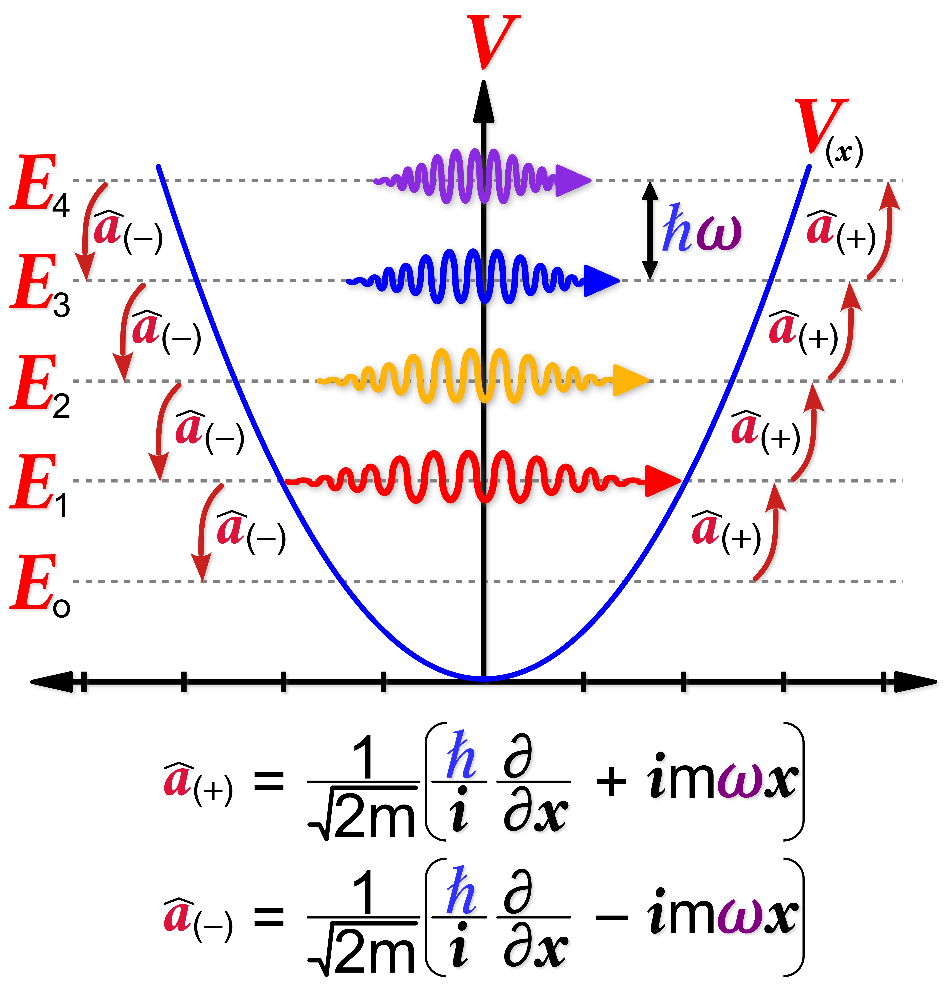
</figure>
</div>

**<u>Figure 23: SHO Ladder Operators and Energy Levels</u>.** When the <b>raising operator</b> (<b>$\hat a_{(+)}$</b>) is applied to our "<i>wave-like</i>" <b>quantum mechanical state</b> it will produce the next "<i>excited</i>" <b>state</b> located one <b>quantum</b> "<i>rung</i>" up the imaginary "<i>quantum ladder</i>". However, if the <b>lowering operator</b> (<b>$\hat a_{(i)}$</b>) is applied to our <b>quantum state</b> then it will transition to the next <u>lowest</u> <b>energy state</b> located one <b>quantum</b> "<i>rung</i>" down the "<i>quantum ladder</i>". The coloured wave packets symbolize the different <b>quantum energy states</b> of our <b>SHO</b> system.<b>[@thornton_modern_2013; @griffiths_introduction_1994]</b>  

</div>
<!------------------------------------------------------------------------>
<!------------------------------------------------------------------------>
<!------------------------------------------------------------------------>


Understandably, these <b>ladder operators</b> represent a <u>powerful tool</u> for finding solutions for different <b>energy states</b> of our idealized <b>quantum mechanical</b> <b>SHO</b> system. Of course, our imaginary "<i>energy ladder</i>" must have a bottom "<i>rung</i>", or more specifically a "<i>ground state</i>". Again, some simple algebra comes to our "<i>rescue</i>" here since we know that:  

$$1. \quad \quad \hat a_{(-)} \cdot \psi_{\text o}(x) \quad = \quad 0 \\\\\\ 2. \quad \quad \Big( \hat a_{(+)} \hat a_{(-)} \quad + \quad \frac{\hbar \omega}{2} \Big) \cdot \psi_{\text o}(x) \quad = \quad \text E_{\text o} \cdot \psi_{\text o}(x)$$

Substituting the first equation into the <u>expanded</u> second equation produces the following expression:  

$$\tag{52} \hat a_{(+)} \big( \hat a_{(-)} \cdot \psi_{\text o}(x) \big) \quad + \quad \frac{\hbar \omega}{2} \cdot \psi_{\text o}(x) \quad = \quad \text E_{\text o} \cdot \psi_{\text o}(x) \\\\\\\\ \hat a_{(+)} \big( 0 \big) \quad + \quad \frac{\hbar \omega}{2} \cdot \psi_{\text o}(x) \quad = \quad \text E_{\text o} \cdot \psi_{\text o}(x) \\\\\\\\ \frac{\hbar \omega}{2} \cdot \psi_{\text o}(x) \quad = \quad \text E_{\text o} \cdot \psi_{\text o}(x) \\\\\\\\ \frac{\hbar \omega}{2} \quad = \quad \text E_{\text o}$$

The above value for <span id="Red">E</span><sub>o</sub> is a welcome sight since it is the same <span id="Red">E</span><sub>o</sub> value predicted by the <b>uncertainty principle</b> (<b>$Eq. 46$</b>). Although we now have a value for <span id="Red">E</span><sub>o</sub>, we don't yet have its corresponding <b>wave function</b>. Fortunately, if we apply the lowering <b>ladder operator</b>, <b>$\hat a_{(-)}$</b>, to the "<i>ground state</i>" <b>wave function</b> (<b>$\psi_{\text o}$</b>), then the resulting <b>energy state</b> <u>must</u> have a value of <b>zero</b>. Mathematically we can represent this "ladder" logic as:  

$$\tag{53} \hat a_{(-)} \cdot \psi_{\text o}(x) \quad = \quad \frac{1}{\sqrt{2 \text m}} \Bigg( \frac{\hbar}{i} \frac{d}{d x} - i \text m \omega x\Bigg) \psi_{\text o}(x) \quad = \quad 0$$

Since <b>$x$</b> is the only variable associated with our <b>wave equation</b> it is customary to use the normal derivative notation (i.e. <b>$d \big(\psi_{\text o}(x)\big)/dx$</b>). Despite this formality we can simply rearrange the terms of <b>$Eq. 53$</b> and simplify it (i.e. some terms cancel out, and of course <b>$i^2 = -1$</b>) so that our derivative (i.e. <b>$d \big( \psi_{\text o}(x) \big)$</b>) is separated from the other terms on one side of the equation:  

$$\tag{54} \frac{d\big(\psi_{\text o}(x)\big)}{\psi_{o}(x)} \quad = \quad - \frac{\text m \omega x}{\hbar} \cdot dx$$

We can now retrieve <b>$\psi_{o}(x)$</b> by simply <u>integrating</u> the <u>derivative</u> of <b>$\psi_{\text o}(x)$</b> (<b>Recall:</b> <b>$\int d \big( \psi_{\text o}(x) \big) = \psi_{\text o}(x)$</b>, since integrals are anti-derivatives). This convenient step produces the following mathematical expression:  

$$\tag{55} \int \frac{d \big( \psi_{\text o}(x) \big)}{\psi_{\text o}(x)} \quad = \quad - \frac{\text m \omega}{\hbar} \int x \cdot d x \\\\\\\\ ln \big( \psi_{\text o}(x) \big) \quad = \quad -\frac{\text m \omega}{2 \hbar} x^2 + \text{constant} \\\\\\\\ e^{ln ( \psi_{\text o}(x))} \quad = \quad \psi_{\text o}(x) \quad = \quad e^{-\frac{\text m \omega}{2 \hbar} x^2} \quad = \quad exp \Big[ -\frac{\text m \omega}{2 \hbar} x^2 \Big] \\\\\\\\ \psi_{\text o}(x) \quad = \quad \text A_{\text o} \cdot exp \Big[ -\frac{\text m \omega}{2 \hbar} x^2 \Big]$$

After rearranging the terms (<b>Recall:</b> here we are only integrating terms that possess the variable <b>$x$</b>) and completing the basic integration step we are left with the <b><a class="one" href="https://www.mathsisfun.com/algebra/logarithms.html" target="_blank" title="Go to MathIsFun">natural logarithm</a></b> of our <b>wave function</b> (i.e. <b>$ln \big( \psi_{o}(x) \big)$</b>). This is a bit of a "<i>blessing</i>" because <b>$e$</b> raised to the power of <b>$ln$</b> (i.e. <b>$e^{ln(x)} = e^{log_e (x)} = x$</b>) is simply equal to the term in front to the <b>$ln$</b> notation, which is our sought after <b>$\psi_{\text o}(x)$</b>. We now have our <b>wave function</b> equal to a <b><a class="one" href="https://www.mathsisfun.com/sets/function-exponential.html" target="_blank" title="Go to MathIsFun">natural exponential function</a></b> (i.e. <b>$\text{exp}$</b> notation). Fortunately natural exponential functions are easy to differentiate and integrate, and the <u>constant</u> of integration (<b>c</b>) can safely be ignored since we are ultimately dealing with <b><a class="one" href="https://www.mathsisfun.com/calculus/integration-definite.html" target="_blank" title="Go to MathIsFun">definite integrals</a></b> (i.e. when integrating over a defined range of values this constant will be subtract away). Lastly, the <b>$A_{\text o}$</b> term was added to the integration product since it represents the yet to be determined <b>normalization factor</b>. We can now apply the <b>$\hat a_{(+)}$</b> <b>ladder operator</b> to our new "<i>ground state</i>" <b>wave function</b> to find the solution to the first "<i>excited</i>" <b>energy state</b> (i.e. <span id="Red">E</span><sub>1</sub>).<b>[@griffiths_introduction_1994]</b>  

$$\tag{56} \psi_1 (x) \quad = \quad \text A_1 \cdot \hat a_{(+)} \cdot \text{exp} \bigg[ \frac{- \text m \omega}{2 \hbar} x^2 \bigg] \\\\\\ \psi_1 (x) \quad = \quad \text A_1 \cdot \frac{1}{\sqrt{2 \text m}} \Bigg( \frac{\hbar}{i} \frac{d}{dx} + i \text m \omega x \Bigg) \cdot \text{exp} \bigg[ \frac{- \text m \omega}{2 \hbar} x^2 \bigg] \\\\\\ \psi_1 (x) \quad = \quad \frac{\text A_1}{\sqrt{2 \text m}} \Bigg( \frac{\hbar}{i} \frac{d}{dx}\bigg( \text{exp} \bigg[ \frac{- \text m \omega}{2 \hbar} x^2 \bigg] \bigg) + i \text m \omega x \cdot \text{exp} \bigg[ \frac{- \text m \omega}{2 \hbar} x^2 \bigg] \Bigg) \\\\\\ \psi_1 (x) \quad = \quad \frac{\text A_1}{\sqrt{2 \text m}} \Bigg( \frac{\hbar}{i} \bigg( \frac{- m \omega}{\hbar}x \bigg) \cdot \text{exp} \bigg[ \frac{- \text m \omega}{2 \hbar} x^2 \bigg] + i \text m \omega x \cdot \text{exp} \bigg[ \frac{- \text m \omega}{2 \hbar} x^2 \bigg] \Bigg) \\\\\\ \psi_1 (x) \quad = \quad \frac{\text A_1}{\sqrt{2 \text m}} \Bigg( i \text m \omega x  \cdot \text{exp} \bigg[ \frac{- \text m \omega}{2 \hbar} x^2 \bigg] + i \text m \omega x \cdot \text{exp} \bigg[ \frac{- \text m \omega}{2 \hbar} x^2 \bigg] \Bigg) \\\\\\ \psi_1 (x) \quad = \quad \frac{\text A_1}{\sqrt{2 \text m}} \Bigg( 2 \text m \cdot i \omega x  \cdot \text{exp} \bigg[ \frac{- \text m \omega}{2 \hbar} x^2 \bigg] \Bigg)  \\\\\\ \psi_1(x) \quad = \quad \text A_1 \cdot \sqrt{2 \text m} \cdot i \omega x  \cdot \text{exp} \bigg[ \frac{- \text m \omega}{2 \hbar} x^2 \bigg]$$

Repeated application of the raising <b>ladder operator</b> (<b>$\hat a_{(+)}$</b>) can therefore provide solutions for even higher "<i>excited</i>" <b>energy states</b>, a process that can be summarized as follows:   

<div style="border: 2px solid gray; padding: 5px;">

$$\tag{57} \psi_n (x) = \text A_n \cdot (a_{(+)})^n \cdot \text{exp} \bigg[ -\frac{m \omega}{2 \hbar}x^2 \bigg] \quad \Longrightarrow \quad \text{ E}_n = \bigg ( n + \frac{1}{2} \bigg) \hbar \omega$$
</div>


As a final step we need to <b>normalize</b> the <b>wave function</b> (i.e. determine the value of the normalization coefficient <b>$\text A_{\text o}$</b>), since these functions are often composed of <b><a class="one" href="https://www.mathsisfun.com/numbers/complex-numbers.html" target="_blank" title="Go to MathIsFun">complex numbers</a></b>. Fortunately, the exponential function in <b>$Eq. 57$</b> is not complex, which simply means we can use the square of the real function (<b>$Eq. 33.2$</b>) for our calculation. In most cases the resulting <b>probability density</b> can be integrated, which allows us to add up <u>all</u> of the probabilities. Logically, all of the probabilities must sum up to 100% (i.e. unity = 1 =100/100) as shown below.  

$$\text{PD}(\psi_{\text o}) \cdot dx = \int^{+ \infty}_{- \infty} |\psi_{\text o}|^2 \cdot dx = \int^{+ \infty}_{- \infty} \psi_{\text o} \cdot \psi^*_{\text o} \cdot dx = 1$$

Details of the <u>normalization</u> process for our "<i>ground state</i>" <b>wave function</b> is shown below.  

$$\tag{58} \text A_{\text o}^2 \int^{+ \infty}_{- \infty} \text{exp} \bigg( - \frac{\text m \omega}{2 \hbar}x^2 \bigg) \cdot \text{exp} \bigg( - \frac{\text m \omega}{2 \hbar}x^2 \bigg) \cdot dx \quad = \quad 1 \\\\\\ \text A_{\text o}^2 \int^{+ \infty}_{- \infty} \text{exp} \bigg( - \frac{\text m \omega}{\hbar}x^2 \bigg) \cdot dx \quad = \quad 1 \\\\\\ 2 \text A_{\text o}^2 \int^{+ \infty}_{0} \text{exp} \bigg( - \frac{\text m \omega}{\hbar}x^2 \bigg) \cdot dx \quad = \quad 1 \\\\\\ \text{Let: } \alpha = \frac{m \omega}{\hbar} \quad \Longrightarrow \quad 2 \text A_{\text o}^2 \int^{+\infty}_{0} \text{exp} \Big( - \alpha x^2 \Big) \cdot dx \quad = \quad 1 \\\\\\ 2 \text A_{\text o}^2 \bigg( \frac{1}{2} \sqrt{\frac{\alpha}{\pi}} \bigg) \quad = \quad 1 \\\\\\ \text A_{\text o} \quad = \quad \bigg( \frac{\alpha}{\pi} \bigg)^{\frac{1}{4}} \quad = \quad \bigg( \frac{\text m \omega}{\pi \hbar} \bigg)^{\frac{1}{4}}$$

Note that the final integration step of the <u>base</u> exponential function (i.e. <b>$\text{exp}\big( - \alpha x^2\big)$</b>) simply involved looking up the solution from an integral table (which is often the case for these types of functions). As shown below (<b>$Eq. 59$</b>) we now have a completely <u>normalized</u> "<i>ground state</i>" <b>wave function</b>.<b>[@griffiths_introduction_1994]</b>  

$$\tag{59} \psi_{\text o}(x) \quad = \quad \bigg( \frac{\text m \omega}{\pi \hbar} \bigg)^{\frac{1}{4}} \cdot \text{exp} \bigg[ - \frac{\text m \omega}{2 \hbar}x^2 \bigg]$$


<!------------------------------------------------------------------>
<!------------------ Section 8 - Quantum Numbers ------------------->
<!------------------------------------------------------------------>
<a id="QN"></a>
**<span style="border: 2px solid black;">&thinsp; 8. Quantum Numbers &thinsp;</span>:** If we return to our <b>spherical wave function</b> (<b>$Eq. 44$</b>) we can finally set the right side of the equation to <b>$- m_{\ell}^2$</b>, which produces the following mathematical expression:  

$$\tag{60} -m_{\ell}^2 = - \bigg( \frac{sin^2 \theta}{\text R} \frac{\partial}{\partial r} \Big( r^2 \frac{\partial \text R}{\partial r} \Big) \bigg) - \bigg(\frac{sin \theta}{f} \frac{\partial}{\partial \theta} \Big( sin \theta \frac{\partial f}{\partial \theta} \Big) \bigg) - \frac{2 \mu r^2 sin^2 \theta}{\hbar^2}(\text E - \text V)$$

Multiplying both sides of <b>$Eq. 60$</b> by <b>$1/sin^2 \theta$</b> (which will "<i>free</i>" the <b>$\text R$</b> variable from <b>$sin ^2\theta$</b>) and rearranging the terms finally produces a mathematical expression (<b>$Eq. 60.2$</b>) that has the remaining two system variables (i.e. <b>$r$</b> and <b>$\theta$</b>) occupying opposite sides of the equation (i.e. separation of the variables is now complete ...phew!, or perhaps phooey!, or just maybe both ...its all superposition to me!).  

$$\tag{60.1} \frac{-m_{\ell}^2}{sin^2 \theta} = - \frac{1}{\text R} \frac{\partial}{\partial r} \Big( r^2 \frac{\partial \text R}{\partial r} \Big) - \frac{1}{f sin \theta} \frac{\partial}{\partial \theta} \Big( sin \theta \frac{\partial f}{\partial \theta} \Big) - \frac{2 \mu r^2}{\hbar^2}(\text E - \text V)$$

$$\tag{60.2} \frac{1}{\text R} \frac{\partial}{\partial r} \Big( r^2 \frac{\partial \text R}{\partial r} \Big) + \frac{2 \mu r^2}{\hbar^2} (\text E - \text V) = \frac{m_{\ell}^2}{sin^2 \theta} - \frac{1}{f sin \theta} \frac{\partial}{\partial \theta} \Big( sin \theta \frac{\partial f}{\partial \theta} \Big)$$

With each variable now independent of the other we can once again choose a constant to represent their shared equality (i.e. LS = RS = constant). In this case the value of the constant is <b>$\ell (\ell + 1)$</b> (<b>Note:</b> <b>$\ell$</b> is known as the <b>orbital angular momentum quantum number</b>)<b>[@thornton_modern_2013; @griffiths_introduction_1994]</b> as apposed to <b>$\ell^2$</b>. The reason for this stems from the restrictions placed on the <b>quantum numbers</b> (e.g. n > <b>$\ell$</b>), and the <u>boundary conditions</u> placed on the <b>wave functions</b> itself (detailed below). Regardless, the resulting variable specific equations are shown below.  

<a id="RadAngE"></a>
$$\tag{61} \underbrace{\frac{1}{\text R} \frac{\partial}{\partial r} \Big( r^2 \frac{\partial \text R}{\partial r} \Big) + \frac{2 \mu r^2}{\hbar^2}(\text E - \text V)}_{r \text{ variable}} = \ell (\ell + 1)$$

$$\tag{62} \underbrace{\frac{m_{\ell}^2}{sin^2 \theta} - \frac {1}{f sin \theta} \frac{\partial}{\partial \theta} \Big( sin \theta \frac{\partial f}{\partial \theta} \Big)}_{\theta \text{ variable}} = \ell (\ell + 1)$$

Rearranging the terms of <b>$Eq. 61$</b> and <b>$Eq. 62$</b> generates our final variable specific equations for our <u>spherical</u> <b>TISE</b>, the so called <b>Radial Equation</b> (<b>$Eq. 61.2$</b>) and <b>Angular Equation</b> (<b>$Eq. 62.3$</b>).  

$$\tag{61.1} \frac{1}{\text R} \frac{\partial}{\partial r} \bigg( r^2 \frac{\partial \text R}{\partial r} \bigg) + \frac{2 \mu r^2}{\hbar^2} \bigg( \text E - \text V - \frac{\hbar^2}{2 \mu} \frac{\ell (\ell + 1)}{r^2} \bigg) = 0$$

<div style="border: 2px solid black;">

$$\tag{61.2} \frac{1}{r^2} \frac{\partial}{\partial r} \bigg( r^2 \frac{\partial \text R}{\partial r} \bigg) + \frac{2 \mu}{\hbar^2} \bigg( \text E - \text V - \frac{\hbar^2}{2 \mu} \frac{\ell (\ell + 1)}{r^2} \bigg) \text R = 0$$
</div>

$$\tag{62.1} - \frac {1}{f sin \theta} \frac{\partial}{\partial \theta} \Big( sin \theta \frac{\partial f}{\partial \theta} \Big) = \ell (\ell + 1) - \frac{m_{\ell}^2}{sin^2 \theta}$$

$$\tag{62.2} - \frac {1}{sin \theta} \frac{\partial}{\partial \theta} \bigg( sin \theta \frac{\partial f}{\partial \theta} \bigg) = \bigg( \ell (\ell + 1) - \frac{m_{\ell}^2}{sin^2 \theta} \bigg)f$$

<div style="border: 2px solid black;">
$$\tag{62.3} \frac {1}{sin \theta} \frac{\partial}{\partial \theta} \bigg( sin \theta \frac{\partial f}{\partial \theta} \bigg) + \bigg( \ell (\ell + 1) - \frac{m_{\ell}^2}{sin^2 \theta} \bigg)f = 0$$
</div>

&nbsp; &nbsp; With the <b>Schrodinger equation</b> now divided up into three separate differential equations we can now examine each them in a little bit more detail. Of course these equations describe our model <span id="Blue">H</span>ydrogen <b>atom</b>, which is a relatively simple two-body system with a well defined <b><a class="one" href="http://hyperphysics.phy-astr.gsu.edu/hbase/electric/elepe.html" target="_blank" title="Go to HyperPhysics">electric potential</a></b> (<b>$\text V = - e^2/4\pi \epsilon_{\text o} r$</b>) governing the interactions between these oppositely charged bodies (i.e. positively charged <b>proton</b> and negatively charged <b>electron</b>). Unfortunately, more complicated <b>atoms</b> (&ge; 3 body system) give rise to many more complicated equations, which require the use of approximation methods to solve.<b>[@thornton_modern_2013; @griffiths_introduction_1994]</b>  
&nbsp; &nbsp; The <b>Radial equation</b>, which contains the central <u>distance</u> vector (<b>$r$</b>), is a natural focal point for our discussion since the <u>radius</u> of an <b>atom</b> is a directly related to its <b>energy state</b>. If we start with the lowest <b>energy level</b> (i.e. <b>$n = 1$</b>) we can assume that its <b>quantum numbers</b> must have the lowest possible values. Specifically, <b>$\ell$</b>, which is the <b>Orbital angular momentum quantum number</b>, will be equal to zero. Plugging this value into <b>$Eq. 61.2$</b>, as well as simplifying the expression (i.e. complete the differential with respect to <b>$r$</b> using the <b><a class="one" href="https://www.mathsisfun.com/calculus/derivatives-rules.html" target="_blank" title="Go to MathIsFun">chain rule</a></b>) and plugging in the <b><a class="one" href="http://hyperphysics.phy-astr.gsu.edu/hbase/electric/elepe.html" target="_blank" title="Go to HyperPhysics">electric potential</a></b> (i.e. are value for <b>$\text V$</b>) results in the following mathematical expression:  

$$\tag{63} \frac{1}{r^2} \frac{\partial}{\partial r} \bigg( r^2 \frac{\partial \text R}{\partial r} \bigg) + \frac{2 \mu}{\hbar^2} \bigg( \text E - \text V - \frac{\hbar^2}{2 \mu} \frac{0 (0 + 1)}{r^2} \bigg) \text R = 0 \\\\\\ \frac{1}{r^2} \bigg( r^2 \frac{\partial^2 \text R}{\partial r^2} + 2r \frac{\partial \text R}{\partial r} \bigg) + \frac{2 \mu}{\hbar^2} \bigg( \text E + \frac{e^2}{4 \pi \epsilon_{\text o} r} \bigg) \text R = 0 \\\\\\ \frac{\partial^2 \text R}{\partial r^2} + \frac{2}{r} \frac{\partial \text R}{\partial r} + \frac{2 \mu}{\hbar^2} \bigg( \text E + \frac{e^2}{4 \pi \epsilon_{\text o} r} \bigg) \text R = 0$$

We are now left with the problem of finding an appropriate solution for the function <b>$\text R$</b> (<b>$Eq. 63$</b>). Not surprisingly such a solution can take the form of an exponential function such as <b>$\text R = \text A e^{-r / a_{\text o}}$</b> (<b>Note:</b> <b>$a_{\text o}$</b> is a constant).<b>[@thornton_modern_2013]</b> As per usual we now need to verify the solution by substitution. First we need to generate the appropriate derivatives (<b>$Eq. 64$</b>) to plug into <b>$Eq. 63$</b>. Also, since these equations contain only one variable it is customary to replace the partial derivative sign with the normal derivative sign.  

$$\tag{64} \frac{d \text R}{d r} = \frac {d(\text A e^{-r / a_{\text o}})}{dr} = \frac{-1}{a_{\text o}} \text A e^{-r / a_{\text o}}  = -\frac{1}{a_{\text o}} \text R \quad \quad \quad \text{and} \quad \quad \quad \frac{d^2 \text R}{d r^2} = \frac{\text R}{a_{\text o}^2}$$

Inserting the derivatives into <b>$Eq. 63$</b> results in the following expression:  

$$\tag{65} \frac{\text R}{a_{\text o}^2} - \frac{2 \text R}{r a_{\text o}} + \frac{2 \mu}{\hbar^2} \bigg( \text E + \frac{e^2}{4 \pi \epsilon_{\text o} r} \bigg) \text R = 0 \\\\\\ \frac{1}{a_{\text o}^2} - \frac{2}{r a_{\text o}} + \frac{2 \mu}{\hbar^2} \bigg( \text E + \frac{e^2}{4 \pi \epsilon_{\text o} r} \bigg) = 0$$

After further simplifying and rearranging the terms of <b>$Eq. 65$</b> we end up with the following polynomial:  

$$\tag{65.1} \frac{1}{r} \bigg(\frac{2 \mu e^2}{4 \pi \epsilon_{\text o} \hbar^2} - \frac{2}{a_{\text o}} \bigg) + \bigg( \frac{2 \mu}{\hbar^2} \text E + \frac{1}{a_{\text o}^2} \bigg) = 0$$

<b>$Eq. 65.1$</b> is essentially made up of two separate bracketed expressions that add up to zero. This means that for any <u>real</u> distance value assigned to <b>$r$</b> each of the bracketed expressions must equal zero (i.e. to maintain the overall zero equality of the equation). By simply setting each of the bracketed expressions to zero we can solve for <b>$a_{\text o}$</b> and <b>$\text E$</b>.<b><sup>10</sup></b> This gives us the following mathematical expressions:   

$$\tag{66} \frac{1}{r} \bigg(\frac{2 \mu e^2}{4 \pi \epsilon_{\text o} \hbar^2} - \frac{2}{a_{\text o}} \bigg) = 0 \quad \Longrightarrow \quad \frac{\mu e^2}{4 \pi \epsilon_{\text o} \hbar^2} = \frac{1}{a_{\text o}} \quad \Longrightarrow \quad a_{\text o} = \frac{4 \pi \epsilon_{\text o} \hbar^2}{\mu e^2} $$

$$\tag{67} \frac{2 \mu}{\hbar^2} \text E + \frac{1}{a_{\text o}^2} = 0 \quad \quad \Longrightarrow \quad \quad \text E = - \frac{\hbar^2}{2 \mu a_{\text o}^2} $$

<a id="SandB"></a>
We have now come full circle with our **wave function**, since <b>$Eq. 66$</b> is directly linked to <b>Bohr's</b> original "<i>quantized</i>" model of the <b>atom</b>. As you can see in <b>$Eq. 66.1$</b> our constant <b>$a_{\text o}$</b> is in fact the <b>Bohr radius</b> (<b>Fig 6</b>, <b>&#9321;</b>), and substituting it into <b>$Eq. 67$</b> gives us the same "<i>quantized</i>" <b>energy equation</b> (<b>$Eq. 67.1$</b>) that was originally derived by <b>Bohr</b> (<b>Fig 6</b>, <b>&#9322;</b>).<b>[@thornton_modern_2013]</b>  

$$\tag{66.1} a_{\text o} = \frac{4 \pi \epsilon_{\text o} \hbar^2}{\mu e^2} = \frac{4 \pi \epsilon_{\text o}}{\mu e^2} \bigg( \frac{h}{2 \pi} \bigg)^2 = \frac{\epsilon_{\text o} h^2}{\mu \pi e^2} = \text{ Bohr radius}$$

$$\tag{67.1} \text E = \frac{ -\hbar^2}{2 \mu a_{\text o}^2} = \frac{- h^2}{8 \pi^2 \mu} \bigg( \frac{\mu \pi e^2}{\epsilon_{\text o} h^2} \bigg)^2 = \frac{- h^2 \mu^2 \pi^2 e^4}{8 \pi^2 \mu \epsilon_{\text o}^2 h^4} = \frac{- \mu e^4}{8 \epsilon_{\text o}^2 h^2} = -13.6 \text{ eV}$$

So, when <b>$\ell$</b> (<b>Orbital angular momentum quantum number</b>) is equal to zero the <b>Radial equation</b> produces the energy value for an electron occupying the first <b>energy level</b> (i.e. <b>$n =1$</b>). In keeping with <b>Bohr's model</b> (<b>Fig. 7</b>) we need to introduce a new <b>quantum number</b> into the <b>Radial equation</b> to account for any possible <b>energy level</b> for the <span id="Blue">H</span> <b>atom</b> (i.e. <b>Z = 1</b>). Not surprisingly, it is called <b>$n$</b>, or the <b>principle quantum number</b>, and as shown below it must always be greater than <b>$\ell$</b>.  

$$\tag{68} \text E_n = \frac{1}{n^2} \bigg( \frac{- \mu e^4}{8 \epsilon_{\text o}^2 h^2} \bigg) = \frac{1}{n^2} \frac{- \mu e^4}{8 \epsilon_{\text o}^2 (2 \pi \hbar)^2} = \frac{1}{n^2} \frac{- \mu e^4}{32 \epsilon_{\text o}^2 \pi^2 \hbar^2} = - \frac{\text E_0}{n^2} \\\\\\\\\\ \text{when n = 1} \quad \Longrightarrow \quad \text E_{1} = - \text E_0 = -13.6 \text{ eV}$$

Besides the constraint placed on <b>$\ell$</b> in relation to <b>$n$</b> (i.e. <b>$\ell$</b> < <b>$n$</b>), we can also see (after a simple rearrangement of terms in <b>$Eq. 68$</b>) how the <b>Electric Potential energy</b> is "<i>quantized</i>" with respect to <b>$r$</b> (i.e. radial <u>distance</u> separating the central <b>proton</b> from the <b>electron</b>).<b>[@thornton_modern_2013]</b>  

$$\tag{68.1} \text E_n = \bigg( \frac{- \mu e^4}{32 \epsilon_{\text o}^2 \pi^2 \hbar^2} \bigg) \frac{1}{n^2} = - \frac{\mu}{2} \bigg( \frac{e^2}{4 \pi \epsilon_{\text o} \hbar} \bigg)^2 \frac{1}{n^2} \\\\\\\\\ \text{Electric Potential Energy} \quad \Longrightarrow \quad \text V_{(r)} = - \frac{e^2}{4 \pi \epsilon_{\text o} r}$$

<a id="SHfunc"></a>
Since our final **wave equation** (<b>$\Psi_{(r, \theta , \phi)}$</b>) is a product of the three functions (i.e. <b>Radial</b>, <b>Angular</b> and <b>Azimuthal</b>) that depend on three <b>quantum numbers</b> (<b>$n, \ell, m_{\ell}$</b>), we can add appropriate notations to reflect these key facts. Specifically, <b>$\text R(r)f(\theta)g(\phi)$</b> (<b>$Eq. 41$</b>) can now take the following slightly modified form:  

$$\tag{69} \Psi_{n, \ell , m_{\ell}} (r,\theta,\phi) = \text R_{n, \ell} (r) \cdot \text Y_{\ell, m_{\ell}}(\theta, \phi)$$

Now each **wave function** has a subscript that indicates which **quantum numbers** they are dependent upon. Specifically, <b>$\text R$</b> is dependent on <b>$n$</b> and <b>$\ell$</b>, while <b>$\text Y$</b> is dependent on <b>$m_{\ell}$</b> and <b>$\ell$</b>. Also, <b>$f(\theta)g(\phi)$</b> has been replaced by <b>$\text Y_{\ell, m_{\ell}}(\theta, \phi)$</b> because the solutions to both of these functions are dependent on <b>$m_{\ell}$</b>. Together they make up what is known as a <b>Spherical Harmonic function</b> (i.e. <b>$\text Y(\theta, \phi) = f(\theta)g(\phi)$</b>). This arrangement makes sense since we are ultimately trying to describe the volume of space the <b>electron</b> occupies within the <b>atom</b>. The dimensions of this 3D space is defined in part by the length of the <u>radial</u> vector (<b>$r$</b>). For a spherical volume, such as the first energy level of our <b>atom</b>, one can imagine the topological space or surface of this volume being "<i>sketched</i>" by the end of an imaginary pencil whose length is <b>$r$</b>. Like the hands of a clock, this imaginary pencil would trace a circle as it rotates (i.e. <b>$\theta$</b> angle) 360&deg; (or <b>$2\pi$</b> radians) along the <b>z plane</b>. When it returns to its starting position the <b>azimuth</b> of the pencil would be shifted (i.e. <b>$\phi$</b> angle along the horizontal x-y plane) so that it can trace out a new circle along the <b>z plane</b>. This process would be repeated over and over until every point that makes up this outer shell is mapped out. This close relationship between <b>$\theta$</b> and <b>$\phi$</b> makes grouping them together a reasonable step, albeit somewhat at odds with the "<i>separation of variables</i>" theme.  
&nbsp; &nbsp; So it is clear that the probability distribution of our <b>electron</b>, or rather where the electron is usually found within the <span id="Blue">H</span> <b>atom</b>, is ultimately determined by three <u>separable</u> <b>wave functions</b>: <b>$R(r), f(\theta)$</b> and <b>$g(\phi)$</b>. However, before discussing how each <b>quantum number</b> shapes the <b>probability density</b> of our <b>electron</b>, lets first describe some key features of our three <span id="Dred">quantum numbers</span>.  


<a id="QNinfoBox"></a>
<!--------------------------------------------------------------->
<!--------------------------------------------------------------->
<!------------------ Quantum Numbers Info Box ------------------->
<!--------------------------------------------------------------->
<!--------------------------------------------------------------->
<div style="border: 1px solid black; padding: 5px;">

<div style="position: absolute; left: 460px; width: 350px;">

<span id="Blue">QUANTUM NUMBERS:</span> <b>$n$</b>, <b>$\ell$</b>, <b>$m_{\ell}$</b>  

</div>

<div style="position: relative; top: 30px;">
<b><span style="border: 1px solid black;">&thinsp; 1. Principal Quantum Number &thinsp;</span>:</b> This <b>quantum number</b>, which is symbolized by <b>$n$</b>, is a product of the <b>Radial function</b> (<b>$\text R(r)$</b>, <b>$Eq. 61.2$</b>).<b>[@thornton_modern_2013]</b> It represents the <b>energy level</b> of an <b>atom</b> and is always a positive integer value (i.e. <b>$n > 0$</b>). Traditionally it is identified using the following letter code:  

$$n = 1, 2, 3, 4, 5... \\\\\\ \text{Letter} = \text{K, L, M, N, O}...$$

Energy levels are often referred to as "*shells*". For example, the lone electron of the <span id="Blue">H</span> **atom** occupies the **K shell** (<b>$n = 1$</b>). Besides having a value greater than zero it is also greater than the value of <b>$\ell$</b>, the so called <b>Orbital angular momentum quantum number</b> (i.e. <b>$n > \ell$</b>). Although <b>Bohr's model</b> made a clear connection between <b>$n$</b> and the <b>angular momentum</b> (<b>$L$</b>) of an <b>electron</b> (<b>Fig. 6</b>, <b>&#9319;</b>) the <b>quantum</b> nature of <b>$\ell$</b> proves otherwise (see next section).  

<b><span style="border: 1px solid black;">&thinsp; 2. Orbital Quantum Number &thinsp;</span>:</b> This <b>quantum number</b>, denoted by <b>$\ell$</b>, is found in both the <b>Radial equation</b> (<b>$\text R(r)$</b>, <b>$Eq. 61.2$</b>) and the <b>Angular equation</b> (<b>$f(\theta)$</b>, <b>$Eq. 62.3$</b>). It describes the magnitude of the <b>angular momentum</b> (<b>$\vec L$</b>), as well as the overall <u>shape</u> of the <b>atomic orbital</b>. Contrary to <b>Bohr's model</b> (<b>Fig. 6</b>, <b>&#9319;</b>) the "<i>quantization</i>" of <b>$\vec L$</b> is not the product of <b>$n$</b> and <b>$\hbar$</b>, but rather <u>related</u> to the magnitude of the <b><a class="one" href="http://hyperphysics.phy-astr.gsu.edu/hbase/quantum/qangm.html" target="_blank" title="Go to HyperPhysics">orbital angular momentum</a></b> (<b>Note:</b> classical <b>$\vec L$</b> is the product of the orbital <u>radius</u> and the particle's <b>$\vec \rho$</b>, or simply <b>$\vec L = \text r \cdot m \vec{\text v}$</b><sub>o</sub>, where <b>$\vec{\text v}$</b><sub>o</sub> is the <u>orbital</u> velocity perpendicular to <b>$\text r$</b>). The mathematical relationship between <b>$\vec L$</b> and <b>$\ell$</b> is as follows:  

$$\text{Schrodinger's quantized } \vec L \Longrightarrow L^2 = \ell (\ell + 1) \cdot \hbar^2 \\\\\\ \text{Bohr's quantized } \vec L \Longrightarrow L^2 = n^2 \cdot \hbar^2$$

Moreover, just like the <b>Principal quantum number</b>, the different values of <b>$\ell$</b> were traditionally identified by the following letter code:   

$$\ell = 0, 1, 2, 3, 4, 5... \\\\\\ \text{Letter} = \text{s, p, d, f, g, h}...$$

The letter codes for <b>$\ell$</b> are based on notations used by a number of prominent early investigators, such as <b>Sommerfeld</b> (1923), <b>Born</b> (1925) and <b>Hund</b> (1927), to describe the <u>spectral lines</u> of <b>alkali metals</b> (i.e. <b>$\text s$</b><i>harp</i>, <b>$\text p$</b><i>rinciple</i>, <b>$\text d$</b><i>iffuse</i> and <b>$\text f$</b><i>undamental</i> line series).<b>[@sommerfeld_atomic_1923; @born_vorlesungen_1925; @hund_linienspektren_1927; @jensen_origin_2007]</b> As mentioned previously <b>$\ell$</b> can only take on values that are less than <b>$n$</b> (i.e. <b>$\ell < n$</b>). For example, when <b>$n = 3$</b> the value of <b>$\ell$</b> can be either 0, 1 or 2. In general, <b>electrons</b> that occupy different <b>quantum states</b> (i.e. <b>$n = 3 \; \Rightarrow \; \ell = 0, 1, 2$</b>) within the same <b>energy level</b> have the same amount of <b>energy</b> (Note: quantum states under this scenario are often referred to as "<i>degenerate</i>" states). Lastly, it is customary to denote the <u>quantum state</u> of an <b>electron</b> by using both the <b>$n$</b> number and <b>$\ell$</b> letter. For example, an <b>electron</b> in the second <b>energy level</b> (<b>$n = 2$</b>) with an <b>$\ell$</b> value of zero (<b>$\ell = 0$</b>) would be referred to as a <b>2s</b> <b>electron</b>; while an <b>electron</b> occupying the same <b>energy level</b> with an <b>$\ell$</b> value of <u>one</u> would be referred to as a <b>2p</b> <b>electron</b> (<b>2p</b> or not <b>2p</b>, that is the state of the question :). Of course, given what we know about these <b>quantum numbers</b> (i.e. <b>$n > \ell$</b>), there are <b>quantum states</b> that are forbidden. For example, an <b>electron</b> can not occupy a <b>2d</b> <b>quantum state</b>, since in this scenario <b>$n = 2$</b> and <b>$\ell = 2$</b>, which breaks the rules (i.e. <b>$n \ne \ell$</b>).<b>[@thornton_modern_2013]</b>  

<b><span style="border: 1px solid black;">&thinsp; 3. Magnetic Quantum Number &thinsp;</span>:</b> This <b>quantum number</b>, symbolized by <b>$m_{\ell}$</b>, describes the orientation of the <b>electron</b> orbital. The <b>angular momentum</b> (<b>$\vec L$</b>) is a <u>vector</u> quantity and the angle <b>$\phi$</b> of the <b>wave function</b> <b>$g(\phi)$</b> (i.e. <b>Azimuthal equation</b>, <b>$Eq. 45$</b>) is a measure of rotation about the <b>z-axis</b>. Since <b>$g(\phi)$</b> only deals with the z-vector component of <b>$\vec L$</b> (i.e. <b>$L_{\text z}$</b>) its the only part of <b>$\vec L$</b> that is "<i>quantized</i>":   

$$L_{\text z} = m_{\ell} \cdot \hbar$$
Altogether, it is clear that the size (<b>$n$</b>), shape (<b>$\ell$</b>), and <u>orientation</u> (<b>$m_{\ell}$</b>, <b>space quantization</b>) of <b>electron orbitals</b> are all nicely "<i>quantized</i>". It is also interesting to point out that <u>only</u> one vector component of <b>angular momentum</b> is allowed to be "<i>quantized</i>" (<b>$\vec L_{\text z}$</b>), since if we know the magnitude of <b>$\vec L$</b> as well as two of its vector components (e.g. <b>$\vec L_{\text x}$</b> and <b>$\vec L_{\text z}$</b>) than the third vector component could be easily calculated (i.e. <b>Pythagorean theorem:</b> <b>$\vec L^2 = \vec L_{\text x}^2 + \vec L_{\text y}^2 + \vec L_{\text z}^2$</b>). This would in turn confine the orbital motion of our <b>electron</b> to a fixed x-y plane perpendicular to <b>$\vec L_{\text z}$</b> where we would know its exact position and direction. This type of scenario would lead to a violation of the <b>HUP</b>, which is verboten. So only the magnitude of <b>$\vec L$</b> (i.e. <b>$| \vec L |$</b>) and one vector component (i.e. traditionally <b>$\vec L_{\text z}$</b> is chosen) can be known simultaneously with exactitude. This <b>space quantization</b> phenomena only allows for integer values of <b>$\vec L_{\text z}$</b> that range between <b>$+\ell$</b> and <b>$- \ell$</b> (i.e. <u>total</u> number of <u>allowed</u> values: <b>$L_z = 2\ell + 1$</b>). Lastly, since the three vector components of <b>$\vec L$</b> are essentially indistinguishable from each other in terms of their <u>average</u> squared values, we can therefore assume that <b>$\langle \vec L_{\text x}^2 \rangle = \langle \vec L_{\text y}^2 \rangle = \langle \vec L_{\text z}^2 \rangle$</b>, which means that <b>$\langle \vec L^2 \rangle = 3 \langle \vec L_{z}^2 \rangle$</b>. We can use this relation to calculate (as shown below) the average value of <b>$\langle \vec L_{\text z}^2 \rangle$</b>, which involves adding up all the squared values of <b>$L_{\text z}$</b> (i.e. <b>$L_{\text z}^2 = m_{\ell}^2 \cdot \hbar^2$</b>) and dividing it by the total number of possible values for <b>$L_{\text z}$</b> (i.e. <b>$2 \ell + 1$</b>).<b>[@thornton_modern_2013]</b>  

$$\langle L^2 \rangle = 3 \langle L_{\text z}^2 \rangle = \frac{3}{2 \ell + 1} \sum_{m_{\ell} = - \ell}^{+ \ell} m_{\ell}^2 \hbar^2 = \ell(\ell +1) \hbar^2$$
<hr>
<!------------------------------------------------------->
<!------------------------------------------------------->
<!------------ END - Quantum Number Info Box ------------>
<!------------------------------------------------------->
<!------------------------------------------------------->
</div>
</div>


<!------------------------------------------------------->
<!------ Section 9 - Probability Density Function ------->
<!------------------------------------------------------->
<a id="PDFs"></a>
**<span style="border: 2px solid black;">&thinsp; 9. Probability Density of Wave Functions &thinsp;</span>:** Similar to the one-dimensional example (<b>$Eq. 35$</b>), the <b>probability density</b> of a three dimensional <b>wave function</b> is the probability of finding the <b>electron</b> within a given region of space, which happens to be a volume element (<b>$d\tau$</b>). Fortunately, calculating the <b>probability density</b> for a <b>3D wave function</b> involves the same step, namely taking the appropriate square of our <b>wave function</b>.  

$$\tag{70} \text{PD}_{(r, t)} \cdot d\tau = |\Psi(r,\theta,\phi)|^2 \cdot d\tau = \Psi (r,\theta,\phi) \cdot ^*\Psi (r,\theta,\phi) \cdot d\tau $$

As pointed out previously (<b>$Eq. 33.2$</b>), since the **wave function** is often a <u>complex</u> function (e.g. <b>$Eq. 70$</b>), the <b>conjugate</b> (<b>$^*\psi_{(r, \theta, \phi)}$</b>) of the <u>complex</u> function must be used in the calculation. This "<i>rule</i>" is one of many applied to <u>wave functions</u> (<b>$\Psi$</b>) to ensure that they generate <u>real</u> values. Some other notable <u>constraints</u> that have been touched upon include: <b>(i)</b> <b>$\Psi$</b> must have finite, single values in order to <u>avoid</u> infinite or multiple probabilities; and <b>(ii)</b> <b>$\Psi$</b> variables (e.g. <b>$x$</b>) that potentially go to infinity (i.e. <b>$x \rightarrow \infty$</b>) must have probabilities that approach zero (i.e. <b>$\text P[x \rightarrow \infty] \approx 0$</b>). These constraints make it possible to carry out the all important <u>normalization</u> step for our <b>wave function</b> <b>$\Psi$</b> (<b>Fig. 18</b>, <b>$\int^{+\infty}_{-\infty} |\Psi|^2 dx = 1$</b>). It also provides some clarity and meaning for the different <b>quantum numbers</b> (e.g. <b>$n > 0$</b>, <b>$n > \ell$</b>, <b>$\ell = n -1$</b>, <b>$|m_{\ell}| \le \ell$</b>, see above box for details). For example, consider an <b>electron</b> occupying the first <b>energy level</b> (i.e. <b>$n = 1$</b>). According to the rules if <b>$n = 1$</b> than <b>$\ell = n - 1 = 0$</b> and <b>$|m_{\ell}| \le \ell = 0$</b>. Now if this <b>electron</b> absorbs the right amount of energy from an incoming <b>photon</b> (i.e. <b>$h \nu = \Delta \text E= \text E_2 - \text E_1$</b>, <b>Fig. 7</b>) than it will become excited and "<i>jump up</i>" to the next higher energy level (<b>$n = 2$</b>). Here, with <b>$n = 2$</b>, <b>$\ell$</b> can be either <b>0</b> or <b>1</b>. When <b>$\ell = 1$</b> than <b>$m_{\ell}$</b> can be either <b>1</b>, <b>0</b>, or <b>-1</b> (i.e. 3 quantum states), and when <b>$\ell = 0$</b> than <b>$m_{\ell}$</b> must also be zero (i.e. 1 quantum state).  

&nbsp; &nbsp; So what does "<i>space quantization</i>" look like? Anybody who studied high school chemistry knows a little about how **quantum numbers** govern the shape and orientations of **electron orbitals**. <b>Bohr's model</b> was easy to "<i>visualize</i>", given that <b>electrons</b> were thought to <u>orbit</u> the <b>nucleus</b>, like the moon orbits our planet. By contrast, <b>quantum mechanics</b> generates <b>wave functions</b> that can only tell us the <u>likelihood</u> or <u>probability</u> of finding an <b>electron</b> in a given region of space (i.e. <b>probability density distribution</b>). Despite the <u>uncertainty</u> that lies at the heart of <u>quantum mechanics</u>, the <b>radial wave function</b> (<b>$\text R(r)$</b>) does provide a basic "<i>view</i>" of <b>electron orbitals</b> for different <b>energy states</b>.  
&nbsp; &nbsp; According to <b>$Eq. 70$</b> the <b>probability density distribution</b> of our lone <b>electron</b> in the <span id="Blue">H</span> <b>atom</b> is a product of three separable <b>wave functions</b>, namely <b>$\text R(r)$</b>, <b>$f(\theta)$</b> and <b>$g(\phi)$</b>. So the overall <b>probability distribution</b> can be viewed as the product of three separate <b>probability density distributions</b>. For the <b>Azimuthal wave function</b> (i.e. <b>$g(\phi) = e^{im_{\ell} \phi}$</b>) its <b>probability density</b> would be:  

$$\tag{71} \text{PD}(\phi) \cdot d \phi = e^{im_{\ell} \phi} \cdot e^{-im_{\ell} \phi} \cdot d \phi = e^{(im_{\ell} \phi - im_{\ell} \phi)} \cdot d \phi = e^0 \cdot d \phi = 1 \cdot d \phi$$

This <u>uniform</u> distribution means that all values for our <u>angle variable</u> <b>$\phi$</b> are equally likely.<b>[@thornton_modern_2013]</b> As for the <b>Radial wave function</b> its <b>probability density</b> would be represented as:  

$$\tag{72} \text{PD}(r) \cdot dr = |\text R(r)|^2 \cdot r^2 dr$$

Note that the added <b>$r^2$</b> term in the above equation was inherited from the spherical transformation process (<b>$d \tau$</b>, shown in <b>Fig. 19</b>), where the entire volume element is specified by:  

$$\tag{73} d \tau = r^2 dr \cdot sin \theta d \theta \cdot d \phi$$

<a id="normPDF"></a>
If we "<i>normalize away</i>" both <b>$f(\theta)$</b> and <b>$g(\phi)$</b>, this leaves us with the <b>probability density distribution</b> of the <b>Radial wave function</b>:  

$$\tag{74} \text{PD}(r) \cdot dr = \text R(r) \cdot ^*\text R(r) \cdot r^2 dr \cdot \bigg( \int_{0}^{\pi} sin\theta \Big| f(\theta) \Big|^2 \cdot d\theta \bigg) \bigg( \int_{0}^{2\pi} \Big| g(\phi) \Big|^2 \cdot d\phi \bigg)$$

Recall that "<i>normalizing</i>" a distribution function involves summing up all possible probability values (i.e. has to equal 100%, or <u>unity</u>). If they can be integrated and "<i>normalized</i>", then the value for both <b>$f(\theta)$</b> and <b>$g(\phi)$</b> will be equal to unity, or one, leaving us with the following simplified version of <b>$Eq. 74$</b>:  

$$\tag{75} \text{PD}_{n, \ell}(r) \cdot dr = r^2 \cdot |\text R_{n, \ell}|^2 \cdot dr \\\\\\ \text{PD}_{n, \ell}(r) = r^2 \cdot |\text R_{n, \ell}|^2$$

The subscripts added to the <b>probability distribution</b> (<b>$\text P_{n, \ell}(r)$</b>) and <b>Radial wave function</b> (<b>$\text R_{n, \ell}$</b>) in <b>$Eq. 75$</b> shows their shared dependency on <b>$n$</b> and <b>$\ell$</b>, the <b>primary</b> and <b>secondary quantum numbers</b>. More to the point, we can now "<i>visualize</i>" the <u>spherical</u> <b>Radial wave function</b> and the corresponding <b>Probability distribution</b> for different <b>energy levels</b> of our model <span id="Blue">H</span>ydrogen <b>atom</b> (<b>Fig. 24</b>).<b>[@thornton_modern_2013]</b>  


<a id="RfPfplot"></a>
<!----------------------------------------------------------------------->
<!------------ FIG 24 - Radial Function & Probability Plots ------------->
<!----------------------------------------------------------------------->
<div style="border: 2px solid gray; padding: 5px;">

<figure>

</figure>

**<u>Figure 24: Radial Function & Probability Plots</u>.** <b>(A)</b> Shown here are the <b>Radial wave function</b> and corresponding <b>P</b>robability <b>D</b>ensity for the two lowest <b>energy states</b> of the <span id="Blue">H</span> <b>atom</b>. The spherically symmetric nature of these two <b>probability distributions</b> is due to the <b>$\text R_{n,\ell}(r, 0, 0)$</b> <b>function</b> being solely dependence on <b>$r$</b> (i.e. <b>$\theta = 0$</b>, <b>$\phi = 0$</b>). More interesting <b>probability distributions</b> are generated for higher <b>energy states</b> where the <b>Radial function</b> is dependent on all three variables (<b>$\text R_{n,\ell}(r, \theta, \phi)$</b>).  
<b>(B)</b> The diagrams show a <u>2D slice</u> through the heart of the <b>probability distribution</b> for these two <b>energy levels</b>. The inner white ring for the <b>$2$</b><span id="Purple">s</span> <b>energy level</b> represents a <i>node</i>, a region of space that is devoid of electrons (<b>$\text{Prob.} = 0$</b>).<b><sup>10</sup></b> More elaborate <b>electron</b> distribution patterns appear at higher <b>energies</b> (i.e. when <b>$\ell > 0$</b>). To view all the <b>electron probability distributions</b> for the <span id="Blue">H</span> <b>atom</b> please consult the following excellent websites: <b>(i)</b> Dr. Mark Winter's <b><a class="one" href="https://winter.group.shef.ac.uk/orbitron/" target="_blank" title="Go to Orbitron">Orbitron</a></b>, and <b>(ii)</b> Sebastian Mag's <b><a class="one" href="https://github.com/ssebastianmag/hydrogen-wavefunctions" target="" title="Go to GitHub">Hydrogen wave functions</a></b>.  

</div>
<!----------------------------------------------------------------------->
<!----------------------------------------------------------------------->
<!----------------------------------------------------------------------->


---

<hr style="border:2px solid gray">

<!--------------------------------------------------------------------->
&copy; Jeffrey C Howard. The material contained within this website may be copied, distributed and displayed without alterations for noncommercial purposes only provided that it is accompanied by acknowledgements to the author. All commercial and non-commercial rights are reserved to the author.  
<!--------------------------------------------------------------------->

<hr style="border:2px solid gray">


<a id="Refs"></a>  
**REFERENCES:**  
  


<script src='https://storage.ko-fi.com/cdn/scripts/overlay-widget.js'></script>
<script>
  kofiWidgetOverlay.draw('jch274202227', {
    'type': 'floating-chat',
    'floating-chat.donateButton.text': 'Help Support',
    'floating-chat.donateButton.background-color': '#00b9fe',
    'floating-chat.donateButton.text-color': '#fff'
  });
</script>

