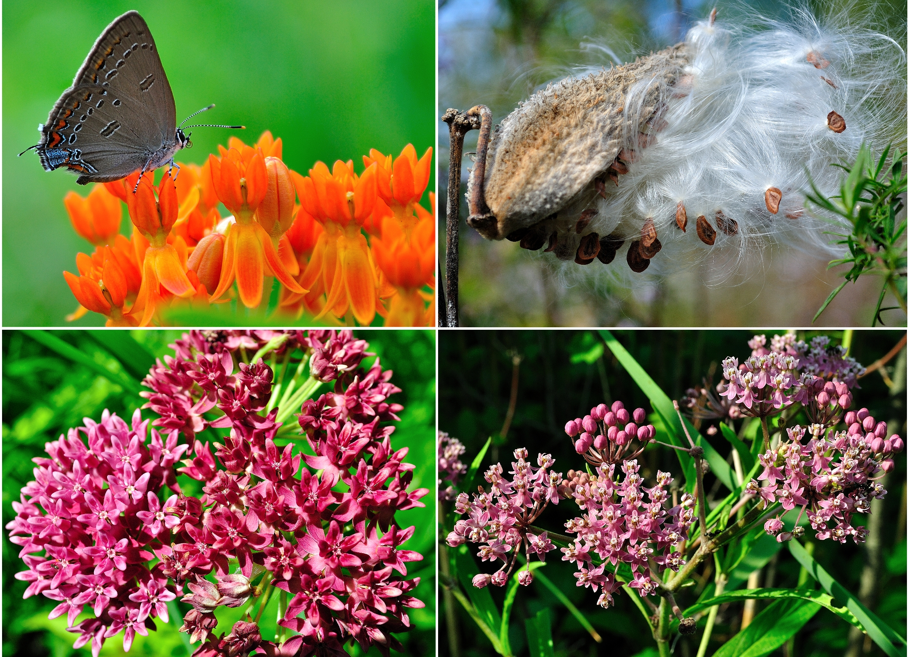
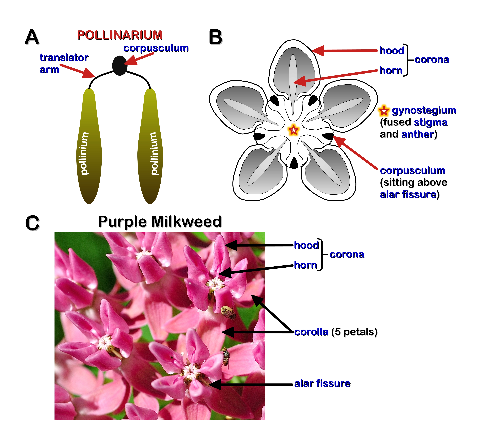

  
<b>TABLE OF CONTENTS</b>

  
  1. <a href="#Mkw">The Allure of Milkweeds</a>
  2. <a href="#Mkw_Pop">OPC Milkweed Population</a>
     * <a href="#MkwdsOnt">Table 1. Milkweeds of Ontario</a>
  3. <a href="#Mkw_Hab">Milkweed Habitat</a>
  4. <a href="#Mkw_Morph">Milkweed Morphology</a>
     * <a href="#Fig_MkwFlower">Fig.1 Milkweed Flower Structure</a>
  5. OPC Milkweeds
     * <a href="#Photo_BM">Butterfly Milkweed</a>
     * <a href="#Photo_PM">Purple Milkweed</a>
     * <a href="#Photo_SwM">Swamp Milkweed</a>
     * <a href="#Photo_CM">Common Milkweed</a>
  6. <a href="#GSrank">Floral Abundance: Global & Regional Rankings</a>
  7. <a href="#Ref">References</a>

THE ALLURE OF MILKWEEDS

&nbsp; &nbsp; We have been taught from a very young age to despise weeds, in large part because they compete with more desirable plants for precious nutrients. So it is perhaps no surprise that Milk*weed*, the common name given to plants belonging to the genus *Asclepias*, are also demonized by most people. The so called *weediness* of these plants is due, in large part, to the ability of some **Milkweed** species to colonize road sides and other disturbed areas. However, this characterization is misleading due to the fact that many species of *Asclepias* are important sources of food, fibre and medicine.  
&nbsp; &nbsp; **First Nations** people have long known that different parts of the **Milkweed** plant can be used for many purposes. For example, the tough inner stem fibres can be simply rubbed together between the hands to make twine or thicker cords. Although most **Milkweeds** are suitable for making cordage, **<a class="one" href="https://explorer.natureserve.org/Taxon/ELEMENT_GLOBAL.2.129944/Asclepias_incarnata">Swamp Milkweed</a>** (*Asclepias incarnata*) is apparently preferred due to its very tough fibers. **Milkweeds** are also edible. The young leaves, shoots and stems of **<a class="one" href="https://explorer.natureserve.org/Taxon/ELEMENT_GLOBAL.2.131135/Asclepias_syriaca">Common Milkweed</a>** (*Asclepias syriaca*), as well as its flower buds, roots and young pods are all considered quite delicious and nutritious greens when properly prepared. **First Nations** people also knew of the healing properties of **Milkweeds**. For example, many parts of the plant, including its **latex**, were used to treat among other things: **(i)** body aches (e.g. back, chest, stomach); **(ii)** venereal diseases and fungal infections (e.g. *ringworm*); and **(iii)** *dropsy* -- a build up of body fluid (aka *edema*) commonly associated with congestive heart failure.**1,2** Today, we now know that steroidal compounds known as Cardiac Glycosides (CG) are the **latex** components responsible for its toxic and medicinal affects on cardiac muscle.**3,4** Although it is perhaps not too surprising that humans realized long ago the usefulness of these toxins (i.e. poison-tipped arrows, medicine), what is surprising is that insects beat us to it! Recent studies have shown that **Monarch** butterflies can discriminate between *Asclepias* species that produce high and low levels of CG apparently as a way to help their offspring deal with deadly (toxin-sensitive) parasites -- what scientists have termed *trans-generational* medication.**5**  
&nbsp; &nbsp;**Milkweeds** also provide many other valuable *ecosystem goods* and *services*.**6** For example, the hollow filament-like hairs attached to the seeds, commonly referred to as *coma*, "*floss*" or simply "*silk*", are not only hypoallergenic but apparently warmer than wool and as buoyant as cork. This latter property of the *silk* was put to good use by the Allies during World War II to make life jackets, since the usual material *kapok* (aka: "*Java cotton*", from the Kapok tree *Ceiba pentandra*) was in short supply. Today, the warm and hypo-allergenic properties of this *silk* have motivated a few garment manufacturers to use them in the production of linen and to insulate clothing.**7** Ecologically, *Asclepias spp.* serve as important hosts to many types of insects (e.g. **Monarch butterfly**) and produce relatively large volumes of nectar that many pollinating insects and hummingbirds rely on for food.**8** Lastly, quite a few passerines like the **<a class="one" href="https://www.allaboutbirds.org/guide/Baltimore_Oriole">Baltimore Oriole</a>** (*Icterus galbula*), **<a class="one" href="https://www.allaboutbirds.org/guide/American_Goldfinch/">American Goldfinch</a>** (*Spinus tristis*) and **<a class="one" href="https://www.allaboutbirds.org/guide/Yellow_Warbler">Yellow Warbler</a>** use the *silk* and fibre to help build their nests.**9** So, given the wealth of *goods* and *services* **Milkweeds** do provide - why not cultivate them?

MILKWEED FAMILY</h3></centre>
  

<!----------------------------------------------------------------------->
<!----------------- SECTION 1 - OPC MILKWEED POPULATION ----------------->
<!----------------------------------------------------------------------->
**1. <u>MILKWEED POPULATION</u>:** *Asclepias spp.* are a large family (>70 species) of North American forbs (see **<a class="one" href="https://plants.sc.egov.usda.gov/core/profile?symbol=ASCLE">USDA</a>**). However, only 12 species are native to Ontario (**Table 1.**), and of these only seven have historically been found at OPC. Unfortunately one species known as **White Milkweed** is now believed to be provincially <u>extinct</u> (**<a class="one" href="#GSrank">see Species/Ecosystem Rankings</a>**).  

<!---------------------------------------------------------------->
<!------------------------- TABLE 1: Milkweed sp.----------------->
<!---------------------------------------------------------------->

<table class="OntMkwd">
    <thead>
      <tr>
        <th>Genus Species</th>
        <th>Common Name</th>
        <th>S,G RANKS</th>
        <th>MEDICAL</th>
      </tr>
    </thead>
    <tbody>
      <tr>
        <td><i>Asclepias exaltata</i></td>
        <td><b><a class="one" href="https://inaturalist.ca/taxa/125386-Asclepias-exaltata">Poke milkweed</a></b></td>
        <td>S4,G5</td>
        <td>yes</td>
      </tr>
      <tr>
        <td><i>Asclepias hirtella</i></td>
        <td><b><a class="one" href="https://inaturalist.ca/taxa/127690-Asclepias-hirtella">Tall green milkweed</a></b></td>
        <td>S1,G5</td>
        <td></td>
      </tr>
      <tr>
        <td><i>Asclepias incarnata</i></td>
        <td><b><a class="one" href="https://inaturalist.ca/taxa/125381-Asclepias-incarnata">Swamp Milkweed</a></b></td>
        <td>S5,G5T5</td>
        <td>yes</td>
      </tr>
      <tr>
        <td><i>Asclepias purpurascens</i></td>
        <td><b><a class="one" href="https://inaturalist.ca/taxa/125380-Asclepias-purpurascens">Purple Milkweed</a></b></td>
        <td>S1,G4G5</td>
        <td></td>
      </tr>
      <tr>
        <td><i>Asclepias quadrifolia</i></td>
        <td><b><a class="one" href="https://inaturalist.ca/taxa/129548-Asclepias-quadrifolia">Fourleaf Milkweed</a></b></td>
        <td>S1,G5</td>
        <td>yes</td>
      </tr>
      <tr>
        <td><i>Asclepias sullivantii</i></td>
        <td><b><a class="one" href="https://inaturalist.ca/taxa/158761-Asclepias-sullivantii">Prairie Milkweed</a></b></td>
        <td>S2,G5</td>
        <td></td>
      </tr>
      <tr>
        <td><i>Asclepias syriaca</i></td>
        <td><b><a class="one" href="https://www.inaturalist.org/taxa/47911-Asclepias-syriaca">Common Milkweed</a></b></td>
        <td>S5,G5</td>
        <td>yes</td>
      </tr>
      <tr>
        <td><i>Asclepias tuberosa</i></td>
        <td><b><a class="one" href="https://inaturalist.ca/taxa/47912-Asclepias-tuberosa">Butterfly Milkweed</a></b></td>
        <td>S4,G5</td>
        <td>yes</td>
      </tr>
      <tr>
        <td><i>Asclepias verticillata</i></td>
        <td><b><a class="one" href="https://inaturalist.ca/taxa/125379-Asclepias-verticillata">Whorled Milkweed</a></b></td>
        <td>S4,G5</td>
        <td>yes</td>
      </tr>
      <tr>
        <td><i>Asclepias variegata</i></td>
        <td><b><a class="one" href="https://inaturalist.ca/taxa/127691-Asclepias-variegata">White Milkweed</a></b></td>
        <td>SX,G5</td>
        <td></td>
      </tr>
      <tr>
        <td><i>Asclepias viridiflora</i></td>
        <td><b><a class="one" href="https://inaturalist.ca/taxa/158763-Asclepias-viridiflora">Green Milkweed</a></b></td>
        <td>S2,G5</td>
        <td></td>
      </tr>
      <tr>
        <td><i>Asclepias ovalifolia</i></td>
        <td><b><a class="one" href="https://inaturalist.ca/taxa/47905-Asclepias-ovalifolia">Oval Leaf Milkweed</a></b></td>
        <td>S2,G3G5</td>
        <td></td>
      </tr>
    </tbody>
</table>

<!---------------------------------------------------------------->
<!------------------- SECTION 2: MILKWEED HABITAT----------------->
<!---------------------------------------------------------------->

**2. <u>HABITAT</u>:** **Milkweeds** are herbaceous perennial plants that can be found in a wide variety of habitats, ranging from roadside ditches and swamps to deserts, prairies and forests. Some species, notably *A. syriaca*, readily colonize disturbed areas such as abandoned fields and roadsides. (Consult **<a class="one" href="https://plants.sc.egov.usda.gov/core/profile?symbol=ASCLE)">USDA</a>**, or **<a class="one" href="https://www.itis.gov/">ITIS</a>** for species specific habitats).  

<!------------------------------------------------------------->
<!---------- MILKWEED FAMILY SECTION 3: PLANT MORPH ----------->
<!------------------------------------------------------------->
**3. <u>MILKWEED MORPHOLOGY \& FEATURES</u>:** As their name suggests **Milkweeds** are known for their sticky, often *creamy white* (but can be yellow, orange or clear) **latex** that is exuded in response to tissue damage. Closer examination of **latex** shows that it is unlike plant **sap** or **resin** in a number of ways. Firstly, **sap** is an aqueous solution that is transported by the plant's well known vasculature elements (xylem and phloem), while **resins** are a fat-soluble mixture of largely volatile Terpenoids and Phenolics found within *inter*-cellular spaces, or ducts.**10** By contrast, **latex** is produced and stored (under pressure) in *living cells* known as **lactifers**.**11,12** These elongated and branching cells form *unique* tubular networks throughout most of the plant (i.e. independent of the vascular bundles). The **latex** stored in these **lactifers** is an <u>emulsion</u> that contains microscopic particles of **<a class="one" href="https://pubchem.ncbi.nlm.nih.gov/compound/6557">polyisoprene</a>** (i.e. *natural rubber*).**11-13**  
&nbsp; &nbsp; Besides *natural rubber* there are a variety of other compounds found in **latex** that make the plant inedible to most animals.**13-15** Some of the more well known components of **latex** include Cardiac Glycosides (CG), digestive Proteases and Phenolics. Many herbivores like the larval stage of the Monarch butterfly (*Danaus plexoppus*) are *obligate* feeders of **Milkweeds**. In fact, there are over 100 insect species that feed exclusively on **Milkweed** as a form of chemical defense against predators.**15** In addition to the plant's characteristic sticky **latex**, *Asclepias spp.* have unique flowers and pod-like fruits.**7** The former have very complex structures that are in someways comparable to orchids (i.e. pollen), while the latter are packed with *silky* haired seeds that are both buoyant in water and adapted for wind dispersal (**Fig. 1**).  

<!---------------------------------------------------------------------------->
<!-------------------- FIG 1 - MILKWEED FLOWER STRUCTURE --------------------->
<!---------------------------------------------------------------------------->

<figure>

<figcaption>
<b>Figure 1: Milkweed Flower Structure.</b> <b>(A)</b> The <b>pollinarium</b> is a <i>winged</i> or "<i>wishbone</i>" shaped structure that contains two discrete sacs of pollen, or <b>pollinium</b>, that are joined to a central disc-like <b>corpusculum</b> via the <i>arms</i> of the <b>translator</b>. <b>(B)</b> This cartoon shows an overhead view of the shape and position of the flower elements, including the <i>coronal</i> <b>hood</b> and <b>horn</b> (nectar reservoir) and the position of the <b>corpusculum</b> in relation to the much larger <b>gynostegium</b> (&#9734;fused female <b>stigma</b> and male <b>anther</b>). <b>(C)</b> This picture of Purple Milkweed flowers shows some of its floral elements, including 5 backward pointing (reflected) petals that make up the <b>corolla</b>.  
</figcaption>
</figure>  

&nbsp; &nbsp; **Milkweed** flowers are arranged in either flat-topped or round clusters called *umbels* (i.e. latin *umbella*: "*a sunshade, parasol or umbrella*"). Individual flowers have two distinct parts -- a lower <u>*corolla*</u> and upper <u>*corona*</u> (**Fig. 1**). The lower *corolla* is made up of 5 backward-pointing (usually) petals, while the upper nectar containing *corona* is composed (usually) of 5 pairs of <u>*hoods*</u> and <u>*horns*</u>. The *hoods* extend from the base of the *stamens* and house a horn-like appendage (nectar reservoir) that arches over top of a central *gem*-like *gynostegium* (fused female *stigma* and male *anthers*). This unusual flower structure results in an equally unusual pollination mechanism. Like orchids, the pollen of **Milkweed** is packaged into discrete units called <u>*pollinia*</u>. They are part of *wishbone*-like structure called a <u>*pollinarium*</u> that contains a pair of *pollinium*, a <u>*translator*</u> and <u>*corpusculum*</u>.**8** The *pollinia* are connected to the *corpusculum*, a small disc-like gland at the base of the "*wishbone*", via the forking "*arms*" of the *translator*. Visually, the *corpusculum* (apex of the *pollinarium*) sits atop a narrow opening (<u>*alar fissure*</u>) into the <u>*stigmatic chamber*</u>, which houses the *pollinarium* (**Fig. 1**). When the leg of a feeding insect slips between the *hoods* and comes into contact with the *corpusculum* it can free the *pollinia* and carry it to other **Milkweed** plants. Given the arduous nature of the **<a class="one" href="https://www.fs.usda.gov/wildflowers/pollinators/importance.shtml">pollination</a>** process, only relatively large insects are capable of carrying out this task.  

<!----------------------------------------------------------------->
<!-------------------- PHOTOS OF MILKWEED sp. --------------------->
<!----------------------------------------------------------------->
&nbsp; &nbsp; The following Milkweed photos currently do not include two other resident species (i.e. PrairieS2, Tall GreenS1). These plants are difficult to find owing to their imperiled status (i.e. work in progress). Nevertheless, these four species are some of the most interesting, beautiful and ecologically important forbs found at OPC.   

**1. BUTTERFLY MILKWEED (**<i>Asclepias tuberosa L.</i>**):** **S4**, **G5**  

<figure>

<figcaption>
<b>Figure 2.</b> This beautiful <b>Milkweed</b> is noted for its flat-top umbels of small orange flowers, typical <i>hood</i>-and-<i>horn</i> corona structure, hairy stems and alternatively arranged leaves. As the name of this plant implies it attracts many types of butterflies, such as Hairstreaks, Monarchs and Great Spangled Fritillaries.  
</figcaption>
</figure>

**POPULATION \& HABITAT:** **<a class="one" href="https://explorer.natureserve.org/Taxon/ELEMENT_GLOBAL.2.129775/Asclepias_tuberosa">Butterfly Milkweed</a>** (*aka* **Orange Milkweed**) is one of the few native orange wildflowers, making it relatively easy to spot when it blooms (mid-to-late June) in areas containing open sandy soils. Its a relatively common plant at **OPC** where it grows singly or in small clusters. This forb is only found in Ontario and Quebec (rare) within Canada. Unfortunately in Ontario populations of *A. tuberosa* are under threat by the loss/fragmentation of habitat (i.e. prairie and savannas) and the suppression of regenerative surface fires. It is also found in many other parts of eastern North America, but its status varies from region to region. In fact in many American states its status appears to be largely unknown.**16-18**

**ECOLOGICAL \& MEDICINAL PROPERTIES:** *A. tuberosa* is an important <u>indicator species</u> of healthy prairie habitats with reported medicinal properties (**Note:** the genus, *Asclepias*, refers to the Greek god of medicine *Asklepios*). **First Nations People** were known to chew the plant root as a cure for pleurisy and other pulmonary ailments, as well as make tea to treat diarrhea and stomach ailments. From an evolutionary perspective, the flat-top *umbel* arrangement of the flowers provides a convenient resting platform for pollinating insects to feed on its nectar. This is just one co-evolutionary strategy that plants have adapted to promote insect pollination.**16-18**  

**2. PURPLE MILKWEED (**<i>Asclepias purpurascens L.</i>**):** S1, **G4G5**  

<figure>

<figcaption>
<b>Figure 3.</b> As the flowers of the <b>Purple Milkweed</b> mature they develop a deeper purple colour. Note how the difference in colour and shape of the two umbels in the right picture (i.e. one on the right has more loosely arranged, deeper coloured flowers).
</figcaption>
</figure>

**POPULATION \& HABITAT:** **<a class="one" href="https://explorer.natureserve.org/Taxon/ELEMENT_GLOBAL.2.145205/Asclepias_purpurascens">Purple Milkweed</a>** is a native perennial forb of eastern North America and considered a key <u>indicator species</u> for healthy Oak savannas. Although its habitat requirements are not particularly restrictive they seem to prefer the partly shaded areas of Oak savannas at **OPC** where it grows singly or in very low numbers. In Ontario its status is critically imperiled (S1). In many other parts of its range its status is either vulnerable (S3), imperiled (S2), critically imperiled (S1) or simply unknown. There are only a few eastern states where its population appears to be secure. Obviously it would benefit greatly from further protective measures (i.e. habitat restoration).**16,17**  

**ECOLOGICAL \& MEDICINAL PROPERTIES:** Similar to other **Milkweeds**, *A. purpurascens* attracts many type of pollinator species, including (among others) bees, butterflies and hummingbirds. They have a common flower structure (i.e. *corolla* - 5 reflected petals, *corona* - 5 pairs of hoods and curved horns) and like many other *Asclepias spp.* produce a white latex that contains toxic **CG**.**16,17**  

**3. SWAMP MILKWEED (**<i>Asclepias incarnata</i>**):** **S5**, **G5T5**  

<figure>

<figcaption>
<b>Figure 4.</b> This cluster of <i>A. incarnata</i> plants were found (as one would expect from its name) growing next to a creek flowing into a small pond at Ojibway Park.
</figcaption>
</figure>

**POPULATION \& HABITAT:** **<a class="one" href="https://explorer.natureserve.org/Taxon/ELEMENT_GLOBAL.2.129944/Asclepias_incarnata">Swamp Milkweed</a>** (*aka* Pleurisy Root) like other species in this family, is a native perennial forb that is found in may parts of North America. As its name implies this *Ascelpias* species prefers moist habitats (e.g. wet meadows, marshes, the banks of rivers and streams).**16,17,19**

**ECOLOGICAL \& MEDICINAL PROPERTIES:** *A. incarnata* is thought to be the preferred food of the Monarch butterfly (*Danaus plexippus*) caterpillar. It is also an important source of nectar for many pollinators, including hummingbirds. The young shoots and seed pods, as well as the flower buds are all edible. Extracts of the root and other plant parts have been used as an emetic (i.e. induce vomiting), diuretic (i.e. promote urination) and a anti-helminth (i.e. purge parasitic worms). It is also commonly referred to as Pleurisy Root for its use in the treatment of lung problems. As mentioned previously, it is the preferred *Asclepias* species for making cordage due to its very tough stem fibres.**16,17,19**  

**4. COMMON MILKWEED (**<i>Asclepias syriaca</i>**):** **S5**, **G5**  

<figure>

<figcaption>
<b>Figure 5.</b> The red and black colour pattern of the <b>Milkweed beetle</b> (<i>Tetraopes tetrophthalmus</i>) seen on the right advertises to potential predators that it is not good to eat (i.e. <i>aposematic</i> coloration). These insects dine on the leaves and roots of this specific <b>Milkweeds</b> species and store the toxic CG in their tissues to ward off predators.  
</figcaption>
</figure>

**POPULATION \& HABITAT:** *Asclepias syriaca* is a native perennial forb that is common to eastern North America, but a rare inhabitant of the Midwest. It is known to colonize disturbed areas, like roadsides, but can also be found in open fields and pastures.**16,17,20**  

**ECOLOGICAL \& MEDICINAL PROPERTIES:** This **Milkweed** species is a food source for many insects and animals. Like other *Asclepias spp.* its nectar attracts many insect species, as well as hummingbirds. Moreover, many insects such as **Monarch butterfly** caterpillars and the **Red Milkweed beetle** (*Tetraopes tetrophthalmus*) are *Asclepias spp.* specialists. As mentioned previously the **Milkweed**'s young stems, flower buds and seed pods are all edible when properly prepared.**16,17,20**  

GLOBAL & REGIONAL RANKINGS

**GRANKS** (**G**, global rankings) and **SRANKS** (**S**, State/Province rankings) provide designations for floral and ecosystem abundance. They are assigned and maintained by several conservation agencies. The following general rankings are from **<a class="one" href="https://explorer.natureserve.org/AboutTheData/DataTypes/ConservationStatusCategories">NatureServe</a>**:  
GX: Presumed Extinct/Collapsed: **Species** <u>presumed extinct</u>, not located despite intensive searches and virtually no likelihood of rediscovery. **Ecosystem** <u>presumed collapsed</u> throughout its range, due to loss of key dominant and characteristic taxa and/or elimination of the sites and ecological processes on which the type depends.  
GH - Possibly Extinct/Collapsed: **Species** or **Ecosystem** is known from only historical occurrences, but still some hope of rediscovery. Examples of evidence include (1) that a species has not been documented in approximately 20-40 years in human-dominated landscapes despite some searching and/or some evidence of significant habitat loss or degradation; (2) that a species or ecosystem has been searched for unsuccessfully, but not thoroughly enough to presume that it is extinct or collapsed throughout its range.  
G1 - Critically Imperiled: At very high risk of extinction or collapse due to very restricted range, very few populations or occurrences, very steep declines, very severe threats, or other factors.  
G2 - Imperiled: At high risk of extinction or collapse due to restricted range, few populations or occurrences, steep declines, severe threats, or other factors.  
G3 - Vulnerable: At moderate risk of extinction or collapse due to a fairly restricted range, relatively few populations or occurrences, recent and widespread declines, threats, or other factors.  
**G4 - Apparently Secure**: At fairly low risk of extinction or collapse due to an extensive range and/or many populations or occurrences, but with possible cause for some concern as a result of local recent declines, threats, or other factors.  
**G5 - Secure**: At very low risk or extinction or collapse due to a very extensive range, abundant populations or occurrences, and little to no concern from declines or threats.  

**GRANK**s and **SRANK**s may also include other designations, notably: **GU** (uncertain global ranking); **G?** (tentative ranking); **Q** (questionable taxonomic status of the species, subspecies, or variety); **T** (rank applies to a subspecies or variety); and **HYB** (hybrid of 2 species); **SH** (plant historically occurred in Ontario, but has not been recorded in the last 20 years); **SR** (plant has been reported without persuasive documentation); **SU** (species has no SRANK value and therefore of uncertain status); **SX** (species apparently extirpated from Ontario with little likelihood of rediscovery); **SE** (species is exotic, not native to Ontario); **?** (some uncertainty about an assigned rank). Rank ranges (e.g. **S1S2**) indicate the uncertain nature of the species rank (i.e. either **S1** or **S2**).  

**MNR RISK STATUS:** This code is assigned by the Ontario Ministry of Natural Resources (**OMNR**) and is based on recommendations by the Committee on the Status of Species at Risk in Ontario. The designated categories are as follows:  
END**:** Any indigenous species that is threatened with immediate extinction throughout all or a significant portion of its Ontario range.  
THR**:** Any indigenous species that is experiencing a definite non-cyclical decline throughout all or a major portion of its Ontario range.  
VUL**:** Any indigenous species that has relatively stable populations, and/or that occurs sporadically, or in a very restricted area of Ontario, or is at the fringe of its range.  

**COSEWIC:** Risk codes developed by the Committee on the Status of Endangered Wildlife in Canada include:  
END**:** Any indigenous flora that is threatened with imminent extinction throughout all or a significant portion of its Canadian range.  
EXP**:** Any indigenous flora that no longer exists in the wild in Canada but can occur elsewhere.  
THR**:** Any indigenous flora that is likely to become endangered in Canada if the factors affecting its vulnerability are not reversed.  
VUL**:** Any indigenous flora that is particularly at risk because of low or declining numbers, occurrence at the fringe of its range or in restricted areas, or for some other reason, but is not yet threatened.  

**REFERENCES:**  
**1.** Moerman D.E. (1986). Medicinal Plants of Native Americans. University of Michigan Museum of Anthropology technical report. (19):534.  
**2.** Kindscher K. (1992). Medicinal wild plants of the Prairie: An Ethnobotanical guide. University Press of Kansas.  
**3.** Withering, William (1785). An Account of the Foxglove and some of its Medical Uses With Practical Remarks on Dropsy and Other Diseases. Birmingham: Printed by M. Swinney; for G. G. J. and J. Robinson, Paternoster-Row, London. MDCCLXXXV.  
**4.** Cattell M. and Gold H. (1938). The influence of digitalis glucosides on the force of contraction of mammalian cardiac muscle. Journal of Pharmacology and Experimental Therapeutics 62(1):116-125.  
**5.** Lefèvre T., Oliver L., Hunter M.D. and De Roode J.C. (2010). Evidence for trans‐generational medication in nature. Ecology Letters 13(12):1485-1493.  
**6.** Costanza R., d'Arge R., De Groot R., Farber S., Grasso M., Hannon B., Limburg K., Naeem S., O'neill R.V., Paruelo J. and Raskin R.G. (1997). The value of the world's ecosystem services and natural capital. Nature 387(6630):253-260.  
**7.** Knudsen, H.D. and Sayler, R.Y. (1992). Milkweed: the worth of a weed. The Yearbook of agriculture (USA). New Crops, New Uses, New Markets: Industrial and Commercial Products from US Agriculture. US Government Printing Office. United States. Dept. of Agriculture. Office of Publishing and Visual Communication. pg 118-123.  
**8.** Wyatt R. and Broyles S.B. (1994). Ecology and evolution of reproduction in milkweeds. Annual Review of Ecology and Systematics 25:423-441.  
**9.** **<a class="one" href="https://www.audubon.org/news/what-nesting-materials-are-safe-birds">Audubon Society</a>**  
**10.** Langenheim, J.H. (2003). Plant Resins: Chemistry, Evolution, Ecology and Ethnobotany. Publisher: Timber Press Inc.,Portland, Oregon, 612 pages.  
**11.** Pickard W.F. (2008). Laticifers and secretory ducts: two other tube systems in plants. New Phytologist 177(4):877-888.  
**12** Castelblanque L., Balaguer B., Martí C., Rodríguez J.J., Orozco M. and Vera P. (2017). Multiple facets of laticifer cells. Plant Signaling & Behavior 12(7):p.e1300743.  
**13.** Ramos M.V., Demarco D., da Costa Souza I.C. and de Freitas C.D.T. (2019). Laticifers, latex, and their role in plant defense. Trends in Plant Science, 24(6):553-567.  
**14.** Agrawal A.A. and Konno K. (2009). Latex: a model for understanding mechanisms, ecology, and evolution of plant defense against herbivory. Annu. Rev. Ecol. Evol. Syst. 40:311-331.  
**15.** Dobler S., Petschenka G., Wagschal V. and Flacht L. (2015). Convergent adaptive evolution–how insects master the challenge of cardiac glycoside‐containing host plants. Entomologia Experimentalis et Applicata 157(1):30-39.  
**16.** NatureServe (2023). NatureServe Network Biodiversity Location Data accessed through NatureServe Explorer [web application]. NatureServe, Arlington, Virginia. Available https://explorer.natureserve.org/. (Accessed: Sept. 27, 2022).  
**17.** USDA, NRCS (2023). The PLANTS Database (http://plants.usda.gov). National Plant Data Team, Greensboro, NC USA.  
**18.** Michelle Stevens (2006). Plant fact sheet for Butterfly Milkweed (*Asclepias tuberosa*). USDA-Natural Resources Conservation Service, Baton Rouge, Louisiana.  
**19.** Kirk S. and Belt S. (2011). Plant fact sheet for Swamp Milkweed (*Asclepias incarnata*). USDA-Natural Resources Conservation Service, Norman A. Berg National Plant Materials Center. Beltsville, MD 20705  USDA-Natural Resources Conservation Service, National Plant Data Center.  
**20.** Michelle Stevens (2006). Plant fact sheet for Common Milkweed (*Asclepias syriaca*). USDA-Natural Resources Conservation Service, Baton Rouge, Louisiana.  

<!--------------------------------------------------------------------->
&copy; Jeffrey C Howard. The material contained within this website may be copied, distributed and displayed without alterations for noncommercial purposes only provided that it is accompanied by acknowledgements to the author. All commercial and non-commercial rights are reserved to the author.  
<!--------------------------------------------------------------------->

