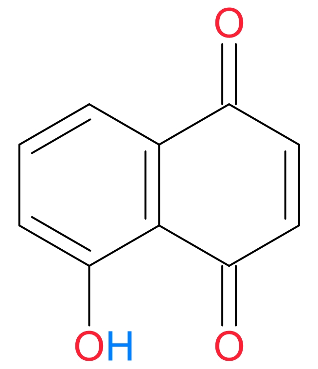
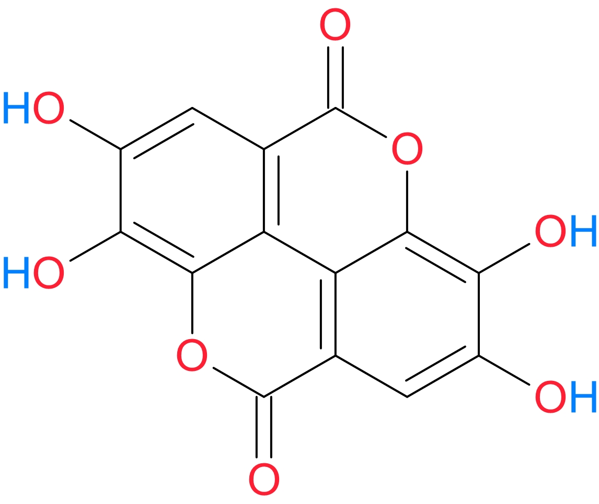

 

  
<b>TABLE OF CONTENTS</b>

  
  1. <a href="#PNP">Overview of Plant Natural Products (PNP)</a>
     * <a href="#Fig_AcCoA"><b>Fig.1:</b> Acetyl-CoA Metabolism</a>
  2. <a href="#BB_PNP"><b>Section 1:</b> Building Blocks of PNP</a>
     * <a href="#Fig_OoL"><b>Fig. 2:</b> Acetyl-CoA & Origins of Life</a>
     * <a href="#Fig_PNP"><b>Fig. 3:</b> Biochemical Pathways of PNP</a>
  3. <a href="#Terp"><b>Section 2:</b> Terpenoids</a>
     * <a href="#Fig_Ret"><b>Fig. 4:</b> Retinoid Cycle</a>
     * <a href="#Fig_RA"><b>Fig. 5:</b> Retinoic Acid Signaling</a>
     * <a href="#Terp_Class"><b>Section 2.1:</b> Classes of Terpenoid</a>
     * <a href="#TerpTable"><b>Table. 1:</b> Terpenoids</a>
     * <a href="#NatRub"><b>Section 2.2:</b> Natural Rubber</a>
     * <a href="#Cgs"><b>Section 2.3:</b> Cardiac Glycosides (CG)</a>
     * <a href="#CGTab"><b>Table 2:</b> Common CG</a>
     * <a href="#CGmech"><b>Section 2.3.1:</b> Mechanism of CG</a>
     * <a href="#Fig_NKA"><b>Fig. 6:</b> Na+K+-ATP<b>ase</b> structure</a>
     * <a href="#Fig_NKAcycle"><b>Fig. 7:</b> Na+K+-ATP<b>ase</b> Mechanism</a>
     * <a href="#Fig_NKAouabain"><b>Fig. 8:</b> Structure of Ouabain bound Na+K+-ATP<b>ase</b></a>
     * <a href="#Fig_NKAbs"><b>Fig. 9:</b> Na+K+-ATP<b>ase</b> &alpha;-subunit Multi-Sequence Alignment</a>
     * <a href="#Fig_NKAtree"><b>Fig. 10:</b> Phylogenetic Tree of Insect Na+K+-ATP<b>ase</b></a>
     * <a href="#CGmed"><b>Section 2.3.2:</b> Medical Application of CG</a>
  4. <a href="#Prot"><b>Section 3:</b> Proteases</a>
     * <a href="#Fig_SerProt"><b>Figure 11:</b> Serine Proteases</a>
     * <a href="#Prot_Func"><b>Section 3.1:</b> Protease Function</a>
     * <a href="#Prot_Table"><b>Table 3:</b> Plant Latex Proteases</a>  
  5. <a href="#Phenolics"><b>Section 4:</b> Phenolics</a>  
     * <a href="#Phen_Class"><b>Section 4.1:</b> Phenolic Classes</a>  
     * <a href="#PhenTab"><b>Table 4:</b> Common Plant Phenolics</a>  
     * <a href="#Phen_Shik"><b>Section 4.2:</b> Phenolic Biosynthesis</a>   
     * <a href="#Fig_ShikPath"><b>Figure 12:</b> Shikimic acid Pathway</a>  
     * <a href="#Mlkwd_PNPquant"><b>Table 5:</b> Milkweed Cardenolide and Phenolic Content </a>  
  6. <a href="#PKs"><b>Section 5:</b> Polyketides</a>  
     * <a href="#PKs"><b>Section 5.1:</b> Polyketides</a>  
     * <a href="#Fig_PKS"><b>Figure 13:</b> Plant Polyketide Synthesis</a>  
     * <a href="#Tab6_Antho"><b>Table 6:</b> Common Plant Anthocyanins</a>  
     * <a href="#Fig_Oxygen"><b>Figure 14:</b> Chemistry of Molecular O<b>xygen</b> and <i>Free Radicals</i></a>  
     * </a><a href="#Fig_VitCE"><b>Figure 15:</b> Lipid <b>peroxidation</b> and <i>Free Radical</i> scavenging by <b>Vitamin</b> C and <b>E</b></a>  
  7. <a href="#Refs"><b>References</b></a>  

<!------------------------------------------------------>
<!-------- INTRO - PLANT NATURAL PRODUCTS (PNP) -------->
<!------------------------------------------------------>
&nbsp; &nbsp; It is quite remarkable that most people around the world still rely on traditional medicine as their primary form of health care.**1,2** This speaks to the important role that <b>Plant Natural Products</b> (PNP) play in the daily lives of most people around the world. Some of the more storied PNP include the *analgesic* **<a class="one" href="https://pubchem.ncbi.nlm.nih.gov/compound/5288826">Morphine</a>** and the *anti-malarials* **<a class="one" href="https://www.ebi.ac.uk/chebi/searchId.do?chebiId=CHEBI:15854">Quinine</a>** and **<a class="one" href="https://www.ebi.ac.uk/chebi/searchId.do?chebiId=CHEBI:223316">Artemisinin</a>**. Although the building blocks of PNP are ultimately derived from **<a class="one" href="https://www.biointeractive.org/classroom-resources/photosynthesis">Photosynthesis</a>**, they do not play a major role in *basal cellular metabolism* (i.e. **primary metabolism**) and were once considered "*waste*" products. Fortunately we now know that **secondary metabolites** play a vital role in the survival of plants, particularly in relation to <u>environmental stresses</u> (e.g. herbivory, pathogens, damaging UV-radiation, water and nutrient shortages). Although there are an enormous number (>200,000) and variety of PNP, their chemical building blocks are surprisingly few in number, with **<a class="one" href="https://www.ebi.ac.uk/chebi/searchId.do?chebiId=CHEBI:15351">acetyl-Coenzyme A</a>** being perhaps the most important one of all of them (**Fig. 1**). 

<!---------------------------------------------------------------->
<!---------------- FIG 1 - Acetyl-CoA METABOLISM ----------------->
<!---------------------------------------------------------------->

<figure>

<figcaption>
<b><u>Figure 1: Acetyl-CoA and Cellular Metabolism</u></b>. Acetyl-CoA is a well known product of several <i>catabolic</i> (arrows) pathways, as well as a key <i>anabolic</i> (arrows) metabolite used in the production of lipids. It is also recognized as a key secondary messenger in cells where it is involved in regulating protein translation and gene regulation. As shown above acetyl-CoA can be produced via the breakdown (i.e. <i>catabolism</i>) of <b>sugars</b> (Glycolysis), <b>fatty acids</b> (&beta;-oxidation), and <b>amino acids</b> (deamination/oxidation). The high energy contained within the thioester bond of acetyl-CoA is captured by co-factors known as hydrogen carriers (NADH, NADPH, FADH2) during the <b>Citric Acid Cycle</b>. These molecules carry high energy electrons to the <b><a class="one" href="https://www.biointeractive.org/classroom-resources/electron-transport-chain">Electron Transport Chain</a></b> where they are used in the production of ATP, the main "<i>fuel</i>" of cells. The intermediates of the <b>Citric Acid Cycle</b> are also used in the synthesis of amino acids.
</figcaption>
</figure>

<!-------------------------------------------------->
<!-------- SECTION 1 -- PNP Building Blocks -------->
<!-------------------------------------------------->

&thinsp; 1. BUILDING BLOCKS OF PNP &thinsp;**:** Cellular acetyl-CoA serves as an <u>activated</u> carrier of **acetyl** groups (**C**H3**-C=**O), just like ATP is an <u>activated</u> carrier of *phosphoryl* groups (PO3-2). The two carbon (**C**2) **acyl** group (**R-C=**O) attached to CoA is *activated* because it is linked to CoA via a <u>high energy</u> **thioester** bond (**Note:** 2 carbon **acetyl** group is the most common **acyl** group linked to CoA). The *Gibbs free energy of hydrolysis* (**&Delta;Go&prime;**) for an **acetyl** group bound to CoA has a high negative value (**&Delta;Go&prime;** = **-35.1 kJ/mol**) that even exceeds the hydrolysis of the terminal phosphate group of ATP (**&Delta;Go&prime;** = **-34.54 kJ/mol**). Enzymes often use *exergonic* reactions (i.e. reactions with **&Delta;Go&prime;** < 0 release energy, such as the hydrolysis or "*breaking*" of a high energy **thioester** bond) to carry out *endergonic* reactions (i.e. reactions with **&Delta;Go&prime;** > 0 absorb energy, such as the synthesis of biomolecules). Cellular metabolism is largely made possible by the <u>coupling</u> of *exergonic* reactions with *endergonic* reactions.  
&nbsp; &nbsp; Plants and animals use a number of metabolic pathways to produce acetyl-CoA (**Fig. 1**), but for some anaerobic bacteria acetyl-CoA is the end product of a carbon *fixation* pathway known as the reductive acetyl-CoA or **Wood–Ljungdahl** pathway. This important biochemical pathway reduces **C**O2 using H2 as the electron donor and transition metal co-factors as catalysts.**3** The energetically favourable manner in which this pathway produces acetyl-CoA (i.e. linear, *exergonic* **C**O2 fixation pathway) is of particular interest to **Origins of Life** (OoL) researchers, since the key intermediates of this pathway (i.e. formate, acetate, and pyruvate) can be generated <u>abiotically</u> using the **<a class="one" href="https://www.biointeractive.org/classroom-resources/how-giant-tube-worms-survive-hydrothermal-vents">hydrothermal vent</a>** alloy **awaruite** (Ni3Fe) as a catalyst.**4** The natural ease by which H2 and **C**O2 can be converted to pyruvate (**C**3) using a simple inorganic catalyst provides allot of credibility to the idea that this ancient pathway was patterned on *exergonic* abiotic reactions naturally occurring within submarine **hydrothermal vent** systems --- one of the favoured sites for the OoL.**5-9** Of course, when we talk about OoL research most scientists immediately picture the famous **Miller-Urey** experiments of the early 1950s.**10** These two pioneers, who were inspired by the theoretical work of Oparin (1924) and Haldane (1929),**11,12** showed that complex biomolecules, like amino acids, can be synthesized from simple gases (H2, **C**H4, NH3, H2O) using a small electric discharge.**13,14** Although Earth's early atmosphere more than 4 *billion years ago* (**Gya**) was not as *reducing* as Miller's experiments, it did lack free O2 (i.e. *anoxic*) and was therefore mildly *reducing* if not chemically neutral compared to today's atmosphere.**15-17** Although no single environment would have likely provided all of the chemical and physical conditions required for the OoL, few have garnered more attention than submarine hydrothermal vents.**18** Some of these systems, like the *Lost City Hydrothermal Field* (**LCHF**),**19** vent warm (40-75oC) H2 and **C**H4 rich alkaline (pH 9-10) water that reacts with the cold seawater to produce relatively large (10-60 m) chimney-like carbonate structures.**20,21** Submarine vents, like the **LCHF** have presumably existed since the **Hadean**, and the large network of small pores found in them may have served as an ideal "*incubator*" for chemical reactions. The mixing of warm crustal water and cold seawater within these pores would have created temperature and pH gradients that promote the spontaneous *fixation* of **C**O2 (**Fig. 2B**).**22**  

<!--------------------------------------------------------->
<!---------------- FIG 2 - Acetyl-CoA OoL ----------------->
<!--------------------------------------------------------->

<figure>

<figcaption>
<b><u>Figure 2: Life's Rocky Origins</u></b>. <b>(A)</b> Geochemical proxies and geochronological evidence suggests that life likely evolved very early on during the latter part of the <b>Hadean</b> eon, which spanned the first 500 million years of Earth's history. Although the exact timing of the <b>Origin of Life</b> (OoL) is not known it probably occurred a few hundred million years after the cataclysmic Moon forming impact ~4.5 billion years ago (<b>Gya</b>).<b>22</b> Chemical analysis of <b>Hadean</b> era zircons (i.e. crystals of zirconium silicate, ZrSiO4) suggest that oceans existed some 4.4 <b>Gya</b>.<b>23-25</b> Yet, despite the existence of liquid water during the <b>Hadean</b> the earliest fossil evidence of life dates back only to ~3.5 <b>Gya</b>.<b>26-29</b> Fortunately, indirect evidence in the form of <i>biogenic</i> carbon isotopes from ancient bedrock formations does suggest that life emerged much earlier (Greenland, ~3.8 <b>Gya</b>; Canada , ~3.95 <b>Gya</b>; Australia, ~4.1 <b>Gya</b>).<b>29-33</b> The planet's early atmosphere is also poorly understood. Nevertheless, geological evidence and computer models suggest that it was largely dominated by nitrogen (N2) and carbon dioxide (<b>C</b>O2). For example, [N2] during the <b>Hadean</b> eon appears to have been similar to or somewhat less than modern levels, while [<b>C</b>O2] were 10-to-1000 times higher than current levels.<b>17</b> Other gases, such as methane (<b>C</b>H4), hydrogen (H2), carbon monoxide (<b>C</b>O), ammonia (NH3) and hydrogen sulphide (H2S) were also present, but in relatively smaller amounts.<b>34,17</b> One of the likely consequences of the elevated levels of <b>C</b>O2 (and other greenhouse gases) is that early Earth had a relatively mild climate (i.e. >0oC). This is an important point given that the sun was ~25% less luminous 4 <b>Gya</b> than it is today.<b>35,36,15</b> Without these elevated levels of greenhouse gases the planet would have been frozen for much of the <b>Hadean</b> and <b>Archean</b>. The absence of molecular oxygen (O2) during these early eons is also worth noting, since under <b>anoxic</b> conditions reductive chemical synthesis (shown in <b>B</b>) would have been favourable. However, when oxygenic photosynthesis evolved (~2.4 <b>Gya</b>) the atmosphere became more oxidizing in nature. This transition to an <i>oxidizing</i> atmosphere was not only marked by the Great Oxidation Event (GOE, 2-to-2.4 <b>Gya</b>), but preceded by the appearance of oxidized <b>manganese</b> (Mn) deposits in the geological record. Mn is a critical component of the Water Oxidation Complex (WOC) of <b><a class="one" href="https://pdb101.rcsb.org/motm/59">Photosystem II</a></b> that strips electrons from water (i.e. "<i>splits</i>" water) to replace lost photo-activated electrons in chlorophyll (i.e. <i>resets</i> Photosystem II for photo-activation).<b>37,38</b> The appearance Mn deposits just prior to the emergence of <b>oxygenic photosynthesis</b> suggests that this Mn powered WOC likely evolved from an pre-existing Mn powered electron donor complex used by <b>anoxygenic photosynthetic</b> microbes.<b>37,38</b> The rapid rise in atmospheric [O2] during the GOE led to the dawn of aerobic <b>respiration</b> and the eventual emergence of multicellular life (<b>Note:</b> aerobic <b>respiration</b> produces ~18 times more energy in the form of ATP than anaerobic <b>respiration</b>). 
<b>(B)</b> The cornerstone of autotrophic organisms is the ability to convert inorganic carbon (e.g. <b>C</b>O2) into useful organic compounds (i.e. <i>carbon fixation</i>). Although the <u>prebiotic</u> origins of this chemical reaction are not known, recent research suggests that key intermediates of the reductive acetyl-CoA or <b>Wood–Ljungdahl</b> pathway<b>3</b> can be produced under hydrothermal vent like conditions.<b>39</b> These experiments used hydrothermal vent <u>minerals</u> (e.g. <b>Greigite</b> -- Fe3S4, <b>Magnetite</b> -- Fe3O4 and <b>Awaruite</b> -- Ni3Fe) as <b>catalysts</b> for the H2 dependent reduction of <b>C</b>O2. The production of simple <b>C</b>1 (methyl), <b>C</b>2 (acetyl) and <b>C</b>3 (pyruyl) intermediates of the <b>Wood–Ljungdahl</b> pathway with no additional energy inputs, other than the inherent chemical reactivity of the mineral surfaces and dissolved gases, supports the idea that the geochemistry of hydrothermal vent systems played a major role in the OoL.<b>5,9,18,40,41</b>  
</figcaption>
</figure>

&nbsp; &nbsp; The main sources of acetyl-CoA (**Fig. 3**) include the enzymatic **decarboxylation** of <u>pyruvate</u> (**C3**), an &alpha;-keto-acid product of **Glycolysis**, and the enzymatic &beta;-oxidation of <u>fatty acids</u>. The latter metabolic pathway cleaves **lipids**, like **Oleic acid** (**C18**), two carbon units (**C2**) at a time (i.e. new **acyl** group attached to CoA). A third source of acetyl-CoA comes from the **oxidative** breakdown of <u>amino acids</u>. However, unlike <u>glucose</u> and <u>fatty acids</u>, the *catabolism* of amino acids involves their **deamination**, an enzymatic step where an **amino** group (&ndash;NH2) is removed resulting in the formation of toxic *ammonia* (NH3). Fortunately this toxic metabolite is quickly converted to **urea** (aka: *carbamide*), a water soluble and largely non-toxic small molecule, via the addition of carbon dioxide in the **Urea Cycle**. For example, the **deamination** of **glutamic acid** produces &alpha;-ketoglutarate (aka: **<a class="one" href="https://pubchem.ncbi.nlm.nih.gov/compound/51">2-oxoglutarate</a>**), which is a key intermediate within the **<a class="one" href="https://www.biointeractive.org/classroom-resources/citric-acid-cycle">Citric Acid Cycle</a>**. Regardless of the source, acetyl-CoA is the key <u>building block</u> for two major groups of PNPs, namely Polyketides and Terpenoids, with the latter group boasting the largest number of PNPs (i.e. >50,000 structures).**42**  

<!------------------------------------------------->
<!----- FIGURE 3: PNP -- BIOCHEMICAL PATHWAYS ----->
<!------------------------------------------------->

<figure>

<figcaption>
<b><u>Figure 3: Biochemical Pathways of PNPs</u></b>. The major classes of PNPs, also known as plant <i>secondary metabolites</i>, include: (i) Terpenoids, (ii) Polyketides, (iii) Phenolics and (iv) Alkaloids (bottom of figure). Terpenoids are synthesized via <b>mevalonate</b> <u>dependent</u> and <u>independent</u> pathways. The first step in the latter pathway is the synthesis of <b>deoxy-xylulose 5-phosphate</b> from two <b>Gylcolytic</b> pathway intermediates <b>pyruvate</b> and <b>glyceraldehyde 3-phosphate</b> (<b>G3P</b>), while in the former pathway the intermediate <b>mevalonate</b> is formed from three molecules of acetyl-CoA. The synthesis of Polyketides also requires acetyl-CoA. Multiple <b>acetyl groups</b> provided by this carrier molecule are attached to "<i>starter</i>" material in <i>chain</i>-like fashion (i.e. <b>R-</b>(<b>C</b>H2<b>-C=</b>O)n<b>-starter</b>). Some of the <i>starter</i> materials are Phenolics and Alkaloids. The attached polyketides <b>chains</b> often undergo intramolecular cyclization and aromatization as well as other chemical modifications (e.g. hydroxylation, glycosylation, methylation, etc.), resulting in structurally diverse compounds. The major building blocks of Phenolics are produced by the Shikimic acid <b>pathway</b>, which is responsible for making the three <i>aromatic</i> <u>amino acids</u> <b>Phenylalanine</b> (Phe), <b>Tyrosine</b> (Tyr) and <b>Tryptophan</b> (Try). Two of these <i>aromatic</i> <u>amino acids</u> (i.e. Phe and Tyr) are the main building blocks of plant Phenolics. Like Phenolics the synthesis of nitrogen containing Alkaloids is also dependent on <u>amino acid</u> metabolism.
</figcaption>
</figure>

<!--------------------------------------------------->
<!---------- SECTION 2: PNP -- Terpenoids ----------->
<!--------------------------------------------------->

&thinsp; 2. TERPENOIDS &thinsp;**:** are the largest class of PNPs.**43,44** Although some Terpenoids do play a role in <u>primary metabolism</u>, such as **quinones** (e.g. **<a class="one" href="https://pubchem.ncbi.nlm.nih.gov/compound/5281915">ubiquinone</a>**, plastoquinone), most are classified as <u>secondary metabolites</u>. Some of these include &beta;-**ocimene** (i.e. common floral scent and plant defence),**45** **<a class="one" href="https://pubchem.ncbi.nlm.nih.gov/compound/637566">Geraniol</a>** (component of essential oils),**43** Cardiac Glycosides (CG, defense against herbivores),**46** and **carotenoids** (photo-oxidative stress protection).**47-49**  
&nbsp; &nbsp; Humans have long used Terpenoids for a variety of purposes, including (among others) food additives (i.e. flavours, like lemon oil), pharmaceuticals (e.g. CG), fragrances (e.g. **<a class="one" href="https://www.chemistryworld.com/podcasts/frankincense-and-myrrh/8106.article">Frankincense</a>**, Myrrh), and insecticides (e.g. **Caryophyllene**).**50-54** Moreover, some Terpenoids are essential nutrients. For example **vitamin A**  (i.e. retinol, retinal, retinyl esters and retinoic acid --- collectively referred to as **retinoids**) is a well known diterpenoid (**C**20) that we often consume in the form of its tetraterpenoid (**C**40) precursor &beta;-**carotene** (**Table 1**, **Fig. 4**). This latter Terpenoid is a common orange coloured pigment found in many fruits and vegetables (e.g. carrots, yams). The light absorbing abilities of these **retinoid** pigments plays a key role in animal vision systems. As shown in **Figure 4**, the *photoreceptor* Rhodopsin is formed when the light-sensitive *chromophore* **<a class="one" href="https://pubchem.ncbi.nlm.nih.gov/compound/5280490">11-<i>cis</i>-retinal</a>** chemically binds to the protein **opsin** via a **C**arbon-Nitrogen double bond (R1-**C**=N-R2), also known as a *Schiff* base, to form **11-*cis*-retinylidene**. Absorption of light by this bound *chromophore* triggers its geometric *isomerization* (i.e. type of molecular "*twisting*") from an **<a class="one" href="https://pubchem.ncbi.nlm.nih.gov/compound/5280490">11-<i>cis</i></a>** to an **<a class="one" href="https://pubchem.ncbi.nlm.nih.gov/compound/638015"><i>all</i>-<i>trans</i></a>** state. This initial *photo*-activation step triggers a signal transduction cascade that ultimately leads to electrical impulses along the optic nerve to the brain.**55-60** To reset the visual-retinoid cycle the inactive **<a class="one" href="https://pubchem.ncbi.nlm.nih.gov/compound/638015"><i>all</i>-<i>trans</i>-retinal</a>** is released from **opsin** and metabolized, via a series of enzymatic reactions, to regenerate the active *chromophore* **<a class="one" href="https://pubchem.ncbi.nlm.nih.gov/compound/5280490">11-<i>cis</i>-retinal</a>**.  
<!-------------------------------------------------->
<!------------- FIG 4 - RETINOID CYCLE ------------->
<!-------------------------------------------------->

<figure>

<figcaption>
<b><u>Figure 4: Retinoid Cycle</u></b>. When Rhodopsin absorbs a photon of light <i>photo-isomerization</i> of the bound <b>retinal</b> takes place (i.e. <b><a class="one" href="https://pubchem.ncbi.nlm.nih.gov/compound/5280490">11-<i>cis</i></a></b> &rArr; <b><a class="one" href="https://pubchem.ncbi.nlm.nih.gov/compound/638015"><i>all</i>-<i>trans</i></a></b>) resulting in cell signaling events. The <b><i>all</i>-<i>trans-retinal</i></b> is then released from <b>opsin</b> and enzymatically reduced to <b><a class="one" href="https://pubchem.ncbi.nlm.nih.gov/compound/445354"><i>all</i>-<i>trans</i>-retinol</a></b>. This is followed by the <i>esterification</i> of the <b><i>all</i>-<i>trans</i>-retinol</b>, which facilitates its movement between cells. The accumulated <b>all-trans-retinyl ester</b>, which forms structures called <b>retinosomes</b>, is enzymatically converted to <b><a class="one" href="https://pubchem.ncbi.nlm.nih.gov/compound/5280382">11-<i>cis</i>-retinol</a></b> and finally <b>11-<i>cis</i>-<i>retinal</i></b>, which can recombine with <b>opsin</b> and thus regenerate Rhodopsin to complete the cycle.
</figcaption>
</figure>

&nbsp; &nbsp; Despite the vital role played by **retinal** and **retinol** in animal visual systems, they are not the most biologically active **retinoid**. That distinction goes to **<a class="one" href="https://www.ebi.ac.uk/chebi/searchId.do?chebiId=CHEBI:17336"><i>all</i>-<i>trans</i>-retinoic acid</a>** (**ATRA**). This **retinoid** possesses potent hormone-like activity in both developing embryos and adults.**61-66** As a result the cellular levels of **ATRA** are tightly regulated (**Fig. 5**). Notably, the synthesis of **ATRA** is counter balanced by its metabolic breakdown courtesy specific members of the **Cytochrome P450** superfamily of mono-oxygenases (i.e. **CYP26** subfamily). These enzymes convert **ATRA** into more polar inactive metabolites, primarily **<a class="one" href="https://pubchem.ncbi.nlm.nih.gov/compound/6438629">4-hydroxyretinoic acid</a>**.**67** On the other hand, active **ATRA** can be either exported out of the cell, where it can signal in paracrine-like fashion, or transported to the nucleus where it binds to the **retinoic acid receptor** (**RAR**).**68,69** However, **RAR** does not operate alone. In the nucleus it forms heterodimers with the **retinoid X receptor** (**RXR**). Together **RAR/RXR** binds to conserved stretches of DNA, termed **retinoic acid responsive elements** (**RARE**), located within the promoter regions of target genes. In the absence of **ATRA** the DNA bound **RAR/RXR** interacts with protein complexes known as **co-repressors** that block the transcription of downstream target genes. However, upon **ATRA** binding, **RAR/RXR** changes shape and releases the *co-repressor* complex. This in turn leads to the recruitment of **co-activator** complexes that promote the transcription of the target gene. Nevertheless, other studies also suggest that **ATRA** is capable of silencing the transcription of target genes when bound to the **RAR/RXR** complex.**64,65,70,71** 

<!-------------------------------------------------------------------->
<!----------------- FIG 5 - RETINOIC ACID SIGNALING ------------------>
<!-------------------------------------------------------------------->

<figure>

<figcaption>
<b><u>Figure 5: Retinoic Acid Signaling</u></b>. The Terpenoid <b><a class="one" href="https://www.ebi.ac.uk/chebi/searchId.do?chebiId=CHEBI:17336">ATRA</a></b> is a specific ligand for the <b>retinoic acid receptor</b> (<b>RAR</b>). The receptor protein resides within the nucleus as part of a DNA bound heterodimer complex involving the <b>retinoid X receptor</b> (<b>RXR</b>) protein. Formation of the DNA bound <u>trimer</u> (<b>ATRA</b>/<b>RAR</b>/<b>RXR</b>) can either promote or inhibit the transcription of target genes that contain binding sites for the <b>RAR</b>/<b>RXR</b> heterodimer (i.e. <b>RARE</b>: retinoic acid receptor elements). In the absence of <b><a class="one" href="https://www.ebi.ac.uk/chebi/searchId.do?chebiId=CHEBI:17336">ATRA</a></b> the DNA bound heterodimer <b>RAR</b>/<b>RXR</b> silences gene transcription with the help of nuclear proteins known as <b>co-repressors</b>. However, when <b><a class="one" href="https://www.ebi.ac.uk/chebi/searchId.do?chebiId=CHEBI:17336">ATRA</a></b> binds to <b>RAR</b>/<b>RXR</b> gene transcription can be either enhanced, due to the recruitment of transcriptional activator proteins, or further silenced by the binding of transcriptional repressor proteins.<b>65</b>    
</figcaption>
</figure>

<!----------------------------------------------------------->
<!---------- PNP SECTION 2.1: Terpenoids Classes ----------->
<!----------------------------------------------------------->

<figure class="FRight150">

</figure>  

&thinsp; 2.1 TERPENOID CLASSES &thinsp;**:** Structurally, Terpenoids are composed of one or more **isoprene** units (2-methylbuta-1,3-diene (**C**5H8)n), with the number of **carbons** (**C**) defining the <u>class</u> of Terpenoid. Moreover, the basic **C**5-skeleton of these compounds can be folded to produce rings (e.g. steroids), as well as *functionalized* by the introduction of oxygen or other elements. As shown in **Table 1**, Terpenoids are some of the most common compounds found in nature, including **natural rubber** (e.g. **poly-isoprene** particles found in **Milkweed latex**). As mentioned previously when talking about **Milkweeds**, this sticky hydrocarbon dissuades insects from eating plants by either: (i) *gumming-up* their mouth parts, or (ii) trapping and killing them. However, perhaps the most important Terpenoid found in Milkweeds are the **Cardiac Glycosides** (CG). As noted in **Table 1**, the central portion of these CG is a <u>steroid</u>, which is synthesized from the triterpenoid **squalene**.  

<!--------------------------------------------------------------->
<!-------------------- TABLE 1 - TERPENOIDS --------------------->
<!--------------------------------------------------------------->

<table class="Table">
    <thead>
      <tr style="text-align:left">
        <td colspan="3">TABLE 1. Classes of Terpenoids.</td>
      </tr>
    <thead>
    <thead>
      <tr>
        <th class="f18">Class</th>
        <th class="f18">Carbons</th>
        <th class="f18">Examples</th>
      </tr>
    </thead>
    <tbody>
      <tr>
        <td>HEMITERPENOIDS</td>
        <td>C5</td>
        <td><a class="one" href="http://pubchem.ncbi.nlm.nih.gov/compound/6557">Isoprene</a> - basic building block of terpenoids.</td>
      </tr>
      <tr>
        <td>MONOTERPENOIDS</td>
        <td>C10</td>
        <td><a class="one" href="http://pubchem.ncbi.nlm.nih.gov/compound/22311">Limonene</a></b> - oil extracted from the fruit peel of lemons is used as flavoring. <b><a class="one" href="http://pubchem.ncbi.nlm.nih.gov/compound/92770">Nepetalactone</a></strong> - an insect repellent produced by the plant <i>Nepeta cataria</i> that is also the major constituent of catnip. <b><a class="one" href="https://pubchem.ncbi.nlm.nih.gov/compound/637566">Geraniol</a></b> - found in essential oils (e.g. rose oil, citronella, lemongrass, lavender).</td>
      </tr>
      <tr>
        <td>SESQUITERPENOIDS</td>
        <td>C15</td>
        <td><a class="one" href="http://pubchem.ncbi.nlm.nih.gov/compound/29746">Geosmin</a> - major constituent of the earthy aroma produced when rain falls on dry soil.</td>
      </tr>
      <tr>
        <td>DITERPENOIDS</td>
        <td>C20</td>
        <td><a class="one" href="http://pubchem.ncbi.nlm.nih.gov/compound/445354">Retinol</a> - vitamin A1. <a class="one" href="http://pubchem.ncbi.nlm.nih.gov/compound/36314">Paclitaxol</a> (Taxol) - major cancer drug isolated from the Pacific yew tree.</td>
      </tr>
      <tr>
        <td>TRITERPENOIDS</td>
        <td>C30</td>
        <td><a class="one" href="http://pubchem.ncbi.nlm.nih.gov/compound/638072">Squalene</a> - precursor to steroids such as Cardiac Glycosides (e.g. <a class="one" href="https://pubchem.ncbi.nlm.nih.gov/compound/439501">Ouabain</a>).</td>
      </tr>
      <tr>
        <td>TETRATERPENOIDS</td>
        <td>C40</td>
        <td>Red (<a class="one" href="http://pubchem.ncbi.nlm.nih.gov/compound/446925">Lycopene</a>), Orange (<a class="one" href="http://pubchem.ncbi.nlm.nih.gov/compound/5280489">&beta;-carotene</a>) and Yellow (<a class="one" href="http://pubchem.ncbi.nlm.nih.gov/compound/5281243">Lutein</a>) Carotenoid pigments are vital to photosynthesis and animal health.</td>
      </tr>
      <tr>
        <td>POLYTERPENOIDS</td>
        <td>>C40</td>
        <td><b>Natural Rubber</b> is made up of long <u>isoprene</u> polymers and was originally isolated from the Brazilian rubber tree (<i>Hevea braziliensis</i>).</td>
      </tr>
    </tbody>
</table>

<!------------------------------------------------------------------->
<!---------- PNP SECTION 2.2: Terpenoids - Natural Rubber ----------->
<!------------------------------------------------------------------->

&thinsp; 2.2 NATURAL RUBBER &thinsp;**:** This natural polymer of **<a class="one" href="https://www.ebi.ac.uk/chebi/searchId.do?chebiId=CHEBI:35194">isoprene</a>** (see above Figure) has a long and storied past. Many people know that this component of plant **latex** was used by ancient *Mesoamerican* people to make figurines and other artifacts, including the balls used in the famous Mesoamerican *ball game*.**72** However, the earliest scientific report of *natural rubber* did not appear until 1735 AD, courtesy **Charles de la Condamine**. This French explorer came across *natural rubber* during a trip to Peru where he learned that indigenous tribes harvested it from a native tree (*Hevea Brasiliensis*). He also made detailed studies of the *Cinchona* tree, whose bark is the source of the <u>anti-malarial</u> compound **<a class="one" href="https://pubchem.ncbi.nlm.nih.gov/compound/3034034">quinine</a>**. Needless to say, *natural rubber* gained great notoriety when people learned of the many wondrous products that could be fashioned from it, including (among others) the indispensable eraser (1770, Edward Nairne), raincoats (1823, Charles Macintosh) and balloons (1824, Michael Faraday). However, it was not until 1839, when Charles Goodyear discovered a way to make *rubber* more temperature resistant (i.e. "*vulcanization*" process: heating **polyisoprene** in the presence of sulfur and lead carbonate), that the manufacturing of rubber became a truly global lucrative market.**73** Although most of the *rubber* manufactured today is synthetic, the harvesting of *natural rubber* is still an economic interest of many Southeast Asian countries.  
&nbsp; &nbsp; As mentioned previously, the defensive nature of plant **latex** is due in large part to its *natural rubber* content. The aggregation of these **polyisoprene** particles produces long sticky strands that the plant uses to either dissuade predatory insects from eating them, or seal wounds and thus protect itself from infectious pathogens. In response insects that feed on **latex** producing plants, like Milkweeds, often cut the **lactifer** tubes that hold the **latex** prior to feeding on them.**74-76** This so-called "*sabotaging*" behaviour is in fact quite effective in blocking the flow of **latex** and thus reducing the build up of toxic compounds the insect would otherwise ingest.**77-80** Further support for the *defensive* role of **latex** comes from research that shows **jasmonic acid**, a highly conserved "*danger*" signal among plants,**81-83** regulates the levels of **latex** produced in some Milkweed species.**84-86** 

<!------------------------------------------------->
<!------ PNP SECTION 2.4: Terpenoids - CGs -------->
<!------------------------------------------------->

<figure class="FRight200">

</figure>  

&thinsp; 2.3 CARDIAC GLYCOSIDES &thinsp;**:** These remarkable compounds are well known animal poisons and can be divided into two classes, namely: **(i)** Cardenolides (e.g. foxglove **<a class="one" href="https://pubchem.ncbi.nlm.nih.gov/compound/2724385">Digoxin</a>**), and **(ii)** Bufadienolides (e.g. toad venom **<a class="one" href="https://pubchem.ncbi.nlm.nih.gov/compound/9547215">Bufalin</a>**).**87,88** Structurally CG have three main parts: **(i)** a core *steroid* group; **(ii)** a *sugar* (i.e. glycoside) moiety; and **(iii)** a *lactone* ring (i.e. cyclic carboxylic ester). Although structurally quite similar, these two classes of CG can be distinguished from one another based on the size of the *lactone* ring (i.e 5 versus 6 member heterocyclic ring, respectively). It should also be pointed out that most animal produced Bufadienolides are not glycosylated, which has resulted in the use of **Cardio-Tonic Steroids** (CTS ) as an alternative name for these two groups of toxins. Cardenolides are more commonly found in plants and have garnered considerable attention because of their many medical applications (see **Table 2**, see <a id="CGmed">Section 2.4</a>). For example, **<a class="one" href="https://pubchem.ncbi.nlm.nih.gov/compound/2724385">Digoxin</a>** is used by millions of heart patients in North America, with an estimated 1.68 million prescriptions per year in Canada alone.**89**  

<!----------------------------------------------------->
<!---------- TABLE 2 - Cardiotonic Steroids ----------->
<!----------------------------------------------------->

<table class="Table">
    <thead>
      <tr style="text-align:left">
        <td colspan="4">TABLE 2. Cardiotonic Steroids (CTS) found in various plants and animals</td>
      </tr>
    <thead>
      <tr>
        <th class="f18">CLASS</th>
        <th class="f18">NAME</th>
        <th class="f18">FORMULA</th>
        <th class="f18">COMMENTS</th>
      </tr>
    </thead>
    <tbody>
      <tr>
        <td>Cardenolide</td>
        <td><a class="one" href="http://pubchem.ncbi.nlm.nih.gov/compound/439501">Ouabain</a></td>
        <td class="tcell">C29H44O12</td>
        <td>Also known as <b><i>g-Strophanthin</i></b>. Found in <i>Strophantus gratus</i> (climbing oleander) and <i>Acocanthera schimperi</i> (Ouabaio tree). Historically used in Africa as an arrow poison (c. 3rd century BC) and once used to treat heart ailments. Potential use in the treatment of cancers owing to its ability to sensitize cancer to <i>apoptotic</i> cell death.</td>
      </tr>
      <tr>
        <td>Cardenolide</td>
        <td><a class="one" href="http://pubchem.ncbi.nlm.nih.gov/compound/2724385">Digoxin</a></td>
        <td class="tcell">C41H64O14</td>
        <td>First isolated (c. 1930) from the foxglove plant, <i>Digitalis lanata</i>. Main form of <b>Digitalis therapy</b> for treating congestive heart failure and irregular heartbeat. Historically used by herbalists and doctors to treat a variety of maladies, most notably "<i>dropsy</i>" (i.e. <b>edema</b> - swelling of soft tissues due to excess accumulation of water). Potential use in the treatment of cancers owing to its ability to sensitize cancer cells to <i>apoptotic</i> cell death.</td>
      </tr>
      <tr>
        <td>Cardenolide</td>
        <td><a class="one" href="http://pubchem.ncbi.nlm.nih.gov/compound/11541511">Oleandrin</a></td>
        <td class="tcell">C32H48O9</td>
        <td>Found in <b>Oleander</b> (<i>Nerium oleander</i>). Historically used in the treatment of heart maladies. Potential use in the treatment of cancers owing to its ability to sensitize cancer cells to <i>apoptotic</i> cell death.</td>
      </tr>
      <tr>
        <td>Bufadienolide</td>
        <td><a class="one" href="http://pubchem.ncbi.nlm.nih.gov/compound/9547215">Bufalin</a></td>
        <td class="tcell">C24H34O4</td>
        <td>Originally isolated from Chinese toad venom. Long history in traditional Chinese medicine. Potential use in the treatment of cancers owing to its ability to sensitize cancer cells to <i>apoptotic</i> cell death.</td>
      </tr>
    </tbody>
</table>

<!----------------------------------------------------->
<!------ SECTION 2.3.1: CGs Cellular Mechanisms ------->
<!----------------------------------------------------->

&thinsp; 2.3.1 CARDIAC GLYCOSIDE CELLULAR MECHANISM OF ACTION &thinsp;**:** The cardio-toxic properties of these plant steroids are due to their inhibition of Na+K+-ATP**ase**, a ubiquitous animal enzyme that is also known as the plasma membrane Na+pump (**Fig. 6**).**90** This enzyme belongs to the P-type family of <u>active</u> (requires ATP) cation transporters since it uses a *phosphorylated* intermediate during its catalytic cycle (**Fig. 7**).**91-93** This essential "*house keeping*" protein transports Na+ and K+ across the plasma membrane <u>against</u> their respective cation concentration gradients (**Fig. 7**, [Na+]in <  [Na+]out and [K+]in > [K+]out). What makes the Na+pump so remarkable is that the **electrochemical gradient** it creates helps to maintain the overall **electrochemical potential** (**&Delta;&psi;**) of the plasma membrane (**Fig. 7**). This difference in electric potential across the plasma membrane (**Vm**) is used by other transport systems to move essential biomolecules and ions across the plasma membrane (e.g. Ca+2, H+, Cl-, Mg+2, glucose, amino acids, neurotransmitters).**94** For example, the electrical signaling events (i.e. action potentials) that power cardiac muscle contraction and neuronal communication are both made possible by this electrogenic transport system. Given the fundamental role that Na+ transport plays in cells, some have gone so far as to hypothesized that it may be a product of the early geochemical environment where life itself first emerged.**95** This idea embraces the principle of *chemical conservation* which implies:

> "...*chemical composition of living beings is more conservative than the chemical composition of their environment. Therefore, the conserved organismal chemistry can retain information about the ancient environmental conditions. The most popular manifestation of this principle is the similarity between the chemical composition of sea water and the internal liquids of multicellular animals. The latter are characterized by high sodium content even if organisms live in fresh water or on the land ...[this] appears to reflect the emergence of the first multicellular organisms in the sea waters*." **96**  

<!------------------------------------------------------------------------->
<!-------------------- FIG 6 - Na Pump - Chimera pics --------------------->
<!------------------------------------------------------------------------->

  
  

<caption><u>Figure 6: Na+K+-ATPase Structure</u>. The first high resolution X-ray crystal structure (<b><a class="one" href="https://www.rcsb.org/structure/3B8E">3B8E</a></b>)<b>97</b> of the Na+-pump protein isolated from pig (<i>Sus scrofa</i>) kidneys is shown in this <u>ribbon</u> diagram (i.e. protein backbone: &alpha;-helix, &beta;-strands &rArr; thick arrows, and connecting loops of unstructured stretches of amino acid residues). This image of the protein crystal structure was generated with <b><a class="one" href="https://www.cgl.ucsf.edu/chimerax/">UCSF ChimeraX</a></b> program.<b>98</b> Large portions of the three subunits are represented in this model (i.e. &alpha;-subunit: residues 19-to-1016, &beta;-subunit: residues 28-to-73 of the transmembrane segment, &gamma;-subunit: residues 23-to-51). Bound (occluded) Rb+ ions (magenta spheres) are also part of the model since they were used to stabilize the solublized membrane protein complex for X-ray crystallography.</caption>  

&nbsp;  
Certainly based on the essential role the Na+pump plays in maintaining the electrochemical potential of cell membranes, as well as its high levels of expression (e.g. ~50 million in kidney cells)**99** and amounts of energy (ATP) that some cells use to power it (i.e. gray matter neurons: ~20% of total energy budget),**100-102** one could easily argue that it is one of the most important cellular proteins found in multicellular organisms. This may also help to explain why so many plants produce compounds that specifically target it, since their survival depends upon mounting an effective defence against many different kinds of herbivores.  

<!---------------------------------------------------------------------->
<!-------------------- FIG 7 - NaKATPase Mechanism --------------------->
<!---------------------------------------------------------------------->

<figure>

<figcaption>
<b><u>Figure 7: Na+K+-ATPase Mechanism of Action</u>.</b> The above cartoon of the Na+-pump is largely based on the review article by <b>Werner Kühlbrandt</b> (2004).<b>92</b> The catalytic activity of the Na+-pump resides within its <b>&alpha;</b>-subunit.<b>91-93</b> This subunit has four important domains: <b>(i)</b> a cytoplasmic Phosphorylation domain, <b>(ii)</b> a cytoplasmic Actuator domain, <b>(iii)</b> a cytoplasmic Nucleotide binding domain, and <b>(iv)</b> a Membrane spanning domain consisting of 10 alpha helices (i.e. &alpha;-TM1-10) some of which contribute to the formation of an ion channel. At the start of the catalytic cycle three cytoplasmic Na+ ions move through the ion channel of the M domain to specific binding sites. The movement of these <u>polar</u> (+ charged) ions through the <u>non-polar</u> plasma membrane is made possible by polar amino acid residues that make up the ion channel. The low and high energy barriers created by the channel's polar and non-polar residues help guide the ions through the membrane in a unidirectional manner (<b>Note:</b> -70 mV resting potential of the cell's plasma membrane represents a significant energy barrier for transporting cations against their concentration gradients). Na+ binding is associated with protein phosphorylation (<b>E1-</b>P state) and the closing of the intracellular side of the channel. This conformational change in the protein unlocks the extracellular side of the ion channel allowing Na+ to exit and K+ to enter the channel and occupy designated binding sites (<b>E2-</b>P state). Binding of K+ is associated with another key "<i>pivoting</i>" movement of the transporter that involves the closing of the extracellular side of the ion channel, dephosphorylation and binding of a new molecule of ATP (<b>E2</b> state). This is followed by the opening of the intracellular side of the channel and the release of K+ into the cytoplasm (<b>E1</b> state). The cycle can now begin again with the binding of a new triad of Na+ ions.<b>91-93,103-105</b>
</figcaption>
</figure>

  
&nbsp;  

<i>How do Cardiac Glycosides (CG) disrupt the function of the sodium pump? 
How do animals that regularly comsume these toxic compounds survive? 
Moreover, what are the evolutionary benefits and costs of comsuming CG?</i>  

&nbsp; &nbsp; One of the more interesting defensive strategies that animals have evolved is the use of chemical toxins coupled with conspicuous colouration patterns. The great **<a class="one" href="https://www.biointeractive.org/classroom-resources/animated-life-r-wallace">Alfred Wallace</a>** (1867) was the first to offer an explanation for this adaptation, namely that bright coloration patterns advertise their unpalatability to potential predators.**106,107** A little later **Slater** (1877) made an insightful addition to Wallace's grand idea by stating that:  
>"...*strikingly-coloured insects, not otherwise specially protected, will be found to feed upon poisonous plants, or upon such as, though not poisonous, possess unpleasant, or at least very powerful, odours or flavours. From such a diet I conceive that the insects in question may receive properties positively injurious, or at least disgusting, to their enemies, and that a brilliant colouring may therefore here serve as a danger signal, like the quarantine flag, warning all comers to keep their distance*." **108**  

&nbsp; &nbsp; By the end of the 19th century **Edward B. Poulton** (1890) had published a book entitled "*The Colours of Animals*" that described in detail all of the observations about animal coloration patterns and the potential uses species gain from them (i.e. species survival).**109** While most people don't recognize the name **Poulton**, or his book, many people likely do know something about **aposematic colours**, a term he introduced in the final chapter of his book. The brightly coloured **Monarch butterfly** (*Danaus plexippus*), which specializes on toxic **Milkweeds**, is a prime example of **<a class="one" href="https://evolution.berkeley.edu/aposematic-animals/">aposematism</a>**. Clues as to the chemical nature of this anti-predator phenomena in **Monarchs** finally came in 1965 when **Parson** partially purified toxic compounds from the tissues of *D. plexippus*. These compounds, which he called **Plexippens**, shared many pharmacological properties with that of **digitalis**, including its characteristic cardiovascular (i.e. ventricular fibrillation) and gastroinstestinal effects (i.e. **emesis**).**110** Moreover, he was also able to show, like **Schatzmann** (1953) and **Repke** (1963) had done before him with **digitalis**,**111,112** that **Plexippens** could inhibit the enzymatic activity of the plasma membrane Na+K+ATP**ase** previously discovered by **<a class="one" href="https://www.nobelprize.org/prizes/chemistry/1997/skou/facts/">Skou</a>** in 1957 (Note: **Skuo** would win the 1997 Nobel prize in Chemistry for his discovery of the Na+pump).**90** Finally, with the help of yet another Nobel Prize (1950) winning chemist **<a class="one" href="https://www.nobelprize.org/prizes/medicine/1950/reichstein/facts/">Tadeus Reichstein</a>**, **Parson** and his colleagues **Von Euw** and **Rothchild** went on to show that their precious **Plexippens** were indeed CG.**113** Although some of the mystery surrounding the **apomastic coloration** of **Monarchs** was solved there were many molecular and mechanistic details that remained unanswered. Specifically, whether or not cardenolides bind to the Na+pump, and if so what parts of the transporter protein are important to the binding of these plant toxins. Once the catalytic &alpha;-subunit of the transporter had been cloned (1985)**114** several mutagenesis studies were carried out to identify key structural features of the enzyme.**115-117** These early studies clearly showed that a short stretch of amino acid residues (&star;Sheep: 111-Q**AAT**EEE**P**QNDN-122) located between the first two transmembrane domains (**Fig. 8**) contained a binding site that was likely responsible for the cardenolide sensitivity of this enzyme. Ecologists quickly followed up on these new findings by looking for similar genetic changes within the &alpha;-subunit of cardenolide insensitive *D. plexippus*. Fortunately for **Holzinger** and colleagues (1992) the recent advent of **<a class="one" href="https://www.biointeractive.org/classroom-resources/polymerase-chain-reaction-pcr">PCR</a>** made this a relatively easy task to perform.**118** They **PCR** amplified the genomic **DNA** of *D. plexipppus* using sequence specific primers that spanned the putative cardenolide-binding site, and then used standard molecular biology techniques to produce enough of this DNA for **<a class="one" href="https://www.biointeractive.org/classroom-resources/sanger-sequencing">sequencing</a>**. There they found several variations within the **DNA** sequence, including two nucleotide changes within **<a class="one" href="https://www.genome.gov/genetics-glossary/Codon">codon</a> 122** (i.e. **AAT**&rarr;C**A**C). In cardenolide <u>sensitive</u> species (e.g. humans, sheep, fruit flies) this **codon** encodes for Asparagine (**AAT**122 &rArr; Asn-122), while in the cardenolide <u>insensitive</u> *D. plexippus* the altered codon encodes for Histidine (C**A**C122 &rArr; His-122). Although there were other changes within this short amino acid sequence, including one that would later be shown to be important (Asn111**Val**),**119** the replacement of the highly conserved Asn-122 with His-122 appeared to be the key change responsible for the cardenolide <u>insensitivity</u> in *D. plexippus*.**118** Eventually a much clearer picture of the enzyme's cardenolide binding pocket emerged when high resolution crystal structures of the protein became available (**Figure 8**).**97,120,121**  

<!----------------------------------------------------->
<!------- FIG 8 - NaKATPase - oubain structure -------->
<!----------------------------------------------------->

<figure>

<figcaption>
<b><u>Figure 8: Crystal Structure of Na+K+-ATPase bound to <a class="one" href="https://www.ebi.ac.uk/chebi/searchId.do?chebiId=CHEBI:472805">Ouabain</a></u></b>. <b>(A)</b> The Na+K+-ATP<b>ase</b> used to make this high resolution (2.9 &Aring;) crystal structure (PDB ID: <b><a class="one" href="https://www.ebi.ac.uk/pdbe/entry/pdb/3A3Y">3A3Y</a></b>) was isolated from the salt glands of a spiny dogfish (<i>Squalus acanthias</i>). The solublized protein was fixed in a state analogous to that of <b>E2</b>&middot;2K+&middot;P using MgF4-2 as a stable phosphate analog.<b>120</b> Like <b>Figure 6</b> this representation of the crystal structure was rendered using the <b><a class="one" href="https://www.cgl.ucsf.edu/chimerax/">UCSF ChimeraX</a></b> program.<b>98</b> A ribbon diagram of all three subunits (&alpha;: residues 32-1,023, &beta;: residues 28-to-160/169-217/223-305, &gamma;: residues 5-to-42) is shown along with the bound <b>ouabain</b> and K+ ions.  <b>(B)</b> A closer look at the ouabain binding site (<b>Note:</b> atomic surface rendering using standard element colours: polar Oxygen and Nitrogen, and non-polar Carbon) shows several amino acid side chains (stick models) in close proximity (<5 &Aring;) to the bound toxin (<b>Note:</b> identified using <i>select</i> and <i>zone</i> features of <b>ChimeraX</b>), including Asn-129 (i.e. putative <b>cardenolide</b> binding site. &star;Note: in accordance with the original <i>O. aries</i> cloning study the authors did not count the first 5 amino acids in <i>S. acanthus</i> sequence since they are presumably removed during post-translational processing).<b>114</b> <b>(C)</b> Part of a <b>CLUSTAL</b> multi-sequence alignment (default settings, <b><a class="one" href="https://www.jalview.org/">Jalview</a></b> workbench)<b>122</b> shows the stretch of 12 amino acid residues that make up part of the CG binding site within the &alpha;-subunit.<b>115-117</b> Sequences from four different species were used in the alignment (<i>S. acanthus</i>, <i>O. aries</i>, <i>D. plexippus</i>, <i>D. melanogaster</i>). Variations in the identity of the amino acids at each of the 12 positions is evident in the <b>CLUSTAL</b> generated consensus sequence. Notice that <i>D. plexippus</i> contains four distinct amino acid substitutions (boxed amino acid residues) when compared to the three toxin-sensitive species. The numbers atop the alignment correspond to the sheep sequence (customary practice since the &alpha;-subunit gene was first cloned from sheep).  
</figcaption>
</figure>

&nbsp; &nbsp; Since the discovery of these genetic variants in *D. plexippus* ecologists have been trying to determine what role they play in the **<a class="one" href="https://evolution.berkeley.edu/evolution-101/macroevolution/">evolution</a>** of cardenolide-adapted insects. For example, are the number of possible amino acid substitutions for a highly conserved protein like Na+K+ATP**ase** constrained during its evolution? And what about the favorable mutations that do emerge within a population? Do they arise by chance (e.g. gene flow), or do ecological pressures select them over a longer time frame? Nevertheless, here is what we do know about this trait:  
**(i)** Many cardenolide-adapted species from across six known taxonomic **Orders** have evolved cardenolide-insensitive variants of Na+K+ATP**ase** (**Fig. 9, 10**).**123-125** The amino acid substitutions to the cardenolide-binding site of these variants confer resistance to the toxin and is often referred to as <u>target site insensitivity</u> (**TSI**).    
**(ii)** Cardenolide-adapted species often share the same amino acid substitutions within the catalytic &alpha;-subunit of this enzyme (**Fig. 9, 10**). Ecologists studying evolution often cite this as an example of molecular **convergence**.**123-125**  
**(iii)** Several cardenolide-adapted insects have multiple copies (i.e. inferred gene duplication events) of the Na+K+ATP**ase** &alpha;-subunit gene (e.g. *Oncopeltus fasciatus*, *Phytomyza hellibori*).**123,126-130** These copies have one or more different amino acid substitutions that appear to contribute to their tissue specific function.**123,131,132** Namely cardenolide <u>insensitive</u> copies are preferentially expressed in the digestive tract, where they are in direct contact with the ingested toxins, while the cardenolide-sensitive variants are preferentially expressed in muscle and neuronal tissue. This molecular "*diversity*" may help to alleviate the deleterious effects that some amino acid substitutions have on enzyme function and species fitness.**128,129,133** It is interesting to note that **Ala**119Ser, one of the most common amino acid substitutions (**Fig. 9, 10**), appears to compensate for the lethal affects of many commonly observed mutations (e.g. Gln111**Leu**, Gln111**Val**, Gln111Thr, Asn122His).**133**  

<!-------------------------------------------------------->
<!------- FIG 9 - NaKATPase - oubain binding site -------->
<!-------------------------------------------------------->

<figure>

<figcaption>
<b><u>Figure 9: Multiple amino acid substitutions within the &alpha;-subunit of Na+K+ATPase</u></b>. The diagram profiles the changing patterns in the amino acid sequence of the &alpha;-subunit of Na+K+ATP<b>ase</b> within 46 different animal species (protein sequences downloaded from <b><a class="one" href="https://www.uniprot.org/">UniProt</a></b> database). Species from five major invertebrate insect <b>Orders</b> were chosen (<b>H</b> = Hemiptera, <b>O</b> = Orthoptera, <b>D</b> = Diptera, <b>C</b> = Coleoptera, <b>L</b> = Lepidoptera) along with a few vertebrate (<b>V</b>) species. Four regions of the &alpha;-subunit were examined based on the analysis of the protein crystal structure in <b>Fig. 8B</b> (i.e. notable side chains of amino acid residues that come within 5 &Aring; of bound <b>ouabain</b>). Some amino acids within these regions are highlighted, including the first the extracellular CG binding site (e.g. 111-Q<b>A</b>STSEE<b>PA</b>DDN-122) located between <b>TM-1</b> and <b>TM-2</b> (<b>Fig. 7</b>,<b>8</b>). The blue coloured rows identifies species that either specialize on <b>cardenolide</b> producing plants, or are known to be "<i>insensitive</i>" to these toxins (e.g. <i>M. musculus</i> and <i>R. norvegicus</i>).<b>112,117</b> The light yellow coloured rows are known CG-sensitive species (reference sequences). The amino acid identities shown on the top are those of <i>O. areis</i> (reference). Structural studies (<b>Fig. 8</b>) show that the side chains of several of these referenced amino acid residues affect <b>cardenolide</b>-binding. The multisequence alignment (MSA) was generated with the <b>T-COFFEE</b> algorithm (default settings) using the <b><a class="one" href="https://www.jalview.org/">Jalview</a></b> workbench.<b>122</b> Dots indicate identity, dashes indicate missing amino acid sequences, and letters identify amino acid substitutions. Although many of the amino acid residues are conserved (<b>Note:</b> see <b>consensus</b> sequence and the associated variants at each position), there are several sites that appear to be mutational "<i>hotspots</i>" (i.e. Gln-111, Ser-115, <b>Ala</b>-119 and Asn-122). One so-called <u>permissive</u> substitution, <b>Ala</b>119Ser, has recently been shown to compensate for the lethal affects of other commonly observed amino acid substitutions (i.e. Gln111<b>Leu</b>, Gln111<b>Val</b>, Gln111Thr, Asn122His, Gln111<b>Val</b>/Asn122His, Gln111Thr/Asn122His).<b>133</b> It was estimated that <b>Ala</b>119Ser in combination with either Gln111<b>Leu</b>, Gln111<b>Val</b>, Gln111Thr, and Asn122His, increased the level of cardenolide-insensitivity by <b>7</b>, <b>11</b>, <b>28</b> and <b>178</b>-<b>fold</b> fold, respectively.<b>133</b>  
</figcaption>
</figure>

&nbsp; &nbsp; If CG consuming insects do not carry toxin-insensitive genetic variants of 
Na+K+ATP**ase**, than how do they survive? Although polar CG are unable to passively cross the **<a class="one" href="https://www.ncbi.nlm.nih.gov/books/NBK27105/">gut epithelial</a>** or **<a class="one" href="https://www.ncbi.nlm.nih.gov/books/NBK570152/">perineurial</a> barriers**,**134,135** the more toxic non-polar CG can, and thus represent a significant challenge for phytophagous insects that specialize on these toxic plants. Fortunately, most organisms can metabolize toxic lipophilic compounds using **mixed function oxidases** (**MFO**), otherwise known as **cytochrome P450 mono-oxygenases** (**CYP450**).**136-140** During the initial phase of the detoxification process **CYP450** catalyze the **oxidation** of toxins, typically via **hydroxylation** (i.e. addition of a **hydroxyl** group, --OH) or **epoxidation** (i.e. formation of an **epoxide** group, a cyclic **ether** where oxygen is covalently bonded to two adjacent carbon atoms) reactions.**140,141** Generally the added **hydroxyl** groups serve as attachment sites for much larger hydrophilic moieties, specifically **glutathione** and **glucuronic acid**.**142-146** The **transferases** responsible for these reactions (i.e. **Glutathione S-transferases** and **UDP-glucuronyltransferases**, respectively) constitute **<a class="one" href="https://www.ncbi.nlm.nih.gov/books/NBK13169/">Phase II</a>** of the detoxification process. Being more polar (i.e. water soluble) and less toxic these metabolized toxins can now be eliminated from the cell via protein efflux pumps (**<a class="one" href="https://www.ncbi.nlm.nih.gov/books/NBK13169/">Phase III</a>**), such as **P-Glycoprotein**.**146-149** This well known ATP-**binding cassette transporter** (**ABC transporter**) is not only responsible for multi-drug resistant in many cancer cells,**150** but also transports many metabolized products of **CYP450** enzymes.**151,152** 
It is interesting to note the "*double edge*" nature of **CYP450** enzymes, in that plants use these **oxidases** to make important terpenoids like CG,**153** whereas some insect **CYP450** are used to break down these toxic terpenoids. This underscores the universal nature of **CYP450** (i.e. found in all 5 biological **Kingdoms**) and how their functions (i.e. majority used in synthesis or oxidation of steroids and other terpenoids) have been tailored to the needs of the organism.**154** Another prime example of this would be how some plant **CYP450** are used by to synthesize lignins whereas some fungal **CYP450** are used to degrade these terpenoids (i.e. 2nd most abundant biopolymer on the planet).**154,155** 

<!------------------------------------------------------->
<!------- FIG 10 - NaKATPase - Phylogenetic Tree -------->
<!------------------------------------------------------->

<figure>

<figcaption>
<b><u>Figure 10: Evolutionary Analysis of the &alpha;-subunit of Na+K+ATPase</u></b>. A linear phylogenetic tree was generated with the aid of the Molecular Evolutionary Genetics Analysis software package (<b>MEGA11</b>).<b>156</b> The evolutionary analysis of the 41 distinct amino acid sequences was inferred by using the <b>Maximum Likelihood</b> method and JTT matrix-based model.<b>157</b> The resulting bootstrap consensus tree is taken to represent the evolutionary history of the insect taxa. Branches corresponding to partitions reproduced in less than 50% bootstrap replicates are collapsed. The percentage of replicate trees in which the associated taxa clustered together in the bootstrap test (100 replicates) are shown next to the branches.<b>158</b> Initial tree(s) for the heuristic search were obtained automatically by applying Neighbor-Join and BioNJ algorithms to a matrix of pairwise distances estimated using the JTT model, and then selecting the topology with superior log likelihood value. Representative insect species that specialize on cardenolide-producing plants were chosen from 5 different taxonomic <b>Orders</b> (&#x24BD; = Hemiptera, &#x24C4; = Orthoptera, &#x24B9; = Diptera, &#x24B8; = Coleoptera, and &#x24C1; = Lepidoptera). Four commonly substituted amino acids within the cardenolide-binding site of the enzyme have been mapped (using colored spheres) onto the phylogenetic tree (i.e. Gln111<b>Leu</b>, Gln111<b>Val</b>, Gln111Thr, Gln111His, Ser115<b>Val</b>, Ser115Glu, <b>Ala</b>119Ser, Asn122His) to help visualize their evolutionary history. The tree topology (branching horizontal lines) has also been color coded to highlight these four favoured mutations. One clear pattern is the wide phylogenetic distribution of the <b>Ala</b>119Ser substitution, and more select phylogenetic distribution of the Asn122His substitution. Many of the later species actively sequester cardenolides within their tissues (e.g. <i>D. plexippus</i>, <i>D. erippus</i>, <i>O. fasaciatus</i>).  

</figcaption>
</figure>

<!---------------------------------------------------->
<!------ SECTION 2.3.2: Terpenoids - CG Med. --------->
<!---------------------------------------------------->

&thinsp; 2.3.2 MEDICAL APPLICATIONS OF CARDIAC GLYCOSIDES &thinsp;**:** CG (i.e. **digoxin**, **digitoxin**) derived from *Digitalis lanata* and *Digitalis purpurea* (foxglove plants) have been used for many years to treat chronic heart failure and some arrhythmias. It was first championed over 200 years ago (1785 AD) by **William Withering**, an English physician who described its use in a publication entitled "*An Account of the Foxglove, and Some of its Medical Uses: with Practical Remarks on Dropsy, and Other Diseases*".**159** The term <u>dropsy</u> used in the publication's title is an old word for **edemia** (i.e. an abnormal accumulation of body fluid), a condition commonly associated with congestive heart failure. Despite its long use by herbalists and physicians to treat heart failure, the cellular mechanism of action of CG only emerged after Cattel and Gold (1938) demonstrated that it could enhance the contraction of heart muscle proteins (i.e. positive inotropic effect).**160** Today, we know that inhibition of Na+K+ATP**ase** by CG raises cytoplasmic sodium levels, which in turn inhibits the Na+/Ca+2exchanger. The latter protein removes Ca+2 from cells in exchange for Na+ using the energy stored in the aforementioned **electrochemical gradient**. Ultimately, it is this increase in the intracellular [Ca+2] that stimulates heart muscle contraction.**161** However, the mechanism of action of CG appears to be much more complex than simply inhibiting the Na+K+ATP**ase**. Since the late 1990s many studies have shown that CG can stimulate cell signaling events at doses (i.e. 1-10 nM) far below those needed (i.e. >1 &micro;M) to significantly inhibit the Na+pump (i.e. intracellular [Na+] unaltered).**162-167** Moreover, the Na+pump is not the only intracellular protein that binds to CG. In a recent high-throughput drug screening study bufalin was show to specifically bind to **Steroid receptor co-activator 3** (**SRC3**), a prominent activator of steroid receptors and transcription factors.**168**  
&nbsp; &nbsp; Although CG like **digitoxin** are not the drug of choice in the treatment of chronic heart disease, they appear to have found new life as potential anti-cancer drugs. Despite initial reports of their anti-neoplastic activity back in the late 1960s, it was not until the 1980s when clinical studies formally showed that CG could be used in anti-cancer therapies.**169-171** Since that time many *in vitro* (cell culture) and *in vivo* (animal) studies have shown CG can inhibit the growth of many types of human cancer cells.**172-176** Moreover, numerous on-going clinical trials are evaluating the use of several CG like **<a class="one" href="https://beta.clinicaltrials.gov/search?distance=50&term=digoxin&cond=Neoplasms&limit=100&page=1">digoxin</a>** and **<a class="one" href="https://beta.clinicaltrials.gov/search?distance=50&term=Huachansu&cond=Neoplasms&limit=100">Huachansu</a>** (i.e. traditional Chinese medicine, derived from *Bufo bufo gargarizans Cantor*) in the treatment of various cancers. Part of the excitement surrounding CG stems from their potential use in the treatment of "*troublesome*" cancers that are resistant to conventional chemotherapeutic agents.**176** Since CG can trigger more than one type of cell death (i.e. necrotic, autophagy, apoptosis, anoikis, or immunogenic) they may help sensitize cancer cells to conventional radiotherapy and chemotherapeutic agents.**177-181**  

<!---------------------------------------------->
<!----------- SECTION 3: Proteases ------------->
<!---------------------------------------------->

&thinsp; 3. PROTEASES &thinsp;**:** This large group of catalytic proteins (also known as **proteinases**, **peptidases** or **proteolytic enzymes**) are a common component of plant **latex**.**76** Functionally proteases catalyze the *cleavage* of **<a class="one" href="https://www.ebi.ac.uk/chebi/searchId.do?chebiId=CHEBI:16670">peptide bonds</a>** that link amino acids together, and how they achieve this (i.e. mechanisms) serves as a convenient way of classifying them.**182-185**  In total there are six distinct groups, namely: **(i) cysteine** (**Cys**); **(ii) serine** (**Ser**); **(iii) threonine** (**Thr**); **(iv) aspartic** (**Asp**); **(v) glutamic** (**Glu**) and **(vi) metallo** proteases. The first three enzyme classes use either a **Cys**, **Ser** or **Thr** amino acid (respectively) as a **<a class="one" href="http://www.chem.ucla.edu/~harding/IGOC/N/nucleophile.html">nucleophile</a>** to "*attack*" the **peptide bond**, while the other three groups use an <u>activated</u> water molecule to perform the same task. Note that a **nucleophile** ("*nucleus*" loving) is an <u>electron-rich</u> reactant (e.g. *functional* group of an amino acid side chain) that shares a pair of electrons with an **<a class="one" href="http://www.chem.ucla.edu/~harding/IGOC/E/electrophile.html">electrophile</a>** ("*electron*" loving) when forming a new covalent bond (**Fig. 11**). The side chain of Cys (-**C**H2-SH), Ser (-**C**H2-OH) and Thr (-**C**2H5-OH) all contain reactive <u>nucleophilic</u> atoms (i.e. O, S). This is also true of the water molecule (H2O) which is *activated* by <u>electrostatic interactions</u> with either a **metal ion** (e.g. Zn+2) or the negatively charged side chains of Asp or Glu. These types of interactions between neighbouring amino acid side chains is why normally unreactive amino acids are capable of carrying out chemical reactions (**Fig. 11**).  

<!---------------------------------------------------->
<!------- FIG 11 - Serine Protease Mechanism  -------->
<!---------------------------------------------------->

<figure>

<figcaption>
<b><u>Figure 11: Serine Proteases</u></b>. <b>(A)</b> This well characterized enzyme family possesses a <u>triad</u> of active amino acids at its catalytic core, with the O atom of the serine (Ser) side chain serving as a <b><a class="one" href="http://www.chem.ucla.edu/~harding/IGOC/N/nucleophile.html">nucleophile</a></b> that initiates the chemical "<i>attack</i>" on the <b><a class="one" href="https://www.ebi.ac.uk/chebi/searchId.do?chebiId=CHEBI:16670">peptide bond</a></b>. Structural studies suggest that the <u>triad</u> functions like a "<i>charge-relay system</i>", where negatively charged electrons flow from "<i>electron-rich</i>" atoms (i.e. <b><a class="one" href="http://www.chem.ucla.edu/~harding/IGOC/N/nucleophile.html">nucleophiles</a></b>) to "<i>electron-deficient</i>" atoms (i.e. <b><a class="one" href="http://www.chem.ucla.edu/~harding/IGOC/E/electrophile.html">electrophiles</a></b>).<b>186</b> Arrows illustrate the direction of the electron flow (i.e. arrow head pointing directly at the electrophilic atom). Formal negative charges (i.e. "<i>charge centers</i>") that develop within the <u>triad</u> are highlighted. The "<i>charge-relay</i>" begins when a pair of electrons moves from the negatively charged <b><a class="one" href="https://www.ebi.ac.uk/chebi/searchId.do?chebiId=CHEBI:91007">carboxylate group</a></b> (&ndash;<b>C</b>OO-) of <b>Aspartic acid</b> (Asp) to the <b><a class="one" href="https://www.ebi.ac.uk/chebi/searchId.do?chebiId=CHEBI:14434">imidazole group</a></b> (&ndash;<b>C</b>3N2H) of <b>Histidine</b> (His, steps &#9312; &rArr; &#9313;). This in turn allows the nucleophilic N atom of His to catalyze the removal of a proton (H+) from the hydroxyl group of Ser (steps &#9314;). The leftover electron pair remains with the O atom creating a new "<i>charge center</i>" in the process (step &#9315;). The newly activated Ser can now "<i>attack</i>" the <b><a class="one" href="https://www.ebi.ac.uk/chebi/searchId.do?chebiId=CHEBI:23019">carbonyl group</a></b> (&ndash;<b>C</b>=O) of the <b>peptide bond</b> (<b>B</b>, step &#9316;). This "<i>nucleophilic attack</i>" triggers the movement of a pair of electrons from the double bond to the adjacent O atom, producing a short-lived <b>oxyanion</b> species (&ndash;<b>C</b>&ndash;O-) that is stabilized by electrostatic interactions within the <b>oxyanion hole</b> (step &#9317;). The eventual collapse of the <b>oxyanion</b> re-establishes the carbonyl group (&ndash;<b>C</b>=O, step &#9318;), severing the <b>peptide bond</b> in the process (step &#9319;). This process is made possible by the formation of a good leaving group (<b>R</b>1&ndash;NH2) courtesy of His which donates a H+ to help catalyze the reaction (<b>C</b>, &#9320;). Following the release of the N-terminal half of the protein a <b>hydrolysis</b> reaction takes place that triggers the flow of electrons to the remaining half of the protein (<b>D</b>, steps &#9323; &rArr; &#9326;). A new short-lived <b>oxyanion</b> species (&ndash;<b>C</b>&ndash;O-) is formed (<b>E</b>, step &#9327;), which quickly collapses resulting in the formation of a new <b><a class="one" href="https://www.ebi.ac.uk/chebi/searchId.do?chebiId=CHEBI:91007">carboxylate group</a></b> (&ndash;<b>C</b>OO-) on the N-terminal end of the leaving protein and the movement of electrons in the direction of Asp to reset of the "<i>charge relay</i>" system (<b>E</b>, steps &#9328; &rArr; &#9331;).  

</figcaption>
</figure>

<!---------------------------------------------->
<!----------- SECTION 3.1: Proteases ------------->
<!---------------------------------------------->

&thinsp; 3.1 PROTEASE FUNCTIONS &thinsp;**:** These enzymes not only break down proteins that are misfolded, damaged or deemed harmful (e.g. toxins), but also help regulate most biological processes, including the response of plants to pests and pathogens.**187** The importance of **proteases** to plants is highlighted by the sheer number of **protease** encoding genes found in most plant **genomes**. For example, the **genome** of *Arabidopsis thaliana*, an important model organism in biology, encodes over 800 **protease** genes.**185**  
&nbsp; &nbsp; Historically, the proteolytic activity of plant **latex** was used not only as a meat tenderizer (e.g. **papain** found in tropical papaya tree *Carica papaya* latex),**188** but also for the treatment of various ailments, including burns, wounds and gastro-intestinal parasites.**189-193** Current evidence also suggests that **latex** derived **proteases** may complement current anti-cancer therapies due to their anti-inflammatory and immune modulating activity.**194-196** As for Milkweed **latex**, we know that they do indeed contain several **proteases**. In fact, the earliest scientific report of **latex** derived proteolytic activity was a 1940 study of Showy Milkweed, *Asclepias speciosa*.**197** Today we know that the **latex** of more than 100 different species of plants contain at least one **protease**.**188**   

<!------------------------------------------>
<!---------- TABLE 3 - PROTEASES ----------->
<!------------------------------------------>

<table class="Table">
    <thead>
      <tr style="text-align:left">
        <td colspan="4">TABLE 3. Plant Latex Proteases</td>
      </tr>
    <thead>
      <tr>
        <th class="f18">CLASS</th>
        <th class="f18">NAME</th>
        <th class="f18">PLANT</th>
        <th class="f18">DESCRIPTION</th>
      </tr>
    </thead>
    <tbody>
      <tr>
        <td>SERINE PEPTIDASE</td>
        <td><a class="one" href="https://www.ncbi.nlm.nih.gov/pubmed/9824298">Taraxalisin</a></td>
        <td class="tcell"><i>Taraxacum officinale Webb</i> </td>
        <td>This protease, found with a common Central Asia <b>Dandelion</b> plant, is a member of the <strong>Subtilisin</strong> family of serine proteases. This root enzyme shows maximal activity in April at the beginning of plant development.</td>
      </tr>
      <tr>
        <td>SERINE PEPTIDASE</td>
        <td><b><a class="one" href="https://www.ncbi.nlm.nih.gov/pubmed/16839575">Milin</a></b></td>
        <td class="tcell"><i>Euphorbia milii Des.</i></td>
        <td>This unique serine protease, found within the "<i>crown of thorns</i>" plant of Madagascar, is glycosylated. Raw latex is used in traditional medicine to treat parasites (i.e. liver fluke, schistosomiasis in sheep, cattle, and humans). </td>
      </tr>
      <tr>
        <td>CYSTEINE PEPTIDASE</td>
        <td><b><a class="one" href="https://www.ncbi.nlm.nih.gov/pubmed/32572064/">Papain</a></b></td>
        <td class="tcell"><i>Carica papaya</i></td>
        <td>This well known Papaya enzyme has Factor XIIIa-like and thrombin-like activity (i.e. blood clotting), which makes it an effective agent in the treatment of wounds.</td>
      </tr>
      <tr>
        <td>ASPARTATE PEPTIDASE</td>
        <td><b><a class="one" href="https://www.ncbi.nlm.nih.gov/pubmed/28387349/">Ficins</a></b></td>
        <td class="tcell"><i>Ficus racemosa</i></td>
        <td>The latex of the Indian Fig Tree is used to treat boils, diarrhea, dysentery, and hemorrhoids. It is also reportedly used to treat stomach ache, cholera and skeletal fractures.</td>
      </tr>
    </tbody>
</table>

<!------------------------------------------->
<!--------- SECTION 4: Phenolics ------------>
<!------------------------------------------->

&thinsp; 4. PHENOLICS &thinsp;**:** are probably the most common group of plant <u>secondary metabolites</u>. Structurally, Phenolics contain one or more hydroxyl groups (&ndash;OH) covalently bonded to a <u>benzene ring</u> (&ndash;**C**6H6), with the simplest Phenolic being <b><a class="one" href="https://pubchem.ncbi.nlm.nih.gov/compound/996">phenol</a></b> (**C**6H5&ndash;OH). It should be noted that the <u>benzene ring</u> is a conjugated *pi*-system, that is to say it contains alternating double and single bonds (see: <b><a class="one" href="https://chem.libretexts.org/">sigma-pi model</a></b>). Why is this important? Well, *pi* orbitals are not confined to the space between the two double-bonded carbon atoms. In fact, these electrons are shared by the entire *pi*-bonded system, essentially forming an extended <u>molecular orbital</u>. This arrangement of overlapping electron orbitals (i.e. *sigma*-*pi* double bond) can be conceptualized as a "*hot dog in a bun*", with the shared electrons making up the *sigma* bond (i.e. along the plane of the molecule, corresponding to the "*hot dog*"), and the cloud of <u>delocalized</u> (i.e. "free") electrons making up the *pi* bonds (located above and below the plane of the molecule, corresponding to the "*bun*"). It is the cloud of <b><a class="one" href="https://chem.libretexts.org/">delocalized electrons</a></b> in the *pi* bonds that can move along the entire length of the conjugated *pi*-system, which allows them to capture **photons** of longer wavelengths. The actual *size* of the wavelength of light it captures depends upon the *size* or length of the conjugated *pi*-bond system, similar to how a <u>radio antenna</u> interacts with photons along its length. So, the longer the conjugated *pi*-system, the longer the wavelength (i.e. lower energy) of light it captures. For example, <b><a class="one" href="https://pubchem.ncbi.nlm.nih.gov/compound/445354">retinol</a></b> (**vitamin A**) has <u>five</u> conjugated double bonds and absorbs the violet part of the visible spectrum, thus appearing yellow (i.e. reflects green and red light), while the more highly conjugated <b><a class="one" href="https://pubchem.ncbi.nlm.nih.gov/compound/5280489">&beta;-carotene</a></b> (i.e. <u>eleven</u> conjugated double bonds) absorbs lower energy blue and green light, thus appearing orange (i.e. reflects yellow and red light). In fact there are many plant compounds that contain these conjugated *pi*-systems (i.e. natural sources of pigments and dyes). More importantly, the production of Phenolics was an important evolutionary event for plants.**198,199** Approximately 450 million years ago plants moved out of the water and on to land. Prior to this life was restricted to the oceans due to <u>high levels</u> of solar UV radiation (i.e. deadly **ionizing radiation**). Unlike visible light, these shorter wavelengths (180-400 nm) of UV light have enough energy to break chemical bonds and thus destroy biomolecules like DNA. Fortunately, with the evolution of photosynthetic cyanobacteria some 3 billion years ago, O2 began to accumulate within the atmosphere. Although oxygen can absorb UV light it is <u>ozone</u> (O3), <b><a class="one" href="https://ozonewatch.gsfc.nasa.gov/education/index.html">a product of oxygen interacting with UV light</a></b>, that is responsible for absorbing most of the harmful UV light from the Sun. Without this <b><a class="one" href="https://www.acs.org/content/acs/en.html">ozone layer</a></b> UV radiation would sterilize the surface of the Earth. Fortunately, by ~450 million years ago enough UV absorbing **ozone** had accumulated within the upper atmosphere to allow plants to safely colonize land. Nevertheless, there are still parts of the UV spectrum (280-380 nm, or **UVB**) that penetrate the upper atmosphere and reach the surface. As a result plants evolved strategies that could deal with this band of ionizing radiation, largely in the form of Phenolics.**200** As I mentioned above, the conjugated *pi*-systems of phenolics are very good at absorbing UV light, which makes them ideal **UV light screens**.**201** In fact, there are a number of phenolic compounds that are common ingredients of suntan lotion, including **para-amino benzoic acid** or <b><a class="one" href="https://pubchem.ncbi.nlm.nih.gov/compound/978">PABA</a></b> (**Fig. 12**).

<!----------------------------------------------------->
<!--------- PNP SECTION 4.1: PHENOLIC CLASSES --------->
<!----------------------------------------------------->

&thinsp; 4.1 PHENOLICS CLASSES &thinsp;**:** There are several classes of plant Phenolics based on the number of phenol groups and bridging carbons that link them together (**Table 4**).**202** These compounds are synthesized via two major biochemical pathways: **(i)** the Shikimic acid pathway and **(ii)** the Polyketide (acetate/malonate) pathway. The Shikimic acid pathway produces large numbers of the most common plant Phenolics, such as benzoic acid derivatives (**C**6-**C**1 carbon skeleton), phenylpropanoids (**C**<syb>6-**C**3 carbon skeleton) such as coumarins (>1300 structures), flavonoids (**C**6-**C**3-**C**6, >7000 structures) and stilbenoids (**C**6-**C**2-**C**6). The Polyketide (acetate/malonate) pathway attaches poly-*ketide* chains (**C=**O**-C**H2)n-**starter**) to a variety of starter compounds, including smaller phenolics and alkaloids (**Fig. 12**). Both pathways are summarized below. 

<!------------------------------------------>
<!---------- TABLE 4 - PHENOLICS ----------->
<!------------------------------------------>

<table class="Table">
    <thead>
      <tr style="text-align:left">
        <td colspan="4">TABLE 4. Plant Phenolics</td>
      </tr>
    <thead>
      <tr>
        <th class="f18">CLASS</th>
        <th style="width:40%" class="f18">EXAMPLE STRUCTURE</th>
        <th class="f18">STRUCTURE DESCRIPTION</th>
      </tr>
    </thead>
    <tbody>
      <tr>
        <td>SIMPLE PHENOLS   (<b>C6</b>)</td>
        <td></td>
        <td><b><a class="one" href="https://pubchem.ncbi.nlm.nih.gov/compound/289">CATECHOL</a></b> - is found in small amounts in many fruits and vegetables. The rapid <em>browning</em> of a cut apple is due to enzymatic oxidation (i.e. polyphenol oxidase) of these compounds. Plants produce it as a defence against herbivory (i.e. <b>allelochemical</b>). It is also a genotoxic organic compound (i.e. can induce DNA damage)</td>  
      </tr>
      <tr>
        <td>PHENOLIC ACIDS   (<b>C6-C1</b>)</td>
        <td></td>
        <td><b><a class="one" href="https://pubchem.ncbi.nlm.nih.gov/compound/338">SALICYLIC ACID</a></b> - a well known plant hormone. Commonly extracted from willow bark for its medicinal purposes (e.g. anti-fungal agent). A well known precursor of aspirin (acetylsalicylic acid). Found in many skin care products.</td>
      </tr>
      <tr>
        <td>PHENYLETHANOIDS   (<b>C6-C2</b>)</td>
        <td></td>
        <td><b><a class="one" href="https://pubchem.ncbi.nlm.nih.gov/compound/10393">TYROSOL</a></b> - a natural anti-oxidant found in olive oil. Known for its cardio-protective effects (i.e. anti-inflammatory).</td>
      </tr>
      <tr>
        <td>PHENYLPROPANOIDS   (<b>C6-C3</b>)</td>
        <td></td>
        <td><b><a class="one" href="https://pubchem.ncbi.nlm.nih.gov/compound/689043">CAFFEIC ACID</a></b> - an intermediate in lignin biosynthesis that is found in many plants (e.g. thyme, sunflower seeds, apple sauce). It has anti-oxidant, anti-inflammatory, and anti-cancer properties.</td>
      </tr>
      <tr>
        <td>NAPHTHOQUINONES   (<b>C6-C4</b>)</td>
        <td></td>
        <td><b><a class="one" href="https://pubchem.ncbi.nlm.nih.gov/compound/3806">JUGLONE</a></b> - natural dye found in black walnut (<i>Juglans nigra</i>) that is used as a coloring agent (foods, cosmetics). Since it is toxic to many plants it is sometimes used as a natural herbicide.</td>
      </tr>
      <tr>
        <td>XANTHONES   (<b>C6-C1-C6</b>)</td>
        <td></td>
        <td><b><a class="one" href="https://pubchem.ncbi.nlm.nih.gov/compound/5281650">MANGOSTIN</a></b> - found in the Mangosteen tree (<i>Garcinia mangostana</i>) and known for its anti-oxidant, anti-microbial and anti-neoplastic activities.</td>
      </tr>
      <tr>
        <td>ANTHRAQUINONES   (<b>C6-C2-C6</b>)</td>
        <td></td>
        <td><b><a class="one" href="https://pubchem.ncbi.nlm.nih.gov/compound/445154">RESVERATROL</a></b> - a well known anti-oxidant (red grapes) and phytoalexin (i.e. plant anti-microbial compound). Also exhibits anti-inflammatory and anti-neoplastic activity.</td>
      </tr>
      <tr>
        <td>FLAVONOIDS   (<b>C6-C3-C6</b>)</td>
        <td></td>
        <td><b><a class="one" href="https://pubchem.ncbi.nlm.nih.gov/compound/5280343">QUERCETIN</a></b> - an abundant plant flavonoid that exhibits anti-bacterial, anti-oxidant, anti-inflammatory and anti-neoplastic activities.</td>
      </tr>
      <tr>
        <td>POLYPHENOLS  (<b>(C6)n</b>)</td>
        <td></td>
        <td><b><a class="one" href="https://pubchem.ncbi.nlm.nih.gov/compound/5281855">ELLAGIC ACID</a></b> - a hetero-tetracyclic compound found in many fruits and vegetables (e.g. chestnuts, walnuts, pecans, raspberries, strawberries, cranberries and grapes, etc.).</td>
      </tr>
    </tbody>
</table>

<!---------------------------------------------------------------->
<!--------- PNP Section 4.2: PHENOLICS - SHIKIMIC ACID  --------->
<!---------------------------------------------------------------->

&thinsp; 4.2 PHENOLICS BIOSYNTHESIS &thinsp;**:** The synthesis of Phenolics links carbohydrate metabolism with the biosynthesis of numerous aromatic compounds, including the three aromatic amino acids <u>phenylalanine</u> (**Phe**), <u>tryptophan</u> (**Trp**) and <u>tyrosine</u> (Tyr). However, since most animals do not produce **Phe** and **Trp**, they have to be acquired from their diet (i.e. classified as <u>essential</u> amino acids). Nevertheless, Tyr can be derived from **Phe** via a one-step hydroxylation reaction (**Note: Fig. 12** arrow). Although most plant Phenolics are <u>cell wall</u> components there are many that also play an important role in the survival of plants.  
&nbsp; &nbsp; The majority of plant Phenolics are produced via the <u>seven step</u> Shikimic acid pathway, which converts <u>phosphoenolpyruvate</u> (**PEP**) and <u>erythrose 4-phosphate</u> (**E4P**) into **chorismate** (**Fig. 12**). Although Shikimic acid is an intermediate within this pathway (i.e. step 4 product), its <u>steady-state levels</u> appears to be a good indicator of the overall metabolic status of plants.**203** Moreover, many intermediates within this pathway serve as starter material for other metabolic pathways. For example, **3-dehydroshikimate**, the <u>precursor</u> of Shikimate (i.e. step 3), is a building block for **<a class="one" href="https://www.ebi.ac.uk/chebi/searchId.do?chebiId=CHEBI:16918">gallic acid</a>**.**204,205** This astringent (i.e. mouth puckering) tri-hydroxylated derivative of **benzoic acid** is not only a common component of many plants (i.e stems, bark, roots, seeds, fruits), but also the building block for more complex **gallotannins**.**206** The importance of the Shikimic acid pathway to plants and terrestrial ecosystems is perhaps best highlighted by lignins, since these Phenolic biopolymers account for approximately a third of all the organic carbon within the biosphere.**207** It is also interesting to note that the sixth enzyme in this pathway (i.e. 5-enolpyruvyl-3-shikimate phosphate synthase, or **EPSPS**) is inhibited by **<a class="one" href="https://www.ebi.ac.uk/chebi/searchId.do?chebiId=27744">glyphosate</a>**, the most commonly used herbicide in the world. In fact, many genetically modified crop strains (e.g. soya beans, canola, corn and cotton) have been engineered to tolerate **glyphosate** (i.e. Monsanto's **Roundup Ready crops**).  

<!--------------------------------------------------------->
<!------- FIG 12 - Phenolic Biosynthesis Pathways  -------->
<!--------------------------------------------------------->

<figure>

<figcaption>
<b><u>Figure 12: Shikimate Pathway</u></b>. The seven enzymatic steps of this pathway converts <b>phosphoenolpyruvate</b> (<b>PEP</b>) of the <b>glycolysis pathway</b> and <b>erythrose 4-phosphate</b> of the <b>pentose phosphate pathway</b> into <b>chorismate</b>. This end product is primarily used in plants and microorganisms to synthesize aromatic amino acids (<b>Phe</b>, <b>Trp</b> and Tyr). However, Chorismate is also used by plants to make a wide variety of aromatic <u>secondary metabolites</u>, particularly <i>para</i>-<b>coumaroyl</b>-CoA. Both Chorismate and <i>para</i>-<b>coumaroyl</b>-CoA are central intermediates in the biosynthesis of numerous plant <b>natural products</b> such as <b><a class="one" href="https://www.ebi.ac.uk/chebi/searchId.do?chebiId=CHEBI:28794">coumarins</a></b>, <b><a class="one" href="https://www.ebi.ac.uk/chebi/searchId.do?chebiId=CHEBI:26776">stilbenoids</a></b>, <b><a class="one" href="https://www.ebi.ac.uk/chebi/searchId.do?chebiId=CHEBI:47916">flavonoids</a></b>, and other <b><a class="one" href="https://www.ebi.ac.uk/chebi/searchId.do?chebiId=CHEBI:26004">phenylpropanoids</a></b>. Many of these compounds serve as <b>phytoalexins</b> (i.e.  anti-microbial compounds produced in response to biotic and abiotic stresses), while others provide protection from UV irradiation (e.g. flavonoids, <b>benzoic acid</b> derivatives) or plant–pathogens (e.g. <b>salicylates</b>).<b>199-201,203-207</b>

</figcaption>
</figure>

&nbsp; &nbsp; As illustrated in **Figure 12** phenylpropanoids, like **cinnamic acid**, are the building blocks for a wide variety of important plant Phenolics.**201,203,206,207** Of the thousands of Phenolic compounds perhaps lignins are the most intriguing given their biological functions and evolutionary history. Firstly, these abundant <b>biopolymers</b> provide vascular plants with the bio-mechanical support they need to grow upright (i.e. important evolutionary adaptation needed to colonize land). They also provide protection from pests and pathogens since only a select group of species are capable of biochemically degrading them (i.e. some fungi and bacteria). Lignins are also hydrophobic and therefore an ideal material to construct vessels dedicated to transporting water (i.e. **xylem**).**207,208** Moreover, comparative studies of 31 Fungal genomes suggest that the origin of ligninolytic **enzymes** coincided with the end of the great "*carbon sequestration*" period that spanned the late **<a class="one" href="https://stratigraphy.org/timescale/">Carboniferous</a>** and **<a class="one" href="https://stratigraphy.org/timescale/">Permian</a>** periods (323-to-252 **Mya**).**209** This was a time when forested wetlands dominated the coastlines of equatorial land masses. According to the fossil record these ancient ecosystems were dominated by four groups of vascular plants: **(i) <a class="one" href="https://samnoblemuseum.ou.edu/common-fossils-of-oklahoma/plant-fossils/fossils-by-plant-group/fossil-lycophytes/">Lycophytes</a>** such as the iconic giant "*Scale trees*" (i.e. primitive **club mosses** that stood 30 meters tall); **(ii)** prop-rooted **<a class="one" href="https://samnoblemuseum.ou.edu/common-fossils-of-oklahoma/plant-fossils/green-plants/land-plants/seed-plants/cordaites/">Cordaites</a>** (early **gymnosperms**, >30 meters tall); **(iii) huge <a class="one" href="https://samnoblemuseum.ou.edu/common-fossils-of-oklahoma/plant-fossils/fossils-by-plant-group/fossil-sphenophytes/">Sphenophytes</a>** (**horsetails**, 20 meters tall); and **(iv)** seed bearing **<a class="one" href="https://samnoblemuseum.ou.edu/common-fossils-of-oklahoma/plant-fossils/fossils-by-plant-group/fossil-medullosans-/">Medullosans</a>** (**conifer**-like plants that resembled **ferns**, 5 meters tall).**210-213** The dominant **Lycophytes** were particualrly rich in lignins owing to their unusual thick **bark** (i.e. highly lignified **periderm**). Although these ancient ecosystems were directing most of their photosynthetically fixed carbon into lignin-rich biomass there was likely no species of fungi that could break it down and release it back into the biosphere. The continuous drawing-down of carbon by these palaeotropical forests meant that much of the lignified carbon would have been buried in the wetland's anoxic sediments. Trapped and slow to decay this carbon gave rise to peat and slowly transformed into coal over millions of years.**210-213**  
&nbsp; &nbsp; Although flavonoids (**C**6**-C**3**-C**6) may not have a fabled history like lignins, they do provide many important ecological goods and services such as: **(i)** a source of pigments; **(ii)** function as chemical attractants for pollinators; **(iii)** chemical stimulants for *Rhizobium* bacteria that fix nitrogen; **(iv)** chemical defense against herbivores and pathogens; and **(v)** natural UV sun screens.**201** For example, **Milkweed** flavonoids have been shown to stimulate egg laying (i.e. <u>oviposition</u>) in **Monarch Butterflies**.**214-216** 

<!--------------------------------------------->
<!---------- TABLE 5 - Milkweed PNP ----------->
<!--------------------------------------------->

<table class="Table">
    <thead>
      <tr style="text-align:left">
        <td colspan="5">TABLE 5. Milkweed Cardenolide and Phenolic Content</td>
      </tr>
    <thead>
      <tr>
        <th class="f18">SPECIES</th>
        <th class="f18">LEAF CG</th>
        <th class="f18">COUMARIC ACID DERIVATIVES</th>
        <th class="f18">CAFFEIC ACID DERIVATIVES</th>
        <th class="f18">FLAVONOIDS</th>
      </tr>
    </thead>
    <tbody>
      <tr>
        <td><i>A. exaltata</i></td>
        <td class="tmid">0.125</td>
        <td class="tmid">0.014</td>
        <td class="tmid">0.657</td>
        <td class="tmid">0.079</td>
      </tr>
      <tr>
        <td><i>A. hirtella (Pennell) Woodson</i></td>
        <td class="tmid">0.208</td>
        <td class="tmid">0.054</td>
        <td class="tmid">0.299</td>
        <td class="tmid">0.142</td>
      </tr>
      <tr>
        <td><i>A. incarnata L. incarnata</i></td>
        <td class="tmid">0.126</td>
        <td class="tmid">0.012</td>
        <td class="tmid">0.352</td>
        <td class="tmid">0.106</td>
      </tr>
      <tr>
        <td><i>A. tuberosa L.</i></td>
        <td class="tmid">0.064</td>
        <td class="tmid">0.035</td>
        <td class="tmid">0.475</td>
        <td class="tmid">0.076</td>
      </tr>
      <tr>
        <td><i>A. purpurascens L.</i></td>
        <td class="tmid">0.09</td>
        <td class="tmid">0.09</td>
        <td class="tmid">0.453</td>
        <td class="tmid">0.232</td>
      </tr>
      <tr>
        <td><i>A. verticillata L.</i></td>
        <td class="tmid">0.114</td>
        <td class="tmid">0.046</td>
        <td class="tmid">0.374</td>
        <td class="tmid">0.114</td>
      </tr>
      <tr>
        <td><i>A. viridiflora Raf.</i></td>
        <td class="tmid">0.095</td>
        <td class="tmid">0.153</td>
        <td class="tmid">0.044</td>
        <td class="tmid">0.139</td>
      </tr>
      <tr>
        <td><i>A. sullivantii Torr.</i></td>
        <td class="tmid">0.123</td>
        <td class="tmid">0.08</td>
        <td class="tmid">0.209</td>
        <td class="tmid">0.221</td>
      </tr>
      <tr>
        <td><i>A. syriaca L.</i></td>
        <td class="tmid">0.113</td>
        <td class="tmid">0.039</td>
        <td class="tmid">0.373</td>
        <td class="tmid">0.069</td>
      </tr>
      <tr>
        <td colspan="6"><b>NOTE:</b> Data values taken from the work of <b>Agrawal</b> and colleagues (2009) are mean % dry weight of ~7 <b>Milkweed</b> plants per species.<b>217</b> Phenolics found in <b>Milkweeds</b> (across all taxa) were primarily composed of <b><a class="one" href="https://pubchem.ncbi.nlm.nih.gov/compound/637542">coumaric acid</a></b> (~10%), <b><a class="one" href="https://pubchem.ncbi.nlm.nih.gov/compound/689043">caffeic acid</a></b> (~54%), and Flavonoids (~36%). Cardenolides
varied >14-fold across <b>Milkweed</b> species.<b>217</b></td>
      </tr>
    </tbody>
</table>

<!------------------------------------------>
<!--------- Section 5: POLYKETIDES --------->
<!------------------------------------------>

<figure class="FRight150">

</figure>

&thinsp; 5. PLANT POLYKETIDES &thinsp;**:** Plant polyketides are a structurally diverse group of compounds that are synthesized by *type III* **Polyketide Synthases** (PKS).**218-220** Compared to the large "*assembly-line*" like multi-functional **type I** and **type II** PKS complexes of bacteria and fungi, plant **type III** PKS have a relatively simple architecture (i.e. simple homodimers with a single active site). The most well known plant **type III** PKS are the **Chalcone** (CHS) and **Stilbene** (STS) synthases. This CHS/STS superfamily of enzymes are responsible for synthesizing many biologically important compounds, such as floral pigments, UV sun screens (i.e. protects against photo-damage) and **phytoalexins** (i.e. anti-microbial compounds).**218-220** All of these highly conserved **type III** PKS use the same **triad** of amino acid residues (Cys, His, Asn) to catalyze the initial reactions that can be conceptualized as follows: **(i)** the initial "*loading*" step involves the transfer of a <i>starter</i> **acyl group** (&#9398;, **Fig. 13**) from Acetyl-CoA to a central Cys**teine** residue (bound *mono-ketide*, or **MK**) within the active site;**221-225** **(ii)** next the "*extension*" step involves the addition of a **C**2 (acetate) group to the <i>starter</i> molecule courtesy malonyl-CoA (&#9410;). This is orchestrated by the **histidine** (His) and **asparagine** (Asn) **dyad** that catalyze the **decarboxylation** of malonyl-CoA. The resulting chemically reactive acetyl-CoA **anion** (&#10032; **Fig. 13**) catalyzes the **<a class="one" href="https://chemistrytalk.org/claisen-condensation/">Claisen condensation</a>** reaction that "*extends*" the polyketide chain.**224** Although the initial *diketide* (**DK**) intermediate can undergo multiple "*extension*" reactions, this iterative process is limited by the physical dimensions and specificity of the active site;**224,226** and **(iii)** the final **polyketide** chain undergoes additional chemical modifications via one or more cyclization, aromatization, hydroxylation, glycosylation, acylation, or methylation reactions.**218-220** Overall plant PKS are capable of generating a wide variety of polyketides by simply varying the type of *starter* molecule, the number of  "*extension*" steps, as well as the number and types of post-extension chemical modifications.  

<!----------------------------------------------->
<!------- FIG 13 - Polyketide Synthesis  -------->
<!----------------------------------------------->

<figure>

<figcaption>
<b><u>Figure 13: Plant Polyketide Biosynthesis</u></b>. PKS use CoA thio<b>esters</b> for shuttling substrates and <b>poly-ketide</b> intermediates, and carry out all reactions via a <u>single</u> active site.<b>218-220</b> The starter molecule is loaded onto the thiol group of a Cys<b>teine</b> residue located in the active site. Malonyl-CoA, which donates the <b>C</b>2 units used during the "<i>extension</i>" steps, occupies a large binding pocket adjacent to the central Cys residue.<b>221-225</b> An important feature of <b>poly-ketides</b> is the juxtaposition of <b>carbonyl</b> (<b>C</b>=O) and <b>methylene</b> (&ndash;<b>C</b>H2&ndash;) functional groups. This arrangement gives rise to chemically reactive enol<b>ates</b> (<b>NOTE:</b> &#10032; thiol <b>esters</b> undergo <b>enolization</b> more rapidly than with ordinary <b>esters</b> due to the nature of their conjugated bonds) that often result in a <b>1,3</b>-O<b>xygenation</b> pattern, as well as <u>cyclic</u> <b>aromatic</b> and <b>pyrone</b> rings. During the "<i>loading</i>" step the positively charged <b>imidazole</b> of <b>histidine</b> (His) helps to stabilize the reactive <i>nucleophilic</i> thiol<b>ate</b> anion of Cys that extracts the <b>acyl</b> group (&ndash;[<b>C=</b>O]&ndash;<b>R</b>) from the CoA carrier molecule.<b>225</b> This "<i>loading</i>" step is also aided by H-bonding between a conserved <b>asparagine</b> (Asn) residue and the <b>carbonyl</b> Oxygen of the thiol<b>ester</b> (&ndash;S&ndash;<b>C=</b>O&ndash;<b>R</b>).<b>224</b> Bringing the <b>methylene</b> carbon of malonyl-CoA in close proximity to the <b>carbonyl</b> carbon of the starter <b>ketide</b> sets up the key <b>de-carboxylation</b> reaction of malonyl-CoA that generates the reactive acetyl-CoA <b>anion</b> (&#10032;). The liberation of <b>C</b>O2 is assisted in part by H-bonding between the conserved basic residues (His and Asn) and the malonyl-CoA substrate. These interactions help stabilize the reactive acetyl-CoA <b>anion</b> (&#10032;, electron "<i>rich</i>" <b>carbanion</b>) that "<i>attacks</i>" the thio<b>ester</b> bond of the bound starter molecule. This is an ideal pairing of reactive groups, since enol<b>ates</b> are excellent "<i>nucleophiles</i>" (electron rich species) and <b>carbonyl</b> carbons are good "<i>electrophiles</i>" (electron poor species). The resulting <b>di-ketide</b> intermediate is then captured by the central Cys that once again anchors the next round of "<i>extension</i>" reactions.<b>220-225</b> Structural and site-directed mutagenesis studies have shown that the volume of the active site cavity places limits on "<i>starter</i>" molecule specificity and the number of possible "<i>extension</i>" reactions (i.e. length of final <b>poly-ketide</b> product).<b>224,226</b>   
</figcaption>
</figure>

&nbsp; &nbsp; The chemical diversity of polyketides underscores the varied roles they play in plants. For example anthocyanins (**Greek**: *anthos* = flower, and *kyanos* = cyan blue), a large subgroup of glycosylated flavonoids (**Fig. 12**), are natural plant pigments that help attract animals for **pollination** and **seed** dispersal. They, like many other flavonoids, are also natural sunscreens that protect against **UV** radiation. Anthocyanins are well known for their antioxidant activity (i.e. scavenge *free radical*), and also provide protection against herbivores, pests and pathogens.**227-232** All of these functions are made possible in large part by CHS, since they play a major role in the biosynthesis of flavonoids. Also, the <u>health benefits</u> associated with consuming foods that are rich in anthocyanins (e.g. most colorful fruits and vegetables) is well known to most health conscious people. Numerous studies have shown that the antioxidant activity of flavonoids and other types of plant phenolics can reduce the risk of developing chronic diseases (e.g. cancers, diabetes), as well as provide protection from several common pathogens (bacteria, fungi, viruses).**227,230-236**  

<!--------------------------------------------->
<!---------- TABLE 6 - ANTHOCYANINS ----------->
<!--------------------------------------------->

<table class="Table">
    <thead>
      <tr style="text-align:left">
        <td colspan="8">TABLE 6. COMMON ANTHOCYANINS IN HIGHER PLANTS</td>
      </tr>
    <thead>
      <tr>
        <td colspan="8" class="tmid"></td>
      <tr>
        <th colspan="7" class="f18">Position</th>
        <th rowspan="2" class="f18">DESCRIPTION</th>
      </tr>
      <tr>
        <th class="f18">3</th>
        <th class="f18">5</th>
        <th class="f18">6</th>
        <th class="f18">7</th>
        <th class="f18">3'</th>
        <th class="f18">4'</th>
        <th class="f18">5'</th>
      </tr>
    </thead>
    <tbody>
      <tr>
        <td class="tmid">OH</td>
        <td class="tmid">OH</td>
        <td class="tmid">H</td>
        <td class="tmid">OH</td>
        <td class="tmid">OH</td>
        <td class="tmid">OH</td>
        <td class="tmid">H</td>
        <td>Cyanidin<b>:</b> orange-red pigment (Cy).</td>
      </tr>
      <tr>
        <td class="tmid">OH</td>
        <td class="tmid">OH</td>
        <td class="tmid">H</td>
        <td class="tmid">OH</td>
        <td class="tmid">OH</td>
        <td class="tmid">OH</td>
        <td class="tmid">OH</td>
        <td>Delpinidin<b>:</b> a bluish-red pigment (Dp).</td>
      </tr>
      <tr>
        <td class="tmid">OH</td>
        <td class="tmid">OH</td>
        <td class="tmid">H</td>
        <td class="tmid">OH</td>
        <td class="tmid">O<b>C</b>H3</td>
        <td class="tmid">OH</td>
        <td class="tmid">O<b>C</b>H3</td>
        <td>Malvidin<b>:</b> another bluish-red pigment.
      </tr>
      <tr>
        <td class="tmid">OH</td>
        <td class="tmid">OH</td>
        <td class="tmid">H</td>
        <td class="tmid">OH</td>
        <td class="tmid">H</td>
        <td class="tmid">OH</td>
        <td class="tmid">H</td>
        <td>Pelargonidin<b>:</b> an orange pigment (Pg).</td>
      </tr>
      <tr>
        <td class="tmid">OH</td>
        <td class="tmid">OH</td>
        <td class="tmid">H</td>
        <td class="tmid">OH</td>
        <td class="tmid">O<b>C</b>H3</td>
        <td class="tmid">OH</td>
        <td class="tmid">H</td>
        <td>Peonidin<b>:</b> another orange-red pigment.</td>
      </tr>
      <tr>
        <td class="tmid">OH</td>
        <td class="tmid">OH</td>
        <td class="tmid">H</td>
        <td class="tmid">OH</td>
        <td class="tmid">O<b>C</b>H3</td>
        <td class="tmid">OH</td>
        <td class="tmid">OH</td>
        <td>Petunidin<b>:</b> a bluish-red pigment.</td>
      </tr>
      <tr>
        <td colspan="8"><b>NOTE:</b> The <b>flavylium</b> cation (top structure) forms the backbone of these six common anthocyanidins. When one or more of the hydroxyl (&ndash;OH) side groups (&ndash;<b>R</b>) becomes glycosylated it is referred to as a anthocyanin. Three of these anthocyanins (Cy, Dp and Pg) are the most common pigments (besides chlorophyll) found in nature (~80% of pigmented leaves, ~69% of fruits, ~50% of flowers). Both Cy and Dp have been shown to be potent modulators of <b>SIRT6</b>, a <b>histone deacetylase</b> that plays a critical role in regulating genomic stability, glycolysis and aging.<b>237-239</b> Currently there are >9,000 different plant flavonoids with ~400 of them being sub-classified as anthocyanins.<b>227,234,235</b></td>
      </tr>      
    </tbody>
</table>

<i>How do antioxidants like flavonoids and vitamin C neutralize free radicals</i>?

 
 

&nbsp; &nbsp; To answer this question we need to look at the chemistry of molecular Oxygen and *free radicals*, that latter being a molecule or atom with at least one "*unpaired*" **valence** electron. The concept of an "*unpaired*" electron (e**-**) speaks to the underlying structure of atoms, specifically the properties of e**-** that occupy the outer most **energy** level or "*shell*" of an atom (i.e. **valence** e**-**). Being furthest from the nucleus means that these negatively charged e**-** are subjected to the least amount of "*pull*" (i.e. electrostatic attraction) by the positively charged nucleus. As a consequence **valence** e**-** participate more "*freely*" in <u>chemical reactions</u> and <u>chemical bond</u> formation (i.e. explains the chemical "*reactivity*" of atoms and molecules).  
&nbsp; &nbsp; Looking at the e**-** **configuration** of O2 (**Fig. 14B** &#10112;) one can see that there are <u>two unpaired</u> **valence** e**-** occupying <u>two different</u> outer <u>molecular orbitals</u>. Both electrons have the same "*parallel*" **<a class="one" href="http://hyperphysics.phy-astr.gsu.edu/hbase/spin.html#c1">spin state</a>** (+**&frac12;** <u>**&uharl;**</u>), which refers to the **<a class="one" href="http://hyperphysics.phy-astr.gsu.edu/hbase/spin.html#c3">intrinsic angular momentum</a>** of e**-**. If ground state O2 extracts a pair of e**-** from a molecule (i.e. oxidizes) both e**-** would have to be in an "*anti-parallel*" **<a class="one" href="http://hyperphysics.phy-astr.gsu.edu/hbase/spin.html#c1">spin state</a>** (-**&frac12;**, <u>**&dharr;**</u>) to fill the two degenerate <u>molecular orbitals</u> (i.e. in accordance with the **<a class="one" href="http://hyperphysics.phy-astr.gsu.edu/hbase/pauli.html#c2">Pauli exclusion principle</a>**). However, since all filled orbitals have **spin-paired** e**-** (<u>**&uharl;**</u><u>**&dharr;**</u>), only one e**-** would be in the appropriate "*anti-parallel*" **<a class="one" href="http://hyperphysics.phy-astr.gsu.edu/hbase/spin.html#c1">spin state</a>**. Because of this "*spin-restriction*" on the transfer of e**-** ground state O2 is limited to extracting one e**-** (-**&frac12;**, <u>**&dharr;**</u>) at a time from **spin-paired** molecules. In order to fill both degenerate 2&pi;&#10043; <u>molecular orbitals</u> would therefore require a two step oxidation process, which helps to explain why O2 reacts relatively slowly. It is interesting to note that molecular oxygen is a relatively <u>poor</u> **oxidant** compared to other **reactive oxygen species** (ROS) such as <i>Superoxide radical</i> (&#8226;O2-, **Fig. 14** &#10114; &#10102;) or hydrogen peroxide (H2O2, **Fig. 14** &#10115; &#10105;). This seemingly odd point (since "*oxidation*" on the surface appears to be all about molecular oxygen) comes into focus when one looks at the **thermodynamics** of these reactions, specifically the e**-** **transfer potentials** (**<i>E</i>**&#9900;') of various **oxidants**.**240,241** Substances with more <u>positive</u> **<i>E</i>**&#9900;' values are more <u>powerful</u> **oxidants** that can readily extract a single e**-** from another substance (i.e. **reductant**). The transfer of one e**-** to O2 has an **<i>E</i>**&#9900;'(O2, 1 atm.)/&#8226;O2-) value of approximately -330 mV (aqueous, pH 7). This means that the product of this **redox** reaction (i.e. <i>Superoxide radical</i>) is a much stronger **oxidant** than O2. However, when normal **ground state** O2 (&#10112;) transitions to a higher energy (&#8220;*excited*&#8221;) state (**<i>E</i>**&Delta; = 94 kcal/mol above ground state) one of the lone e**-** "*flips*" its "*spin*", which allows the two lone e**-** to pair up together in one orbital (**Fig. 14B** &#10113;).**242** The resulting empty degenerate &pi;&#10043; <u>molecular orbital</u> makes this "*excited*" O2&#10043; species (&#10113;) a very strong and dangerous **oxidant** that rapidly extracts **spin-paired** electrons (<u>**&uharl;**</u><u>**&dharr;**</u>) from biomolecules causing extensive cellular damage and even cell death.**243-246** Fortunately there are many different types of antioxidants (e.g. flavonoids, carotenoids, **<a class="one" href="https://www.ebi.ac.uk/chebi/searchId.do?chebiId=CHEBI:29073">vitamin C</a>** and **<a class="one" href="https://pubchem.ncbi.nlm.nih.gov/compound/14985">vitamin E</a>**), **enzymes** (e.g. SOD, Catalase, **Fig. 14C** &#10105;) and Fe storage proteins (e.g. Ferritin, **Fig. 14C** &#10106;) that can inhibit the production or damage caused by cellular ROS (**Fig. 14C**).**241,247,248** The great interest in O2&#10043; is largely based on the important roles it plays in ionizing radiation induced cell death (e.g. basis of cancer Photodynamic Therapy, or **PDT**), toxicity of **ozone** (O3, **Fig. 14C** &#10108;), and metal (e.g. Fe, Pt) catalyzed oxidation reactions (e.g. metal corrosion, catalytic converters, waste treatment, cell metabolism generated oxidative damage).**241,249-253**  

<!-------------------------------------------->
<!------- FIG 14 - ROS Anti-Oxidants  -------->
<!-------------------------------------------->

<figure>

<figcaption>
<b><u>Figure 14: Chemistry of Oxygen</u></b>. <b>(A)</b> Biomolecules (proteins, carbohydrates, nucleic acids, and lipids) found in all cells are mostly (~99%) made up of <u>six chemical elements</u>: <b>hydrogen</b> (H), <b>oxygen</b> (O), <b>carbon</b> (<b>C</b>), <b>nitrogen</b> (N), <b>sulfur</b> (S) and <b>phosphorus</b> (P). Of course the first two elements (H, O) constitute ~70% of the mass of cells (i.e. water), but there are a few other <b>inorganic ions</b> like <b>sodium</b> (Na), <b>magnesium</b> (Mg), <b>chlorine</b> (Cl) and <b>calcium</b> (Ca) that are also essential for normal cell function. The position of O within the <b>Periodic Table</b> (i.e. <b>Group 6A</b>, <b>Period 2</b>) tells us something very important about this element, specifically that it has 6 <b>valence</b> e<b>-</b> (column 6) all residing within the <b>2nd</b> energy level (<b>2nd</b> row). The <b>electronic configuration</b> of these 6 <b>valence</b> e<b>-</b> (<b>2s</b>2<b>2p</b>4) also tells us the possible &#8220;states&#8221; (i.e. <b>orbitals</b>) they occupy within the <b>2nd</b> energy level, as symbolized by the letters <b>s</b> and <b>p</b> (i.e. <b><a class="one" href="http://hyperphysics.phy-astr.gsu.edu/hbase/qunoh.html#c2">principal quantum numbers</a></b>). In accordance with established quantum principles these <b>orbitals</b> are filled one by one per &#8220;shell&#8221; as the number of e<b>-</b> increases. Each <b>orbital</b>, regardless of its energy level, can only hold a <u>maximum</u> of 2 e<b>-</b>, each with opposite &#8220;spin states&#8221; (<b><a class="one" href="http://hyperphysics.phy-astr.gsu.edu/hbase/pauli.html#c2">Pauli exclusion principle</a></b>). Stable e<b>-</b> arrangements arise when a given <b>energy level</b> or &#8220;shell&#8221; is filled. The <b>1st</b> &#8220;shell&#8221; can accommodate 2 e<b>-</b> in total, while the <b>2nd</b> &#8220;shell&#8221; can accommodate up to 8 e<b>-</b> (i.e. &#8220;octet&#8221; rule). <b>Nobel Gases</b> (<b>Group 8A</b>) like <b>helium</b> (<b>He</b>: <b>1s</b>2) that have filled energy levels are very stable and are typically chemically inert. 
<b>(B, C)</b> The <b>ground state</b> (&#10112;) of O2 has two unpaired e<b>-</b> residing in two <u>degenerate</u> (&#8220;anti-bonding&#8221;) 2&pi;&#10043; orbitals, making it a natural <i>di-radical</i>.<b>242,249</b> When O2 transitions to an &#8220;excited&#8221; intermediate state (&#10113;, ~92 kJ/mol above ground state)<b>242</b> the &#8220;spin&#8221; of one e<b>-</b> becomes &#8220;flipped&#8221; (<b>-&frac12;</b>, <u><b>&dharr;</b></u>), which allows it to pair up with the other lone e<b>-</b> (<b>+&frac12;</b>, <u><b>&uharl;</b></u>). Although a non-radical this &#8220;<i>excited</i>&#8221; species of oxygen (&#10113; O2&#10043;) is very chemically reactive and known to trigger apoptotic cell death.<b>243-246</b> Fortunately photon (i.e. non-ionizing radiation) induced transitions to this higher energy state is highly unlikely unless it is catalyzed by exogenous or endogenous photo-sensitizers.<b>249</b> Regardless, O2 can undergo a series of single e<b>-</b> reduction reactions that starts with the production of <i>Superoxide radical</i> (&#10114;, &#10102; &#8226;O2-). This short lived <i>radical</i> is very chemically reactive (<b><i>E</i></b>&#9900;' = +940 mV),<b>240,241</b> but its negative charge limits its movements (i.e. membrane impermeable) and interactions (i.e. preferentially targets protein [Fe&ndash;S] clusters).<b>254</b> As a consequence it preferentially undergoes protonation to become a <i>hydro-peroxyl radical</i> (&#10104; H&ndash;O&ndash;O&#8226;). This <i>radical</i> species is a better <b>oxidizer</b> (<b><i>E</i></b>&#9900;' = +1060 mV)<b>240,241</b> than &#8226;O2- and may play an important role in cell membrane Lipid <b>peroxidation</b> (&#10103;).<b>255</b> However further protonation (often courtesy Superoxide dismutase, or SOD) yields H2O2 (&#10115;, &#10105;). Although a <b>non</b>-<i>radical</i> this relatively stable molecule can be reduced by Fe+2 (<b>Fenton Reaction</b>) to produce a <b>hydroxide ion</b> (HO-) and a <i>hydroxyl radical</i> (&#10106; HO&#8226;). The latter is the most toxic and powerful <b>oxidant</b> (<b><i>E</i></b>&#9900;' = +2310 mV)<b>240,241</b> that reacts indiscriminately during its short life span (&#10109;).<b>246,254</b> Its toxicity is in large part due to its ability to produce multiple free radicals from the molecules it reacts with (i.e. chain reaction), much like &#8226;O2- (&#10103;). Photolysis (i.e. ionizing radiation) of atmospheric (high altitude) water vapour (&#10107;) as well as low atmospheric <b><a class="one" href="https://www.epa.gov/ground-level-ozone-pollution/ground-level-ozone-basics">ozone</a></b> (smog produced O3, &#10108;) can also generate toxic HO&#8226;. Recent studies have shown that O3 can react with <b>squalene</b>, an abundant skin oil and triterpenoid, to produce toxic HO&#8226;.<b>251,252</b> Excessive cell damage caused by these ROS is thought to play an important role in the development of several chronic diseases (e.g. diabetes, arthritis, atherosclerosis, cancers) as well as aging (&#10110;).<b>256-260</b> 

</figcaption>
</figure>

 

&nbsp; &nbsp; Given the basic chemistry of O2 and <i>free radicals</i> (**Fig. 14**), one is left with the question of how antioxidants counteract toxic levels of these chemically reactive molecules. Of course, like most people, when someone mentions antioxidants I think of **<a class="one" href="https://www.ebi.ac.uk/chebi/searchId.do?chebiId=CHEBI:29073">vitamin C</a>** and **<a class="one" href="https://pubchem.ncbi.nlm.nih.gov/compound/14985">vitamin E</a>** (i.e. **&alpha;-tocopherol**). Arguably **vitamin** C (i.e. ascorbic acid) is the more familiar of the two antioxidants, not only because of its health-promoting virtues often extolled (and profited) by the food and drug industry, but also because of its remarkable medical history. Of course the use of citrus fruits (i.e. limes and lemons) by 18th century English sailors to combat the "*Black Death of the sea*", otherwise known as **scurvy** (<b>Latin:</b> *scorbuticus*, "*pertaining to scurvy*") is a familiar tale. However, the story of the Scottish naval surgeon **<a class="one" href="https://www.jameslindlibrary.org/articles/james-lind-and-scurvy-1747-to-1795/">James Lind</a>** (1747) who designed the first clinical trial of this (or any other) disease, as documented in his "*Treatise of the Scurvy*",**261** is probably unknown to most of us.**262,263** Its a remarkable story for a number of reasons (so forgive me for my meandering), particularly if you consider the great toll that **scurvy** inflicted on sailors between the 16th and 19th century (i.e. ~2 million scurvy-related sailor deaths have been estimated for this time period).**264** For example, during Captain **George Anson's** ill-fated naval expedition (1740–1744) most of the original 1,200 men that crewed his six-ship flotilla succumbed to **scurvy** (e.g. 380 of 510 crewman on one ship died of the disease).**262,265** In fact it was this famous naval disaster that apparently inspired **<a class="one" href="https://www.jameslindlibrary.org/articles/james-lind-and-scurvy-1747-to-1795/">James Lind</a>** to investigate **scurvy**. Perhaps even more surprisingly (at least from our biased present day perspective) was the fact that the connection between the disease and diet (e.g. consumption of lemons, **<a class="one" href="https://tinyurl.com/3xbwc7n3">sauerkraut</a>** was known to cure it) was not new. Unfortunately, during that time there were many purported cures for **scurvy** that no doubt distracted and obscured those remedies that actually did work. As **<a class="one" href="https://www.sciencehistory.org/distillations/the-age-of-scurvy">Catherine Price</a>** (2017) aptly wrote:
>"...*history and science are rarely as straightforward as hindsight makes them seem, and the story of vitamins is no exception. The discovery of vitamins was <u>not a moment but a process</u>, a fascinating and often complicated journey*..." **265**  

Fortunately by 1795, one year after **Lind's** death, the British Royal Navy finally instituted the use of lemon juice rations (which were later switched to lime juice, hence the term "*limeys*") for all its sailors.**264** This change alone is thought to be one of the reasons why Britain succeeded in its long (naval) war against Napoleon, particularly when most other naval military powers did not adapt similar "*anti-scorbutic*" policies.**264,265** The identification of this "*anti-scorbutic*" compound occurred much later during the late 1920s, which was the dawn of hormone research. **<a class="one" href="https://www.nobelprize.org/prizes/medicine/1937/szent-gyorgyi/biographical/">Albert Szent-Györgyi</a>** (1928) used a simple but elegant plant root peroxidase system to systematically identify and purify his "*<u>hex</u>uronic acid*" (<u>six</u> carbon oxidized sugar). He went on to show that it was abundant in some fruits and vegetables, and also present within the cortex of animal adrenal glands.**266** He not only fully characterize the physical-chemical properties of his purified "*hexuronic acid*", but also showed in two subsequent publications how it (which he renamed "*a-scorbic acid*") could clearly prevent guinea-pigs from developing and dying from **scurvy**.**267,268** For his work **<a class="one" href="https://www.nobelprize.org/prizes/medicine/1937/szent-gyorgyi/biographical/">Albert Szent-Györgyi</a>** was awarded the Nobel Prize (Physiology/Medicine) in 1937.  
&nbsp; &nbsp; **<a class="one" href="https://pubchem.ncbi.nlm.nih.gov/compound/14985">Vitamin E</a>** (i.e. **&alpha;-tocopherol**) may not have a storied past like ascorbic acid, but it is regarded as the most important **<a class="one" href="https://www.cancer.gov/publications/dictionaries/cancer-terms/def/lipophilic">lipophilic</a>** antioxidant within cells. Functionally it prevents the **peroxidation** of membrane lipids by scavenging *peroxyl radicals*.**269-271** P**oly**u**nsaturated** f**atty** a**cids** (PUFA) are particularly prone to chemical attack by *peroxyl radicals* because the double bonds they contain affect the bonding strength of neighbouring H atoms (**Fig. 15A**).**241,272,273** Alterations in the structure of these lipids can compromise not only the integrity of cells, but also many cellular functions since PUFA and their derivatives regulate many cell receptor signaling pathways.**274,275** Fortunately, like **vitamin E**, there are many flavonoids (e.g. anthocyanins) that can reduce and neutralize *free radicals*. For anthocyanins much of this antioxidant activity stems from the abundance of <b>phenolic</b> hydroxyl groups (**Table 6**), since the H atom belonging to this functional group is easily abstracted by *free radicals* (**Fig. 15B**).

<!---------------------------------------------------------------->
<!------- FIG 15 - Antioxidants & Free Radicals chain rx. -------->
<!---------------------------------------------------------------->

<figure>

<figcaption>
<b><u>Figure 15: Lipid Peroxidation and <span="Glacialb"Antioxidant Vitamins E and C</u></b>. <b>(A)</b> <b>Peroxidation</b> of lipids, such as <b>polyunsaturated fatty acids</b> (PUFA) and cholesterol, by <i>free radicals</i> are associated with a number of human patho-physiological conditions, including (among others) atherosclerosis, acute lung injury, cancer and neuro-degenerative diseases.<b>259,260,276-278</b> The initial step in this chemical process is the abstraction of a hydrogen atom (i.e. H+ + e-) from a lipid by a <i>free radical</i> like &#8226;OH (&#10102;). PUFA are particularly susceptible to <b>peroxidation</b> due to the relative ease of abstracting <u>bis-allylic</u> positioned hydrogen atoms (&#10102;, &ndash;<b>C</b>H2&ndash; group positioned between two carbon-carbon double bonds).<b>241,270,272,273</b> Based on carbon-hydrogen bond dissociation energies <u>bis-allylic</u> positioned hydrogens are much weaker (75-80 kcal/mol) than either <u>mono-allylic</u> (88 kcal/mol) or <u>alkyl</u> (101 kcal/mol) hydrogens, which explains why carbons not located between double bonds contribute little (<1%) to <i>free radical</i> generation.<b>241,272,273</b> The main product, a lipid <b>carbonyl</b> <i>radical</i>, then reacts with O2 to produce a lipid <i>peroxyl radical</i> (&#10103;). This new lipid <i>radical</i> propagates the <b>peroxidation</b> reaction by abstracting a hydrogen atom from a neighbouring lipid molecule (&#10104;). This step creates a new lipid <b>carbonyl</b> <i>radical</i> (&#10105;) that, in turn, powers the same set of reactions that produced it (i.e. &#8220;<i>chain reaction</i>&#8221;) until two such lipid <i>radicals</i> react with one another to terminate the <b>peroxidation</b> process.<b>270</b>   
<b>(B)</b> <b>Vitamin E</b>, or &alpha;-tocopherol, is an important cellular lipophilic <i>free radical</i>-scavenging antioxidant.<b>269,271</b> It terminates <i>free radical</i> &#8220;<i>chain reactions</i>&#8221; by donating a hydrogen atom from its <b>phenolic</b> hydroxyl group to the attacking <i>free radical</i> (i.e. &#8226;O<b>R</b>, &#10106;). Similar to <u>allylic</u> hydrogens, the lone hydrogen on the <b>phenolic</b> hydroxyl group has a relatively low bond dissociation energy (89 kcal/mol).<b>279</b> This oxidation step produces a <i>radical</i> species of <b>vitamin E</b> that is relatively stable owing to the <u>de-localized</u> (spread out over the conjugated ring structure) nature of the unpaired electron.   
<b>(C)</b> Ascorbic acid (<b>vitamin</b> C) is an important co-factor for several different enzymes, as well as a &#8220;<i>scavenger</i>&#8221; of chemically reactive <i>free-radicals</i>.<b>280</b> It is a powerful reducing agent (donates H+ and e-) that cycles between a fully reduced <b>mono-anionic</b> species (AH-, predominate species at <b>pH 7</b>) and its partially oxidized <b>mono-de</b>hydro species (&#8226;A- &#10107;).<b>280,281</b> An important thermodynamic (energy) barrier prevents oxidation of &#8226;A- to a <b>tri-carbonyl</b> species (i.e. <b>C</b>=O groups at positions <b>C</b>1, <b>C</b>2 and <b>C</b>3), which explains why ascorbate preferentially cycles between AH- and &#8226;A- at neutral <b>pH</b>, and also why ascorbate functions as a good donor of single H atoms.<b>281</b> However, &#8226;A- can undergo a reversible oxidation reaction to form a <b>bicyclic hemi-ketal</b> structure (i.e. <b>de</b>hydro ascorbate, or AH2O &#10108;). <b>Vitamin</b> C is a potent antioxidant due to the unusual stability of its &#8226;A- <i>radical</i> (i.e. <u>de-localized</u> nature of the unpaired e- within the ring structure) and its preference for reacting with other <i>radicals</i> like &#8226;OH.<b>280</b> This allows the &#8226;A- <i>radical</i> to effectively <u>terminate</u> the propagation of <i>free radical</i> reactions as depicted in panel <b>A</b>. The reducing power <b>Vitamin</b> C is also used to regenerate many oxidized enzymes, as well as in the recycling of oxidized <b>vitamin E</b>.<b>282-284</b>  

</figcaption>
</figure>

&thinsp; REFERENCES &thinsp;**:**  

**1.** Akerele O. (1993). Nature’s Medicinal Bounty: Don’t Throw It Away. World Health Forum 14:390–5.  
**2.** World Health Organization. (2009). Report of WHO Interregional Workshop on the Use of Traditional Medicine in Primary Health Care, Ulaanbaatar, Mongolia, 23-26 August 2007.  
**3.** Ljungdahl L. and Wood H.G. (1965). Incorporation of C4 from carbon dioxide into sugar phosphates, carboxylic acids and amino acids by Clostridium Thermoaceticum. Journal of Bacteriology 89:1055–64. https://doi.org/10.1128/JB.89.4.1055-1064.1965.  
**4.** Martin W.F. (2020). Older Than Genes: The Acetyl CoA Pathway and Origins. Frontiers in Microbiology 11:817. https://doi.org/10.3389/fmicb.2020.00817.  
**5.** Berg I.A., Kockelkorn D., Ramos-Vera W.H., Say R.F., Zarzycki J., Hügler M., et al. (2010). Autotrophic carbon fixation in archaea. Nature Reviews Microbiology 8:447–60. https://doi.org/10.1038/nrmicro2365.  
**6.** Fuchs G. (2011). Alternative pathways of carbon dioxide fixation: Insights into the early evolution of life? Annual Review of Microbiology 65:631–58. https://doi.org/10.1146/annurev-micro-090110-102801.  
**7.** Weiss M.C., Sousa F.L., Mrnjavac N., Neukirchen S, Roettger M, Nelson-Sathi S, et al. (2016). The physiology and habitat of the last universal common ancestor. Nature Microbiology 1:1–8. https://doi.org/10.1038/nmicrobiol.2016.116.  
**8.** Weiss M.C., Preiner M., Xavier J.C., Zimorski V., and Martin W.F. (2018). The last universal common ancestor between ancient Earth chemistry and the onset of genetics. PLOS Genetics 14:e1007518. https://doi.org/10.1371/journal.pgen.1007518.  
**9.** Varma S.J., Muchowska K.B., Chatelain P., and Moran J. (2018). Native iron reduces CO2 to intermediates and end-products of the acetyl-CoA pathway. Nature Ecology & Evolution 2:1019–24. https://doi.org/10.1038/s41559-018-0542-2.  
**10.** Johnson A.P., Cleaves H.J., Dworkin J.P., Glavin D.P., Lazcano A., and Bada J.L. (2008). The Miller Volcanic Spark Discharge Experiment. Science 322:404–4. https://doi.org/10.1126/science.1161527.  
**11.** Haldane J.B.S. (1929). The origin of life. Rationalist Annual 148:3–10.  
**12.** Oparin A.I. The origin of life. 2d ed. New York: Dover Publications; 1953.  
**13.** Miller S.L. (1953). A Production of Amino Acids Under Possible Primitive Earth Conditions. Science 117:528–9. https://doi.org/10.1126/science.117.3046.528.  
**14.** Miller S.L., and Urey H.C. (1959). Organic compound synthesis on the primitive earth. Science 130:245–51. https://doi.org/10.1126/science.130.3370.245.  
**15.** Zahnle K.J. (2006). Earth’s Earliest Atmosphere. Elements 2:217–22.  
**16.** Zahnle K., Schaefer L., and Fegley B. (2010). Earth’s Earliest Atmospheres. Cold Spring Harbor Perspectives in Biology 2: https://doi.org/10.1101/cshperspect.a004895.  
**17.** Catling D.C., Zahnle K.J. (2020). The Archean atmosphere. Science Advances 6:eaax1420. https://doi.org/10.1126/sciadv.aax1420.  
**18.** Martin W., Baross J., Kelley D., Russell M.J. (2008). Hydrothermal vents and the origin of life. Nature Reviews Microbiology 6:805–14. https://doi.org/10.1038/nrmicro1991.  
**19.** Kelley D.S., Karson J.A., Blackman D.K., Früh-Green G.L., Butterfield D.A., Lilley M.D., et al. (2001). An off-axis hydrothermal vent field near the Mid-Atlantic Ridge at 30° N. Nature 412:145–9. https://doi.org/10.1038/35084000.  
**20.** Früh-Green G.L., Kelley D.S., Bernasconi S.M., Karson J.A., Ludwig K.A., Butterfield D.A., et al. (2003). 30,000 Years of Hydrothermal Activity at the Lost City Vent Field. Science 301:495–8. https://doi.org/10.1126/science.1085582.  
**21.** Kelley D.S., Karson J.A., Früh-Green G.L., Yoerger D.R., Shank T.M., Butterfield D.A., et al. (2005). A Serpentinite-Hosted Ecosystem: The Lost City Hydrothermal Field. Science 307:1428–34. https://doi.org/10.1126/science.1102556.  
**22.** Stevenson D.J. (1987). Origin of the Moon-The Collision Hypothesis. Annual Review of Earth and Planetary Sciences 15:271–315. https://doi.org/10.1146/annurev.ea.15.050187.001415.  
**23.** Mojzsis S.J., Harrison T.M., and Pidgeon R.T. (2001). Oxygen-isotope evidence from ancient zircons for liquid water at the Earth’s surface 4,300 Myr ago. Nature 409:178–81. https://doi.org/10.1038/35051557.  
**24.** Wilde S.A., Valley J.W., Peck W.H., and Graham C.M. (2001). Evidence from detrital zircons for the existence of continental crust and oceans on the Earth 4.4 Gyr ago. Nature 409:175–8. https://doi.org/10.1038/35051550.  
**25.** Harrison T.M., Bell E.A., and Boehnke P. (2017). Hadean Zircon Petrochronology. Reviews in Mineralogy and Geochemistry 83:329–63. https://doi.org/10.2138/rmg.2017.83.11.  
**26.** Schopf J.W. (1993). Microfossils of the Early Archean Apex Chert: New Evidence of the Antiquity of Life. Science 260:640–6. https://doi.org/10.1126/science.260.5108.640.  
**27.** Allwood A.C., Walter M.R., Kamber B.S., Marshall C.P., and Burch I.W. (2006). Stromatolite reef from the Early Archaean era of Australia. Nature 441:714–8. https://doi.org/10.1038/nature04764.  
**28.** Djokic T., Van Kranendonk M.J., Campbell K.A., Walter M.R., and Ward C.R. (2017). Earliest signs of life on land preserved in ca. 3.5 Ga hot spring deposits. Nature Communications 2017;8:15263. https://doi.org/10.1038/ncomms15263.  
**29.** Mojzsis S.J., Arrhenius G., McKeegan K.D., Harrison T.M., Nutman A.P., and Friend C.R.L. (1996). Evidence for life on Earth before 3,800 million years ago. Nature 384:55–9. https://doi.org/10.1038/384055a0.  
**30.** Rosing M.T. (1999). 13C-Depleted Carbon Microparticles in &gt;3700-Ma Sea-Floor Sedimentary Rocks from West Greenland. Science 283:674–6. https://doi.org/10.1126/science.283.5402.674.  
**31.** Ohtomo Y., Kakegawa T., Ishida A., Nagase T., and Rosing M.T. (2014). Evidence for biogenic graphite in early Archaean Isua metasedimentary rocks. Nature Geoscience 7:25–8. https://doi.org/10.1038/ngeo2025.  
**32.** Bell E.A., Boehnke P., Harrison T.M., and Mao W.L. (2015). Potentially biogenic carbon preserved in a 4.1 billion-year-old zircon. Proceedings of the National Academy of Sciences of the United States of America 2015;112:14518–21. https://doi.org/10.1073/pnas.1517557112.  
**33.** Tashiro T, Ishida A, Hori M, Igisu M, Koike M, Méjean P, et al. (2017). Early trace of life from 3.95 Ga sedimentary rocks in Labrador, Canada. Nature 549:516–8. https://doi.org/10.1038/nature24019.  
**34.** Arndt N. and Nisbet E. (2012). Processes on the Young Earth and the Habitats of Early Life. Annual Review of Earth and Planetary Sciences. https://doi.org/10.1146/ANNUREV-EARTH-042711-105316.  
**35.** Sagan C. and Mullen G. (1972). Earth and Mars: Evolution of Atmospheres and Surface Temperatures. Science 177:52–6. https://doi.org/10.1126/science.177.4043.52.  
**36.** Owen T., Cess R.D., and Ramanathan V. (1979). Enhanced CO2 greenhouse to compensate for reduced solar luminosity on early Earth. Nature 277:640–2. https://doi.org/10.1038/277640a0.  
**37.** Johnson J.E., Webb S.M., Thomas K., Ono S., Kirschvink J.L., and Fischer W.W. (2013). Manganese-oxidizing photosynthesis before the rise of cyanobacteria. Proceedings of the National Academy of Sciences 2013;110:11238–43. https://doi.org/10.1073/pnas.1305530110.  
**38.** Fischer W.W., Hemp J., Johnson J.E. (2016). Evolution of Oxygenic Photosynthesis. Annual Review of Earth and Planetary Sciences 44:647–83. https://doi.org/10.1146/annurev-earth-060313-054810.  
**39.** Preiner M., Igarashi K., Muchowska K.B., Yu M., Varma S.J., Kleinermanns K., et al. (2020). A hydrogen-dependent geochemical analogue of primordial carbon and energy metabolism. Nature Ecology & Evolution 4:534–42. https://doi.org/10.1038/s41559-020-1125-6.  
**40.** Russell M.J. and Martin W. (2004). The rocky roots of the acetyl-CoA pathway. Trends in Biochemical Sciences 29:358–63. https://doi.org/10.1016/j.tibs.2004.05.007.  
**41.** Lane N., Allen J.F., and Martin W. (2010). How did LUCA make a living? Chemiosmosis in the origin of life. BioEssays: News and Reviews in Molecular, Cellular and Developmental Biology 32:271–80. https://doi.org/10.1002/bies.200900131.  
**42.** Christianson D.W. (2007). Chemistry. Roots of biosynthetic diversity. Science 316:60–1. https://doi.org/10.1126/science.1141630.  
**43.** Abbas F., Ke Y., Yu R., Yue Y., Amanullah S., Jahangir M.M., et al. (2017). Volatile Terpenoids: Multiple Functions, Biosynthesis, Modulation and Manipulation by Genetic Engineering. Planta 246:803–16. https://doi.org/10.1007/s00425-017-2749-x.  
**44.** Tetali S.D. (2019). Terpenes and Isoprenoids: A Wealth of Compounds for Global Use. Planta 249:1–8. https://doi.org/10.1007/s00425-018-3056-x.  
**45.** Fäldt J., Arimura G., Gershenzon J., Takabayashi J., and Bohlmann J. (2003). Functional identification of AtTPS03 as (E)-beta-ocimene synthase: A monoterpene synthase catalyzing jasmonate- and wound-induced volatile formation in Arabidopsis thaliana. Planta 216:745–51. https://doi.org/10.1007/s00425-002-0924-0.  
**46.** Zalucki M.P., Brower L.P., and Alonso M.A. (2001). Detrimental Effects of Latex and Cardiac Glycosides on Survival and Growth of First-Instar Monarch Butterfly Larvae Danaus Plexippus Feeding on the Sandhill Milkweed Asclepias Humistrata. Ecological Entomology 26:212–24. https://doi.org/10.1046/j.1365-2311.2001.00313.x.  
**47.** Li X.P., Björkman O., Shih C., Grossman A.R., Rosenquist M., Jansson S., et al. (2000). A pigment-binding protein essential for regulation of photosynthetic light harvesting. Nature 2000;403:391–5. https://doi.org/10.1038/35000131.  
**48.** Grassmann J. (2005). Terpenoids as Plant Antioxidants. Vitamins and Hormones 2005;72:505–35. https://doi.org/10.1016/S0083-6729(05)72015-X.  
**49.** Leverenz R.L., Sutter M., Wilson A., Gupta S., Thurotte A., Bourcier de Carbon C., et al. (2015). A 12 å carotenoid translocation in a photoswitch associated with cyanobacterial photoprotection. Science 348:1463–6. https://doi.org/10.1126/science.aaa7234.  
**50.** Araújo E.C.C., Silveira E.R., Lima M.A.S., Neto M.A., Andrade I.L. de, Lima M.A.A., et al. (2003). Insecticidal Activity and Chemical Composition of Volatile Oils from Hyptis Martiusii Benth. Journal of Agricultural and Food Chemistry 51:3760–2. https://doi.org/10.1021/jf021074s.  
**51.** Regnault-Roger C., Vincent C., and Arnason J.T. (2012). Essential Oils in Insect Control: Low-Risk Products in a High-Stakes World. Annual Review of Entomology 57:405–24. https://doi.org/10.1146/annurev-ento-120710-100554.  
**52.** Tholl D. (2015). Biosynthesis and Biological Functions of Terpenoids in Plants. Advances in Biochemical Engineering/Biotechnology 148:63–106. https://doi.org/10.1007/10_2014_295.  
**53.** Pavela R., and Benelli G. (2016). Essential Oils as Ecofriendly Biopesticides? Challenges and Constraints. Trends in Plant Science 21:1000–7. https://doi.org/10.1016/j.tplants.2016.10.005.  
**54.** Scalerandi E., Flores G.A., Palacio M., Defagó M.T., Carpinella M.C., Valladares G., et al. (2018). Understanding Synergistic Toxicity of Terpenes as Insecticides: Contribution of Metabolic Detoxification in Musca Domestica. Frontiers in Plant Science 9: https://doi.org/10.3389/fpls.2018.01579.  
**55.** Kwok-Keung Fung B. and Stryer L. (1980). Photolyzed rhodopsin catalyzes the exchange of GTP for bound GDP in retinal rod outer segments. Proceedings of the National Academy of Sciences of the United States of America 1980;77:2500–4. https://doi.org/10.1073/pnas.77.5.2500.  
**56.** Liebman P.A. and Pugh E.N.J. (1980). ATP mediates rapid reversal of cyclic GMP phosphodiesterase activation in visual receptor membranes. Nature 287:734–6. https://doi.org/10.1038/287734a0.  
**57.** Kühn H., Bennett N., Michel-Villaz M., and Chabre M. (1981). Interactions between photoexcited rhodopsin and GTP-binding protein: Kinetic and stoichiometric analyses from light-scattering changes. Proceedings of the National Academy of Sciences of the United States of America 78:6873–7. https://doi.org/10.1073/pnas.78.11.6873.  
**58.** Wilden U., Hall S.W., and Kühn H. (1986). Phosphodiesterase activation by photoexcited rhodopsin is quenched when rhodopsin is phosphorylated and binds the intrinsic 48-kDa protein of rod outer segments. Proceedings of the National Academy of Sciences of the United States of America 83:1174–8. https://doi.org/10.1073/pnas.83.5.1174.  
**59.** Palczewski K., Buczyłko J., Kaplan M.W., Polans A.S., and Crabb J.W. (1991). Mechanism of rhodopsin kinase activation. The Journal of Biological Chemistry 266:12949–55.  
**60.** Palczewski K. (2012). Chemistry and biology of vision. The Journal of Biological Chemistry 287:1612–9. https://doi.org/10.1074/jbc.R111.301150.  
**61.** Strickland S. and Mahdavi V. (1978). The induction of differentiation in teratocarcinoma stem cells by retinoic acid. Cell 15:393–403.   https://doi.org/10.1016/0092-8674(78)90008-9.
**62.** Tickle C., Alberts B., Wolpert L., and Lee J. (1982). Local application of retinoic acid to the limb bond mimics the action of the polarizing region. Nature 296:564–6. https://doi.org/10.1038/296564a0.  
**63.** Gudas L.J. and Wagner J.A. (2012). Retinoids regulate stem cell differentiation. Journal of Cellular Physiology 2011;226:322–30. https://doi.org/10.1002/jcp.22417.  
**64.** Rhinn M. and Dollé P. (2012). Retinoic acid signalling during development. Development 139:843–58. https://doi.org/10.1242/dev.065938.  
**65.** Cunningham T.J. and Duester G. (2015) Mechanisms of retinoic acid signalling and its roles in organ and limb development. Nature Reviews Molecular Cell Biology 16:110–23. https://doi.org/10.1038/nrm3932.  
**66.** Ghyselinck N.B. and Duester G. (2019). Retinoic acid signaling pathways. Development 146: https://doi.org/10.1242/dev.167502.  
**67.** Roberts C. (2020). Regulating Retinoic Acid Availability during Development and Regeneration: The Role of the CYP26 Enzymes. Journal of Developmental Biology 8: https://doi.org/10.3390/jdb8010006.  
**68.** Giguere V., Ong E.S., Segui P., and Evans R.M. (1987). Identification of a receptor for the morphogen retinoic acid. Nature 330:624–9.   https://doi.org/10.1038/330624a0.  
**69.** Petkovich M., Brand N.J., Krust A., and Chambon P. (1987). A human retinoic acid receptor which belongs to the family of nuclear receptors. Nature 330:444–50. https://doi.org/10.1038/330444a0.  
**70.** Niederreither K., Subbarayan V., Dollé P., and Chambon P. (1999). Embryonic retinoic acid synthesis is essential for early mouse post-implantation development. Nature Genetics 1999;21:444–8. https://doi.org/10.1038/7788.  
**71.** Duester G. (2008). Retinoic acid synthesis and signaling during early organogenesis. Cell 134:921–31. https://doi.org/10.1016/j.cell.2008.09.002.  
**72.** Hosler D., Burkett S.L., and Tarkanian M.J. (1999) Prehistoric Polymers: Rubber Processing in Ancient Mesoamerica. Science 284:1988. https://doi.org/10.1126/science.284.5422.1988.  
**73.** American Chemical Society National Historic Chemical Landmarks. U.S. Synthetic Rubber Program, 1939-1945. 2019.  
**74.** Pickard W.F. (2008). Laticifers and Secretory Ducts: Two Other Tube Systems in Plants. The New Phytologist 177:877–88. https://doi.org/10.1111/j.1469-8137.2007.02323.x.  
**75.** Castelblanque L., Balaguer B., Martí C., Rodríguez J.J., Orozco M., and Vera P. (2017). Multiple Facets of Laticifer Cells. Plant Signaling & Behavior 12:https://doi.org/10.1080/15592324.2017.1300743.  
**76.** Ramos M.V., Demarco D., Costa Souza I.C. da, and Freitas C.D.T. de. (2019). Laticifers, Latex, and Their Role in Plant Defense. Trends in Plant Science 24:553–67. https://doi.org/10.1016/j.tplants.2019.03.006.  
**77.** Dussourd D.E., and Eisner T. (1987). Vein-Cutting Behavior: Insect Counterploy to the Latex Defense of Plants. Science 237:898–901. https://doi.org/10.1126/science.3616620.  
**78.** Dussourd D.E. (1999). Behavioral Sabotage of Plant Defense: Do Vein Cuts and Trenches Reduce Insect Exposure to Exudate? Journal of Insect Behavior 12:501–15. https://doi.org/10.1023/A:1020966807633.  
**79.** Zalucki M., Brower L.P. (1992). Survival of First Instar Larvae of Danaus Plexippus (Lepidoptera: Danainae) in Relation to Cardiac Glycoside and Latex Content of *Asclepias Humistrata* (Asclepiadaceae). CHEMOECOLOGY 3:81–93. https://doi.org/10.1007/BF01245886.
**80.** Zalucki M.P., Brower L.P., and Alonso‐M.A. (2001). Detrimental effects of latex and cardiac glycosides on survival and growth of first‐instar monarch butterfly larvae Danaus plexippus feeding on the sandhill milkweed *Asclepias humistrata*. Ecological Entomology 26(2):212-224.  
**81** Farmer E.E. and Ryan C.A. (1992). Octadecanoid Precursors of Jasmonic Acid Activate the Synthesis of Wound-Inducible Proteinase Inhibitors. The Plant Cell 4:129–34. https://doi.org/10.1105/tpc.4.2.129.  
**82.** Schittko U., Preston C.A., and Baldwin I.T. (2000). Eating the Evidence? Manduca Sexta Larvae Can Not Disrupt Specific Jasmonate Induction in Nicotiana Attenuata by Rapid Consumption. Planta 210:343–6. https://doi.org/10.1007/PL00008143.  
**83** Turner J.G., Ellis C., and Devoto A. (2002). The Jasmonate Signal Pathway. The Plant Cell 14 Suppl:S153–164. https://doi.org/10.1105/tpc.000679.  
**84.** Rasmann S., Agrawal A.A., Cook S.C., and Erwin A.C. (2009). Cardenolides, induced responses, and interactions between above‐and belowground herbivores of milkweed (*Asclepias spp.*). Ecology 90(9):2393-2404. https://doi.org/10.1890/08-1895.1.  
**85.** Agrawal A.A., Hastings A.P., Patrick E.T., and Knight A.C. (2014). Specificity of Herbivore-Induced Hormonal Signaling and Defensive Traits in Five Closely Related Milkweeds (Asclepias Spp.). Journal of Chemical Ecology 40:717–29. https://doi.org/10.1007/s10886-014-0449-6.  
**86.** Castelblanque L., Balaguer B., Marti C., Orozco M., and Vera P. (2018). LOL2 and LOL5 Loci Control Latex Production by Laticifer Cells in Euphorbia Lathyris. The New Phytologist 219:1467–79. https://doi.org/10.1111/nph.15253.  
**87.** Agrawal A., Petschenka A., Bingham R., Weber M., and Rasmann S. (2012). Toxic Cardenolides: Chemical Ecology and Coevolution of Specialized Plant-Herbivore Interactions. The New Phytologist 194:28–45. https://doi.org/10.1111/j.1469-8137.2011.04049.x.  
**88.** Dobler S., Petschenka G., Wagschal V., and Flacht L. (2015). Convergent Adaptive Evolution – How Insects Master the Challenge of Cardiac Glycoside-Containing Host Plants. Entomologia Experimentalis Et Applicata 157:30–9. https://doi.org/10.1111/eea.12340.  
**89.** Canada H. Summary Safety Review - Lanoxin, Toloxin, Apo-Digoxin, PMS-Digoxin, (Digoxin) - Assessing the Potential Higher Risk of Death Compared to Patients Not Using Digoxin. Aem 2016. https://www.canada.ca/en/health-canada/services/drugs-health-products/medeffect-canada/safety-reviews/summary-safety-review-lanoxin-toloxin-digoxin-digoxin-digoxin-assessing-potential-higher-risk-death-compared-patients-using-digoxin.html  
**90.** Skou, J.C. (1957). The influence of some cations on an adenosine triphosphatase from peripheral nerves. Biochimica et biophysica acta. 23:394-401.  
**91.** Jorgensen P.L., Håkansson K.O., and Karlish S.J. (2003). Structure and mechanism of Na, K-ATPase: functional sites and their interactions. Annual Review of Physiology 65(1):817-849.  
**92.** Kühlbrandt, W. (2004). Biology, structure and mechanism of P-type ATPases. Nature Reviews Molecular Cell Biology 5(4):282-295.  
**93.** Clausen M.V., Hilbers F., and Poulsen H. (2017). The Structure and Function of the Na,K-ATPase Isoforms in Health and Disease. Frontiers in Physiology 8:371 https://doi.org/10.3389/fphys.2017.00371.  
**94.** Gagnon K.B. and Delpire E. (2021). Sodium transporters in human health and disease. Frontiers in Physiology 11:p.588664.  
**95.** Mulkidjanian A.Y., Bychkov A.Y., Dibrova D.V., Galperin M.Y. and Koonin E.V. (2012). Origin of first cells at terrestrial, anoxic geothermal fields. Proceedings of the National Academy of Sciences 109(14):E821-E830.  
**96.** Mulkidjanian A.Y. and Galperin M.Y. (2007). Physico‐chemical and evolutionary constraints for the formation and selection of first biopolymers: towards the consensus paradigm of the abiogenic origin of life. Chemistry & Biodiversity 4(9):2003-2015.  
**97.** Morth J.P., Pedersen B.P., Toustrup-Jensen M.S., Sørensen T.L.M., Petersen J., Andersen J.P., Vilsen B., and Nissen P. (2007). Crystal structure of the sodium–potassium pump. Nature 450(7172):1043-1049.  
**98.** Pettersen E.F., Goddard T.D., Huang C.C., Meng E.C., Couch G.S., Croll T.I., Morris J.H., and Ferrin T.E. (2021). UCSF ChimeraX: Structure visualization for researchers, educators, and developers. Protein Science 30(1):70-82.  
**99.** El Mernissi G. and Doucet A. (1984). Quantitation of [3H]Ouabain Binding and Turnover of Na-K-ATPase along the Rabbit Nephron. The American Journal of Physiology 247:F158–167. https://doi.org/10.1152/ajprenal.1984.247.1.F158.  
**100.** Attwell D. and Laughlin S.B. (2001). An Energy Budget for Signaling in the Grey Matter of the Brain. Journal of Cerebral Blood Flow and Metabolism: Official Journal of the International Society of Cerebral Blood Flow and Metabolism 21:1133–45. https://doi.org/10.1097/00004647-200110000-00001.  
**101.** Sengupta B., Stemmler M., Laughlin S.B. and Niven J.E. (2010). Action potential energy efficiency varies among neuron types in vertebrates and invertebrates. PLoS Computational Biology, 6(7):p.e1000840. doi:10.1371/journal.pcbi.1000840  
**102.** Engl E. and Attwell D. (2015). Non‐signalling energy use in the brain. The Journal of Physiology 593(16):3417-3429. doi:10.1523/JNEUROSCI.3430-11.2012  
**103.** Albers R.W. (1967). Biochemical aspects of active transport. Annual Review of Biochemistry 36(1):727-756.  
**104.** Post R.L., Hegyvary C., and Kume S. (1972). Activation by adenosine triphosphate in the phosphorylation kinetics of sodium and potassium ion transport adenosine triphosphatase. Journal of Biological Chemistry 247(20):6530-6540.  
**105.** Apell H.J. (2019). Finding Na, K-ATPase. II – From Fluxes to Ion Movements. Substantia 3(1):19-41.  
**106.** Wallace, A.R. (1871) Contributions to the Theory of Natural Selection. A Series of Essays. Part III: Mimicry, and Other Protective Resemblances Among Animals. pg. 45-129. 2nd edition, London: MacMillan and Co., Printed by Head, Hole & CO., Farringdon Street, and Ivy Lane, E.C. [First published in the "Westminister Review" July 1867. Reprinted with a few corrections and some important additions].  
**107.** Wallace, A.R. (1877). The colors of animals and plants. The American Naturalist, 11(11):641-662.  
**108.** Slater, J.W. (1877). XV. On the Food of Gaily‐coloured Caterpillars. Transactions of the Royal Entomological Society of London 25(3):205-209.  
**109.** Poulton, E.B. (1890). The Colours of Animals, their meaning and use, especially considered in the case of insects. Series: The International Scientific Series, vol. LXVII, New York, D. Appleton and Company, 1890.  
**110.** Parsons, J.A. (1965). A digitalis-like toxin in the monarch butterfly, *Danaus plexippus L*. The Journal of Physiology 178(2):290-304.  
**111.** Repke, K.R.H. and Portius H.J. (1963). Uber die Identitat der Ionenpumpen-ATP-ase in der Zellmembran des Herzmuskels mit einem Digitalis-Rezeptorenzym. Experientia 19:452-458.  
**112.** Reichstein T.V., Von Euw J., Parsons J.A. and Rothschild, M. (1968). Heart Poisons in the Monarch Butterfly: Some aposematic butterflies obtain protection from cardenolides present in their food plants. Science 161(3844):861-866.  
**113.** Schatzmann, H.J. (1953). Herzglykoside als Hemmstoffe fur den activen Kalium und Natrium-Transport durch die Erythrocytemembran. Helv. Physiol. Pharmacol. Acta, 11:34 6-354.  
**114.** Shull G.E., Schwartz A., and Lingrel J.B. (1985). Amino-acid sequence of the catalytic subunit of the (Na++K+) ATPase deduced from a complementary DNA. Nature 316(6030):691-695.  
**115.** Price E.M. and Lingrel J.B. (1988). Structure-Function Relationships in the Na,K-ATPase Alpha Subunit: Site-Directed Mutagenesis of Glutamine-111 to Arginine and Asparagine-122 to Aspartic Acid Generates a Ouabain-Resistant Enzyme. Biochemistry 27:8400–8. https://doi.org/10.1021/bi00422a016.  
**116.** Price E.M., Rice D.A., and Lingrel J.B. (1990). Structure-Function Studies of Na,K-ATPase. Site-Directed Mutagenesis of the Border Residues from the H1-H2 Extracellular Domain of the Alpha Subunit. The Journal of Biological Chemistry 265:6638–41.  
**117.** Canfield V., Emanuel J.R., Spickofsky N., Levenson R., and Margolskee R.F. (1990). Ouabain-resistant mutants of the rat Na, K-ATPase alpha 2 isoform identified by using an episomal expression vector. Molecular and Cellular Biology 10(4):1367-1372.  
**118.** Holzinger F., Frick C., and Wink M. (1992). Molecular basis for the insensitivity of the Monarch (Danaus plexippus) to cardiac glycosides. FEBS Letters 314(3):477-480.  
**119.** Zhan S., Merlin C., Boore J.L., and Reppert S.M. (2011). The monarch butterfly genome yields insights into long-distance migration. Cell 147(5):1171-1185.  
**120.** Ogawa H., Shinoda T., Cornelius F. and Toyoshima C. (2009). Crystal structure of the sodium-potassium pump (Na+, K+-ATPase) with bound potassium and ouabain. Proceedings of the National Academy of Sciences 106(33):13742-13747.  
**121.** Kanai R., Cornelius F., Ogawa H., Motoyama K., Vilsen B., and Toyoshima C. (2021). Binding of cardiotonic steroids to Na+, K+-ATPase in the E2P state. Proceedings of the National Academy of Sciences 118(1):p.e2020438118.  
**122.** Waterhouse A.M., Procter J.B., Martin D.M.A, Clamp M. and Barton G.J. (2009). Jalview Version 2 - a multiple sequence alignment editor and analysis workbench. Bioinformatics 25(9):1189-1191. doi: 10.1093/bioinformatics/btp033  
**123.** Zhen Y, Aardema ML, Medina EM, Schumer M, Andolfatto P. (2012). Parallel Molecular Evolution in an Herbivore Community. Science 337:1634–1637. https://doi.org/10.1126/science.1226630.  
**124.** Dobler S., Dalla S., Wagschal V., and Agrawal A.A. (2012). Community-Wide Convergent Evolution in Insect Adaptation to Toxic Cardenolides by Substitutions in the Na,K-ATPase. Proceedings of the National Academy of Sciences of the United States of America 109:13040–5. https://doi.org/10.1073/pnas.1202111109.  
**125.** Ujvari B, Casewell NR, Sunagar K, Arbuckle K, Wüster W, Lo N, et al. (2015). Widespread Convergence in Toxin Resistance by Predictable Molecular Evolution. Proceedings of the National Academy of Sciences of the United States of America 112:11911–11916. https://doi.org/10.1073/pnas.1511706112.  
**126.** Al-Robai, A.A. (1993). Different ouabain sensitivities of Na+/K+-ATPase from *Poekilocerus bufonius* tissues and a possible physiological cost. Comparative Biochemistry and Physiology B, Comparative Biochemistry 106(4):805-812.  
**127.** Sun B., Wang W., and Salvaterra P.M. (1998). Functional analysis and tissue‐specific expression of Drosophila Na+, K+‐ATPase subunits. Journal of Neurochemistry 71(1):142-151.  
**128.** Dalla S., and Dobler S. (2016). Gene duplications circumvent trade‐offs in enzyme function: Insect adaptation to toxic host plants. Evolution 70(12):2767-2777.  
**129.** Dalla S., Baum M., and Dobler S. (2017). Substitutions in the cardenolide binding site and interaction of subunits affect kinetics besides cardenolide sensitivity of insect Na, K-ATPase. Insect Biochemistry and Molecular Biology 89:43-50.  
**130.** Petschenka G., Wagschal V., von Tschirnhaus M., Donath A., and Dobler S. (2017). Convergently evolved toxic secondary metabolites in plants drive the parallel molecular evolution of insect resistance. The American Naturalist 190(S1):S29-S43.  
**131.** Dobler S., Wagschal V., Pietsch N., Dahdouli N., Meinzer F., Romey-Glüsing R., and Schütte K. (2019). New ways to acquire resistance: imperfect convergence in insect adaptations to a potent plant toxin. Proceedings of the Royal Society B, 286(1908):p.20190883.  
**132.** Yang L., Ravikanthachari N., Mariño-Pérez R., Deshmukh R., Wu M., Rosenstein A., Kunte K., Song H., and Andolfatto P. (2019). Predictability in the evolution of *Orthopteran* cardenolide insensitivity. Philosophical Transactions of the Royal Society B 374(1777):p.20180246.  
**133.** Taverner A.M., Yang L., Barile Z.J., Lin B., Peng J., Pinharanda A.P., Rao A.S., Roland B.P., Talsma A.D., Wei D., and Petschenka G. (2019). Adaptive substitutions underlying cardiac glycoside insensitivity in insects exhibit epistasis in vivo. Elife 8:p.e48224.  
**134.** Odenwald M.A., and Turner, J.R. (2017). The intestinal epithelial barrier: a therapeutic target?. Nature Reviews Gastroenterology and Hepatology 14(1):9-21.  
**135.** Peltonen S., Alanne M., and Peltonen, J. (2013). Barriers of the peripheral nerve. Tissue barriers 1(3):p.e24956.  
**136.** Krieger R.I., Feeny P.P., and Wilkinson C.F. (1971). Detoxication enzymes in the guts of caterpillars: an evolutionary answer to plant defenses?. Science 172(3983):579-581.  
**137.** Brattsten L.B., Wilkinson C.F. and Eisner T. (1977). Herbivore-plant interactions: mixed-function oxidases and secondary plant substances. Science 196(4296):1349-1352.  
**138.** Ahmad S. (1983). Mixed‐function oxidase activity in a generalist herbivore in relation to its biology, food plants, and feeding history. Ecology 64(2):235-243.  
**139.** Li W., Schuler M.A., and Berenbaum M.R. (2003). Diversification of furanocoumarin-metabolizing cytochrome P450 monooxygenases in two papilionids: specificity and substrate encounter rate. Proceedings of the National Academy of Sciences 100(suppl2):14593-14598.  
**140.** Nauen R., Bass C., Feyereisen R., and Vontas J. (2022). The role of cytochrome P450s in insect toxicology and resistance. Annual Review of Entomology 67:105-124.  
**141.** Guengerich F.P. (2018). Mechanisms of cytochrome P450-catalyzed oxidations. ACS catalysis 8(12):10964-10976.  
**142.** Després L., David J.P., and Gallet C. (2007). The evolutionary ecology of insect resistance to plant chemicals. Trends in Ecology and Evolution 22(6):298-307.  
**143.** Enayati A.A., Ranson H., and Hemingway J. (2005). Insect glutathione transferases and insecticide resistance. Insect Molecular Biology 14(1):3-8.  
**144.** Meech R., and Mackenzie P.I. (1997). Structure and function of uridine diphosphate glucuronosyltransferases. Clinical and Experimental Pharmacology and Physiology 24(12):907-915.  
**145.** Luque T., Okano K., and O'Reilly D.R. (2002). Characterization of a novel silkworm (Bombyx mori) phenol UDP‐glucosyltransferase. European journal of biochemistry, 269(3), pp.819-825.  
**146.** Miyauchi Y., Takechi S., and Ishii Y. (2021). Functional Interaction between Cytochrome P450 and UDP-Glucuronosyltransferase on the Endoplasmic Reticulum Membrane: One of Post-translational Factors Which Possibly Contributes to Their Inter-Individual Differences. Biological and Pharmaceutical Bulletin 44(11):1635-1644.  
**147.** Mayer U., Wagenaar E., Beijnen J.H., Smit J.W., Meijer D.K., van Asperen J., Borst P., and Schinkel A.H. (1996). Substantial excretion of digoxin via the intestinal mucosa and prevention of long-term digoxin accumulation in the brain by the mdr1a P-glycoprotein. British Journal of Pharmacology 119(5):1038-1044.  
**148.** Dermauw W., and Van Leeuwen T. (2014). The ABC gene family in arthropods: comparative genomics and role in insecticide transport and resistance. Insect Biochemistry and Molecular Biology 45:89-110.  
**149.** Groen S.C., LaPlante E.R., Alexandre N.M., Agrawal A.A., Dobler S., and Whiteman N.K. (2017). Multidrug transporters and organic anion transporting polypeptides protect insects against the toxic effects of cardenolides. Insect Biochemistry and Molecular Biology 81:51-61.  
**150.** Riordan J.R., Deuchars K., Kartner N., Alon N., Trent J., and Ling, V. (1985). Amplification of P-glycoprotein genes in multidrug-resistant mammalian cell lines. Nature 316(6031):817-819.  
**151.** Abu-Qare A., Elmasry E., and Abou-Donia M. (2003). A role for P-glycoprotein in environmental toxicology. Journal of Toxicology and Environmental Health, Part B 6(3):279-288. 
**152.** Chahine S., and O'Donnell M.J. (2011). Interactions between detoxification mechanisms and excretion in Malpighian tubules of Drosophila melanogaster. Journal of Experimental Biology 214(3):462-468.  
**153.** Hamberger B., and Bak S. (2013). Plant P450s as versatile drivers for evolution of species-specific chemical diversity. Philosophical Transactions of the Royal Society B: Biological Sciences 368(1612):p.20120426.  
**154.** Parvez M., Qhanya L.B., Mthakathi N.T., Kgosiemang I.K.R., Bamal H.D., Pagadala N.S., Xie T., Yang H., Chen H., Theron C.W., Monyaki R., Raselemane S.C., Salewe V., Mongale B.L., Matowane R.G., Abdalla S.M.H., Booi W.I., van Wyk M., Olivier D., Boucher C.E., Nelson D.R., Tuszynski J.A., Blackburn J.M., Yu J.H., Mashele S.S., Chen W., and Khajamohiddin S. (2016). Molecular evolutionary dynamics of cytochrome P450 monooxygenases across kingdoms: Special focus on mycobacterial P450s. Scientific Reports 6(1):p.33099.  
**155.** Dixon R.A., and Barros J. (2019). Lignin biosynthesis: old roads revisited and new roads explored. Open Biology 9(12):p.190215. http://dx.doi.org/10.1098/rsob.190215  
**156.** Tamura K., Stecher G., and Kumar S. (2021). MEGA11: molecular evolutionary genetics analysis version 11. Molecular Biology and Evolution 38(7):3022-3027. https://doi.org/10.1093/molbev/msab120.  
**157.** Jones D.T., Taylor W.R., and Thornton J.M. (1992). The rapid generation of mutation data matrices from protein sequences. Computer Applications in the Biosciences 8:275-282.  
**158.** Felsenstein J. (1985). Confidence limits on phylogenies: An approach using the bootstrap. Evolution 39(4):783-791.  
**159.** Wilkins M.R., Kendall M.J., and Wade O.L. (1985). William Withering and Digitalis, 1785 to 1985. British Medical Journal 290:7–8. https://doi.org/10.1136/bmj.290.6461.7.
**160.** Cattell M, Gold H. The Influence of Digitalis Glucosides on the Force of Contraction of Mammalian Cardiac Muscle. Journal of Pharmacology and Experimental Therapeutics 1938;62:116–125.  
**161.** Blaustein M.P., Zhang J., Chen L., and Hamilton B.P. (2006). How does salt retention raise blood pressure? American Journal of Physiology-Regulatory, Integrative and Comparative Physiology 290(3):R514-R523.  
**162.** Peng M., Huang L., Xie Z., Huang W.H., and Askari A. (1996). Partial Inhibition of Na+/K+-ATPase by Ouabain Induces the Ca2+-Dependent Expressions of Early-Response Genes in Cardiac Myocytes. The Journal of Biological Chemistry 271:10372–10378. https://doi.org/10.1074/jbc.271.17.10372.  
**163.** Aizman O., Uhlén P., Lal M., Brismar H., and Aperia A. (2001). Ouabain, a Steroid Hormone That Signals with Slow Calcium Oscillations. Proceedings of the National Academy of Sciences of the United States of America 98:13420–13424. https://doi.org/10.1073/pnas.221315298.  
**164.** Aydemir-Koksoy A., Abramowitz J., and Allen J.C. (2001). Ouabain-induced signaling and vascular smooth muscle cell proliferation. Journal of Biological Chemistry 276(49):46605-46611.  
**165.** Liu X., Spicarova Z., Rydholm S., Li J., Brismar H., and Aperia A. (2008). Ankyrin B modulates the function of Na, K-ATPase/inositol 1,4,5-trisphosphate receptor signaling microdomain. Journal of Biological Chemistry 283(17):11461-11468.  
**166.** Fontana J.M., Burlaka I., Khodus G., Brismar H., and Aperia A. (2013). Calcium oscillations triggered by cardiotonic steroids. The FEBS Journal 280(21):5450-5455.  
**167.** Panizza E., Zhang L., Fontana J.M., Hamada K., Svensson D., Akkuratov E.E., Scott L., Mikoshiba K., Brismar H., Lehtiö J., and Aperia A. (2019). Ouabain-regulated phosphoproteome reveals molecular mechanisms for Na+, K+–ATPase control of cell adhesion, proliferation, and survival. The FASEB Journal 33(9):p.10193.  
**168.** Wang Y., Lonard D.M., Yu Y., Chow D.C., Palzkill T.G., Wang J., Qi R., Matzuk A.J., Song X., Madoux F., and Hodder P. (2014). Bufalin is a Potent Small-Molecule Inhibitor of the Steroid Receptor Coactivators SRC-3 and SRC-1 Bufalin Is a Steroid Receptor Coactivator Inhibitor. Cancer Research 74(5):1506-1517.  
**169.** Shiratori O. (1967). Growth Inhibitory Effect of Cardiac Glycosides and Aglycones on Neoplastic Cells: In Vitro and in Vivo Studies. GANN Japanese Journal of Cancer Research 58:521–528.  
**170.** Stenkvist B., Bengtsson E., Eklund G., Eriksson O., Holmquist J., Nordin B., and Westman-Naeser S. (1980). Evidence of a modifying influence of heart glucosides on the development of breast cancer. Analytical and Quantitative Cytology 2(1):49-54.  
**171.** Stenkvist B. (1999). Is Digitalis a Therapy for Breast Carcinoma? Oncology Reports 6:493–496.  
**172.** Johansson S., Lindholm P., Gullbo J., Larsson R., Bohlin L., and Claeson P. (2001). Cytotoxicity of Digitoxin and Related Cardiac Glycosides in Human Tumor Cells. Anti-Cancer Drugs 12:475–483.  
**173.** Johnson P.H., Walker R.P., Jones S.W., Stephens K., Meurer J., Zajchowski D.A., Luke M.M., Eeckman F., Tan Y., Wong L., and Parry G. (2002). Multiplex gene expression analysis for high-throughput drug discovery: screening and analysis of compounds affecting genes overexpressed in cancer cells. Molecular Cancer Therapeutics 1(14):1293-1304.  
**174.** Newman R.A., Yang P., Pawlus A.D., and Block K.I. (2008). Cardiac Glycosides as Novel Cancer Therapeutic Agents. Molecular Interventions 8:36–49. https://doi.org/10.1124/mi.8.1.8.  
**175.** Botelho A.F.M., Pierezan F., Soto-Blanco B., and Melo M.M. (2019). A Review of Cardiac Glycosides: Structure, Toxicokinetics, Clinical Signs, Diagnosis and Antineoplastic Potential. Toxicon 158:63–68. https://doi.org/10.1016/j.toxicon.2018.11.429  
**176.** Galluzzi L., Buqué A., Kepp O., Zitvogel L., and Kroemer G. (2015). Immunological Effects of Conventional Chemotherapy and Targeted Anticancer Agents. Cancer Cell 28:690–714. https://doi.org/10.1016/j.ccell.2015.10.012.  
**177.** Mijatovic T., Van Quaquebeke E., Delest B., Debeir O., Darro F., and Kiss, R. (2007). Cardiotonic steroids on the road to anti-cancer therapy. Biochimica et Biophysica Acta (BBA)-Reviews on Cancer 1776(1):32-57.  
**178.** Simpson C.D., Mawji I.A., Anyiwe K., Williams M.A., Wang X., Venugopal A.L., Gronda M., Hurren R., Cheng S., Serra S., and Zavareh R.B. (2009). Inhibition of the sodium potassium adenosine triphosphatase pump sensitizes cancer cells to anoikis and prevents distant tumor formation. Cancer Research 69(7):2739-2747.  
**179.** Menger L., Vacchelli E., Adjemian S., Martins I., Ma Y., Shen S., Yamazaki T., Sukkurwala A.Q., Michaud M., Mignot G., and Schlemmer F. (2012). Cardiac glycosides exert anticancer effects by inducing immunogenic cell death. Science Translational Medicine 4(143):pp.143ra99. https://doi.org/10.1126/scitranslmed.3003807.  
**180.** Cerella C., Dicato M., and Diederich M. (2013). Assembling the Puzzle of Anti-Cancer Mechanisms Triggered by Cardiac Glycosides. Mitochondrion 13:225–234. https://doi.org/10.1016/j.mito.2012.06.003.  
**181.** Yuan B., He J., Kisoh K., Hayashi H., Tanaka S., Si N., Zhao H.Y., Hirano T., Bian B., and Takagi N. (2016). Effects of Active Bufadienolide Compounds on Human Cancer Cells and CD4+CD25+Foxp3+ Regulatory T Cells in Mitogen-Activated Human Peripheral Blood Mononuclear Cells. Oncology Reports 36:1377–1384. https://doi.org/10.3892/or.2016.4946.  
**182.** Agrawal A.A., and Konno K. (2009). Latex: A Model for Understanding Mechanisms, Ecology, and Evolution of Plant Defense against Herbivory. Annual Review Ecololgy Evolution Systematics 40:311–31.  
**183.** Rawlings N.D., and Barrett A.J. (1993). Evolutionary families of peptidases. Biochemical Journal 290:205–218. https://doi.org/10.1042/bj2900205.  
**184.** López-Otín C., and Bond J.S. (2008). Proteases: Multifunctional Enzymes in Life and Disease. The Journal of Biological Chemistry 283:30433–30437. https://doi.org/10.1074/jbc.R800035200.  
**185.** Hoorn RAL van der. (2008). Plant Proteases: From Phenotypes to Molecular Mechanisms. Annual Review of Plant Biology 59:191–223. https://doi.org/10.1146/annurev.arplant.59.032607.092835.  
**186.** Blow D.M. (1997). The tortuous story of Asp…His…Ser: Structural analysis of α-chymotrypsin. Trends in Biochemical Sciences 22:405–408. https://doi.org/10.1016/S0968-0004(97)01115-8.  
**187.** Schaller A. (2004). A Cut above the Rest: The Regulatory Function of Plant Proteases. Planta 220:183–197. https://doi.org/10.1007/s00425-004-1407-2.  
**188.** Domsalla A., and Melzig M.F. (2008). Occurrence and Properties of Proteases in Plant Latices. Planta Medica 74:699–711. https://doi.org/10.1055/s-2008-1074530.  
**189.** Berger J., and Asenjo C.F. (1940). ANTHELMINTIC ACTIVITY OF CRYSTALLINE PAPAIN. Science (New York, NY) 91:387–388. https://doi.org/10.1126/science.91.2364.387.  
**190.** Starley I.F., Mohammed P., Schneider G., and Bickler S.W. (1999). The Treatment of Paediatric Burns Using Topical Papaya. Burns: Journal of the International Society for Burn Injuries 25:636–639. https://doi.org/10.1016/s0305-4179(99)00056-x.  
**191.** Maurer H.R. (2001). Bromelain: Biochemistry, Pharmacology and Medical Use. Cellular and Molecular Life Sciences: CMLS 58:1234–1245. https://doi.org/10.1007/PL00000936.  
**192.** Yaakobi T., Cohen-Hadar N., Yaron H., Hirszowicz E., Simantov Y., Bass A., and Freeman A. (2007). Wound Debridement by Continuous Streaming of Proteolytic Enzyme Solutions: Effects on Experimental Chronic Wound Model in Porcin. Wounds: a Compendium of Clinical Research and Practice 19(7):192-200.  
**193.** Rosenberg L., Shoham Y., Krieger Y., Rubin G., Sander F., Koller J., David K., Egosi D., Ahuja R., and Singer A.J. (2015). Minimally invasive burn care: a review of seven clinical studies of rapid and selective debridement using a bromelain-based debriding enzyme (Nexobrid®). Annals of Burns and Fire Disasters, 28(4):264-274.  
**194.** Chobotova K., Vernallis A.B., and Majid F.A.A. (2010). Bromelain’s Activity and Potential as an Anti-Cancer Agent: Current Evidence and Perspectives. Cancer Letters 290:148–156. https://doi.org/10.1016/j.canlet.2009.08.001.  
**195.** Rathnavelu V., Alitheen N.B., Sohila S., Kanagesan S., and Ramesh R. (2016). Potential Role of Bromelain in Clinical and Therapeutic Applications. Biomedical Reports 2016;5:283–8. https://doi.org/10.3892/br.2016.720.  
**196.** Iram S., Zahera M., Wahid I., Baker A., Raish M., Khan A., Ali N., Ahmad S., and Khan M.S. (2019). Cisplatin bioconjugated enzymatic GNPs amplify the effect of cisplatin with acquiescence. Scientific Reports 9(1):p.13826.  
**197.** Winnick T., Davis A.R., and Greenberg D.M. (1940). PHYSICOCHEMICAL PROPERTIES OF THE PROTEOLYTIC ENZYME FROM THE LATEX OF THE MILKWEED, ASCLEPIAS SPECIOSA TORR. SOME COMPARISONS WITH OTHER PROTEASES : I. CHEMICAL PROPERTIES, ACTIVATION-INHIBITION, pH-ACTIVITY, AND TEMPERATURE-ACTIVITY CURVES. The Journal of General Physiology 1940;23:275–88. https://doi.org/10.1085/jgp.23.3.275.  
**198.** Lowry B., Lee D., and Hébant C. (1980). The Origin of Land Plants: A New Look at an Old Problem. Taxon 29:183–197. https://doi.org/10.2307/1220280.  
**199.** Weng J-K., and Chapple C. (2010). The Origin and Evolution of Lignin Biosynthesis. The New Phytologist 187:273–285. https://doi.org/10.1111/j.1469-8137.2010.03327.x.  
**200.** Stafford H.A. (1991) Flavonoid Evolution: An Enzymic Approach. Plant Physiology 96:680–685. https://doi.org/10.1104/pp.96.3.680.  
**201.** Gould K., and Lister C. (2006). Flavonoid Functions in Plants. Flavonoids: Chemistry, Biochemistry and Applications. pp.397-441.  
**202.** Harborne J., and Simmonds N. (1964). Natural Distribution of the Phenolic Aglycones. In: HARBORNE JB(Ed), editor. Biochemistry of Phenolic Compounds. London: Academic Press; 1964. pp.77–128.  
**203.** Tzin V., and Galili G. (2010). The Biosynthetic Pathways for Shikimate and Aromatic Amino Acids in Arabidopsis Thaliana. The Arabidopsis Book / American Society of Plant Biologists 8: https://doi.org/10.1199/tab.0132.  
**204.** Werner R.A., Rossmann A., Schwarz C., Bacher A., Schmidt H-L., and Eisenreich W. (2004). Biosynthesis of Gallic Acid in Rhus Typhina: Discrimination between Alternative Pathways from Natural Oxygen Isotope Abundance. Phytochemistry 65:2809–2813. https://doi.org/10.1016/j.phytochem.2004.08.020.  
**205.** Muir R.M., Ibáñez A.M., Uratsu S.L., Ingham E.S., Leslie C.A., McGranahan G.H., Batra N., Goyal S., Joseph J., Jemmis E.D., and Dandekar A.M. (2011). Mechanism of gallic acid biosynthesis in bacteria (Escherichia coli) and walnut (Juglans regia). Plant molecular biology 75:555-565. https://doi.org/10.1007/s11103-011-9739-3.  
**206.** Daglia M., Di Lorenzo A., Nabavi S.F., Talas Z.S., and Nabavi S.M. (2014). Polyphenols: Well beyond the antioxidant capacity: gallic Acid and related compounds as neuroprotective agents: You are what you eat! Current Pharmaceutical Biotechnology 15:362–372. https://doi.org/10.2174/138920101504140825120737.  
**207.** Boerjan W., Ralph J., and Baucher M. (2003). Lignin Biosynthesis. Annual Review of Plant Biology 54:519–546. https://doi.org/10.1146/annurev.arplant.54.031902.134938.  
**208.** Lattanzio V. (2013). Phenolic Compounds: Introduction, "Natural Products. Phytochemistry, Botany and Metabolism of Alkaloids, Phenolics and Terpenes." Editors: Kishan Gopal Ramawat, Jean-Michel Merillon, Springer-Verlag Berlin Heidelberg. pp1543-1580.  
**209.** Floudas D., Binder M., Riley R., Barry K., Blanchette R.A., Henrissat B., Martínez A.T., Otillar R., Spatafora J.W., Yadav J.Y., Aerts A., Benoit I., Boyd A., Carlson A., Copeland A., Coutinho P.M., de Vries R.P., Ferreira P., Findley K., Foster B., Gaskell J., Glotzer D., Górecki P., Heitman J., Hesse C., Hori C., Igarashi K., Jurgens J.A., Kallen N., Kersten P., Kohler A., Kües U., Arun Kumar T.K., Kuo A., LaButti K., Larrondo L.F., Lindquist E., Ling A., Lombard V., Lucas S., Lundell T., Martin R., McLaughlin D.J., Morgenstern I., Morin E., Murat C., Nagy L.G., Nolan M., Ohm R.A., Patyshakuliyeva A., Rokas A., Ruiz-Dueñas F.J., Sabat G., Salamov A., Samejima M., Schmutz J., Slot J.C., St John F., Stenlid J., Sun H., Sun S., Syed K., Tsang A., Wiebenga A., Young D., Pisabarro A., Eastwood D.C., Martin F., Cullen D., Grigoriev I.V., and Hibbett D.S. (2012). The Paleozoic Origin of Enzymatic Lignin Decomposition Reconstructed from 31 Fungal Genomes. Science 336(6089):1715–1719. https://doi.org/10.1126/science.1221748.  
**210.** Robinson J.M. (1990). Lignin, Land Plants, and Fungi: Biological Evolution Affecting Phanerozoic Oxygen Balance. Geology 18:607–610. https://doi.org/10.1130/0091-7613(1990)018<0607:LLPAFB>2.3.CO;2.  
**211.** Hibbett D., Blanchette R., Kenrick P., and Mills B. (2016). Climate, Decay, and the Death of the Coal Forests. Current Biology 26:R563–7. https://doi.org/10.1016/j.cub.2016.01.014.  
**212.** DiMichele W.A., Gastaldo R.A., and Pfefferkorn H.W. (2005). Plant biodiversity partitioning in the Late Carboniferous and Early Permian and its implications for ecosystem assembly. Proceedings of the California Academy of Sciences. (Vol. 56, Supplement I, No. 4):32-49.  
**213.** Cleal C.J., and Thomas B.A. (2005). Palaeozoic tropical rainforests and their effect on global climates: is the past the key to the present?. Geobiology 3(1):13-31. **214.**  Haribal M., and Renwick J.A. (1996). Oviposition Stimulants for the Monarch Butterfly: Flavonol Glycosides from Asclepias Curassavica. Phytochemistry 41:139–144. https://doi.org/10.1016/0031-9422(95)00511-0.  
**215.** Haribal M., and Renwick J.A. (1998). Identification and Distribution of Oviposition Stimulants for Monarch Butterflies in Hosts and Nonhosts. Journal of Chemical Ecology 24:891–904. https://doi.org/10.1023/A:1022377618562.  
**216.** Baur R., Haribal M., Renwick J.A.A., and Stabler E. (1998). Contact chemoreception related to host selection and oviposition behaviour in the Monarch butterfly, *Danaus plexippus*. Physiological Entomology 23(1):7-19.  
**217.** Agrawal A.A., Salminen J-P., and Fishbein M. (2009). Phylogenetic Trends in Phenolic Metabolism of Milkweeds (Asclepias): Evidence for Escalation. Evolution 63:663–673. https://doi.org/10.1111/j.1558-5646.2008.00573.x.  
**218.** Staunton J., and Weissman K.J. (2001). Polyketide biosynthesis: a millennium review. Natural Product Reports 18(4):380-416.  
**219.** Austin M.B., and Noel J.P. (2003). The chalcone synthase superfamily of type III polyketide synthases. Natural Product Reports 20(1):79-110.  
**220.** Miyanaga A. (2017). Structure and function of polyketide biosynthetic enzymes: various strategies for production of structurally diverse polyketides. Bioscience Biotechnology and Biochemistry 81(12):2227-2236.  
**221.** Lanz T., Tropf S., Marner F.J., Schröder J., and Schröder G. (1991). The role of cysteines in polyketide synthases. Site-directed mutagenesis of resveratrol and chalcone synthases, two key enzymes in different plant-specific pathways. Journal of Biological Chemistry 266(15):9971-9976.  
**222.** Tropf S., Kärcher B., Schröder G., and Schröder J. (1995). Reaction Mechanisms of Homodimeric Plant Polyketide Synthases (Stilbene and Chalcone Synthase): A SINGLE ACTIVE SITE FOR THE CONDENSING REACTION IS SUFFICIENT FOR SYNTHESIS OF STILBENES, CHALCONES, AND 6′-DEOXYCHALCONES (∗). Journal of Biological Chemistry 270(14):7922-7928.  
**223.** Preisig-Müller R., Gehlert R., Melchior F., Stietz U., and Kindl H. (1997). Plant polyketide synthases leading to stilbenoids have a domain catalyzing malonyl-CoA: CO2 exchange, malonyl-CoA decarboxylation, and covalent enzyme modification and a site for chain lengthening. Biochemistry 36(27):8349-8358.  
**224.** Ferrer J.L., Jez J.M., Bowman M.E., Dixon R.A., and Noel J.P. (1999). Structure of chalcone synthase and the molecular basis of plant polyketide biosynthesis. Nature Structural Biology 6(8):775-784.  
**225.** Jez J.M., and Noel J.P. (2000). Mechanism of chalcone synthase: pKa of the catalytic cysteine and the role of the conserved histidine in a plant polyketide synthase. Journal of Biological Chemistry 275(50):39640-39646.  
**226.** Jez J.M., Austin M.B., Ferrer J.L., Bowman M.E., Schröder J., and Noel J.P. (2000). Structural control of polyketide formation in plant-specific polyketide synthases. Chemistry & Biology 7(12):919-930.  
**227.** Kong J.M., Chia L.S., Goh N.K., Chia T.F., and Brouillard R. (2003). Analysis and biological activities of anthocyanins. Phytochemistry 64(5):923-933.  
**228.** Rice-Evans C.A., Miller N.J., and Paganga G. (1996). Structure-antioxidant activity relationships of flavonoids and phenolic acids. Free Radical Biology and Medicine 20(7):933-956.  
**229.** Wang H., Cao G., and Prior R.L. (1997). Oxygen radical absorbing capacity of anthocyanins. Journal of Agricultural and Food Chemistry 45(2):304-309.  
**230.** Delgado-Vargas F., Jiménez A.R., and Paredes-López O. (2000). Natural pigments: carotenoids, anthocyanins, and betalains—characteristics, biosynthesis, processing, and stability. Critical Reviews in Food Science and Nutrition 40(3):173-289.  
**231.** de Pascual-Teresa S., and Sanchez-Ballesta M.T. (2008). Anthocyanins: from plant to health. Phytochemistry Reviews 7:281-299.  
**232.** Khoo H.E., Azlan A., Tang S.T., and Lim S.M. (2017). Anthocyanidins and anthocyanins: Colored pigments as food, pharmaceutical ingredients, and the potential health benefits. Food & Nutrition Research 61(1):p.1361779.  
**233.** Joseph J.A., Shukitt-Hale B., Denisova N.A., Bielinski D., Martin A., McEwen J.J., and Bickford P.C. (1999). Reversals of age-related declines in neuronal signal transduction, cognitive, and motor behavioral deficits with blueberry, spinach, or strawberry dietary supplementation. Journal of Neuroscience 19(18):8114-8121.  
**234.** Dixon R.A., and Pasinetti G.M. (2010). Flavonoids and isoflavonoids: from plant biology to agriculture and neuroscience. Plant Physiology 154(2):453-457.  
**235.** Baerson S.R., and Rimando A.M. (2007). A Plethora of Polyketides: Structures, Biological Activities and Enzymes. American Chemical Society Symposium Series. In Polyketides: Biosynthesis, Biological Activity and Genetic Engineering, A. Rimando and S. Baerson, eds., American Chemical Society, Washington, DC. pp. 2-14.  
**236.** McLaughlin, J.L. (2008). Paw paw and cancer: annonaceous acetogenins from discovery to commercial products. Journal of Natural Products 71(7):1311-1321.  
**237.** Yasuda M., Wilson D.R., Fugmann S.D., and Moaddel R. (2011). Synthesis and characterization of SIRT6 protein coated magnetic beads: identification of a novel inhibitor of SIRT6 deacetylase from medicinal plant extracts. Analytical Chemistry 83(19):7400-7407.  
**238.**  Rahnasto-Rilla M., Tyni J., Huovinen M., Jarho E., Kulikowicz T., Ravichandran S., A Bohr V., Ferrucci L., Lahtela-Kakkonen M., and Moaddel R. (2018). Natural polyphenols as sirtuin 6 modulators. Scientific Reports 8(1):1-11.  
**239.** Klein M.A., and Denu J.M. (2020). Biological and catalytic functions of sirtuin 6 as targets for small-molecule modulators. Journal of Biological Chemistry 295(32):11021-11041.  
**240.** Wardman P. (1989). Reduction potentials of one‐electron couples involving free radicals in aqueous solution. Journal of Physical and Chemical Reference Data 18(4):1637-1755.  
**241.** Buettner G.R. (1993). The pecking order of free radicals and antioxidants: lipid peroxidation, α-tocopherol, and ascorbate. Archives of Biochemistry and Biophysics 300(2):535-543.  
**242.** Petrou A.L., and Terzidaki A. (2017). A meta-analysis and review examining a possible role for oxidative stress and singlet oxygen in diverse diseases. Biochemical Journal 474(16):2713-2731.  
**243.** Agarwal M.L., Clay M.E., Harvey E.J., Evans H.H., Antunez A.R., and Oleinick N.L. (1991). Photodynamic therapy induces rapid cell death by apoptosis in L5178Y mouse lymphoma cells. Cancer Research 51(21):5993-5996.  
**244.** Kochevar I.E., Lynch M.C., Zhuang S., and Lambert C.R. (2000). Singlet oxygen, but not oxidizing radicals, induces apoptosis in HL-60 cells. Photochemistry and Photobiology 72(4):548-553.  
**245.** Dougherty T.J., Gomer C.J., Henderson B.W., Jori G., Kessel D., Korbelik M., Moan J., and Peng Q. (1998). Photodynamic therapy. JNCI: Journal of the National Cancer Institute 90(12):889-905.  
**246.** Skovsen E., Snyder J.W., Lambert J.D., and Ogilby P.R. (2005). Lifetime and diffusion of singlet oxygen in a cell. The Journal of Physical Chemistry B 109(18):8570-8573.  
**247.** Young A.J. and Lowe G.M. (2001). Antioxidant and pro-oxidant properties of carotenoids. Archives of Biochemistry and Biophysics 385(1):20-27.  
**248.** Panche A.N., Diwan A.D., and Chandra S.R. (2016). Flavonoids: an overview. Journal of Nutritional Science 5:p.e47.  
**249.** Kearns D.R. (1971). Physical and chemical properties of singlet molecular oxygen. Chemical Reviews 71(4):395-427.  
**250.** Mustafa M.G. (1990). Biochemical basis of ozone toxicity. Free Radical Biology and Medicine 9(3):245-265.  
**251.** Wisthaler A., and Weschler C.J. (2010). Reactions of ozone with human skin lipids: sources of carbonyls, dicarbonyls, and hydroxycarbonyls in indoor air. Proceedings of the National Academy of Sciences 107(15):6568-6575.  
**252.** Zannoni N., Lakey P.S., Won Y., Shiraiwa M., Rim D., Weschler C.J., Wang N., Ernle L., Li M., Bekö G., and Wargocki P. (2022). The human oxidation field. Science 377(6610):1071-1077.  
**253.** Koltsakis G.C., and Stamatelos A.M. (1997). Catalytic automotive exhaust after treatment. Progress in Energy and Combustion Science 23(1):1-39.  
**254.** D'Autréaux B., and Toledano M.B. (2007). ROS as signalling molecules: mechanisms that generate specificity in ROS homeostasis. Nature Reviews Molecular Cell Biology 8(10):813-824.  
**255.** De Grey A.D. (2002). HO2 the forgotten radical. DNA and cell biology, 21(4), pp.251-257.  
**256.** Harman D. (1981). The aging process. Proceedings of the National Academy of Sciences 78(11):7124-7128.  
**257.** Rosen D.R., Siddique T., Patterson D., Figlewicz D.A., Sapp P., Hentati A., Donaldson D., Goto J., O'Regan J.P., Deng H.X., and Rahmani, Z., Krizus A., McKenna-Yasek D.,Cayabyab A., Gaston S.M., Berger R., Tanzi R.E., Halperin J.J., Herzfeldt B., Van den Bergh R., Hung W.Y., Bird T., Deng G., Mulder D.W., Smyth C., Laing N.G., Soriano E., Pericak–Vance M.A., Haines J., Rouleau G.A., Gusella J.S., Horvitz H.R., and Brown Jr R.H. (1993). Mutations in Cu/Zn superoxide dismutase gene are associated with familial amyotrophic lateral sclerosis. Nature 362(6415):59-62.  
**258.** Balaban R.S., Nemoto S., and Finkel T. (2005). Mitochondria, oxidants, and aging. Cell 120(4):483-495.  
**259.** Dröge W. (2002). Free radicals in the physiological control of cell function. Physiological Reviews. 82(1):47-95.  
**260.** Hileman E.O., Liu J., Albitar M., Keating M.J., and Huang P. (2004). Intrinsic oxidative stress in cancer cells: a biochemical basis for therapeutic selectivity. Cancer Chemotherapy and Pharmacology 53:209-219.  
**261.** Lind J. (1753). A treatise of the scurvy. In three parts. Containing an inquiry into the nature, causes and cure, of that disease. Together with a critical and chronological view of what has been published on the subject. Edinburgh: Printed by Sands, Murray and Cochran, for A. Kincaid and A. Donaldson.  
**262.** Tröhler U. (2005). Lind and scurvy: 1747 to 1795. Journal of the Royal Society of Medicine 98(11):519-522.  
**263.** Tulchinsky T.H., and Varavikova E.A. (2014). A history of public health. The New Public Health pp.1-42.  
**264.** Allan P.K. (2021). "*Finding the Cure for Scurvy*". url:https://www.usni.org/magazines/naval-history-magazine/2021/february/finding-cure-scurvy  
**265.** Price, C. (2017). "*The Age of Scurvy*". The Science History Institute. url:https://www.sciencehistory.org/distillations/the-age-of-scurvy  
**266.** Szent-Györgyi, Albert. (1928). Observations on the function of peroxidase systems and the chemistry of the adrenal cortex: Description of a new carbohydrate derivative. Biochemical Journal 22(6):1387-1409.  
**267.** Svirbely J.L., and Szent-Györgyi A. (1932). The chemical nature of vitamin C. Biochemical Journal 26(3):865-870.  
**268.** Svirbely J.L., and Szent-Györgyi A. (1933). The chemical nature of vitamin C. Biochemical Journal 27(1):279-285.  
**269.** Traber M.G., and Atkinson J. (2007). Vitamin E, antioxidant and nothing more. Free Radical Biology and Medicine 43(1):4-15.  
**270.** Yin H., Xu L., and Porter N.A. (2011). Free radical lipid peroxidation: mechanisms and analysis. Chemical Reviews 111(10):5944-5972.  
**271.** Niki E. (2014). Role of vitamin E as a lipid-soluble peroxyl radical scavenger: *in vitro* and *in vivo* evidence. Free Radical Biology and Medicine 66:3-12.  
**272.** Koppenol W.H. (1990). Oxyradical reactions: from bond-dissociation energies to reduction potentials. FEBS Letters 264(2):165-167.  
**273.** Wagner B.A., Buettner G.R., and Burns C.P. (1994). Free radical-mediated lipid peroxidation in cells: oxidizability is a function of cell lipid bis-allylic hydrogen content. Biochemistry 33(15):4449-4453.  
**274.** Sunshine H., and Iruela-Arispe M.L. (2017). Membrane lipids and cell signaling. Current Opinion in Lipidology 28(5):408-413.  
**275.** Harayama T., and Shimizu T. (2020). Roles of polyunsaturated fatty acids, from mediators to membranes. Journal of Lipid Research 61(8):1150-1160.  
**276.** Cathcart M.K., McNally A.K., Morel D.W., and Chisolm 3rd G.M. (1989). Superoxide anion participation in human monocyte-mediated oxidation of low-density lipoprotein and conversion of low-density lipoprotein to a cytotoxin. Journal of Immunology 142(6):1963-1969.  
**277.** Diaz M.N., Frei B., Vita J.A., and Keaney Jr J.F. (1997). Antioxidants and atherosclerotic heart disease. New England Journal of Medicine 337(6):408-416.  
**278.** Imai Y., Kuba K., Neely G.G., Yaghubian-Malhami R., Perkmann T., van Loo G., Ermolaeva M., Veldhuizen R., Leung Y.C., Wang H., Liu H, Sun Y., Pasparakis M., Kopf M., Mech C. , Bavari S., Malik Peiris J.S., Slutsky A.S., Akira S., Hultqvist M., Holmdahl R,, Nicholls J., Jiang C., Binder C.J., and Penninger J.M. (2008). Identification of oxidative stress and Toll-like receptor 4 signaling as a key pathway of acute lung injury. Cell 133(2):235-249.  
**279.** da Silva G., Chen C.C., and Bozzelli J.W. (2006). Bond dissociation energy of the phenol OH bond from <i>ab initio</i> calculations. Chemical Physics Letters 424(1-3):42-45.  
**280.** Du J., Cullen J.J., and Buettner G.R. (2012). Ascorbic acid: chemistry, biology and the treatment of cancer. Biochimica et Biophysica Acta (BBA)-Reviews on Cancer 1826(2):443-457.  
**281.** Njus D., Kelley P.M., Tu Y.J., and Schlegel H.B. (2020). Ascorbic acid: The chemistry underlying its antioxidant properties. Free Radical Biology and Medicine 159:37-43.  
**282.** Packer J.E., Slater T., and Willson R.L. (1979). Direct observation of a free radical interaction between vitamin E and vitamin C. Nature 278(5706):737-738.  
**283.** May J.M., Qu Z.C., and Mendiratta S. (1998). Protection and recycling of α-tocopherol in human erythrocytes by intracellular ascorbic acid. Archives of Biochemistry and Biophysics 349(2):281-289.  
**284.** Bruno R.S., Leonard S.W., Atkinson J., Montine T.J., Ramakrishnan R., Bray T.M., and Traber M.G. (2006). Faster plasma vitamin E disappearance in smokers is normalized by vitamin C supplementation. Free Radical Biology and Medicine 40(4):689-697.  

<!------------------------------------------------------------------------->
<!------------------------------------------------------------------------->

&copy; Jeffrey C Howard. The material contained within this website may be copied, distributed and displayed without alterations for noncommercial purposes only provided that it is accompanied by acknowledgements to the author. All commercial and non-commercial rights are reserved to the author.  

<!------------------------------------------------------------------------->
<!------------------------------------------------------------------------->

