<style type="text/css">

/* ================== */
/*  Photo/Figures CSS */
/* ================== */

#myDiv44 {
  border: 4px outset red;
  width: 50%;
  padding: 4px;
  margin: auto;
  border-style: groove;
  background-color: ivory1;    
  text-align: center;
}

.center {
  display: block;
  margin-left: auto;
  margin-right: auto;
  width: 90%;
  }

/* ========================== */
/*         TABLE CSS          */
/* ========================== */

.Table {
  border-collapse: collapse;
  overflow: auto;
  width: 100%;
  margin: 1px;
  box-shadow: 0 0 10px rgba(0, 0, 0, 0.55);
  }

.Table thead tr {
  border: 2px solid;
  padding: 1px;
  text-align: center;
  text: bold;
}

.Table thead th {
  border: 2px solid;
  text-align: center;
  text: bold;
  font-size: 24px;
}

.Table thead th.f18 {
  border: 2px solid;
  text-align: center;
  text: bold;
  font-size: 18px;
}

.Table tbody td {
  border: 2px solid;
  text-align: left;
  text: bold;
  font-size: 14px;
  background-color: white;
}

.Table tbody td.tmid {
  border: 2px solid;
  text-align: center;
  text: bold;
  font-size: 14px;
  background-color: white;
}

td:first-child + td {text-align: center;}

td:first-child + td + td.tcell {text-align: center;}

.Table tbody tr {border-bottom: 2px solid #dddddd;}

.Table tbody tr:last-of-type {border-bottom: 2px solid #009879;}


/* =============================== */
/*          CSS for Links          */
/* =============================== */

a.one:link {color: rgb(0, 0, 200);}
a.one:visited {color: rgb(192, 20, 172);}
a.one:hover {color: rgb(255, 20, 100);}


/* ============================== */
/*     CSS for stylizing text     */
/* ============================== */

#BBlk {
  font-weight: bold;
  color: rgb(0, 0, 0);
  border: 2px solid black;
  margin: 1px;
  }

#Blk20 {
  color: black;
  font-size: 20px;
  text-align: left;
  }

#BBlk20 {
  font-weight: bold;
  color: black;
  font-size: 20px;
  text-align: left;
  }

#Blk { font-weight: bold; color: rgb(0, 0, 0); }
#Red { font-weight: bold; color: rgb(255, 10, 20); }
#Red2 { font-weight: bold; color: rgb(255, 50, 50); }
#Dred { font-weight: bold; color: rgb(175, 0, 0); }
#Or { font-weight: bold; color: rgb(255, 140, 0); }
#Or2 { font-weight: bold; color: rgb(245, 180, 0); }
#Gold { font-weight: bold; color: rgb(230, 190, 0); }
#Ly { font-weight: bold; color: rgb(225, 200, 0); }
#Y1 { font-weight: bold; color: rgb(255, 225, 100); }
#Y2 { font-weight: bold; color: rgb(225, 200, 50); }
#GrY { font-weight: bold; color: rgb(240, 240, 0); }
#Grod { font-weight: bold; color: rgb(200, 160, 40); }
#Gr1 { font-weight: bold; color: rgb(25, 200, 25); }
#Gr2 { font-weight: bold; color: rgb(25, 150, 25); }
#Gr3 { font-weight: bold; color: rgb(25, 100, 25); }
#Moss { font-weight: bold; color: rgb(80, 210, 100); }
#BGr { font-weight: bold; color: rgb(67, 205, 170); }
#Teal { font-weight: bold; color: rgb(60, 180, 180); }
#Teal2 { font-weight: bold; color: rgb(60, 100, 200); }
#Blue { font-weight: bold; color: blue; }
#SkyB { font-weight: bold; color: rgb(104, 207, 240); }
#Cb { font-weight: bold; color: rgb(0, 123, 167); }
#Glacialb { font-weight: bold; color: rgb(54, 139, 193); }
#Db2 { font-weight: bold; color: rgb(0, 0, 100); }
#Lb1 { font-weight: bold; color: rgb(50, 215, 255); }
#Lb2 { font-weight: bold; color: rgb(50, 155, 255); }
#Lb3 { font-weight: bold; color: rgb(50, 115, 255); }
#Violet { font-weight: bold; color: rgb(180, 73, 255); }
#V2 { font-weight: bold; color: rgb(183, 137, 211); }
#Purple { font-weight: bold; color: rgb(150, 0, 255); }
#Dpurp { font-weight: bold; color: rgb(95, 0, 161); }
#Magenta { font-weight: bold; color: rgb(255, 0, 255); }
#Coral { font-weight: bold; color: rgb(255, 127, 80); }
#Salmon { font-weight: bold; color: rgb(255, 140, 160); }
#Crim { font-weight: bold; color: rgb(220, 20, 60); }
#Rasp { font-weight: bold; color: rgb(227, 11, 92); }
#Lgray { font-weight: bold; color: rgb(220, 220, 220); }
#Silver { font-weight: bold; color: rgb(192, 192, 192); }
#Gray { font-weight: bold; color: rgb(155, 155, 155); }
#Gray2 { font-weight: bold; color: rgb(215, 200, 200); }
#Dgray { font-weight: bold; color: rgb(95, 95, 95); }
#Br { font-weight: bold; color: rgb(165, 42, 42); }
#Rust { font-weight: bold; color: rgb(183, 65, 14); }
#Dbr { font-weight: bold; color: rgb(100, 20, 20); }
#Zinc { font-weight: bold; color: rgb(140, 209, 187); }
#Zinc2 { font-weight: bold; color: rgb(0, 102, 102); }

</style>

```{r setup, include=FALSE}
knitr::opts_chunk$set(collapse = TRUE)

### Libraries
library(pacman)
pacman::p_load(blogdown, tidyverse, kableExtra, dplyr, purrr, bibtex, citr, readxl, nlme, MuMIn, nlme, magick, webshot2)

```

<!------------------------------------------------>
<!-------- JAVASCRIPT - enable LaTex MATH -------->
<!------------------------------------------------>
<script type="text/javascript"
  src="https://cdnjs.cloudflare.com/ajax/libs/mathjax/2.7.0/MathJax.js?config=TeX-AMS_CHTML">
</script>
<script type="text/x-mathjax-config">
  MathJax.Hub.Config({
    tex2jax: {
      inlineMath: [['$','$'], ['\\(','\\)']],
      processEscapes: true},
      jax: ["input/TeX","input/MathML","input/AsciiMath","output/CommonHTML"],
      extensions: ["tex2jax.js","mml2jax.js","asciimath2jax.js","MathMenu.js","MathZoom.js","AssistiveMML.js", "[Contrib]/a11y/accessibility-menu.js"],
      TeX: {
      extensions: ["AMSmath.js","AMSsymbols.js","noErrors.js","noUndefined.js"],
      equationNumbers: {
      autoNumber: "AMS"
      }
    }
  });
</script>

<!------------------------------------------------>
<!------------ FIG 1 - OPC SOIL MAP  ------------->
<!------------------------------------------------>
<div>
<figure>
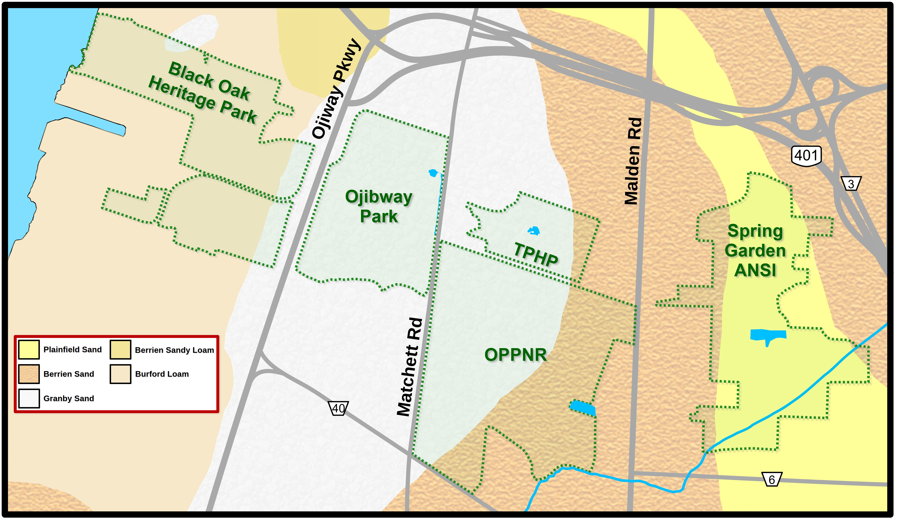
</figure>

<b>Figure 1</b>. This <span id="Br">Soil</span> map of <span id="Dred">OPC</span> in <b>Essex County</b> is based on a more detailed map from the <b><a class="one" href="https://sis.agr.gc.ca/cansis/publications/surveys/on/on11/index.html" target="_blank" title="Go to Canadian Soil Information Service">Canadian Soil Survey Report (No. 11)</a></b>, which was compiled by the Ontario Agricultural College (Department of Soils, Guelph, Ontario) in co-operation with the Canadian Experimental Farms Service (Department of Agriculture, Ottawa).<b>[@caldwell_soil_1949]</b> The <span id="Br">Soil</span> survey was conducted in 1939 and subsequently published by the Experimental Farm Service of Ottawa in 1949. As shown above much of the gleysolic <span id="Br">soil</span> in and around <span id="Dred">OPC</span> contains sandy or sandy-loam material (<b>Grandby</b>, <b>Plainfield</b> and <b>Berrien</b> sand). The topography of the area is fairly level and lies within the central portion of the Michigan basin. A few locally depressed areas do provide seasonal or permanent wetlands. <b>Plainfield</b> sand is coarse in nature and well drained (fairly deep sandy layer), while the more common <b>Berrien</b> and <b>Grandby</b> sands are somewhat more shallower with poor natural drainage (i.e. sits atop thick <b>clayey till</b> material).  
</div>
<!---------------------------------------------->
<!-------- END - FIG 1 - OPC SOIL MAP  --------->
<!---------------------------------------------->


<!-- this is a subheadline -->
<details>
  <summary><b>TABLE OF CONTENTS</b></summary>
  
  1. <a href="#SI"><b>Importance of</b> <span id="Br">Soils</span></a>
     * <a id="#Fig2Agri"><b>Fig. 2. Global Agricultural Production Value</b></a>
     * <a href="#SBiodiv"><span id="Br">Soil</span> <b>Biodiversity</b></a>
     * <a href="#Tab1SES"><b>Table 1.</b> <span id="Br">Soil</span> <b>Ecosystem Services</b></a>
  2. <a href="#STax"><span id="Br">Soil</span><b>Taxonomy</b></a>
     * <a href="#STax"><span id="Br">Soil</span> <b>Classification System</b></a>
  3. <a href="#SFF"><span id="Br">Soil</span> <b>Forming Factors</b></a>
     * <a href="#Fig3SABF"><b>Fig. 3. Soil Biotic & Abiotic Factor Model</b></a>
     * <a href="#SAB"><b>3A</b> <span id="Br">Soil</span> <b>Abiotic Factors</b></a>
       * <a href="#Topo"><b>3A.1 Topography</b></a>
       * <a href="#PM"><b>3A.2 Parent Material</b></a>
       * <a href="#PW"><b>3A.3 Physical Weathering</b></a>
       * <a href="#CW"><b>3A.4 Chemical Weathering</b></a>
       * <a href="#Fig4CBS"><b>Fig. 4. Carbonate Buffering System</b></a>
       * <a href="#SClays"><b>3A.5 Chemistry of Clays</b></a>
         * <a href="#Fig5SPhy"><b>Fig. 5. Structure of Phyllosilicate</b></a>
         * <a href="#Fig6HOSC"><b>Fig. 6. Higher Order Structure of Clays</b></a>
         * <a href="#Fig7SFab"><b>Fig. 7. Soil Particle Structure</b></a>
     * <a href="#SBio"><b>3B</b> <span id="Br">Soil</span> <b>Biota</b></a>
       * <a href="#SVir"><b>3B.1</b> <span id="Br">Soil</span> <b>Viruses</b></a>
         * <a href="#Fig8Phages"><b>Fig. 8. Bacteriophages </b></a>
         * <a href="#Fig9AMC"><b>Fig. 9. Viral Accessory Metabolic Genes (AMG)</b></a>
       * <a href="#SMicro"><b>3B.2</b> <span id="Br">Soil</span> <b>Microbiome (Bacteria & Fungi)</b></a>
       * <a href="#CC"><b>3B.2I Carbon Cycle</b></a>
         * <a href="#Fig10SOM"><b>Fig. 10.</b> <span id="Br">S</span><b>OM Dynamics</b></a>
       * <a href="#NC"><b>3B.2II</b> <span id="Gr2">N</span><b>itrogen Cycle</b></a>
         * <a href="#Fig11NC"><b>Fig. 11.</b> <span id="Gr2">N</span><b>itrogen Cycle</b></a>
       * <a href="#PC"><b>3B.2III</b> <span id="Purple">P</span><b>hosphorus Cycle</b></a>
         * <a href="#Fig12SP"><b>Fig. 12.</b> <span id="Br">Soil</span> <span id="Purple">P</span><b>hosphates</b></a>
         * <a href="#Fig13PC"><b>Fig. 13.</b> <span id="Purple">P</span><b>hosphate Cycle</b></a>
       * <a href="#SC"><b>3B.2IV</b> <span id="Gold">S</span><b>ulfur Cycle</b></a>
         * <a href="#Fig14SC"><b>Fig. 14.</b> <span id="Gold">S</span><b>ulfur Cycle</b></a>
       * <a href="#SMMMF"><b>3B.3</b> <span id="Br">Soil</span> <b>Micro- Meso- and Macro-Fauna</b></a>
       * <a href="#SProt"><b>3B.3IA</b> <span id="Br">Soil</span> <b>Micro-Fauna: Protists</b></a>
       * <a href="#SNem"><b>3B.3IB</b> <span id="Br">Soil</span> <b>Micro-Fauna: Nematodes</b></a>
         * <a href="#Fig15Nem"><b>Fig. 15.</b> <span id="Br">Soil</span> <b>Nematodes</b></a>
       * <a href="#SMites"><b>3B.3II</b> <span id="Br">Soil</span> <b>Meso-Fauna: <i>Acari</i> Mites</b></a>
         * <a href="#deltaX"><b>Stable Isotope Ratio Calculation (&delta; values)</b>
         * <a href="#Tab2Orib"><b>Table 2. Taxonomic <i>Oribatida</i> &delta; Value Variance</b>
         * <a href="#Fig16Orib"><b>Fig. 16. <i>Oribatida</i> &delta; Values and Trophic Niches</b></a>
       * <a href="#SEw"><b>3B.3III</b> <span id="Br">Soil</span> <b>Macro-Fauna: Earthworms</b></a>
         * <a href="#Fig17Sew"><b>Fig. 17.</b> <span id="Br">Soil</span> <b>Earthworms</b></a>
       * <a href="#SMF"><b>3B.3IV</b> <span id="Br">Soil</span> <b>Mega-Fauna</b></a>
  4. <a href="#Refs"><b>References</b></a>
</details>


<!----------------------------------------------------->
<!--------- SECTION 1 - IMPORTANTCE OF SOILS  --------->
<!----------------------------------------------------->
<a id="SI"> </a>
**<span style="border: 2px solid black;">&thinsp; 1. IMPORTANCE OF SOILS &thinsp;</span>** Fundamentally <span id="Br">soils</span> are heterogeneous mixtures of solids, liquids, and gases that vary spatially with time.**[@foth_fundamentals_1990]** The more familiar <span id="Br">soil</span> solids, namely **sand** (0.05–2.0 mm), **silt** (0.002–0.05 mm) and **clay** (<0.002 mm) are conveniently classified according to well defined physical dimensions (i.e. diameter), while <span id="Br">soil</span> **organic matter** (**SOM**) is more loosely defined as a collection of progressively decomposing **plant**, **fungal** and <b>animal</b> derived **organic** compounds.**[@mitchell_fundamentals_2005; @lehmann_contentious_2015]** Nevertheless **SOM** represents the largest reservoir of terrestrial **OM** (i.e. 3500 - 4800 Pentagrams of **C**, where 10<sup>15</sup> gm = 1 Penta-gram or 1 **Giga-tonne**), far exceeding both plant biomass (420-620 Gt of **C**) and atmospheric **C** (~829 Gt) concentrations combined.**[@batjes_total_1996; @hedges_molecularly-uncharacterized_2000; @ciais_carbon_2013; @lehmann_contentious_2015]** This makes **SOM** a subject of much interest in light of our current changing climate.**[@bais_role_2006; @badri_regulation_2009; @chai_root_2022; @wright_survey_1998; @wang_glomalin_2017; @irving_critical_2021]**  
&nbsp; &nbsp; Although <span id="Br">soils</span> are traditionally viewed as a growth medium for **plants**, they are also "*home*" to countless other species.**[@giller_diversity_1996; @wolters_biodiversity_2001; @anthony_enumerating_2023]** In fact many <span id="Br">soil</span> organisms play a vital role in regulating global bio-geochemistry (i.e. **C**, <span id="Gr2">N</span>, <span id="Purple">P</span>, <span id="Gold">S</span> cycles).**[@lal_soil_2004; @millennium_ecosystem_assessment_ecosystems_2005; @intergovernmental_panel_on_climate_change_ipcc_carbon_2014; @wang_modeling_2017; @crowther_global_2019]** These **biogeochemical cycles** (<span id="Gr2">B</span>**GCC**) provide the key chemical elements needed to build biomolecules (i.e. proteins, carbohydrates, nucleic acids, lipids).**[@daily_introduction_1997; @costanza_value_1997; @smith_biogeochemical_2015]** Other **ecosystem services** (**Table 1**) regulated by <span id="Br">soil</span> organisms include water filtration (e.g. fresh water aquifers), <span id="Br">soil</span> stability and fertility (e.g. agriculture), as well as climate (i.e. **C**arbon sink). In fact, one could safely argue that <span id="Br">soil</span> fertility alone accounts for most of the world's agricultural production value, which was estimated to be worth ~$4.45 trillion (USD) in 2021 (**Fig. 2**, **<a class="one" href="https://www.fao.org/faostat/en/#data/QV" target="_blank" title="Go to UNFAO">United Nations's Food Agricultural Organization</a>** data).**[@fao_gross_2023]** However, monetizing the "*true value*" of <span id="Br">soils</span> or the specific ecosystem services they regulate is fraught with difficulties, since <u>life-supporting</u> services are by definition indispensable to all life on the planet.**[@ciais_carbon_2013; @intergovernmental_panel_on_climate_change_ipcc_carbon_2014; @smith_biogeochemical_2015]**

<a id="Fig2Agri"> </a>
<!----------------------------------------------------->
<!--- FIG 2 - Global Agricultural Production Value  --->
<!----------------------------------------------------->
<div style="border: 2px solid gray; padding: 5px;">

<figure>
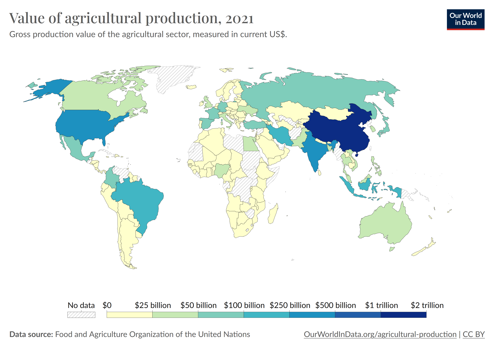
</figure>

<b>Figure 2. Value of Global Agricultural Production.</b>
</div>
<!---------------------------------------------------->
<!----- END - FIG 2 - GLOBAL AGRICULTURE VALUE  ------>
<!---------------------------------------------------->


<a id="SBiodiv"> </a>
&nbsp; &nbsp; One could also argue that the "*true*" value of <span id="Br">soils</span> lies with its inhabitants, the so called "*tiny creatures*" of the world.**[@decaens_values_2006; @falkowski_microbial_2008; @mcbratney_dimensions_2014; @smith_biogeochemical_2015; @fao_state_2020; @hopwood_farming_2021]** These <span id="Br">soil</span> **micro-organisms** (i.e. **viruses**, **bacteria**, **fungi**, **protists**, **nematodes**, and tiny **arthropods** and **hexapods**) account for the majority of species on our planet, which may number well into the billions!**[@stork_how_2018; @anthony_enumerating_2023]** This staggering estimate of the amount of biodiversity is heavily weighted in favour of **bacteriophages** (i.e. viruses that infect bacteria), a poorly understood (ecologically speaking) group of genetic entities that even defies our traditional view of what constitutes life itself (i.e. viruses are not made up of cells, which is the basic unit of life). Even so, if we exclude viruses from our enumerations we would still end up with ~3.9 million <span id="Br">soil</span> species (i.e. lower limit), with the vast majority (>99%) being either **fungi** (~2 &times; 10<sup>6</sup>), **bacteria** (~1 &times; 10<sup>6</sup>), **arthropods** (~3.5 &times; 10<sup>5</sup>), **plants** (~3.2 &times; 10<sup>5</sup>) or **nematodes** (~2.2 &times; 10<sup>5</sup>).**[@anthony_enumerating_2023]** Despite the enormous number of <span id="Br">soil</span> species we know very little about them and how they interact with one another within ecological communities. This poor "*state of affairs*" is perplexing given how they "*...process all terrestrial organic material and influence every aspect of global biogeochemistry.*"**[@crowther_global_2019]**    


<a id="Tab1SES"> </a>
<!-------------------------------------------------------->
<!---------- TABLE 1 - SOIL ECOSYSTEM SERVICES ----------->
<!-------------------------------------------------------->
<table class="Table">
    <thead>
      <tr style="text-align:left">
        <td colspan="3"><span id="BBlk20">TABLE 1. SOIL ECOSYSTEM SERVICES</span></td>
      </tr>
    <thead>
    <thead>
      <tr>
        <th class="f18"><span id="Blk">Category</span></th>
        <th class="f18"><span id="Blk">Function</span></th>
        <th class="f18"><span id="Blk">Description</span></th>
      </tr>
    </thead>
    <tbody>
      <tr>
        <td><span id="Blk">Support Services</span></td>
        <td><span id="Blk">Nutrient Recycling</span></td>
        <td><span id="Br">Soils</span> are a natural "<i>meeting place</i>" for the Earth's great "<i>spheres</i>" (i.e. <span id="Br">litho</span><b>sphere</b>, <span id="Gr2">bio</span><b>sphere</b>, <span id="Lb2">hydro</span><b>sphere</b> and <span id="Lb1">atmo</span><b>sphere</b>) and the biota that populate it play a key role in recycling chemical elements (<span id="Blue">H</span><sub>2</sub><span id="Red">O</span>, <b>C</b>arbon, <span id="Gr2">N</span>itrogen, <span id="Purple">P</span>hosphorus) that are essential to all life on the planet. Maintaining these global <b>biogeochemical cycles</b> is intimately connected to many other important provisional, regulatory and supporting ecosystem services (e.g. fertile <span id="Br">soil</span> and global food production).<sup>(refs A)</sup></td>
      </tr>
      <tr>
        <td><span id="Blk">Regulatory Services</span></td>
        <td><span id="Blk">Climate Regulation</span></td>
        <td><span id="Br">Soils</span> (&le; 2 m depth) contain ~2400 &times; 10<sup>15</sup> gm of <b>C</b>arbon in the form of organic (i.e. dead <b>animals</b> and <b>plants</b>) and inorganic (i.e. sand, silt, clay) material, which is more than all the <b>C</b>arbon found in vegetation (450–650 &times; 10<sup>15</sup> gm C) and the atmosphere (450–650 &times; 10<sup>15</sup> gm C) combined. The time it takes for <b>C</b>arbon to be fixed by <b>plants</b> and enter the <span id="Br">soil</span> as dead organic matter varies considerably, particularly with respect to latitude. In colder northern climates dead organic matter within <span id="Br">soils</span> decays more slowly (compared to tropical regions) allowing it to build up in these regions. This resulting store of <span id="Br">soil</span> <b>C</b>arbon can remain in place for 1000s of years, or be quickly released back into the atmosphere, depending on a number of conditions (e.g. temperature, precipitation, topography, agricultural practices, etc.). This regulatory service is obviously closely integrated with the aforementioned <b>C</b>arbon cycle (Supporting Service).<sup>(refs B)</sup></td>
      </tr>
      <tr>
        <td><span id="Blk">Provisional Services</span></td>
        <td><span id="Blk">Genetic Material and Medicinal Compounds</span></td>
        <td><span id="Br">Soil</span> is home to countless <b>fungi</b>, <b>plants</b>, <b>prokaryotes</b> (i.e. <b>bacteria</b>, <b>archaea</b>), <b>arthropods</b>, <b>nematodes</b> and <b>viruses</b>. These millions of <span id="Br">soil</span> species carry out many critical life supporting services on the planet (e.g. nutrient recycling, climate regulation). Moreover, they are also an important source of many useful medicinal compounds (e.g. anti-viral and anti-bacterial agents, immunosuppresants, herbicides, insecticides, anti-parasitic compounds).<sup>(refs C)</sup></td>
      </tr>
    </tbody>
</table>
<b>Table References:</b> <b>A[@falkowski_microbial_2008; @ciais_carbon_2013; @intergovernmental_panel_on_climate_change_ipcc_carbon_2014; @smith_biogeochemical_2015; @fao_state_2020]</b>, <b>B[@lal_soil_2004; @ciais_carbon_2013; @intergovernmental_panel_on_climate_change_ipcc_carbon_2014; @smith_biogeochemical_2015; @wang_modeling_2017; @crowther_global_2019; @fao_state_2020]</b>, <b>C[@stork_how_2018; @fao_state_2020; @anthony_enumerating_2023; @hopwood_farming_2021]</b>
<br>

<!----------------------------------------------------->
<!----------------------------------------------------->
<!----------------------------------------------------->

<!---------------------------------------------------->
<!--------- SECTION 2 - SOIL CLASSIFICATION  --------->
<!---------------------------------------------------->
<a id="STax"> </a>
**<span style="border: 2px solid black;">&thinsp; 2. SOIL CLASSIFICATION &thinsp;</span>** <span id="Br">Soil</span> is quite complex and currently lacks a universal taxonomic system. However, most national classification systems do agree on what generally constitutes <span id="Br">soils</span>. According to the **<a class="one" href="https://sis.agr.gc.ca/cansis/taxa/cssc3/index.html" target="_blank" title="Go to Canadian Soil Information Service">Canadian system of soil classification</a>** <span id="Br">soil</span> is:  

>"*...naturally occurring, <u>unconsolidated</u>, <b>mineral</b> or <b>organic material</b> at the <u>earth's surface</u> that is <u>capable of supporting plant growth</u>. Its <u>properties</u> usually <u>vary with depth</u>. They are determined by <u>climatic factors</u> and <u>organisms</u>, as conditioned by <u>relief</u> and, hence, <u>water</u> regime acting on geological materials and producing genetic horizons that <u>differ</u> from the <u>parent material</u>. In the landscape, soil merges into non-soil entities such as exposed, consolidated rock or permanent bodies of water at arbitrarily defined boundaries*."**[@haynes_canadian_1998]**

&nbsp; &nbsp; This same taxonomic system also lists 10 major <u>orders</u> of <span id="Br">soils</span> that largely reflects "*...the nature of the soil environment and the effects of the dominant, soil-forming processes*".**[@haynes_canadian_1998]** Lower down on the taxonomic scale are the **Great groups**, followed by **Subgroups**, **Families** and finally **Series**. All of these taxa are designed to be practical since they are based on "*<u>observable</u> and <u>measurable</u> soil properties that reflect processes of soil genesis and environmental factors*"**[@haynes_canadian_1998]** However, it is important to note that the current system is not set in "*stone*" per say, since we have "*limited knowledge of the vast population of soils in the country*".**[@haynes_canadian_1998]**  
&nbsp; &nbsp; Part of the difficulty surrounding <span id="Br">soil</span> taxonomy is the enormous amount of variation in its <u>physical</u>, <u>chemical</u> and <u>biological</u> make up. Nevertheless, we can focus our attention on some basic aspects of <span id="Br">soils</span>, such as:

<div align=center>
<b>*How do <span id="Br">soils</span> form*?</b> and <b>*What is the basic chemistry of <span id="Br">soils</span>*?</b>
</div>

<a id="SFF"> </a>  
**<span style="border: 2px solid black;">&thinsp; 3. SOIL FORMING FACTORS &thinsp;</span>** As mentioned above <span id="Br">soil</span> is the long term product of complex physical and biological processes.**[@foth_fundamentals_1990; @mitchell_fundamentals_2005]** As **Charles E Kellogg**, the former head <span id="Br">soil</span> scientists for the USDA once wrote:  

>"*Essentially, all life depends upon the soil, and its important functional attribute, productivity for plants, is due more than to anything else to the operation of biological forces ...There can be no life without soil and no soil without life: they have evolved together.*"**[@kellogg_fundamentals_1938]**

**Kellogg's** often quotes words clearly elude to the fundamental interdependence of all living and non-living elements of <span id="Br">soils</span> and, of course, time itself. 

>*"There is a relationship between climate and vegetation, between parent rock and vegetation, between age and slope, and even between climate and slope. All express themselves in the soil ...there is a great number of types of soil ...each offers certain possibilities.*"**[@kellogg_fundamentals_1938]**

Although our understanding of <span id="Br">soils</span> has greatly improved since **Kellogg's** time at the **USDA** we still have only begun to scratched the surface of this topic. Yet it has certainly become clearer over the last few decades that the **microbiome**, which is largely comprised of **bacteria** and **fungi**, is the key **biotic** factor regulating most <span id="Br">soil</span> functions, particularly nutrient mineralization.**[@bardgett_belowground_2014]** Of course **plants** form the base of terrestrial food webs by "*fixing*" carbon from the <span id="Lb2">atmo</span>**sphere** (i.e. <span id="Gr2">photo</span>**synthesis**). Also, **plants** release a significant proportion of their <span id="Gr2">photo</span>**synthate** (i.e. upwards of 40%) into the <span id="Br">soil</span> via their roots.**[@walker_root_2003; @bais_role_2006; @badri_regulation_2009]** These so called **Rhizodeposits** or root **exudates** are mostly made up of simple **organic** metabolites (e.g. **organic** acids). However, some secreted chemicals help protect **plants** either directly or indirectly from predators and pathogens (e.g. **plant** latex, extracellular DNA, terpenoids).**[@agrawal_latex_2009; @konno_plant_2011; @hawes_extracellular_2011; @rasmann_root_2016]**  
&nbsp; &nbsp; At a basic level **plants** and their associated **microbiome** form an important functional interface for what lies both below and above ground. And it's from this vantage point that we can conceptualize how **biotic** and **abiotic** factors regulate food webs within terrestrial ecosystems (**Fig. 3**). By thinking in terms of <span id="Br">soil</span> "*inputs*" (i.e. "*bottom-up*" regulation) and "*outputs*" (i.e. "*top-down*" regulation) we can at the very least begin to understand how important <span id="Br">soils</span> are on a global scale (i.e. <span id="Gr2">bio</span>**sphere**, <span id="Lb1">atmo</span>**sphere**, <span id="Lb2">hydro</span>**sphere**, <span id="Br">Litho</span>**sphere**). Toward this goal the following discussions will detail important **abiotic** and **biotic** factors that shape the structure and function of <span id="Br">soils</span>. Emphasis will be placed on the physical-chemical properties of <span id="Br">soils</span> and how they impact important ecosystem functions (e.g. nutrient cycling). This will not be an exhaustive discussion, but hopefully it will inspire more respect and admiration for <span id="Br">soil</span>.

<a id="Fig3SABF"> </a>
<!---------------------------------------------------->
<!------ FIG 3 - SOIL ABIOTIC & BIOTIC FACTORS  ------>
<!---------------------------------------------------->
<div style="border: 2px solid gray; padding: 5px;">

<figure>

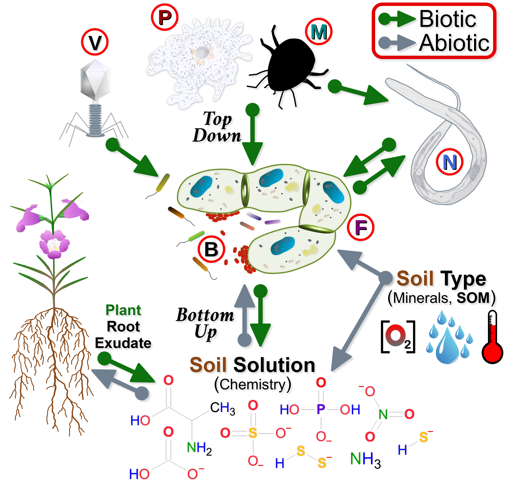

</figure>

**Figure 3. Soil Abiotic & Biotic Factors.** <span id="Br">Soil</span> is arguably the most biologically diverse terrestrial habitat, accounting for >44% of the known species on the planet.**[@anthony_enumerating_2023]** Some of the most important ecosystem services provided by <span id="Br">soils</span> (e.g. nutrient cycling) are carried out by <span id="Br">soil</span> micro-organisms, specifically **bacteria** (<b>&#9399;</b>) and **fungi** (<span id="Purple">&#9403;</span>) that are often referred to as the <span id="Br">soil</span> **microbiome**. Research suggests that both **biotic** (i.e. predation, plant root **exudates**) and **abiotic** (e.g. moisture, <span id="Br">soil</span> chemistry) factors play equally important roles in regulating the **microbiome**. For example, **biotic** factors are known to regulate ecological communities in either a "*bottom up*" (e.g. plant root **exudates**) or "*top down*" (e.g. **predation**) fashion.**[@thakur_trophic_2019]** Some well known **predators** of **bacteria** (<b>&#9399;</b>) and **fungal hyphae** (<span id="Purple">&#9403;</span>) include **bacteriophages** (<b>&#9419;</b>, viruses that infect **bacteria**),**[@clokie_phages_2011; @cobian_guemes_viruses_2016]** **protists** (<span id="Dred">&#9413;</span>, e.g. *Amoebozoa*), **nematodes** (<span id="Blue">&#9411;</span>),**[@neher_ecology_2010; @orgiazzi_global_2016; @wilschut_nematodes_2021]** and tiny *Oribatid* **mites** (<1 mm in length, <span id="Teal">&#9410;</span>).**[@orgiazzi_global_2016]** There are also many other important **microbe** consumers such as *springtails* (i.e. *Collembola*, 0.12-17 mm hexapods) and **earthworms** (i.e. *Annelida*, feed on dead **organic matter** that contains **microbes**) that are not illustrated above. From a "*bottom up*" perspective there are many resources or "*inputs*" that support the **microbiome**. This would include **plant** "*litter*" and root **exudates** (e.g. **C** rich <span id="Gr2">photo</span>**synthate**), as well as the physical <span id="Br">soil</span> chemistry (e.g. mineral surface, solution chemistry, **pH**, moisture, <span id="Red">O</span>xygen levels). Of course there are many internal and external feedback loops associated with these **biotic** and **abiotic** components, such as the conversion of residual **organic matter** (**OM**) into simple inorganic compounds (i.e. **mineralization**) that benefits both **plants** and **microbes** alike.  

</div>
<!-------------------------------------------------------->
<!----- END - FIG 3 - SOIL ABIOTIC & BIOTIC FACTORS ------>
<!-------------------------------------------------------->


<a id="SAB"> </a>
<!--------------------------------------------------->
<!----------- SECTION 3A.1 - TOPOGRAPHY  ------------>
<!--------------------------------------------------->
**<u>3A Soil Abiotic Factors</u>:** Over very large areas **climate** and **vegetation type** are arguably the most important factors affecting <span id="Br">soil</span> development. However, on a smaller regional scale (e.g. Essex County) <span id="Br">soils</span> are greatly influenced by the underlying <span id="Dred">parent material</span> and <span id="Dred">topography</span>. 

>"*Soils are products of evolution, and soil properties are a function of time or soil age. The age of a soil is expressed by its degree of development and not the absolute number of years. In a sense, soils have a life cycle that is represented by various stages of development*."**[@foth_fundamentals_1990]**  

<a id="Topo"> </a> 
<!-------------------------------------------------->
<!----------- SECTION 3.1 - TOPOGRAPHY  ------------>
<!-------------------------------------------------->
**<u>3A.1 Topography</u>:** <span id="Dred">OPC</span> and the rest of Essex county is a predominantly flat area. The only notable exceptions are the large sandy and gravelly knolls near **Ruthven** (~228 m above sea level) and **Cholchester** (~201 m), both being the recipient of large amounts of **glacial out-wash** and **morainic** material. The land beyond these hills gently slopes downward reaching elevations of ~170 m to the immediate south and east along the shores of Lake Erie, and close to 180 m to the north and west along the shores of Lake St. Clair and the Detroit river. There is some gentle undulating character to the land due to the small number of **morainic** ridges, as well as some depressed areas, but over all its largely a flat **clayey** plain that is mainly used for agriculture (i.e. 121,042 ha of field crops, which is ~65% of Essex county's total area).**[[@statistics_canada_table_2022; @statistics_canada_focus_2017]**  

<a id="PM"> </a> 
<!-------------------------------------------------->
<!--------- SECTION 3.2 - PARENT MATERIAL  --------->
<!-------------------------------------------------->
**<u>3A.2 Parent Material</u>:** This is arguably the most important factor affecting <span id="Br">soil</span> development at <span id="Dred">OPC</span>. Most if not all of this **parent material** was deposited by the great **<a class="one" href="https://planetearth.utsc.utoronto.ca/timeline/hlis_t1b.html" target="_blank" title="Go to PlanetEarth site">Laurentide Ice Sheet</a>** (<span id="Glacialb">LIS</span>) some 23,000 years ago (**ya**).**[@karrow_chapter_1989; @larson_origin_2001; @dyke_outline_2004; @andrews_late_2007]** During a span of ~13,000 years (23,000-10,000 **ya**), a period known as the **Late Wisconsinan**, the <span id="Glacialb">LIS</span> occupied all or part of southern Ontario. However, <span id="Dred">OPC</span> being positioned at the southern extent of the continental ice sheet, meant that the region experienced notable fluctuations in the amount of ice cover. The repeated retreat and re-advance of the ice sheet's major lobes (which developed within the Great Lake basins) greatly altered the drainage pattern of the region. In fact the enormous volumes of glacial melt-water that accumulated gave rise to a complex succession of large deep lakes that persisted for long periods of time.**[@leverett_pleistocene_1915; @karrow_chapter_1989; @larson_origin_2001]** Evidence of these ancient lakes is literally under our feet in the form of **glacial till** (i.e. unsorted collection of rocks, gravel, sand, silt, and clay).**[@noauthor_rock_1994; @morris_quaternary_1994; @dyke_outline_2004]** **<a class="one" href="https://www.antarcticglaciers.org/glacial-geology/glacial-landforms/glacial-erosional-landforms/subglacial-erosion/" target="_blank" title="Go to AntarcticGlaciers site">Sub-glacial erosion</a>** of hard northern bedrock generated debris (i.e. gravel, sand, silt, clay) that became "*embedded*" within the bottom of the ice sheet (i.e. <u>entrainment</u>). It along with softer "*ploughed*" material (i.e. sedimentary rock) were often transported great distances. When the ice sheet retreated the entrained glacial debris was deposited, often as a blanket of loose unconsolidated material and occasionally as unique landforms such as **<a class="one" href="https://www.antarcticglaciers.org/glacial-geology/glacial-landforms/glacial-depositional-landforms/moraine-types/" target="_blank" title="Go to AntarcticGlaciers site">moraines</a>** (French *Savoy* dialect: "*morena*", meaning "mound of earth"), **<a class="one" href="https://www.antarcticglaciers.org/glacial-geology/glacial-landforms/glaciofluvial-landforms/eskers/" target="_blank" title="Go to AntarcticGlaciers site">eskers</a>** (ridges deposited by melt-water) and **out-wash plains**.**[@alley_how_1997; @fountain_water_1998; @dyke_outline_2004; @evans_subglacial_2006; @herdendorf_research_2013]** Within **Essex** county there are several low relief recessional type **<a class="one" href="https://planetearth.utsc.utoronto.ca/timeline/slis_t1b.html" target="_blank" title="Go to PlanetEarth site">end moraines</a>**, as well as large deposits of glacial-fluvial sorted material.**[@taylor_moraine_1913; @caldwell_soil_1949; @karrow_chapter_1989; @morris_quaternary_1994]** However, perhaps the greatest "*gift*" left behind by the glaciers are the extensive deposits of **clay** (i.e. **St. Clair clay plain**) that once formed the bottom of these ancient glacial lakes. Often distinctive deposits called **varves**, consisting of <u>alternating</u> layers of fine grained **silt** (summer) and **clay** (winter), formed at the bottom of these lakes. When preserved these <u>annually</u> recurring deposits provide invaluable information about the age and environment of these ancient lake systems (e.g. pollen, diatoms, organics, minerals).**[@sturm_michael_lake_1995; @de_geer_geochronology_2002; @zolitschka_varved_2007]**  
&nbsp; &nbsp; The main process that transformed this **parent material** into mature <span id="Br">soils</span> is **weathering**. It's a destructive <u>physical</u>, <u>chemical</u> and <u>biological</u> process that requires a significant amount of time. Moreover, **weathering** is a transformative process since the size, shape and chemical composition of the material undergoes extensive changes.  

<a id="PW"> </a> 
<!-------------------------------------------------->
<!------- SECTION 3.3 - PHYSICAL WEATHERING  ------->
<!-------------------------------------------------->
**<u>3A.3 Physical Weathering</u>:** This is a mechanical (e.g. wind, water or glacial abrasion) reductive process that increases the surface-to-volume ratio of the **parent material**. This relatively simple step is important since increasing the surface area of the weathered debris accelerates the overall **weathering** process (e.g. increased rates of chemical reactions). Some common causes of this physical weathering process include **frost wedging** (i.e. thermal expansion and contraction of water as it freezes and melts within the cracks of rocks), <b>plant</b> roots (i.e. growing into rock cracks), burrowing **animals**, as well as other types of mechanical stress (e.g. gravity, pressure changes, abrasion). Obviously **topography** plays a big role in this process since changes in elevation (e.g. mountain) can simultaneously introduce many physical weathering processes (e.g. thermal cycles, gravity, increased wind exposure). However, as noted above physical and chemical weathering processes usually operate together within any given environment.**[@wilson_weathering_2004; @mitchell_fundamentals_2005]**  

<a id="CW"> </a> 
<!-------------------------------------------------->
<!------- SECTION 3.4 - CHEMICAL WEATHERING  ------->
<!-------------------------------------------------->
**<u>3A.4 Chemical Weathering</u>:** <span id="Br">Soils</span> undergo chemical changes as they develop. These changes can be purely physical or **abiotic** in nature, such as when atmospheric **C**<span id="Red">O</span><sub>2 (gas)</sub> dissolves in water to produce **carbonic acid** (as detailed below). This simple **dissolution** step helps drive **silicate** weathering, which is believed to be the most important factor regulating the geological **C**arbon cycle.**[@walker_negative_1981; @kump_chemical_2000; @ciais_carbon_2013; @hilton_mountains_2020]** There are also many organisms (e.g. bacteria, fungi, lichens, etc.) in constant contact with <span id="Br">soil</span> particles capable of releasing various **organic** compounds (e.g organic acids, chelating agents) that can accelerate chemical weathering.**[@drever_role_1997; @wilson_weathering_2004; @chen_weathering_2000; @mitchell_fundamentals_2005]** Nevertheless, it can be argued that the chief chemical weathering agents of <span id="Br">soils</span> are water (<span id="Blue">H</span><sub>2</sub><span id="Red">O</span>), oxygen (<span id="Red">O</span><sub>2</sub>) and carbon dioxide (**C**<span id="Red">O</span><sub>2</sub>).**[@kump_chemical_2000; @hilton_mountains_2020]** Water, being a "*universal*" solvent, provides an ideal environment for many types of chemical reactions, including the hydrolysis of minerals by weak acids like **carbonic acid** (<span id="Blue">H</span><sub>2</sub>**C**<span id="Red">O</span><sub>3</sub>). As noted above **carbonic acid** plays a prominent role in the chemical weathering of **silicates**. For example, common **feldspar** minerals (i.e. major component of **granites**) such as **<a class="one" href="https://www.mindat.org/min-1624.html" target="_blank" title="Go to Mindat.org">Anorthite</a>** readily undergoes chemical hydrolysis when exposed to **carbonic acid**. As shown below this crystalline **<a class="one" href="https://min4kids.org/tectosilicates/" target="_blank" title="Go to Minerals4Kids site">tectosilicate</a>** undergoes a chemical change that also alters its physical properties (i.e. **tectosilicate** is transformed into a **<a class="one" href="https://min4kids.org/phyllosilicates/" target="_blank" title="Go to  Minerals4Kids site">phyllosilicate</a>**).  


\begin{align*}
\tag{1} \text{CO}_{2 \phantom{1}(aq.)} + \phantom{1} \text{H}_2\text{O} \phantom{1} \rightleftharpoons \phantom{1} \underbrace{\text{H}_2\text{CO}_{3 \phantom{1}(aq.)}}_{\text{carbonic acid}} \phantom{1} &\rightleftharpoons \phantom{1} \text{H}^+ + \phantom{1} \underbrace{\text{HCO}_3^-}_{\text{bicarbonate}} \phantom{1} \rightleftharpoons \phantom{1} \text{H}^+ + \phantom{1} \underbrace{\text{CO}_3^{-2}}_{\text{carbonate}} \\\\
\tag{2} \underbrace{\text{CaAl}_2\text{Si}_2\text{0}_8}_{\text{granite}} \phantom{1} + \phantom{1} 2\text{H}^+ \phantom{1} + \phantom{1} \text{H}_2\text{O} \phantom{1} &\rightleftharpoons \phantom{1} \text{Ca}^{+2} \phantom{1} + \phantom{1} \underbrace{\text{Al}_2\text{Si}_2\text{O}_5\text{(OH)}_4}_{\text{kaolinite} \phantom{1}\text{(clay)}} \\\\
\tag{3} \text{Ca}^{+2} \phantom{1} + \phantom{1} 2\text{HCO}_3^- \phantom{1} &\rightleftharpoons \phantom{1} \text{CO}_2 \phantom{1} + \phantom{1} \underbrace{\text{CaCO}_3}_{\text{calcite}} \phantom{1} + \phantom{1} \text{H}_2\text{O}
\end{align*}


In the first series of reactions dissolved or aqueous **carbon dioxide** (**C**<span id="Red">O</span><sub>2 (aq)</sub>) reacts with the water (<span id="Blue">H</span><sub>2</sub><span id="Red">O</span>) to produce **<a class="one" href="https://pubchem.ncbi.nlm.nih.gov/compound/Carbonic-Acid" target="_blank" title="Go to PubChem site">carbonic acid</a>** (<span id="Blue">H</span><sub>2</sub>**C**<span id="Red">O</span><sub>3</sub>). Given the low levels of atmospheric **C**<span id="Red">O</span><sub>2</sub> gas only a relatively small amount of **C**<span id="Red">O</span><sub>2 (aq)</sub> will go on to generate **carbonic acid** (<span id="Blue">H</span><sub>2</sub>**C**<span id="Red">O</span><sub>3</sub>). This <u>weak</u> acid will in turn partially dissociate into **bicarbonate** (<span id="Blue">H</span>**C**<span id="Red">O</span><sub>3</sub><sup>-</sup>) and <span id="Blue">H</span><sup>+</sup> (i.e. technically **hydronium ion**: <span id="Blue">H</span><sub>3</sub><span id="Red">O</span><sup>+</sup>, but <span id="Blue">H</span><sup>+</sup> is a convenient shorthand), and then finally form **carbonate** (**C**<span id="Red">O</span><sub>3</sub><sup>-2</sup>) when **bicarbonate** itself dissociates and liberates yet another <span id="Blue">H</span><sup>+</sup> ion. In the second step each of the <span id="Blue">H</span><sup>+</sup> ions, along with the water molecule, will react with a **silicate** such as the mineral **<a class="one" href="https://www.mindat.org/min-1624.html" target="_blank" title="Go to Mindat.org">feldspar</a>** (e.g. **anorthite**, <span id="Ly">Ca</span><sup>+2</sup><span id="Gray">Al</span><sub>2</sub><span id="Dgray">Si</span><sub>2</sub><span id="Red">O</span><sub>8</sub>). These minerals are among the most common building blocks of igneous rocks (e.g. **granite**) found within the Earth's crust. The end result of this chemical reaction is the release of a **calcium** cation (<span id="Ly">Ca</span><sup>+2</sup>) and the formation of a **clay** mineral known as **kaolinite**, which is a softer **<a class="one" href="https://min4kids.org/phyllosilicates/" target="_blank" title="Go to Minerals4Kids site">phyllosilicate</a>** (i.e. "*sheet-forming*" silicate). In the final step <span id="Ly">Ca</span><sup>+2</sup> combines with **bicarbonate** to form water and **calcite** (<span id="Ly">Ca</span>**C**<span id="Red">O</span><sub>3</sub>). The latter product is important to aquatic ecosystems since many species use **carbonate** minerals to build homes and protective shells (e.g. corals, zooplankton, phytoplankton, shellfish).**[@kleypas_geochemical_1999; @raven_ocean_2005]** Ultimately this bio-mineralization process leads to the generation of new sedimentary rock (e.g. limestone) resulting in the long-term "*draw-down*" of atmospheric **C**<span id="Red">O</span><sub>2</sub>.**[@berner_atmospheric_1990; @berner_model_1991; @wilson_weathering_2004]**  
&nbsp; &nbsp; The most important feature of the **carbonate** chemistry detailed above is its **pH** <u>buffering</u> ability. Some of the most important **buffering** systems found in nature involve **weak acids**, like **carbonic acid** (<span id="Blue">H</span><sub>2</sub>**C**<span id="Red">O</span><sub>3</sub>) and their corresponding **conjugate base** (e.g. <span id="Blue">H</span>**C**<span id="Red">O</span><sub>3</sub><sup>-1</sup>). The power of this **buffer pair** lies in its ability to either release or bind a **proton** and thus control the levels of **hydronium ions** (<span id="Blue">H</span><sub>3</sub><span id="Red">O</span><sup>+</sup>) in solution. According to the **Bronsted-Lowry** theory of **acids** and **bases** an **acid** is a substance capable of donating a **proton** (<span id="Blue">H</span><sup>+</sup>) and a **base** is a substance that can accept a **proton**.**[@muller_glossary_1994]** In fact there are a number of different molecules that can act as either an **acid** or **base** (e.g. water, **bicarbonate**, **amino acids**). Two of these **<a class="one" href="https://goldbook.iupac.org/terms/view/A00306" target="_blank" title="Go to IUPAC site">amphoteric</a>** chemical species are shown below, one being <u>water</u> and the other being an **amino acid** (**Note:** general **aa** formula containing <span id="Blue">H</span> and three **<a class="one" href="https://chemistrytalk.org/functional-groups-organic-chemistry/" target="_blank" title="Go to ChemTalk">functional groups</a>**  - **amine**, **carboxy** and **R** or variable group - attached to a central carbon).  


$$\tag{4} \underbrace{\text{H}_{2}\text{N}-\text{CH(R)}-\text{COOH}}_\text{acid 1} \phantom{1} + \phantom{1} \underbrace{\phantom{1} \text{H}_2\text{O} \phantom{1}}_{\text{base 2}} \phantom{1} \rightleftharpoons \phantom{1} \underbrace{\text{H}_{2}\text{N}-\text{CH(R)}-\text{COO}^-}_{\text{base 1}} \phantom{1} + \phantom{1} \underbrace{\phantom{1} \text{H}_3\text{O}^+}_{\text{acid 2}}$$


$$\tag{5} \underbrace{\text{H}_{2}\text{N}-\text{CH(R)}-\text{COOH}}_\text{base 2} \phantom{1} + \phantom{1} \underbrace{\phantom{1} \text{H}_2\text{O} \phantom{1}}_{\text{acid 1}} \phantom{1} \rightleftharpoons \phantom{1} \underbrace{\text{H}_{3}\text{N}^+-\text{CH(R)}-\text{COOH}}_{\text{acid 2}} \phantom{1} + \phantom{1} \underbrace{\phantom{1} \text{OH}^-}_{\text{base 1}}$$


$$\tag{6} \underbrace{\phantom{1} \text{H}_2\text{O} \phantom{1}}_{\text{acid 1}} \phantom{1} + \phantom{1} \underbrace{\phantom{1} \text{H}_2\text{O} \phantom{1}}_{\text{base 2}} \phantom{1} \rightleftharpoons \phantom{1} \underbrace{\phantom{1} \text{OH}^- \phantom{1}}_{\text{base 1}} \phantom{1} + \phantom{1} \underbrace{\phantom{1} \text{H}_3\text{O}^+}_{\text{acid 2}}$$


Since this topic of **chemical weathering** is focused on **acids** a brief discussion about **pH** (formula below) is certainly warranted. Firstly, the concept of **pH** was introduced by the Swedish Chemist **Søren Sørensen** (1909) who defined it (shown below) as the <u>negative</u> **<a class="one" href="https://www.mathsisfun.com/algebra/logarithms.html" target="_blank" title="Go to MathisFun site">logarithm</a>** of the <span id="Blue">H</span><sup>+</sup> ion concentrations (i.e. "*power*" of <span id="Blue">H</span><sup>+</sup> concentration in **moles** per litre, or mol/L).**[@sorensen_enzyme_1909]**


$$\tag{7} \text{pH} \phantom{1} =  \phantom{1} -\text{log}\phantom{.} [\text{H}^+] =  \phantom{1} -\text{log}\phantom{.} 10^{\phantom{.}[\text{pH}]}$$

His reason for using a negative logarithmic operator (**Recall** our previous discussion of **operators** in **ChemPrimer2**) is because the concentrations of <span id="Blue">H</span><sup>+</sup> and <span id="Red">O</span><span id="Blue">H</span><sup>-</sup> ions in most aqueous solutions are often very small (e.g. normal blood plasma has a **pH** of ~7.4, which means [<span id="Blue">H</span><sup>+</sup>] = 10<sup>-7.4</sup> mol/L). The convenience of dealing with a small positive number ranging between 0 and 14 simply outweighs any potential confusion over the fact that **pH** <u>increases</u> when the <span id="Blue">H</span><sub>3</sub><span id="Red">O</span><sup>+</sup> ion concentration <u>decreases</u>.**[@sorensen_enzyme_1909; @po_henderson-hasselbalch_2001; @camoes_century_2010]**  

<a id="Fig4CBS"> </a> 
<!---------------------------------------------------->
<!--- FIG 4 - Bicarbonate Buffering System in RBC  --->
<!---------------------------------------------------->
<div style="border: 2px solid gray; padding: 5px;">

<figure>
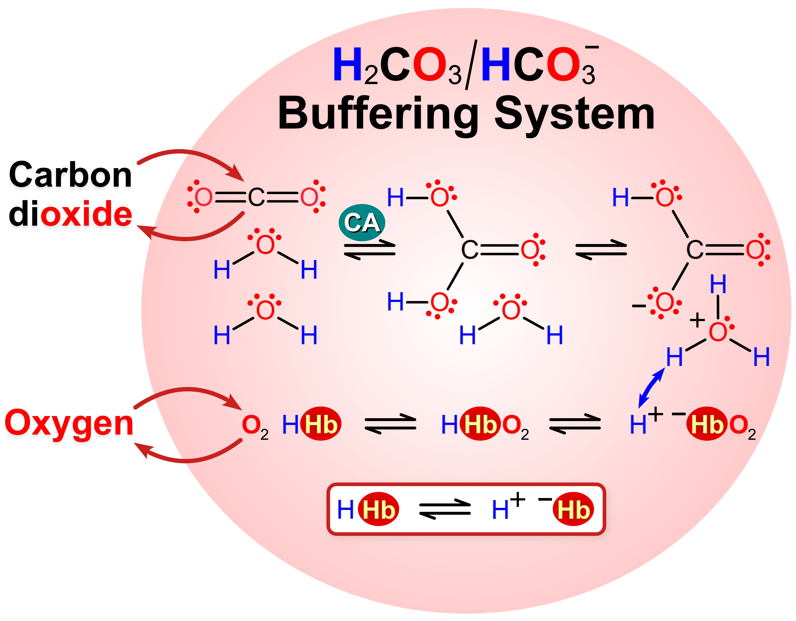
</figure>

**Figure 4. Carbonate/Bicarbonate Buffering System.** The chemistry of **Carbonate/Bicarbonate** (**C**<span id="Red">O</span><sub>3</sub><sup>-2</sup>/<span id="Blue">H</span>**C**<span id="Red">O</span><sub>3</sub><sup>-</sup>) not only drives **silicate** weathering, but also helps to regulate the **pH** of <b>animal</b> body fluids.**[@boron_regulation_2004]** For terrestrial and aquatic **animals** alike maintaining the normal **pH** (~7.4) of intracellular and extracellular (e.g. blood plasma) compartments is vital to the proper functioning of <u>enzymes</u> and the overall health of organ systems.**[@kraut_metabolic_2010]** As depicted above the **pH** (~7.4) of <span id="Red">Red</span> **blood cells** (<span id="Red">RBC</span>) is partly regulated by the **Carbonate/Bicarbonate** buffer pair, as well as several proteins, including <b>hemoglobin</b> (<span id="Dred">Hb</span>, most abundant protein found in <span id="Red">RBC</span>) and **carbonic anhydrase** (<span id="Zinc2">CA</span>).**[@christensen_proteins_1966; @kaufman_physiology_2023; @supuran_carbonic_2008]** The latter is an ubiquitous metallo-enzyme that catalyzes the <u>conversion</u> of **C**<span id="Red">O</span><sub>2</sub> into **bicarbonate** (<span id="Blue">H</span>**C**<span id="Red">O</span><sub>3</sub><sup>-</sup>) and <span id="Blue">H</span><sub>3</sub><span id="Red">O</span><sup>+</sup>, while <span id="Dred">Hb</span> (like most proteins) can act as a buffer by binding or releasing <span id="Blue">H</span><sup>+</sup> ions (**Eq. 4, 5**). Most chemical reactions are reversible (i.e. symbolized by bi-directional arrows) and largely governed by changes in the concentrations of reactants and products in accordance with **Le Chatelier's Principle**.**[@chatelier_recherches_1888]** This principle simply states that when a chemical reaction at <u>equilibrium</u> (i.e. rate of formation of reactants = rate of formation of products) experiences a change (e.g. reactant concentration increases) then the equilibrium will <u>shift</u> to <u>counteract</u> the change (e.g. more product will be formed to reduce the reactant concentrations) and go on to establish a new equilibrium state. For the **Carbonic acid/Bicarbonate** buffer system an increase in the concentration of <span id="Blue">H</span><sup>+</sup> will trigger a shift to the left in the chemical reaction, resulting in the formation of more reactants (i.e. <span id="Blue">H</span>**C**<span id="Red">O</span><sub>3</sub><sup>-</sup> + <span id="Blue">H</span><sub>3</sub><span id="Red">O</span><sup>+</sup> &rArr; <span id="Blue">H</span><sub>2</sub>**C**<span id="Red">O</span><sub>3</sub> + <span id="Blue">H</span><sub>2</sub><span id="Red">O</span>). When a new equilibrium state is established there will be a slightly higher concentration of <span id="Blue">H</span><sub>3</sub><span id="Red">O</span><sup>+</sup>, as well as a decrease in the levels of **bicarbonate** and an increase in the levels of **C**<span id="Red">O</span><sub>2</sub> and <span id="Blue">H</span><sub>2</sub><span id="Red">O</span>. The excess **C**<span id="Red">O</span><sub>2</sub> concentrations and the low <span id="Red">O</span><sub>2</sub> levels are quickly dealt with at the lungs where gas exchange occurs (i.e. **C**<span id="Red">O</span><sub>2</sub> exhaled and <span id="Red">O</span><sub>2</sub> inhaled). <span id="Red">RBC</span> are also tasked with delivering <span id="Red">O</span><sub>2</sub> to respiring tissues that have been made **acidic** by the build up of organic acids (e.g. lactic acid). Here, the lower **pH** will reduce the <span id="Red">O</span><sub>2</sub> binding affinity of <span id="Dred">Hb</span>, which allows <span id="Red">O</span><sub>2</sub> to diffuse out of the <span id="Red">RBC</span> and enter the <span id="Red">O</span><sub>2</sub> starved cells.
</div>
<!-------------------------------------------------->
<!------- END - FIG 4 - BICARBONATE BUFFER  -------->
<!-------------------------------------------------->

<!----------------------------------------------------->
<!--------- SECTION 3.5 - CHEMISTRY OF CLAYS  --------->
<!----------------------------------------------------->
<a id="SClays"> </a>  
**<u>3A.5 Chemistry of Clays</u>:** As detailed above the **clay** rich <span id="Br">soils</span> of <span id="Dred">OPC</span> are largely a product of the **physical** and **chemical weathering** processes generated by the last ice age. Although the exact mechanism responsible for the chemical transformation of a **tectosilicate** like **<a class="one" href="https://www.mindat.org/min-1624.html" target="_blank" title="Go to Mindat.org">Feldspar</a>** (e.g. **anorthite**, <span id="Ly">Ca</span><sup>+2</sup><span id="Gray">Al</span><sub>2</sub><span id="Dgray">Si</span><sub>2</sub><span id="Red">O</span><sub>8</sub>) into a **phyllosilicate** like **kaolinite** (e.g. <span id="Gray">Al</span><sub>2</sub><span id="Dgray">Si</span><sub>2</sub><span id="Red">O</span><sub>5</sub>(<span id="Red">O</span><span id="Blue">H</span>)<sub>4</sub>) is not entirely clear, the resulting **clay** product is known to enhance the fertility of <span id="Br">soils</span>. Physically this is explained by the relatively large surface area of these **<a class="one" href="https://passel2.unl.edu/view/lesson/0cff7943f577/4" target="_blank" title="Go to Plant and Soil Science eLibrary">platy</a>** polymers, and chemically by the occasional <u>charge defects</u> within these sheets (e.g. <span id="Violet">Mg</span><sup>+2</sup> substituted for <span id="Gray">Al</span><sup>+3</sup>). These charge imbalances (e.g. <span id="Gray">Al</span><sup>+3</sup> replaced by <span id="Violet">Mg</span><sup>+2</sup> generate a net negative charge) allow **clay** particles to <u>adsorb</u> water, organic molecules as well as ions like **potassium** (<span id="Rasp">K</span><sup>+</sup>) that are needed by **plants** and other <span id="Br">soil</span> organisms.**[@feng_chemical_2005; @churchman_game_2018]**  
&nbsp; &nbsp; To better understand **phyllosilicates** we can take a closer look at the chemistry of their crystal structure. The availability of free molecular modelling programs like **<a class="one" href="https://jp-minerals.org/vesta/en/" target="_blank" title="Go to Vesta site">VESTA</a>** make this a relatively easy task to perform.**[@momma_vesta_2011]** As you can see in **Figure 4** modelling **silicates**, like **<a class="one" href="https://virtual-museum.soils.wisc.edu/display/kaolinite/" target="_blank" title="Go to VirtualMuseum site">kaolinite</a>**, using the geometric lines, angles and "*faces*" (i.e. **polyhedrons**) of the mineral reveals patterns within its overall structure. Specifically, one can clearly see the <u>hexagonal</u> shape of the extended **silica** <b>tetrahedral</b> and **alumina** <b>octahedral</b> polymers (**Fig. 5B**).  

<a id="Fig5SPhy"> </a> 
<!---------------------------------------------->
<!--- FIG 5 - Vesta Model of Clay Structure  --->
<!---------------------------------------------->
<div style="border: 2px solid gray; padding: 5px;">

<figure>
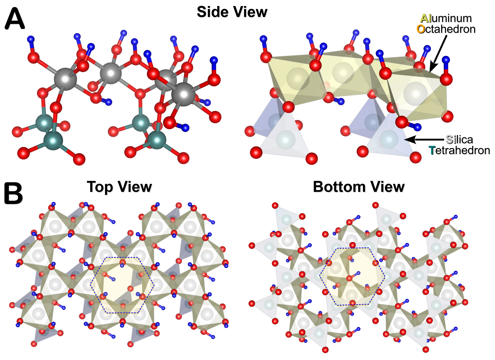
</figure>

**Figure 5. Structure of a Phyllosilicate.** Shown above is a computer model of the crystal structure of **<a class="one" href="https://virtual-museum.soils.wisc.edu/display/kaolinite/" target="_blank" title="Go to VirtualMuseum site">kaolinite</a>** generated using <b>Vesta</b>.**[@bish_rietveld_1993; @momma_vesta_2011]** It, like all other types of **clays**, is known as a **phyllosilicate** due to its characteristic "*sheet*" like structure (**Greek:** *phyllon* meaning "*leaf*"). **<a class="one" href="https://virtual-museum.soils.wisc.edu/display/kaolinite/" target="_blank" title="Go to VirtualMuseum site">Kaolinite</a>** has the chemical formula of <span id="Gray">Al</span><sub>2</sub><span id="Dgray">Si</span><sub>2</sub><span id="Red">O</span><sub>5</sub>(<span id="Red">O</span><span id="Blue">H</span>)<sub>4</sub>, and is composed of a unit "<i>layer</i>" that consists of two leaf-like polymers, each comprised of a 2D-network of repeating units. These units, as depicted above using "*ball-and-stick*" (**A**) and **polyhedron** (**A**, **B**) models, are made up of <span id="Red">O</span><b>xygen</b> or <span id="Blue">H</span>ydr<span id="Red">o</span>xyl (-<span id="Red">O</span><span id="Blue">H</span>) groups, or some combination of both, bonded to different types of <u>cations</u> (e.g. <span id="Dgray">Si</span>, <span id="Gray">Al</span>, <span id="Violet">Mg</span>). Because these highly charged **cations** generate strong <u>repulsive</u> forces between them, neighbouring **tetrahedrons** and **octahedrons** can only share "*corner*" atoms (i.e. no shared polyhedral faces). The most common unit is made up of a central <b>silicon</b> (<span id="Dgray">Si</span>) atom surrounded by four <b>tetrahedrally</b> co-ordinated <span id="Red">O</span> atoms (<span id="Dgray">Si</span><span id="Red">O</span><sub>4</sub><sup>-4</sup>). The <span id="Dgray">Si</span><b>licon</b> atom shares each of its co-planar <span id="Red">O</span>xygen atoms with a single neighbouring <span id="Dgray">Si</span><b>licon</b> atom, resulting in the characteristic hexagonal sheet-like polymer. Its unit chemical formula of <span id="Dgray">Si</span><sub>2</sub><span id="Red">O</span><sub>5</sub> is due to each <span id="Dgray">Si</span> atom having sole access to 1 <span id="Red">O</span>xygen atom ("<i>peak</i>" of pyramid) and <u>shared</u> access to the 3 co-planar corner <span id="Red">O</span>xygen atom (3 x 0.5 = 1.5), which results in a net 2.5 <span id="Red">O</span>xygen atoms per <span id="Dgray">Si</span> atom. Out of convenience the <span id="Dgray">Si</span>:<span id="Red">O</span> ratio is reported as <span id="Dgray">Si</span><sub>2</sub><span id="Red">O</span><sub>5</sub>. For comparison, when <span id="Dgray">Si</span> shares all four <span id="Red">O</span> atoms with neighbouring <span id="Dgray">Si</span> atoms it forms a 3D framework <b>silicate</b>, or <b>tectosilicate</b>, commonly known as **<a class="one" href="https://virtual-museum.soils.wisc.edu/display/quartz/" target="_blank" title="Go to VirtualMuseum site">quartz</a>**. Sharing all four <span id="Red">O</span> atoms (i.e. 4 x 0.5 = 2) with neighbouring <span id="Dgray">Si</span> atoms produces a unit chemical formula of <span id="Dgray">Si</span><span id="Red">O</span><sub>2</sub> (i.e. <span id="Dgray">Si</span><b>lica</b> <b>di</b><span id="Red">o</span><b>xide</b>). This energetically stable structure makes **quartz** resistant to chemical weathering (e.g. common component of sand). The second basic unit of **<a class="one" href="https://virtual-museum.soils.wisc.edu/display/kaolinite/" target="_blank" title="Go to VirtualMuseum site">kaolinite</a>** is an <span id="Gray">Al</span><b>uminum oxide</b>, consisting of a centrally located <span id="Gray">Al</span> atom surrounded by six <b>octahedrally</b> co-ordinated atoms that include 2 <span id="Red">O</span> atoms and 4 <b>hydroxyl</b> groups (<span id="Red">O</span><span id="Blue">H</span>). These six atoms make up the vertices of the <b>octahedron</b> (i.e. 3 above and 3 below the central <span id="Gray">Al</span> atom). For **<a class="one" href="https://virtual-museum.soils.wisc.edu/display/kaolinite/" target="_blank" title="Go to VirtualMuseum site">kaolinite</a>** the lone "*peak*" <b>oxygen</b> of the **silica tetrahedrons** provide the chemical link or bond between the <b>tetrahedral</b> (<span id="Teal">T</span>) and <b>octahedral</b> (<span id="Or">O</span>) sheets.
</div>
<!------------------------------------------------------>
<!-------- END - FIG 5 - VESTA CLAY STRUCTURE  --------->
<!------------------------------------------------------>

&nbsp; &nbsp; The characteristic <b>tetrahedral</b> (<span id="Teal">T</span>) and <b>octahedral</b> (<span id="Or">O</span>) sheets (<span id="Teal">T</span>:<span id="Or">O</span>) of **<a class="one" href="https://virtual-museum.soils.wisc.edu/display/kaolinite/" target="_blank" title="Go to VirtualMuseum site">kaolinite</a>** are held together by a network of relatively strong ionic and hydrogen bonds (e.g. <span id="Teal">T</span>:<span id="Or">O</span>=<span id="Teal">T</span>:<span id="Or">O</span>), while a somewhat weaker network of <span id="Blue">H</span>ydrogen-bonds and **van der Waals** forces keep the stacked "*layer*" units together (e.g. <span id="Teal">T</span>:<span id="Or">O</span>&#8943;<span id="Teal">T</span>:<span id="Or">O</span>).**[@mitchell_fundamentals_2005]** Since the strength of these bonds prevent water from causing inter-layer swelling within **<a class="one" href="https://virtual-museum.soils.wisc.edu/display/kaolinite/" target="_blank" title="Go to VirtualMuseum site">kaolinite</a>**, any charge imbalances within the sheets have to be balanced by ions that bind to the outer surfaces and edges of the **clays**. Of course there are other classes of **clay** that are based on different combinations of <span id="Teal">T</span> and <span id="Or">O</span> units and sheets (**Fig. 6**). For many of these **clays** the inter-layer bonds are weak, which allows water and ions to access the inner surfaces of these sheets. As a result only weak electrostatic interactions between the intervening water and ions can bridge the layers together, and when their numbers "*swell*" so too does the inter-layer spacing. The combination of weak chemical bonds and inter-layer <u>swelling</u> allows considerable movement or "*sliding*" between layers, which makes **clay**-rich <span id="Br">soils</span> particularly prone to landslides under saturating conditions.**[@khaldoun_quick_2009]**  

<a id="Fig6HOSP"> </a>
<!-------------------------------------------------------->
<!--- FIG 6 - Structure of Different Classes of Clays  --->
<!-------------------------------------------------------->
<div style="border: 2px solid gray; padding: 5px;">

<figure>
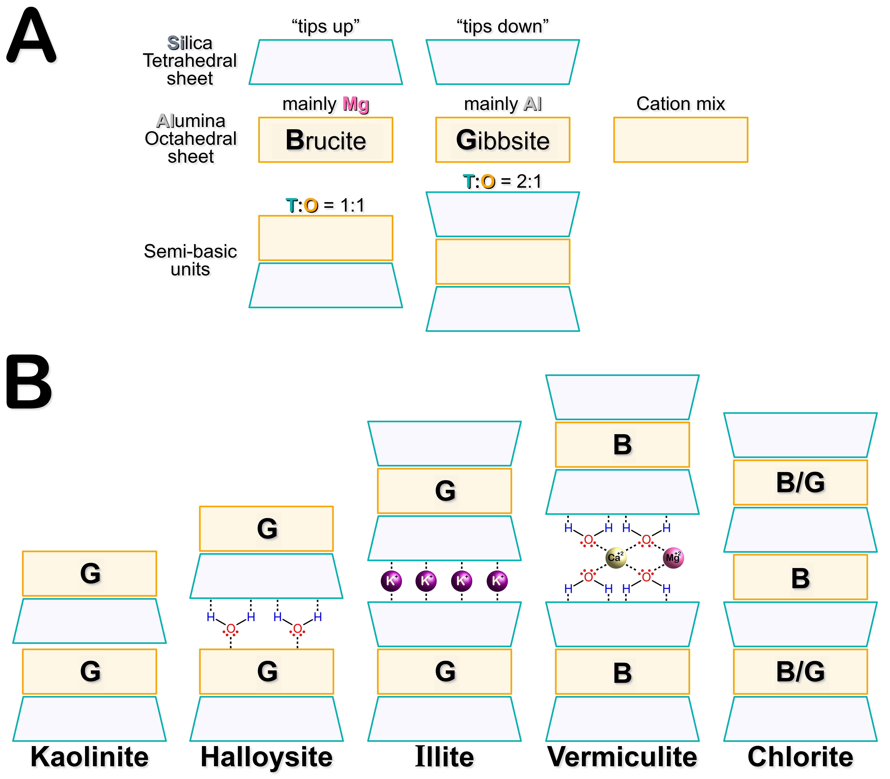
</figure>

**Figure 6. Higher Order Structure of Phyllosilicates.** The arrangement of stacked **silica tetrahedral** (<span id="Teal">T</span>) and **metal octahedral** (<span id="Or">O</span>) sheets are shown for various types of clay minerals. **(A)** Two common types of <span id="Or">O</span> sheets are the **aluminum** oxide **<a class="one" href="https://virtual-museum.soils.wisc.edu/display/gibbsite/" target="_blank" title="Go to VirtualMuseum site">gibbsite</a>** (**G**, <span id="Gray">Al</span><sub>2</sub>(<span id="Red">O</span><span id="Blue">H</span>)<sub>6</sub>), and the **magnesium** oxide **<a class="one" href="https://virtual-museum.soils.wisc.edu/display/brucite/" target="_blank" title="Go to VirtualMuseum site">brucite</a>** (**B**, <span id="Purple">Mg</span><sub>2</sub>(<span id="Red">O</span><span id="Blue">H</span>)<sub>6</sub>). Other types of **metals** (e.g. <span id="Rust">Fe</span><sup>+2</sup>, <span id="Rust">Fe</span><sup>+3</sup>, <span id="Magenta">Mn</span><sup>+2</sup>) can also replace <span id="Gray">Al</span> giving rise to "*mixed*" <span id="Or">O</span> sheets. Regardless, when paired (<span id="Teal">T</span>:<span id="Or">O</span>) or "*sandwiched*" (<span id="Teal">T</span>:<span id="Or">O</span>:<span id="Teal">T</span>) semi-basic units are combined with other semi-basic units different types of **clays** **(B)** are formed.**[@mitchell_fundamentals_2005]** The ability of **clay** particles to adsorb water molecules and various ions, like <span id="Rasp">K</span><sup>+</sup>, <span id="Ly">Ca</span><sup>+2</sup>, and <span id="Violet">Mg</span><sup>+2</sup>, along their inner (i.e. inter-layer spaces) and outer surfaces makes these minerals an important functional feature of healthy <span id="Br">soils</span>.**[@feng_chemical_2005; @churchman_game_2018]** 
</div>
<!--------------------------------------------------->
<!-------- END - FIG 6 - CLAY HO STRUCTURE  --------->
<!--------------------------------------------------->


&nbsp; &nbsp; Another important aspect of <span id="Br">soils</span> is its **pH**. The concentrations of **hydronium** and **hydroxyl** ions can greatly influence the functional chemistry of **phyllosilicates** (e.g. ion exchanging capacity). As shown below **pH** can alter the overall charge of the **clay** particles by changing the ionization state of the metal bound hydroxyl groups:


$$\tag{8} \phantom{1} \text{Metal}-\text{OH} \phantom{1} + \phantom{1} \text{H}_3\text{O}^+ \phantom{1} \rightleftharpoons \phantom{1} \text{Metal}-\text{O}\text{H}_2^+ \phantom{1} + \phantom{1} \text{H}_2\text{O}$$
$$\tag{9} \phantom{1} \text{Metal}-\text{OH} \phantom{1} + \phantom{1} \text{OH}^- \phantom{1} \rightleftharpoons \phantom{1} \text{Metal}-\text{O}^- \phantom{1} + \phantom{1} \text{H}_2\text{O}$$


Changing the overall charge state of the **<a class="one" href="https://passel2.unl.edu/view/lesson/0cff7943f577/4" target="_blank" title="Go to Plant and Soil Science eLibrary">platy</a>** **clay** units affects how they are assembled into higher ordered structures. For example, microscopic **clay** layers that have the same overall net charge will repel each other, causing particles to disperse. Alternatively, if the microscopic **clay** layers have oppositely charged surfaces the particles will aggregate (face-to-face), or perhaps form a loose <u>flocculated</u> structure or "*fabric*" due to attractive electrostatic forces (**Fig 7**).**[@mitchell_fundamentals_2005]** Although **clays** provide <span id="Br">soils</span> with the ability to store water and essential micro-nutrients (e.g. <span id="Rasp">K</span><sup>+</sup>), they can also be detrimental to <span id="Br">soils</span> if found in very high concentrations (i.e. cement-like, which impedes water, air and root movements). Moreover, <span id="Br">soils</span> not only contain **clay** particles (<2 &micro;m), but also other minerals such as **carbonate**-rich **silts** (~2 to 50 &micro;m), **quartz**-rich **sands** (~50 &micro;m to 2 mm), as well as many different types of **organic** compounds. And it is this complex mix of components that ultimately determines the overall structure (e.g. gas permeable or compacted) and function (e.g. good growth medium) of <span id="Br">soils</span>. 

<a id="Fig7SFab"> </a>
<!---------------------------------------------------->
<!--- FIG 7 - Large Scale Soil Particle Structure  --->
<!---------------------------------------------------->
<div style="border: 2px solid gray; padding: 5px;">

<figure>
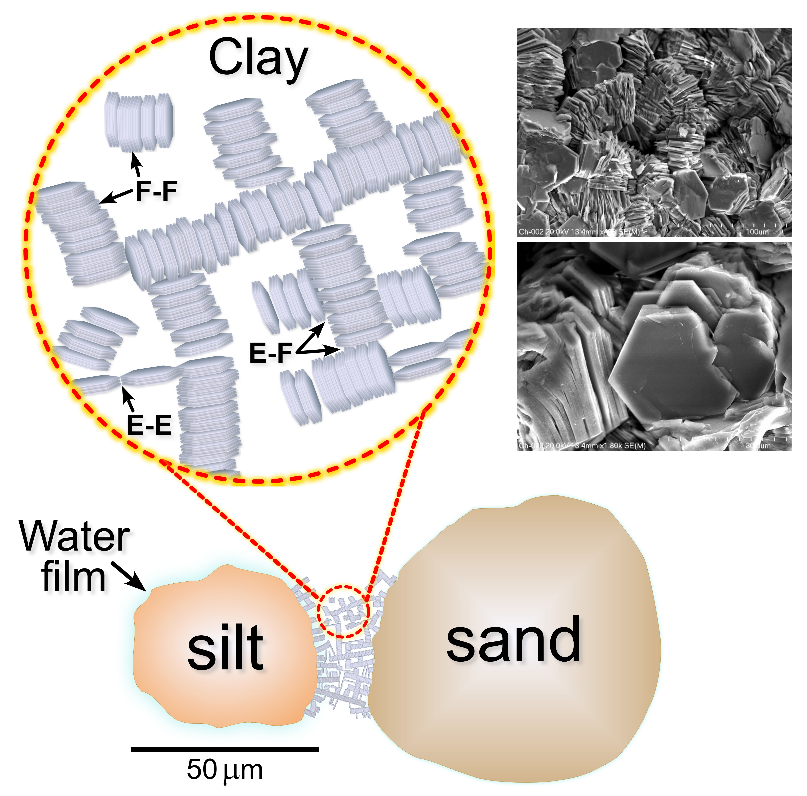
</figure>

**Figure 7. Soil Particle Structure.** The arrangement of particles and pore spaces (i.e. **fabric** elements) determines many of the physical properties and behaviours of <span id="Br">soils</span> (e.g. texture, <span id="Red">O</span><sub>2</sub> levels, moisture levels). Although **silts** and **sands** are made up of single grains, **clay** aggregates can form much more complicated structures, or **fabrics**, owing to their potentially charged states. Specifically, attractive electrostatic forces can cause platy **clay** micro-particles to aggregate either edge-to-edge (**EE**), face-to-face (**FF**), or edge-to-face (**EF**).**[@mitchell_fundamentals_2005]** Extended **EF** arrangements are sometimes called "*card-house*" or "*book-house*"-like structures owing to the arrangement of single or multiple (i.e. <u>packets</u>) parallel **clay** plates. Higher order "*book-house*"-like arrangements of **clay** particles can significantly influence particle-particle interactions, particularly when the charged surfaces of the **clay** minerals (e.g. <span id="Silver">Al</span>-<span id="Red">O</span><span id="Blue">H</span> edges) interact with the de-protonated functional groups (e.g. carboxyls, **R**-**C**<span id="Red">OO</span><sup>-</sup>) of <span id="Br">soil</span> **organic** compounds. These types of associations play an important role in the stabilization of **organic matter** (**OM**) within <span id="Br">soils</span> and the formation of micro-aggregates (i.e. complexes of **silicates**, **clays**, **OM** and other minerals like iron oxides).**[@eusterhues_stabilisation_2003; @mikutta_stabilization_2006; @kleber_conceptual_2007; @lehmann_organic_2007]** The large scale **fabric** of <span id="Br">soil</span> also includes small air pockets that support aerobic **microbes**, as well as water that can provide some degree of connectivity between various sized particle aggregates. Two scanning electron microscope (SEM) images of <span id="Rust">Fe</span>-rich **chlorite** from an alpine fissure of the Mt. Blanc massif near Chamonix, France are shown (top right) for comparison. Both photos (top: 70 &micro;m wide, bottom: 250 &micro;m wide field views) are part of an extensive "*Images of Clay*" archive hosted by the <b><a class="one" href="https://www.minersoc.org/images-of-clay.html" target="_blank" title="Go to Clay Mineral Archive">Mineralogical Society of UK & Ireland </a></b> (<b>https://www.minersoc.org/images-of-clay.html</b>). Both photos, provided by Michal Skiba from the Institute of Geological Sciences (Jagiellonian University, Kraków), clearly show the characteristic **platy** appearance of these types of **phyllosilicates**.  

</div>
<!------------------------------------------------>
<!-------- END - FIG 7 - SOIL PARTICLES  --------->
<!------------------------------------------------>

<!------------------------------------------------------>
<!-------------- SECTION 3B - SOIL BIOTA  -------------->
<!------------------------------------------------------>
<a id="SBio"> </a>  
**<u>3B** <span id="Br">Soil</span> **Biota</u>:** <span id="Br">Soils</span> are not only a reservoir of water and important nutrients, but also home to an enormous variety of life.**[@wolters_biodiversity_2001; @bardgett_belowground_2014; @orgiazzi_global_2016; @fao_state_2020; @hopwood_farming_2021]** Although the exact number of species is unknown, conservative (lower limit) estimates suggest that there are at least 3.9 million species, mostly microscopic that reside within <span id="Br">soils</span>.**[@orgiazzi_global_2016]** Things get allot more interesting if we also consider the amount of genetic diversity found within <span id="Br">soils</span>. Besides "*traditional*" cell based life forms there are also **viruses**, particularly **bacteriophages** (i.e. viruses that only infect bacteria, simply known as **phages**). These largely over looked genetic entities greatly <u>outnumber</u> their microbial "*prey*", with virus-to-microbe ratios (**VMR**) ranging from 10:1 (conservative) to upwards of 1000:1.**[@cobian_guemes_viruses_2016; @williamson_viruses_2017; @pratama_neglected_2018; @anthony_enumerating_2023]** Since there are millions of bacterial species found within <span id="Br">soil</span>, this means the number of unique **viral** "*species*" may number >100 million. The uncertainty associated with estimating the number of unique **viruses** is due to the lack of any universal gene sequences (e.g. similar to bacterial 16S rRNA genes)**[@fox_phylogeny_1980; @lane_rapid_1985]** to carry out phylogenetic analysis.  

<!---------------------------------------------->
<!-------- SECTION 3B.1 - SOIL VIRUSES  -------->
<!---------------------------------------------->
<a id="SVir"> </a>
**<u>3B.1** <span id="Br">Soil</span> **Viruses</u>:** These sub-micrometer sized entities (typically <0.3 &micro;m) possess either double or single stranded DNA or RNA genomes. They also vary in shape, structure (e.g. presence or absence of tail structures, or a lipid bilayer), life "*style*" (i.e. **Lytic** or **Temperate**), and their ability to cause disease (i.e. virulent, chronic, or latent infections).**[@lopez-garcia_viruses_2012; @chappell_biology_2015; @chaitanya_structure_2019]** However, one requirement they all share is the need for a host cell to complete their "*life*" cycle (i.e. obligate intracellular parasites). As a result **viruses** have evolved ways of not only recognizing and binding to specific host cells, but also ways of evading or neutralizing anti-viral defences that cells evolve in response to them. **Viruses** are capable of infecting hosts either <u>horizontally</u> (i.e. extracellular infectious particles, or **virions**), or <u>vertically</u> (i.e. DNA is <u>integrated</u> into a host chromosome or fashioned into an episome and passively copied during cell division). **Virulent viruses** typically follow a **lytic** cycle, where the metabolism of a host cell is "*commandeered*" by the **virus** to produce infectious **virions** that are released via host cell <u>lysis</u> (i.e. cell bursts and dies). By contrast, **Temperate viruses** follow a **lysogenic** "*life*" style where the viral DNA is either integrated into the host cell genome, which is called a **provirus**, or fashioned into an extra-chromosomal **plasmid** (i.e. **episome**).**[@weinbauer_ecology_2004; @clokie_phages_2011]** Although the **provirus** is relatively "*dormant*" within the host, it can "*switch*" to a **lytic**-like cycle in response to a number of conditions (e.g. exposure to mutagens, temperature, trophic levels) (**Fig. 8**).**[@cochran_seasonal_1998; @bongiorni_viral_2005; @liu_effect_2005; @williamson_incidence_2007; @erez_communication_2017; @brady_molecular_2021]**  

<a id="Fig8Phages"> </a> 
<!----------------------------------------------------------------->
<!------------ FIG 8 - Soil Lysogenic-Lytic Signaling ------------->
<!----------------------------------------------------------------->
<div style="border: 2px solid gray; padding: 5px;">

<figure>
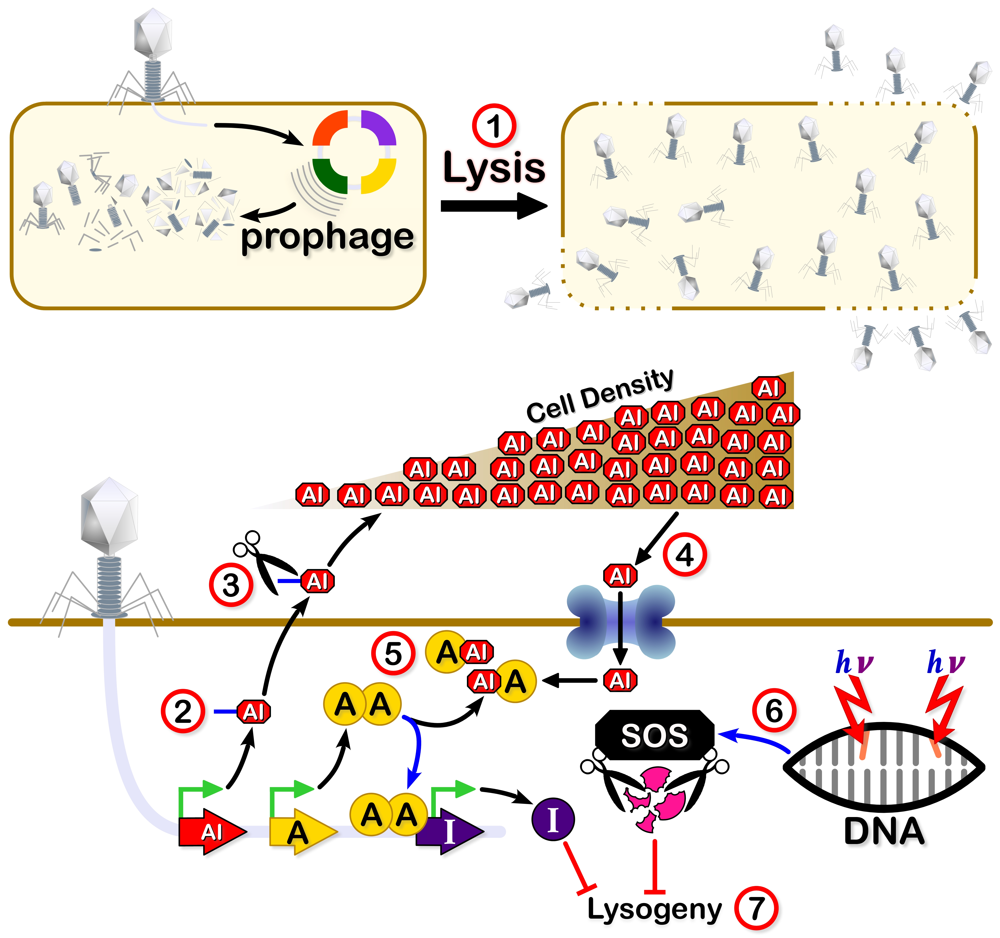
</figure>

**Figure 8. Bacteriophage Lysogenic-Lytic Transition.** Arguably the most important event in the "*life*" cycle of a **Temperate bacteriophage** is its transition from a relatively dormant **lysogenic** state (i.e. **provirus**) to an active **lytic** state (i.e. produce infectious viral particles or **virions**, <b>&#9312;</b>).**[@weinbauer_ecology_2004; @brady_molecular_2021]** In a **lytic** state a **bacteriophage** can be viewed as a opportunistic <u>parasite</u>, since it will assemble new **virions** at the expense of the host cell (i.e. trigger cell death). By contrast, when a **bacteriophage** enters a **lysogenic** state it resembles a relatively stable <u>mutualistic</u> **symbiont**. In this non-virulent state the **viral** genome is either integrated within a host chromosome or housed within a separate **episome**. The resulting **provirus** silences **lytic** gene expression using transcriptional repressors, and can be passively replicated along side the host DNA during cell division.**[@casjens_prophages_2003; @brady_molecular_2021]** Although the **prophage** is susceptible to mutational decay it often remains functional since it is thought to confer an evolutionary **<a class="one" href="https://ucmp.berkeley.edu/online-exhibits/" target="_blank" title="Go to UCMP Understanding Evolution">fitness</a>** advantage to the host cell. This is largely due to the ability of the **provirus** to protect the host from further viral infections (i.e. super-infection immunity).**[@casjens_prophages_2003; @bondy-denomy_when_2014; @bondy-denomy_prophages_2016; @al-shayeb_diverse_2022]** In addition, **accessory genes** (**AG**, **Fig. 9**) carried by the **provirus** can endow the host with new functions, such as the ability to produce toxins,**[@obrien_shiga-like_1984; @waldor_lysogenic_1996]** or metabolize new compounds (e.g. antibiotics, **C**arbon energy sources).**[@ghosh_prevalence_2008; @haaber_bacterial_2016; @jin_diversities_2019; @wu_structural_2022; @sun_underexplored_2023]** Switching from a **lysogenic** state to a **lytic** state can also be <u>induced</u> by exposure to harmful DNA damaging agents (e.g. UV, mitomycin C), or various environmental stressors (e.g. changing cell density, or temperature).**[@lederberg_genetic_1953; @otsuji_induction_1959; @cuesta_incidence_1995; @williamson_incidence_2007; @knowles_lytic_2016; @howard-varona_lysogeny_2017]** Although DNA damage is a common cause of **lytic** induction there appears to be no universal molecular mechanisms regulating this "*switching*" process among **phages**. Most of our understanding of this **lytic** "*switching*" phenomena has emerged from the study of a single *E. coli* **bacteriophage** called *lambda* (<b>&lambda;</b>).**[@lederberg_genetic_1953; @johnson_lambda_1981]** The elaborate regulatory circuitry used by <b>&lambda;</b> involves numerous transcriptional activator and repressor proteins, translational suppressors, as well as targeted proteolysis and changes in mRNA stability.**[@dodd_revisited_2005; @casjens_bacteriophage_2015]** However, more recent studies of other types of **phages** has revealed new "*switching*" signaling networks.**[@broussard_integration-dependent_2013; @erez_communication_2017; @ofir_contemporary_2018; @silpe_host-produced_2019]** For example, infection of *Bacillus subtilis* by a **phage** called *phi3T* triggers the production of a small viral peptide (auto-inhibitor, or **AI**) called **arbitrium** (<b>&#9313;</b>).**[@erez_communication_2017]** It is secreted by the host cell as an immature pro-peptide (<b>&#9313;</b>) where it is processed by proteolytic enzymes (<b>&#9314;</b>). As the active **AI** accumulates (i.e. increasing cell density) its levels within the cell also increases courtesy an oligopeptide permease transporter (**OPP**, <b>&#9315;</b>). Within the cell it binds to a transcription factor (**A**) and prevents it (as a functional dimer) from activating a key inhibitor (**I**) of **lysogeny** (<b>&#9316;</b>).**[@erez_communication_2017]** The ability of the **phage** to monitor the levels of infected neighbouring cells using this **AI** likely increases the chances of productive infection by progeny **virus** (i.e. **<a class="one" href="https://ucmp.berkeley.edu/online-exhibits/" target="_blank" title="Go to UCMP Understanding Evolution">fitness</a>** advantage). Its somewhat analogous to &lambda; **phage** infected *E. coli* since it has been shown, using elegant single cell fluorescent assays, that the number of **phages** infecting a single host cell significantly affects the **lysogenic** fate of the **phage** (i.e. **lysogeny** increases dramatically when the multiplicity of infection, or **MOI**, is greater than 1).**[@zeng_decision_2010; @ofir_contemporary_2018]** A somewhat similar density-dependent **AI**, known as **3,5-dimethylpyrazin2-ol** (**DPO**), is produced by the **vibriophage** *VP882*.**[@silpe_host-produced_2019]** Although the signaling network is unique it does involve a series of DNA binding factors that either activate of inhibit gene transcription. However, the **vibriophage** uses **DPO** to switch to a **lytic** fate, presumably to help the **virus** find a new host. **DPO** is known to inhibit *V. cholerae* biofilm formation and promote dissemination of the bacteria (**Note:** *V. cholerae* is the cause of human intestinal cholera).**[@papenfort_vibrio_2017]** Lastly, induction of the so called **SOS response** (i.e. bacterial DNA repair mechanism, <b>&#9317;</b>) is known to target key **lytic** cycle transcriptional repressors for proteolytic degradation.**[@roberts_proteolytic_1975; @sauer_cleavage_1982; @erill_aeons_2007]**  
</div>
<!-------------------------------------------------------->
<!-------- END - FIG 8 - LYTIC/LYSOGENIC VIRUSES --------->
<!-------------------------------------------------------->


>*Do <span id="Br">soil</span> <b>viruses</b> regulate microbial mortality and nutrient cycles*?

&nbsp; &nbsp; The short answer to this question is a "*tentative*" yes. Like all science it all comes down to measuring the amount of uncertainty, and unfortunately terrestrial <span id="Br">soils</span> are extremely "*opaque*" mediums. Local physical-chemical gradients create a tremendous variety of <span id="Br">soil</span> **niches** that makes studying them very challenging. Despite these difficulties recent **metagenomic** studies do suggest that <span id="Br">soil</span> **viruses** play a role in **C**arbon cycling.**[@kimura_ecology_2008; @emerson_host-linked_2018; @kuzyakov_viruses_2018; @trubl_soil_2018; @emerson_soil_2019; @ter_horst_minnesota_2021; @bi_diversity_2021; @wei_t4-like_2021; @wu_dna_2021; @wirth_viruses_2022; @dominguez-huerta_diversity_2022; @roux_diversity_2022]** Like their marine counterparts, <span id="Br">soil</span> **viruses** are thought to regulate biogeochemical cycles by controlling microbial mortality and metabolism.**[@proctor_viral_1990; @suttle_infection_1990; @fuhrman_marine_1999; @suttle_viruses_2005; @dominguez-huerta_diversity_2022; @puxty_functional_2023]** The well known genetic versatility of **viruses** certainly supports this claim. **Viruses** not only have specialized genes that regulate viral replication, but also <u>accessory</u> genes that augment host cell metabolism,**[@fridman_myovirus_2017; @trubl_soil_2018; @kieft_ecology_2021; @wu_structural_2022; @puxty_functional_2023; @sun_underexplored_2023]** and counter-act host cell anti-viral defences.**[@samson_revenge_2013; @hampton_arms_2020]** The first of these latter two types of genes, which are known as **A**ccessory **M**etobaolic **G**enes (**AMG**),**[@breitbart_exploring_2007]** are thought to "*prime*" cellular metabolism to optimize **virion** production.**[@sullivan_prevalence_2006; @breitbart_exploring_2007]** For example, marine **cyanophages** express a photosynthetic genes known as **psbA** and **psbD** that encode <u>functional</u> **<a class="one" href="https://pdb101.rcsb.org/motm/59" arget="_blank" title="Go to Protein Database 101">Photosystem II</a>** (**PSII**) core reaction centre protein subunits.**[@mann_marine_2003; @lindell_photosynthesis_2005]** The **PSII** complex catalyzes one of the most important reactions in photosynthesis, namely the <u>oxidation</u> of water molecules (i.e. <span id="Blue">H</span><sub>2</sub><span id="Red">O</span> is the key **electron** donor).**[@guskov_cyanobacterial_2009; @fischer_evolution_2016]** The products of the reaction includes <span id="Red">O</span>xygen, which is a hallmark of photosynthesis, and **electrons**. The latter are used to "*reset*" the chlorophyll subunits of **PSII** since they lose **electrons** during the initial photo-activation step of photosynthesis.**[@ferreira_architecture_2004; @barber_engine_2006]** The overall chemical reaction, commonly referred to as **photolysis** (**Eq. 10**), involves a small **electron** carrier molecule known as **plastoquinone** (**Q**) which delivers the photo-activated electrons to downstream **electron-transfer chain** centres that produce <span id="Dred">ATP</span> (**Note:** Planck's Energy equation, **E = &planckh;&nu;**).**[@fischer_evolution_2016]** 

$$\tag{10} \phantom{1} 2\text{Q} \phantom{1} + \phantom{1} 2\text{H}_2\text{O} \phantom{1} + \phantom{1} h\nu \phantom{1} \Rightarrow \phantom{1} 2\text{QH}_2 \phantom{1} + \phantom{1} \text{O}_2$$

<a id="Fig9AMG"> </a> 
<!----------------------------------------------------------->
<!------------------ FIG 9 - VIRAL AMG ---------------------->
<!----------------------------------------------------------->
<div style="border: 2px solid gray; padding: 5px;">

<figure>
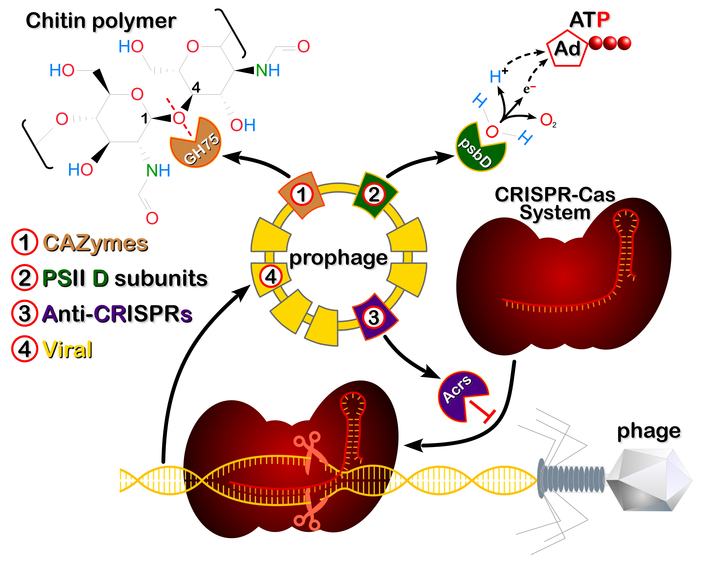
</figure>

**Figure 9. Viral Accessory Metabolic Genes (AMG).** These extra genes are not involved in the production of infectious **virions**, but rather help optimize the metabolism and health of the host cell for **virion** production.**[@puxty_functional_2023; @sun_underexplored_2023]** For example marine **cyanophages** are known to harbour **AMG** that are homologues of bacterial genes involved in photosynthesis and energy metabolism (e.g. **psbD**, <b>&#9313;</b>).**[@mann_marine_2003; @thompson_phage_2011; @puxty_shedding_2015; @fridman_myovirus_2017]** As for <span id="Br">soil</span> **viruses** many **AMG** are thought to aid in **C**arbon metabolism, including various **CAZymes** (e.g. **GH75**, <b>&#9312;</b>) that hydrolyze the glycosidic bonds of polysaccharides like **chitin** (i.e. major biopolymer found in fungi and insects)**[@trubl_soil_2018; @jin_diversities_2019; @bi_diversity_2021; @wu_dna_2021; @wu_structural_2022; @puxty_functional_2023; @sun_underexplored_2023]** More recent studies have shown that <span id="Br">soil</span> **phages** also harbour **AMG** that may play an important role in the acquisition of <span id="Purple">P</span>hosphate, an important limiting nutrient in terrestrial ecosystems.**[@han_distribution_2022; @liang_hidden_2024]** In addition, **phages** also possess **accessory genes** (**AG**) that help them evade host cell anti-viral defences and combat competing **phages**.**[@borges_discovery_2017; @wiegand_structures_2020; @patel_prophages_2023]** For example, many **phages** contain **anti-CRISPR** genes (**Acrs**, <b>&#9314;</b>)**[@bondy-denomy_bacteriophage_2013; @seed_bacteriophage_2013; @wang_structural_2016]** that inhibit **CRISPR**-**Cas** systems used by bacteria to specifically target and destroy viral DNA and RNA.**[@barrangou_crispr_2007; @brouns_small_2008; @hille_biology_2018; @jiang_crisprcas9_2017]**  
</div>
<!----------------------------------------------->
<!---------- END - FIG 9 - VIRAL AMG  ----------->
<!----------------------------------------------->


The fact that **viruses** like **cyanophages** and their microbial hosts (i.e. **cyanobacteria**, or <span id="Lb3">Blue</span>-<span id="Teal">green</span> **algae**) have a long evolutionary history of exchanging genetic information suggests that **AMG** likely confer some sort of fitness advantage to both **viruses** and host cells alike (e.g. reservoir of genetic diversity to draw from).**[@sullivan_prevalence_2006; @breitbart_exploring_2007; @wirth_viruses_2022]**  

&nbsp; &nbsp; As for <span id="Br">soil</span> **viruses** we do know that they, like their microbial hosts,**[@thompson_communal_2017; @tas_metagenomic_2021]** are abundant and very diverse.**[@fierer_metagenomic_2007; @kuzyakov_viruses_2018; @williamson_viruses_2017; @pratama_neglected_2018; @roux_diversity_2022]** As alluded to above, much of this new information has come from **metagenomic** studies. These advanced DNA sequencing techniques allow researchers to directly profile entire **viral** communities within bulk <span id="Br">soil</span> samples. The one key benefit of using this method is that it essentially circumvents the "*culture*" problem associated with the vast majority of bacteria (i.e. do not grow *in vitro* using current culture techniques).**[@williamson_sampling_2003; @oliver_viable_2005]** Moreover, the genomes of most bacteria contain multiple **proviral** sequences,**[@casjens_prophages_2003]** which means that DNA sequencing can identify them. Nevertheless, **metagenomic** methods do have limitations. Firstly, DNA sequences can only <u>predict</u> gene function provided there are similar genes (i.e. homologues) of known function within existing databases. The fact that a large percentage of **viral** genomes are unique (i.e. no database matches) makes this a particularly daunting challenge. In addition, despite their relatively small sizes (i.e. few have genomes >300 kbp),**[@lopez-garcia_viruses_2012; @chappell_biology_2015; @chaitanya_structure_2019]** there is an enormous amount of diversity among **viral** sequences that often results in a high number of non-overlapping short contiguous sequences (**contigs**). This makes it difficult to assembly them into a complete genome. Despite these and other technical difficulties **metagenomic** studies have been able to clearly show that **viral** communities vary significantly across different physical, chemical and biological gradients (e.g. moisture, pH, **rhizosphere**).**[@trubl_soil_2018; @bi_diversity_2021; @ter_horst_minnesota_2021; @wu_dna_2021; @santos-medellin_spatial_2022]** This is likely a result of the seemingly endless number of ecological **<a class="one" href="https://evolution.berkeley.edu/glossary/niche/" target="_blank" title="Go to Evolution 101">niches</a>** that <span id="Br">soils</span> provide **viruses** and their microbial hosts (i.e. varying physical and chemical makeup, shifting seasonal wet/dry cycles, **biotic** interactions).  
&nbsp; &nbsp; These arguments are also bolstered by the fact that bacteria account for ~15% of the global **biomass** (i.e. ~70 $\times$ 10<sup>12</sup> kg or **G**iga**t**ons of **C**arbon),**[@bar-on_biomass_2018]** which is a good indicator (albeit indirect) of the likely importance of **bacteriophages** to functioning <span id="Br">soils</span>. Moreover, since **viruses** greatly outnumber their microbial hosts its conceivable that <span id="Br">soil</span> **viruses**, like their marine counterparts, play a significant role in the turn-over of microbes (i.e. population control). We know that in the upper layers of the oceans viral **lysis** of photosynthetic microbes can divert significant amount of **C**arbon away from other microbe consumers (e.g. krill), resulting in elevated levels of dissolved inorganic matter (**DOM**). This "*short-circuiting*" of traditional marine food webs (i.e. "*viral shunt*")**[@wilhelm_viruses_1999]** affects not only the productivity of marine **autotrophs** (i.e. phytoplankton), but also the levels of **<a class="one" href="https://pubchem.ncbi.nlm.nih.gov/compound/1068" target="_blank" title="Go to PubChem">Dimethylsulphide</a>** (**DMS**) that accumulate and transit atmospheric marine boundaries. **DMS** is not only a potent **antioxidant**,**[@sunda_antioxidant_2002]** but also a precursor of <span id="Gold">S</span>ulphate (<span id="Gold">S</span><span id="Red">O</span><sub>4</sub>) aerosols (i.e. product of atmospheric oxidation) that serve as important cloud condensation nuclei within the troposphere (i.e. affects climate via cloud formation).**[@lovelock_atmospheric_1972; @charlson_oceanic_1987; @hill_virus-mediated_1998; @zhao_changes_2024]**  
&nbsp; &nbsp; Do <span id="Br">soil</span> **viruses** impact **C**arbon cycling and climate the same way that marine **viruses** do? Although terrestrial **viral** ecology is still in its infancy, there have been a few **metagenomic** studies carried out on <span id="Br">soils</span> samples that have identified functional viral **AMG**. One study by **Emerson** and colleagues (2018) identified 1,907 viral **contigs** (species level populations) from 201 bulk <span id="Br">soils</span> samples taken from northern permafrost peatlands.**[@emerson_host-linked_2018]** The vast majority (~96%) of the predicted proteins were **viral** specific in nature. However, from the remaining (~4%) sequences they did identify 14 potential viral **glycoside hydrolase** like genes (**GH**) with "high confidence" (i.e. common viral genes had to be found both upstream and downstream of the putative gene). The sequence similarities (i.e. 100% confidence scores) to prokaryotic **GH** genes were confirmed using **PHYRE2** (Protein Homology/analogY Recognition Engine v2.0).**[@kelley_phyre2_2015]** Close inspection of the sequences also confirmed the presence of key catalytic amino acid residues within the proposed active site of the enzymes. More importantly, the researchers cloned and expressed one of the viral **GH** genes *in vitro* to formally test it for enzymatic activity. This specific **GH** group 5 (**GH5**) family member did indeed display **endomannanase** activity *in vitro* (i.e. cleaves glycosidic bonds between two or more carbohydrates, specifically &beta;-1,4-linked mannose units), which the authors suggest may be involved in the degradation of complex <b>plant</b>-derived **C**arbon polymers that accumulates within the <span id="Br">soil</span>.**[@emerson_host-linked_2018]** If this inference is correct than it could have important implication to both the ecological of these **biomes** and our current changing climate, since northern peatlands are known to store vast quantities of terrestrial organic **C**arbon.**[@hugelius_large_2020]**  
&nbsp; &nbsp; Additional support for the idea that viral **<a class="one" href="http://www.cazy.org/" target="_blank" title="Go to CAZyme">Carbohydrate-Active enZyme</a>** (**CAZyme**)**[@drula_carbohydrate-active_2022]** genes influence <span id="Br">soil</span> **C**arbon cycling comes from a recent study by **Wu** and colleagues (2022).**[@wu_structural_2022]** Based on previous work the group had identified a large population of diverse **bacteriophages** within North American **grassland** soils. The field samples from this early study were subjected to heavy sequence analysis, which ultimately resulted in 2,631 viral **contigs** (>2.5 Kb) and 14 complete high-quality genomes.**[@wu_dna_2021]** Bioinformatic analysis of these sequences went on to identify several "*high confidence*" **AMG** (i.e. contained hallmark viral sequences both upstream and/or downstream of the putative **AMG**), many of them being homologous to metabolic genes that break down **C**arbon polymers, including **cellulose** and **chitin**. And it was the **chitinase**-like **AMG** (**GH75** family members) that became the focus of their latest study. **Chitin** is the second most abundant polysaccharide (**cellulose** being the first) found in nature (e.g. insect cuticles, fungal cell walls).**[@merzendorfer_chitin_2003; @el_knidri_extraction_2018]** So it would follow that **chitinase**-like **AMG**, which have recently been identified in **mangrove** <span id="Br">soil</span> **viruses**,**[@jin_diversities_2019]** could provide a microbe host with access to a valuable source of organic **C**arbon. Although **mangrove** forests are quite unique coastal ecosystems (i.e. dominated by woody halophytes) they, like northern peatlands, sequester enormous amounts of organic **C**arbon within their <span id="Br">soils</span>.**[@donato_mangroves_2011; @alongi_carbon_2014]** In fact on a per hectare basis **mangrove** forests store more **C**arbon, predominately below ground, than any other ecosystem (e.g. mean whole-ecosystem carbon stock: 956 Mg&middot;ha<sup>−1</sup>, compared with 241 Mg&middot;ha<sup>−1</sup> for rain forests, and 408 Mg&middot;ha<sup>−1</sup> for peat swamps).**[@alongi_carbon_2014]**  
&nbsp; &nbsp; Given the potential importance of **chitinase**-like **AMG** to **C**arbon cycling the investigators searched for these enzymes (**GH75**) within the large **<a class="one" href="https://genome.jgi.doe.gov/portal/IMG_VR/IMG_VR.home.html" target="_blank" title="Go to IMG/VR">Integrated Microbial Genomes and Virome</a>** (**IMG/VR**) database. They ended up finding 142 candidate **GH75**-like **AMG** that phylogenetic sequence analysis showed were closely related to bacterial **chitosanases** (i.e. probably acquired by **HGT**).**[@boto_horizontal_2009; @touchon_embracing_2017]** Bioinformatic analysis also identified three separate **Clades** of viral **chitosanases** based on the substitution patterns of four key catalytic amino acid residues (**Note:** <span id="Br">soil</span> viral **chitosanases** formed a separate group from those found in aquatic **viruses**). Ultimately the investigators cloned and expressed 10 of these 142 **GH75** **chitosanase**-like **AMG** to test for enzymatic activity *in vitro*. Unfortunately only 2 of the 10 candidate **AMG** produced soluble proteins that could be assayed *in vitro*, and only one of them, which they called **V-Csn**, showed **endo-chitosanase** activity.**[@wu_structural_2022]** In addition to carrying out site-directed mutagenesis experiments (i.e. confirm importance of catalytic residues) and generating **<a class="one" href="https://alphafold.ebi.ac.uk/" target="_blank" title="Go to AlphaFold Protein Structure Database">AlphaFold</a>****[@jumper_highly_2021]** based protein structure models, the researchers also solved the crystal structure of **V-Csn**. The high resolution crystal structure showed the catalytic residues clustered within a centrally located cleft, which helped the authors devise a plausible hydrolytic reaction mechanism. Although the amount of work detailed in this study is impressive the ecological significance of this viral **chitinase**-like **AMG** is still unclear. However, the fact that the **GH75**-like **V-Csn** was originally isolated from a Forest <span id="Br">soil</span> **metagenome** does provide some interesting context, since fungi are known to be the dominate decomposers within these habitats. Clearly **V-Csn** carrying **bacteriophages** could provide their microbial hosts with the ability to metabolize **chitin** rich fungal debris that accumulates within forest <span id="Br">soils</span> (i.e. source of organic **C**arbon and <span id="Gr3">N</span>itrogen).**[@wu_structural_2022]**  

&nbsp; &nbsp; Although many <span id="Br">soil</span> viral **AMG** have been identified, few have been functionally verified, and none (to my knowledge) have been quantified in terms of their impact on global ecosystem services. Given the death toll that **viruses** have inflicted on humans over the centuries, it's easy to loose site of the fact that we have also benefited greatly from **viruses**. Vaccines,**[@jenner_origin_1801; @riedel_edward_2005]** **phage** therapy,**[@dherelle_invisible_2011; @abedon_phage_2011; @dedrick_engineered_2019]** gene therapy,**[@bulcha_viral_2021]** **CRISPR-Cas** genomic editing,**[@jinek_programmable_2012; @zheng_precise_2024]** and new and improved nano-materials,**[@wen_design_2016]** have all come from, or been inspired by our study of **viruses**.
<br>

<!-------------------------------------------------->
<!-------- SECTION 3B.2 - SOIL MICRO-BIOTA  -------->
<!-------------------------------------------------->
<a id="SMicro"> </a>
**<u>3B.2** <span id="Br">Soil</span> **Bacteria** and **Fungi</u>:** Although **viruses** are the most abundant genetic entities found within <span id="Br">soils</span> (i.e. ~6 &times; 10<sup>29</sup>) they only account for a small fraction (~6%) of the estimated 20 Gigatons of <span id="Br">soil</span> biomass **C**arbon (Gt **C**).**[@bar-on_biomass_2018]** Most of the terrestrial biomass is **fungal** (~12 Gt **C**) or **bacterial** (~7 Gt **C**) in nature. Moreover, these two groups of **microbes** are considered the most important decomposers of <span id="Br">soil</span> **OM** (<span id="Br">S</span>**OM**). By metabolizing relatively large organic residues (e.g. cellulose, lignins, chitin) these micro-organisms release **C**<span id="Red">O</span><sub>2</sub> and simple inorganic forms of <span id="Gr2">N</span>itrogen (e.g. <span id="Gr2">N</span><span id="Blue">H</span><sub>4</sub><sup>+</sup>, <span id="Gr2">N</span><span id="Red">O</span><sub>3</sub><sup>-</sup>, amino acids), <span id="Purple">P</span>hosphorus (e.g. <span id="Blue">H</span><span id="Purple">P</span><span id="Red">O</span><sub>4</sub><sup>-2</sup>), and <span id="Gold">S</span>ulphur (e.g. <span id="Gold">S</span><span id="Red">O</span><sub>4</sub><sup>-2</sup>) that **plants** can readily take-up.**[@whalen_managing_2014]** This so called <span id="Br">soil</span> **mineralization** process is what makes the <span id="Gr2">B</span>**GCC** so important to all **ecosystems** (e.g. <u>functioning</u> food webs). Given the importance of <span id="Gr2">B</span>**GCC** to all <span id="Br">soil</span> life a more detailed discussion of them is provided below.  
<br>
&nbsp; &nbsp; Essentially <span id="Gr2">B</span>**GCC** encompass the flow of key chemical elements (i.e. **C**arbon, <span id="Blue">H</span>ydrogen, <span id="Red">O</span>xygen, <span id="Gr2">N</span>itrogen, <span id="Purple">P</span>hosphorus, and <span id="Gold">S</span>ulphur) between the **abiotic** (geological) and **biotic** domains of our planet. Although the origins of these chemical cycles are largely unknown, their importance is undeniable given that all cells requires these 6 key elements to build biomolecules (i.e. proteins, nucleic acids, carbohydrates and lipids). The basic chemistry that drives these cycles are coupled <u>red</u>uction and <u>ox</u>idation reactions, otherwise known as **redox** chemistry.**[@berner_biogeochemical_1989; @falkowski_microbial_2008]** These **redox** networks are powered by a continuous input of both matter and **energy** (e.g. solar radiation, plate tectonics) from the outside world (i.e. open thermodynamic system). Although most of the **energy** generated by the Earth's heat flow (i.e. ~0.087 Watts/m<sup>2</sup>) is lost to space as <u>waste</u> heat (i.e. no chemical work done),**[@rosing_rise_2006]** incoming **solar energy** is both plentiful (i.e. ~340 Watts/m<sup>2</sup>)**[@wild_global_2013]** and eminently more suitable given the limited **energy** efficiency of complex biochemical systems. Life on our planet quickly evolved in response to this reliable **energy** input, most notably <span id="Gr2">photo</span>**autotrophs** (~3.8 billions years ago).**[@rosing_rise_2006; @mills_proterozoic_2014; @ivlev_global_2015]** These early ancestors of present day **cyanobacteria** added to the chemical disequilibrium of our planet (e.g. ~20% <span id="Red">O</span><sub>2</sub> atmosphere), which certainly makes Earth quite unique when compared to other planetary objects within our own solar system (i.e. habitable).  

<!----------------------------------------------->
<!-------- SECTION 3B.2I - CARBON CYCLE  -------->
<!----------------------------------------------->
<a id="CC"> </a>
**<u>3B.2I Carbon (C) Cycling</u>:** Of all the chemical elements in nature **C**arbon is likely the most important one that cycles between the four major subsystems or spheres of our planet (i.e. <span id="Lb2">atmo</span>**sphere**, <span id="Teal2">hydro</span>**sphere**, <span id="Br">litho</span>**sphere** and <span id="Gr2">bio</span>**sphere**). Because of its unique chemical properties (i.e. tetravalent, covalent bond energies, and electronegativity) **C** often undergoes catenation (i.e. forms long **C** chains). The resulting "*atomic polymers*" provide a skeleton for creating much more complex molecules like glucose (**C**<sub>6</sub><span id="Blue">H</span><sub>12</sub><span id="Red">O</span><sub>6</sub>) via the addition of functional groups (e.g. hydroxyls, -<span id="Red">O</span><span id="Blue">H</span>) and cyclization (i.e. **C** ring structures). Yet the most important **C** containing molecule on the planet is arguable the simplest one, namely **C**arbon di<span id="Red">o</span>xide (**C**<span id="Red">O</span><sub>2</sub>). The levels of this simple greenhouse (i.e. heat absorbing/radiating) gas are regulated in large part by **redox** biochemistry, specifically <span id="Gr2">photo</span>**synthesis** (**red**uces **C** to form sugars) and cellular **respiration** (**ox**idation of biomolecules like sugars release **C**<span id="Red">O</span><sub>2</sub>). While the resulting <span id="Gr2">photo</span>**synthates** (i.e. sugars) are primarily used in the support of normal **plant** functions, a significant proportion of it (5-40%) is released by roots either passively via diffusion gradients (i.e. **exudates**), or by energy dependent mechanisms (i.e. active transport).**[@lynch_substrate_1990; @walker_root_2003; @bais_role_2006; @badri_regulation_2009]** **Exudates** are largely comprised of low molecular weight metabolites (i.e. sugars, amino acids and organic acids)**[@ryan_function_2001; @bais_role_2006; @jones_carbon_2009]** that are known to support active microbial communities in and around root systems, a region commonly referred to as the **Rhizosphere**.**[@hiltner_ober_1904; @hartmann_lorenz_2008; @broeckling_root_2008; @jones_carbon_2009; @badri_regulation_2009]**  

>"*...an area of intense activity (biological, chemical and physical) influenced by compounds <u>exuded</u> by roots and by microorganisms feeding on these compounds. This microenvironment is characterized by distinct conditions compared with the bulk soil, largely created by the plant roots and its various microbial associations*."**[@narula_role_2008]**


<!---------------------------------------------->
<!---------- TABLE 2 - SOIL EXUDATES ----------->
<!---------------------------------------------->
<a id="SExTab2"> </a>

<table class="Table">
    <thead>
      <tr style="text-align:left">
        <td colspan="3"><span id="BBlk20"><span id="Blk">TABLE 2. SOIL EXUDATES</span></td>
      </tr>
    <thead>
      <tr>
        <th style="width:40%" class="f18"><span id="Blk">EXUDATE</span></th>
        <th class="f18"><span id="Blk">DESCRIPTION</span></th>
      </tr>
    </thead>
    <tbody>
      <tr>
        <td class="tmid">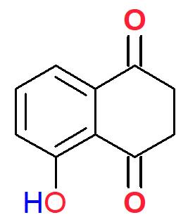</td>
        <td style="text-align:left"><b><a class="one" href="https://pubchem.ncbi.nlm.nih.gov/compound/Juglone" target="_blank" title="Go to PubChem site">JUGLONE</a></b> (hydroxy-1,4-naphthoquinone) is a <b>phenolic</b> compound and well known <b>allelochemical</b> (i.e. can exert either beneficial or harmful effects on other organisms) produced by <b>Black Walnut</b> trees (<i>Juglans nigra</i>). <b>Pliny the Elder</b>, a Roman naturalist who died in the 79 AD eruption of Mount Vesuvius, once wrote that "<i>the shadow of walnut trees is poison to all <b>plants</b> within its compass</i>."<sup>(ref. D)</sup> It's a colouring agent in food and cosmetics, and is sometimes used as a natural herbicide. It's also known to have anti-bacterial and anti-tumour activity.<sup>(Refs. D)</sup></td>
      </tr>
      <tr>
        <td class="tmid">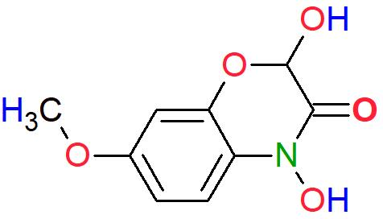</td>
        <td style="text-align:left"><b>Benzoxazinoids</b>, like <b><a class="one" href="https://www.ebi.ac.uk/chebi/searchId.do?chebiId=CHEBI:18048" target="_blank" title="Go to ChEBI">DIMBOA</a></b> (2,4-dihydroxy-7-methoxy-2H-1,4-benzoxazin-3(4H)-one), are secondary metabolites produced by many grass species (i.e. <i>Poaceae</i>, which includes cereal crops) that have been shown to provide protection against insect pests and microbes. They have also been shown to act as an <i>chemo-attractant</i> for the <b>plant</b> growth-promoting bacterium <i>Pseudomonas putida</i> KT2440.<sup>(Refs. E)</sup></td>
      </tr>
      <tr>
        <td class="tmid"></td>
        <td style="text-align:left">Low molecular weight <b>carboxylates</b>, such as <b>oxalate</b> ((<b>C</b><span id="Red">OO</span><sup>-</sup>)<sub>2</sub>), <b>malate</b> (<b>C</b><sub>2</sub><span id="Blue">H</span><sub>3</sub><span id="Red">O</span><span id="Blue">H</span>(<b>C</b><span id="Red">OO</span><sup>-</sup>)<sub>2</sub>) and <b>citrate</b> (structure on the left), are actively released by <b>plant</b> roots via dedicated plasma membrane channel and transporter proteins in response to toxic <span id="Silver">Al</span><sup>+3</sup>.<sup>(Refs. F)</sup> These small organic anions also help <b>plants</b> increase their uptake of <span id="Br">soil</span> <span id="Purple">P</span><sub>i</sub> by solubilizing bound forms of this important nutrient (i.e. bound to <span id="Br">soils</span> minerals or organic matter).<sup>(Ref. G)</sup>
        </td>
      </tr>
    </tbody>
</table>  

**Table 2 References.** **Refs. D[@rietveld_allelopathic_1983; @jose_allelopathy_1998; @paulsen_natural_2005; @bais_role_2006; @rudnicka_cellular_2014; @catanzaro_natural_2018]**, **Refs. E[@niemeyer_hydroxamic_1988; @ahmad_benzoxazinoid_2011; @neal_benzoxazinoids_2012]**, **Refs. F[@ma_role_2000; @sasaki_wheat_2004; @hoekenga_atalmt1_2006; @liao_phosphorus_2006; @liu_aluminum-activated_2009; @kochian_plant_2015]**, **Refs. G[@hoffland_biosynthesis_1992; @gerke_excretion_1994; @jones_organic_1998; @ryan_function_2001; @canarini_root_2019]**


<br>

<!--------------------------------------------------->
<!---------- TABLE 2. SOIL EXUDATES - END ----------->
<!--------------------------------------------------->

The **Rhizosphere** accounts for most of the organic **C** turnover within <span id="Br">soils</span>. Globally, the largest deposits of <span id="Br">soil</span> organic matter (**SOM**) are located in northern latitudes (e.g. permafrost, northern wetlands) due to low <span id="Br">soil</span> respiration rates. This is in contrast to warm tropical regions where <span id="Br">soil</span> respiration rates are much higher and significant amounts of organic **C** reside above ground in the form of <b>plant</b> biomass.**[@hashimoto_global_2015; @crowther_global_2019]** However, calculating the total amount of stored **SOM** globally or regionally is fraught with difficulties,**[@hashimoto_divergent_2023]** due to the non-linear nature of these systems and their sensitivity to perturbations.**[@anderies_topology_2013; @newbold_non-linear_2020; @hernandez-ramirez_nonlinear_2021]** Conceptually, there are two distinct 'pools' of **SOM**, namely particulate organic matter (**POM**) and mineral-associated organic matter (**MAOM**).**[@lavallee_conceptualizing_2020]** **POM** is made up of microbial necromass (e.g. dead bacterial and fungal cell fragments),**[@miltner_som_2012]** and <b>plant</b> residues (e.g. sloughed root cells, and <b>plant</b> "*litter*"),**[@grandy_molecular_2008]** all in the early stages of decomposition; while **MAOM** is composed of low molecular weight organic compounds (e.g. **exudates**, secretions, or **POM** leachate) that readily bind to mineral surfaces.**[@kleber_conceptual_2007; @kogel-knabner_organo-mineral_2008; @lehmann_contentious_2015; @lavallee_conceptualizing_2020; @villarino_plant_2021]** The <span id="Br">Soil</span> **C**ontinuum **M**odel (**SCM**) suggests that progressive <span id="Red">O</span>xidation of organic debris or residues results in the release of increasing amounts of smaller, water soluble organic compounds (i.e. <600 kDa) that bind strongly to mineral surfaces, particularly with increasing depth.**[@schrumpf_storage_2013; @lehmann_contentious_2015; @kramer_depth_2017]** Within this partitioned environment **MAOM** are less prone to microbial degradation and therefore more likely to persist for longer periods of time. However, the decomposition rate of **SOM** is sensitive to a number of different conditions (e.g. moisture and oxygen levels, pH, texture, depth).**[@feller_physical_1997; @schrumpf_storage_2013; @keiluweit_anaerobic_2017; @huang_elevated_2017; @cotrufo_soil_2019]** For example, **oxalic acid**, a well known <b>plant</b> **exudate** with strong metal chelating activity (i.e. forms metal complexes), can de-stabilize **MAOM** pools resulting in significantly elevated microbial respiration rates (i.e. **priming** effect).**[@keiluweit_mineral_2015]** This is in keeping with earlier studies that showed **oxalic acid**, as well as other kinds of low molecular weight metabolites (e.g. sugars, amino acids, organic acids), can "*prime*" microbial <span id="Br">soil</span> mineralization.**[@kuzyakov_review_2000; @hamer_priming_2002; @falchini_co2_2003; @hamer_priming_2005; @van_hees_carbon_2005; @pausch_plant_2013]** Although the levels of dissolved **OM** (**DOM**) are relatively low within <span id="Br">soils</span>, its rapid turn over suggests that they may account for a significant proportion (~30%) of the mineralized **C**<span id="Red">O</span><sub>2</sub> released by <span id="Br">soils</span>.**[@van_hees_carbon_2005]**  
&nbsp; &nbsp; Unfortunately, whether or not **C** is stored or respired depends on a complex web of **abioitic** and **biotic** interactions that researchers are only beginning to understand. For example, the makeup and function of a <span id="Br">soil</span> community can change in response to climate (e.g. temperature sensitive enzyme kinetics, and <span id="Br">soil</span> moisture), potentially resulting in net **C** mineralization (i.e. release of **C**<span id="Red">O</span><sub>2</sub>, **C**<span id="Blue">H</span><sub>4</sub>).**[@davidson_temperature_2006]** Several studies suggest that our warming climate has already negatively impacted the ability of <span id="Br">soils</span> to store **C** in a number of different ecosystems, particularly climate-sensitive Arctic and sub-Arctic regions (i.e. permafrost is a large **C** reservoir).**[@bellamy_carbon_2005; @crowther_quantifying_2016; @wiesmeier_projected_2016; @bond-lamberty_globally_2018; @garcia-palacios_evidence_2021]** 

<a id="Fig10SOM"> </a> 
<!------------------------------------------------>
<!------------ FIG 10 - SOM Dynmaics ------------->
<!------------------------------------------------>
<div style="border: 2px solid gray; padding: 5px;">

<figure>
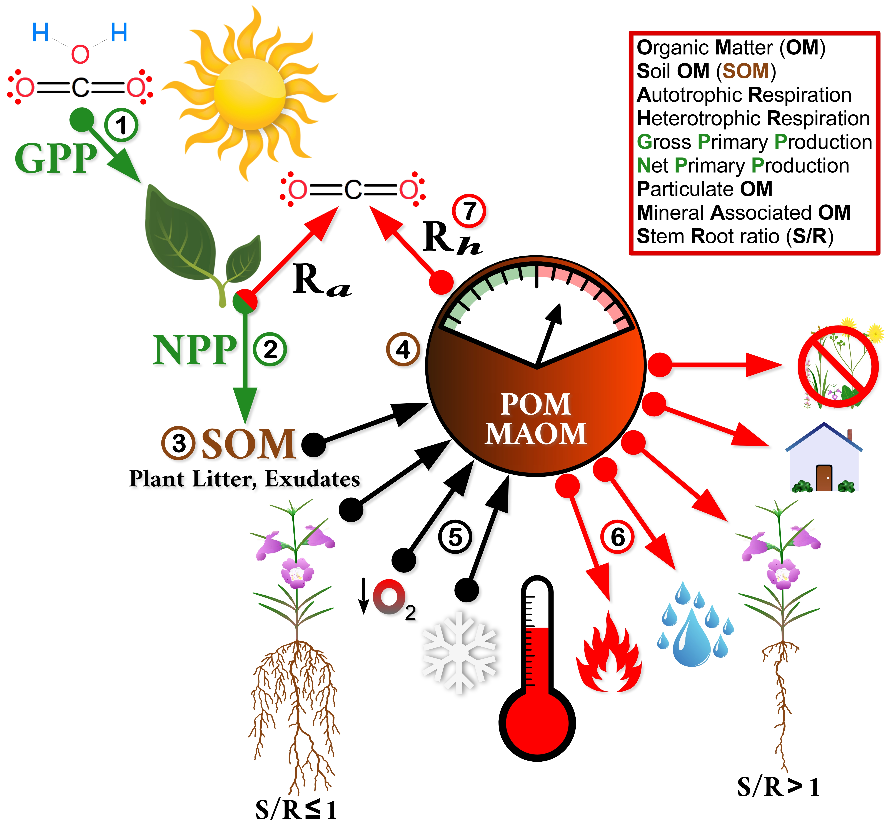
</figure>

**Figure 10. Soil Organic Matter (SOM) Dynamics.** In coming **solar radiation** is the main **energy** source responsible for the emergence of complex organized systems on our planet, such as climate and **photosynthesis**. The latter is of course responsible for fixing atmospheric **C**<span id="Red">O</span><sub>2</sub> with the aid of an electron donor (i.e. <span id="Blue">H</span><sub>2</sub><span id="Red">O</span>) in the form of simple sugars. The net result (i.e. **Net Primary Productivity:** <b>&#9313;</b> <span id="Gr2">NPP</span> = <b>&#9312;</b> <span id="Gr2">G</span>**ross** <span id="Gr2">PP</span> - **R**espiration<sub>autotrophic</sub>) are biomolecules that support complex food webs within ecosystems. A significant portion (upwards of ~40%) of this fixed **C** is released by <b>plant</b> roots as **exudates** (i.e. collectively termed **Rhizodeposits**, <b>&#9314;</b>). It along with the **OM** shed by **plants** (i.e. <b>plant</b> "*litter*")**[@grandy_molecular_2008]** and contained in dead organisms (i.e. **necromass**, predominately microbial)**[@miltner_som_2012]** accumulates within the **top**<span id="Br">soil</span> (<b>&#9315;</b>). This "*pool*" of **SOM** is gradually degraded by a community of decomposers (mostly microbes), eventually producing an assortment of **OM** that can be conveniently classified as either **particulate OM** (**POM**) or **mineral-associated OM** (**MAOM**, <b>&#9315;</b>).**[@kleber_conceptual_2007; @kogel-knabner_organo-mineral_2008; @lehmann_contentious_2015; @lavallee_conceptualizing_2020; @villarino_plant_2021]** The latter (**MAOM**) is distinguished from the former by its microscopic size (i.e. <600 kDa) and ability to strongly bind <span id="Br">soil</span> minerals (i.e. **clay** fraction). **MAOM** is less prone to microbial degradation and therefore more likely to persist for longer periods of time within <span id="Br">soils</span>. Nevertheless, the stability of these two pools of **OM** can vary considerably depending upon certain **biotic** and **abiotic** factors (<b>&#9316;</b>, <b>&#9317;</b>). Notably <span id="Br">soil</span> moisture,**[@huang_elevated_2017; @crowther_global_2019]** mineral content,**[@feller_physical_1997; @torn_mineral_1997; @richter_rapid_1999; @schrumpf_storage_2013; @kramer_depth_2017]** as well as temperature,**[@bellamy_carbon_2005; @hashimoto_global_2015; @crowther_quantifying_2016; @bond-lamberty_globally_2018; @crowther_global_2019; @heikkinen_climate_2022]** and oxygen levels,**[@freeman_enzymic_2001; @keiluweit_anaerobic_2017]** are **abiotic** factors known to influence **SOM** respiration rates (<b>&#9318;</b>, **R**<sub><b>a</b>utotrophs</sub>, **R**<sub><b>h</b>etertrophs</sub>) and long term **C** storage within <span id="Br">soils</span>. Several **biotic** factors, such as biodiversity,**[@lange_plant_2015; @yang_soil_2019; @xu_species_2020; @lange_increased_2023]** changing land use patterns,**[@feller_physical_1997; @don_impact_2011; @wei_global_2014; @sanderman_soil_2017]** and <b>plant</b> root traits (e.g. root-stem ratio, mycorrhizal fungi, rhizobia, **Rhizodeposition**)**[@jones_carbon_2009; @bradford_empirical_2013; @bardgett_belowground_2014; @clemmensen_roots_2013; @keiluweit_mineral_2015; @poirier_root_2018; @cotrufo_soil_2019; @dijkstra_root_2021; @villarino_plant_2021]** have also been shown to significantly alter **SOM** respiration rates and **C** storage.  
</div>
<!--------------------------------------------------->
<!---------- END - FIG 10 - SOM DYNAMICS  ----------->
<!------------------------=-------------------------->

<a id="NC"> </a> 
<!-------------------------------------------------->
<!-------- SECTION 3B.2II - NITROGEN CYCLE  -------->
<!-------------------------------------------------->
**<u>3B.2II Nitrogen (**<span id="Gr2">N</span>**) Cycle</u>:** Terrestrial **C**arbon and <span id="Gr2">N</span>itrogen cycles are intimately connected, since both **organic** molecules (e.g. amino acids) and inorganic forms of <span id="Gr2">N</span>itrogen (e.g. <span id="Gr2">N</span><span id="Blue">H</span><sub>4</sub><sup>+</sup>, <span id="Gr2">N</span><span id="Red">O</span><sub>3</sub><sup>-</sup>) are the main sources of this element for **plants**.**[@schimel_nitrogen_2004]** The realization that **plants** can use intact **organic** monomers like **amino acids** as a <span id="Gr2">N</span> source first emerged from the study of arctic ecosystems.**[@chapin_preferential_1993; @kielland_amino_1994; @kielland_role_1997]** In these colder climes <span id="Gr2">N</span> mineralization rates are low, but the abundance of **OM** within the frozen <span id="Br">soils</span> provides **plants** with a large source of nutrients for growth. Similar studies in other <span id="Gr2">N</span> limiting environments, such as boreal forests and deserts, have also shown that vascular **plants** are capable of absorbing **amino acids** to meet their <span id="Gr2">N</span> needs.**[@nasholm_boreal_1998; @schiller_uptake_1998]** As alluded to above, <span id="Br">soil</span> microbes (i.e. bacteria and mycorrhizal fungi) found within the **Rhizosphere** largely regulate terrestrial <span id="Gr2">N</span> cycles. These microbes actively secrete extracellular enzymes (i.e. **exoenzymes**) that breakdown <span id="Gr2">N</span> containing <span id="Br">S</span>**OM** (e.g. cellulose, lignins, chitin). However, the catalytic activity of **exoenzymes** can vary widely depending upon the physical (e.g. depth, particle size, moisture levels),**[@marx_exploring_2005; @allison_activities_2006; @kogel-knabner_organo-mineral_2008; @sinsabaugh_phenol_2010; @alves_kinetic_2021]** and chemical (e.g. substrate concentrations, temperature, pH, <span id="Red">O</span><sub>2</sub> levels)**[@freeman_enzymic_2001; @allison_responses_2005; @marx_exploring_2005; @kogel-knabner_organo-mineral_2008; @sinsabaugh_phenol_2010; @burns_soil_2013; @keiluweit_anaerobic_2017; @alves_kinetic_2021]** makeup of the soil micro-environment. Clearly **plants** impact <span id="Gr2">N</span> cycling not only by the quality of the "*litter*" they produce (e.g. lignin:<span id="Gr2">N</span> ratio),**[@scott_foliage_1997; @chapman_plants_2006]** but also by the types of microbial relationships they actively recruit (via **exudates**, **flavonoid** signaling factors)**[@oldroyd_speak_2013]** and establish (i.e. **Rhizobia**, mycorrhizal fungi).**[@uroz_plant_2019]** Clearly <span id="Gr2">diazo</span>**trophs** (i.e. <span id="Gr2">N</span> "*fixing*" **bacteria**) are not the only important organisms that regulate <span id="Gr2">N</span> cycling within <span id="Br">soils</span> (**Fig. 11**). In fact recent studies also suggest that intact microbes can be consumed by **plants**.**[@paungfoo-lonhienne_plants_2008; @paungfoo-lonhienne_turning_2010]**  


<a id="Fig11NC"> </a> 
<!-------------------------------------------------->
<!------------ FIG 11 - Nitrogen Cycle ------------->
<!-------------------------------------------------->
<div style="border: 2px solid gray; padding: 5px;">

<figure>

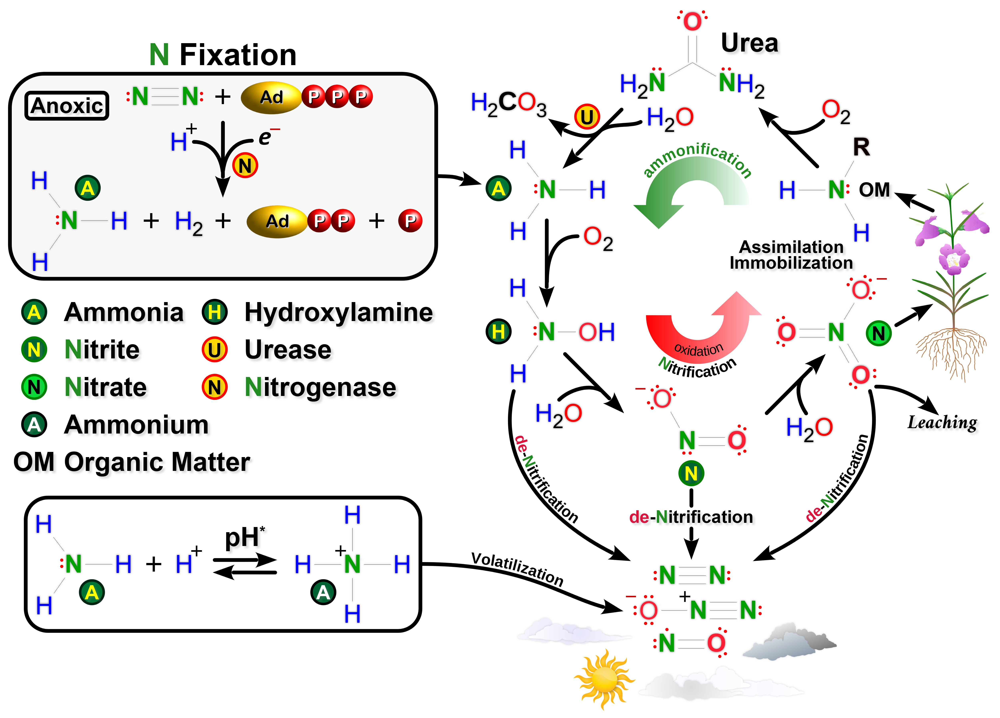

</figure>

**Figure 11.** <span id="Gr2">N</span>**itrogen (<span id="Gr2">N</span>) Cycle.** <span id="Gr2">N</span> is known to be the critical element that limits the net primary productivity (**NPP**) of terrestrial **ecosystems** (**Note: NPP** = gross <span id="Gr2">photo</span>**synthesis** - respiration of producers). Since a significant proportion of the <span id="Gr2">N</span> found in **plants** is used in <span id="Gr2">photo</span>**synthesis** (i.e. <span id="Gr2">chlorophyll</span> pigment), it is perhaps not surprising that the amount of <span id="Gr2">N</span> found within terrestrial **plants** is strongly correlated to **NPP**. **Microbes**, being the key regulators of this cycle, can function as either decomposers or <span id="Gr2">diazo</span>**trophs**. As decomposers they actively break down <span id="Gr2">N</span>-rich **OM** to extract usable <span id="Gr2">N</span> (e.g. <span id="Gr2">N</span>itrate: <span id="Gr2">N</span><span id="Red">O</span><sub>3</sub><sup>-</sup>). By contrast, <span id="Gr2">diazo</span>**trophs** (i.e. symbiotic or free-living **prokaryotes**)  convert atmospheric **di-atomic** <span id="Gr2">N</span> into ammonia (<span id="Gr2">N</span>&equiv;<span id="Gr2">N</span> &rarr; <span id="Gr2">N</span><span id="Blue">H</span><sub>3</sub>), which in turn is converted into various useful molecules like **glutamine** (i.e. **glutamate** + <span id="Gr2">N</span><span id="Blue">H</span><sub>3</sub> &rarr; **glutamine** &rarr; &rarr; **urea**). However, even though the supply of atmospheric <span id="Gr2">N</span><sub>2</sub> is essentially limitless (i.e. ~78% of the air we breath), it is largely chemically un-reactive due to the strong triple bond holding the two <span id="Gr2">N</span> **atoms** together (<span id="Gr2">N</span>&equiv;<span id="Gr2">N</span>). As a result extracting **atoms** of <span id="Gr2">N</span> in order to create usable metabolites (i.e. "*fixing*") is not only energetically "*expensive*", but also requires suitable **reducing** agents and a special low <span id="Red">O</span><sub>2</sub> environment (i.e. **Nitrogenase**, <span id="Gold">&#9411;</span>, is <span id="Red">O</span>xygen sensitive enzyme). Only a <u>relatively</u> few groups of **prokaryotes** (**taxons:** *Rhizobium*, *cyanobacteria*, actinomycete *Frankia*) are capable of performing this task (**Note:** there are 1000s of species either free-living or in close association with **plants**, **lichens**, **protists** or **insects**).**[@davies-barnard_global_2020; @breznak_nitrogen_1973; @potrikus_gut_1981; @douglas_microbial_2009]** This is why many **plants** (e.g. legumes) have evolved symbiotic relationships with <span id="Gr2">diazo</span>**trophs**. However, the **ammonia** (<span id="Gold">&#9398;</span>) and **ammonium** (<b>&#9398;</b>) produced by <span id="Gr2">diazo</span>**trophs** are volatile and quite chemically reactive (i.e. prone to **oxidation**). Because of these limitations most **plants** acquire "*bio-available*" forms of <span id="Gr2">N</span> by recruiting **microbes** that either act as close (e.g. **endosymbiants** in legumes) or slightly more distant mutualists (i.e. free-living <span id="Gr2">diazo</span>**trophs**, and/or microbial decomposers).**[@norman_complex_2017]** **Plants** often establish many of these symbiotic relationships through the release of **exudates** (i.e. <span id="Gr2">photo</span>**synthates**, **Fig. 10**) that serves as high quality **C** food sources for growth promoting <span id="Br">soil</span> **microbes**. Moreover, these microbial decomposers usually do not operate alone and often form close relationships with much larger <span id="Br">soil</span> fauna (i.e. **micro-**, **meso-** and **macro-fauna**). For example, **earthworms** are one of the most important **macro-fauna** found within <span id="Br">soils</span>. Many **earthworm** species consume leaf "*litter*" as well as various **microbes** found within <span id="Br">soil</span> (i.e. fungal hyphae. protists, **bacteria**). Some of the smaller **bacteria** they consume not only successfully transit the gut of these animals, but also thrive within this "*safe*" environment (**Fig. 16**). It is estimated that these **ecosystem engineers** significantly increase crop yields by ~25%, largely due to the positive affects they have on <span id="Gr2">N</span> **mineralization**.**[@van_groenigen_earthworms_2014]** All of these indirect **ecological** interactions are also influenced by climate and other **abiotic** factors (i.e. temperature, **pH**, moisture, mineral <span id="Purple">P</span> levels), which makes for a very complex network of interactions that is prone to perturbations (i.e. ecological cascades).**[@gaiarsa_interaction_2019]** 
<br>
From a chemistry point of view we can follow the various "*inputs*" and "*outputs*" of the <span id="Gr2">N</span> cycle by recognizing the different **redox** states of <span id="Gr2">N</span>. They range from a strongly <u>reduced</u> state as seen in **ammonia** (<span id="Gold">&#9398;</span>, –3 valence state) and **ammonium** (<b>&#9398;</b>, –3 valence state), to a highly <u>oxidized</u> state as seen in the <span id="Gr2">N</span>**itrate** ion (<b>&#9411;</b>, +5 valence state). Transformations between <span id="Gold">&#9398;</span> and <b>&#9411;</b> (i.e. **redox** chemistry) involves various intermediates that have different <span id="Gr2">N</span> valence states (e.g. <span id="Gr2">N</span>**itrite**, <span id="Gold">&#9411;</span> +3 valence state; hydroxylamine, <span id="Gold">&#9405;</span> -1 valence state). During the <span id="Gr2">N</span> "*fixation*" and **Ammonification** parts of the cycle reduced inorganic  **ammonia** (<span id="Gold">&#9398;</span>) is produced. **Ammonification** involves **microbial** decomposers converting waste **OM** like excreted **urea** into simple inorganic <span id="Gold">&#9398;</span> (i.e. <b>&#9418;</b>, common **urease** catalyzed reaction). **Microbes** can then use "*fixed*" or **ammonified** <span id="Gold">&#9398;</span> as a **reducing** agent to power biochemical reactions (i.e. donates electrons and becomes **oxidized** in the process) during the main **oxidative** arm of the cycle, which is commonly referred to as <span id="Gr2">N</span>**itrification**. The end product of these reactions is <b>&#9411;</b>, which is readily taken up by **plants**. In terms of "*outputs*" many of the key <span id="Gr2">N</span> compounds within the cycle are lost to the <span id="Lb2">atmo</span>**sphere** when they are converted to volatile compounds, specifically <span id="Gr2">N</span>itrous oxide (<span id="Gr2">N</span><sub>2</sub><span id="Red">O</span>), <span id="Gr2">N</span>itric oxide (<span id="Gr2">N</span><span id="Red">O</span>), <span id="Gold">&#9398;</span> and of course di-<span id="Gr2">N</span>itrogen (<span id="Gr2">N</span><sub>2</sub>) during the **de-<span id="Gr2">N</span>itrification** and **Anammox** parts of the cycle. The latter process specifically refers to soluble <b>&#9398;</b> being converted to gaseous <span id="Gr2">N</span><sub>2</sub> under anoxic conditions (i.e. <span id="Gr2">N</span><span id="Blue">H</span><sub>4</sub><sup>+</sup> + <span id="Gr2">N</span><span id="Red">O</span><sub>2</sub><sup>-</sup> &rarr; <span id="Gr2">N</span><sub>2</sub> + 2<span id="Blue">H</span><sub>2</sub><span id="Red">O</span>). Lastly, <b>&#9411;</b> ions can escape from <span id="Br">soils</span> by <span id="Teal2">hydro</span>**logical** forces due to its soluble mobile nature (i.e. "*leaching*"). To complete the cycle soluble <b>&#9411;</b> ions are readily taken up by **plants** and other <span id="Br">soil</span> organisms and temporarily "*locked up*" in the form of biomass. For **plants** some of the <span id="Gr2">N</span>-rich biomass is refractory to chemical degradation (e.g. **lignins**) and thus slow to re-enter the <span id="Gr2">N</span> cycle. Others smaller <span id="Gr2">N</span> compounds can become "*trapped*" or immobilized within the sub-micron domain of <span id="Br">soil</span> particle pores (i.e. bound tightly to minerals), making them inaccessible to microbial decomposers.  

</div>

<!------------------------------------------------------>
<!------------ END FIG 11 - Nitrogen Cycle ------------->
<!------------------------------------------------------>

<a id="PC"> </a> 
<!----------------------------------------------------->
<!-------- SECTION 3B.2III - PHOSPHORUS CYCLE  -------->
<!----------------------------------------------------->
**<u>3B.2III** <span id="Purple">P</span>**hosphorus (**<span id="Purple">P</span>**) Cycle</u>:** <span id="Purple">P</span>hosphorus, like **C** and <span id="Gr2">N</span>, is an essential chemical element found in a variety of biomolecules (e.g. cell membrane <span id="Purple">P</span>**hospholipids**, **DNA**, **RNA**), including those involved in **energy** metabolism (e.g. **AT**<span id="Purple">P</span>, **acetyl-CoA**). The ability of this element to form stable *ionizable* mono-ester (i.e. **R**<sub>1</sub>-<span id="Red">O</span>-<span id="Purple">P</span><span id="Red">O</span><sub>2</sub><sup>-2</sup>) and di-ester bonds (i.e. **R**<sub>1</sub>-<span id="Red">O</span>-<span id="Purple">P</span>[<span id="Red">O</span><sup>-</sup>]-<span id="Red">O</span>-**R**<sub>2</sub>) at physiological **pH** prevents biomolecules from "*escaping*" or diffusing out of the cell. The cell membrane itself is also predominately made up of <span id="Purple">P</span>**hospholipids**, and the **amphipathic** nature of these molecules (i.e. contains a <u>hydrophilic</u> <span id="Purple">P</span>hosphate "*head*" group, and two <u>hydrophobic</u> "*tail*"-like fatty acid chains) allows them to form bi-layer lipid structures that are important to all cells (i.e. plasma membrane, organelle membranes). Moreover, the interactions between <span id="Purple">P</span>hosphate groups and water molecules (i.e. hydration "*shell*", **Fig. 12**) plays an important role in protein-protein interactions (e.g. **enzyme** catalysis, cell signaling),**[@hunter_why_2012]** cell metabolism, and stable information storage (i.e. <span id="Purple">P</span>hosphodiester bonds in **DNA** and **RNA** are resistant to spontaneous hydrolysis).**[@westheimer_why_1987; @lad_rate_2003; @schroeder_time_2006; @walton_phosphorus_2023]** The main source of <span id="Purple">P</span>hosphate for <span id="Br">soils</span> is **<a class="one" href="https://www.mindat.org/min-29229.html" target="_blank" title="Go to Mindat.org">calcium apatites</a>** (i.e. <span id="Ly">Ca</span><sub>5</sub>[<span id="Purple">P</span><span id="Red">O</span><sub>4</sub>]<sub>3</sub><span id="Red">O</span><span id="Blue">H</span>, <span id="Ly">Ca</span><sub>5</sub>[<span id="Purple">P</span><span id="Red">O</span><sub>4</sub>]<sub>3</sub><span id="Red">O</span><span id="Violet">F</span>). Chemical weathering of these **primary minerals** releases soluble inorganic <span id="Purple">P</span>hosphates (<span id="Purple">P</span><sub><i>i</i></sub>) that are either directly taken up by **plants** and microbes, rapidly immobilized (to varying degrees) by <span id="Br">soil</span> particles, or transformed into **<a class="one" href="https://openpress.usask.ca/soilscience/chapter/soil-mineralogy/" target="_blank" title="Go to Digging into Canadian Soils">secondary minerals</a>** (e.g. **<a class="one" href="https://www.mindat.org/min-4156.html" target="_blank" title="Go to Mindat.org">variscite</a>**, <span id="Silver">Al</span><span id="Purple">P</span><span id="Red">O</span><sub>4</sub>&sdot;2<span id="Blue">H</span><sub>2</sub><span id="Red">O</span>; **<a class="one" href="https://www.mindat.org/min-793.html" target="_blank" title="Go to Mindat.org">brushite</a>**; and **<a class="one" href="https://www.mindat.org/min-3801.html" target="_blank" title="Go to Mindat.org">strengite</a>**, <span id="Rust">Fe</span><span id="Purple">P</span><span id="Red">O</span><sub>4</sub>&sdot;2<span id="Blue">H</span><sub>2</sub><span id="Red">O</span>).**[@smeck_phosphorus_1985; @canadian_society_of_soil_science_digging_2021]** And unlike **C** and <span id="Gr2">N</span>, there are no major <span id="Lb2">atmo</span>**spheric** reservoirs of <span id="Purple">P</span> (**Note:** there are important *aeolian* sources of <span id="Purple">P</span>hosphate rich dust).**[@swap_saharan_1992; @okin_impact_2004; @nogueira_dust_2021]** As a consequence all major sources of inorganic <span id="Purple">P</span>hosphate ultimately come from the earth (i.e. <span id="Br">litho</span>**sphere**). Mining of <span id="Purple">P</span>hosphorus rich rock, which is a key ingredient of agricultural fertilizers, helped usher in the Green revolution several decades ago, but its continued misuse has resulted in major environmental problems (e.g. **<a class="one" href="https://tinyurl.com/yxt984m4" target="_blank" title="Go to NOAA">eutrophication</a>** of freshwater and marine ecosystems).**[@diaz_spreading_2008; @poirier_phosphate_2022; @wu_imbalance_2022]**  


<a id="Fig12SP"> </a> 
<!----------------------------------------------->
<!------------ FIG 12 - Phosphates  ------------->
<!----------------------------------------------->
<div style="border: 2px solid gray; padding: 5px;">

<figure>

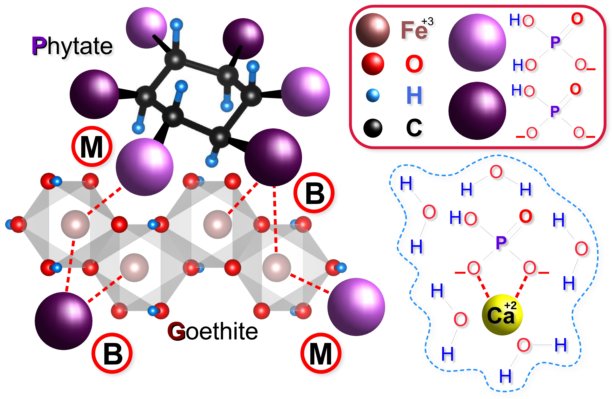

</figure>

**Figure 12.** <span id="Br">Soil</span> <span id="Purple">P</span>**hosphates.** Most of the <span id="Purple">P</span>hospate found within <span id="Br">soils</span> can be classified as either readily bio-available (i.e. **labile pool**) or not readily bio-available (i.e. **refractory pool**). The former is primarily made up of **ortho**<span id="Purple">P</span>**hosphates** (i.e. <span id="Blue">H</span><span id="Purple">P</span><span id="Red">O</span><sub>3</sub><sup>-2</sup> dominates acidic <span id="Br">soils</span>, while <span id="Blue">H</span><sub>2</sub><span id="Purple">P</span><span id="Red">O</span><sub>3</sub><sup>-</sup> dominates alkaline <span id="Br">soils</span>), while the latter is made up of **primary** (i.e. **<a class="one" href="https://www.mindat.org/min-29229.html" target="_blank" title="Go to Mindat.org">calcium apatites</a>**, <span id="Ly">Ca</span><sub>5</sub>(<span id="Purple">P</span><span id="Red">O</span><sub>4</sub>)<sub>3</sub>&sdot;[<span id="Magenta">F</span>, <span id="GrY">Cl</span>, <span id="Red">O</span><span id="Blue">H</span>]) and **secondary** <span id="Purple">P</span>hosphate **minerals** (i.e. <u>insoluble</u> **metal cation** precipitates).**[@canadian_society_of_soil_science_digging_2021]** For example, in neutral to alkaline <span id="Br">soils</span> <span id="Purple">P</span>hosphates tend to precipitate out of solution as <span id="Ly">Ca</span> <span id="Purple">P</span>hosphates (e.g. **<a class="one" href="https://www.mindat.org/min-793.html" target="_blank" title="Go to Mindat">Brushite</a>**, <span id="Ly">Ca</span><span id="Blue">H</span><span id="Purple">P</span><span id="Red">O</span><sub>4</sub>&sdot;<span id="Blue">H</span><sub>2</sub><span id="Red">O</span>), while in acidic <span id="Br">soils</span> <span id="Purple">P</span>hosphates tend to precipitate out of solution as <span id="Rust">Fe</span><sup>+3</sup> and <span id="Silver">Al</span><sup>+3</sup> complexed <span id="Purple">P</span>hosphates (e.g. **<a class="one" href="https://www.mindat.org/min-3801.html" target="_blank" title="Go to Mindat.org">Strengite</a>**, <span id="Rust">Fe</span><span id="Purple">P</span><span id="Red">O</span><sub>4</sub>&sdot;2<span id="Blue">H</span><sub>2</sub><span id="Red">O</span>; **<a class="one" href="https://www.mindat.org/min-4156.html" target="_blank" title="Go to Mindat.org">Variscite</a>**, <span id="Silver">Al</span><span id="Purple">P</span><span id="Red">O</span><sub>4</sub>&sdot;2<span id="Blue">H</span><sub>2</sub><span id="Red">O</span>). In addition to the precipitation/dissolution equilibrium of <span id="Purple">P</span>hosphate **minerals**, a significant proportion of <span id="Br">soil</span> <span id="Purple">P</span>hosphates move onto and off of different particle surfaces (i.e. adsorption/desorption kinetics).**[@hinsinger_bioavailability_2001]** This surface dynamic is very much controlled by the charge state of the *adsorbate* and *adsorbent*, and because <span id="Purple">P</span>hosphates are negatively charged the most important *adsorbents* possess positive charges (e.g. **metal oxides**). For example, **<a class="one" href="https://www.mindat.org/min-1719.html" target="_blank" title="Go to Mindat.org">Goethite</a>** (&alpha;<span id="Rust">Fe</span><span id="Red">O</span>[<span id="Red">O</span><span id="Blue">H</span>], crystal structure rendered using using **<a class="one" href="https://jp-minerals.org/vesta/en/" target="_blank" title="Go to VESTA site">VESTA</a>**)**[@yang_goethite_2006; @momma_vesta_2011]** is a common **ferric oxyhydroxide** found within most <span id="Br">soils</span>. It is known to bind strongly to both inorganic **ortho**<span id="Purple">P</span>**hosphates** (<span id="Purple">P</span><sub>i</sub>) and **organic** <span id="Purple">P</span>hosphates (<span id="Purple">P</span><sub>o</sub>) such as <span id="Purple">P</span>**hytate** (i.e. **inositol hexa-**<span id="Purple">P</span>**hosphate**, or **I**<span id="Purple">P</span><sub>6</sub>). The **pH** sensitive nature of the charged <span id="Purple">P</span>hosphate groups can result in different binding modes, namely **mono-dentate** (<b>&#9410;</b>, monovalent <span id="Purple">P</span>hosphate species), or **bi-dentate** (<b>&#9399;</b>, bivalent <span id="Purple">P</span>hosphate species). In the case of <span id="Purple">P</span>**hytate**, which contains multiple <span id="Purple">P</span>hosphate groups, a stronger **poly-dentate** mode of binding is possible. Also depicted above (lower right) is a typical "*hydration shell*" surrounding a <span id="Ly">Ca</span><sup>+2</sup> <span id="Purple">P</span>hosphate complex that readily precipitates out of solution.  
</div>
<!------------------------------------------------->
<!---------- END - FIG 12 - PHOSPHATES  ----------->
<!------------------------------------------------->

&nbsp; &nbsp; <span id="Br">Soil</span> scientists often use different extraction methodologies (e.g. water-extractable fraction, bicarbonate-extractable fraction, hydroxide-extractable fraction, acid soluble fraction, etc.)**[@walker_fate_1976; @smeck_phosphorus_1985]** to operationally define different "*pools*" of <span id="Purple">P</span><sub><i>i</i></sub>. What these chemical methods reveal about <span id="Purple">P</span><sub><i>i</i></sub> is how strongly it is chemical bound to a particular component of a <span id="Br">soil</span> particle, such as **<a class="one" href="https://openpress.usask.ca/soilscience/chapter/soil-mineralogy/" target="_blank" title="Go to Digging into Canadian Soils">secondary minerals</a>** (e.g. <span id="Silver">Al</span>, <span id="Ly">Ca</span> and <span id="Rust">Fe</span> **oxides**, and **phyllosilicates**). The surface chemistry driving these reactions largely revolves around the types of chemical bonds, as well as their spatial geometry and sensitivity to various **abioitc** factors (e.g. **pH**, moisture, temperature). For example, the divalent <span id="Blue">H</span><span id="Purple">P</span><span id="Red">O</span><sub>3</sub><sup>-2</sup> is the dominate **ortho**<span id="Purple">P</span>**hosphate** species in basic <span id="Br">soils</span>, while monovalent <span id="Blue">H</span><sub>2</sub><span id="Purple">P</span><span id="Red">O</span><sub>3</sub><sup>-</sup> is the dominate **ortho**<span id="Purple">P</span>**hosphate** species in acidic <span id="Br">soils</span>. As for **metal oxides** (e.g. **sesquioxides**, **M**<sub>2</sub><span id="Red">O</span><sub>3</sub> stoichiometry with **M** being either <span id="Silver">Al</span>, <span id="Rust">Fe</span>, or <span id="Ly">Ca</span>) and **clay** minerals (e.g. **vermiculite**, **Fig. 6**) their charged states are **pH** sensitive and subject to protonation reactions (**Eq. 8**). Because of the shape and multi-valent nature of <span id="Purple">P</span><sub><i>i</i></sub> they can interact with mineral surfaces in more than one way. For example, when <span id="Purple">P</span><sub><i>i</i></sub> binds to **goethite** (&alpha;<span id="Rust">Fe</span><span id="Red">O</span>[<span id="Red">O</span><span id="Blue">H</span>]) it can do so via a *monodentate* or *bidentate* configuration (**Fig. 12**). Both of these types of interactions severely reduce the mobility of <span id="Purple">P</span><sub><i>i</i></sub> (i.e. *insoluble*). However, if <span id="Purple">P</span><sub><i>i</i></sub> binds indirectly to mineral surfaces via a network of water <span id="Blue">H</span>-bonds (i.e. hydration "*shell*", **Fig. 11**), than it can be rapidly <u>replaced</u> by similarly charged ions. This ion replacement reaction, commonly termed **ion exchange** (e.g. **C**ation **E**xchange **C**apacity, or **CEC**, which is often used to describe the "*activity*" of **clays**), depends on how accessible the mineral binding sites are and whether or not these sites prefer certain ions (i.e. might be some *selectivity* based on the size and shape of charged/polar groups). When <span id="Purple">P</span><sub><i>i</i></sub> leaves the surface of <span id="Br">soil</span> particles and enters into solution they become surrounded by a shell or "*sphere*" of water molecules (i.e. hydrated ions, **Fig. 12**). Although the function of this "*hydration shell*" in biological systems is debatable (i.e. so called "*biological water*"), it certainly serves an important thermodynamic role (i.e. "*heat bath*") by dissipating the kinetic **energy** (i.e. various inter- and intra-molecular movements) of systems.**[@laage_water_2017]** Thermodynamics aside, we do know that the concentrations of <span id="Purple">P</span><sub><i>i</i></sub> found within <span id="Br">soil</span> solutions are several orders of magnitude lower (i.e. [**&micro;M**] range) than those found within cells (i.e. [**mM**] range). Because of the scarcity of soluble <span id="Purple">P</span><sub><i>i</i></sub> most **plants** rely on symbiotic **mycorrhizal** fungi to help "*forage*" for this nutrient within the top-<span id="Br">soil</span> (**Fig. 13**). Besides recruiting these symbiotic fungi, plant can also respond to <span id="Purple">P</span><sub><i>i</i></sub> stress by: (i) changing its root structure (e.g. increased lateral root growth and root hair density);**[@vance_phosphorus_2003; @lambers_root_2006; @peret_root_2014]** (ii) releasing <span id="Purple">P</span>hosphate solubilizing **exudates** such as **organic acids** (e.g. citrate, ascorbate, oxalate);**[@hoffland_biosynthesis_1992; @jones_organic_1998; @bais_role_2006; @canarini_root_2019]** (iii) secreting hydrolytic **enzymes**, particularly **acid** <span id="Purple">P</span>**hosphatases** and <span id="Purple">P</span>**hytases**;**[@lefebvre_response_1990; @vance_phosphorus_2003; @hurley_dual-targeted_2010; @tran_feeding_2010; @liu_enhancing_2022]** and (iv) increasing the expression of high-affinity <span id="Purple">P</span><sub><i>i</i></sub> transporters such as <span id="Purple">P</span>**HT1**.**[@vance_phosphorus_2003; @shin_phosphate_2004; @nussaume_phosphate_2011]**   
&nbsp; &nbsp; Although it's only soluble <span id="Purple">P</span><sub><i>i</i></sub> that is taken up by plant plasma membrane transporters (i.e. <span id="Purple">P</span>**HT1**, a proton-coupled <span id="Blue">H</span><sub>2</sub><span id="Purple">P</span><span id="Red">O</span><sub>3</sub><sup>-</sup> transporter),**[@harrison_phosphate_1995; @muchhal_phosphate_1996; @mitsukawa_overexpression_1997]** often times the dominate form of <span id="Purple">P</span>hosphate within <span id="Br">soils</span> is **organic** (<span id="Purple">P</span><sub>o</sub>). The high proportion of <span id="Purple">P</span><sub>o</sub> within <span id="Br">soils</span> is no doubt due to the continual addition of **OM** via plant "*litter*", <b>animal</b> residues and microbial **necromass**. Despite its varying <span id="Br">soil</span> content (typically 30-65% of total <span id="Br">soil</span> <span id="Purple">P</span>hosphate)**[@condron_chemistry_2005]** most of the <span id="Purple">P</span><sub>o</sub> is **<a class="one" href="https://pubchem.ncbi.nlm.nih.gov/compound/Phytic-acid" target="_blank" title="Go to PubChem">phytate</a>**, an important plant <span id="Purple">P</span>hosphate storage molecule also known as **inositol hexa**<span id="Purple">P</span>**hosphate** (**I**<span id="Purple">P</span><sub>6</sub>).**[@liu_enhancing_2022]** The six *ionizable* <span id="Purple">P</span>hosphate groups of <span id="Purple">P</span>**hytate** causes it to strongly bind to <span id="Br">soil</span> particles, particularly metal **oxides** and **clay** minerals, which makes it largely inaccessible to **plants** (**Fig. 12**, **13**). However, **plants** can overcome this problem with the aid of <span id="Purple">P</span>**hosphate** solubilizing **exudates** (e.g. **citrate** and **oxalate**)**[@gardner_acquisition_1983; @marschner_root-induced_1986; @jurinak_role_1986; @hoffland_biosynthesis_1992; @johnson_phosphorus_1994; @jones_organic_1998; @vance_phosphorus_2003; @nuruzzaman_distribution_2006]** Once <span id="Purple">P</span><sub>o</sub> is "*freed*" from these insoluble complexes it can then be hydrolyzed by specific **exoenzymes** (i.e. plant and microbe secreted or *periplasmic* enzymes) known as <span id="Purple">P</span>**hosphatases** (i.e. **phytases**, **acid phosphatases**).**[@tarafdar_organic_1988; @lefebvre_response_1990; @antibus_phosphatase_1992; @duff_role_1994; @hinsinger_bioavailability_2001; @vance_phosphorus_2003; @nuruzzaman_distribution_2006; @hurley_dual-targeted_2010]** This family of highly efficient <span id="Purple">P</span>**hospho-mono-esterases** cleave mono-ester bonds that hold <span id="Purple">P</span><sub><i>i</i></sub> to **organic** molecules (**Fig. 13**).**[@lad_rate_2003; @schroeder_time_2006]** Since the solubility and hydrolysis of <span id="Purple">P</span><sub>o</sub> ultimately determines whether or not **plants** access this organic source of <span id="Purple">P</span><sub><i>i</i></sub>, it should therefore comes as no surprise that any factor that greatly affects **enzyme**-substrate interactions, be it physical-chemical (i.e. **pH**, <span id="Br">soil</span> texture, moisture levels) or biological/biochemical (i.e. **exudates**, **exoenzymes**), likely contributes to the overall biochemical mineralization process. In simple mathematical terms the net release of <span id="Purple">P</span><sub><i>i</i></sub> from **SOM** is equal to the difference in the gross mineralization and gross immobilization.**[@bunemann_assessment_2015]** While the math may seem simple measuring net <span id="Purple">P</span><sub>o</sub> mineralization rates are inherently challenging owing to the methods used (i.e. isotopic dilution, extraction techniques) and the heterogeneous nature of <span id="Br">soils</span> (e.g. varying physical, chemical and biological characteristics). For example, **pH** (as detailed above) causes changes in the charge state of both <span id="Purple">P</span><sub>o</sub> and <span id="Purple">P</span><sub><i>i</i></sub>, which determines how readily they adsorb to <span id="Br">soil</span> particle surfaces. This logic also applies to **enzymes**, since all proteins are poly-protic macro-molecules (i.e. functional side chains, N- and C-terminal residues) whose charge states are **pH** dependent (i.e. **<a class="one" href="https://ipc2.mimuw.edu.pl/theory.html" target="_blank" title="Go to pI Calculator">iso-electric point</a>**, or **pI**). So **pH** can affect how **enzymes** interact with <span id="Br">soil</span> particles, which is very much akin to how **pH** affects **clay** minerals and metal **oxides** (**Eq. 8**). Moreover, the catalytic activity of **enzymes** can be enhanced or diminished when bound to surfaces, depending on whether access to the substrate is enhanced (i.e. increased effective concentration), or whether its activity is altered in this solid phase. Certainly *periplasmic* **enzymes** expressed on the surfaces of cells can have their active sites oriented outwards toward their intended target while other parts are provided protection from degradation.**[@burns_soil_2013]** Whether or not **enzymes** come in contact with substrates may depend on their diffusion rates or perhaps other biological mechanisms that monitor substrate gradients (e.g. *quorum sensing* or *chemotaxis*).  
&nbsp; &nbsp; Overall the research suggests that the uptake and re-mineralization of <span id="Purple">P</span>hosphate by microbes are the most important processes regulating <span id="Purple">P</span><sub>o</sub> mineralization within the **Rhizosphere**.**[@richardson_soil_2011]** Needless to say these processes can be negatively impacted by changes in both land use patterns (e.g. habitat loss, agricultural mismanagement) and reduced <span id="Br">soil</span> biodiversity.**[@oelmann_above-_2021]** 

<a id="Fig13PC"> </a> 
<!------------------------------------------------>
<!---------- FIG 13 - Phosphate Cycle  ----------->
<!------------------------------------------------>
<div style="border: 2px solid gray; padding: 5px;">

<figure>
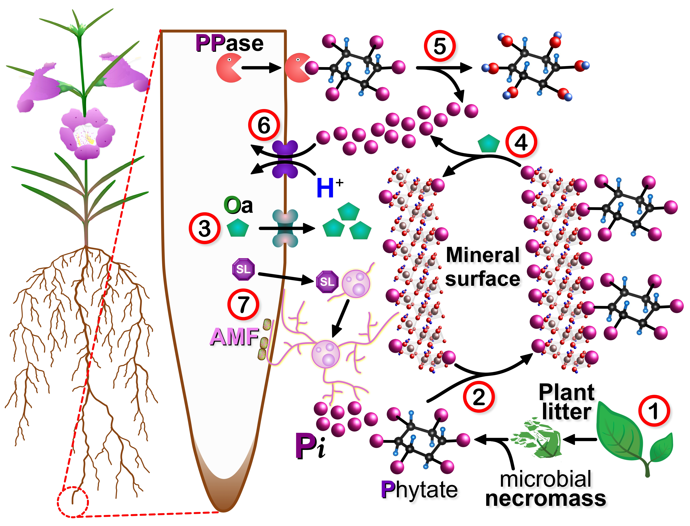
</figure>

**Figure 13. Terrestrial** <span id="Purple">P</span>**hosphate Cycling.** The bio-availability of <span id="Purple">P</span>hosphorus within <span id="Br">soils</span> is largely dependent on re-cycling mechanisms since system inputs, specifically rock weathering and atmospheric deposition (i.e. fine <span id="Br">soil</span> particles, pollen, biochar), are relatively low over short timescales (i.e. years to decades).**[@newman_phosphorus_1995]** Recycling of **organic** <span id="Purple">P</span>hosphates (<span id="Purple">P</span><sub>o</sub>) found in plant "*litter*", **Rhizodeposits** (i.e. **exudates**, shed root cells), <b>animal</b> residues and microbial **necromass** (i.e. bacterial and fungal debris), begins with their *oxidative* breakdown by resident <span id="Br">soil</span> microbes (<b>&#9312;</b>). The metabolic products are low molecular weight <span id="Purple">P</span><sub>o</sub> molecules, particularly **phytate** (i.e. **inositol hexa**<span id="Purple">P</span>**hosphate**, or **I**<span id="Purple">P</span><sub>6</sub>).**[@liu_enhancing_2022]** These small negatively charged molecules readily bind to mineral and **clay** surfaces (<b>&#9313;</b>), which blocks any further break down and release of inorganic <span id="Purple">P</span>**hosphate** (<span id="Purple">P</span><sub>i</sub>) associated with these **organic** molecules. However, **plants** can circumvent this problem by releasing poly-carboxylated **organic acids** (<span id="Gr2">O</span>**a**, <b>&#9314;</b>), such as **ascorbate** and **citrate**, that can promote <span id="Purple">P</span><sub>i</sub> desorption from <span id="Br">soil</span> **clay** and mineral surfaces (<b>&#9315;</b>).**[@giles_organic_2012]** Once "*freed*" from the solid phase both <span id="Purple">P</span><sub>o</sub> and <span id="Purple">P</span><sub>i</sub> species re-enter <span id="Br">soil</span> solution where <span id="Purple">P</span><sub>o</sub> is acted upon by plant and microbial **protein** <span id="Purple">P</span>**hosphatases** (<span id="Purple">PP</span>**ases**). These enzymes cleave the **mono-ester** bonds holding <span id="Purple">P</span><sub>i</sub> to the **organic** molecule (<b>&#9316;</b>). Finally the accumulating <span id="Purple">P</span><sub>i</sub> can be taken up by dedicated plant <span id="Purple">P</span>**hosphate** transporters (<b>&#9317;</b>). Most plant species meet much of their <span id="Purple">P</span><sub>i</sub> requirements through their symbiotic relationship with **arbuscular mycorrhizal fungi** (**AMF**, <b>&#9318;</b>). These fungi invade plant root cells where they establish unique tree-like structures called **arbuscles** that receive plant sugars in exchange for water and micro-nutrients such as <span id="Purple">P</span><sub>i</sub>. Similar to **plants** **AMF** acquire <span id="Purple">P</span><sub>i</sub> using their own set of unique <span id="Purple">P</span><sub>i</sub> transporters.**[@harrison_phosphate_1995]** Moreover, **AMF** can increase <span id="Purple">P</span><sub>i</sub> uptake by releasing **organic acids** (e.g. fructose) that can activate gene expression and <span id="Purple">PP</span>**ase** activity within neighbouring bacteria.**[@zhang_signal_2018; @chiu_mechanisms_2019]** **Plants** are known to recruit **AFM** by secreting small hormones known as **Strigolactones** (**SL**, <b>&#9318;</b>) that stimulate extensive hyphal branching in specific fungal species.**[@akiyama_plant_2005; @burger_many_2020]**  
</div>
<!----------------------------------------------->
<!--------- END - FIG 13 - PHOSPHORUS  ---------->
<!----------------------------------------------->


<a id="SC"> </a> 
<!------------------------------------------------>
<!-------- SECTION 3B.2IV - SULFUR CYCLE  -------->
<!------------------------------------------------>
**<u>3B.2IV** <span id="Gold">S</span>**ulfur** **Cycle</u>:** Although the cycling of <span id="Gold">S</span> within terrestrial <span id="Br">soils</span> is perhaps the least "*glamorous*" of all the biogeochemical cycles (smelly subject? ;), it's arguably the most interesting one given the unique chemistry (i.e. **redox** potential) and close connections with the other cycles (i.e. **C**, <span id=Gr2>N</span> and <span id="Blue">H</span><sub>2</sub><span id="Red">O</span>). <span id="Gold">S</span> is one of the most abundant chemical elements on Earth, and is usually found as **<a class="one" href="https://www.mindat.org/min-3314.html" target="_blank" title="Go to Mindat">pyrite</a>** (<span id="Rust">Fe</span><span id="Gold">S</span><sub>2</sub>) or **gypsum** (<span id="Ly">Ca</span><span id="Gold">S</span><span id="Red">O</span><sub>4</sub>&sdot;2<span id="Blue">H</span><sub>2</sub><span id="Red">O</span>) within the <span id="Br">litho</span>**sphere**. When these **minerals** are subjected to **chemical weathering** near the surface they are transformed into soluble <span id="Gold">S</span>**ulfates** that eventually make their way to the oceans.**[@berner_biogeochemical_1989; @edwards_sulfur_1998; @canfield_evolution_2004]** In addition to geological factors (i.e. **chemical weathering**, **tectonics** and **volcanism**) <span id="Gold">S</span>**ulfate** cycling within <span id="Br">soils</span> is also controlled by components of the <span id="Gr2">bio</span>**sphere**, specifically <span id="Gold">S</span> **R**educing **M**icroorganisms (<span id="Gold">S</span>**RM**).**[@muyzer_ecology_2008; @barton_chapter_2009; @fike_rethinking_2015; @chaudhary_microbes-mediated_2023]**  
&nbsp; &nbsp; If our starting point is the <span id="Br">litho</span>**sphere** than the event of interest is how <span id="Gold">S</span> containing sedimentary rock (i.e. **metal** <span id="Gold">S</span>**ulfides** minerals) undergoes **chemical weathering** to form water soluble <span id="Gold">S</span>**ulfates**. **<a class="one" href="https://www.mindat.org/min-3314.html" target="_blank" title="Go to Mindat">Pyrite</a>** is the most abundant **metal** <span id="Gold">S</span>**ulfide**, and when exposed to <span id="Red">O</span>xygen and water for extended periods of time it will readily undergo **oxidation**. Looking at this chemical reaction (**Eq. 11-14**) one can see that the generation of *ferric* iron (<span id="Rust">Fe</span><sup>+3</sup>, **Eq. 12**) is the critical step in this process, since it can <span id="Red">O</span>**xidize** **<a class="one" href="https://www.mindat.org/min-3314.html" target="_blank" title="Go to Mindat">pyrite</a>** (**Eq. 14**) and thus make the overall process self-propagating in nature.**[@banks_mine-water_1997; @rimstidt_pyrite_2003; @dos_santos_pyrite_2016]**  

$$\tag{11} 2 \phantom{.} \underbrace{\text{Fe}\text{S}_2 \phantom{.}}_\text{Pyrite} \phantom{1} + \phantom{1} 7 \phantom{.} \text{O}_2 \phantom{1} + \phantom{1} 2 \phantom{.} \text{H}_2\text{O} \phantom{1} \rightleftharpoons \phantom{1} 2 \phantom{.} \underbrace{\text{Fe}^{+2} [\text{SO}_4]^{-2}}_\text{Fe(II) Sulfate} \phantom{1} + \phantom{1} 2 \underbrace{\text{H}_2\text{SO}_4}_\text{Sulfuric acid}$$

$$\tag{12} 4 \phantom{.} \underbrace{\text{Fe}^{+2}}_\text{Fe(II)} \phantom{1} + \phantom{1} \text{O}_2 \phantom{1} + \phantom{1} 4 \phantom{.} \text{H}^+ \phantom{1} \rightleftharpoons \phantom{1} 4 \phantom{.} \underbrace{\text{Fe}^{+3}}_\text{Fe(III)} \phantom{1} + \phantom{1} \text{H}_2\text{O}$$

$$\tag{13} 4 \phantom{.} \underbrace{\text{Fe}^{+3}}_\text{Fe(III)} \phantom{1} + \phantom{1} 12 \phantom{.} \text{H}_2 \text{O} \phantom{1} \phantom{1} \rightleftharpoons \phantom{1} 4 \phantom{.} \underbrace{\text{Fe}^{+3}[\text{OH}^-]_3 \phantom{.}}_\text{Fe(III) hydroxide} \phantom{1} + \phantom{1} 12 \phantom{.} \text{H}^+$$

$$\tag{14} \underbrace{\text{Fe}\text{S}_{2 \phantom{.} \text{(s)}}}_\text{Pyrite} \phantom{1} + \phantom{1} 14 \phantom{.} \underbrace{\text{Fe}^{+3}}_\text{Fe(III)} \phantom{1} + \phantom{1} 8 \phantom{.} \text{H}_2\text{O} \phantom{1} \rightleftharpoons \phantom{1} 15 \phantom{.} \underbrace{\text{Fe}^{+2}}_\text{Fe(II)} \phantom{1} + \phantom{1} 2 \phantom{.} \underbrace{\text{SO}_4^{-2}}_\text{Sulphate} \phantom{1} + \phantom{1} 16 \phantom{.} \text{H}^+$$

Another notable feature of **<a class="one" href="https://www.mindat.org/min-3314.html" target="_blank" title="Go to Mindat">Pyrite</a>** <span id="Red">O</span>**xidation** is the production of **acid** (i.e. <span id="Gold">S</span>**ulfuric acid** and <span id="Blue">H</span><sup>+</sup>), which can cause the acidification of water ways (i.e. death of aquatic organisms). This is an on-going problem in current and abandoned metal mining sites (e.g. Coal, Iron, Copper and Zinc ores) where improperly managed waste material (containing **pyrite**) undergoes chemical weathering producing acid run off (aka: "*acid mine drainage*").**[@banks_mine-water_1997]**  
&nbsp; &nbsp; The amount of <span id="Gold">S</span> found within the <span id="Br">litho</span>**sphere** (i.e. **2&times;10<sup>7</sup> Gt**) vastly exceeds those found in lakes and rivers (i.e. <b>0.3</b> **Gt**). Nevertheless, the levels of <span id="Gold">S</span>**ulfate** that accumulate within the oceans (i.e. <span id="Lb2">hydro</span>**sphere**) as a result of fluvial transport are quite significant (i.e. **1.3&times;10<sup>6</sup> Gt**).**[@bottrell_reconstruction_2006; @jones_effects_2016]** The ocean floor, which represents an important interface between the <span id="Lb2">hydro</span>**sphere** and <span id="Br">litho</span>**sphere**, is particularly rich in <span id="Gold">S</span> (i.e. **3&times;10<sup>5</sup> Gt**) due to an active <span id="Gold">S</span>**RM** community.**[@bottrell_reconstruction_2006; @jorgensen_biogeochemical_2019]** Deep sea hydrothermal vent systems also support an active <span id="Gold">S</span> based microbial community, but these **auto**<span id="Br">litho</span>**trophs** are powered by <span id="Blue">H</span><sub>2</sub><span id="Gold">S</span> and not <span id="Gold">S</span>**ulfate**.**[@corliss_submarine_1979; @francheteau_massive_1979; @martin_hydrothermal_2008]** Moreover, far less is known about **organic** and **inorganic** <span id="Gold">S</span> cycling within these inaccessible deep sea vents than in coastal marine sediments. What we do known about the latter is that within the *anoxic* zone of these sediments <span id="Gold">S</span>**RM** actively take up <span id="Gold">S</span>**ulfate** and use it as an electron acceptor to metabolize a wide variety of small molecular weight **organic** molecules (e.g. hydrocarbons, acetate, alcohols, phenolics).**[@muyzer_ecology_2008; @barton_chapter_2009; @jorgensen_biogeochemical_2019]** These microbes take advantage of the **multi-valent states** of <span id="Gold">S</span> to produce partially or fully reduced <span id="Gold">S</span> metabolites, such as <span id="Gold">S</span>**ulfite** (<span id="Gold">S</span><sup>+4</sup> state: <span id="Gold">S</span><span id="Red">O</span><sub>3</sub><sup>-2</sup>), **thio**<span id="Gold">S</span>**ulfate** (<span id="Gold">S</span><sup>+2</sup> state: <span id="Gold">S</span><sub>2</sub><span id="Red">O</span><sub>3</sub><sup>-2</sup>), elemental <span id="Gold">S</span>ulfur (<span id="Gold">S</span><sup>0</sup>), and <span id="Gold">S</span>**ulfides** (<span id="Gold">S</span><sup>-1</sup> state: <span id="Blue">H</span><span id="Gold">S</span><sub>2</sub><sup>-</sup> and <span id="Gold">S</span><sup>-2</sup> state: <span id="Blue">H</span><span id="Gold">S</span><sup>-</sup>, <span id="Blue">H</span><sub>2</sub><span id="Gold">S</span>). The partially reduced states of these <span id="Gold">S</span> metabolites allow <span id="Gold">S</span>**RM** to control the flow of electrons during **bioenergetic** processes (i.e. "*shuttle*" electrons between electron donors and acceptors).**[@fike_rethinking_2015]** Although these microbes prefer **anaerobic** environments their ability to tolerate *oxic* conditions give them access to more **OM**, particularly within coastal waters where the productivity of the ocean is high.**[@dolla_oxygen_2006; @barton_chapter_2009]** This adaptation is important since the concentration of **OM** rapidly declines with increasing ocean depth, which places severe limits on the metabolic activity of these microbes.**[@jorgensen_mineralization_1982]** Moreover, <span id="Gold">S</span>**RM** are believed to account for the majority of **OM** mineralization within coastal marine sediments, which shows how closely linked **C** and <span id="Gold">S</span> cycling is in nature.**[@jorgensen_mineralization_1982; @sievert_sulfur_2015; @jorgensen_biogeochemical_2019]**  
&nbsp; &nbsp; One of the most important **organic** molecules **oxidized** by <span id="Gold">S</span>**RM**, such as **anaerobic methanotrophic archaea** (**ANME**), is **methane** (**Eq. 15**).**[@jorgensen_biogeochemical_2019]** **ANME** have been shown to form a special metabolic partnerships with <span id="Gold">S</span>**ulfate**-reducing *delta-Proteobacteria*.**[@boetius_marine_2000]** This so called "*dual-species consortium*" controls the level of **methane** (a potent greenhouse gas) released by marine sediments. Any excess bi<span id="Gold">S</span>**ulfide** produced during this process can eventually re-form <span id="Gold">S</span>**ulfate** by reacting with elemental <span id="Gold">S</span>**ulfur** (<span id="Gold">S</span><sup>0</sup>) and forming di<span id="Gold">S</span>**ulfide** (**Eq. 16-17**). Another commonly metabolized **organic** compound is **acetate** (**Eq. 18**). When it is **oxidized**, using <span id="Gold">S</span><sup>0</sup> as an electron acceptor, <span id="Blue">H</span><sub>2</sub><span id="Gold">S</span> is produced. This powerful reducing agent can react with <span id="Rust">Fe</span><span id="Gold">S</span> (i.e. **metal oxide** formed by excess **bisulfides**, **Eq. 19**) to produce **pyrite** (**Eq. 20**). Being a stable and highly insoluble mineral it readily precipitates out of solution and becomes buried within sediments, where it will eventually become sedimentary **pyrite**.  

$$\tag{15} \underbrace{\text{CH}_{4 \phantom{.} \text{(aq)}} \phantom{.}}_\text{Methane} \phantom{1} + \phantom{1} \underbrace{\text{SO}_4^{-2}}_\text{Sulfate} \phantom{1} \rightleftharpoons \phantom{1} \underbrace{\phantom{.} \text{H}\text{S}^-}_\text{bisulfide} \phantom{1} + \phantom{1} \underbrace{\phantom{.} \text{HCO}_3^- \phantom{.}}_\text{bicarbonate} \phantom{1} + \phantom{1} \text{H}_2\text{O}$$


$$\tag{16} \underbrace{\phantom{.} \text{H}\text{S}^-}_\text{bisulfide} \phantom{1} + \phantom{1} \underbrace{\text{S}^0_{\phantom{.} \text{(s)}}}_\text{Sulfur} \phantom{1} \rightleftharpoons \phantom{1} \underbrace{\phantom{.} \text{HS}_{2}^- \phantom{.}}_\text{disulfide}$$


$$\tag{17} \underbrace{4\phantom{.} \text{HS}_{2}^- \phantom{.}}_\text{disulfide} \phantom{1} + \phantom{1} 4\phantom{.}\text{H}_2 \text{O} \phantom{1} \rightleftharpoons \phantom{1} \underbrace{\text{SO}_4^{-2}}_\text{Sulfate} \phantom{1} + \phantom{1} \underbrace{7\phantom{.} \text{H}\text{S}^-}_\text{bisulfide} + \phantom{1} 5\phantom{.}\text{H}^+$$


$$\tag{18} \underbrace{\text{CH}_3\text{COO}^-}_\text{Acetate} \phantom{1} + \phantom{1} \underbrace{4\phantom{.}\text{S}^0_{\phantom{.} \text{(s)}}}_\text{Sulfur} \phantom{1} + \phantom{1} \text{H}^+ \phantom{1} + \phantom{1} 2\phantom{.}\text{H}_2\text{O} \phantom{1} \rightleftharpoons \phantom{1} \underbrace{4\phantom{.} \text{H}_{2}\text{S} \phantom{.}}_\text{Sulfide} \phantom{1} + \phantom{1} 2\phantom{.}\text{CO}_2$$


$$\tag{19} \underbrace{\phantom{.} \text{H}\text{S}^-}_\text{bisulfide} \phantom{1} + \phantom{1} \underbrace{\text{M}^{+2}}_\text{Metal} \phantom{1} \rightleftharpoons \phantom{1} \underbrace{\phantom{.} \text{MS}_{\phantom{.} \text{(s)}} \phantom{.}}_\text{Metal Sulfide} \phantom{1} + \phantom{1} \text{H}^+$$


$$\tag{20} \underbrace{\phantom{.} \text{H}_2\text{S} \phantom{.}}_\text{Sulfide} + \phantom{1} \text{FeS}_{\phantom{.} \text{(s)}} \phantom{1} \rightleftharpoons \phantom{1} \underbrace{\text{Fe}\text{S}_{2 \phantom{.} \text{(s)}} \phantom{.}}_\text{Pyrite} \phantom{1} + \phantom{1} \text{H}_{2\phantom{.} \text{(g)}}$$

&nbsp; &nbsp; The "*fate*" of <span id="Gold">S</span>**ulfate** within the ocean's upper **euphotic** zone is also an important part of the overall <span id="Gold">S</span> cycle. Here dissolved <span id="Gold">S</span>**ulfate** is taken up by <span id="Gr2">phytoplankton</span> and incorporated into biomolecules such as **methionine**. This amino acid is of particular interest since it used by many marine algae, particularly single celled *dinoflagellates*, *coccolithophores* and *diatoms*,**[@keller_dimethyl_1989; @stefels_environmental_2007]** to produce **dimethyl**<span id="Gold">S</span>**ulfoniopropionate** (**DM**<span id="Gold">S</span>**P**, **Fig. 14**). The cytosolic levels of this metabolite are relatively high within <span id="Gr2">phytoplankton</span> (i.e. 20-1000 mM),**[@keller_dimethyl_1989; @malin_algal_1997; @yoch_dimethylsulfoniopropionate_2002]** where it functions as an important **osmolyte** (i.e. regulates osmotic pressure in response to changes in salinity).**[@dickson_steady_1980; @dickson_osmotic_1987]** When **DM**<span id="Gold">S</span>**P** is released by these cells as a result of predation (meso- and micro-<span id="Dred">zooplankton</span> grazers),**[@dacey_oceanic_1986; @wolfe_grazing-activated_1996; @evans_relative_2007]** **viral** lysis,**[@hill_virus-mediated_1998; @malin_elevated_1998; @evans_relative_2007]** or other compromising stresses (i.e. mechanical, chemical, light),**[@wolfe_dimethylsulfoniopropionate_2002]** it is actively taken up by neighbouring microbes since it represents a valuable source of <span id="Gold">S</span>.**[@vila-costa_dimethylsulfoniopropionate_2006; @gregory_organosulfur_2021]** Some marine bacteria and algae express an enzyme known as **DM**<span id="Gold">S</span>**P lyase**, which is capable of cleaving **DM**<span id="Gold">S</span>**P** into dimethyl-<span id="Gold">S</span>**ulfide** (**DM**<span id="Gold">S</span>) and acrylate (**Fig. 14**).**[@curson_catabolism_2011; @alcolombri_identification_2015]** Both **DM**<span id="Gold">S</span> and its precursor **DM**<span id="Gold">S</span>**P** have been shown to act as chemo-attractants for a variety of marine organisms, including planktivorous sea birds, reef fish and microbes,**[@nevitt_dimethyl_1995; @debose_dimethylsulfoniopropionate_2008; @seymour_chemoattraction_2010]** as well as the dinoflagellate parasite *Parvilucifera sinerae*.**[@garces_host-released_2013]** These two <span id="Gold">S</span> compounds may also protect coral algal *symbionts* from oxidative stress via their potent anti-oxidant activities.**[@sunda_antioxidant_2002; @decelle_original_2012]** However, perhaps the most remarkable property of **DM**<span id="Gold">S</span> is the chemical transformation it undergoes when it enters the upper part of the <span id="Lb1">tropo</span>**sphere**. This volatile compound readily undergoes <span id="Red">O</span>xidation resulting in the production of <span id="Gold">S</span>**ulfate** aerosols that serve as *cloud condensation nuclei* (**CCN**). Both the size and cloud "*seeding*" activity of these particles can alter the *albedo* (i.e. reflection of incoming solar radiation) of the planet,**[@shaw_bio-controlled_1983; @dickinson_future_1986]** and thus serve as an important climate feedback mechanism.**[@lovelock_atmospheric_1972; @charlson_oceanic_1987]** The release of **DM**<span id="Gold">S</span> by the oceans accounts for the vast majority of **biotic** <span id="Gold">S</span> that enters the <span id="Lb1">atmo</span>**sphere** (~28.1 Tg&sdot;yr<sup>-1</sup>).**[@lana_updated_2011]** Of course some of these dissolved <span id="Gold">S</span>**ulfates** end up precipitating onto land courtesy the water cycle, which serves as the key link between the <span id="Lb1">atmo</span>**sphere** and the <span id="Br">litho</span>**sphere** within the <span id="Gold">S</span> cycle. This <span id="Gold">S</span> infused rain is also supplemented by smaller amounts of gaseous <span id="Gold">S</span><span id="Red">O</span><sub>2</sub> and <span id="Blue">H</span><sub>2</sub><span id="Gold">S</span> released by terrestrial volcanic activity, not to mention the large amounts of <span id="Gold">S</span><span id="Red">O</span><sub>2</sub> emissions produced by the fossil fuel industry (e.g. burning of <span id="Gold">S</span> "*dirty*" coal).  


<a id="Fig14SC"> </a> 
<!--------------------------------------------------->
<!------------ START - FIG 14 - Sulfur  ------------->
<!--------------------------------------------------->
<div style="border: 2px solid gray; padding: 5px;">

<figure>

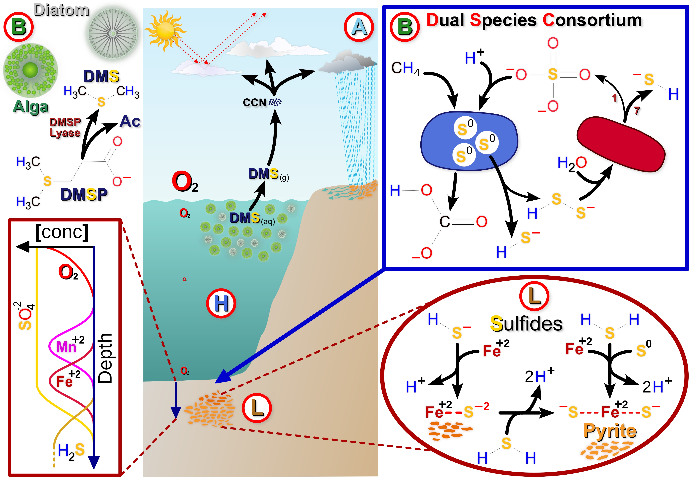

</figure>

**Figure 14.** <span id="Gold">S</span>**ulfur Cycle**. The cycling of <span id="Gold">S</span> between the <span id="Lb1">atmo</span>**sphere** (<span id="Lb1">&#9398;</span>), <span id="Teal2">Hydro</span>**sphere** (<span id="Teal2">&#9405;</span>), <span id="Br">Litho</span>**sphere** (<span id="Br">&#9409;</span>), and <span id="Gr2">Bio</span>**sphere** (<span id="Gr2">&#9399;</span>) is complex and closely linked to the **C** cycle. **<a class="one" href="https://www.mindat.org/min-3314.html" target="_blank" title="Go to Mindat">Pyrite</a>** (<span id="Rust">Fe</span><span id="Gold">S</span><sub>2</sub>), the most abundant <span id="Gold">S</span> containing mineral found in the <span id="Br">&#9409;</span>, undergoes chemical weathering (**Eq. 11-14**) resulting in the formation of <span id="Gold">S</span>**ulfate** (<span id="Gold">S</span><span id="Red">O</span><sub>4</sub><sup>-2</sup>). This soluble anion is transported via rivers to the **oceans** (<span id="Teal2">&#9405;</span>) where it accumulates in large amounts (~1.4&times;10<sup>21</sup> kg).**[@bottrell_reconstruction_2006; @rickard_chemistry_2007]** Although the majority (75-90%) of this marine <span id="Gold">S</span>**ulfate** is recycled via <span id="Gr2">&#9399;</span>, a small fraction within the marine sediments (<span id="Br">&#9409;</span>) is transformed into **<a class="one" href="https://www.mindat.org/min-3314.html" target="_blank" title="Go to Mindat">pyrite</a>** (~6&times;10<sup>10</sup> kg&sdot;yr<sup>-</sup>) and, to a lesser extent, **gypsum** (~0.6&times;10<sup>10</sup> kg&sdot;yr<sup>-</sup>).**[@jorgensen_mineralization_1982; @bottrell_reconstruction_2006; @rickard_chemistry_2007]** Over long periods of time **tectonic** forces "*uplift*" these <span id="Gold">S</span> minerals exposing them to weathering conditions. This of course re-generates water soluble <span id="Gold">S</span>**ulfates** that can be transported once again to the oceans (<span id="Teal2">&#9405;</span>). As mentioned above the majority of soluble <span id="Gold">S</span>**ulfates** are recycled by various marine microbes, including free floating <span id="Gr2">phyto</span>**plankton** (e.g. **algae**, **diatoms**) and sediment bound **microbes** (i.e. **bacteria** and **archaea**). The latter **anaerobic** species often work together to extract **energy** from simple **organic** molecules like **methane** (**C**<span id="Blue">H</span><sub>4</sub>). For example, **an**aerobic **me**thanotrophic *archaea* (**ANME**) are known to form a close partnership or "*consortium*" with <span id="Gold">S</span>**ulfur reducing delta-proteobacteria**.**[@hoehler_field_1994; @boetius_marine_2000; @orphan_comparative_2001]** In this so called **D**ual **S**pecies **C**onsortium **ANME** use <span id="Gold">S</span>**ulfate** as an electron acceptor to <span id="Red">O</span>**xidize** methane.**[@boetius_marine_2000; @knittel_anaerobic_2009; @milucka_zero-valent_2012; @wegener_intercellular_2015]** The resulting <span id="Gold">S</span> metabolites include elemental <span id="Gold">S</span> (<span id="Gold">S</span><sup>0</sup>), as well as mono- and poly-<span id="Gold">S</span>**ulfides** (i.e. <span id="Blue">H</span><span id="Gold">S</span><sup>-</sup>, <span id="Blue">H</span><span id="Gold">S</span><span id="Gold">S</span><sup>-</sup>). While **ANME** carry out the **An**aerobic **O**xidation of **M**ethane (**AOM**), their *Delta-proteobacteria* "*partners*" take up some of the <span id="Gold">S</span>**ulfides** they produce and disproportionate it to <span id="Gold">S</span>**ulfides** and <span id="Gold">S</span>**ulfate** (theoretical 7:1 ratio, **Eq. 17**), with the latter being cycled back to **ANME** to repeat the process.**[@boetius_marine_2000; @knittel_anaerobic_2009; @milucka_zero-valent_2012; @wegener_intercellular_2015]** The **biogenic** <span id="Gold">S</span>**ulfides** can also be re-<span id="Red">O</span>**xidized** **abiotically** by <span id="Red">O</span><sub>2</sub> within the upper **oxic** layers, or by divalent metal ions such as <span id="Rust">Fe</span><sup>+2</sup> and <span id="Magenta">Mn</span><sup>+2</sup> within the lower **anoxic** sediments (lower left box, chemical "*species*" vertical concentration profile).**[@froelich_early_1979; @rickard_chemistry_2007]** One of the consequences of **OM** decomposition within marine sediments is a distinct distribution profile of the chemical agents used in these **redox** reactions, namely <span id="Red">O</span><sub>2</sub>, <span id="Magenta">Mn</span><sup>+2</sup>, <span id="Rust">Fe</span><sup>+2</sup>, <span id="Gold">S</span><span id="Red">O</span><sub>4</sub><sup>-2</sup> and <span id="Blue">H</span><sub>2</sub><span id="Gold">S</span> (i.e. product of their **thermodynamic** potential, <span id="Red">O</span><sub>2</sub> > <span id="Magenta">Mn</span><span id="Red">O</span><sub>2</sub> >  <span id="Rust">Fe</span><span id="Red">O</span><span id="Blue">H</span> > <span id="Gold">S</span><span id="Red">O</span><sub>4</sub><sup>-2</sup>).**[@froelich_early_1979; @rickard_chemistry_2007]** Of course this idealized vertical distribution is often altered by changes to system inputs (e.g. **OM** sedimentation rates), or some type of physical disturbance (e.g. <span id="Gr2">bio</span>**turbation**, wave action). The final link in the <span id="Gold">S</span> cycle involves the movement of **organic** <span id="Gold">S</span>**ulfides** between the oceans and the lower <span id="Lb1">&#9398;</span> (i.e. <span id="Lb2">tropo</span>**sphere**), specifically the release of **dimethyl**-<span id="Gold">S</span>**ulfoniopropionate** (**DM**<span id="Gold">S</span>**P**) and its conversion into gaseous dimethyl-<span id="Gold">S</span>**ulfide** (**DM**<span id="Gold">S</span>).**[@lovelock_atmospheric_1972; @shaw_bio-controlled_1983; @charlson_oceanic_1987]** Only bacteria and algae that express **DM**<span id="Gold">S</span>**P Lyase** can specifically cleave **DM**<span id="Gold">S</span>**P** to produce **DM**<span id="Gold">S</span> and **acrylate** (**Ac**).**[@alcolombri_identification_2015]** Volatile **DM**<span id="Gold">S</span> escapes into the not so "*thin air*" of the <span id="Lb1">&#9398;</span> where it's <span id="Red">O</span>**xidized** by reactive hydroxyl-radicals (<span id="Red">O</span><span id="Blue">H</span>&sdot;).**[@yin_analysis_1986; @andreae_ocean-atmosphere_1990]** This process produces <span id="Gold">S</span>**ulfate** aerosols that can both scatter sunlight (because of its sub-micron dimensions) and act as *cloud condensation nuclei* (**CCN**).**[@shaw_bio-controlled_1983; @andreae_atmospheric_1997]** Together they can alter global **<a class="one" href="https://mynasadata.larc.nasa.gov/mini-lessonactivity/what-albedo" target="_blank" title="Go to NASA">albedo</a>** (i.e. fraction of incident solar radiation reflected by the Earth’s surface) patterns that can either cool or heat the planet's surface (<span id="Lb1">&#9398;</span>, cloud reflection of solar radiation depicted in upper middle panel).**[@shaw_bio-controlled_1983; @andreae_atmospheric_1997]**  
</div>
<!------------------------------------------------->
<!------------ END - FIG 14 - Sulfur  ------------->
<!------------------------------------------------->

<!-------------------------------------------------------->
<!--- SECTION 3B.3 - SOIL Micro- Meso- and Macro-Fauna --->
<!-------------------------------------------------------->
<a id="SMMMF"> </a>
**<u>3B.3** <span id="Br">Soil</span> **Fauna</u>:** Although **fungi** and **bacteria** are the major drivers of <span id="Br">soil</span> nutrient cycles, there are many other uni- and multi-cellular **eukaryotes** found in <span id="Br">soils</span>, the so called **micro**- (<0.1 mm body width), **meso**- (0.1-2 mm body width) and **macro**-**fauna** (2-20 mm body width), that also play an important role in <span id="Br">soil</span> nutrient cycles.**[@orgiazzi_global_2016]** From **earthworms** and **ants** to the less familiar **protists**, **nematodes**, **springtails** (class *Collembola*) and *Oribatid* **mites**, these often overlooked species help maintain healthy <span id="Br">soils</span>. They not only break down **OM** within the upper top-<span id="Br">soil</span> and "*litter*" layers, but also alter the physical-chemical properties of <span id="Br">soils</span>.**[@frouz_effects_2018]** Although there are millions of species to choose from, few have been extensively studied with respect to healthy functioning <span id="Br">soils</span>. As a result only representative examples will be discussed in the following sections. This will include **protists** (**micro-fauna**) and **nematodes** (**micro-fauna**), *Oribatid* **mites** (**meso-fauna**), and **earthworms** (**mega-fauna**). **Nematodes** and **earthworms** have been the subject of much research over the years. **Earthworms** are an iconic <span id="Br">soil</span> organism that most people are familiar with, while **nematodes** are a favourite model organism in biology that also happens to be quite abundant within <span id="Br">soils</span>. On the other hand **protists** are both fascinating in their own right, but also a bit of a dilemma. They are an enormously diverse group of mostly uni-cellular organisms that are neither **plants**, **animals**, nor **fungi**. They also represent some of the earliest **eukaryotic** life-forms on the planet that eventually gave rise to present day **plants**, **animals**, and **fungi**. Yet despite their evolutionary importance few have been studied with respect to <span id="Br">soil</span> ecology. Unlike many of their evolutionary descendants they lack any unifying taxonomic features or shared character states and as a result do not form a distinct evolutionary group or "*clade*" (i.e. poly-phylogenetic, do not share any derived traits or **<a class="one" href="https://evolution.berkeley.edu/glossary/synapomorphy/" target="_blank" title="Go to Evolution 101">synapomorphies<a>**). For example, **insects** share many distinct character states, such as three distinct body parts, six legs, and an exoskeleton. On the other hand **protists** are rather heterogeneous, with features that resemble **plants**, **animals** and **fungi** (i.e. no unique **synapomorphies**). 


<!-------------------------------------------------->
<!--------- SECTION 3B.3Ia - SOIL PROTISTS --------->
<!-------------------------------------------------->
<a id="SProt"> </a>
**<u>3B.3I** <span id="Br">Soil</span> **Micro-Fauna: Protists</u>.** Most research on <span id="Br">soil</span> **microbes** focuses on **bacteria** and **fungi**. This is no doubt due to the critical role they play in regulating nutrient cycles. However, there are many other types of micrometre sized organisms that reside within <span id="Br">soils</span> that are often overlooked. For example, **Protists** are one of the largest and most diverse (>100,000 species) groups of **eukaryotic** organisms on the planet (i.e. include all **eukaryotes** that are not **animals**, **plants**, or **fungi**).**[@corliss_biodiversity_2002; @pawlowski_cbol_2012]** This **<a class="one" href="https://evolution.berkeley.edu/the-tree-room/evolutionary-trees-a-primer/clades-within-clades/" target="_blank" title="Go to UC Berkeley">polyphyletic</a>** group includes many well known primary producers (e.g. Diatoms, Kelp, dinoflagellates), decomposers (e.g. slime molds), consumers (e.g. *Amoebozoa*) and parasites (e.g. *Plasmodium*, *Trypanosoma*).**[@corliss_biodiversity_2002; @geisen_soil_2017; @geisen_soil_2018]** Although most <span id="Br">soil</span> **protists** are consumers (~85%),**[@oliverio_global-scale_2020]** parasitic forms are also common, particularly within tropical ecosystems.**[@geisen_metatranscriptomic_2015; @mahe_parasites_2017]** Moreover, like other major <span id="Br">soil</span> **microbes** most **protist** species have not been identified.**[@bates_global_2013; @fierer_embracing_2017]** Despite the systematic short-comings we do know that **protists** do play an important role in nutrient cycling (e.g. <span id="Gr2">N</span> and **C** mineralization) via their control of bacterial populations.**[@coleman_analysis_1977; @woods_nitrogen_1982; @clarholm_interactions_1985; @jentschke_soil_1995; @alphei_protozoa_1996; @hodge_root_1998; @bonkowski_microbial-faunal_2000; @bonkowski_protozoa_2004]** Nutrients once locked up within microbial biomass are readily taken up **mycorrhizal fungi** for the benefit of their host plant. The resulting influx of <span id="Gr2">N</span> rich **organic** compounds allows **plants** to invest more <span id="Gr2">photo</span>**synthate** into their **mycorrhizal symbionts**, and potentially release more **exudate** into the **Rhizosphere**. Collectively these interactions between **plants** and **microbes** likely strengthen existing below-ground food webs.**[@bonkowski_protozoa_2004; @koller_protozoa_2013]** **Protists** can also help **plants** fight off fungal pathogens. For example, beneficial strains of **bacteria** (i.e. *Rahnella aquatilis B16C* and *Pseudomonas yamanorum B12*)**[@bahroun_anti-fungal_2018]** have been shown to inhibit *Fusarium solani* induced <u>root rot</u> with the help of *Cercozoan* **protists** (i.e. amoeba *Rosculus terrestris*, flagellate *Bodomorpha sp.* and the amoebo-flagellate *Cercomonas lenta*).**[@bahroun_protists_2021]** Although the **protists** alone could significantly enhance plant health, the most significant beneficial effects (i.e. reduced disease severity, increased root length) were generated in the presence of both **protists** and **bacteria** (**Note:** specific pairings were particularly effective: *Rahnella aquatilis B16C* and *Cercomonas lenta C5D5*, or *Rahnella aquatilis B16C* and *Bodomorpha sp. C10D3*).**[@bahroun_protists_2021]** Although *Rahnella aquatilis* is known to produce bio-active secondary metabolites (e.g. siderphores),**[@bahroun_anti-fungal_2018]** the causes of the **protist's** positive effects is unclear. Some research suggests that **protist**-induced changes in **plant** root structure (e.g. lateral growth, increased surface area) may be due to changes in <span id="Gr2">phyto</span>-hormone levels (e.g. auxin).**[@bonkowski_soil_2002; @bonkowski_protozoa_2004; @krome_soil_2010; @bonkowski_stimulation_2012]** Alternatively, some researchers suggest that selective predation by **protists** may result in the consumption of non-beneficial **microbes**. Clearly **plants** and **microbes** have been co-evolving for many millions of years, most of which we known very little about. This is particularly "*true*" of **protists** since they are more well known for their taxonomic difficulties than for their actual biology.**[@adl_diversity_2007]** Obviously more research on **protists** is needed in order to better understand the impact (quantitative) they have on <span id="Br">soil</span> ecology, particularly with respect to nutrient cycling.   

<!--------------------------------------------------->
<!--------- SECTION 3B.Ib - SOIL NEMATODES  --------->
<!--------------------------------------------------->
<a id="SNem"> </a>
**<u>3B.3I** <span id="Br">Soil</span> **Micro-Fauna: Nematodes</u>.** These relatively small, colourless, "*thread-like*" animals, commonly referred to as *roundworms*, are largely overlooked by most "*big folk*". However, **nematodes** are rather fascinating and complex organisms that play an important role in the health of most **plants** and other <span id="Br">soil</span> organisms. From an ecological stand point **nematodes** are very diverse. There are nearly 30,000 species described to-date, but more optimistic estimates suggest that they may number in the millions.**[@kiontke_nematodes_2013; @hodda_phylum_2022; @hodda_phylum_2022-1]** **Nematodes** are also extremely abundant within <span id="Br">soils</span>, ranging from a few dozen to a couple thousand or more individuals per 100 gm of top-<span id="Br">soil</span>.**[@van_den_hoogen_soil_2019]** This variation in the density of *roundworms* is due to the type of **biome**, as well as the physical characteristics of their <span id="Br">soils</span>. Specifically, most **nematodes** are found within more northerly latitudes (i.e. ~38.7% within tundra and boreal forests) as apposed to warmer climes (i.e. 24.5% within temperate regions, and 20.5% within sub-tropical and tropical regions).**[@van_den_hoogen_soil_2019]** This latitudinal gradient in **nematode** abundance appears to be driven by the levels of **organic** matter (**OM**) within the <span id="Br">soils</span>. As pointed out previously (i.e. **C** cycle) <span id="Br">soils</span> in colder regions have lower microbial respiration rates. This results in the build-up of **OM** that presumably supports a more robust <span id="Br">soil</span> food web. Despite their bio-geographical disparities **nematodes** are functionally quite diverse. They often occupy multiple trophic levels within food webs, with different species operating as either primary consumers (i.e. *herbivores*), *fungivores*, *bacterivores*, *ominivores*, *detritivores* (i.e. consume dead debris), or parasites.**[@yeates_feeding_1993]** Unfortunately most **nematode** research is focused on parasitic species, particularly those that are major agricultural pests (e.g. *root-knot* and *cyst* **nematodes**).**[@jones_top_2013; @elling_major_2013; @kantor_biosecurity_2024]** Although parasitic **nematodes** are important most *roundworms* found within **temperate grasslands** feed on **bacteria** (47.8%), as apposed to **plant** roots (27.8%) or **fungi** (13.8%).**[@van_den_hoogen_soil_2019]**  
&nbsp; &nbsp; An important aspect of **nematode** research is how various species sense or communicate with their environment. For example, how does a tiny blind parasitic *roundworm* find and infect its host, be it plant or animal? Although *C. elegans* is made up of ~1,000 cells, about a third of them are neurons,**[@sulston_post-embryonic_1977; @sulston_embryonic_1983; @white_structure_1986]** with 32 of them being classified as chemo-sensory neurons.**[@bargmann_odorant-selective_1993; @hart_odors_2010]** Moreover, each cell harbours ~20,000 coding genes, which is very similar in size to that of the human genome (**<a class="one" href="https://parasite.wormbase.org/Caenorhabditis_elegans_prjna13758/Info/Index" target="_blank" title="Go to Wormbase ParaSite">Wormbase</a>**).**[@c_elegans_sequencing_consortium_genome_1998; @howe_wormbase_2017; @salzberg_open_2018]** Clearly **nematodes** are tiny but they do have a rudimentary nervous system capable of detecting various chemical odours in their environment. Obviously a clearer understanding of how **nematodes** use these chemo-sensory neurons to navigate through the <span id="Br">soils</span> in response to various **biotic** factors could help improve our management of agricultural pests. For example, identifying **plants** that produce natural inhibitors of parasitic **nematodes** may be of use in crop rotation to build up pest resistance within <span id="Br">soils</span>.**[@zhao_species-dependent_2000; @baiocchi_host_2017; @wang_responses_2018; @dandurand_effect_2019; @schulz_toxic_2024; @sikder_impacts_2020; @grunseich_chemical_2021]** It's important to note that there are also beneficial **nematodes** that prey on root-feeding insects. These so called *entomopathogenic* **nematodes** (**EPN**) infect and kill their insect hosts with the help of symbiotic bacteria.**[@rasmann_recruitment_2005; @dillman_entomopathogenic_2012-1]** In essence **EPN** are: 

>"*...mobile vectors for their insect pathogenic bacteria cargo, like little Typhoid Marys. The nematodes seek out and invade potential hosts and release their pathogenic payload into the nutrient-rich hemolymph ...When the host cadaver is depleted of resources, nematodes associated with pathogenic bacteria emerge and search for new hosts to infect*."<b>[@dillman_entomopathogenic_2012]</b>

Because **EPN** can control insect pest numbers they are sometimes used as biological control agents in crop management (e.g. citrus, strawberries, cranberries).**[@lacey_insect_2001; @grewal_critical_2005]** However, there are also many **nematodes** species that are pests to both **plants** and **animals**, including humans. Beside the infamous **pinworm** (*Enterobius vermicularis*), which infects 100s of millions of people (mostly children) each year,**[@cook_enterobius_1994]** there are more than 4,000 species of **plant** parasitic **nematodes** (**PPN**).**[@jones_top_2013; @decraemer_structure_2024]** Many **PPN** cause damage to agricultural crops (e.g. wheat, rice, maize, potatoes, sugar cane, bananas, etc.),**[@kiontke_nematodes_2013; @kantor_biosecurity_2024]** that globally costs growers >100 billion dollars (US) a year.**[@nicol_current_2011; @elling_major_2013]** They, like their non-parasitic counterparts, respond to various chemical signals to find specific host species. For some endo-parasitic species this allows them to set up residence within **plant** root cells (i.e. construct specialized "*feeding cells*") where they safely (i.e. protected from predators) consume **plant** nutrients.**[@kandoth_war_2013; @mitchum_nematode_2013]**  
&nbsp; &nbsp; There has been a considerable amount of research on how endo-parasitic **nematodes** use various effector proteins to invade **plant** root cells.**[@molloy_unlocking_2023]** However, relatively little is known about the chemical signals that **nematodes** use to find their host, or that **plants** use to attract or repel specific *roundworms*. For an infectious juvenile (**IJ**) **nematode** finding a host is critical to their survival, since many **IJ** do not feed (i.e. rely on their stored fat reserves for energy). To achieve this goal *roundworms* have evolved a complex and sensitive **<a class="one" href="http://www.wormbook.org/chapters/www_chemosensation/chemosensation.html" target="_blank" title="Go to WormBook">chemo-sensory nervous system</a>**.  

>"*Much of its nervous system and more than 5% of its genes are devoted to the recognition of environmental chemicals. Chemosensory cues can elicit chemotaxis, rapid avoidance, changes in overall motility, and entry into and exit from the alternative dauer developmental stage. These behaviours are regulated primarily by the amphid chemosensory organs, which contain eleven pairs of chemosensory neurons. Each amphid sensory neuron expresses a specific set of candidate receptor genes and detects a characteristic set of attractants, repellents, or pheromones. About 500–1000 different G protein-coupled receptors (GPCRs) are expressed in chemosensory neurons, and these may be supplemented by alternative sensory pathways as well.*."<b>[@bargmann_chemosensation_2006]</b>

The volatile nature of some of these chemical signals is logical since they can be tracked over relatively large distances. Others are more water soluble and likely detected by **nematodes** over short distances (i.e. **Rhizosphere**). For example, the **IJ** of *Heterorhabditis bacteriophora* and *Steinernema carpocapsae*, as well as *C. elegans* **<a class="one" href="http://www.wormbook.org/chapters/www_dauer/dauer.html#bib33" target="_blank" title="Go to WormBook">dauers</a>** are all attracted to gaseous **C**<span id="Red">O</span><sub>2</sub>. Being a by-product of aerobic respiration it's an ideal odour to be attracted to if you are a parasite that infects a wide variety of insects, like *H. bacteriophora* and *S. carpocapsae*. As for free-living *C. elegans* their attraction to **C**<span id="Red">O</span><sub>2</sub> is largely restricted to the **<a class="one" href="http://www.wormbook.org/chapters/www_dauer/dauer.html#bib33" target="_blank" title="Go to WormBook">dauer</a>** larval stage since well fed adults do not exhibit this behaviour (**Note:** adults avoid **C**<span id="Red">O</span><sub>2</sub>).**[@bretscher_carbon_2008; @hallem_acute_2008; @hallem_sensory_2011]** **<a class="one" href="http://www.wormbook.org/chapters/www_dauer/dauer.html#bib33" target="_blank" title="Go to WormBook">Dauer</a>** development is regulated by fatty acid like pheromones called **<a class="one" href="https://pubchem.ncbi.nlm.nih.gov/#query=ascaroside" target="_blank" title="Go to PubChem">ascarosides</a>** (**Note:** sometimes referred to as *daumones* with respect to *C. elegans*).**[@golden_pheromone_1982]** At low concentrations (pM) these pheromones serve as adult mating signals,**[@srinivasan_blend_2008; @pungaliya_shortcut_2009]** but at higher concentrations (nM to &micro;M) they can promote **<a class="one" href="http://www.wormbook.org/chapters/www_dauer/dauer.html#bib33" target="_blank" title="Go to WormBook">dauer</a>** development under harsh conditions (e.g. high population density, low food availability, high temperature).**[@cassada_dauerlarva_1975; @golden_pheromone_1982; @golden_caenorhabditis_1984; @hu_dauer_2007; @srinivasan_blend_2008]** Purification and structural analysis of **<a class="one" href="https://pubchem.ncbi.nlm.nih.gov/#query=ascaroside" target="_blank" title="Go to PubChem">ascarosides</a>** shows that they contain two core elements: (i) a six carbon sugar (di-deoxyhexose), and (ii) a hydroxy fatty acid side chain of variable length (**Fig. 15**).**[@jeong_chemical_2005; @butcher_small-molecule_2007]** Some **nematode** species have been shown to produce their own unique **<a class="one" href="https://pubchem.ncbi.nlm.nih.gov/#query=ascarosides" target="_blank" title="Go to PubChem">ascarosides</a>**. For example, **asc C11 EA** produced by *<b><a class="one" href="http://www.wormbook.org/chapters/www_genomesHbacteriophora/genomesHbacteriophora.html" target="_blank" title="Go to PubChem">H. bacteriophora</a></b>* has the same basic structure as *C. elegans* **<a class="one" href="https://pubchem.ncbi.nlm.nih.gov/#query=ascaroside" target="_blank" title="Go to PubChem">ascarosides</a>**, but the fatty acid side chain is longer (i.e. 11 **C**) and modified by the addition of an ethanolamide group.**[@noguez_novel_2012]** In addition, **asc C11 EA** is quite specific to *H. bacteriophora* since only one of five **<a class="one" href="https://pubchem.ncbi.nlm.nih.gov/#query=ascaroside" target="_blank" title="Go to PubChem">ascaroside</a>** derivatives produced by *C. elegans*, the so called &Delta;**C9** (i.e. unsaturated 9 **C** side chain),**[@butcher_small-molecule_2007]** could elicit response (albeit weak) when tested on the **IJ** of *H. bacteriophora*.**[@noguez_novel_2012]**  
&nbsp; &nbsp; What makes **<a class="one" href="https://pubchem.ncbi.nlm.nih.gov/#query=ascaroside" target="_blank" title="Go to PubChem">ascarosides</a>** even more interesting is how organisms respond to them. For example **plant** immune defences (e.g. **salicylic acid** and **jasmonic acid** signalling pathways)**[@shigenaga_no_2016]** have been shown to be activated in response to these pheromones, resulting in enhanced disease resistance to **nematodes** as well as other pathogens (i.e. virus, bacteria, and fungus).**[@manosalva_conserved_2015]** **Plants** not only recognize these pheromones, but they also actively take them up and metabolize them to enhance their resistance to parasitic root-knot **nematodes**.**[@manohar_plant_2020]** **Manohar** and colleagues (2020) showed that **plants** (i.e. wheat, tomato, *Arabidopsis*) can rapidly convert a long side-chained **<a class="one" href="https://pubchem.ncbi.nlm.nih.gov/#query=ascaroside" target="_blank" title="Go to PubChem">ascaroside</a>** (i.e. **ascr#18**, which has a 11 **C** side-chain) into a short side-chained derivative (i.e. predominately **ascr#9**, which has a 5 **C** side-chain). Moreover, using *Arabidopsis* mutants that are unable to metabolize **ascr#18** researchers showed that resistance to *<b><a class="one" href="https://parasite.wormbase.org/Meloidogyne_incognita_prjeb8714/Info/Index/" target="_blank" title="Go to WormBase">Meloidogyne incognita</a></b>* (an infamous parasitic root-knot **nematode**)**[@elling_major_2013; @jones_top_2013]** is dependent upon the presence of both **ascr#9** and **ascr#18** within root **exudate**. In fact, a specific mixture of **ascr#18** and **ascr#9** (1:10 ratio) was shown to confer a significant level of resistance to *M. incognita*, whereas low concentrations of either compound alone partially attracted the parasite. While "*chemical-warfare*" between **plants** and their microbial enemies is well known, the ability of **plants** to convert a highly conserved **nematode** pheromone into a defensive "*weapon*" is really quite a remarkable accomplishment.  
&nbsp; &nbsp; This type of role reversal, where prey become predators, is well known in **plants** (e.g. carnivorous **plants**). However, this type of behaviour also occurs in some species of **bacteria** and **fungi**. For example, the bacillus *S. maltophilia* can enlist the help of *carnivorous* **fungi** (e.g. *Arthrobotrys oligospora*) to deal with predatory **nematodes** (**Fig. 15**).**[@li_induction_2011; @wang_bacteria_2014]** These *nematophagous* **fungi** (**N**<span id="Gr2">F</span>) are not obligate predators. They generally maintain a *saprophytic* life style and only generate specialized adhesive "*traps*" when **nematodes** are present and nutrients are in short supply.**[@pramer_ii_1963; @jiang_nematode-trapping_2017]** Several closely related species of **N**<span id="Gr2">F</span> produce "*traps*" in response to **ascarosides**.**[@hsueh_nematode-trapping_2013]** This **nematode** "*trapping*" (**NT**) behaviour is often quite variable, and has been shown to be a highly polymorphic trait among strains of *A. oligospora*.**[@yang_natural_2020]** Nevertheless, it does appear to confer a fitness advantage to the fungus. In the case of the gram-negative bacillus *S. maltophilia* researchers have shown that it secretes <span id="Gr3">urea</span> to induce "*trap*" formation within neighbouring **NT**<span id="Gr2">F</span>. This <span id="Gr2">N</span> rich metabolite is taken up by *A. oligospora* and converted into ammonia, which triggers trap formation within the **fungus**.**[@wang_bacteria_2014]** Presumably multiple signaling pathways (i.e. <span id="Gr3">urea</span>, **ascaroside**, others) involving G-protein coupled receptors (**GPCR**) are activated during this switch to a predatory life style.**[@chen_autophagy_2013; @yang_two_2018; @yang_natural_2020; @yang_pleiotropic_2021; @yang_transcriptomic_2022; @kuo_nematode-trapping_2024]** Of course **fungi** can also deal with potential prey more directly by producing toxins. For example *Pleurotus ostreatus*, a common white-rot fungus of temperate hard-wood forests (aka: the edible **Oyster Mushroom**), produces small "*lollipop*"-shaped structures (i.e. **toxocysts**) along the their mycelium.**[@thorn_carnivorous_1984; @barron_destruction_1987; @barron_predatory_2003]** Droplets secreted by these tiny appendages contain high concentrations of a toxin capable of quickly paralyzing **nematodes**. Once immobilized hyphae penetrate the cuticle of the *roundworm* and begin digesting the contents of the animal. Recent studies show that a volatile ketone known as **<a class="one" href="https://pubchem.ncbi.nlm.nih.gov/compound/3-Octanone" target="_blank" title="Go to PubChem">3-octanone</span></a>** is a major component of the *P. ostreatus* toxin.**[@lee_carnivorous_2023]** When *C. elegans* comes in direct contact with the toxin the head muscles quickly hyper-contract, pharyngeal pumping stops, and paralysis sets in.**[@lee_sensory_2020]** This response is caused by increased levels of cytoplasmic calcium, which leads to necrosis (i.e. muscle and sensory neuronal cells) and eventually death of the animal.  
&nbsp; &nbsp; Currently we know little about the ecology of wild populations of **nematodes**, particularly their contributions (i.e. quantitative) to nutrient cycling within <span id="Br">soil</span> communities. Isotopic studies could help clarify the niche roles (e.g. predators, saprophytes) of the major **nematode** taxa within grasslands, and perhaps shed some light on the levels of their **C** and <span id="Gr2">N</span> inputs within these ecosystems.  


<a id="Fig15Nem"> </a> 
<!----------------------------------------------------------->
<!--------------- START - FIG 15 - NEMATODES  --------------->
<!----------------------------------------------------------->
<div style="border: 2px solid gray; padding: 5px;">

<figure>

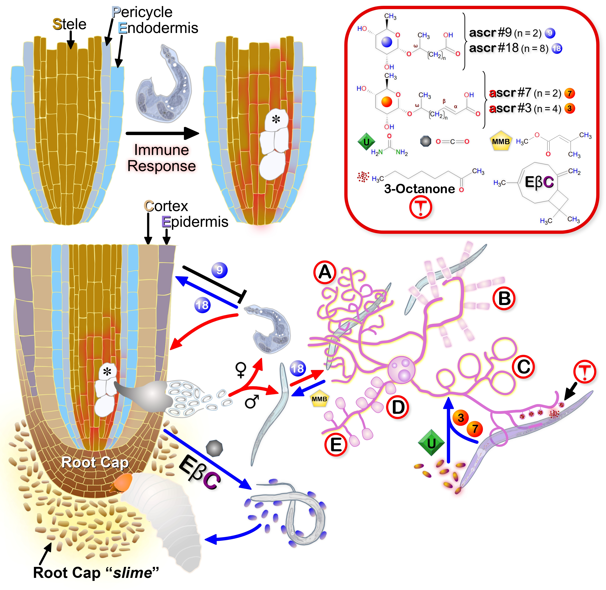

</figure>

**Figure 15. Nematode and the Rhizosphere**. **Nematodes** produce **ascarosides**, a highly conserved family of signaling molecules (e.g. **ascr#18**)**[@choe_ascaroside_2012]** that can activate well known immune defence responses (i.e. salicylic acid- and jasmonic acid-mediated signalling pathways) within **plants** (represented by the <span id="Red">highlighted</span> cells).**[@manosalva_conserved_2015]** This **ascaroside** induced immune response not only enhances **plant** resistance to **cyst** and **root-knot nematodes** (i.e. *H. schachtii*, *M. incognita*), but also **viruses** (Turnip Crinkle Virus), **bacteria** (*Pseudomonas syringae*), **fungi** (*Blumeria graminis* f. sp. *hordei*), and **oomycetes** (*Phytophthora infestans*).**[@manosalva_conserved_2015]** For example, the infectious juveniles (**IJ**s) of the infamous **root-knot nematode** *Meloidogyne incognita* can parasitize most cultivated **plant** species.**[@trudgill_apomictic_2001]** They penetrate the roots of **plants**, settle within the vascular cylinder (i.e. **stele**) of the root tip, and induce the formation of several large metabolically active multi-nucleated cells (&#10045; "*giant*" cells).**[@abad_genome_2008; @castagnone-sereno_diversity_2013]** To maintain these "*giant*" feeding cells *M. incognita* secretes "*effector*" proteins that help suppress host immune defences.**[@quentin_plant_2013]** Neighbouring cortical cells also undergo changes (i.e. proliferate and enlarge), ultimately resulting in the formation of **root galls**. The **IJ**s quickly develop into egg laying adults, and some of the eggs will give rise to motile *roundworms* that seek out new host **plants** using a small set of **<a class="one" href="http://www.wormbook.org/chapters/www_chemosensation/chemosensation.html" target="_blank" title="Go to WormBook">chemo-sensory neurons</a>**.**[@bargmann_chemosensation_2006]** Each of these specialized neurons detect either water soluble or volatile chemicals that serve as important short or long range olfactory signals.**[@bargmann_odorant-selective_1993; @hart_odors_2010]** For example, the **IJ**s of *Heterorhabditis bacteriophora* and *Steinernema carpocapsae*, as well as the **dauer** larval stage of free-living *C. elegans* are attracted to gaseous **C**<span id="Red">O</span><sub>2</sub>.**[@hallem_sensory_2011]** Presumably this behaviour is beneficial to the **IJ**s since it signals the location of a potential new host. For the **dauers** the odour may signal a potential new source of food (albeit decaying).
<br>
&nbsp; &nbsp; **Plants** also actively shape the composition of the **microbe** community found within the **Rhizosphere**.**[@haichar_plant_2008; @zhalnina_dynamic_2018]** This is accomplished in large part by the release of root **exude** that contains cells (i.e. border cells)**[@zhao_species-dependent_2000; @somasundaram_functional_2008; @driouich_root_2013; @hawes_root_2016]** and various chemicals, including: **(i)** primary metabolites (i.e. <span id="Gr2">photo</span>**synthate**),**[@walker_root_2003; @canarini_root_2019]** **(ii)** secondary metabolites (e.g. **<a class="one" href="https://pubchem.ncbi.nlm.nih.gov/compound/Caryophyllene" target="_blank" title="Got to PubChem">E-beta-Caryophyllene</a>**, or **E&beta;C**),**[@rasmann_recruitment_2005; @huang_major_2012; @chiriboga_m_root-colonizing_2018]** as well as **(iii)** special chemically "*edited*" compounds (i.e. **asc#18** &rarr; **asc#9**).**[@manohar_plant_2020]**
<br>
**(i)** **Exudates** secreted by the **root cap** of many **plant** species have been shown to induce a quiescent state within both free-living (i.e. *C. elegans*) and parasitic (i.e. *M. incognita*) **nematodes**.**[@zhao_species-dependent_2000; @driouich_root_2013]** This material contains thousands of **border cells** encased within a mucilaginous matrix (i.e. so called **root cap** "*slime*") that can be several millimetres thick.**[@driouich_root_2013]** This matrix is made up of a mixture of polysaccharides, secondary metabolites, proteins and extracellular DNA (**exDNA**).**[@hawes_root_2016]** The released **exDNA** protects **plant** roots against microbial infections similar to the way that **N**eutrophil **E**xtracellular **T**raps (**NETs**) protect animal tissue from microbial infections.**[@brinkmann_neutrophil_2004; @brinkmann_beneficial_2007; @driouich_root_2013]** **NETs** are "*sticky*" web-like **exDNA** structures decorated with anti-microbial proteins that trap and kill **microbes**.**[@brinkmann_neutrophil_2004; @brinkmann_beneficial_2007]** The effectiveness of these DNA-based traps is evident from the number of **microbes** (i.e. **bacteria**, **fungi**, **nematodes**) that produce **exDNA** degrading enzymes (i.e. **exDNases**).**[@sumby_extracellular_2005; @hawes_root_2016]** For example, the murine parasitic **nematode** *Nippostrongylus brasiliensis* secretes a deoxyribonuclease (**NbDNase II**) that degrades the **exDNA** backbone of **NETs**.**[@bouchery_hookworms_2020]** Many other types of **nematodes**, including *C. elegans*, as well as the **fungal** **plant** pathogen *Cochliobolus heterostrophus* harbour one or more **DNase II** genes that are capable of digesting **exDNA**.**[@dong_nematodes_2023; @park_dnase_2019]** In the case of *C. heterostrophus* we know that the secreted **exDNase** is an important virulence factor for maize **plants**, and that it likely degrades root cap secreted **exDNA** traps.**[@park_dnase_2019]** As for *C. elegans* we know that it harbours at least one secreted **DNase II** nuclease (**nuc-1**)**[@sulston_post-embryonic_1976]** that plays a role in the degradation of ingested bacterial DNA.**[@evans_dnase_2003]**
<br>
**(ii)** **Plants** produce many types of **secondary metabolites** (e.g. **<a class="one" href="/project/pnps/#Terp">Terpenoids</a>**) to deal with predatory *herbivores* and pathogenic **microbes**. For example the sesquiterpene **<a class="one" href="https://pubchem.ncbi.nlm.nih.gov/compound/Caryophyllene" target="_blank" title="Got to PubChem">E-beta-Caryophyllene</a>** (**E&beta;C**), which is a common component of floral scents,**[@knudsen_diversity_2006]** is secreted by the roots of maize **plants** damaged by Western corn rootworm (**WCR**) *Diabrotica virgifera virgifera*.**[@rasmann_recruitment_2005]** This attracts *Heterorhabditis megidis*, a well known **EPN**, which infection and kills **WCR** larvae.**[@rasmann_recruitment_2005; @degenhardt_restoring_2009]** Moreover, **E&beta;C** in combination with **C**<span id="Red">O</span><sub>2</sub> appears to be even more effective attractant for *H. megidis*.**[@turlings_importance_2012]** Currently their is allot of interest in using **EPN** as bio-control agents in crop pest management.**[@stock_morphology_2005; @lacey_entomopathogenic_2012]**
<br>
**(iii)** **<a class="one" href="https://pubchem.ncbi.nlm.nih.gov/#query=ascaroside" target="_blank" title="Go to PubChem">Ascarosides</a>** have been shown to induce the formation of **nematode** trap-like structures in several species of **fungi** (e.g. *Arthrobotrys oligospora*).**[@hsueh_nematode-trapping_2013; @yang_natural_2020]** Some of these **<a class="one" href="https://fungalwormlab.imb.sinica.edu.tw/" target="_blank" title="Go to Dr. Hsueh Lab website">nematode trapping fungi</a>** (**NT**<span id="Gr2">F</span>) also form traps in response to <span id="Gr2">N</span>-rich <span id="Gr3">urea</span> secreted by **bacteria** (e.g. *S. maltophilia*).**[@wang_bacteria_2014]** There are several different types of traps employed by **NT**<span id="Gr2">F</span>, including adhesive columns (<b>&#9399;</b>), constricting or non-constricting rings (<b>&#9400;</b>), as well as sessile (<b>&#9401;</b>) or stalked adhesive knobs (<b>&#9402;</b>).**[@nordbring-hertz_morphogenesis_2004; @jiang_nematode-trapping_2017; @su_trapping_2017]** Surprisingly **plants** have recently been shown to take up **ascarosides** (e.g. **ascr#18**) and metabolically modify them to generate a signal that repels parasitic root-knot **nematode** *Meloidogyne incognita*.**[@manohar_plant_2020]** This repulsive signal is actually made up of a specific blend (1:10 ratio) of two **ascarosides**, namely **ascr#18** and **ascr#9**.**[@manohar_plant_2020]** Clearly **plants** can not only "*listen*" to below-ground chemical signals generated by parasitic animals, but also weaponize them (i.e. via chemical "*editing*"), presumably to increase their chances of survival (i.e. increased fitness). In a similar vain some **bacteria** appear to enlist the help of **NT**<span id="Gr2">F</span> to deal with predatory **nematodes**. Both of these examples highlight the complex relationships that exist between multiple trophic levels within the **Rhizosphere**.**[@rasmann_root_2016]** Not to be outdone, the **NT**<span id="Gr2">F</span> *A. oligospora* has been shown to secrete volatile chemicals that attracts **nematodes**. Some of these chemicals mimic food "*cues*" while other, like methyl 3-methyl-2-butenoate (**MMB**), appear to mimic sex pheromones in several *Caenorhabditis* species.**[@hsueh_nematophagous_2017]**
<br>
**(iv)** Another notable *carnivorous* **fungi** that preys on **nematodes** is *Pleurotus ostreatus*, otherwise known as **Oyster Mushroom**. This common white-rot fungus produces small "*lollipop*"-shaped mycelial structures called **toxocysts** (<b><span id="Red">&#9417;</span></b>)**[@thorn_carnivorous_1984; @barron_destruction_1987; @barron_predatory_2003; @truong_characterization_2007]** that contain high concentrations of **<a class="one" href="https://pubchem.ncbi.nlm.nih.gov/compound/3-Octanone" target="_blank" title="Go to PubChem">3-octanone</span></a>**.**[@lee_carnivorous_2023]** When **nematodes** come in contact with the volatile ketone it rapidly causes damage to cell membranes. This leads to catastrophic changes in the levels of key cellular ions and metabolites (i.e. <span id="Ly">Ca</span><sup>+2</sup> and **ATP**) and ultimately necrotic cell death.**[@lee_carnivorous_2023]**  
(**Note:** showing both **toxocysts** and different types of **nematode** traps arising from the mycelial network of a single generic fungus is purely intended for illustrative purposes)  

</div>
<!------------------------------------------------>
<!----------------- END - FIG 15 ----------------->
<!------------------------------------------------>

<!----------------------------------------------------->
<!--------- SECTION 3B.3II - SOIL MESO-FAUNA  --------->
<!----------------------------------------------------->
<a id="SMites"> </a>
**<u>3B.3II** <span id="Br">Soil</span> **Meso-Fauna: Mites</u>.** These tiny **arachnids** belong to the subclass *Acari* (**mites** and **ticks**), which is essentially comprised of two large **<a class="one" href="https://evolution.berkeley.edu/evolution-101/" target="_blank" title="Go to Evolution 101">polyphyletic</a>** lineages (i.e. super-orders) known as *Parasitiformes* and *Acariformes*. Globally there are ~55,000 reported species, but the "*true*" number may be upwards of a million.**[@beaulieu_acari_2019]** Although **Acari** **mites** have some physical traits that are common among *Arachnida* (e.g. rigid exoskeleton or **cuticle**), they also posses unique features such as fused abdominal segments and cephalic appendages (i.e. **chelicerae** and **pedipalps**) that are used for feeding (i.e. no formal mouth parts). Physically **mites** range in size from <0.1 mm to upwards of 1 cm in length. While their small size allows them to fill many small ecological niches, it also makes them difficult to identify and study. Nevertheless, what they lack in size they certainly make up for in sheer numbers, since they can often exceed 100,000 individuals per m<sup>2</sup> of <span id="Br">soil</span> (i.e. make up ~40% of all <span id="Br">soil</span> micro-arthropod species).**[@potapov_feeding_2022]**  
&nbsp; &nbsp; **Mites** belonging to suborder *Oribatida* (Superorder: *Acariformes* > Order: *Sarcoptiformes* > Suborder: *Oribatida*) are one of the better known groups of <span id="Br">soil</span> **acarines**. This is due in part to their use as bio-indicators for assessing the impact of environmental changes on terrestrial ecosystems (e.g. mining pollution).**[@cuccovia_acarine_1999; @st_john_mite_2002; @eeva_leg_2009; @lumley_effects_2023]** Like some other invertebrates they are often one of the most abundant and diverse **animal** groups within <span id="Br">soils</span>, and their small size and limited movement (i.e. generally non-disperse) makes them more sensitive to local changes within their environment. Other reasons for their use as bio-indicators include: (i) they concentrate within the organic layers of <span id="Br">soils</span> and are thus easy to sample; (ii) they are also relatively easy to identify as mature adults; (iii) they occupy multiple trophic levels within <span id="Br">soil</span> food webs; (iv) they have relatively long adult lifespans and stable populations.**[@behan-pelletier_oribatid_1999; @burke_invasion_2011; @meehan_soil_2019; @manu_soil_2019; @lumley_effects_2023]** *Oribatid* **mites**, commonly referred to as "*beetle*" or "*armoured*" **mites**, are particulate feeders that physically break down **OM** into smaller digestible fragments. This comminuting process accelerates the microbial decomposition of <span id="Br">S</span>**OM** (i.e. increased surface area increases **exoenzymes** reaction rates). It is one of the reasons why **earthworms**, their **macro-fauna** comminuting counterparts, are so beneficial to agricultural <span id="Br">soils</span>. However, unlike **earthworms** many of these "*armoured*" **mites** possess a cuticle that is hardened by the addition of stored (i.e. epi-cuticular chambers or modified pores) calcium salts (i.e. calcium carbonate: <span id="Ly">Ca</span>**C**<span id="Red">O</span><sub>3</sub>, hydrated calcium oxalate: <span id="Ly">Ca</span> [**C**<span id="Red">O</span><span id="Red">O</span>]<sub>2</sub>&sdot;<span id="Blue">H</span><sub>2</sub><span id="Red">O</span>, and some form of calcium <span id="Purple">P</span>hosphate).**[@norton_calcium_1991; @alberti_fine_2001]** Besides providing a rigid support for internal structures (e.g. anchor attached muscles), the cuticle also protects **mites** from predators (i.e. those that lack strong mandibles, whereas other more formidable predators may be warded off by chemical defences).**[@heethoff_life_2018]** The cuticle may also represent an important **C** and <span id="Ly">Ca</span> "*sink*" within <span id="Br">soils</span>, but the significance of these bio-mineralized structures to elemental cycling is presently unclear. Nevertheless, by occupying multiple trophic levels within <span id="Br">soil</span> food webs (i.e. members of various feeding guilds) these **mites** can regulate other <span id="Br">soil</span> organism populations (i.e. **plants**, **fungi**, **meso-** and **micro-** **fauna**). Acarologists have often categorized the feeding habits of these micro-arthropods based on their gut contents: (i) **Macro-phytophages** - feed on higher plant material, including woody tissue (**xylophages**) and leaves (**phyllophages**); (ii) **Micro-phytophages** - feed on **fungi** (**mycophages**) and **algae** (**phycophages**); (iii) **Bacteriophages** -  feed on **bacteria**; (iv) **Panphytophages** - feed on both microbial and higher plant material; (v) **Polyphagous** - feed on **fungi**, **algae** and **animals** like **nematodes**.**[@behan-pelletier_oribatid_1999; @schneider_feeding_2004]** Fortunately the advent of more sophisticated mass spectrometry techniques allows researchers to identify multiple trophic levels within <span id="Br">soil</span> food webs using stable isotopic ratios (e.g. &delta;<sup>15</sup><span id="Gr2">N</span>, &delta;<sup>13</sup>**C**). What makes analysis of these rarer and heavier isotopes so interesting is the nature of their chemical bonds. The slightly higher energies required to break these slightly stronger covalent bonds means that they react more slowly than their lighter counterparts, and therefore subject to "*fractionation*" processes. For example, when **animals** digest and process food that contains these heavier isotopes they preferentially excrete the lighter isotopes since they more readily undergo biochemical reactions due to their lower energy constraints. As a result **animals** that occupy higher trophic levels will assimilate more heavier isotopes (i.e. <sup>15</sup><span id="Gr2">N</span> <sup>13</sup>**C**) resulting in higher isotopic signatures that may be unique within a given food web channel.


<!---- Delta Isotope Ratio Calculation ---->
<div id="myDiv44">
<a id="deltaX"></a>

&delta;<b>X</b> = (<b>R</b><sub>sample</sub>/<b>R</b><sub>std</sub> - 1) x 1000

where <b>X</b> is <sup>13</sup><b>C</b>, or <sup>15</sup><span id="Gr2">N</span> and <b>R</b> is the corresponding ratio <sup>13</sup><b>C</b>/<sup>12</sup><b>C</b>, or <sup>15</sup><span id="Gr2">N</span>/<sup>14</sup><span id="Gr2">N</span>.

</div>
<!----------------------------------------->

Unlike lighter elements the isotopic abundance of heavier elements like <sup>15</sup><span id="Gr2">N</span> vary, albeit subtly, within naturally occurring substances due to various **abiotic** and **biotic** fractionation processes.**[@hoering_variations_1955]** Modern mass spectrometry (**MS**) techniques can determine isotopic ratios with a high degree of precision relative to careful chosen standards (i.e. <1&permil;). For convenience the units for the &delta;<sup>15</sup><span id="Gr2">N</span> values are usually expressed in terms of parts per thousand (&permil;).**[@brand_high_1996]** Although there are some challenges and limitations to using isotopic **MS** techniques in ecology (e.g. establishing isotopic baselines for a given food web channels), it has nonetheless proven to be quite useful in deciphering the trophic structure of <span id="Br">soil</span> **fauna** communities. Unlike gut content analysis, some of which are eventually excreted, stable isotope ratios of tissues provides a more reliable record of the diet of **animals** (i.e. reflects food being assimilated over time). These types of studies have shown that **plants** and **consumers** undergo predictable step-wise increases in <sup>15</sup><span id="Gr2">N</span> within aquatic or terrestrial food webs.**[@deniro_influence_1981; @minagawa_stepwise_1984; @ponsard_what_2000]** Specifically **Post** (2002) showed that **animal** tissues are enriched in <sup>15</sup><span id="Gr2">N</span> and <sup>13</sup>**C** when compared to their food by ~3.4&permil; and <1&permil; per trophic level, respectively. Based on the range of &delta;<sup>15</sup><span id="Gr2">N</span> values detected in the study (i.e. 4.5&permil; to 13.6&permil;) **Post** estimated that he had captured the equivalent of nearly three trophic levels of variation.**[@post_using_2002]** When this technique was applied for the first time to *Oribatid* **mites** found within forest leaf "*litter*" (i.e. oak and beach forests) the &delta;<sup>15</sup><span id="Gr2">N</span> values formed a gradient spanning over 12 &delta; units (lowest: -7.74 &delta;<sup>15</sup><span id="Gr2">N</span>, *Carabodes labyrinthicus*, highest: +4.39 &delta;<sup>15</sup><span id="Gr2">N</span>, *Amerus troisii*). The authors were able to decipher three to four different trophic levels and show clear niche differentiation within the **mite** communities of these temperate forests. Specifically, the high &delta;<sup>15</sup><span id="Gr2">N</span> signature of *A. troisi* (i.e. 8 &delta;<sup>15</sup><span id="Gr2">N</span> units higher than the leaf "*litter*") suggested that this species most likely consumes **micro-fauna** such as **nematodes**.**[@schneider_trophic_2004]** The &delta;<sup>15</sup><span id="Gr2">N</span> values of other species that separated out along the gradient were classified as either secondary decomposers (i.e. feed on leaf "*litter*" material, fungi and micro-organisms) or primary decomposers (i.e. diet of decomposing **plant** material). However, the low -7.74 &delta;<sup>15</sup><span id="Gr2">N</span> value of *Carabodes labyrinthicus* stood out from all the rest. The authors pointed out that *C. labyrinthicus* is known to feed on algae and lichen and therefore falls into a separate feeding guild (i.e. **phycophagous**/**fungivorous**). Overall it appears that a given species occupies similar trophic niches within different forests (i.e. stable trophic level assignments).**[@schneider_trophic_2004; @maraun_stable_2011]** Moreover, having different species of *Oribatid* **mites** occupy different trophic niches suggests that food resources are being partitioned among these **animals**, presumably increasing **mite** biodiversity in the process.**[@schneider_trophic_2004]**  
&nbsp; &nbsp; More recent stable isotope studies (i.e. using both &delta;<sup>15</sup><span id="Gr2">N</span> and &delta;<sup>13</sup>**C**) over the last 20 years have shown that some 261 different species of *Oribatid* **mites** can be categorized as belonging to one of seven different trophic groups: (i) fungal feeders/secondary decomposers, (ii) primary decomposers, (iii) predators/scavengers, (iv) fungal feeders/secondary decomposers with <span id="Ly">Ca</span>**C**<span id="Red">O</span><sub>3</sub> hardened cuticles, (v) lichen feeders, (vi) moss feeders, and (vii) marine algal feeders.**[@maraun_new_2023]** In general approximately one third of the *Oribatid* **mite** species maintain their trophic niches regardless of location or habitat type (i.e. temperate and tropical forests), whereas the remaining two thirds of the species show some degree of flexibility or "*plasticity*" in their trophic niche assignments. This would suggest that *Oribatida* are capable of varying their trophic niche, and sometimes trophic level, according to what food is available within a given habitat. These changes in diet can shift their isotopic signatures because of differing food energy channels (i.e. base food may be more or less enriched in <sup>15</sup><span id="Gr2">N</span> and/or <sup>13</sup>**C**). This apparent trophic "*plasticity*" is certainly evident in the reduced number of trophic levels at coarser taxonomic ranks (i.e. *a*mount of *v*ariance *e*xplained *b*y species > ...genus > ...family > ...suborder).**[@maraun_new_2023]** 
	

```{r eval=FALSE, echo=FALSE, error=FALSE, warning=FALSE, message=FALSE}

### read in excel file data, skip first 4 lines of descriptive text
### and re-name stale isotope value columns
data_meta2 <- read_excel("011App_Table2_15N_13C.xlsx", skip=4) %>%
  rename("delta_13C"="13C","delta_15N"="15N")

### raw plot of stable isotope data base calibrated to litter values
Plot1 <- data_meta2 %>% ggplot(aes(x=delta_13C, y=delta_15N)) +
  geom_hline(yintercept = 0, linetype="dashed", color="blue") +
  geom_vline(xintercept = 0, linetype="dashed", color="blue") +
  geom_point(alpha=.4, size=3) +
  theme_bw() +
  labs(x = expression(paste(delta ^13, "C (???, litter calibrated)")),
       y = expression(paste(delta ^15, "N (???, litter calibrated)"))
       )

### Number of species in each study
NumSpp <- data_meta2$Reference %>% table %>% sort

### Statistical modelling across taxonomic ranks
### Delta 13C
df <- data_meta2 %>% filter(!is.na(Genus))

mC_suborder <- lme(delta_13C~Suborder,
                   random=~1|Reference, df, na.action = na.omit)

mC_superfamily <- lme(delta_13C~Superfamily,
                      random=~1|Reference, df, na.action = na.omit)

mC_family <- lme(delta_13C~Family,
                 random=~1|Reference, df, na.action = na.omit)

mC_genus <- lme(delta_13C~Genus,
                random=~1|Reference, df, na.action = na.omit)

mC_species <- lme(delta_13C~species,
                  random=~1|Reference, df, na.action = na.omit)

### Delta 15N
mN_suborder <- lme(delta_15N~Suborder,
                   random=~1|Reference, df, na.action = na.omit)

mN_superfamily <- lme(delta_15N~Superfamily,
                      random=~1|Reference, df, na.action = na.omit)

mN_family <- lme(delta_15N~Family,
                 random=~1|Reference, df, na.action = na.omit)

mN_genus <- lme(delta_15N~Genus,
                random=~1|Reference, df, na.action = na.omit)

mN_species <- lme(delta_15N~species,
                  random=~1|Reference, df, na.action = na.omit)

### Summary table using kable
R2.Table <- rbind(rbind(mC_suborder %>% r.squaredGLMM %>% as.data.frame %>%
              mutate(fixed_effect="suborder"),
            mC_superfamily %>% r.squaredGLMM %>% as.data.frame %>%
              mutate(fixed_effect="superfamily"),
            mC_family %>% r.squaredGLMM %>% as.data.frame %>%
              mutate(fixed_effect="family"),
            mC_genus %>% r.squaredGLMM %>% as.data.frame %>%
              mutate(fixed_effect="genus"),
            mC_species %>% r.squaredGLMM %>% as.data.frame %>%
              mutate(fixed_effect="species")) %>%
        mutate(response_variable="delta_13C"),
      rbind(mN_suborder %>% r.squaredGLMM %>% as.data.frame %>%
              mutate(fixed_effect="suborder"),
            mN_superfamily %>% r.squaredGLMM %>% as.data.frame %>%
              mutate(fixed_effect="superfamily"),
            mN_family %>% r.squaredGLMM %>% as.data.frame %>%
              mutate(fixed_effect="family"),
            mN_genus %>% r.squaredGLMM %>%
              as.data.frame %>% mutate(fixed_effect="genus"),
            mN_species %>% r.squaredGLMM %>% as.data.frame %>%
              mutate(fixed_effect="species")) %>%
        mutate(response_variable="delta_15N")) %>%
  select(response_variable, fixed_effect, R2m, R2c) %>%
  mutate_at(vars(R2m, R2c), ~round(.,3)) %>%
  rename("Fixed effects"="fixed_effect", "Marginal R2"="R2m",
         "Conditional R2"="R2c")

R2Table <- R2.Table %>% select(-1) %>% kbl() %>%
  kable_classic(full_width = F,
                html_font = "Cambria",
                position="center") %>%
  pack_rows("Oribatida delta 13C", 1, 5) %>%
  pack_rows("Oribatida delta 15N", 6, 10)

R2Table

### install `webshot2`and `Ghostscript` (later for Windows users)
### %>% save_as_image(R2.Table, path = 'final_table.png', webshot = 'webshot2')
### %>% save_kable("image.png")

df2 <- df %>% rename("mean_d13C"="13C mean","mean_d15N"="15N mean")
df3 <- df2 %>% filter(!is.na(mean_d13C))

Plot2 <- df3 %>% ggplot(aes(x = mean_d13C, y = mean_d15N, colour = group)) +
  geom_hline(yintercept = 0, linetype="dashed", color="blue") +
  geom_vline(xintercept = 0, linetype="dashed", color="blue") +
  geom_point(alpha=.7, size=3) +
  theme_bw() +
  labs(x = expression(paste("Mean ", delta ^13, "C (litter calibrated)")),
       y = expression(paste("Mean ", delta ^15, "N (litter calibrated)")),
       color = "Trophic Group")

### ggsave("Plot2.jpeg", width = 8, height = 5)

Plot2

```


```{r eval=FALSE, echo=FALSE, error=FALSE, warning=FALSE, message=FALSE}

### df Trophic Group subsets
# TGdecomp <- df3 %>% subset(group == "decomp")

### generate df with isotope means and std.devs per Trophic Group
TGdf3.sum <- df3 %>%
  group_by(group) %>%
  summarise(n_observ = n(),
            sum_15N = sum(mean_d15N),
            sum_13C = sum(mean_d13C),
            C13m = mean(mean_d13C),
            C13sd = sd(mean_d13C),
            N15m = mean(mean_d15N),
            N15sd = sd(mean_d15N))

Plot3 <- df3 %>% ggplot(aes(x = mean_d13C, y = mean_d15N, colour = group)) +
  geom_hline(yintercept = 0, linetype="dashed", color="blue") +
  geom_vline(xintercept = 0, linetype="dashed", color="blue") +
  geom_point(alpha=.4, size=2.5) +
  theme_bw() +
  labs(x = expression(paste("Mean ", delta ^13, "C (litter calibrated)")),
       y = expression(paste("Mean ", delta ^15, "N (litter calibrated)")),
       color = "Trophic Group") +
  geom_pointrange(aes(x = C13m, y = N15m,
                     ymin = N15m-N15sd, ymax = N15m+N15sd),
                   data = TGdf3.sum) +
  geom_errorbarh(aes(x = C13m, y = N15m,
                     xmax = C13m+C13sd, xmin = C13m-C13sd),
                 data = TGdf3.sum)

ggsave("Plot3.jpeg", width = 8, height = 5)

Plot3

```


```{r eval=FALSE, echo=FALSE, error=FALSE, warning=FALSE, message=FALSE}

### counts for each `factor` within a column
GroupTable <- fct_count(df3$group, sort = FALSE)
write.csv(GroupTable, "GrTable.csv")

#### number/count for each Species 
SpTable <- fct_count(df2$species, sort = TRUE)
write.csv(SpTable, "SpTable.csv")

#### R2 parameter for NLM stats 
write.csv(R2.Table, "R2Table.csv")

#### TGdf3.sum table 
write.csv(TGdf3.sum, "TGsumTable.csv")

```


<a id="Tab2Orib"> </a>
<!--------------------------------------------------------->
<!------- TABLE 3 - Oribatida R2 variable NLM stat -------->
<!--------------------------------------------------------->
<table class="Table">
    <thead>
      <tr style="text-align:left">
        <td colspan="4"><span id="Blk20"><span id="Blk">TABLE 3. Taxonomic Variations in <i>Oribatida</i> &delta;<sup>15</sup><span id="Gr2">N</span> and &delta;<sup>13</sup><b>C</b> Values</td>
      </tr>
    <thead>
    <thead>
      <tr>
        <td class="tmid2"><span id="Blk">Response Variable</span></td>
        <td class="tmid2"><span id="Blk">Fixed Effects</span></td>
        <td class="tmid2"><span id="Blk">Marginal <i>R</i><sup>2</sup></span></td>
        <td class="tmid2"><span id="Blk">Conditional <i>R</i><sup>2</span></td>
      </tr>
    </thead>
    <body>
      <tr>
        <td class="tmid">&delta;<sup>13</sup><b>C</b></td>
        <td><b>Suborder</b></td>
        <td class="tmid">0.157</td>
        <td class="tmid">0.448</td>
      </tr>
      <tr>
        <td class="tmid">&delta;<sup>13</sup><b>C</b></td>
        <td><b>Superfamily</b></td>
        <td class="tmid">0.29</td>
        <td class="tmid">0.561</td>
      </tr>
      <tr>
        <td class="tmid">&delta;<sup>13</sup><b>C</b></td>
        <td><b>Family</b></td>
        <td class="tmid">0.347</td>
        <td class="tmid">0.596</td>
      </tr>
      <tr>
        <td class="tmid">&delta;<sup>13</sup><b>C</b></td>
        <td><b>Genus</b></td>
        <td class="tmid">0.432</td>
        <td class="tmid">0.68</td>
      </tr>
      <tr>
        <td class="tmid">&delta;<sup>13</sup><b>C</b></td>
        <td><b>Species</b></td>
        <td class="tmid">0.598</td>
        <td class="tmid">0.837</td>
      </tr>
        <td class="tmid">&delta;<sup>15</sup><span id="Gr2">N</span></td>
        <td><b>Suborder</b></td>
        <td class="tmid">0.055</td>
        <td class="tmid">0.268</td>
      </tr>
      <tr>
        <td class="tmid">&delta;<sup>15</sup><span id="Gr2">N</span></td>
        <td><b>Superfamily</b></td>
        <td class="tmid">0.305</td>
        <td class="tmid">0.45</td>
      </tr>
      <tr>
        <td class="tmid">&delta;<sup>15</sup><span id="Gr2">N</span></td>
        <td><b>Family</b></td>
        <td class="tmid">0.441</td>
        <td class="tmid">0.516</td>
      </tr>
      <tr>
        <td class="tmid">&delta;<sup>15</sup><span id="Gr2">N</span></td>
        <td><b>Genus</b></td>
        <td class="tmid">0.596</td>
        <td class="tmid">0.653</td>
      </tr>
      <tr>
        <td class="tmid">&delta;<sup>15</sup><span id="Gr2">N</span></td>
        <td><b>Species</b></td>
        <td class="tmid">0.691</td>
        <td class="tmid">0.746</td>
      </tr>
    </tbody>
</table>

<b>Table 3.</b> Data from the statistical model used in the **Maraun** (2023) meta-study is shown above. The specific linear mixed-effect (*lme*) model varied in its ability to account for all of the variation within the data (i.e. &delta;<sup>15</sup><span id="Gr2">N</span> and &delta;<sup>13</sup>**C** values). Specifically, the explanatory power of the *lme* model waned as you moved up the taxonomic ranks (i.e. species &rarr; genus &rarr; family &rarr; superfamily &rarr; suborder level).**[@maraun_new_2023]** In particular the coefficient of determination (**<i>R</i><sup>2</sup>**), which is commonly used in linear regression models, was used by the investigators to quantify the proportion of variance in the dependent variable (i.e. &delta; values) that could be explained by the independent fixed variable (i.e. specific taxon). The **marginal** **<i>R</i><sup>2</sup>** represents the variance explained by the fixed effects (i.e. specific taxon), whereas the **conditional** **<i>R</i><sup>2</sup>** represents the variance explained by the entire model (i.e. both fixed and random effects). The *lme* model was chosen by the researchers because of the non-independent nature of the data (i.e. variability within a taxonomic group is not independent like the variability between different taxonomic groups). 


<a id="Fig16Orib"> </a> 
<!----------------------------------------------------------->
<!--------------- START - FIG 16 - Oribatida  --------------->
<!----------------------------------------------------------->
<div style="border: 2px solid gray; padding: 5px;">

<figure>

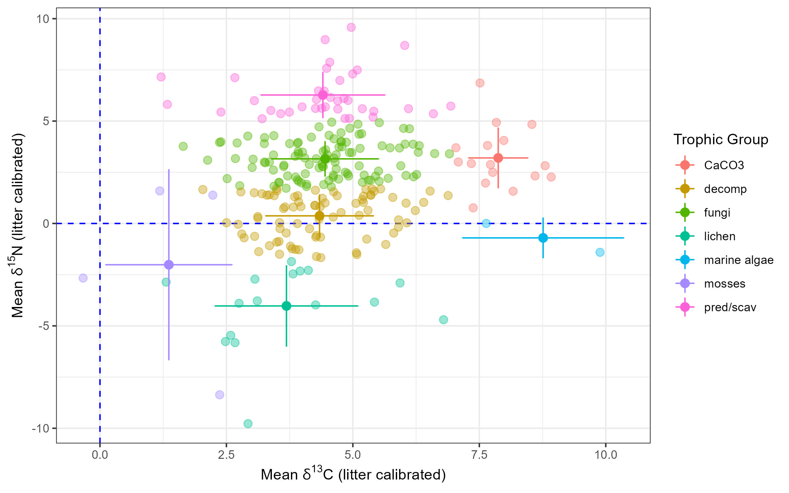

</figure>

**Figure 16. <i>Oribatida</i> Stable Isotope Values and Trophic Niches**. The above plot shows the mean &delta;<sup>15</sup><span id="Gr2">N</span> versus  mean &delta;<sup>13</sup>**C** values of 261 different species of *Oribatid* **mites**. The data used in the above plot is from a meta-study by **Maraun** et. al. (2023), which can be downloaded from the open data publishing platform **<a class="one" href="https://datadryad.org/stash/dataset/doi:10.5061/dryad.bcc2fqzgj#usage" target="_blank" title="Go to Dryad">Dryad</a>**.**[@maraun_new_2023]** Stable isotope &delta; values (n = 472) were amassed from 25 different research studies (i.e. total of 30 different locations) that analyzed the trophic ecology of *Oribatid* **mites** (*Oribatida*). In most of the early studies generating stable isotope signatures required pooling of specimens (i.e. limited biomass sensitivity of early methods). The vast majority of the analyzed specimens (i.e. 464 of the 472) were identified to the *Genus* or *species* level. The resulting 261 identified species (data points show above) were then assigned to one of seven trophic groups, namely: (i) fungal feeders/secondary decomposers (107/261, ~41%), (ii) primary decomposers (79/261, ~30.3%), (iii) predators/scavengers (37/261, ~14.2%), (iv) fungal feeders/secondary decomposers with <span id="Ly">Ca</span>**C**<span id="Red">O</span><sub>3</sub> hardened cuticles (16/261, ~6.1%), (v) lichen feeders (16/261, ~6.1%), (vi) moss feeders (4/261, ~1.5%), and (vii) marine algal feeders (2/261, ~0.8%).**[@maraun_new_2023]** Average &delta; values per trophic group are also plotted above with the standard deviations serving as error bars. The three most abundant trophic groups (<span id="Grod">decomp</span>, <span id="Gr3">fungi</span>, <span id="Magenta">pred/scav</span>) are connected to one another due to their common food base (**Note:** they share the same range of &delta;<sup>13</sup>**C** values but vary in the amount of <sup>15</sup><span id="Gr2">N</span> enrichment, resulting in the "*stacked*" appearance of the three groups). The taxa that feed on either <span id="BGr">lichen</span>, <span id="V2">mosses</span>, or <span id="SkyB">marine algae</span> look like outliers due to the low levels of <sup>15</sup><span id="Gr2">N</span> enrichment. This is due to the fact that they do not consume dead organic material (i.e. different base food creates a separate energy channel within the food web). Lastly, **mites** belonging to taxa that have cuticles hardened by <span id="Ly">Ca</span>**C**<span id="Red">O</span><sub>3</sub> (<span id="Salmon">CaCO3</span>) show relatively high levels of <sup>13</sup>**C** enrichment. This is expected given that the **C** found in the <span id="Ly">Ca</span>**C**<span id="Red">O</span><sub>3</sub> salts have undoubtedly being subjected to multiple "*fractionation*" steps (i.e. both **biotic** and **abiotic**). This claim is supported by the fact that when these specimens were pre-treated with acid to dissolve the carbonate rich cuticles the &delta;<sup>13</sup>**C** values decreased by ~4&delta; units. Also note that the levels of <sup>15</sup><span id="Gr2">N</span> enrichment within the <span id="Salmon">CaCO3</span> group have the same range as the <span id="Gr3">fungi</span> group, which make the elevated &delta;<sup>13</sup>**C** values a unique feature of this group.**[@maraun_stable_2011]**  

</div>

<!----------------------------------------------------------->
<!---------------- END - FIG 16 - Oribatida  ---------------->
<!----------------------------------------------------------->

The use of stable isotope signatures have substantially increased our understanding *Oribatida* trophic ecology within <span id="Br">soils</span>. However, most of these types of studies (including the sole Canadian study) have been only carried out within forest ecosystems (i.e. temperate, boreal or tropical).**[@maraun_new_2023]** Currently no stable isotope analysis of *Oribatid* **mite** trophic ecology has been carried out within Tallgrass prairies despite the fact that grassland ecosystems support high levels of micro-arthropod biodiversity.**[@fay_insect_2003; @whiles_ecological_2006; @joern_ecological_2013; @solascasas_edaphic_2022]** And although *Oribatida* are perhaps the most well known and biodiverse group of **acarines** in Canada, some two thirds of the estimated 1800 to 3000 species predicted to exist in Canada remain undescribed.**[@beaulieu_acari_2019]** Unfortunately our poor understanding of **meso-fauna** within Tallgrass communities is typical of most flora and fauna that resides within this most endangered ecosystem within North America.**[@rodger_tallgrass_1998; @tallgrass_ontario_tallgrass_2019]**


<!------------------------------------------------------->
<!--------- SECTION 3B.3III - SOIL MACRO-FAUNA  --------->
<!------------------------------------------------------->
<a id="SEw"> </a>
**<u>3B.3III** <span id="Br">Soil</span> **Macro-Fauna: Earthworms</u>.** Both **meso**- and **macro**-**fauna** form complex multi-trophic food webs within <span id="Br">soils</span>. While most of these organisms have the unenviable task of consuming dead **organic** matter (i.e. **detritivores**), some also carry out other important <span id="Br">soil</span> functions. For example, *Lumbricus terrestris*, often referred to as the common **earthworm** (aka: dew-worm, or nightcrawler), is a European species that is now found throughout most of North America.**[@hendrix_exotic_2002]** It is one of many **earthworm** species, belonging to the *Oligochaeta* subclass of annelids, that often form the dominant <span id="Br">soil</span> **macro**-**fauna** within temperate forests and grasslands.**[@hedenec_global_2022]** They, particularly **anecic** (deep burrowers) and **endogeic** (shallow burrowers) species, are capable of consuming large amounts of <span id="Br">soil</span> material.**[@blouin_review_2013; @medina-sauza_earthworms_2019]** A polysaccharide-rich mucus released by the secretory glands of these animals aids in this digestive process. It not only acts as a lubricant, but also contains digestive enzymes (e.g. cellulases, chitanases) that help break down **OM** within the anterior portion of the gut.**[@parle_micro-organisms_1963; @lavelle_intestinal_1983; @barois_changes_1986; @drake_as_2007]** The mucus also stimulates <span id="Br">soil</span> **bacteria** residing within the gut (i.e. *micro-flora*) to help break down <span id="Br">S</span>**OM**. Although large **microbes**, like filamentous **fungi**, are mechanically sheared within the gizzard, smaller **bacteria** can survive. In fact some studies suggest that their numbers actually increase while transiting the gut.**[@parle_micro-organisms_1963; @schonholzer_origins_1999]** Access to high energy mucopolysaccharides within the fore-gut apparently "*primes*" the anaerobic metabolism of the **bacteria**. In return, **earthworms** gain access to assimilable **OM** released by the activated "*micro-flora*".**[@barois_changes_1986; @trigo_changes_1993; @trigo_soil_1995; @drake_as_2007]** This mutualistic relationship between **earthworms** and <span id="Br">soil</span> **bacteria** is similar to many other types of animal-microbe partnerships found in nature (e.g. human micro-biota).**[@hou_microbiota_2022]**  
&nbsp; &nbsp; The impact that **earthworms** exert on <span id="Br">soils</span> is not limited to their status within trophic food webs. As alluded to above **earthworms** are often classified as either **epigeic**, **anecic**, or **endogeic**. Although these three main classes or archetypes do not fully reflect the continuum of traits associated with these animals (e.g. *L. terrestris* can be classified as an **epi-anecic** species), they nevertheless do provide a convenient functional guide when discussing the ecology of these animals.**[@bottinelli_explicit_2020]** Specifically, **epigenic earthworms** feed on decomposing surface "*litter*" and limit their movements to the surface and very upper layer of <span id="Br">soil</span>. **Anecic earthworms**, such as *L. terrestris*, also feed on high quality **plant** "*litter*", but they also dig vertical burrows. They transport the leaf "*litter*" down these holes and produce "*castings*" on the surface. Lastly, **endogeic earthworms** live within the upper <span id="Br">soil</span> layers where they construct non-permanent horizontal burrows. They feed on the <span id="Br">S</span>**OM** they excavate, which is of lower nutritional value than leaf "*litter*". Since the quality of their food is poor, <span id="Br">soil</span> ingestion rates and burrowing activities (including mucus production) likely exact a high energy cost on these animals. Although the "*casts*" produced by these animals take on different shapes (i.e. often used to identify species), their make up is generally similar (i.e. clay minerals, mucus, **OM** and **microbes**). Even the protein content of the mucus produced by both **anecic** and **endogeic earthworms** has been shown to be quite similar to one another using infrared spectroscopy techniques (ATR-FTIR).**[@guhra_earthworm_2020]** Overall these unique micro-aggregate structures exert many positive effects on the physical-chemical properties of <span id="Br">soils</span> (e.g. macro-pore structure, air permeability, particle stability, nutrient dynamics). For example, the large amounts of mucus produced by **earthworms** appears to act as a "*bridging*" agent that promotes the adsorption of **organic** compounds onto mineral surfaces.**[@guhra_functional_2024]** Because of the many positive affects that **earthworms** have on <span id="Br">soil</span> communities (e.g. improved **plant** and crop growth, increased nutrient cycling)**[@brown_regulation_2000; @scheu_effects_2003; @forey_importance_2011; @clause_earthworms_2016; @johnson-maynard_linking_2016]** ecologists often referred to them as **ecosystem engineers**.**[@lavelle_soil_2006; @blouin_review_2013]**


>*The plough is one of the most ancient and most valuable of man's inventions; but long before he existed the land was in fact regularly ploughed, and still continues to be thus ploughed by earth-worms. It may be doubted whether there are many other animals which have played so important a part in the history of the world, as have these lowly organised creatures*.**[@darwin_formation_1881]**


Unfortunately, the vast majority of **earthworms** in Canada east of the Pacific Northwest are exotic invasive species.**[@hendrix_exotic_2002; @reynolds_checklist_2014; @moore_review_2022; @mathieu_multiple_2024]** According to **Reynolds** (2014) 21 species from three families (*Lumbricidae*, *Megascolecidae* and *Sparganophilidae*) have been identified from county collections across Ontario, and of these only two species (*Bimastos parvus* and *Sparganophilus eiseni*) are considered native to North America.**[@reynolds_checklist_2014]** **Essex** county alone was found to have 14 non-native **earthworm** species. They like most eastern Canadian **earthworm** populations probably did not exist prior to European settlement due to the impact of the last great ice age 11.7 thousand years ago.**[@reynolds_distribution_1994]** Fossil records of **earthworms** in Canada is largely limited to ancestral annelids from the Cambrian age (i.e. famous **Burgess Shale Formations** of western Canada),**[@nanglu_new_2018]** while those belonging to more modern day soft bodied **Oligochaetes** are essentially non-existent.  
&nbsp; &nbsp; **Earthworm** populations can be beneficial in an agricultural setting, but since most are non-native species in Canada they likely exert some form of harm on natural ecosystems. In fact numerous studies of northern Temperate and Boreal forests have shown that non-native **earthworms** can negatively impact the composition and function of **plant** communities within these habitats.**[@callaham_different_2001; @bohlen_non-native_2004; @hale_changes_2006; @frelich_earthworm_2006; @holdsworth_effects_2007; @forey_importance_2011; @hopfensperger_influence_2011; @clause_earthworms_2016; @clause_seed_2017; @craven_unseen_2017]** Moreover, both meta-analysis and stand alone studies of forest <span id="Br">soil</span> invertebrate communities have shown an overall negative decline in their diversity and densities in response to non-native **earthworm** invasions.**[@eisenhauer_invasion_2007; @eisenhauer_action_2010; @burke_invasion_2011; @ferlian_invasive_2018; @jochum_earthworm_2021]** The amount of environmental harm caused by these exotic species often depends upon the presence of multiple ecological groups (i.e. **epigeic**, **anecic**, and **endogeic** species), as well as the chemistry of the leaf "*litter*" (i.e. palatability, **C**/<span id="Gr2">N</span> ratio) and <span id="Br">soil</span> itself (i.e. temperature, **pH**, moisture). For example, when exotic **earthworm** species consume most of the leaf "*litter*" layer they dramatically alter the distribution and availability of nutrients (e.g. **C**, <span id="Gr2">N</span>, <span id="Purple">P</span>, <span id="Ly">Ca</span><sup>+2</sup>) within <span id="Br">soils</span>.**[@scheu_effects_1994; @bohlen_influence_2004; @groffman_exotic_2004; @bohlen_non-native_2004; @hale_effects_2005; @eisenhauer_invasion_2007; @resner_invasive_2015]** Loss of the leaf "*litter*" as well as the underlying **OM** increases <span id="Br">soil</span> erosion and compromises <span id="Br">soil</span> micro-climates that both flora (i.e. seedlings, seeds, tree roots) and fauna (i.e. invertebrates) need to survive, ultimately leading to forest die-back (e.g. exposed forest floor alters <span id="Br">soil</span> temperatures, moisture levels, and predator-prey dynamics).**[@frelich_side-swiped_2019]** Exotic **earthworms** can also alter the composition of <span id="Br">soil</span> **microbe** communities (i.e. **fungal** versus **bacterial** dominated populations) and in turn nutrient cycling within <span id="Br">soils</span> (e.g. change **C** mineralization and **C** stabilization balance).**[@zhang_earthworms_2013; @lejoly_earthworm-invaded_2023]** Unfortunately there is very little known about the influence of **earthworms**, both native and non-native, on existing Tallgrass communities (<span id="Gr2">TGC</span>) like <span id="Dred">OPC</span>. Some of the early studies of native and non-native **earthworms** within North American <span id="Gr2">TGC</span> were done at **<a class="one" href="https://kpbs.konza.k-state.edu/" target="_blank" title="Go to Konza">Konza Prairie Research Natural area</a>** (**KPRNA**). This 3,487 hectare native Tallgrass prairie preserve is located within the northern Flint Hill region of Kansas (*aka* Bluestem pastures). Like <span id="Dred">OPC</span> the dominate Tallgrass species within this Kansas prairie are Big Bluestem (**<a class="one" href="https://www.inaturalist.org/taxa/121968-Andropogon-gerardi" target="_blank" title="Go to iNaturalist">Andropogon gerardi</a>**), Little Bluestem (**<a class="one" href="https://www.inaturalist.org/taxa/122603-Schizachyrium-scoparium" target="_blank" title="Go to iNaturalist">Schizachyrium scoparium</a>**), and Indian-grass (**<a class="one" href="https://www.inaturalist.org/taxa/122608-Sorghastrum-nutans" target="_blank" title="Go to iNaturalist">Sorghastrum nutans</a>**). One of the earlier field studies of native and non-native **earthworms** at **KPRNA** determined <span id="Br">soil</span> nutrient consumption by analyzing the "*castings*" deposited by these animals.**[@james_soil_1991]** **James** (1991) showed that even though non-native *Lumbrcidae* species were more abundant than native *Diplocardia* species (i.e. within the organic-rich Benfield <span id="Br">soils</span>) the latter processed more nutrients per unit biomass (i.e. <span id="Gr2">N</span>, <span id="Purple">P</span>).**[@james_soil_1991]** Overall, he estimated that all of the **earthworms** consumed a mass equivalent of 4-6% of the top 15 cm surface <span id="Br">soil</span> each year (i.e. ~10% of the total <span id="Br">S</span>**OM** based on bulk density of 1 gm/cm<sup>3</sup>). However, since these estimates are based on surface "*castings*" they likely under-estimate the actual amount of **OM** processed by these animals each year. Presumably, if native **earthworm** species make more nutrients available for **plants**, but are being replaced by the less efficient non-native species, than this could adversely affect the overall productivity of the prairies.  
&nbsp; &nbsp; The different behaviours exhibited by native and non-native **earthworms** were also highlighted in another **KPRNA** based study that used stable isotopic tracers (<sup>15</sup><span id="Gr2">N</span> and <sup>13</sup>**C**) to study **earthworm** interactions with **plants** (*A. gerardi*) and <span id="Br">soil</span> microbes.**[@callaham_different_2001]** The native (*Diplocardia* spp.) and non-native (*Octolasion tyrtaeum*) **earthworms** used in this study are both **endogeic** species that utilize the same food resources. The authors found that the native *Diplocardia* spp. were significantly more active than *O. tyrtaeum*, with the former preferring to occupy the shallower <span id="Br">soil</span> depths (83% in top 10 cm) while *O. tyrtaeum* preferred the deeper <span id="Br">soil</span> depths (81% in bottom 10-20 cm). The greater activity of *Diplocardia* spp. did not increase the productivity of *A. gerardi* like earlier studies have shown,**[@james_nitrogen_1986]** nor did it produce any consistent changes in the size of the microbial pools of **C** and <span id="Gr2">N</span>. In fact the activity of *Diplocardia* spp. (i.e. assimilation of <span id="Gr2">N</span>) appeared to come at the expense of *A. gerardi* since the final above-ground **plant** biomass in the presence of these native **earthworms** was significantly less when compared to controls. The conflicting results between these two studies may be due in large part to the differences in their experimental design, since **James** and **Seastedt** (1986) used *A. gerardi* started from rhizomes that were grown in an environmental chamber, while **Callaham** and colleagues (2001) used *A. gerardi* seedlings grown in field core samples.**[@james_nitrogen_1986; @callaham_different_2001]**  
&nbsp; &nbsp; Native and exotic species of **earthworms** have also been shown to respond differently to a mix of disturbance regimes typically associated with grasslands (i.e. fire, grazing, <span id="Gr2">N</span> and <span id="Purple">P</span> levels).**[@callaham_macroinvertebrates_2003]** **Callaham** and colleagues (2003) showed that the density and biomass of native *Diplocardia* spp. was significantly greater in mowed (i.e. grazing simulated treatment) plots compared to either: (i) un-mowed plots, and (ii) <span id="Purple">P</span> treated plots that were mowed or un-mowed. Conversely, the density and biomass of non-native *Aporrectodea* spp. were significantly greater in plots that were un-burned and supplemented with <span id="Purple">P</span> when compared to: (i) un-burned plots with no <span id="Purple">P</span> supplements, or (ii) burned plots &pm; <span id="Purple">P</span>. The researchers also looked for any significant higher order interactions between treatment groups for two separate field experiments (end of season 1994 and 1999). Specifically the data (i.e. all multiple nested treatments) was subjected to mixed model analysis of variance (i.e. mixed ANOVA), with the main effect variables of the split-strip plot design being: (i) burn, (ii) mowed, (iii) <span id="Gr2">N</span> amendments, and (iv) <span id="Purple">P</span> amendments. This produced a total of 16 independent variables that could affect the proportion of native *Diplocardia* spp. within each field plot. Their analysis showed that there was a significantly (i.e. mean differences, *P* &le; 0.05) greater proportion of native *Diplocardia* spp. versus non-native *Aporrectodea* spp. in: (i) burned plots versus burned plots treated with both <span id="Gr2">N</span> and <span id="Purple">P</span> amendments; and (ii) mowed burned plots treated with <span id="Gr2">N</span> and <span id="Purple">P</span> versus un-mowed burned plots treated with the same fertilizer mix.**[@callaham_macroinvertebrates_2003]** A duplicate experiment carried out 5 years later showed slightly different trends. For example, mowing increased the proportion of *Diplocardia* spp. for each of the four treatments (&pm; burn, &pm; <span id="Gr2">N</span>, &pm; <span id="Purple">P</span>, &pm; <span id="Gr2">N</span> and <span id="Purple">P</span>) when compared to matched un-burned treatments, whereas *Aporrectodea* spp. trended toward increased numbers within un-burned plots, or plots that received <span id="Gr2">N</span> amendments.**[@callaham_macroinvertebrates_2003]** This study suggests that *Diplocardia* spp. (and perhaps other native **earthworms**) are more well adapted to fire and grazing type disturbances that are typical of Tallgrass prairies than *Aporrectodea* spp. (and perhaps other their exotic species). Nevertheless the correlative nature of these results are not entirely satisfactory. Obviously there is great need for more research in this area given the negative impacts of invasive **earthworms** and our changing climate. This is particularly "*true*" of <span id="Gr2">TGC</span> within southern Ontario where the only recent study of note involved a simple census of these **animals**. Specifically **Cray** and colleagues (2021) surveyed 22 small <span id="Gr2">TGC</span> remnants or restored prairie sites across the southern part of the province. Overall they found high **earthworm** densities (i.e. mean: 66 &pm; 91 per m<sup>2</sup>) in all the sampled areas regardless of <span id="Br">soil</span> **pH** (5.27-7.67), texture or **OM** content.**[@cray_introduced_2021]** Six of the 22 sites sampled in this study were located in Essex county, and of these only 2 were located somewhere in the vicinity of <span id="Dred">OPC</span>. The exact GPS locations of these sites were not provided because of the sensitivity of the data and research permit requirements. Nevertheless, it is telling that no native **earthworm** species were identified in the study, and that the common European species *Lumbricus terrestris* was present at all 22 sites (**Note:** the two presumed native species found in the province, *Bimastos parvus* Eisen and *Sparganophilus tamesis* Benham, are rare and thus difficult to find).


<a id="Fig17Sew"> </a> 
<!----------------------------------------------->
<!---- FIG 17 - Earthworm Ecosystem Engineer ---->
<!----------------------------------------------->
<div style="border: 2px solid gray; padding: 5px;">

<figure>
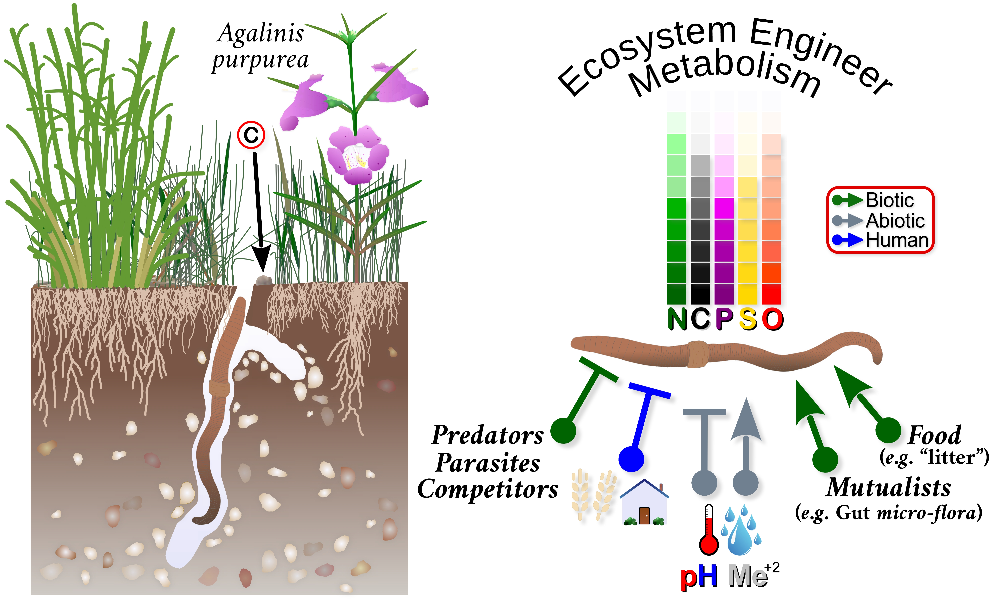
</figure>

**Figure 17. Earthworms as Ecosystem Engineers**. The multiple effects that many **earthworm** species have on <span id="Br">soil</span> properties has resulted in their designation as an **ecosystem engineers**.**[@blouin_review_2013]** Ecologically **earthworms** can be divided up into three main groups (i.e. **epigenic**, **anecic**, or **endogeic**) depending upon where they reside within <span id="Br">soil</span> and the kinds of activities they perform (i.e. burrowing and "*casting*").**[@bottinelli_explicit_2020]** The **anecic earthworm** pictured above (e.g. *L. terrestris*) feeds on surface **plant** "*litter*" that it pulls down into the <span id="Br">soil</span> via vertical burrows it excavates. The waste or "*castings*" (<b>&#9400;</b>) they generate are **organic**-rich microbial "*hotspots*" when compared to surrounding bulk <span id="Br">soils</span>. These **earthworm** burrows and "*casts*" change the overall structure (i.e. gas permeability, porosity and structural integrity, water flow), chemistry (i.e. <span id="Br">S</span>**OM** dynamic) and biological activity (i.e. predator, prey, parasites, mutualists) of <span id="Br">soils</span>. Multiple **biotic**, **abiotic** and human factors can alter the abundance and metabolic activity of **earthworms**. This in turn can affect various <span id="Br">soil</span> functions. For example, several studies have shown that **earthworms** can positively influence **plant** growth,**[@scheu_effects_2003; @van_groenigen_earthworms_2014]** while changes in land use patterns (e.g. intensive agriculture)**[@lavelle_soil_2022]** can negatively impact **earthworm** abundance and overall <span id="Br">soil</span> health. Even seemingly unimportant, functionally redundant species could potentially impact the health of <span id="Br">soils</span> if they directly interact with and alter the function of a single species that happens to be an **ecosystem engineers**. 

</div>

<!--------------------------------------------->
<!--------- END - FIG 17 - Earthworms --------->
<!--------------------------------------------->

<!------------------------------------------------------->
<!--------- SECTION 3B.3IV - SOIL MEGA-FAUNA  --------->
<!------------------------------------------------------->
<a id="SMF"> </a>
**<u>3B.3IV** <span id="Br">Soil</span> **Mega-Fauna</u>.** Arguably these large **animals**, which are mostly vertebrates, are more noticeable and more charismatic than the "*...little things* [invertebrates] *that run the world*".**[@wilson_little_1987]** However, what they contribute to <span id="Gr2">TGC</span> is perhaps rather *tiny* by comparison, particularly when examined through the lens of biomass and species diversity. There are in fact few <span id="Br">soil</span> **mega-fauna** (e.g. shrews, mice, moles, voles and occasional badger) that actually spend most or all of their lives below ground within temperate grassland prairies. Although **Bison** are a very large and important above ground **keystone species** that once dominated the western and central plains of North America,**[@knapp_keystone_1999; @hickman_grazing_2004]** their range never extended into Ontario nor any other eastern province. The few small to large **animals** that burrow and leave their "*mark*" on the Tallgrass landscape could have a significant impact on other **animals** and **plants** that reside within <span id="Gr2">TGC</span>. Such disturbances can foster new growth (i.e. alter nutrient dynamics, disperse plant seeds) and potentially change the floral composition of these rare ecosystems. Unfortunately there is simply little to no published research on the ecology of **mega-fauna** within <span id="Gr2">TGC</span> of southern Ontario. The existing remnants of <span id="Gr2">TGC</span> are so rare and fragmented that it is hard to imagine the scale of disturbances these fossorial **animals** might have on the diverse floral communities that make up these habitats. 


{width=300px}


---

<hr style="border:2px solid gray">

<!--------------------------------------------------------------------->
&copy; Jeffrey C Howard. The material contained within this website may be copied, distributed and displayed without alterations for noncommercial purposes only provided that it is accompanied by acknowledgements to the author. All commercial and non-commercial rights are reserved to the author.  
<!--------------------------------------------------------------------->

<hr style="border:2px solid gray">


<a id="Refs"></a>  
**REFERENCES:**  
  

<script src='https://storage.ko-fi.com/cdn/scripts/overlay-widget.js'></script>
<script>
  kofiWidgetOverlay.draw('jch274202227', {
    'type': 'floating-chat',
    'floating-chat.donateButton.text': 'Help Support',
    'floating-chat.donateButton.background-color': '#00b9fe',
    'floating-chat.donateButton.text-color': '#fff'
  });
</script>

