
<!------------------------------------------------>
<!-------- JAVASCRIPT - enable LaTex MATH -------->
<!------------------------------------------------>

<!------------------------------------------------>
<!------------ FIG 1 - OPC SOIL MAP  ------------->
<!------------------------------------------------>

<figure>

</figure>

<b>Figure 1</b>. This Soil map of OPC in <b>Essex County</b> is based on a more detailed map from the <b><a class="one" href="https://sis.agr.gc.ca/cansis/publications/surveys/on/on11/index.html" target="_blank" title="Go to Canadian Soil Information Service">Canadian Soil Survey Report (No. 11)</a></b>, which was compiled by the Ontario Agricultural College (Department of Soils, Guelph, Ontario) in co-operation with the Canadian Experimental Farms Service (Department of Agriculture, Ottawa).<b>[1](#ref-caldwell_soil_1949)</b> The Soil survey was conducted in 1939 and subsequently published by the Experimental Farm Service of Ottawa in 1949. As shown above much of the gleysolic soil in and around OPC contains sandy or sandy-loam material (<b>Grandby</b>, <b>Plainfield</b> and <b>Berrien</b> sand). The topography of the area is fairly level and lies within the central portion of the Michigan basin. A few locally depressed areas do provide seasonal or permanent wetlands. <b>Plainfield</b> sand is coarse in nature and well drained (fairly deep sandy layer), while the more common <b>Berrien</b> and <b>Grandby</b> sands are somewhat more shallower with poor natural drainage (i.e. sits atop thick <b>clayey till</b> material).

<!---------------------------------------------->
<!-------- END - FIG 1 - OPC SOIL MAP  --------->
<!---------------------------------------------->
<!-- this is a subheadline -->

<b>TABLE OF CONTENTS</b>

1.  <a href="#SI"><b>Importance of</b> Soils</a>
    - <a id="#Fig2Agri"><b>Fig. 2. Global Agricultural Production Value</b></a>
    - <a href="#SBiodiv">Soil <b>Biodiversity</b></a>
    - <a href="#Tab1SES"><b>Table 1.</b> Soil <b>Ecosystem Services</b></a>
2.  <a href="#STax">Soil<b>Taxonomy</b></a>
    - <a href="#STax">Soil <b>Classification System</b></a>
3.  <a href="#SFF">Soil <b>Forming Factors</b></a>
    - <a href="#Fig3SABF"><b>Fig. 3. Soil Biotic & Abiotic Factor Model</b></a>
    - <a href="#SAB"><b>3A</b> Soil <b>Abiotic Factors</b></a>
      - <a href="#Topo"><b>3A.1 Topography</b></a>
      - <a href="#PM"><b>3A.2 Parent Material</b></a>
      - <a href="#PW"><b>3A.3 Physical Weathering</b></a>
      - <a href="#CW"><b>3A.4 Chemical Weathering</b></a>
      - <a href="#Fig4CBS"><b>Fig. 4. Carbonate Buffering System</b></a>
      - <a href="#SClays"><b>3A.5 Chemistry of Clays</b></a>
        - <a href="#Fig5SPhy"><b>Fig. 5. Structure of Phyllosilicate</b></a>
        - <a href="#Fig6HOSC"><b>Fig. 6. Higher Order Structure of Clays</b></a>
        - <a href="#Fig7SFab"><b>Fig. 7. Soil Particle Structure</b></a>
    - <a href="#SBio"><b>3B</b> Soil <b>Biota</b></a>
      - <a href="#SVir"><b>3B.1</b> Soil <b>Viruses</b></a>
        - <a href="#Fig8Phages"><b>Fig. 8. Bacteriophages </b></a>
        - <a href="#Fig9AMC"><b>Fig. 9. Viral Accessory Metabolic Genes (AMG)</b></a>
      - <a href="#SMicro"><b>3B.2</b> Soil <b>Microbiome (Bacteria & Fungi)</b></a>
      - <a href="#CC"><b>3B.2I Carbon Cycle</b></a>
        - <a href="#Fig10SOM"><b>Fig. 10.</b> S<b>OM Dynamics</b></a>
      - <a href="#NC"><b>3B.2II</b> N<b>itrogen Cycle</b></a>
        - <a href="#Fig11NC"><b>Fig. 11.</b> N<b>itrogen Cycle</b></a>
      - <a href="#PC"><b>3B.2III</b> P<b>hosphorus Cycle</b></a>
        - <a href="#Fig12SP"><b>Fig. 12.</b> Soil P<b>hosphates</b></a>
        - <a href="#Fig13PC"><b>Fig. 13.</b> P<b>hosphate Cycle</b></a>
      - <a href="#SC"><b>3B.2IV</b> S<b>ulfur Cycle</b></a>
        - <a href="#Fig14SC"><b>Fig. 14.</b> S<b>ulfur Cycle</b></a>
      - <a href="#SMMMF"><b>3B.3</b> Soil <b>Micro- Meso- and Macro-Fauna</b></a>
      - <a href="#SProt"><b>3B.3IA</b> Soil <b>Micro-Fauna: Protists</b></a>
      - <a href="#SNem"><b>3B.3IB</b> Soil <b>Micro-Fauna: Nematodes</b></a>
        - <a href="#Fig15Nem"><b>Fig. 15.</b> Soil <b>Nematodes</b></a>
      - <a href="#SMites"><b>3B.3II</b> Soil <b>Meso-Fauna: <i>Acari</i> Mites</b></a>
        - <a href="#deltaX"><b>Stable Isotope Ratio Calculation (δ values)</b>
        - <a href="#Tab2Orib"><b>Table 2. Taxonomic <i>Oribatida</i> δ Value Variance</b>
        - <a href="#Fig16Orib"><b>Fig. 16. <i>Oribatida</i> δ Values and Trophic Niches</b></a>
      - <a href="#SEw"><b>3B.3III</b> Soil <b>Macro-Fauna: Earthworms</b></a>
        - <a href="#Fig17Sew"><b>Fig. 17.</b> Soil <b>Earthworms</b></a>
      - <a href="#SMF"><b>3B.3IV</b> Soil <b>Mega-Fauna</b></a>
4.  <a href="#Refs"><b>References</b></a>

<!----------------------------------------------------->
<!--------- SECTION 1 - IMPORTANTCE OF SOILS  --------->
<!----------------------------------------------------->

**  1. IMPORTANCE OF SOILS  ** Fundamentally soils are heterogeneous mixtures of solids, liquids, and gases that vary spatially with time.**[2](#ref-foth_fundamentals_1990)** The more familiar soil solids, namely **sand** (0.05–2.0 mm), **silt** (0.002–0.05 mm) and **clay** (\<0.002 mm) are conveniently classified according to well defined physical dimensions (i.e. diameter), while soil **organic matter** (**SOM**) is more loosely defined as a collection of progressively decomposing **plant**, **fungal** and <b>animal</b> derived **organic** compounds.**[3](#ref-mitchell_fundamentals_2005),[4](#ref-lehmann_contentious_2015)** Nevertheless **SOM** represents the largest reservoir of terrestrial **OM** (i.e. 3500 - 4800 Pentagrams of **C**, where 1015 gm = 1 Penta-gram or 1 **Giga-tonne**), far exceeding both plant biomass (420-620 Gt of **C**) and atmospheric **C** (~829 Gt) concentrations combined.**[4](#ref-lehmann_contentious_2015)–[7](#ref-ciais_carbon_2013)** This makes **SOM** a subject of much interest in light of our current changing climate.**[8](#ref-bais_role_2006)–[13](#ref-irving_critical_2021)**  
    Although soils are traditionally viewed as a growth medium for **plants**, they are also “*home*” to countless other species.**[14](#ref-giller_diversity_1996)–[16](#ref-anthony_enumerating_2023)** In fact many soil organisms play a vital role in regulating global bio-geochemistry (i.e. **C**, N, P, S cycles).**[17](#ref-lal_soil_2004)–[21](#ref-crowther_global_2019)** These **biogeochemical cycles** (B**GCC**) provide the key chemical elements needed to build biomolecules (i.e. proteins, carbohydrates, nucleic acids, lipids).**[22](#ref-daily_introduction_1997)–[24](#ref-smith_biogeochemical_2015)** Other **ecosystem services** (**Table 1**) regulated by soil organisms include water filtration (e.g. fresh water aquifers), soil stability and fertility (e.g. agriculture), as well as climate (i.e. **C**arbon sink). In fact, one could safely argue that soil fertility alone accounts for most of the world’s agricultural production value, which was estimated to be worth ~\$4.45 trillion (USD) in 2021 (**Fig. 2**, **<a class="one" href="https://www.fao.org/faostat/en/#data/QV" target="_blank" title="Go to UNFAO">United Nations’s Food Agricultural Organization</a>** data).**[25](#ref-fao_gross_2023)** However, monetizing the “*true value*” of soils or the specific ecosystem services they regulate is fraught with difficulties, since <u>life-supporting</u> services are by definition indispensable to all life on the planet.**[7](#ref-ciais_carbon_2013),[19](#ref-intergovernmental_panel_on_climate_change_ipcc_carbon_2014),[24](#ref-smith_biogeochemical_2015)**

<!----------------------------------------------------->
<!--- FIG 2 - Global Agricultural Production Value  --->
<!----------------------------------------------------->

<figure>

</figure>

<b>Figure 2. Value of Global Agricultural Production.</b>

<!---------------------------------------------------->
<!----- END - FIG 2 - GLOBAL AGRICULTURE VALUE  ------>
<!---------------------------------------------------->

    One could also argue that the “*true*” value of soils lies with its inhabitants, the so called “*tiny creatures*” of the world.**[24](#ref-smith_biogeochemical_2015),[26](#ref-decaens_values_2006)–[30](#ref-hopwood_farming_2021)** These soil **micro-organisms** (i.e. **viruses**, **bacteria**, **fungi**, **protists**, **nematodes**, and tiny **arthropods** and **hexapods**) account for the majority of species on our planet, which may number well into the billions!**[16](#ref-anthony_enumerating_2023),[31](#ref-stork_how_2018)** This staggering estimate of the amount of biodiversity is heavily weighted in favour of **bacteriophages** (i.e. viruses that infect bacteria), a poorly understood (ecologically speaking) group of genetic entities that even defies our traditional view of what constitutes life itself (i.e. viruses are not made up of cells, which is the basic unit of life). Even so, if we exclude viruses from our enumerations we would still end up with ~3.9 million soil species (i.e. lower limit), with the vast majority (\>99%) being either **fungi** (~2 × 106), **bacteria** (~1 × 106), **arthropods** (~3.5 × 105), **plants** (~3.2 × 105) or **nematodes** (~2.2 × 105).**[16](#ref-anthony_enumerating_2023)** Despite the enormous number of soil species we know very little about them and how they interact with one another within ecological communities. This poor “*state of affairs*” is perplexing given how they “*…process all terrestrial organic material and influence every aspect of global biogeochemistry.*”**[21](#ref-crowther_global_2019)**

<!-------------------------------------------------------->
<!---------- TABLE 1 - SOIL ECOSYSTEM SERVICES ----------->
<!-------------------------------------------------------->
<table class="Table">
<thead>
<tr style="text-align:left">
<td colspan="3">
TABLE 1. SOIL ECOSYSTEM SERVICES
</td>
</tr>
<thead>
<thead>
<tr>
<th class="f18">
Category
</th>
<th class="f18">
Function
</th>
<th class="f18">
Description
</th>
</tr>
</thead>
<tbody>
<tr>
<td>
Support Services
</td>
<td>
Nutrient Recycling
</td>
<td>
Soils are a natural “<i>meeting place</i>” for the Earth’s great “<i>spheres</i>” (i.e. litho<b>sphere</b>, bio<b>sphere</b>, hydro<b>sphere</b> and atmo<b>sphere</b>) and the biota that populate it play a key role in recycling chemical elements (H2O, <b>C</b>arbon, Nitrogen, Phosphorus) that are essential to all life on the planet. Maintaining these global <b>biogeochemical cycles</b> is intimately connected to many other important provisional, regulatory and supporting ecosystem services (e.g. fertile soil and global food production).(refs A)
</td>
</tr>
<tr>
<td>
Regulatory Services
</td>
<td>
Climate Regulation
</td>
<td>
Soils (≤ 2 m depth) contain ~2400 × 1015 gm of <b>C</b>arbon in the form of organic (i.e. dead <b>animals</b> and <b>plants</b>) and inorganic (i.e. sand, silt, clay) material, which is more than all the <b>C</b>arbon found in vegetation (450–650 × 1015 gm C) and the atmosphere (450–650 × 1015 gm C) combined. The time it takes for <b>C</b>arbon to be fixed by <b>plants</b> and enter the soil as dead organic matter varies considerably, particularly with respect to latitude. In colder northern climates dead organic matter within soils decays more slowly (compared to tropical regions) allowing it to build up in these regions. This resulting store of soil <b>C</b>arbon can remain in place for 1000s of years, or be quickly released back into the atmosphere, depending on a number of conditions (e.g. temperature, precipitation, topography, agricultural practices, etc.). This regulatory service is obviously closely integrated with the aforementioned <b>C</b>arbon cycle (Supporting Service).(refs B)
</td>
</tr>
<tr>
<td>
Provisional Services
</td>
<td>
Genetic Material and Medicinal Compounds
</td>
<td>
Soil is home to countless <b>fungi</b>, <b>plants</b>, <b>prokaryotes</b> (i.e. <b>bacteria</b>, <b>archaea</b>), <b>arthropods</b>, <b>nematodes</b> and <b>viruses</b>. These millions of soil species carry out many critical life supporting services on the planet (e.g. nutrient recycling, climate regulation). Moreover, they are also an important source of many useful medicinal compounds (e.g. anti-viral and anti-bacterial agents, immunosuppresants, herbicides, insecticides, anti-parasitic compounds).(refs C)
</td>
</tr>
</tbody>
</table>

<b>Table References:</b> <b>A[7](#ref-ciais_carbon_2013),[19](#ref-intergovernmental_panel_on_climate_change_ipcc_carbon_2014),[24](#ref-smith_biogeochemical_2015),[27](#ref-falkowski_microbial_2008),[29](#ref-fao_state_2020)</b>, <b>B[7](#ref-ciais_carbon_2013),[17](#ref-lal_soil_2004),[19](#ref-intergovernmental_panel_on_climate_change_ipcc_carbon_2014)–[21](#ref-crowther_global_2019),[24](#ref-smith_biogeochemical_2015),[29](#ref-fao_state_2020)</b>, <b>C[16](#ref-anthony_enumerating_2023),[29](#ref-fao_state_2020)–[31](#ref-stork_how_2018)</b>
 

<!----------------------------------------------------->
<!----------------------------------------------------->
<!----------------------------------------------------->
<!---------------------------------------------------->
<!--------- SECTION 2 - SOIL CLASSIFICATION  --------->
<!---------------------------------------------------->

**  2. SOIL CLASSIFICATION  ** Soil is quite complex and currently lacks a universal taxonomic system. However, most national classification systems do agree on what generally constitutes soils. According to the **<a class="one" href="https://sis.agr.gc.ca/cansis/taxa/cssc3/index.html" target="_blank" title="Go to Canadian Soil Information Service">Canadian system of soil classification</a>** soil is:

> “*…naturally occurring, <u>unconsolidated</u>, <b>mineral</b> or <b>organic material</b> at the <u>earth’s surface</u> that is <u>capable of supporting plant growth</u>. Its <u>properties</u> usually <u>vary with depth</u>. They are determined by <u>climatic factors</u> and <u>organisms</u>, as conditioned by <u>relief</u> and, hence, <u>water</u> regime acting on geological materials and producing genetic horizons that <u>differ</u> from the <u>parent material</u>. In the landscape, soil merges into non-soil entities such as exposed, consolidated rock or permanent bodies of water at arbitrarily defined boundaries*.”**[32](#ref-haynes_canadian_1998)**

    This same taxonomic system also lists 10 major <u>orders</u> of soils that largely reflects “*…the nature of the soil environment and the effects of the dominant, soil-forming processes*”.**[32](#ref-haynes_canadian_1998)** Lower down on the taxonomic scale are the **Great groups**, followed by **Subgroups**, **Families** and finally **Series**. All of these taxa are designed to be practical since they are based on “*<u>observable</u> and <u>measurable</u> soil properties that reflect processes of soil genesis and environmental factors*”**[32](#ref-haynes_canadian_1998)** However, it is important to note that the current system is not set in “*stone*” per say, since we have “*limited knowledge of the vast population of soils in the country*”.**[32](#ref-haynes_canadian_1998)**  
    Part of the difficulty surrounding soil taxonomy is the enormous amount of variation in its <u>physical</u>, <u>chemical</u> and <u>biological</u> make up. Nevertheless, we can focus our attention on some basic aspects of soils, such as:

<b>*How do soils form*?</b> and <b>*What is the basic chemistry of soils*?</b>

  
**  3. SOIL FORMING FACTORS  ** As mentioned above soil is the long term product of complex physical and biological processes.**[2](#ref-foth_fundamentals_1990),[3](#ref-mitchell_fundamentals_2005)** As **Charles E Kellogg**, the former head soil scientists for the USDA once wrote:

> “*Essentially, all life depends upon the soil, and its important functional attribute, productivity for plants, is due more than to anything else to the operation of biological forces …There can be no life without soil and no soil without life: they have evolved together.*”**[33](#ref-kellogg_fundamentals_1938)**

**Kellogg’s** often quotes words clearly elude to the fundamental interdependence of all living and non-living elements of soils and, of course, time itself.

> *“There is a relationship between climate and vegetation, between parent rock and vegetation, between age and slope, and even between climate and slope. All express themselves in the soil …there is a great number of types of soil …each offers certain possibilities.*”**[33](#ref-kellogg_fundamentals_1938)**

Although our understanding of soils has greatly improved since **Kellogg’s** time at the **USDA** we still have only begun to scratched the surface of this topic. Yet it has certainly become clearer over the last few decades that the **microbiome**, which is largely comprised of **bacteria** and **fungi**, is the key **biotic** factor regulating most soil functions, particularly nutrient mineralization.**[34](#ref-bardgett_belowground_2014)** Of course **plants** form the base of terrestrial food webs by “*fixing*” carbon from the atmo**sphere** (i.e. photo**synthesis**). Also, **plants** release a significant proportion of their photo**synthate** (i.e. upwards of 40%) into the soil via their roots.**[8](#ref-bais_role_2006),[9](#ref-badri_regulation_2009),[35](#ref-walker_root_2003)** These so called **Rhizodeposits** or root **exudates** are mostly made up of simple **organic** metabolites (e.g. **organic** acids). However, some secreted chemicals help protect **plants** either directly or indirectly from predators and pathogens (e.g. **plant** latex, extracellular DNA, terpenoids).**[36](#ref-agrawal_latex_2009)–[39](#ref-rasmann_root_2016)**  
    At a basic level **plants** and their associated **microbiome** form an important functional interface for what lies both below and above ground. And it’s from this vantage point that we can conceptualize how **biotic** and **abiotic** factors regulate food webs within terrestrial ecosystems (**Fig. 3**). By thinking in terms of soil “*inputs*” (i.e. “*bottom-up*” regulation) and “*outputs*” (i.e. “*top-down*” regulation) we can at the very least begin to understand how important soils are on a global scale (i.e. bio**sphere**, atmo**sphere**, hydro**sphere**, Litho**sphere**). Toward this goal the following discussions will detail important **abiotic** and **biotic** factors that shape the structure and function of soils. Emphasis will be placed on the physical-chemical properties of soils and how they impact important ecosystem functions (e.g. nutrient cycling). This will not be an exhaustive discussion, but hopefully it will inspire more respect and admiration for soil.

<!---------------------------------------------------->
<!------ FIG 3 - SOIL ABIOTIC & BIOTIC FACTORS  ------>
<!---------------------------------------------------->

<figure>

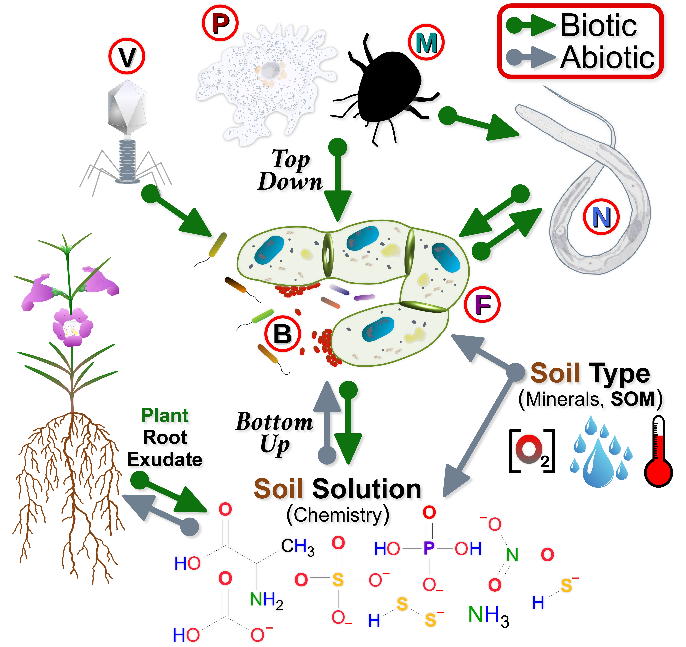

</figure>

**Figure 3. Soil Abiotic & Biotic Factors.** Soil is arguably the most biologically diverse terrestrial habitat, accounting for \>44% of the known species on the planet.**[16](#ref-anthony_enumerating_2023)** Some of the most important ecosystem services provided by soils (e.g. nutrient cycling) are carried out by soil micro-organisms, specifically **bacteria** (<b>Ⓑ</b>) and **fungi** (Ⓕ) that are often referred to as the soil **microbiome**. Research suggests that both **biotic** (i.e. predation, plant root **exudates**) and **abiotic** (e.g. moisture, soil chemistry) factors play equally important roles in regulating the **microbiome**. For example, **biotic** factors are known to regulate ecological communities in either a “*bottom up*” (e.g. plant root **exudates**) or “*top down*” (e.g. **predation**) fashion.**[40](#ref-thakur_trophic_2019)** Some well known **predators** of **bacteria** (<b>Ⓑ</b>) and **fungal hyphae** (Ⓕ) include **bacteriophages** (<b>Ⓥ</b>, viruses that infect **bacteria**),**[41](#ref-clokie_phages_2011),[42](#ref-cobian_guemes_viruses_2016)** **protists** (Ⓟ, e.g. *Amoebozoa*), **nematodes** (Ⓝ),**[43](#ref-neher_ecology_2010)–[45](#ref-wilschut_nematodes_2021)** and tiny *Oribatid* **mites** (\<1 mm in length, Ⓜ).**[44](#ref-orgiazzi_global_2016)** There are also many other important **microbe** consumers such as *springtails* (i.e. *Collembola*, 0.12-17 mm hexapods) and **earthworms** (i.e. *Annelida*, feed on dead **organic matter** that contains **microbes**) that are not illustrated above. From a “*bottom up*” perspective there are many resources or “*inputs*” that support the **microbiome**. This would include **plant** “*litter*” and root **exudates** (e.g. **C** rich photo**synthate**), as well as the physical soil chemistry (e.g. mineral surface, solution chemistry, **pH**, moisture, Oxygen levels). Of course there are many internal and external feedback loops associated with these **biotic** and **abiotic** components, such as the conversion of residual **organic matter** (**OM**) into simple inorganic compounds (i.e. **mineralization**) that benefits both **plants** and **microbes** alike.

<!-------------------------------------------------------->
<!----- END - FIG 3 - SOIL ABIOTIC & BIOTIC FACTORS ------>
<!-------------------------------------------------------->

<!--------------------------------------------------->
<!----------- SECTION 3A.1 - TOPOGRAPHY  ------------>
<!--------------------------------------------------->
**<u>3A Soil Abiotic Factors</u>:** Over very large areas **climate** and **vegetation type** are arguably the most important factors affecting soil development. However, on a smaller regional scale (e.g. Essex County) soils are greatly influenced by the underlying parent material and topography.

> “*Soils are products of evolution, and soil properties are a function of time or soil age. The age of a soil is expressed by its degree of development and not the absolute number of years. In a sense, soils have a life cycle that is represented by various stages of development*.”**[2](#ref-foth_fundamentals_1990)**

<!-------------------------------------------------->
<!----------- SECTION 3.1 - TOPOGRAPHY  ------------>
<!-------------------------------------------------->
**<u>3A.1 Topography</u>:** OPC and the rest of Essex county is a predominantly flat area. The only notable exceptions are the large sandy and gravelly knolls near **Ruthven** (~228 m above sea level) and **Cholchester** (~201 m), both being the recipient of large amounts of **glacial out-wash** and **morainic** material. The land beyond these hills gently slopes downward reaching elevations of ~170 m to the immediate south and east along the shores of Lake Erie, and close to 180 m to the north and west along the shores of Lake St. Clair and the Detroit river. There is some gentle undulating character to the land due to the small number of **morainic** ridges, as well as some depressed areas, but over all its largely a flat **clayey** plain that is mainly used for agriculture (i.e. 121,042 ha of field crops, which is ~65% of Essex county’s total area).**\[[46](#ref-statistics_canada_table_2022),[47](#ref-statistics_canada_focus_2017)**

<!-------------------------------------------------->
<!--------- SECTION 3.2 - PARENT MATERIAL  --------->
<!-------------------------------------------------->
**<u>3A.2 Parent Material</u>:** This is arguably the most important factor affecting soil development at OPC. Most if not all of this **parent material** was deposited by the great **<a class="one" href="https://planetearth.utsc.utoronto.ca/timeline/hlis_t1b.html" target="_blank" title="Go to PlanetEarth site">Laurentide Ice Sheet</a>** (LIS) some 23,000 years ago (**ya**).**[48](#ref-karrow_chapter_1989)–[51](#ref-andrews_late_2007)** During a span of ~13,000 years (23,000-10,000 **ya**), a period known as the **Late Wisconsinan**, the LIS occupied all or part of southern Ontario. However, OPC being positioned at the southern extent of the continental ice sheet, meant that the region experienced notable fluctuations in the amount of ice cover. The repeated retreat and re-advance of the ice sheet’s major lobes (which developed within the Great Lake basins) greatly altered the drainage pattern of the region. In fact the enormous volumes of glacial melt-water that accumulated gave rise to a complex succession of large deep lakes that persisted for long periods of time.**[48](#ref-karrow_chapter_1989),[49](#ref-larson_origin_2001),[52](#ref-leverett_pleistocene_1915)** Evidence of these ancient lakes is literally under our feet in the form of **glacial till** (i.e. unsorted collection of rocks, gravel, sand, silt, and clay).**[50](#ref-dyke_outline_2004),[53](#ref-noauthor_rock_1994),[54](#ref-morris_quaternary_1994)** **<a class="one" href="https://www.antarcticglaciers.org/glacial-geology/glacial-landforms/glacial-erosional-landforms/subglacial-erosion/" target="_blank" title="Go to AntarcticGlaciers site">Sub-glacial erosion</a>** of hard northern bedrock generated debris (i.e. gravel, sand, silt, clay) that became “*embedded*” within the bottom of the ice sheet (i.e. <u>entrainment</u>). It along with softer “*ploughed*” material (i.e. sedimentary rock) were often transported great distances. When the ice sheet retreated the entrained glacial debris was deposited, often as a blanket of loose unconsolidated material and occasionally as unique landforms such as **<a class="one" href="https://www.antarcticglaciers.org/glacial-geology/glacial-landforms/glacial-depositional-landforms/moraine-types/" target="_blank" title="Go to AntarcticGlaciers site">moraines</a>** (French *Savoy* dialect: “*morena*”, meaning “mound of earth”), **<a class="one" href="https://www.antarcticglaciers.org/glacial-geology/glacial-landforms/glaciofluvial-landforms/eskers/" target="_blank" title="Go to AntarcticGlaciers site">eskers</a>** (ridges deposited by melt-water) and **out-wash plains**.**[50](#ref-dyke_outline_2004),[55](#ref-alley_how_1997)–[58](#ref-herdendorf_research_2013)** Within **Essex** county there are several low relief recessional type **<a class="one" href="https://planetearth.utsc.utoronto.ca/timeline/slis_t1b.html" target="_blank" title="Go to PlanetEarth site">end moraines</a>**, as well as large deposits of glacial-fluvial sorted material.**[1](#ref-caldwell_soil_1949),[48](#ref-karrow_chapter_1989),[54](#ref-morris_quaternary_1994),[59](#ref-taylor_moraine_1913)** However, perhaps the greatest “*gift*” left behind by the glaciers are the extensive deposits of **clay** (i.e. **St. Clair clay plain**) that once formed the bottom of these ancient glacial lakes. Often distinctive deposits called **varves**, consisting of <u>alternating</u> layers of fine grained **silt** (summer) and **clay** (winter), formed at the bottom of these lakes. When preserved these <u>annually</u> recurring deposits provide invaluable information about the age and environment of these ancient lake systems (e.g. pollen, diatoms, organics, minerals).**[60](#ref-sturm_michael_lake_1995)–[62](#ref-zolitschka_varved_2007)**  
    The main process that transformed this **parent material** into mature soils is **weathering**. It’s a destructive <u>physical</u>, <u>chemical</u> and <u>biological</u> process that requires a significant amount of time. Moreover, **weathering** is a transformative process since the size, shape and chemical composition of the material undergoes extensive changes.

<!-------------------------------------------------->
<!------- SECTION 3.3 - PHYSICAL WEATHERING  ------->
<!-------------------------------------------------->
**<u>3A.3 Physical Weathering</u>:** This is a mechanical (e.g. wind, water or glacial abrasion) reductive process that increases the surface-to-volume ratio of the **parent material**. This relatively simple step is important since increasing the surface area of the weathered debris accelerates the overall **weathering** process (e.g. increased rates of chemical reactions). Some common causes of this physical weathering process include **frost wedging** (i.e. thermal expansion and contraction of water as it freezes and melts within the cracks of rocks), <b>plant</b> roots (i.e. growing into rock cracks), burrowing **animals**, as well as other types of mechanical stress (e.g. gravity, pressure changes, abrasion). Obviously **topography** plays a big role in this process since changes in elevation (e.g. mountain) can simultaneously introduce many physical weathering processes (e.g. thermal cycles, gravity, increased wind exposure). However, as noted above physical and chemical weathering processes usually operate together within any given environment.**[3](#ref-mitchell_fundamentals_2005),[63](#ref-wilson_weathering_2004)**

<!-------------------------------------------------->
<!------- SECTION 3.4 - CHEMICAL WEATHERING  ------->
<!-------------------------------------------------->
**<u>3A.4 Chemical Weathering</u>:** Soils undergo chemical changes as they develop. These changes can be purely physical or **abiotic** in nature, such as when atmospheric **C**O2 (gas) dissolves in water to produce **carbonic acid** (as detailed below). This simple **dissolution** step helps drive **silicate** weathering, which is believed to be the most important factor regulating the geological **C**arbon cycle.**[7](#ref-ciais_carbon_2013),[64](#ref-walker_negative_1981)–[66](#ref-hilton_mountains_2020)** There are also many organisms (e.g. bacteria, fungi, lichens, etc.) in constant contact with soil particles capable of releasing various **organic** compounds (e.g organic acids, chelating agents) that can accelerate chemical weathering.**[3](#ref-mitchell_fundamentals_2005),[63](#ref-wilson_weathering_2004),[67](#ref-drever_role_1997),[68](#ref-chen_weathering_2000)** Nevertheless, it can be argued that the chief chemical weathering agents of soils are water (H2O), oxygen (O2) and carbon dioxide (**C**O2).**[65](#ref-kump_chemical_2000),[66](#ref-hilton_mountains_2020)** Water, being a “*universal*” solvent, provides an ideal environment for many types of chemical reactions, including the hydrolysis of minerals by weak acids like **carbonic acid** (H2**C**O3). As noted above **carbonic acid** plays a prominent role in the chemical weathering of **silicates**. For example, common **feldspar** minerals (i.e. major component of **granites**) such as **<a class="one" href="https://www.mindat.org/min-1624.html" target="_blank" title="Go to Mindat.org">Anorthite</a>** readily undergoes chemical hydrolysis when exposed to **carbonic acid**. As shown below this crystalline **<a class="one" href="https://min4kids.org/tectosilicates/" target="_blank" title="Go to Minerals4Kids site">tectosilicate</a>** undergoes a chemical change that also alters its physical properties (i.e. **tectosilicate** is transformed into a **<a class="one" href="https://min4kids.org/phyllosilicates/" target="_blank" title="Go to  Minerals4Kids site">phyllosilicate</a>**).

`\begin{align*} \tag{1} \text{CO}_{2 \phantom{1}(aq.)} + \phantom{1} \text{H}_2\text{O} \phantom{1} \rightleftharpoons \phantom{1} \underbrace{\text{H}_2\text{CO}_{3 \phantom{1}(aq.)}}_{\text{carbonic acid}} \phantom{1} &\rightleftharpoons \phantom{1} \text{H}^+ + \phantom{1} \underbrace{\text{HCO}_3^-}_{\text{bicarbonate}} \phantom{1} \rightleftharpoons \phantom{1} \text{H}^+ + \phantom{1} \underbrace{\text{CO}_3^{-2}}_{\text{carbonate}} \\\\ \tag{2} \underbrace{\text{CaAl}_2\text{Si}_2\text{0}_8}_{\text{granite}} \phantom{1} + \phantom{1} 2\text{H}^+ \phantom{1} + \phantom{1} \text{H}_2\text{O} \phantom{1} &\rightleftharpoons \phantom{1} \text{Ca}^{+2} \phantom{1} + \phantom{1} \underbrace{\text{Al}_2\text{Si}_2\text{O}_5\text{(OH)}_4}_{\text{kaolinite} \phantom{1}\text{(clay)}} \\\\ \tag{3} \text{Ca}^{+2} \phantom{1} + \phantom{1} 2\text{HCO}_3^- \phantom{1} &\rightleftharpoons \phantom{1} \text{CO}_2 \phantom{1} + \phantom{1} \underbrace{\text{CaCO}_3}_{\text{calcite}} \phantom{1} + \phantom{1} \text{H}_2\text{O} \end{align*}`

In the first series of reactions dissolved or aqueous **carbon dioxide** (**C**O2 (aq)) reacts with the water (H2O) to produce **<a class="one" href="https://pubchem.ncbi.nlm.nih.gov/compound/Carbonic-Acid" target="_blank" title="Go to PubChem site">carbonic acid</a>** (H2**C**O3). Given the low levels of atmospheric **C**O2 gas only a relatively small amount of **C**O2 (aq) will go on to generate **carbonic acid** (H2**C**O3). This <u>weak</u> acid will in turn partially dissociate into **bicarbonate** (H**C**O3-) and H+ (i.e. technically **hydronium ion**: H3O+, but H+ is a convenient shorthand), and then finally form **carbonate** (**C**O3-2) when **bicarbonate** itself dissociates and liberates yet another H+ ion. In the second step each of the H+ ions, along with the water molecule, will react with a **silicate** such as the mineral **<a class="one" href="https://www.mindat.org/min-1624.html" target="_blank" title="Go to Mindat.org">feldspar</a>** (e.g. **anorthite**, Ca+2Al2Si2O8). These minerals are among the most common building blocks of igneous rocks (e.g. **granite**) found within the Earth’s crust. The end result of this chemical reaction is the release of a **calcium** cation (Ca+2) and the formation of a **clay** mineral known as **kaolinite**, which is a softer **<a class="one" href="https://min4kids.org/phyllosilicates/" target="_blank" title="Go to Minerals4Kids site">phyllosilicate</a>** (i.e. “*sheet-forming*” silicate). In the final step Ca+2 combines with **bicarbonate** to form water and **calcite** (Ca**C**O3). The latter product is important to aquatic ecosystems since many species use **carbonate** minerals to build homes and protective shells (e.g. corals, zooplankton, phytoplankton, shellfish).**[69](#ref-kleypas_geochemical_1999),[70](#ref-raven_ocean_2005)** Ultimately this bio-mineralization process leads to the generation of new sedimentary rock (e.g. limestone) resulting in the long-term “*draw-down*” of atmospheric **C**O2.**[63](#ref-wilson_weathering_2004),[71](#ref-berner_atmospheric_1990),[72](#ref-berner_model_1991)**  
    The most important feature of the **carbonate** chemistry detailed above is its **pH** <u>buffering</u> ability. Some of the most important **buffering** systems found in nature involve **weak acids**, like **carbonic acid** (H2**C**O3) and their corresponding **conjugate base** (e.g. H**C**O3-1). The power of this **buffer pair** lies in its ability to either release or bind a **proton** and thus control the levels of **hydronium ions** (H3O+) in solution. According to the **Bronsted-Lowry** theory of **acids** and **bases** an **acid** is a substance capable of donating a **proton** (H+) and a **base** is a substance that can accept a **proton**.**[73](#ref-muller_glossary_1994)** In fact there are a number of different molecules that can act as either an **acid** or **base** (e.g. water, **bicarbonate**, **amino acids**). Two of these **<a class="one" href="https://goldbook.iupac.org/terms/view/A00306" target="_blank" title="Go to IUPAC site">amphoteric</a>** chemical species are shown below, one being <u>water</u> and the other being an **amino acid** (**Note:** general **aa** formula containing H and three **<a class="one" href="https://chemistrytalk.org/functional-groups-organic-chemistry/" target="_blank" title="Go to ChemTalk">functional groups</a>** - **amine**, **carboxy** and **R** or variable group - attached to a central carbon).

`$$\tag{4} \underbrace{\text{H}_{2}\text{N}-\text{CH(R)}-\text{COOH}}_\text{acid 1} \phantom{1} + \phantom{1} \underbrace{\phantom{1} \text{H}_2\text{O} \phantom{1}}_{\text{base 2}} \phantom{1} \rightleftharpoons \phantom{1} \underbrace{\text{H}_{2}\text{N}-\text{CH(R)}-\text{COO}^-}_{\text{base 1}} \phantom{1} + \phantom{1} \underbrace{\phantom{1} \text{H}_3\text{O}^+}_{\text{acid 2}}$$`

`$$\tag{5} \underbrace{\text{H}_{2}\text{N}-\text{CH(R)}-\text{COOH}}_\text{base 2} \phantom{1} + \phantom{1} \underbrace{\phantom{1} \text{H}_2\text{O} \phantom{1}}_{\text{acid 1}} \phantom{1} \rightleftharpoons \phantom{1} \underbrace{\text{H}_{3}\text{N}^+-\text{CH(R)}-\text{COOH}}_{\text{acid 2}} \phantom{1} + \phantom{1} \underbrace{\phantom{1} \text{OH}^-}_{\text{base 1}}$$`

`$$\tag{6} \underbrace{\phantom{1} \text{H}_2\text{O} \phantom{1}}_{\text{acid 1}} \phantom{1} + \phantom{1} \underbrace{\phantom{1} \text{H}_2\text{O} \phantom{1}}_{\text{base 2}} \phantom{1} \rightleftharpoons \phantom{1} \underbrace{\phantom{1} \text{OH}^- \phantom{1}}_{\text{base 1}} \phantom{1} + \phantom{1} \underbrace{\phantom{1} \text{H}_3\text{O}^+}_{\text{acid 2}}$$`

Since this topic of **chemical weathering** is focused on **acids** a brief discussion about **pH** (formula below) is certainly warranted. Firstly, the concept of **pH** was introduced by the Swedish Chemist **Søren Sørensen** (1909) who defined it (shown below) as the <u>negative</u> **<a class="one" href="https://www.mathsisfun.com/algebra/logarithms.html" target="_blank" title="Go to MathisFun site">logarithm</a>** of the H+ ion concentrations (i.e. “*power*” of H+ concentration in **moles** per litre, or mol/L).**[74](#ref-sorensen_enzyme_1909)**

`$$\tag{7} \text{pH} \phantom{1} =  \phantom{1} -\text{log}\phantom{.} [\text{H}^+] =  \phantom{1} -\text{log}\phantom{.} 10^{\phantom{.}[\text{pH}]}$$`

His reason for using a negative logarithmic operator (**Recall** our previous discussion of **operators** in **ChemPrimer2**) is because the concentrations of H+ and OH- ions in most aqueous solutions are often very small (e.g. normal blood plasma has a **pH** of ~7.4, which means \[H+\] = 10-7.4 mol/L). The convenience of dealing with a small positive number ranging between 0 and 14 simply outweighs any potential confusion over the fact that **pH** <u>increases</u> when the H3O+ ion concentration <u>decreases</u>.**[74](#ref-sorensen_enzyme_1909)–[76](#ref-camoes_century_2010)**

<!---------------------------------------------------->
<!--- FIG 4 - Bicarbonate Buffering System in RBC  --->
<!---------------------------------------------------->

<figure>
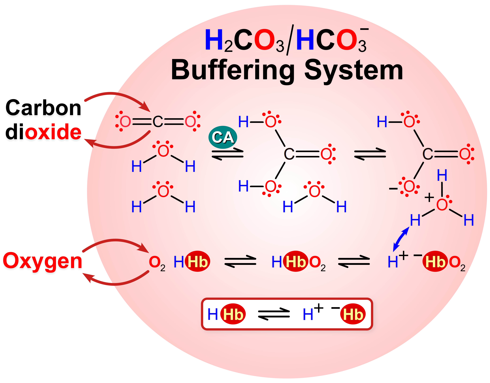
</figure>

**Figure 4. Carbonate/Bicarbonate Buffering System.** The chemistry of **Carbonate/Bicarbonate** (**C**O3-2/H**C**O3-) not only drives **silicate** weathering, but also helps to regulate the **pH** of <b>animal</b> body fluids.**[77](#ref-boron_regulation_2004)** For terrestrial and aquatic **animals** alike maintaining the normal **pH** (~7.4) of intracellular and extracellular (e.g. blood plasma) compartments is vital to the proper functioning of <u>enzymes</u> and the overall health of organ systems.**[78](#ref-kraut_metabolic_2010)** As depicted above the **pH** (~7.4) of Red **blood cells** (RBC) is partly regulated by the **Carbonate/Bicarbonate** buffer pair, as well as several proteins, including <b>hemoglobin</b> (Hb, most abundant protein found in RBC) and **carbonic anhydrase** (CA).**[79](#ref-christensen_proteins_1966)–[81](#ref-supuran_carbonic_2008)** The latter is an ubiquitous metallo-enzyme that catalyzes the <u>conversion</u> of **C**O2 into **bicarbonate** (H**C**O3-) and H3O+, while Hb (like most proteins) can act as a buffer by binding or releasing H+ ions (**Eq. 4, 5**). Most chemical reactions are reversible (i.e. symbolized by bi-directional arrows) and largely governed by changes in the concentrations of reactants and products in accordance with **Le Chatelier’s Principle**.**[82](#ref-chatelier_recherches_1888)** This principle simply states that when a chemical reaction at <u>equilibrium</u> (i.e. rate of formation of reactants = rate of formation of products) experiences a change (e.g. reactant concentration increases) then the equilibrium will <u>shift</u> to <u>counteract</u> the change (e.g. more product will be formed to reduce the reactant concentrations) and go on to establish a new equilibrium state. For the **Carbonic acid/Bicarbonate** buffer system an increase in the concentration of H+ will trigger a shift to the left in the chemical reaction, resulting in the formation of more reactants (i.e. H**C**O3- + H3O+ ⇒ H2**C**O3 + H2O). When a new equilibrium state is established there will be a slightly higher concentration of H3O+, as well as a decrease in the levels of **bicarbonate** and an increase in the levels of **C**O2 and H2O. The excess **C**O2 concentrations and the low O2 levels are quickly dealt with at the lungs where gas exchange occurs (i.e. **C**O2 exhaled and O2 inhaled). RBC are also tasked with delivering O2 to respiring tissues that have been made **acidic** by the build up of organic acids (e.g. lactic acid). Here, the lower **pH** will reduce the O2 binding affinity of Hb, which allows O2 to diffuse out of the RBC and enter the O2 starved cells.

<!-------------------------------------------------->
<!------- END - FIG 4 - BICARBONATE BUFFER  -------->
<!-------------------------------------------------->
<!----------------------------------------------------->
<!--------- SECTION 3.5 - CHEMISTRY OF CLAYS  --------->
<!----------------------------------------------------->

  
**<u>3A.5 Chemistry of Clays</u>:** As detailed above the **clay** rich soils of OPC are largely a product of the **physical** and **chemical weathering** processes generated by the last ice age. Although the exact mechanism responsible for the chemical transformation of a **tectosilicate** like **<a class="one" href="https://www.mindat.org/min-1624.html" target="_blank" title="Go to Mindat.org">Feldspar</a>** (e.g. **anorthite**, Ca+2Al2Si2O8) into a **phyllosilicate** like **kaolinite** (e.g. Al2Si2O5(OH)4) is not entirely clear, the resulting **clay** product is known to enhance the fertility of soils. Physically this is explained by the relatively large surface area of these **<a class="one" href="https://passel2.unl.edu/view/lesson/0cff7943f577/4" target="_blank" title="Go to Plant and Soil Science eLibrary">platy</a>** polymers, and chemically by the occasional <u>charge defects</u> within these sheets (e.g. Mg+2 substituted for Al+3). These charge imbalances (e.g. Al+3 replaced by Mg+2 generate a net negative charge) allow **clay** particles to <u>adsorb</u> water, organic molecules as well as ions like **potassium** (K+) that are needed by **plants** and other soil organisms.**[83](#ref-feng_chemical_2005),[84](#ref-churchman_game_2018)**  
    To better understand **phyllosilicates** we can take a closer look at the chemistry of their crystal structure. The availability of free molecular modelling programs like **<a class="one" href="https://jp-minerals.org/vesta/en/" target="_blank" title="Go to Vesta site">VESTA</a>** make this a relatively easy task to perform.**[85](#ref-momma_vesta_2011)** As you can see in **Figure 4** modelling **silicates**, like **<a class="one" href="https://virtual-museum.soils.wisc.edu/display/kaolinite/" target="_blank" title="Go to VirtualMuseum site">kaolinite</a>**, using the geometric lines, angles and “*faces*” (i.e. **polyhedrons**) of the mineral reveals patterns within its overall structure. Specifically, one can clearly see the <u>hexagonal</u> shape of the extended **silica** <b>tetrahedral</b> and **alumina** <b>octahedral</b> polymers (**Fig. 5B**).

<!---------------------------------------------->
<!--- FIG 5 - Vesta Model of Clay Structure  --->
<!---------------------------------------------->

<figure>

</figure>

**Figure 5. Structure of a Phyllosilicate.** Shown above is a computer model of the crystal structure of **<a class="one" href="https://virtual-museum.soils.wisc.edu/display/kaolinite/" target="_blank" title="Go to VirtualMuseum site">kaolinite</a>** generated using <b>Vesta</b>.**[85](#ref-momma_vesta_2011),[86](#ref-bish_rietveld_1993)** It, like all other types of **clays**, is known as a **phyllosilicate** due to its characteristic “*sheet*” like structure (**Greek:** *phyllon* meaning “*leaf*”). **<a class="one" href="https://virtual-museum.soils.wisc.edu/display/kaolinite/" target="_blank" title="Go to VirtualMuseum site">Kaolinite</a>** has the chemical formula of Al2Si2O5(OH)4, and is composed of a unit “<i>layer</i>” that consists of two leaf-like polymers, each comprised of a 2D-network of repeating units. These units, as depicted above using “*ball-and-stick*” (**A**) and **polyhedron** (**A**, **B**) models, are made up of O<b>xygen</b> or Hydroxyl (-OH) groups, or some combination of both, bonded to different types of <u>cations</u> (e.g. Si, Al, Mg). Because these highly charged **cations** generate strong <u>repulsive</u> forces between them, neighbouring **tetrahedrons** and **octahedrons** can only share “*corner*” atoms (i.e. no shared polyhedral faces). The most common unit is made up of a central <b>silicon</b> (Si) atom surrounded by four <b>tetrahedrally</b> co-ordinated O atoms (SiO4-4). The Si<b>licon</b> atom shares each of its co-planar Oxygen atoms with a single neighbouring Si<b>licon</b> atom, resulting in the characteristic hexagonal sheet-like polymer. Its unit chemical formula of Si2O5 is due to each Si atom having sole access to 1 Oxygen atom (“<i>peak</i>” of pyramid) and <u>shared</u> access to the 3 co-planar corner Oxygen atom (3 x 0.5 = 1.5), which results in a net 2.5 Oxygen atoms per Si atom. Out of convenience the Si:O ratio is reported as Si2O5. For comparison, when Si shares all four O atoms with neighbouring Si atoms it forms a 3D framework <b>silicate</b>, or <b>tectosilicate</b>, commonly known as **<a class="one" href="https://virtual-museum.soils.wisc.edu/display/quartz/" target="_blank" title="Go to VirtualMuseum site">quartz</a>**. Sharing all four O atoms (i.e. 4 x 0.5 = 2) with neighbouring Si atoms produces a unit chemical formula of SiO2 (i.e. Si<b>lica</b> <b>di</b>o<b>xide</b>). This energetically stable structure makes **quartz** resistant to chemical weathering (e.g. common component of sand). The second basic unit of **<a class="one" href="https://virtual-museum.soils.wisc.edu/display/kaolinite/" target="_blank" title="Go to VirtualMuseum site">kaolinite</a>** is an Al<b>uminum oxide</b>, consisting of a centrally located Al atom surrounded by six <b>octahedrally</b> co-ordinated atoms that include 2 O atoms and 4 <b>hydroxyl</b> groups (OH). These six atoms make up the vertices of the <b>octahedron</b> (i.e. 3 above and 3 below the central Al atom). For **<a class="one" href="https://virtual-museum.soils.wisc.edu/display/kaolinite/" target="_blank" title="Go to VirtualMuseum site">kaolinite</a>** the lone “*peak*” <b>oxygen</b> of the **silica tetrahedrons** provide the chemical link or bond between the <b>tetrahedral</b> (T) and <b>octahedral</b> (O) sheets.

<!------------------------------------------------------>
<!-------- END - FIG 5 - VESTA CLAY STRUCTURE  --------->
<!------------------------------------------------------>

    The characteristic <b>tetrahedral</b> (T) and <b>octahedral</b> (O) sheets (T:O) of **<a class="one" href="https://virtual-museum.soils.wisc.edu/display/kaolinite/" target="_blank" title="Go to VirtualMuseum site">kaolinite</a>** are held together by a network of relatively strong ionic and hydrogen bonds (e.g. T:O=T:O), while a somewhat weaker network of Hydrogen-bonds and **van der Waals** forces keep the stacked “*layer*” units together (e.g. T:O⋯T:O).**[3](#ref-mitchell_fundamentals_2005)** Since the strength of these bonds prevent water from causing inter-layer swelling within **<a class="one" href="https://virtual-museum.soils.wisc.edu/display/kaolinite/" target="_blank" title="Go to VirtualMuseum site">kaolinite</a>**, any charge imbalances within the sheets have to be balanced by ions that bind to the outer surfaces and edges of the **clays**. Of course there are other classes of **clay** that are based on different combinations of T and O units and sheets (**Fig. 6**). For many of these **clays** the inter-layer bonds are weak, which allows water and ions to access the inner surfaces of these sheets. As a result only weak electrostatic interactions between the intervening water and ions can bridge the layers together, and when their numbers “*swell*” so too does the inter-layer spacing. The combination of weak chemical bonds and inter-layer <u>swelling</u> allows considerable movement or “*sliding*” between layers, which makes **clay**-rich soils particularly prone to landslides under saturating conditions.**[87](#ref-khaldoun_quick_2009)**

<!-------------------------------------------------------->
<!--- FIG 6 - Structure of Different Classes of Clays  --->
<!-------------------------------------------------------->

<figure>
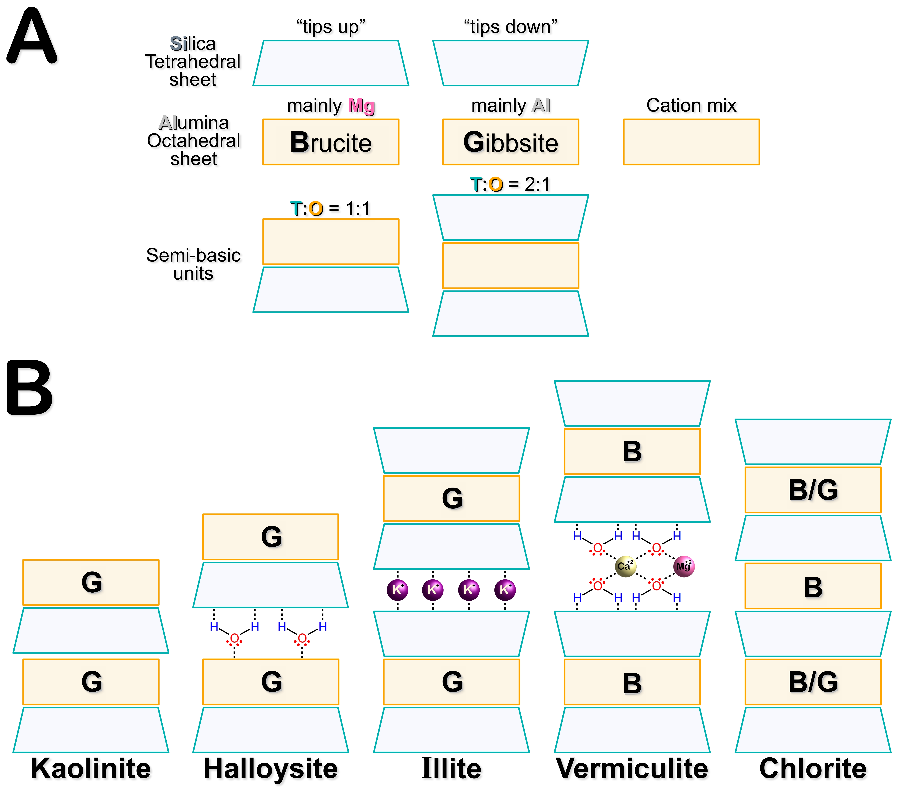
</figure>

**Figure 6. Higher Order Structure of Phyllosilicates.** The arrangement of stacked **silica tetrahedral** (T) and **metal octahedral** (O) sheets are shown for various types of clay minerals. **(A)** Two common types of O sheets are the **aluminum** oxide **<a class="one" href="https://virtual-museum.soils.wisc.edu/display/gibbsite/" target="_blank" title="Go to VirtualMuseum site">gibbsite</a>** (**G**, Al2(OH)6), and the **magnesium** oxide **<a class="one" href="https://virtual-museum.soils.wisc.edu/display/brucite/" target="_blank" title="Go to VirtualMuseum site">brucite</a>** (**B**, Mg2(OH)6). Other types of **metals** (e.g. Fe+2, Fe+3, Mn+2) can also replace Al giving rise to “*mixed*” O sheets. Regardless, when paired (T:O) or “*sandwiched*” (T:O:T) semi-basic units are combined with other semi-basic units different types of **clays** **(B)** are formed.**[3](#ref-mitchell_fundamentals_2005)** The ability of **clay** particles to adsorb water molecules and various ions, like K+, Ca+2, and Mg+2, along their inner (i.e. inter-layer spaces) and outer surfaces makes these minerals an important functional feature of healthy soils.**[83](#ref-feng_chemical_2005),[84](#ref-churchman_game_2018)**

<!--------------------------------------------------->
<!-------- END - FIG 6 - CLAY HO STRUCTURE  --------->
<!--------------------------------------------------->

    Another important aspect of soils is its **pH**. The concentrations of **hydronium** and **hydroxyl** ions can greatly influence the functional chemistry of **phyllosilicates** (e.g. ion exchanging capacity). As shown below **pH** can alter the overall charge of the **clay** particles by changing the ionization state of the metal bound hydroxyl groups:

`$$\tag{8} \phantom{1} \text{Metal}-\text{OH} \phantom{1} + \phantom{1} \text{H}_3\text{O}^+ \phantom{1} \rightleftharpoons \phantom{1} \text{Metal}-\text{O}\text{H}_2^+ \phantom{1} + \phantom{1} \text{H}_2\text{O}$$`
`$$\tag{9} \phantom{1} \text{Metal}-\text{OH} \phantom{1} + \phantom{1} \text{OH}^- \phantom{1} \rightleftharpoons \phantom{1} \text{Metal}-\text{O}^- \phantom{1} + \phantom{1} \text{H}_2\text{O}$$`

Changing the overall charge state of the **<a class="one" href="https://passel2.unl.edu/view/lesson/0cff7943f577/4" target="_blank" title="Go to Plant and Soil Science eLibrary">platy</a>** **clay** units affects how they are assembled into higher ordered structures. For example, microscopic **clay** layers that have the same overall net charge will repel each other, causing particles to disperse. Alternatively, if the microscopic **clay** layers have oppositely charged surfaces the particles will aggregate (face-to-face), or perhaps form a loose <u>flocculated</u> structure or “*fabric*” due to attractive electrostatic forces (**Fig 7**).**[3](#ref-mitchell_fundamentals_2005)** Although **clays** provide soils with the ability to store water and essential micro-nutrients (e.g. K+), they can also be detrimental to soils if found in very high concentrations (i.e. cement-like, which impedes water, air and root movements). Moreover, soils not only contain **clay** particles (\<2 µm), but also other minerals such as **carbonate**-rich **silts** (~2 to 50 µm), **quartz**-rich **sands** (~50 µm to 2 mm), as well as many different types of **organic** compounds. And it is this complex mix of components that ultimately determines the overall structure (e.g. gas permeable or compacted) and function (e.g. good growth medium) of soils.

<!---------------------------------------------------->
<!--- FIG 7 - Large Scale Soil Particle Structure  --->
<!---------------------------------------------------->

<figure>
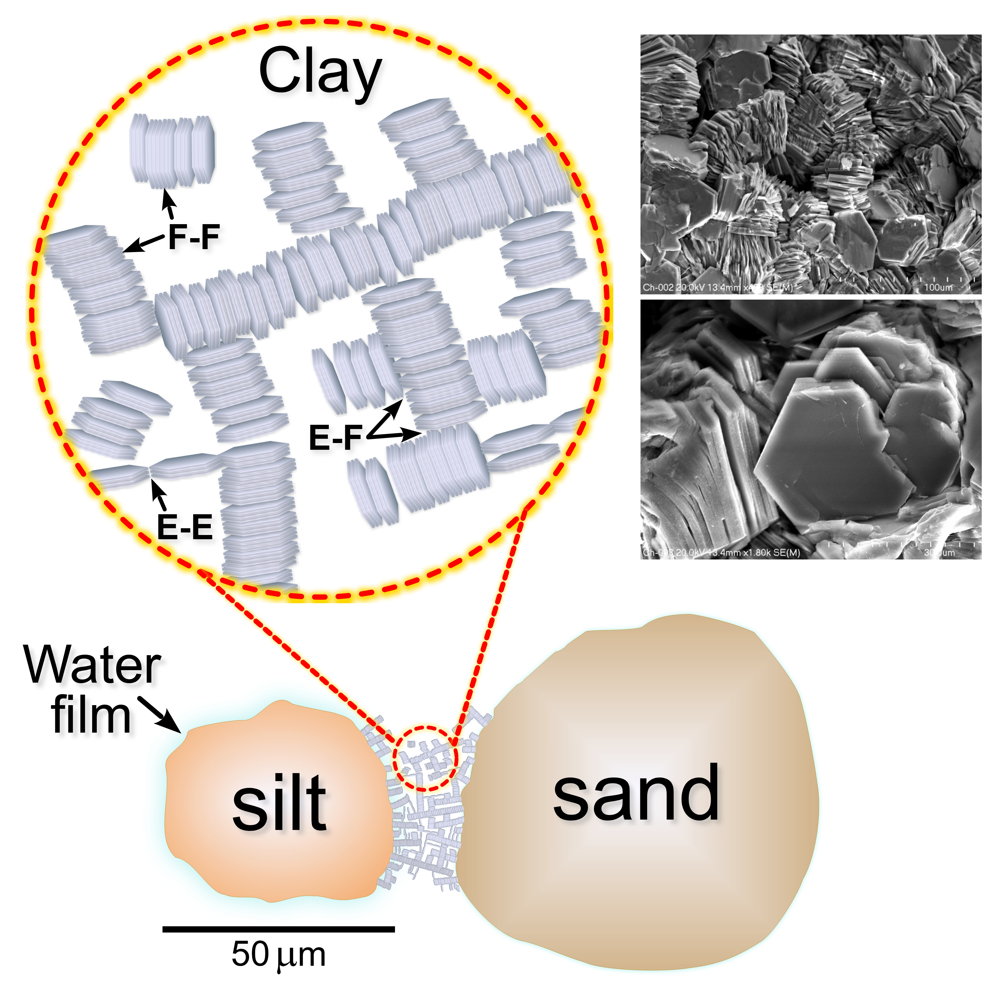
</figure>

**Figure 7. Soil Particle Structure.** The arrangement of particles and pore spaces (i.e. **fabric** elements) determines many of the physical properties and behaviours of soils (e.g. texture, O2 levels, moisture levels). Although **silts** and **sands** are made up of single grains, **clay** aggregates can form much more complicated structures, or **fabrics**, owing to their potentially charged states. Specifically, attractive electrostatic forces can cause platy **clay** micro-particles to aggregate either edge-to-edge (**EE**), face-to-face (**FF**), or edge-to-face (**EF**).**[3](#ref-mitchell_fundamentals_2005)** Extended **EF** arrangements are sometimes called “*card-house*” or “*book-house*”-like structures owing to the arrangement of single or multiple (i.e. <u>packets</u>) parallel **clay** plates. Higher order “*book-house*”-like arrangements of **clay** particles can significantly influence particle-particle interactions, particularly when the charged surfaces of the **clay** minerals (e.g. Al-OH edges) interact with the de-protonated functional groups (e.g. carboxyls, **R**-**C**OO-) of soil **organic** compounds. These types of associations play an important role in the stabilization of **organic matter** (**OM**) within soils and the formation of micro-aggregates (i.e. complexes of **silicates**, **clays**, **OM** and other minerals like iron oxides).**[88](#ref-eusterhues_stabilisation_2003)–[91](#ref-lehmann_organic_2007)** The large scale **fabric** of soil also includes small air pockets that support aerobic **microbes**, as well as water that can provide some degree of connectivity between various sized particle aggregates. Two scanning electron microscope (SEM) images of Fe-rich **chlorite** from an alpine fissure of the Mt. Blanc massif near Chamonix, France are shown (top right) for comparison. Both photos (top: 70 µm wide, bottom: 250 µm wide field views) are part of an extensive “*Images of Clay*” archive hosted by the <b><a class="one" href="https://www.minersoc.org/images-of-clay.html" target="_blank" title="Go to Clay Mineral Archive">Mineralogical Society of UK & Ireland </a></b> (<b>https://www.minersoc.org/images-of-clay.html</b>). Both photos, provided by Michal Skiba from the Institute of Geological Sciences (Jagiellonian University, Kraków), clearly show the characteristic **platy** appearance of these types of **phyllosilicates**.

<!------------------------------------------------>
<!-------- END - FIG 7 - SOIL PARTICLES  --------->
<!------------------------------------------------>
<!------------------------------------------------------>
<!-------------- SECTION 3B - SOIL BIOTA  -------------->
<!------------------------------------------------------>

  
**<u>3B** Soil **Biota</u>:** Soils are not only a reservoir of water and important nutrients, but also home to an enormous variety of life.**[15](#ref-wolters_biodiversity_2001),[29](#ref-fao_state_2020),[30](#ref-hopwood_farming_2021),[34](#ref-bardgett_belowground_2014),[44](#ref-orgiazzi_global_2016)** Although the exact number of species is unknown, conservative (lower limit) estimates suggest that there are at least 3.9 million species, mostly microscopic that reside within soils.**[44](#ref-orgiazzi_global_2016)** Things get allot more interesting if we also consider the amount of genetic diversity found within soils. Besides “*traditional*” cell based life forms there are also **viruses**, particularly **bacteriophages** (i.e. viruses that only infect bacteria, simply known as **phages**). These largely over looked genetic entities greatly <u>outnumber</u> their microbial “*prey*”, with virus-to-microbe ratios (**VMR**) ranging from 10:1 (conservative) to upwards of 1000:1.**[16](#ref-anthony_enumerating_2023),[42](#ref-cobian_guemes_viruses_2016),[92](#ref-williamson_viruses_2017),[93](#ref-pratama_neglected_2018)** Since there are millions of bacterial species found within soil, this means the number of unique **viral** “*species*” may number \>100 million. The uncertainty associated with estimating the number of unique **viruses** is due to the lack of any universal gene sequences (e.g. similar to bacterial 16S rRNA genes)**[94](#ref-fox_phylogeny_1980),[95](#ref-lane_rapid_1985)** to carry out phylogenetic analysis.

<!---------------------------------------------->
<!-------- SECTION 3B.1 - SOIL VIRUSES  -------->
<!---------------------------------------------->

**<u>3B.1** Soil **Viruses</u>:** These sub-micrometer sized entities (typically \<0.3 µm) possess either double or single stranded DNA or RNA genomes. They also vary in shape, structure (e.g. presence or absence of tail structures, or a lipid bilayer), life “*style*” (i.e. **Lytic** or **Temperate**), and their ability to cause disease (i.e. virulent, chronic, or latent infections).**[96](#ref-lopez-garcia_viruses_2012)–[98](#ref-chaitanya_structure_2019)** However, one requirement they all share is the need for a host cell to complete their “*life*” cycle (i.e. obligate intracellular parasites). As a result **viruses** have evolved ways of not only recognizing and binding to specific host cells, but also ways of evading or neutralizing anti-viral defences that cells evolve in response to them. **Viruses** are capable of infecting hosts either <u>horizontally</u> (i.e. extracellular infectious particles, or **virions**), or <u>vertically</u> (i.e. DNA is <u>integrated</u> into a host chromosome or fashioned into an episome and passively copied during cell division). **Virulent viruses** typically follow a **lytic** cycle, where the metabolism of a host cell is “*commandeered*” by the **virus** to produce infectious **virions** that are released via host cell <u>lysis</u> (i.e. cell bursts and dies). By contrast, **Temperate viruses** follow a **lysogenic** “*life*” style where the viral DNA is either integrated into the host cell genome, which is called a **provirus**, or fashioned into an extra-chromosomal **plasmid** (i.e. **episome**).**[41](#ref-clokie_phages_2011),[99](#ref-weinbauer_ecology_2004)** Although the **provirus** is relatively “*dormant*” within the host, it can “*switch*” to a **lytic**-like cycle in response to a number of conditions (e.g. exposure to mutagens, temperature, trophic levels) (**Fig. 8**).**[100](#ref-cochran_seasonal_1998)–[105](#ref-brady_molecular_2021)**

<!----------------------------------------------------------------->
<!------------ FIG 8 - Soil Lysogenic-Lytic Signaling ------------->
<!----------------------------------------------------------------->

<figure>

</figure>

**Figure 8. Bacteriophage Lysogenic-Lytic Transition.** Arguably the most important event in the “*life*” cycle of a **Temperate bacteriophage** is its transition from a relatively dormant **lysogenic** state (i.e. **provirus**) to an active **lytic** state (i.e. produce infectious viral particles or **virions**, <b>①</b>).**[99](#ref-weinbauer_ecology_2004),[105](#ref-brady_molecular_2021)** In a **lytic** state a **bacteriophage** can be viewed as a opportunistic <u>parasite</u>, since it will assemble new **virions** at the expense of the host cell (i.e. trigger cell death). By contrast, when a **bacteriophage** enters a **lysogenic** state it resembles a relatively stable <u>mutualistic</u> **symbiont**. In this non-virulent state the **viral** genome is either integrated within a host chromosome or housed within a separate **episome**. The resulting **provirus** silences **lytic** gene expression using transcriptional repressors, and can be passively replicated along side the host DNA during cell division.**[105](#ref-brady_molecular_2021),[106](#ref-casjens_prophages_2003)** Although the **prophage** is susceptible to mutational decay it often remains functional since it is thought to confer an evolutionary **<a class="one" href="https://ucmp.berkeley.edu/online-exhibits/" target="_blank" title="Go to UCMP Understanding Evolution">fitness</a>** advantage to the host cell. This is largely due to the ability of the **provirus** to protect the host from further viral infections (i.e. super-infection immunity).**[106](#ref-casjens_prophages_2003)–[109](#ref-al-shayeb_diverse_2022)** In addition, **accessory genes** (**AG**, **Fig. 9**) carried by the **provirus** can endow the host with new functions, such as the ability to produce toxins,**[110](#ref-obrien_shiga-like_1984),[111](#ref-waldor_lysogenic_1996)** or metabolize new compounds (e.g. antibiotics, **C**arbon energy sources).**[112](#ref-ghosh_prevalence_2008)–[116](#ref-sun_underexplored_2023)** Switching from a **lysogenic** state to a **lytic** state can also be <u>induced</u> by exposure to harmful DNA damaging agents (e.g. UV, mitomycin C), or various environmental stressors (e.g. changing cell density, or temperature).**[103](#ref-williamson_incidence_2007),[117](#ref-lederberg_genetic_1953)–[121](#ref-howard-varona_lysogeny_2017)** Although DNA damage is a common cause of **lytic** induction there appears to be no universal molecular mechanisms regulating this “*switching*” process among **phages**. Most of our understanding of this **lytic** “*switching*” phenomena has emerged from the study of a single *E. coli* **bacteriophage** called *lambda* (<b>λ</b>).**[117](#ref-lederberg_genetic_1953),[122](#ref-johnson_lambda_1981)** The elaborate regulatory circuitry used by <b>λ</b> involves numerous transcriptional activator and repressor proteins, translational suppressors, as well as targeted proteolysis and changes in mRNA stability.**[123](#ref-dodd_revisited_2005),[124](#ref-casjens_bacteriophage_2015)** However, more recent studies of other types of **phages** has revealed new “*switching*” signaling networks.**[104](#ref-erez_communication_2017),[125](#ref-broussard_integration-dependent_2013)–[127](#ref-silpe_host-produced_2019)** For example, infection of *Bacillus subtilis* by a **phage** called *phi3T* triggers the production of a small viral peptide (auto-inhibitor, or **AI**) called **arbitrium** (<b>②</b>).**[104](#ref-erez_communication_2017)** It is secreted by the host cell as an immature pro-peptide (<b>②</b>) where it is processed by proteolytic enzymes (<b>③</b>). As the active **AI** accumulates (i.e. increasing cell density) its levels within the cell also increases courtesy an oligopeptide permease transporter (**OPP**, <b>④</b>). Within the cell it binds to a transcription factor (**A**) and prevents it (as a functional dimer) from activating a key inhibitor (**I**) of **lysogeny** (<b>⑤</b>).**[104](#ref-erez_communication_2017)** The ability of the **phage** to monitor the levels of infected neighbouring cells using this **AI** likely increases the chances of productive infection by progeny **virus** (i.e. **<a class="one" href="https://ucmp.berkeley.edu/online-exhibits/" target="_blank" title="Go to UCMP Understanding Evolution">fitness</a>** advantage). Its somewhat analogous to λ **phage** infected *E. coli* since it has been shown, using elegant single cell fluorescent assays, that the number of **phages** infecting a single host cell significantly affects the **lysogenic** fate of the **phage** (i.e. **lysogeny** increases dramatically when the multiplicity of infection, or **MOI**, is greater than 1).**[126](#ref-ofir_contemporary_2018),[128](#ref-zeng_decision_2010)** A somewhat similar density-dependent **AI**, known as **3,5-dimethylpyrazin2-ol** (**DPO**), is produced by the **vibriophage** *VP882*.**[127](#ref-silpe_host-produced_2019)** Although the signaling network is unique it does involve a series of DNA binding factors that either activate of inhibit gene transcription. However, the **vibriophage** uses **DPO** to switch to a **lytic** fate, presumably to help the **virus** find a new host. **DPO** is known to inhibit *V. cholerae* biofilm formation and promote dissemination of the bacteria (**Note:** *V. cholerae* is the cause of human intestinal cholera).**[129](#ref-papenfort_vibrio_2017)** Lastly, induction of the so called **SOS response** (i.e. bacterial DNA repair mechanism, <b>⑥</b>) is known to target key **lytic** cycle transcriptional repressors for proteolytic degradation.**[130](#ref-roberts_proteolytic_1975)–[132](#ref-erill_aeons_2007)**

<!-------------------------------------------------------->
<!-------- END - FIG 8 - LYTIC/LYSOGENIC VIRUSES --------->
<!-------------------------------------------------------->

> *Do soil <b>viruses</b> regulate microbial mortality and nutrient cycles*?

    The short answer to this question is a “*tentative*” yes. Like all science it all comes down to measuring the amount of uncertainty, and unfortunately terrestrial soils are extremely “*opaque*” mediums. Local physical-chemical gradients create a tremendous variety of soil **niches** that makes studying them very challenging. Despite these difficulties recent **metagenomic** studies do suggest that soil **viruses** play a role in **C**arbon cycling.**[133](#ref-kimura_ecology_2008)–[144](#ref-roux_diversity_2022)** Like their marine counterparts, soil **viruses** are thought to regulate biogeochemical cycles by controlling microbial mortality and metabolism.**[143](#ref-dominguez-huerta_diversity_2022),[145](#ref-proctor_viral_1990)–[149](#ref-puxty_functional_2023)** The well known genetic versatility of **viruses** certainly supports this claim. **Viruses** not only have specialized genes that regulate viral replication, but also <u>accessory</u> genes that augment host cell metabolism,**[115](#ref-wu_structural_2022),[116](#ref-sun_underexplored_2023),[136](#ref-trubl_soil_2018),[149](#ref-puxty_functional_2023)–[151](#ref-kieft_ecology_2021)** and counter-act host cell anti-viral defences.**[152](#ref-samson_revenge_2013),[153](#ref-hampton_arms_2020)** The first of these latter two types of genes, which are known as **A**ccessory **M**etobaolic **G**enes (**AMG**),**[154](#ref-breitbart_exploring_2007)** are thought to “*prime*” cellular metabolism to optimize **virion** production.**[154](#ref-breitbart_exploring_2007),[155](#ref-sullivan_prevalence_2006)** For example, marine **cyanophages** express a photosynthetic genes known as **psbA** and **psbD** that encode <u>functional</u> **<a class="one" href="https://pdb101.rcsb.org/motm/59" arget="_blank" title="Go to Protein Database 101">Photosystem II</a>** (**PSII**) core reaction centre protein subunits.**[156](#ref-mann_marine_2003),[157](#ref-lindell_photosynthesis_2005)** The **PSII** complex catalyzes one of the most important reactions in photosynthesis, namely the <u>oxidation</u> of water molecules (i.e. H2O is the key **electron** donor).**[158](#ref-guskov_cyanobacterial_2009),[159](#ref-fischer_evolution_2016)** The products of the reaction includes Oxygen, which is a hallmark of photosynthesis, and **electrons**. The latter are used to “*reset*” the chlorophyll subunits of **PSII** since they lose **electrons** during the initial photo-activation step of photosynthesis.**[160](#ref-ferreira_architecture_2004),[161](#ref-barber_engine_2006)** The overall chemical reaction, commonly referred to as **photolysis** (**Eq. 10**), involves a small **electron** carrier molecule known as **plastoquinone** (**Q**) which delivers the photo-activated electrons to downstream **electron-transfer chain** centres that produce ATP (**Note:** Planck’s Energy equation, **E = ℎν**).**[159](#ref-fischer_evolution_2016)**

`$$\tag{10} \phantom{1} 2\text{Q} \phantom{1} + \phantom{1} 2\text{H}_2\text{O} \phantom{1} + \phantom{1} h\nu \phantom{1} \Rightarrow \phantom{1} 2\text{QH}_2 \phantom{1} + \phantom{1} \text{O}_2$$`

<!----------------------------------------------------------->
<!------------------ FIG 9 - VIRAL AMG ---------------------->
<!----------------------------------------------------------->

<figure>

</figure>

**Figure 9. Viral Accessory Metabolic Genes (AMG).** These extra genes are not involved in the production of infectious **virions**, but rather help optimize the metabolism and health of the host cell for **virion** production.**[116](#ref-sun_underexplored_2023),[149](#ref-puxty_functional_2023)** For example marine **cyanophages** are known to harbour **AMG** that are homologues of bacterial genes involved in photosynthesis and energy metabolism (e.g. **psbD**, <b>②</b>).**[150](#ref-fridman_myovirus_2017),[156](#ref-mann_marine_2003),[162](#ref-thompson_phage_2011),[163](#ref-puxty_shedding_2015)** As for soil **viruses** many **AMG** are thought to aid in **C**arbon metabolism, including various **CAZymes** (e.g. **GH75**, <b>①</b>) that hydrolyze the glycosidic bonds of polysaccharides like **chitin** (i.e. major biopolymer found in fungi and insects)**[114](#ref-jin_diversities_2019)–[116](#ref-sun_underexplored_2023),[136](#ref-trubl_soil_2018),[139](#ref-bi_diversity_2021),[141](#ref-wu_dna_2021),[149](#ref-puxty_functional_2023)** More recent studies have shown that soil **phages** also harbour **AMG** that may play an important role in the acquisition of Phosphate, an important limiting nutrient in terrestrial ecosystems.**[164](#ref-han_distribution_2022),[165](#ref-liang_hidden_2024)** In addition, **phages** also possess **accessory genes** (**AG**) that help them evade host cell anti-viral defences and combat competing **phages**.**[166](#ref-borges_discovery_2017)–[168](#ref-patel_prophages_2023)** For example, many **phages** contain **anti-CRISPR** genes (**Acrs**, <b>③</b>)**[169](#ref-bondy-denomy_bacteriophage_2013)–[171](#ref-wang_structural_2016)** that inhibit **CRISPR**-**Cas** systems used by bacteria to specifically target and destroy viral DNA and RNA.**[172](#ref-barrangou_crispr_2007)–[175](#ref-jiang_crisprcas9_2017)**

<!----------------------------------------------->
<!---------- END - FIG 9 - VIRAL AMG  ----------->
<!----------------------------------------------->

The fact that **viruses** like **cyanophages** and their microbial hosts (i.e. **cyanobacteria**, or Blue-green **algae**) have a long evolutionary history of exchanging genetic information suggests that **AMG** likely confer some sort of fitness advantage to both **viruses** and host cells alike (e.g. reservoir of genetic diversity to draw from).**[142](#ref-wirth_viruses_2022),[154](#ref-breitbart_exploring_2007),[155](#ref-sullivan_prevalence_2006)**

    As for soil **viruses** we do know that they, like their microbial hosts,**[176](#ref-thompson_communal_2017),[177](#ref-tas_metagenomic_2021)** are abundant and very diverse.**[92](#ref-williamson_viruses_2017),[93](#ref-pratama_neglected_2018),[135](#ref-kuzyakov_viruses_2018),[144](#ref-roux_diversity_2022),[178](#ref-fierer_metagenomic_2007)** As alluded to above, much of this new information has come from **metagenomic** studies. These advanced DNA sequencing techniques allow researchers to directly profile entire **viral** communities within bulk soil samples. The one key benefit of using this method is that it essentially circumvents the “*culture*” problem associated with the vast majority of bacteria (i.e. do not grow *in vitro* using current culture techniques).**[179](#ref-williamson_sampling_2003),[180](#ref-oliver_viable_2005)** Moreover, the genomes of most bacteria contain multiple **proviral** sequences,**[106](#ref-casjens_prophages_2003)** which means that DNA sequencing can identify them. Nevertheless, **metagenomic** methods do have limitations. Firstly, DNA sequences can only <u>predict</u> gene function provided there are similar genes (i.e. homologues) of known function within existing databases. The fact that a large percentage of **viral** genomes are unique (i.e. no database matches) makes this a particularly daunting challenge. In addition, despite their relatively small sizes (i.e. few have genomes \>300 kbp),**[96](#ref-lopez-garcia_viruses_2012)–[98](#ref-chaitanya_structure_2019)** there is an enormous amount of diversity among **viral** sequences that often results in a high number of non-overlapping short contiguous sequences (**contigs**). This makes it difficult to assembly them into a complete genome. Despite these and other technical difficulties **metagenomic** studies have been able to clearly show that **viral** communities vary significantly across different physical, chemical and biological gradients (e.g. moisture, pH, **rhizosphere**).**[136](#ref-trubl_soil_2018),[138](#ref-ter_horst_minnesota_2021),[139](#ref-bi_diversity_2021),[141](#ref-wu_dna_2021),[181](#ref-santos-medellin_spatial_2022)** This is likely a result of the seemingly endless number of ecological **<a class="one" href="https://evolution.berkeley.edu/glossary/niche/" target="_blank" title="Go to Evolution 101">niches</a>** that soils provide **viruses** and their microbial hosts (i.e. varying physical and chemical makeup, shifting seasonal wet/dry cycles, **biotic** interactions).  
    These arguments are also bolstered by the fact that bacteria account for ~15% of the global **biomass** (i.e. ~70 `\(\times\)` 1012 kg or **G**iga**t**ons of **C**arbon),**[182](#ref-bar-on_biomass_2018)** which is a good indicator (albeit indirect) of the likely importance of **bacteriophages** to functioning soils. Moreover, since **viruses** greatly outnumber their microbial hosts its conceivable that soil **viruses**, like their marine counterparts, play a significant role in the turn-over of microbes (i.e. population control). We know that in the upper layers of the oceans viral **lysis** of photosynthetic microbes can divert significant amount of **C**arbon away from other microbe consumers (e.g. krill), resulting in elevated levels of dissolved inorganic matter (**DOM**). This “*short-circuiting*” of traditional marine food webs (i.e. “*viral shunt*”)**[183](#ref-wilhelm_viruses_1999)** affects not only the productivity of marine **autotrophs** (i.e. phytoplankton), but also the levels of **<a class="one" href="https://pubchem.ncbi.nlm.nih.gov/compound/1068" target="_blank" title="Go to PubChem">Dimethylsulphide</a>** (**DMS**) that accumulate and transit atmospheric marine boundaries. **DMS** is not only a potent **antioxidant**,**[184](#ref-sunda_antioxidant_2002)** but also a precursor of Sulphate (SO4) aerosols (i.e. product of atmospheric oxidation) that serve as important cloud condensation nuclei within the troposphere (i.e. affects climate via cloud formation).**[185](#ref-lovelock_atmospheric_1972)–[188](#ref-zhao_changes_2024)**  
    Do soil **viruses** impact **C**arbon cycling and climate the same way that marine **viruses** do? Although terrestrial **viral** ecology is still in its infancy, there have been a few **metagenomic** studies carried out on soils samples that have identified functional viral **AMG**. One study by **Emerson** and colleagues (2018) identified 1,907 viral **contigs** (species level populations) from 201 bulk soils samples taken from northern permafrost peatlands.**[134](#ref-emerson_host-linked_2018)** The vast majority (~96%) of the predicted proteins were **viral** specific in nature. However, from the remaining (~4%) sequences they did identify 14 potential viral **glycoside hydrolase** like genes (**GH**) with “high confidence” (i.e. common viral genes had to be found both upstream and downstream of the putative gene). The sequence similarities (i.e. 100% confidence scores) to prokaryotic **GH** genes were confirmed using **PHYRE2** (Protein Homology/analogY Recognition Engine v2.0).**[189](#ref-kelley_phyre2_2015)** Close inspection of the sequences also confirmed the presence of key catalytic amino acid residues within the proposed active site of the enzymes. More importantly, the researchers cloned and expressed one of the viral **GH** genes *in vitro* to formally test it for enzymatic activity. This specific **GH** group 5 (**GH5**) family member did indeed display **endomannanase** activity *in vitro* (i.e. cleaves glycosidic bonds between two or more carbohydrates, specifically β-1,4-linked mannose units), which the authors suggest may be involved in the degradation of complex <b>plant</b>-derived **C**arbon polymers that accumulates within the soil.**[134](#ref-emerson_host-linked_2018)** If this inference is correct than it could have important implication to both the ecological of these **biomes** and our current changing climate, since northern peatlands are known to store vast quantities of terrestrial organic **C**arbon.**[190](#ref-hugelius_large_2020)**  
    Additional support for the idea that viral **<a class="one" href="http://www.cazy.org/" target="_blank" title="Go to CAZyme">Carbohydrate-Active enZyme</a>** (**CAZyme**)**[191](#ref-drula_carbohydrate-active_2022)** genes influence soil **C**arbon cycling comes from a recent study by **Wu** and colleagues (2022).**[115](#ref-wu_structural_2022)** Based on previous work the group had identified a large population of diverse **bacteriophages** within North American **grassland** soils. The field samples from this early study were subjected to heavy sequence analysis, which ultimately resulted in 2,631 viral **contigs** (\>2.5 Kb) and 14 complete high-quality genomes.**[141](#ref-wu_dna_2021)** Bioinformatic analysis of these sequences went on to identify several “*high confidence*” **AMG** (i.e. contained hallmark viral sequences both upstream and/or downstream of the putative **AMG**), many of them being homologous to metabolic genes that break down **C**arbon polymers, including **cellulose** and **chitin**. And it was the **chitinase**-like **AMG** (**GH75** family members) that became the focus of their latest study. **Chitin** is the second most abundant polysaccharide (**cellulose** being the first) found in nature (e.g. insect cuticles, fungal cell walls).**[192](#ref-merzendorfer_chitin_2003),[193](#ref-el_knidri_extraction_2018)** So it would follow that **chitinase**-like **AMG**, which have recently been identified in **mangrove** soil **viruses**,**[114](#ref-jin_diversities_2019)** could provide a microbe host with access to a valuable source of organic **C**arbon. Although **mangrove** forests are quite unique coastal ecosystems (i.e. dominated by woody halophytes) they, like northern peatlands, sequester enormous amounts of organic **C**arbon within their soils.**[194](#ref-donato_mangroves_2011),[195](#ref-alongi_carbon_2014)** In fact on a per hectare basis **mangrove** forests store more **C**arbon, predominately below ground, than any other ecosystem (e.g. mean whole-ecosystem carbon stock: 956 Mg·ha−1, compared with 241 Mg·ha−1 for rain forests, and 408 Mg·ha−1 for peat swamps).**[195](#ref-alongi_carbon_2014)**  
    Given the potential importance of **chitinase**-like **AMG** to **C**arbon cycling the investigators searched for these enzymes (**GH75**) within the large **<a class="one" href="https://genome.jgi.doe.gov/portal/IMG_VR/IMG_VR.home.html" target="_blank" title="Go to IMG/VR">Integrated Microbial Genomes and Virome</a>** (**IMG/VR**) database. They ended up finding 142 candidate **GH75**-like **AMG** that phylogenetic sequence analysis showed were closely related to bacterial **chitosanases** (i.e. probably acquired by **HGT**).**[196](#ref-boto_horizontal_2009),[197](#ref-touchon_embracing_2017)** Bioinformatic analysis also identified three separate **Clades** of viral **chitosanases** based on the substitution patterns of four key catalytic amino acid residues (**Note:** soil viral **chitosanases** formed a separate group from those found in aquatic **viruses**). Ultimately the investigators cloned and expressed 10 of these 142 **GH75** **chitosanase**-like **AMG** to test for enzymatic activity *in vitro*. Unfortunately only 2 of the 10 candidate **AMG** produced soluble proteins that could be assayed *in vitro*, and only one of them, which they called **V-Csn**, showed **endo-chitosanase** activity.**[115](#ref-wu_structural_2022)** In addition to carrying out site-directed mutagenesis experiments (i.e. confirm importance of catalytic residues) and generating **<a class="one" href="https://alphafold.ebi.ac.uk/" target="_blank" title="Go to AlphaFold Protein Structure Database">AlphaFold</a>[198](#ref-jumper_highly_2021)** based protein structure models, the researchers also solved the crystal structure of **V-Csn**. The high resolution crystal structure showed the catalytic residues clustered within a centrally located cleft, which helped the authors devise a plausible hydrolytic reaction mechanism. Although the amount of work detailed in this study is impressive the ecological significance of this viral **chitinase**-like **AMG** is still unclear. However, the fact that the **GH75**-like **V-Csn** was originally isolated from a Forest soil **metagenome** does provide some interesting context, since fungi are known to be the dominate decomposers within these habitats. Clearly **V-Csn** carrying **bacteriophages** could provide their microbial hosts with the ability to metabolize **chitin** rich fungal debris that accumulates within forest soils (i.e. source of organic **C**arbon and Nitrogen).**[115](#ref-wu_structural_2022)**

    Although many soil viral **AMG** have been identified, few have been functionally verified, and none (to my knowledge) have been quantified in terms of their impact on global ecosystem services. Given the death toll that **viruses** have inflicted on humans over the centuries, it’s easy to loose site of the fact that we have also benefited greatly from **viruses**. Vaccines,**[199](#ref-jenner_origin_1801),[200](#ref-riedel_edward_2005)** **phage** therapy,**[201](#ref-dherelle_invisible_2011)–[203](#ref-dedrick_engineered_2019)** gene therapy,**[204](#ref-bulcha_viral_2021)** **CRISPR-Cas** genomic editing,**[205](#ref-jinek_programmable_2012),[206](#ref-zheng_precise_2024)** and new and improved nano-materials,**[207](#ref-wen_design_2016)** have all come from, or been inspired by our study of **viruses**.
 

<!-------------------------------------------------->
<!-------- SECTION 3B.2 - SOIL MICRO-BIOTA  -------->
<!-------------------------------------------------->

**<u>3B.2** Soil **Bacteria** and **Fungi</u>:** Although **viruses** are the most abundant genetic entities found within soils (i.e. ~6 × 1029) they only account for a small fraction (~6%) of the estimated 20 Gigatons of soil biomass **C**arbon (Gt **C**).**[182](#ref-bar-on_biomass_2018)** Most of the terrestrial biomass is **fungal** (~12 Gt **C**) or **bacterial** (~7 Gt **C**) in nature. Moreover, these two groups of **microbes** are considered the most important decomposers of soil **OM** (S**OM**). By metabolizing relatively large organic residues (e.g. cellulose, lignins, chitin) these micro-organisms release **C**O2 and simple inorganic forms of Nitrogen (e.g. NH4+, NO3-, amino acids), Phosphorus (e.g. HPO4-2), and Sulphur (e.g. SO4-2) that **plants** can readily take-up.**[208](#ref-whalen_managing_2014)** This so called soil **mineralization** process is what makes the B**GCC** so important to all **ecosystems** (e.g. <u>functioning</u> food webs). Given the importance of B**GCC** to all soil life a more detailed discussion of them is provided below.  
 
    Essentially B**GCC** encompass the flow of key chemical elements (i.e. **C**arbon, Hydrogen, Oxygen, Nitrogen, Phosphorus, and Sulphur) between the **abiotic** (geological) and **biotic** domains of our planet. Although the origins of these chemical cycles are largely unknown, their importance is undeniable given that all cells requires these 6 key elements to build biomolecules (i.e. proteins, nucleic acids, carbohydrates and lipids). The basic chemistry that drives these cycles are coupled <u>red</u>uction and <u>ox</u>idation reactions, otherwise known as **redox** chemistry.**[27](#ref-falkowski_microbial_2008),[209](#ref-berner_biogeochemical_1989)** These **redox** networks are powered by a continuous input of both matter and **energy** (e.g. solar radiation, plate tectonics) from the outside world (i.e. open thermodynamic system). Although most of the **energy** generated by the Earth’s heat flow (i.e. ~0.087 Watts/m2) is lost to space as <u>waste</u> heat (i.e. no chemical work done),**[210](#ref-rosing_rise_2006)** incoming **solar energy** is both plentiful (i.e. ~340 Watts/m2)**[211](#ref-wild_global_2013)** and eminently more suitable given the limited **energy** efficiency of complex biochemical systems. Life on our planet quickly evolved in response to this reliable **energy** input, most notably photo**autotrophs** (~3.8 billions years ago).**[210](#ref-rosing_rise_2006),[212](#ref-mills_proterozoic_2014),[213](#ref-ivlev_global_2015)** These early ancestors of present day **cyanobacteria** added to the chemical disequilibrium of our planet (e.g. ~20% O2 atmosphere), which certainly makes Earth quite unique when compared to other planetary objects within our own solar system (i.e. habitable).

<!----------------------------------------------->
<!-------- SECTION 3B.2I - CARBON CYCLE  -------->
<!----------------------------------------------->

**<u>3B.2I Carbon (C) Cycling</u>:** Of all the chemical elements in nature **C**arbon is likely the most important one that cycles between the four major subsystems or spheres of our planet (i.e. atmo**sphere**, hydro**sphere**, litho**sphere** and bio**sphere**). Because of its unique chemical properties (i.e. tetravalent, covalent bond energies, and electronegativity) **C** often undergoes catenation (i.e. forms long **C** chains). The resulting “*atomic polymers*” provide a skeleton for creating much more complex molecules like glucose (**C**6H12O6) via the addition of functional groups (e.g. hydroxyls, -OH) and cyclization (i.e. **C** ring structures). Yet the most important **C** containing molecule on the planet is arguable the simplest one, namely **C**arbon dioxide (**C**O2). The levels of this simple greenhouse (i.e. heat absorbing/radiating) gas are regulated in large part by **redox** biochemistry, specifically photo**synthesis** (**red**uces **C** to form sugars) and cellular **respiration** (**ox**idation of biomolecules like sugars release **C**O2). While the resulting photo**synthates** (i.e. sugars) are primarily used in the support of normal **plant** functions, a significant proportion of it (5-40%) is released by roots either passively via diffusion gradients (i.e. **exudates**), or by energy dependent mechanisms (i.e. active transport).**[8](#ref-bais_role_2006),[9](#ref-badri_regulation_2009),[35](#ref-walker_root_2003),[214](#ref-lynch_substrate_1990)** **Exudates** are largely comprised of low molecular weight metabolites (i.e. sugars, amino acids and organic acids)**[8](#ref-bais_role_2006),[215](#ref-ryan_function_2001),[216](#ref-jones_carbon_2009)** that are known to support active microbial communities in and around root systems, a region commonly referred to as the **Rhizosphere**.**[9](#ref-badri_regulation_2009),[216](#ref-jones_carbon_2009)–[219](#ref-broeckling_root_2008)**

> “*…an area of intense activity (biological, chemical and physical) influenced by compounds <u>exuded</u> by roots and by microorganisms feeding on these compounds. This microenvironment is characterized by distinct conditions compared with the bulk soil, largely created by the plant roots and its various microbial associations*.”**[220](#ref-narula_role_2008)**

<!---------------------------------------------->
<!---------- TABLE 2 - SOIL EXUDATES ----------->
<!---------------------------------------------->

<table class="Table">
<thead>
<tr style="text-align:left">
<td colspan="3">
TABLE 2. SOIL EXUDATES
</td>
</tr>
<thead>
<tr>
<th style="width:40%" class="f18">
EXUDATE
</th>
<th class="f18">
DESCRIPTION
</th>
</tr>
</thead>
<tbody>
<tr>
<td class="tmid">
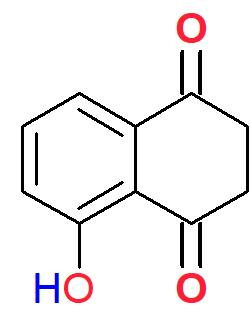
</td>
<td style="text-align:left">
<b><a class="one" href="https://pubchem.ncbi.nlm.nih.gov/compound/Juglone" target="_blank" title="Go to PubChem site">JUGLONE</a></b> (hydroxy-1,4-naphthoquinone) is a <b>phenolic</b> compound and well known <b>allelochemical</b> (i.e. can exert either beneficial or harmful effects on other organisms) produced by <b>Black Walnut</b> trees (<i>Juglans nigra</i>). <b>Pliny the Elder</b>, a Roman naturalist who died in the 79 AD eruption of Mount Vesuvius, once wrote that “<i>the shadow of walnut trees is poison to all <b>plants</b> within its compass</i>.”(ref. D) It’s a colouring agent in food and cosmetics, and is sometimes used as a natural herbicide. It’s also known to have anti-bacterial and anti-tumour activity.(Refs. D)
</td>
</tr>
<tr>
<td class="tmid">

</td>
<td style="text-align:left">
<b>Benzoxazinoids</b>, like <b><a class="one" href="https://www.ebi.ac.uk/chebi/searchId.do?chebiId=CHEBI:18048" target="_blank" title="Go to ChEBI">DIMBOA</a></b> (2,4-dihydroxy-7-methoxy-2H-1,4-benzoxazin-3(4H)-one), are secondary metabolites produced by many grass species (i.e. <i>Poaceae</i>, which includes cereal crops) that have been shown to provide protection against insect pests and microbes. They have also been shown to act as an <i>chemo-attractant</i> for the <b>plant</b> growth-promoting bacterium <i>Pseudomonas putida</i> KT2440.(Refs. E)
</td>
</tr>
<tr>
<td class="tmid">
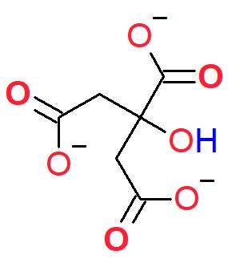
</td>
<td style="text-align:left">
Low molecular weight <b>carboxylates</b>, such as <b>oxalate</b> ((<b>C</b>OO-)2), <b>malate</b> (<b>C</b>2H3OH(<b>C</b>OO-)2) and <b>citrate</b> (structure on the left), are actively released by <b>plant</b> roots via dedicated plasma membrane channel and transporter proteins in response to toxic Al+3.(Refs. F) These small organic anions also help <b>plants</b> increase their uptake of soil Pi by solubilizing bound forms of this important nutrient (i.e. bound to soils minerals or organic matter).(Ref. G)
</td>
</tr>
</tbody>
</table>

**Table 2 References.** **Refs. D[8](#ref-bais_role_2006),[221](#ref-rietveld_allelopathic_1983)–[225](#ref-catanzaro_natural_2018)**, **Refs. E[226](#ref-niemeyer_hydroxamic_1988)–[228](#ref-neal_benzoxazinoids_2012)**, **Refs. F[229](#ref-ma_role_2000)–[234](#ref-kochian_plant_2015)**, **Refs. G[215](#ref-ryan_function_2001),[235](#ref-hoffland_biosynthesis_1992)–[238](#ref-canarini_root_2019)**

 

<!--------------------------------------------------->
<!---------- TABLE 2. SOIL EXUDATES - END ----------->
<!--------------------------------------------------->

The **Rhizosphere** accounts for most of the organic **C** turnover within soils. Globally, the largest deposits of soil organic matter (**SOM**) are located in northern latitudes (e.g. permafrost, northern wetlands) due to low soil respiration rates. This is in contrast to warm tropical regions where soil respiration rates are much higher and significant amounts of organic **C** reside above ground in the form of <b>plant</b> biomass.**[21](#ref-crowther_global_2019),[239](#ref-hashimoto_global_2015)** However, calculating the total amount of stored **SOM** globally or regionally is fraught with difficulties,**[240](#ref-hashimoto_divergent_2023)** due to the non-linear nature of these systems and their sensitivity to perturbations.**[241](#ref-anderies_topology_2013)–[243](#ref-hernandez-ramirez_nonlinear_2021)** Conceptually, there are two distinct ‘pools’ of **SOM**, namely particulate organic matter (**POM**) and mineral-associated organic matter (**MAOM**).**[244](#ref-lavallee_conceptualizing_2020)** **POM** is made up of microbial necromass (e.g. dead bacterial and fungal cell fragments),**[245](#ref-miltner_som_2012)** and <b>plant</b> residues (e.g. sloughed root cells, and <b>plant</b> “*litter*”),**[246](#ref-grandy_molecular_2008)** all in the early stages of decomposition; while **MAOM** is composed of low molecular weight organic compounds (e.g. **exudates**, secretions, or **POM** leachate) that readily bind to mineral surfaces.**[4](#ref-lehmann_contentious_2015),[90](#ref-kleber_conceptual_2007),[244](#ref-lavallee_conceptualizing_2020),[247](#ref-kogel-knabner_organo-mineral_2008),[248](#ref-villarino_plant_2021)** The Soil **C**ontinuum **M**odel (**SCM**) suggests that progressive Oxidation of organic debris or residues results in the release of increasing amounts of smaller, water soluble organic compounds (i.e. \<600 kDa) that bind strongly to mineral surfaces, particularly with increasing depth.**[4](#ref-lehmann_contentious_2015),[249](#ref-schrumpf_storage_2013),[250](#ref-kramer_depth_2017)** Within this partitioned environment **MAOM** are less prone to microbial degradation and therefore more likely to persist for longer periods of time. However, the decomposition rate of **SOM** is sensitive to a number of different conditions (e.g. moisture and oxygen levels, pH, texture, depth).**[249](#ref-schrumpf_storage_2013),[251](#ref-feller_physical_1997)–[254](#ref-cotrufo_soil_2019)** For example, **oxalic acid**, a well known <b>plant</b> **exudate** with strong metal chelating activity (i.e. forms metal complexes), can de-stabilize **MAOM** pools resulting in significantly elevated microbial respiration rates (i.e. **priming** effect).**[255](#ref-keiluweit_mineral_2015)** This is in keeping with earlier studies that showed **oxalic acid**, as well as other kinds of low molecular weight metabolites (e.g. sugars, amino acids, organic acids), can “*prime*” microbial soil mineralization.**[256](#ref-kuzyakov_review_2000)–[261](#ref-pausch_plant_2013)** Although the levels of dissolved **OM** (**DOM**) are relatively low within soils, its rapid turn over suggests that they may account for a significant proportion (~30%) of the mineralized **C**O2 released by soils.**[260](#ref-van_hees_carbon_2005)**  
    Unfortunately, whether or not **C** is stored or respired depends on a complex web of **abioitic** and **biotic** interactions that researchers are only beginning to understand. For example, the makeup and function of a soil community can change in response to climate (e.g. temperature sensitive enzyme kinetics, and soil moisture), potentially resulting in net **C** mineralization (i.e. release of **C**O2, **C**H4).**[262](#ref-davidson_temperature_2006)** Several studies suggest that our warming climate has already negatively impacted the ability of soils to store **C** in a number of different ecosystems, particularly climate-sensitive Arctic and sub-Arctic regions (i.e. permafrost is a large **C** reservoir).**[263](#ref-bellamy_carbon_2005)–[267](#ref-garcia-palacios_evidence_2021)**

<!------------------------------------------------>
<!------------ FIG 10 - SOM Dynmaics ------------->
<!------------------------------------------------>

<figure>
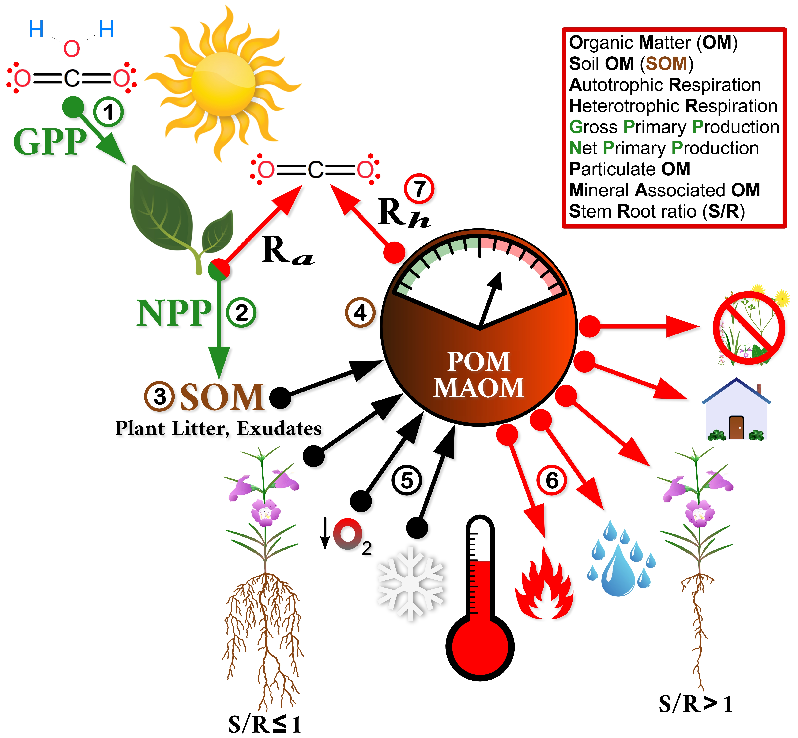
</figure>

**Figure 10. Soil Organic Matter (SOM) Dynamics.** In coming **solar radiation** is the main **energy** source responsible for the emergence of complex organized systems on our planet, such as climate and **photosynthesis**. The latter is of course responsible for fixing atmospheric **C**O2 with the aid of an electron donor (i.e. H2O) in the form of simple sugars. The net result (i.e. **Net Primary Productivity:** <b>②</b> NPP = <b>①</b> G**ross** PP - **R**espirationautotrophic) are biomolecules that support complex food webs within ecosystems. A significant portion (upwards of ~40%) of this fixed **C** is released by <b>plant</b> roots as **exudates** (i.e. collectively termed **Rhizodeposits**, <b>③</b>). It along with the **OM** shed by **plants** (i.e. <b>plant</b> “*litter*”)**[246](#ref-grandy_molecular_2008)** and contained in dead organisms (i.e. **necromass**, predominately microbial)**[245](#ref-miltner_som_2012)** accumulates within the **top**soil (<b>④</b>). This “*pool*” of **SOM** is gradually degraded by a community of decomposers (mostly microbes), eventually producing an assortment of **OM** that can be conveniently classified as either **particulate OM** (**POM**) or **mineral-associated OM** (**MAOM**, <b>④</b>).**[4](#ref-lehmann_contentious_2015),[90](#ref-kleber_conceptual_2007),[244](#ref-lavallee_conceptualizing_2020),[247](#ref-kogel-knabner_organo-mineral_2008),[248](#ref-villarino_plant_2021)** The latter (**MAOM**) is distinguished from the former by its microscopic size (i.e. \<600 kDa) and ability to strongly bind soil minerals (i.e. **clay** fraction). **MAOM** is less prone to microbial degradation and therefore more likely to persist for longer periods of time within soils. Nevertheless, the stability of these two pools of **OM** can vary considerably depending upon certain **biotic** and **abiotic** factors (<b>⑤</b>, <b>⑥</b>). Notably soil moisture,**[21](#ref-crowther_global_2019),[253](#ref-huang_elevated_2017)** mineral content,**[249](#ref-schrumpf_storage_2013)–[251](#ref-feller_physical_1997),[268](#ref-torn_mineral_1997),[269](#ref-richter_rapid_1999)** as well as temperature,**[21](#ref-crowther_global_2019),[239](#ref-hashimoto_global_2015),[263](#ref-bellamy_carbon_2005),[264](#ref-crowther_quantifying_2016),[266](#ref-bond-lamberty_globally_2018),[270](#ref-heikkinen_climate_2022)** and oxygen levels,**[252](#ref-keiluweit_anaerobic_2017),[271](#ref-freeman_enzymic_2001)** are **abiotic** factors known to influence **SOM** respiration rates (<b>⑦</b>, **R**<b>a</b>utotrophs, **R**<b>h</b>etertrophs) and long term **C** storage within soils. Several **biotic** factors, such as biodiversity,**[272](#ref-lange_plant_2015)–[275](#ref-lange_increased_2023)** changing land use patterns,**[251](#ref-feller_physical_1997),[276](#ref-don_impact_2011)–[278](#ref-sanderman_soil_2017)** and <b>plant</b> root traits (e.g. root-stem ratio, mycorrhizal fungi, rhizobia, **Rhizodeposition**)**[34](#ref-bardgett_belowground_2014),[216](#ref-jones_carbon_2009),[248](#ref-villarino_plant_2021),[254](#ref-cotrufo_soil_2019),[255](#ref-keiluweit_mineral_2015),[279](#ref-bradford_empirical_2013)–[282](#ref-dijkstra_root_2021)** have also been shown to significantly alter **SOM** respiration rates and **C** storage.

<!--------------------------------------------------->
<!---------- END - FIG 10 - SOM DYNAMICS  ----------->
<!------------------------=-------------------------->

<!-------------------------------------------------->
<!-------- SECTION 3B.2II - NITROGEN CYCLE  -------->
<!-------------------------------------------------->
**<u>3B.2II Nitrogen (**N**) Cycle</u>:** Terrestrial **C**arbon and Nitrogen cycles are intimately connected, since both **organic** molecules (e.g. amino acids) and inorganic forms of Nitrogen (e.g. NH4+, NO3-) are the main sources of this element for **plants**.**[283](#ref-schimel_nitrogen_2004)** The realization that **plants** can use intact **organic** monomers like **amino acids** as a N source first emerged from the study of arctic ecosystems.**[284](#ref-chapin_preferential_1993)–[286](#ref-kielland_role_1997)** In these colder climes N mineralization rates are low, but the abundance of **OM** within the frozen soils provides **plants** with a large source of nutrients for growth. Similar studies in other N limiting environments, such as boreal forests and deserts, have also shown that vascular **plants** are capable of absorbing **amino acids** to meet their N needs.**[287](#ref-nasholm_boreal_1998),[288](#ref-schiller_uptake_1998)** As alluded to above, soil microbes (i.e. bacteria and mycorrhizal fungi) found within the **Rhizosphere** largely regulate terrestrial N cycles. These microbes actively secrete extracellular enzymes (i.e. **exoenzymes**) that breakdown N containing S**OM** (e.g. cellulose, lignins, chitin). However, the catalytic activity of **exoenzymes** can vary widely depending upon the physical (e.g. depth, particle size, moisture levels),**[247](#ref-kogel-knabner_organo-mineral_2008),[289](#ref-marx_exploring_2005)–[292](#ref-alves_kinetic_2021)** and chemical (e.g. substrate concentrations, temperature, pH, O2 levels)**[247](#ref-kogel-knabner_organo-mineral_2008),[252](#ref-keiluweit_anaerobic_2017),[271](#ref-freeman_enzymic_2001),[289](#ref-marx_exploring_2005),[291](#ref-sinsabaugh_phenol_2010)–[294](#ref-burns_soil_2013)** makeup of the soil micro-environment. Clearly **plants** impact N cycling not only by the quality of the “*litter*” they produce (e.g. lignin:N ratio),**[295](#ref-scott_foliage_1997),[296](#ref-chapman_plants_2006)** but also by the types of microbial relationships they actively recruit (via **exudates**, **flavonoid** signaling factors)**[297](#ref-oldroyd_speak_2013)** and establish (i.e. **Rhizobia**, mycorrhizal fungi).**[298](#ref-uroz_plant_2019)** Clearly diazo**trophs** (i.e. N “*fixing*” **bacteria**) are not the only important organisms that regulate N cycling within soils (**Fig. 11**). In fact recent studies also suggest that intact microbes can be consumed by **plants**.**[299](#ref-paungfoo-lonhienne_plants_2008),[300](#ref-paungfoo-lonhienne_turning_2010)**

<!-------------------------------------------------->
<!------------ FIG 11 - Nitrogen Cycle ------------->
<!-------------------------------------------------->

<figure>

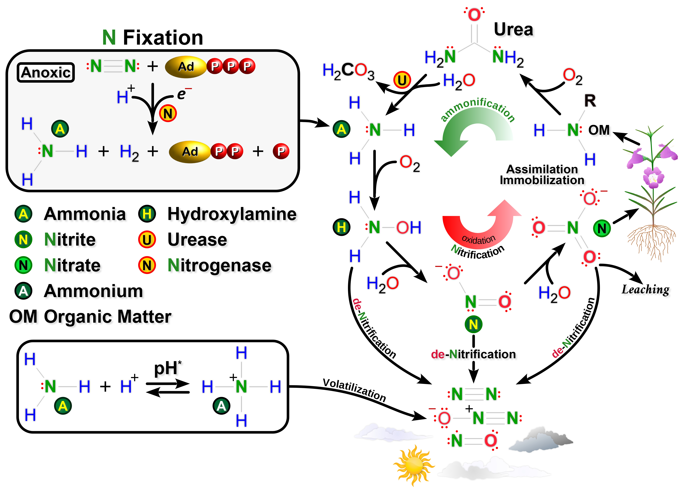

</figure>

**Figure 11.** N**itrogen (N) Cycle.** N is known to be the critical element that limits the net primary productivity (**NPP**) of terrestrial **ecosystems** (**Note: NPP** = gross photo**synthesis** - respiration of producers). Since a significant proportion of the N found in **plants** is used in photo**synthesis** (i.e. chlorophyll pigment), it is perhaps not surprising that the amount of N found within terrestrial **plants** is strongly correlated to **NPP**. **Microbes**, being the key regulators of this cycle, can function as either decomposers or diazo**trophs**. As decomposers they actively break down N-rich **OM** to extract usable N (e.g. Nitrate: NO3-). By contrast, diazo**trophs** (i.e. symbiotic or free-living **prokaryotes**) convert atmospheric **di-atomic** N into ammonia (N≡N → NH3), which in turn is converted into various useful molecules like **glutamine** (i.e. **glutamate** + NH3 → **glutamine** → → **urea**). However, even though the supply of atmospheric N2 is essentially limitless (i.e. ~78% of the air we breath), it is largely chemically un-reactive due to the strong triple bond holding the two N **atoms** together (N≡N). As a result extracting **atoms** of N in order to create usable metabolites (i.e. “*fixing*”) is not only energetically “*expensive*”, but also requires suitable **reducing** agents and a special low O2 environment (i.e. **Nitrogenase**, Ⓝ, is Oxygen sensitive enzyme). Only a <u>relatively</u> few groups of **prokaryotes** (**taxons:** *Rhizobium*, *cyanobacteria*, actinomycete *Frankia*) are capable of performing this task (**Note:** there are 1000s of species either free-living or in close association with **plants**, **lichens**, **protists** or **insects**).**[301](#ref-davies-barnard_global_2020)–[304](#ref-douglas_microbial_2009)** This is why many **plants** (e.g. legumes) have evolved symbiotic relationships with diazo**trophs**. However, the **ammonia** (Ⓐ) and **ammonium** (<b>Ⓐ</b>) produced by diazo**trophs** are volatile and quite chemically reactive (i.e. prone to **oxidation**). Because of these limitations most **plants** acquire “*bio-available*” forms of N by recruiting **microbes** that either act as close (e.g. **endosymbiants** in legumes) or slightly more distant mutualists (i.e. free-living diazo**trophs**, and/or microbial decomposers).**[305](#ref-norman_complex_2017)** **Plants** often establish many of these symbiotic relationships through the release of **exudates** (i.e. photo**synthates**, **Fig. 10**) that serves as high quality **C** food sources for growth promoting soil **microbes**. Moreover, these microbial decomposers usually do not operate alone and often form close relationships with much larger soil fauna (i.e. **micro-**, **meso-** and **macro-fauna**). For example, **earthworms** are one of the most important **macro-fauna** found within soils. Many **earthworm** species consume leaf “*litter*” as well as various **microbes** found within soil (i.e. fungal hyphae. protists, **bacteria**). Some of the smaller **bacteria** they consume not only successfully transit the gut of these animals, but also thrive within this “*safe*” environment (**Fig. 16**). It is estimated that these **ecosystem engineers** significantly increase crop yields by ~25%, largely due to the positive affects they have on N **mineralization**.**[306](#ref-van_groenigen_earthworms_2014)** All of these indirect **ecological** interactions are also influenced by climate and other **abiotic** factors (i.e. temperature, **pH**, moisture, mineral P levels), which makes for a very complex network of interactions that is prone to perturbations (i.e. ecological cascades).**[307](#ref-gaiarsa_interaction_2019)**
 
From a chemistry point of view we can follow the various “*inputs*” and “*outputs*” of the N cycle by recognizing the different **redox** states of N. They range from a strongly <u>reduced</u> state as seen in **ammonia** (Ⓐ, –3 valence state) and **ammonium** (<b>Ⓐ</b>, –3 valence state), to a highly <u>oxidized</u> state as seen in the N**itrate** ion (<b>Ⓝ</b>, +5 valence state). Transformations between Ⓐ and <b>Ⓝ</b> (i.e. **redox** chemistry) involves various intermediates that have different N valence states (e.g. N**itrite**, Ⓝ +3 valence state; hydroxylamine, Ⓗ -1 valence state). During the N “*fixation*” and **Ammonification** parts of the cycle reduced inorganic **ammonia** (Ⓐ) is produced. **Ammonification** involves **microbial** decomposers converting waste **OM** like excreted **urea** into simple inorganic Ⓐ (i.e. <b>Ⓤ</b>, common **urease** catalyzed reaction). **Microbes** can then use “*fixed*” or **ammonified** Ⓐ as a **reducing** agent to power biochemical reactions (i.e. donates electrons and becomes **oxidized** in the process) during the main **oxidative** arm of the cycle, which is commonly referred to as N**itrification**. The end product of these reactions is <b>Ⓝ</b>, which is readily taken up by **plants**. In terms of “*outputs*” many of the key N compounds within the cycle are lost to the atmo**sphere** when they are converted to volatile compounds, specifically Nitrous oxide (N2O), Nitric oxide (NO), Ⓐ and of course di-Nitrogen (N2) during the **de-Nitrification** and **Anammox** parts of the cycle. The latter process specifically refers to soluble <b>Ⓐ</b> being converted to gaseous N2 under anoxic conditions (i.e. NH4+ + NO2- → N2 + 2H2O). Lastly, <b>Ⓝ</b> ions can escape from soils by hydro**logical** forces due to its soluble mobile nature (i.e. “*leaching*”). To complete the cycle soluble <b>Ⓝ</b> ions are readily taken up by **plants** and other soil organisms and temporarily “*locked up*” in the form of biomass. For **plants** some of the N-rich biomass is refractory to chemical degradation (e.g. **lignins**) and thus slow to re-enter the N cycle. Others smaller N compounds can become “*trapped*” or immobilized within the sub-micron domain of soil particle pores (i.e. bound tightly to minerals), making them inaccessible to microbial decomposers.

<!------------------------------------------------------>
<!------------ END FIG 11 - Nitrogen Cycle ------------->
<!------------------------------------------------------>

<!----------------------------------------------------->
<!-------- SECTION 3B.2III - PHOSPHORUS CYCLE  -------->
<!----------------------------------------------------->
**<u>3B.2III** P**hosphorus (**P**) Cycle</u>:** Phosphorus, like **C** and N, is an essential chemical element found in a variety of biomolecules (e.g. cell membrane P**hospholipids**, **DNA**, **RNA**), including those involved in **energy** metabolism (e.g. **AT**P, **acetyl-CoA**). The ability of this element to form stable *ionizable* mono-ester (i.e. **R**1-O-PO2-2) and di-ester bonds (i.e. **R**1-O-P\[O-\]-O-**R**2) at physiological **pH** prevents biomolecules from “*escaping*” or diffusing out of the cell. The cell membrane itself is also predominately made up of P**hospholipids**, and the **amphipathic** nature of these molecules (i.e. contains a <u>hydrophilic</u> Phosphate “*head*” group, and two <u>hydrophobic</u> “*tail*”-like fatty acid chains) allows them to form bi-layer lipid structures that are important to all cells (i.e. plasma membrane, organelle membranes). Moreover, the interactions between Phosphate groups and water molecules (i.e. hydration “*shell*”, **Fig. 12**) plays an important role in protein-protein interactions (e.g. **enzyme** catalysis, cell signaling),**[308](#ref-hunter_why_2012)** cell metabolism, and stable information storage (i.e. Phosphodiester bonds in **DNA** and **RNA** are resistant to spontaneous hydrolysis).**[309](#ref-westheimer_why_1987)–[312](#ref-walton_phosphorus_2023)** The main source of Phosphate for soils is **<a class="one" href="https://www.mindat.org/min-29229.html" target="_blank" title="Go to Mindat.org">calcium apatites</a>** (i.e. Ca5\[PO4\]3OH, Ca5\[PO4\]3OF). Chemical weathering of these **primary minerals** releases soluble inorganic Phosphates (P<i>i</i>) that are either directly taken up by **plants** and microbes, rapidly immobilized (to varying degrees) by soil particles, or transformed into **<a class="one" href="https://openpress.usask.ca/soilscience/chapter/soil-mineralogy/" target="_blank" title="Go to Digging into Canadian Soils">secondary minerals</a>** (e.g. **<a class="one" href="https://www.mindat.org/min-4156.html" target="_blank" title="Go to Mindat.org">variscite</a>**, AlPO4⋅2H2O; **<a class="one" href="https://www.mindat.org/min-793.html" target="_blank" title="Go to Mindat.org">brushite</a>**; and **<a class="one" href="https://www.mindat.org/min-3801.html" target="_blank" title="Go to Mindat.org">strengite</a>**, FePO4⋅2H2O).**[313](#ref-smeck_phosphorus_1985),[314](#ref-canadian_society_of_soil_science_digging_2021)** And unlike **C** and N, there are no major atmo**spheric** reservoirs of P (**Note:** there are important *aeolian* sources of Phosphate rich dust).**[315](#ref-swap_saharan_1992)–[317](#ref-nogueira_dust_2021)** As a consequence all major sources of inorganic Phosphate ultimately come from the earth (i.e. litho**sphere**). Mining of Phosphorus rich rock, which is a key ingredient of agricultural fertilizers, helped usher in the Green revolution several decades ago, but its continued misuse has resulted in major environmental problems (e.g. **<a class="one" href="https://tinyurl.com/yxt984m4" target="_blank" title="Go to NOAA">eutrophication</a>** of freshwater and marine ecosystems).**[318](#ref-diaz_spreading_2008)–[320](#ref-wu_imbalance_2022)**

<!----------------------------------------------->
<!------------ FIG 12 - Phosphates  ------------->
<!----------------------------------------------->

<figure>

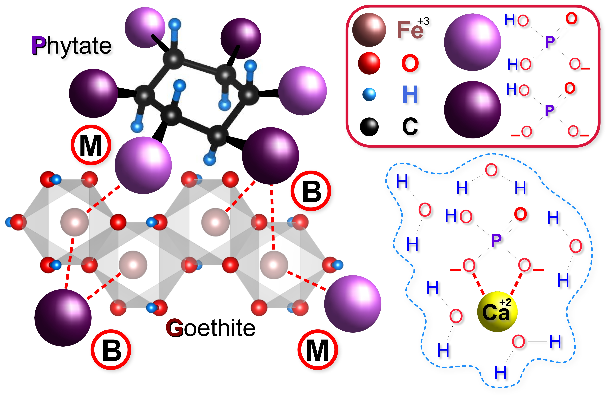

</figure>

**Figure 12.** Soil P**hosphates.** Most of the Phospate found within soils can be classified as either readily bio-available (i.e. **labile pool**) or not readily bio-available (i.e. **refractory pool**). The former is primarily made up of **ortho**P**hosphates** (i.e. HPO3-2 dominates acidic soils, while H2PO3- dominates alkaline soils), while the latter is made up of **primary** (i.e. **<a class="one" href="https://www.mindat.org/min-29229.html" target="_blank" title="Go to Mindat.org">calcium apatites</a>**, Ca5(PO4)3⋅\[F, Cl, OH\]) and **secondary** Phosphate **minerals** (i.e. <u>insoluble</u> **metal cation** precipitates).**[314](#ref-canadian_society_of_soil_science_digging_2021)** For example, in neutral to alkaline soils Phosphates tend to precipitate out of solution as Ca Phosphates (e.g. **<a class="one" href="https://www.mindat.org/min-793.html" target="_blank" title="Go to Mindat">Brushite</a>**, CaHPO4⋅H2O), while in acidic soils Phosphates tend to precipitate out of solution as Fe+3 and Al+3 complexed Phosphates (e.g. **<a class="one" href="https://www.mindat.org/min-3801.html" target="_blank" title="Go to Mindat.org">Strengite</a>**, FePO4⋅2H2O; **<a class="one" href="https://www.mindat.org/min-4156.html" target="_blank" title="Go to Mindat.org">Variscite</a>**, AlPO4⋅2H2O). In addition to the precipitation/dissolution equilibrium of Phosphate **minerals**, a significant proportion of soil Phosphates move onto and off of different particle surfaces (i.e. adsorption/desorption kinetics).**[321](#ref-hinsinger_bioavailability_2001)** This surface dynamic is very much controlled by the charge state of the *adsorbate* and *adsorbent*, and because Phosphates are negatively charged the most important *adsorbents* possess positive charges (e.g. **metal oxides**). For example, **<a class="one" href="https://www.mindat.org/min-1719.html" target="_blank" title="Go to Mindat.org">Goethite</a>** (αFeO\[OH\], crystal structure rendered using using **<a class="one" href="https://jp-minerals.org/vesta/en/" target="_blank" title="Go to VESTA site">VESTA</a>**)**[85](#ref-momma_vesta_2011),[322](#ref-yang_goethite_2006)** is a common **ferric oxyhydroxide** found within most soils. It is known to bind strongly to both inorganic **ortho**P**hosphates** (Pi) and **organic** Phosphates (Po) such as P**hytate** (i.e. **inositol hexa-**P**hosphate**, or **I**P6). The **pH** sensitive nature of the charged Phosphate groups can result in different binding modes, namely **mono-dentate** (<b>Ⓜ</b>, monovalent Phosphate species), or **bi-dentate** (<b>Ⓑ</b>, bivalent Phosphate species). In the case of P**hytate**, which contains multiple Phosphate groups, a stronger **poly-dentate** mode of binding is possible. Also depicted above (lower right) is a typical “*hydration shell*” surrounding a Ca+2 Phosphate complex that readily precipitates out of solution.

<!------------------------------------------------->
<!---------- END - FIG 12 - PHOSPHATES  ----------->
<!------------------------------------------------->

    Soil scientists often use different extraction methodologies (e.g. water-extractable fraction, bicarbonate-extractable fraction, hydroxide-extractable fraction, acid soluble fraction, etc.)**[313](#ref-smeck_phosphorus_1985),[323](#ref-walker_fate_1976)** to operationally define different “*pools*” of P<i>i</i>. What these chemical methods reveal about P<i>i</i> is how strongly it is chemical bound to a particular component of a soil particle, such as **<a class="one" href="https://openpress.usask.ca/soilscience/chapter/soil-mineralogy/" target="_blank" title="Go to Digging into Canadian Soils">secondary minerals</a>** (e.g. Al, Ca and Fe **oxides**, and **phyllosilicates**). The surface chemistry driving these reactions largely revolves around the types of chemical bonds, as well as their spatial geometry and sensitivity to various **abioitc** factors (e.g. **pH**, moisture, temperature). For example, the divalent HPO3-2 is the dominate **ortho**P**hosphate** species in basic soils, while monovalent H2PO3- is the dominate **ortho**P**hosphate** species in acidic soils. As for **metal oxides** (e.g. **sesquioxides**, **M**2O3 stoichiometry with **M** being either Al, Fe, or Ca) and **clay** minerals (e.g. **vermiculite**, **Fig. 6**) their charged states are **pH** sensitive and subject to protonation reactions (**Eq. 8**). Because of the shape and multi-valent nature of P<i>i</i> they can interact with mineral surfaces in more than one way. For example, when P<i>i</i> binds to **goethite** (αFeO\[OH\]) it can do so via a *monodentate* or *bidentate* configuration (**Fig. 12**). Both of these types of interactions severely reduce the mobility of P<i>i</i> (i.e. *insoluble*). However, if P<i>i</i> binds indirectly to mineral surfaces via a network of water H-bonds (i.e. hydration “*shell*”, **Fig. 11**), than it can be rapidly <u>replaced</u> by similarly charged ions. This ion replacement reaction, commonly termed **ion exchange** (e.g. **C**ation **E**xchange **C**apacity, or **CEC**, which is often used to describe the “*activity*” of **clays**), depends on how accessible the mineral binding sites are and whether or not these sites prefer certain ions (i.e. might be some *selectivity* based on the size and shape of charged/polar groups). When P<i>i</i> leaves the surface of soil particles and enters into solution they become surrounded by a shell or “*sphere*” of water molecules (i.e. hydrated ions, **Fig. 12**). Although the function of this “*hydration shell*” in biological systems is debatable (i.e. so called “*biological water*”), it certainly serves an important thermodynamic role (i.e. “*heat bath*”) by dissipating the kinetic **energy** (i.e. various inter- and intra-molecular movements) of systems.**[324](#ref-laage_water_2017)** Thermodynamics aside, we do know that the concentrations of P<i>i</i> found within soil solutions are several orders of magnitude lower (i.e. \[**µM**\] range) than those found within cells (i.e. \[**mM**\] range). Because of the scarcity of soluble P<i>i</i> most **plants** rely on symbiotic **mycorrhizal** fungi to help “*forage*” for this nutrient within the top-soil (**Fig. 13**). Besides recruiting these symbiotic fungi, plant can also respond to P<i>i</i> stress by: (i) changing its root structure (e.g. increased lateral root growth and root hair density);**[325](#ref-vance_phosphorus_2003)–[327](#ref-peret_root_2014)** (ii) releasing Phosphate solubilizing **exudates** such as **organic acids** (e.g. citrate, ascorbate, oxalate);**[8](#ref-bais_role_2006),[235](#ref-hoffland_biosynthesis_1992),[237](#ref-jones_organic_1998),[238](#ref-canarini_root_2019)** (iii) secreting hydrolytic **enzymes**, particularly **acid** P**hosphatases** and P**hytases**;**[325](#ref-vance_phosphorus_2003),[328](#ref-lefebvre_response_1990)–[331](#ref-liu_enhancing_2022)** and (iv) increasing the expression of high-affinity P<i>i</i> transporters such as P**HT1**.**[325](#ref-vance_phosphorus_2003),[332](#ref-shin_phosphate_2004),[333](#ref-nussaume_phosphate_2011)**  
    Although it’s only soluble P<i>i</i> that is taken up by plant plasma membrane transporters (i.e. P**HT1**, a proton-coupled H2PO3- transporter),**[334](#ref-harrison_phosphate_1995)–[336](#ref-mitsukawa_overexpression_1997)** often times the dominate form of Phosphate within soils is **organic** (Po). The high proportion of Po within soils is no doubt due to the continual addition of **OM** via plant “*litter*”, <b>animal</b> residues and microbial **necromass**. Despite its varying soil content (typically 30-65% of total soil Phosphate)**[337](#ref-condron_chemistry_2005)** most of the Po is **<a class="one" href="https://pubchem.ncbi.nlm.nih.gov/compound/Phytic-acid" target="_blank" title="Go to PubChem">phytate</a>**, an important plant Phosphate storage molecule also known as **inositol hexa**P**hosphate** (**I**P6).**[331](#ref-liu_enhancing_2022)** The six *ionizable* Phosphate groups of P**hytate** causes it to strongly bind to soil particles, particularly metal **oxides** and **clay** minerals, which makes it largely inaccessible to **plants** (**Fig. 12**, **13**). However, **plants** can overcome this problem with the aid of P**hosphate** solubilizing **exudates** (e.g. **citrate** and **oxalate**)**[235](#ref-hoffland_biosynthesis_1992),[237](#ref-jones_organic_1998),[325](#ref-vance_phosphorus_2003),[338](#ref-gardner_acquisition_1983)–[342](#ref-nuruzzaman_distribution_2006)** Once Po is “*freed*” from these insoluble complexes it can then be hydrolyzed by specific **exoenzymes** (i.e. plant and microbe secreted or *periplasmic* enzymes) known as P**hosphatases** (i.e. **phytases**, **acid phosphatases**).**[321](#ref-hinsinger_bioavailability_2001),[325](#ref-vance_phosphorus_2003),[328](#ref-lefebvre_response_1990),[329](#ref-hurley_dual-targeted_2010),[342](#ref-nuruzzaman_distribution_2006)–[345](#ref-duff_role_1994)** This family of highly efficient P**hospho-mono-esterases** cleave mono-ester bonds that hold P<i>i</i> to **organic** molecules (**Fig. 13**).**[310](#ref-lad_rate_2003),[311](#ref-schroeder_time_2006)** Since the solubility and hydrolysis of Po ultimately determines whether or not **plants** access this organic source of P<i>i</i>, it should therefore comes as no surprise that any factor that greatly affects **enzyme**-substrate interactions, be it physical-chemical (i.e. **pH**, soil texture, moisture levels) or biological/biochemical (i.e. **exudates**, **exoenzymes**), likely contributes to the overall biochemical mineralization process. In simple mathematical terms the net release of P<i>i</i> from **SOM** is equal to the difference in the gross mineralization and gross immobilization.**[346](#ref-bunemann_assessment_2015)** While the math may seem simple measuring net Po mineralization rates are inherently challenging owing to the methods used (i.e. isotopic dilution, extraction techniques) and the heterogeneous nature of soils (e.g. varying physical, chemical and biological characteristics). For example, **pH** (as detailed above) causes changes in the charge state of both Po and P<i>i</i>, which determines how readily they adsorb to soil particle surfaces. This logic also applies to **enzymes**, since all proteins are poly-protic macro-molecules (i.e. functional side chains, N- and C-terminal residues) whose charge states are **pH** dependent (i.e. **<a class="one" href="https://ipc2.mimuw.edu.pl/theory.html" target="_blank" title="Go to pI Calculator">iso-electric point</a>**, or **pI**). So **pH** can affect how **enzymes** interact with soil particles, which is very much akin to how **pH** affects **clay** minerals and metal **oxides** (**Eq. 8**). Moreover, the catalytic activity of **enzymes** can be enhanced or diminished when bound to surfaces, depending on whether access to the substrate is enhanced (i.e. increased effective concentration), or whether its activity is altered in this solid phase. Certainly *periplasmic* **enzymes** expressed on the surfaces of cells can have their active sites oriented outwards toward their intended target while other parts are provided protection from degradation.**[294](#ref-burns_soil_2013)** Whether or not **enzymes** come in contact with substrates may depend on their diffusion rates or perhaps other biological mechanisms that monitor substrate gradients (e.g. *quorum sensing* or *chemotaxis*).  
    Overall the research suggests that the uptake and re-mineralization of Phosphate by microbes are the most important processes regulating Po mineralization within the **Rhizosphere**.**[347](#ref-richardson_soil_2011)** Needless to say these processes can be negatively impacted by changes in both land use patterns (e.g. habitat loss, agricultural mismanagement) and reduced soil biodiversity.**[348](#ref-oelmann_above-_2021)**

<!------------------------------------------------>
<!---------- FIG 13 - Phosphate Cycle  ----------->
<!------------------------------------------------>

<figure>
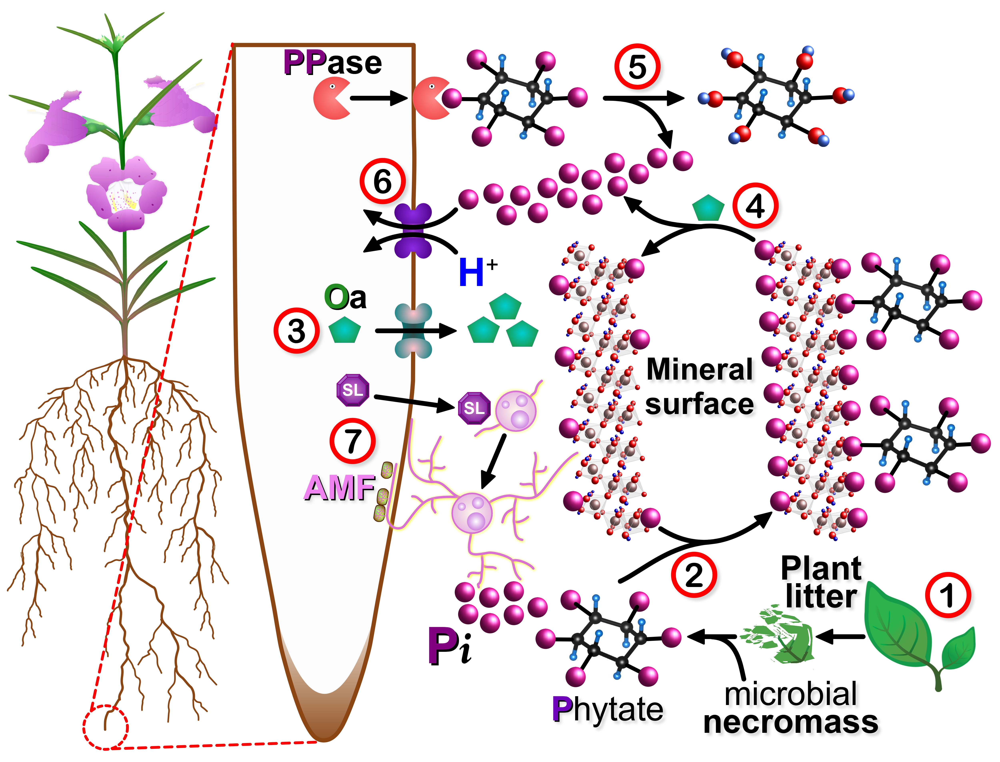
</figure>

**Figure 13. Terrestrial** P**hosphate Cycling.** The bio-availability of Phosphorus within soils is largely dependent on re-cycling mechanisms since system inputs, specifically rock weathering and atmospheric deposition (i.e. fine soil particles, pollen, biochar), are relatively low over short timescales (i.e. years to decades).**[349](#ref-newman_phosphorus_1995)** Recycling of **organic** Phosphates (Po) found in plant “*litter*”, **Rhizodeposits** (i.e. **exudates**, shed root cells), <b>animal</b> residues and microbial **necromass** (i.e. bacterial and fungal debris), begins with their *oxidative* breakdown by resident soil microbes (<b>①</b>). The metabolic products are low molecular weight Po molecules, particularly **phytate** (i.e. **inositol hexa**P**hosphate**, or **I**P6).**[331](#ref-liu_enhancing_2022)** These small negatively charged molecules readily bind to mineral and **clay** surfaces (<b>②</b>), which blocks any further break down and release of inorganic P**hosphate** (Pi) associated with these **organic** molecules. However, **plants** can circumvent this problem by releasing poly-carboxylated **organic acids** (O**a**, <b>③</b>), such as **ascorbate** and **citrate**, that can promote Pi desorption from soil **clay** and mineral surfaces (<b>④</b>).**[350](#ref-giles_organic_2012)** Once “*freed*” from the solid phase both Po and Pi species re-enter soil solution where Po is acted upon by plant and microbial **protein** P**hosphatases** (PP**ases**). These enzymes cleave the **mono-ester** bonds holding Pi to the **organic** molecule (<b>⑤</b>). Finally the accumulating Pi can be taken up by dedicated plant P**hosphate** transporters (<b>⑥</b>). Most plant species meet much of their Pi requirements through their symbiotic relationship with **arbuscular mycorrhizal fungi** (**AMF**, <b>⑦</b>). These fungi invade plant root cells where they establish unique tree-like structures called **arbuscles** that receive plant sugars in exchange for water and micro-nutrients such as Pi. Similar to **plants** **AMF** acquire Pi using their own set of unique Pi transporters.**[334](#ref-harrison_phosphate_1995)** Moreover, **AMF** can increase Pi uptake by releasing **organic acids** (e.g. fructose) that can activate gene expression and PP**ase** activity within neighbouring bacteria.**[351](#ref-zhang_signal_2018),[352](#ref-chiu_mechanisms_2019)** **Plants** are known to recruit **AFM** by secreting small hormones known as **Strigolactones** (**SL**, <b>⑦</b>) that stimulate extensive hyphal branching in specific fungal species.**[353](#ref-akiyama_plant_2005),[354](#ref-burger_many_2020)**

<!----------------------------------------------->
<!--------- END - FIG 13 - PHOSPHORUS  ---------->
<!----------------------------------------------->

<!------------------------------------------------>
<!-------- SECTION 3B.2IV - SULFUR CYCLE  -------->
<!------------------------------------------------>
**<u>3B.2IV** S**ulfur** **Cycle</u>:** Although the cycling of S within terrestrial soils is perhaps the least “*glamorous*” of all the biogeochemical cycles (smelly subject? ;), it’s arguably the most interesting one given the unique chemistry (i.e. **redox** potential) and close connections with the other cycles (i.e. **C**, N and H2O). S is one of the most abundant chemical elements on Earth, and is usually found as **<a class="one" href="https://www.mindat.org/min-3314.html" target="_blank" title="Go to Mindat">pyrite</a>** (FeS2) or **gypsum** (CaSO4⋅2H2O) within the litho**sphere**. When these **minerals** are subjected to **chemical weathering** near the surface they are transformed into soluble S**ulfates** that eventually make their way to the oceans.**[209](#ref-berner_biogeochemical_1989),[355](#ref-edwards_sulfur_1998),[356](#ref-canfield_evolution_2004)** In addition to geological factors (i.e. **chemical weathering**, **tectonics** and **volcanism**) S**ulfate** cycling within soils is also controlled by components of the bio**sphere**, specifically S **R**educing **M**icroorganisms (S**RM**).**[357](#ref-muyzer_ecology_2008)–[360](#ref-chaudhary_microbes-mediated_2023)**  
    If our starting point is the litho**sphere** than the event of interest is how S containing sedimentary rock (i.e. **metal** S**ulfides** minerals) undergoes **chemical weathering** to form water soluble S**ulfates**. **<a class="one" href="https://www.mindat.org/min-3314.html" target="_blank" title="Go to Mindat">Pyrite</a>** is the most abundant **metal** S**ulfide**, and when exposed to Oxygen and water for extended periods of time it will readily undergo **oxidation**. Looking at this chemical reaction (**Eq. 11-14**) one can see that the generation of *ferric* iron (Fe+3, **Eq. 12**) is the critical step in this process, since it can O**xidize** **<a class="one" href="https://www.mindat.org/min-3314.html" target="_blank" title="Go to Mindat">pyrite</a>** (**Eq. 14**) and thus make the overall process self-propagating in nature.**[361](#ref-banks_mine-water_1997)–[363](#ref-dos_santos_pyrite_2016)**

`$$\tag{11} 2 \phantom{.} \underbrace{\text{Fe}\text{S}_2 \phantom{.}}_\text{Pyrite} \phantom{1} + \phantom{1} 7 \phantom{.} \text{O}_2 \phantom{1} + \phantom{1} 2 \phantom{.} \text{H}_2\text{O} \phantom{1} \rightleftharpoons \phantom{1} 2 \phantom{.} \underbrace{\text{Fe}^{+2} [\text{SO}_4]^{-2}}_\text{Fe(II) Sulfate} \phantom{1} + \phantom{1} 2 \underbrace{\text{H}_2\text{SO}_4}_\text{Sulfuric acid}$$`

`$$\tag{12} 4 \phantom{.} \underbrace{\text{Fe}^{+2}}_\text{Fe(II)} \phantom{1} + \phantom{1} \text{O}_2 \phantom{1} + \phantom{1} 4 \phantom{.} \text{H}^+ \phantom{1} \rightleftharpoons \phantom{1} 4 \phantom{.} \underbrace{\text{Fe}^{+3}}_\text{Fe(III)} \phantom{1} + \phantom{1} \text{H}_2\text{O}$$`

`$$\tag{13} 4 \phantom{.} \underbrace{\text{Fe}^{+3}}_\text{Fe(III)} \phantom{1} + \phantom{1} 12 \phantom{.} \text{H}_2 \text{O} \phantom{1} \phantom{1} \rightleftharpoons \phantom{1} 4 \phantom{.} \underbrace{\text{Fe}^{+3}[\text{OH}^-]_3 \phantom{.}}_\text{Fe(III) hydroxide} \phantom{1} + \phantom{1} 12 \phantom{.} \text{H}^+$$`

`$$\tag{14} \underbrace{\text{Fe}\text{S}_{2 \phantom{.} \text{(s)}}}_\text{Pyrite} \phantom{1} + \phantom{1} 14 \phantom{.} \underbrace{\text{Fe}^{+3}}_\text{Fe(III)} \phantom{1} + \phantom{1} 8 \phantom{.} \text{H}_2\text{O} \phantom{1} \rightleftharpoons \phantom{1} 15 \phantom{.} \underbrace{\text{Fe}^{+2}}_\text{Fe(II)} \phantom{1} + \phantom{1} 2 \phantom{.} \underbrace{\text{SO}_4^{-2}}_\text{Sulphate} \phantom{1} + \phantom{1} 16 \phantom{.} \text{H}^+$$`

Another notable feature of **<a class="one" href="https://www.mindat.org/min-3314.html" target="_blank" title="Go to Mindat">Pyrite</a>** O**xidation** is the production of **acid** (i.e. S**ulfuric acid** and H+), which can cause the acidification of water ways (i.e. death of aquatic organisms). This is an on-going problem in current and abandoned metal mining sites (e.g. Coal, Iron, Copper and Zinc ores) where improperly managed waste material (containing **pyrite**) undergoes chemical weathering producing acid run off (aka: “*acid mine drainage*”).**[361](#ref-banks_mine-water_1997)**  
    The amount of S found within the litho**sphere** (i.e. **2×107 Gt**) vastly exceeds those found in lakes and rivers (i.e. <b>0.3</b> **Gt**). Nevertheless, the levels of S**ulfate** that accumulate within the oceans (i.e. hydro**sphere**) as a result of fluvial transport are quite significant (i.e. **1.3×106 Gt**).**[364](#ref-bottrell_reconstruction_2006),[365](#ref-jones_effects_2016)** The ocean floor, which represents an important interface between the hydro**sphere** and litho**sphere**, is particularly rich in S (i.e. **3×105 Gt**) due to an active S**RM** community.**[364](#ref-bottrell_reconstruction_2006),[366](#ref-jorgensen_biogeochemical_2019)** Deep sea hydrothermal vent systems also support an active S based microbial community, but these **auto**litho**trophs** are powered by H2S and not S**ulfate**.**[367](#ref-corliss_submarine_1979)–[369](#ref-martin_hydrothermal_2008)** Moreover, far less is known about **organic** and **inorganic** S cycling within these inaccessible deep sea vents than in coastal marine sediments. What we do known about the latter is that within the *anoxic* zone of these sediments S**RM** actively take up S**ulfate** and use it as an electron acceptor to metabolize a wide variety of small molecular weight **organic** molecules (e.g. hydrocarbons, acetate, alcohols, phenolics).**[357](#ref-muyzer_ecology_2008),[358](#ref-barton_chapter_2009),[366](#ref-jorgensen_biogeochemical_2019)** These microbes take advantage of the **multi-valent states** of S to produce partially or fully reduced S metabolites, such as S**ulfite** (S+4 state: SO3-2), **thio**S**ulfate** (S+2 state: S2O3-2), elemental Sulfur (S0), and S**ulfides** (S-1 state: HS2- and S-2 state: HS-, H2S). The partially reduced states of these S metabolites allow S**RM** to control the flow of electrons during **bioenergetic** processes (i.e. “*shuttle*” electrons between electron donors and acceptors).**[359](#ref-fike_rethinking_2015)** Although these microbes prefer **anaerobic** environments their ability to tolerate *oxic* conditions give them access to more **OM**, particularly within coastal waters where the productivity of the ocean is high.**[358](#ref-barton_chapter_2009),[370](#ref-dolla_oxygen_2006)** This adaptation is important since the concentration of **OM** rapidly declines with increasing ocean depth, which places severe limits on the metabolic activity of these microbes.**[371](#ref-jorgensen_mineralization_1982)** Moreover, S**RM** are believed to account for the majority of **OM** mineralization within coastal marine sediments, which shows how closely linked **C** and S cycling is in nature.**[366](#ref-jorgensen_biogeochemical_2019),[371](#ref-jorgensen_mineralization_1982),[372](#ref-sievert_sulfur_2015)**  
    One of the most important **organic** molecules **oxidized** by S**RM**, such as **anaerobic methanotrophic archaea** (**ANME**), is **methane** (**Eq. 15**).**[366](#ref-jorgensen_biogeochemical_2019)** **ANME** have been shown to form a special metabolic partnerships with S**ulfate**-reducing *delta-Proteobacteria*.**[373](#ref-boetius_marine_2000)** This so called “*dual-species consortium*” controls the level of **methane** (a potent greenhouse gas) released by marine sediments. Any excess biS**ulfide** produced during this process can eventually re-form S**ulfate** by reacting with elemental S**ulfur** (S0) and forming diS**ulfide** (**Eq. 16-17**). Another commonly metabolized **organic** compound is **acetate** (**Eq. 18**). When it is **oxidized**, using S0 as an electron acceptor, H2S is produced. This powerful reducing agent can react with FeS (i.e. **metal oxide** formed by excess **bisulfides**, **Eq. 19**) to produce **pyrite** (**Eq. 20**). Being a stable and highly insoluble mineral it readily precipitates out of solution and becomes buried within sediments, where it will eventually become sedimentary **pyrite**.

`$$\tag{15} \underbrace{\text{CH}_{4 \phantom{.} \text{(aq)}} \phantom{.}}_\text{Methane} \phantom{1} + \phantom{1} \underbrace{\text{SO}_4^{-2}}_\text{Sulfate} \phantom{1} \rightleftharpoons \phantom{1} \underbrace{\phantom{.} \text{H}\text{S}^-}_\text{bisulfide} \phantom{1} + \phantom{1} \underbrace{\phantom{.} \text{HCO}_3^- \phantom{.}}_\text{bicarbonate} \phantom{1} + \phantom{1} \text{H}_2\text{O}$$`

`$$\tag{16} \underbrace{\phantom{.} \text{H}\text{S}^-}_\text{bisulfide} \phantom{1} + \phantom{1} \underbrace{\text{S}^0_{\phantom{.} \text{(s)}}}_\text{Sulfur} \phantom{1} \rightleftharpoons \phantom{1} \underbrace{\phantom{.} \text{HS}_{2}^- \phantom{.}}_\text{disulfide}$$`

`$$\tag{17} \underbrace{4\phantom{.} \text{HS}_{2}^- \phantom{.}}_\text{disulfide} \phantom{1} + \phantom{1} 4\phantom{.}\text{H}_2 \text{O} \phantom{1} \rightleftharpoons \phantom{1} \underbrace{\text{SO}_4^{-2}}_\text{Sulfate} \phantom{1} + \phantom{1} \underbrace{7\phantom{.} \text{H}\text{S}^-}_\text{bisulfide} + \phantom{1} 5\phantom{.}\text{H}^+$$`

`$$\tag{18} \underbrace{\text{CH}_3\text{COO}^-}_\text{Acetate} \phantom{1} + \phantom{1} \underbrace{4\phantom{.}\text{S}^0_{\phantom{.} \text{(s)}}}_\text{Sulfur} \phantom{1} + \phantom{1} \text{H}^+ \phantom{1} + \phantom{1} 2\phantom{.}\text{H}_2\text{O} \phantom{1} \rightleftharpoons \phantom{1} \underbrace{4\phantom{.} \text{H}_{2}\text{S} \phantom{.}}_\text{Sulfide} \phantom{1} + \phantom{1} 2\phantom{.}\text{CO}_2$$`

`$$\tag{19} \underbrace{\phantom{.} \text{H}\text{S}^-}_\text{bisulfide} \phantom{1} + \phantom{1} \underbrace{\text{M}^{+2}}_\text{Metal} \phantom{1} \rightleftharpoons \phantom{1} \underbrace{\phantom{.} \text{MS}_{\phantom{.} \text{(s)}} \phantom{.}}_\text{Metal Sulfide} \phantom{1} + \phantom{1} \text{H}^+$$`

`$$\tag{20} \underbrace{\phantom{.} \text{H}_2\text{S} \phantom{.}}_\text{Sulfide} + \phantom{1} \text{FeS}_{\phantom{.} \text{(s)}} \phantom{1} \rightleftharpoons \phantom{1} \underbrace{\text{Fe}\text{S}_{2 \phantom{.} \text{(s)}} \phantom{.}}_\text{Pyrite} \phantom{1} + \phantom{1} \text{H}_{2\phantom{.} \text{(g)}}$$`

    The “*fate*” of S**ulfate** within the ocean’s upper **euphotic** zone is also an important part of the overall S cycle. Here dissolved S**ulfate** is taken up by phytoplankton and incorporated into biomolecules such as **methionine**. This amino acid is of particular interest since it used by many marine algae, particularly single celled *dinoflagellates*, *coccolithophores* and *diatoms*,**[374](#ref-keller_dimethyl_1989),[375](#ref-stefels_environmental_2007)** to produce **dimethyl**S**ulfoniopropionate** (**DM**S**P**, **Fig. 14**). The cytosolic levels of this metabolite are relatively high within phytoplankton (i.e. 20-1000 mM),**[374](#ref-keller_dimethyl_1989),[376](#ref-malin_algal_1997),[377](#ref-yoch_dimethylsulfoniopropionate_2002)** where it functions as an important **osmolyte** (i.e. regulates osmotic pressure in response to changes in salinity).**[378](#ref-dickson_steady_1980),[379](#ref-dickson_osmotic_1987)** When **DM**S**P** is released by these cells as a result of predation (meso- and micro-zooplankton grazers),**[380](#ref-dacey_oceanic_1986)–[382](#ref-evans_relative_2007)** **viral** lysis,**[187](#ref-hill_virus-mediated_1998),[382](#ref-evans_relative_2007),[383](#ref-malin_elevated_1998)** or other compromising stresses (i.e. mechanical, chemical, light),**[384](#ref-wolfe_dimethylsulfoniopropionate_2002)** it is actively taken up by neighbouring microbes since it represents a valuable source of S.**[385](#ref-vila-costa_dimethylsulfoniopropionate_2006),[386](#ref-gregory_organosulfur_2021)** Some marine bacteria and algae express an enzyme known as **DM**S**P lyase**, which is capable of cleaving **DM**S**P** into dimethyl-S**ulfide** (**DM**S) and acrylate (**Fig. 14**).**[387](#ref-curson_catabolism_2011),[388](#ref-alcolombri_identification_2015)** Both **DM**S and its precursor **DM**S**P** have been shown to act as chemo-attractants for a variety of marine organisms, including planktivorous sea birds, reef fish and microbes,**[389](#ref-nevitt_dimethyl_1995)–[391](#ref-seymour_chemoattraction_2010)** as well as the dinoflagellate parasite *Parvilucifera sinerae*.**[392](#ref-garces_host-released_2013)** These two S compounds may also protect coral algal *symbionts* from oxidative stress via their potent anti-oxidant activities.**[184](#ref-sunda_antioxidant_2002),[393](#ref-decelle_original_2012)** However, perhaps the most remarkable property of **DM**S is the chemical transformation it undergoes when it enters the upper part of the tropo**sphere**. This volatile compound readily undergoes Oxidation resulting in the production of S**ulfate** aerosols that serve as *cloud condensation nuclei* (**CCN**). Both the size and cloud “*seeding*” activity of these particles can alter the *albedo* (i.e. reflection of incoming solar radiation) of the planet,**[394](#ref-shaw_bio-controlled_1983),[395](#ref-dickinson_future_1986)** and thus serve as an important climate feedback mechanism.**[185](#ref-lovelock_atmospheric_1972),[186](#ref-charlson_oceanic_1987)** The release of **DM**S by the oceans accounts for the vast majority of **biotic** S that enters the atmo**sphere** (~28.1 Tg⋅yr-1).**[396](#ref-lana_updated_2011)** Of course some of these dissolved S**ulfates** end up precipitating onto land courtesy the water cycle, which serves as the key link between the atmo**sphere** and the litho**sphere** within the S cycle. This S infused rain is also supplemented by smaller amounts of gaseous SO2 and H2S released by terrestrial volcanic activity, not to mention the large amounts of SO2 emissions produced by the fossil fuel industry (e.g. burning of S “*dirty*” coal).

<!--------------------------------------------------->
<!------------ START - FIG 14 - Sulfur  ------------->
<!--------------------------------------------------->

<figure>

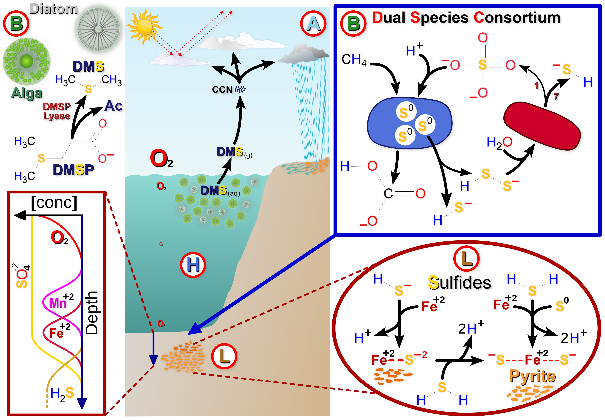

</figure>

**Figure 14.** S**ulfur Cycle**. The cycling of S between the atmo**sphere** (Ⓐ), Hydro**sphere** (Ⓗ), Litho**sphere** (Ⓛ), and Bio**sphere** (Ⓑ) is complex and closely linked to the **C** cycle. **<a class="one" href="https://www.mindat.org/min-3314.html" target="_blank" title="Go to Mindat">Pyrite</a>** (FeS2), the most abundant S containing mineral found in the Ⓛ, undergoes chemical weathering (**Eq. 11-14**) resulting in the formation of S**ulfate** (SO4-2). This soluble anion is transported via rivers to the **oceans** (Ⓗ) where it accumulates in large amounts (~1.4×1021 kg).**[364](#ref-bottrell_reconstruction_2006),[397](#ref-rickard_chemistry_2007)** Although the majority (75-90%) of this marine S**ulfate** is recycled via Ⓑ, a small fraction within the marine sediments (Ⓛ) is transformed into **<a class="one" href="https://www.mindat.org/min-3314.html" target="_blank" title="Go to Mindat">pyrite</a>** (~6×1010 kg⋅yr-) and, to a lesser extent, **gypsum** (~0.6×1010 kg⋅yr-).**[364](#ref-bottrell_reconstruction_2006),[371](#ref-jorgensen_mineralization_1982),[397](#ref-rickard_chemistry_2007)** Over long periods of time **tectonic** forces “*uplift*” these S minerals exposing them to weathering conditions. This of course re-generates water soluble S**ulfates** that can be transported once again to the oceans (Ⓗ). As mentioned above the majority of soluble S**ulfates** are recycled by various marine microbes, including free floating phyto**plankton** (e.g. **algae**, **diatoms**) and sediment bound **microbes** (i.e. **bacteria** and **archaea**). The latter **anaerobic** species often work together to extract **energy** from simple **organic** molecules like **methane** (**C**H4). For example, **an**aerobic **me**thanotrophic *archaea* (**ANME**) are known to form a close partnership or “*consortium*” with S**ulfur reducing delta-proteobacteria**.**[373](#ref-boetius_marine_2000),[398](#ref-hoehler_field_1994),[399](#ref-orphan_comparative_2001)** In this so called **D**ual **S**pecies **C**onsortium **ANME** use S**ulfate** as an electron acceptor to O**xidize** methane.**[373](#ref-boetius_marine_2000),[400](#ref-knittel_anaerobic_2009)–[402](#ref-wegener_intercellular_2015)** The resulting S metabolites include elemental S (S0), as well as mono- and poly-S**ulfides** (i.e. HS-, HSS-). While **ANME** carry out the **An**aerobic **O**xidation of **M**ethane (**AOM**), their *Delta-proteobacteria* “*partners*” take up some of the S**ulfides** they produce and disproportionate it to S**ulfides** and S**ulfate** (theoretical 7:1 ratio, **Eq. 17**), with the latter being cycled back to **ANME** to repeat the process.**[373](#ref-boetius_marine_2000),[400](#ref-knittel_anaerobic_2009)–[402](#ref-wegener_intercellular_2015)** The **biogenic** S**ulfides** can also be re-O**xidized** **abiotically** by O2 within the upper **oxic** layers, or by divalent metal ions such as Fe+2 and Mn+2 within the lower **anoxic** sediments (lower left box, chemical “*species*” vertical concentration profile).**[397](#ref-rickard_chemistry_2007),[403](#ref-froelich_early_1979)** One of the consequences of **OM** decomposition within marine sediments is a distinct distribution profile of the chemical agents used in these **redox** reactions, namely O2, Mn+2, Fe+2, SO4-2 and H2S (i.e. product of their **thermodynamic** potential, O2 \> MnO2 \> FeOH \> SO4-2).**[397](#ref-rickard_chemistry_2007),[403](#ref-froelich_early_1979)** Of course this idealized vertical distribution is often altered by changes to system inputs (e.g. **OM** sedimentation rates), or some type of physical disturbance (e.g. bio**turbation**, wave action). The final link in the S cycle involves the movement of **organic** S**ulfides** between the oceans and the lower Ⓐ (i.e. tropo**sphere**), specifically the release of **dimethyl**-S**ulfoniopropionate** (**DM**S**P**) and its conversion into gaseous dimethyl-S**ulfide** (**DM**S).**[185](#ref-lovelock_atmospheric_1972),[186](#ref-charlson_oceanic_1987),[394](#ref-shaw_bio-controlled_1983)** Only bacteria and algae that express **DM**S**P Lyase** can specifically cleave **DM**S**P** to produce **DM**S and **acrylate** (**Ac**).**[388](#ref-alcolombri_identification_2015)** Volatile **DM**S escapes into the not so “*thin air*” of the Ⓐ where it’s O**xidized** by reactive hydroxyl-radicals (OH⋅).**[404](#ref-yin_analysis_1986),[405](#ref-andreae_ocean-atmosphere_1990)** This process produces S**ulfate** aerosols that can both scatter sunlight (because of its sub-micron dimensions) and act as *cloud condensation nuclei* (**CCN**).**[394](#ref-shaw_bio-controlled_1983),[406](#ref-andreae_atmospheric_1997)** Together they can alter global **<a class="one" href="https://mynasadata.larc.nasa.gov/mini-lessonactivity/what-albedo" target="_blank" title="Go to NASA">albedo</a>** (i.e. fraction of incident solar radiation reflected by the Earth’s surface) patterns that can either cool or heat the planet’s surface (Ⓐ, cloud reflection of solar radiation depicted in upper middle panel).**[394](#ref-shaw_bio-controlled_1983),[406](#ref-andreae_atmospheric_1997)**

<!------------------------------------------------->
<!------------ END - FIG 14 - Sulfur  ------------->
<!------------------------------------------------->
<!-------------------------------------------------------->
<!--- SECTION 3B.3 - SOIL Micro- Meso- and Macro-Fauna --->
<!-------------------------------------------------------->

**<u>3B.3** Soil **Fauna</u>:** Although **fungi** and **bacteria** are the major drivers of soil nutrient cycles, there are many other uni- and multi-cellular **eukaryotes** found in soils, the so called **micro**- (\<0.1 mm body width), **meso**- (0.1-2 mm body width) and **macro**-**fauna** (2-20 mm body width), that also play an important role in soil nutrient cycles.**[44](#ref-orgiazzi_global_2016)** From **earthworms** and **ants** to the less familiar **protists**, **nematodes**, **springtails** (class *Collembola*) and *Oribatid* **mites**, these often overlooked species help maintain healthy soils. They not only break down **OM** within the upper top-soil and “*litter*” layers, but also alter the physical-chemical properties of soils.**[407](#ref-frouz_effects_2018)** Although there are millions of species to choose from, few have been extensively studied with respect to healthy functioning soils. As a result only representative examples will be discussed in the following sections. This will include **protists** (**micro-fauna**) and **nematodes** (**micro-fauna**), *Oribatid* **mites** (**meso-fauna**), and **earthworms** (**mega-fauna**). **Nematodes** and **earthworms** have been the subject of much research over the years. **Earthworms** are an iconic soil organism that most people are familiar with, while **nematodes** are a favourite model organism in biology that also happens to be quite abundant within soils. On the other hand **protists** are both fascinating in their own right, but also a bit of a dilemma. They are an enormously diverse group of mostly uni-cellular organisms that are neither **plants**, **animals**, nor **fungi**. They also represent some of the earliest **eukaryotic** life-forms on the planet that eventually gave rise to present day **plants**, **animals**, and **fungi**. Yet despite their evolutionary importance few have been studied with respect to soil ecology. Unlike many of their evolutionary descendants they lack any unifying taxonomic features or shared character states and as a result do not form a distinct evolutionary group or “*clade*” (i.e. poly-phylogenetic, do not share any derived traits or **<a class="one" href="https://evolution.berkeley.edu/glossary/synapomorphy/" target="_blank" title="Go to Evolution 101">synapomorphies<a>**). For example, **insects** share many distinct character states, such as three distinct body parts, six legs, and an exoskeleton. On the other hand **protists** are rather heterogeneous, with features that resemble **plants**, **animals** and **fungi** (i.e. no unique **synapomorphies**).

<!-------------------------------------------------->
<!--------- SECTION 3B.3Ia - SOIL PROTISTS --------->
<!-------------------------------------------------->

**<u>3B.3I** Soil **Micro-Fauna: Protists</u>.** Most research on soil **microbes** focuses on **bacteria** and **fungi**. This is no doubt due to the critical role they play in regulating nutrient cycles. However, there are many other types of micrometre sized organisms that reside within soils that are often overlooked. For example, **Protists** are one of the largest and most diverse (\>100,000 species) groups of **eukaryotic** organisms on the planet (i.e. include all **eukaryotes** that are not **animals**, **plants**, or **fungi**).**[408](#ref-corliss_biodiversity_2002),[409](#ref-pawlowski_cbol_2012)** This **<a class="one" href="https://evolution.berkeley.edu/the-tree-room/evolutionary-trees-a-primer/clades-within-clades/" target="_blank" title="Go to UC Berkeley">polyphyletic</a>** group includes many well known primary producers (e.g. Diatoms, Kelp, dinoflagellates), decomposers (e.g. slime molds), consumers (e.g. *Amoebozoa*) and parasites (e.g. *Plasmodium*, *Trypanosoma*).**[408](#ref-corliss_biodiversity_2002),[410](#ref-geisen_soil_2017),[411](#ref-geisen_soil_2018)** Although most soil **protists** are consumers (~85%),**[412](#ref-oliverio_global-scale_2020)** parasitic forms are also common, particularly within tropical ecosystems.**[413](#ref-geisen_metatranscriptomic_2015),[414](#ref-mahe_parasites_2017)** Moreover, like other major soil **microbes** most **protist** species have not been identified.**[415](#ref-bates_global_2013),[416](#ref-fierer_embracing_2017)** Despite the systematic short-comings we do know that **protists** do play an important role in nutrient cycling (e.g. N and **C** mineralization) via their control of bacterial populations.**[417](#ref-coleman_analysis_1977)–[424](#ref-bonkowski_protozoa_2004)** Nutrients once locked up within microbial biomass are readily taken up **mycorrhizal fungi** for the benefit of their host plant. The resulting influx of N rich **organic** compounds allows **plants** to invest more photo**synthate** into their **mycorrhizal symbionts**, and potentially release more **exudate** into the **Rhizosphere**. Collectively these interactions between **plants** and **microbes** likely strengthen existing below-ground food webs.**[424](#ref-bonkowski_protozoa_2004),[425](#ref-koller_protozoa_2013)** **Protists** can also help **plants** fight off fungal pathogens. For example, beneficial strains of **bacteria** (i.e. *Rahnella aquatilis B16C* and *Pseudomonas yamanorum B12*)**[426](#ref-bahroun_anti-fungal_2018)** have been shown to inhibit *Fusarium solani* induced <u>root rot</u> with the help of *Cercozoan* **protists** (i.e. amoeba *Rosculus terrestris*, flagellate *Bodomorpha sp.* and the amoebo-flagellate *Cercomonas lenta*).**[427](#ref-bahroun_protists_2021)** Although the **protists** alone could significantly enhance plant health, the most significant beneficial effects (i.e. reduced disease severity, increased root length) were generated in the presence of both **protists** and **bacteria** (**Note:** specific pairings were particularly effective: *Rahnella aquatilis B16C* and *Cercomonas lenta C5D5*, or *Rahnella aquatilis B16C* and *Bodomorpha sp. C10D3*).**[427](#ref-bahroun_protists_2021)** Although *Rahnella aquatilis* is known to produce bio-active secondary metabolites (e.g. siderphores),**[426](#ref-bahroun_anti-fungal_2018)** the causes of the **protist’s** positive effects is unclear. Some research suggests that **protist**-induced changes in **plant** root structure (e.g. lateral growth, increased surface area) may be due to changes in phyto-hormone levels (e.g. auxin).**[424](#ref-bonkowski_protozoa_2004),[428](#ref-bonkowski_soil_2002)–[430](#ref-bonkowski_stimulation_2012)** Alternatively, some researchers suggest that selective predation by **protists** may result in the consumption of non-beneficial **microbes**. Clearly **plants** and **microbes** have been co-evolving for many millions of years, most of which we known very little about. This is particularly “*true*” of **protists** since they are more well known for their taxonomic difficulties than for their actual biology.**[431](#ref-adl_diversity_2007)** Obviously more research on **protists** is needed in order to better understand the impact (quantitative) they have on soil ecology, particularly with respect to nutrient cycling.

<!--------------------------------------------------->
<!--------- SECTION 3B.Ib - SOIL NEMATODES  --------->
<!--------------------------------------------------->

**<u>3B.3I** Soil **Micro-Fauna: Nematodes</u>.** These relatively small, colourless, “*thread-like*” animals, commonly referred to as *roundworms*, are largely overlooked by most “*big folk*”. However, **nematodes** are rather fascinating and complex organisms that play an important role in the health of most **plants** and other soil organisms. From an ecological stand point **nematodes** are very diverse. There are nearly 30,000 species described to-date, but more optimistic estimates suggest that they may number in the millions.**[432](#ref-kiontke_nematodes_2013)–[434](#ref-hodda_phylum_2022-1)** **Nematodes** are also extremely abundant within soils, ranging from a few dozen to a couple thousand or more individuals per 100 gm of top-soil.**[435](#ref-van_den_hoogen_soil_2019)** This variation in the density of *roundworms* is due to the type of **biome**, as well as the physical characteristics of their soils. Specifically, most **nematodes** are found within more northerly latitudes (i.e. ~38.7% within tundra and boreal forests) as apposed to warmer climes (i.e. 24.5% within temperate regions, and 20.5% within sub-tropical and tropical regions).**[435](#ref-van_den_hoogen_soil_2019)** This latitudinal gradient in **nematode** abundance appears to be driven by the levels of **organic** matter (**OM**) within the soils. As pointed out previously (i.e. **C** cycle) soils in colder regions have lower microbial respiration rates. This results in the build-up of **OM** that presumably supports a more robust soil food web. Despite their bio-geographical disparities **nematodes** are functionally quite diverse. They often occupy multiple trophic levels within food webs, with different species operating as either primary consumers (i.e. *herbivores*), *fungivores*, *bacterivores*, *ominivores*, *detritivores* (i.e. consume dead debris), or parasites.**[436](#ref-yeates_feeding_1993)** Unfortunately most **nematode** research is focused on parasitic species, particularly those that are major agricultural pests (e.g. *root-knot* and *cyst* **nematodes**).**[437](#ref-jones_top_2013)–[439](#ref-kantor_biosecurity_2024)** Although parasitic **nematodes** are important most *roundworms* found within **temperate grasslands** feed on **bacteria** (47.8%), as apposed to **plant** roots (27.8%) or **fungi** (13.8%).**[435](#ref-van_den_hoogen_soil_2019)**  
    An important aspect of **nematode** research is how various species sense or communicate with their environment. For example, how does a tiny blind parasitic *roundworm* find and infect its host, be it plant or animal? Although *C. elegans* is made up of ~1,000 cells, about a third of them are neurons,**[440](#ref-sulston_post-embryonic_1977)–[442](#ref-white_structure_1986)** with 32 of them being classified as chemo-sensory neurons.**[443](#ref-bargmann_odorant-selective_1993),[444](#ref-hart_odors_2010)** Moreover, each cell harbours ~20,000 coding genes, which is very similar in size to that of the human genome (**<a class="one" href="https://parasite.wormbase.org/Caenorhabditis_elegans_prjna13758/Info/Index" target="_blank" title="Go to Wormbase ParaSite">Wormbase</a>**).**[445](#ref-c_elegans_sequencing_consortium_genome_1998)–[447](#ref-salzberg_open_2018)** Clearly **nematodes** are tiny but they do have a rudimentary nervous system capable of detecting various chemical odours in their environment. Obviously a clearer understanding of how **nematodes** use these chemo-sensory neurons to navigate through the soils in response to various **biotic** factors could help improve our management of agricultural pests. For example, identifying **plants** that produce natural inhibitors of parasitic **nematodes** may be of use in crop rotation to build up pest resistance within soils.**[448](#ref-zhao_species-dependent_2000)–[454](#ref-grunseich_chemical_2021)** It’s important to note that there are also beneficial **nematodes** that prey on root-feeding insects. These so called *entomopathogenic* **nematodes** (**EPN**) infect and kill their insect hosts with the help of symbiotic bacteria.**[455](#ref-rasmann_recruitment_2005),[456](#ref-dillman_entomopathogenic_2012-1)** In essence **EPN** are:

> “*…mobile vectors for their insect pathogenic bacteria cargo, like little Typhoid Marys. The nematodes seek out and invade potential hosts and release their pathogenic payload into the nutrient-rich hemolymph …When the host cadaver is depleted of resources, nematodes associated with pathogenic bacteria emerge and search for new hosts to infect*.”<b>[457](#ref-dillman_entomopathogenic_2012)</b>

Because **EPN** can control insect pest numbers they are sometimes used as biological control agents in crop management (e.g. citrus, strawberries, cranberries).**[458](#ref-lacey_insect_2001),[459](#ref-grewal_critical_2005)** However, there are also many **nematodes** species that are pests to both **plants** and **animals**, including humans. Beside the infamous **pinworm** (*Enterobius vermicularis*), which infects 100s of millions of people (mostly children) each year,**[460](#ref-cook_enterobius_1994)** there are more than 4,000 species of **plant** parasitic **nematodes** (**PPN**).**[437](#ref-jones_top_2013),[461](#ref-decraemer_structure_2024)** Many **PPN** cause damage to agricultural crops (e.g. wheat, rice, maize, potatoes, sugar cane, bananas, etc.),**[432](#ref-kiontke_nematodes_2013),[439](#ref-kantor_biosecurity_2024)** that globally costs growers \>100 billion dollars (US) a year.**[438](#ref-elling_major_2013),[462](#ref-nicol_current_2011)** They, like their non-parasitic counterparts, respond to various chemical signals to find specific host species. For some endo-parasitic species this allows them to set up residence within **plant** root cells (i.e. construct specialized “*feeding cells*”) where they safely (i.e. protected from predators) consume **plant** nutrients.**[463](#ref-kandoth_war_2013),[464](#ref-mitchum_nematode_2013)**  
    There has been a considerable amount of research on how endo-parasitic **nematodes** use various effector proteins to invade **plant** root cells.**[465](#ref-molloy_unlocking_2023)** However, relatively little is known about the chemical signals that **nematodes** use to find their host, or that **plants** use to attract or repel specific *roundworms*. For an infectious juvenile (**IJ**) **nematode** finding a host is critical to their survival, since many **IJ** do not feed (i.e. rely on their stored fat reserves for energy). To achieve this goal *roundworms* have evolved a complex and sensitive **<a class="one" href="http://www.wormbook.org/chapters/www_chemosensation/chemosensation.html" target="_blank" title="Go to WormBook">chemo-sensory nervous system</a>**.

> “*Much of its nervous system and more than 5% of its genes are devoted to the recognition of environmental chemicals. Chemosensory cues can elicit chemotaxis, rapid avoidance, changes in overall motility, and entry into and exit from the alternative dauer developmental stage. These behaviours are regulated primarily by the amphid chemosensory organs, which contain eleven pairs of chemosensory neurons. Each amphid sensory neuron expresses a specific set of candidate receptor genes and detects a characteristic set of attractants, repellents, or pheromones. About 500–1000 different G protein-coupled receptors (GPCRs) are expressed in chemosensory neurons, and these may be supplemented by alternative sensory pathways as well.*.”<b>[466](#ref-bargmann_chemosensation_2006)</b>

The volatile nature of some of these chemical signals is logical since they can be tracked over relatively large distances. Others are more water soluble and likely detected by **nematodes** over short distances (i.e. **Rhizosphere**). For example, the **IJ** of *Heterorhabditis bacteriophora* and *Steinernema carpocapsae*, as well as *C. elegans* **<a class="one" href="http://www.wormbook.org/chapters/www_dauer/dauer.html#bib33" target="_blank" title="Go to WormBook">dauers</a>** are all attracted to gaseous **C**O2. Being a by-product of aerobic respiration it’s an ideal odour to be attracted to if you are a parasite that infects a wide variety of insects, like *H. bacteriophora* and *S. carpocapsae*. As for free-living *C. elegans* their attraction to **C**O2 is largely restricted to the **<a class="one" href="http://www.wormbook.org/chapters/www_dauer/dauer.html#bib33" target="_blank" title="Go to WormBook">dauer</a>** larval stage since well fed adults do not exhibit this behaviour (**Note:** adults avoid **C**O2).**[467](#ref-bretscher_carbon_2008)–[469](#ref-hallem_sensory_2011)** **<a class="one" href="http://www.wormbook.org/chapters/www_dauer/dauer.html#bib33" target="_blank" title="Go to WormBook">Dauer</a>** development is regulated by fatty acid like pheromones called **<a class="one" href="https://pubchem.ncbi.nlm.nih.gov/#query=ascaroside" target="_blank" title="Go to PubChem">ascarosides</a>** (**Note:** sometimes referred to as *daumones* with respect to *C. elegans*).**[470](#ref-golden_pheromone_1982)** At low concentrations (pM) these pheromones serve as adult mating signals,**[471](#ref-srinivasan_blend_2008),[472](#ref-pungaliya_shortcut_2009)** but at higher concentrations (nM to µM) they can promote **<a class="one" href="http://www.wormbook.org/chapters/www_dauer/dauer.html#bib33" target="_blank" title="Go to WormBook">dauer</a>** development under harsh conditions (e.g. high population density, low food availability, high temperature).**[470](#ref-golden_pheromone_1982),[471](#ref-srinivasan_blend_2008),[473](#ref-cassada_dauerlarva_1975)–[475](#ref-hu_dauer_2007)** Purification and structural analysis of **<a class="one" href="https://pubchem.ncbi.nlm.nih.gov/#query=ascaroside" target="_blank" title="Go to PubChem">ascarosides</a>** shows that they contain two core elements: (i) a six carbon sugar (di-deoxyhexose), and (ii) a hydroxy fatty acid side chain of variable length (**Fig. 15**).**[476](#ref-jeong_chemical_2005),[477](#ref-butcher_small-molecule_2007)** Some **nematode** species have been shown to produce their own unique **<a class="one" href="https://pubchem.ncbi.nlm.nih.gov/#query=ascarosides" target="_blank" title="Go to PubChem">ascarosides</a>**. For example, **asc C11 EA** produced by *<b><a class="one" href="http://www.wormbook.org/chapters/www_genomesHbacteriophora/genomesHbacteriophora.html" target="_blank" title="Go to PubChem">H. bacteriophora</a></b>* has the same basic structure as *C. elegans* **<a class="one" href="https://pubchem.ncbi.nlm.nih.gov/#query=ascaroside" target="_blank" title="Go to PubChem">ascarosides</a>**, but the fatty acid side chain is longer (i.e. 11 **C**) and modified by the addition of an ethanolamide group.**[478](#ref-noguez_novel_2012)** In addition, **asc C11 EA** is quite specific to *H. bacteriophora* since only one of five **<a class="one" href="https://pubchem.ncbi.nlm.nih.gov/#query=ascaroside" target="_blank" title="Go to PubChem">ascaroside</a>** derivatives produced by *C. elegans*, the so called Δ**C9** (i.e. unsaturated 9 **C** side chain),**[477](#ref-butcher_small-molecule_2007)** could elicit response (albeit weak) when tested on the **IJ** of *H. bacteriophora*.**[478](#ref-noguez_novel_2012)**  
    What makes **<a class="one" href="https://pubchem.ncbi.nlm.nih.gov/#query=ascaroside" target="_blank" title="Go to PubChem">ascarosides</a>** even more interesting is how organisms respond to them. For example **plant** immune defences (e.g. **salicylic acid** and **jasmonic acid** signalling pathways)**[479](#ref-shigenaga_no_2016)** have been shown to be activated in response to these pheromones, resulting in enhanced disease resistance to **nematodes** as well as other pathogens (i.e. virus, bacteria, and fungus).**[480](#ref-manosalva_conserved_2015)** **Plants** not only recognize these pheromones, but they also actively take them up and metabolize them to enhance their resistance to parasitic root-knot **nematodes**.**[481](#ref-manohar_plant_2020)** **Manohar** and colleagues (2020) showed that **plants** (i.e. wheat, tomato, *Arabidopsis*) can rapidly convert a long side-chained **<a class="one" href="https://pubchem.ncbi.nlm.nih.gov/#query=ascaroside" target="_blank" title="Go to PubChem">ascaroside</a>** (i.e. **ascr#18**, which has a 11 **C** side-chain) into a short side-chained derivative (i.e. predominately **ascr#9**, which has a 5 **C** side-chain). Moreover, using *Arabidopsis* mutants that are unable to metabolize **ascr#18** researchers showed that resistance to *<b><a class="one" href="https://parasite.wormbase.org/Meloidogyne_incognita_prjeb8714/Info/Index/" target="_blank" title="Go to WormBase">Meloidogyne incognita</a></b>* (an infamous parasitic root-knot **nematode**)**[437](#ref-jones_top_2013),[438](#ref-elling_major_2013)** is dependent upon the presence of both **ascr#9** and **ascr#18** within root **exudate**. In fact, a specific mixture of **ascr#18** and **ascr#9** (1:10 ratio) was shown to confer a significant level of resistance to *M. incognita*, whereas low concentrations of either compound alone partially attracted the parasite. While “*chemical-warfare*” between **plants** and their microbial enemies is well known, the ability of **plants** to convert a highly conserved **nematode** pheromone into a defensive “*weapon*” is really quite a remarkable accomplishment.  
    This type of role reversal, where prey become predators, is well known in **plants** (e.g. carnivorous **plants**). However, this type of behaviour also occurs in some species of **bacteria** and **fungi**. For example, the bacillus *S. maltophilia* can enlist the help of *carnivorous* **fungi** (e.g. *Arthrobotrys oligospora*) to deal with predatory **nematodes** (**Fig. 15**).**[482](#ref-li_induction_2011),[483](#ref-wang_bacteria_2014)** These *nematophagous* **fungi** (**N**F) are not obligate predators. They generally maintain a *saprophytic* life style and only generate specialized adhesive “*traps*” when **nematodes** are present and nutrients are in short supply.**[484](#ref-pramer_ii_1963),[485](#ref-jiang_nematode-trapping_2017)** Several closely related species of **N**F produce “*traps*” in response to **ascarosides**.**[486](#ref-hsueh_nematode-trapping_2013)** This **nematode** “*trapping*” (**NT**) behaviour is often quite variable, and has been shown to be a highly polymorphic trait among strains of *A. oligospora*.**[487](#ref-yang_natural_2020)** Nevertheless, it does appear to confer a fitness advantage to the fungus. In the case of the gram-negative bacillus *S. maltophilia* researchers have shown that it secretes urea to induce “*trap*” formation within neighbouring **NT**F. This N rich metabolite is taken up by *A. oligospora* and converted into ammonia, which triggers trap formation within the **fungus**.**[483](#ref-wang_bacteria_2014)** Presumably multiple signaling pathways (i.e. urea, **ascaroside**, others) involving G-protein coupled receptors (**GPCR**) are activated during this switch to a predatory life style.**[487](#ref-yang_natural_2020)–[492](#ref-kuo_nematode-trapping_2024)** Of course **fungi** can also deal with potential prey more directly by producing toxins. For example *Pleurotus ostreatus*, a common white-rot fungus of temperate hard-wood forests (aka: the edible **Oyster Mushroom**), produces small “*lollipop*”-shaped structures (i.e. **toxocysts**) along the their mycelium.**[493](#ref-thorn_carnivorous_1984)–[495](#ref-barron_predatory_2003)** Droplets secreted by these tiny appendages contain high concentrations of a toxin capable of quickly paralyzing **nematodes**. Once immobilized hyphae penetrate the cuticle of the *roundworm* and begin digesting the contents of the animal. Recent studies show that a volatile ketone known as **<a class="one" href="https://pubchem.ncbi.nlm.nih.gov/compound/3-Octanone" target="_blank" title="Go to PubChem">3-octanone</a>** is a major component of the *P. ostreatus* toxin.**[496](#ref-lee_carnivorous_2023)** When *C. elegans* comes in direct contact with the toxin the head muscles quickly hyper-contract, pharyngeal pumping stops, and paralysis sets in.**[497](#ref-lee_sensory_2020)** This response is caused by increased levels of cytoplasmic calcium, which leads to necrosis (i.e. muscle and sensory neuronal cells) and eventually death of the animal.  
    Currently we know little about the ecology of wild populations of **nematodes**, particularly their contributions (i.e. quantitative) to nutrient cycling within soil communities. Isotopic studies could help clarify the niche roles (e.g. predators, saprophytes) of the major **nematode** taxa within grasslands, and perhaps shed some light on the levels of their **C** and N inputs within these ecosystems.

<!----------------------------------------------------------->
<!--------------- START - FIG 15 - NEMATODES  --------------->
<!----------------------------------------------------------->

<figure>

</figure>

**Figure 15. Nematode and the Rhizosphere**. **Nematodes** produce **ascarosides**, a highly conserved family of signaling molecules (e.g. **ascr#18**)**[498](#ref-choe_ascaroside_2012)** that can activate well known immune defence responses (i.e. salicylic acid- and jasmonic acid-mediated signalling pathways) within **plants** (represented by the highlighted cells).**[480](#ref-manosalva_conserved_2015)** This **ascaroside** induced immune response not only enhances **plant** resistance to **cyst** and **root-knot nematodes** (i.e. *H. schachtii*, *M. incognita*), but also **viruses** (Turnip Crinkle Virus), **bacteria** (*Pseudomonas syringae*), **fungi** (*Blumeria graminis* f. sp. *hordei*), and **oomycetes** (*Phytophthora infestans*).**[480](#ref-manosalva_conserved_2015)** For example, the infectious juveniles (**IJ**s) of the infamous **root-knot nematode** *Meloidogyne incognita* can parasitize most cultivated **plant** species.**[499](#ref-trudgill_apomictic_2001)** They penetrate the roots of **plants**, settle within the vascular cylinder (i.e. **stele**) of the root tip, and induce the formation of several large metabolically active multi-nucleated cells (✽ “*giant*” cells).**[500](#ref-abad_genome_2008),[501](#ref-castagnone-sereno_diversity_2013)** To maintain these “*giant*” feeding cells *M. incognita* secretes “*effector*” proteins that help suppress host immune defences.**[502](#ref-quentin_plant_2013)** Neighbouring cortical cells also undergo changes (i.e. proliferate and enlarge), ultimately resulting in the formation of **root galls**. The **IJ**s quickly develop into egg laying adults, and some of the eggs will give rise to motile *roundworms* that seek out new host **plants** using a small set of **<a class="one" href="http://www.wormbook.org/chapters/www_chemosensation/chemosensation.html" target="_blank" title="Go to WormBook">chemo-sensory neurons</a>**.**[466](#ref-bargmann_chemosensation_2006)** Each of these specialized neurons detect either water soluble or volatile chemicals that serve as important short or long range olfactory signals.**[443](#ref-bargmann_odorant-selective_1993),[444](#ref-hart_odors_2010)** For example, the **IJ**s of *Heterorhabditis bacteriophora* and *Steinernema carpocapsae*, as well as the **dauer** larval stage of free-living *C. elegans* are attracted to gaseous **C**O2.**[469](#ref-hallem_sensory_2011)** Presumably this behaviour is beneficial to the **IJ**s since it signals the location of a potential new host. For the **dauers** the odour may signal a potential new source of food (albeit decaying).
 
    **Plants** also actively shape the composition of the **microbe** community found within the **Rhizosphere**.**[503](#ref-haichar_plant_2008),[504](#ref-zhalnina_dynamic_2018)** This is accomplished in large part by the release of root **exude** that contains cells (i.e. border cells)**[448](#ref-zhao_species-dependent_2000),[505](#ref-somasundaram_functional_2008)–[507](#ref-hawes_root_2016)** and various chemicals, including: **(i)** primary metabolites (i.e. photo**synthate**),**[35](#ref-walker_root_2003),[238](#ref-canarini_root_2019)** **(ii)** secondary metabolites (e.g. **<a class="one" href="https://pubchem.ncbi.nlm.nih.gov/compound/Caryophyllene" target="_blank" title="Got to PubChem">E-beta-Caryophyllene</a>**, or **EβC**),**[455](#ref-rasmann_recruitment_2005),[508](#ref-huang_major_2012),[509](#ref-chiriboga_m_root-colonizing_2018)** as well as **(iii)** special chemically “*edited*” compounds (i.e. **asc#18** → **asc#9**).**[481](#ref-manohar_plant_2020)**
 
**(i)** **Exudates** secreted by the **root cap** of many **plant** species have been shown to induce a quiescent state within both free-living (i.e. *C. elegans*) and parasitic (i.e. *M. incognita*) **nematodes**.**[448](#ref-zhao_species-dependent_2000),[506](#ref-driouich_root_2013)** This material contains thousands of **border cells** encased within a mucilaginous matrix (i.e. so called **root cap** “*slime*”) that can be several millimetres thick.**[506](#ref-driouich_root_2013)** This matrix is made up of a mixture of polysaccharides, secondary metabolites, proteins and extracellular DNA (**exDNA**).**[507](#ref-hawes_root_2016)** The released **exDNA** protects **plant** roots against microbial infections similar to the way that **N**eutrophil **E**xtracellular **T**raps (**NETs**) protect animal tissue from microbial infections.**[506](#ref-driouich_root_2013),[510](#ref-brinkmann_neutrophil_2004),[511](#ref-brinkmann_beneficial_2007)** **NETs** are “*sticky*” web-like **exDNA** structures decorated with anti-microbial proteins that trap and kill **microbes**.**[510](#ref-brinkmann_neutrophil_2004),[511](#ref-brinkmann_beneficial_2007)** The effectiveness of these DNA-based traps is evident from the number of **microbes** (i.e. **bacteria**, **fungi**, **nematodes**) that produce **exDNA** degrading enzymes (i.e. **exDNases**).**[507](#ref-hawes_root_2016),[512](#ref-sumby_extracellular_2005)** For example, the murine parasitic **nematode** *Nippostrongylus brasiliensis* secretes a deoxyribonuclease (**NbDNase II**) that degrades the **exDNA** backbone of **NETs**.**[513](#ref-bouchery_hookworms_2020)** Many other types of **nematodes**, including *C. elegans*, as well as the **fungal** **plant** pathogen *Cochliobolus heterostrophus* harbour one or more **DNase II** genes that are capable of digesting **exDNA**.**[514](#ref-dong_nematodes_2023),[515](#ref-park_dnase_2019)** In the case of *C. heterostrophus* we know that the secreted **exDNase** is an important virulence factor for maize **plants**, and that it likely degrades root cap secreted **exDNA** traps.**[515](#ref-park_dnase_2019)** As for *C. elegans* we know that it harbours at least one secreted **DNase II** nuclease (**nuc-1**)**[516](#ref-sulston_post-embryonic_1976)** that plays a role in the degradation of ingested bacterial DNA.**[517](#ref-evans_dnase_2003)**
 
**(ii)** **Plants** produce many types of **secondary metabolites** (e.g. **<a class="one" href="/project/pnps/#Terp">Terpenoids</a>**) to deal with predatory *herbivores* and pathogenic **microbes**. For example the sesquiterpene **<a class="one" href="https://pubchem.ncbi.nlm.nih.gov/compound/Caryophyllene" target="_blank" title="Got to PubChem">E-beta-Caryophyllene</a>** (**EβC**), which is a common component of floral scents,**[518](#ref-knudsen_diversity_2006)** is secreted by the roots of maize **plants** damaged by Western corn rootworm (**WCR**) *Diabrotica virgifera virgifera*.**[455](#ref-rasmann_recruitment_2005)** This attracts *Heterorhabditis megidis*, a well known **EPN**, which infection and kills **WCR** larvae.**[455](#ref-rasmann_recruitment_2005),[519](#ref-degenhardt_restoring_2009)** Moreover, **EβC** in combination with **C**O2 appears to be even more effective attractant for *H. megidis*.**[520](#ref-turlings_importance_2012)** Currently their is allot of interest in using **EPN** as bio-control agents in crop pest management.**[521](#ref-stock_morphology_2005),[522](#ref-lacey_entomopathogenic_2012)**
 
**(iii)** **<a class="one" href="https://pubchem.ncbi.nlm.nih.gov/#query=ascaroside" target="_blank" title="Go to PubChem">Ascarosides</a>** have been shown to induce the formation of **nematode** trap-like structures in several species of **fungi** (e.g. *Arthrobotrys oligospora*).**[486](#ref-hsueh_nematode-trapping_2013),[487](#ref-yang_natural_2020)** Some of these **<a class="one" href="https://fungalwormlab.imb.sinica.edu.tw/" target="_blank" title="Go to Dr. Hsueh Lab website">nematode trapping fungi</a>** (**NT**F) also form traps in response to N-rich urea secreted by **bacteria** (e.g. *S. maltophilia*).**[483](#ref-wang_bacteria_2014)** There are several different types of traps employed by **NT**F, including adhesive columns (<b>Ⓑ</b>), constricting or non-constricting rings (<b>Ⓒ</b>), as well as sessile (<b>Ⓓ</b>) or stalked adhesive knobs (<b>Ⓔ</b>).**[485](#ref-jiang_nematode-trapping_2017),[523](#ref-nordbring-hertz_morphogenesis_2004),[524](#ref-su_trapping_2017)** Surprisingly **plants** have recently been shown to take up **ascarosides** (e.g. **ascr#18**) and metabolically modify them to generate a signal that repels parasitic root-knot **nematode** *Meloidogyne incognita*.**[481](#ref-manohar_plant_2020)** This repulsive signal is actually made up of a specific blend (1:10 ratio) of two **ascarosides**, namely **ascr#18** and **ascr#9**.**[481](#ref-manohar_plant_2020)** Clearly **plants** can not only “*listen*” to below-ground chemical signals generated by parasitic animals, but also weaponize them (i.e. via chemical “*editing*”), presumably to increase their chances of survival (i.e. increased fitness). In a similar vain some **bacteria** appear to enlist the help of **NT**F to deal with predatory **nematodes**. Both of these examples highlight the complex relationships that exist between multiple trophic levels within the **Rhizosphere**.**[39](#ref-rasmann_root_2016)** Not to be outdone, the **NT**F *A. oligospora* has been shown to secrete volatile chemicals that attracts **nematodes**. Some of these chemicals mimic food “*cues*” while other, like methyl 3-methyl-2-butenoate (**MMB**), appear to mimic sex pheromones in several *Caenorhabditis* species.**[525](#ref-hsueh_nematophagous_2017)**
 
**(iv)** Another notable *carnivorous* **fungi** that preys on **nematodes** is *Pleurotus ostreatus*, otherwise known as **Oyster Mushroom**. This common white-rot fungus produces small “*lollipop*”-shaped mycelial structures called **toxocysts** (<b>Ⓣ</b>)**[493](#ref-thorn_carnivorous_1984)–[495](#ref-barron_predatory_2003),[526](#ref-truong_characterization_2007)** that contain high concentrations of **<a class="one" href="https://pubchem.ncbi.nlm.nih.gov/compound/3-Octanone" target="_blank" title="Go to PubChem">3-octanone</a>**.**[496](#ref-lee_carnivorous_2023)** When **nematodes** come in contact with the volatile ketone it rapidly causes damage to cell membranes. This leads to catastrophic changes in the levels of key cellular ions and metabolites (i.e. Ca+2 and **ATP**) and ultimately necrotic cell death.**[496](#ref-lee_carnivorous_2023)**  
(**Note:** showing both **toxocysts** and different types of **nematode** traps arising from the mycelial network of a single generic fungus is purely intended for illustrative purposes)

<!------------------------------------------------>
<!----------------- END - FIG 15 ----------------->
<!------------------------------------------------>
<!----------------------------------------------------->
<!--------- SECTION 3B.3II - SOIL MESO-FAUNA  --------->
<!----------------------------------------------------->

**<u>3B.3II** Soil **Meso-Fauna: Mites</u>.** These tiny **arachnids** belong to the subclass *Acari* (**mites** and **ticks**), which is essentially comprised of two large **<a class="one" href="https://evolution.berkeley.edu/evolution-101/" target="_blank" title="Go to Evolution 101">polyphyletic</a>** lineages (i.e. super-orders) known as *Parasitiformes* and *Acariformes*. Globally there are ~55,000 reported species, but the “*true*” number may be upwards of a million.**[527](#ref-beaulieu_acari_2019)** Although **Acari** **mites** have some physical traits that are common among *Arachnida* (e.g. rigid exoskeleton or **cuticle**), they also posses unique features such as fused abdominal segments and cephalic appendages (i.e. **chelicerae** and **pedipalps**) that are used for feeding (i.e. no formal mouth parts). Physically **mites** range in size from \<0.1 mm to upwards of 1 cm in length. While their small size allows them to fill many small ecological niches, it also makes them difficult to identify and study. Nevertheless, what they lack in size they certainly make up for in sheer numbers, since they can often exceed 100,000 individuals per m2 of soil (i.e. make up ~40% of all soil micro-arthropod species).**[528](#ref-potapov_feeding_2022)**  
    **Mites** belonging to suborder *Oribatida* (Superorder: *Acariformes* \> Order: *Sarcoptiformes* \> Suborder: *Oribatida*) are one of the better known groups of soil **acarines**. This is due in part to their use as bio-indicators for assessing the impact of environmental changes on terrestrial ecosystems (e.g. mining pollution).**[529](#ref-cuccovia_acarine_1999)–[532](#ref-lumley_effects_2023)** Like some other invertebrates they are often one of the most abundant and diverse **animal** groups within soils, and their small size and limited movement (i.e. generally non-disperse) makes them more sensitive to local changes within their environment. Other reasons for their use as bio-indicators include: (i) they concentrate within the organic layers of soils and are thus easy to sample; (ii) they are also relatively easy to identify as mature adults; (iii) they occupy multiple trophic levels within soil food webs; (iv) they have relatively long adult lifespans and stable populations.**[532](#ref-lumley_effects_2023)–[536](#ref-manu_soil_2019)** *Oribatid* **mites**, commonly referred to as “*beetle*” or “*armoured*” **mites**, are particulate feeders that physically break down **OM** into smaller digestible fragments. This comminuting process accelerates the microbial decomposition of S**OM** (i.e. increased surface area increases **exoenzymes** reaction rates). It is one of the reasons why **earthworms**, their **macro-fauna** comminuting counterparts, are so beneficial to agricultural soils. However, unlike **earthworms** many of these “*armoured*” **mites** possess a cuticle that is hardened by the addition of stored (i.e. epi-cuticular chambers or modified pores) calcium salts (i.e. calcium carbonate: Ca**C**O3, hydrated calcium oxalate: Ca \[**C**OO\]2⋅H2O, and some form of calcium Phosphate).**[537](#ref-norton_calcium_1991),[538](#ref-alberti_fine_2001)** Besides providing a rigid support for internal structures (e.g. anchor attached muscles), the cuticle also protects **mites** from predators (i.e. those that lack strong mandibles, whereas other more formidable predators may be warded off by chemical defences).**[539](#ref-heethoff_life_2018)** The cuticle may also represent an important **C** and Ca “*sink*” within soils, but the significance of these bio-mineralized structures to elemental cycling is presently unclear. Nevertheless, by occupying multiple trophic levels within soil food webs (i.e. members of various feeding guilds) these **mites** can regulate other soil organism populations (i.e. **plants**, **fungi**, **meso-** and **micro-** **fauna**). Acarologists have often categorized the feeding habits of these micro-arthropods based on their gut contents: (i) **Macro-phytophages** - feed on higher plant material, including woody tissue (**xylophages**) and leaves (**phyllophages**); (ii) **Micro-phytophages** - feed on **fungi** (**mycophages**) and **algae** (**phycophages**); (iii) **Bacteriophages** - feed on **bacteria**; (iv) **Panphytophages** - feed on both microbial and higher plant material; (v) **Polyphagous** - feed on **fungi**, **algae** and **animals** like **nematodes**.**[533](#ref-behan-pelletier_oribatid_1999),[540](#ref-schneider_feeding_2004)** Fortunately the advent of more sophisticated mass spectrometry techniques allows researchers to identify multiple trophic levels within soil food webs using stable isotopic ratios (e.g. δ15N, δ13**C**). What makes analysis of these rarer and heavier isotopes so interesting is the nature of their chemical bonds. The slightly higher energies required to break these slightly stronger covalent bonds means that they react more slowly than their lighter counterparts, and therefore subject to “*fractionation*” processes. For example, when **animals** digest and process food that contains these heavier isotopes they preferentially excrete the lighter isotopes since they more readily undergo biochemical reactions due to their lower energy constraints. As a result **animals** that occupy higher trophic levels will assimilate more heavier isotopes (i.e. 15N 13**C**) resulting in higher isotopic signatures that may be unique within a given food web channel.

<!---- Delta Isotope Ratio Calculation ---->

δ<b>X</b> = (<b>R</b>sample/<b>R</b>std - 1) x 1000

where <b>X</b> is 13<b>C</b>, or 15N and <b>R</b> is the corresponding ratio 13<b>C</b>/12<b>C</b>, or 15N/14N.

<!----------------------------------------->

Unlike lighter elements the isotopic abundance of heavier elements like 15N vary, albeit subtly, within naturally occurring substances due to various **abiotic** and **biotic** fractionation processes.**[541](#ref-hoering_variations_1955)** Modern mass spectrometry (**MS**) techniques can determine isotopic ratios with a high degree of precision relative to careful chosen standards (i.e. \<1‰). For convenience the units for the δ15N values are usually expressed in terms of parts per thousand (‰).**[542](#ref-brand_high_1996)** Although there are some challenges and limitations to using isotopic **MS** techniques in ecology (e.g. establishing isotopic baselines for a given food web channels), it has nonetheless proven to be quite useful in deciphering the trophic structure of soil **fauna** communities. Unlike gut content analysis, some of which are eventually excreted, stable isotope ratios of tissues provides a more reliable record of the diet of **animals** (i.e. reflects food being assimilated over time). These types of studies have shown that **plants** and **consumers** undergo predictable step-wise increases in 15N within aquatic or terrestrial food webs.**[543](#ref-deniro_influence_1981)–[545](#ref-ponsard_what_2000)** Specifically **Post** (2002) showed that **animal** tissues are enriched in 15N and 13**C** when compared to their food by ~3.4‰ and \<1‰ per trophic level, respectively. Based on the range of δ15N values detected in the study (i.e. 4.5‰ to 13.6‰) **Post** estimated that he had captured the equivalent of nearly three trophic levels of variation.**[546](#ref-post_using_2002)** When this technique was applied for the first time to *Oribatid* **mites** found within forest leaf “*litter*” (i.e. oak and beach forests) the δ15N values formed a gradient spanning over 12 δ units (lowest: -7.74 δ15N, *Carabodes labyrinthicus*, highest: +4.39 δ15N, *Amerus troisii*). The authors were able to decipher three to four different trophic levels and show clear niche differentiation within the **mite** communities of these temperate forests. Specifically, the high δ15N signature of *A. troisi* (i.e. 8 δ15N units higher than the leaf “*litter*”) suggested that this species most likely consumes **micro-fauna** such as **nematodes**.**[547](#ref-schneider_trophic_2004)** The δ15N values of other species that separated out along the gradient were classified as either secondary decomposers (i.e. feed on leaf “*litter*” material, fungi and micro-organisms) or primary decomposers (i.e. diet of decomposing **plant** material). However, the low -7.74 δ15N value of *Carabodes labyrinthicus* stood out from all the rest. The authors pointed out that *C. labyrinthicus* is known to feed on algae and lichen and therefore falls into a separate feeding guild (i.e. **phycophagous**/**fungivorous**). Overall it appears that a given species occupies similar trophic niches within different forests (i.e. stable trophic level assignments).**[547](#ref-schneider_trophic_2004),[548](#ref-maraun_stable_2011)** Moreover, having different species of *Oribatid* **mites** occupy different trophic niches suggests that food resources are being partitioned among these **animals**, presumably increasing **mite** biodiversity in the process.**[547](#ref-schneider_trophic_2004)**  
    More recent stable isotope studies (i.e. using both δ15N and δ13**C**) over the last 20 years have shown that some 261 different species of *Oribatid* **mites** can be categorized as belonging to one of seven different trophic groups: (i) fungal feeders/secondary decomposers, (ii) primary decomposers, (iii) predators/scavengers, (iv) fungal feeders/secondary decomposers with Ca**C**O3 hardened cuticles, (v) lichen feeders, (vi) moss feeders, and (vii) marine algal feeders.**[549](#ref-maraun_new_2023)** In general approximately one third of the *Oribatid* **mite** species maintain their trophic niches regardless of location or habitat type (i.e. temperate and tropical forests), whereas the remaining two thirds of the species show some degree of flexibility or “*plasticity*” in their trophic niche assignments. This would suggest that *Oribatida* are capable of varying their trophic niche, and sometimes trophic level, according to what food is available within a given habitat. These changes in diet can shift their isotopic signatures because of differing food energy channels (i.e. base food may be more or less enriched in 15N and/or 13**C**). This apparent trophic “*plasticity*” is certainly evident in the reduced number of trophic levels at coarser taxonomic ranks (i.e. *a*mount of *v*ariance *e*xplained *b*y species \> …genus \> …family \> …suborder).**[549](#ref-maraun_new_2023)**

<!--------------------------------------------------------->
<!------- TABLE 3 - Oribatida R2 variable NLM stat -------->
<!--------------------------------------------------------->
<table class="Table">
<thead>
<tr style="text-align:left">
<td colspan="4">
TABLE 3. Taxonomic Variations in <i>Oribatida</i> δ15N and δ13<b>C</b> Values
</td>
</tr>
<thead>
<thead>
<tr>
<td class="tmid2">
Response Variable
</td>
<td class="tmid2">
Fixed Effects
</td>
<td class="tmid2">
Marginal <i>R</i>2
</td>
<td class="tmid2">
Conditional <i>R</i>2
</td>
</tr>
</thead>
<body>
<tr>
<td class="tmid">
δ13<b>C</b>
</td>
<td>
<b>Suborder</b>
</td>
<td class="tmid">
0.157
</td>
<td class="tmid">
0.448
</td>
</tr>
<tr>
<td class="tmid">
δ13<b>C</b>
</td>
<td>
<b>Superfamily</b>
</td>
<td class="tmid">
0.29
</td>
<td class="tmid">
0.561
</td>
</tr>
<tr>
<td class="tmid">
δ13<b>C</b>
</td>
<td>
<b>Family</b>
</td>
<td class="tmid">
0.347
</td>
<td class="tmid">
0.596
</td>
</tr>
<tr>
<td class="tmid">
δ13<b>C</b>
</td>
<td>
<b>Genus</b>
</td>
<td class="tmid">
0.432
</td>
<td class="tmid">
0.68
</td>
</tr>
<tr>
<td class="tmid">
δ13<b>C</b>
</td>
<td>
<b>Species</b>
</td>
<td class="tmid">
0.598
</td>
<td class="tmid">
0.837
</td>
</tr>
<td class="tmid">
δ15N
</td>
<td>
<b>Suborder</b>
</td>
<td class="tmid">
0.055
</td>
<td class="tmid">
0.268
</td>
</tr>
<tr>
<td class="tmid">
δ15N
</td>
<td>
<b>Superfamily</b>
</td>
<td class="tmid">
0.305
</td>
<td class="tmid">
0.45
</td>
</tr>
<tr>
<td class="tmid">
δ15N
</td>
<td>
<b>Family</b>
</td>
<td class="tmid">
0.441
</td>
<td class="tmid">
0.516
</td>
</tr>
<tr>
<td class="tmid">
δ15N
</td>
<td>
<b>Genus</b>
</td>
<td class="tmid">
0.596
</td>
<td class="tmid">
0.653
</td>
</tr>
<tr>
<td class="tmid">
δ15N
</td>
<td>
<b>Species</b>
</td>
<td class="tmid">
0.691
</td>
<td class="tmid">
0.746
</td>
</tr>
</tbody>
</table>

<b>Table 3.</b> Data from the statistical model used in the **Maraun** (2023) meta-study is shown above. The specific linear mixed-effect (*lme*) model varied in its ability to account for all of the variation within the data (i.e. δ15N and δ13**C** values). Specifically, the explanatory power of the *lme* model waned as you moved up the taxonomic ranks (i.e. species → genus → family → superfamily → suborder level).**[549](#ref-maraun_new_2023)** In particular the coefficient of determination (**<i>R</i>2**), which is commonly used in linear regression models, was used by the investigators to quantify the proportion of variance in the dependent variable (i.e. δ values) that could be explained by the independent fixed variable (i.e. specific taxon). The **marginal** **<i>R</i>2** represents the variance explained by the fixed effects (i.e. specific taxon), whereas the **conditional** **<i>R</i>2** represents the variance explained by the entire model (i.e. both fixed and random effects). The *lme* model was chosen by the researchers because of the non-independent nature of the data (i.e. variability within a taxonomic group is not independent like the variability between different taxonomic groups).

<!----------------------------------------------------------->
<!--------------- START - FIG 16 - Oribatida  --------------->
<!----------------------------------------------------------->

<figure>

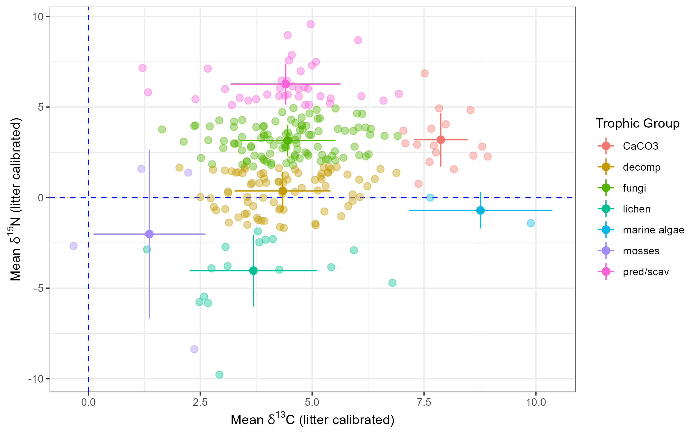

</figure>

**Figure 16. <i>Oribatida</i> Stable Isotope Values and Trophic Niches**. The above plot shows the mean δ15N versus mean δ13**C** values of 261 different species of *Oribatid* **mites**. The data used in the above plot is from a meta-study by **Maraun** et. al. (2023), which can be downloaded from the open data publishing platform **<a class="one" href="https://datadryad.org/stash/dataset/doi:10.5061/dryad.bcc2fqzgj#usage" target="_blank" title="Go to Dryad">Dryad</a>**.**[549](#ref-maraun_new_2023)** Stable isotope δ values (n = 472) were amassed from 25 different research studies (i.e. total of 30 different locations) that analyzed the trophic ecology of *Oribatid* **mites** (*Oribatida*). In most of the early studies generating stable isotope signatures required pooling of specimens (i.e. limited biomass sensitivity of early methods). The vast majority of the analyzed specimens (i.e. 464 of the 472) were identified to the *Genus* or *species* level. The resulting 261 identified species (data points show above) were then assigned to one of seven trophic groups, namely: (i) fungal feeders/secondary decomposers (107/261, ~41%), (ii) primary decomposers (79/261, ~30.3%), (iii) predators/scavengers (37/261, ~14.2%), (iv) fungal feeders/secondary decomposers with Ca**C**O3 hardened cuticles (16/261, ~6.1%), (v) lichen feeders (16/261, ~6.1%), (vi) moss feeders (4/261, ~1.5%), and (vii) marine algal feeders (2/261, ~0.8%).**[549](#ref-maraun_new_2023)** Average δ values per trophic group are also plotted above with the standard deviations serving as error bars. The three most abundant trophic groups (decomp, fungi, pred/scav) are connected to one another due to their common food base (**Note:** they share the same range of δ13**C** values but vary in the amount of 15N enrichment, resulting in the “*stacked*” appearance of the three groups). The taxa that feed on either lichen, mosses, or marine algae look like outliers due to the low levels of 15N enrichment. This is due to the fact that they do not consume dead organic material (i.e. different base food creates a separate energy channel within the food web). Lastly, **mites** belonging to taxa that have cuticles hardened by Ca**C**O3 (CaCO3) show relatively high levels of 13**C** enrichment. This is expected given that the **C** found in the Ca**C**O3 salts have undoubtedly being subjected to multiple “*fractionation*” steps (i.e. both **biotic** and **abiotic**). This claim is supported by the fact that when these specimens were pre-treated with acid to dissolve the carbonate rich cuticles the δ13**C** values decreased by ~4δ units. Also note that the levels of 15N enrichment within the CaCO3 group have the same range as the fungi group, which make the elevated δ13**C** values a unique feature of this group.**[548](#ref-maraun_stable_2011)**

<!----------------------------------------------------------->
<!---------------- END - FIG 16 - Oribatida  ---------------->
<!----------------------------------------------------------->

The use of stable isotope signatures have substantially increased our understanding *Oribatida* trophic ecology within soils. However, most of these types of studies (including the sole Canadian study) have been only carried out within forest ecosystems (i.e. temperate, boreal or tropical).**[549](#ref-maraun_new_2023)** Currently no stable isotope analysis of *Oribatid* **mite** trophic ecology has been carried out within Tallgrass prairies despite the fact that grassland ecosystems support high levels of micro-arthropod biodiversity.**[550](#ref-fay_insect_2003)–[553](#ref-solascasas_edaphic_2022)** And although *Oribatida* are perhaps the most well known and biodiverse group of **acarines** in Canada, some two thirds of the estimated 1800 to 3000 species predicted to exist in Canada remain undescribed.**[527](#ref-beaulieu_acari_2019)** Unfortunately our poor understanding of **meso-fauna** within Tallgrass communities is typical of most flora and fauna that resides within this most endangered ecosystem within North America.**[554](#ref-rodger_tallgrass_1998),[555](#ref-tallgrass_ontario_tallgrass_2019)**

<!------------------------------------------------------->
<!--------- SECTION 3B.3III - SOIL MACRO-FAUNA  --------->
<!------------------------------------------------------->

**<u>3B.3III** Soil **Macro-Fauna: Earthworms</u>.** Both **meso**- and **macro**-**fauna** form complex multi-trophic food webs within soils. While most of these organisms have the unenviable task of consuming dead **organic** matter (i.e. **detritivores**), some also carry out other important soil functions. For example, *Lumbricus terrestris*, often referred to as the common **earthworm** (aka: dew-worm, or nightcrawler), is a European species that is now found throughout most of North America.**[556](#ref-hendrix_exotic_2002)** It is one of many **earthworm** species, belonging to the *Oligochaeta* subclass of annelids, that often form the dominant soil **macro**-**fauna** within temperate forests and grasslands.**[557](#ref-hedenec_global_2022)** They, particularly **anecic** (deep burrowers) and **endogeic** (shallow burrowers) species, are capable of consuming large amounts of soil material.**[558](#ref-blouin_review_2013),[559](#ref-medina-sauza_earthworms_2019)** A polysaccharide-rich mucus released by the secretory glands of these animals aids in this digestive process. It not only acts as a lubricant, but also contains digestive enzymes (e.g. cellulases, chitanases) that help break down **OM** within the anterior portion of the gut.**[560](#ref-parle_micro-organisms_1963)–[563](#ref-drake_as_2007)** The mucus also stimulates soil **bacteria** residing within the gut (i.e. *micro-flora*) to help break down S**OM**. Although large **microbes**, like filamentous **fungi**, are mechanically sheared within the gizzard, smaller **bacteria** can survive. In fact some studies suggest that their numbers actually increase while transiting the gut.**[560](#ref-parle_micro-organisms_1963),[564](#ref-schonholzer_origins_1999)** Access to high energy mucopolysaccharides within the fore-gut apparently “*primes*” the anaerobic metabolism of the **bacteria**. In return, **earthworms** gain access to assimilable **OM** released by the activated “*micro-flora*”.**[562](#ref-barois_changes_1986),[563](#ref-drake_as_2007),[565](#ref-trigo_changes_1993),[566](#ref-trigo_soil_1995)** This mutualistic relationship between **earthworms** and soil **bacteria** is similar to many other types of animal-microbe partnerships found in nature (e.g. human micro-biota).**[567](#ref-hou_microbiota_2022)**  
    The impact that **earthworms** exert on soils is not limited to their status within trophic food webs. As alluded to above **earthworms** are often classified as either **epigeic**, **anecic**, or **endogeic**. Although these three main classes or archetypes do not fully reflect the continuum of traits associated with these animals (e.g. *L. terrestris* can be classified as an **epi-anecic** species), they nevertheless do provide a convenient functional guide when discussing the ecology of these animals.**[568](#ref-bottinelli_explicit_2020)** Specifically, **epigenic earthworms** feed on decomposing surface “*litter*” and limit their movements to the surface and very upper layer of soil. **Anecic earthworms**, such as *L. terrestris*, also feed on high quality **plant** “*litter*”, but they also dig vertical burrows. They transport the leaf “*litter*” down these holes and produce “*castings*” on the surface. Lastly, **endogeic earthworms** live within the upper soil layers where they construct non-permanent horizontal burrows. They feed on the S**OM** they excavate, which is of lower nutritional value than leaf “*litter*”. Since the quality of their food is poor, soil ingestion rates and burrowing activities (including mucus production) likely exact a high energy cost on these animals. Although the “*casts*” produced by these animals take on different shapes (i.e. often used to identify species), their make up is generally similar (i.e. clay minerals, mucus, **OM** and **microbes**). Even the protein content of the mucus produced by both **anecic** and **endogeic earthworms** has been shown to be quite similar to one another using infrared spectroscopy techniques (ATR-FTIR).**[569](#ref-guhra_earthworm_2020)** Overall these unique micro-aggregate structures exert many positive effects on the physical-chemical properties of soils (e.g. macro-pore structure, air permeability, particle stability, nutrient dynamics). For example, the large amounts of mucus produced by **earthworms** appears to act as a “*bridging*” agent that promotes the adsorption of **organic** compounds onto mineral surfaces.**[570](#ref-guhra_functional_2024)** Because of the many positive affects that **earthworms** have on soil communities (e.g. improved **plant** and crop growth, increased nutrient cycling)**[571](#ref-brown_regulation_2000)–[575](#ref-johnson-maynard_linking_2016)** ecologists often referred to them as **ecosystem engineers**.**[558](#ref-blouin_review_2013),[576](#ref-lavelle_soil_2006)**

> *The plough is one of the most ancient and most valuable of man’s inventions; but long before he existed the land was in fact regularly ploughed, and still continues to be thus ploughed by earth-worms. It may be doubted whether there are many other animals which have played so important a part in the history of the world, as have these lowly organised creatures*.**[577](#ref-darwin_formation_1881)**

Unfortunately, the vast majority of **earthworms** in Canada east of the Pacific Northwest are exotic invasive species.**[556](#ref-hendrix_exotic_2002),[578](#ref-reynolds_checklist_2014)–[580](#ref-mathieu_multiple_2024)** According to **Reynolds** (2014) 21 species from three families (*Lumbricidae*, *Megascolecidae* and *Sparganophilidae*) have been identified from county collections across Ontario, and of these only two species (*Bimastos parvus* and *Sparganophilus eiseni*) are considered native to North America.**[578](#ref-reynolds_checklist_2014)** **Essex** county alone was found to have 14 non-native **earthworm** species. They like most eastern Canadian **earthworm** populations probably did not exist prior to European settlement due to the impact of the last great ice age 11.7 thousand years ago.**[581](#ref-reynolds_distribution_1994)** Fossil records of **earthworms** in Canada is largely limited to ancestral annelids from the Cambrian age (i.e. famous **Burgess Shale Formations** of western Canada),**[582](#ref-nanglu_new_2018)** while those belonging to more modern day soft bodied **Oligochaetes** are essentially non-existent.  
    **Earthworm** populations can be beneficial in an agricultural setting, but since most are non-native species in Canada they likely exert some form of harm on natural ecosystems. In fact numerous studies of northern Temperate and Boreal forests have shown that non-native **earthworms** can negatively impact the composition and function of **plant** communities within these habitats.**[573](#ref-forey_importance_2011),[574](#ref-clause_earthworms_2016),[583](#ref-callaham_different_2001)–[590](#ref-craven_unseen_2017)** Moreover, both meta-analysis and stand alone studies of forest soil invertebrate communities have shown an overall negative decline in their diversity and densities in response to non-native **earthworm** invasions.**[534](#ref-burke_invasion_2011),[591](#ref-eisenhauer_invasion_2007)–[594](#ref-jochum_earthworm_2021)** The amount of environmental harm caused by these exotic species often depends upon the presence of multiple ecological groups (i.e. **epigeic**, **anecic**, and **endogeic** species), as well as the chemistry of the leaf “*litter*” (i.e. palatability, **C**/N ratio) and soil itself (i.e. temperature, **pH**, moisture). For example, when exotic **earthworm** species consume most of the leaf “*litter*” layer they dramatically alter the distribution and availability of nutrients (e.g. **C**, N, P, Ca+2) within soils.**[584](#ref-bohlen_non-native_2004),[591](#ref-eisenhauer_invasion_2007),[595](#ref-scheu_effects_1994)–[599](#ref-resner_invasive_2015)** Loss of the leaf “*litter*” as well as the underlying **OM** increases soil erosion and compromises soil micro-climates that both flora (i.e. seedlings, seeds, tree roots) and fauna (i.e. invertebrates) need to survive, ultimately leading to forest die-back (e.g. exposed forest floor alters soil temperatures, moisture levels, and predator-prey dynamics).**[600](#ref-frelich_side-swiped_2019)** Exotic **earthworms** can also alter the composition of soil **microbe** communities (i.e. **fungal** versus **bacterial** dominated populations) and in turn nutrient cycling within soils (e.g. change **C** mineralization and **C** stabilization balance).**[601](#ref-zhang_earthworms_2013),[602](#ref-lejoly_earthworm-invaded_2023)** Unfortunately there is very little known about the influence of **earthworms**, both native and non-native, on existing Tallgrass communities (TGC) like OPC. Some of the early studies of native and non-native **earthworms** within North American TGC were done at **<a class="one" href="https://kpbs.konza.k-state.edu/" target="_blank" title="Go to Konza">Konza Prairie Research Natural area</a>** (**KPRNA**). This 3,487 hectare native Tallgrass prairie preserve is located within the northern Flint Hill region of Kansas (*aka* Bluestem pastures). Like OPC the dominate Tallgrass species within this Kansas prairie are Big Bluestem (**<a class="one" href="https://www.inaturalist.org/taxa/121968-Andropogon-gerardi" target="_blank" title="Go to iNaturalist">Andropogon gerardi</a>**), Little Bluestem (**<a class="one" href="https://www.inaturalist.org/taxa/122603-Schizachyrium-scoparium" target="_blank" title="Go to iNaturalist">Schizachyrium scoparium</a>**), and Indian-grass (**<a class="one" href="https://www.inaturalist.org/taxa/122608-Sorghastrum-nutans" target="_blank" title="Go to iNaturalist">Sorghastrum nutans</a>**). One of the earlier field studies of native and non-native **earthworms** at **KPRNA** determined soil nutrient consumption by analyzing the “*castings*” deposited by these animals.**[603](#ref-james_soil_1991)** **James** (1991) showed that even though non-native *Lumbrcidae* species were more abundant than native *Diplocardia* species (i.e. within the organic-rich Benfield soils) the latter processed more nutrients per unit biomass (i.e. N, P).**[603](#ref-james_soil_1991)** Overall, he estimated that all of the **earthworms** consumed a mass equivalent of 4-6% of the top 15 cm surface soil each year (i.e. ~10% of the total S**OM** based on bulk density of 1 gm/cm3). However, since these estimates are based on surface “*castings*” they likely under-estimate the actual amount of **OM** processed by these animals each year. Presumably, if native **earthworm** species make more nutrients available for **plants**, but are being replaced by the less efficient non-native species, than this could adversely affect the overall productivity of the prairies.  
    The different behaviours exhibited by native and non-native **earthworms** were also highlighted in another **KPRNA** based study that used stable isotopic tracers (15N and 13**C**) to study **earthworm** interactions with **plants** (*A. gerardi*) and soil microbes.**[583](#ref-callaham_different_2001)** The native (*Diplocardia* spp.) and non-native (*Octolasion tyrtaeum*) **earthworms** used in this study are both **endogeic** species that utilize the same food resources. The authors found that the native *Diplocardia* spp. were significantly more active than *O. tyrtaeum*, with the former preferring to occupy the shallower soil depths (83% in top 10 cm) while *O. tyrtaeum* preferred the deeper soil depths (81% in bottom 10-20 cm). The greater activity of *Diplocardia* spp. did not increase the productivity of *A. gerardi* like earlier studies have shown,**[604](#ref-james_nitrogen_1986)** nor did it produce any consistent changes in the size of the microbial pools of **C** and N. In fact the activity of *Diplocardia* spp. (i.e. assimilation of N) appeared to come at the expense of *A. gerardi* since the final above-ground **plant** biomass in the presence of these native **earthworms** was significantly less when compared to controls. The conflicting results between these two studies may be due in large part to the differences in their experimental design, since **James** and **Seastedt** (1986) used *A. gerardi* started from rhizomes that were grown in an environmental chamber, while **Callaham** and colleagues (2001) used *A. gerardi* seedlings grown in field core samples.**[583](#ref-callaham_different_2001),[604](#ref-james_nitrogen_1986)**  
    Native and exotic species of **earthworms** have also been shown to respond differently to a mix of disturbance regimes typically associated with grasslands (i.e. fire, grazing, N and P levels).**[605](#ref-callaham_macroinvertebrates_2003)** **Callaham** and colleagues (2003) showed that the density and biomass of native *Diplocardia* spp. was significantly greater in mowed (i.e. grazing simulated treatment) plots compared to either: (i) un-mowed plots, and (ii) P treated plots that were mowed or un-mowed. Conversely, the density and biomass of non-native *Aporrectodea* spp. were significantly greater in plots that were un-burned and supplemented with P when compared to: (i) un-burned plots with no P supplements, or (ii) burned plots ± P. The researchers also looked for any significant higher order interactions between treatment groups for two separate field experiments (end of season 1994 and 1999). Specifically the data (i.e. all multiple nested treatments) was subjected to mixed model analysis of variance (i.e. mixed ANOVA), with the main effect variables of the split-strip plot design being: (i) burn, (ii) mowed, (iii) N amendments, and (iv) P amendments. This produced a total of 16 independent variables that could affect the proportion of native *Diplocardia* spp. within each field plot. Their analysis showed that there was a significantly (i.e. mean differences, *P* ≤ 0.05) greater proportion of native *Diplocardia* spp. versus non-native *Aporrectodea* spp. in: (i) burned plots versus burned plots treated with both N and P amendments; and (ii) mowed burned plots treated with N and P versus un-mowed burned plots treated with the same fertilizer mix.**[605](#ref-callaham_macroinvertebrates_2003)** A duplicate experiment carried out 5 years later showed slightly different trends. For example, mowing increased the proportion of *Diplocardia* spp. for each of the four treatments (± burn, ± N, ± P, ± N and P) when compared to matched un-burned treatments, whereas *Aporrectodea* spp. trended toward increased numbers within un-burned plots, or plots that received N amendments.**[605](#ref-callaham_macroinvertebrates_2003)** This study suggests that *Diplocardia* spp. (and perhaps other native **earthworms**) are more well adapted to fire and grazing type disturbances that are typical of Tallgrass prairies than *Aporrectodea* spp. (and perhaps other their exotic species). Nevertheless the correlative nature of these results are not entirely satisfactory. Obviously there is great need for more research in this area given the negative impacts of invasive **earthworms** and our changing climate. This is particularly “*true*” of TGC within southern Ontario where the only recent study of note involved a simple census of these **animals**. Specifically **Cray** and colleagues (2021) surveyed 22 small TGC remnants or restored prairie sites across the southern part of the province. Overall they found high **earthworm** densities (i.e. mean: 66 ± 91 per m2) in all the sampled areas regardless of soil **pH** (5.27-7.67), texture or **OM** content.**[606](#ref-cray_introduced_2021)** Six of the 22 sites sampled in this study were located in Essex county, and of these only 2 were located somewhere in the vicinity of OPC. The exact GPS locations of these sites were not provided because of the sensitivity of the data and research permit requirements. Nevertheless, it is telling that no native **earthworm** species were identified in the study, and that the common European species *Lumbricus terrestris* was present at all 22 sites (**Note:** the two presumed native species found in the province, *Bimastos parvus* Eisen and *Sparganophilus tamesis* Benham, are rare and thus difficult to find).

<!----------------------------------------------->
<!---- FIG 17 - Earthworm Ecosystem Engineer ---->
<!----------------------------------------------->

<figure>

</figure>

**Figure 17. Earthworms as Ecosystem Engineers**. The multiple effects that many **earthworm** species have on soil properties has resulted in their designation as an **ecosystem engineers**.**[558](#ref-blouin_review_2013)** Ecologically **earthworms** can be divided up into three main groups (i.e. **epigenic**, **anecic**, or **endogeic**) depending upon where they reside within soil and the kinds of activities they perform (i.e. burrowing and “*casting*”).**[568](#ref-bottinelli_explicit_2020)** The **anecic earthworm** pictured above (e.g. *L. terrestris*) feeds on surface **plant** “*litter*” that it pulls down into the soil via vertical burrows it excavates. The waste or “*castings*” (<b>Ⓒ</b>) they generate are **organic**-rich microbial “*hotspots*” when compared to surrounding bulk soils. These **earthworm** burrows and “*casts*” change the overall structure (i.e. gas permeability, porosity and structural integrity, water flow), chemistry (i.e. S**OM** dynamic) and biological activity (i.e. predator, prey, parasites, mutualists) of soils. Multiple **biotic**, **abiotic** and human factors can alter the abundance and metabolic activity of **earthworms**. This in turn can affect various soil functions. For example, several studies have shown that **earthworms** can positively influence **plant** growth,**[306](#ref-van_groenigen_earthworms_2014),[572](#ref-scheu_effects_2003)** while changes in land use patterns (e.g. intensive agriculture)**[607](#ref-lavelle_soil_2022)** can negatively impact **earthworm** abundance and overall soil health. Even seemingly unimportant, functionally redundant species could potentially impact the health of soils if they directly interact with and alter the function of a single species that happens to be an **ecosystem engineers**.

<!--------------------------------------------->
<!--------- END - FIG 17 - Earthworms --------->
<!--------------------------------------------->
<!------------------------------------------------------->
<!--------- SECTION 3B.3IV - SOIL MEGA-FAUNA  --------->
<!------------------------------------------------------->

**<u>3B.3IV** Soil **Mega-Fauna</u>.** Arguably these large **animals**, which are mostly vertebrates, are more noticeable and more charismatic than the “*…little things* \[invertebrates\] *that run the world*”.**[608](#ref-wilson_little_1987)** However, what they contribute to TGC is perhaps rather *tiny* by comparison, particularly when examined through the lens of biomass and species diversity. There are in fact few soil **mega-fauna** (e.g. shrews, mice, moles, voles and occasional badger) that actually spend most or all of their lives below ground within temperate grassland prairies. Although **Bison** are a very large and important above ground **keystone species** that once dominated the western and central plains of North America,**[609](#ref-knapp_keystone_1999),[610](#ref-hickman_grazing_2004)** their range never extended into Ontario nor any other eastern province. The few small to large **animals** that burrow and leave their “*mark*” on the Tallgrass landscape could have a significant impact on other **animals** and **plants** that reside within TGC. Such disturbances can foster new growth (i.e. alter nutrient dynamics, disperse plant seeds) and potentially change the floral composition of these rare ecosystems. Unfortunately there is simply little to no published research on the ecology of **mega-fauna** within TGC of southern Ontario. The existing remnants of TGC are so rare and fragmented that it is hard to imagine the scale of disturbances these fossorial **animals** might have on the diverse floral communities that make up these habitats.

------------------------------------------------------------------------

<!--------------------------------------------------------------------->

© Jeffrey C Howard. The material contained within this website may be copied, distributed and displayed without alterations for noncommercial purposes only provided that it is accompanied by acknowledgements to the author. All commercial and non-commercial rights are reserved to the author.  
<!--------------------------------------------------------------------->

  
**REFERENCES:**

1 Caldwell AG, Morwick FF, Richard NR. *[Soil Survey of Essex County](https://sis.agr.gc.ca/cansis/publications/surveys/on/index.html#DSS)*. Ontario Agricultural College Guelph Ontario,; Experimental Farm Service, Ottawa; 1949.

2 Foth HD. *[Fundamentals Of Soil Science](http://localhost:8080/xmlui/handle/123456789/164)*. 8th ed. John Wiley & Sons, Inc; 1990.

3 Mitchell JK, Soga K. *[Fundamentals of soil behavior](http://www.gbv.de/dms/weimar/toc/470931930_toc.pdf)*. Third edition. Hoboken, New Jersey: John Wiley & Sons, Inc.; 2005.

4 Lehmann J, Kleber M. The contentious nature of soil organic matter. *Nature* 2015;**528**:60–8. <https://doi.org/10.1038/nature16069>.

5 Batjes NH. Total carbon and nitrogen in the soils of the world. *European Journal of Soil Science* 1996;**47**:151–63. <https://doi.org/10.1111/j.1365-2389.1996.tb01386.x>.

6 Hedges JI, Eglinton G, Hatcher PG, Kirchman DL, Arnosti C, Derenne S, *et al.* The molecularly-uncharacterized component of nonliving organic matter in natural environments. *Organic Geochemistry* 2000;**31**:945–58. <https://doi.org/10.1016/S0146-6380(00)00096-6>.

7 Ciais P, Sabine C, Bala G, Peters W. [Carbon and Other Biogeochemical Cycles](https://doi.org/10.1017/CBO9781107415324.015). *Climate Change 2013: The Physical Science Basis. Contribution of Working Group I to the Fifth Assessment Report of the Intergovernmental Panel on Climate Change*. United Kingdom; New York, NY, USA: Cambridge University Press; 2013. p. 465–570.

8 Bais HP, Weir TL, Perry LG, Gilroy S, Vivanco JM. The role of root exudates in rhizosphere interactions with plants and other organisms. *Annual Review of Plant Biology* 2006;**57**:233–66. <https://doi.org/10.1146/annurev.arplant.57.032905.105159>.

9 Badri DV, Vivanco JM. Regulation and function of root exudates. *Plant, Cell & Environment* 2009;**32**:666–81. <https://doi.org/10.1111/j.1365-3040.2008.01926.x>.

10 Chai YN, Schachtman DP. Root exudates impact plant performance under abiotic stress. *Trends in Plant Science* 2022;**27**:80–91. <https://doi.org/10.1016/j.tplants.2021.08.003>.

11 Wright SF, Upadhyaya A. A survey of soils for aggregate stability and glomalin, a glycoprotein produced by hyphae of arbuscular mycorrhizal fungi. *Plant and Soil* 1998;**198**:97–107. <https://doi.org/10.1023/A:1004347701584>.

12 Wang W, Zhong Z, Wang Q, Wang H, Fu Y, He X. Glomalin contributed more to carbon, nutrients in deeper soils, and differently associated with climates and soil properties in vertical profiles. *Scientific Reports* 2017;**7**:13003. <https://doi.org/10.1038/s41598-017-12731-7>.

13 Irving TB, Alptekin B, Kleven B, Ané J-M. A critical review of 25 years of glomalin research: A better mechanical understanding and robust quantification techniques are required. *The New Phytologist* 2021;**232**:1572–81. <https://doi.org/10.1111/nph.17713>.

14 Giller PS. The diversity of soil communities, the ‘poor man’s tropical rainforest’. *Biodiversity & Conservation* 1996;**5**:135–68. <https://doi.org/10.1007/BF00055827>.

15 Wolters V. Biodiversity of soil animals and its function. *European Journal of Soil Biology* 2001;**37**:221–7. <https://doi.org/10.1016/S1164-5563(01)01088-3>.

16 Anthony MA, Bender SF, Heijden MGA van der. Enumerating soil biodiversity. *Proceedings of the National Academy of Sciences* 2023;**120**:e2304663120. <https://doi.org/10.1073/pnas.2304663120>.

17 Lal R. Soil carbon sequestration impacts on global climate change and food security. *Science (New York, NY)* 2004;**304**:1623–7. <https://doi.org/10.1126/science.1097396>.

18 Millennium Ecosystem Assessment. *ECOSYSTEMS AND HUMAN WELL-BEING: Synthesis*. Island Press, Washington, DC: World Health Organization; 2005.

19 Intergovernmental Panel on Climate Change (IPCC), editor. [Carbon and Other Biogeochemical Cycles](https://doi.org/10.1017/CBO9781107415324.015). *Climate Change 2013 – The Physical Science Basis: Working Group I Contribution to the Fifth Assessment Report of the Intergovernmental Panel on Climate Change*. Cambridge: Cambridge University Press; 2014. p. 465–570.

20 Wang K, Peng C, Zhu Q, Zhou X, Wang M, Zhang K, *et al.* Modeling Global Soil Carbon and Soil Microbial Carbon by Integrating Microbial Processes into the Ecosystem Process Model TRIPLEX-GHG. *Journal of Advances in Modeling Earth Systems* 2017;**9**: <https://doi.org/10.1002/2017MS000920>.

21 Crowther TW, Hoogen J van den, Wan J, Mayes MA, Keiser AD, Mo L, *et al.* The global soil community and its influence on biogeochemistry. *Science (New York, NY)* 2019;**365**:eaav0550. <https://doi.org/10.1126/science.aav0550>.

22 Daily GC. Introduction: What are ecosystem services. *Nature’s services: Societal dependence on natural ecosystems*. 1997.

23 Costanza R, Arge R d’, Groot R de, Farber S, Grasso M, Hannon B, *et al.* The Value of the World’s Ecosystem Services and Natural Capital. *Nature* 1997;**387**:253–60. <https://doi.org/10.1038/387253a0>.

24 Smith P, Cotrufo MF, Rumpel C, Paustian K, Kuikman PJ, Elliott JA, *et al.* Biogeochemical cycles and biodiversity as key drivers of ecosystem services provided by soils. *SOIL* 2015;**1**:665–85. <https://doi.org/10.5194/soil-1-665-2015>.

25 FAO. *[Gross domestic product and agriculture value added 2012–2021: Global and regional trends](https://doi.org/10.4060/cc5253en)*. Rome, Italy: FAO; 2023.

26 Decaëns T, Jiménez JJ, Gioia C, Measey GJ, Lavelle P. The values of soil animals for conservation biology. *European Journal of Soil Biology* 2006;**42**:S23–38. <https://doi.org/10.1016/j.ejsobi.2006.07.001>.

27 Falkowski PG, Fenchel T, Delong EF. The microbial engines that drive Earth’s biogeochemical cycles. *Science (New York, NY)* 2008;**320**:1034–9. <https://doi.org/10.1126/science.1153213>.

28 McBratney A, Field DJ, Koch A. The dimensions of soil security. *Geoderma* 2014;**213**:203–13. <https://doi.org/10.1016/j.geoderma.2013.08.013>.

29 *[State of knowledge of soil biodiversity - Status, challenges and potentialities: Report 2020](https://doi.org/10.4060/cb1928en)*. Rome, Italy: FAO; 2020.

30 Hopwood J, Frischie S, May E, Lee-Mader E. *[Farming with Soil Life: A Handbook for Supporting Soil Invertebrates and Soil Health on Farms](https://www.xerces.org/publications/guidelines/farming-with-soil-life)*. Portland, Oregon: The Xerces Society for Invertebrate Conservation; 2021.

31 Stork NE. How Many Species of Insects and Other Terrestrial Arthropods Are There on Earth? *Annual Review of Entomology* 2018;**63**:31–45. <https://doi.org/10.1146/annurev-ento-020117-043348>.

32 Haynes RH. *[The Canadian System of Soil Classification (Soil Classification Working Group).](https://ISBN 0-660-17404-9)* Ottawa, Canada: Agriculture; Agri-Food Canada; 1998.

33 Kellogg CE. Fundamentals of Soil Science: Soil and Society. *Soils & Men: Yearbook of Agriculture 1938*. 75th Congress, 2nd Session. Washington, D.C.: U.S. Government Printing Office; 1938. p. 863–86.

34 Bardgett RD, Putten WH van der. Belowground biodiversity and ecosystem functioning. *Nature* 2014;**515**:505–11. <https://doi.org/10.1038/nature13855>.

35 Walker TS, Bais HP, Grotewold E, Vivanco JM. Root Exudation and Rhizosphere Biology. *Plant Physiology* 2003;**132**:44–51. <https://doi.org/10.1104/pp.102.019661>.

36 Agrawal AA, Konno K. Latex: A Model for Understanding Mechanisms, Ecology, and Evolution of Plant Defense against Herbivory. *Annu Rev Ecol Evol Syst* 2009;**40**:311–31.

37 Konno K. Plant Latex and Other Exudates as Plant Defense Systems: Roles of Various Defense Chemicals and Proteins Contained Therein. *Phytochemistry* 2011;**72**:1510–30. <https://doi.org/10.1016/j.phytochem.2011.02.016>.

38 Hawes MC, Curlango-Rivera G, Wen F, White GJ, VanEtten HD, Xiong Z. Extracellular DNA: The tip of root defenses? *Plant Science* 2011;**180**:741–5. <https://doi.org/10.1016/j.plantsci.2011.02.007>.

39 Rasmann S, Turlings TC. Root signals that mediate mutualistic interactions in the rhizosphere. *Current Opinion in Plant Biology* 2016;**32**:62–8. <https://doi.org/10.1016/j.pbi.2016.06.017>.

40 Thakur MP, Geisen S. Trophic Regulations of the Soil Microbiome. *Trends in Microbiology* 2019;**27**:771–80. <https://doi.org/10.1016/j.tim.2019.04.008>.

41 Clokie MR, Millard AD, Letarov AV, Heaphy S. Phages in nature. *Bacteriophage* 2011;**1**:31. <https://doi.org/10.4161/bact.1.1.14942>.

42 Cobián Güemes AG, Youle M, Cantú VA, Felts B, Nulton J, Rohwer F. Viruses as Winners in the Game of Life. *Annual Review of Virology* 2016;**3**:197–214. <https://doi.org/10.1146/annurev-virology-100114-054952>.

43 Neher DA. Ecology of Plant and Free-Living Nematodes in Natural and Agricultural Soil. *Annual Review of Phytopathology* 2010;**48**:371–94. <https://doi.org/10.1146/annurev-phyto-073009-114439>.

44 Orgiazzi A, Bardgett RD, Barrios E, Behan-Pelletier V, Briones MJI, Chotte J-L, *et al.* *[Global soil biodiversity atlas](http://esdac.jrc.ec.europa.eu/content/global-soil-biodiversity-atlas)*. Luxembourg: Publications Office of the European Union; 2016.

45 Wilschut RA, Geisen S. Nematodes as Drivers of Plant Performance in Natural Systems. *Trends in Plant Science* 2021;**26**:237–47. <https://doi.org/10.1016/j.tplants.2020.10.006>.

46 Statistics Canada. [Table 32-10-0309-01, Field crops and hay, Census of Agriculture, 2021](https://www150.statcan.gc.ca/t1/tbl1/en/tv.action?pid=3210023301) 2022.

47 Statistics Canada. Focus on Geography Series, 2016 Census 2017.

48 Karrow PF. Chapter 4: Quaternary geology of the Great Lakes subregion. In: Fulton RJ, editor. *Quaternary Geology of Canada and Greenland*. Ottawa, Canada: Geological Survey of Canada; 1989. p. 326–50.

49 Larson G, Schaetzl R. Origin and Evolution of the Great Lakes. *Journal of Great Lakes Research* 2001;**27**:518–46. <https://doi.org/10.1016/S0380-1330(01)70665-X>.

50 Dyke AS. [An outline of North American deglaciation with emphasis on central and northern Canada](https://doi.org/10.1016/S1571-0866(04)80209-4). In: Ehlers J, Gibbard PL, editors. *Developments in Quaternary Sciences*, vol. 2. Elsevier; 2004. p. 373–424.

51 Andrews J, Dyke A. [Late Quaternary in North America](https://doi.org/10.1016/B978-0-444-53643-3.00120-5). In: Elias S, editor. *Encyclopedia of Quaternary Science: Second Edition*. Amsterdam: Elsevier; 2007. p. 1095–101.

52 Leverett F, Taylor FB. *[The Pleistocene of Indiana and Michigan and the history of the Great Lakes](https://doi.org/10.3133/m53)*. Washington, D.C.: U.S. Government Printing Office; 1915.

53 *ROCK ONtario*. Toronto, Ontario: Ontario Ministry of Northern Development & Mines; 1994.

54 Morris TF. *Quaternary Geology of Essex County, Southwestern Ontario*. Toronto: Ontario Ministry Northern Development & Mines; 1994.

55 Alley RB, Cuffey KM, Evenson EB, Strasser JC, Lawson DE, Larson GJ. How glaciers entrain and transport basal sediment: Physical constraints. *Quaternary Science Reviews* 1997;**16**:1017–38. <https://doi.org/10.1016/S0277-3791(97)00034-6>.

56 Fountain AG, Walder JS. Water flow through temperate glaciers. *Reviews of Geophysics* 1998;**36**:299–328. <https://doi.org/10.1029/97RG03579>.

57 Evans DJA, Phillips ER, Hiemstra JF, Auton CA. Subglacial till: Formation, sedimentary characteristics and classification. *Earth-Science Reviews* 2006;**78**:115–76. <https://doi.org/10.1016/j.earscirev.2006.04.001>.

58 Herdendorf CE. [Research overview: Holocene development of Lake Erie.](https://www.cabdirect.org/cabdirect/abstract/20143030749) *Ohio Journal of Science* 2013;**112**:24–36.

59 Taylor FB. The moraine systems of southwestern Ontario. *Royal Canadian Institute Transactions* 1913;**10**:57–79.

60 Sturm, Michael, Lotter AF. [Lake Sediments as Environmental Archives: A means of Distinguishing Natural Events from Human Activity](https://www.eawag.ch/en/info/portal/news/newsletter/). *EAWAG News* 1995;**38E**:6–9.

61 Geer G de. [Geochronology of the last 12,000 years](https://www.proquest.com/openview/37cea74327fe7ffbc9ef39bc46ec01f6/1?pq-origsite=gscholar&cbl=54021). *International Journal of Earth Sciences (Translation: Geologische Rundschau)* 2002;**91**:s100–110.

62 Zolitschka B. VARVED LAKE SEDIMENTS. *Encyclopedia of Quaternary Science* 2007:3105–14. <https://doi.org/10.1016/b0-44-452747-8/00065-x>.

63 Wilson MJ. Weathering of the primary rock-forming minerals: Processes, products and rates. *Clay Minerals* 2004;**39**:233–66. <https://doi.org/10.1180/0009855043930133>.

64 Walker JCG, Hays PB, Kasting JF. A negative feedback mechanism for the long-term stabilization of Earth’s surface temperature. *Journal of Geophysical Research: Oceans* 1981;**86**:9776–82. <https://doi.org/10.1029/JC086iC10p09776>.

65 Kump LR, Brantley SL, Arthur MA. Chemical Weathering, Atmospheric CO2, and Climate. *Annual Review of Earth and Planetary Sciences* 2000;**28**:611–67. <https://doi.org/10.1146/annurev.earth.28.1.611>.

66 Hilton RG, West AJ. Mountains, erosion and the carbon cycle. *Nature Reviews Earth & Environment* 2020;**1**:284–99. <https://doi.org/10.1038/s43017-020-0058-6>.

67 Drever JI, Stillings LL. The role of organic acids in mineral weathering. *Colloids and Surfaces A: Physicochemical and Engineering Aspects* 1997;**120**:167–81. <https://doi.org/10.1016/S0927-7757(96)03720-X>.

68 Chen J, Blume H-P, Beyer L. Weathering of rocks induced by lichen colonization — a review. *CATENA* 2000;**39**:121–46. <https://doi.org/10.1016/S0341-8162(99)00085-5>.

69 Kleypas JA, Buddemeier RW, Archer D, Gattuso J-P, Langdon C, Opdyke BN. Geochemical Consequences of Increased Atmospheric Carbon Dioxide on Coral Reefs. *Science* 1999;**284**:118–20. <https://doi.org/10.1126/science.284.5411.118>.

70 Raven J, Caldeira K, Elderfield H, Hoegh-Guldberg O, Liss PS, Riebesell U, *et al.* [Ocean acidification due to increasing atmospheric carbon dioxide](https://plymsea.ac.uk/id/eprint/4300/). *Royal Society Policy Document* 2005;**12-May**:Jan–60.

71 Berner R. Atmospheric carbon dioxide levels over Phanerozoic time. *Science* 1990;**249**:1382–6. <https://doi.org/10.1126/science.249.4975.1382>.

72 Berner RA. A model for atmospheric CO2 over Phanerozoic time. *American Journal of Science* 1991;**291**:339–76. <https://doi.org/10.2475/ajs.291.4.339>.

73 Muller P. Glossary of terms used in physical organic chemistry (IUPAC Recommendations 1994). *Pure and Applied Chemistry* 1994;**66**:1077–184. <https://doi.org/10.1351/pac199466051077>.

74 Sørensen SPL. Enzyme Studies II. The Measurement and Meaning of Hydrogen Ion Concentration in Enzymatic Processes. *Biochemische Zeitschrift* 1909;**21**:131–200.

75 Po HN, Senozan NM. The Henderson-Hasselbalch Equation: Its History and Limitations. *Journal of Chemical Education* 2001;**78**:1499. <https://doi.org/10.1021/ed078p1499>.

76 Camões by MF. [A Century of pH Measurements](https://www.degruyter.com/document/doi/10.1515/ci.2010.32.2.3/html?lang=en). *Chemistry International – Newsmagazine for IUPAC* 2010;**32**:3–7.

77 Boron WF. Regulation of intracellular pH. *Advances in Physiology Education* 2004;**28**:160–79. <https://doi.org/10.1152/advan.00045.2004>.

78 Kraut JA, Madias NE. Metabolic acidosis: Pathophysiology, diagnosis and management. *Nature Reviews Nephrology* 2010;**6**:274–85. <https://doi.org/10.1038/nrneph.2010.33>.

79 Christensen HN. Proteins as buffers. *Annals of the New York Academy of Sciences* 1966;**133**:34–40. <https://doi.org/10.1111/j.1749-6632.1966.tb50706.x>.

80 Kaufman DP, Kandle PF, Murray IV, Dhamoon AS. [Physiology, Oxyhemoglobin Dissociation Curve](https://www.ncbi.nlm.nih.gov/pubmed/29762993). *StatPearls*. Treasure Island (FL): StatPearls Publishing; 2023.

81 Supuran CT. Carbonic anhydrases: Novel therapeutic applications for inhibitors and activators. *Nature Reviews Drug Discovery* 2008;**7**:168–81. <https://doi.org/10.1038/nrd2467>.

82 Chatelier HL. *Recherches expérimentales et théoriques sur les équilibres chimiques*. Dunod; 1888.

83 Feng X, Simpson AJ, Simpson MJ. Chemical and mineralogical controls on humic acid sorption to clay mineral surfaces. *Organic Geochemistry* 2005;**36**:1553–66. <https://doi.org/10.1016/j.orggeochem.2005.06.008>.

84 Churchman GJ. Game Changer in Soil Science. Functional role of clay minerals in soil. *Journal of Plant Nutrition and Soil Science* 2018;**181**:99–103. <https://doi.org/10.1002/jpln.201700605>.

85 Momma K, Izumi F. VESTA 3 for three-dimensional visualization of crystal, volumetric and morphology data. *Journal of Applied Crystallography* 2011;**44**:1272–6. <https://doi.org/10.1107/S0021889811038970>.

86 Bish DL. Rietveld Refinement of the Kaolinite Structure at 1.5 K. *Clays and Clay Minerals* 1993;**41**:738–44. <https://doi.org/10.1346/CCMN.1993.0410613>.

87 Khaldoun A, Moller P, Fall A, Wegdam G, De Leeuw B, Méheust Y, *et al.* Quick Clay and Landslides of Clayey Soils. *Physical Review Letters* 2009;**103**:188301. <https://doi.org/10.1103/PhysRevLett.103.188301>.

88 Eusterhues K, Rumpel C, Kleber M, Kögel-Knabner I. Stabilisation of soil organic matter by interactions with minerals as revealed by mineral dissolution and oxidative degradation. *Organic Geochemistry* 2003;**34**:1591–600. <https://doi.org/10.1016/j.orggeochem.2003.08.007>.

89 Mikutta R, Kleber M, Torn MS, Jahn R. Stabilization of Soil Organic Matter: Association with Minerals or Chemical Recalcitrance? *Biogeochemistry* 2006;**77**:25–56. <https://doi.org/10.1007/s10533-005-0712-6>.

90 Kleber M, Sollins P, Sutton R. A conceptual model of organo-mineral interactions in soils: Self-assembly of organic molecular fragments into zonal structures on mineral surfaces. *Biogeochemistry* 2007;**85**:9–24. <https://doi.org/10.1007/s10533-007-9103-5>.

91 Lehmann J, Kinyangi J, Solomon D. Organic matter stabilization in soil microaggregates: Implications from spatial heterogeneity of organic carbon contents and carbon forms. *Biogeochemistry* 2007;**85**:45–57. <https://doi.org/10.1007/s10533-007-9105-3>.

92 Williamson KE, Fuhrmann JJ, Wommack KE, Radosevich M. Viruses in Soil Ecosystems: An Unknown Quantity Within an Unexplored Territory. *Annual Review of Virology* 2017;**4**:201–19. <https://doi.org/10.1146/annurev-virology-101416-041639>.

93 Pratama AA, Elsas JD van. The ’Neglected’ Soil Virome - Potential Role and Impact. *Trends in Microbiology* 2018;**26**:649–62. <https://doi.org/10.1016/j.tim.2017.12.004>.

94 Fox GE, Stackebrandt E, Hespell RB, Gibson J, Maniloff J, Dyer TA, *et al.* The phylogeny of prokaryotes. *Science (New York, NY)* 1980;**209**:457–63. <https://doi.org/10.1126/science.6771870>.

95 Lane DJ, Pace B, Olsen GJ, Stahl DA, Sogin ML, Pace NR. Rapid determination of 16S ribosomal RNA sequences for phylogenetic analyses. *Proceedings of the National Academy of Sciences of the United States of America* 1985;**82**:6955. <https://doi.org/10.1073/pnas.82.20.6955>.

96 López-García P, Moreira D. Viruses in Biology. *Evolution: Education and Outreach* 2012;**5**:389–98. <https://doi.org/10.1007/s12052-012-0441-y>.

97 Chappell JD, Dermody TS. Biology of Viruses and Viral Diseases. *Mandell, Douglas, and Bennett’s Principles and Practice of Infectious Diseases* 2015:1681–1693.e4. <https://doi.org/10.1016/B978-1-4557-4801-3.00134-X>.

98 Chaitanya KV. Structure and Organization of Virus Genomes. *Genome and Genomics* 2019:1–30. <https://doi.org/10.1007/978-981-15-0702-1_1>.

99 Weinbauer MG. Ecology of prokaryotic viruses. *FEMS Microbiology Reviews* 2004;**28**:127–81. <https://doi.org/10.1016/j.femsre.2003.08.001>.

100 Cochran PK, Paul JH. Seasonal abundance of lysogenic bacteria in a subtropical estuary. *Applied and Environmental Microbiology* 1998;**64**:2308–12. <https://doi.org/10.1128/AEM.64.6.2308-2312.1998>.

101 Bongiorni L, Magagnini M, Armeni M, Noble R, Danovaro R. Viral production, decay rates, and life strategies along a trophic gradient in the North Adriatic Sea. *Applied and Environmental Microbiology* 2005;**71**:6644–50. <https://doi.org/10.1128/AEM.71.11.6644-6650.2005>.

102 Liu Y, Zhang Q, Fang C, Zhu S, Tang Y, Huang S. Effect of glutathione on UV induction of prophage lambda. *Archives of Microbiology* 2005;**183**:444–9. <https://doi.org/10.1007/s00203-005-0019-y>.

103 Williamson KE, Radosevich M, Smith DW, Wommack KE. Incidence of lysogeny within temperate and extreme soil environments. *Environmental Microbiology* 2007;**9**:2563–74. <https://doi.org/10.1111/j.1462-2920.2007.01374.x>.

104 Erez Z, Steinberger-Levy I, Shamir M, Doron S, Stokar-Avihail A, Peleg Y, *et al.* Communication between viruses guides lysis-lysogeny decisions. *Nature* 2017;**541**:488–93. <https://doi.org/10.1038/nature21049>.

105 Brady A, Felipe-Ruiz A, Gallego Del Sol F, Marina A, Quiles-Puchalt N, Penadés JR. Molecular Basis of Lysis-Lysogeny Decisions in Gram-Positive Phages. *Annual Review of Microbiology* 2021;**75**:563–81. <https://doi.org/10.1146/annurev-micro-033121-020757>.

106 Casjens S. Prophages and bacterial genomics: What have we learned so far? *Molecular Microbiology* 2003;**49**:277–300. <https://doi.org/10.1046/j.1365-2958.2003.03580.x>.

107 Bondy-Denomy J, Davidson AR. When a virus is not a parasite: The beneficial effects of prophages on bacterial fitness. *Journal of Microbiology (Seoul, Korea)* 2014;**52**:235–42. <https://doi.org/10.1007/s12275-014-4083-3>.

108 Bondy-Denomy J, Qian J, Westra ER, Buckling A, Guttman DS, Davidson AR, *et al.* Prophages mediate defense against phage infection through diverse mechanisms. *The ISME Journal* 2016;**10**:2854–66. <https://doi.org/10.1038/ismej.2016.79>.

109 Al-Shayeb B, Skopintsev P, Soczek KM, Stahl EC, Li Z, Groover E, *et al.* Diverse virus-encoded CRISPR-Cas systems include streamlined genome editors. *Cell* 2022;**185**:4574–4586.e16. <https://doi.org/10.1016/j.cell.2022.10.020>.

110 O’Brien AD, Newland JW, Miller SF, Holmes RK, Smith HW, Formal SB. Shiga-like toxin-converting phages from Escherichia coli strains that cause hemorrhagic colitis or infantile diarrhea. *Science (New York, NY)* 1984;**226**:694–6. <https://doi.org/10.1126/science.6387911>.

111 Waldor MK, Mekalanos JJ. Lysogenic Conversion by a Filamentous Phage Encoding Cholera Toxin. *Science* 1996;**272**:1910–4. <https://doi.org/10.1126/science.272.5270.1910>.

112 Ghosh D, Roy K, Williamson KE, White DC, Wommack KE, Sublette KL, *et al.* Prevalence of lysogeny among soil bacteria and presence of 16S rRNA and trzN genes in viral-community DNA. *Applied and Environmental Microbiology* 2008;**74**:495–502. <https://doi.org/10.1128/AEM.01435-07>.

113 Haaber J, Leisner JJ, Cohn MT, Catalan-Moreno A, Nielsen JB, Westh H, *et al.* Bacterial viruses enable their host to acquire antibiotic resistance genes from neighbouring cells. *Nature Communications* 2016;**7**:13333. <https://doi.org/10.1038/ncomms13333>.

114 Jin M, Guo X, Zhang R, Qu W, Gao B, Zeng R. Diversities and potential biogeochemical impacts of mangrove soil viruses. *Microbiome* 2019;**7**:58. <https://doi.org/10.1186/s40168-019-0675-9>.

115 Wu R, Smith CA, Buchko GW, Blaby IK, Paez-Espino D, Kyrpides NC, *et al.* Structural characterization of a soil viral auxiliary metabolic gene product – a functional chitosanase. *Nature Communications* 2022;**13**:5485. <https://doi.org/10.1038/s41467-022-32993-8>.

116 Sun M, Yuan S, Xia R, Ye M, Balcázar JL. Underexplored viral auxiliary metabolic genes in soil: Diversity and eco-evolutionary significance. *Environmental Microbiology* 2023;**25**:800–10. <https://doi.org/10.1111/1462-2920.16329>.

117 Lederberg EM, Lederberg J. [Genetic Studies of Lysogenicity in Escherichia Coli](https://www.ncbi.nlm.nih.gov/pmc/articles/PMC1209586). *Genetics* 1953;**38**:51–64.

118 Otsuji N, Sekiguchi M, Iijima T, Takagi Y. Induction of Phage Formation in the Lysogenic Escherichia coli K-12 by Mitomycin C. *Nature* 1959;**184**:1079–80. <https://doi.org/10.1038/1841079b0>.

119 Cuesta P, Suarez JE, Rodriguez A. Incidence of Lysogeny in Wild Lactococcal Strains. *Journal of Dairy Science* 1995;**78**:998–1003. <https://doi.org/10.3168/jds.S0022-0302(95)76715-7>.

120 Knowles B, Silveira CB, Bailey BA, Barott K, Cantu VA, Cobián-Güemes AG, *et al.* Lytic to temperate switching of viral communities. *Nature* 2016;**531**:466–70. <https://doi.org/10.1038/nature17193>.

121 Howard-Varona C, Hargreaves KR, Abedon ST, Sullivan MB. Lysogeny in nature: Mechanisms, impact and ecology of temperate phages. *The ISME Journal* 2017;**11**:1511–20. <https://doi.org/10.1038/ismej.2017.16>.

122 Johnson AD, Poteete AR, Lauer G, Sauer RT, Ackers GK, Ptashne M. Lambda Repressor and cro–components of an efficient molecular switch. *Nature* 1981;**294**:217–23. <https://doi.org/10.1038/294217a0>.

123 Dodd IB, Shearwin KE, Egan JB. Revisited gene regulation in bacteriophage lambda. *Current Opinion in Genetics & Development* 2005;**15**:145–52. <https://doi.org/10.1016/j.gde.2005.02.001>.

124 Casjens SR, Hendrix RW. Bacteriophage lambda: Early pioneer and still relevant. *Virology* 2015;**479-480**:310–30. <https://doi.org/10.1016/j.virol.2015.02.010>.

125 Broussard GW, Oldfield LM, Villanueva VM, Lunt BL, Shine EE, Hatfull GF. Integration-dependent bacteriophage immunity provides insights into the evolution of genetic switches. *Molecular Cell* 2013;**49**:237–48. <https://doi.org/10.1016/j.molcel.2012.11.012>.

126 Ofir G, Sorek R. Contemporary Phage Biology: From Classic Models to New Insights. *Cell* 2018;**172**:1260–70. <https://doi.org/10.1016/j.cell.2017.10.045>.

127 Silpe JE, Bassler BL. A Host-Produced Quorum-Sensing Autoinducer Controls a Phage Lysis-Lysogeny Decision. *Cell* 2019;**176**:268–280.e13. <https://doi.org/10.1016/j.cell.2018.10.059>.

128 Zeng L, Skinner SO, Zong C, Sippy J, Feiss M, Golding I. Decision Making at a Subcellular Level Determines the Outcome of Bacteriophage Infection. *Cell* 2010;**141**:682–91. <https://doi.org/10.1016/j.cell.2010.03.034>.

129 Papenfort K, Silpe JE, Schramma KR, Cong J-P, Seyedsayamdost MR, Bassler BL. A Vibrio cholerae autoinducer-receptor pair that controls biofilm formation. *Nature Chemical Biology* 2017;**13**:551–7. <https://doi.org/10.1038/nchembio.2336>.

130 Roberts JW, Roberts CW. Proteolytic cleavage of bacteriophage lambda repressor in induction. *Proceedings of the National Academy of Sciences* 1975;**72**:147–51. <https://doi.org/10.1073/pnas.72.1.147>.

131 Sauer RT, Ross MJ, Ptashne M. Cleavage of the lambda and P22 repressors by recA protein. *Journal of Biological Chemistry* 1982;**257**:4458–62. <https://doi.org/10.1016/S0021-9258(18)34744-6>.

132 Erill I, Campoy S, Barbé J. Aeons of distress: An evolutionary perspective on the bacterial SOS response. *FEMS Microbiology Reviews* 2007;**31**:637–56. <https://doi.org/10.1111/j.1574-6976.2007.00082.x>.

133 Kimura M, Jia Z-J, Nakayama N, Asakawa S. Ecology of viruses in soils: Past, present and future perspectives. *Soil Science & Plant Nutrition* 2008;**54**:1–32. <https://doi.org/10.1111/j.1747-0765.2007.00197.x>.

134 Emerson JB, Roux S, Brum JR, Bolduc B, Woodcroft BJ, Jang HB, *et al.* Host-linked soil viral ecology along a permafrost thaw gradient. *Nature Microbiology* 2018;**3**:870–80. <https://doi.org/10.1038/s41564-018-0190-y>.

135 Kuzyakov Y, Mason-Jones K. Viruses in soil: Nano-scale undead drivers of microbial life, biogeochemical turnover and ecosystem functions. *Soil Biology and Biochemistry* 2018;**127**:305–17. <https://doi.org/10.1016/j.soilbio.2018.09.032>.

136 Trubl G, Jang HB, Roux S, Emerson JB, Solonenko N, Vik DR, *et al.* Soil Viruses Are Underexplored Players in Ecosystem Carbon Processing. *mSystems* 2018;**3**:e00076–18. <https://doi.org/10.1128/mSystems.00076-18>.

137 Emerson JB. Soil Viruses: A New Hope. *mSystems* 2019;**4**:e00120–19. <https://doi.org/10.1128/mSystems.00120-19>.

138 Ter Horst AM, Santos-Medellín C, Sorensen JW, Zinke LA, Wilson RM, Johnston ER, *et al.* Minnesota peat viromes reveal terrestrial and aquatic niche partitioning for local and global viral populations. *Microbiome* 2021;**9**:233. <https://doi.org/10.1186/s40168-021-01156-0>.

139 Bi L, Yu D-T, Du S, Zhang L-M, Zhang L-Y, Wu C-F, *et al.* Diversity and potential biogeochemical impacts of viruses in bulk and rhizosphere soils. *Environmental Microbiology* 2021;**23**:588–99. <https://doi.org/10.1111/1462-2920.15010>.

140 Wei X, Ge T, Wu C, Wang S, Mason-Jones K, Li Y, *et al.* T4-like Phages Reveal the Potential Role of Viruses in Soil Organic Matter Mineralization. *Environmental Science & Technology* 2021;**55**:6440–8. <https://doi.org/10.1021/acs.est.0c06014>.

141 Wu R, Davison MR, Nelson WC, Graham EB, Fansler SJ, Farris Y, *et al.* DNA Viral Diversity, Abundance, and Functional Potential Vary across Grassland Soils with a Range of Historical Moisture Regimes. *mBio* 2021;**12**:e0259521. <https://doi.org/10.1128/mBio.02595-21>.

142 Wirth J, Young M. Viruses in Subsurface Environments. *Annual Review of Virology* 2022;**9**:99–119. <https://doi.org/10.1146/annurev-virology-093020-015957>.

143 Dominguez-Huerta G, Zayed AA, Wainaina JM, Guo J, Tian F, Pratama AA, *et al.* Diversity and ecological footprint of Global Ocean RNA viruses. *Science* 2022;**376**:1202–8. <https://doi.org/10.1126/science.abn6358>.

144 Roux S, Emerson JB. Diversity in the soil virosphere: To infinity and beyond? *Trends in Microbiology* 2022;**30**:1025–35. <https://doi.org/10.1016/j.tim.2022.05.003>.

145 Proctor LM, Fuhrman JA. Viral mortality of marine bacteria and cyanobacteria. *Nature* 1990;**343**:60–2. <https://doi.org/10.1038/343060a0>.

146 Suttle CA, Chan AM, Cottrell MT. Infection of phytoplankton by viruses and reduction of primary productivity. *Nature* 1990;**347**:467–9. <https://doi.org/10.1038/347467a0>.

147 Fuhrman JA. Marine viruses and their biogeochemical and ecological effects. *Nature* 1999;**399**:541–8. <https://doi.org/10.1038/21119>.

148 Suttle CA. Viruses in the sea. *Nature* 2005;**437**:356–61. <https://doi.org/10.1038/nature04160>.

149 Puxty RJ, Millard AD. Functional ecology of bacteriophages in the environment. *Current Opinion in Microbiology* 2023;**71**:102245. <https://doi.org/10.1016/j.mib.2022.102245>.

150 Fridman S, Flores-Uribe J, Larom S, Alalouf O, Liran O, Yacoby I, *et al.* A myovirus encoding both photosystem I and II proteins enhances cyclic electron flow in infected Prochlorococcus cells. *Nature Microbiology* 2017;**2**:1350–7. <https://doi.org/10.1038/s41564-017-0002-9>.

151 Kieft K, Zhou Z, Anderson RE, Buchan A, Campbell BJ, Hallam SJ, *et al.* Ecology of inorganic sulfur auxiliary metabolism in widespread bacteriophages. *Nature Communications* 2021;**12**:3503. <https://doi.org/10.1038/s41467-021-23698-5>.

152 Samson JE, Magadán AH, Sabri M, Moineau S. Revenge of the phages: Defeating bacterial defences. *Nature Reviews Microbiology* 2013;**11**:675–87. <https://doi.org/10.1038/nrmicro3096>.

153 Hampton HG, Watson BNJ, Fineran PC. The arms race between bacteria and their phage foes. *Nature* 2020;**577**:327–36. <https://doi.org/10.1038/s41586-019-1894-8>.

154 Breitbart M, Thompson L, Suttle C, Sullivan M. Exploring the Vast Diversity of Marine Viruses. *Oceanography* 2007;**20**:135–9. <https://doi.org/10.5670/oceanog.2007.58>.

155 Sullivan MB, Lindell D, Lee JA, Thompson LR, Bielawski JP, Chisholm SW. Prevalence and Evolution of Core Photosystem II Genes in Marine Cyanobacterial Viruses and Their Hosts. *PLOS Biology* 2006;**4**:e234. <https://doi.org/10.1371/journal.pbio.0040234>.

156 Mann NH, Cook A, Millard A, Bailey S, Clokie M. Marine ecosystems: Bacterial photosynthesis genes in a virus. *Nature* 2003;**424**:741. <https://doi.org/10.1038/424741a>.

157 Lindell D, Jaffe JD, Johnson ZI, Church GM, Chisholm SW. Photosynthesis genes in marine viruses yield proteins during host infection. *Nature* 2005;**438**:86–9. <https://doi.org/10.1038/nature04111>.

158 Guskov A, Kern J, Gabdulkhakov A, Broser M, Zouni A, Saenger W. Cyanobacterial photosystem II at 2.9-å resolution and the role of quinones, lipids, channels and chloride. *Nature Structural & Molecular Biology* 2009;**16**:334–42. <https://doi.org/10.1038/nsmb.1559>.

159 Fischer WW, Hemp J, Johnson JE. Evolution of Oxygenic Photosynthesis. *Annual Review of Earth and Planetary Sciences* 2016;**44**:647–83. <https://doi.org/10.1146/annurev-earth-060313-054810>.

160 Ferreira KN, Iverson TM, Maghlaoui K, Barber J, Iwata S. Architecture of the Photosynthetic Oxygen-Evolving Center. *Science* 2004;**303**:1831–8. <https://doi.org/10.1126/science.1093087>.

161 Barber J. The engine of life: Photosystem II. *The Biochemist* 2006;**28**:7–11. <https://doi.org/10.1042/BIO02804007>.

162 Thompson LR, Zeng Q, Kelly L, Huang KH, Singer AU, Stubbe J, *et al.* Phage auxiliary metabolic genes and the redirection of cyanobacterial host carbon metabolism. *Proceedings of the National Academy of Sciences* 2011;**108**:E757–64. <https://doi.org/10.1073/pnas.1102164108>.

163 Puxty RJ, Millard AD, Evans DJ, Scanlan DJ. Shedding new light on viral photosynthesis. *Photosynthesis Research* 2015;**126**:71–97. <https://doi.org/10.1007/s11120-014-0057-x>.

164 Han L-L, Yu D-T, Bi L, Du S, Silveira C, Cobián Güemes AG, *et al.* Distribution of soil viruses across China and their potential role in phosphorous metabolism. *Environmental Microbiome* 2022;**17**:6. <https://doi.org/10.1186/s40793-022-00401-9>.

165 Liang J-L, Feng S-W, Lu J-L, Wang X-N, Li F-L, Guo Y-Q, *et al.* Hidden diversity and potential ecological function of phosphorus acquisition genes in widespread terrestrial bacteriophages. *Nature Communications* 2024;**15**:2827. <https://doi.org/10.1038/s41467-024-47214-7>.

166 Borges AL, Davidson AR, Bondy-Denomy J. The Discovery, Mechanisms, and Evolutionary Impact of Anti-CRISPRs. *Annual Review of Virology* 2017;**4**:37–59. <https://doi.org/10.1146/annurev-virology-101416-041616>.

167 Wiegand T, Karambelkar S, Bondy-Denomy J, Wiedenheft B. Structures and Strategies of Anti-CRISPR-Mediated Immune Suppression. *Annual Review of Microbiology* 2020;**74**:21–37. <https://doi.org/10.1146/annurev-micro-020518-120107>.

168 Patel PH, Maxwell KL. Prophages provide a rich source of antiphage defense systems. *Current Opinion in Microbiology* 2023;**73**:102321. <https://doi.org/10.1016/j.mib.2023.102321>.

169 Bondy-Denomy J, Pawluk A, Maxwell KL, Davidson AR. Bacteriophage genes that inactivate the CRISPR/Cas bacterial immune system. *Nature* 2013;**493**:429–32. <https://doi.org/10.1038/nature11723>.

170 Seed KD, Lazinski DW, Calderwood SB, Camilli A. A bacteriophage encodes its own CRISPR/Cas adaptive response to evade host innate immunity. *Nature* 2013;**494**:489–91. <https://doi.org/10.1038/nature11927>.

171 Wang X, Yao D, Xu J-G, Li A-R, Xu J, Fu P, *et al.* Structural basis of Cas3 inhibition by the bacteriophage protein AcrF3. *Nature Structural & Molecular Biology* 2016;**23**:868–70. <https://doi.org/10.1038/nsmb.3269>.

172 Barrangou R, Fremaux C, Deveau H, Richards M, Boyaval P, Moineau S, *et al.* CRISPR provides acquired resistance against viruses in prokaryotes. *Science (New York, NY)* 2007;**315**:1709–12. <https://doi.org/10.1126/science.1138140>.

173 Brouns SJJ, Jore MM, Lundgren M, Westra ER, Slijkhuis RJH, Snijders APL, *et al.* Small CRISPR RNAs guide antiviral defense in prokaryotes. *Science (New York, NY)* 2008;**321**:960–4. <https://doi.org/10.1126/science.1159689>.

174 Hille F, Richter H, Wong SP, Bratovič M, Ressel S, Charpentier E. The Biology of CRISPR-Cas: Backward and Forward. *Cell* 2018;**172**:1239–59. <https://doi.org/10.1016/j.cell.2017.11.032>.

175 Jiang F, Doudna JA. CRISPR–Cas9 Structures and Mechanisms. *Annual Review of Biophysics* 2017;**46**:505–29. <https://doi.org/10.1146/annurev-biophys-062215-010822>.

176 Thompson LR, Sanders JG, McDonald D, Amir A, Ladau J, Locey KJ, *et al.* A communal catalogue reveals Earth’s multiscale microbial diversity. *Nature* 2017;**551**:457–63. <https://doi.org/10.1038/nature24621>.

177 Taş N, Jong AE de, Li Y, Trubl G, Xue Y, Dove NC. Metagenomic tools in microbial ecology research. *Current Opinion in Biotechnology* 2021;**67**:184–91. <https://doi.org/10.1016/j.copbio.2021.01.019>.

178 Fierer N, Breitbart M, Nulton J, Salamon P, Lozupone C, Jones R, *et al.* Metagenomic and small-subunit rRNA analyses reveal the genetic diversity of bacteria, archaea, fungi, and viruses in soil. *Applied and Environmental Microbiology* 2007;**73**:7059–66. <https://doi.org/10.1128/AEM.00358-07>.

179 Williamson KE, Wommack KE, Radosevich M. Sampling natural viral communities from soil for culture-independent analyses. *Applied and Environmental Microbiology* 2003;**69**:6628–33. <https://doi.org/10.1128/AEM.69.11.6628-6633.2003>.

180 Oliver JD. [The viable but nonculturable state in bacteria](https://www.ncbi.nlm.nih.gov/pubmed/15765062). *Journal of Microbiology (Seoul, Korea)* 2005;**43 Spec No**:93–100.

181 Santos-Medellín C, Estera-Molina K, Yuan M, Pett-Ridge J, Firestone MK, Emerson JB. Spatial turnover of soil viral populations and genotypes overlain by cohesive responses to moisture in grasslands. *Proceedings of the National Academy of Sciences* 2022;**119**:e2209132119. <https://doi.org/10.1073/pnas.2209132119>.

182 Bar-On YM, Phillips R, Milo R. The biomass distribution on Earth. *Proceedings of the National Academy of Sciences* 2018;**115**:6506–11. <https://doi.org/10.1073/pnas.1711842115>.

183 Wilhelm SW, Suttle CA. Viruses and Nutrient Cycles in the Sea: Viruses play critical roles in the structure and function of aquatic food webs. *BioScience* 1999;**49**:781–8. <https://doi.org/10.2307/1313569>.

184 Sunda W, Kieber DJ, Kiene RP, Huntsman S. An antioxidant function for DMSP and DMS in marine algae. *Nature* 2002;**418**:317–20. <https://doi.org/10.1038/nature00851>.

185 Lovelock JE, Maggs RJ, Rasmussen RA. Atmospheric Dimethyl Sulphide and the Natural Sulphur Cycle. *Nature* 1972;**237**:452–3. <https://doi.org/10.1038/237452a0>.

186 Charlson RJ, Lovelock JE, Andreae MO, Warren SG. Oceanic phytoplankton, atmospheric sulphur, cloud albedo and climate. *Nature* 1987;**326**:655–61. <https://doi.org/10.1038/326655a0>.

187 Hill RW, White BA, Cottrell MT, Dacey JWH. Virus-mediated total release of dimethylsulfoniopropionate from marine phytoplankton: A potential climate process. *Aquatic Microbial Ecology* 1998;**14**:1–6. <https://doi.org/10.3354/ame014001>.

188 Zhao J, Zhang Y, Bie S, Bilsback KR, Pierce JR, Chen Y. Changes in global DMS production driven by increased CO2 levels and its impact on radiative forcing. *Npj Climate and Atmospheric Science* 2024;**7**:1–8. <https://doi.org/10.1038/s41612-024-00563-y>.

189 Kelley LA, Mezulis S, Yates CM, Wass MN, Sternberg MJE. The Phyre2 web portal for protein modeling, prediction and analysis. *Nature Protocols* 2015;**10**:845–58. <https://doi.org/10.1038/nprot.2015.053>.

190 Hugelius G, Loisel J, Chadburn S, Jackson RB, Jones M, MacDonald G, *et al.* Large stocks of peatland carbon and nitrogen are vulnerable to permafrost thaw. *Proceedings of the National Academy of Sciences of the United States of America* 2020;**117**:20438–46. <https://doi.org/10.1073/pnas.1916387117>.

191 Drula E, Garron M-L, Dogan S, Lombard V, Henrissat B, Terrapon N. The carbohydrate-active enzyme database: Functions and literature. *Nucleic Acids Research* 2022;**50**:D571–7. <https://doi.org/10.1093/nar/gkab1045>.

192 Merzendorfer H, Zimoch L. Chitin metabolism in insects: Structure, function and regulation of chitin synthases and chitinases. *Journal of Experimental Biology* 2003;**206**:4393–412. <https://doi.org/10.1242/jeb.00709>.

193 El Knidri H, Belaabed R, Addaou A, Laajeb A, Lahsini A. Extraction, chemical modification and characterization of chitin and chitosan. *International Journal of Biological Macromolecules* 2018;**120**:1181–9. <https://doi.org/10.1016/j.ijbiomac.2018.08.139>.

194 Donato DC, Kauffman JB, Murdiyarso D, Kurnianto S, Stidham M, Kanninen M. Mangroves among the most carbon-rich forests in the tropics. *Nature Geoscience* 2011;**4**:293–7. <https://doi.org/10.1038/ngeo1123>.

195 Alongi DM. Carbon Cycling and Storage in Mangrove Forests. *Annual Review of Marine Science* 2014;**6**:195–219. <https://doi.org/10.1146/annurev-marine-010213-135020>.

196 Boto L. Horizontal gene transfer in evolution: Facts and challenges. *Proceedings of the Royal Society B: Biological Sciences* 2009;**277**:819–27. <https://doi.org/10.1098/rspb.2009.1679>.

197 Touchon M, Moura de Sousa JA, Rocha EP. Embracing the enemy: The diversification of microbial gene repertoires by phage-mediated horizontal gene transfer. *Current Opinion in Microbiology* 2017;**38**:66–73. <https://doi.org/10.1016/j.mib.2017.04.010>.

198 Jumper J, Evans R, Pritzel A, Green T, Figurnov M, Ronneberger O, *et al.* Highly accurate protein structure prediction with AlphaFold. *Nature* 2021;**596**:583–9. <https://doi.org/10.1038/s41586-021-03819-2>.

199 Jenner E. [On the Origin of the Vaccine Inoculation](https://www.ncbi.nlm.nih.gov/pmc/articles/PMC5598692). *The Medical and Physical Journal* 1801;**5**:505–8.

200 Riedel S. [Edward Jenner and the history of smallpox and vaccination](https://www.ncbi.nlm.nih.gov/pmc/articles/PMC1200696). *Proceedings (Baylor University Medical Center)* 2005;**18**:21–5.

201 d’Herelle MF. On an invisible microbe antagonistic to dysentery bacilli. Note by M. F. D’Herelle, presented by M. Roux. Comptes Rendus Academie des Sciences 1917; 165:373–5. \[Translated by Hans-W. Ackermann\]. *Bacteriophage* 2011;**1**:3–5. <https://doi.org/10.4161/bact.1.1.14941>.

202 Abedon ST, Kuhl SJ, Blasdel BG, Kutter EM. Phage treatment of human infections. *Bacteriophage* 2011;**1**:66–85. <https://doi.org/10.4161/bact.1.2.15845>.

203 Dedrick RM, Guerrero-Bustamante CA, Garlena RA, Russell DA, Ford K, Harris K, *et al.* Engineered bacteriophages for treatment of a patient with a disseminated drug-resistant Mycobacterium abscessus. *Nature Medicine* 2019;**25**:730–3. <https://doi.org/10.1038/s41591-019-0437-z>.

204 Bulcha JT, Wang Y, Ma H, Tai PWL, Gao G. Viral vector platforms within the gene therapy landscape. *Signal Transduction and Targeted Therapy* 2021;**6**:1–24. <https://doi.org/10.1038/s41392-021-00487-6>.

205 Jinek M, Chylinski K, Fonfara I, Hauer M, Doudna JA, Charpentier E. A programmable dual-RNA-guided DNA endonuclease in adaptive bacterial immunity. *Science (New York, NY)* 2012;**337**:816–21. <https://doi.org/10.1126/science.1225829>.

206 Zheng Y, Li Y, Zhou K, Li T, VanDusen NJ, Hua Y. Precise genome-editing in human diseases: Mechanisms, strategies and applications. *Signal Transduction and Targeted Therapy* 2024;**9**:1–21. <https://doi.org/10.1038/s41392-024-01750-2>.

207 Wen AM, Steinmetz NF. Design of virus-based nanomaterials for medicine, biotechnology, and energy. *Chemical Society Reviews* 2016;**45**:4074–126. <https://doi.org/10.1039/c5cs00287g>.

208 Whalen JK. Managing Soil Biota-Mediated Decomposition and Nutrient Mineralization in Sustainable Agroecosystems. *Advances in Agriculture* 2014;**2014**:384604. <https://doi.org/10.1155/2014/384604>.

209 Berner RA. Biogeochemical cycles of carbon and sulfur and their effect on atmospheric oxygen over phanerozoic time. *Global and Planetary Change* 1989;**1**:97–122. <https://doi.org/10.1016/0921-8181(89)90018-0>.

210 Rosing MT, Bird DK, Sleep NH, Glassley W, Albarede F. The rise of continents—An essay on the geologic consequences of photosynthesis. *Palaeogeography, Palaeoclimatology, Palaeoecology* 2006;**232**:99–113. <https://doi.org/10.1016/j.palaeo.2006.01.007>.

211 Wild M, Folini D, Schär C, Loeb N, Dutton EG, König-Langlo G. The global energy balance from a surface perspective. *Climate Dynamics* 2013;**40**:3107–34. <https://doi.org/10.1007/s00382-012-1569-8>.

212 Mills B, Lenton TM, Watson AJ. Proterozoic oxygen rise linked to shifting balance between seafloor and terrestrial weathering. *Proceedings of the National Academy of Sciences* 2014;**111**:9073–8. <https://doi.org/10.1073/pnas.1321679111>.

213 Ivlev AA. Global redox cycle of biospheric carbon: Interaction of photosynthesis and earth crust processes. *Biosystems* 2015;**137**:1–11. <https://doi.org/10.1016/j.biosystems.2015.10.001>.

214 Lynch JM, Whipps JM. Substrate flow in the rhizosphere. *Plant and Soil* 1990;**129**:1–10. <https://doi.org/10.1007/BF00011685>.

215 Ryan PR, Delhaize E, Jones DL. FUNCTION AND MECHANISM OF ORGANIC ANION EXUDATION FROM PLANT ROOTS. *Annual Review of Plant Biology* 2001;**52**:527–60. <https://doi.org/10.1146/annurev.arplant.52.1.527>.

216 Jones DL, Nguyen C, Finlay RD. Carbon flow in the rhizosphere: Carbon trading at the soil–root interface. *Plant and Soil* 2009;**321**:5–33. <https://doi.org/10.1007/s11104-009-9925-0>.

217 Hiltner L. [Ober neuter erfahrungen und probleme auf dem gebiete der bodenbakteriologie unter besonderer berucksichtigung der grundungung und brache](https://cir.nii.ac.jp/crid/1572824499153443584). *Arbeiten Der Deutshen Landwirschafthchen Gesellschaft* 1904;**98**:59–78.

218 Hartmann A, Rothballer M, Schmid M. Lorenz Hiltner, a pioneer in rhizosphere microbial ecology and soil bacteriology research. *Plant and Soil* 2008;**312**:7–14. <https://doi.org/10.1007/s11104-007-9514-z>.

219 Broeckling CD, Broz AK, Bergelson J, Manter DK, Vivanco JM. Root Exudates Regulate Soil Fungal Community Composition and Diversity. *Applied and Environmental Microbiology* 2008;**74**:738–44. <https://doi.org/10.1128/AEM.02188-07>.

220 Narula N, Kothe E, Behl RK. [Role of root exudates in plant-microbe interactions](https://ojs.openagrar.de/index.php/JABFQ/article/view/2090). *Journal of Applied Botany and Food Quality* 2008;**82**:122–30.

221 Rietveld WJ. Allelopathic effects of juglone on germination and growth of several herbaceous and woody species. *Journal of Chemical Ecology* 1983;**9**:295–308. <https://doi.org/10.1007/BF00988047>.

222 Jose S, Gillespie AR. Allelopathy in black walnut (Juglans nigra L.) alley cropping. I. Spatio-temporal variation in soil juglone in a black walnut–corn (Zea maysL.) alley cropping system in the midwestern USA. *Plant and Soil* 1998;**203**:191–7. <https://doi.org/10.1023/A:1004301309997>.

223 Paulsen MT, Ljungman M. The natural toxin juglone causes degradation of p53 and induces rapid H2AX phosphorylation and cell death in human fibroblasts. *Toxicology and Applied Pharmacology* 2005;**209**:1–9. <https://doi.org/10.1016/j.taap.2005.03.005>.

224 Rudnicka M, Polak M, Karcz W. Cellular responses to naphthoquinones: Juglone as a case study. *Plant Growth Regulation* 2014;**72**:239–48. <https://doi.org/10.1007/s10725-013-9855-y>.

225 Catanzaro E, Greco G, Potenza L, Calcabrini C, Fimognari C. Natural Products to Fight Cancer: A Focus on Juglans regia. *Toxins* 2018;**10**:469. <https://doi.org/10.3390/toxins10110469>.

226 Niemeyer HM. Hydroxamic acids (4-hydroxy-1,4-benzoxazin-3-ones), defence chemicals in the gramineae. *Phytochemistry* 1988;**27**:3349–58. <https://doi.org/10.1016/0031-9422(88)80731-3>.

227 Ahmad S, Veyrat N, Gordon-Weeks R, Zhang Y, Martin J, Smart L, *et al.* Benzoxazinoid metabolites regulate innate immunity against aphids and fungi in maize. *Plant Physiology* 2011;**157**:317–27. <https://doi.org/10.1104/pp.111.180224>.

228 Neal AL, Ahmad S, Gordon-Weeks R, Ton J. Benzoxazinoids in Root Exudates of Maize Attract Pseudomonas putida to the Rhizosphere. *PLOS ONE* 2012;**7**:e35498. <https://doi.org/10.1371/journal.pone.0035498>.

229 Ma JF. Role of organic acids in detoxification of aluminum in higher plants. *Plant & Cell Physiology* 2000;**41**:383–90. <https://doi.org/10.1093/pcp/41.4.383>.

230 Sasaki T, Yamamoto Y, Ezaki B, Katsuhara M, Ahn SJ, Ryan PR, *et al.* A wheat gene encoding an aluminum-activated malate transporter. *The Plant Journal: For Cell and Molecular Biology* 2004;**37**:645–53. <https://doi.org/10.1111/j.1365-313x.2003.01991.x>.

231 Hoekenga OA, Maron LG, Piñeros MA, Cançado GMA, Shaff J, Kobayashi Y, *et al.* AtALMT1, which encodes a malate transporter, is identified as one of several genes critical for aluminum tolerance in Arabidopsis. *Proceedings of the National Academy of Sciences of the United States of America* 2006;**103**:9738–43. <https://doi.org/10.1073/pnas.0602868103>.

232 Liao H, Wan H, Shaff J, Wang X, Yan X, Kochian LV. Phosphorus and aluminum interactions in soybean in relation to aluminum tolerance. Exudation of specific organic acids from different regions of the intact root system. *Plant Physiology* 2006;**141**:674–84. <https://doi.org/10.1104/pp.105.076497>.

233 Liu J, Magalhaes JV, Shaff J, Kochian LV. Aluminum-activated citrate and malate transporters from the MATE and ALMT families function independently to confer Arabidopsis aluminum tolerance. *The Plant Journal* 2009;**57**:389–99. <https://doi.org/10.1111/j.1365-313X.2008.03696.x>.

234 Kochian LV, Piñeros MA, Liu J, Magalhaes JV. Plant Adaptation to Acid Soils: The Molecular Basis for Crop Aluminum Resistance. *Annual Review of Plant Biology* 2015;**66**:571–98. <https://doi.org/10.1146/annurev-arplant-043014-114822>.

235 Hoffland E, Van Den Boogaard R, Nelemans J, Findenegg G. Biosynthesis and root exudation of citric and malic acids in phosphate-starved rape plants. *New Phytologist* 1992;**122**:675–80. <https://doi.org/10.1111/j.1469-8137.1992.tb00096.x>.

236 Gerke J, Römer W, Jungk A. The excretion of citric and malic acid by proteoid roots of Lupinus albus L.; effects on soil solution concentrations of phosphate, iron, and aluminum in the proteoid rhizosphere in samples of an oxisol and a luvisol. *Zeitschrift Für Pflanzenernährung Und Bodenkunde* 1994;**157**:289–94. <https://doi.org/10.1002/jpln.19941570408>.

237 Jones DL. Organic acids in the rhizosphere – a critical review. *Plant and Soil* 1998;**205**:25–44. <https://doi.org/10.1023/A:1004356007312>.

238 Canarini A, Kaiser C, Merchant A, Richter A, Wanek W. Root Exudation of Primary Metabolites: Mechanisms and Their Roles in Plant Responses to Environmental Stimuli. *Frontiers in Plant Science* 2019;**10**: <https://doi.org/10.3389/fpls.2019.00157>.

239 Hashimoto S, Carvalhais N, Ito A, Migliavacca M, Nishina K, Reichstein M. Global spatiotemporal distribution of soil respiration modeled using a global database. *Biogeosciences* 2015;**12**:4121–32. <https://doi.org/10.5194/bg-12-4121-2015>.

240 Hashimoto S, Ito A, Nishina K. Divergent data-driven estimates of global soil respiration. *Communications Earth & Environment* 2023;**4**:1–8. <https://doi.org/10.1038/s43247-023-01136-2>.

241 Anderies JM, Carpenter SR, Steffen W, Rockström J. The topology of non-linear global carbon dynamics: From tipping points to planetary boundaries. *Environmental Research Letters* 2013;**8**:044048. <https://doi.org/10.1088/1748-9326/8/4/044048>.

242 Newbold T, Tittensor DP, Harfoot MBJ, Scharlemann JPW, Purves DW. Non-linear changes in modelled terrestrial ecosystems subjected to perturbations. *Scientific Reports* 2020;**10**:14051. <https://doi.org/10.1038/s41598-020-70960-9>.

243 Hernandez-Ramirez G, Sauer TJ, Chendev YG, Gennadiev AN. Nonlinear turnover rates of soil carbon following cultivation of native grasslands and subsequent afforestation of croplands. *SOIL* 2021;**7**:415–31. <https://doi.org/10.5194/soil-7-415-2021>.

244 Lavallee JM, Soong JL, Cotrufo MF. Conceptualizing soil organic matter into particulate and mineral-associated forms to address global change in the 21st century. *Global Change Biology* 2020;**26**:261–73. <https://doi.org/10.1111/gcb.14859>.

245 Miltner A, Bombach P, Schmidt-Brücken B, Kästner M. SOM genesis: Microbial biomass as a significant source. *Biogeochemistry* 2012;**111**:41–55. <https://doi.org/10.1007/s10533-011-9658-z>.

246 Grandy AS, Neff JC. Molecular C dynamics downstream: The biochemical decomposition sequence and its impact on soil organic matter structure and function. *The Science of the Total Environment* 2008;**404**:297–307. <https://doi.org/10.1016/j.scitotenv.2007.11.013>.

247 Kögel-Knabner I, Guggenberger G, Kleber M, Kandeler E, Kalbitz K, Scheu S, *et al.* Organo-mineral associations in temperate soils: Integrating biology, mineralogy, and organic matter chemistry. *Journal of Plant Nutrition and Soil Science* 2008;**171**:61–82. <https://doi.org/10.1002/jpln.200700048>.

248 Villarino SH, Pinto P, Jackson RB, Piñeiro G. Plant rhizodeposition: A key factor for soil organic matter formation in stable fractions. *Science Advances* 2021;**7**:eabd3176. <https://doi.org/10.1126/sciadv.abd3176>.

249 Schrumpf M, Kaiser K, Guggenberger G, Persson T, Kögel-Knabner I, Schulze E-D. Storage and stability of organic carbon in soils as related to depth, occlusion within aggregates, and attachment to minerals. *Biogeosciences* 2013;**10**:1675–91. <https://doi.org/10.5194/bg-10-1675-2013>.

250 Kramer MG, Lajtha K, Aufdenkampe AK. Depth trends of soil organic matter C:N and 15N natural abundance controlled by association with minerals. *Biogeochemistry* 2017;**136**:237–48. <https://doi.org/10.1007/s10533-017-0378-x>.

251 Feller C, Beare MH. Physical control of soil organic matter dynamics in the tropics. *Geoderma* 1997;**79**:69–116. <https://doi.org/10.1016/S0016-7061(97)00039-6>.

252 Keiluweit M, Wanzek T, Kleber M, Nico P, Fendorf S. Anaerobic microsites have an unaccounted role in soil carbon stabilization. *Nature Communications* 2017;**8**:1771. <https://doi.org/10.1038/s41467-017-01406-6>.

253 Huang W, Hall SJ. Elevated moisture stimulates carbon loss from mineral soils by releasing protected organic matter. *Nature Communications* 2017;**8**:1774. <https://doi.org/10.1038/s41467-017-01998-z>.

254 Cotrufo MF, Ranalli MG, Haddix ML, Six J, Lugato E. Soil carbon storage informed by particulate and mineral-associated organic matter. *Nature Geoscience* 2019;**12**:989–94. <https://doi.org/10.1038/s41561-019-0484-6>.

255 Keiluweit M, Bougoure JJ, Nico PS, Pett-Ridge J, Weber PK, Kleber M. Mineral protection of soil carbon counteracted by root exudates. *Nature Climate Change* 2015;**5**:588–95. <https://doi.org/10.1038/nclimate2580>.

256 Kuzyakov Y, Friedel JK, Stahr K. Review of mechanisms and quantification of priming effects. *Soil Biology and Biochemistry* 2000;**32**:1485–98. <https://doi.org/10.1016/S0038-0717(00)00084-5>.

257 Hamer U, Marschner B. Priming effects of sugars, amino acids, organic acids and catechol on the mineralization of lignin and peat. *Journal of Plant Nutrition and Soil Science* 2002;**165**:261–8. [https://doi.org/10.1002/1522-2624(200206)165:3\<261::AID-JPLN261\>3.0.CO;2-I](https://doi.org/10.1002/1522-2624(200206)165:3<261::AID-JPLN261>3.0.CO;2-I).

258 Falchini L, Naumova N, Kuikman PJ, Bloem J, Nannipieri P. CO2 evolution and denaturing gradient gel electrophoresis profiles of bacterial communities in soil following addition of low molecular weight substrates to simulate root exudation. *Soil Biology and Biochemistry* 2003;**35**:775–82. <https://doi.org/10.1016/S0038-0717(03)00105-6>.

259 Hamer U, Marschner B. Priming effects in different soil types induced by fructose, alanine, oxalic acid and catechol additions. *Soil Biology and Biochemistry* 2005;**37**:445–54. <https://doi.org/10.1016/j.soilbio.2004.07.037>.

260 Hees PAW van, Jones DL, Finlay R, Godbold DL, Lundström US. The carbon we do not see—the impact of low molecular weight compounds on carbon dynamics and respiration in forest soils: A review. *Soil Biology and Biochemistry* 2005;**37**:1–13. <https://doi.org/10.1016/j.soilbio.2004.06.010>.

261 Pausch J, Zhu B, Kuzyakov Y, Cheng W. Plant inter-species effects on rhizosphere priming of soil organic matter decomposition. *Soil Biology and Biochemistry* 2013;**57**:91–9. <https://doi.org/10.1016/j.soilbio.2012.08.029>.

262 Davidson EA, Janssens IA. Temperature sensitivity of soil carbon decomposition and feedbacks to climate change. *Nature* 2006;**440**:165–73. <https://doi.org/10.1038/nature04514>.

263 Bellamy PH, Loveland PJ, Bradley RI, Lark RM, Kirk GJD. Carbon losses from all soils across England and Wales 1978–2003. *Nature* 2005;**437**:245–8. <https://doi.org/10.1038/nature04038>.

264 Crowther TW, Todd-Brown KEO, Rowe CW, Wieder WR, Carey JC, Machmuller MB, *et al.* Quantifying global soil carbon losses in response to warming. *Nature* 2016;**540**:104–8. <https://doi.org/10.1038/nature20150>.

265 Wiesmeier M, Poeplau C, Sierra CA, Maier H, Frühauf C, Hübner R, *et al.* Projected loss of soil organic carbon in temperate agricultural soils in the 21st century: Effects of climate change and carbon input trends. *Scientific Reports* 2016;**6**:32525. <https://doi.org/10.1038/srep32525>.

266 Bond-Lamberty B, Bailey VL, Chen M, Gough CM, Vargas R. Globally rising soil heterotrophic respiration over recent decades. *Nature* 2018;**560**:80–3. <https://doi.org/10.1038/s41586-018-0358-x>.

267 García-Palacios P, Crowther TW, Dacal M, Hartley IP, Reinsch S, Rinnan R, *et al.* Evidence for large microbial-mediated losses of soil carbon under anthropogenic warming. *Nature Reviews Earth & Environment* 2021;**2**:507–17. <https://doi.org/10.1038/s43017-021-00178-4>.

268 Torn MS, Trumbore SE, Chadwick OA, Vitousek PM, Hendricks DM. Mineral control of soil organic carbon storage and turnover. *Nature* 1997;**389**:170–3. <https://doi.org/10.1038/38260>.

269 Richter DD, Markewitz D, Trumbore SE, Wells CG. Rapid accumulation and turnover of soil carbon in a re-establishing forest. *Nature* 1999;**400**:56–8. <https://doi.org/10.1038/21867>.

270 Heikkinen J, Keskinen R, Kostensalo J, Nuutinen V. Climate change induces carbon loss of arable mineral soils in boreal conditions. *Global Change Biology* 2022;**28**:3960–73. <https://doi.org/10.1111/gcb.16164>.

271 Freeman C, Ostle N, Kang H. An enzymic ’latch’ on a global carbon store. *Nature* 2001;**409**:149–9. <https://doi.org/10.1038/35051650>.

272 Lange M, Eisenhauer N, Sierra CA, Bessler H, Engels C, Griffiths RI, *et al.* Plant diversity increases soil microbial activity and soil carbon storage. *Nature Communications* 2015;**6**:6707. <https://doi.org/10.1038/ncomms7707>.

273 Yang Y, Tilman D, Furey G, Lehman C. Soil carbon sequestration accelerated by restoration of grassland biodiversity. *Nature Communications* 2019;**10**:718. <https://doi.org/10.1038/s41467-019-08636-w>.

274 Xu S, Eisenhauer N, Ferlian O, Zhang J, Zhou G, Lu X, *et al.* Species richness promotes ecosystem carbon storage: Evidence from biodiversity-ecosystem functioning experiments. *Proceedings of the Royal Society B: Biological Sciences* 2020;**287**:20202063. <https://doi.org/10.1098/rspb.2020.2063>.

275 Lange M, Eisenhauer N, Chen H, Gleixner G. Increased soil carbon storage through plant diversity strengthens with time and extends into the subsoil. *Global Change Biology* 2023;**29**:2627–39. <https://doi.org/10.1111/gcb.16641>.

276 Don A, Schumacher J, Freibauer A. Impact of tropical land-use change on soil organic carbon stocks – a meta-analysis. *Global Change Biology* 2011;**17**:1658–70. <https://doi.org/10.1111/j.1365-2486.2010.02336.x>.

277 Wei X, Shao M, Gale W, Li L. Global pattern of soil carbon losses due to the conversion of forests to agricultural land. *Scientific Reports* 2014;**4**:4062. <https://doi.org/10.1038/srep04062>.

278 Sanderman J, Hengl T, Fiske GJ. Soil carbon debt of 12,000 years of human land use. *Proceedings of the National Academy of Sciences* 2017;**114**:9575–80. <https://doi.org/10.1073/pnas.1706103114>.

279 Bradford MA, Keiser AD, Davies CA, Mersmann CA, Strickland MS. Empirical evidence that soil carbon formation from plant inputs is positively related to microbial growth. *Biogeochemistry* 2013;**113**:271–81. <https://doi.org/10.1007/s10533-012-9822-0>.

280 Clemmensen KE, Bahr A, Ovaskainen O, Dahlberg A, Ekblad A, Wallander H, *et al.* Roots and Associated Fungi Drive Long-Term Carbon Sequestration in Boreal Forest. *Science* 2013;**339**:1615–8. <https://doi.org/10.1126/science.1231923>.

281 Poirier V, Roumet C, Munson AD. The root of the matter: Linking root traits and soil organic matter stabilization processes. *Soil Biology and Biochemistry* 2018;**120**:246–59. <https://doi.org/10.1016/j.soilbio.2018.02.016>.

282 Dijkstra FA, Zhu B, Cheng W. Root effects on soil organic carbon: A double-edged sword. *New Phytologist* 2021;**230**:60–5. <https://doi.org/10.1111/nph.17082>.

283 Schimel JP, Bennett J. Nitrogen Mineralization: Challenges of a Changing Paradigm. *Ecology* 2004;**85**:591–602. <https://doi.org/10.1890/03-8002>.

284 Chapin FS, Moilanen L, Kielland K. Preferential use of organic nitrogen for growth by a non-mycorrhizal arctic sedge. *Nature* 1993;**361**:150–3. <https://doi.org/10.1038/361150a0>.

285 Kielland K. Amino Acid Absorption by Arctic Plants: Implications for Plant Nutrition and Nitrogen Cycling. *Ecology* 1994;**75**:2373–83. <https://doi.org/10.2307/1940891>.

286 Kielland K. Role of free amino acids in the nitrogen economy of arctic cryptogams. *Écoscience* 1997;**4**:75–9. <https://doi.org/10.1080/11956860.1997.11682379>.

287 Näsholm T, Ekblad A, Nordin A, Giesler R, Högberg M, Högberg P. Boreal forest plants take up organic nitrogen. *Nature* 1998;**392**:914–6. <https://doi.org/10.1038/31921>.

288 Schiller P, Heilmeier H, Hartung W. Uptake of amino acids by the aquatic resurrection plant Chamaegigas intrepidus and its implication for N nutrition. *Oecologia* 1998;**117**:63–9. <https://doi.org/10.1007/s004420050632>.

289 Marx M-C, Kandeler E, Wood M, Wermbter N, Jarvis SC. Exploring the enzymatic landscape: Distribution and kinetics of hydrolytic enzymes in soil particle-size fractions. *Soil Biology and Biochemistry* 2005;**37**:35–48. <https://doi.org/10.1016/j.soilbio.2004.05.024>.

290 Allison SD, Jastrow JD. Activities of extracellular enzymes in physically isolated fractions of restored grassland soils. *Soil Biology and Biochemistry* 2006;**38**:3245–56. <https://doi.org/10.1016/j.soilbio.2006.04.011>.

291 Sinsabaugh RL. Phenol oxidase, peroxidase and organic matter dynamics of soil. *Soil Biology and Biochemistry* 2010;**42**:391–404. <https://doi.org/10.1016/j.soilbio.2009.10.014>.

292 Alves RJE, Callejas IA, Marschmann GL, Mooshammer M, Singh HW, Whitney B, *et al.* Kinetic Properties of Microbial Exoenzymes Vary With Soil Depth but Have Similar Temperature Sensitivities Through the Soil Profile. *Frontiers in Microbiology* 2021;**12**: <https://doi.org/10.3389/fmicb.2021.735282>.

293 Allison SD, Vitousek PM. Responses of extracellular enzymes to simple and complex nutrient inputs. *Soil Biology and Biochemistry* 2005;**37**:937–44. <https://doi.org/10.1016/j.soilbio.2004.09.014>.

294 Burns RG, DeForest JL, Marxsen J, Sinsabaugh RL, Stromberger ME, Wallenstein MD, *et al.* Soil enzymes in a changing environment: Current knowledge and future directions. *Soil Biology and Biochemistry* 2013;**58**:216–34. <https://doi.org/10.1016/j.soilbio.2012.11.009>.

295 Scott NA, Binkley D. Foliage litter quality and annual net N mineralization: Comparison across North American forest sites. *Oecologia* 1997;**111**:151–9. <https://doi.org/10.1007/s004420050219>.

296 Chapman SK, Langley JA, Hart SC, Koch GW. Plants actively control nitrogen cycling: Uncorking the microbial bottleneck. *New Phytologist* 2006;**169**:27–34. <https://doi.org/10.1111/j.1469-8137.2005.01571.x>.

297 Oldroyd GED. Speak, friend, and enter: Signalling systems that promote beneficial symbiotic associations in plants. *Nature Reviews Microbiology* 2013;**11**:252–63. <https://doi.org/10.1038/nrmicro2990>.

298 Uroz S, Courty PE, Oger P. Plant Symbionts Are Engineers of the Plant-Associated Microbiome. *Trends in Plant Science* 2019;**24**:905–16. <https://doi.org/10.1016/j.tplants.2019.06.008>.

299 Paungfoo-Lonhienne C, Lonhienne TGA, Rentsch D, Robinson N, Christie M, Webb RI, *et al.* Plants can use protein as a nitrogen source without assistance from other organisms. *Proceedings of the National Academy of Sciences* 2008;**105**:4524–9. <https://doi.org/10.1073/pnas.0712078105>.

300 Paungfoo-Lonhienne C, Rentsch D, Robatzek S, Webb RI, Sagulenko E, Näsholm T, *et al.* Turning the Table: Plants Consume Microbes as a Source of Nutrients. *PLOS ONE* 2010;**5**:e11915. <https://doi.org/10.1371/journal.pone.0011915>.

301 Davies-Barnard T, Friedlingstein P. The Global Distribution of Biological Nitrogen Fixation in Terrestrial Natural Ecosystems. *Global Biogeochemical Cycles* 2020;**34**:e2019GB006387. <https://doi.org/10.1029/2019GB006387>.

302 Breznak JA, Brill WJ, Mertins JW, Coppel HC. Nitrogen Fixation in Termites. *Nature* 1973;**244**:577–80. <https://doi.org/10.1038/244577a0>.

303 Potrikus CJ, Breznak JA. Gut bacteria recycle uric acid nitrogen in termites: A strategy for nutrient conservation. *Proceedings of the National Academy of Sciences* 1981;**78**:4601–5. <https://doi.org/10.1073/pnas.78.7.4601>.

304 Douglas AE. The microbial dimension in insect nutritional ecology. *Functional Ecology* 2009;**23**:38–47. <https://doi.org/10.1111/j.1365-2435.2008.01442.x>.

305 Norman JS, Friesen ML. Complex N acquisition by soil diazotrophs: How the ability to release exoenzymes affects N fixation by terrestrial free-living diazotrophs. *The ISME Journal* 2017;**11**:315–26. <https://doi.org/10.1038/ismej.2016.127>.

306 Groenigen JW van, Lubbers IM, Vos HMJ, Brown GG, De Deyn GB, Groenigen KJ van. Earthworms increase plant production: A meta-analysis. *Scientific Reports* 2014;**4**:6365. <https://doi.org/10.1038/srep06365>.

307 Gaiarsa MP, Guimarães PR. Interaction strength promotes robustness against cascading effects in mutualistic networks. *Scientific Reports* 2019;**9**:676. <https://doi.org/10.1038/s41598-018-35803-8>.

308 Hunter T. Why nature chose phosphate to modify proteins. *Philosophical Transactions of the Royal Society B: Biological Sciences* 2012. <https://doi.org/10.1098/rstb.2012.0013>.

309 Westheimer FH. Why Nature Chose Phosphates. *Science* 1987;**235**:1173–8. <https://doi.org/10.1126/science.2434996>.

310 Lad C, Williams NH, Wolfenden R. The rate of hydrolysis of phosphomonoester dianions and the exceptional catalytic proficiencies of protein and inositol phosphatases. *Proceedings of the National Academy of Sciences* 2003;**100**:5607–10. <https://doi.org/10.1073/pnas.0631607100>.

311 Schroeder GK, Lad C, Wyman P, Williams NH, Wolfenden R. The time required for water attack at the phosphorus atom of simple phosphodiesters and of DNA. *Proceedings of the National Academy of Sciences of the United States of America* 2006;**103**:4052–5. <https://doi.org/10.1073/pnas.0510879103>.

312 Walton CR, Ewens S, Coates JD, Blake RE, Planavsky NJ, Reinhard C, *et al.* Phosphorus availability on the early Earth and the impacts of life. *Nature Geoscience* 2023;**16**:399–409. <https://doi.org/10.1038/s41561-023-01167-6>.

313 Smeck NE. Phosphorus dynamics in soils and landscapes. *Geoderma* 1985;**36**:185–99. <https://doi.org/10.1016/0016-7061(85)90001-1>.

314 Krzic M, Walley F, Diochon A, Paré M, Farrell R, editors. *[Digging into Canadian Soils: An Introduction to Soil Science](https://openpress.usask.ca/soilscience/)*. Canadian Society of Soil Science; 2021.

315 Swap R, Garstang M, Greco S, Talbot R, Kållberg P. Saharan dust in the Amazon Basin. *Tellus B* 1992;**44**:133–49. <https://doi.org/10.1034/j.1600-0889.1992.t01-1-00005.x>.

316 Okin GS, Mahowald N, Chadwick OA, Artaxo P. Impact of desert dust on the biogeochemistry of phosphorus in terrestrial ecosystems. *Global Biogeochemical Cycles* 2004;**18**: <https://doi.org/10.1029/2003GB002145>.

317 Nogueira J, Evangelista H, Valeriano C de M, Sifeddine A, Neto C, Vaz G, *et al.* Dust arriving in the Amazon basin over the past 7,500 years came from diverse sources. *Communications Earth & Environment* 2021;**2**:1–11. <https://doi.org/10.1038/s43247-020-00071-w>.

318 Diaz RJ, Rosenberg R. Spreading Dead Zones and Consequences for Marine Ecosystems. *Science* 2008;**321**:926–9. <https://doi.org/10.1126/science.1156401>.

319 Poirier Y, Jaskolowski A, Clúa J. Phosphate acquisition and metabolism in plants. *Current Biology* 2022;**32**:R623–9. <https://doi.org/10.1016/j.cub.2022.03.073>.

320 Wu Z, Li J, Sun Y, Peñuelas J, Huang J, Sardans J, *et al.* Imbalance of global nutrient cycles exacerbated by the greater retention of phosphorus over nitrogen in lakes. *Nature Geoscience* 2022;**15**:464–8. <https://doi.org/10.1038/s41561-022-00958-7>.

321 Hinsinger P. Bioavailability of soil inorganic P in the rhizosphere as affected by root-induced chemical changes: A review. *Plant and Soil* 2001;**237**:173–95. <https://doi.org/10.1023/A:1013351617532>.

322 Yang H, Lu R, Downs RT, Costin G. Goethite, α-FeO(OH), from single-crystal data. *Acta Crystallographica Section E: Crystallographic Communications* 2006;**E62**:i250–2. <https://doi.org/10.1107/S1600536806047258>.

323 Walker TW, Syers JK. The fate of phosphorus during pedogenesis. *Geoderma* 1976;**15**:1–19. <https://doi.org/10.1016/0016-7061(76)90066-5>.

324 Laage D, Elsaesser T, Hynes JT. Water Dynamics in the Hydration Shells of Biomolecules. *Chemical Reviews* 2017;**117**:10694–725. <https://doi.org/10.1021/acs.chemrev.6b00765>.

325 Vance CP, Uhde-Stone C, Allan DL. Phosphorus acquisition and use: Critical adaptations by plants for securing a nonrenewable resource. *New Phytologist* 2003;**157**:423–47. <https://doi.org/10.1046/j.1469-8137.2003.00695.x>.

326 LAMBERS H, SHANE MW, CRAMER MD, PEARSE SJ, VENEKLAAS EJ. Root Structure and Functioning for Efficient Acquisition of Phosphorus: Matching Morphological and Physiological Traits. *Annals of Botany* 2006;**98**:693–713. <https://doi.org/10.1093/aob/mcl114>.

327 Péret B, Desnos T, Jost R, Kanno S, Berkowitz O, Nussaume L. Root Architecture Responses: In Search of Phosphate. *Plant Physiology* 2014;**166**:1713–23. <https://doi.org/10.1104/pp.114.244541>.

328 Lefebvre DD, Duff SM, Fife CA, Julien-Inalsingh C, Plaxton WC. Response to Phosphate Deprivation in Brassica nigra Suspension Cells : Enhancement of Intracellular, Cell Surface, and Secreted Phosphatase Activities Compared to Increases in Pi-Absorption Rate. *Plant Physiology* 1990;**93**:504–11. <https://doi.org/10.1104/pp.93.2.504>.

329 Hurley BA, Tran HT, Marty NJ, Park J, Snedden WA, Mullen RT, *et al.* The dual-targeted purple acid phosphatase isozyme AtPAP26 is essential for efficient acclimation of Arabidopsis to nutritional phosphate deprivation. *Plant Physiology* 2010;**153**:1112–22. <https://doi.org/10.1104/pp.110.153270>.

330 Tran HT, Hurley BA, Plaxton WC. Feeding hungry plants: The role of purple acid phosphatases in phosphate nutrition. *Plant Science* 2010;**179**:14–27. <https://doi.org/10.1016/j.plantsci.2010.04.005>.

331 Liu X, Han R, Cao Y, Turner BL, Ma LQ. Enhancing Phytate Availability in Soils and Phytate-P Acquisition by Plants: A Review. *Environmental Science & Technology* 2022;**56**:9196–219. <https://doi.org/10.1021/acs.est.2c00099>.

332 Shin H, Shin H-S, Dewbre GR, Harrison MJ. Phosphate transport in Arabidopsis: Pht1;1 and Pht1;4 play a major role in phosphate acquisition from both low- and high-phosphate environments. *The Plant Journal* 2004;**39**:629–42. <https://doi.org/10.1111/j.1365-313X.2004.02161.x>.

333 Nussaume L, Kanno S, Javot H, Marin E, Pochon N, Ayadi A, *et al.* Phosphate Import in Plants: Focus on the PHT1 Transporters. *Frontiers in Plant Science* 2011;**2**:83. <https://doi.org/10.3389/fpls.2011.00083>.

334 Harrison MJ, Buuren ML van. A phosphate transporter from the mycorrhizal fungus Glomus versiforme. *Nature* 1995;**378**:626–9. <https://doi.org/10.1038/378626a0>.

335 Muchhal US, Pardo JM, Raghothama KG. [Phosphate transporters from the higher plant Arabidopsis thaliana.](https://www.ncbi.nlm.nih.gov/pmc/articles/PMC38418) *Proceedings of the National Academy of Sciences of the United States of America* 1996;**93**:10519–23.

336 Mitsukawa N, Okumura S, Shirano Y, Sato S, Kato T, Harashima S, *et al.* [Overexpression of an Arabidopsis thaliana high-affinity phosphate transporter gene in tobacco cultured cells enhances cell growth under phosphate-limited conditions](https://www.ncbi.nlm.nih.gov/pmc/articles/PMC21291). *Proceedings of the National Academy of Sciences of the United States of America* 1997;**94**:7098–102.

337 Condron LM, Turner BL, Cade-Menun BJ. [Chemistry and Dynamics of Soil Organic Phosphorus](https://doi.org/10.2134/agronmonogr46.c4). *Phosphorus: Agriculture and the Environment*. John Wiley & Sons, Ltd; 2005. p. 87–121.

338 Gardner WK, Barber DA, Parbery DG. The acquisition of phosphorus by Lupinus albus L. *Plant and Soil* 1983;**70**:107–24. <https://doi.org/10.1007/BF02374754>.

339 Marschner H, Römheld V, Horst WJ, Martin P. Root-induced changes in the rhizosphere: Importance for the mineral nutrition of plants. *Zeitschrift Für Pflanzenernährung Und Bodenkunde* 1986;**149**:441–56. <https://doi.org/10.1002/jpln.19861490408>.

340 Jurinak JJ, Dudley LM, Allen MF, Knight WG. [THE ROLE OF CALCIUM OXALATE IN THE AVAILABILITY OF PHOSPHORUS IN SOILS OF SEMIARID REGIONS: A THERMODYNAMIC STUDY](https://journals.lww.com/soilsci/abstract/1986/11000/The_Role_of_Calcium_Oxalate_in_the_Availability_of.2.aspx). *Soil Science* 1986;**142**:255.

341 Johnson JF, Allan DL, Vance CP. Phosphorus Stress-Induced Proteoid Roots Show Altered Metabolism in Lupinus albus. *Plant Physiology* 1994;**104**:657–65. <https://doi.org/10.1104/pp.104.2.657>.

342 Nuruzzaman M, Lambers H, Bolland MDA, Veneklaas EJ. Distribution of Carboxylates and Acid Phosphatase and Depletion of Different Phosphorus Fractions in the Rhizosphere of a Cereal and Three Grain Legumes. *Plant and Soil* 2006;**281**:109–20. <https://doi.org/10.1007/s11104-005-3936-2>.

343 Tarafdar JC, Claassen N. Organic phosphorus compounds as a phosphorus source for higher plants through the activity of phosphatases produced by plant roots and microorganisms. *Biology and Fertility of Soils* 1988;**5**:308–12. <https://doi.org/10.1007/BF00262137>.

344 Antibus RK, Sinsabaugh RL, Linkins AE. Phosphatase activities and phosphorus uptake from inositol phosphate by ectomycorrhizal fungi. *Canadian Journal of Botany* 1992;**70**:794–801. <https://doi.org/10.1139/b92-101>.

345 Duff SMG, Sarath G, Plaxton WC. The role of acid phosphatases in plant phosphorus metabolism. *Physiologia Plantarum* 1994;**90**:791–800. <https://doi.org/10.1111/j.1399-3054.1994.tb02539.x>.

346 Bünemann EK. Assessment of gross and net mineralization rates of soil organic phosphorus – A review. *Soil Biology and Biochemistry* 2015;**89**:82–98. <https://doi.org/10.1016/j.soilbio.2015.06.026>.

347 Richardson AE, Simpson RJ. Soil microorganisms mediating phosphorus availability update on microbial phosphorus. *Plant Physiology* 2011;**156**:989–96. <https://doi.org/10.1104/pp.111.175448>.

348 Oelmann Y, Lange M, Leimer S, Roscher C, Aburto F, Alt F, *et al.* Above- and belowground biodiversity jointly tighten the P cycle in agricultural grasslands. *Nature Communications* 2021;**12**:4431. <https://doi.org/10.1038/s41467-021-24714-4>.

349 Newman EI. Phosphorus Inputs to Terrestrial Ecosystems. *Journal of Ecology* 1995;**83**:713–26. <https://doi.org/10.2307/2261638>.

350 Giles, Richardson, Druschel, Hill JE. Organic Anion–Driven Solubilization of Precipitated and Sorbed Phytate Improves Hydrolysis by Phytases and Bioavailability to Nicotiana tabacum. *Soil Science* 2012;**177**:591. <https://doi.org/10.1097/SS.0b013e318272f83f>.

351 Zhang L, Feng G, Declerck S. Signal beyond nutrient, fructose, exuded by an arbuscular mycorrhizal fungus triggers phytate mineralization by a phosphate solubilizing bacterium. *The ISME Journal* 2018;**12**:2339–51. <https://doi.org/10.1038/s41396-018-0171-4>.

352 Chiu CH, Paszkowski U. Mechanisms and Impact of Symbiotic Phosphate Acquisition. *Cold Spring Harbor Perspectives in Biology* 2019;**11**:a034603. <https://doi.org/10.1101/cshperspect.a034603>.

353 Akiyama K, Matsuzaki K, Hayashi H. Plant sesquiterpenes induce hyphal branching in arbuscular mycorrhizal fungi. *Nature* 2005;**435**:824–7. <https://doi.org/10.1038/nature03608>.

354 Bürger M, Chory J. The Many Models of Strigolactone Signaling. *Trends in Plant Science* 2020;**25**:395–405. <https://doi.org/10.1016/j.tplants.2019.12.009>.

355 Edwards PJ. Sulfur cycling, retention, and mobility in soils: A review. *Gen Tech Rep NE-250 Radnor, PA: US Department of Agriculture, Forest Service, Northeastern Research Station 18 p* 1998;**250**: <https://doi.org/10.2737/NE-GTR-250>.

356 Canfield DE. The evolution of the Earth surface sulfur reservoir. *American Journal of Science* 2004;**304**:839–61. <https://doi.org/10.2475/ajs.304.10.839>.

357 Muyzer G, Stams AJM. The ecology and biotechnology of sulphate-reducing bacteria. *Nature Reviews Microbiology* 2008;**6**:441–54. <https://doi.org/10.1038/nrmicro1892>.

358 Barton LL, Fauque GD. [Chapter 2 Biochemistry, Physiology and Biotechnology of Sulfate‐Reducing Bacteria](https://doi.org/10.1016/S0065-2164(09)01202-7). *Advances in Applied Microbiology*, vol. 68. Academic Press; 2009. p. 41–98.

359 Fike DA, Bradley AS, Rose CV. Rethinking the Ancient Sulfur Cycle. *Annual Review of Earth and Planetary Sciences* 2015;**43**:593–622. <https://doi.org/10.1146/annurev-earth-060313-054802>.

360 Chaudhary S, Sindhu SS, Dhanker R, Kumari A. Microbes-mediated sulphur cycling in soil: Impact on soil fertility, crop production and environmental sustainability. *Microbiological Research* 2023;**271**:127340. <https://doi.org/10.1016/j.micres.2023.127340>.

361 Banks D, Younger PL, Arnesen R-T, Iversen ER, Banks SB. Mine-water chemistry: The good, the bad and the ugly. *Environmental Geology* 1997;**32**:157–74. <https://doi.org/10.1007/s002540050204>.

362 Rimstidt JD, Vaughan DJ. Pyrite oxidation: A state-of-the-art assessment of the reaction mechanism. *Geochimica Et Cosmochimica Acta* 2003;**67**:873–80. <https://doi.org/10.1016/S0016-7037(02)01165-1>.

363 Dos Santos EC, Mendonça Silva JC de, Duarte HA. Pyrite Oxidation Mechanism by Oxygen in Aqueous Medium. *The Journal of Physical Chemistry C* 2016;**120**:2760–8. <https://doi.org/10.1021/acs.jpcc.5b10949>.

364 Bottrell SH, Newton RJ. Reconstruction of changes in global sulfur cycling from marine sulfate isotopes. *Earth-Science Reviews* 2006;**75**:59–83. <https://doi.org/10.1016/j.earscirev.2005.10.004>.

365 Jones MT, Jerram DA, Svensen HH, Grove C. The effects of large igneous provinces on the global carbon and sulphur cycles. *Palaeogeography, Palaeoclimatology, Palaeoecology* 2016;**441**:4–21. <https://doi.org/10.1016/j.palaeo.2015.06.042>.

366 Jørgensen BB, Findlay AJ, Pellerin A. The Biogeochemical Sulfur Cycle of Marine Sediments. *Frontiers in Microbiology* 2019;**10**: <https://doi.org/10.3389/fmicb.2019.00849>.

367 Corliss JB, Dymond J, Gordon LI, Edmond JM, Herzen RP von, Ballard RD, *et al.* Submarine thermal springs on the galapagos rift. *Science (New York, NY)* 1979;**203**:1073–83. <https://doi.org/10.1126/science.203.4385.1073>.

368 Francheteau J, Needham HD, Choukroune P, Juteau T, Séguret M, Ballard RD, *et al.* Massive deep-sea sulphide ore deposits discovered on the East Pacific Rise. *Nature* 1979;**277**:523–8. <https://doi.org/10.1038/277523a0>.

369 Martin W, Baross J, Kelley D, Russell MJ. Hydrothermal vents and the origin of life. *Nature Reviews Microbiology* 2008;**6**:805–14. <https://doi.org/10.1038/nrmicro1991>.

370 Dolla A, Fournier M, Dermoun Z. Oxygen defense in sulfate-reducing bacteria. *Journal of Biotechnology* 2006;**126**:87–100. <https://doi.org/10.1016/j.jbiotec.2006.03.041>.

371 Jørgensen BB. Mineralization of organic matter in the sea bed—the role of sulphate reduction. *Nature* 1982;**296**:643–5. <https://doi.org/10.1038/296643a0>.

372 Sievert SM, Kiene RP, Schulz-Vogt HN. The Sulfur Cycle. *Oceanography* 2015;**20**:117–23. <https://doi.org/10.5670/oceanog.2007.55>.

373 Boetius A, Ravenschlag K, Schubert CJ, Rickert D, Widdel F, Gieseke A, *et al.* A marine microbial consortium apparently mediating anaerobic oxidation of methane. *Nature* 2000;**407**:623–6. <https://doi.org/10.1038/35036572>.

374 Keller MD, Bellows WK, Guillard RRL. [Dimethyl Sulfide Production in Marine Phytoplankton](https://doi.org/10.1021/bk-1989-0393.ch011). *Biogenic Sulfur in the Environment*, vol. 393. American Chemical Society; 1989. p. 167–82.

375 Stefels J, Steinke M, Turner S, Malin G, Belviso S. Environmental constraints on the production and removal of the climatically active gas dimethylsulphide (DMS) and implications for ecosystem modelling. *Biogeochemistry* 2007;**83**:245–75. <https://doi.org/10.1007/s10533-007-9091-5>.

376 Malin G, Kirst GO. Algal Production of Dimethyl Sulfide and Its Atmospheric Role. *Journal of Phycology* 1997;**33**:889–96. <https://doi.org/10.1111/j.0022-3646.1997.00889.x>.

377 Yoch DC. Dimethylsulfoniopropionate: Its Sources, Role in the Marine Food Web, and Biological Degradation to Dimethylsulfide. *Applied and Environmental Microbiology* 2002;**68**:5804. <https://doi.org/10.1128/AEM.68.12.5804-5815.2002>.

378 Dickson DM, Jones RGW, Davenport J. Steady state osmotic adaptation in Ulva lactuca. *Planta* 1980;**150**:158–65. <https://doi.org/10.1007/BF00582360>.

379 Dickson DMJ, Kirst GO. Osmotic Adjustment in Marine Eukaryotic Algae: The Role of Inorganic Ions, Quaternary Ammonium, Tertiary Sulphonium and Carbohydrate Solutes. *New Phytologist* 1987;**106**:645–55. <https://doi.org/10.1111/j.1469-8137.1987.tb00165.x>.

380 Dacey JWH, Wakeham SG. Oceanic Dimethylsulfide: Production During Zooplankton Grazing on Phytoplankton. *Science* 1986;**233**:1314–6. <https://doi.org/10.1126/science.233.4770.1314>.

381 Wolfe GV, Steinke M. Grazing-activated production of dimethyl sulfide (DMS) by two clones of Emiliania huxleyi. *Limnology and Oceanography* 1996;**41**:1151–60. <https://doi.org/10.4319/lo.1996.41.6.1151>.

382 Evans C, Kadner SV, Darroch LJ, Wilson WH, Liss PS, Malin G. The relative significance of viral lysis and microzooplankton grazing as pathways of dimethylsulfoniopropionate (DMSP) cleavage: An Emiliania huxleyi culture study. *Limnology and Oceanography* 2007;**52**:1036–45. <https://doi.org/10.4319/lo.2007.52.3.1036>.

383 Malin G, Wilson WH, Bratbak G, Liss PS, Mann NH. Elevated production of dimethylsulfide resulting from viral infection of cultures of Phaeocystis pouchetii. *Limnology and Oceanography* 1998;**43**:1389–93. <https://doi.org/10.4319/lo.1998.43.6.1389>.

384 Wolfe GV, Strom SL, Holmes JL, Radzio T, Olson MB. Dimethylsulfoniopropionate Cleavage by Marine Phytoplankton in Response to Mechanical, Chemical, or Dark Stress. *Journal of Phycology* 2002;**38**:948–60. <https://doi.org/10.1046/j.1529-8817.2002.t01-1-01100.x>.

385 Vila-Costa M, Simó R, Harada H, Gasol JM, Slezak D, Kiene RP. Dimethylsulfoniopropionate Uptake by Marine Phytoplankton. *Science* 2006;**314**:652–4. <https://doi.org/10.1126/science.1131043>.

386 Gregory GJ, Boas KE, Boyd EF. The Organosulfur Compound Dimethylsulfoniopropionate (DMSP) Is Utilized as an Osmoprotectant by Vibrio Species. *Applied and Environmental Microbiology* 2021;**87**:e02235–20. <https://doi.org/10.1128/AEM.02235-20>.

387 Curson ARJ, Todd JD, Sullivan MJ, Johnston AWB. Catabolism of dimethylsulphoniopropionate: Microorganisms, enzymes and genes. *Nature Reviews Microbiology* 2011;**9**:849–59. <https://doi.org/10.1038/nrmicro2653>.

388 Alcolombri U, Ben-Dor S, Feldmesser E, Levin Y, Tawfik DS, Vardi A. Identification of the algal dimethyl sulfide–releasing enzyme: A missing link in the marine sulfur cycle. *Science* 2015;**348**:1466–9. <https://doi.org/10.1126/science.aab1586>.

389 Nevitt GA, Veit RR, Kareiva P. Dimethyl sulphide as a foraging cue for Antarctic Procellariiform seabirds. *Nature* 1995;**376**:680–2. <https://doi.org/10.1038/376680ao>.

390 DeBose JL, Lema SC, Nevitt GA. Dimethylsulfoniopropionate as a Foraging Cue for Reef Fishes. *Science* 2008;**319**:1356–6. <https://doi.org/10.1126/science.1151109>.

391 Seymour JR, Simó R, Ahmed T, Stocker R. Chemoattraction to Dimethylsulfoniopropionate Throughout the Marine Microbial Food Web. *Science* 2010;**329**:342–5. <https://doi.org/10.1126/science.1188418>.

392 Garcés E, Alacid E, Reñé A, Petrou K, Simó R. Host-released dimethylsulphide activates the dinoflagellate parasitoid Parvilucifera sinerae. *The ISME Journal* 2013;**7**:1065–8. <https://doi.org/10.1038/ismej.2012.173>.

393 Decelle J, Probert I, Bittner L, Desdevises Y, Colin S, Vargas C de, *et al.* An original mode of symbiosis in open ocean plankton. *Proceedings of the National Academy of Sciences of the United States of America* 2012;**109**:18000–5. <https://doi.org/10.1073/pnas.1212303109>.

394 Shaw GE. Bio-controlled thermostasis involving the sulfur cycle. *Climatic Change* 1983;**5**:297–303. <https://doi.org/10.1007/BF02423524>.

395 Dickinson RE, Cicerone RJ. Future global warming from atmospheric trace gases. *Nature* 1986;**319**:109–15. <https://doi.org/10.1038/319109a0>.

396 Lana A, Bell TG, Simó R, Vallina SM, Ballabrera-Poy J, Kettle AJ, *et al.* An updated climatology of surface dimethlysulfide concentrations and emission fluxes in the global ocean. *Global Biogeochemical Cycles* 2011;**25**: <https://doi.org/10.1029/2010GB003850>.

397 Rickard D, Luther GW. Chemistry of Iron Sulfides. *Chemical Reviews* 2007;**107**:514–62. <https://doi.org/10.1021/cr0503658>.

398 Hoehler TM, Alperin MJ, Albert DB, Martens CS. Field and laboratory studies of methane oxidation in an anoxic marine sediment: Evidence for a methanogen-sulfate reducer consortium. *Global Biogeochemical Cycles* 1994;**8**:451–63. <https://doi.org/10.1029/94GB01800>.

399 Orphan VJ, Hinrichs K-U, Ussler W, Paull CK, Taylor LT, Sylva SP, *et al.* Comparative Analysis of Methane-Oxidizing Archaea and Sulfate-Reducing Bacteria in Anoxic Marine Sediments. *Applied and Environmental Microbiology* 2001;**67**:1922–34. <https://doi.org/10.1128/AEM.67.4.1922-1934.2001>.

400 Knittel K, Boetius A. Anaerobic Oxidation of Methane: Progress with an Unknown Process. *Annual Review of Microbiology* 2009;**63**:311–34. <https://doi.org/10.1146/annurev.micro.61.080706.093130>.

401 Milucka J, Ferdelman TG, Polerecky L, Franzke D, Wegener G, Schmid M, *et al.* Zero-valent sulphur is a key intermediate in marine methane oxidation. *Nature* 2012;**491**:541–6. <https://doi.org/10.1038/nature11656>.

402 Wegener G, Krukenberg V, Riedel D, Tegetmeyer HE, Boetius A. Intercellular wiring enables electron transfer between methanotrophic archaea and bacteria. *Nature* 2015;**526**:587–90. <https://doi.org/10.1038/nature15733>.

403 Froelich PN, Klinkhammer GP, Bender ML, Luedtke NA, Heath GR, Cullen D, *et al.* Early oxidation of organic matter in pelagic sediments of the eastern equatorial Atlantic: Suboxic diagenesis. *Geochimica Et Cosmochimica Acta* 1979;**43**:1075–90. <https://doi.org/10.1016/0016-7037(79)90095-4>.

404 Yin F, Grosjean D, Seinfeld JH. Analysis of atmospheric photooxidation mechanisms for organosulfur compounds. *Journal of Geophysical Research: Atmospheres* 1986;**91**:14417–38. <https://doi.org/10.1029/JD091iD13p14417>.

405 Andreae MO. Ocean-atmosphere interactions in the global biogeochemical sulfur cycle. *Marine Chemistry* 1990;**30**:1–29. <https://doi.org/10.1016/0304-4203(90)90059-L>.

406 Andreae MO, Crutzen PJ. Atmospheric Aerosols: Biogeochemical Sources and Role in Atmospheric Chemistry. *Science* 1997;**276**:1052–8. <https://doi.org/10.1126/science.276.5315.1052>.

407 Frouz J. Effects of soil macro- and mesofauna on litter decomposition and soil organic matter stabilization. *Geoderma* 2018;**332**:161–72. <https://doi.org/10.1016/j.geoderma.2017.08.039>.

408 Corliss JO. [Biodiversity and biocomplexity of the protists and an overview of their significant roles in maintenance of our biosphere](http://agro.icm.edu.pl/agro/element/bwmeta1.element.agro-article-7e19f585-2c21-4218-955f-23352b16ffe8). *Acta Protozoologica* 2002;**41**:199–219.

409 Pawlowski J, Audic S, Adl S, Bass D, Belbahri L, Berney C, *et al.* CBOL protist working group: Barcoding eukaryotic richness beyond the animal, plant, and fungal kingdoms. *PLoS Biology* 2012;**10**:e1001419. <https://doi.org/10.1371/journal.pbio.1001419>.

410 Geisen S, Mitchell EAD, Wilkinson DM, Adl S, Bonkowski M, Brown MW, *et al.* Soil protistology rebooted: 30 fundamental questions to start with. *Soil Biology and Biochemistry* 2017;**111**:94–103. <https://doi.org/10.1016/j.soilbio.2017.04.001>.

411 Geisen S, Mitchell EAD, Adl S, Bonkowski M, Dunthorn M, Ekelund F, *et al.* Soil protists: A fertile frontier in soil biology research. *FEMS Microbiology Reviews* 2018;**42**:293–323. <https://doi.org/10.1093/femsre/fuy006>.

412 Oliverio AM, Geisen S, Delgado-Baquerizo M, Maestre FT, Turner BL, Fierer N. The global-scale distributions of soil protists and their contributions to belowground systems. *Science Advances* 2020;**6**:eaax8787. <https://doi.org/10.1126/sciadv.aax8787>.

413 Geisen S, Tveit AT, Clark IM, Richter A, Svenning MM, Bonkowski M, *et al.* Metatranscriptomic census of active protists in soils. *The ISME Journal* 2015;**9**:2178–90. <https://doi.org/10.1038/ismej.2015.30>.

414 Mahé F, Vargas C de, Bass D, Czech L, Stamatakis A, Lara E, *et al.* Parasites dominate hyperdiverse soil protist communities in Neotropical rainforests. *Nature Ecology & Evolution* 2017;**1**:1–8. <https://doi.org/10.1038/s41559-017-0091>.

415 Bates ST, Clemente JC, Flores GE, Walters WA, Parfrey LW, Knight R, *et al.* Global biogeography of highly diverse protistan communities in soil. *The ISME Journal* 2013;**7**:652–9. <https://doi.org/10.1038/ismej.2012.147>.

416 Fierer N. Embracing the unknown: Disentangling the complexities of the soil microbiome. *Nature Reviews Microbiology* 2017;**15**:579–90. <https://doi.org/10.1038/nrmicro.2017.87>.

417 Coleman DC, Cole CV, Anderson RV, Blaha M, Campion MK, Clarholm M, *et al.* [An Analysis of Rhizosphere-Saprophage Interactions in Terrestrial Ecosystems](https://www.jstor.org/stable/20112592). *Ecological Bulletins* 1977:299–309.

418 Woods LE, Cole CV, Elliott ET, Anderson RV, Coleman DC. Nitrogen transformations in soil as affected by bacterial-microfaunal interactions. *Soil Biology and Biochemistry* 1982;**14**:93–8. <https://doi.org/10.1016/0038-0717(82)90050-5>.

419 Clarholm M. Interactions of bacteria, protozoa and plants leading to mineralization of soil nitrogen. *Soil Biology and Biochemistry* 1985;**17**:181–7. <https://doi.org/10.1016/0038-0717(85)90113-0>.

420 Jentschke G, Bonkowski M, Godbold DL, Scheu S. Soil protozoa and forest tree growth: Non-nutritional effects and interaction with mycorrhizae. *Biology and Fertility of Soils* 1995;**20**:263–9. <https://doi.org/10.1007/BF00336088>.

421 Alphei J, Bonkowski M, Scheu S. Protozoa, Nematoda and Lumbricidae in the rhizosphere of Hordelymus europeaus (Poaceae): Faunal interactions, response of microorganisms and effects on plant growth. *Oecologia* 1996;**106**:111–26. <https://doi.org/10.1007/BF00334413>.

422 Hodge A, Stewart J, Robinson D, Griffiths BS, Fitter AH. Root proliferation, soil fauna and plant nitrogen capture from nutrient-rich patches in soil. *New Phytologist* 1998;**139**:479–94. <https://doi.org/10.1046/j.1469-8137.1998.00216.x>.

423 Bonkowski M, Cheng W, Griffiths BS, Alphei J, Scheu S. Microbial-faunal interactions in the rhizosphere and effects on plant growth. *European Journal of Soil Biology* 2000;**36**:135–47. <https://doi.org/10.1016/S1164-5563(00)01059-1>.

424 Bonkowski M. Protozoa and plant growth: The microbial loop in soil revisited. *New Phytologist* 2004;**162**:617–31. <https://doi.org/10.1111/j.1469-8137.2004.01066.x>.

425 Koller R, Scheu S, Bonkowski M, Robin C. Protozoa stimulate N uptake and growth of arbuscular mycorrhizal plants. *Soil Biology and Biochemistry* 2013;**65**:204–10. <https://doi.org/10.1016/j.soilbio.2013.05.020>.

426 Bahroun A, Jousset A, Mhamdi R, Mrabet M, Mhadhbi H. Anti-fungal activity of bacterial endophytes associated with legumes against *Fusarium solani*: Assessment of fungi soil suppressiveness and plant protection induction. *Applied Soil Ecology* 2018;**124**:131–40. <https://doi.org/10.1016/j.apsoil.2017.10.025>.

427 Bahroun A, Jousset A, Mrabet M, Mhamdi R, Mhadhbi H. Protists modulate *fusarium* root rot suppression by beneficial bacteria. *Applied Soil Ecology* 2021;**168**:104158. <https://doi.org/10.1016/j.apsoil.2021.104158>.

428 Bonkowski M, Brandt F. Do soil protozoa enhance plant growth by hormonal effects? *Soil Biology and Biochemistry* 2002;**34**:1709–15. <https://doi.org/10.1016/S0038-0717(02)00157-8>.

429 Krome K, Rosenberg K, Dickler C, Kreuzer K, Ludwig-Müller J, Ullrich-Eberius C, *et al.* Soil bacteria and protozoa affect root branching via effects on the auxin and cytokinin balance in plants. *Plant and Soil* 2010;**328**:191–201. <https://doi.org/10.1007/s11104-009-0101-3>.

430 Bonkowski M, Clarholm M. [Stimulation of Plant Growth through Interactions of Bacteria and Protozoa: Testing the Auxiliary Microbial Loop Hypothesis](https://ejournals.eu/en/journal/acta-protozoologica/article/stimulation-of-plant-growth-through-interactions-of-bacteria-and-protozoa-testing-the-auxiliary-microbial-loop-hypothesis). *Acta Protozoologica* 2012;**51**:237–47.

431 Adl SM, Leander BS, Simpson AGB, Archibald JM, Anderson ORoger, Bass D, *et al.* Diversity, Nomenclature, and Taxonomy of Protists. *Systematic Biology* 2007;**56**:684–9. <https://doi.org/10.1080/10635150701494127>.

432 Kiontke K, Fitch DHA. Nematodes. *Current Biology* 2013;**23**:R862–4. <https://doi.org/10.1016/j.cub.2013.08.009>.

433 Hodda M. Phylum Nematoda: A classification, catalogue and index of valid genera, with a census of valid species. *Zootaxa* 2022;**5114**:1–289. <https://doi.org/10.11646/zootaxa.5114.1.1>.

434 Hodda M. Phylum Nematoda: Trends in species descriptions, the documentation of diversity, systematics, and the species concept. *Zootaxa* 2022;**5114**:290–317. <https://doi.org/10.11646/zootaxa.5114.1.2>.

435 Hoogen J van den, Geisen S, Routh D, Ferris H, Traunspurger W, Wardle DA, *et al.* Soil nematode abundance and functional group composition at a global scale. *Nature* 2019;**572**:194–8. <https://doi.org/10.1038/s41586-019-1418-6>.

436 Yeates GW, Bongers T, Goede RGMD, Freckman DW, Georgieva SS. [Feeding Habits in Soil Nematode Families and Genera—An Outline for Soil Ecologists](https://www.ncbi.nlm.nih.gov/pubmed/19279775). *Journal of Nematology* 1993;**25**:315.

437 Jones JT, Haegeman A, Danchin EGJ, Gaur HS, Helder J, Jones MGK, *et al.* Top 10 plant-parasitic nematodes in molecular plant pathology. *Molecular Plant Pathology* 2013;**14**:946–61. <https://doi.org/10.1111/mpp.12057>.

438 Elling AA. Major Emerging Problems with Minor Meloidogyne Species. *Phytopathology* 2013;**103**:1092–102. <https://doi.org/10.1094/PHYTO-01-13-0019-RVW>.

439 Kantor C, Eisenback JD, Kantor M. Biosecurity risks to human food supply associated with plant-parasitic nematodes. *Frontiers in Plant Science* 2024;**15**: <https://doi.org/10.3389/fpls.2024.1404335>.

440 Sulston JE, Horvitz HR. Post-embryonic cell lineages of the nematode, *Caenorhabditis elegans*. *Developmental Biology* 1977;**56**:110–56. <https://doi.org/10.1016/0012-1606(77)90158-0>.

441 Sulston JE, Schierenberg E, White JG, Thomson JN. The embryonic cell lineage of the nematode *Caenorhabditis elegans*. *Developmental Biology* 1983;**100**:64–119. <https://doi.org/10.1016/0012-1606(83)90201-4>.

442 White JG, Southgate E, Thomson JN, Brenner S. The structure of the nervous system of the nematode Caenorhabditis elegans. *Philosophical Transactions of the Royal Society of London Series B, Biological Sciences* 1986;**314**:1–340. <https://doi.org/10.1098/rstb.1986.0056>.

443 Bargmann CI, Hartwieg E, Horvitz HR. Odorant-selective genes and neurons mediate olfaction in C. elegans. *Cell* 1993;**74**:515–27. <https://doi.org/10.1016/0092-8674(93)80053-h>.

444 Hart AC, Chao MY. [From Odors to Behaviors in Caenorhabditis elegans](https://www.ncbi.nlm.nih.gov/pubmed/21882435). In: Menini A, editor. *The Neurobiology of Olfaction*. Boca Raton (FL): CRC Press/Taylor & Francis; 2010.

445 C. elegans Sequencing Consortium. Genome sequence of the nematode C. Elegans: A platform for investigating biology. *Science (New York, NY)* 1998;**282**:2012–8. <https://doi.org/10.1126/science.282.5396.2012>.

446 Howe KL, Bolt BJ, Shafie M, Kersey P, Berriman M. WormBase ParaSite − a comprehensive resource for helminth genomics. *Molecular and Biochemical Parasitology* 2017;**215**:2–10. <https://doi.org/10.1016/j.molbiopara.2016.11.005>.

447 Salzberg SL. Open questions: How many genes do we have? *BMC Biology* 2018;**16**:94. <https://doi.org/10.1186/s12915-018-0564-x>.

448 Zhao X, Schmitt M, Hawes MC. Species-dependent effects of border cell and root tip exudates on nematode behavior. *Phytopathology* 2000;**90**:1239–45. <https://doi.org/10.1094/PHYTO.2000.90.11.1239>.

449 Baiocchi T, Lee G, Choe D-H, Dillman AR. Host seeking parasitic nematodes use specific odors to assess host resources. *Scientific Reports* 2017;**7**:6270. <https://doi.org/10.1038/s41598-017-06620-2>.

450 Wang C, Masler EP, Rogers ST. Responses of Heterodera glycines and Meloidogyne incognita Infective Juveniles to Root Tissues, Root Exudates, and Root Extracts from Three Plant Species. *Plant Disease* 2018;**102**:1733–40. <https://doi.org/10.1094/PDIS-09-17-1445-RE>.

451 Dandurand LM, Zasada IA, LaMondia JA. Effect of the trap crop, Solanum sisymbriifolium, on Globodera pallida, Globodera tabacum, and Globodera ellingtonae. *Journal of Nematology* 2019;**51**:1–11. <https://doi.org/10.21307/jofnem-2019-030>.

452 Schulz L, Popova I, Dandurand L-M. Toxic Effects of the Trap Crop Solanum sisymbriifolium on the Hatch and Viability of Globodera pallida. *Journal of Nematology* 2024;**56**:20240027. <https://doi.org/10.2478/jofnem-2024-0027>.

453 Sikder MM, Vestergård M. Impacts of Root Metabolites on Soil Nematodes. *Frontiers in Plant Science* 2020;**10**: <https://doi.org/10.3389/fpls.2019.01792>.

454 Grunseich JM, Aguirre NM, Thompson MN, Ali JG, Helms AM. Chemical Cues from Entomopathogenic Nematodes Vary Across Three Species with Different Foraging Strategies, Triggering Different Behavioral Responses in Prey and Competitors. *Journal of Chemical Ecology* 2021;**47**:822. <https://doi.org/10.1007/s10886-021-01304-8>.

455 Rasmann S, Köllner TG, Degenhardt J, Hiltpold I, Toepfer S, Kuhlmann U, *et al.* Recruitment of entomopathogenic nematodes by insect-damaged maize roots. *Nature* 2005;**434**:732–7. <https://doi.org/10.1038/nature03451>.

456 Dillman AR, Chaston JM, Adams BJ, Ciche TA, Goodrich-Blair H, Stock SP, *et al.* An Entomopathogenic Nematode by Any Other Name. *PLOS Pathogens* 2012;**8**:e1002527. <https://doi.org/10.1371/journal.ppat.1002527>.

457 Dillman AR, Sternberg PW. Entomopathogenic Nematodes. *Current Biology* 2012;**22**:R430–1. <https://doi.org/10.1016/j.cub.2012.03.047>.

458 Lacey LA, Frutos R, Kaya HK, Vail P. Insect Pathogens as Biological Control Agents: Do They Have a Future? *Biological Control* 2001;**21**:230–48. <https://doi.org/10.1006/bcon.2001.0938>.

459 Grewal PS, Ehlers RU, Shapiro-Ilan DI. [Critical issues and research needs for expanding the use of nematodes in biological control.](https://www.cabidigitallibrary.org/doi/10.1079/9780851990170.0479) *Nematodes as biocontrol agents*. 2005. p. 479–89.

460 Cook GC. Enterobius vermicularis infection. *Gut* 1994;**35**:1159–62. <https://doi.org/10.1136/gut.35.9.1159>.

461 Decraemer W, Hunt DJ. [Structure and classification](https://www.cabidigitallibrary.org/doi/10.1079/9781800622456.0000). In: Perry RN, Moens M, Jones JT, editors. *Plant nematology*. 3rd ed. CABI; 2024. p. 3–32.

462 Nicol JM, Turner SJ, Coyne DL, Nijs L den, Hockland S, Maafi ZT. [Current Nematode Threats to World Agriculture](https://doi.org/10.1007/978-94-007-0434-3_2). In: Jones J, Gheysen G, Fenoll C, editors. *Genomics and Molecular Genetics of Plant-Nematode Interactions*. Dordrecht: Springer Netherlands; 2011. p. 21–43.

463 Kandoth PK, Mitchum MG. War of the worms: How plants fight underground attacks. *Current Opinion in Plant Biology* 2013;**16**:457–63. <https://doi.org/10.1016/j.pbi.2013.07.001>.

464 Mitchum MG, Hussey RS, Baum TJ, Wang X, Elling AA, Wubben M, *et al.* Nematode effector proteins: An emerging paradigm of parasitism. *New Phytologist* 2013;**199**:879–94. <https://doi.org/10.1111/nph.12323>.

465 Molloy B, Baum T, Akker SE den. Unlocking the development- and physiology-altering ‘effector toolbox’ of plant-parasitic nematodes. *Trends in Parasitology* 2023;**39**:732–8. <https://doi.org/10.1016/j.pt.2023.06.005>.

466 Bargmann C. Chemosensation in C. elegans. *WormBook* 2006. <https://doi.org/10.1895/wormbook.1.123.1>.

467 Bretscher AJ, Busch KE, Bono M de. A carbon dioxide avoidance behavior is integrated with responses to ambient oxygen and food in Caenorhabditis elegans. *Proceedings of the National Academy of Sciences of the United States of America* 2008;**105**:8044–9. <https://doi.org/10.1073/pnas.0707607105>.

468 Hallem EA, Sternberg PW. Acute carbon dioxide avoidance in Caenorhabditis elegans. *Proceedings of the National Academy of Sciences* 2008;**105**:8038–43. <https://doi.org/10.1073/pnas.0707469105>.

469 Hallem EA, Dillman AR, Hong AV, Zhang Y, Yano JM, DeMarco SF, *et al.* A Sensory Code for Host Seeking in Parasitic Nematodes. *Current Biology* 2011;**21**:377–83. <https://doi.org/10.1016/j.cub.2011.01.048>.

470 Golden JW, Riddle DL. A pheromone influences larval development in the nematode Caenorhabditis elegans. *Science (New York, NY)* 1982;**218**:578–80. <https://doi.org/10.1126/science.6896933>.

471 Srinivasan J, Kaplan F, Ajredini R, Zachariah C, Alborn HT, Teal PEA, *et al.* A blend of small molecules regulates both mating and development in Caenorhabditis elegans. *Nature* 2008;**454**:1115–8. <https://doi.org/10.1038/nature07168>.

472 Pungaliya C, Srinivasan J, Fox BW, Malik RU, Ludewig AH, Sternberg PW, *et al.* A shortcut to identifying small molecule signals that regulate behavior and development in Caenorhabditis elegans. *Proceedings of the National Academy of Sciences* 2009;**106**:7708–13. <https://doi.org/10.1073/pnas.0811918106>.

473 Cassada RC, Russell RL. The dauerlarva, a post-embryonic developmental variant of the nematode Caenorhabditis elegans. *Developmental Biology* 1975;**46**:326–42. <https://doi.org/10.1016/0012-1606(75)90109-8>.

474 Golden JW, Riddle DL. The *Caenorhabditis elegans* dauer larva: Developmental effects of pheromone, food, and temperature. *Developmental Biology* 1984;**102**:368–78. <https://doi.org/10.1016/0012-1606(84)90201-X>.

475 Hu PJ. Dauer. *WormBook* 2007. <https://doi.org/10.1895/wormbook.1.144.1>.

476 Jeong P-Y, Jung M, Yim Y-H, Kim H, Park M, Hong E, *et al.* Chemical structure and biological activity of the Caenorhabditis elegans dauer-inducing pheromone. *Nature* 2005;**433**:541–5. <https://doi.org/10.1038/nature03201>.

477 Butcher RA, Fujita M, Schroeder FC, Clardy J. Small-molecule pheromones that control dauer development in Caenorhabditis elegans. *Nature Chemical Biology* 2007;**3**:420–2. <https://doi.org/10.1038/nchembio.2007.3>.

478 Noguez JH, Conner ES, Zhou Y, Ciche TA, Ragains JR, Butcher RA. A Novel Ascaroside Controls the Parasitic Life Cycle of the Entomopathogenic Nematode Heterorhabditis bacteriophora. *ACS Chemical Biology* 2012;**7**:961–6. <https://doi.org/10.1021/cb300056q>.

479 Shigenaga AM, Argueso CT. No hormone to rule them all: Interactions of plant hormones during the responses of plants to pathogens. *Seminars in Cell & Developmental Biology* 2016;**56**:174–89. <https://doi.org/10.1016/j.semcdb.2016.06.005>.

480 Manosalva P, Manohar M, Reuss SH von, Chen S, Koch A, Kaplan F, *et al.* Conserved nematode signalling molecules elicit plant defenses and pathogen resistance. *Nature Communications* 2015;**6**:7795. <https://doi.org/10.1038/ncomms8795>.

481 Manohar M, Tenjo-Castano F, Chen S, Zhang YK, Kumari A, Williamson VM, *et al.* Plant metabolism of nematode pheromones mediates plant-nematode interactions. *Nature Communications* 2020;**11**:208. <https://doi.org/10.1038/s41467-019-14104-2>.

482 Li L, Ma M, Liu Y, Zhou J, Qu Q, Lu K, *et al.* Induction of trap formation in nematode-trapping fungi by a bacterium. *FEMS Microbiology Letters* 2011;**322**:157–65. <https://doi.org/10.1111/j.1574-6968.2011.02351.x>.

483 Wang X, Li G-H, Zou C-G, Ji X-L, Liu T, Zhao P-J, *et al.* Bacteria can mobilize nematode-trapping fungi to kill nematodes. *Nature Communications* 2014;**5**:5776. <https://doi.org/10.1038/ncomms6776>.

484 Pramer D, Kuyama S. II. NEMIN AND THE NEMATODE-TRAPPING FUNGI. *Bacteriological Reviews* 1963;**27**:282. <https://doi.org/10.1128/br.27.3.282-292.1963>.

485 Jiang X, Xiang M, Liu X. Nematode-Trapping Fungi. *Microbiology Spectrum* 2017;**5**: <https://doi.org/10.1128/microbiolspec.FUNK-0022-2016>.

486 Hsueh Y-P, Mahanti P, Schroeder FC, Sternberg PW. Nematode-Trapping Fungi Eavesdrop on Nematode Pheromones. *Current Biology* 2013;**23**:83–6. <https://doi.org/10.1016/j.cub.2012.11.035>.

487 Yang C-T, Vidal-Diez de Ulzurrun G, Gonçalves AP, Lin H-C, Chang C-W, Huang T-Y, *et al.* Natural diversity in the predatory behavior facilitates the establishment of a robust model strain for nematode-trapping fungi. *Proceedings of the National Academy of Sciences of the United States of America* 2020;**117**:6762–70. <https://doi.org/10.1073/pnas.1919726117>.

488 Chen Y-L, Gao Y, Zhang K-Q, Zou C-G. Autophagy is required for trap formation in the nematode-trapping fungus Arthrobotrys oligospora. *Environmental Microbiology Reports* 2013;**5**:511–7. <https://doi.org/10.1111/1758-2229.12054>.

489 Yang X, Ma N, Yang L, Zheng Y, Zhen Z, Li Q, *et al.* Two Rab GTPases play different roles in conidiation, trap formation, stress resistance, and virulence in the nematode-trapping fungus Arthrobotrys oligospora. *Applied Microbiology and Biotechnology* 2018;**102**:4601–13. <https://doi.org/10.1007/s00253-018-8929-1>.

490 Yang L, Li X, Xie M, Bai N, Yang J, Jiang K, *et al.* Pleiotropic roles of Ras GTPases in the nematode-trapping fungus Arthrobotrys oligospora identified through multi-omics analyses. *iScience* 2021;**24**: <https://doi.org/10.1016/j.isci.2021.102820>.

491 Yang L, Li X, Bai N, Yang X, Zhang K-Q, Yang J. Transcriptomic Analysis Reveals That Rho GTPases Regulate Trap Development and Lifestyle Transition of the Nematode-Trapping Fungus Arthrobotrys oligospora. *Microbiology Spectrum* 2022;**10**:e0175921. <https://doi.org/10.1128/spectrum.01759-21>.

492 Kuo C-Y, Tay RJ, Lin H-C, Juan S-C, Vidal-Diez de Ulzurrun G, Chang Y-C, *et al.* The nematode-trapping fungus Arthrobotrys oligospora detects prey pheromones via G protein-coupled receptors. *Nature Microbiology* 2024;**9**:1738–51. <https://doi.org/10.1038/s41564-024-01679-w>.

493 Thorn RG, Barron GL. Carnivorous Mushrooms. *Science* 1984;**224**:76–8. <https://doi.org/10.1126/science.224.4644.76>.

494 Barron GL, Thorn RG. Destruction of nematodes by species of Pleurotus. *Canadian Journal of Botany* 1987;**65**:774–8. <https://doi.org/10.1139/b87-103>.

495 Barron GL. Predatory fungi, wood decay, and the carbon cycle. *Biodiversity* 2003;**4**:3–9. <https://doi.org/10.1080/14888386.2003.9712621>.

496 Lee C-H, Lee Y-Y, Chang Y-C, Pon W-L, Lee S-P, Wali N, *et al.* A carnivorous mushroom paralyzes and kills nematodes via a volatile ketone. *Science Advances* 2023;**9**:eade4809. <https://doi.org/10.1126/sciadv.ade4809>.

497 Lee C-H, Chang H-W, Yang C-T, Wali N, Shie J-J, Hsueh Y-P. Sensory cilia as the Achilles heel of nematodes when attacked by carnivorous mushrooms. *Proceedings of the National Academy of Sciences of the United States of America* 2020;**117**:6014. <https://doi.org/10.1073/pnas.1918473117>.

498 Choe A, Reuss SH von, Kogan D, Gasser RB, Platzer EG, Schroeder FC, *et al.* Ascaroside signaling is widely conserved among nematodes. *Current Biology* 2012;**22**:772–80. <https://doi.org/10.1016/j.cub.2012.03.024>.

499 Trudgill DL, Blok VC. Apomictic, polyphagous root-knot nematodes: Exceptionally successful and damaging biotrophic root pathogens. *Annual Review of Phytopathology* 2001;**39**:53–77. <https://doi.org/10.1146/annurev.phyto.39.1.53>.

500 Abad P, Gouzy J, Aury J-M, Castagnone-Sereno P, Danchin EGJ, Deleury E, *et al.* Genome sequence of the metazoan plant-parasitic nematode Meloidogyne incognita. *Nature Biotechnology* 2008;**26**:909–15. <https://doi.org/10.1038/nbt.1482>.

501 Castagnone-Sereno P, Danchin EGJ, Perfus-Barbeoch L, Abad P. Diversity and Evolution of Root-Knot Nematodes, Genus Meloidogyne: New Insights from the Genomic Era. *Annual Review of Phytopathology* 2013;**51**:203–20. <https://doi.org/10.1146/annurev-phyto-082712-102300>.

502 Quentin M, Abad P, Favery B. Plant parasitic nematode effectors target host defense and nuclear functions to establish feeding cells. *Frontiers in Plant Science* 2013;**4**: <https://doi.org/10.3389/fpls.2013.00053>.

503 Haichar F el Z, Marol C, Berge O, Rangel-Castro JI, Prosser JI, Balesdent J, *et al.* Plant host habitat and root exudates shape soil bacterial community structure. *The ISME Journal* 2008;**2**:1221–30. <https://doi.org/10.1038/ismej.2008.80>.

504 Zhalnina K, Louie KB, Hao Z, Mansoori N, Rocha UN da, Shi S, *et al.* Dynamic root exudate chemistry and microbial substrate preferences drive patterns in rhizosphere microbial community assembly. *Nature Microbiology* 2018;**3**:470–80. <https://doi.org/10.1038/s41564-018-0129-3>.

505 Somasundaram S, Bonkowski M, Iijima M. Functional Role of Mucilage - Border Cells: A Complex Facilitating Protozoan Effects on Plant Growth. *Plant Production Science* 2008;**11**:344–51. <https://doi.org/10.1626/pps.11.344>.

506 Driouich A, Follet-Gueye M-L, Vicré-Gibouin M, Hawes M. Root border cells and secretions as critical elements in plant host defense. *Current Opinion in Plant Biology* 2013;**16**:489–95. <https://doi.org/10.1016/j.pbi.2013.06.010>.

507 Hawes M, Allen C, Turgeon BG, Curlango-Rivera G, Minh Tran T, Huskey DA, *et al.* Root Border Cells and Their Role in Plant Defense. *Annual Review of Phytopathology* 2016;**54**:143–61. <https://doi.org/10.1146/annurev-phyto-080615-100140>.

508 Huang M, Sanchez-Moreiras AM, Abel C, Sohrabi R, Lee S, Gershenzon J, *et al.* The Major Volatile Organic Compound Emitted from Arabidopsis Thaliana Flowers, the Sesquiterpene (E)-β-Caryophyllene, Is a Defense against a Bacterial Pathogen. *The New Phytologist* 2012;**193**:997–1008. <https://doi.org/10.1111/j.1469-8137.2011.04001.x>.

509 Chiriboga M X, Guo H, Campos-Herrera R, Röder G, Imperiali N, Keel C, *et al.* Root-colonizing bacteria enhance the levels of (E)-β-caryophyllene produced by maize roots in response to rootworm feeding. *Oecologia* 2018;**187**:459–68. <https://doi.org/10.1007/s00442-017-4055-5>.

510 Brinkmann V, Reichard U, Goosmann C, Fauler B, Uhlemann Y, Weiss DS, *et al.* Neutrophil extracellular traps kill bacteria. *Science (New York, NY)* 2004;**303**:1532–5. <https://doi.org/10.1126/science.1092385>.

511 Brinkmann V, Zychlinsky A. Beneficial suicide: Why neutrophils die to make NETs. *Nature Reviews Microbiology* 2007;**5**:577–82. <https://doi.org/10.1038/nrmicro1710>.

512 Sumby P, Barbian KD, Gardner DJ, Whitney AR, Welty DM, Long RD, *et al.* Extracellular deoxyribonuclease made by group A Streptococcus assists pathogenesis by enhancing evasion of the innate immune response. *Proceedings of the National Academy of Sciences* 2005;**102**:1679–84. <https://doi.org/10.1073/pnas.0406641102>.

513 Bouchery T, Moyat M, Sotillo J, Silverstein S, Volpe B, Coakley G, *et al.* Hookworms Evade Host Immunity by Secreting a Deoxyribonuclease to Degrade Neutrophil Extracellular Traps. *Cell Host & Microbe* 2020;**27**:277–289.e6. <https://doi.org/10.1016/j.chom.2020.01.011>.

514 Dong W, Liu Y, Hou J, Zhang J, Xu J, Yang K, *et al.* Nematodes Degrade Extracellular Antibiotic Resistance Genes by Secreting DNase II Encoded by the nuc-1 Gene. *Environmental Science & Technology* 2023;**57**:12042–52. <https://doi.org/10.1021/acs.est.3c03829>.

515 Park H-J, Wang W, Curlango-Rivera G, Xiong Z, Lin Z, Huskey DA, *et al.* A DNase from a Fungal Phytopathogen Is a Virulence Factor Likely Deployed as Counter Defense against Host-Secreted Extracellular DNA. *mBio* 2019;**10**:e02805–18. <https://doi.org/10.1128/mBio.02805-18>.

516 Sulston JE. Post-embryonic development in the ventral cord of Caenorhabditis elegans. *Philosophical Transactions of the Royal Society of London Series B, Biological Sciences* 1976;**275**:287–97. <https://doi.org/10.1098/rstb.1976.0084>.

517 Evans CJ, Aguilera RJ. DNase II: Genes, enzymes and function. *Gene* 2003;**322**:1–15. <https://doi.org/10.1016/j.gene.2003.08.022>.

518 Knudsen JT, Eriksson R, Gershenzon J, Ståhl B. Diversity and distribution of floral scent. *The Botanical Review* 2006;**72**:1. [https://doi.org/10.1663/0006-8101(2006)72\[1:DADOFS\]2.0.CO;2](https://doi.org/10.1663/0006-8101(2006)72[1:DADOFS]2.0.CO;2).

519 Degenhardt J, Hiltpold I, Köllner TG, Frey M, Gierl A, Gershenzon J, *et al.* Restoring a maize root signal that attracts insect-killing nematodes to control a major pest. *Proceedings of the National Academy of Sciences of the United States of America* 2009;**106**:13213–8. <https://doi.org/10.1073/pnas.0906365106>.

520 Turlings TCJ, Hiltpold I, Rasmann S. The importance of root-produced volatiles as foraging cues for entomopathogenic nematodes. *Plant and Soil* 2012;**358**:51–60. <https://doi.org/10.1007/s11104-012-1295-3>.

521 Stock SP, Hunt DJ. [Morphology and systematics of nematodes used in biocontrol.](https://www.cabidigitallibrary.org/doi/10.1079/9780851990170.0003) *Nematodes as biocontrol agents*. 2005. p. 3–43.

522 Lacey LA, Georgis R. [Entomopathogenic nematodes for control of insect pests above and below ground with comments on commercial production](https://www.ncbi.nlm.nih.gov/pmc/articles/PMC3578470). *Journal of Nematology* 2012;**44**:218–25.

523 Nordbring-Hertz B. Morphogenesis in the nematode-trapping fungus Arthrobotrys oligospora - an extensive plasticity of infection structures. *Mycologist* 2004;**18**:125–33. <https://doi.org/10.1017/S0269915X04003052>.

524 Su H, Zhao Y, Zhou J, Feng H, Jiang D, Zhang K-Q, *et al.* Trapping devices of nematode-trapping fungi: Formation, evolution, and genomic perspectives. *Biological Reviews of the Cambridge Philosophical Society* 2017;**92**:357–68. <https://doi.org/10.1111/brv.12233>.

525 Hsueh Y-P, Gronquist MR, Schwarz EM, Nath RD, Lee C-H, Gharib S, *et al.* Nematophagous fungus Arthrobotrys oligospora mimics olfactory cues of sex and food to lure its nematode prey. *eLife* 2017;**6**:e20023. <https://doi.org/10.7554/eLife.20023>.

526 Truong B-N, Okazaki K, Fukiharu T, Takeuchi Y, Futai K, Le X-T, *et al.* Characterization of the nematocidal toxocyst in Pleurotus subgen. Coremiopleurotus. *Mycoscience* 2007;**48**:222–30. <https://doi.org/10.1007/S10267-007-0358-4>.

527 Beaulieu F, Knee W, Nowell V, Schwarzfeld M, Lindo Z, Behan-Pelletier VM, *et al.* Acari of Canada. *ZooKeys* 2019;**819**:77–168. <https://doi.org/10.3897/zookeys.819.28307>.

528 Potapov AM, Beaulieu F, Birkhofer K, Bluhm SL, Degtyarev MI, Devetter M, *et al.* Feeding habits and multifunctional classification of soil-associated consumers from protists to vertebrates. *Biological Reviews* 2022;**97**:1057–117. <https://doi.org/10.1111/brv.12832>.

529 Cuccovia A, Kinnear A. [Acarine (mite) communities colonizing rehabilitated bauxite mine pits in the jarrah forest of Western Australia](https://doi.org/10.7882/0958608512). In: Ponder W, Lunney D, editors. *The Other 99%: The Conservation and Biodiversity of Invertebrates*. Royal Zoological Society of New South Wales; 1999. p. 54–9.

530 St. John MG, Bagatto G, Behan-Pelletier V, Lindquist EE, Shorthouse JD, Smith IM. Mite (Acari) colonization of vegetated mine tailings near Sudbury, Ontario, Canada. *Plant and Soil* 2002;**245**:295–305. <https://doi.org/10.1023/A:1020453912401>.

531 Eeva T, Penttinen R. Leg deformities of oribatid mites as an indicator of environmental pollution. *The Science of the Total Environment* 2009;**407**:4771–6. <https://doi.org/10.1016/j.scitotenv.2009.05.013>.

532 Lumley LM, Azeria ET, Giacobbo VA, Cobb TP. Effects of Natural Land Cover, Anthropogenic Disturbance, Space, and Climate on Oribatid Mite Communities in Canada’s Oil Sands Region. *Diversity* 2023;**15**:469. <https://doi.org/10.3390/d15040469>.

533 Behan-Pelletier VM. Oribatid mite biodiversity in agroecosystems: Role for bioindication. *Agriculture, Ecosystems & Environment* 1999;**74**:411–23. <https://doi.org/10.1016/S0167-8809(99)00046-8>.

534 Burke JL, Maerz JC, Milanovich JR, Fisk MC, Gandhi KJK. [Invasion by Exotic Earthworms Alters Biodiversity and Communities of Litter- and Soil-dwelling Oribatid Mites](https://agris.fao.org/search/en/providers/122413/records/6473aff413d110e4e7a94cc8). *Diversity* 2011;**3**:155–75.

535 Meehan ML, Song Z, Lumley LM, Cobb TP, Proctor H. Soil mites as bioindicators of disturbance in the boreal forest in northern Alberta, Canada: Testing taxonomic sufficiency at multiple taxonomic levels. *Ecological Indicators* 2019;**102**:349–65. <https://doi.org/10.1016/j.ecolind.2019.02.043>.

536 Manu M, Honciuc V, Neagoe A, Băncilă RI, Iordache V, Onete M. Soil mite communities (Acari: Mesostigmata, Oribatida) as bioindicators for environmental conditions from polluted soils. *Scientific Reports* 2019;**9**:20250. <https://doi.org/10.1038/s41598-019-56700-8>.

537 Norton RA, Behan-Pelletier VM. Calcium carbonate and calcium oxalate as cuticular hardening agents in oribatid mites (Acari: Oribatida). *Canadian Journal of Zoology* 1991;**69**:1504–11. <https://doi.org/10.1139/z91-210>.

538 Alberti G, Norton R, Kasbohm J. Fine structure and mineralisation of cuticle in Enarthronota and Lohmannioidea (Acari: Oribatida). In: Halliday RB, Walter DE, Proctor HC, Colloff MJ, editors. *Acarology: Proceedings of the 10th International Congress*. Collingwood, Australia: Csiro Publishing; 2001.

539 Heethoff M, Brückner A, Schmelzle S, Schubert M, Bräuer M, Meusinger R, *et al.* Life as a fortress – structure, function, and adaptive values of morphological and chemical defense in the oribatid mite Euphthiracarus reticulatus (Actinotrichida). *BMC Zoology* 2018;**3**:7. <https://doi.org/10.1186/s40850-018-0031-8>.

540 Schneider K, Renker C, Scheu S, Maraun M. [Feeding biology of oribatid mites: A minireview](https://www.researchgate.net/publication/242497883_Feeding_biology_of_oribatid_mites_A_minireview). *Phytophaga* 2004:247–56.

541 Hoering T. Variations of Nitrogen-15 Abundance in Naturally Occurring Substances. *Science* 1955;**122**:1233–4. <https://doi.org/10.1126/science.122.3182.1233>.

542 Brand WA. High Precision Isotope Ratio Monitoring Techniques in Mass Spectrometry. *Journal of Mass Spectrometry* 1996;**31**:225–35. [https://doi.org/10.1002/(SICI)1096-9888(199603)31:3\<225::AID-JMS319\>3.0.CO;2-L](https://doi.org/10.1002/(SICI)1096-9888(199603)31:3<225::AID-JMS319>3.0.CO;2-L).

543 Deniro MJ, Epstein S. Influence of diet on the distribution of nitrogen isotopes in animals. *Geochimica Et Cosmochimica Acta* 1981;**45**:341–51. <https://doi.org/10.1016/0016-7037(81)90244-1>.

544 Minagawa M, Wada E. Stepwise enrichment of 15N along food chains: Further evidence and the relation between δ15N and animal age. *Geochimica Et Cosmochimica Acta* 1984;**48**:1135–40. <https://doi.org/10.1016/0016-7037(84)90204-7>.

545 Ponsard S, Arditi R. WHAT CAN STABLE ISOTOPES (δ15N AND δ13C) TELL ABOUT THE FOOD WEB OF SOIL MACRO-INVERTEBRATES? *Ecology* 2000;**81**:852–64. [https://doi.org/10.1890/0012-9658(2000)081\[0852:WCSINA\]2.0.CO;2](https://doi.org/10.1890/0012-9658(2000)081[0852:WCSINA]2.0.CO;2).

546 Post DM. Using Stable Isotopes to Estimate Trophic Position: Models, Methods, and Assumptions. *Ecology* 2002;**83**:703–18. [https://doi.org/10.1890/0012-9658(2002)083\[0703:USITET\]2.0.CO;2](https://doi.org/10.1890/0012-9658(2002)083[0703:USITET]2.0.CO;2).

547 Schneider K, Migge S, Norton RA, Scheu S, Langel R, Reineking A, *et al.* Trophic niche differentiation in soil microarthropods (Oribatida, Acari): Evidence from stable isotope ratios (15N/14N). *Soil Biology and Biochemistry* 2004;**36**:1769–74. <https://doi.org/10.1016/j.soilbio.2004.04.033>.

548 Maraun M, Erdmann G, Fischer BM, Pollierer MM, Norton RA, Schneider K, *et al.* Stable isotopes revisited: Their use and limits for oribatid mite trophic ecology. *Soil Biology and Biochemistry* 2011;**43**:877–82. <https://doi.org/10.1016/j.soilbio.2011.01.003>.

549 Maraun M, Thomas T, Fast E, Treibert N, Caruso T, Schaefer I, *et al.* New perspectives on soil animal trophic ecology through the lens of C and N stable isotope ratios of oribatid mites. *Soil Biology and Biochemistry* 2023;**177**:108890. <https://doi.org/10.1016/j.soilbio.2022.108890>.

550 Fay PA. Insect Diversity in Two Burned and Grazed Grasslands. *Environmental Entomology* 2003;**32**:1099–104. <https://doi.org/10.1603/0046-225X-32.5.1099>.

551 Whiles MR, Charlton RE. THE ECOLOGICAL SIGNIFICANCE OF TALLGRASS PRAIRIE ARTHROPODS. *Annual Review of Entomology* 2006;**51**:387–412. <https://doi.org/10.1146/annurev.ento.51.110104.151136>.

552 Joern A, Laws AN. Ecological Mechanisms Underlying Arthropod Species Diversity in Grasslands. *Annual Review of Entomology* 2013;**58**:19–36. <https://doi.org/10.1146/annurev-ento-120811-153540>.

553 Solascasas P, Azcárate FM, Hevia V. Edaphic arthropods as indicators of the ecological condition of temperate grassland ecosystems: A systematic review. *Ecological Indicators* 2022;**142**:109277. <https://doi.org/10.1016/j.ecolind.2022.109277>.

554 Rodger L. *Tallgrass communities of southern Ontario: A recovery plan.* Toronto, Ontario: World Wildlife Fund Canada; the Ontario Ministry of Natural Resources; 1998.

555 *[Tallgrass Communities of Southern Ontario Conservation Plan](https://tallgrassontario.org/wp-site/recovery-plan/)*. Peterborough, Ontario: Ontario Ministry of Natural Resources; Forestry; 2019.

556 Hendrix PF, Bohlen PJ. Exotic Earthworm Invasions in North America: Ecological and Policy Implications. *BioScience* 2002;**52**:801–11. [https://doi.org/10.1641/0006-3568(2002)052\[0801:EEIINA\]2.0.CO;2](https://doi.org/10.1641/0006-3568(2002)052[0801:EEIINA]2.0.CO;2).

557 Heděnec P, Jiménez JJ, Moradi J, Domene X, Hackenberger D, Barot S, *et al.* Global distribution of soil fauna functional groups and their estimated litter consumption across biomes. *Scientific Reports* 2022;**12**:17362. <https://doi.org/10.1038/s41598-022-21563-z>.

558 Blouin M, Hodson ME, Delgado EA, Baker G, Brussaard L, Butt KR, *et al.* A review of earthworm impact on soil function and ecosystem services. *European Journal of Soil Science* 2013;**64**:161–82. <https://doi.org/10.1111/ejss.12025>.

559 Medina-Sauza RM, Álvarez-Jiménez M, Delhal A, Reverchon F, Blouin M, Guerrero-Analco JA, *et al.* Earthworms Building Up Soil Microbiota, a Review. *Frontiers in Environmental Science* 2019;**7**: <https://doi.org/10.3389/fenvs.2019.00081>.

560 Parle JN. Micro-Organisms in the Intestines of Earthworms. *Journal of General Microbiology* 1963;**31**:1–11. <https://doi.org/10.1099/00221287-31-1-1>.

561 Lavelle P, Rangel P, Kanyonyo J. [Intestinal mucus production by two species of tropical earthworms: Millsonia lamtoiana (Megascolecidae) and Ponthoscolex corethrurus (Glossoscolecidae)](https://agris.fao.org/search/en/providers/122514/records/64774d55f2e6fe92b363c82f). *New Trends in Soil Biology Proceedings of the VIII International Colloquium of Soil Zoology Louvain-La-Neuve (Belgium) August 30 - September 2, 1982* 1983:405–10.

562 Barois I, Lavelle P. Changes in respiration rate and some physicochemical properties of a tropical soil during transit through *Pontoscolex corethrurus* (glossoscolecidae, oligochaeta). *Soil Biology and Biochemistry* 1986;**18**:539–41. <https://doi.org/10.1016/0038-0717(86)90012-X>.

563 Drake HL, Horn MA. As the Worm Turns: The Earthworm Gut as a Transient Habitat for Soil Microbial Biomes. *Annual Review of Microbiology* 2007;**61**:169–89. <https://doi.org/10.1146/annurev.micro.61.080706.093139>.

564 Schönholzer F, Hahn D, Zeyer J. Origins and fate of fungi and bacteria in the gut of *Lumbricus terrestris* L. Studied by image analysis. *FEMS Microbiology Ecology* 1999;**28**:235–48. <https://doi.org/10.1016/S0168-6496(98)00111-1>.

565 Trigo D, Lavelle P. Changes in respiration rate and some physicochemical properties of soil during gut transit through Allolobophora molleri (Lumbricidae, Oligochaeta). *Biology and Fertility of Soils* 1993;**15**:185–8. <https://doi.org/10.1007/BF00361609>.

566 Trigo D, Lavelle P. [Soil changes during gut transit through Octolasion lacteum Oerley (Lumbricidae, Oligochaeta)](https://www.documentation.ird.fr/hor/fdi:41696). *International Colloquium on Soil Zoology* 1995;**196**:129–31.

567 Hou K, Wu Z-X, Chen X-Y, Wang J-Q, Zhang D, Xiao C, *et al.* Microbiota in health and diseases. *Signal Transduction and Targeted Therapy* 2022;**7**:1–28. <https://doi.org/10.1038/s41392-022-00974-4>.

568 Bottinelli N, Hedde M, Jouquet P, Capowiez Y. An explicit definition of earthworm ecological categories – Marcel Bouché’s triangle revisited. *Geoderma* 2020;**372**:114361. <https://doi.org/10.1016/j.geoderma.2020.114361>.

569 Guhra T, Stolze K, Schweizer S, Totsche KU. Earthworm mucus contributes to the formation of organo-mineral associations in soil. *Soil Biology and Biochemistry* 2020;**145**:107785. <https://doi.org/10.1016/j.soilbio.2020.107785>.

570 Guhra T, Wonneberger A, Stolze K, Ritschel T, Totsche KU. The functional role of earthworm mucus during aggregation. *Journal of Plant Nutrition and Soil Science* 2024;**187**:63–76. <https://doi.org/10.1002/jpln.202300100>.

571 Brown GG, Barois I, Lavelle P. Regulation of soil organic matter dynamics and microbial activity in the drilosphere and the role of interactionswith other edaphic functional domains§. *European Journal of Soil Biology* 2000;**36**:177–98. <https://doi.org/10.1016/S1164-5563(00)01062-1>.

572 Scheu S. Effects of earthworms on plant growth: Patterns and perspectives: The 7th international symposium on earthworm ecology · Cardiff · Wales · 2002. *Pedobiologia* 2003;**47**:846–56. <https://doi.org/10.1078/0031-4056-00270>.

573 Forey E, Barot S, Decaëns T, Langlois E, Laossi K-R, Margerie P, *et al.* Importance of earthworm–seed interactions for the composition and structure of plant communities: A review. *Acta Oecologica* 2011;**37**:594–603. <https://doi.org/10.1016/j.actao.2011.03.001>.

574 Clause J, Barot S, Forey E. Earthworms promote greater richness and abundance in the emergence of plant species across a grassland-forest ecotone. *Journal of Plant Ecology* 2016;**9**:703–11. <https://doi.org/10.1093/jpe/rtw008>.

575 Johnson-Maynard JL, Strawn DG. Linking Physical and Biogeochemical Properties and Processes in the Drilosphere. *Soil Science* 2016;**181**:126. <https://doi.org/10.1097/SS.0000000000000142>.

576 Lavelle P, Decaëns T, Aubert M, Barot S, Blouin M, Bureau F, *et al.* Soil invertebrates and ecosystem services. *European Journal of Soil Biology* 2006;**42**:S3–15. <https://doi.org/10.1016/j.ejsobi.2006.10.002>.

577 Darwin C. *The formation of vegetable mould through the action of worms*. London: John Murray, Albemarle Street; 1881.

578 Reynolds J. A checklist by Counties of Earthworms (Oligochaeta: Lumbricidae, Megascolecidae and Sparganophilidae) in Ontario, Canada. *Megadrilogica* 2014;**16**:111–35.

579 Moore J-D, Ouimet R, Reynolds JW. A review of exotic earthworm observations in the Canadian boreal forest and taiga zones. *Environmental Reviews* 2022;**30**:298–305. <https://doi.org/10.1139/er-2021-0074>.

580 Mathieu J, Reynolds JW, Fragoso C, Hadly E. Multiple invasion routes have led to the pervasive introduction of earthworms in North America. *Nature Ecology & Evolution* 2024;**8**:489–99. <https://doi.org/10.1038/s41559-023-02310-7>.

581 Reynolds J. The distribution of the earthworms (Oligochaeta) of Indiana: A case for the Post Quaternary Introduction Theory of megadrile migration in North America. *Megadrilogica* 1994;**5**:13–32.

582 Nanglu K, Caron J-B. A New Burgess Shale Polychaete and the Origin of the Annelid Head Revisited. *Current Biology: CB* 2018;**28**:319–326.e1. <https://doi.org/10.1016/j.cub.2017.12.019>.

583 Callaham MA, Blair JM, Hendrix PF. Different behavioral patterns of the earthworms Octolasion tyrtaeum and Diplocardia spp. In tallgrass prairie soils: Potential influences on plant growth. *Biology and Fertility of Soils* 2001;**34**:49–56. <https://doi.org/10.1007/s003740100370>.

584 Bohlen PJ, Scheu S, Hale CM, McLean MA, Migge S, Groffman PM, *et al.* Non-native invasive earthworms as agents of change in northern temperate forests. *Frontiers in Ecology and the Environment* 2004;**2**:427–35. [https://doi.org/10.1890/1540-9295(2004)002\[0427:NIEAAO\]2.0.CO;2](https://doi.org/10.1890/1540-9295(2004)002[0427:NIEAAO]2.0.CO;2).

585 Hale CM, Frelich LE, Reich PB. Changes in Hardwood Forest Understory Plant Communities in Response to European Earthworm Invasions. *Ecology* 2006;**87**:1637–49. [https://doi.org/10.1890/0012-9658(2006)87\[1637:CIHFUP\]2.0.CO;2](https://doi.org/10.1890/0012-9658(2006)87[1637:CIHFUP]2.0.CO;2).

586 Frelich LE, Hale CM, Reich PB, Holdsworth AR, Scheu S, Heneghan L, *et al.* [Earthworm invasion into previously earthworm-free temperate and boreal forests](https://doi.org/10.1007/978-1-4020-5429-7_5). In: Hendrit PF, editor. *Biological Invasions Belowground: Earthworms as Invasive Species*. Dordrecht: Springer Netherlands; 2006. p. 35–45.

587 Holdsworth AR, Frelich LE, Reich PB. Effects of earthworm invasion on plant species richness in northern hardwood forests. *Conservation Biology: The Journal of the Society for Conservation Biology* 2007;**21**:997–1008. <https://doi.org/10.1111/j.1523-1739.2007.00740.x>.

588 Hopfensperger KN, Leighton GM, Fahey TJ. Influence of Invasive Earthworms on Above and Belowground Vegetation in a Northern Hardwood Forest. *The American Midland Naturalist* 2011;**166**:53–62. <https://doi.org/10.1674/0003-0031-166.1.53>.

589 Clause J, Forey E, Eisenhauer N, Seal CE, Soudey A, Colville L, *et al.* Seed selection by earthworms: Chemical seed properties matter more than morphological traits. *Plant and Soil* 2017;**413**:97–110. <https://doi.org/10.1007/s11104-016-3085-9>.

590 Craven D, Thakur MP, Cameron EK, Frelich LE, Beauséjour R, Blair RB, *et al.* The unseen invaders: Introduced earthworms as drivers of change in plant communities in North American forests (a meta-analysis). *Global Change Biology* 2017;**23**:1065–74. <https://doi.org/10.1111/gcb.13446>.

591 Eisenhauer N, Partsch S, Parkinson D, Scheu S. Invasion of a deciduous forest by earthworms: Changes in soil chemistry, microflora, microarthropods and vegetation. *Soil Biology and Biochemistry* 2007;**39**:1099–110. <https://doi.org/10.1016/j.soilbio.2006.12.019>.

592 Eisenhauer N. The action of an animal ecosystem engineer: Identification of the main mechanisms of earthworm impacts on soil microarthropods. *Pedobiologia* 2010;**53**:343–52. <https://doi.org/10.1016/j.pedobi.2010.04.003>.

593 Ferlian O, Eisenhauer N, Aguirrebengoa M, Camara M, Ramirez-Rojas I, Santos F, *et al.* Invasive earthworms erode soil biodiversity: A meta-analysis. *The Journal of Animal Ecology* 2018;**87**:162–72. <https://doi.org/10.1111/1365-2656.12746>.

594 Jochum M, Ferlian O, Thakur MP, Ciobanu M, Klarner B, Salamon J-A, *et al.* Earthworm invasion causes declines across soil fauna size classes and biodiversity facets in northern North American forests. *Oikos* 2021;**130**:766–80. <https://doi.org/10.1111/oik.07867>.

595 Scheu S, Parkinson D. Effects of earthworms on nutrient dynamics, carbon turnover and microorganisms in soils from cool temperate forests of the Canadian Rocky Mountains — laboratory studies. *Applied Soil Ecology* 1994;**1**:113–25. <https://doi.org/10.1016/0929-1393(94)90031-0>.

596 Bohlen PJ, Pelletier DM, Groffman PM, Fahey TJ, Fisk MC. Influence of Earthworm Invasion on Redistribution and Retention of Soil Carbon and Nitrogen in Northern Temperate Forests. *Ecosystems* 2004;**7**:13–27. <https://doi.org/10.1007/s10021-003-0127-y>.

597 Groffman PM, Bohlen PJ, Fisk MC, Fahey TJ. Exotic Earthworm Invasion and Microbial Biomass in Temperate Forest Soils. *Ecosystems* 2004;**7**:45–54. <https://doi.org/10.1007/s10021-003-0129-9>.

598 Hale CM, Frelich LE, Reich PB, Pastor J. Effects of European Earthworm Invasion on Soil Characteristics in Northern Hardwood Forests of Minnesota, USA. *Ecosystems* 2005;**8**:911–27. <https://doi.org/10.1007/s10021-005-0066-x>.

599 Resner K, Yoo K, Sebestyen SD, Aufdenkampe A, Hale C, Lyttle A, *et al.* Invasive Earthworms Deplete Key Soil Inorganic Nutrients (Ca, Mg, K, and P) in a Northern Hardwood Forest. *Ecosystems* 2015;**18**:89–102. <https://doi.org/10.1007/s10021-014-9814-0>.

600 Frelich LE, Blossey B, Cameron EK, Dávalos A, Eisenhauer N, Fahey T, *et al.* Side-swiped: Ecological cascades emanating from earthworm invasions. *Frontiers in Ecology and the Environment* 2019;**17**:502–10. <https://doi.org/10.1002/fee.2099>.

601 Zhang W, Hendrix PF, Dame LE, Burke RA, Wu J, Neher DA, *et al.* Earthworms facilitate carbon sequestration through unequal amplification of carbon stabilization compared with mineralization. *Nature Communications* 2013;**4**:2576. <https://doi.org/10.1038/ncomms3576>.

602 Lejoly J, Quideau S, Laganière J, Karst J, Martineau C, Swallow M, *et al.* Earthworm-invaded boreal forest soils harbour distinct microbial communities. *SOIL* 2023;**9**:461–78. <https://doi.org/10.5194/soil-9-461-2023>.

603 James SW. Soil, Nitrogen, Phosphorus, and Organic Matter Processing by Earthworms in Tallgrass Prairie. *Ecology* 1991;**72**:2101–9. <https://doi.org/10.2307/1941562>.

604 James SW, Seastedt TR. Nitrogen Mineralization By Native and Introduced Earthworms: Effects on Big Bluestem Growth. *Ecology* 1986;**67**:1094–7. <https://doi.org/10.2307/1939833>.

605 Callaham MA, Blair JM, Todd TC, Kitchen DJ, Whiles MR. Macroinvertebrates in North American tallgrass prairie soils: Effects of fire, mowing, and fertilization on density and biomass. *Soil Biology and Biochemistry* 2003;**35**:1079–93. <https://doi.org/10.1016/S0038-0717(03)00153-6>.

606 Cray H, Gaudon J, Murphy S. Introduced earthworms (Lumbricidae) in restored and remnant tallgrass prairies of southern Ontario. *The Canadian Field-Naturalist* 2021;**135**:234–44. <https://doi.org/10.22621/cfn.v135i3.2721>.

607 Lavelle P, Mathieu J, Spain A, Brown G, Fragoso C, Lapied E, *et al.* Soil macroinvertebrate communities: A world-wide assessment. *Global Ecology and Biogeography* 2022;**31**:1261–76. <https://doi.org/10.1111/geb.13492>.

608 WILSON EO. The Little Things That Run the world\* (The Importance and Conservation of Invertebrates). *Conservation Biology* 1987;**1**:344–6. <https://doi.org/10.1111/j.1523-1739.1987.tb00055.x>.

609 Knapp AK, Blair JM, Briggs JM, Collins SL, Hartnett DC, Johnson LC, *et al.* The Keystone Role of Bison in North American Tallgrass Prairie: Bison increase habitat heterogeneity and alter a broad array of plant, community, and ecosystem processes. *BioScience* 1999;**49**:39–50. <https://doi.org/10.1525/bisi.1999.49.1.39>.

610 Hickman KR, Hartnett DC, Cochran RC, Owensby CE. Grazing management effects on plant species diversity in tallgrass prairie. *Journal of Range Management* 2004;**57**:58–65. [https://doi.org/10.2111/1551-5028(2004)057\[0058:GMEOPS\]2.0.CO;2](https://doi.org/10.2111/1551-5028(2004)057[0058:GMEOPS]2.0.CO;2).

